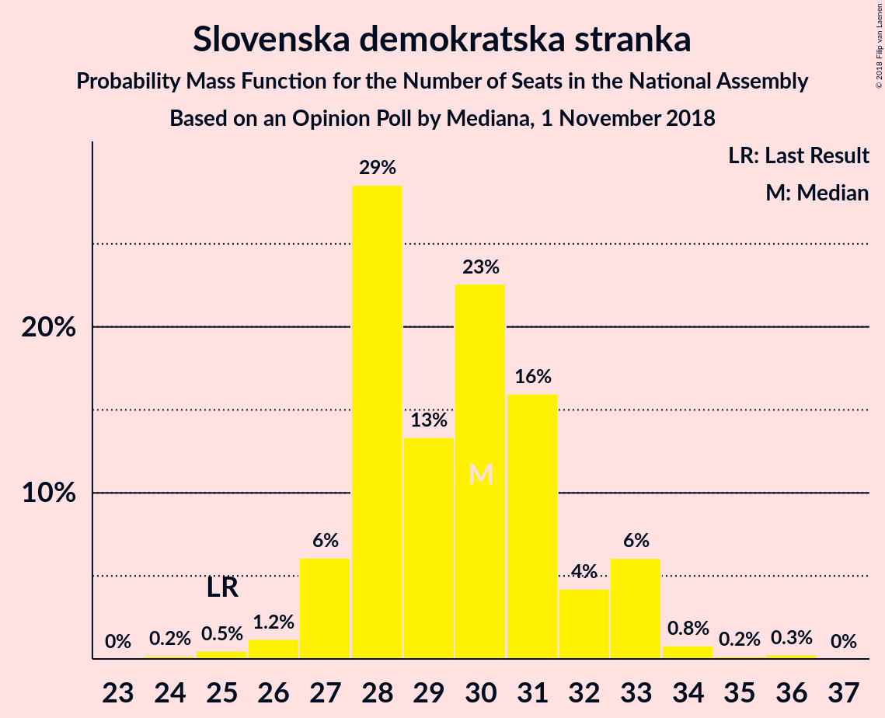
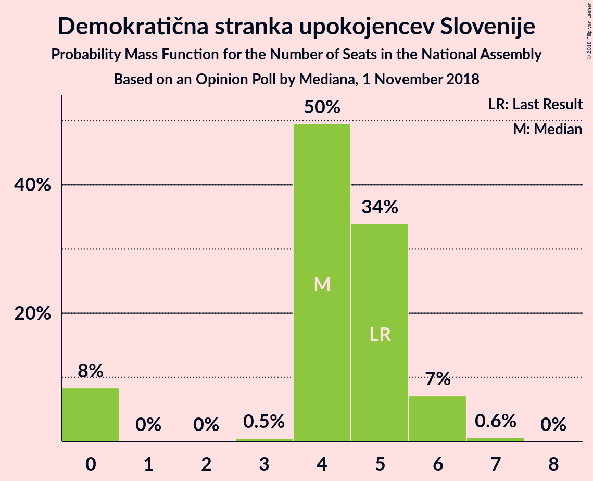

# Opinion Poll by Mediana, 1 November 2018

<a href="#voting-intentions">Voting Intentions</a> | <a href="#seats">Seats</a> | <a href="#coalitions">Coalitions</a> | <a href="#technical-information">Technical Information</a>

## Voting Intentions

### Confidence Intervals

| Party | Last Result | Poll Result | 80% Confidence Interval | 90% Confidence Interval | 95% Confidence Interval | 99% Confidence Interval |
|:-----:|:-----------:|:-----------:|:-----------------------:|:-----------------------:|:-----------------------:|:-----------------------:|
| Slovenska demokratska stranka | 24.9% | 31.0% | 28.9–33.3% |28.3–33.9% |27.8–34.5% |26.8–35.6% |
| Lista Marjana Šarca | 12.6% | 13.0% | 11.5–14.7% |11.1–15.2% |10.7–15.6% |10.0–16.5% |
| Socialni demokrati | 9.9% | 11.0% | 9.7–12.7% |9.3–13.1% |8.9–13.5% |8.3–14.3% |
| Levica | 9.3% | 10.1% | 8.8–11.6% |8.4–12.1% |8.1–12.5% |7.5–13.3% |
| Nova Slovenija–Krščanski demokrati | 7.2% | 8.0% | 6.8–9.4% |6.5–9.8% |6.2–10.2% |5.7–10.9% |
| Stranka modernega centra | 9.7% | 5.0% | 4.1–6.2% |3.8–6.5% |3.6–6.8% |3.2–7.4% |
| Stranka Alenke Bratušek | 5.1% | 5.0% | 4.1–6.2% |3.8–6.5% |3.6–6.8% |3.2–7.4% |
| Demokratična stranka upokojencev Slovenije | 4.9% | 5.0% | 4.1–6.2% |3.8–6.5% |3.6–6.8% |3.2–7.4% |
| Slovenska nacionalna stranka | 4.2% | 4.0% | 3.2–5.1% |3.0–5.4% |2.8–5.7% |2.5–6.3% |
| Slovenska ljudska stranka | 2.6% | 3.0% | 2.4–4.0% |2.2–4.3% |2.0–4.6% |1.7–5.1% |

*Note:* The poll result column reflects the actual value used in the calculations. Published results may vary slightly, and in addition be rounded to fewer digits.

## Seats

### Confidence Intervals

| Party | Last Result | Median | 80% Confidence Interval | 90% Confidence Interval | 95% Confidence Interval | 99% Confidence Interval |
|:-----:|:-----------:|:------:|:-----------------------:|:-----------------------:|:-----------------------:|:-----------------------:|
| <a href="#slovenska-demokratska-stranka">Slovenska demokratska stranka</a> | 25 | 30 | 28–32 |27–33 |27–33 |25–34 |
| <a href="#lista-marjana-šarca">Lista Marjana Šarca</a> | 13 | 12 | 11–14 |10–14 |10–15 |9–16 |
| <a href="#socialni-demokrati">Socialni demokrati</a> | 10 | 10 | 9–12 |8–12 |8–13 |8–13 |
| <a href="#levica">Levica</a> | 9 | 9 | 8–11 |8–11 |8–12 |7–12 |
| <a href="#nova-slovenija–krščanski-demokrati">Nova Slovenija–Krščanski demokrati</a> | 7 | 7 | 6–9 |6–9 |6–9 |5–10 |
| <a href="#stranka-modernega-centra">Stranka modernega centra</a> | 10 | 4 | 3–5 |0–6 |0–6 |0–7 |
| <a href="#stranka-alenke-bratušek">Stranka Alenke Bratušek</a> | 5 | 4 | 4–6 |0–6 |0–6 |0–7 |
| <a href="#demokratična-stranka-upokojencev-slovenije">Demokratična stranka upokojencev Slovenije</a> | 5 | 4 | 4–5 |0–6 |0–6 |0–7 |
| <a href="#slovenska-nacionalna-stranka">Slovenska nacionalna stranka</a> | 4 | 3 | 0–4 |0–5 |0–5 |0–5 |
| <a href="#slovenska-ljudska-stranka">Slovenska ljudska stranka</a> | 0 | 0 | 0–3 |0–4 |0–4 |0–4 |

### Slovenska demokratska stranka

*For a full overview of the results for this party, see the [Slovenska demokratska stranka](party-slovenskademokratskastranka.html) page.*

| Number of Seats | Probability | Accumulated | Special Marks |
|:---------------:|:-----------:|:-----------:|:-------------:|
| 24 | 0.2% | 100% |  |
| 25 | 0.5% | 99.8% | Last Result |
| 26 | 1.2% | 99.3% |  |
| 27 | 6% | 98% |  |
| 28 | 29% | 92% |  |
| 29 | 13% | 63% |  |
| 30 | 23% | 50% | Median |
| 31 | 16% | 28% |  |
| 32 | 4% | 12% |  |
| 33 | 6% | 7% |  |
| 34 | 0.8% | 1.3% |  |
| 35 | 0.2% | 0.5% |  |
| 36 | 0.3% | 0.3% |  |
| 37 | 0% | 0% |  |

### Lista Marjana Šarca

*For a full overview of the results for this party, see the [Lista Marjana Šarca](party-listamarjanašarca.html) page.*

| Number of Seats | Probability | Accumulated | Special Marks |
|:---------------:|:-----------:|:-----------:|:-------------:|
| 9 | 1.2% | 100% |  |
| 10 | 6% | 98.8% |  |
| 11 | 20% | 93% |  |
| 12 | 36% | 73% | Median |
| 13 | 16% | 37% | Last Result |
| 14 | 17% | 21% |  |
| 15 | 3% | 4% |  |
| 16 | 0.6% | 0.6% |  |
| 17 | 0% | 0% |  |

### Socialni demokrati

*For a full overview of the results for this party, see the [Socialni demokrati](party-socialnidemokrati.html) page.*

| Number of Seats | Probability | Accumulated | Special Marks |
|:---------------:|:-----------:|:-----------:|:-------------:|
| 7 | 0.2% | 100% |  |
| 8 | 5% | 99.8% |  |
| 9 | 12% | 94% |  |
| 10 | 35% | 82% | Last Result, Median |
| 11 | 36% | 48% |  |
| 12 | 7% | 11% |  |
| 13 | 4% | 4% |  |
| 14 | 0.3% | 0.3% |  |
| 15 | 0% | 0% |  |

### Levica

*For a full overview of the results for this party, see the [Levica](party-levica.html) page.*

| Number of Seats | Probability | Accumulated | Special Marks |
|:---------------:|:-----------:|:-----------:|:-------------:|
| 6 | 0.1% | 100% |  |
| 7 | 2% | 99.9% |  |
| 8 | 31% | 98% |  |
| 9 | 26% | 67% | Last Result, Median |
| 10 | 29% | 40% |  |
| 11 | 9% | 12% |  |
| 12 | 3% | 3% |  |
| 13 | 0.3% | 0.3% |  |
| 14 | 0% | 0% |  |

### Nova Slovenija–Krščanski demokrati

*For a full overview of the results for this party, see the [Nova Slovenija–Krščanski demokrati](party-novaslovenija–krščanskidemokrati.html) page.*

| Number of Seats | Probability | Accumulated | Special Marks |
|:---------------:|:-----------:|:-----------:|:-------------:|
| 5 | 1.0% | 100% |  |
| 6 | 18% | 99.0% |  |
| 7 | 44% | 81% | Last Result, Median |
| 8 | 23% | 37% |  |
| 9 | 12% | 14% |  |
| 10 | 2% | 2% |  |
| 11 | 0.2% | 0.2% |  |
| 12 | 0% | 0% |  |

### Stranka modernega centra

*For a full overview of the results for this party, see the [Stranka modernega centra](party-strankamodernegacentra.html) page.*

| Number of Seats | Probability | Accumulated | Special Marks |
|:---------------:|:-----------:|:-----------:|:-------------:|
| 0 | 9% | 100% |  |
| 1 | 0% | 91% |  |
| 2 | 0% | 91% |  |
| 3 | 7% | 91% |  |
| 4 | 37% | 84% | Median |
| 5 | 40% | 47% |  |
| 6 | 6% | 7% |  |
| 7 | 0.7% | 0.8% |  |
| 8 | 0% | 0% |  |
| 9 | 0% | 0% |  |
| 10 | 0% | 0% | Last Result |

### Stranka Alenke Bratušek

*For a full overview of the results for this party, see the [Stranka Alenke Bratušek](party-strankaalenkebratušek.html) page.*

| Number of Seats | Probability | Accumulated | Special Marks |
|:---------------:|:-----------:|:-----------:|:-------------:|
| 0 | 9% | 100% |  |
| 1 | 0% | 91% |  |
| 2 | 0% | 91% |  |
| 3 | 1.3% | 91% |  |
| 4 | 61% | 90% | Median |
| 5 | 18% | 29% | Last Result |
| 6 | 11% | 11% |  |
| 7 | 0.7% | 0.7% |  |
| 8 | 0% | 0% |  |

### Demokratična stranka upokojencev Slovenije

*For a full overview of the results for this party, see the [Demokratična stranka upokojencev Slovenije](party-demokratičnastrankaupokojencevslovenije.html) page.*

| Number of Seats | Probability | Accumulated | Special Marks |
|:---------------:|:-----------:|:-----------:|:-------------:|
| 0 | 8% | 100% |  |
| 1 | 0% | 92% |  |
| 2 | 0% | 92% |  |
| 3 | 0.5% | 92% |  |
| 4 | 50% | 91% | Median |
| 5 | 34% | 42% | Last Result |
| 6 | 7% | 8% |  |
| 7 | 0.6% | 0.6% |  |
| 8 | 0% | 0% |  |

### Slovenska nacionalna stranka

*For a full overview of the results for this party, see the [Slovenska nacionalna stranka](party-slovenskanacionalnastranka.html) page.*

| Number of Seats | Probability | Accumulated | Special Marks |
|:---------------:|:-----------:|:-----------:|:-------------:|
| 0 | 41% | 100% |  |
| 1 | 0% | 59% |  |
| 2 | 0% | 59% |  |
| 3 | 13% | 59% | Median |
| 4 | 41% | 47% | Last Result |
| 5 | 5% | 6% |  |
| 6 | 0.3% | 0.3% |  |
| 7 | 0% | 0% |  |

### Slovenska ljudska stranka

*For a full overview of the results for this party, see the [Slovenska ljudska stranka](party-slovenskaljudskastranka.html) page.*

| Number of Seats | Probability | Accumulated | Special Marks |
|:---------------:|:-----------:|:-----------:|:-------------:|
| 0 | 89% | 100% | Last Result, Median |
| 1 | 0% | 11% |  |
| 2 | 0% | 11% |  |
| 3 | 2% | 11% |  |
| 4 | 9% | 9% |  |
| 5 | 0.4% | 0.4% |  |
| 6 | 0% | 0% |  |

## Coalitions

### Confidence Intervals

| Coalition | Last Result | Median | Majority? | 80% Confidence Interval | 90% Confidence Interval | 95% Confidence Interval | 99% Confidence Interval |
|:---------:|:-----------:|:------:|:---------:|:-----------------------:|:-----------------------:|:-----------------------:|:-----------------------:|
| Slovenska demokratska stranka – Lista Marjana Šarca – Demokratična stranka upokojencev Slovenije | 43 | 46 | 65% | 44–48 | 43–50 | 43–50 | 40–52 |
| Slovenska demokratska stranka – Lista Marjana Šarca | 38 | 42 | 3% | 39–44 | 39–45 | 38–46 | 37–48 |
| Lista Marjana Šarca – Socialni demokrati – Nova Slovenija–Krščanski demokrati – Demokratična stranka upokojencev Slovenije – Stranka Alenke Bratušek – Stranka modernega centra | 50 | 42 | 7% | 40–45 | 38–46 | 37–46 | 35–48 |
| Lista Marjana Šarca – Socialni demokrati – Nova Slovenija–Krščanski demokrati – Demokratična stranka upokojencev Slovenije – Stranka modernega centra | 45 | 38 | 0.8% | 35–41 | 34–42 | 33–43 | 31–46 |
| Lista Marjana Šarca – Socialni demokrati – Demokratična stranka upokojencev Slovenije – Stranka Alenke Bratušek – Stranka modernega centra | 43 | 35 | 0% | 32–38 | 30–38 | 30–39 | 28–41 |
| Lista Marjana Šarca – Socialni demokrati – Nova Slovenija–Krščanski demokrati – Demokratična stranka upokojencev Slovenije | 35 | 34 | 0% | 31–37 | 30–38 | 29–38 | 28–41 |
| Lista Marjana Šarca – Socialni demokrati – Nova Slovenija–Krščanski demokrati – Stranka modernega centra | 40 | 34 | 0% | 31–37 | 30–37 | 29–38 | 28–41 |
| Lista Marjana Šarca – Socialni demokrati – Demokratična stranka upokojencev Slovenije – Stranka modernega centra | 38 | 31 | 0% | 28–34 | 26–35 | 26–35 | 24–37 |
| Lista Marjana Šarca – Socialni demokrati – Nova Slovenija–Krščanski demokrati | 30 | 30 | 0% | 28–32 | 27–33 | 26–34 | 25–36 |
| Lista Marjana Šarca – Socialni demokrati – Demokratična stranka upokojencev Slovenije | 28 | 27 | 0% | 24–29 | 23–30 | 22–31 | 20–32 |
| Lista Marjana Šarca – Socialni demokrati – Stranka modernega centra | 33 | 27 | 0% | 24–29 | 23–30 | 22–31 | 21–32 |
| Lista Marjana Šarca – Socialni demokrati | 23 | 23 | 0% | 21–25 | 20–26 | 19–26 | 18–27 |
| Socialni demokrati – Demokratična stranka upokojencev Slovenije – Stranka modernega centra | 25 | 19 | 0% | 15–21 | 14–22 | 13–23 | 12–23 |

### Slovenska demokratska stranka – Lista Marjana Šarca – Demokratična stranka upokojencev Slovenije

| Number of Seats | Probability | Accumulated | Special Marks |
|:---------------:|:-----------:|:-----------:|:-------------:|
| 37 | 0.1% | 100% |  |
| 38 | 0.1% | 99.9% |  |
| 39 | 0.2% | 99.9% |  |
| 40 | 0.3% | 99.6% |  |
| 41 | 0.4% | 99.4% |  |
| 42 | 1.3% | 98.9% |  |
| 43 | 6% | 98% | Last Result |
| 44 | 14% | 91% |  |
| 45 | 13% | 77% |  |
| 46 | 34% | 65% | Median, Majority |
| 47 | 14% | 30% |  |
| 48 | 7% | 17% |  |
| 49 | 4% | 10% |  |
| 50 | 4% | 6% |  |
| 51 | 1.3% | 2% |  |
| 52 | 0.3% | 0.7% |  |
| 53 | 0.2% | 0.4% |  |
| 54 | 0.2% | 0.2% |  |
| 55 | 0% | 0% |  |

### Slovenska demokratska stranka – Lista Marjana Šarca

| Number of Seats | Probability | Accumulated | Special Marks |
|:---------------:|:-----------:|:-----------:|:-------------:|
| 35 | 0.1% | 100% |  |
| 36 | 0.2% | 99.8% |  |
| 37 | 0.7% | 99.6% |  |
| 38 | 3% | 99.0% | Last Result |
| 39 | 6% | 96% |  |
| 40 | 13% | 90% |  |
| 41 | 17% | 77% |  |
| 42 | 32% | 60% | Median |
| 43 | 14% | 28% |  |
| 44 | 5% | 14% |  |
| 45 | 6% | 10% |  |
| 46 | 2% | 3% | Majority |
| 47 | 0.6% | 2% |  |
| 48 | 0.7% | 1.0% |  |
| 49 | 0.2% | 0.3% |  |
| 50 | 0% | 0.1% |  |
| 51 | 0% | 0% |  |

### Lista Marjana Šarca – Socialni demokrati – Nova Slovenija–Krščanski demokrati – Demokratična stranka upokojencev Slovenije – Stranka Alenke Bratušek – Stranka modernega centra

| Number of Seats | Probability | Accumulated | Special Marks |
|:---------------:|:-----------:|:-----------:|:-------------:|
| 34 | 0.1% | 100% |  |
| 35 | 0.5% | 99.9% |  |
| 36 | 1.0% | 99.4% |  |
| 37 | 2% | 98% |  |
| 38 | 4% | 97% |  |
| 39 | 2% | 93% |  |
| 40 | 6% | 91% |  |
| 41 | 8% | 84% | Median |
| 42 | 34% | 76% |  |
| 43 | 9% | 41% |  |
| 44 | 21% | 32% |  |
| 45 | 4% | 11% |  |
| 46 | 5% | 7% | Majority |
| 47 | 0.9% | 2% |  |
| 48 | 0.5% | 0.9% |  |
| 49 | 0.3% | 0.4% |  |
| 50 | 0.1% | 0.1% | Last Result |
| 51 | 0% | 0% |  |

### Lista Marjana Šarca – Socialni demokrati – Nova Slovenija–Krščanski demokrati – Demokratična stranka upokojencev Slovenije – Stranka modernega centra

| Number of Seats | Probability | Accumulated | Special Marks |
|:---------------:|:-----------:|:-----------:|:-------------:|
| 29 | 0% | 100% |  |
| 30 | 0.3% | 99.9% |  |
| 31 | 0.3% | 99.7% |  |
| 32 | 1.0% | 99.4% |  |
| 33 | 3% | 98% |  |
| 34 | 3% | 95% |  |
| 35 | 2% | 92% |  |
| 36 | 9% | 90% |  |
| 37 | 8% | 80% | Median |
| 38 | 34% | 73% |  |
| 39 | 7% | 39% |  |
| 40 | 18% | 32% |  |
| 41 | 5% | 13% |  |
| 42 | 6% | 8% |  |
| 43 | 1.0% | 3% |  |
| 44 | 0.8% | 2% |  |
| 45 | 0.1% | 0.9% | Last Result |
| 46 | 0.8% | 0.8% | Majority |
| 47 | 0% | 0% |  |

### Lista Marjana Šarca – Socialni demokrati – Demokratična stranka upokojencev Slovenije – Stranka Alenke Bratušek – Stranka modernega centra

| Number of Seats | Probability | Accumulated | Special Marks |
|:---------------:|:-----------:|:-----------:|:-------------:|
| 26 | 0.1% | 100% |  |
| 27 | 0.2% | 99.9% |  |
| 28 | 0.8% | 99.8% |  |
| 29 | 0.5% | 99.0% |  |
| 30 | 4% | 98% |  |
| 31 | 3% | 95% |  |
| 32 | 4% | 91% |  |
| 33 | 9% | 87% |  |
| 34 | 11% | 79% | Median |
| 35 | 27% | 67% |  |
| 36 | 15% | 40% |  |
| 37 | 15% | 25% |  |
| 38 | 6% | 10% |  |
| 39 | 2% | 4% |  |
| 40 | 2% | 2% |  |
| 41 | 0.3% | 0.5% |  |
| 42 | 0.1% | 0.2% |  |
| 43 | 0.1% | 0.1% | Last Result |
| 44 | 0% | 0% |  |

### Lista Marjana Šarca – Socialni demokrati – Nova Slovenija–Krščanski demokrati – Demokratična stranka upokojencev Slovenije

| Number of Seats | Probability | Accumulated | Special Marks |
|:---------------:|:-----------:|:-----------:|:-------------:|
| 27 | 0.4% | 100% |  |
| 28 | 1.1% | 99.5% |  |
| 29 | 2% | 98% |  |
| 30 | 2% | 96% |  |
| 31 | 6% | 95% |  |
| 32 | 7% | 89% |  |
| 33 | 16% | 82% | Median |
| 34 | 26% | 67% |  |
| 35 | 15% | 41% | Last Result |
| 36 | 15% | 27% |  |
| 37 | 7% | 12% |  |
| 38 | 3% | 5% |  |
| 39 | 1.0% | 2% |  |
| 40 | 0.3% | 1.2% |  |
| 41 | 0.8% | 0.9% |  |
| 42 | 0.1% | 0.1% |  |
| 43 | 0% | 0% |  |

### Lista Marjana Šarca – Socialni demokrati – Nova Slovenija–Krščanski demokrati – Stranka modernega centra

| Number of Seats | Probability | Accumulated | Special Marks |
|:---------------:|:-----------:|:-----------:|:-------------:|
| 26 | 0% | 100% |  |
| 27 | 0.3% | 99.9% |  |
| 28 | 0.3% | 99.7% |  |
| 29 | 2% | 99.3% |  |
| 30 | 3% | 97% |  |
| 31 | 7% | 94% |  |
| 32 | 6% | 88% |  |
| 33 | 18% | 81% | Median |
| 34 | 27% | 64% |  |
| 35 | 8% | 37% |  |
| 36 | 17% | 29% |  |
| 37 | 7% | 12% |  |
| 38 | 2% | 5% |  |
| 39 | 1.2% | 2% |  |
| 40 | 0.4% | 1.2% | Last Result |
| 41 | 0.8% | 0.9% |  |
| 42 | 0% | 0.1% |  |
| 43 | 0% | 0% |  |

### Lista Marjana Šarca – Socialni demokrati – Demokratična stranka upokojencev Slovenije – Stranka modernega centra

| Number of Seats | Probability | Accumulated | Special Marks |
|:---------------:|:-----------:|:-----------:|:-------------:|
| 22 | 0% | 100% |  |
| 23 | 0.3% | 99.9% |  |
| 24 | 0.6% | 99.6% |  |
| 25 | 2% | 99.1% |  |
| 26 | 3% | 98% |  |
| 27 | 4% | 95% |  |
| 28 | 7% | 91% |  |
| 29 | 8% | 84% |  |
| 30 | 7% | 76% | Median |
| 31 | 31% | 69% |  |
| 32 | 13% | 38% |  |
| 33 | 14% | 25% |  |
| 34 | 5% | 10% |  |
| 35 | 3% | 6% |  |
| 36 | 1.2% | 2% |  |
| 37 | 1.0% | 1.1% |  |
| 38 | 0.1% | 0.1% | Last Result |
| 39 | 0% | 0% |  |

### Lista Marjana Šarca – Socialni demokrati – Nova Slovenija–Krščanski demokrati

| Number of Seats | Probability | Accumulated | Special Marks |
|:---------------:|:-----------:|:-----------:|:-------------:|
| 24 | 0.3% | 100% |  |
| 25 | 0.6% | 99.7% |  |
| 26 | 3% | 99.1% |  |
| 27 | 5% | 96% |  |
| 28 | 10% | 91% |  |
| 29 | 20% | 81% | Median |
| 30 | 21% | 61% | Last Result |
| 31 | 19% | 40% |  |
| 32 | 14% | 21% |  |
| 33 | 3% | 7% |  |
| 34 | 2% | 3% |  |
| 35 | 0.6% | 2% |  |
| 36 | 0.9% | 1.0% |  |
| 37 | 0% | 0.1% |  |
| 38 | 0% | 0% |  |

### Lista Marjana Šarca – Socialni demokrati – Demokratična stranka upokojencev Slovenije

| Number of Seats | Probability | Accumulated | Special Marks |
|:---------------:|:-----------:|:-----------:|:-------------:|
| 20 | 0.7% | 100% |  |
| 21 | 1.4% | 99.3% |  |
| 22 | 2% | 98% |  |
| 23 | 3% | 96% |  |
| 24 | 4% | 93% |  |
| 25 | 10% | 89% |  |
| 26 | 14% | 79% | Median |
| 27 | 29% | 65% |  |
| 28 | 23% | 36% | Last Result |
| 29 | 3% | 13% |  |
| 30 | 7% | 10% |  |
| 31 | 1.5% | 3% |  |
| 32 | 1.4% | 2% |  |
| 33 | 0.1% | 0.2% |  |
| 34 | 0.1% | 0.1% |  |
| 35 | 0% | 0% |  |

### Lista Marjana Šarca – Socialni demokrati – Stranka modernega centra

| Number of Seats | Probability | Accumulated | Special Marks |
|:---------------:|:-----------:|:-----------:|:-------------:|
| 19 | 0% | 100% |  |
| 20 | 0.2% | 99.9% |  |
| 21 | 0.6% | 99.7% |  |
| 22 | 3% | 99.1% |  |
| 23 | 6% | 96% |  |
| 24 | 5% | 90% |  |
| 25 | 9% | 85% |  |
| 26 | 18% | 76% | Median |
| 27 | 24% | 59% |  |
| 28 | 12% | 35% |  |
| 29 | 13% | 22% |  |
| 30 | 5% | 9% |  |
| 31 | 2% | 4% |  |
| 32 | 1.1% | 1.3% |  |
| 33 | 0.2% | 0.2% | Last Result |
| 34 | 0% | 0% |  |

### Lista Marjana Šarca – Socialni demokrati

| Number of Seats | Probability | Accumulated | Special Marks |
|:---------------:|:-----------:|:-----------:|:-------------:|
| 17 | 0.1% | 100% |  |
| 18 | 1.0% | 99.9% |  |
| 19 | 4% | 99.0% |  |
| 20 | 3% | 95% |  |
| 21 | 17% | 92% |  |
| 22 | 16% | 75% | Median |
| 23 | 32% | 59% | Last Result |
| 24 | 15% | 27% |  |
| 25 | 7% | 12% |  |
| 26 | 3% | 5% |  |
| 27 | 1.4% | 2% |  |
| 28 | 0.3% | 0.4% |  |
| 29 | 0% | 0% |  |

### Socialni demokrati – Demokratična stranka upokojencev Slovenije – Stranka modernega centra

| Number of Seats | Probability | Accumulated | Special Marks |
|:---------------:|:-----------:|:-----------:|:-------------:|
| 10 | 0.1% | 100% |  |
| 11 | 0.1% | 99.9% |  |
| 12 | 0.4% | 99.8% |  |
| 13 | 2% | 99.4% |  |
| 14 | 4% | 97% |  |
| 15 | 4% | 93% |  |
| 16 | 6% | 90% |  |
| 17 | 4% | 84% |  |
| 18 | 18% | 80% | Median |
| 19 | 25% | 62% |  |
| 20 | 22% | 37% |  |
| 21 | 9% | 15% |  |
| 22 | 3% | 6% |  |
| 23 | 3% | 3% |  |
| 24 | 0.2% | 0.3% |  |
| 25 | 0.1% | 0.1% | Last Result |
| 26 | 0% | 0% |  |

## Technical Information

### Opinion Poll

+ **Polling firm:** Mediana
+ **Commissioner(s):** —
+ **Fieldwork period:** 1 November 2018

### Calculations

+ **Sample size:** 725
+ **Simulations done:** 1,048,576
+ **Error estimate:** 1.84%

