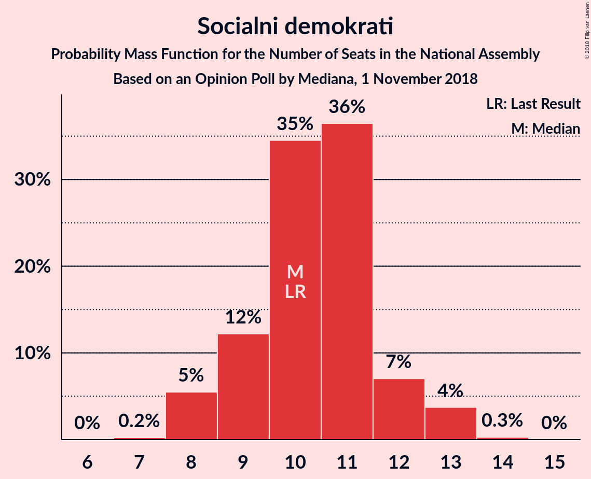

# Opinion Poll by Mediana, 1 November 2018

<a href="#voting-intentions">Voting Intentions</a> | <a href="#seats">Seats</a> | <a href="#coalitions">Coalitions</a> | <a href="#technical-information">Technical Information</a>

## Voting Intentions

### Confidence Intervals

| Party | Last Result | Poll Result | 80% Confidence Interval | 90% Confidence Interval | 95% Confidence Interval | 99% Confidence Interval |
|:-----:|:-----------:|:-----------:|:-----------------------:|:-----------------------:|:-----------------------:|:-----------------------:|
| Slovenska demokratska stranka | 24.9% | 31.0% | 28.9–33.3% |28.3–33.9% |27.8–34.5% |26.8–35.6% |
| Lista Marjana Šarca | 12.6% | 13.0% | 11.5–14.7% |11.1–15.2% |10.7–15.6% |10.0–16.5% |
| Socialni demokrati | 9.9% | 11.0% | 9.7–12.7% |9.3–13.1% |8.9–13.5% |8.3–14.3% |
| Levica | 9.3% | 10.1% | 8.8–11.6% |8.4–12.1% |8.1–12.5% |7.5–13.3% |
| Nova Slovenija–Krščanski demokrati | 7.2% | 8.0% | 6.8–9.4% |6.5–9.8% |6.2–10.2% |5.7–10.9% |
| Stranka modernega centra | 9.7% | 5.0% | 4.1–6.2% |3.8–6.5% |3.6–6.8% |3.2–7.4% |
| Stranka Alenke Bratušek | 5.1% | 5.0% | 4.1–6.2% |3.8–6.5% |3.6–6.8% |3.2–7.4% |
| Demokratična stranka upokojencev Slovenije | 4.9% | 5.0% | 4.1–6.2% |3.8–6.5% |3.6–6.8% |3.2–7.4% |
| Slovenska nacionalna stranka | 4.2% | 4.0% | 3.2–5.1% |3.0–5.4% |2.8–5.7% |2.5–6.3% |
| Slovenska ljudska stranka | 2.6% | 3.0% | 2.4–4.0% |2.2–4.3% |2.0–4.6% |1.7–5.1% |

*Note:* The poll result column reflects the actual value used in the calculations. Published results may vary slightly, and in addition be rounded to fewer digits.

## Seats

### Confidence Intervals

| Party | Last Result | Median | 80% Confidence Interval | 90% Confidence Interval | 95% Confidence Interval | 99% Confidence Interval |
|:-----:|:-----------:|:------:|:-----------------------:|:-----------------------:|:-----------------------:|:-----------------------:|
| <a href="#slovenska-demokratska-stranka">Slovenska demokratska stranka</a> | 25 | 28 | 28–31 |27–33 |27–33 |25–34 |
| <a href="#lista-marjana-šarca">Lista Marjana Šarca</a> | 13 | 12 | 11–14 |10–14 |10–15 |9–16 |
| <a href="#socialni-demokrati">Socialni demokrati</a> | 10 | 10 | 9–12 |8–13 |8–13 |8–13 |
| <a href="#levica">Levica</a> | 9 | 9 | 8–11 |8–11 |8–11 |7–12 |
| <a href="#nova-slovenija–krščanski-demokrati">Nova Slovenija–Krščanski demokrati</a> | 7 | 7 | 6–9 |6–9 |6–9 |5–10 |
| <a href="#stranka-modernega-centra">Stranka modernega centra</a> | 10 | 5 | 3–5 |0–6 |0–6 |0–7 |
| <a href="#stranka-alenke-bratušek">Stranka Alenke Bratušek</a> | 5 | 4 | 0–6 |0–6 |0–6 |0–7 |
| <a href="#demokratična-stranka-upokojencev-slovenije">Demokratična stranka upokojencev Slovenije</a> | 5 | 4 | 4–5 |0–5 |0–6 |0–7 |
| <a href="#slovenska-nacionalna-stranka">Slovenska nacionalna stranka</a> | 4 | 3 | 0–4 |0–4 |0–5 |0–5 |
| <a href="#slovenska-ljudska-stranka">Slovenska ljudska stranka</a> | 0 | 0 | 0–4 |0–4 |0–4 |0–4 |

### Slovenska demokratska stranka

*For a full overview of the results for this party, see the [Slovenska demokratska stranka](party-slovenskademokratskastranka.html) page.*

| Number of Seats | Probability | Accumulated | Special Marks |
|:---------------:|:-----------:|:-----------:|:-------------:|
| 24 | 0.3% | 100% |  |
| 25 | 0.3% | 99.7% | Last Result |
| 26 | 1.3% | 99.4% |  |
| 27 | 7% | 98% |  |
| 28 | 43% | 91% | Median |
| 29 | 10% | 49% |  |
| 30 | 12% | 39% |  |
| 31 | 19% | 27% |  |
| 32 | 3% | 8% |  |
| 33 | 4% | 6% |  |
| 34 | 1.2% | 2% |  |
| 35 | 0.2% | 0.4% |  |
| 36 | 0.2% | 0.2% |  |
| 37 | 0% | 0% |  |

### Lista Marjana Šarca

*For a full overview of the results for this party, see the [Lista Marjana Šarca](party-listamarjanašarca.html) page.*

| Number of Seats | Probability | Accumulated | Special Marks |
|:---------------:|:-----------:|:-----------:|:-------------:|
| 9 | 0.7% | 100% |  |
| 10 | 6% | 99.3% |  |
| 11 | 23% | 93% |  |
| 12 | 30% | 70% | Median |
| 13 | 11% | 39% | Last Result |
| 14 | 24% | 28% |  |
| 15 | 3% | 4% |  |
| 16 | 0.5% | 0.6% |  |
| 17 | 0% | 0% |  |

### Socialni demokrati

*For a full overview of the results for this party, see the [Socialni demokrati](party-socialnidemokrati.html) page.*

| Number of Seats | Probability | Accumulated | Special Marks |
|:---------------:|:-----------:|:-----------:|:-------------:|
| 7 | 0.3% | 100% |  |
| 8 | 6% | 99.7% |  |
| 9 | 9% | 94% |  |
| 10 | 47% | 85% | Last Result, Median |
| 11 | 24% | 37% |  |
| 12 | 7% | 13% |  |
| 13 | 6% | 6% |  |
| 14 | 0.3% | 0.4% |  |
| 15 | 0% | 0% |  |

### Levica

*For a full overview of the results for this party, see the [Levica](party-levica.html) page.*

| Number of Seats | Probability | Accumulated | Special Marks |
|:---------------:|:-----------:|:-----------:|:-------------:|
| 6 | 0.1% | 100% |  |
| 7 | 2% | 99.9% |  |
| 8 | 26% | 98% |  |
| 9 | 27% | 72% | Last Result, Median |
| 10 | 35% | 45% |  |
| 11 | 8% | 10% |  |
| 12 | 2% | 2% |  |
| 13 | 0.2% | 0.3% |  |
| 14 | 0% | 0% |  |

### Nova Slovenija–Krščanski demokrati

*For a full overview of the results for this party, see the [Nova Slovenija–Krščanski demokrati](party-novaslovenija–krščanskidemokrati.html) page.*

| Number of Seats | Probability | Accumulated | Special Marks |
|:---------------:|:-----------:|:-----------:|:-------------:|
| 5 | 0.7% | 100% |  |
| 6 | 22% | 99.2% |  |
| 7 | 42% | 78% | Last Result, Median |
| 8 | 22% | 36% |  |
| 9 | 12% | 14% |  |
| 10 | 1.3% | 2% |  |
| 11 | 0.3% | 0.3% |  |
| 12 | 0% | 0% |  |

### Stranka modernega centra

*For a full overview of the results for this party, see the [Stranka modernega centra](party-strankamodernegacentra.html) page.*

| Number of Seats | Probability | Accumulated | Special Marks |
|:---------------:|:-----------:|:-----------:|:-------------:|
| 0 | 8% | 100% |  |
| 1 | 0% | 92% |  |
| 2 | 0% | 92% |  |
| 3 | 6% | 92% |  |
| 4 | 23% | 86% |  |
| 5 | 54% | 63% | Median |
| 6 | 8% | 9% |  |
| 7 | 1.0% | 1.1% |  |
| 8 | 0% | 0% |  |
| 9 | 0% | 0% |  |
| 10 | 0% | 0% | Last Result |

### Stranka Alenke Bratušek

*For a full overview of the results for this party, see the [Stranka Alenke Bratušek](party-strankaalenkebratušek.html) page.*

| Number of Seats | Probability | Accumulated | Special Marks |
|:---------------:|:-----------:|:-----------:|:-------------:|
| 0 | 10% | 100% |  |
| 1 | 0% | 90% |  |
| 2 | 0% | 90% |  |
| 3 | 0.8% | 90% |  |
| 4 | 62% | 89% | Median |
| 5 | 16% | 27% | Last Result |
| 6 | 10% | 11% |  |
| 7 | 0.9% | 0.9% |  |
| 8 | 0% | 0% |  |

### Demokratična stranka upokojencev Slovenije

*For a full overview of the results for this party, see the [Demokratična stranka upokojencev Slovenije](party-demokratičnastrankaupokojencevslovenije.html) page.*

| Number of Seats | Probability | Accumulated | Special Marks |
|:---------------:|:-----------:|:-----------:|:-------------:|
| 0 | 9% | 100% |  |
| 1 | 0% | 91% |  |
| 2 | 0% | 91% |  |
| 3 | 0.6% | 91% |  |
| 4 | 53% | 90% | Median |
| 5 | 34% | 38% | Last Result |
| 6 | 3% | 4% |  |
| 7 | 0.9% | 0.9% |  |
| 8 | 0% | 0% |  |

### Slovenska nacionalna stranka

*For a full overview of the results for this party, see the [Slovenska nacionalna stranka](party-slovenskanacionalnastranka.html) page.*

| Number of Seats | Probability | Accumulated | Special Marks |
|:---------------:|:-----------:|:-----------:|:-------------:|
| 0 | 40% | 100% |  |
| 1 | 0% | 60% |  |
| 2 | 0% | 60% |  |
| 3 | 21% | 60% | Median |
| 4 | 35% | 40% | Last Result |
| 5 | 5% | 5% |  |
| 6 | 0.3% | 0.3% |  |
| 7 | 0% | 0% |  |

### Slovenska ljudska stranka

*For a full overview of the results for this party, see the [Slovenska ljudska stranka](party-slovenskaljudskastranka.html) page.*

| Number of Seats | Probability | Accumulated | Special Marks |
|:---------------:|:-----------:|:-----------:|:-------------:|
| 0 | 86% | 100% | Last Result, Median |
| 1 | 0% | 14% |  |
| 2 | 0% | 14% |  |
| 3 | 3% | 14% |  |
| 4 | 11% | 11% |  |
| 5 | 0.4% | 0.4% |  |
| 6 | 0% | 0% |  |

## Coalitions

### Confidence Intervals

| Coalition | Last Result | Median | Majority? | 80% Confidence Interval | 90% Confidence Interval | 95% Confidence Interval | 99% Confidence Interval |
|:---------:|:-----------:|:------:|:---------:|:-----------------------:|:-----------------------:|:-----------------------:|:-----------------------:|
| Slovenska demokratska stranka – Lista Marjana Šarca – Demokratična stranka upokojencev Slovenije | 43 | 46 | 61% | 43–48 | 43–48 | 42–49 | 40–52 |
| Slovenska demokratska stranka – Lista Marjana Šarca | 38 | 42 | 3% | 39–43 | 39–45 | 38–46 | 37–48 |
| Lista Marjana Šarca – Socialni demokrati – Nova Slovenija–Krščanski demokrati – Demokratična stranka upokojencev Slovenije – Stranka Alenke Bratušek – Stranka modernega centra | 50 | 42 | 6% | 40–44 | 38–46 | 37–46 | 35–48 |
| Lista Marjana Šarca – Socialni demokrati – Nova Slovenija–Krščanski demokrati – Demokratična stranka upokojencev Slovenije – Stranka modernega centra | 45 | 38 | 0.1% | 35–41 | 33–42 | 33–42 | 31–44 |
| Lista Marjana Šarca – Socialni demokrati – Demokratična stranka upokojencev Slovenije – Stranka Alenke Bratušek – Stranka modernega centra | 43 | 35 | 0% | 32–38 | 30–38 | 30–40 | 28–40 |
| Lista Marjana Šarca – Socialni demokrati – Nova Slovenija–Krščanski demokrati – Demokratična stranka upokojencev Slovenije | 35 | 34 | 0% | 31–37 | 30–37 | 29–38 | 28–40 |
| Lista Marjana Šarca – Socialni demokrati – Nova Slovenija–Krščanski demokrati – Stranka modernega centra | 40 | 34 | 0% | 31–37 | 30–38 | 29–38 | 27–39 |
| Lista Marjana Šarca – Socialni demokrati – Demokratična stranka upokojencev Slovenije – Stranka modernega centra | 38 | 32 | 0% | 27–34 | 26–35 | 25–35 | 23–36 |
| Lista Marjana Šarca – Socialni demokrati – Nova Slovenija–Krščanski demokrati | 30 | 30 | 0% | 28–32 | 27–33 | 26–34 | 25–35 |
| Lista Marjana Šarca – Socialni demokrati – Stranka modernega centra | 33 | 27 | 0% | 24–30 | 23–30 | 22–31 | 21–32 |
| Lista Marjana Šarca – Socialni demokrati – Demokratična stranka upokojencev Slovenije | 28 | 27 | 0% | 24–29 | 23–30 | 21–31 | 20–32 |
| Lista Marjana Šarca – Socialni demokrati | 23 | 23 | 0% | 21–25 | 19–25 | 19–26 | 18–27 |
| Socialni demokrati – Demokratična stranka upokojencev Slovenije – Stranka modernega centra | 25 | 19 | 0% | 15–21 | 14–23 | 13–23 | 12–23 |

### Slovenska demokratska stranka – Lista Marjana Šarca – Demokratična stranka upokojencev Slovenije

| Number of Seats | Probability | Accumulated | Special Marks |
|:---------------:|:-----------:|:-----------:|:-------------:|
| 37 | 0.1% | 100% |  |
| 38 | 0.1% | 99.9% |  |
| 39 | 0.1% | 99.9% |  |
| 40 | 0.3% | 99.8% |  |
| 41 | 0.2% | 99.5% |  |
| 42 | 2% | 99.2% |  |
| 43 | 9% | 97% | Last Result |
| 44 | 20% | 88% | Median |
| 45 | 7% | 68% |  |
| 46 | 36% | 61% | Majority |
| 47 | 13% | 25% |  |
| 48 | 8% | 12% |  |
| 49 | 2% | 5% |  |
| 50 | 0.7% | 2% |  |
| 51 | 0.7% | 1.4% |  |
| 52 | 0.2% | 0.6% |  |
| 53 | 0.3% | 0.5% |  |
| 54 | 0.1% | 0.1% |  |
| 55 | 0% | 0% |  |

### Slovenska demokratska stranka – Lista Marjana Šarca

| Number of Seats | Probability | Accumulated | Special Marks |
|:---------------:|:-----------:|:-----------:|:-------------:|
| 35 | 0.1% | 100% |  |
| 36 | 0.2% | 99.9% |  |
| 37 | 0.7% | 99.7% |  |
| 38 | 4% | 99.0% | Last Result |
| 39 | 10% | 95% |  |
| 40 | 16% | 86% | Median |
| 41 | 10% | 69% |  |
| 42 | 36% | 60% |  |
| 43 | 15% | 23% |  |
| 44 | 3% | 9% |  |
| 45 | 3% | 6% |  |
| 46 | 1.2% | 3% | Majority |
| 47 | 0.8% | 2% |  |
| 48 | 1.0% | 1.2% |  |
| 49 | 0.2% | 0.2% |  |
| 50 | 0.1% | 0.1% |  |
| 51 | 0% | 0% |  |

### Lista Marjana Šarca – Socialni demokrati – Nova Slovenija–Krščanski demokrati – Demokratična stranka upokojencev Slovenije – Stranka Alenke Bratušek – Stranka modernega centra

| Number of Seats | Probability | Accumulated | Special Marks |
|:---------------:|:-----------:|:-----------:|:-------------:|
| 34 | 0.1% | 100% |  |
| 35 | 0.6% | 99.9% |  |
| 36 | 2% | 99.3% |  |
| 37 | 1.4% | 98% |  |
| 38 | 5% | 96% |  |
| 39 | 1.5% | 92% |  |
| 40 | 6% | 90% |  |
| 41 | 6% | 84% |  |
| 42 | 33% | 78% | Median |
| 43 | 10% | 45% |  |
| 44 | 26% | 35% |  |
| 45 | 3% | 9% |  |
| 46 | 4% | 6% | Majority |
| 47 | 1.4% | 2% |  |
| 48 | 0.5% | 0.9% |  |
| 49 | 0.3% | 0.4% |  |
| 50 | 0% | 0.1% | Last Result |
| 51 | 0% | 0% |  |

### Lista Marjana Šarca – Socialni demokrati – Nova Slovenija–Krščanski demokrati – Demokratična stranka upokojencev Slovenije – Stranka modernega centra

| Number of Seats | Probability | Accumulated | Special Marks |
|:---------------:|:-----------:|:-----------:|:-------------:|
| 30 | 0.5% | 100% |  |
| 31 | 0.3% | 99.5% |  |
| 32 | 1.3% | 99.2% |  |
| 33 | 3% | 98% |  |
| 34 | 4% | 95% |  |
| 35 | 2% | 91% |  |
| 36 | 5% | 89% |  |
| 37 | 6% | 84% |  |
| 38 | 34% | 78% | Median |
| 39 | 10% | 45% |  |
| 40 | 21% | 35% |  |
| 41 | 3% | 13% |  |
| 42 | 8% | 10% |  |
| 43 | 1.3% | 2% |  |
| 44 | 0.4% | 0.6% |  |
| 45 | 0.1% | 0.2% | Last Result |
| 46 | 0% | 0.1% | Majority |
| 47 | 0% | 0% |  |

### Lista Marjana Šarca – Socialni demokrati – Demokratična stranka upokojencev Slovenije – Stranka Alenke Bratušek – Stranka modernega centra

| Number of Seats | Probability | Accumulated | Special Marks |
|:---------------:|:-----------:|:-----------:|:-------------:|
| 26 | 0.1% | 100% |  |
| 27 | 0.2% | 99.9% |  |
| 28 | 1.4% | 99.7% |  |
| 29 | 0.3% | 98% |  |
| 30 | 5% | 98% |  |
| 31 | 2% | 93% |  |
| 32 | 6% | 91% |  |
| 33 | 10% | 85% |  |
| 34 | 7% | 75% |  |
| 35 | 19% | 67% | Median |
| 36 | 16% | 49% |  |
| 37 | 20% | 32% |  |
| 38 | 8% | 12% |  |
| 39 | 2% | 4% |  |
| 40 | 2% | 3% |  |
| 41 | 0.1% | 0.3% |  |
| 42 | 0.2% | 0.2% |  |
| 43 | 0% | 0% | Last Result |

### Lista Marjana Šarca – Socialni demokrati – Nova Slovenija–Krščanski demokrati – Demokratična stranka upokojencev Slovenije

| Number of Seats | Probability | Accumulated | Special Marks |
|:---------------:|:-----------:|:-----------:|:-------------:|
| 27 | 0.2% | 100% |  |
| 28 | 1.5% | 99.7% |  |
| 29 | 2% | 98% |  |
| 30 | 2% | 96% |  |
| 31 | 5% | 95% |  |
| 32 | 6% | 90% |  |
| 33 | 21% | 84% | Median |
| 34 | 21% | 63% |  |
| 35 | 22% | 42% | Last Result |
| 36 | 9% | 20% |  |
| 37 | 6% | 11% |  |
| 38 | 3% | 4% |  |
| 39 | 0.7% | 1.2% |  |
| 40 | 0.4% | 0.5% |  |
| 41 | 0% | 0.1% |  |
| 42 | 0.1% | 0.1% |  |
| 43 | 0% | 0% |  |

### Lista Marjana Šarca – Socialni demokrati – Nova Slovenija–Krščanski demokrati – Stranka modernega centra

| Number of Seats | Probability | Accumulated | Special Marks |
|:---------------:|:-----------:|:-----------:|:-------------:|
| 26 | 0.1% | 100% |  |
| 27 | 0.5% | 99.9% |  |
| 28 | 0.5% | 99.4% |  |
| 29 | 1.5% | 98.9% |  |
| 30 | 4% | 97% |  |
| 31 | 4% | 93% |  |
| 32 | 5% | 90% |  |
| 33 | 17% | 85% |  |
| 34 | 26% | 68% | Median |
| 35 | 6% | 42% |  |
| 36 | 23% | 37% |  |
| 37 | 9% | 14% |  |
| 38 | 4% | 5% |  |
| 39 | 1.3% | 2% |  |
| 40 | 0.3% | 0.4% | Last Result |
| 41 | 0.1% | 0.1% |  |
| 42 | 0.1% | 0.1% |  |
| 43 | 0% | 0% |  |

### Lista Marjana Šarca – Socialni demokrati – Demokratična stranka upokojencev Slovenije – Stranka modernega centra

| Number of Seats | Probability | Accumulated | Special Marks |
|:---------------:|:-----------:|:-----------:|:-------------:|
| 22 | 0.1% | 100% |  |
| 23 | 0.5% | 99.9% |  |
| 24 | 1.0% | 99.4% |  |
| 25 | 2% | 98% |  |
| 26 | 3% | 96% |  |
| 27 | 3% | 93% |  |
| 28 | 4% | 90% |  |
| 29 | 12% | 86% |  |
| 30 | 5% | 75% |  |
| 31 | 18% | 70% | Median |
| 32 | 21% | 51% |  |
| 33 | 19% | 31% |  |
| 34 | 4% | 11% |  |
| 35 | 6% | 8% |  |
| 36 | 1.0% | 1.3% |  |
| 37 | 0.3% | 0.4% |  |
| 38 | 0.1% | 0.1% | Last Result |
| 39 | 0% | 0% |  |

### Lista Marjana Šarca – Socialni demokrati – Nova Slovenija–Krščanski demokrati

| Number of Seats | Probability | Accumulated | Special Marks |
|:---------------:|:-----------:|:-----------:|:-------------:|
| 24 | 0.4% | 100% |  |
| 25 | 0.6% | 99.6% |  |
| 26 | 3% | 99.0% |  |
| 27 | 4% | 96% |  |
| 28 | 12% | 93% |  |
| 29 | 21% | 80% | Median |
| 30 | 16% | 59% | Last Result |
| 31 | 27% | 43% |  |
| 32 | 10% | 16% |  |
| 33 | 4% | 7% |  |
| 34 | 2% | 3% |  |
| 35 | 0.7% | 1.0% |  |
| 36 | 0.1% | 0.2% |  |
| 37 | 0.1% | 0.1% |  |
| 38 | 0% | 0% |  |

### Lista Marjana Šarca – Socialni demokrati – Stranka modernega centra

| Number of Seats | Probability | Accumulated | Special Marks |
|:---------------:|:-----------:|:-----------:|:-------------:|
| 19 | 0.1% | 100% |  |
| 20 | 0.3% | 99.9% |  |
| 21 | 0.5% | 99.6% |  |
| 22 | 4% | 99.1% |  |
| 23 | 3% | 96% |  |
| 24 | 6% | 92% |  |
| 25 | 11% | 86% |  |
| 26 | 15% | 75% |  |
| 27 | 12% | 60% | Median |
| 28 | 16% | 48% |  |
| 29 | 20% | 32% |  |
| 30 | 9% | 12% |  |
| 31 | 3% | 3% |  |
| 32 | 0.4% | 0.6% |  |
| 33 | 0.2% | 0.2% | Last Result |
| 34 | 0% | 0% |  |

### Lista Marjana Šarca – Socialni demokrati – Demokratična stranka upokojencev Slovenije

| Number of Seats | Probability | Accumulated | Special Marks |
|:---------------:|:-----------:|:-----------:|:-------------:|
| 20 | 1.2% | 100% |  |
| 21 | 2% | 98.8% |  |
| 22 | 1.0% | 97% |  |
| 23 | 3% | 96% |  |
| 24 | 4% | 93% |  |
| 25 | 14% | 89% |  |
| 26 | 15% | 75% | Median |
| 27 | 17% | 60% |  |
| 28 | 33% | 43% | Last Result |
| 29 | 1.0% | 11% |  |
| 30 | 7% | 10% |  |
| 31 | 2% | 3% |  |
| 32 | 0.9% | 1.0% |  |
| 33 | 0.1% | 0.1% |  |
| 34 | 0% | 0% |  |

### Lista Marjana Šarca – Socialni demokrati

| Number of Seats | Probability | Accumulated | Special Marks |
|:---------------:|:-----------:|:-----------:|:-------------:|
| 17 | 0% | 100% |  |
| 18 | 0.5% | 99.9% |  |
| 19 | 4% | 99.4% |  |
| 20 | 5% | 95% |  |
| 21 | 20% | 90% |  |
| 22 | 10% | 70% | Median |
| 23 | 26% | 60% | Last Result |
| 24 | 21% | 34% |  |
| 25 | 8% | 13% |  |
| 26 | 3% | 5% |  |
| 27 | 1.1% | 2% |  |
| 28 | 0.4% | 0.4% |  |
| 29 | 0% | 0% |  |

### Socialni demokrati – Demokratična stranka upokojencev Slovenije – Stranka modernega centra

| Number of Seats | Probability | Accumulated | Special Marks |
|:---------------:|:-----------:|:-----------:|:-------------:|
| 10 | 0.1% | 100% |  |
| 11 | 0.1% | 99.9% |  |
| 12 | 0.5% | 99.7% |  |
| 13 | 3% | 99.2% |  |
| 14 | 5% | 97% |  |
| 15 | 2% | 91% |  |
| 16 | 3% | 89% |  |
| 17 | 5% | 86% |  |
| 18 | 17% | 81% |  |
| 19 | 22% | 64% | Median |
| 20 | 28% | 42% |  |
| 21 | 7% | 14% |  |
| 22 | 3% | 8% |  |
| 23 | 5% | 5% |  |
| 24 | 0.2% | 0.4% |  |
| 25 | 0.1% | 0.1% | Last Result |
| 26 | 0% | 0% |  |

## Technical Information

### Opinion Poll

+ **Polling firm:** Mediana
+ **Commissioner(s):** —
+ **Fieldwork period:** 1 November 2018

### Calculations

+ **Sample size:** 725
+ **Simulations done:** 524,288
+ **Error estimate:** 2.56%

