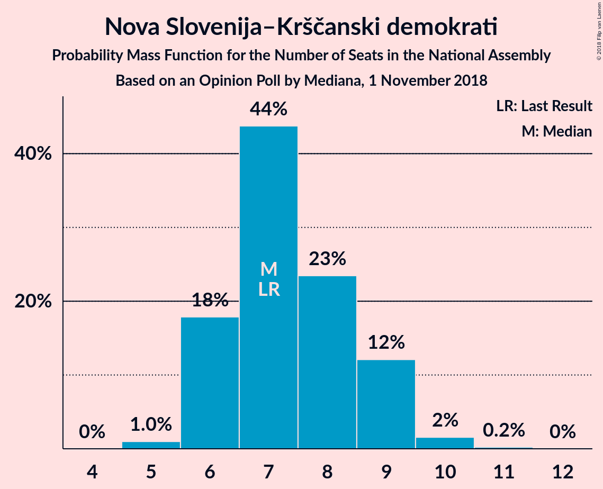

# Opinion Poll by Mediana, 1 November 2018

<a href="#voting-intentions">Voting Intentions</a> | <a href="#seats">Seats</a> | <a href="#coalitions">Coalitions</a> | <a href="#technical-information">Technical Information</a>

## Voting Intentions

### Confidence Intervals

| Party | Last Result | Poll Result | 80% Confidence Interval | 90% Confidence Interval | 95% Confidence Interval | 99% Confidence Interval |
|:-----:|:-----------:|:-----------:|:-----------------------:|:-----------------------:|:-----------------------:|:-----------------------:|
| Slovenska demokratska stranka | 24.9% | 31.0% | 28.9–33.3% |28.3–33.9% |27.8–34.5% |26.8–35.6% |
| Lista Marjana Šarca | 12.6% | 13.0% | 11.5–14.7% |11.1–15.2% |10.7–15.6% |10.0–16.5% |
| Socialni demokrati | 9.9% | 11.0% | 9.7–12.7% |9.3–13.1% |8.9–13.5% |8.3–14.3% |
| Levica | 9.3% | 10.1% | 8.8–11.6% |8.4–12.1% |8.1–12.5% |7.5–13.3% |
| Nova Slovenija–Krščanski demokrati | 7.2% | 8.0% | 6.8–9.4% |6.5–9.8% |6.2–10.2% |5.7–10.9% |
| Stranka modernega centra | 9.7% | 5.0% | 4.1–6.2% |3.8–6.5% |3.6–6.8% |3.2–7.4% |
| Stranka Alenke Bratušek | 5.1% | 5.0% | 4.1–6.2% |3.8–6.5% |3.6–6.8% |3.2–7.4% |
| Demokratična stranka upokojencev Slovenije | 4.9% | 5.0% | 4.1–6.2% |3.8–6.5% |3.6–6.8% |3.2–7.4% |
| Slovenska nacionalna stranka | 4.2% | 4.0% | 3.2–5.1% |3.0–5.4% |2.8–5.7% |2.5–6.3% |
| Slovenska ljudska stranka | 2.6% | 3.0% | 2.4–4.0% |2.2–4.3% |2.0–4.6% |1.7–5.1% |

*Note:* The poll result column reflects the actual value used in the calculations. Published results may vary slightly, and in addition be rounded to fewer digits.

## Seats

### Confidence Intervals

| Party | Last Result | Median | 80% Confidence Interval | 90% Confidence Interval | 95% Confidence Interval | 99% Confidence Interval |
|:-----:|:-----------:|:------:|:-----------------------:|:-----------------------:|:-----------------------:|:-----------------------:|
| <a href="#slovenska-demokratska-stranka">Slovenska demokratska stranka</a> | 25 | 32 | 27–35 |27–35 |27–35 |26–35 |
| <a href="#lista-marjana-šarca">Lista Marjana Šarca</a> | 13 | 13 | 9–16 |9–16 |9–16 |9–16 |
| <a href="#socialni-demokrati">Socialni demokrati</a> | 10 | 10 | 8–12 |8–12 |7–12 |7–12 |
| <a href="#levica">Levica</a> | 9 | 11 | 7–12 |7–12 |7–12 |7–12 |
| <a href="#nova-slovenija–krščanski-demokrati">Nova Slovenija–Krščanski demokrati</a> | 7 | 7 | 6–9 |6–9 |6–9 |5–9 |
| <a href="#stranka-modernega-centra">Stranka modernega centra</a> | 10 | 5 | 0–6 |0–6 |0–6 |0–6 |
| <a href="#stranka-alenke-bratušek">Stranka Alenke Bratušek</a> | 5 | 0 | 0–8 |0–8 |0–8 |0–8 |
| <a href="#demokratična-stranka-upokojencev-slovenije">Demokratična stranka upokojencev Slovenije</a> | 5 | 4 | 0–6 |0–6 |0–6 |0–6 |
| <a href="#slovenska-nacionalna-stranka">Slovenska nacionalna stranka</a> | 4 | 0 | 0–4 |0–4 |0–4 |0–5 |
| <a href="#slovenska-ljudska-stranka">Slovenska ljudska stranka</a> | 0 | 0 | 0–4 |0–4 |0–5 |0–5 |

### Slovenska demokratska stranka

*For a full overview of the results for this party, see the [Slovenska demokratska stranka](party-slovenskademokratskastranka.html) page.*

| Number of Seats | Probability | Accumulated | Special Marks |
|:---------------:|:-----------:|:-----------:|:-------------:|
| 25 | 0.1% | 100% | Last Result |
| 26 | 0.5% | 99.9% |  |
| 27 | 11% | 99.4% |  |
| 28 | 0.3% | 89% |  |
| 29 | 0.1% | 88% |  |
| 30 | 3% | 88% |  |
| 31 | 18% | 85% |  |
| 32 | 48% | 67% | Median |
| 33 | 3% | 20% |  |
| 34 | 0.1% | 16% |  |
| 35 | 16% | 16% |  |
| 36 | 0% | 0% |  |

### Lista Marjana Šarca

*For a full overview of the results for this party, see the [Lista Marjana Šarca](party-listamarjanašarca.html) page.*

| Number of Seats | Probability | Accumulated | Special Marks |
|:---------------:|:-----------:|:-----------:|:-------------:|
| 8 | 0.4% | 100% |  |
| 9 | 15% | 99.6% |  |
| 10 | 0.2% | 84% |  |
| 11 | 33% | 84% |  |
| 12 | 0.5% | 52% |  |
| 13 | 17% | 51% | Last Result, Median |
| 14 | 4% | 34% |  |
| 15 | 3% | 30% |  |
| 16 | 28% | 28% |  |
| 17 | 0% | 0% |  |

### Socialni demokrati

*For a full overview of the results for this party, see the [Socialni demokrati](party-socialnidemokrati.html) page.*

| Number of Seats | Probability | Accumulated | Special Marks |
|:---------------:|:-----------:|:-----------:|:-------------:|
| 6 | 0.4% | 100% |  |
| 7 | 3% | 99.6% |  |
| 8 | 17% | 97% |  |
| 9 | 0.6% | 80% |  |
| 10 | 35% | 80% | Last Result, Median |
| 11 | 33% | 45% |  |
| 12 | 12% | 12% |  |
| 13 | 0% | 0.1% |  |
| 14 | 0% | 0.1% |  |
| 15 | 0% | 0.1% |  |
| 16 | 0.1% | 0.1% |  |
| 17 | 0% | 0% |  |

### Levica

*For a full overview of the results for this party, see the [Levica](party-levica.html) page.*

| Number of Seats | Probability | Accumulated | Special Marks |
|:---------------:|:-----------:|:-----------:|:-------------:|
| 7 | 17% | 100% |  |
| 8 | 22% | 83% |  |
| 9 | 0.2% | 61% | Last Result |
| 10 | 2% | 61% |  |
| 11 | 28% | 59% | Median |
| 12 | 31% | 31% |  |
| 13 | 0.2% | 0.2% |  |
| 14 | 0% | 0% |  |

### Nova Slovenija–Krščanski demokrati

*For a full overview of the results for this party, see the [Nova Slovenija–Krščanski demokrati](party-novaslovenija–krščanskidemokrati.html) page.*

| Number of Seats | Probability | Accumulated | Special Marks |
|:---------------:|:-----------:|:-----------:|:-------------:|
| 5 | 0.6% | 100% |  |
| 6 | 48% | 99.4% |  |
| 7 | 14% | 51% | Last Result, Median |
| 8 | 2% | 38% |  |
| 9 | 36% | 36% |  |
| 10 | 0% | 0.2% |  |
| 11 | 0.1% | 0.2% |  |
| 12 | 0% | 0% |  |

### Stranka modernega centra

*For a full overview of the results for this party, see the [Stranka modernega centra](party-strankamodernegacentra.html) page.*

| Number of Seats | Probability | Accumulated | Special Marks |
|:---------------:|:-----------:|:-----------:|:-------------:|
| 0 | 46% | 100% |  |
| 1 | 0% | 54% |  |
| 2 | 0% | 54% |  |
| 3 | 0.2% | 54% |  |
| 4 | 2% | 54% |  |
| 5 | 35% | 52% | Median |
| 6 | 17% | 17% |  |
| 7 | 0% | 0% |  |
| 8 | 0% | 0% |  |
| 9 | 0% | 0% |  |
| 10 | 0% | 0% | Last Result |

### Stranka Alenke Bratušek

*For a full overview of the results for this party, see the [Stranka Alenke Bratušek](party-strankaalenkebratušek.html) page.*

| Number of Seats | Probability | Accumulated | Special Marks |
|:---------------:|:-----------:|:-----------:|:-------------:|
| 0 | 52% | 100% | Median |
| 1 | 0% | 48% |  |
| 2 | 0% | 48% |  |
| 3 | 0.1% | 48% |  |
| 4 | 0.6% | 47% |  |
| 5 | 15% | 47% | Last Result |
| 6 | 0% | 32% |  |
| 7 | 15% | 32% |  |
| 8 | 17% | 17% |  |
| 9 | 0% | 0% |  |

### Demokratična stranka upokojencev Slovenije

*For a full overview of the results for this party, see the [Demokratična stranka upokojencev Slovenije](party-demokratičnastrankaupokojencevslovenije.html) page.*

| Number of Seats | Probability | Accumulated | Special Marks |
|:---------------:|:-----------:|:-----------:|:-------------:|
| 0 | 17% | 100% |  |
| 1 | 0% | 83% |  |
| 2 | 0% | 83% |  |
| 3 | 0% | 83% |  |
| 4 | 50% | 83% | Median |
| 5 | 22% | 33% | Last Result |
| 6 | 11% | 11% |  |
| 7 | 0% | 0.2% |  |
| 8 | 0.2% | 0.2% |  |
| 9 | 0% | 0% |  |

### Slovenska nacionalna stranka

*For a full overview of the results for this party, see the [Slovenska nacionalna stranka](party-slovenskanacionalnastranka.html) page.*

| Number of Seats | Probability | Accumulated | Special Marks |
|:---------------:|:-----------:|:-----------:|:-------------:|
| 0 | 64% | 100% | Median |
| 1 | 0% | 36% |  |
| 2 | 0% | 36% |  |
| 3 | 0.1% | 36% |  |
| 4 | 34% | 36% | Last Result |
| 5 | 2% | 2% |  |
| 6 | 0% | 0.3% |  |
| 7 | 0% | 0.3% |  |
| 8 | 0.3% | 0.3% |  |
| 9 | 0% | 0% |  |

### Slovenska ljudska stranka

*For a full overview of the results for this party, see the [Slovenska ljudska stranka](party-slovenskaljudskastranka.html) page.*

| Number of Seats | Probability | Accumulated | Special Marks |
|:---------------:|:-----------:|:-----------:|:-------------:|
| 0 | 66% | 100% | Last Result, Median |
| 1 | 0% | 34% |  |
| 2 | 0% | 34% |  |
| 3 | 0.3% | 34% |  |
| 4 | 31% | 34% |  |
| 5 | 3% | 3% |  |
| 6 | 0% | 0% |  |

## Coalitions

### Confidence Intervals

| Coalition | Last Result | Median | Majority? | 80% Confidence Interval | 90% Confidence Interval | 95% Confidence Interval | 99% Confidence Interval |
|:---------:|:-----------:|:------:|:---------:|:-----------------------:|:-----------------------:|:-----------------------:|:-----------------------:|
| Slovenska demokratska stranka – Lista Marjana Šarca – Demokratična stranka upokojencev Slovenije | 43 | 48 | 84% | 45–52 | 45–52 | 45–52 | 43–52 |
| Slovenska demokratska stranka – Lista Marjana Šarca | 38 | 43 | 36% | 40–48 | 40–48 | 40–48 | 38–48 |
| Lista Marjana Šarca – Socialni demokrati – Nova Slovenija–Krščanski demokrati – Demokratična stranka upokojencev Slovenije – Stranka Alenke Bratušek – Stranka modernega centra | 50 | 40 | 12% | 32–46 | 32–46 | 32–46 | 32–48 |
| Lista Marjana Šarca – Socialni demokrati – Nova Slovenija–Krščanski demokrati – Demokratična stranka upokojencev Slovenije | 35 | 33 | 0% | 32–41 | 32–41 | 32–41 | 29–41 |
| Lista Marjana Šarca – Socialni demokrati – Nova Slovenija–Krščanski demokrati – Demokratična stranka upokojencev Slovenije – Stranka modernega centra | 45 | 37 | 0% | 32–41 | 32–41 | 32–41 | 32–43 |
| Lista Marjana Šarca – Socialni demokrati – Demokratična stranka upokojencev Slovenije – Stranka Alenke Bratušek – Stranka modernega centra | 43 | 31 | 0% | 26–39 | 26–39 | 26–39 | 26–40 |
| Lista Marjana Šarca – Socialni demokrati – Nova Slovenija–Krščanski demokrati – Stranka modernega centra | 40 | 33 | 0% | 28–37 | 28–37 | 28–37 | 28–38 |
| Lista Marjana Šarca – Socialni demokrati – Nova Slovenija–Krščanski demokrati | 30 | 30 | 0% | 28–35 | 28–35 | 28–35 | 25–35 |
| Lista Marjana Šarca – Socialni demokrati – Demokratična stranka upokojencev Slovenije – Stranka modernega centra | 38 | 29 | 0% | 26–34 | 26–34 | 26–34 | 26–35 |
| Lista Marjana Šarca – Socialni demokrati – Demokratična stranka upokojencev Slovenije | 28 | 26 | 0% | 24–34 | 24–34 | 24–34 | 21–34 |
| Lista Marjana Šarca – Socialni demokrati – Stranka modernega centra | 33 | 25 | 0% | 22–31 | 22–31 | 22–31 | 22–31 |
| Lista Marjana Šarca – Socialni demokrati | 23 | 22 | 0% | 19–28 | 19–28 | 19–28 | 18–28 |
| Socialni demokrati – Demokratična stranka upokojencev Slovenije – Stranka modernega centra | 25 | 15 | 0% | 15–20 | 15–20 | 14–20 | 14–21 |

### Slovenska demokratska stranka – Lista Marjana Šarca – Demokratična stranka upokojencev Slovenije

| Number of Seats | Probability | Accumulated | Special Marks |
|:---------------:|:-----------:|:-----------:|:-------------:|
| 41 | 0.1% | 100% |  |
| 42 | 0% | 99.9% |  |
| 43 | 0.5% | 99.9% | Last Result |
| 44 | 0% | 99.4% |  |
| 45 | 16% | 99.4% |  |
| 46 | 2% | 84% | Majority |
| 47 | 31% | 82% |  |
| 48 | 17% | 51% |  |
| 49 | 12% | 34% | Median |
| 50 | 3% | 22% |  |
| 51 | 0% | 19% |  |
| 52 | 19% | 19% |  |
| 53 | 0% | 0.1% |  |
| 54 | 0.1% | 0.1% |  |
| 55 | 0% | 0% |  |

### Slovenska demokratska stranka – Lista Marjana Šarca

| Number of Seats | Probability | Accumulated | Special Marks |
|:---------------:|:-----------:|:-----------:|:-------------:|
| 35 | 0.1% | 100% |  |
| 36 | 0% | 99.9% |  |
| 37 | 0.1% | 99.9% |  |
| 38 | 0.4% | 99.8% | Last Result |
| 39 | 0.2% | 99.4% |  |
| 40 | 15% | 99.3% |  |
| 41 | 3% | 84% |  |
| 42 | 0% | 82% |  |
| 43 | 41% | 81% |  |
| 44 | 1.3% | 40% |  |
| 45 | 3% | 39% | Median |
| 46 | 0.1% | 36% | Majority |
| 47 | 0% | 36% |  |
| 48 | 36% | 36% |  |
| 49 | 0.1% | 0.1% |  |
| 50 | 0% | 0% |  |

### Lista Marjana Šarca – Socialni demokrati – Nova Slovenija–Krščanski demokrati – Demokratična stranka upokojencev Slovenije – Stranka Alenke Bratušek – Stranka modernega centra

| Number of Seats | Probability | Accumulated | Special Marks |
|:---------------:|:-----------:|:-----------:|:-------------:|
| 32 | 31% | 100% |  |
| 33 | 0.1% | 69% |  |
| 34 | 0% | 69% |  |
| 35 | 0% | 69% |  |
| 36 | 0% | 69% |  |
| 37 | 0% | 69% |  |
| 38 | 6% | 69% |  |
| 39 | 0% | 63% | Median |
| 40 | 17% | 63% |  |
| 41 | 2% | 47% |  |
| 42 | 0% | 44% |  |
| 43 | 0.1% | 44% |  |
| 44 | 0.1% | 44% |  |
| 45 | 32% | 44% |  |
| 46 | 11% | 12% | Majority |
| 47 | 0% | 1.4% |  |
| 48 | 1.3% | 1.4% |  |
| 49 | 0% | 0% |  |
| 50 | 0% | 0% | Last Result |

### Lista Marjana Šarca – Socialni demokrati – Nova Slovenija–Krščanski demokrati – Demokratična stranka upokojencev Slovenije

| Number of Seats | Probability | Accumulated | Special Marks |
|:---------------:|:-----------:|:-----------:|:-------------:|
| 27 | 0.4% | 100% |  |
| 28 | 0% | 99.6% |  |
| 29 | 0.2% | 99.6% |  |
| 30 | 0.4% | 99.4% |  |
| 31 | 0.1% | 99.0% |  |
| 32 | 48% | 98.8% |  |
| 33 | 18% | 51% |  |
| 34 | 16% | 33% | Median |
| 35 | 0% | 17% | Last Result |
| 36 | 2% | 17% |  |
| 37 | 0.1% | 15% |  |
| 38 | 3% | 15% |  |
| 39 | 1.4% | 12% |  |
| 40 | 0% | 11% |  |
| 41 | 11% | 11% |  |
| 42 | 0% | 0% |  |

### Lista Marjana Šarca – Socialni demokrati – Nova Slovenija–Krščanski demokrati – Demokratična stranka upokojencev Slovenije – Stranka modernega centra

| Number of Seats | Probability | Accumulated | Special Marks |
|:---------------:|:-----------:|:-----------:|:-------------:|
| 32 | 31% | 100% |  |
| 33 | 0.5% | 69% |  |
| 34 | 0.2% | 69% |  |
| 35 | 0.4% | 69% |  |
| 36 | 2% | 68% |  |
| 37 | 17% | 66% |  |
| 38 | 20% | 49% |  |
| 39 | 0.1% | 29% | Median |
| 40 | 16% | 29% |  |
| 41 | 11% | 12% |  |
| 42 | 0% | 1.4% |  |
| 43 | 1.3% | 1.4% |  |
| 44 | 0% | 0% |  |
| 45 | 0% | 0% | Last Result |

### Lista Marjana Šarca – Socialni demokrati – Demokratična stranka upokojencev Slovenije – Stranka Alenke Bratušek – Stranka modernega centra

| Number of Seats | Probability | Accumulated | Special Marks |
|:---------------:|:-----------:|:-----------:|:-------------:|
| 26 | 31% | 100% |  |
| 27 | 0% | 69% |  |
| 28 | 0.1% | 69% |  |
| 29 | 3% | 69% |  |
| 30 | 0.1% | 67% |  |
| 31 | 19% | 67% |  |
| 32 | 2% | 47% | Median |
| 33 | 0% | 45% |  |
| 34 | 0.3% | 45% |  |
| 35 | 0.3% | 45% |  |
| 36 | 15% | 44% |  |
| 37 | 0% | 29% |  |
| 38 | 0% | 29% |  |
| 39 | 28% | 29% |  |
| 40 | 1.3% | 1.4% |  |
| 41 | 0% | 0% |  |
| 42 | 0% | 0% |  |
| 43 | 0% | 0% | Last Result |

### Lista Marjana Šarca – Socialni demokrati – Nova Slovenija–Krščanski demokrati – Stranka modernega centra

| Number of Seats | Probability | Accumulated | Special Marks |
|:---------------:|:-----------:|:-----------:|:-------------:|
| 28 | 31% | 100% |  |
| 29 | 0.5% | 69% |  |
| 30 | 0.3% | 69% |  |
| 31 | 2% | 68% |  |
| 32 | 0% | 66% |  |
| 33 | 18% | 66% |  |
| 34 | 3% | 48% |  |
| 35 | 11% | 45% | Median |
| 36 | 16% | 35% |  |
| 37 | 17% | 18% |  |
| 38 | 1.3% | 1.4% |  |
| 39 | 0% | 0% |  |
| 40 | 0% | 0% | Last Result |

### Lista Marjana Šarca – Socialni demokrati – Nova Slovenija–Krščanski demokrati

| Number of Seats | Probability | Accumulated | Special Marks |
|:---------------:|:-----------:|:-----------:|:-------------:|
| 23 | 0.4% | 100% |  |
| 24 | 0% | 99.6% |  |
| 25 | 0.5% | 99.6% |  |
| 26 | 0.2% | 99.1% |  |
| 27 | 0.2% | 98.9% |  |
| 28 | 48% | 98.7% |  |
| 29 | 0.2% | 50% |  |
| 30 | 16% | 50% | Last Result, Median |
| 31 | 2% | 34% |  |
| 32 | 17% | 32% |  |
| 33 | 0.2% | 15% |  |
| 34 | 4% | 15% |  |
| 35 | 11% | 11% |  |
| 36 | 0% | 0% |  |

### Lista Marjana Šarca – Socialni demokrati – Demokratična stranka upokojencev Slovenije – Stranka modernega centra

| Number of Seats | Probability | Accumulated | Special Marks |
|:---------------:|:-----------:|:-----------:|:-------------:|
| 26 | 31% | 100% |  |
| 27 | 2% | 69% |  |
| 28 | 0.2% | 67% |  |
| 29 | 18% | 67% |  |
| 30 | 0.5% | 49% |  |
| 31 | 36% | 48% |  |
| 32 | 0.2% | 12% | Median |
| 33 | 0% | 12% |  |
| 34 | 11% | 12% |  |
| 35 | 1.3% | 1.4% |  |
| 36 | 0% | 0% |  |
| 37 | 0% | 0% |  |
| 38 | 0% | 0% | Last Result |

### Lista Marjana Šarca – Socialni demokrati – Demokratična stranka upokojencev Slovenije

| Number of Seats | Probability | Accumulated | Special Marks |
|:---------------:|:-----------:|:-----------:|:-------------:|
| 21 | 0.5% | 100% |  |
| 22 | 0% | 99.5% |  |
| 23 | 0.1% | 99.5% |  |
| 24 | 15% | 99.4% |  |
| 25 | 17% | 84% |  |
| 26 | 50% | 67% |  |
| 27 | 2% | 17% | Median |
| 28 | 0% | 15% | Last Result |
| 29 | 3% | 15% |  |
| 30 | 0.1% | 12% |  |
| 31 | 1.4% | 12% |  |
| 32 | 0% | 11% |  |
| 33 | 0% | 11% |  |
| 34 | 11% | 11% |  |
| 35 | 0% | 0% |  |

### Lista Marjana Šarca – Socialni demokrati – Stranka modernega centra

| Number of Seats | Probability | Accumulated | Special Marks |
|:---------------:|:-----------:|:-----------:|:-------------:|
| 21 | 0.1% | 100% |  |
| 22 | 33% | 99.9% |  |
| 23 | 0.6% | 67% |  |
| 24 | 15% | 67% |  |
| 25 | 3% | 51% |  |
| 26 | 3% | 48% |  |
| 27 | 17% | 46% |  |
| 28 | 11% | 29% | Median |
| 29 | 0.3% | 18% |  |
| 30 | 1.4% | 18% |  |
| 31 | 17% | 17% |  |
| 32 | 0% | 0% |  |
| 33 | 0% | 0% | Last Result |

### Lista Marjana Šarca – Socialni demokrati

| Number of Seats | Probability | Accumulated | Special Marks |
|:---------------:|:-----------:|:-----------:|:-------------:|
| 17 | 0.5% | 100% |  |
| 18 | 0.1% | 99.5% |  |
| 19 | 15% | 99.4% |  |
| 20 | 0.4% | 84% |  |
| 21 | 19% | 84% |  |
| 22 | 33% | 65% |  |
| 23 | 0% | 32% | Last Result, Median |
| 24 | 0.4% | 32% |  |
| 25 | 3% | 32% |  |
| 26 | 18% | 29% |  |
| 27 | 0.1% | 11% |  |
| 28 | 11% | 11% |  |
| 29 | 0% | 0% |  |

### Socialni demokrati – Demokratična stranka upokojencev Slovenije – Stranka modernega centra

| Number of Seats | Probability | Accumulated | Special Marks |
|:---------------:|:-----------:|:-----------:|:-------------:|
| 14 | 3% | 100% |  |
| 15 | 48% | 97% |  |
| 16 | 2% | 49% |  |
| 17 | 3% | 47% |  |
| 18 | 27% | 45% |  |
| 19 | 0.5% | 17% | Median |
| 20 | 15% | 17% |  |
| 21 | 1.4% | 1.5% |  |
| 22 | 0.1% | 0.1% |  |
| 23 | 0% | 0% |  |
| 24 | 0% | 0% |  |
| 25 | 0% | 0% | Last Result |

## Technical Information

### Opinion Poll

+ **Polling firm:** Mediana
+ **Commissioner(s):** —
+ **Fieldwork period:** 1 November 2018

### Calculations

+ **Sample size:** 725
+ **Simulations done:** 1,024
+ **Error estimate:** 4.54%

