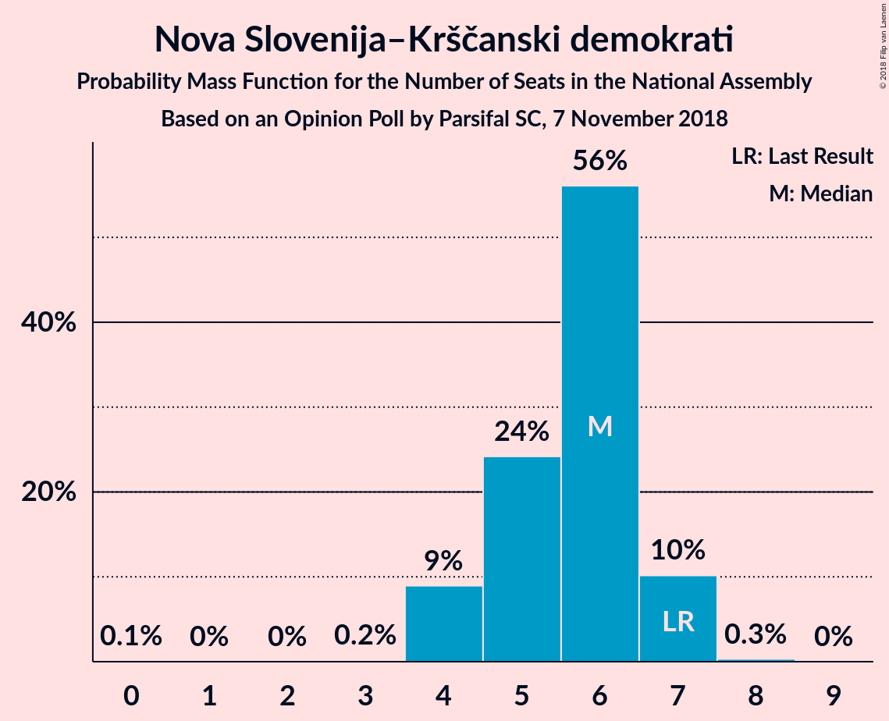
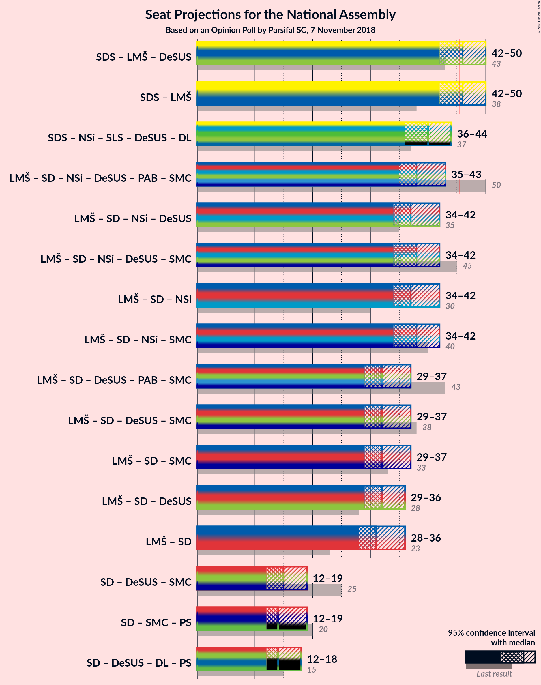

# Opinion Poll by Parsifal SC, 7 November 2018

<a href="#voting-intentions">Voting Intentions</a> | <a href="#seats">Seats</a> | <a href="#coalitions">Coalitions</a> | <a href="#technical-information">Technical Information</a>

## Voting Intentions

### Confidence Intervals

| Party | Last Result | Poll Result | 80% Confidence Interval | 90% Confidence Interval | 95% Confidence Interval | 99% Confidence Interval |
|:-----:|:-----------:|:-----------:|:-----------------------:|:-----------------------:|:-----------------------:|:-----------------------:|
| Slovenska demokratska stranka | 24.9% | 29.0% | 26.9–31.3% |26.3–31.9% |25.8–32.5% |24.8–33.6% |
| Lista Marjana Šarca | 12.6% | 18.0% | 16.2–20.0% |15.7–20.5% |15.3–21.0% |14.5–22.0% |
| Socialni demokrati | 9.9% | 15.0% | 13.4–16.9% |13.0–17.4% |12.6–17.8% |11.8–18.8% |
| Levica | 9.3% | 5.9% | 5.0–7.3% |4.7–7.6% |4.4–8.0% |4.0–8.6% |
| Nova Slovenija–Krščanski demokrati | 7.2% | 5.9% | 5.0–7.3% |4.7–7.6% |4.4–8.0% |4.0–8.6% |
| Slovenska nacionalna stranka | 4.2% | 5.9% | 5.0–7.3% |4.7–7.6% |4.4–8.0% |4.0–8.6% |
| Slovenska ljudska stranka | 2.6% | 5.9% | 5.0–7.3% |4.7–7.6% |4.4–8.0% |4.0–8.6% |
| Stranka modernega centra | 9.7% | 3.0% | 2.3–4.0% |2.1–4.3% |2.0–4.5% |1.7–5.0% |
| Stranka Alenke Bratušek | 5.1% | 3.0% | 2.3–4.0% |2.1–4.3% |2.0–4.5% |1.7–5.0% |
| Demokratična stranka upokojencev Slovenije | 4.9% | 3.0% | 2.3–4.0% |2.1–4.3% |2.0–4.5% |1.7–5.0% |

*Note:* The poll result column reflects the actual value used in the calculations. Published results may vary slightly, and in addition be rounded to fewer digits.

## Seats

### Confidence Intervals

| Party | Last Result | Median | 80% Confidence Interval | 90% Confidence Interval | 95% Confidence Interval | 99% Confidence Interval |
|:-----:|:-----------:|:------:|:-----------------------:|:-----------------------:|:-----------------------:|:-----------------------:|
| <a href="#slovenska-demokratska-stranka">Slovenska demokratska stranka</a> | 25 | 26 | 24–26 |24–26 |24–26 |24–29 |
| <a href="#lista-marjana-šarca">Lista Marjana Šarca</a> | 13 | 20 | 19–20 |19–20 |19–20 |15–20 |
| <a href="#socialni-demokrati">Socialni demokrati</a> | 10 | 15 | 14–15 |14–15 |14–15 |14–18 |
| <a href="#levica">Levica</a> | 9 | 6 | 5–6 |5–6 |5–6 |4–6 |
| <a href="#nova-slovenija–krščanski-demokrati">Nova Slovenija–Krščanski demokrati</a> | 7 | 6 | 5–6 |5–6 |5–6 |0–6 |
| <a href="#slovenska-nacionalna-stranka">Slovenska nacionalna stranka</a> | 4 | 6 | 5–6 |5–6 |5–6 |5–6 |
| <a href="#slovenska-ljudska-stranka">Slovenska ljudska stranka</a> | 0 | 5 | 5 |5 |5 |4–5 |
| <a href="#stranka-modernega-centra">Stranka modernega centra</a> | 10 | 4 | 4 |4 |4 |0–4 |
| <a href="#stranka-alenke-bratušek">Stranka Alenke Bratušek</a> | 5 | 0 | 0 |0 |0 |0–5 |
| <a href="#demokratična-stranka-upokojencev-slovenije">Demokratična stranka upokojencev Slovenije</a> | 5 | 0 | 0 |0 |0 |0–4 |

### Slovenska demokratska stranka

*For a full overview of the results for this party, see the [Slovenska demokratska stranka](party-slovenskademokratskastranka.html) page.*

| Number of Seats | Probability | Accumulated | Special Marks |
|:---------------:|:-----------:|:-----------:|:-------------:|
| 24 | 39% | 100% |  |
| 25 | 0% | 61% | Last Result |
| 26 | 60% | 61% | Median |
| 27 | 0.1% | 0.9% |  |
| 28 | 0% | 0.9% |  |
| 29 | 0.5% | 0.9% |  |
| 30 | 0.1% | 0.3% |  |
| 31 | 0% | 0.3% |  |
| 32 | 0% | 0.3% |  |
| 33 | 0% | 0.2% |  |
| 34 | 0.2% | 0.2% |  |
| 35 | 0% | 0% |  |

### Lista Marjana Šarca

*For a full overview of the results for this party, see the [Lista Marjana Šarca](party-listamarjanašarca.html) page.*

| Number of Seats | Probability | Accumulated | Special Marks |
|:---------------:|:-----------:|:-----------:|:-------------:|
| 13 | 0% | 100% | Last Result |
| 14 | 0% | 100% |  |
| 15 | 0.6% | 100% |  |
| 16 | 0.6% | 99.3% |  |
| 17 | 0.8% | 98.8% |  |
| 18 | 0.1% | 98% |  |
| 19 | 38% | 98% |  |
| 20 | 59% | 59% | Median |
| 21 | 0.1% | 0.1% |  |
| 22 | 0% | 0% |  |

### Socialni demokrati

*For a full overview of the results for this party, see the [Socialni demokrati](party-socialnidemokrati.html) page.*

| Number of Seats | Probability | Accumulated | Special Marks |
|:---------------:|:-----------:|:-----------:|:-------------:|
| 10 | 0% | 100% | Last Result |
| 11 | 0% | 100% |  |
| 12 | 0.2% | 100% |  |
| 13 | 0.1% | 99.8% |  |
| 14 | 39% | 99.7% |  |
| 15 | 59% | 61% | Median |
| 16 | 0% | 1.1% |  |
| 17 | 0.6% | 1.1% |  |
| 18 | 0.6% | 0.6% |  |
| 19 | 0% | 0% |  |

### Levica

*For a full overview of the results for this party, see the [Levica](party-levica.html) page.*

| Number of Seats | Probability | Accumulated | Special Marks |
|:---------------:|:-----------:|:-----------:|:-------------:|
| 4 | 0.5% | 100% |  |
| 5 | 39% | 99.4% |  |
| 6 | 60% | 60% | Median |
| 7 | 0% | 0.1% |  |
| 8 | 0.1% | 0.1% |  |
| 9 | 0% | 0% | Last Result |

### Nova Slovenija–Krščanski demokrati

*For a full overview of the results for this party, see the [Nova Slovenija–Krščanski demokrati](party-novaslovenija–krščanskidemokrati.html) page.*

| Number of Seats | Probability | Accumulated | Special Marks |
|:---------------:|:-----------:|:-----------:|:-------------:|
| 0 | 0.6% | 100% |  |
| 1 | 0% | 99.4% |  |
| 2 | 0% | 99.4% |  |
| 3 | 0% | 99.4% |  |
| 4 | 0.6% | 99.4% |  |
| 5 | 39% | 98.8% |  |
| 6 | 60% | 60% | Median |
| 7 | 0% | 0.3% | Last Result |
| 8 | 0.3% | 0.3% |  |
| 9 | 0% | 0% |  |

### Slovenska nacionalna stranka

*For a full overview of the results for this party, see the [Slovenska nacionalna stranka](party-slovenskanacionalnastranka.html) page.*

| Number of Seats | Probability | Accumulated | Special Marks |
|:---------------:|:-----------:|:-----------:|:-------------:|
| 0 | 0.2% | 100% |  |
| 1 | 0% | 99.8% |  |
| 2 | 0% | 99.8% |  |
| 3 | 0% | 99.8% |  |
| 4 | 0% | 99.8% | Last Result |
| 5 | 39% | 99.8% |  |
| 6 | 61% | 61% | Median |
| 7 | 0.1% | 0.1% |  |
| 8 | 0% | 0% |  |

### Slovenska ljudska stranka

*For a full overview of the results for this party, see the [Slovenska ljudska stranka](party-slovenskaljudskastranka.html) page.*

| Number of Seats | Probability | Accumulated | Special Marks |
|:---------------:|:-----------:|:-----------:|:-------------:|
| 0 | 0% | 100% | Last Result |
| 1 | 0% | 100% |  |
| 2 | 0% | 100% |  |
| 3 | 0% | 100% |  |
| 4 | 0.5% | 100% |  |
| 5 | 99.1% | 99.5% | Median |
| 6 | 0.3% | 0.4% |  |
| 7 | 0.1% | 0.1% |  |
| 8 | 0% | 0% |  |

### Stranka modernega centra

*For a full overview of the results for this party, see the [Stranka modernega centra](party-strankamodernegacentra.html) page.*

| Number of Seats | Probability | Accumulated | Special Marks |
|:---------------:|:-----------:|:-----------:|:-------------:|
| 0 | 1.5% | 100% |  |
| 1 | 0% | 98.5% |  |
| 2 | 0% | 98.5% |  |
| 3 | 0% | 98.5% |  |
| 4 | 98% | 98.5% | Median |
| 5 | 0% | 0% |  |
| 6 | 0% | 0% |  |
| 7 | 0% | 0% |  |
| 8 | 0% | 0% |  |
| 9 | 0% | 0% |  |
| 10 | 0% | 0% | Last Result |

### Stranka Alenke Bratušek

*For a full overview of the results for this party, see the [Stranka Alenke Bratušek](party-strankaalenkebratušek.html) page.*

| Number of Seats | Probability | Accumulated | Special Marks |
|:---------------:|:-----------:|:-----------:|:-------------:|
| 0 | 98.8% | 100% | Median |
| 1 | 0% | 1.2% |  |
| 2 | 0% | 1.2% |  |
| 3 | 0% | 1.2% |  |
| 4 | 0.6% | 1.2% |  |
| 5 | 0.5% | 0.5% | Last Result |
| 6 | 0% | 0% |  |

### Demokratična stranka upokojencev Slovenije

*For a full overview of the results for this party, see the [Demokratična stranka upokojencev Slovenije](party-demokratičnastrankaupokojencevslovenije.html) page.*

| Number of Seats | Probability | Accumulated | Special Marks |
|:---------------:|:-----------:|:-----------:|:-------------:|
| 0 | 99.4% | 100% | Median |
| 1 | 0% | 0.6% |  |
| 2 | 0% | 0.6% |  |
| 3 | 0% | 0.6% |  |
| 4 | 0.6% | 0.6% |  |
| 5 | 0% | 0% | Last Result |

## Coalitions

### Confidence Intervals

| Coalition | Last Result | Median | Majority? | 80% Confidence Interval | 90% Confidence Interval | 95% Confidence Interval | 99% Confidence Interval |
|:---------:|:-----------:|:------:|:---------:|:-----------------------:|:-----------------------:|:-----------------------:|:-----------------------:|
| Slovenska demokratska stranka – Lista Marjana Šarca – Demokratična stranka upokojencev Slovenije | 43 | 46 | 60% | 43–46 | 43–46 | 43–46 | 41–46 |
| Slovenska demokratska stranka – Lista Marjana Šarca | 38 | 46 | 60% | 43–46 | 43–46 | 43–46 | 40–46 |
| Lista Marjana Šarca – Socialni demokrati – Nova Slovenija–Krščanski demokrati – Demokratična stranka upokojencev Slovenije – Stranka Alenke Bratušek – Stranka modernega centra | 50 | 45 | 0% | 42–45 | 42–45 | 42–45 | 39–45 |
| Lista Marjana Šarca – Socialni demokrati – Nova Slovenija–Krščanski demokrati – Demokratična stranka upokojencev Slovenije – Stranka modernega centra | 45 | 45 | 0% | 42–45 | 42–45 | 42–45 | 34–45 |
| Lista Marjana Šarca – Socialni demokrati – Nova Slovenija–Krščanski demokrati – Stranka modernega centra | 40 | 45 | 0% | 42–45 | 42–45 | 42–45 | 34–45 |
| Lista Marjana Šarca – Socialni demokrati – Nova Slovenija–Krščanski demokrati – Demokratična stranka upokojencev Slovenije | 35 | 41 | 0% | 38–41 | 38–41 | 38–41 | 33–43 |
| Lista Marjana Šarca – Socialni demokrati – Nova Slovenija–Krščanski demokrati | 30 | 41 | 0% | 38–41 | 38–41 | 38–41 | 33–41 |
| Lista Marjana Šarca – Socialni demokrati – Demokratična stranka upokojencev Slovenije – Stranka Alenke Bratušek – Stranka modernega centra | 43 | 39 | 0% | 37–39 | 37–39 | 37–39 | 37–39 |
| Lista Marjana Šarca – Socialni demokrati – Demokratična stranka upokojencev Slovenije – Stranka modernega centra | 38 | 39 | 0% | 37–39 | 37–39 | 37–39 | 33–39 |
| Lista Marjana Šarca – Socialni demokrati – Stranka modernega centra | 33 | 39 | 0% | 37–39 | 37–39 | 37–39 | 33–39 |
| Lista Marjana Šarca – Socialni demokrati – Demokratična stranka upokojencev Slovenije | 28 | 35 | 0% | 33–35 | 33–35 | 33–35 | 29–38 |
| Lista Marjana Šarca – Socialni demokrati | 23 | 35 | 0% | 33–35 | 33–35 | 33–35 | 29–35 |
| Socialni demokrati – Demokratična stranka upokojencev Slovenije – Stranka modernega centra | 25 | 19 | 0% | 18–19 | 18–19 | 18–19 | 17–22 |

### Slovenska demokratska stranka – Lista Marjana Šarca – Demokratična stranka upokojencev Slovenije

| Number of Seats | Probability | Accumulated | Special Marks |
|:---------------:|:-----------:|:-----------:|:-------------:|
| 41 | 0.6% | 100% |  |
| 42 | 0% | 99.3% |  |
| 43 | 38% | 99.3% | Last Result |
| 44 | 0.6% | 61% |  |
| 45 | 0% | 60% |  |
| 46 | 60% | 60% | Median, Majority |
| 47 | 0% | 0.3% |  |
| 48 | 0.1% | 0.3% |  |
| 49 | 0% | 0.3% |  |
| 50 | 0% | 0.3% |  |
| 51 | 0.2% | 0.2% |  |
| 52 | 0% | 0% |  |

### Slovenska demokratska stranka – Lista Marjana Šarca

| Number of Seats | Probability | Accumulated | Special Marks |
|:---------------:|:-----------:|:-----------:|:-------------:|
| 38 | 0% | 100% | Last Result |
| 39 | 0% | 100% |  |
| 40 | 0.6% | 100% |  |
| 41 | 0.6% | 99.4% |  |
| 42 | 0% | 98.8% |  |
| 43 | 38% | 98.8% |  |
| 44 | 0% | 60% |  |
| 45 | 0% | 60% |  |
| 46 | 60% | 60% | Median, Majority |
| 47 | 0% | 0.3% |  |
| 48 | 0.1% | 0.3% |  |
| 49 | 0% | 0.3% |  |
| 50 | 0% | 0.3% |  |
| 51 | 0.2% | 0.2% |  |
| 52 | 0% | 0% |  |

### Lista Marjana Šarca – Socialni demokrati – Nova Slovenija–Krščanski demokrati – Demokratična stranka upokojencev Slovenije – Stranka Alenke Bratušek – Stranka modernega centra

| Number of Seats | Probability | Accumulated | Special Marks |
|:---------------:|:-----------:|:-----------:|:-------------:|
| 37 | 0.3% | 100% |  |
| 38 | 0% | 99.7% |  |
| 39 | 0.6% | 99.7% |  |
| 40 | 0% | 99.1% |  |
| 41 | 0.6% | 99.1% |  |
| 42 | 38% | 98% |  |
| 43 | 0.6% | 60% |  |
| 44 | 0% | 59% |  |
| 45 | 59% | 59% | Median |
| 46 | 0% | 0% | Majority |
| 47 | 0% | 0% |  |
| 48 | 0% | 0% |  |
| 49 | 0% | 0% |  |
| 50 | 0% | 0% | Last Result |

### Lista Marjana Šarca – Socialni demokrati – Nova Slovenija–Krščanski demokrati – Demokratična stranka upokojencev Slovenije – Stranka modernega centra

| Number of Seats | Probability | Accumulated | Special Marks |
|:---------------:|:-----------:|:-----------:|:-------------:|
| 34 | 0.5% | 100% |  |
| 35 | 0% | 99.5% |  |
| 36 | 0% | 99.4% |  |
| 37 | 0.9% | 99.4% |  |
| 38 | 0% | 98.5% |  |
| 39 | 0.1% | 98.5% |  |
| 40 | 0% | 98% |  |
| 41 | 0% | 98% |  |
| 42 | 38% | 98% |  |
| 43 | 0.6% | 60% |  |
| 44 | 0% | 59% |  |
| 45 | 59% | 59% | Last Result, Median |
| 46 | 0% | 0% | Majority |

### Lista Marjana Šarca – Socialni demokrati – Nova Slovenija–Krščanski demokrati – Stranka modernega centra

| Number of Seats | Probability | Accumulated | Special Marks |
|:---------------:|:-----------:|:-----------:|:-------------:|
| 34 | 0.5% | 100% |  |
| 35 | 0% | 99.5% |  |
| 36 | 0% | 99.4% |  |
| 37 | 0.9% | 99.4% |  |
| 38 | 0% | 98.5% |  |
| 39 | 0.6% | 98.5% |  |
| 40 | 0% | 98% | Last Result |
| 41 | 0% | 98% |  |
| 42 | 38% | 98% |  |
| 43 | 0% | 59% |  |
| 44 | 0% | 59% |  |
| 45 | 59% | 59% | Median |
| 46 | 0% | 0% | Majority |

### Lista Marjana Šarca – Socialni demokrati – Nova Slovenija–Krščanski demokrati – Demokratična stranka upokojencev Slovenije

| Number of Seats | Probability | Accumulated | Special Marks |
|:---------------:|:-----------:|:-----------:|:-------------:|
| 33 | 0.6% | 100% |  |
| 34 | 0.5% | 99.4% |  |
| 35 | 0% | 98.8% | Last Result |
| 36 | 0% | 98.8% |  |
| 37 | 0.3% | 98.8% |  |
| 38 | 38% | 98.5% |  |
| 39 | 0.1% | 60% |  |
| 40 | 0% | 60% |  |
| 41 | 59% | 60% | Median |
| 42 | 0% | 0.6% |  |
| 43 | 0.6% | 0.6% |  |
| 44 | 0% | 0% |  |

### Lista Marjana Šarca – Socialni demokrati – Nova Slovenija–Krščanski demokrati

| Number of Seats | Probability | Accumulated | Special Marks |
|:---------------:|:-----------:|:-----------:|:-------------:|
| 30 | 0% | 100% | Last Result |
| 31 | 0% | 100% |  |
| 32 | 0% | 100% |  |
| 33 | 0.6% | 100% |  |
| 34 | 0.5% | 99.4% |  |
| 35 | 0% | 98.8% |  |
| 36 | 0% | 98.8% |  |
| 37 | 0.3% | 98.8% |  |
| 38 | 38% | 98.5% |  |
| 39 | 0.6% | 60% |  |
| 40 | 0% | 59% |  |
| 41 | 59% | 59% | Median |
| 42 | 0% | 0% |  |

### Lista Marjana Šarca – Socialni demokrati – Demokratična stranka upokojencev Slovenije – Stranka Alenke Bratušek – Stranka modernega centra

| Number of Seats | Probability | Accumulated | Special Marks |
|:---------------:|:-----------:|:-----------:|:-------------:|
| 29 | 0.2% | 100% |  |
| 30 | 0% | 99.8% |  |
| 31 | 0% | 99.8% |  |
| 32 | 0% | 99.7% |  |
| 33 | 0.1% | 99.7% |  |
| 34 | 0.1% | 99.7% |  |
| 35 | 0% | 99.6% |  |
| 36 | 0% | 99.6% |  |
| 37 | 39% | 99.6% |  |
| 38 | 0.6% | 61% |  |
| 39 | 60% | 60% | Median |
| 40 | 0% | 0% |  |
| 41 | 0% | 0% |  |
| 42 | 0% | 0% |  |
| 43 | 0% | 0% | Last Result |

### Lista Marjana Šarca – Socialni demokrati – Demokratična stranka upokojencev Slovenije – Stranka modernega centra

| Number of Seats | Probability | Accumulated | Special Marks |
|:---------------:|:-----------:|:-----------:|:-------------:|
| 29 | 0.2% | 100% |  |
| 30 | 0% | 99.8% |  |
| 31 | 0% | 99.8% |  |
| 32 | 0% | 99.7% |  |
| 33 | 0.7% | 99.7% |  |
| 34 | 0.6% | 99.0% |  |
| 35 | 0% | 98% |  |
| 36 | 0% | 98% |  |
| 37 | 38% | 98% |  |
| 38 | 0.6% | 60% | Last Result |
| 39 | 59% | 59% | Median |
| 40 | 0% | 0% |  |

### Lista Marjana Šarca – Socialni demokrati – Stranka modernega centra

| Number of Seats | Probability | Accumulated | Special Marks |
|:---------------:|:-----------:|:-----------:|:-------------:|
| 29 | 0.2% | 100% |  |
| 30 | 0% | 99.8% |  |
| 31 | 0% | 99.8% |  |
| 32 | 0% | 99.7% |  |
| 33 | 0.7% | 99.7% | Last Result |
| 34 | 1.1% | 99.0% |  |
| 35 | 0% | 98% |  |
| 36 | 0% | 98% |  |
| 37 | 38% | 98% |  |
| 38 | 0% | 59% |  |
| 39 | 59% | 59% | Median |
| 40 | 0% | 0% |  |

### Lista Marjana Šarca – Socialni demokrati – Demokratična stranka upokojencev Slovenije

| Number of Seats | Probability | Accumulated | Special Marks |
|:---------------:|:-----------:|:-----------:|:-------------:|
| 28 | 0% | 100% | Last Result |
| 29 | 0.9% | 100% |  |
| 30 | 0% | 99.1% |  |
| 31 | 0% | 99.1% |  |
| 32 | 0% | 99.1% |  |
| 33 | 38% | 99.1% |  |
| 34 | 0.6% | 61% |  |
| 35 | 59% | 60% | Median |
| 36 | 0% | 0.6% |  |
| 37 | 0% | 0.6% |  |
| 38 | 0.6% | 0.6% |  |
| 39 | 0% | 0% |  |

### Lista Marjana Šarca – Socialni demokrati

| Number of Seats | Probability | Accumulated | Special Marks |
|:---------------:|:-----------:|:-----------:|:-------------:|
| 23 | 0% | 100% | Last Result |
| 24 | 0% | 100% |  |
| 25 | 0% | 100% |  |
| 26 | 0% | 100% |  |
| 27 | 0% | 100% |  |
| 28 | 0% | 100% |  |
| 29 | 0.9% | 100% |  |
| 30 | 0% | 99.1% |  |
| 31 | 0% | 99.1% |  |
| 32 | 0% | 99.1% |  |
| 33 | 38% | 99.1% |  |
| 34 | 1.1% | 61% |  |
| 35 | 59% | 59% | Median |
| 36 | 0% | 0% |  |

### Socialni demokrati – Demokratična stranka upokojencev Slovenije – Stranka modernega centra

| Number of Seats | Probability | Accumulated | Special Marks |
|:---------------:|:-----------:|:-----------:|:-------------:|
| 12 | 0.2% | 100% |  |
| 13 | 0.1% | 99.8% |  |
| 14 | 0% | 99.7% |  |
| 15 | 0.1% | 99.7% |  |
| 16 | 0% | 99.6% |  |
| 17 | 0.6% | 99.6% |  |
| 18 | 39% | 99.0% |  |
| 19 | 59% | 60% | Median |
| 20 | 0% | 0.6% |  |
| 21 | 0% | 0.6% |  |
| 22 | 0.6% | 0.6% |  |
| 23 | 0% | 0% |  |
| 24 | 0% | 0% |  |
| 25 | 0% | 0% | Last Result |

## Technical Information

### Opinion Poll

+ **Polling firm:** Parsifal SC
+ **Commissioner(s):** —
+ **Fieldwork period:** 7 November 2018

### Calculations

+ **Sample size:** 706
+ **Simulations done:** 1,024
+ **Error estimate:** 4.01%

