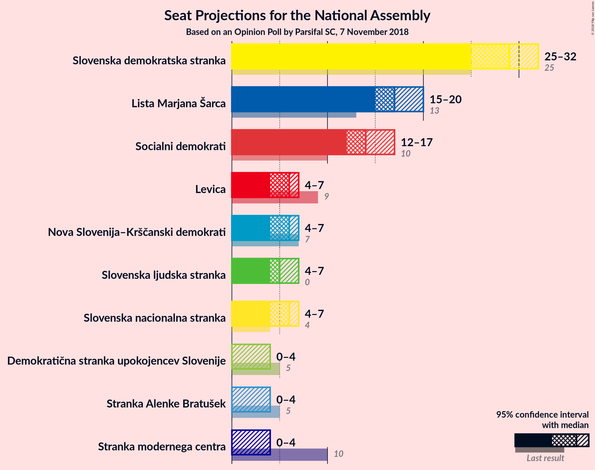
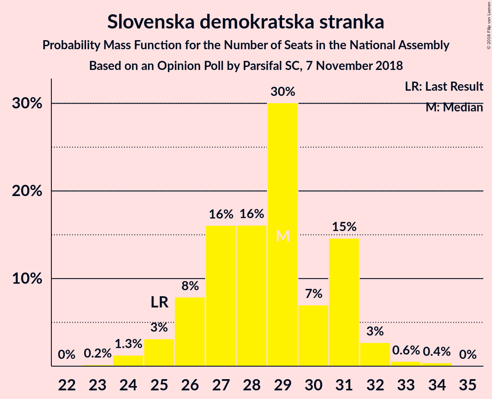
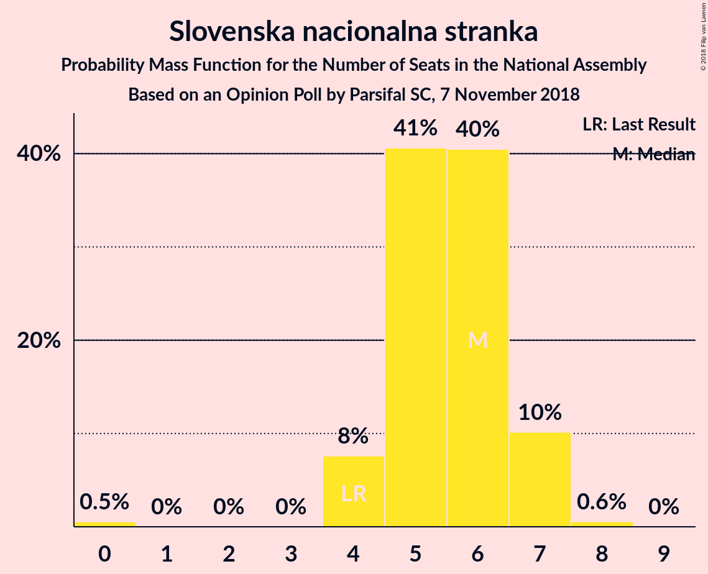
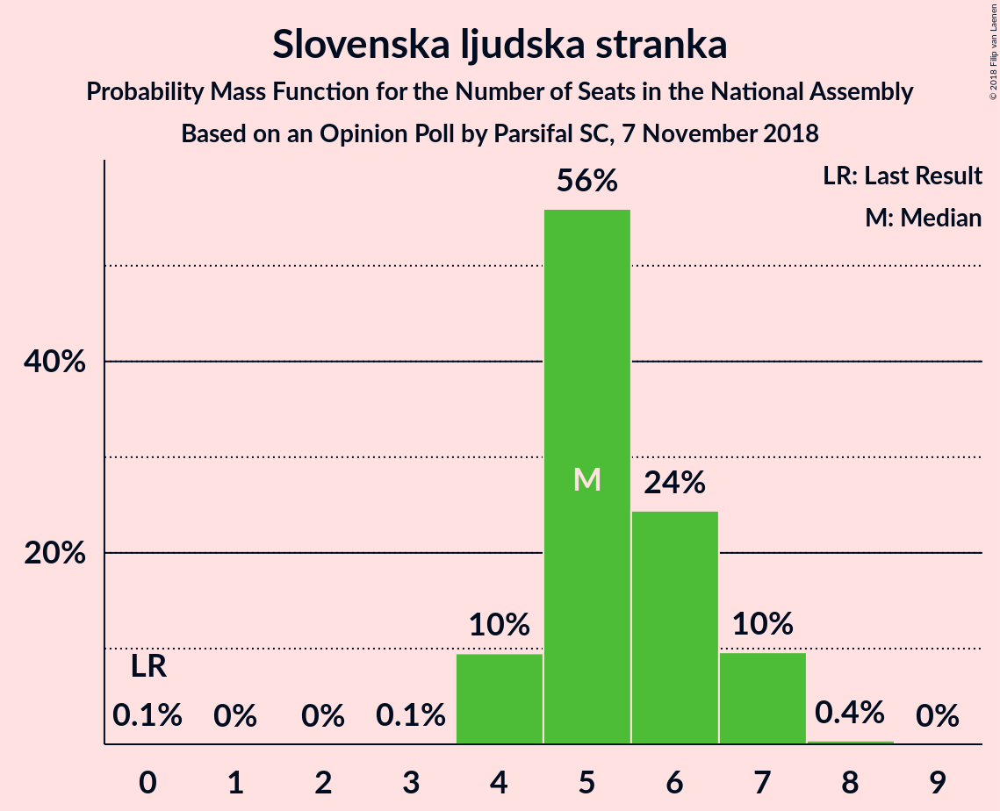

# Opinion Poll by Parsifal SC, 7 November 2018

<a href="#voting-intentions">Voting Intentions</a> | <a href="#seats">Seats</a> | <a href="#coalitions">Coalitions</a> | <a href="#technical-information">Technical Information</a>

## Voting Intentions

### Confidence Intervals

| Party | Last Result | Poll Result | 80% Confidence Interval | 90% Confidence Interval | 95% Confidence Interval | 99% Confidence Interval |
|:-----:|:-----------:|:-----------:|:-----------------------:|:-----------------------:|:-----------------------:|:-----------------------:|
| Slovenska demokratska stranka | 24.9% | 29.0% | 26.9–31.3% |26.3–31.9% |25.8–32.5% |24.8–33.6% |
| Lista Marjana Šarca | 12.6% | 18.0% | 16.2–20.0% |15.7–20.5% |15.3–21.0% |14.5–22.0% |
| Socialni demokrati | 9.9% | 15.0% | 13.4–16.9% |13.0–17.4% |12.6–17.8% |11.8–18.8% |
| Levica | 9.3% | 5.9% | 5.0–7.3% |4.7–7.6% |4.4–8.0% |4.0–8.6% |
| Nova Slovenija–Krščanski demokrati | 7.2% | 5.9% | 5.0–7.3% |4.7–7.6% |4.4–8.0% |4.0–8.6% |
| Slovenska nacionalna stranka | 4.2% | 5.9% | 5.0–7.3% |4.7–7.6% |4.4–8.0% |4.0–8.6% |
| Slovenska ljudska stranka | 2.6% | 5.9% | 5.0–7.3% |4.7–7.6% |4.4–8.0% |4.0–8.6% |
| Stranka modernega centra | 9.7% | 3.0% | 2.3–4.0% |2.1–4.3% |2.0–4.5% |1.7–5.0% |
| Stranka Alenke Bratušek | 5.1% | 3.0% | 2.3–4.0% |2.1–4.3% |2.0–4.5% |1.7–5.0% |
| Demokratična stranka upokojencev Slovenije | 4.9% | 3.0% | 2.3–4.0% |2.1–4.3% |2.0–4.5% |1.7–5.0% |

*Note:* The poll result column reflects the actual value used in the calculations. Published results may vary slightly, and in addition be rounded to fewer digits.

## Seats

### Confidence Intervals

| Party | Last Result | Median | 80% Confidence Interval | 90% Confidence Interval | 95% Confidence Interval | 99% Confidence Interval |
|:-----:|:-----------:|:------:|:-----------------------:|:-----------------------:|:-----------------------:|:-----------------------:|
| <a href="#slovenska-demokratska-stranka">Slovenska demokratska stranka</a> | 25 | 29 | 26–31 |26–31 |25–32 |24–33 |
| <a href="#lista-marjana-šarca">Lista Marjana Šarca</a> | 13 | 17 | 16–19 |15–20 |15–20 |14–21 |
| <a href="#socialni-demokrati">Socialni demokrati</a> | 10 | 14 | 13–16 |12–17 |12–17 |11–18 |
| <a href="#levica">Levica</a> | 9 | 6 | 4–6 |4–7 |4–7 |4–8 |
| <a href="#nova-slovenija–krščanski-demokrati">Nova Slovenija–Krščanski demokrati</a> | 7 | 6 | 5–7 |4–7 |4–7 |4–7 |
| <a href="#slovenska-nacionalna-stranka">Slovenska nacionalna stranka</a> | 4 | 6 | 5–7 |4–7 |4–7 |0–8 |
| <a href="#slovenska-ljudska-stranka">Slovenska ljudska stranka</a> | 0 | 5 | 5–7 |4–7 |4–7 |4–7 |
| <a href="#stranka-modernega-centra">Stranka modernega centra</a> | 10 | 0 | 0–3 |0–4 |0–4 |0–4 |
| <a href="#stranka-alenke-bratušek">Stranka Alenke Bratušek</a> | 5 | 0 | 0 |0 |0–4 |0–4 |
| <a href="#demokratična-stranka-upokojencev-slovenije">Demokratična stranka upokojencev Slovenije</a> | 5 | 0 | 0 |0–3 |0–4 |0–4 |

### Slovenska demokratska stranka

*For a full overview of the results for this party, see the [Slovenska demokratska stranka](party-slovenskademokratskastranka.html) page.*

| Number of Seats | Probability | Accumulated | Special Marks |
|:---------------:|:-----------:|:-----------:|:-------------:|
| 23 | 0.2% | 100% |  |
| 24 | 1.3% | 99.8% |  |
| 25 | 3% | 98.5% | Last Result |
| 26 | 8% | 95% |  |
| 27 | 16% | 88% |  |
| 28 | 16% | 71% |  |
| 29 | 30% | 55% | Median |
| 30 | 7% | 25% |  |
| 31 | 15% | 18% |  |
| 32 | 3% | 4% |  |
| 33 | 0.6% | 1.0% |  |
| 34 | 0.4% | 0.4% |  |
| 35 | 0% | 0% |  |

### Lista Marjana Šarca

*For a full overview of the results for this party, see the [Lista Marjana Šarca](party-listamarjanašarca.html) page.*

| Number of Seats | Probability | Accumulated | Special Marks |
|:---------------:|:-----------:|:-----------:|:-------------:|
| 13 | 0.3% | 100% | Last Result |
| 14 | 2% | 99.7% |  |
| 15 | 7% | 98% |  |
| 16 | 12% | 90% |  |
| 17 | 37% | 79% | Median |
| 18 | 14% | 42% |  |
| 19 | 20% | 28% |  |
| 20 | 6% | 8% |  |
| 21 | 2% | 2% |  |
| 22 | 0.3% | 0.4% |  |
| 23 | 0.1% | 0.1% |  |
| 24 | 0% | 0% |  |

### Socialni demokrati

*For a full overview of the results for this party, see the [Socialni demokrati](party-socialnidemokrati.html) page.*

| Number of Seats | Probability | Accumulated | Special Marks |
|:---------------:|:-----------:|:-----------:|:-------------:|
| 10 | 0.1% | 100% | Last Result |
| 11 | 0.9% | 99.9% |  |
| 12 | 5% | 99.0% |  |
| 13 | 17% | 94% |  |
| 14 | 36% | 76% | Median |
| 15 | 13% | 40% |  |
| 16 | 21% | 27% |  |
| 17 | 5% | 6% |  |
| 18 | 0.9% | 1.2% |  |
| 19 | 0.2% | 0.2% |  |
| 20 | 0.1% | 0.1% |  |
| 21 | 0% | 0% |  |

### Levica

*For a full overview of the results for this party, see the [Levica](party-levica.html) page.*

| Number of Seats | Probability | Accumulated | Special Marks |
|:---------------:|:-----------:|:-----------:|:-------------:|
| 0 | 0.3% | 100% |  |
| 1 | 0% | 99.7% |  |
| 2 | 0% | 99.7% |  |
| 3 | 0% | 99.7% |  |
| 4 | 11% | 99.7% |  |
| 5 | 27% | 89% |  |
| 6 | 52% | 62% | Median |
| 7 | 9% | 9% |  |
| 8 | 0.6% | 0.6% |  |
| 9 | 0% | 0% | Last Result |

### Nova Slovenija–Krščanski demokrati

*For a full overview of the results for this party, see the [Nova Slovenija–Krščanski demokrati](party-novaslovenija–krščanskidemokrati.html) page.*

| Number of Seats | Probability | Accumulated | Special Marks |
|:---------------:|:-----------:|:-----------:|:-------------:|
| 0 | 0.1% | 100% |  |
| 1 | 0% | 99.9% |  |
| 2 | 0% | 99.9% |  |
| 3 | 0.2% | 99.9% |  |
| 4 | 9% | 99.7% |  |
| 5 | 24% | 91% |  |
| 6 | 56% | 67% | Median |
| 7 | 10% | 11% | Last Result |
| 8 | 0.3% | 0.3% |  |
| 9 | 0% | 0% |  |

### Slovenska nacionalna stranka

*For a full overview of the results for this party, see the [Slovenska nacionalna stranka](party-slovenskanacionalnastranka.html) page.*

| Number of Seats | Probability | Accumulated | Special Marks |
|:---------------:|:-----------:|:-----------:|:-------------:|
| 0 | 0.5% | 100% |  |
| 1 | 0% | 99.5% |  |
| 2 | 0% | 99.5% |  |
| 3 | 0% | 99.5% |  |
| 4 | 8% | 99.5% | Last Result |
| 5 | 41% | 92% |  |
| 6 | 40% | 51% | Median |
| 7 | 10% | 11% |  |
| 8 | 0.6% | 0.6% |  |
| 9 | 0% | 0% |  |

### Slovenska ljudska stranka

*For a full overview of the results for this party, see the [Slovenska ljudska stranka](party-slovenskaljudskastranka.html) page.*

| Number of Seats | Probability | Accumulated | Special Marks |
|:---------------:|:-----------:|:-----------:|:-------------:|
| 0 | 0.1% | 100% | Last Result |
| 1 | 0% | 99.9% |  |
| 2 | 0% | 99.9% |  |
| 3 | 0.1% | 99.9% |  |
| 4 | 10% | 99.9% |  |
| 5 | 56% | 90% | Median |
| 6 | 24% | 34% |  |
| 7 | 10% | 10% |  |
| 8 | 0.4% | 0.4% |  |
| 9 | 0% | 0% |  |

### Stranka modernega centra

*For a full overview of the results for this party, see the [Stranka modernega centra](party-strankamodernegacentra.html) page.*

| Number of Seats | Probability | Accumulated | Special Marks |
|:---------------:|:-----------:|:-----------:|:-------------:|
| 0 | 83% | 100% | Median |
| 1 | 0% | 17% |  |
| 2 | 0% | 17% |  |
| 3 | 10% | 17% |  |
| 4 | 7% | 7% |  |
| 5 | 0.3% | 0.3% |  |
| 6 | 0% | 0% |  |
| 7 | 0% | 0% |  |
| 8 | 0% | 0% |  |
| 9 | 0% | 0% |  |
| 10 | 0% | 0% | Last Result |

### Stranka Alenke Bratušek

*For a full overview of the results for this party, see the [Stranka Alenke Bratušek](party-strankaalenkebratušek.html) page.*

| Number of Seats | Probability | Accumulated | Special Marks |
|:---------------:|:-----------:|:-----------:|:-------------:|
| 0 | 96% | 100% | Median |
| 1 | 0% | 4% |  |
| 2 | 0% | 4% |  |
| 3 | 0.6% | 4% |  |
| 4 | 3% | 3% |  |
| 5 | 0.4% | 0.4% | Last Result |
| 6 | 0% | 0% |  |

### Demokratična stranka upokojencev Slovenije

*For a full overview of the results for this party, see the [Demokratična stranka upokojencev Slovenije](party-demokratičnastrankaupokojencevslovenije.html) page.*

| Number of Seats | Probability | Accumulated | Special Marks |
|:---------------:|:-----------:|:-----------:|:-------------:|
| 0 | 95% | 100% | Median |
| 1 | 0% | 5% |  |
| 2 | 0% | 5% |  |
| 3 | 1.5% | 5% |  |
| 4 | 4% | 4% |  |
| 5 | 0.2% | 0.3% | Last Result |
| 6 | 0% | 0% |  |

## Coalitions

### Confidence Intervals

| Coalition | Last Result | Median | Majority? | 80% Confidence Interval | 90% Confidence Interval | 95% Confidence Interval | 99% Confidence Interval |
|:---------:|:-----------:|:------:|:---------:|:-----------------------:|:-----------------------:|:-----------------------:|:-----------------------:|
| Slovenska demokratska stranka – Lista Marjana Šarca – Demokratična stranka upokojencev Slovenije | 43 | 46 | 70% | 44–49 | 42–50 | 42–50 | 41–52 |
| Slovenska demokratska stranka – Lista Marjana Šarca | 38 | 46 | 67% | 43–49 | 42–50 | 42–50 | 40–51 |
| Lista Marjana Šarca – Socialni demokrati – Nova Slovenija–Krščanski demokrati – Demokratična stranka upokojencev Slovenije – Stranka Alenke Bratušek – Stranka modernega centra | 50 | 38 | 0.2% | 36–42 | 35–42 | 35–43 | 34–44 |
| Lista Marjana Šarca – Socialni demokrati – Nova Slovenija–Krščanski demokrati – Demokratična stranka upokojencev Slovenije | 35 | 37 | 0% | 35–41 | 35–42 | 34–42 | 33–43 |
| Lista Marjana Šarca – Socialni demokrati – Nova Slovenija–Krščanski demokrati – Demokratična stranka upokojencev Slovenije – Stranka modernega centra | 45 | 38 | 0.1% | 36–41 | 35–42 | 34–42 | 33–44 |
| Lista Marjana Šarca – Socialni demokrati – Nova Slovenija–Krščanski demokrati | 30 | 37 | 0% | 35–41 | 34–41 | 34–42 | 33–42 |
| Lista Marjana Šarca – Socialni demokrati – Nova Slovenija–Krščanski demokrati – Stranka modernega centra | 40 | 38 | 0.1% | 36–41 | 35–42 | 34–42 | 33–44 |
| Lista Marjana Šarca – Socialni demokrati – Demokratična stranka upokojencev Slovenije – Stranka Alenke Bratušek – Stranka modernega centra | 43 | 32 | 0% | 30–36 | 30–37 | 29–37 | 28–39 |
| Lista Marjana Šarca – Socialni demokrati – Demokratična stranka upokojencev Slovenije – Stranka modernega centra | 38 | 32 | 0% | 30–36 | 30–36 | 29–37 | 28–39 |
| Lista Marjana Šarca – Socialni demokrati – Stranka modernega centra | 33 | 32 | 0% | 30–35 | 29–36 | 29–37 | 27–38 |
| Lista Marjana Šarca – Socialni demokrati – Demokratična stranka upokojencev Slovenije | 28 | 32 | 0% | 30–35 | 29–36 | 29–36 | 27–37 |
| Lista Marjana Šarca – Socialni demokrati | 23 | 31 | 0% | 30–35 | 29–35 | 28–36 | 27–37 |
| Socialni demokrati – Demokratična stranka upokojencev Slovenije – Stranka modernega centra | 25 | 15 | 0% | 13–18 | 13–19 | 12–19 | 11–21 |

### Slovenska demokratska stranka – Lista Marjana Šarca – Demokratična stranka upokojencev Slovenije

| Number of Seats | Probability | Accumulated | Special Marks |
|:---------------:|:-----------:|:-----------:|:-------------:|
| 39 | 0.1% | 100% |  |
| 40 | 0.2% | 99.9% |  |
| 41 | 0.6% | 99.7% |  |
| 42 | 5% | 99.1% |  |
| 43 | 4% | 94% | Last Result |
| 44 | 10% | 90% |  |
| 45 | 10% | 80% |  |
| 46 | 29% | 70% | Median, Majority |
| 47 | 17% | 42% |  |
| 48 | 12% | 25% |  |
| 49 | 5% | 13% |  |
| 50 | 6% | 8% |  |
| 51 | 1.3% | 2% |  |
| 52 | 0.4% | 0.6% |  |
| 53 | 0.1% | 0.2% |  |
| 54 | 0% | 0.1% |  |
| 55 | 0% | 0% |  |

### Slovenska demokratska stranka – Lista Marjana Šarca

| Number of Seats | Probability | Accumulated | Special Marks |
|:---------------:|:-----------:|:-----------:|:-------------:|
| 38 | 0.1% | 100% | Last Result |
| 39 | 0.2% | 99.9% |  |
| 40 | 0.3% | 99.7% |  |
| 41 | 0.8% | 99.5% |  |
| 42 | 6% | 98.7% |  |
| 43 | 5% | 93% |  |
| 44 | 11% | 88% |  |
| 45 | 10% | 77% |  |
| 46 | 29% | 67% | Median, Majority |
| 47 | 16% | 38% |  |
| 48 | 11% | 22% |  |
| 49 | 4% | 11% |  |
| 50 | 6% | 7% |  |
| 51 | 0.7% | 1.2% |  |
| 52 | 0.3% | 0.4% |  |
| 53 | 0.1% | 0.1% |  |
| 54 | 0% | 0% |  |

### Lista Marjana Šarca – Socialni demokrati – Nova Slovenija–Krščanski demokrati – Demokratična stranka upokojencev Slovenije – Stranka Alenke Bratušek – Stranka modernega centra

| Number of Seats | Probability | Accumulated | Special Marks |
|:---------------:|:-----------:|:-----------:|:-------------:|
| 32 | 0.1% | 100% |  |
| 33 | 0.3% | 99.9% |  |
| 34 | 2% | 99.6% |  |
| 35 | 3% | 98% |  |
| 36 | 13% | 95% |  |
| 37 | 22% | 81% | Median |
| 38 | 13% | 60% |  |
| 39 | 11% | 46% |  |
| 40 | 14% | 35% |  |
| 41 | 10% | 21% |  |
| 42 | 9% | 11% |  |
| 43 | 2% | 3% |  |
| 44 | 0.7% | 1.1% |  |
| 45 | 0.2% | 0.4% |  |
| 46 | 0.1% | 0.2% | Majority |
| 47 | 0% | 0% |  |
| 48 | 0% | 0% |  |
| 49 | 0% | 0% |  |
| 50 | 0% | 0% | Last Result |

### Lista Marjana Šarca – Socialni demokrati – Nova Slovenija–Krščanski demokrati – Demokratična stranka upokojencev Slovenije

| Number of Seats | Probability | Accumulated | Special Marks |
|:---------------:|:-----------:|:-----------:|:-------------:|
| 31 | 0% | 100% |  |
| 32 | 0.3% | 99.9% |  |
| 33 | 0.9% | 99.7% |  |
| 34 | 3% | 98.8% |  |
| 35 | 6% | 95% | Last Result |
| 36 | 17% | 90% |  |
| 37 | 25% | 72% | Median |
| 38 | 16% | 48% |  |
| 39 | 10% | 32% |  |
| 40 | 9% | 22% |  |
| 41 | 8% | 13% |  |
| 42 | 5% | 6% |  |
| 43 | 0.4% | 0.7% |  |
| 44 | 0.2% | 0.3% |  |
| 45 | 0% | 0.1% |  |
| 46 | 0% | 0% | Majority |

### Lista Marjana Šarca – Socialni demokrati – Nova Slovenija–Krščanski demokrati – Demokratična stranka upokojencev Slovenije – Stranka modernega centra

| Number of Seats | Probability | Accumulated | Special Marks |
|:---------------:|:-----------:|:-----------:|:-------------:|
| 32 | 0.1% | 100% |  |
| 33 | 0.5% | 99.8% |  |
| 34 | 2% | 99.3% |  |
| 35 | 4% | 97% |  |
| 36 | 14% | 93% |  |
| 37 | 22% | 79% | Median |
| 38 | 14% | 57% |  |
| 39 | 11% | 43% |  |
| 40 | 13% | 33% |  |
| 41 | 10% | 19% |  |
| 42 | 8% | 10% |  |
| 43 | 1.3% | 2% |  |
| 44 | 0.5% | 0.8% |  |
| 45 | 0.1% | 0.2% | Last Result |
| 46 | 0.1% | 0.1% | Majority |
| 47 | 0% | 0% |  |

### Lista Marjana Šarca – Socialni demokrati – Nova Slovenija–Krščanski demokrati

| Number of Seats | Probability | Accumulated | Special Marks |
|:---------------:|:-----------:|:-----------:|:-------------:|
| 30 | 0% | 100% | Last Result |
| 31 | 0.1% | 100% |  |
| 32 | 0.4% | 99.9% |  |
| 33 | 1.3% | 99.5% |  |
| 34 | 4% | 98% |  |
| 35 | 7% | 94% |  |
| 36 | 19% | 88% |  |
| 37 | 25% | 69% | Median |
| 38 | 15% | 44% |  |
| 39 | 9% | 29% |  |
| 40 | 8% | 20% |  |
| 41 | 7% | 11% |  |
| 42 | 4% | 5% |  |
| 43 | 0.3% | 0.4% |  |
| 44 | 0.1% | 0.1% |  |
| 45 | 0% | 0% |  |

### Lista Marjana Šarca – Socialni demokrati – Nova Slovenija–Krščanski demokrati – Stranka modernega centra

| Number of Seats | Probability | Accumulated | Special Marks |
|:---------------:|:-----------:|:-----------:|:-------------:|
| 32 | 0.2% | 100% |  |
| 33 | 0.8% | 99.7% |  |
| 34 | 3% | 99.0% |  |
| 35 | 5% | 96% |  |
| 36 | 15% | 92% |  |
| 37 | 23% | 76% | Median |
| 38 | 14% | 54% |  |
| 39 | 10% | 40% |  |
| 40 | 13% | 30% | Last Result |
| 41 | 9% | 17% |  |
| 42 | 7% | 9% |  |
| 43 | 1.0% | 2% |  |
| 44 | 0.3% | 0.5% |  |
| 45 | 0.1% | 0.2% |  |
| 46 | 0.1% | 0.1% | Majority |
| 47 | 0% | 0% |  |

### Lista Marjana Šarca – Socialni demokrati – Demokratična stranka upokojencev Slovenije – Stranka Alenke Bratušek – Stranka modernega centra

| Number of Seats | Probability | Accumulated | Special Marks |
|:---------------:|:-----------:|:-----------:|:-------------:|
| 27 | 0.2% | 100% |  |
| 28 | 0.7% | 99.7% |  |
| 29 | 2% | 99.0% |  |
| 30 | 12% | 97% |  |
| 31 | 24% | 85% | Median |
| 32 | 11% | 61% |  |
| 33 | 8% | 50% |  |
| 34 | 11% | 42% |  |
| 35 | 19% | 30% |  |
| 36 | 6% | 12% |  |
| 37 | 4% | 6% |  |
| 38 | 0.9% | 2% |  |
| 39 | 0.6% | 0.9% |  |
| 40 | 0.2% | 0.3% |  |
| 41 | 0.1% | 0.1% |  |
| 42 | 0% | 0% |  |
| 43 | 0% | 0% | Last Result |

### Lista Marjana Šarca – Socialni demokrati – Demokratična stranka upokojencev Slovenije – Stranka modernega centra

| Number of Seats | Probability | Accumulated | Special Marks |
|:---------------:|:-----------:|:-----------:|:-------------:|
| 27 | 0.3% | 100% |  |
| 28 | 0.9% | 99.7% |  |
| 29 | 3% | 98.8% |  |
| 30 | 12% | 96% |  |
| 31 | 24% | 83% | Median |
| 32 | 12% | 59% |  |
| 33 | 8% | 47% |  |
| 34 | 11% | 39% |  |
| 35 | 18% | 28% |  |
| 36 | 5% | 10% |  |
| 37 | 4% | 5% |  |
| 38 | 0.6% | 1.3% | Last Result |
| 39 | 0.5% | 0.6% |  |
| 40 | 0.1% | 0.2% |  |
| 41 | 0% | 0% |  |

### Lista Marjana Šarca – Socialni demokrati – Stranka modernega centra

| Number of Seats | Probability | Accumulated | Special Marks |
|:---------------:|:-----------:|:-----------:|:-------------:|
| 26 | 0.1% | 100% |  |
| 27 | 0.4% | 99.9% |  |
| 28 | 1.2% | 99.5% |  |
| 29 | 4% | 98% |  |
| 30 | 13% | 95% |  |
| 31 | 26% | 81% | Median |
| 32 | 12% | 56% |  |
| 33 | 8% | 43% | Last Result |
| 34 | 10% | 36% |  |
| 35 | 17% | 25% |  |
| 36 | 4% | 8% |  |
| 37 | 3% | 4% |  |
| 38 | 0.4% | 0.9% |  |
| 39 | 0.3% | 0.4% |  |
| 40 | 0.1% | 0.1% |  |
| 41 | 0% | 0% |  |

### Lista Marjana Šarca – Socialni demokrati – Demokratična stranka upokojencev Slovenije

| Number of Seats | Probability | Accumulated | Special Marks |
|:---------------:|:-----------:|:-----------:|:-------------:|
| 26 | 0.1% | 100% |  |
| 27 | 0.4% | 99.8% |  |
| 28 | 2% | 99.4% | Last Result |
| 29 | 4% | 98% |  |
| 30 | 15% | 94% |  |
| 31 | 28% | 79% | Median |
| 32 | 15% | 51% |  |
| 33 | 8% | 36% |  |
| 34 | 9% | 28% |  |
| 35 | 14% | 19% |  |
| 36 | 4% | 5% |  |
| 37 | 1.1% | 1.5% |  |
| 38 | 0.3% | 0.4% |  |
| 39 | 0.1% | 0.2% |  |
| 40 | 0% | 0% |  |

### Lista Marjana Šarca – Socialni demokrati

| Number of Seats | Probability | Accumulated | Special Marks |
|:---------------:|:-----------:|:-----------:|:-------------:|
| 23 | 0% | 100% | Last Result |
| 24 | 0% | 100% |  |
| 25 | 0% | 100% |  |
| 26 | 0.2% | 100% |  |
| 27 | 0.7% | 99.8% |  |
| 28 | 2% | 99.1% |  |
| 29 | 5% | 97% |  |
| 30 | 16% | 92% |  |
| 31 | 29% | 76% | Median |
| 32 | 15% | 47% |  |
| 33 | 7% | 32% |  |
| 34 | 8% | 25% |  |
| 35 | 13% | 17% |  |
| 36 | 3% | 4% |  |
| 37 | 0.6% | 0.7% |  |
| 38 | 0.1% | 0.2% |  |
| 39 | 0% | 0% |  |

### Socialni demokrati – Demokratična stranka upokojencev Slovenije – Stranka modernega centra

| Number of Seats | Probability | Accumulated | Special Marks |
|:---------------:|:-----------:|:-----------:|:-------------:|
| 11 | 0.7% | 100% |  |
| 12 | 3% | 99.3% |  |
| 13 | 13% | 97% |  |
| 14 | 32% | 84% | Median |
| 15 | 8% | 52% |  |
| 16 | 22% | 44% |  |
| 17 | 7% | 21% |  |
| 18 | 8% | 14% |  |
| 19 | 4% | 6% |  |
| 20 | 1.5% | 2% |  |
| 21 | 0.5% | 0.8% |  |
| 22 | 0.2% | 0.2% |  |
| 23 | 0.1% | 0.1% |  |
| 24 | 0% | 0% |  |
| 25 | 0% | 0% | Last Result |

## Technical Information

### Opinion Poll

+ **Polling firm:** Parsifal SC
+ **Commissioner(s):** —
+ **Fieldwork period:** 7 November 2018

### Calculations

+ **Sample size:** 706
+ **Simulations done:** 1,048,576
+ **Error estimate:** 2.59%

