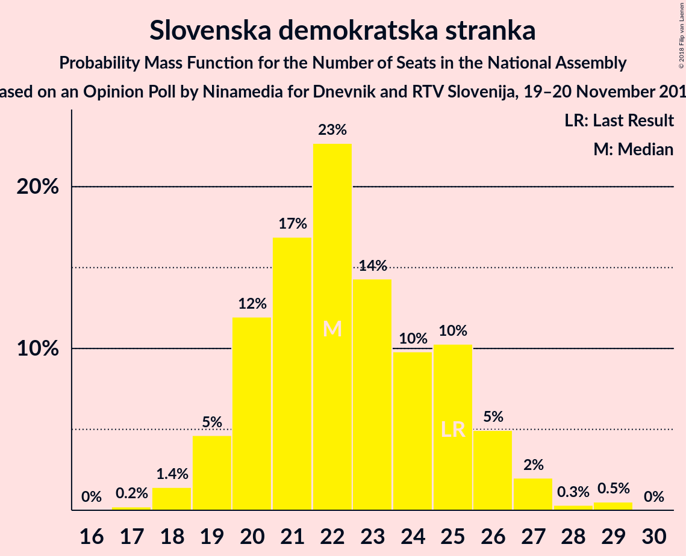
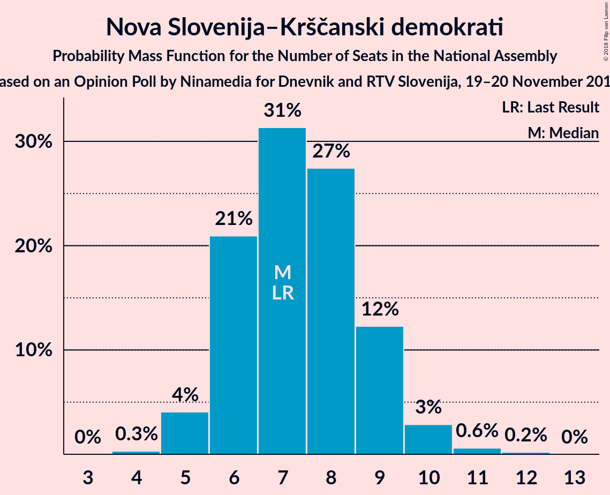
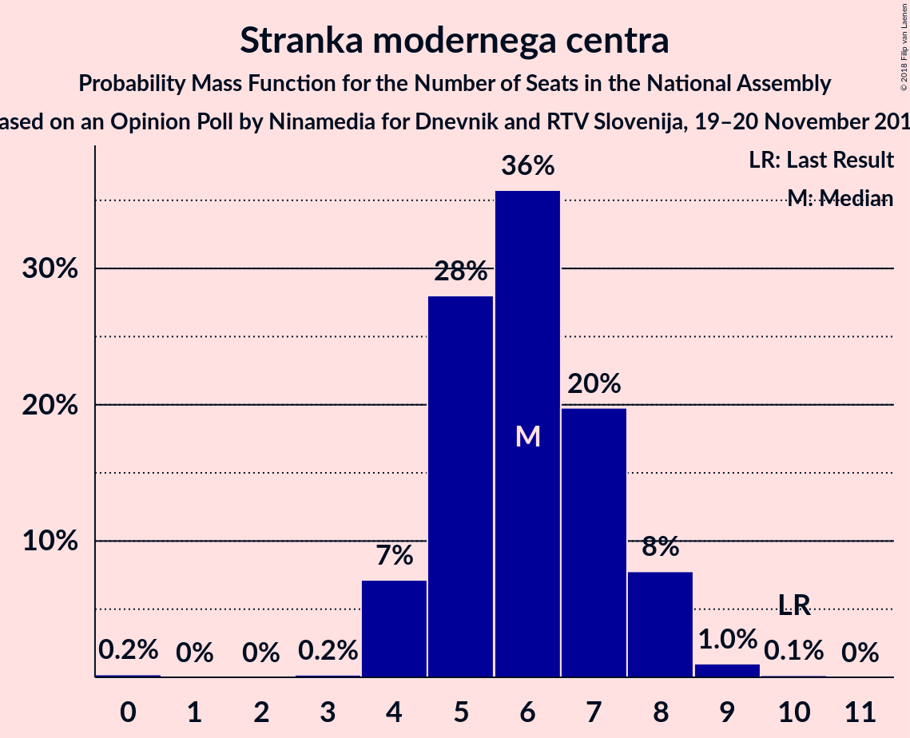

# Opinion Poll by Ninamedia for Dnevnik and RTV Slovenija, 19–20 November 2018

<a href="#voting-intentions">Voting Intentions</a> | <a href="#seats">Seats</a> | <a href="#coalitions">Coalitions</a> | <a href="#technical-information">Technical Information</a>

## Voting Intentions

### Confidence Intervals

| Party | Last Result | Poll Result | 80% Confidence Interval | 90% Confidence Interval | 95% Confidence Interval | 99% Confidence Interval |
|:-----:|:-----------:|:-----------:|:-----------------------:|:-----------------------:|:-----------------------:|:-----------------------:|
| Slovenska demokratska stranka | 24.9% | 23.7% | 21.5–26.2% |20.8–26.9% |20.3–27.5% |19.2–28.7% |
| Socialni demokrati | 9.9% | 19.4% | 17.3–21.7% |16.8–22.4% |16.3–23.0% |15.3–24.1% |
| Lista Marjana Šarca | 12.6% | 16.0% | 14.2–18.2% |13.6–18.9% |13.2–19.4% |12.3–20.5% |
| Levica | 9.3% | 10.6% | 9.1–12.5% |8.7–13.1% |8.3–13.5% |7.6–14.5% |
| Nova Slovenija–Krščanski demokrati | 7.2% | 8.0% | 6.7–9.7% |6.3–10.2% |6.0–10.6% |5.4–11.5% |
| Stranka modernega centra | 9.7% | 6.5% | 5.3–8.1% |5.0–8.6% |4.7–9.0% |4.2–9.8% |
| Demokratična stranka upokojencev Slovenije | 4.9% | 4.9% | 3.8–6.3% |3.6–6.7% |3.3–7.0% |2.9–7.8% |
| Slovenska nacionalna stranka | 4.2% | 4.9% | 3.8–6.3% |3.6–6.7% |3.3–7.0% |2.9–7.8% |
| Stranka Alenke Bratušek | 5.1% | 3.0% | 2.2–4.2% |2.0–4.5% |1.8–4.8% |1.5–5.4% |

*Note:* The poll result column reflects the actual value used in the calculations. Published results may vary slightly, and in addition be rounded to fewer digits.

## Seats

### Confidence Intervals

| Party | Last Result | Median | 80% Confidence Interval | 90% Confidence Interval | 95% Confidence Interval | 99% Confidence Interval |
|:-----:|:-----------:|:------:|:-----------------------:|:-----------------------:|:-----------------------:|:-----------------------:|
| <a href="#slovenska-demokratska-stranka">Slovenska demokratska stranka</a> | 25 | 23 | 20–25 |19–26 |19–26 |18–28 |
| <a href="#socialni-demokrati">Socialni demokrati</a> | 10 | 18 | 16–21 |16–22 |15–22 |14–23 |
| <a href="#lista-marjana-šarca">Lista Marjana Šarca</a> | 13 | 15 | 13–17 |13–18 |12–18 |11–19 |
| <a href="#levica">Levica</a> | 9 | 10 | 8–12 |8–13 |7–13 |7–14 |
| <a href="#nova-slovenija–krščanski-demokrati">Nova Slovenija–Krščanski demokrati</a> | 7 | 7 | 6–9 |5–10 |5–10 |5–11 |
| <a href="#stranka-modernega-centra">Stranka modernega centra</a> | 10 | 6 | 5–7 |4–8 |4–8 |4–9 |
| <a href="#demokratična-stranka-upokojencev-slovenije">Demokratična stranka upokojencev Slovenije</a> | 5 | 4 | 0–5 |0–6 |0–6 |0–7 |
| <a href="#slovenska-nacionalna-stranka">Slovenska nacionalna stranka</a> | 4 | 4 | 0–5 |0–6 |0–6 |0–7 |
| <a href="#stranka-alenke-bratušek">Stranka Alenke Bratušek</a> | 5 | 0 | 0–3 |0–4 |0–4 |0–5 |

### Slovenska demokratska stranka

*For a full overview of the results for this party, see the [Slovenska demokratska stranka](party-slovenskademokratskastranka.html) page.*

| Number of Seats | Probability | Accumulated | Special Marks |
|:---------------:|:-----------:|:-----------:|:-------------:|
| 17 | 0.3% | 100% |  |
| 18 | 1.3% | 99.7% |  |
| 19 | 5% | 98% |  |
| 20 | 6% | 93% |  |
| 21 | 15% | 87% |  |
| 22 | 13% | 72% |  |
| 23 | 18% | 59% | Median |
| 24 | 15% | 41% |  |
| 25 | 18% | 27% | Last Result |
| 26 | 7% | 9% |  |
| 27 | 1.4% | 2% |  |
| 28 | 0.4% | 0.5% |  |
| 29 | 0.1% | 0.1% |  |
| 30 | 0% | 0% |  |

### Socialni demokrati

*For a full overview of the results for this party, see the [Socialni demokrati](party-socialnidemokrati.html) page.*

| Number of Seats | Probability | Accumulated | Special Marks |
|:---------------:|:-----------:|:-----------:|:-------------:|
| 10 | 0% | 100% | Last Result |
| 11 | 0% | 100% |  |
| 12 | 0% | 100% |  |
| 13 | 0.2% | 100% |  |
| 14 | 0.7% | 99.8% |  |
| 15 | 4% | 99.1% |  |
| 16 | 16% | 96% |  |
| 17 | 28% | 80% |  |
| 18 | 14% | 52% | Median |
| 19 | 11% | 38% |  |
| 20 | 12% | 27% |  |
| 21 | 9% | 15% |  |
| 22 | 4% | 6% |  |
| 23 | 2% | 2% |  |
| 24 | 0.2% | 0.2% |  |
| 25 | 0% | 0% |  |

### Lista Marjana Šarca

*For a full overview of the results for this party, see the [Lista Marjana Šarca](party-listamarjanašarca.html) page.*

| Number of Seats | Probability | Accumulated | Special Marks |
|:---------------:|:-----------:|:-----------:|:-------------:|
| 10 | 0.1% | 100% |  |
| 11 | 0.9% | 99.9% |  |
| 12 | 3% | 99.0% |  |
| 13 | 18% | 96% | Last Result |
| 14 | 17% | 79% |  |
| 15 | 24% | 62% | Median |
| 16 | 19% | 37% |  |
| 17 | 10% | 18% |  |
| 18 | 6% | 8% |  |
| 19 | 1.3% | 2% |  |
| 20 | 0.3% | 0.4% |  |
| 21 | 0.1% | 0.1% |  |
| 22 | 0% | 0% |  |

### Levica

*For a full overview of the results for this party, see the [Levica](party-levica.html) page.*

| Number of Seats | Probability | Accumulated | Special Marks |
|:---------------:|:-----------:|:-----------:|:-------------:|
| 6 | 0.1% | 100% |  |
| 7 | 4% | 99.9% |  |
| 8 | 17% | 96% |  |
| 9 | 14% | 79% | Last Result |
| 10 | 27% | 65% | Median |
| 11 | 24% | 38% |  |
| 12 | 8% | 13% |  |
| 13 | 4% | 5% |  |
| 14 | 0.8% | 0.9% |  |
| 15 | 0% | 0% |  |

### Nova Slovenija–Krščanski demokrati

*For a full overview of the results for this party, see the [Nova Slovenija–Krščanski demokrati](party-novaslovenija–krščanskidemokrati.html) page.*

| Number of Seats | Probability | Accumulated | Special Marks |
|:---------------:|:-----------:|:-----------:|:-------------:|
| 4 | 0.3% | 100% |  |
| 5 | 6% | 99.7% |  |
| 6 | 16% | 94% |  |
| 7 | 34% | 78% | Last Result, Median |
| 8 | 21% | 45% |  |
| 9 | 18% | 24% |  |
| 10 | 5% | 6% |  |
| 11 | 0.7% | 0.9% |  |
| 12 | 0.2% | 0.2% |  |
| 13 | 0% | 0% |  |

### Stranka modernega centra

*For a full overview of the results for this party, see the [Stranka modernega centra](party-strankamodernegacentra.html) page.*

| Number of Seats | Probability | Accumulated | Special Marks |
|:---------------:|:-----------:|:-----------:|:-------------:|
| 0 | 0.2% | 100% |  |
| 1 | 0% | 99.8% |  |
| 2 | 0% | 99.8% |  |
| 3 | 0.1% | 99.8% |  |
| 4 | 9% | 99.8% |  |
| 5 | 25% | 91% |  |
| 6 | 37% | 66% | Median |
| 7 | 21% | 29% |  |
| 8 | 7% | 8% |  |
| 9 | 1.5% | 2% |  |
| 10 | 0.2% | 0.2% | Last Result |
| 11 | 0% | 0% |  |

### Demokratična stranka upokojencev Slovenije

*For a full overview of the results for this party, see the [Demokratična stranka upokojencev Slovenije](party-demokratičnastrankaupokojencevslovenije.html) page.*

| Number of Seats | Probability | Accumulated | Special Marks |
|:---------------:|:-----------:|:-----------:|:-------------:|
| 0 | 11% | 100% |  |
| 1 | 0% | 89% |  |
| 2 | 0% | 89% |  |
| 3 | 3% | 89% |  |
| 4 | 42% | 86% | Median |
| 5 | 34% | 44% | Last Result |
| 6 | 8% | 9% |  |
| 7 | 1.1% | 1.3% |  |
| 8 | 0.1% | 0.1% |  |
| 9 | 0% | 0% |  |

### Slovenska nacionalna stranka

*For a full overview of the results for this party, see the [Slovenska nacionalna stranka](party-slovenskanacionalnastranka.html) page.*

| Number of Seats | Probability | Accumulated | Special Marks |
|:---------------:|:-----------:|:-----------:|:-------------:|
| 0 | 23% | 100% |  |
| 1 | 0% | 77% |  |
| 2 | 0% | 77% |  |
| 3 | 2% | 77% |  |
| 4 | 39% | 75% | Last Result, Median |
| 5 | 28% | 36% |  |
| 6 | 6% | 8% |  |
| 7 | 1.1% | 1.2% |  |
| 8 | 0.1% | 0.2% |  |
| 9 | 0% | 0% |  |

### Stranka Alenke Bratušek

*For a full overview of the results for this party, see the [Stranka Alenke Bratušek](party-strankaalenkebratušek.html) page.*

| Number of Seats | Probability | Accumulated | Special Marks |
|:---------------:|:-----------:|:-----------:|:-------------:|
| 0 | 86% | 100% | Median |
| 1 | 0% | 14% |  |
| 2 | 0% | 14% |  |
| 3 | 4% | 14% |  |
| 4 | 9% | 10% |  |
| 5 | 1.2% | 1.2% | Last Result |
| 6 | 0% | 0% |  |

## Coalitions

### Confidence Intervals

| Coalition | Last Result | Median | Majority? | 80% Confidence Interval | 90% Confidence Interval | 95% Confidence Interval | 99% Confidence Interval |
|:---------:|:-----------:|:------:|:---------:|:-----------------------:|:-----------------------:|:-----------------------:|:-----------------------:|
| Socialni demokrati – Lista Marjana Šarca – Nova Slovenija–Krščanski demokrati – Stranka modernega centra – Demokratična stranka upokojencev Slovenije – Stranka Alenke Bratušek | 50 | 51 | 97% | 48–54 | 47–55 | 45–56 | 44–59 |
| Socialni demokrati – Lista Marjana Šarca – Nova Slovenija–Krščanski demokrati – Stranka modernega centra – Demokratična stranka upokojencev Slovenije | 45 | 51 | 97% | 47–54 | 46–54 | 45–55 | 44–58 |
| Socialni demokrati – Lista Marjana Šarca – Nova Slovenija–Krščanski demokrati – Stranka modernega centra | 40 | 47 | 65% | 43–50 | 42–51 | 42–52 | 40–54 |
| Socialni demokrati – Lista Marjana Šarca – Nova Slovenija–Krščanski demokrati – Demokratična stranka upokojencev Slovenije | 35 | 45 | 43% | 41–48 | 40–49 | 40–50 | 38–51 |
| Socialni demokrati – Lista Marjana Šarca – Stranka modernega centra – Demokratična stranka upokojencev Slovenije – Stranka Alenke Bratušek | 43 | 43 | 24% | 41–47 | 39–48 | 39–49 | 37–51 |
| Socialni demokrati – Lista Marjana Šarca – Stranka modernega centra – Demokratična stranka upokojencev Slovenije | 38 | 43 | 16% | 40–47 | 39–47 | 38–48 | 37–50 |
| Slovenska demokratska stranka – Lista Marjana Šarca – Demokratična stranka upokojencev Slovenije | 43 | 42 | 13% | 38–46 | 37–46 | 37–47 | 34–47 |
| Socialni demokrati – Lista Marjana Šarca – Nova Slovenija–Krščanski demokrati | 30 | 41 | 3% | 37–44 | 36–45 | 35–46 | 35–47 |
| Socialni demokrati – Lista Marjana Šarca – Stranka modernega centra | 33 | 39 | 0.6% | 36–42 | 36–43 | 35–45 | 33–46 |
| Slovenska demokratska stranka – Lista Marjana Šarca | 38 | 38 | 0.1% | 34–41 | 34–42 | 33–43 | 31–43 |
| Socialni demokrati – Lista Marjana Šarca – Demokratična stranka upokojencev Slovenije | 28 | 37 | 0% | 34–40 | 33–41 | 32–43 | 31–44 |
| Socialni demokrati – Lista Marjana Šarca | 23 | 33 | 0% | 30–36 | 29–38 | 29–38 | 28–40 |
| Socialni demokrati – Stranka modernega centra – Demokratična stranka upokojencev Slovenije | 25 | 28 | 0% | 26–31 | 24–32 | 24–32 | 21–34 |

### Socialni demokrati – Lista Marjana Šarca – Nova Slovenija–Krščanski demokrati – Stranka modernega centra – Demokratična stranka upokojencev Slovenije – Stranka Alenke Bratušek

| Number of Seats | Probability | Accumulated | Special Marks |
|:---------------:|:-----------:|:-----------:|:-------------:|
| 43 | 0% | 100% |  |
| 44 | 0.5% | 99.9% |  |
| 45 | 2% | 99.4% |  |
| 46 | 2% | 97% | Majority |
| 47 | 3% | 95% |  |
| 48 | 8% | 92% |  |
| 49 | 9% | 84% |  |
| 50 | 10% | 75% | Last Result, Median |
| 51 | 19% | 65% |  |
| 52 | 19% | 46% |  |
| 53 | 7% | 27% |  |
| 54 | 12% | 20% |  |
| 55 | 5% | 8% |  |
| 56 | 2% | 4% |  |
| 57 | 1.0% | 2% |  |
| 58 | 0.6% | 1.2% |  |
| 59 | 0.4% | 0.6% |  |
| 60 | 0.2% | 0.2% |  |
| 61 | 0% | 0% |  |

### Socialni demokrati – Lista Marjana Šarca – Nova Slovenija–Krščanski demokrati – Stranka modernega centra – Demokratična stranka upokojencev Slovenije

| Number of Seats | Probability | Accumulated | Special Marks |
|:---------------:|:-----------:|:-----------:|:-------------:|
| 42 | 0.1% | 100% |  |
| 43 | 0.1% | 99.9% |  |
| 44 | 0.6% | 99.8% |  |
| 45 | 2% | 99.2% | Last Result |
| 46 | 3% | 97% | Majority |
| 47 | 4% | 93% |  |
| 48 | 10% | 90% |  |
| 49 | 10% | 79% |  |
| 50 | 13% | 70% | Median |
| 51 | 18% | 57% |  |
| 52 | 18% | 39% |  |
| 53 | 8% | 20% |  |
| 54 | 8% | 13% |  |
| 55 | 3% | 5% |  |
| 56 | 0.8% | 2% |  |
| 57 | 0.3% | 0.9% |  |
| 58 | 0.3% | 0.6% |  |
| 59 | 0.1% | 0.3% |  |
| 60 | 0.2% | 0.2% |  |
| 61 | 0% | 0% |  |

### Socialni demokrati – Lista Marjana Šarca – Nova Slovenija–Krščanski demokrati – Stranka modernega centra

| Number of Seats | Probability | Accumulated | Special Marks |
|:---------------:|:-----------:|:-----------:|:-------------:|
| 38 | 0.1% | 100% |  |
| 39 | 0.1% | 99.9% |  |
| 40 | 0.8% | 99.9% | Last Result |
| 41 | 0.6% | 99.1% |  |
| 42 | 4% | 98% |  |
| 43 | 5% | 95% |  |
| 44 | 10% | 90% |  |
| 45 | 14% | 79% |  |
| 46 | 12% | 65% | Median, Majority |
| 47 | 18% | 53% |  |
| 48 | 16% | 35% |  |
| 49 | 6% | 19% |  |
| 50 | 7% | 13% |  |
| 51 | 3% | 6% |  |
| 52 | 2% | 3% |  |
| 53 | 0.7% | 1.2% |  |
| 54 | 0.2% | 0.5% |  |
| 55 | 0.1% | 0.3% |  |
| 56 | 0.2% | 0.2% |  |
| 57 | 0% | 0% |  |

### Socialni demokrati – Lista Marjana Šarca – Nova Slovenija–Krščanski demokrati – Demokratična stranka upokojencev Slovenije

| Number of Seats | Probability | Accumulated | Special Marks |
|:---------------:|:-----------:|:-----------:|:-------------:|
| 35 | 0% | 100% | Last Result |
| 36 | 0% | 100% |  |
| 37 | 0.1% | 99.9% |  |
| 38 | 0.5% | 99.8% |  |
| 39 | 1.3% | 99.3% |  |
| 40 | 7% | 98% |  |
| 41 | 4% | 91% |  |
| 42 | 10% | 87% |  |
| 43 | 8% | 78% |  |
| 44 | 12% | 69% | Median |
| 45 | 14% | 57% |  |
| 46 | 22% | 43% | Majority |
| 47 | 8% | 21% |  |
| 48 | 7% | 13% |  |
| 49 | 3% | 7% |  |
| 50 | 2% | 3% |  |
| 51 | 1.0% | 2% |  |
| 52 | 0.2% | 0.5% |  |
| 53 | 0.3% | 0.3% |  |
| 54 | 0.1% | 0.1% |  |
| 55 | 0% | 0% |  |

### Socialni demokrati – Lista Marjana Šarca – Stranka modernega centra – Demokratična stranka upokojencev Slovenije – Stranka Alenke Bratušek

| Number of Seats | Probability | Accumulated | Special Marks |
|:---------------:|:-----------:|:-----------:|:-------------:|
| 36 | 0.1% | 100% |  |
| 37 | 0.5% | 99.9% |  |
| 38 | 2% | 99.3% |  |
| 39 | 4% | 98% |  |
| 40 | 3% | 94% |  |
| 41 | 5% | 90% |  |
| 42 | 19% | 85% |  |
| 43 | 18% | 66% | Last Result, Median |
| 44 | 11% | 49% |  |
| 45 | 14% | 37% |  |
| 46 | 9% | 24% | Majority |
| 47 | 8% | 15% |  |
| 48 | 4% | 7% |  |
| 49 | 1.2% | 3% |  |
| 50 | 1.5% | 2% |  |
| 51 | 0.4% | 0.7% |  |
| 52 | 0.2% | 0.3% |  |
| 53 | 0% | 0.1% |  |
| 54 | 0.1% | 0.1% |  |
| 55 | 0% | 0% |  |

### Socialni demokrati – Lista Marjana Šarca – Stranka modernega centra – Demokratična stranka upokojencev Slovenije

| Number of Seats | Probability | Accumulated | Special Marks |
|:---------------:|:-----------:|:-----------:|:-------------:|
| 34 | 0% | 100% |  |
| 35 | 0% | 99.9% |  |
| 36 | 0.2% | 99.9% |  |
| 37 | 0.8% | 99.7% |  |
| 38 | 2% | 98.9% | Last Result |
| 39 | 5% | 97% |  |
| 40 | 4% | 92% |  |
| 41 | 8% | 88% |  |
| 42 | 22% | 80% |  |
| 43 | 19% | 58% | Median |
| 44 | 9% | 39% |  |
| 45 | 13% | 30% |  |
| 46 | 6% | 16% | Majority |
| 47 | 7% | 10% |  |
| 48 | 2% | 4% |  |
| 49 | 0.5% | 1.3% |  |
| 50 | 0.4% | 0.9% |  |
| 51 | 0.2% | 0.4% |  |
| 52 | 0.2% | 0.2% |  |
| 53 | 0% | 0% |  |

### Slovenska demokratska stranka – Lista Marjana Šarca – Demokratična stranka upokojencev Slovenije

| Number of Seats | Probability | Accumulated | Special Marks |
|:---------------:|:-----------:|:-----------:|:-------------:|
| 33 | 0.1% | 100% |  |
| 34 | 0.6% | 99.9% |  |
| 35 | 0.8% | 99.3% |  |
| 36 | 0.7% | 98.5% |  |
| 37 | 3% | 98% |  |
| 38 | 9% | 95% |  |
| 39 | 8% | 86% |  |
| 40 | 5% | 78% |  |
| 41 | 10% | 73% |  |
| 42 | 25% | 63% | Median |
| 43 | 8% | 38% | Last Result |
| 44 | 9% | 30% |  |
| 45 | 8% | 21% |  |
| 46 | 9% | 13% | Majority |
| 47 | 3% | 4% |  |
| 48 | 0.2% | 0.4% |  |
| 49 | 0.1% | 0.1% |  |
| 50 | 0% | 0% |  |

### Socialni demokrati – Lista Marjana Šarca – Nova Slovenija–Krščanski demokrati

| Number of Seats | Probability | Accumulated | Special Marks |
|:---------------:|:-----------:|:-----------:|:-------------:|
| 30 | 0% | 100% | Last Result |
| 31 | 0% | 100% |  |
| 32 | 0% | 100% |  |
| 33 | 0.1% | 100% |  |
| 34 | 0.2% | 99.9% |  |
| 35 | 3% | 99.7% |  |
| 36 | 3% | 97% |  |
| 37 | 5% | 94% |  |
| 38 | 12% | 89% |  |
| 39 | 12% | 77% |  |
| 40 | 8% | 65% | Median |
| 41 | 21% | 57% |  |
| 42 | 13% | 36% |  |
| 43 | 9% | 22% |  |
| 44 | 6% | 14% |  |
| 45 | 5% | 8% |  |
| 46 | 2% | 3% | Majority |
| 47 | 0.9% | 1.4% |  |
| 48 | 0.2% | 0.4% |  |
| 49 | 0.2% | 0.2% |  |
| 50 | 0% | 0% |  |

### Socialni demokrati – Lista Marjana Šarca – Stranka modernega centra

| Number of Seats | Probability | Accumulated | Special Marks |
|:---------------:|:-----------:|:-----------:|:-------------:|
| 32 | 0.1% | 100% |  |
| 33 | 0.6% | 99.9% | Last Result |
| 34 | 1.3% | 99.2% |  |
| 35 | 3% | 98% |  |
| 36 | 6% | 95% |  |
| 37 | 11% | 89% |  |
| 38 | 27% | 78% |  |
| 39 | 14% | 50% | Median |
| 40 | 8% | 37% |  |
| 41 | 9% | 29% |  |
| 42 | 12% | 20% |  |
| 43 | 4% | 8% |  |
| 44 | 1.3% | 4% |  |
| 45 | 2% | 3% |  |
| 46 | 0.2% | 0.6% | Majority |
| 47 | 0.1% | 0.3% |  |
| 48 | 0.2% | 0.3% |  |
| 49 | 0% | 0% |  |

### Slovenska demokratska stranka – Lista Marjana Šarca

| Number of Seats | Probability | Accumulated | Special Marks |
|:---------------:|:-----------:|:-----------:|:-------------:|
| 30 | 0.1% | 100% |  |
| 31 | 0.6% | 99.9% |  |
| 32 | 1.2% | 99.4% |  |
| 33 | 2% | 98% |  |
| 34 | 8% | 96% |  |
| 35 | 8% | 88% |  |
| 36 | 9% | 81% |  |
| 37 | 14% | 72% |  |
| 38 | 18% | 58% | Last Result, Median |
| 39 | 10% | 40% |  |
| 40 | 15% | 30% |  |
| 41 | 6% | 15% |  |
| 42 | 5% | 9% |  |
| 43 | 3% | 3% |  |
| 44 | 0.2% | 0.3% |  |
| 45 | 0.1% | 0.1% |  |
| 46 | 0% | 0.1% | Majority |
| 47 | 0% | 0% |  |

### Socialni demokrati – Lista Marjana Šarca – Demokratična stranka upokojencev Slovenije

| Number of Seats | Probability | Accumulated | Special Marks |
|:---------------:|:-----------:|:-----------:|:-------------:|
| 28 | 0% | 100% | Last Result |
| 29 | 0% | 100% |  |
| 30 | 0.3% | 99.9% |  |
| 31 | 0.7% | 99.6% |  |
| 32 | 2% | 99.0% |  |
| 33 | 4% | 97% |  |
| 34 | 6% | 94% |  |
| 35 | 14% | 88% |  |
| 36 | 8% | 74% |  |
| 37 | 24% | 65% | Median |
| 38 | 15% | 42% |  |
| 39 | 8% | 27% |  |
| 40 | 9% | 18% |  |
| 41 | 5% | 10% |  |
| 42 | 2% | 4% |  |
| 43 | 2% | 3% |  |
| 44 | 0.2% | 0.6% |  |
| 45 | 0.4% | 0.4% |  |
| 46 | 0% | 0% | Majority |

### Socialni demokrati – Lista Marjana Šarca

| Number of Seats | Probability | Accumulated | Special Marks |
|:---------------:|:-----------:|:-----------:|:-------------:|
| 23 | 0% | 100% | Last Result |
| 24 | 0% | 100% |  |
| 25 | 0% | 100% |  |
| 26 | 0% | 100% |  |
| 27 | 0.3% | 100% |  |
| 28 | 1.2% | 99.7% |  |
| 29 | 5% | 98% |  |
| 30 | 4% | 93% |  |
| 31 | 15% | 89% |  |
| 32 | 17% | 74% |  |
| 33 | 14% | 57% | Median |
| 34 | 19% | 43% |  |
| 35 | 4% | 24% |  |
| 36 | 12% | 20% |  |
| 37 | 3% | 8% |  |
| 38 | 4% | 5% |  |
| 39 | 0.5% | 1.0% |  |
| 40 | 0.2% | 0.5% |  |
| 41 | 0.2% | 0.3% |  |
| 42 | 0.1% | 0.1% |  |
| 43 | 0% | 0% |  |

### Socialni demokrati – Stranka modernega centra – Demokratična stranka upokojencev Slovenije

| Number of Seats | Probability | Accumulated | Special Marks |
|:---------------:|:-----------:|:-----------:|:-------------:|
| 20 | 0.1% | 100% |  |
| 21 | 0.6% | 99.9% |  |
| 22 | 0.8% | 99.4% |  |
| 23 | 1.0% | 98.5% |  |
| 24 | 4% | 98% |  |
| 25 | 3% | 94% | Last Result |
| 26 | 15% | 91% |  |
| 27 | 17% | 76% |  |
| 28 | 17% | 59% | Median |
| 29 | 14% | 42% |  |
| 30 | 10% | 28% |  |
| 31 | 8% | 18% |  |
| 32 | 7% | 10% |  |
| 33 | 2% | 2% |  |
| 34 | 0.5% | 0.7% |  |
| 35 | 0.2% | 0.2% |  |
| 36 | 0% | 0% |  |

## Technical Information

### Opinion Poll

+ **Polling firm:** Ninamedia
+ **Commissioner(s):** Dnevnik and RTV Slovenija
+ **Fieldwork period:** 19–20 November 2018

### Calculations

+ **Sample size:** 536
+ **Simulations done:** 262,144
+ **Error estimate:** 1.72%

