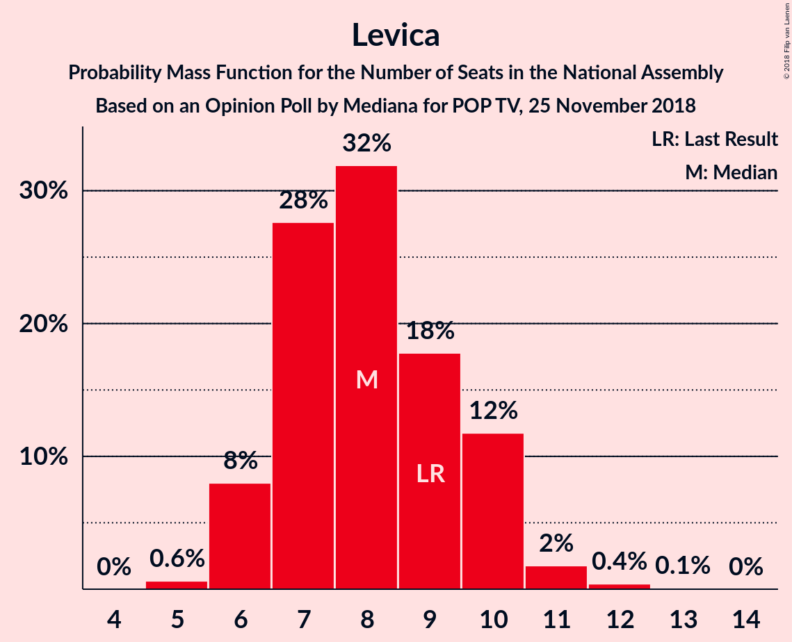
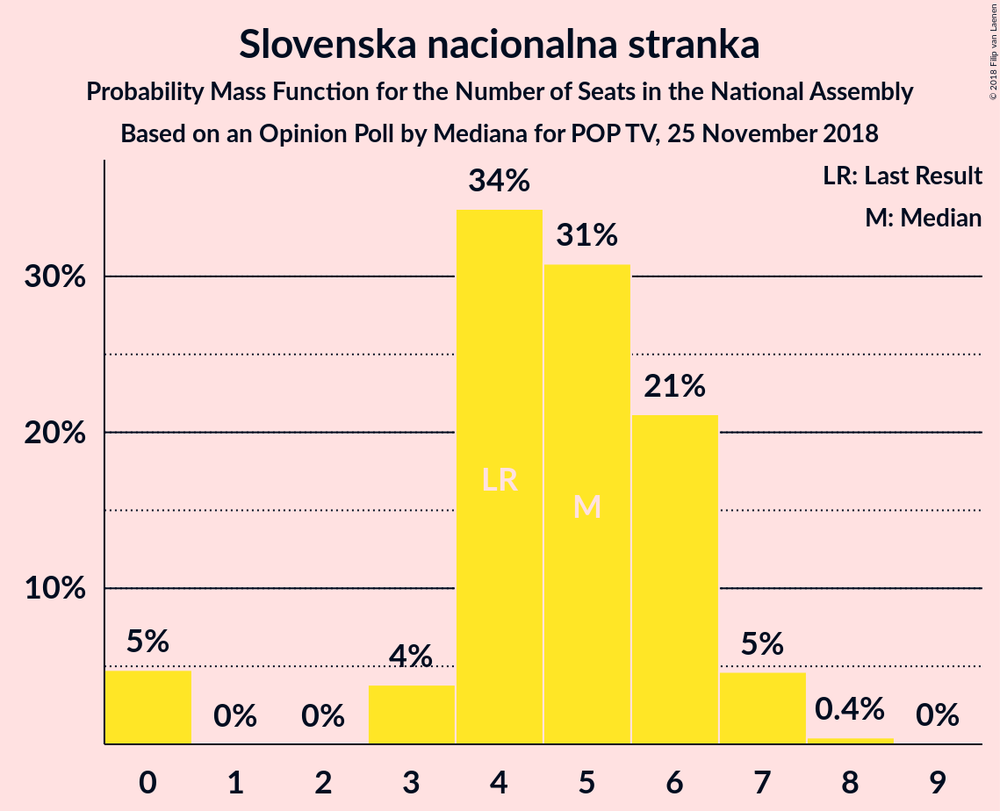
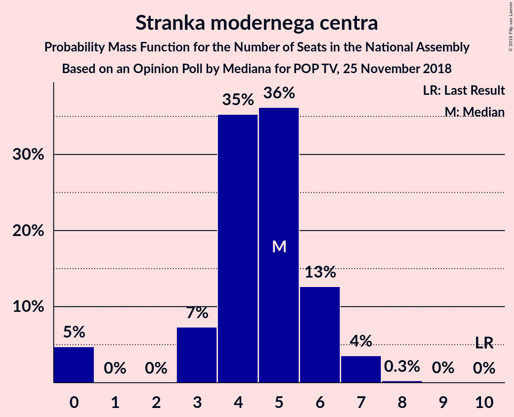
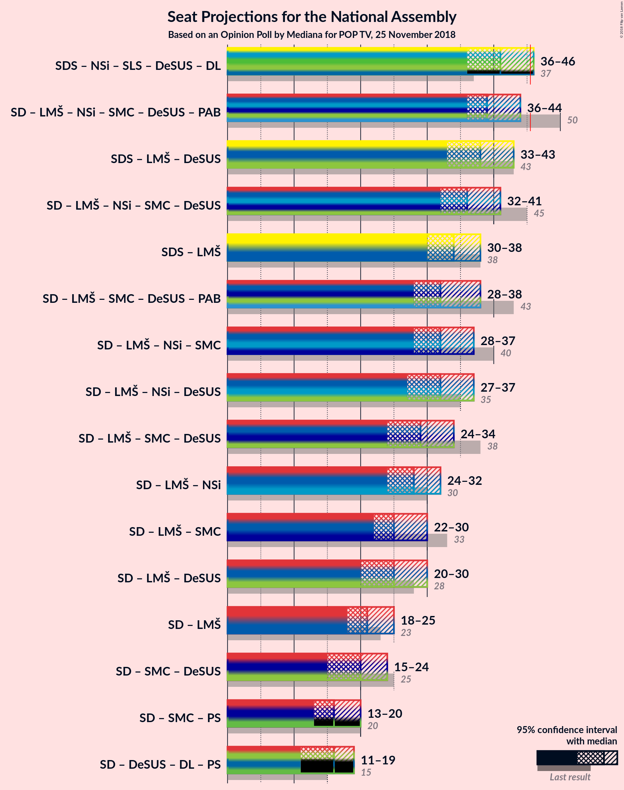

# Opinion Poll by Mediana for POP TV, 25 November 2018

<a href="#voting-intentions">Voting Intentions</a> | <a href="#seats">Seats</a> | <a href="#coalitions">Coalitions</a> | <a href="#technical-information">Technical Information</a>

## Voting Intentions

### Confidence Intervals

| Party | Last Result | Poll Result | 80% Confidence Interval | 90% Confidence Interval | 95% Confidence Interval | 99% Confidence Interval |
|:-----:|:-----------:|:-----------:|:-----------------------:|:-----------------------:|:-----------------------:|:-----------------------:|
| Slovenska demokratska stranka | 24.9% | 26.9% | 24.5–29.5% |23.8–30.2% |23.2–30.8% |22.1–32.1% |
| Socialni demokrati | 9.9% | 13.1% | 11.3–15.1% |10.8–15.7% |10.4–16.2% |9.6–17.3% |
| Lista Marjana Šarca | 12.6% | 10.2% | 8.6–12.1% |8.2–12.6% |7.9–13.1% |7.2–14.0% |
| Levica | 9.3% | 9.0% | 7.6–10.8% |7.2–11.3% |6.8–11.8% |6.2–12.7% |
| Nova Slovenija–Krščanski demokrati | 7.2% | 8.1% | 6.7–9.8% |6.3–10.3% |6.0–10.7% |5.4–11.6% |
| Slovenska nacionalna stranka | 4.2% | 5.6% | 4.5–7.1% |4.2–7.5% |3.9–7.9% |3.4–8.7% |
| Slovenska ljudska stranka | 2.6% | 5.6% | 4.5–7.1% |4.2–7.5% |3.9–7.9% |3.4–8.7% |
| Stranka modernega centra | 9.7% | 5.4% | 4.3–6.9% |4.0–7.3% |3.7–7.7% |3.3–8.4% |
| Demokratična stranka upokojencev Slovenije | 4.9% | 5.0% | 4.0–6.4% |3.7–6.9% |3.4–7.2% |3.0–8.0% |
| Stranka Alenke Bratušek | 5.1% | 4.6% | 3.6–6.0% |3.3–6.4% |3.1–6.8% |2.7–7.5% |

*Note:* The poll result column reflects the actual value used in the calculations. Published results may vary slightly, and in addition be rounded to fewer digits.

## Seats

### Confidence Intervals

| Party | Last Result | Median | 80% Confidence Interval | 90% Confidence Interval | 95% Confidence Interval | 99% Confidence Interval |
|:-----:|:-----------:|:------:|:-----------------------:|:-----------------------:|:-----------------------:|:-----------------------:|
| <a href="#slovenska-demokratska-stranka">Slovenska demokratska stranka</a> | 25 | 27 | 23–27 |22–27 |22–28 |20–29 |
| <a href="#socialni-demokrati">Socialni demokrati</a> | 10 | 10 | 10–13 |10–13 |9–14 |9–15 |
| <a href="#lista-marjana-šarca">Lista Marjana Šarca</a> | 13 | 9 | 8–11 |7–11 |7–11 |7–12 |
| <a href="#levica">Levica</a> | 9 | 8 | 7–9 |6–10 |6–10 |5–11 |
| <a href="#nova-slovenija–krščanski-demokrati">Nova Slovenija–Krščanski demokrati</a> | 7 | 7 | 6–8 |6–9 |5–10 |5–10 |
| <a href="#slovenska-nacionalna-stranka">Slovenska nacionalna stranka</a> | 4 | 4 | 4–6 |0–7 |0–7 |0–7 |
| <a href="#slovenska-ljudska-stranka">Slovenska ljudska stranka</a> | 0 | 5 | 4–6 |4–6 |0–7 |0–8 |
| <a href="#stranka-modernega-centra">Stranka modernega centra</a> | 10 | 5 | 4–6 |3–6 |0–7 |0–7 |
| <a href="#demokratična-stranka-upokojencev-slovenije">Demokratična stranka upokojencev Slovenije</a> | 5 | 3 | 3–5 |0–6 |0–6 |0–7 |
| <a href="#stranka-alenke-bratušek">Stranka Alenke Bratušek</a> | 5 | 4 | 3–5 |3–5 |0–6 |0–6 |

### Slovenska demokratska stranka

*For a full overview of the results for this party, see the [Slovenska demokratska stranka](party-slovenskademokratskastranka.html) page.*

| Number of Seats | Probability | Accumulated | Special Marks |
|:---------------:|:-----------:|:-----------:|:-------------:|
| 19 | 0.1% | 100% |  |
| 20 | 0.8% | 99.9% |  |
| 21 | 2% | 99.0% |  |
| 22 | 6% | 98% |  |
| 23 | 7% | 92% |  |
| 24 | 10% | 85% |  |
| 25 | 6% | 75% | Last Result |
| 26 | 7% | 69% |  |
| 27 | 59% | 62% | Median |
| 28 | 1.2% | 3% |  |
| 29 | 1.4% | 2% |  |
| 30 | 0.3% | 0.5% |  |
| 31 | 0.1% | 0.2% |  |
| 32 | 0% | 0% |  |

### Socialni demokrati

*For a full overview of the results for this party, see the [Socialni demokrati](party-socialnidemokrati.html) page.*

| Number of Seats | Probability | Accumulated | Special Marks |
|:---------------:|:-----------:|:-----------:|:-------------:|
| 8 | 0.1% | 100% |  |
| 9 | 5% | 99.9% |  |
| 10 | 59% | 95% | Last Result, Median |
| 11 | 13% | 36% |  |
| 12 | 12% | 22% |  |
| 13 | 6% | 11% |  |
| 14 | 4% | 5% |  |
| 15 | 0.5% | 0.9% |  |
| 16 | 0.3% | 0.5% |  |
| 17 | 0.2% | 0.2% |  |
| 18 | 0% | 0% |  |

### Lista Marjana Šarca

*For a full overview of the results for this party, see the [Lista Marjana Šarca](party-listamarjanašarca.html) page.*

| Number of Seats | Probability | Accumulated | Special Marks |
|:---------------:|:-----------:|:-----------:|:-------------:|
| 5 | 0.1% | 100% |  |
| 6 | 0.4% | 99.9% |  |
| 7 | 6% | 99.6% |  |
| 8 | 14% | 94% |  |
| 9 | 61% | 80% | Median |
| 10 | 7% | 19% |  |
| 11 | 10% | 12% |  |
| 12 | 1.2% | 2% |  |
| 13 | 0.4% | 0.4% | Last Result |
| 14 | 0% | 0.1% |  |
| 15 | 0% | 0% |  |

### Levica

*For a full overview of the results for this party, see the [Levica](party-levica.html) page.*

| Number of Seats | Probability | Accumulated | Special Marks |
|:---------------:|:-----------:|:-----------:|:-------------:|
| 5 | 0.7% | 100% |  |
| 6 | 5% | 99.3% |  |
| 7 | 10% | 94% |  |
| 8 | 70% | 84% | Median |
| 9 | 8% | 14% | Last Result |
| 10 | 4% | 6% |  |
| 11 | 1.0% | 1.4% |  |
| 12 | 0.3% | 0.4% |  |
| 13 | 0% | 0% |  |

### Nova Slovenija–Krščanski demokrati

*For a full overview of the results for this party, see the [Nova Slovenija–Krščanski demokrati](party-novaslovenija–krščanskidemokrati.html) page.*

| Number of Seats | Probability | Accumulated | Special Marks |
|:---------------:|:-----------:|:-----------:|:-------------:|
| 4 | 0.1% | 100% |  |
| 5 | 3% | 99.8% |  |
| 6 | 11% | 96% |  |
| 7 | 64% | 86% | Last Result, Median |
| 8 | 14% | 22% |  |
| 9 | 5% | 8% |  |
| 10 | 3% | 3% |  |
| 11 | 0.2% | 0.2% |  |
| 12 | 0% | 0% |  |

### Slovenska nacionalna stranka

*For a full overview of the results for this party, see the [Slovenska nacionalna stranka](party-slovenskanacionalnastranka.html) page.*

| Number of Seats | Probability | Accumulated | Special Marks |
|:---------------:|:-----------:|:-----------:|:-------------:|
| 0 | 6% | 100% |  |
| 1 | 0% | 94% |  |
| 2 | 0% | 94% |  |
| 3 | 3% | 94% |  |
| 4 | 67% | 90% | Last Result, Median |
| 5 | 12% | 24% |  |
| 6 | 6% | 12% |  |
| 7 | 6% | 6% |  |
| 8 | 0.3% | 0.4% |  |
| 9 | 0.1% | 0.1% |  |
| 10 | 0% | 0% |  |

### Slovenska ljudska stranka

*For a full overview of the results for this party, see the [Slovenska ljudska stranka](party-slovenskaljudskastranka.html) page.*

| Number of Seats | Probability | Accumulated | Special Marks |
|:---------------:|:-----------:|:-----------:|:-------------:|
| 0 | 3% | 100% | Last Result |
| 1 | 0% | 97% |  |
| 2 | 0% | 97% |  |
| 3 | 1.0% | 97% |  |
| 4 | 14% | 96% |  |
| 5 | 65% | 82% | Median |
| 6 | 15% | 18% |  |
| 7 | 2% | 3% |  |
| 8 | 0.9% | 0.9% |  |
| 9 | 0.1% | 0.1% |  |
| 10 | 0% | 0% |  |

### Stranka modernega centra

*For a full overview of the results for this party, see the [Stranka modernega centra](party-strankamodernegacentra.html) page.*

| Number of Seats | Probability | Accumulated | Special Marks |
|:---------------:|:-----------:|:-----------:|:-------------:|
| 0 | 5% | 100% |  |
| 1 | 0% | 95% |  |
| 2 | 0% | 95% |  |
| 3 | 2% | 95% |  |
| 4 | 15% | 93% |  |
| 5 | 67% | 78% | Median |
| 6 | 8% | 11% |  |
| 7 | 3% | 3% |  |
| 8 | 0.2% | 0.2% |  |
| 9 | 0.1% | 0.1% |  |
| 10 | 0% | 0% | Last Result |

### Demokratična stranka upokojencev Slovenije

*For a full overview of the results for this party, see the [Demokratična stranka upokojencev Slovenije](party-demokratičnastrankaupokojencevslovenije.html) page.*

| Number of Seats | Probability | Accumulated | Special Marks |
|:---------------:|:-----------:|:-----------:|:-------------:|
| 0 | 7% | 100% |  |
| 1 | 0% | 93% |  |
| 2 | 0% | 93% |  |
| 3 | 53% | 93% | Median |
| 4 | 16% | 39% |  |
| 5 | 18% | 24% | Last Result |
| 6 | 5% | 6% |  |
| 7 | 0.7% | 0.8% |  |
| 8 | 0.1% | 0.1% |  |
| 9 | 0% | 0% |  |

### Stranka Alenke Bratušek

*For a full overview of the results for this party, see the [Stranka Alenke Bratušek](party-strankaalenkebratušek.html) page.*

| Number of Seats | Probability | Accumulated | Special Marks |
|:---------------:|:-----------:|:-----------:|:-------------:|
| 0 | 5% | 100% |  |
| 1 | 0% | 95% |  |
| 2 | 0% | 95% |  |
| 3 | 9% | 95% |  |
| 4 | 76% | 86% | Median |
| 5 | 7% | 10% | Last Result |
| 6 | 3% | 3% |  |
| 7 | 0.1% | 0.2% |  |
| 8 | 0% | 0% |  |

## Coalitions

### Confidence Intervals

| Coalition | Last Result | Median | Majority? | 80% Confidence Interval | 90% Confidence Interval | 95% Confidence Interval | 99% Confidence Interval |
|:---------:|:-----------:|:------:|:---------:|:-----------------------:|:-----------------------:|:-----------------------:|:-----------------------:|
| Socialni demokrati – Lista Marjana Šarca – Nova Slovenija–Krščanski demokrati – Stranka modernega centra – Demokratična stranka upokojencev Slovenije – Stranka Alenke Bratušek | 50 | 38 | 0.9% | 38–42 | 37–44 | 36–44 | 33–46 |
| Slovenska demokratska stranka – Lista Marjana Šarca – Demokratična stranka upokojencev Slovenije | 43 | 39 | 0.1% | 36–39 | 35–40 | 33–42 | 33–44 |
| Socialni demokrati – Lista Marjana Šarca – Nova Slovenija–Krščanski demokrati – Stranka modernega centra – Demokratična stranka upokojencev Slovenije | 45 | 34 | 0% | 34–38 | 34–40 | 33–40 | 31–42 |
| Slovenska demokratska stranka – Lista Marjana Šarca | 38 | 36 | 0% | 32–36 | 30–37 | 29–37 | 29–39 |
| Socialni demokrati – Lista Marjana Šarca – Stranka modernega centra – Demokratična stranka upokojencev Slovenije – Stranka Alenke Bratušek | 43 | 31 | 0% | 31–35 | 30–36 | 30–36 | 26–39 |
| Socialni demokrati – Lista Marjana Šarca – Nova Slovenija–Krščanski demokrati – Stranka modernega centra | 40 | 31 | 0% | 30–34 | 29–35 | 29–36 | 27–37 |
| Socialni demokrati – Lista Marjana Šarca – Nova Slovenija–Krščanski demokrati – Demokratična stranka upokojencev Slovenije | 35 | 29 | 0% | 29–34 | 29–35 | 28–36 | 27–38 |
| Socialni demokrati – Lista Marjana Šarca – Stranka modernega centra – Demokratična stranka upokojencev Slovenije | 38 | 27 | 0% | 27–31 | 26–32 | 26–33 | 23–35 |
| Socialni demokrati – Lista Marjana Šarca – Nova Slovenija–Krščanski demokrati | 30 | 26 | 0% | 26–30 | 25–31 | 25–32 | 23–33 |
| Socialni demokrati – Lista Marjana Šarca – Stranka modernega centra | 33 | 24 | 0% | 23–27 | 23–28 | 22–28 | 20–31 |
| Socialni demokrati – Lista Marjana Šarca – Demokratična stranka upokojencev Slovenije | 28 | 22 | 0% | 22–26 | 21–28 | 21–28 | 20–30 |
| Socialni demokrati – Lista Marjana Šarca | 23 | 19 | 0% | 19–22 | 18–23 | 18–24 | 16–26 |
| Socialni demokrati – Stranka modernega centra – Demokratična stranka upokojencev Slovenije | 25 | 18 | 0% | 17–22 | 16–23 | 16–24 | 14–25 |

### Socialni demokrati – Lista Marjana Šarca – Nova Slovenija–Krščanski demokrati – Stranka modernega centra – Demokratična stranka upokojencev Slovenije – Stranka Alenke Bratušek

| Number of Seats | Probability | Accumulated | Special Marks |
|:---------------:|:-----------:|:-----------:|:-------------:|
| 31 | 0.1% | 100% |  |
| 32 | 0.4% | 99.9% |  |
| 33 | 0.2% | 99.6% |  |
| 34 | 0.2% | 99.4% |  |
| 35 | 0.7% | 99.2% |  |
| 36 | 2% | 98.5% |  |
| 37 | 6% | 96% |  |
| 38 | 58% | 90% | Median |
| 39 | 4% | 32% |  |
| 40 | 10% | 28% |  |
| 41 | 2% | 18% |  |
| 42 | 7% | 16% |  |
| 43 | 4% | 9% |  |
| 44 | 4% | 6% |  |
| 45 | 0.5% | 1.5% |  |
| 46 | 0.7% | 0.9% | Majority |
| 47 | 0.1% | 0.2% |  |
| 48 | 0.2% | 0.2% |  |
| 49 | 0% | 0% |  |
| 50 | 0% | 0% | Last Result |

### Slovenska demokratska stranka – Lista Marjana Šarca – Demokratična stranka upokojencev Slovenije

| Number of Seats | Probability | Accumulated | Special Marks |
|:---------------:|:-----------:|:-----------:|:-------------:|
| 31 | 0.2% | 100% |  |
| 32 | 0.2% | 99.8% |  |
| 33 | 3% | 99.6% |  |
| 34 | 1.0% | 97% |  |
| 35 | 3% | 95% |  |
| 36 | 5% | 93% |  |
| 37 | 12% | 88% |  |
| 38 | 2% | 76% |  |
| 39 | 67% | 74% | Median |
| 40 | 3% | 7% |  |
| 41 | 0.8% | 4% |  |
| 42 | 0.8% | 3% |  |
| 43 | 1.3% | 2% | Last Result |
| 44 | 0.6% | 0.8% |  |
| 45 | 0.1% | 0.2% |  |
| 46 | 0% | 0.1% | Majority |
| 47 | 0% | 0% |  |

### Socialni demokrati – Lista Marjana Šarca – Nova Slovenija–Krščanski demokrati – Stranka modernega centra – Demokratična stranka upokojencev Slovenije

| Number of Seats | Probability | Accumulated | Special Marks |
|:---------------:|:-----------:|:-----------:|:-------------:|
| 28 | 0.1% | 100% |  |
| 29 | 0.2% | 99.9% |  |
| 30 | 0.2% | 99.7% |  |
| 31 | 0.4% | 99.5% |  |
| 32 | 1.0% | 99.1% |  |
| 33 | 2% | 98% |  |
| 34 | 63% | 96% | Median |
| 35 | 3% | 33% |  |
| 36 | 8% | 30% |  |
| 37 | 8% | 22% |  |
| 38 | 4% | 14% |  |
| 39 | 4% | 10% |  |
| 40 | 5% | 6% |  |
| 41 | 0.7% | 1.2% |  |
| 42 | 0.2% | 0.6% |  |
| 43 | 0.3% | 0.3% |  |
| 44 | 0% | 0.1% |  |
| 45 | 0.1% | 0.1% | Last Result |
| 46 | 0% | 0% | Majority |

### Slovenska demokratska stranka – Lista Marjana Šarca

| Number of Seats | Probability | Accumulated | Special Marks |
|:---------------:|:-----------:|:-----------:|:-------------:|
| 28 | 0.1% | 100% |  |
| 29 | 3% | 99.8% |  |
| 30 | 3% | 97% |  |
| 31 | 2% | 94% |  |
| 32 | 7% | 92% |  |
| 33 | 5% | 85% |  |
| 34 | 12% | 80% |  |
| 35 | 5% | 68% |  |
| 36 | 55% | 63% | Median |
| 37 | 6% | 8% |  |
| 38 | 1.0% | 2% | Last Result |
| 39 | 0.8% | 1.1% |  |
| 40 | 0.2% | 0.3% |  |
| 41 | 0.1% | 0.1% |  |
| 42 | 0% | 0% |  |

### Socialni demokrati – Lista Marjana Šarca – Stranka modernega centra – Demokratična stranka upokojencev Slovenije – Stranka Alenke Bratušek

| Number of Seats | Probability | Accumulated | Special Marks |
|:---------------:|:-----------:|:-----------:|:-------------:|
| 23 | 0.1% | 100% |  |
| 24 | 0% | 99.9% |  |
| 25 | 0.3% | 99.9% |  |
| 26 | 0.5% | 99.7% |  |
| 27 | 0.4% | 99.2% |  |
| 28 | 0.3% | 98.7% |  |
| 29 | 0.8% | 98% |  |
| 30 | 5% | 98% |  |
| 31 | 62% | 92% | Median |
| 32 | 8% | 30% |  |
| 33 | 5% | 21% |  |
| 34 | 3% | 16% |  |
| 35 | 5% | 13% |  |
| 36 | 6% | 8% |  |
| 37 | 0.4% | 2% |  |
| 38 | 1.0% | 2% |  |
| 39 | 0.9% | 1.0% |  |
| 40 | 0.1% | 0.1% |  |
| 41 | 0% | 0% |  |
| 42 | 0% | 0% |  |
| 43 | 0% | 0% | Last Result |

### Socialni demokrati – Lista Marjana Šarca – Nova Slovenija–Krščanski demokrati – Stranka modernega centra

| Number of Seats | Probability | Accumulated | Special Marks |
|:---------------:|:-----------:|:-----------:|:-------------:|
| 25 | 0.1% | 100% |  |
| 26 | 0.2% | 99.8% |  |
| 27 | 0.7% | 99.6% |  |
| 28 | 0.6% | 99.0% |  |
| 29 | 8% | 98% |  |
| 30 | 3% | 91% |  |
| 31 | 56% | 88% | Median |
| 32 | 8% | 32% |  |
| 33 | 8% | 24% |  |
| 34 | 8% | 16% |  |
| 35 | 3% | 8% |  |
| 36 | 3% | 5% |  |
| 37 | 1.1% | 2% |  |
| 38 | 0.3% | 0.5% |  |
| 39 | 0.1% | 0.2% |  |
| 40 | 0% | 0.1% | Last Result |
| 41 | 0.1% | 0.1% |  |
| 42 | 0% | 0% |  |

### Socialni demokrati – Lista Marjana Šarca – Nova Slovenija–Krščanski demokrati – Demokratična stranka upokojencev Slovenije

| Number of Seats | Probability | Accumulated | Special Marks |
|:---------------:|:-----------:|:-----------:|:-------------:|
| 25 | 0.1% | 100% |  |
| 26 | 0.1% | 99.9% |  |
| 27 | 1.1% | 99.7% |  |
| 28 | 2% | 98.6% |  |
| 29 | 57% | 97% | Median |
| 30 | 9% | 40% |  |
| 31 | 4% | 31% |  |
| 32 | 10% | 28% |  |
| 33 | 7% | 18% |  |
| 34 | 4% | 11% |  |
| 35 | 2% | 7% | Last Result |
| 36 | 4% | 5% |  |
| 37 | 0.4% | 0.9% |  |
| 38 | 0.3% | 0.5% |  |
| 39 | 0.1% | 0.2% |  |
| 40 | 0% | 0.1% |  |
| 41 | 0.1% | 0.1% |  |
| 42 | 0% | 0% |  |

### Socialni demokrati – Lista Marjana Šarca – Stranka modernega centra – Demokratična stranka upokojencev Slovenije

| Number of Seats | Probability | Accumulated | Special Marks |
|:---------------:|:-----------:|:-----------:|:-------------:|
| 22 | 0.1% | 100% |  |
| 23 | 0.6% | 99.8% |  |
| 24 | 0.2% | 99.2% |  |
| 25 | 1.1% | 99.1% |  |
| 26 | 5% | 98% |  |
| 27 | 54% | 93% | Median |
| 28 | 16% | 39% |  |
| 29 | 4% | 22% |  |
| 30 | 7% | 18% |  |
| 31 | 3% | 12% |  |
| 32 | 5% | 9% |  |
| 33 | 2% | 4% |  |
| 34 | 0.7% | 1.3% |  |
| 35 | 0.5% | 0.6% |  |
| 36 | 0.1% | 0.1% |  |
| 37 | 0% | 0% |  |
| 38 | 0% | 0% | Last Result |

### Socialni demokrati – Lista Marjana Šarca – Nova Slovenija–Krščanski demokrati

| Number of Seats | Probability | Accumulated | Special Marks |
|:---------------:|:-----------:|:-----------:|:-------------:|
| 22 | 0.1% | 100% |  |
| 23 | 0.7% | 99.9% |  |
| 24 | 1.5% | 99.2% |  |
| 25 | 8% | 98% |  |
| 26 | 55% | 90% | Median |
| 27 | 11% | 36% |  |
| 28 | 5% | 25% |  |
| 29 | 9% | 20% |  |
| 30 | 6% | 11% | Last Result |
| 31 | 1.0% | 6% |  |
| 32 | 4% | 5% |  |
| 33 | 0.5% | 0.8% |  |
| 34 | 0.1% | 0.3% |  |
| 35 | 0% | 0.1% |  |
| 36 | 0.1% | 0.1% |  |
| 37 | 0.1% | 0.1% |  |
| 38 | 0% | 0% |  |

### Socialni demokrati – Lista Marjana Šarca – Stranka modernega centra

| Number of Seats | Probability | Accumulated | Special Marks |
|:---------------:|:-----------:|:-----------:|:-------------:|
| 18 | 0.1% | 100% |  |
| 19 | 0.2% | 99.9% |  |
| 20 | 1.0% | 99.7% |  |
| 21 | 0.4% | 98.7% |  |
| 22 | 2% | 98% |  |
| 23 | 10% | 96% |  |
| 24 | 61% | 87% | Median |
| 25 | 5% | 26% |  |
| 26 | 10% | 21% |  |
| 27 | 4% | 11% |  |
| 28 | 5% | 7% |  |
| 29 | 1.1% | 2% |  |
| 30 | 0.5% | 1.0% |  |
| 31 | 0.3% | 0.5% |  |
| 32 | 0.1% | 0.2% |  |
| 33 | 0.1% | 0.1% | Last Result |
| 34 | 0% | 0% |  |

### Socialni demokrati – Lista Marjana Šarca – Demokratična stranka upokojencev Slovenije

| Number of Seats | Probability | Accumulated | Special Marks |
|:---------------:|:-----------:|:-----------:|:-------------:|
| 18 | 0.1% | 100% |  |
| 19 | 0.3% | 99.9% |  |
| 20 | 0.9% | 99.6% |  |
| 21 | 4% | 98.7% |  |
| 22 | 54% | 94% | Median |
| 23 | 6% | 40% |  |
| 24 | 9% | 34% |  |
| 25 | 10% | 25% |  |
| 26 | 6% | 15% |  |
| 27 | 3% | 8% |  |
| 28 | 4% | 6% | Last Result |
| 29 | 0.6% | 1.5% |  |
| 30 | 0.5% | 0.9% |  |
| 31 | 0.3% | 0.4% |  |
| 32 | 0.1% | 0.1% |  |
| 33 | 0.1% | 0.1% |  |
| 34 | 0% | 0% |  |

### Socialni demokrati – Lista Marjana Šarca

| Number of Seats | Probability | Accumulated | Special Marks |
|:---------------:|:-----------:|:-----------:|:-------------:|
| 16 | 0.8% | 100% |  |
| 17 | 0.5% | 99.2% |  |
| 18 | 4% | 98.7% |  |
| 19 | 61% | 94% | Median |
| 20 | 8% | 33% |  |
| 21 | 13% | 25% |  |
| 22 | 4% | 12% |  |
| 23 | 3% | 8% | Last Result |
| 24 | 4% | 5% |  |
| 25 | 0.4% | 1.1% |  |
| 26 | 0.4% | 0.7% |  |
| 27 | 0.3% | 0.3% |  |
| 28 | 0% | 0.1% |  |
| 29 | 0% | 0% |  |

### Socialni demokrati – Stranka modernega centra – Demokratična stranka upokojencev Slovenije

| Number of Seats | Probability | Accumulated | Special Marks |
|:---------------:|:-----------:|:-----------:|:-------------:|
| 12 | 0.1% | 100% |  |
| 13 | 0.1% | 99.9% |  |
| 14 | 0.3% | 99.8% |  |
| 15 | 2% | 99.4% |  |
| 16 | 4% | 98% |  |
| 17 | 5% | 94% |  |
| 18 | 55% | 89% | Median |
| 19 | 5% | 34% |  |
| 20 | 12% | 29% |  |
| 21 | 5% | 18% |  |
| 22 | 3% | 13% |  |
| 23 | 5% | 9% |  |
| 24 | 3% | 4% |  |
| 25 | 0.7% | 1.0% | Last Result |
| 26 | 0.2% | 0.2% |  |
| 27 | 0.1% | 0.1% |  |
| 28 | 0% | 0% |  |

## Technical Information

### Opinion Poll

+ **Polling firm:** Mediana
+ **Commissioner(s):** POP TV
+ **Fieldwork period:** 25 November 2018

### Calculations

+ **Sample size:** 521
+ **Simulations done:** 131,072
+ **Error estimate:** 2.03%

