# Opinion Poll by Parsifal SC, 4–7 December 2018

<a href="#voting-intentions">Voting Intentions</a> | <a href="#seats">Seats</a> | <a href="#coalitions">Coalitions</a> | <a href="#technical-information">Technical Information</a>

## Voting Intentions

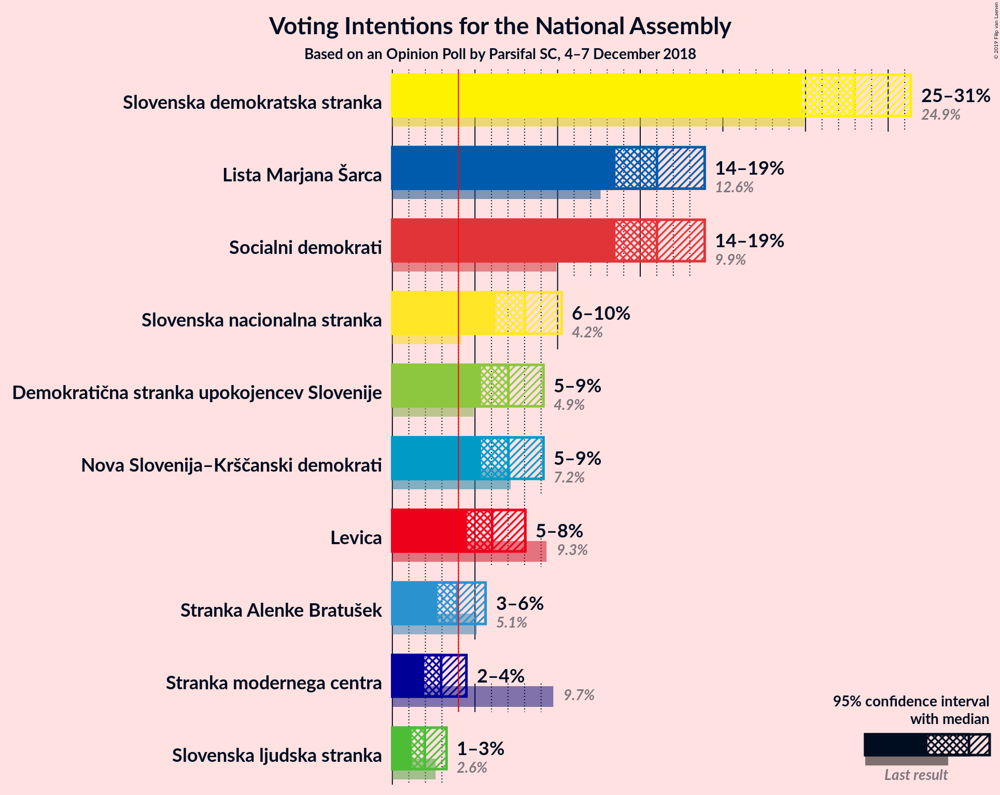

### Confidence Intervals

| Party | Last Result | Poll Result | 80% Confidence Interval | 90% Confidence Interval | 95% Confidence Interval | 99% Confidence Interval |
|:-----:|:-----------:|:-----------:|:-----------------------:|:-----------------------:|:-----------------------:|:-----------------------:|
| Slovenska demokratska stranka | 24.9% | 27.9% | 25.9–30.2% |25.3–30.8% |24.8–31.4% |23.8–32.4% |
| Lista Marjana Šarca | 12.6% | 16.0% | 14.4–17.9% |13.9–18.4% |13.5–18.9% |12.7–19.8% |
| Socialni demokrati | 9.9% | 16.0% | 14.4–17.9% |13.9–18.4% |13.5–18.9% |12.7–19.8% |
| Slovenska nacionalna stranka | 4.2% | 8.0% | 6.8–9.5% |6.5–9.9% |6.2–10.2% |5.7–11.0% |
| Nova Slovenija–Krščanski demokrati | 7.2% | 7.0% | 5.9–8.4% |5.6–8.8% |5.4–9.1% |4.9–9.8% |
| Demokratična stranka upokojencev Slovenije | 4.9% | 7.0% | 5.9–8.4% |5.6–8.8% |5.4–9.1% |4.9–9.8% |
| Levica | 9.3% | 6.0% | 5.0–7.3% |4.8–7.7% |4.5–8.0% |4.1–8.7% |
| Stranka Alenke Bratušek | 5.1% | 3.9% | 3.1–5.0% |2.9–5.3% |2.7–5.6% |2.4–6.2% |
| Stranka modernega centra | 9.7% | 2.9% | 2.3–3.9% |2.1–4.2% |1.9–4.5% |1.7–5.0% |
| Slovenska ljudska stranka | 2.6% | 2.0% | 1.4–2.8% |1.3–3.1% |1.2–3.3% |1.0–3.7% |

*Note:* The poll result column reflects the actual value used in the calculations. Published results may vary slightly, and in addition be rounded to fewer digits.

## Seats

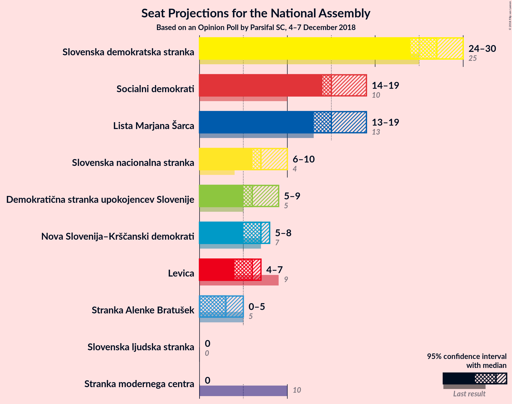

### Confidence Intervals

| Party | Last Result | Median | 80% Confidence Interval | 90% Confidence Interval | 95% Confidence Interval | 99% Confidence Interval |
|:-----:|:-----------:|:------:|:-----------------------:|:-----------------------:|:-----------------------:|:-----------------------:|
| <a href="#slovenska-demokratska-stranka">Slovenska demokratska stranka</a> | 25 | 28 | 25–30 |25–30 |24–31 |23–32 |
| <a href="#lista-marjana-šarca">Lista Marjana Šarca</a> | 13 | 15 | 14–18 |13–19 |13–19 |12–19 |
| <a href="#socialni-demokrati">Socialni demokrati</a> | 10 | 16 | 14–18 |13–18 |13–18 |12–19 |
| <a href="#slovenska-nacionalna-stranka">Slovenska nacionalna stranka</a> | 4 | 7 | 6–9 |6–10 |6–10 |5–11 |
| <a href="#nova-slovenija–krščanski-demokrati">Nova Slovenija–Krščanski demokrati</a> | 7 | 7 | 6–8 |5–8 |5–8 |4–9 |
| <a href="#demokratična-stranka-upokojencev-slovenije">Demokratična stranka upokojencev Slovenije</a> | 5 | 7 | 5–8 |5–8 |5–9 |4–9 |
| <a href="#levica">Levica</a> | 9 | 6 | 4–7 |4–7 |4–7 |4–8 |
| <a href="#stranka-alenke-bratušek">Stranka Alenke Bratušek</a> | 5 | 0 | 0–4 |0–5 |0–5 |0–6 |
| <a href="#stranka-modernega-centra">Stranka modernega centra</a> | 10 | 0 | 0 |0–4 |0–4 |0–4 |
| <a href="#slovenska-ljudska-stranka">Slovenska ljudska stranka</a> | 0 | 0 | 0 |0 |0 |0 |

### Slovenska demokratska stranka

*For a full overview of the results for this party, see the [Slovenska demokratska stranka](party-slovenskademokratskastranka.html) page.*

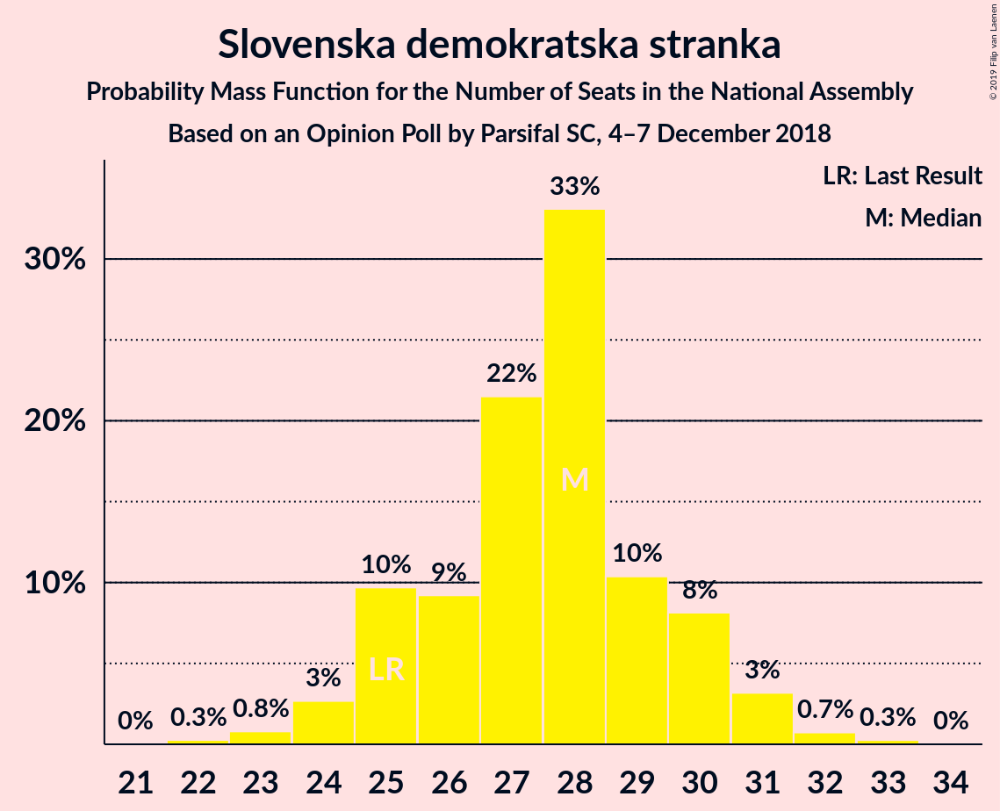

| Number of Seats | Probability | Accumulated | Special Marks |
|:---------------:|:-----------:|:-----------:|:-------------:|
| 22 | 0.3% | 100% |  |
| 23 | 0.8% | 99.7% |  |
| 24 | 3% | 98.9% |  |
| 25 | 10% | 96% | Last Result |
| 26 | 9% | 87% |  |
| 27 | 22% | 77% |  |
| 28 | 33% | 56% | Median |
| 29 | 10% | 23% |  |
| 30 | 8% | 12% |  |
| 31 | 3% | 4% |  |
| 32 | 0.7% | 1.0% |  |
| 33 | 0.3% | 0.3% |  |
| 34 | 0% | 0% |  |

### Lista Marjana Šarca

*For a full overview of the results for this party, see the [Lista Marjana Šarca](party-listamarjanašarca.html) page.*

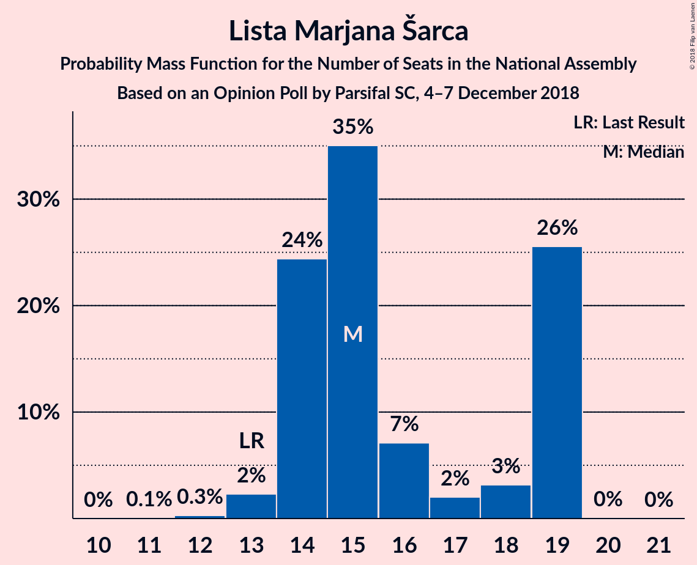

| Number of Seats | Probability | Accumulated | Special Marks |
|:---------------:|:-----------:|:-----------:|:-------------:|
| 11 | 0.1% | 100% |  |
| 12 | 1.0% | 99.9% |  |
| 13 | 8% | 98.9% | Last Result |
| 14 | 20% | 91% |  |
| 15 | 34% | 72% | Median |
| 16 | 11% | 38% |  |
| 17 | 15% | 27% |  |
| 18 | 7% | 12% |  |
| 19 | 5% | 5% |  |
| 20 | 0.4% | 0.4% |  |
| 21 | 0% | 0.1% |  |
| 22 | 0% | 0% |  |

### Socialni demokrati

*For a full overview of the results for this party, see the [Socialni demokrati](party-socialnidemokrati.html) page.*

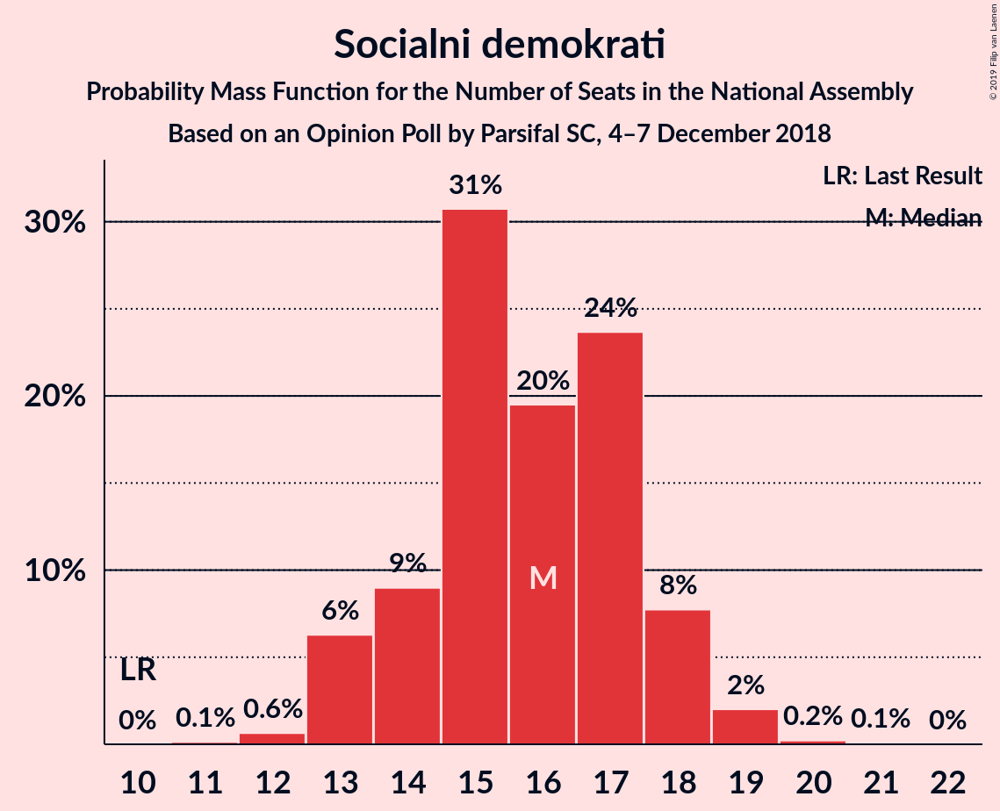

| Number of Seats | Probability | Accumulated | Special Marks |
|:---------------:|:-----------:|:-----------:|:-------------:|
| 10 | 0% | 100% | Last Result |
| 11 | 0.1% | 100% |  |
| 12 | 0.6% | 99.9% |  |
| 13 | 6% | 99.2% |  |
| 14 | 9% | 93% |  |
| 15 | 31% | 84% |  |
| 16 | 20% | 53% | Median |
| 17 | 24% | 34% |  |
| 18 | 8% | 10% |  |
| 19 | 2% | 2% |  |
| 20 | 0.2% | 0.3% |  |
| 21 | 0.1% | 0.1% |  |
| 22 | 0% | 0% |  |

### Slovenska nacionalna stranka

*For a full overview of the results for this party, see the [Slovenska nacionalna stranka](party-slovenskanacionalnastranka.html) page.*

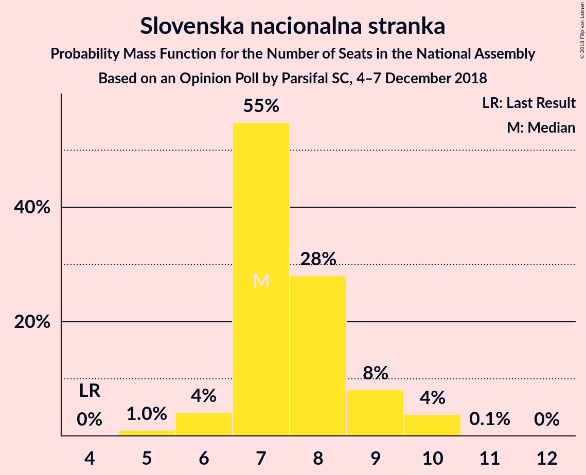

| Number of Seats | Probability | Accumulated | Special Marks |
|:---------------:|:-----------:|:-----------:|:-------------:|
| 4 | 0% | 100% | Last Result |
| 5 | 1.2% | 100% |  |
| 6 | 9% | 98.8% |  |
| 7 | 40% | 90% | Median |
| 8 | 33% | 50% |  |
| 9 | 11% | 17% |  |
| 10 | 5% | 6% |  |
| 11 | 0.6% | 0.6% |  |
| 12 | 0% | 0% |  |

### Nova Slovenija–Krščanski demokrati

*For a full overview of the results for this party, see the [Nova Slovenija–Krščanski demokrati](party-novaslovenija–krščanskidemokrati.html) page.*

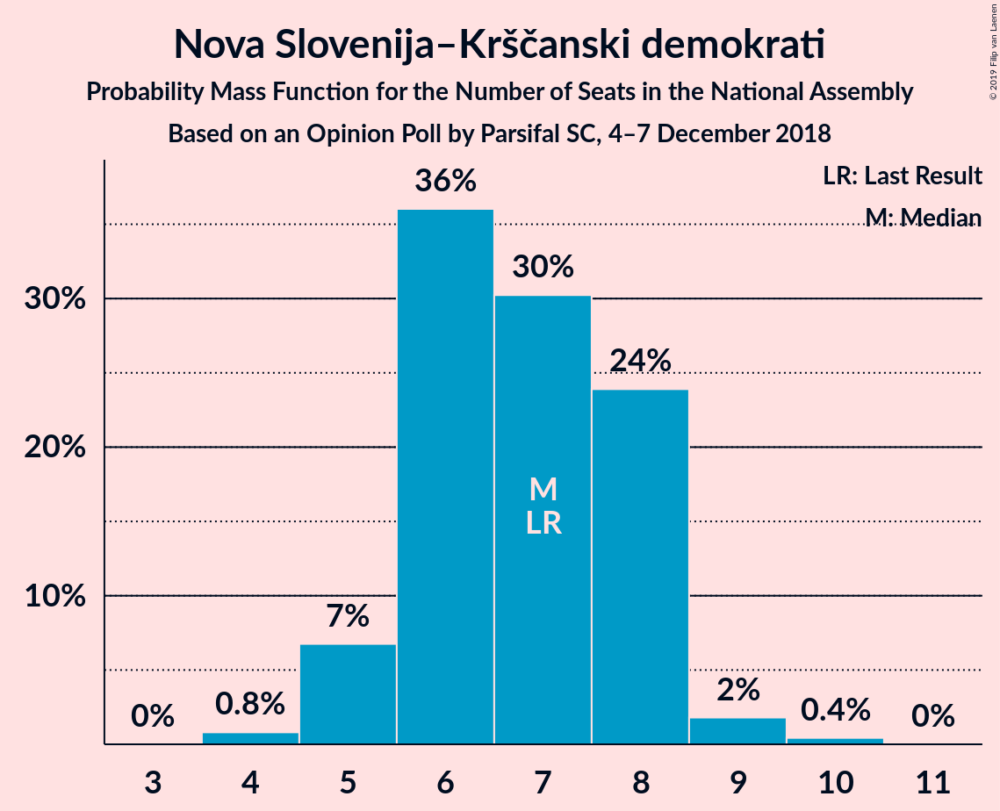

| Number of Seats | Probability | Accumulated | Special Marks |
|:---------------:|:-----------:|:-----------:|:-------------:|
| 4 | 0.8% | 100% |  |
| 5 | 7% | 99.2% |  |
| 6 | 36% | 92% |  |
| 7 | 30% | 56% | Last Result, Median |
| 8 | 24% | 26% |  |
| 9 | 2% | 2% |  |
| 10 | 0.4% | 0.5% |  |
| 11 | 0% | 0% |  |

### Demokratična stranka upokojencev Slovenije

*For a full overview of the results for this party, see the [Demokratična stranka upokojencev Slovenije](party-demokratičnastrankaupokojencevslovenije.html) page.*

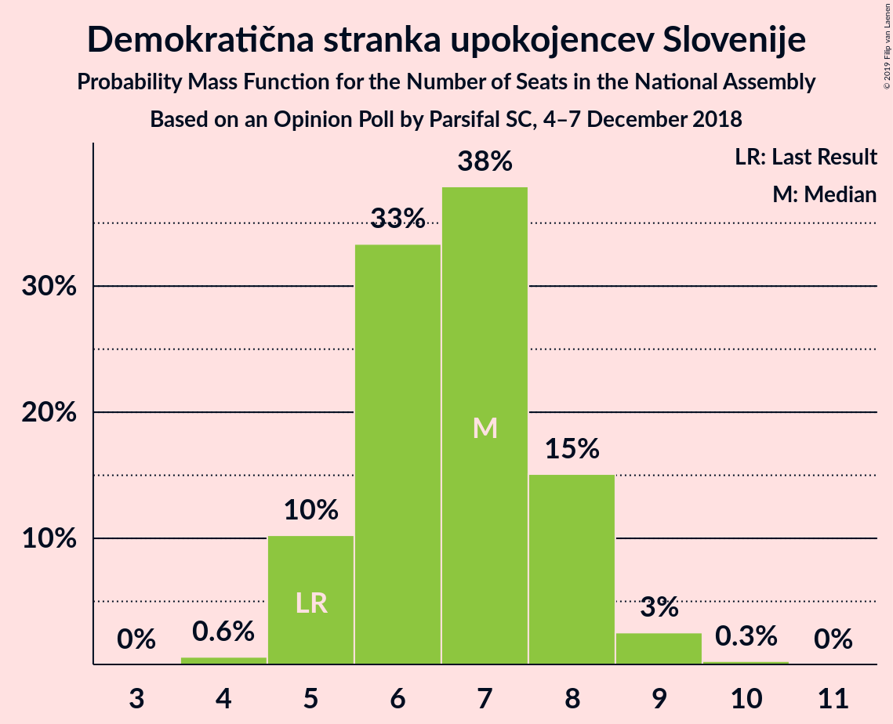

| Number of Seats | Probability | Accumulated | Special Marks |
|:---------------:|:-----------:|:-----------:|:-------------:|
| 4 | 0.6% | 100% |  |
| 5 | 10% | 99.4% | Last Result |
| 6 | 33% | 89% |  |
| 7 | 38% | 56% | Median |
| 8 | 15% | 18% |  |
| 9 | 3% | 3% |  |
| 10 | 0.3% | 0.3% |  |
| 11 | 0% | 0% |  |

### Levica

*For a full overview of the results for this party, see the [Levica](party-levica.html) page.*

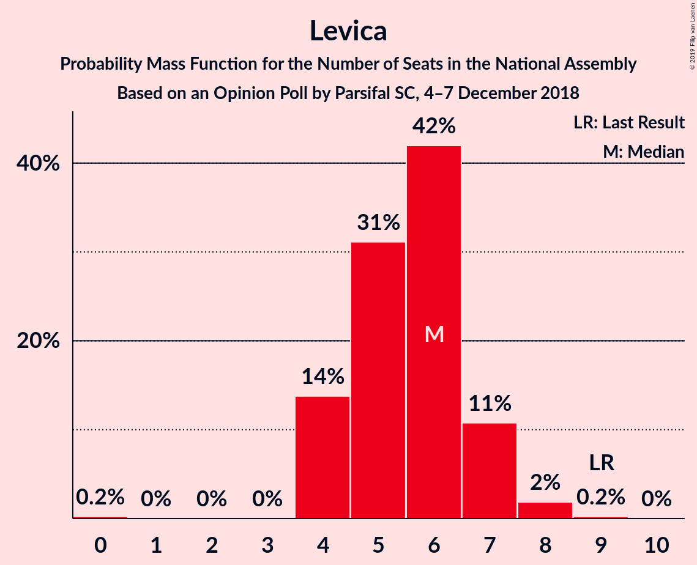

| Number of Seats | Probability | Accumulated | Special Marks |
|:---------------:|:-----------:|:-----------:|:-------------:|
| 0 | 0.2% | 100% |  |
| 1 | 0% | 99.8% |  |
| 2 | 0% | 99.8% |  |
| 3 | 0% | 99.8% |  |
| 4 | 14% | 99.7% |  |
| 5 | 31% | 86% |  |
| 6 | 42% | 55% | Median |
| 7 | 11% | 13% |  |
| 8 | 2% | 2% |  |
| 9 | 0.2% | 0.2% | Last Result |
| 10 | 0% | 0% |  |

### Stranka Alenke Bratušek

*For a full overview of the results for this party, see the [Stranka Alenke Bratušek](party-strankaalenkebratušek.html) page.*

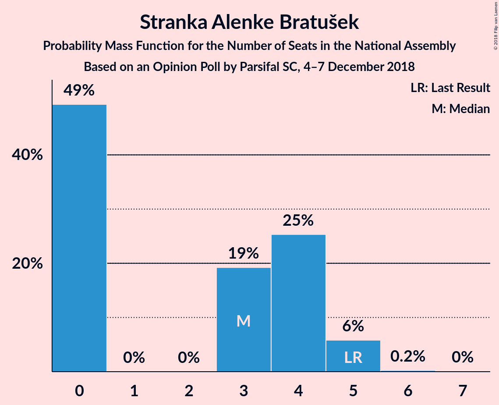

| Number of Seats | Probability | Accumulated | Special Marks |
|:---------------:|:-----------:|:-----------:|:-------------:|
| 0 | 52% | 100% | Median |
| 1 | 0% | 48% |  |
| 2 | 0% | 48% |  |
| 3 | 6% | 48% |  |
| 4 | 33% | 43% |  |
| 5 | 9% | 9% | Last Result |
| 6 | 0.5% | 0.6% |  |
| 7 | 0% | 0% |  |

### Stranka modernega centra

*For a full overview of the results for this party, see the [Stranka modernega centra](party-strankamodernegacentra.html) page.*

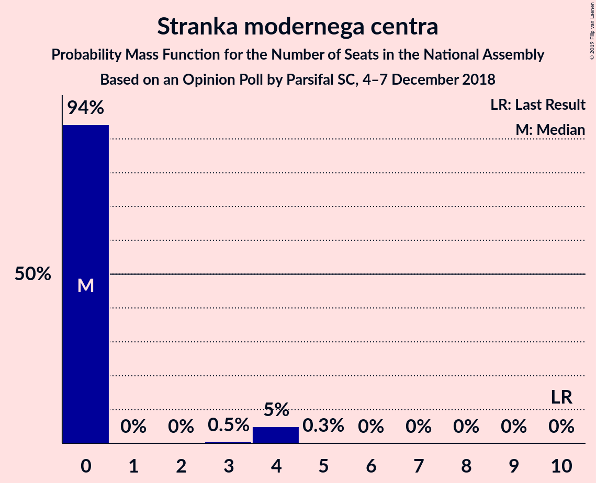

| Number of Seats | Probability | Accumulated | Special Marks |
|:---------------:|:-----------:|:-----------:|:-------------:|
| 0 | 94% | 100% | Median |
| 1 | 0% | 6% |  |
| 2 | 0% | 6% |  |
| 3 | 0.5% | 6% |  |
| 4 | 5% | 5% |  |
| 5 | 0.3% | 0.3% |  |
| 6 | 0% | 0% |  |
| 7 | 0% | 0% |  |
| 8 | 0% | 0% |  |
| 9 | 0% | 0% |  |
| 10 | 0% | 0% | Last Result |

### Slovenska ljudska stranka

*For a full overview of the results for this party, see the [Slovenska ljudska stranka](party-slovenskaljudskastranka.html) page.*

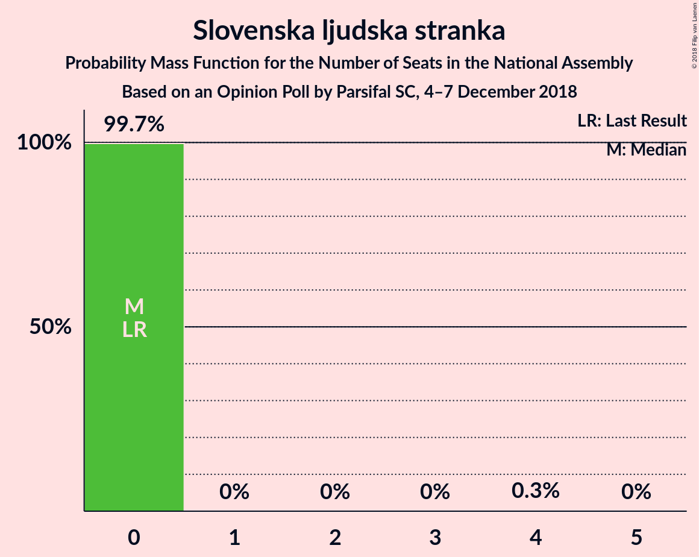

| Number of Seats | Probability | Accumulated | Special Marks |
|:---------------:|:-----------:|:-----------:|:-------------:|
| 0 | 99.8% | 100% | Last Result, Median |
| 1 | 0% | 0.2% |  |
| 2 | 0% | 0.2% |  |
| 3 | 0% | 0.2% |  |
| 4 | 0.2% | 0.2% |  |
| 5 | 0% | 0% |  |

## Coalitions

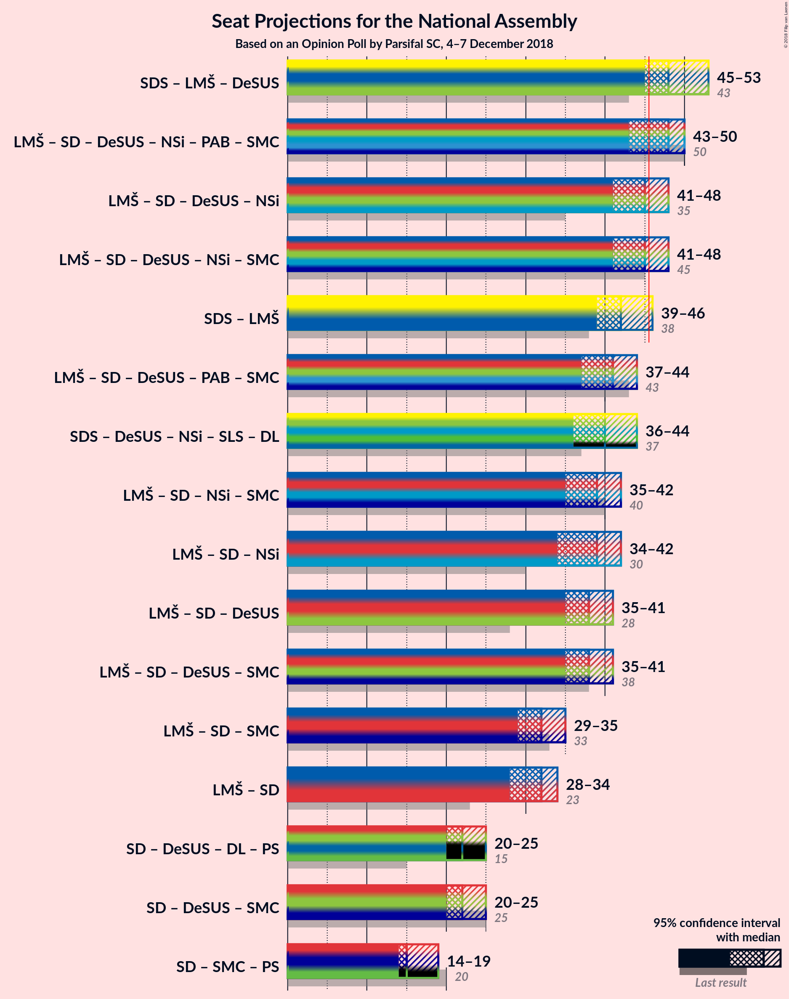

### Confidence Intervals

| Coalition | Last Result | Median | Majority? | 80% Confidence Interval | 90% Confidence Interval | 95% Confidence Interval | 99% Confidence Interval |
|:---------:|:-----------:|:------:|:---------:|:-----------------------:|:-----------------------:|:-----------------------:|:-----------------------:|
| Slovenska demokratska stranka – Lista Marjana Šarca – Demokratična stranka upokojencev Slovenije | 43 | 50 | 97% | 47–53 | 46–53 | 45–53 | 44–56 |
| Lista Marjana Šarca – Socialni demokrati – Demokratična stranka upokojencev Slovenije – Nova Slovenija–Krščanski demokrati – Stranka Alenke Bratušek – Stranka modernega centra | 50 | 47 | 75% | 44–49 | 44–50 | 43–51 | 41–52 |
| Lista Marjana Šarca – Socialni demokrati – Demokratična stranka upokojencev Slovenije – Nova Slovenija–Krščanski demokrati – Stranka modernega centra | 45 | 45 | 41% | 42–48 | 41–48 | 40–49 | 39–51 |
| Lista Marjana Šarca – Socialni demokrati – Demokratična stranka upokojencev Slovenije – Nova Slovenija–Krščanski demokrati | 35 | 45 | 37% | 42–47 | 41–48 | 40–48 | 39–50 |
| Slovenska demokratska stranka – Lista Marjana Šarca | 38 | 43 | 12% | 40–46 | 39–46 | 39–47 | 37–48 |
| Lista Marjana Šarca – Socialni demokrati – Demokratična stranka upokojencev Slovenije – Stranka Alenke Bratušek – Stranka modernega centra | 43 | 39 | 0.9% | 38–43 | 36–43 | 36–44 | 34–46 |
| Lista Marjana Šarca – Socialni demokrati – Demokratična stranka upokojencev Slovenije – Stranka modernega centra | 38 | 38 | 0.1% | 35–41 | 35–41 | 34–42 | 33–44 |
| Lista Marjana Šarca – Socialni demokrati – Nova Slovenija–Krščanski demokrati – Stranka modernega centra | 40 | 38 | 0% | 35–41 | 34–41 | 34–42 | 33–44 |
| Lista Marjana Šarca – Socialni demokrati – Demokratična stranka upokojencev Slovenije | 28 | 38 | 0% | 35–40 | 34–41 | 34–41 | 33–43 |
| Lista Marjana Šarca – Socialni demokrati – Nova Slovenija–Krščanski demokrati | 30 | 38 | 0% | 35–40 | 34–41 | 34–41 | 33–43 |
| Lista Marjana Šarca – Socialni demokrati | 23 | 32 | 0% | 29–34 | 28–34 | 27–35 | 26–36 |
| Lista Marjana Šarca – Socialni demokrati – Stranka modernega centra | 33 | 32 | 0% | 29–34 | 28–35 | 27–35 | 27–37 |
| Socialni demokrati – Demokratična stranka upokojencev Slovenije – Stranka modernega centra | 25 | 22 | 0% | 21–25 | 20–26 | 19–26 | 18–28 |

### Slovenska demokratska stranka – Lista Marjana Šarca – Demokratična stranka upokojencev Slovenije

| Number of Seats | Probability | Accumulated | Special Marks |
|:---------------:|:-----------:|:-----------:|:-------------:|
| 42 | 0% | 100% |  |
| 43 | 0.4% | 99.9% | Last Result |
| 44 | 0.4% | 99.5% |  |
| 45 | 2% | 99.1% |  |
| 46 | 5% | 97% | Majority |
| 47 | 12% | 92% |  |
| 48 | 7% | 80% |  |
| 49 | 10% | 73% |  |
| 50 | 31% | 63% | Median |
| 51 | 16% | 31% |  |
| 52 | 6% | 16% |  |
| 53 | 8% | 10% |  |
| 54 | 1.5% | 2% |  |
| 55 | 0.3% | 0.9% |  |
| 56 | 0.4% | 0.5% |  |
| 57 | 0.1% | 0.1% |  |
| 58 | 0% | 0% |  |

### Lista Marjana Šarca – Socialni demokrati – Demokratična stranka upokojencev Slovenije – Nova Slovenija–Krščanski demokrati – Stranka Alenke Bratušek – Stranka modernega centra

| Number of Seats | Probability | Accumulated | Special Marks |
|:---------------:|:-----------:|:-----------:|:-------------:|
| 40 | 0.2% | 100% |  |
| 41 | 0.8% | 99.7% |  |
| 42 | 1.0% | 98.9% |  |
| 43 | 2% | 98% |  |
| 44 | 7% | 96% |  |
| 45 | 14% | 89% | Median |
| 46 | 17% | 75% | Majority |
| 47 | 22% | 58% |  |
| 48 | 16% | 36% |  |
| 49 | 13% | 20% |  |
| 50 | 3% | 7% | Last Result |
| 51 | 3% | 4% |  |
| 52 | 0.9% | 1.3% |  |
| 53 | 0.2% | 0.3% |  |
| 54 | 0.1% | 0.1% |  |
| 55 | 0% | 0% |  |

### Lista Marjana Šarca – Socialni demokrati – Demokratična stranka upokojencev Slovenije – Nova Slovenija–Krščanski demokrati – Stranka modernega centra

| Number of Seats | Probability | Accumulated | Special Marks |
|:---------------:|:-----------:|:-----------:|:-------------:|
| 37 | 0.1% | 100% |  |
| 38 | 0.2% | 99.9% |  |
| 39 | 0.4% | 99.7% |  |
| 40 | 2% | 99.3% |  |
| 41 | 3% | 97% |  |
| 42 | 15% | 94% |  |
| 43 | 5% | 78% |  |
| 44 | 17% | 74% |  |
| 45 | 16% | 57% | Last Result, Median |
| 46 | 12% | 41% | Majority |
| 47 | 19% | 29% |  |
| 48 | 7% | 10% |  |
| 49 | 2% | 3% |  |
| 50 | 0.8% | 1.3% |  |
| 51 | 0.3% | 0.5% |  |
| 52 | 0.2% | 0.2% |  |
| 53 | 0% | 0% |  |

### Lista Marjana Šarca – Socialni demokrati – Demokratična stranka upokojencev Slovenije – Nova Slovenija–Krščanski demokrati

| Number of Seats | Probability | Accumulated | Special Marks |
|:---------------:|:-----------:|:-----------:|:-------------:|
| 35 | 0% | 100% | Last Result |
| 36 | 0% | 100% |  |
| 37 | 0.1% | 100% |  |
| 38 | 0.4% | 99.9% |  |
| 39 | 0.5% | 99.5% |  |
| 40 | 3% | 99.0% |  |
| 41 | 4% | 96% |  |
| 42 | 16% | 93% |  |
| 43 | 6% | 77% |  |
| 44 | 17% | 71% |  |
| 45 | 17% | 54% | Median |
| 46 | 11% | 37% | Majority |
| 47 | 18% | 26% |  |
| 48 | 6% | 8% |  |
| 49 | 0.6% | 1.3% |  |
| 50 | 0.5% | 0.7% |  |
| 51 | 0.1% | 0.2% |  |
| 52 | 0.1% | 0.1% |  |
| 53 | 0% | 0% |  |

### Slovenska demokratska stranka – Lista Marjana Šarca

| Number of Seats | Probability | Accumulated | Special Marks |
|:---------------:|:-----------:|:-----------:|:-------------:|
| 36 | 0.1% | 100% |  |
| 37 | 0.5% | 99.9% |  |
| 38 | 0.8% | 99.4% | Last Result |
| 39 | 5% | 98.6% |  |
| 40 | 6% | 93% |  |
| 41 | 10% | 88% |  |
| 42 | 12% | 78% |  |
| 43 | 27% | 66% | Median |
| 44 | 18% | 39% |  |
| 45 | 8% | 20% |  |
| 46 | 8% | 12% | Majority |
| 47 | 3% | 4% |  |
| 48 | 0.7% | 1.0% |  |
| 49 | 0.1% | 0.2% |  |
| 50 | 0% | 0.1% |  |
| 51 | 0% | 0% |  |

### Lista Marjana Šarca – Socialni demokrati – Demokratična stranka upokojencev Slovenije – Stranka Alenke Bratušek – Stranka modernega centra

| Number of Seats | Probability | Accumulated | Special Marks |
|:---------------:|:-----------:|:-----------:|:-------------:|
| 33 | 0.2% | 100% |  |
| 34 | 0.4% | 99.7% |  |
| 35 | 1.0% | 99.3% |  |
| 36 | 4% | 98% |  |
| 37 | 2% | 94% |  |
| 38 | 8% | 92% | Median |
| 39 | 34% | 84% |  |
| 40 | 8% | 50% |  |
| 41 | 14% | 42% |  |
| 42 | 18% | 28% |  |
| 43 | 6% | 11% | Last Result |
| 44 | 3% | 5% |  |
| 45 | 0.8% | 2% |  |
| 46 | 0.6% | 0.9% | Majority |
| 47 | 0.2% | 0.3% |  |
| 48 | 0% | 0.1% |  |
| 49 | 0% | 0% |  |

### Lista Marjana Šarca – Socialni demokrati – Demokratična stranka upokojencev Slovenije – Stranka modernega centra

| Number of Seats | Probability | Accumulated | Special Marks |
|:---------------:|:-----------:|:-----------:|:-------------:|
| 31 | 0.1% | 100% |  |
| 32 | 0.2% | 99.9% |  |
| 33 | 0.6% | 99.7% |  |
| 34 | 3% | 99.2% |  |
| 35 | 8% | 96% |  |
| 36 | 14% | 88% |  |
| 37 | 7% | 74% |  |
| 38 | 21% | 67% | Last Result, Median |
| 39 | 29% | 47% |  |
| 40 | 5% | 18% |  |
| 41 | 8% | 13% |  |
| 42 | 3% | 4% |  |
| 43 | 1.1% | 2% |  |
| 44 | 0.4% | 0.5% |  |
| 45 | 0.1% | 0.1% |  |
| 46 | 0.1% | 0.1% | Majority |
| 47 | 0% | 0% |  |

### Lista Marjana Šarca – Socialni demokrati – Nova Slovenija–Krščanski demokrati – Stranka modernega centra

| Number of Seats | Probability | Accumulated | Special Marks |
|:---------------:|:-----------:|:-----------:|:-------------:|
| 31 | 0.1% | 100% |  |
| 32 | 0.2% | 99.9% |  |
| 33 | 2% | 99.7% |  |
| 34 | 4% | 98% |  |
| 35 | 7% | 94% |  |
| 36 | 12% | 87% |  |
| 37 | 12% | 75% |  |
| 38 | 16% | 63% | Median |
| 39 | 13% | 47% |  |
| 40 | 22% | 35% | Last Result |
| 41 | 9% | 13% |  |
| 42 | 3% | 4% |  |
| 43 | 0.8% | 2% |  |
| 44 | 0.6% | 0.8% |  |
| 45 | 0.2% | 0.2% |  |
| 46 | 0% | 0% | Majority |

### Lista Marjana Šarca – Socialni demokrati – Demokratična stranka upokojencev Slovenije

| Number of Seats | Probability | Accumulated | Special Marks |
|:---------------:|:-----------:|:-----------:|:-------------:|
| 28 | 0% | 100% | Last Result |
| 29 | 0% | 100% |  |
| 30 | 0% | 100% |  |
| 31 | 0.1% | 100% |  |
| 32 | 0.3% | 99.9% |  |
| 33 | 0.8% | 99.6% |  |
| 34 | 4% | 98.8% |  |
| 35 | 9% | 95% |  |
| 36 | 15% | 86% |  |
| 37 | 7% | 71% |  |
| 38 | 21% | 64% | Median |
| 39 | 29% | 43% |  |
| 40 | 4% | 14% |  |
| 41 | 8% | 10% |  |
| 42 | 1.4% | 2% |  |
| 43 | 0.7% | 0.8% |  |
| 44 | 0.1% | 0.2% |  |
| 45 | 0% | 0% |  |

### Lista Marjana Šarca – Socialni demokrati – Nova Slovenija–Krščanski demokrati

| Number of Seats | Probability | Accumulated | Special Marks |
|:---------------:|:-----------:|:-----------:|:-------------:|
| 30 | 0% | 100% | Last Result |
| 31 | 0.1% | 100% |  |
| 32 | 0.3% | 99.9% |  |
| 33 | 2% | 99.6% |  |
| 34 | 4% | 98% |  |
| 35 | 8% | 93% |  |
| 36 | 13% | 86% |  |
| 37 | 13% | 73% |  |
| 38 | 17% | 60% | Median |
| 39 | 13% | 44% |  |
| 40 | 21% | 31% |  |
| 41 | 8% | 9% |  |
| 42 | 1.1% | 2% |  |
| 43 | 0.4% | 0.7% |  |
| 44 | 0.2% | 0.3% |  |
| 45 | 0.1% | 0.1% |  |
| 46 | 0% | 0% | Majority |

### Lista Marjana Šarca – Socialni demokrati

| Number of Seats | Probability | Accumulated | Special Marks |
|:---------------:|:-----------:|:-----------:|:-------------:|
| 23 | 0% | 100% | Last Result |
| 24 | 0% | 100% |  |
| 25 | 0.1% | 100% |  |
| 26 | 0.4% | 99.9% |  |
| 27 | 4% | 99.5% |  |
| 28 | 5% | 96% |  |
| 29 | 12% | 91% |  |
| 30 | 15% | 79% |  |
| 31 | 10% | 64% | Median |
| 32 | 34% | 54% |  |
| 33 | 10% | 20% |  |
| 34 | 8% | 11% |  |
| 35 | 2% | 3% |  |
| 36 | 0.6% | 0.8% |  |
| 37 | 0.1% | 0.2% |  |
| 38 | 0.1% | 0.1% |  |
| 39 | 0% | 0% |  |

### Lista Marjana Šarca – Socialni demokrati – Stranka modernega centra

| Number of Seats | Probability | Accumulated | Special Marks |
|:---------------:|:-----------:|:-----------:|:-------------:|
| 25 | 0.1% | 100% |  |
| 26 | 0.3% | 99.9% |  |
| 27 | 3% | 99.6% |  |
| 28 | 4% | 96% |  |
| 29 | 12% | 92% |  |
| 30 | 14% | 81% |  |
| 31 | 8% | 67% | Median |
| 32 | 34% | 58% |  |
| 33 | 10% | 24% | Last Result |
| 34 | 9% | 15% |  |
| 35 | 4% | 6% |  |
| 36 | 0.9% | 2% |  |
| 37 | 0.6% | 0.8% |  |
| 38 | 0.1% | 0.2% |  |
| 39 | 0.1% | 0.1% |  |
| 40 | 0% | 0% |  |

### Socialni demokrati – Demokratična stranka upokojencev Slovenije – Stranka modernega centra

| Number of Seats | Probability | Accumulated | Special Marks |
|:---------------:|:-----------:|:-----------:|:-------------:|
| 17 | 0.1% | 100% |  |
| 18 | 0.6% | 99.9% |  |
| 19 | 4% | 99.3% |  |
| 20 | 4% | 96% |  |
| 21 | 22% | 91% |  |
| 22 | 20% | 69% |  |
| 23 | 9% | 49% | Median |
| 24 | 29% | 40% |  |
| 25 | 5% | 11% | Last Result |
| 26 | 3% | 5% |  |
| 27 | 2% | 2% |  |
| 28 | 0.6% | 0.9% |  |
| 29 | 0.2% | 0.3% |  |
| 30 | 0.1% | 0.1% |  |
| 31 | 0% | 0% |  |

## Technical Information

### Opinion Poll

+ **Polling firm:** Parsifal SC
+ **Commissioner(s):** —
+ **Fieldwork period:** 4–7 December 2018

### Calculations

+ **Sample size:** 712
+ **Simulations done:** 1,048,576
+ **Error estimate:** 2.53%

