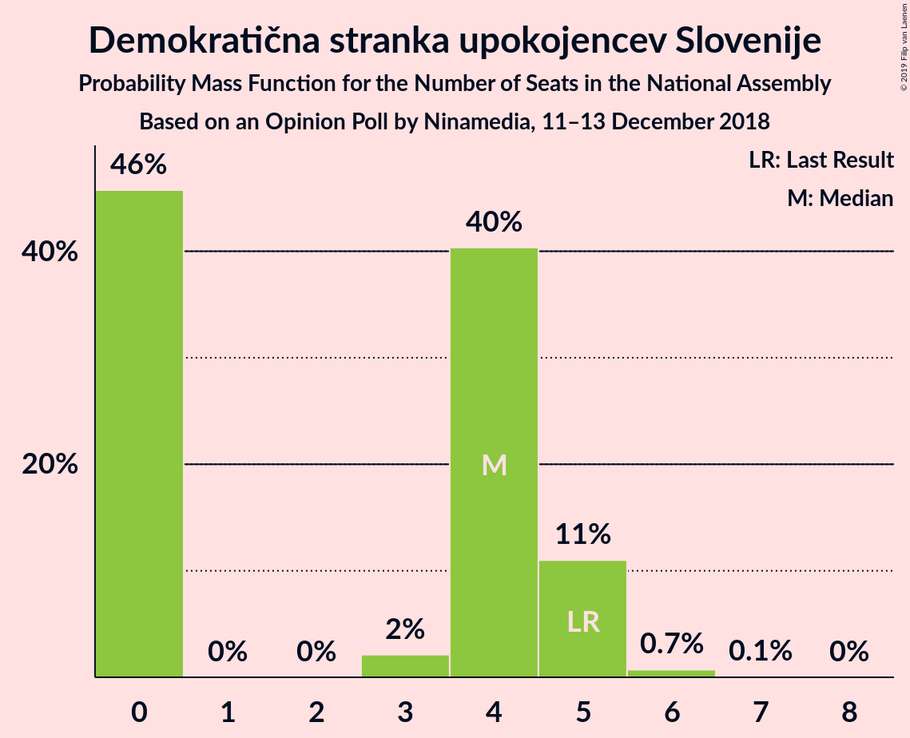
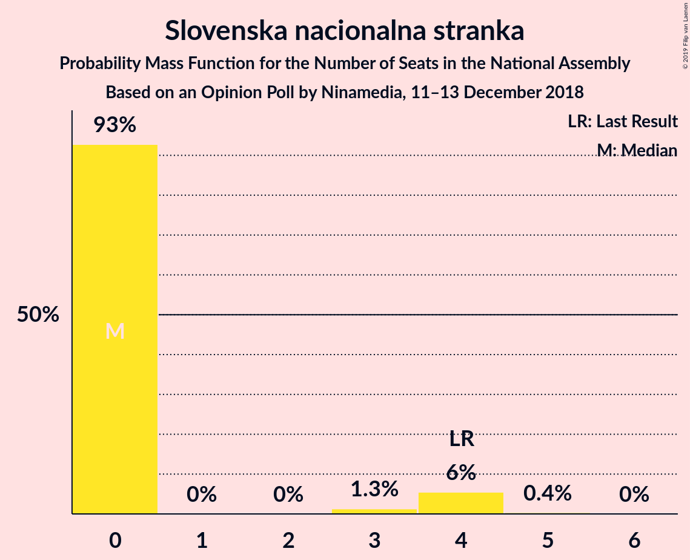

# Opinion Poll by Ninamedia, 11–13 December 2018

<a href="#voting-intentions">Voting Intentions</a> | <a href="#seats">Seats</a> | <a href="#coalitions">Coalitions</a> | <a href="#technical-information">Technical Information</a>

## Voting Intentions

### Confidence Intervals

| Party | Last Result | Poll Result | 80% Confidence Interval | 90% Confidence Interval | 95% Confidence Interval | 99% Confidence Interval |
|:-----:|:-----------:|:-----------:|:-----------------------:|:-----------------------:|:-----------------------:|:-----------------------:|
| Slovenska demokratska stranka | 24.9% | 26.0% | 24.0–28.2% |23.4–28.8% |22.9–29.4% |21.9–30.5% |
| Lista Marjana Šarca | 12.6% | 18.0% | 16.2–20.0% |15.7–20.5% |15.3–21.0% |14.5–22.0% |
| Socialni demokrati | 9.9% | 17.0% | 15.3–18.9% |14.8–19.5% |14.4–20.0% |13.6–20.9% |
| Levica | 9.3% | 10.0% | 8.7–11.6% |8.3–12.1% |8.0–12.5% |7.4–13.3% |
| Nova Slovenija–Krščanski demokrati | 7.2% | 8.0% | 6.8–9.5% |6.5–9.9% |6.2–10.3% |5.7–11.0% |
| Stranka modernega centra | 9.7% | 4.0% | 3.2–5.1% |3.0–5.4% |2.8–5.7% |2.4–6.3% |
| Demokratična stranka upokojencev Slovenije | 4.9% | 4.0% | 3.2–5.1% |3.0–5.4% |2.8–5.7% |2.4–6.3% |
| Stranka Alenke Bratušek | 5.1% | 3.0% | 2.3–4.0% |2.1–4.3% |2.0–4.6% |1.7–5.1% |
| Slovenska nacionalna stranka | 4.2% | 3.0% | 2.3–4.0% |2.1–4.3% |2.0–4.6% |1.7–5.1% |

*Note:* The poll result column reflects the actual value used in the calculations. Published results may vary slightly, and in addition be rounded to fewer digits.

## Seats

### Confidence Intervals

| Party | Last Result | Median | 80% Confidence Interval | 90% Confidence Interval | 95% Confidence Interval | 99% Confidence Interval |
|:-----:|:-----------:|:------:|:-----------------------:|:-----------------------:|:-----------------------:|:-----------------------:|
| <a href="#slovenska-demokratska-stranka">Slovenska demokratska stranka</a> | 25 | 25 | 23–28 |22–28 |22–29 |21–30 |
| <a href="#lista-marjana-šarca">Lista Marjana Šarca</a> | 13 | 17 | 16–19 |15–20 |14–20 |14–22 |
| <a href="#socialni-demokrati">Socialni demokrati</a> | 10 | 17 | 14–19 |14–19 |14–19 |13–21 |
| <a href="#levica">Levica</a> | 9 | 9 | 8–11 |8–11 |7–12 |7–13 |
| <a href="#nova-slovenija–krščanski-demokrati">Nova Slovenija–Krščanski demokrati</a> | 7 | 7 | 6–9 |6–9 |6–10 |5–11 |
| <a href="#stranka-modernega-centra">Stranka modernega centra</a> | 10 | 4 | 0–5 |0–5 |0–5 |0–6 |
| <a href="#demokratična-stranka-upokojencev-slovenije">Demokratična stranka upokojencev Slovenije</a> | 5 | 4 | 0–5 |0–5 |0–5 |0–6 |
| <a href="#stranka-alenke-bratušek">Stranka Alenke Bratušek</a> | 5 | 0 | 0 |0–3 |0–4 |0–5 |
| <a href="#slovenska-nacionalna-stranka">Slovenska nacionalna stranka</a> | 4 | 0 | 0 |0–4 |0–4 |0–4 |

### Slovenska demokratska stranka

*For a full overview of the results for this party, see the [Slovenska demokratska stranka](party-slovenskademokratskastranka.html) page.*

| Number of Seats | Probability | Accumulated | Special Marks |
|:---------------:|:-----------:|:-----------:|:-------------:|
| 20 | 0.2% | 100% |  |
| 21 | 1.2% | 99.7% |  |
| 22 | 4% | 98% |  |
| 23 | 10% | 94% |  |
| 24 | 18% | 84% |  |
| 25 | 27% | 67% | Last Result, Median |
| 26 | 13% | 40% |  |
| 27 | 12% | 27% |  |
| 28 | 10% | 15% |  |
| 29 | 3% | 5% |  |
| 30 | 1.5% | 2% |  |
| 31 | 0.2% | 0.3% |  |
| 32 | 0.1% | 0.1% |  |
| 33 | 0% | 0% |  |

### Lista Marjana Šarca

*For a full overview of the results for this party, see the [Lista Marjana Šarca](party-listamarjanašarca.html) page.*

| Number of Seats | Probability | Accumulated | Special Marks |
|:---------------:|:-----------:|:-----------:|:-------------:|
| 13 | 0.4% | 100% | Last Result |
| 14 | 2% | 99.6% |  |
| 15 | 7% | 97% |  |
| 16 | 17% | 90% |  |
| 17 | 27% | 73% | Median |
| 18 | 20% | 46% |  |
| 19 | 17% | 26% |  |
| 20 | 6% | 9% |  |
| 21 | 2% | 2% |  |
| 22 | 0.7% | 0.8% |  |
| 23 | 0.1% | 0.1% |  |
| 24 | 0% | 0% |  |

### Socialni demokrati

*For a full overview of the results for this party, see the [Socialni demokrati](party-socialnidemokrati.html) page.*

| Number of Seats | Probability | Accumulated | Special Marks |
|:---------------:|:-----------:|:-----------:|:-------------:|
| 10 | 0% | 100% | Last Result |
| 11 | 0% | 100% |  |
| 12 | 0.3% | 100% |  |
| 13 | 1.4% | 99.7% |  |
| 14 | 8% | 98% |  |
| 15 | 18% | 90% |  |
| 16 | 22% | 72% |  |
| 17 | 27% | 50% | Median |
| 18 | 11% | 24% |  |
| 19 | 10% | 12% |  |
| 20 | 1.4% | 2% |  |
| 21 | 0.4% | 0.5% |  |
| 22 | 0.1% | 0.1% |  |
| 23 | 0% | 0% |  |

### Levica

*For a full overview of the results for this party, see the [Levica](party-levica.html) page.*

| Number of Seats | Probability | Accumulated | Special Marks |
|:---------------:|:-----------:|:-----------:|:-------------:|
| 6 | 0.3% | 100% |  |
| 7 | 3% | 99.7% |  |
| 8 | 13% | 97% |  |
| 9 | 34% | 83% | Last Result, Median |
| 10 | 25% | 49% |  |
| 11 | 19% | 24% |  |
| 12 | 3% | 4% |  |
| 13 | 0.9% | 1.0% |  |
| 14 | 0.1% | 0.1% |  |
| 15 | 0% | 0% |  |

### Nova Slovenija–Krščanski demokrati

*For a full overview of the results for this party, see the [Nova Slovenija–Krščanski demokrati](party-novaslovenija–krščanskidemokrati.html) page.*

| Number of Seats | Probability | Accumulated | Special Marks |
|:---------------:|:-----------:|:-----------:|:-------------:|
| 5 | 1.4% | 100% |  |
| 6 | 12% | 98.5% |  |
| 7 | 39% | 86% | Last Result, Median |
| 8 | 32% | 47% |  |
| 9 | 10% | 15% |  |
| 10 | 4% | 5% |  |
| 11 | 0.6% | 0.6% |  |
| 12 | 0% | 0% |  |

### Stranka modernega centra

*For a full overview of the results for this party, see the [Stranka modernega centra](party-strankamodernegacentra.html) page.*

| Number of Seats | Probability | Accumulated | Special Marks |
|:---------------:|:-----------:|:-----------:|:-------------:|
| 0 | 44% | 100% |  |
| 1 | 0% | 56% |  |
| 2 | 0% | 56% |  |
| 3 | 4% | 56% |  |
| 4 | 39% | 52% | Median |
| 5 | 13% | 13% |  |
| 6 | 0.9% | 0.9% |  |
| 7 | 0% | 0% |  |
| 8 | 0% | 0% |  |
| 9 | 0% | 0% |  |
| 10 | 0% | 0% | Last Result |

### Demokratična stranka upokojencev Slovenije

*For a full overview of the results for this party, see the [Demokratična stranka upokojencev Slovenije](party-demokratičnastrankaupokojencevslovenije.html) page.*

| Number of Seats | Probability | Accumulated | Special Marks |
|:---------------:|:-----------:|:-----------:|:-------------:|
| 0 | 46% | 100% |  |
| 1 | 0% | 54% |  |
| 2 | 0% | 54% |  |
| 3 | 2% | 54% |  |
| 4 | 40% | 52% | Median |
| 5 | 11% | 12% | Last Result |
| 6 | 0.7% | 0.8% |  |
| 7 | 0.1% | 0.1% |  |
| 8 | 0% | 0% |  |

### Stranka Alenke Bratušek

*For a full overview of the results for this party, see the [Stranka Alenke Bratušek](party-strankaalenkebratušek.html) page.*

| Number of Seats | Probability | Accumulated | Special Marks |
|:---------------:|:-----------:|:-----------:|:-------------:|
| 0 | 94% | 100% | Median |
| 1 | 0% | 6% |  |
| 2 | 0% | 6% |  |
| 3 | 3% | 6% |  |
| 4 | 3% | 4% |  |
| 5 | 0.8% | 0.8% | Last Result |
| 6 | 0% | 0% |  |

### Slovenska nacionalna stranka

*For a full overview of the results for this party, see the [Slovenska nacionalna stranka](party-slovenskanacionalnastranka.html) page.*

| Number of Seats | Probability | Accumulated | Special Marks |
|:---------------:|:-----------:|:-----------:|:-------------:|
| 0 | 93% | 100% | Median |
| 1 | 0% | 7% |  |
| 2 | 0% | 7% |  |
| 3 | 1.3% | 7% |  |
| 4 | 6% | 6% | Last Result |
| 5 | 0.4% | 0.4% |  |
| 6 | 0% | 0% |  |

## Coalitions

### Confidence Intervals

| Coalition | Last Result | Median | Majority? | 80% Confidence Interval | 90% Confidence Interval | 95% Confidence Interval | 99% Confidence Interval |
|:---------:|:-----------:|:------:|:---------:|:-----------------------:|:-----------------------:|:-----------------------:|:-----------------------:|
| Lista Marjana Šarca – Socialni demokrati – Nova Slovenija–Krščanski demokrati – Demokratična stranka upokojencev Slovenije – Stranka modernega centra – Stranka Alenke Bratušek | 50 | 46 | 65% | 43–49 | 42–50 | 41–51 | 40–52 |
| Lista Marjana Šarca – Socialni demokrati – Nova Slovenija–Krščanski demokrati – Demokratična stranka upokojencev Slovenije – Stranka modernega centra | 45 | 46 | 61% | 43–49 | 42–50 | 41–51 | 40–52 |
| Slovenska demokratska stranka – Lista Marjana Šarca – Demokratična stranka upokojencev Slovenije | 43 | 45 | 46% | 42–48 | 41–49 | 40–50 | 38–51 |
| Lista Marjana Šarca – Socialni demokrati – Nova Slovenija–Krščanski demokrati – Stranka modernega centra | 40 | 44 | 23% | 41–47 | 40–48 | 39–49 | 37–50 |
| Lista Marjana Šarca – Socialni demokrati – Nova Slovenija–Krščanski demokrati – Demokratična stranka upokojencev Slovenije | 35 | 44 | 24% | 40–47 | 39–48 | 39–48 | 38–50 |
| Slovenska demokratska stranka – Lista Marjana Šarca | 38 | 42 | 13% | 40–46 | 39–47 | 38–48 | 37–49 |
| Lista Marjana Šarca – Socialni demokrati – Nova Slovenija–Krščanski demokrati | 30 | 41 | 4% | 38–45 | 38–45 | 37–46 | 36–47 |
| Lista Marjana Šarca – Socialni demokrati – Demokratična stranka upokojencev Slovenije – Stranka modernega centra – Stranka Alenke Bratušek | 43 | 39 | 0.2% | 36–42 | 35–43 | 34–44 | 32–45 |
| Lista Marjana Šarca – Socialni demokrati – Demokratična stranka upokojencev Slovenije – Stranka modernega centra | 38 | 38 | 0.2% | 35–42 | 34–42 | 33–43 | 32–45 |
| Lista Marjana Šarca – Socialni demokrati – Demokratična stranka upokojencev Slovenije | 28 | 36 | 0% | 33–39 | 32–40 | 31–41 | 30–42 |
| Lista Marjana Šarca – Socialni demokrati – Stranka modernega centra | 33 | 36 | 0% | 33–39 | 32–40 | 31–41 | 30–42 |
| Lista Marjana Šarca – Socialni demokrati | 23 | 34 | 0% | 31–36 | 30–38 | 30–38 | 29–39 |
| Socialni demokrati – Demokratična stranka upokojencev Slovenije – Stranka modernega centra | 25 | 21 | 0% | 17–25 | 16–26 | 16–26 | 15–27 |

### Lista Marjana Šarca – Socialni demokrati – Nova Slovenija–Krščanski demokrati – Demokratična stranka upokojencev Slovenije – Stranka modernega centra – Stranka Alenke Bratušek

| Number of Seats | Probability | Accumulated | Special Marks |
|:---------------:|:-----------:|:-----------:|:-------------:|
| 38 | 0.1% | 100% |  |
| 39 | 0.2% | 99.9% |  |
| 40 | 1.1% | 99.8% |  |
| 41 | 1.3% | 98.6% |  |
| 42 | 3% | 97% |  |
| 43 | 10% | 94% |  |
| 44 | 5% | 84% |  |
| 45 | 14% | 79% |  |
| 46 | 19% | 65% | Majority |
| 47 | 11% | 46% |  |
| 48 | 16% | 35% |  |
| 49 | 12% | 19% | Median |
| 50 | 3% | 7% | Last Result |
| 51 | 3% | 4% |  |
| 52 | 0.8% | 1.0% |  |
| 53 | 0.2% | 0.2% |  |
| 54 | 0% | 0% |  |

### Lista Marjana Šarca – Socialni demokrati – Nova Slovenija–Krščanski demokrati – Demokratična stranka upokojencev Slovenije – Stranka modernega centra

| Number of Seats | Probability | Accumulated | Special Marks |
|:---------------:|:-----------:|:-----------:|:-------------:|
| 38 | 0.1% | 100% |  |
| 39 | 0.3% | 99.9% |  |
| 40 | 1.3% | 99.5% |  |
| 41 | 2% | 98% |  |
| 42 | 5% | 96% |  |
| 43 | 11% | 92% |  |
| 44 | 5% | 81% |  |
| 45 | 15% | 76% | Last Result |
| 46 | 18% | 61% | Majority |
| 47 | 11% | 43% |  |
| 48 | 15% | 32% |  |
| 49 | 12% | 17% | Median |
| 50 | 3% | 6% |  |
| 51 | 2% | 3% |  |
| 52 | 0.6% | 0.7% |  |
| 53 | 0.1% | 0.1% |  |
| 54 | 0% | 0% |  |

### Slovenska demokratska stranka – Lista Marjana Šarca – Demokratična stranka upokojencev Slovenije

| Number of Seats | Probability | Accumulated | Special Marks |
|:---------------:|:-----------:|:-----------:|:-------------:|
| 37 | 0.1% | 100% |  |
| 38 | 0.4% | 99.9% |  |
| 39 | 0.8% | 99.5% |  |
| 40 | 2% | 98.7% |  |
| 41 | 3% | 96% |  |
| 42 | 11% | 93% |  |
| 43 | 11% | 83% | Last Result |
| 44 | 11% | 72% |  |
| 45 | 15% | 61% |  |
| 46 | 16% | 46% | Median, Majority |
| 47 | 17% | 30% |  |
| 48 | 5% | 13% |  |
| 49 | 5% | 8% |  |
| 50 | 2% | 3% |  |
| 51 | 0.5% | 0.9% |  |
| 52 | 0.3% | 0.4% |  |
| 53 | 0.1% | 0.1% |  |
| 54 | 0% | 0% |  |

### Lista Marjana Šarca – Socialni demokrati – Nova Slovenija–Krščanski demokrati – Stranka modernega centra

| Number of Seats | Probability | Accumulated | Special Marks |
|:---------------:|:-----------:|:-----------:|:-------------:|
| 36 | 0.1% | 100% |  |
| 37 | 0.8% | 99.9% |  |
| 38 | 1.2% | 99.1% |  |
| 39 | 2% | 98% |  |
| 40 | 4% | 96% | Last Result |
| 41 | 7% | 92% |  |
| 42 | 15% | 85% |  |
| 43 | 16% | 70% |  |
| 44 | 13% | 54% |  |
| 45 | 18% | 41% | Median |
| 46 | 10% | 23% | Majority |
| 47 | 6% | 13% |  |
| 48 | 4% | 7% |  |
| 49 | 2% | 3% |  |
| 50 | 0.6% | 0.7% |  |
| 51 | 0.1% | 0.1% |  |
| 52 | 0% | 0% |  |

### Lista Marjana Šarca – Socialni demokrati – Nova Slovenija–Krščanski demokrati – Demokratična stranka upokojencev Slovenije

| Number of Seats | Probability | Accumulated | Special Marks |
|:---------------:|:-----------:|:-----------:|:-------------:|
| 35 | 0% | 100% | Last Result |
| 36 | 0.1% | 100% |  |
| 37 | 0.2% | 99.8% |  |
| 38 | 1.4% | 99.6% |  |
| 39 | 4% | 98% |  |
| 40 | 6% | 95% |  |
| 41 | 5% | 89% |  |
| 42 | 14% | 83% |  |
| 43 | 16% | 70% |  |
| 44 | 13% | 53% |  |
| 45 | 17% | 40% | Median |
| 46 | 12% | 24% | Majority |
| 47 | 7% | 12% |  |
| 48 | 4% | 6% |  |
| 49 | 0.8% | 1.4% |  |
| 50 | 0.4% | 0.6% |  |
| 51 | 0.1% | 0.2% |  |
| 52 | 0% | 0% |  |

### Slovenska demokratska stranka – Lista Marjana Šarca

| Number of Seats | Probability | Accumulated | Special Marks |
|:---------------:|:-----------:|:-----------:|:-------------:|
| 35 | 0.1% | 100% |  |
| 36 | 0.2% | 99.9% |  |
| 37 | 1.1% | 99.7% |  |
| 38 | 2% | 98.7% | Last Result |
| 39 | 5% | 97% |  |
| 40 | 9% | 92% |  |
| 41 | 8% | 83% |  |
| 42 | 25% | 74% | Median |
| 43 | 16% | 49% |  |
| 44 | 9% | 33% |  |
| 45 | 11% | 24% |  |
| 46 | 4% | 13% | Majority |
| 47 | 6% | 9% |  |
| 48 | 2% | 3% |  |
| 49 | 0.9% | 1.1% |  |
| 50 | 0.2% | 0.2% |  |
| 51 | 0% | 0% |  |

### Lista Marjana Šarca – Socialni demokrati – Nova Slovenija–Krščanski demokrati

| Number of Seats | Probability | Accumulated | Special Marks |
|:---------------:|:-----------:|:-----------:|:-------------:|
| 30 | 0% | 100% | Last Result |
| 31 | 0% | 100% |  |
| 32 | 0% | 100% |  |
| 33 | 0% | 100% |  |
| 34 | 0.1% | 100% |  |
| 35 | 0.3% | 99.9% |  |
| 36 | 0.8% | 99.6% |  |
| 37 | 2% | 98.8% |  |
| 38 | 7% | 97% |  |
| 39 | 9% | 90% |  |
| 40 | 15% | 81% |  |
| 41 | 15% | 65% | Median |
| 42 | 20% | 50% |  |
| 43 | 15% | 30% |  |
| 44 | 4% | 15% |  |
| 45 | 7% | 11% |  |
| 46 | 2% | 4% | Majority |
| 47 | 2% | 2% |  |
| 48 | 0.2% | 0.5% |  |
| 49 | 0.2% | 0.2% |  |
| 50 | 0% | 0% |  |

### Lista Marjana Šarca – Socialni demokrati – Demokratična stranka upokojencev Slovenije – Stranka modernega centra – Stranka Alenke Bratušek

| Number of Seats | Probability | Accumulated | Special Marks |
|:---------------:|:-----------:|:-----------:|:-------------:|
| 31 | 0.2% | 100% |  |
| 32 | 0.3% | 99.8% |  |
| 33 | 1.4% | 99.5% |  |
| 34 | 3% | 98% |  |
| 35 | 4% | 95% |  |
| 36 | 10% | 91% |  |
| 37 | 8% | 81% |  |
| 38 | 21% | 73% |  |
| 39 | 11% | 52% |  |
| 40 | 16% | 41% |  |
| 41 | 12% | 25% |  |
| 42 | 8% | 13% | Median |
| 43 | 2% | 5% | Last Result |
| 44 | 2% | 3% |  |
| 45 | 0.7% | 0.9% |  |
| 46 | 0.2% | 0.2% | Majority |
| 47 | 0% | 0% |  |

### Lista Marjana Šarca – Socialni demokrati – Demokratična stranka upokojencev Slovenije – Stranka modernega centra

| Number of Seats | Probability | Accumulated | Special Marks |
|:---------------:|:-----------:|:-----------:|:-------------:|
| 30 | 0.1% | 100% |  |
| 31 | 0.2% | 99.9% |  |
| 32 | 0.6% | 99.7% |  |
| 33 | 2% | 99.1% |  |
| 34 | 4% | 97% |  |
| 35 | 5% | 94% |  |
| 36 | 11% | 89% |  |
| 37 | 8% | 78% |  |
| 38 | 20% | 70% | Last Result |
| 39 | 11% | 49% |  |
| 40 | 16% | 39% |  |
| 41 | 11% | 22% |  |
| 42 | 7% | 12% | Median |
| 43 | 2% | 4% |  |
| 44 | 2% | 2% |  |
| 45 | 0.5% | 0.6% |  |
| 46 | 0.1% | 0.2% | Majority |
| 47 | 0% | 0% |  |

### Lista Marjana Šarca – Socialni demokrati – Demokratična stranka upokojencev Slovenije

| Number of Seats | Probability | Accumulated | Special Marks |
|:---------------:|:-----------:|:-----------:|:-------------:|
| 28 | 0% | 100% | Last Result |
| 29 | 0.2% | 100% |  |
| 30 | 0.6% | 99.7% |  |
| 31 | 2% | 99.2% |  |
| 32 | 4% | 97% |  |
| 33 | 8% | 94% |  |
| 34 | 11% | 86% |  |
| 35 | 9% | 74% |  |
| 36 | 22% | 65% |  |
| 37 | 11% | 43% |  |
| 38 | 15% | 32% | Median |
| 39 | 7% | 17% |  |
| 40 | 7% | 9% |  |
| 41 | 2% | 3% |  |
| 42 | 0.5% | 0.8% |  |
| 43 | 0.3% | 0.3% |  |
| 44 | 0% | 0% |  |

### Lista Marjana Šarca – Socialni demokrati – Stranka modernega centra

| Number of Seats | Probability | Accumulated | Special Marks |
|:---------------:|:-----------:|:-----------:|:-------------:|
| 28 | 0% | 100% |  |
| 29 | 0.1% | 99.9% |  |
| 30 | 0.8% | 99.8% |  |
| 31 | 2% | 99.0% |  |
| 32 | 3% | 97% |  |
| 33 | 5% | 94% | Last Result |
| 34 | 12% | 89% |  |
| 35 | 11% | 76% |  |
| 36 | 20% | 65% |  |
| 37 | 13% | 45% |  |
| 38 | 16% | 33% | Median |
| 39 | 8% | 16% |  |
| 40 | 4% | 8% |  |
| 41 | 3% | 4% |  |
| 42 | 0.5% | 0.7% |  |
| 43 | 0.1% | 0.2% |  |
| 44 | 0% | 0% |  |

### Lista Marjana Šarca – Socialni demokrati

| Number of Seats | Probability | Accumulated | Special Marks |
|:---------------:|:-----------:|:-----------:|:-------------:|
| 23 | 0% | 100% | Last Result |
| 24 | 0% | 100% |  |
| 25 | 0% | 100% |  |
| 26 | 0% | 100% |  |
| 27 | 0.1% | 100% |  |
| 28 | 0.3% | 99.9% |  |
| 29 | 1.1% | 99.6% |  |
| 30 | 4% | 98.5% |  |
| 31 | 6% | 94% |  |
| 32 | 14% | 88% |  |
| 33 | 17% | 74% |  |
| 34 | 19% | 57% | Median |
| 35 | 14% | 39% |  |
| 36 | 15% | 24% |  |
| 37 | 4% | 10% |  |
| 38 | 4% | 6% |  |
| 39 | 2% | 2% |  |
| 40 | 0.3% | 0.4% |  |
| 41 | 0.1% | 0.1% |  |
| 42 | 0% | 0% |  |

### Socialni demokrati – Demokratična stranka upokojencev Slovenije – Stranka modernega centra

| Number of Seats | Probability | Accumulated | Special Marks |
|:---------------:|:-----------:|:-----------:|:-------------:|
| 13 | 0.1% | 100% |  |
| 14 | 0.4% | 99.9% |  |
| 15 | 1.1% | 99.5% |  |
| 16 | 3% | 98% |  |
| 17 | 6% | 95% |  |
| 18 | 7% | 89% |  |
| 19 | 11% | 82% |  |
| 20 | 13% | 71% |  |
| 21 | 12% | 58% |  |
| 22 | 14% | 47% |  |
| 23 | 13% | 33% |  |
| 24 | 9% | 20% |  |
| 25 | 5% | 11% | Last Result, Median |
| 26 | 4% | 6% |  |
| 27 | 2% | 2% |  |
| 28 | 0.1% | 0.2% |  |
| 29 | 0% | 0% |  |

## Technical Information

### Opinion Poll

+ **Polling firm:** Ninamedia
+ **Commissioner(s):** —
+ **Fieldwork period:** 11–13 December 2018

### Calculations

+ **Sample size:** 700
+ **Simulations done:** 1,048,576
+ **Error estimate:** 1.81%

