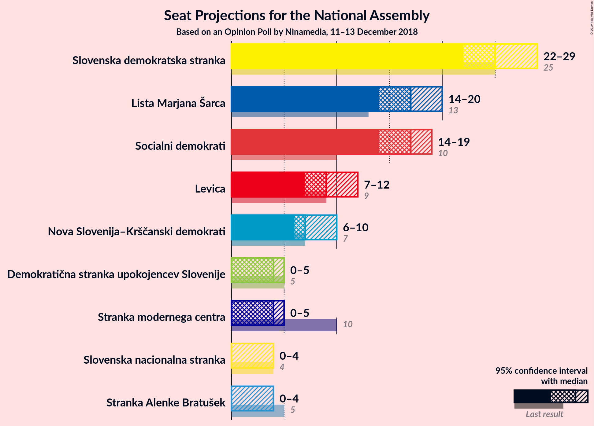
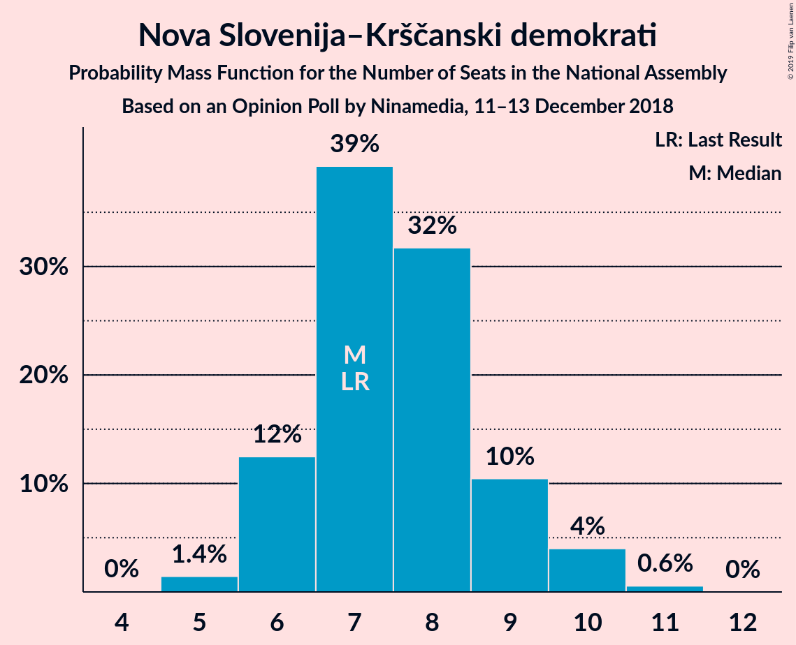

# Opinion Poll by Ninamedia, 11–13 December 2018

<a href="#voting-intentions">Voting Intentions</a> | <a href="#seats">Seats</a> | <a href="#coalitions">Coalitions</a> | <a href="#technical-information">Technical Information</a>

## Voting Intentions

### Confidence Intervals

| Party | Last Result | Poll Result | 80% Confidence Interval | 90% Confidence Interval | 95% Confidence Interval | 99% Confidence Interval |
|:-----:|:-----------:|:-----------:|:-----------------------:|:-----------------------:|:-----------------------:|:-----------------------:|
| Slovenska demokratska stranka | 24.9% | 26.0% | 24.0–28.2% |23.4–28.8% |22.9–29.4% |21.9–30.5% |
| Lista Marjana Šarca | 12.6% | 18.0% | 16.2–20.0% |15.7–20.5% |15.3–21.0% |14.5–22.0% |
| Socialni demokrati | 9.9% | 17.0% | 15.3–18.9% |14.8–19.5% |14.4–20.0% |13.6–20.9% |
| Levica | 9.3% | 10.0% | 8.7–11.6% |8.3–12.1% |8.0–12.5% |7.4–13.3% |
| Nova Slovenija–Krščanski demokrati | 7.2% | 8.0% | 6.8–9.5% |6.5–9.9% |6.2–10.3% |5.7–11.0% |
| Stranka modernega centra | 9.7% | 4.0% | 3.2–5.1% |3.0–5.4% |2.8–5.7% |2.4–6.3% |
| Demokratična stranka upokojencev Slovenije | 4.9% | 4.0% | 3.2–5.1% |3.0–5.4% |2.8–5.7% |2.4–6.3% |
| Stranka Alenke Bratušek | 5.1% | 3.0% | 2.3–4.0% |2.1–4.3% |2.0–4.6% |1.7–5.1% |
| Slovenska nacionalna stranka | 4.2% | 3.0% | 2.3–4.0% |2.1–4.3% |2.0–4.6% |1.7–5.1% |

*Note:* The poll result column reflects the actual value used in the calculations. Published results may vary slightly, and in addition be rounded to fewer digits.

## Seats

### Confidence Intervals

| Party | Last Result | Median | 80% Confidence Interval | 90% Confidence Interval | 95% Confidence Interval | 99% Confidence Interval |
|:-----:|:-----------:|:------:|:-----------------------:|:-----------------------:|:-----------------------:|:-----------------------:|
| <a href="#slovenska-demokratska-stranka">Slovenska demokratska stranka</a> | 25 | 24 | 23–26 |23–28 |22–29 |21–30 |
| <a href="#lista-marjana-šarca">Lista Marjana Šarca</a> | 13 | 17 | 15–20 |15–20 |15–20 |14–22 |
| <a href="#socialni-demokrati">Socialni demokrati</a> | 10 | 18 | 17–19 |15–19 |13–19 |13–20 |
| <a href="#levica">Levica</a> | 9 | 9 | 8–11 |7–11 |7–11 |7–13 |
| <a href="#nova-slovenija–krščanski-demokrati">Nova Slovenija–Krščanski demokrati</a> | 7 | 8 | 6–9 |6–9 |6–9 |5–10 |
| <a href="#stranka-modernega-centra">Stranka modernega centra</a> | 10 | 4 | 0–4 |0–4 |0–5 |0–6 |
| <a href="#demokratična-stranka-upokojencev-slovenije">Demokratična stranka upokojencev Slovenije</a> | 5 | 4 | 0–5 |0–5 |0–5 |0–5 |
| <a href="#stranka-alenke-bratušek">Stranka Alenke Bratušek</a> | 5 | 0 | 0 |0–3 |0–4 |0–4 |
| <a href="#slovenska-nacionalna-stranka">Slovenska nacionalna stranka</a> | 4 | 0 | 0 |0–3 |0–4 |0–4 |

### Slovenska demokratska stranka

*For a full overview of the results for this party, see the [Slovenska demokratska stranka](party-slovenskademokratskastranka.html) page.*

| Number of Seats | Probability | Accumulated | Special Marks |
|:---------------:|:-----------:|:-----------:|:-------------:|
| 20 | 0% | 100% |  |
| 21 | 1.0% | 99.9% |  |
| 22 | 4% | 98.9% |  |
| 23 | 27% | 95% |  |
| 24 | 19% | 68% | Median |
| 25 | 30% | 49% | Last Result |
| 26 | 11% | 19% |  |
| 27 | 2% | 8% |  |
| 28 | 1.1% | 6% |  |
| 29 | 4% | 5% |  |
| 30 | 0.5% | 0.9% |  |
| 31 | 0.1% | 0.5% |  |
| 32 | 0.3% | 0.3% |  |
| 33 | 0% | 0% |  |

### Lista Marjana Šarca

*For a full overview of the results for this party, see the [Lista Marjana Šarca](party-listamarjanašarca.html) page.*

| Number of Seats | Probability | Accumulated | Special Marks |
|:---------------:|:-----------:|:-----------:|:-------------:|
| 13 | 0.5% | 100% | Last Result |
| 14 | 1.1% | 99.5% |  |
| 15 | 16% | 98% |  |
| 16 | 32% | 83% |  |
| 17 | 17% | 51% | Median |
| 18 | 12% | 33% |  |
| 19 | 9% | 21% |  |
| 20 | 11% | 12% |  |
| 21 | 0.3% | 1.4% |  |
| 22 | 1.1% | 1.2% |  |
| 23 | 0% | 0% |  |

### Socialni demokrati

*For a full overview of the results for this party, see the [Socialni demokrati](party-socialnidemokrati.html) page.*

| Number of Seats | Probability | Accumulated | Special Marks |
|:---------------:|:-----------:|:-----------:|:-------------:|
| 10 | 0% | 100% | Last Result |
| 11 | 0% | 100% |  |
| 12 | 0.4% | 100% |  |
| 13 | 2% | 99.6% |  |
| 14 | 2% | 97% |  |
| 15 | 1.5% | 95% |  |
| 16 | 3% | 94% |  |
| 17 | 13% | 91% |  |
| 18 | 51% | 77% | Median |
| 19 | 26% | 27% |  |
| 20 | 1.0% | 1.0% |  |
| 21 | 0% | 0% |  |

### Levica

*For a full overview of the results for this party, see the [Levica](party-levica.html) page.*

| Number of Seats | Probability | Accumulated | Special Marks |
|:---------------:|:-----------:|:-----------:|:-------------:|
| 6 | 0.3% | 100% |  |
| 7 | 10% | 99.7% |  |
| 8 | 11% | 90% |  |
| 9 | 31% | 79% | Last Result, Median |
| 10 | 20% | 48% |  |
| 11 | 27% | 28% |  |
| 12 | 0.8% | 2% |  |
| 13 | 0.8% | 0.8% |  |
| 14 | 0% | 0% |  |

### Nova Slovenija–Krščanski demokrati

*For a full overview of the results for this party, see the [Nova Slovenija–Krščanski demokrati](party-novaslovenija–krščanskidemokrati.html) page.*

| Number of Seats | Probability | Accumulated | Special Marks |
|:---------------:|:-----------:|:-----------:|:-------------:|
| 5 | 1.4% | 100% |  |
| 6 | 9% | 98.6% |  |
| 7 | 34% | 89% | Last Result |
| 8 | 35% | 55% | Median |
| 9 | 20% | 21% |  |
| 10 | 0.9% | 1.3% |  |
| 11 | 0.3% | 0.4% |  |
| 12 | 0.1% | 0.1% |  |
| 13 | 0% | 0% |  |

### Stranka modernega centra

*For a full overview of the results for this party, see the [Stranka modernega centra](party-strankamodernegacentra.html) page.*

| Number of Seats | Probability | Accumulated | Special Marks |
|:---------------:|:-----------:|:-----------:|:-------------:|
| 0 | 48% | 100% |  |
| 1 | 0% | 52% |  |
| 2 | 0% | 52% |  |
| 3 | 1.3% | 52% |  |
| 4 | 48% | 51% | Median |
| 5 | 2% | 3% |  |
| 6 | 1.0% | 1.2% |  |
| 7 | 0.1% | 0.1% |  |
| 8 | 0% | 0% |  |
| 9 | 0% | 0% |  |
| 10 | 0% | 0% | Last Result |

### Demokratična stranka upokojencev Slovenije

*For a full overview of the results for this party, see the [Demokratična stranka upokojencev Slovenije](party-demokratičnastrankaupokojencevslovenije.html) page.*

| Number of Seats | Probability | Accumulated | Special Marks |
|:---------------:|:-----------:|:-----------:|:-------------:|
| 0 | 44% | 100% |  |
| 1 | 0% | 56% |  |
| 2 | 0% | 56% |  |
| 3 | 3% | 56% |  |
| 4 | 35% | 53% | Median |
| 5 | 17% | 18% | Last Result |
| 6 | 0.4% | 0.4% |  |
| 7 | 0% | 0% |  |

### Stranka Alenke Bratušek

*For a full overview of the results for this party, see the [Stranka Alenke Bratušek](party-strankaalenkebratušek.html) page.*

| Number of Seats | Probability | Accumulated | Special Marks |
|:---------------:|:-----------:|:-----------:|:-------------:|
| 0 | 94% | 100% | Median |
| 1 | 0% | 6% |  |
| 2 | 0% | 6% |  |
| 3 | 2% | 6% |  |
| 4 | 3% | 4% |  |
| 5 | 0.4% | 0.4% | Last Result |
| 6 | 0% | 0% |  |

### Slovenska nacionalna stranka

*For a full overview of the results for this party, see the [Slovenska nacionalna stranka](party-slovenskanacionalnastranka.html) page.*

| Number of Seats | Probability | Accumulated | Special Marks |
|:---------------:|:-----------:|:-----------:|:-------------:|
| 0 | 93% | 100% | Median |
| 1 | 0% | 7% |  |
| 2 | 0% | 7% |  |
| 3 | 3% | 7% |  |
| 4 | 4% | 5% | Last Result |
| 5 | 0.4% | 0.4% |  |
| 6 | 0% | 0% |  |

## Coalitions

### Confidence Intervals

| Coalition | Last Result | Median | Majority? | 80% Confidence Interval | 90% Confidence Interval | 95% Confidence Interval | 99% Confidence Interval |
|:---------:|:-----------:|:------:|:---------:|:-----------------------:|:-----------------------:|:-----------------------:|:-----------------------:|
| Lista Marjana Šarca – Socialni demokrati – Nova Slovenija–Krščanski demokrati – Demokratična stranka upokojencev Slovenije – Stranka modernega centra – Stranka Alenke Bratušek | 50 | 48 | 82% | 45–49 | 44–50 | 43–50 | 40–51 |
| Lista Marjana Šarca – Socialni demokrati – Nova Slovenija–Krščanski demokrati – Demokratična stranka upokojencev Slovenije – Stranka modernega centra | 45 | 47 | 79% | 44–49 | 43–50 | 43–50 | 40–51 |
| Lista Marjana Šarca – Socialni demokrati – Nova Slovenija–Krščanski demokrati – Stranka modernega centra | 40 | 45 | 30% | 42–48 | 41–48 | 40–50 | 38–50 |
| Lista Marjana Šarca – Socialni demokrati – Nova Slovenija–Krščanski demokrati – Demokratična stranka upokojencev Slovenije | 35 | 45 | 38% | 42–47 | 40–48 | 40–48 | 38–48 |
| Slovenska demokratska stranka – Lista Marjana Šarca – Demokratična stranka upokojencev Slovenije | 43 | 44 | 16% | 40–46 | 40–48 | 40–48 | 39–50 |
| Lista Marjana Šarca – Socialni demokrati – Nova Slovenija–Krščanski demokrati | 30 | 42 | 15% | 40–46 | 39–47 | 38–47 | 36–48 |
| Slovenska demokratska stranka – Lista Marjana Šarca | 38 | 41 | 7% | 39–45 | 39–46 | 37–46 | 36–48 |
| Lista Marjana Šarca – Socialni demokrati – Demokratična stranka upokojencev Slovenije – Stranka modernega centra – Stranka Alenke Bratušek | 43 | 39 | 0% | 38–42 | 37–42 | 35–43 | 32–44 |
| Lista Marjana Šarca – Socialni demokrati – Demokratična stranka upokojencev Slovenije – Stranka modernega centra | 38 | 39 | 0% | 37–42 | 35–42 | 35–42 | 31–44 |
| Lista Marjana Šarca – Socialni demokrati – Stranka modernega centra | 33 | 38 | 0% | 34–39 | 34–41 | 33–41 | 31–42 |
| Lista Marjana Šarca – Socialni demokrati – Demokratična stranka upokojencev Slovenije | 28 | 38 | 0% | 35–39 | 33–40 | 32–41 | 31–41 |
| Lista Marjana Šarca – Socialni demokrati | 23 | 34 | 0% | 32–38 | 32–39 | 31–39 | 29–39 |
| Socialni demokrati – Demokratična stranka upokojencev Slovenije – Stranka modernega centra | 25 | 22 | 0% | 19–26 | 18–26 | 18–26 | 15–27 |

### Lista Marjana Šarca – Socialni demokrati – Nova Slovenija–Krščanski demokrati – Demokratična stranka upokojencev Slovenije – Stranka modernega centra – Stranka Alenke Bratušek

| Number of Seats | Probability | Accumulated | Special Marks |
|:---------------:|:-----------:|:-----------:|:-------------:|
| 39 | 0.1% | 100% |  |
| 40 | 0.8% | 99.9% |  |
| 41 | 0.2% | 99.1% |  |
| 42 | 0.6% | 98.9% |  |
| 43 | 2% | 98% |  |
| 44 | 4% | 96% |  |
| 45 | 10% | 92% |  |
| 46 | 21% | 82% | Majority |
| 47 | 11% | 61% |  |
| 48 | 19% | 50% |  |
| 49 | 23% | 31% |  |
| 50 | 6% | 8% | Last Result |
| 51 | 2% | 2% | Median |
| 52 | 0.1% | 0.2% |  |
| 53 | 0.1% | 0.1% |  |
| 54 | 0% | 0% |  |

### Lista Marjana Šarca – Socialni demokrati – Nova Slovenija–Krščanski demokrati – Demokratična stranka upokojencev Slovenije – Stranka modernega centra

| Number of Seats | Probability | Accumulated | Special Marks |
|:---------------:|:-----------:|:-----------:|:-------------:|
| 39 | 0.1% | 100% |  |
| 40 | 0.9% | 99.8% |  |
| 41 | 0.3% | 98.9% |  |
| 42 | 0.9% | 98.6% |  |
| 43 | 4% | 98% |  |
| 44 | 4% | 93% |  |
| 45 | 10% | 89% | Last Result |
| 46 | 22% | 79% | Majority |
| 47 | 8% | 57% |  |
| 48 | 20% | 49% |  |
| 49 | 23% | 29% |  |
| 50 | 5% | 6% |  |
| 51 | 0.6% | 0.8% | Median |
| 52 | 0.1% | 0.1% |  |
| 53 | 0% | 0% |  |

### Lista Marjana Šarca – Socialni demokrati – Nova Slovenija–Krščanski demokrati – Stranka modernega centra

| Number of Seats | Probability | Accumulated | Special Marks |
|:---------------:|:-----------:|:-----------:|:-------------:|
| 37 | 0.3% | 100% |  |
| 38 | 0.4% | 99.7% |  |
| 39 | 0.5% | 99.3% |  |
| 40 | 2% | 98.8% | Last Result |
| 41 | 4% | 97% |  |
| 42 | 17% | 93% |  |
| 43 | 11% | 76% |  |
| 44 | 15% | 65% |  |
| 45 | 21% | 51% |  |
| 46 | 6% | 30% | Majority |
| 47 | 6% | 24% | Median |
| 48 | 12% | 17% |  |
| 49 | 0.5% | 5% |  |
| 50 | 4% | 4% |  |
| 51 | 0% | 0% |  |

### Lista Marjana Šarca – Socialni demokrati – Nova Slovenija–Krščanski demokrati – Demokratična stranka upokojencev Slovenije

| Number of Seats | Probability | Accumulated | Special Marks |
|:---------------:|:-----------:|:-----------:|:-------------:|
| 35 | 0% | 100% | Last Result |
| 36 | 0.1% | 100% |  |
| 37 | 0.1% | 99.9% |  |
| 38 | 0.4% | 99.8% |  |
| 39 | 1.5% | 99.4% |  |
| 40 | 5% | 98% |  |
| 41 | 2% | 93% |  |
| 42 | 1.4% | 91% |  |
| 43 | 5% | 90% |  |
| 44 | 15% | 85% |  |
| 45 | 32% | 70% |  |
| 46 | 25% | 38% | Majority |
| 47 | 6% | 13% | Median |
| 48 | 7% | 7% |  |
| 49 | 0.4% | 0.4% |  |
| 50 | 0% | 0% |  |

### Slovenska demokratska stranka – Lista Marjana Šarca – Demokratična stranka upokojencev Slovenije

| Number of Seats | Probability | Accumulated | Special Marks |
|:---------------:|:-----------:|:-----------:|:-------------:|
| 37 | 0% | 100% |  |
| 38 | 0.2% | 99.9% |  |
| 39 | 0.5% | 99.8% |  |
| 40 | 11% | 99.3% |  |
| 41 | 4% | 88% |  |
| 42 | 6% | 84% |  |
| 43 | 23% | 78% | Last Result |
| 44 | 8% | 55% |  |
| 45 | 31% | 47% | Median |
| 46 | 6% | 16% | Majority |
| 47 | 2% | 10% |  |
| 48 | 6% | 8% |  |
| 49 | 0.4% | 2% |  |
| 50 | 2% | 2% |  |
| 51 | 0.2% | 0.3% |  |
| 52 | 0% | 0.1% |  |
| 53 | 0.1% | 0.1% |  |
| 54 | 0% | 0% |  |

### Lista Marjana Šarca – Socialni demokrati – Nova Slovenija–Krščanski demokrati

| Number of Seats | Probability | Accumulated | Special Marks |
|:---------------:|:-----------:|:-----------:|:-------------:|
| 30 | 0% | 100% | Last Result |
| 31 | 0% | 100% |  |
| 32 | 0% | 100% |  |
| 33 | 0% | 100% |  |
| 34 | 0.1% | 100% |  |
| 35 | 0.1% | 99.9% |  |
| 36 | 0.7% | 99.8% |  |
| 37 | 0.4% | 99.1% |  |
| 38 | 1.4% | 98.7% |  |
| 39 | 3% | 97% |  |
| 40 | 16% | 94% |  |
| 41 | 19% | 79% |  |
| 42 | 16% | 59% |  |
| 43 | 8% | 43% | Median |
| 44 | 13% | 35% |  |
| 45 | 7% | 22% |  |
| 46 | 9% | 15% | Majority |
| 47 | 5% | 6% |  |
| 48 | 0.9% | 0.9% |  |
| 49 | 0% | 0% |  |

### Slovenska demokratska stranka – Lista Marjana Šarca

| Number of Seats | Probability | Accumulated | Special Marks |
|:---------------:|:-----------:|:-----------:|:-------------:|
| 35 | 0.3% | 100% |  |
| 36 | 0.9% | 99.7% |  |
| 37 | 1.4% | 98.8% |  |
| 38 | 2% | 97% | Last Result |
| 39 | 16% | 96% |  |
| 40 | 21% | 80% |  |
| 41 | 18% | 60% | Median |
| 42 | 9% | 42% |  |
| 43 | 13% | 33% |  |
| 44 | 6% | 20% |  |
| 45 | 7% | 14% |  |
| 46 | 5% | 7% | Majority |
| 47 | 1.5% | 2% |  |
| 48 | 0.4% | 0.5% |  |
| 49 | 0.1% | 0.1% |  |
| 50 | 0% | 0% |  |

### Lista Marjana Šarca – Socialni demokrati – Demokratična stranka upokojencev Slovenije – Stranka modernega centra – Stranka Alenke Bratušek

| Number of Seats | Probability | Accumulated | Special Marks |
|:---------------:|:-----------:|:-----------:|:-------------:|
| 31 | 0.4% | 100% |  |
| 32 | 0.1% | 99.6% |  |
| 33 | 0.6% | 99.4% |  |
| 34 | 0.3% | 98.8% |  |
| 35 | 1.1% | 98.5% |  |
| 36 | 1.2% | 97% |  |
| 37 | 4% | 96% |  |
| 38 | 25% | 92% |  |
| 39 | 23% | 67% |  |
| 40 | 6% | 44% |  |
| 41 | 18% | 38% |  |
| 42 | 17% | 20% |  |
| 43 | 2% | 3% | Last Result, Median |
| 44 | 0.7% | 1.0% |  |
| 45 | 0.2% | 0.3% |  |
| 46 | 0% | 0% | Majority |

### Lista Marjana Šarca – Socialni demokrati – Demokratična stranka upokojencev Slovenije – Stranka modernega centra

| Number of Seats | Probability | Accumulated | Special Marks |
|:---------------:|:-----------:|:-----------:|:-------------:|
| 30 | 0.1% | 100% |  |
| 31 | 0.4% | 99.9% |  |
| 32 | 0.2% | 99.5% |  |
| 33 | 0.6% | 99.3% |  |
| 34 | 0.4% | 98.7% |  |
| 35 | 4% | 98% |  |
| 36 | 1.5% | 95% |  |
| 37 | 5% | 93% |  |
| 38 | 26% | 89% | Last Result |
| 39 | 21% | 63% |  |
| 40 | 7% | 42% |  |
| 41 | 17% | 35% |  |
| 42 | 16% | 18% |  |
| 43 | 0.7% | 1.5% | Median |
| 44 | 0.6% | 0.8% |  |
| 45 | 0.1% | 0.1% |  |
| 46 | 0% | 0% | Majority |

### Lista Marjana Šarca – Socialni demokrati – Stranka modernega centra

| Number of Seats | Probability | Accumulated | Special Marks |
|:---------------:|:-----------:|:-----------:|:-------------:|
| 29 | 0% | 100% |  |
| 30 | 0.2% | 99.9% |  |
| 31 | 0.6% | 99.8% |  |
| 32 | 0.5% | 99.1% |  |
| 33 | 2% | 98.6% | Last Result |
| 34 | 16% | 97% |  |
| 35 | 7% | 81% |  |
| 36 | 19% | 74% |  |
| 37 | 5% | 55% |  |
| 38 | 26% | 50% |  |
| 39 | 17% | 25% | Median |
| 40 | 2% | 8% |  |
| 41 | 5% | 6% |  |
| 42 | 1.3% | 1.4% |  |
| 43 | 0.1% | 0.2% |  |
| 44 | 0% | 0% |  |

### Lista Marjana Šarca – Socialni demokrati – Demokratična stranka upokojencev Slovenije

| Number of Seats | Probability | Accumulated | Special Marks |
|:---------------:|:-----------:|:-----------:|:-------------:|
| 28 | 0% | 100% | Last Result |
| 29 | 0% | 100% |  |
| 30 | 0.3% | 99.9% |  |
| 31 | 1.2% | 99.6% |  |
| 32 | 1.2% | 98% |  |
| 33 | 4% | 97% |  |
| 34 | 2% | 93% |  |
| 35 | 15% | 91% |  |
| 36 | 2% | 76% |  |
| 37 | 14% | 74% |  |
| 38 | 40% | 59% |  |
| 39 | 11% | 19% | Median |
| 40 | 5% | 9% |  |
| 41 | 4% | 4% |  |
| 42 | 0.1% | 0.2% |  |
| 43 | 0% | 0.1% |  |
| 44 | 0% | 0% |  |

### Lista Marjana Šarca – Socialni demokrati

| Number of Seats | Probability | Accumulated | Special Marks |
|:---------------:|:-----------:|:-----------:|:-------------:|
| 23 | 0% | 100% | Last Result |
| 24 | 0% | 100% |  |
| 25 | 0% | 100% |  |
| 26 | 0% | 100% |  |
| 27 | 0.1% | 100% |  |
| 28 | 0.4% | 99.9% |  |
| 29 | 0.2% | 99.5% |  |
| 30 | 0.8% | 99.3% |  |
| 31 | 3% | 98% |  |
| 32 | 11% | 95% |  |
| 33 | 5% | 84% |  |
| 34 | 30% | 79% |  |
| 35 | 16% | 48% | Median |
| 36 | 9% | 32% |  |
| 37 | 5% | 23% |  |
| 38 | 12% | 18% |  |
| 39 | 6% | 6% |  |
| 40 | 0.1% | 0.2% |  |
| 41 | 0% | 0% |  |

### Socialni demokrati – Demokratična stranka upokojencev Slovenije – Stranka modernega centra

| Number of Seats | Probability | Accumulated | Special Marks |
|:---------------:|:-----------:|:-----------:|:-------------:|
| 13 | 0.4% | 100% |  |
| 14 | 0% | 99.5% |  |
| 15 | 0.1% | 99.5% |  |
| 16 | 0.2% | 99.5% |  |
| 17 | 1.1% | 99.2% |  |
| 18 | 6% | 98% |  |
| 19 | 15% | 93% |  |
| 20 | 3% | 77% |  |
| 21 | 5% | 75% |  |
| 22 | 29% | 69% |  |
| 23 | 10% | 40% |  |
| 24 | 4% | 30% |  |
| 25 | 2% | 26% | Last Result |
| 26 | 23% | 24% | Median |
| 27 | 1.4% | 2% |  |
| 28 | 0.1% | 0.1% |  |
| 29 | 0% | 0% |  |

## Technical Information

### Opinion Poll

+ **Polling firm:** Ninamedia
+ **Commissioner(s):** —
+ **Fieldwork period:** 11–13 December 2018

### Calculations

+ **Sample size:** 700
+ **Simulations done:** 65,536
+ **Error estimate:** 1.33%

