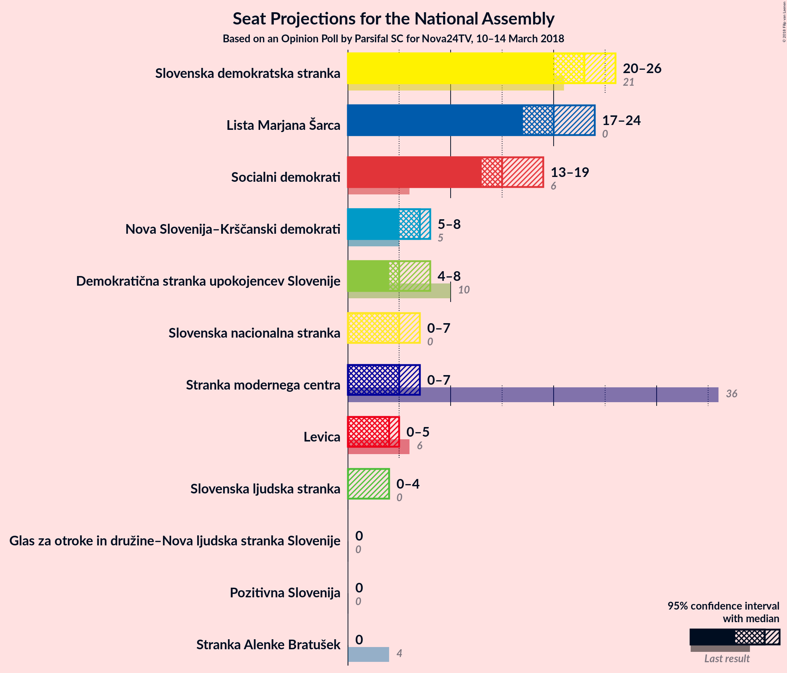

# Opinion Poll by Parsifal SC for Nova24TV, 10–14 March 2018

<a href="#voting-intentions">Voting Intentions</a> | <a href="#seats">Seats</a> | <a href="#coalitions">Coalitions</a> | <a href="#technical-information">Technical Information</a>

## Voting Intentions

### Confidence Intervals

| Party | Last Result | Poll Result | 80% Confidence Interval | 90% Confidence Interval | 95% Confidence Interval | 99% Confidence Interval |
|:-----:|:-----------:|:-----------:|:-----------------------:|:-----------------------:|:-----------------------:|:-----------------------:|
| Slovenska demokratska stranka | 20.7% | 23.3% | 21.5–25.4% |21.0–25.9% |20.5–26.4% |19.6–27.4% |
| Lista Marjana Šarca | 0.0% | 20.9% | 19.1–22.9% |18.6–23.4% |18.2–23.9% |17.4–24.9% |
| Socialni demokrati | 6.0% | 16.5% | 14.9–18.3% |14.4–18.8% |14.0–19.2% |13.3–20.1% |
| Nova Slovenija–Krščanski demokrati | 5.6% | 6.8% | 5.7–8.0% |5.4–8.4% |5.2–8.7% |4.8–9.4% |
| Demokratična stranka upokojencev Slovenije | 10.2% | 6.2% | 5.3–7.5% |5.0–7.9% |4.8–8.2% |4.3–8.8% |
| Stranka modernega centra | 34.5% | 5.2% | 4.3–6.4% |4.1–6.7% |3.9–7.0% |3.5–7.6% |
| Slovenska nacionalna stranka | 2.2% | 5.2% | 4.3–6.4% |4.1–6.7% |3.9–7.0% |3.5–7.6% |
| Levica | 6.0% | 4.1% | 3.3–5.1% |3.1–5.4% |2.9–5.7% |2.6–6.3% |
| Slovenska ljudska stranka | 4.0% | 2.8% | 2.2–3.7% |2.0–4.0% |1.9–4.2% |1.6–4.7% |
| Stranka Alenke Bratušek | 4.4% | 1.5% | 1.1–2.3% |1.0–2.5% |0.9–2.7% |0.7–3.1% |
| Pozitivna Slovenija | 3.0% | 0.9% | 0.6–1.5% |0.5–1.7% |0.4–1.8% |0.3–2.2% |
| Glas za otroke in družine–Nova ljudska stranka Slovenije | 0.0% | 0.6% | 0.4–1.2% |0.3–1.3% |0.3–1.5% |0.2–1.8% |

*Note:* The poll result column reflects the actual value used in the calculations. Published results may vary slightly, and in addition be rounded to fewer digits.

## Seats

### Confidence Intervals

| Party | Last Result | Median | 80% Confidence Interval | 90% Confidence Interval | 95% Confidence Interval | 99% Confidence Interval |
|:-----:|:-----------:|:------:|:-----------------------:|:-----------------------:|:-----------------------:|:-----------------------:|
| <a href="#slovenska-demokratska-stranka">Slovenska demokratska stranka</a> | 21 | 23 | 21–25 |20–26 |20–26 |18–27 |
| <a href="#lista-marjana-šarca">Lista Marjana Šarca</a> | 0 | 20 | 19–23 |18–24 |17–24 |16–24 |
| <a href="#socialni-demokrati">Socialni demokrati</a> | 6 | 15 | 14–18 |13–19 |13–19 |12–19 |
| <a href="#nova-slovenija–krščanski-demokrati">Nova Slovenija–Krščanski demokrati</a> | 5 | 7 | 5–7 |5–8 |5–8 |4–9 |
| <a href="#demokratična-stranka-upokojencev-slovenije">Demokratična stranka upokojencev Slovenije</a> | 10 | 5 | 5–7 |4–8 |4–8 |3–8 |
| <a href="#stranka-modernega-centra">Stranka modernega centra</a> | 36 | 5 | 4–6 |0–6 |0–7 |0–7 |
| <a href="#slovenska-nacionalna-stranka">Slovenska nacionalna stranka</a> | 0 | 5 | 0–6 |0–6 |0–7 |0–7 |
| <a href="#levica">Levica</a> | 6 | 4 | 0–5 |0–5 |0–5 |0–5 |
| <a href="#slovenska-ljudska-stranka">Slovenska ljudska stranka</a> | 0 | 0 | 0 |0–4 |0–4 |0–4 |
| <a href="#stranka-alenke-bratušek">Stranka Alenke Bratušek</a> | 4 | 0 | 0 |0 |0 |0 |
| <a href="#pozitivna-slovenija">Pozitivna Slovenija</a> | 0 | 0 | 0 |0 |0 |0 |
| <a href="#glas-za-otroke-in-družine–nova-ljudska-stranka-slovenije">Glas za otroke in družine–Nova ljudska stranka Slovenije</a> | 0 | 0 | 0 |0 |0 |0 |

### Slovenska demokratska stranka

*For a full overview of the results for this party, see the [Slovenska demokratska stranka](party-slovenskademokratskastranka.html) page.*

| Number of Seats | Probability | Accumulated | Special Marks |
|:---------------:|:-----------:|:-----------:|:-------------:|
| 18 | 1.2% | 100% |  |
| 19 | 1.0% | 98.8% |  |
| 20 | 7% | 98% |  |
| 21 | 20% | 91% | Last Result |
| 22 | 13% | 71% |  |
| 23 | 28% | 58% | Median |
| 24 | 17% | 29% |  |
| 25 | 6% | 12% |  |
| 26 | 5% | 6% |  |
| 27 | 0.3% | 0.6% |  |
| 28 | 0.2% | 0.3% |  |
| 29 | 0.1% | 0.1% |  |
| 30 | 0% | 0% |  |

### Lista Marjana Šarca

*For a full overview of the results for this party, see the [Lista Marjana Šarca](party-listamarjanašarca.html) page.*

| Number of Seats | Probability | Accumulated | Special Marks |
|:---------------:|:-----------:|:-----------:|:-------------:|
| 0 | 0% | 100% | Last Result |
| 1 | 0% | 100% |  |
| 2 | 0% | 100% |  |
| 3 | 0% | 100% |  |
| 4 | 0% | 100% |  |
| 5 | 0% | 100% |  |
| 6 | 0% | 100% |  |
| 7 | 0% | 100% |  |
| 8 | 0% | 100% |  |
| 9 | 0% | 100% |  |
| 10 | 0% | 100% |  |
| 11 | 0% | 100% |  |
| 12 | 0% | 100% |  |
| 13 | 0% | 100% |  |
| 14 | 0% | 100% |  |
| 15 | 0.1% | 100% |  |
| 16 | 0.4% | 99.9% |  |
| 17 | 2% | 99.5% |  |
| 18 | 4% | 97% |  |
| 19 | 14% | 93% |  |
| 20 | 39% | 79% | Median |
| 21 | 18% | 40% |  |
| 22 | 10% | 22% |  |
| 23 | 4% | 12% |  |
| 24 | 8% | 8% |  |
| 25 | 0.4% | 0.4% |  |
| 26 | 0.1% | 0.1% |  |
| 27 | 0% | 0% |  |

### Socialni demokrati

*For a full overview of the results for this party, see the [Socialni demokrati](party-socialnidemokrati.html) page.*

| Number of Seats | Probability | Accumulated | Special Marks |
|:---------------:|:-----------:|:-----------:|:-------------:|
| 6 | 0% | 100% | Last Result |
| 7 | 0% | 100% |  |
| 8 | 0% | 100% |  |
| 9 | 0% | 100% |  |
| 10 | 0% | 100% |  |
| 11 | 0% | 100% |  |
| 12 | 0.6% | 100% |  |
| 13 | 6% | 99.4% |  |
| 14 | 29% | 93% |  |
| 15 | 14% | 64% | Median |
| 16 | 16% | 50% |  |
| 17 | 18% | 34% |  |
| 18 | 7% | 17% |  |
| 19 | 9% | 10% |  |
| 20 | 0.3% | 0.4% |  |
| 21 | 0.1% | 0.1% |  |
| 22 | 0% | 0% |  |

### Nova Slovenija–Krščanski demokrati

*For a full overview of the results for this party, see the [Nova Slovenija–Krščanski demokrati](party-novaslovenija–krščanskidemokrati.html) page.*

| Number of Seats | Probability | Accumulated | Special Marks |
|:---------------:|:-----------:|:-----------:|:-------------:|
| 4 | 2% | 100% |  |
| 5 | 16% | 98% | Last Result |
| 6 | 23% | 82% |  |
| 7 | 50% | 59% | Median |
| 8 | 8% | 9% |  |
| 9 | 0.8% | 1.0% |  |
| 10 | 0.2% | 0.2% |  |
| 11 | 0% | 0% |  |

### Demokratična stranka upokojencev Slovenije

*For a full overview of the results for this party, see the [Demokratična stranka upokojencev Slovenije](party-demokratičnastrankaupokojencevslovenije.html) page.*

| Number of Seats | Probability | Accumulated | Special Marks |
|:---------------:|:-----------:|:-----------:|:-------------:|
| 0 | 0.2% | 100% |  |
| 1 | 0% | 99.8% |  |
| 2 | 0% | 99.8% |  |
| 3 | 0.4% | 99.8% |  |
| 4 | 7% | 99.5% |  |
| 5 | 50% | 93% | Median |
| 6 | 29% | 43% |  |
| 7 | 8% | 14% |  |
| 8 | 6% | 6% |  |
| 9 | 0.4% | 0.4% |  |
| 10 | 0% | 0% | Last Result |

### Stranka modernega centra

*For a full overview of the results for this party, see the [Stranka modernega centra](party-strankamodernegacentra.html) page.*

| Number of Seats | Probability | Accumulated | Special Marks |
|:---------------:|:-----------:|:-----------:|:-------------:|
| 0 | 5% | 100% |  |
| 1 | 0% | 95% |  |
| 2 | 0% | 95% |  |
| 3 | 0.5% | 95% |  |
| 4 | 41% | 94% |  |
| 5 | 38% | 54% | Median |
| 6 | 12% | 15% |  |
| 7 | 3% | 3% |  |
| 8 | 0.1% | 0.1% |  |
| 9 | 0% | 0% |  |
| 10 | 0% | 0% |  |
| 11 | 0% | 0% |  |
| 12 | 0% | 0% |  |
| 13 | 0% | 0% |  |
| 14 | 0% | 0% |  |
| 15 | 0% | 0% |  |
| 16 | 0% | 0% |  |
| 17 | 0% | 0% |  |
| 18 | 0% | 0% |  |
| 19 | 0% | 0% |  |
| 20 | 0% | 0% |  |
| 21 | 0% | 0% |  |
| 22 | 0% | 0% |  |
| 23 | 0% | 0% |  |
| 24 | 0% | 0% |  |
| 25 | 0% | 0% |  |
| 26 | 0% | 0% |  |
| 27 | 0% | 0% |  |
| 28 | 0% | 0% |  |
| 29 | 0% | 0% |  |
| 30 | 0% | 0% |  |
| 31 | 0% | 0% |  |
| 32 | 0% | 0% |  |
| 33 | 0% | 0% |  |
| 34 | 0% | 0% |  |
| 35 | 0% | 0% |  |
| 36 | 0% | 0% | Last Result |

### Slovenska nacionalna stranka

*For a full overview of the results for this party, see the [Slovenska nacionalna stranka](party-slovenskanacionalnastranka.html) page.*

| Number of Seats | Probability | Accumulated | Special Marks |
|:---------------:|:-----------:|:-----------:|:-------------:|
| 0 | 10% | 100% | Last Result |
| 1 | 0% | 90% |  |
| 2 | 0% | 90% |  |
| 3 | 0.6% | 90% |  |
| 4 | 22% | 89% |  |
| 5 | 57% | 68% | Median |
| 6 | 8% | 11% |  |
| 7 | 2% | 3% |  |
| 8 | 0.4% | 0.4% |  |
| 9 | 0% | 0% |  |

### Levica

*For a full overview of the results for this party, see the [Levica](party-levica.html) page.*

| Number of Seats | Probability | Accumulated | Special Marks |
|:---------------:|:-----------:|:-----------:|:-------------:|
| 0 | 43% | 100% |  |
| 1 | 0% | 57% |  |
| 2 | 0% | 57% |  |
| 3 | 0.2% | 57% |  |
| 4 | 29% | 57% | Median |
| 5 | 28% | 28% |  |
| 6 | 0.4% | 0.4% | Last Result |
| 7 | 0% | 0% |  |

### Slovenska ljudska stranka

*For a full overview of the results for this party, see the [Slovenska ljudska stranka](party-slovenskaljudskastranka.html) page.*

| Number of Seats | Probability | Accumulated | Special Marks |
|:---------------:|:-----------:|:-----------:|:-------------:|
| 0 | 93% | 100% | Last Result, Median |
| 1 | 0% | 7% |  |
| 2 | 0% | 7% |  |
| 3 | 0.2% | 7% |  |
| 4 | 6% | 6% |  |
| 5 | 0% | 0% |  |

### Stranka Alenke Bratušek

*For a full overview of the results for this party, see the [Stranka Alenke Bratušek](party-strankaalenkebratušek.html) page.*

| Number of Seats | Probability | Accumulated | Special Marks |
|:---------------:|:-----------:|:-----------:|:-------------:|
| 0 | 100% | 100% | Median |
| 1 | 0% | 0% |  |
| 2 | 0% | 0% |  |
| 3 | 0% | 0% |  |
| 4 | 0% | 0% | Last Result |

### Pozitivna Slovenija

*For a full overview of the results for this party, see the [Pozitivna Slovenija](party-pozitivnaslovenija.html) page.*

| Number of Seats | Probability | Accumulated | Special Marks |
|:---------------:|:-----------:|:-----------:|:-------------:|
| 0 | 100% | 100% | Last Result, Median |

### Glas za otroke in družine–Nova ljudska stranka Slovenije

*For a full overview of the results for this party, see the [Glas za otroke in družine–Nova ljudska stranka Slovenije](party-glaszaotrokeindružine–novaljudskastrankaslovenije.html) page.*

| Number of Seats | Probability | Accumulated | Special Marks |
|:---------------:|:-----------:|:-----------:|:-------------:|
| 0 | 100% | 100% | Last Result, Median |

## Coalitions

### Confidence Intervals

| Coalition | Last Result | Median | Majority? | 80% Confidence Interval | 90% Confidence Interval | 95% Confidence Interval | 99% Confidence Interval |
|:---------:|:-----------:|:------:|:---------:|:-----------------------:|:-----------------------:|:-----------------------:|:-----------------------:|
| Lista Marjana Šarca – Socialni demokrati – Nova Slovenija–Krščanski demokrati – Demokratična stranka upokojencev Slovenije – Stranka modernega centra – Stranka Alenke Bratušek | 61 | 52 | 100% | 50–57 | 49–59 | 46–59 | 46–59 |
| Lista Marjana Šarca – Socialni demokrati – Nova Slovenija–Krščanski demokrati – Demokratična stranka upokojencev Slovenije – Stranka modernega centra | 57 | 52 | 100% | 50–57 | 49–59 | 46–59 | 46–59 |
| Lista Marjana Šarca – Socialni demokrati – Nova Slovenija–Krščanski demokrati – Demokratična stranka upokojencev Slovenije | 21 | 47 | 91% | 46–52 | 45–54 | 44–54 | 42–55 |
| Slovenska demokratska stranka – Lista Marjana Šarca – Demokratična stranka upokojencev Slovenije | 31 | 48 | 94% | 46–52 | 45–54 | 44–54 | 43–56 |
| Lista Marjana Šarca – Socialni demokrati – Nova Slovenija–Krščanski demokrati – Stranka modernega centra | 47 | 47 | 68% | 45–51 | 43–53 | 41–53 | 41–53 |
| Lista Marjana Šarca – Socialni demokrati – Demokratična stranka upokojencev Slovenije – Stranka modernega centra – Stranka Alenke Bratušek | 56 | 46 | 56% | 43–50 | 42–52 | 40–52 | 40–53 |
| Lista Marjana Šarca – Socialni demokrati – Demokratična stranka upokojencev Slovenije – Stranka modernega centra | 52 | 46 | 56% | 43–50 | 42–52 | 40–52 | 40–53 |
| Lista Marjana Šarca – Socialni demokrati – Nova Slovenija–Krščanski demokrati | 11 | 42 | 20% | 41–46 | 39–48 | 39–48 | 37–48 |
| Slovenska demokratska stranka – Lista Marjana Šarca | 21 | 43 | 15% | 40–46 | 40–48 | 39–48 | 38–49 |
| Lista Marjana Šarca – Socialni demokrati – Demokratična stranka upokojencev Slovenije | 16 | 41 | 12% | 39–46 | 39–47 | 38–47 | 36–48 |
| Lista Marjana Šarca – Socialni demokrati – Stranka modernega centra | 42 | 40 | 6% | 38–44 | 37–46 | 35–46 | 34–46 |
| Lista Marjana Šarca – Socialni demokrati | 6 | 36 | 0% | 34–40 | 33–41 | 32–41 | 31–41 |
| Socialni demokrati – Demokratična stranka upokojencev Slovenije – Stranka modernega centra | 52 | 26 | 0% | 23–29 | 22–30 | 19–30 | 19–31 |
| Socialni demokrati – Stranka modernega centra – Pozitivna Slovenija | 42 | 20 | 0% | 18–24 | 17–24 | 14–24 | 14–25 |

### Lista Marjana Šarca – Socialni demokrati – Nova Slovenija–Krščanski demokrati – Demokratična stranka upokojencev Slovenije – Stranka modernega centra – Stranka Alenke Bratušek

| Number of Seats | Probability | Accumulated | Special Marks |
|:---------------:|:-----------:|:-----------:|:-------------:|
| 46 | 3% | 100% | Majority |
| 47 | 0.6% | 97% |  |
| 48 | 2% | 97% |  |
| 49 | 3% | 95% |  |
| 50 | 24% | 92% |  |
| 51 | 10% | 69% |  |
| 52 | 13% | 59% | Median |
| 53 | 10% | 46% |  |
| 54 | 5% | 36% |  |
| 55 | 7% | 31% |  |
| 56 | 12% | 24% |  |
| 57 | 4% | 12% |  |
| 58 | 1.5% | 8% |  |
| 59 | 7% | 7% |  |
| 60 | 0.1% | 0.1% |  |
| 61 | 0% | 0% | Last Result |

### Lista Marjana Šarca – Socialni demokrati – Nova Slovenija–Krščanski demokrati – Demokratična stranka upokojencev Slovenije – Stranka modernega centra

| Number of Seats | Probability | Accumulated | Special Marks |
|:---------------:|:-----------:|:-----------:|:-------------:|
| 46 | 3% | 100% | Majority |
| 47 | 0.6% | 97% |  |
| 48 | 2% | 97% |  |
| 49 | 3% | 95% |  |
| 50 | 24% | 92% |  |
| 51 | 10% | 69% |  |
| 52 | 13% | 59% | Median |
| 53 | 10% | 46% |  |
| 54 | 5% | 36% |  |
| 55 | 7% | 31% |  |
| 56 | 12% | 24% |  |
| 57 | 4% | 12% | Last Result |
| 58 | 1.5% | 8% |  |
| 59 | 7% | 7% |  |
| 60 | 0.1% | 0.1% |  |
| 61 | 0% | 0% |  |

### Lista Marjana Šarca – Socialni demokrati – Nova Slovenija–Krščanski demokrati – Demokratična stranka upokojencev Slovenije

| Number of Seats | Probability | Accumulated | Special Marks |
|:---------------:|:-----------:|:-----------:|:-------------:|
| 21 | 0% | 100% | Last Result |
| 22 | 0% | 100% |  |
| 23 | 0% | 100% |  |
| 24 | 0% | 100% |  |
| 25 | 0% | 100% |  |
| 26 | 0% | 100% |  |
| 27 | 0% | 100% |  |
| 28 | 0% | 100% |  |
| 29 | 0% | 100% |  |
| 30 | 0% | 100% |  |
| 31 | 0% | 100% |  |
| 32 | 0% | 100% |  |
| 33 | 0% | 100% |  |
| 34 | 0% | 100% |  |
| 35 | 0% | 100% |  |
| 36 | 0% | 100% |  |
| 37 | 0% | 100% |  |
| 38 | 0% | 100% |  |
| 39 | 0% | 100% |  |
| 40 | 0% | 100% |  |
| 41 | 0% | 100% |  |
| 42 | 0.9% | 100% |  |
| 43 | 0.9% | 99.1% |  |
| 44 | 2% | 98% |  |
| 45 | 5% | 97% |  |
| 46 | 27% | 91% | Majority |
| 47 | 17% | 64% | Median |
| 48 | 8% | 47% |  |
| 49 | 9% | 40% |  |
| 50 | 6% | 30% |  |
| 51 | 10% | 25% |  |
| 52 | 5% | 15% |  |
| 53 | 2% | 9% |  |
| 54 | 6% | 7% |  |
| 55 | 0.7% | 0.8% |  |
| 56 | 0.1% | 0.1% |  |
| 57 | 0% | 0% |  |

### Slovenska demokratska stranka – Lista Marjana Šarca – Demokratična stranka upokojencev Slovenije

| Number of Seats | Probability | Accumulated | Special Marks |
|:---------------:|:-----------:|:-----------:|:-------------:|
| 31 | 0% | 100% | Last Result |
| 32 | 0% | 100% |  |
| 33 | 0% | 100% |  |
| 34 | 0% | 100% |  |
| 35 | 0% | 100% |  |
| 36 | 0% | 100% |  |
| 37 | 0% | 100% |  |
| 38 | 0% | 100% |  |
| 39 | 0% | 100% |  |
| 40 | 0% | 100% |  |
| 41 | 0% | 100% |  |
| 42 | 0.2% | 100% |  |
| 43 | 0.4% | 99.8% |  |
| 44 | 2% | 99.4% |  |
| 45 | 3% | 97% |  |
| 46 | 19% | 94% | Majority |
| 47 | 6% | 75% |  |
| 48 | 23% | 69% | Median |
| 49 | 10% | 45% |  |
| 50 | 11% | 35% |  |
| 51 | 13% | 25% |  |
| 52 | 3% | 12% |  |
| 53 | 2% | 9% |  |
| 54 | 6% | 7% |  |
| 55 | 0.3% | 1.0% |  |
| 56 | 0.7% | 0.8% |  |
| 57 | 0% | 0.1% |  |
| 58 | 0% | 0% |  |

### Lista Marjana Šarca – Socialni demokrati – Nova Slovenija–Krščanski demokrati – Stranka modernega centra

| Number of Seats | Probability | Accumulated | Special Marks |
|:---------------:|:-----------:|:-----------:|:-------------:|
| 39 | 0.1% | 100% |  |
| 40 | 0.1% | 99.9% |  |
| 41 | 3% | 99.8% |  |
| 42 | 1.1% | 97% |  |
| 43 | 1.4% | 96% |  |
| 44 | 4% | 94% |  |
| 45 | 22% | 91% |  |
| 46 | 17% | 68% | Majority |
| 47 | 15% | 51% | Last Result, Median |
| 48 | 6% | 36% |  |
| 49 | 4% | 30% |  |
| 50 | 7% | 25% |  |
| 51 | 11% | 19% |  |
| 52 | 0.8% | 7% |  |
| 53 | 6% | 6% |  |
| 54 | 0.1% | 0.1% |  |
| 55 | 0% | 0% |  |

### Lista Marjana Šarca – Socialni demokrati – Demokratična stranka upokojencev Slovenije – Stranka modernega centra – Stranka Alenke Bratušek

| Number of Seats | Probability | Accumulated | Special Marks |
|:---------------:|:-----------:|:-----------:|:-------------:|
| 39 | 0% | 100% |  |
| 40 | 3% | 99.9% |  |
| 41 | 1.1% | 97% |  |
| 42 | 2% | 96% |  |
| 43 | 24% | 94% |  |
| 44 | 4% | 70% |  |
| 45 | 11% | 67% | Median |
| 46 | 11% | 56% | Majority |
| 47 | 9% | 45% |  |
| 48 | 5% | 35% |  |
| 49 | 12% | 30% |  |
| 50 | 8% | 18% |  |
| 51 | 2% | 10% |  |
| 52 | 7% | 7% |  |
| 53 | 0.3% | 0.5% |  |
| 54 | 0.2% | 0.2% |  |
| 55 | 0% | 0% |  |
| 56 | 0% | 0% | Last Result |

### Lista Marjana Šarca – Socialni demokrati – Demokratična stranka upokojencev Slovenije – Stranka modernega centra

| Number of Seats | Probability | Accumulated | Special Marks |
|:---------------:|:-----------:|:-----------:|:-------------:|
| 39 | 0% | 100% |  |
| 40 | 3% | 99.9% |  |
| 41 | 1.1% | 97% |  |
| 42 | 2% | 96% |  |
| 43 | 24% | 94% |  |
| 44 | 4% | 70% |  |
| 45 | 11% | 67% | Median |
| 46 | 11% | 56% | Majority |
| 47 | 9% | 45% |  |
| 48 | 5% | 35% |  |
| 49 | 12% | 30% |  |
| 50 | 8% | 18% |  |
| 51 | 2% | 10% |  |
| 52 | 7% | 7% | Last Result |
| 53 | 0.3% | 0.5% |  |
| 54 | 0.2% | 0.2% |  |
| 55 | 0% | 0% |  |

### Lista Marjana Šarca – Socialni demokrati – Nova Slovenija–Krščanski demokrati

| Number of Seats | Probability | Accumulated | Special Marks |
|:---------------:|:-----------:|:-----------:|:-------------:|
| 11 | 0% | 100% | Last Result |
| 12 | 0% | 100% |  |
| 13 | 0% | 100% |  |
| 14 | 0% | 100% |  |
| 15 | 0% | 100% |  |
| 16 | 0% | 100% |  |
| 17 | 0% | 100% |  |
| 18 | 0% | 100% |  |
| 19 | 0% | 100% |  |
| 20 | 0% | 100% |  |
| 21 | 0% | 100% |  |
| 22 | 0% | 100% |  |
| 23 | 0% | 100% |  |
| 24 | 0% | 100% |  |
| 25 | 0% | 100% |  |
| 26 | 0% | 100% |  |
| 27 | 0% | 100% |  |
| 28 | 0% | 100% |  |
| 29 | 0% | 100% |  |
| 30 | 0% | 100% |  |
| 31 | 0% | 100% |  |
| 32 | 0% | 100% |  |
| 33 | 0% | 100% |  |
| 34 | 0% | 100% |  |
| 35 | 0% | 100% |  |
| 36 | 0.1% | 100% |  |
| 37 | 0.8% | 99.9% |  |
| 38 | 1.5% | 99.1% |  |
| 39 | 3% | 98% |  |
| 40 | 4% | 94% |  |
| 41 | 36% | 90% |  |
| 42 | 12% | 54% | Median |
| 43 | 10% | 41% |  |
| 44 | 7% | 31% |  |
| 45 | 4% | 24% |  |
| 46 | 10% | 20% | Majority |
| 47 | 3% | 10% |  |
| 48 | 6% | 6% |  |
| 49 | 0.2% | 0.3% |  |
| 50 | 0% | 0.1% |  |
| 51 | 0% | 0% |  |

### Slovenska demokratska stranka – Lista Marjana Šarca

| Number of Seats | Probability | Accumulated | Special Marks |
|:---------------:|:-----------:|:-----------:|:-------------:|
| 21 | 0% | 100% | Last Result |
| 22 | 0% | 100% |  |
| 23 | 0% | 100% |  |
| 24 | 0% | 100% |  |
| 25 | 0% | 100% |  |
| 26 | 0% | 100% |  |
| 27 | 0% | 100% |  |
| 28 | 0% | 100% |  |
| 29 | 0% | 100% |  |
| 30 | 0% | 100% |  |
| 31 | 0% | 100% |  |
| 32 | 0% | 100% |  |
| 33 | 0% | 100% |  |
| 34 | 0% | 100% |  |
| 35 | 0% | 100% |  |
| 36 | 0.2% | 100% |  |
| 37 | 0.2% | 99.8% |  |
| 38 | 1.2% | 99.6% |  |
| 39 | 3% | 98% |  |
| 40 | 6% | 95% |  |
| 41 | 16% | 89% |  |
| 42 | 8% | 73% |  |
| 43 | 32% | 66% | Median |
| 44 | 8% | 34% |  |
| 45 | 10% | 26% |  |
| 46 | 6% | 15% | Majority |
| 47 | 1.1% | 10% |  |
| 48 | 8% | 8% |  |
| 49 | 0.3% | 0.6% |  |
| 50 | 0.1% | 0.2% |  |
| 51 | 0% | 0.1% |  |
| 52 | 0% | 0% |  |

### Lista Marjana Šarca – Socialni demokrati – Demokratična stranka upokojencev Slovenije

| Number of Seats | Probability | Accumulated | Special Marks |
|:---------------:|:-----------:|:-----------:|:-------------:|
| 16 | 0% | 100% | Last Result |
| 17 | 0% | 100% |  |
| 18 | 0% | 100% |  |
| 19 | 0% | 100% |  |
| 20 | 0% | 100% |  |
| 21 | 0% | 100% |  |
| 22 | 0% | 100% |  |
| 23 | 0% | 100% |  |
| 24 | 0% | 100% |  |
| 25 | 0% | 100% |  |
| 26 | 0% | 100% |  |
| 27 | 0% | 100% |  |
| 28 | 0% | 100% |  |
| 29 | 0% | 100% |  |
| 30 | 0% | 100% |  |
| 31 | 0% | 100% |  |
| 32 | 0% | 100% |  |
| 33 | 0% | 100% |  |
| 34 | 0% | 100% |  |
| 35 | 0% | 100% |  |
| 36 | 1.5% | 100% |  |
| 37 | 0.8% | 98% |  |
| 38 | 2% | 98% |  |
| 39 | 26% | 96% |  |
| 40 | 14% | 70% | Median |
| 41 | 8% | 56% |  |
| 42 | 8% | 48% |  |
| 43 | 11% | 40% |  |
| 44 | 14% | 29% |  |
| 45 | 3% | 15% |  |
| 46 | 4% | 12% | Majority |
| 47 | 7% | 8% |  |
| 48 | 0.8% | 1.0% |  |
| 49 | 0.2% | 0.2% |  |
| 50 | 0% | 0% |  |

### Lista Marjana Šarca – Socialni demokrati – Stranka modernega centra

| Number of Seats | Probability | Accumulated | Special Marks |
|:---------------:|:-----------:|:-----------:|:-------------:|
| 33 | 0.4% | 100% |  |
| 34 | 0.2% | 99.6% |  |
| 35 | 3% | 99.4% |  |
| 36 | 1.2% | 96% |  |
| 37 | 2% | 95% |  |
| 38 | 22% | 93% |  |
| 39 | 11% | 71% |  |
| 40 | 10% | 60% | Median |
| 41 | 12% | 50% |  |
| 42 | 10% | 38% | Last Result |
| 43 | 5% | 28% |  |
| 44 | 13% | 23% |  |
| 45 | 3% | 10% |  |
| 46 | 6% | 6% | Majority |
| 47 | 0.4% | 0.5% |  |
| 48 | 0% | 0% |  |

### Lista Marjana Šarca – Socialni demokrati

| Number of Seats | Probability | Accumulated | Special Marks |
|:---------------:|:-----------:|:-----------:|:-------------:|
| 6 | 0% | 100% | Last Result |
| 7 | 0% | 100% |  |
| 8 | 0% | 100% |  |
| 9 | 0% | 100% |  |
| 10 | 0% | 100% |  |
| 11 | 0% | 100% |  |
| 12 | 0% | 100% |  |
| 13 | 0% | 100% |  |
| 14 | 0% | 100% |  |
| 15 | 0% | 100% |  |
| 16 | 0% | 100% |  |
| 17 | 0% | 100% |  |
| 18 | 0% | 100% |  |
| 19 | 0% | 100% |  |
| 20 | 0% | 100% |  |
| 21 | 0% | 100% |  |
| 22 | 0% | 100% |  |
| 23 | 0% | 100% |  |
| 24 | 0% | 100% |  |
| 25 | 0% | 100% |  |
| 26 | 0% | 100% |  |
| 27 | 0% | 100% |  |
| 28 | 0% | 100% |  |
| 29 | 0% | 100% |  |
| 30 | 0.1% | 100% |  |
| 31 | 0.9% | 99.9% |  |
| 32 | 2% | 99.0% |  |
| 33 | 2% | 97% |  |
| 34 | 31% | 94% |  |
| 35 | 13% | 64% | Median |
| 36 | 8% | 51% |  |
| 37 | 14% | 43% |  |
| 38 | 8% | 30% |  |
| 39 | 9% | 21% |  |
| 40 | 5% | 12% |  |
| 41 | 7% | 8% |  |
| 42 | 0.3% | 0.4% |  |
| 43 | 0.1% | 0.1% |  |
| 44 | 0% | 0% |  |

### Socialni demokrati – Demokratična stranka upokojencev Slovenije – Stranka modernega centra

| Number of Seats | Probability | Accumulated | Special Marks |
|:---------------:|:-----------:|:-----------:|:-------------:|
| 19 | 3% | 100% |  |
| 20 | 1.0% | 97% |  |
| 21 | 0.3% | 96% |  |
| 22 | 2% | 96% |  |
| 23 | 21% | 94% |  |
| 24 | 13% | 74% |  |
| 25 | 7% | 60% | Median |
| 26 | 8% | 53% |  |
| 27 | 13% | 45% |  |
| 28 | 14% | 32% |  |
| 29 | 12% | 18% |  |
| 30 | 4% | 6% |  |
| 31 | 1.4% | 2% |  |
| 32 | 0.4% | 0.5% |  |
| 33 | 0% | 0% |  |
| 34 | 0% | 0% |  |
| 35 | 0% | 0% |  |
| 36 | 0% | 0% |  |
| 37 | 0% | 0% |  |
| 38 | 0% | 0% |  |
| 39 | 0% | 0% |  |
| 40 | 0% | 0% |  |
| 41 | 0% | 0% |  |
| 42 | 0% | 0% |  |
| 43 | 0% | 0% |  |
| 44 | 0% | 0% |  |
| 45 | 0% | 0% |  |
| 46 | 0% | 0% | Majority |
| 47 | 0% | 0% |  |
| 48 | 0% | 0% |  |
| 49 | 0% | 0% |  |
| 50 | 0% | 0% |  |
| 51 | 0% | 0% |  |
| 52 | 0% | 0% | Last Result |

### Socialni demokrati – Stranka modernega centra – Pozitivna Slovenija

| Number of Seats | Probability | Accumulated | Special Marks |
|:---------------:|:-----------:|:-----------:|:-------------:|
| 13 | 0.3% | 100% |  |
| 14 | 3% | 99.7% |  |
| 15 | 0.7% | 97% |  |
| 16 | 0.5% | 96% |  |
| 17 | 1.1% | 96% |  |
| 18 | 25% | 95% |  |
| 19 | 10% | 69% |  |
| 20 | 13% | 59% | Median |
| 21 | 14% | 46% |  |
| 22 | 15% | 32% |  |
| 23 | 6% | 17% |  |
| 24 | 10% | 11% |  |
| 25 | 0.5% | 0.6% |  |
| 26 | 0.1% | 0.1% |  |
| 27 | 0% | 0% |  |
| 28 | 0% | 0% |  |
| 29 | 0% | 0% |  |
| 30 | 0% | 0% |  |
| 31 | 0% | 0% |  |
| 32 | 0% | 0% |  |
| 33 | 0% | 0% |  |
| 34 | 0% | 0% |  |
| 35 | 0% | 0% |  |
| 36 | 0% | 0% |  |
| 37 | 0% | 0% |  |
| 38 | 0% | 0% |  |
| 39 | 0% | 0% |  |
| 40 | 0% | 0% |  |
| 41 | 0% | 0% |  |
| 42 | 0% | 0% | Last Result |

## Technical Information

### Opinion Poll

+ **Polling firm:** Parsifal SC
+ **Commissioner(s):** Nova24TV
+ **Fieldwork period:** 10–14 March 2018

### Calculations

+ **Sample size:** 784
+ **Simulations done:** 2,097,152
+ **Error estimate:** 2.87%

