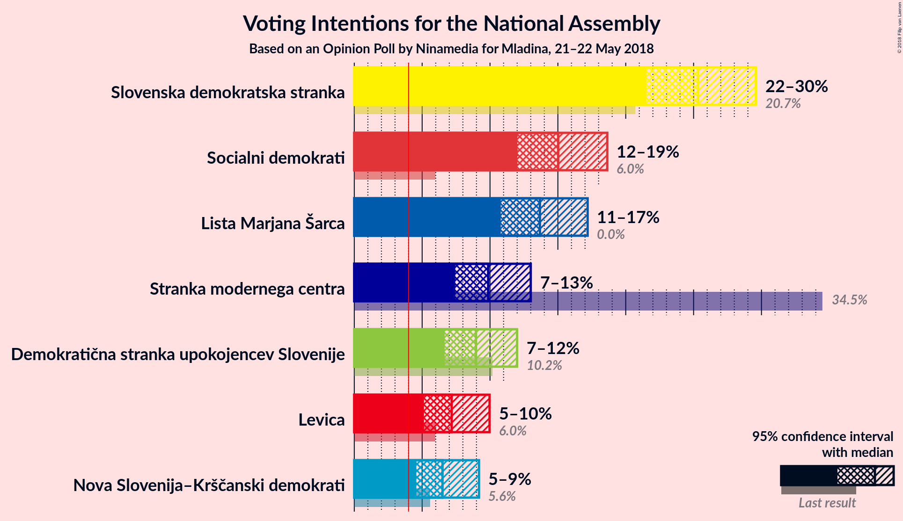
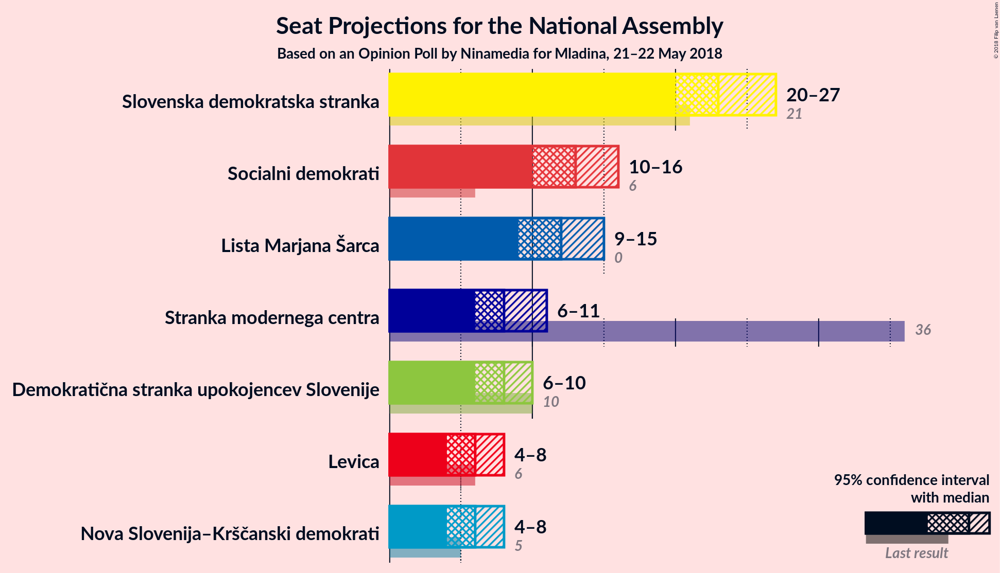
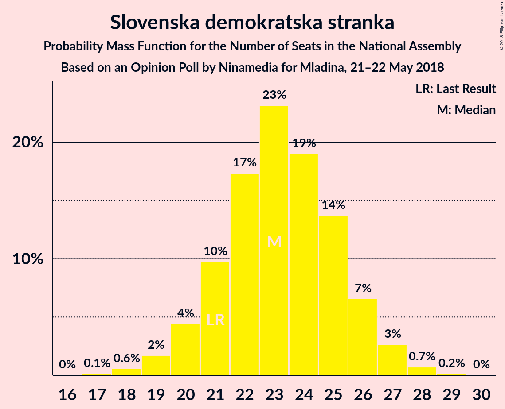
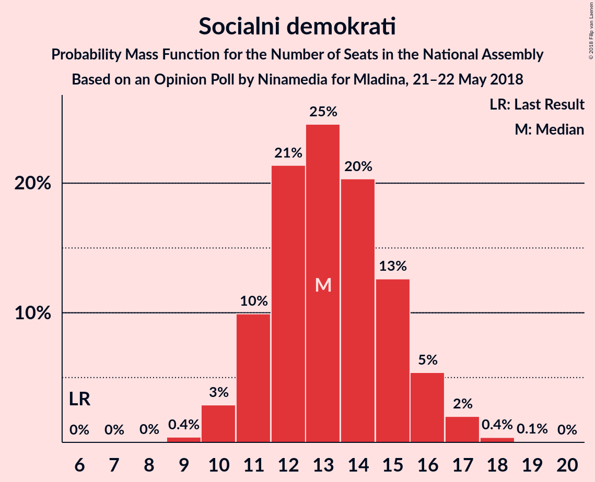
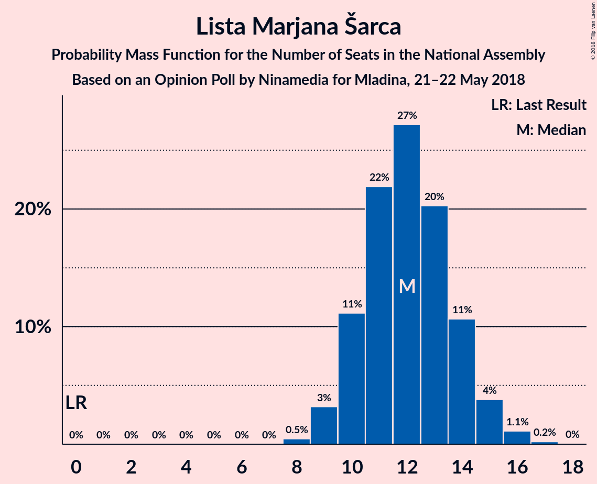
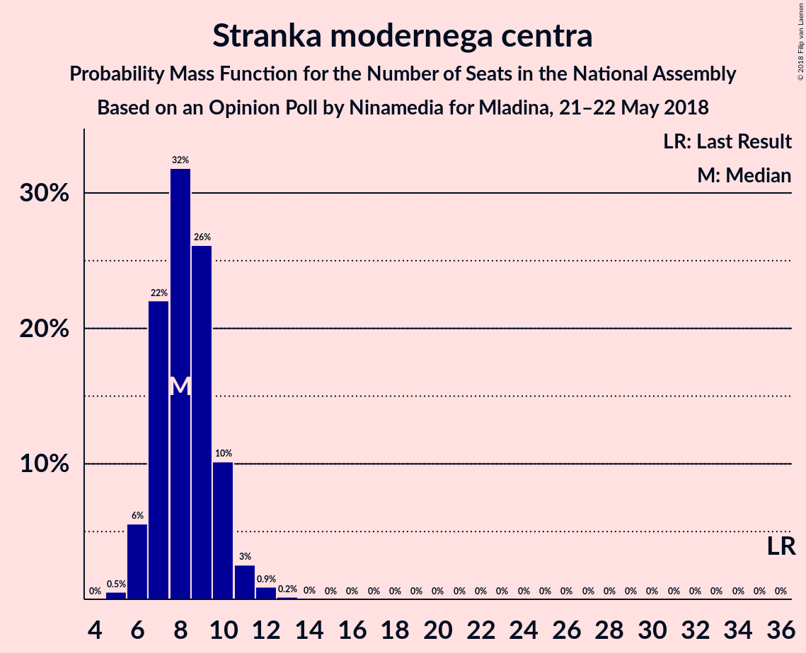
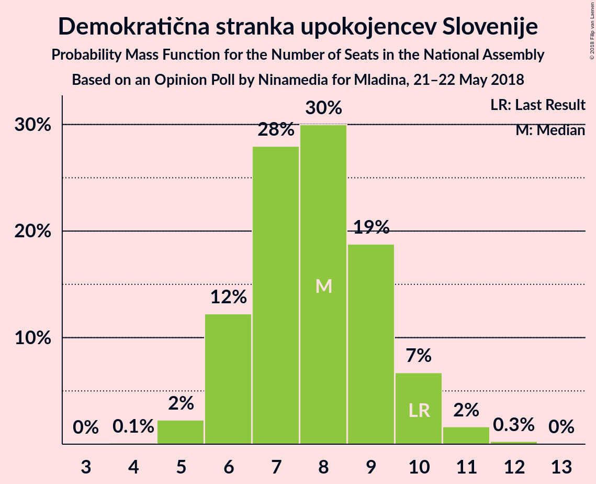
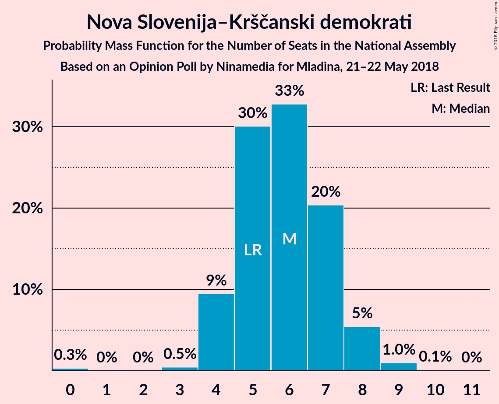
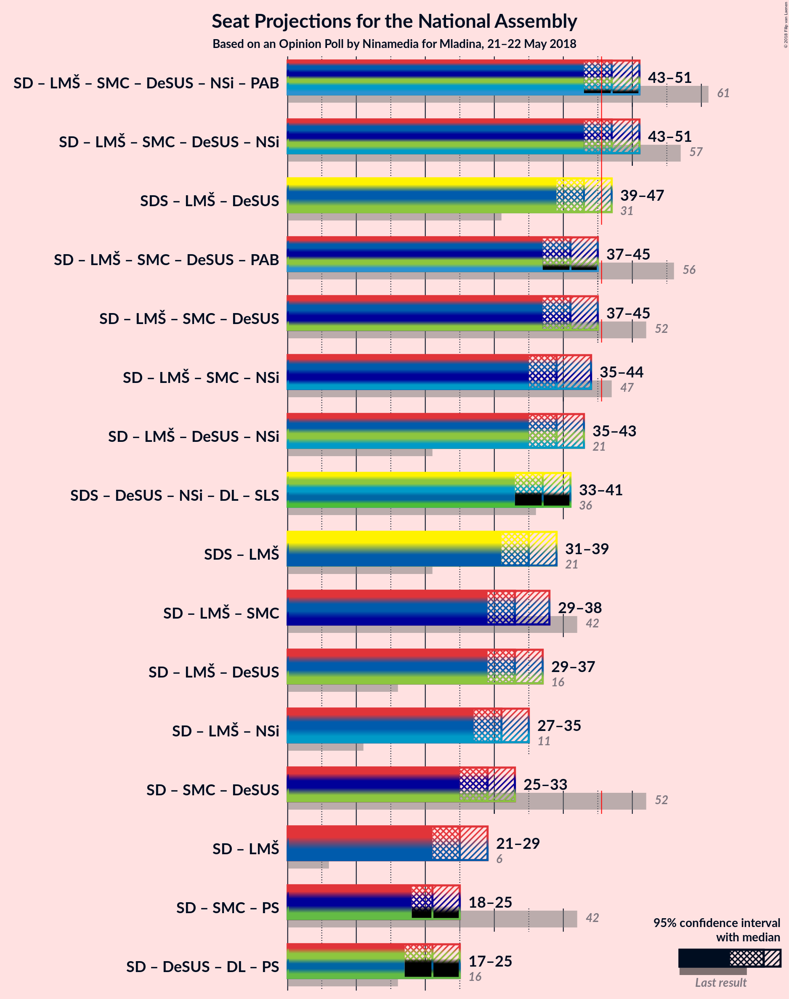

# Opinion Poll by Ninamedia for Mladina, 21–22 May 2018

<a href="#voting-intentions">Voting Intentions</a> | <a href="#seats">Seats</a> | <a href="#coalitions">Coalitions</a> | <a href="#technical-information">Technical Information</a>

## Voting Intentions

### Confidence Intervals

| Party | Last Result | Poll Result | 80% Confidence Interval | 90% Confidence Interval | 95% Confidence Interval | 99% Confidence Interval |
|:-----:|:-----------:|:-----------:|:-----------------------:|:-----------------------:|:-----------------------:|:-----------------------:|
| Slovenska demokratska stranka | 20.7% | 25.3% | 22.8–28.1% |22.1–28.9% |21.5–29.6% |20.4–30.9% |
| Socialni demokrati | 6.0% | 15.0% | 13.0–17.4% |12.5–18.1% |12.0–18.6% |11.1–19.8% |
| Lista Marjana Šarca | 0.0% | 13.7% | 11.8–16.0% |11.2–16.6% |10.8–17.2% |10.0–18.3% |
| Stranka modernega centra | 34.5% | 9.9% | 8.3–11.9% |7.8–12.5% |7.4–13.0% |6.7–14.0% |
| Demokratična stranka upokojencev Slovenije | 10.2% | 9.0% | 7.4–10.9% |7.0–11.5% |6.7–12.0% |6.0–13.0% |
| Levica | 6.0% | 7.2% | 5.8–9.0% |5.4–9.5% |5.1–10.0% |4.5–10.9% |
| Nova Slovenija–Krščanski demokrati | 5.6% | 6.5% | 5.2–8.2% |4.9–8.7% |4.6–9.2% |4.0–10.1% |

*Note:* The poll result column reflects the actual value used in the calculations. Published results may vary slightly, and in addition be rounded to fewer digits.

## Seats

### Confidence Intervals

| Party | Last Result | Median | 80% Confidence Interval | 90% Confidence Interval | 95% Confidence Interval | 99% Confidence Interval |
|:-----:|:-----------:|:------:|:-----------------------:|:-----------------------:|:-----------------------:|:-----------------------:|
| <a href="#slovenska-demokratska-stranka">Slovenska demokratska stranka</a> | 21 | 23 | 21–26 |20–26 |20–27 |18–28 |
| <a href="#socialni-demokrati">Socialni demokrati</a> | 6 | 13 | 11–15 |11–16 |10–16 |10–17 |
| <a href="#lista-marjana-šarca">Lista Marjana Šarca</a> | 0 | 12 | 10–14 |10–15 |9–15 |9–16 |
| <a href="#stranka-modernega-centra">Stranka modernega centra</a> | 36 | 8 | 7–10 |6–10 |6–11 |5–12 |
| <a href="#demokratična-stranka-upokojencev-slovenije">Demokratična stranka upokojencev Slovenije</a> | 10 | 8 | 6–9 |6–10 |6–10 |5–11 |
| <a href="#levica">Levica</a> | 6 | 6 | 5–7 |4–8 |4–8 |4–9 |
| <a href="#nova-slovenija–krščanski-demokrati">Nova Slovenija–Krščanski demokrati</a> | 5 | 6 | 4–7 |4–8 |4–8 |3–9 |

### Slovenska demokratska stranka

*For a full overview of the results for this party, see the [Slovenska demokratska stranka](party-slovenskademokratskastranka.html) page.*

| Number of Seats | Probability | Accumulated | Special Marks |
|:---------------:|:-----------:|:-----------:|:-------------:|
| 17 | 0.1% | 100% |  |
| 18 | 0.6% | 99.8% |  |
| 19 | 2% | 99.3% |  |
| 20 | 4% | 98% |  |
| 21 | 10% | 93% | Last Result |
| 22 | 17% | 83% |  |
| 23 | 23% | 66% | Median |
| 24 | 19% | 43% |  |
| 25 | 14% | 24% |  |
| 26 | 7% | 10% |  |
| 27 | 3% | 4% |  |
| 28 | 0.7% | 0.9% |  |
| 29 | 0.2% | 0.2% |  |
| 30 | 0% | 0% |  |

### Socialni demokrati

*For a full overview of the results for this party, see the [Socialni demokrati](party-socialnidemokrati.html) page.*

| Number of Seats | Probability | Accumulated | Special Marks |
|:---------------:|:-----------:|:-----------:|:-------------:|
| 6 | 0% | 100% | Last Result |
| 7 | 0% | 100% |  |
| 8 | 0% | 100% |  |
| 9 | 0.4% | 100% |  |
| 10 | 3% | 99.6% |  |
| 11 | 10% | 97% |  |
| 12 | 21% | 87% |  |
| 13 | 25% | 65% | Median |
| 14 | 20% | 41% |  |
| 15 | 13% | 20% |  |
| 16 | 5% | 8% |  |
| 17 | 2% | 2% |  |
| 18 | 0.4% | 0.5% |  |
| 19 | 0.1% | 0.1% |  |
| 20 | 0% | 0% |  |

### Lista Marjana Šarca

*For a full overview of the results for this party, see the [Lista Marjana Šarca](party-listamarjanašarca.html) page.*

| Number of Seats | Probability | Accumulated | Special Marks |
|:---------------:|:-----------:|:-----------:|:-------------:|
| 0 | 0% | 100% | Last Result |
| 1 | 0% | 100% |  |
| 2 | 0% | 100% |  |
| 3 | 0% | 100% |  |
| 4 | 0% | 100% |  |
| 5 | 0% | 100% |  |
| 6 | 0% | 100% |  |
| 7 | 0% | 100% |  |
| 8 | 0.5% | 100% |  |
| 9 | 3% | 99.5% |  |
| 10 | 11% | 96% |  |
| 11 | 22% | 85% |  |
| 12 | 27% | 63% | Median |
| 13 | 20% | 36% |  |
| 14 | 11% | 16% |  |
| 15 | 4% | 5% |  |
| 16 | 1.1% | 1.4% |  |
| 17 | 0.2% | 0.2% |  |
| 18 | 0% | 0% |  |

### Stranka modernega centra

*For a full overview of the results for this party, see the [Stranka modernega centra](party-strankamodernegacentra.html) page.*

| Number of Seats | Probability | Accumulated | Special Marks |
|:---------------:|:-----------:|:-----------:|:-------------:|
| 5 | 0.5% | 100% |  |
| 6 | 6% | 99.4% |  |
| 7 | 22% | 94% |  |
| 8 | 32% | 72% | Median |
| 9 | 26% | 40% |  |
| 10 | 10% | 14% |  |
| 11 | 3% | 4% |  |
| 12 | 0.9% | 1.1% |  |
| 13 | 0.2% | 0.2% |  |
| 14 | 0% | 0% |  |
| 15 | 0% | 0% |  |
| 16 | 0% | 0% |  |
| 17 | 0% | 0% |  |
| 18 | 0% | 0% |  |
| 19 | 0% | 0% |  |
| 20 | 0% | 0% |  |
| 21 | 0% | 0% |  |
| 22 | 0% | 0% |  |
| 23 | 0% | 0% |  |
| 24 | 0% | 0% |  |
| 25 | 0% | 0% |  |
| 26 | 0% | 0% |  |
| 27 | 0% | 0% |  |
| 28 | 0% | 0% |  |
| 29 | 0% | 0% |  |
| 30 | 0% | 0% |  |
| 31 | 0% | 0% |  |
| 32 | 0% | 0% |  |
| 33 | 0% | 0% |  |
| 34 | 0% | 0% |  |
| 35 | 0% | 0% |  |
| 36 | 0% | 0% | Last Result |

### Demokratična stranka upokojencev Slovenije

*For a full overview of the results for this party, see the [Demokratična stranka upokojencev Slovenije](party-demokratičnastrankaupokojencevslovenije.html) page.*

| Number of Seats | Probability | Accumulated | Special Marks |
|:---------------:|:-----------:|:-----------:|:-------------:|
| 4 | 0.1% | 100% |  |
| 5 | 2% | 99.9% |  |
| 6 | 12% | 98% |  |
| 7 | 28% | 85% |  |
| 8 | 30% | 57% | Median |
| 9 | 19% | 27% |  |
| 10 | 7% | 9% | Last Result |
| 11 | 2% | 2% |  |
| 12 | 0.3% | 0.3% |  |
| 13 | 0% | 0% |  |

### Levica

*For a full overview of the results for this party, see the [Levica](party-levica.html) page.*

| Number of Seats | Probability | Accumulated | Special Marks |
|:---------------:|:-----------:|:-----------:|:-------------:|
| 0 | 0.2% | 100% |  |
| 1 | 0% | 99.8% |  |
| 2 | 0% | 99.8% |  |
| 3 | 0.3% | 99.8% |  |
| 4 | 8% | 99.5% |  |
| 5 | 30% | 91% |  |
| 6 | 36% | 62% | Last Result, Median |
| 7 | 19% | 26% |  |
| 8 | 5% | 7% |  |
| 9 | 1.2% | 1.4% |  |
| 10 | 0.2% | 0.3% |  |
| 11 | 0% | 0% |  |

### Nova Slovenija–Krščanski demokrati

*For a full overview of the results for this party, see the [Nova Slovenija–Krščanski demokrati](party-novaslovenija–krščanskidemokrati.html) page.*

| Number of Seats | Probability | Accumulated | Special Marks |
|:---------------:|:-----------:|:-----------:|:-------------:|
| 0 | 0.3% | 100% |  |
| 1 | 0% | 99.7% |  |
| 2 | 0% | 99.7% |  |
| 3 | 0.5% | 99.7% |  |
| 4 | 9% | 99.2% |  |
| 5 | 30% | 90% | Last Result |
| 6 | 33% | 60% | Median |
| 7 | 20% | 27% |  |
| 8 | 5% | 7% |  |
| 9 | 1.0% | 1.1% |  |
| 10 | 0.1% | 0.1% |  |
| 11 | 0% | 0% |  |

## Coalitions

### Confidence Intervals

| Coalition | Last Result | Median | Majority? | 80% Confidence Interval | 90% Confidence Interval | 95% Confidence Interval | 99% Confidence Interval |
|:---------:|:-----------:|:------:|:---------:|:-----------------------:|:-----------------------:|:-----------------------:|:-----------------------:|
| Socialni demokrati – Lista Marjana Šarca – Stranka modernega centra – Demokratična stranka upokojencev Slovenije – Nova Slovenija–Krščanski demokrati | 57 | 47 | 77% | 44–50 | 44–51 | 43–51 | 42–53 |
| Slovenska demokratska stranka – Lista Marjana Šarca – Demokratična stranka upokojencev Slovenije | 31 | 43 | 12% | 40–46 | 39–47 | 39–47 | 37–48 |
| Socialni demokrati – Lista Marjana Šarca – Stranka modernega centra – Demokratična stranka upokojencev Slovenije | 52 | 41 | 2% | 39–44 | 38–45 | 37–45 | 36–47 |
| Socialni demokrati – Lista Marjana Šarca – Stranka modernega centra – Nova Slovenija–Krščanski demokrati | 47 | 39 | 0.3% | 36–42 | 36–43 | 35–44 | 34–45 |
| Socialni demokrati – Lista Marjana Šarca – Demokratična stranka upokojencev Slovenije – Nova Slovenija–Krščanski demokrati | 21 | 39 | 0.1% | 36–42 | 35–42 | 35–43 | 33–45 |
| Slovenska demokratska stranka – Lista Marjana Šarca | 21 | 35 | 0% | 33–38 | 32–39 | 31–39 | 30–41 |
| Socialni demokrati – Lista Marjana Šarca – Stranka modernega centra | 42 | 33 | 0% | 31–36 | 30–37 | 29–38 | 28–39 |
| Socialni demokrati – Lista Marjana Šarca – Demokratična stranka upokojencev Slovenije | 16 | 33 | 0% | 30–36 | 30–37 | 29–37 | 28–39 |
| Socialni demokrati – Lista Marjana Šarca – Nova Slovenija–Krščanski demokrati | 11 | 31 | 0% | 28–34 | 28–35 | 27–35 | 26–37 |
| Socialni demokrati – Stranka modernega centra – Demokratična stranka upokojencev Slovenije | 52 | 29 | 0% | 27–32 | 26–33 | 25–33 | 24–35 |
| Socialni demokrati – Lista Marjana Šarca | 6 | 25 | 0% | 23–28 | 22–29 | 21–29 | 20–30 |

### Socialni demokrati – Lista Marjana Šarca – Stranka modernega centra – Demokratična stranka upokojencev Slovenije – Nova Slovenija–Krščanski demokrati

| Number of Seats | Probability | Accumulated | Special Marks |
|:---------------:|:-----------:|:-----------:|:-------------:|
| 40 | 0.1% | 100% |  |
| 41 | 0.4% | 99.9% |  |
| 42 | 1.1% | 99.5% |  |
| 43 | 3% | 98% |  |
| 44 | 7% | 95% |  |
| 45 | 11% | 88% |  |
| 46 | 16% | 77% | Majority |
| 47 | 18% | 61% | Median |
| 48 | 18% | 43% |  |
| 49 | 11% | 25% |  |
| 50 | 8% | 14% |  |
| 51 | 3% | 5% |  |
| 52 | 1.5% | 2% |  |
| 53 | 0.5% | 0.7% |  |
| 54 | 0.1% | 0.1% |  |
| 55 | 0% | 0% |  |
| 56 | 0% | 0% |  |
| 57 | 0% | 0% | Last Result |

### Slovenska demokratska stranka – Lista Marjana Šarca – Demokratična stranka upokojencev Slovenije

| Number of Seats | Probability | Accumulated | Special Marks |
|:---------------:|:-----------:|:-----------:|:-------------:|
| 31 | 0% | 100% | Last Result |
| 32 | 0% | 100% |  |
| 33 | 0% | 100% |  |
| 34 | 0% | 100% |  |
| 35 | 0% | 100% |  |
| 36 | 0.1% | 100% |  |
| 37 | 0.5% | 99.8% |  |
| 38 | 1.3% | 99.4% |  |
| 39 | 3% | 98% |  |
| 40 | 6% | 95% |  |
| 41 | 12% | 88% |  |
| 42 | 17% | 76% |  |
| 43 | 18% | 59% | Median |
| 44 | 16% | 41% |  |
| 45 | 14% | 26% |  |
| 46 | 7% | 12% | Majority |
| 47 | 4% | 5% |  |
| 48 | 1.1% | 2% |  |
| 49 | 0.4% | 0.5% |  |
| 50 | 0.1% | 0.1% |  |
| 51 | 0% | 0% |  |

### Socialni demokrati – Lista Marjana Šarca – Stranka modernega centra – Demokratična stranka upokojencev Slovenije

| Number of Seats | Probability | Accumulated | Special Marks |
|:---------------:|:-----------:|:-----------:|:-------------:|
| 34 | 0% | 100% |  |
| 35 | 0.2% | 99.9% |  |
| 36 | 0.8% | 99.7% |  |
| 37 | 2% | 98.9% |  |
| 38 | 7% | 97% |  |
| 39 | 10% | 90% |  |
| 40 | 18% | 81% |  |
| 41 | 18% | 63% | Median |
| 42 | 17% | 45% |  |
| 43 | 14% | 28% |  |
| 44 | 7% | 14% |  |
| 45 | 4% | 7% |  |
| 46 | 2% | 2% | Majority |
| 47 | 0.6% | 0.9% |  |
| 48 | 0.2% | 0.2% |  |
| 49 | 0.1% | 0.1% |  |
| 50 | 0% | 0% |  |
| 51 | 0% | 0% |  |
| 52 | 0% | 0% | Last Result |

### Socialni demokrati – Lista Marjana Šarca – Stranka modernega centra – Nova Slovenija–Krščanski demokrati

| Number of Seats | Probability | Accumulated | Special Marks |
|:---------------:|:-----------:|:-----------:|:-------------:|
| 32 | 0.1% | 100% |  |
| 33 | 0.2% | 99.9% |  |
| 34 | 1.1% | 99.7% |  |
| 35 | 3% | 98.6% |  |
| 36 | 6% | 96% |  |
| 37 | 11% | 90% |  |
| 38 | 15% | 79% |  |
| 39 | 19% | 64% | Median |
| 40 | 15% | 45% |  |
| 41 | 14% | 30% |  |
| 42 | 9% | 16% |  |
| 43 | 5% | 7% |  |
| 44 | 2% | 3% |  |
| 45 | 0.7% | 1.0% |  |
| 46 | 0.2% | 0.3% | Majority |
| 47 | 0% | 0.1% | Last Result |
| 48 | 0% | 0% |  |

### Socialni demokrati – Lista Marjana Šarca – Demokratična stranka upokojencev Slovenije – Nova Slovenija–Krščanski demokrati

| Number of Seats | Probability | Accumulated | Special Marks |
|:---------------:|:-----------:|:-----------:|:-------------:|
| 21 | 0% | 100% | Last Result |
| 22 | 0% | 100% |  |
| 23 | 0% | 100% |  |
| 24 | 0% | 100% |  |
| 25 | 0% | 100% |  |
| 26 | 0% | 100% |  |
| 27 | 0% | 100% |  |
| 28 | 0% | 100% |  |
| 29 | 0% | 100% |  |
| 30 | 0% | 100% |  |
| 31 | 0% | 100% |  |
| 32 | 0.1% | 100% |  |
| 33 | 0.5% | 99.8% |  |
| 34 | 2% | 99.4% |  |
| 35 | 4% | 98% |  |
| 36 | 9% | 94% |  |
| 37 | 12% | 85% |  |
| 38 | 18% | 73% |  |
| 39 | 17% | 56% | Median |
| 40 | 16% | 39% |  |
| 41 | 11% | 22% |  |
| 42 | 6% | 11% |  |
| 43 | 3% | 5% |  |
| 44 | 1.3% | 2% |  |
| 45 | 0.4% | 0.5% |  |
| 46 | 0.1% | 0.1% | Majority |
| 47 | 0% | 0% |  |

### Slovenska demokratska stranka – Lista Marjana Šarca

| Number of Seats | Probability | Accumulated | Special Marks |
|:---------------:|:-----------:|:-----------:|:-------------:|
| 21 | 0% | 100% | Last Result |
| 22 | 0% | 100% |  |
| 23 | 0% | 100% |  |
| 24 | 0% | 100% |  |
| 25 | 0% | 100% |  |
| 26 | 0% | 100% |  |
| 27 | 0% | 100% |  |
| 28 | 0.1% | 100% |  |
| 29 | 0.4% | 99.9% |  |
| 30 | 1.0% | 99.5% |  |
| 31 | 2% | 98.5% |  |
| 32 | 5% | 96% |  |
| 33 | 10% | 91% |  |
| 34 | 18% | 81% |  |
| 35 | 19% | 63% | Median |
| 36 | 16% | 44% |  |
| 37 | 14% | 28% |  |
| 38 | 8% | 14% |  |
| 39 | 4% | 6% |  |
| 40 | 1.4% | 2% |  |
| 41 | 0.4% | 0.6% |  |
| 42 | 0.1% | 0.1% |  |
| 43 | 0% | 0% |  |

### Socialni demokrati – Lista Marjana Šarca – Stranka modernega centra

| Number of Seats | Probability | Accumulated | Special Marks |
|:---------------:|:-----------:|:-----------:|:-------------:|
| 27 | 0.1% | 100% |  |
| 28 | 0.6% | 99.9% |  |
| 29 | 2% | 99.3% |  |
| 30 | 4% | 97% |  |
| 31 | 10% | 93% |  |
| 32 | 15% | 83% |  |
| 33 | 19% | 68% | Median |
| 34 | 19% | 49% |  |
| 35 | 13% | 29% |  |
| 36 | 9% | 17% |  |
| 37 | 4% | 8% |  |
| 38 | 2% | 3% |  |
| 39 | 0.7% | 1.0% |  |
| 40 | 0.2% | 0.3% |  |
| 41 | 0.1% | 0.1% |  |
| 42 | 0% | 0% | Last Result |

### Socialni demokrati – Lista Marjana Šarca – Demokratična stranka upokojencev Slovenije

| Number of Seats | Probability | Accumulated | Special Marks |
|:---------------:|:-----------:|:-----------:|:-------------:|
| 16 | 0% | 100% | Last Result |
| 17 | 0% | 100% |  |
| 18 | 0% | 100% |  |
| 19 | 0% | 100% |  |
| 20 | 0% | 100% |  |
| 21 | 0% | 100% |  |
| 22 | 0% | 100% |  |
| 23 | 0% | 100% |  |
| 24 | 0% | 100% |  |
| 25 | 0% | 100% |  |
| 26 | 0.1% | 100% |  |
| 27 | 0.3% | 99.9% |  |
| 28 | 1.0% | 99.7% |  |
| 29 | 3% | 98.6% |  |
| 30 | 8% | 96% |  |
| 31 | 12% | 88% |  |
| 32 | 17% | 76% |  |
| 33 | 18% | 59% | Median |
| 34 | 16% | 41% |  |
| 35 | 12% | 24% |  |
| 36 | 7% | 12% |  |
| 37 | 3% | 5% |  |
| 38 | 1.4% | 2% |  |
| 39 | 0.4% | 0.5% |  |
| 40 | 0.1% | 0.1% |  |
| 41 | 0% | 0% |  |

### Socialni demokrati – Lista Marjana Šarca – Nova Slovenija–Krščanski demokrati

| Number of Seats | Probability | Accumulated | Special Marks |
|:---------------:|:-----------:|:-----------:|:-------------:|
| 11 | 0% | 100% | Last Result |
| 12 | 0% | 100% |  |
| 13 | 0% | 100% |  |
| 14 | 0% | 100% |  |
| 15 | 0% | 100% |  |
| 16 | 0% | 100% |  |
| 17 | 0% | 100% |  |
| 18 | 0% | 100% |  |
| 19 | 0% | 100% |  |
| 20 | 0% | 100% |  |
| 21 | 0% | 100% |  |
| 22 | 0% | 100% |  |
| 23 | 0% | 100% |  |
| 24 | 0% | 100% |  |
| 25 | 0.3% | 99.9% |  |
| 26 | 1.0% | 99.7% |  |
| 27 | 3% | 98.7% |  |
| 28 | 7% | 95% |  |
| 29 | 12% | 89% |  |
| 30 | 18% | 76% |  |
| 31 | 17% | 58% | Median |
| 32 | 15% | 41% |  |
| 33 | 13% | 26% |  |
| 34 | 7% | 13% |  |
| 35 | 3% | 5% |  |
| 36 | 1.4% | 2% |  |
| 37 | 0.5% | 0.6% |  |
| 38 | 0.1% | 0.1% |  |
| 39 | 0% | 0% |  |

### Socialni demokrati – Stranka modernega centra – Demokratična stranka upokojencev Slovenije

| Number of Seats | Probability | Accumulated | Special Marks |
|:---------------:|:-----------:|:-----------:|:-------------:|
| 23 | 0.1% | 100% |  |
| 24 | 0.6% | 99.9% |  |
| 25 | 2% | 99.3% |  |
| 26 | 5% | 97% |  |
| 27 | 11% | 92% |  |
| 28 | 16% | 81% |  |
| 29 | 21% | 64% | Median |
| 30 | 18% | 43% |  |
| 31 | 12% | 26% |  |
| 32 | 8% | 13% |  |
| 33 | 3% | 5% |  |
| 34 | 1.3% | 2% |  |
| 35 | 0.5% | 0.7% |  |
| 36 | 0.2% | 0.2% |  |
| 37 | 0% | 0% |  |
| 38 | 0% | 0% |  |
| 39 | 0% | 0% |  |
| 40 | 0% | 0% |  |
| 41 | 0% | 0% |  |
| 42 | 0% | 0% |  |
| 43 | 0% | 0% |  |
| 44 | 0% | 0% |  |
| 45 | 0% | 0% |  |
| 46 | 0% | 0% | Majority |
| 47 | 0% | 0% |  |
| 48 | 0% | 0% |  |
| 49 | 0% | 0% |  |
| 50 | 0% | 0% |  |
| 51 | 0% | 0% |  |
| 52 | 0% | 0% | Last Result |

### Socialni demokrati – Lista Marjana Šarca

| Number of Seats | Probability | Accumulated | Special Marks |
|:---------------:|:-----------:|:-----------:|:-------------:|
| 6 | 0% | 100% | Last Result |
| 7 | 0% | 100% |  |
| 8 | 0% | 100% |  |
| 9 | 0% | 100% |  |
| 10 | 0% | 100% |  |
| 11 | 0% | 100% |  |
| 12 | 0% | 100% |  |
| 13 | 0% | 100% |  |
| 14 | 0% | 100% |  |
| 15 | 0% | 100% |  |
| 16 | 0% | 100% |  |
| 17 | 0% | 100% |  |
| 18 | 0% | 100% |  |
| 19 | 0.1% | 100% |  |
| 20 | 0.5% | 99.9% |  |
| 21 | 2% | 99.4% |  |
| 22 | 6% | 97% |  |
| 23 | 11% | 92% |  |
| 24 | 18% | 81% |  |
| 25 | 19% | 63% | Median |
| 26 | 18% | 44% |  |
| 27 | 13% | 26% |  |
| 28 | 8% | 13% |  |
| 29 | 4% | 5% |  |
| 30 | 1.4% | 2% |  |
| 31 | 0.4% | 0.5% |  |
| 32 | 0.1% | 0.1% |  |
| 33 | 0% | 0% |  |

## Technical Information

### Opinion Poll

+ **Polling firm:** Ninamedia
+ **Commissioner(s):** Mladina
+ **Fieldwork period:** 21–22 May 2018

### Calculations

+ **Sample size:** 446
+ **Simulations done:** 1,048,576
+ **Error estimate:** 2.00%

