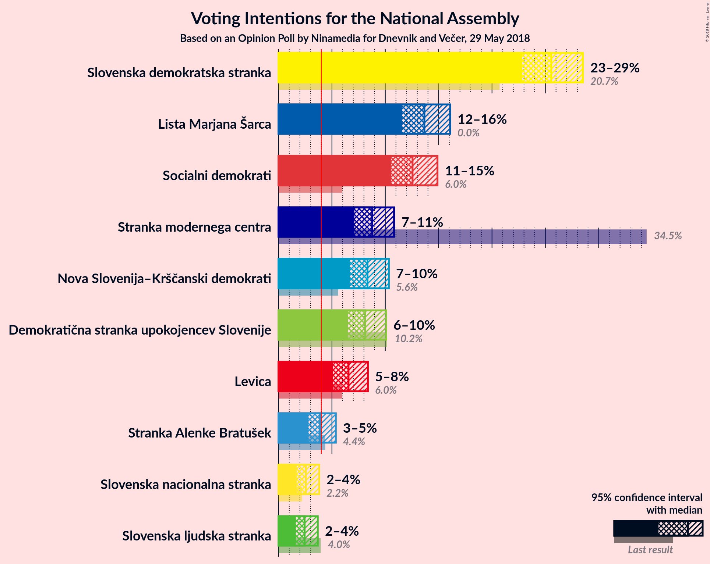
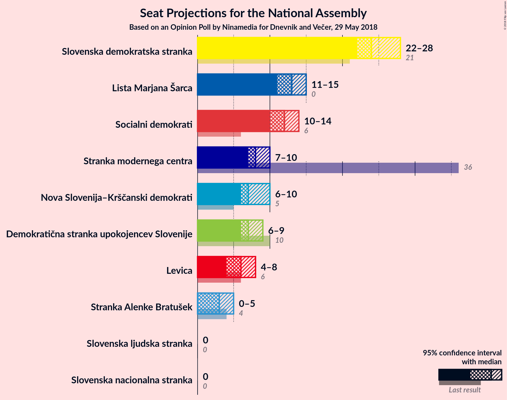
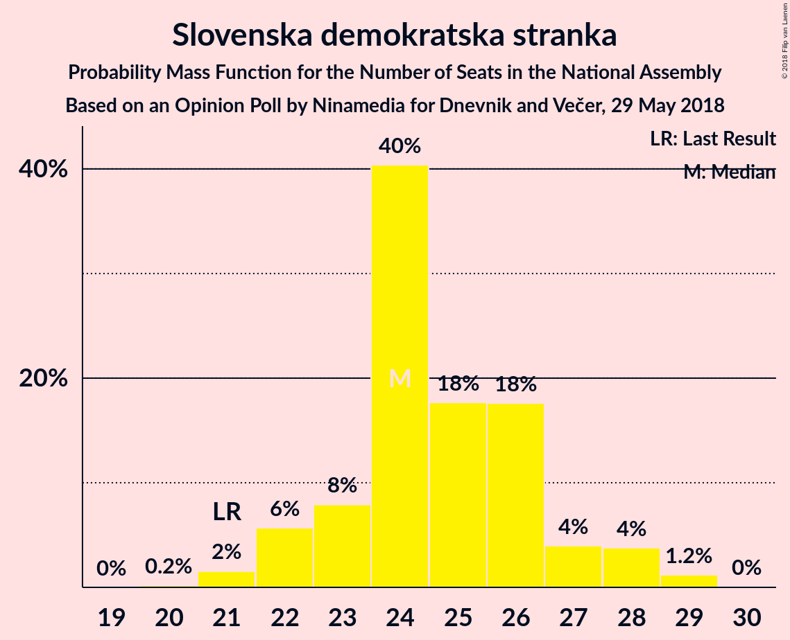
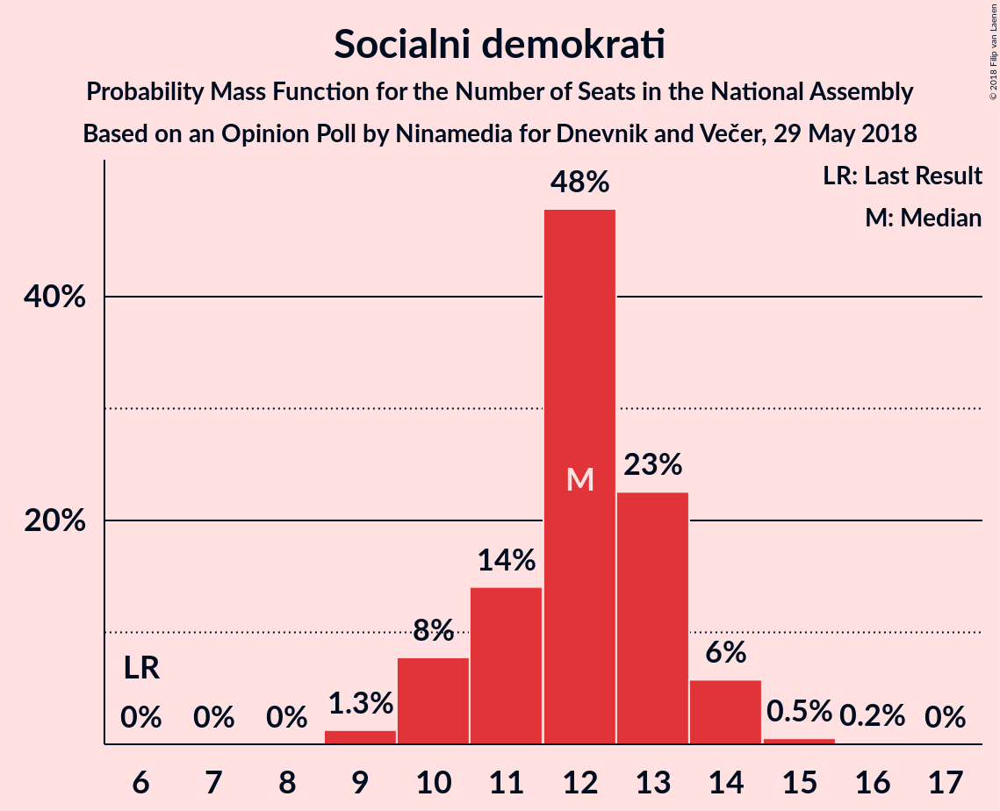
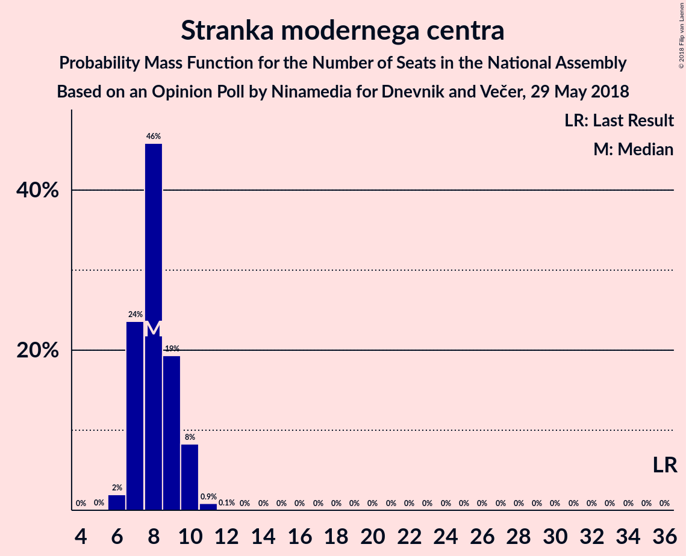
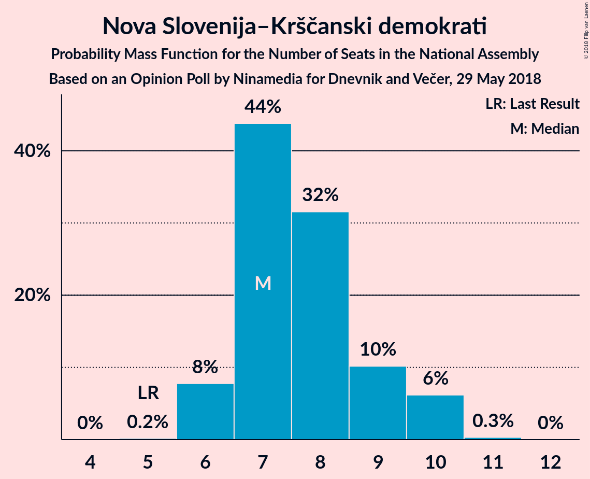
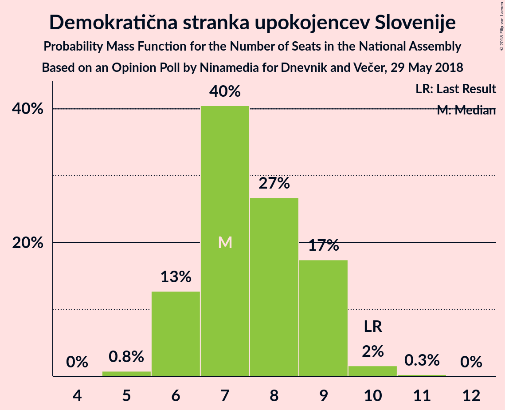
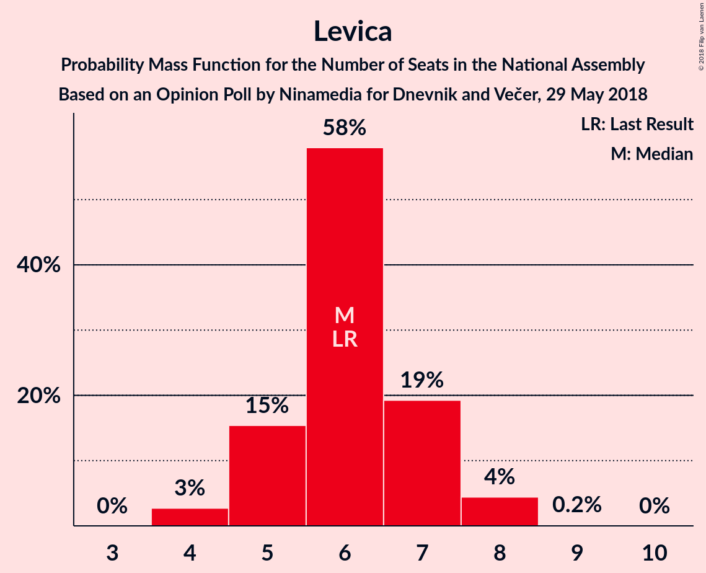
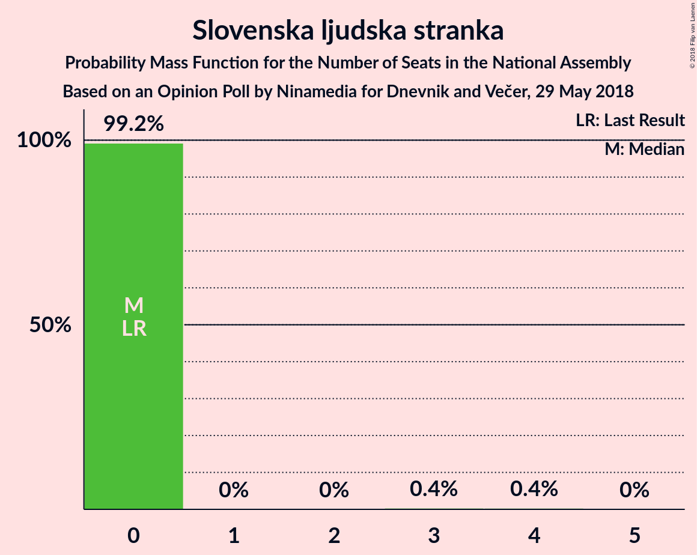
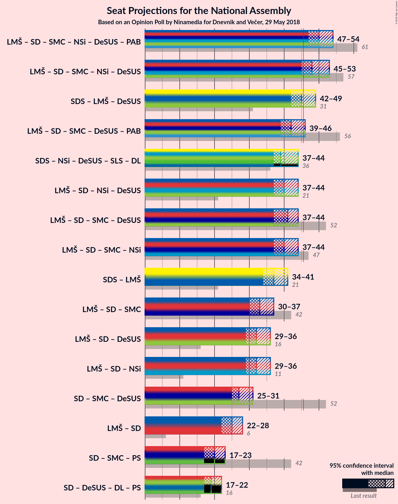

# Opinion Poll by Ninamedia for Dnevnik and Večer, 29 May 2018

<a href="#voting-intentions">Voting Intentions</a> | <a href="#seats">Seats</a> | <a href="#coalitions">Coalitions</a> | <a href="#technical-information">Technical Information</a>

## Voting Intentions

### Confidence Intervals

| Party | Last Result | Poll Result | 80% Confidence Interval | 90% Confidence Interval | 95% Confidence Interval | 99% Confidence Interval |
|:-----:|:-----------:|:-----------:|:-----------------------:|:-----------------------:|:-----------------------:|:-----------------------:|
| Slovenska demokratska stranka | 20.7% | 25.6% | 23.7–27.5% |23.2–28.0% |22.8–28.5% |22.0–29.5% |
| Lista Marjana Šarca | 0.0% | 13.7% | 12.3–15.2% |11.9–15.7% |11.6–16.1% |10.9–16.9% |
| Socialni demokrati | 6.0% | 12.6% | 11.2–14.1% |10.9–14.5% |10.5–14.9% |9.9–15.6% |
| Stranka modernega centra | 34.5% | 8.8% | 7.7–10.1% |7.4–10.5% |7.1–10.8% |6.6–11.5% |
| Nova Slovenija–Krščanski demokrati | 5.6% | 8.3% | 7.3–9.6% |7.0–10.0% |6.7–10.3% |6.2–11.0% |
| Demokratična stranka upokojencev Slovenije | 10.2% | 8.1% | 7.0–9.4% |6.8–9.8% |6.5–10.1% |6.0–10.7% |
| Levica | 6.0% | 6.6% | 5.6–7.7% |5.3–8.1% |5.1–8.4% |4.7–9.0% |
| Stranka Alenke Bratušek | 4.4% | 3.9% | 3.2–4.8% |3.0–5.1% |2.8–5.4% |2.5–5.9% |
| Slovenska nacionalna stranka | 2.2% | 2.6% | 2.0–3.4% |1.8–3.6% |1.7–3.8% |1.5–4.2% |
| Slovenska ljudska stranka | 4.0% | 2.4% | 1.9–3.2% |1.7–3.5% |1.6–3.7% |1.4–4.1% |

*Note:* The poll result column reflects the actual value used in the calculations. Published results may vary slightly, and in addition be rounded to fewer digits.

## Seats

### Confidence Intervals

| Party | Last Result | Median | 80% Confidence Interval | 90% Confidence Interval | 95% Confidence Interval | 99% Confidence Interval |
|:-----:|:-----------:|:------:|:-----------------------:|:-----------------------:|:-----------------------:|:-----------------------:|
| <a href="#slovenska-demokratska-stranka">Slovenska demokratska stranka</a> | 21 | 24 | 23–26 |22–28 |22–28 |21–29 |
| <a href="#lista-marjana-šarca">Lista Marjana Šarca</a> | 0 | 13 | 12–14 |11–14 |11–15 |10–16 |
| <a href="#socialni-demokrati">Socialni demokrati</a> | 6 | 12 | 11–13 |10–14 |10–14 |9–15 |
| <a href="#stranka-modernega-centra">Stranka modernega centra</a> | 36 | 8 | 7–9 |7–10 |7–10 |6–11 |
| <a href="#nova-slovenija–krščanski-demokrati">Nova Slovenija–Krščanski demokrati</a> | 5 | 7 | 7–9 |6–10 |6–10 |6–10 |
| <a href="#demokratična-stranka-upokojencev-slovenije">Demokratična stranka upokojencev Slovenije</a> | 10 | 7 | 6–9 |6–9 |6–9 |5–10 |
| <a href="#levica">Levica</a> | 6 | 6 | 5–7 |5–7 |4–8 |4–8 |
| <a href="#stranka-alenke-bratušek">Stranka Alenke Bratušek</a> | 4 | 3 | 0–4 |0–4 |0–5 |0–5 |
| <a href="#slovenska-nacionalna-stranka">Slovenska nacionalna stranka</a> | 0 | 0 | 0 |0 |0 |0–4 |
| <a href="#slovenska-ljudska-stranka">Slovenska ljudska stranka</a> | 0 | 0 | 0 |0 |0 |0–3 |

### Slovenska demokratska stranka

*For a full overview of the results for this party, see the [Slovenska demokratska stranka](party-slovenskademokratskastranka.html) page.*

| Number of Seats | Probability | Accumulated | Special Marks |
|:---------------:|:-----------:|:-----------:|:-------------:|
| 20 | 0.2% | 100% |  |
| 21 | 2% | 99.8% | Last Result |
| 22 | 6% | 98% |  |
| 23 | 8% | 93% |  |
| 24 | 40% | 85% | Median |
| 25 | 18% | 44% |  |
| 26 | 18% | 27% |  |
| 27 | 4% | 9% |  |
| 28 | 4% | 5% |  |
| 29 | 1.2% | 1.2% |  |
| 30 | 0% | 0% |  |

### Lista Marjana Šarca

*For a full overview of the results for this party, see the [Lista Marjana Šarca](party-listamarjanašarca.html) page.*

| Number of Seats | Probability | Accumulated | Special Marks |
|:---------------:|:-----------:|:-----------:|:-------------:|
| 0 | 0% | 100% | Last Result |
| 1 | 0% | 100% |  |
| 2 | 0% | 100% |  |
| 3 | 0% | 100% |  |
| 4 | 0% | 100% |  |
| 5 | 0% | 100% |  |
| 6 | 0% | 100% |  |
| 7 | 0% | 100% |  |
| 8 | 0% | 100% |  |
| 9 | 0% | 100% |  |
| 10 | 0.7% | 100% |  |
| 11 | 5% | 99.2% |  |
| 12 | 28% | 94% |  |
| 13 | 41% | 66% | Median |
| 14 | 20% | 24% |  |
| 15 | 3% | 5% |  |
| 16 | 1.4% | 2% |  |
| 17 | 0.2% | 0.2% |  |
| 18 | 0% | 0% |  |

### Socialni demokrati

*For a full overview of the results for this party, see the [Socialni demokrati](party-socialnidemokrati.html) page.*

| Number of Seats | Probability | Accumulated | Special Marks |
|:---------------:|:-----------:|:-----------:|:-------------:|
| 6 | 0% | 100% | Last Result |
| 7 | 0% | 100% |  |
| 8 | 0% | 100% |  |
| 9 | 1.3% | 100% |  |
| 10 | 8% | 98.7% |  |
| 11 | 14% | 91% |  |
| 12 | 48% | 77% | Median |
| 13 | 23% | 29% |  |
| 14 | 6% | 6% |  |
| 15 | 0.5% | 0.7% |  |
| 16 | 0.2% | 0.2% |  |
| 17 | 0% | 0% |  |

### Stranka modernega centra

*For a full overview of the results for this party, see the [Stranka modernega centra](party-strankamodernegacentra.html) page.*

| Number of Seats | Probability | Accumulated | Special Marks |
|:---------------:|:-----------:|:-----------:|:-------------:|
| 6 | 2% | 100% |  |
| 7 | 24% | 98% |  |
| 8 | 46% | 74% | Median |
| 9 | 19% | 29% |  |
| 10 | 8% | 9% |  |
| 11 | 0.9% | 0.9% |  |
| 12 | 0.1% | 0.1% |  |
| 13 | 0% | 0% |  |
| 14 | 0% | 0% |  |
| 15 | 0% | 0% |  |
| 16 | 0% | 0% |  |
| 17 | 0% | 0% |  |
| 18 | 0% | 0% |  |
| 19 | 0% | 0% |  |
| 20 | 0% | 0% |  |
| 21 | 0% | 0% |  |
| 22 | 0% | 0% |  |
| 23 | 0% | 0% |  |
| 24 | 0% | 0% |  |
| 25 | 0% | 0% |  |
| 26 | 0% | 0% |  |
| 27 | 0% | 0% |  |
| 28 | 0% | 0% |  |
| 29 | 0% | 0% |  |
| 30 | 0% | 0% |  |
| 31 | 0% | 0% |  |
| 32 | 0% | 0% |  |
| 33 | 0% | 0% |  |
| 34 | 0% | 0% |  |
| 35 | 0% | 0% |  |
| 36 | 0% | 0% | Last Result |

### Nova Slovenija–Krščanski demokrati

*For a full overview of the results for this party, see the [Nova Slovenija–Krščanski demokrati](party-novaslovenija–krščanskidemokrati.html) page.*

| Number of Seats | Probability | Accumulated | Special Marks |
|:---------------:|:-----------:|:-----------:|:-------------:|
| 5 | 0.2% | 100% | Last Result |
| 6 | 8% | 99.8% |  |
| 7 | 44% | 92% | Median |
| 8 | 32% | 48% |  |
| 9 | 10% | 17% |  |
| 10 | 6% | 7% |  |
| 11 | 0.3% | 0.3% |  |
| 12 | 0% | 0% |  |

### Demokratična stranka upokojencev Slovenije

*For a full overview of the results for this party, see the [Demokratična stranka upokojencev Slovenije](party-demokratičnastrankaupokojencevslovenije.html) page.*

| Number of Seats | Probability | Accumulated | Special Marks |
|:---------------:|:-----------:|:-----------:|:-------------:|
| 5 | 0.8% | 100% |  |
| 6 | 13% | 99.2% |  |
| 7 | 40% | 87% | Median |
| 8 | 27% | 46% |  |
| 9 | 17% | 19% |  |
| 10 | 2% | 2% | Last Result |
| 11 | 0.3% | 0.3% |  |
| 12 | 0% | 0% |  |

### Levica

*For a full overview of the results for this party, see the [Levica](party-levica.html) page.*

| Number of Seats | Probability | Accumulated | Special Marks |
|:---------------:|:-----------:|:-----------:|:-------------:|
| 4 | 3% | 100% |  |
| 5 | 15% | 97% |  |
| 6 | 58% | 82% | Last Result, Median |
| 7 | 19% | 24% |  |
| 8 | 4% | 5% |  |
| 9 | 0.2% | 0.2% |  |
| 10 | 0% | 0% |  |

### Stranka Alenke Bratušek

*For a full overview of the results for this party, see the [Stranka Alenke Bratušek](party-strankaalenkebratušek.html) page.*

| Number of Seats | Probability | Accumulated | Special Marks |
|:---------------:|:-----------:|:-----------:|:-------------:|
| 0 | 49% | 100% |  |
| 1 | 0% | 51% |  |
| 2 | 0% | 51% |  |
| 3 | 17% | 51% | Median |
| 4 | 31% | 34% | Last Result |
| 5 | 4% | 4% |  |
| 6 | 0.1% | 0.1% |  |
| 7 | 0% | 0% |  |

### Slovenska nacionalna stranka

*For a full overview of the results for this party, see the [Slovenska nacionalna stranka](party-slovenskanacionalnastranka.html) page.*

| Number of Seats | Probability | Accumulated | Special Marks |
|:---------------:|:-----------:|:-----------:|:-------------:|
| 0 | 98.9% | 100% | Last Result, Median |
| 1 | 0% | 1.1% |  |
| 2 | 0% | 1.1% |  |
| 3 | 0.3% | 1.1% |  |
| 4 | 0.7% | 0.7% |  |
| 5 | 0% | 0% |  |

### Slovenska ljudska stranka

*For a full overview of the results for this party, see the [Slovenska ljudska stranka](party-slovenskaljudskastranka.html) page.*

| Number of Seats | Probability | Accumulated | Special Marks |
|:---------------:|:-----------:|:-----------:|:-------------:|
| 0 | 99.2% | 100% | Last Result, Median |
| 1 | 0% | 0.8% |  |
| 2 | 0% | 0.8% |  |
| 3 | 0.4% | 0.8% |  |
| 4 | 0.4% | 0.4% |  |
| 5 | 0% | 0% |  |

## Coalitions

### Confidence Intervals

| Coalition | Last Result | Median | Majority? | 80% Confidence Interval | 90% Confidence Interval | 95% Confidence Interval | 99% Confidence Interval |
|:---------:|:-----------:|:------:|:---------:|:-----------------------:|:-----------------------:|:-----------------------:|:-----------------------:|
| Lista Marjana Šarca – Socialni demokrati – Stranka modernega centra – Nova Slovenija–Krščanski demokrati – Demokratična stranka upokojencev Slovenije – Stranka Alenke Bratušek | 61 | 50 | 99.7% | 48–53 | 47–53 | 47–54 | 46–55 |
| Lista Marjana Šarca – Socialni demokrati – Stranka modernega centra – Nova Slovenija–Krščanski demokrati – Demokratična stranka upokojencev Slovenije | 57 | 48 | 96% | 46–51 | 46–52 | 45–53 | 43–54 |
| Slovenska demokratska stranka – Lista Marjana Šarca – Demokratična stranka upokojencev Slovenije | 31 | 45 | 36% | 42–48 | 42–48 | 42–49 | 40–50 |
| Lista Marjana Šarca – Socialni demokrati – Stranka modernega centra – Demokratična stranka upokojencev Slovenije – Stranka Alenke Bratušek | 56 | 42 | 6% | 40–45 | 40–46 | 39–46 | 38–47 |
| Lista Marjana Šarca – Socialni demokrati – Nova Slovenija–Krščanski demokrati – Demokratična stranka upokojencev Slovenije | 21 | 40 | 0.2% | 38–42 | 38–43 | 37–44 | 35–45 |
| Lista Marjana Šarca – Socialni demokrati – Stranka modernega centra – Demokratična stranka upokojencev Slovenije | 52 | 41 | 0.3% | 38–43 | 38–44 | 37–44 | 36–45 |
| Lista Marjana Šarca – Socialni demokrati – Stranka modernega centra – Nova Slovenija–Krščanski demokrati | 47 | 40 | 0.7% | 39–43 | 38–44 | 37–44 | 36–46 |
| Slovenska demokratska stranka – Lista Marjana Šarca | 21 | 37 | 0% | 36–40 | 35–41 | 34–41 | 33–43 |
| Lista Marjana Šarca – Socialni demokrati – Stranka modernega centra | 42 | 33 | 0% | 31–35 | 30–36 | 30–37 | 29–37 |
| Lista Marjana Šarca – Socialni demokrati – Demokratična stranka upokojencev Slovenije | 16 | 32 | 0% | 30–35 | 30–35 | 29–36 | 28–37 |
| Lista Marjana Šarca – Socialni demokrati – Nova Slovenija–Krščanski demokrati | 11 | 32 | 0% | 31–34 | 30–35 | 29–36 | 28–37 |
| Socialni demokrati – Stranka modernega centra – Demokratična stranka upokojencev Slovenije | 52 | 27 | 0% | 26–29 | 25–30 | 25–31 | 24–32 |
| Lista Marjana Šarca – Socialni demokrati | 6 | 25 | 0% | 23–27 | 23–27 | 22–28 | 21–29 |

### Lista Marjana Šarca – Socialni demokrati – Stranka modernega centra – Nova Slovenija–Krščanski demokrati – Demokratična stranka upokojencev Slovenije – Stranka Alenke Bratušek

| Number of Seats | Probability | Accumulated | Special Marks |
|:---------------:|:-----------:|:-----------:|:-------------:|
| 44 | 0.1% | 100% |  |
| 45 | 0.2% | 99.9% |  |
| 46 | 0.9% | 99.7% | Majority |
| 47 | 4% | 98.8% |  |
| 48 | 10% | 94% |  |
| 49 | 18% | 84% |  |
| 50 | 34% | 66% | Median |
| 51 | 9% | 32% |  |
| 52 | 12% | 23% |  |
| 53 | 9% | 11% |  |
| 54 | 2% | 3% |  |
| 55 | 0.6% | 0.7% |  |
| 56 | 0.1% | 0.1% |  |
| 57 | 0% | 0% |  |
| 58 | 0% | 0% |  |
| 59 | 0% | 0% |  |
| 60 | 0% | 0% |  |
| 61 | 0% | 0% | Last Result |

### Lista Marjana Šarca – Socialni demokrati – Stranka modernega centra – Nova Slovenija–Krščanski demokrati – Demokratična stranka upokojencev Slovenije

| Number of Seats | Probability | Accumulated | Special Marks |
|:---------------:|:-----------:|:-----------:|:-------------:|
| 43 | 0.6% | 100% |  |
| 44 | 2% | 99.4% |  |
| 45 | 2% | 98% |  |
| 46 | 12% | 96% | Majority |
| 47 | 23% | 84% | Median |
| 48 | 18% | 61% |  |
| 49 | 22% | 43% |  |
| 50 | 10% | 21% |  |
| 51 | 5% | 11% |  |
| 52 | 3% | 6% |  |
| 53 | 2% | 3% |  |
| 54 | 0.6% | 0.6% |  |
| 55 | 0% | 0% |  |
| 56 | 0% | 0% |  |
| 57 | 0% | 0% | Last Result |

### Slovenska demokratska stranka – Lista Marjana Šarca – Demokratična stranka upokojencev Slovenije

| Number of Seats | Probability | Accumulated | Special Marks |
|:---------------:|:-----------:|:-----------:|:-------------:|
| 31 | 0% | 100% | Last Result |
| 32 | 0% | 100% |  |
| 33 | 0% | 100% |  |
| 34 | 0% | 100% |  |
| 35 | 0% | 100% |  |
| 36 | 0% | 100% |  |
| 37 | 0% | 100% |  |
| 38 | 0% | 100% |  |
| 39 | 0% | 100% |  |
| 40 | 0.5% | 99.9% |  |
| 41 | 1.0% | 99.4% |  |
| 42 | 9% | 98% |  |
| 43 | 5% | 89% |  |
| 44 | 24% | 84% | Median |
| 45 | 24% | 60% |  |
| 46 | 15% | 36% | Majority |
| 47 | 11% | 21% |  |
| 48 | 5% | 10% |  |
| 49 | 3% | 5% |  |
| 50 | 2% | 2% |  |
| 51 | 0.1% | 0.1% |  |
| 52 | 0.1% | 0.1% |  |
| 53 | 0% | 0% |  |

### Lista Marjana Šarca – Socialni demokrati – Stranka modernega centra – Demokratična stranka upokojencev Slovenije – Stranka Alenke Bratušek

| Number of Seats | Probability | Accumulated | Special Marks |
|:---------------:|:-----------:|:-----------:|:-------------:|
| 36 | 0% | 100% |  |
| 37 | 0.3% | 99.9% |  |
| 38 | 0.9% | 99.7% |  |
| 39 | 3% | 98.8% |  |
| 40 | 9% | 96% |  |
| 41 | 20% | 87% |  |
| 42 | 18% | 67% |  |
| 43 | 23% | 50% | Median |
| 44 | 9% | 26% |  |
| 45 | 11% | 17% |  |
| 46 | 5% | 6% | Majority |
| 47 | 0.6% | 0.9% |  |
| 48 | 0.2% | 0.2% |  |
| 49 | 0% | 0% |  |
| 50 | 0% | 0% |  |
| 51 | 0% | 0% |  |
| 52 | 0% | 0% |  |
| 53 | 0% | 0% |  |
| 54 | 0% | 0% |  |
| 55 | 0% | 0% |  |
| 56 | 0% | 0% | Last Result |

### Lista Marjana Šarca – Socialni demokrati – Nova Slovenija–Krščanski demokrati – Demokratična stranka upokojencev Slovenije

| Number of Seats | Probability | Accumulated | Special Marks |
|:---------------:|:-----------:|:-----------:|:-------------:|
| 21 | 0% | 100% | Last Result |
| 22 | 0% | 100% |  |
| 23 | 0% | 100% |  |
| 24 | 0% | 100% |  |
| 25 | 0% | 100% |  |
| 26 | 0% | 100% |  |
| 27 | 0% | 100% |  |
| 28 | 0% | 100% |  |
| 29 | 0% | 100% |  |
| 30 | 0% | 100% |  |
| 31 | 0% | 100% |  |
| 32 | 0% | 100% |  |
| 33 | 0% | 100% |  |
| 34 | 0.1% | 100% |  |
| 35 | 0.8% | 99.9% |  |
| 36 | 1.1% | 99.1% |  |
| 37 | 2% | 98% |  |
| 38 | 12% | 96% |  |
| 39 | 29% | 84% | Median |
| 40 | 13% | 55% |  |
| 41 | 20% | 42% |  |
| 42 | 13% | 22% |  |
| 43 | 4% | 8% |  |
| 44 | 2% | 4% |  |
| 45 | 2% | 2% |  |
| 46 | 0.1% | 0.2% | Majority |
| 47 | 0% | 0% |  |

### Lista Marjana Šarca – Socialni demokrati – Stranka modernega centra – Demokratična stranka upokojencev Slovenije

| Number of Seats | Probability | Accumulated | Special Marks |
|:---------------:|:-----------:|:-----------:|:-------------:|
| 35 | 0.2% | 100% |  |
| 36 | 1.3% | 99.8% |  |
| 37 | 2% | 98% |  |
| 38 | 11% | 96% |  |
| 39 | 7% | 86% |  |
| 40 | 27% | 79% | Median |
| 41 | 27% | 52% |  |
| 42 | 13% | 25% |  |
| 43 | 6% | 12% |  |
| 44 | 4% | 6% |  |
| 45 | 2% | 2% |  |
| 46 | 0.2% | 0.3% | Majority |
| 47 | 0% | 0% |  |
| 48 | 0% | 0% |  |
| 49 | 0% | 0% |  |
| 50 | 0% | 0% |  |
| 51 | 0% | 0% |  |
| 52 | 0% | 0% | Last Result |

### Lista Marjana Šarca – Socialni demokrati – Stranka modernega centra – Nova Slovenija–Krščanski demokrati

| Number of Seats | Probability | Accumulated | Special Marks |
|:---------------:|:-----------:|:-----------:|:-------------:|
| 35 | 0% | 100% |  |
| 36 | 0.6% | 99.9% |  |
| 37 | 3% | 99.3% |  |
| 38 | 5% | 96% |  |
| 39 | 7% | 92% |  |
| 40 | 44% | 84% | Median |
| 41 | 14% | 41% |  |
| 42 | 10% | 27% |  |
| 43 | 9% | 17% |  |
| 44 | 6% | 8% |  |
| 45 | 2% | 2% |  |
| 46 | 0.7% | 0.7% | Majority |
| 47 | 0% | 0.1% | Last Result |
| 48 | 0% | 0% |  |

### Slovenska demokratska stranka – Lista Marjana Šarca

| Number of Seats | Probability | Accumulated | Special Marks |
|:---------------:|:-----------:|:-----------:|:-------------:|
| 21 | 0% | 100% | Last Result |
| 22 | 0% | 100% |  |
| 23 | 0% | 100% |  |
| 24 | 0% | 100% |  |
| 25 | 0% | 100% |  |
| 26 | 0% | 100% |  |
| 27 | 0% | 100% |  |
| 28 | 0% | 100% |  |
| 29 | 0% | 100% |  |
| 30 | 0% | 100% |  |
| 31 | 0% | 100% |  |
| 32 | 0.2% | 100% |  |
| 33 | 0.4% | 99.8% |  |
| 34 | 2% | 99.3% |  |
| 35 | 6% | 97% |  |
| 36 | 14% | 92% |  |
| 37 | 28% | 77% | Median |
| 38 | 33% | 50% |  |
| 39 | 6% | 17% |  |
| 40 | 5% | 11% |  |
| 41 | 4% | 6% |  |
| 42 | 2% | 2% |  |
| 43 | 0.6% | 0.6% |  |
| 44 | 0% | 0.1% |  |
| 45 | 0% | 0% |  |

### Lista Marjana Šarca – Socialni demokrati – Stranka modernega centra

| Number of Seats | Probability | Accumulated | Special Marks |
|:---------------:|:-----------:|:-----------:|:-------------:|
| 28 | 0.2% | 100% |  |
| 29 | 1.5% | 99.7% |  |
| 30 | 3% | 98% |  |
| 31 | 8% | 95% |  |
| 32 | 20% | 87% |  |
| 33 | 34% | 67% | Median |
| 34 | 18% | 32% |  |
| 35 | 8% | 15% |  |
| 36 | 3% | 7% |  |
| 37 | 3% | 4% |  |
| 38 | 0.2% | 0.4% |  |
| 39 | 0.1% | 0.1% |  |
| 40 | 0% | 0% |  |
| 41 | 0% | 0% |  |
| 42 | 0% | 0% | Last Result |

### Lista Marjana Šarca – Socialni demokrati – Demokratična stranka upokojencev Slovenije

| Number of Seats | Probability | Accumulated | Special Marks |
|:---------------:|:-----------:|:-----------:|:-------------:|
| 16 | 0% | 100% | Last Result |
| 17 | 0% | 100% |  |
| 18 | 0% | 100% |  |
| 19 | 0% | 100% |  |
| 20 | 0% | 100% |  |
| 21 | 0% | 100% |  |
| 22 | 0% | 100% |  |
| 23 | 0% | 100% |  |
| 24 | 0% | 100% |  |
| 25 | 0% | 100% |  |
| 26 | 0% | 100% |  |
| 27 | 0.1% | 100% |  |
| 28 | 1.2% | 99.9% |  |
| 29 | 2% | 98.7% |  |
| 30 | 10% | 97% |  |
| 31 | 11% | 86% |  |
| 32 | 27% | 75% | Median |
| 33 | 24% | 49% |  |
| 34 | 15% | 25% |  |
| 35 | 6% | 10% |  |
| 36 | 3% | 4% |  |
| 37 | 0.8% | 0.8% |  |
| 38 | 0.1% | 0.1% |  |
| 39 | 0% | 0% |  |

### Lista Marjana Šarca – Socialni demokrati – Nova Slovenija–Krščanski demokrati

| Number of Seats | Probability | Accumulated | Special Marks |
|:---------------:|:-----------:|:-----------:|:-------------:|
| 11 | 0% | 100% | Last Result |
| 12 | 0% | 100% |  |
| 13 | 0% | 100% |  |
| 14 | 0% | 100% |  |
| 15 | 0% | 100% |  |
| 16 | 0% | 100% |  |
| 17 | 0% | 100% |  |
| 18 | 0% | 100% |  |
| 19 | 0% | 100% |  |
| 20 | 0% | 100% |  |
| 21 | 0% | 100% |  |
| 22 | 0% | 100% |  |
| 23 | 0% | 100% |  |
| 24 | 0% | 100% |  |
| 25 | 0% | 100% |  |
| 26 | 0% | 100% |  |
| 27 | 0.1% | 100% |  |
| 28 | 0.9% | 99.9% |  |
| 29 | 3% | 99.0% |  |
| 30 | 3% | 96% |  |
| 31 | 13% | 93% |  |
| 32 | 33% | 80% | Median |
| 33 | 20% | 47% |  |
| 34 | 18% | 27% |  |
| 35 | 4% | 9% |  |
| 36 | 4% | 5% |  |
| 37 | 0.8% | 1.0% |  |
| 38 | 0.2% | 0.2% |  |
| 39 | 0% | 0.1% |  |
| 40 | 0% | 0% |  |

### Socialni demokrati – Stranka modernega centra – Demokratična stranka upokojencev Slovenije

| Number of Seats | Probability | Accumulated | Special Marks |
|:---------------:|:-----------:|:-----------:|:-------------:|
| 23 | 0.4% | 100% |  |
| 24 | 2% | 99.6% |  |
| 25 | 5% | 98% |  |
| 26 | 11% | 92% |  |
| 27 | 32% | 81% | Median |
| 28 | 15% | 49% |  |
| 29 | 25% | 34% |  |
| 30 | 6% | 9% |  |
| 31 | 2% | 3% |  |
| 32 | 0.5% | 0.6% |  |
| 33 | 0.1% | 0.1% |  |
| 34 | 0% | 0% |  |
| 35 | 0% | 0% |  |
| 36 | 0% | 0% |  |
| 37 | 0% | 0% |  |
| 38 | 0% | 0% |  |
| 39 | 0% | 0% |  |
| 40 | 0% | 0% |  |
| 41 | 0% | 0% |  |
| 42 | 0% | 0% |  |
| 43 | 0% | 0% |  |
| 44 | 0% | 0% |  |
| 45 | 0% | 0% |  |
| 46 | 0% | 0% | Majority |
| 47 | 0% | 0% |  |
| 48 | 0% | 0% |  |
| 49 | 0% | 0% |  |
| 50 | 0% | 0% |  |
| 51 | 0% | 0% |  |
| 52 | 0% | 0% | Last Result |

### Lista Marjana Šarca – Socialni demokrati

| Number of Seats | Probability | Accumulated | Special Marks |
|:---------------:|:-----------:|:-----------:|:-------------:|
| 6 | 0% | 100% | Last Result |
| 7 | 0% | 100% |  |
| 8 | 0% | 100% |  |
| 9 | 0% | 100% |  |
| 10 | 0% | 100% |  |
| 11 | 0% | 100% |  |
| 12 | 0% | 100% |  |
| 13 | 0% | 100% |  |
| 14 | 0% | 100% |  |
| 15 | 0% | 100% |  |
| 16 | 0% | 100% |  |
| 17 | 0% | 100% |  |
| 18 | 0% | 100% |  |
| 19 | 0% | 100% |  |
| 20 | 0.1% | 100% |  |
| 21 | 2% | 99.9% |  |
| 22 | 2% | 98% |  |
| 23 | 8% | 96% |  |
| 24 | 21% | 88% |  |
| 25 | 39% | 67% | Median |
| 26 | 16% | 28% |  |
| 27 | 9% | 12% |  |
| 28 | 3% | 4% |  |
| 29 | 0.5% | 0.7% |  |
| 30 | 0.1% | 0.2% |  |
| 31 | 0.1% | 0.1% |  |
| 32 | 0% | 0% |  |

## Technical Information

### Opinion Poll

+ **Polling firm:** Ninamedia
+ **Commissioner(s):** Dnevnik and Večer
+ **Fieldwork period:** 29 May 2018

### Calculations

+ **Sample size:** 900
+ **Simulations done:** 1,048,576
+ **Error estimate:** 1.05%

