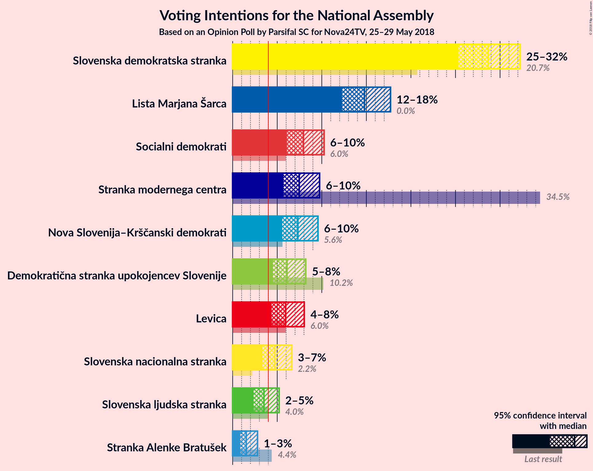
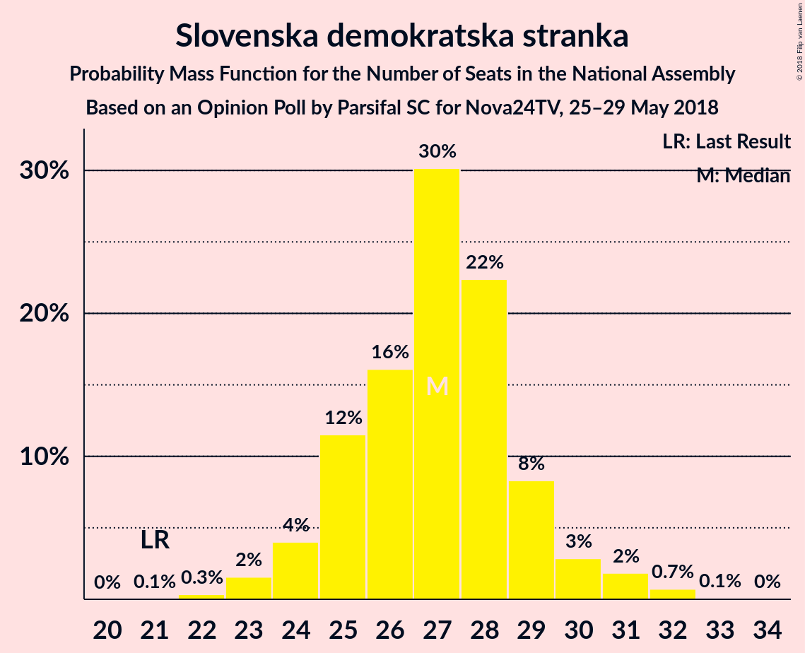
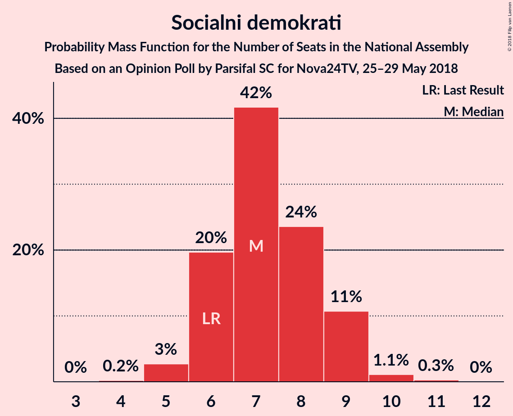
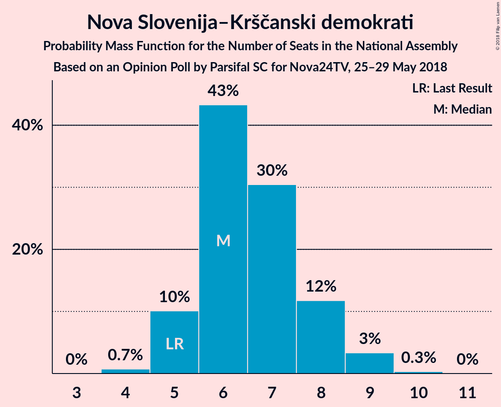
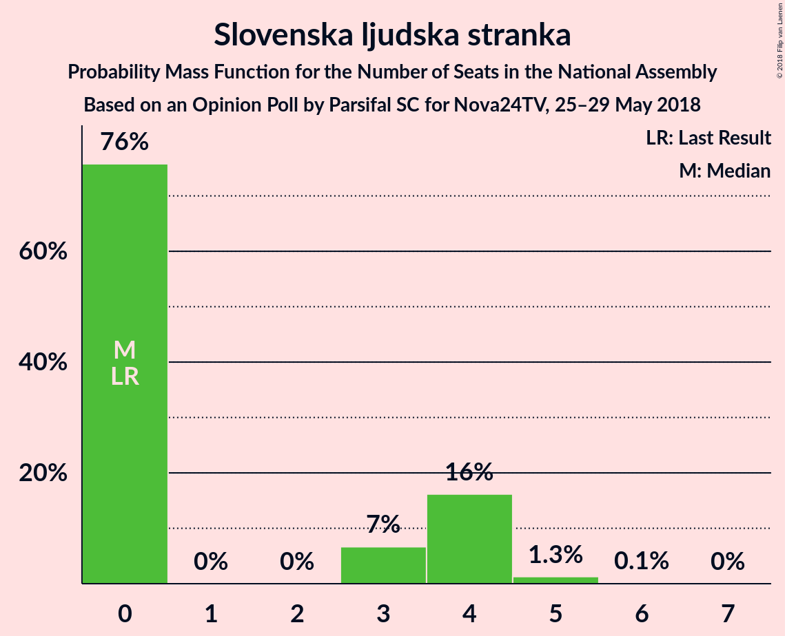
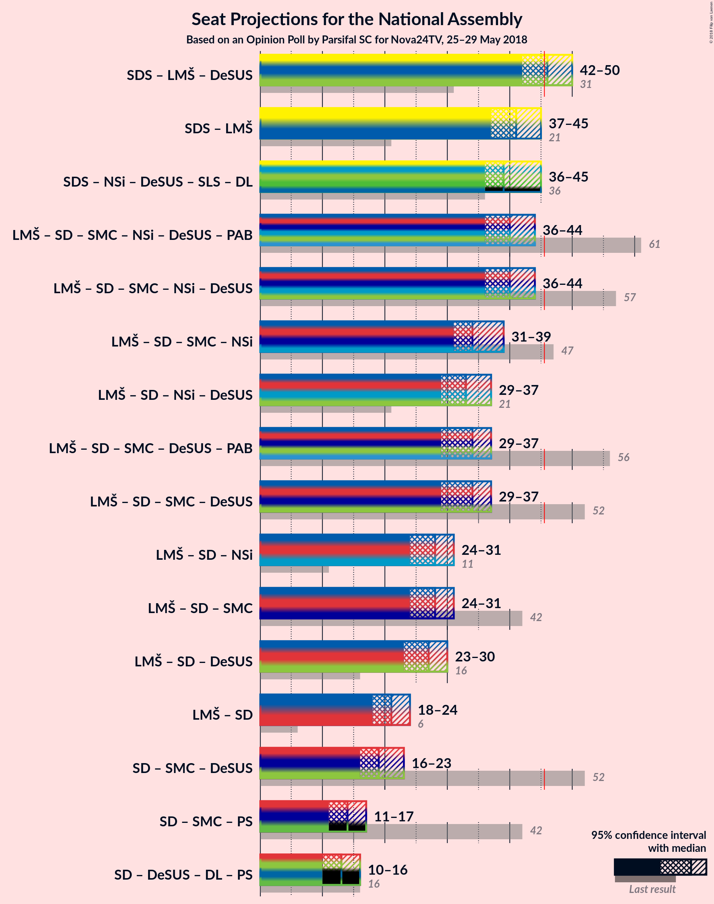

# Opinion Poll by Parsifal SC for Nova24TV, 25–29 May 2018

<a href="#voting-intentions">Voting Intentions</a> | <a href="#seats">Seats</a> | <a href="#coalitions">Coalitions</a> | <a href="#technical-information">Technical Information</a>

## Voting Intentions

### Confidence Intervals

| Party | Last Result | Poll Result | 80% Confidence Interval | 90% Confidence Interval | 95% Confidence Interval | 99% Confidence Interval |
|:-----:|:-----------:|:-----------:|:-----------------------:|:-----------------------:|:-----------------------:|:-----------------------:|
| Slovenska demokratska stranka | 20.7% | 28.7% | 26.5–31.0% |25.8–31.7% |25.3–32.3% |24.3–33.4% |
| Lista Marjana Šarca | 0.0% | 14.8% | 13.1–16.7% |12.7–17.2% |12.3–17.7% |11.5–18.7% |
| Socialni demokrati | 6.0% | 7.9% | 6.7–9.4% |6.4–9.9% |6.1–10.3% |5.6–11.0% |
| Stranka modernega centra | 34.5% | 7.5% | 6.3–8.9% |6.0–9.4% |5.7–9.8% |5.2–10.5% |
| Nova Slovenija–Krščanski demokrati | 5.6% | 7.3% | 6.2–8.8% |5.8–9.2% |5.6–9.6% |5.0–10.3% |
| Demokratična stranka upokojencev Slovenije | 10.2% | 6.1% | 5.0–7.5% |4.8–7.9% |4.5–8.2% |4.1–8.9% |
| Levica | 6.0% | 5.9% | 4.9–7.3% |4.6–7.7% |4.4–8.0% |3.9–8.7% |
| Slovenska nacionalna stranka | 2.2% | 4.7% | 3.8–6.0% |3.6–6.3% |3.4–6.6% |3.0–7.3% |
| Slovenska ljudska stranka | 4.0% | 3.5% | 2.7–4.6% |2.5–4.9% |2.3–5.2% |2.0–5.8% |
| Stranka Alenke Bratušek | 4.4% | 1.5% | 1.1–2.3% |0.9–2.6% |0.8–2.8% |0.7–3.2% |

*Note:* The poll result column reflects the actual value used in the calculations. Published results may vary slightly, and in addition be rounded to fewer digits.

## Seats

### Confidence Intervals

| Party | Last Result | Median | 80% Confidence Interval | 90% Confidence Interval | 95% Confidence Interval | 99% Confidence Interval |
|:-----:|:-----------:|:------:|:-----------------------:|:-----------------------:|:-----------------------:|:-----------------------:|
| <a href="#slovenska-demokratska-stranka">Slovenska demokratska stranka</a> | 21 | 27 | 25–29 |24–30 |24–31 |23–32 |
| <a href="#lista-marjana-šarca">Lista Marjana Šarca</a> | 0 | 14 | 12–15 |12–16 |11–16 |11–17 |
| <a href="#socialni-demokrati">Socialni demokrati</a> | 6 | 7 | 6–9 |6–9 |5–9 |5–10 |
| <a href="#stranka-modernega-centra">Stranka modernega centra</a> | 36 | 7 | 6–8 |5–8 |5–9 |5–9 |
| <a href="#nova-slovenija–krščanski-demokrati">Nova Slovenija–Krščanski demokrati</a> | 5 | 6 | 5–8 |5–8 |5–9 |4–9 |
| <a href="#demokratična-stranka-upokojencev-slovenije">Demokratična stranka upokojencev Slovenije</a> | 10 | 5 | 4–7 |4–7 |4–7 |3–8 |
| <a href="#levica">Levica</a> | 6 | 5 | 4–6 |4–7 |4–7 |0–8 |
| <a href="#slovenska-nacionalna-stranka">Slovenska nacionalna stranka</a> | 0 | 4 | 0–5 |0–5 |0–6 |0–6 |
| <a href="#slovenska-ljudska-stranka">Slovenska ljudska stranka</a> | 0 | 0 | 0–4 |0–4 |0–4 |0–5 |
| <a href="#stranka-alenke-bratušek">Stranka Alenke Bratušek</a> | 4 | 0 | 0 |0 |0 |0 |

### Slovenska demokratska stranka

*For a full overview of the results for this party, see the [Slovenska demokratska stranka](party-slovenskademokratskastranka.html) page.*

| Number of Seats | Probability | Accumulated | Special Marks |
|:---------------:|:-----------:|:-----------:|:-------------:|
| 21 | 0.1% | 100% | Last Result |
| 22 | 0.3% | 99.9% |  |
| 23 | 2% | 99.6% |  |
| 24 | 4% | 98% |  |
| 25 | 12% | 94% |  |
| 26 | 16% | 82% |  |
| 27 | 30% | 66% | Median |
| 28 | 22% | 36% |  |
| 29 | 8% | 14% |  |
| 30 | 3% | 6% |  |
| 31 | 2% | 3% |  |
| 32 | 0.7% | 0.8% |  |
| 33 | 0.1% | 0.1% |  |
| 34 | 0% | 0% |  |

### Lista Marjana Šarca

*For a full overview of the results for this party, see the [Lista Marjana Šarca](party-listamarjanašarca.html) page.*

| Number of Seats | Probability | Accumulated | Special Marks |
|:---------------:|:-----------:|:-----------:|:-------------:|
| 0 | 0% | 100% | Last Result |
| 1 | 0% | 100% |  |
| 2 | 0% | 100% |  |
| 3 | 0% | 100% |  |
| 4 | 0% | 100% |  |
| 5 | 0% | 100% |  |
| 6 | 0% | 100% |  |
| 7 | 0% | 100% |  |
| 8 | 0% | 100% |  |
| 9 | 0% | 100% |  |
| 10 | 0.5% | 100% |  |
| 11 | 3% | 99.5% |  |
| 12 | 13% | 96% |  |
| 13 | 23% | 84% |  |
| 14 | 30% | 60% | Median |
| 15 | 22% | 30% |  |
| 16 | 6% | 8% |  |
| 17 | 2% | 2% |  |
| 18 | 0.4% | 0.4% |  |
| 19 | 0.1% | 0.1% |  |
| 20 | 0% | 0% |  |

### Socialni demokrati

*For a full overview of the results for this party, see the [Socialni demokrati](party-socialnidemokrati.html) page.*

| Number of Seats | Probability | Accumulated | Special Marks |
|:---------------:|:-----------:|:-----------:|:-------------:|
| 4 | 0.2% | 100% |  |
| 5 | 3% | 99.8% |  |
| 6 | 20% | 97% | Last Result |
| 7 | 42% | 77% | Median |
| 8 | 24% | 36% |  |
| 9 | 11% | 12% |  |
| 10 | 1.1% | 1.4% |  |
| 11 | 0.3% | 0.3% |  |
| 12 | 0% | 0% |  |

### Stranka modernega centra

*For a full overview of the results for this party, see the [Stranka modernega centra](party-strankamodernegacentra.html) page.*

| Number of Seats | Probability | Accumulated | Special Marks |
|:---------------:|:-----------:|:-----------:|:-------------:|
| 4 | 0.5% | 100% |  |
| 5 | 8% | 99.5% |  |
| 6 | 31% | 92% |  |
| 7 | 41% | 61% | Median |
| 8 | 16% | 20% |  |
| 9 | 4% | 4% |  |
| 10 | 0.5% | 0.5% |  |
| 11 | 0% | 0% |  |
| 12 | 0% | 0% |  |
| 13 | 0% | 0% |  |
| 14 | 0% | 0% |  |
| 15 | 0% | 0% |  |
| 16 | 0% | 0% |  |
| 17 | 0% | 0% |  |
| 18 | 0% | 0% |  |
| 19 | 0% | 0% |  |
| 20 | 0% | 0% |  |
| 21 | 0% | 0% |  |
| 22 | 0% | 0% |  |
| 23 | 0% | 0% |  |
| 24 | 0% | 0% |  |
| 25 | 0% | 0% |  |
| 26 | 0% | 0% |  |
| 27 | 0% | 0% |  |
| 28 | 0% | 0% |  |
| 29 | 0% | 0% |  |
| 30 | 0% | 0% |  |
| 31 | 0% | 0% |  |
| 32 | 0% | 0% |  |
| 33 | 0% | 0% |  |
| 34 | 0% | 0% |  |
| 35 | 0% | 0% |  |
| 36 | 0% | 0% | Last Result |

### Nova Slovenija–Krščanski demokrati

*For a full overview of the results for this party, see the [Nova Slovenija–Krščanski demokrati](party-novaslovenija–krščanskidemokrati.html) page.*

| Number of Seats | Probability | Accumulated | Special Marks |
|:---------------:|:-----------:|:-----------:|:-------------:|
| 4 | 0.7% | 100% |  |
| 5 | 10% | 99.3% | Last Result |
| 6 | 43% | 89% | Median |
| 7 | 30% | 46% |  |
| 8 | 12% | 15% |  |
| 9 | 3% | 4% |  |
| 10 | 0.3% | 0.3% |  |
| 11 | 0% | 0% |  |

### Demokratična stranka upokojencev Slovenije

*For a full overview of the results for this party, see the [Demokratična stranka upokojencev Slovenije](party-demokratičnastrankaupokojencevslovenije.html) page.*

| Number of Seats | Probability | Accumulated | Special Marks |
|:---------------:|:-----------:|:-----------:|:-------------:|
| 0 | 0.3% | 100% |  |
| 1 | 0% | 99.7% |  |
| 2 | 0% | 99.7% |  |
| 3 | 0.3% | 99.7% |  |
| 4 | 14% | 99.4% |  |
| 5 | 42% | 85% | Median |
| 6 | 29% | 44% |  |
| 7 | 13% | 15% |  |
| 8 | 2% | 2% |  |
| 9 | 0.2% | 0.2% |  |
| 10 | 0% | 0% | Last Result |

### Levica

*For a full overview of the results for this party, see the [Levica](party-levica.html) page.*

| Number of Seats | Probability | Accumulated | Special Marks |
|:---------------:|:-----------:|:-----------:|:-------------:|
| 0 | 0.6% | 100% |  |
| 1 | 0% | 99.4% |  |
| 2 | 0% | 99.4% |  |
| 3 | 0.3% | 99.4% |  |
| 4 | 16% | 99.1% |  |
| 5 | 40% | 83% | Median |
| 6 | 35% | 43% | Last Result |
| 7 | 6% | 8% |  |
| 8 | 1.2% | 1.4% |  |
| 9 | 0.1% | 0.1% |  |
| 10 | 0% | 0% |  |

### Slovenska nacionalna stranka

*For a full overview of the results for this party, see the [Slovenska nacionalna stranka](party-slovenskanacionalnastranka.html) page.*

| Number of Seats | Probability | Accumulated | Special Marks |
|:---------------:|:-----------:|:-----------:|:-------------:|
| 0 | 14% | 100% | Last Result |
| 1 | 0% | 86% |  |
| 2 | 0% | 86% |  |
| 3 | 3% | 86% |  |
| 4 | 40% | 82% | Median |
| 5 | 38% | 42% |  |
| 6 | 4% | 4% |  |
| 7 | 0.3% | 0.3% |  |
| 8 | 0% | 0% |  |

### Slovenska ljudska stranka

*For a full overview of the results for this party, see the [Slovenska ljudska stranka](party-slovenskaljudskastranka.html) page.*

| Number of Seats | Probability | Accumulated | Special Marks |
|:---------------:|:-----------:|:-----------:|:-------------:|
| 0 | 76% | 100% | Last Result, Median |
| 1 | 0% | 24% |  |
| 2 | 0% | 24% |  |
| 3 | 7% | 24% |  |
| 4 | 16% | 18% |  |
| 5 | 1.3% | 1.4% |  |
| 6 | 0.1% | 0.1% |  |
| 7 | 0% | 0% |  |

### Stranka Alenke Bratušek

*For a full overview of the results for this party, see the [Stranka Alenke Bratušek](party-strankaalenkebratušek.html) page.*

| Number of Seats | Probability | Accumulated | Special Marks |
|:---------------:|:-----------:|:-----------:|:-------------:|
| 0 | 100% | 100% | Median |
| 1 | 0% | 0% |  |
| 2 | 0% | 0% |  |
| 3 | 0% | 0% |  |
| 4 | 0% | 0% | Last Result |

## Coalitions

### Confidence Intervals

| Coalition | Last Result | Median | Majority? | 80% Confidence Interval | 90% Confidence Interval | 95% Confidence Interval | 99% Confidence Interval |
|:---------:|:-----------:|:------:|:---------:|:-----------------------:|:-----------------------:|:-----------------------:|:-----------------------:|
| Slovenska demokratska stranka – Lista Marjana Šarca – Demokratična stranka upokojencev Slovenije | 31 | 46 | 67% | 43–49 | 43–50 | 42–50 | 41–52 |
| Slovenska demokratska stranka – Lista Marjana Šarca | 21 | 41 | 1.1% | 38–43 | 38–44 | 37–45 | 35–46 |
| Lista Marjana Šarca – Socialni demokrati – Stranka modernega centra – Nova Slovenija–Krščanski demokrati – Demokratična stranka upokojencev Slovenije – Stranka Alenke Bratušek | 61 | 40 | 0.4% | 37–42 | 37–43 | 36–44 | 35–45 |
| Lista Marjana Šarca – Socialni demokrati – Stranka modernega centra – Nova Slovenija–Krščanski demokrati – Demokratična stranka upokojencev Slovenije | 57 | 40 | 0.4% | 37–42 | 37–43 | 36–44 | 35–45 |
| Lista Marjana Šarca – Socialni demokrati – Stranka modernega centra – Nova Slovenija–Krščanski demokrati | 47 | 34 | 0% | 32–37 | 32–38 | 31–39 | 30–40 |
| Lista Marjana Šarca – Socialni demokrati – Nova Slovenija–Krščanski demokrati – Demokratična stranka upokojencev Slovenije | 21 | 33 | 0% | 31–36 | 30–36 | 29–37 | 28–38 |
| Lista Marjana Šarca – Socialni demokrati – Stranka modernega centra – Demokratična stranka upokojencev Slovenije – Stranka Alenke Bratušek | 56 | 34 | 0% | 31–36 | 30–36 | 29–37 | 28–38 |
| Lista Marjana Šarca – Socialni demokrati – Stranka modernega centra – Demokratična stranka upokojencev Slovenije | 52 | 34 | 0% | 31–36 | 30–36 | 29–37 | 28–38 |
| Lista Marjana Šarca – Socialni demokrati – Nova Slovenija–Krščanski demokrati | 11 | 28 | 0% | 25–30 | 25–31 | 24–31 | 23–32 |
| Lista Marjana Šarca – Socialni demokrati – Stranka modernega centra | 42 | 28 | 0% | 26–30 | 25–31 | 24–31 | 23–32 |
| Lista Marjana Šarca – Socialni demokrati – Demokratična stranka upokojencev Slovenije | 16 | 27 | 0% | 24–29 | 23–29 | 23–30 | 22–31 |
| Lista Marjana Šarca – Socialni demokrati | 6 | 21 | 0% | 19–23 | 18–24 | 18–24 | 17–25 |
| Socialni demokrati – Stranka modernega centra – Demokratična stranka upokojencev Slovenije | 52 | 19 | 0% | 17–22 | 17–23 | 16–23 | 15–24 |

### Slovenska demokratska stranka – Lista Marjana Šarca – Demokratična stranka upokojencev Slovenije

| Number of Seats | Probability | Accumulated | Special Marks |
|:---------------:|:-----------:|:-----------:|:-------------:|
| 31 | 0% | 100% | Last Result |
| 32 | 0% | 100% |  |
| 33 | 0% | 100% |  |
| 34 | 0% | 100% |  |
| 35 | 0% | 100% |  |
| 36 | 0% | 100% |  |
| 37 | 0% | 100% |  |
| 38 | 0% | 100% |  |
| 39 | 0.1% | 100% |  |
| 40 | 0.3% | 99.9% |  |
| 41 | 0.9% | 99.6% |  |
| 42 | 3% | 98.7% |  |
| 43 | 6% | 96% |  |
| 44 | 5% | 90% |  |
| 45 | 18% | 85% |  |
| 46 | 21% | 67% | Median, Majority |
| 47 | 24% | 45% |  |
| 48 | 8% | 21% |  |
| 49 | 7% | 14% |  |
| 50 | 4% | 6% |  |
| 51 | 2% | 2% |  |
| 52 | 0.3% | 0.5% |  |
| 53 | 0.1% | 0.2% |  |
| 54 | 0.1% | 0.1% |  |
| 55 | 0% | 0% |  |

### Slovenska demokratska stranka – Lista Marjana Šarca

| Number of Seats | Probability | Accumulated | Special Marks |
|:---------------:|:-----------:|:-----------:|:-------------:|
| 21 | 0% | 100% | Last Result |
| 22 | 0% | 100% |  |
| 23 | 0% | 100% |  |
| 24 | 0% | 100% |  |
| 25 | 0% | 100% |  |
| 26 | 0% | 100% |  |
| 27 | 0% | 100% |  |
| 28 | 0% | 100% |  |
| 29 | 0% | 100% |  |
| 30 | 0% | 100% |  |
| 31 | 0% | 100% |  |
| 32 | 0% | 100% |  |
| 33 | 0% | 100% |  |
| 34 | 0% | 100% |  |
| 35 | 0.4% | 99.9% |  |
| 36 | 1.3% | 99.5% |  |
| 37 | 3% | 98% |  |
| 38 | 7% | 95% |  |
| 39 | 10% | 88% |  |
| 40 | 18% | 79% |  |
| 41 | 28% | 61% | Median |
| 42 | 20% | 33% |  |
| 43 | 5% | 13% |  |
| 44 | 5% | 8% |  |
| 45 | 2% | 3% |  |
| 46 | 0.7% | 1.1% | Majority |
| 47 | 0.3% | 0.4% |  |
| 48 | 0.1% | 0.1% |  |
| 49 | 0% | 0% |  |

### Lista Marjana Šarca – Socialni demokrati – Stranka modernega centra – Nova Slovenija–Krščanski demokrati – Demokratična stranka upokojencev Slovenije – Stranka Alenke Bratušek

| Number of Seats | Probability | Accumulated | Special Marks |
|:---------------:|:-----------:|:-----------:|:-------------:|
| 33 | 0.1% | 100% |  |
| 34 | 0.2% | 99.9% |  |
| 35 | 1.2% | 99.7% |  |
| 36 | 3% | 98% |  |
| 37 | 13% | 95% |  |
| 38 | 9% | 82% |  |
| 39 | 10% | 73% | Median |
| 40 | 30% | 63% |  |
| 41 | 14% | 33% |  |
| 42 | 10% | 19% |  |
| 43 | 5% | 9% |  |
| 44 | 3% | 4% |  |
| 45 | 0.7% | 1.1% |  |
| 46 | 0.2% | 0.4% | Majority |
| 47 | 0.1% | 0.2% |  |
| 48 | 0% | 0% |  |
| 49 | 0% | 0% |  |
| 50 | 0% | 0% |  |
| 51 | 0% | 0% |  |
| 52 | 0% | 0% |  |
| 53 | 0% | 0% |  |
| 54 | 0% | 0% |  |
| 55 | 0% | 0% |  |
| 56 | 0% | 0% |  |
| 57 | 0% | 0% |  |
| 58 | 0% | 0% |  |
| 59 | 0% | 0% |  |
| 60 | 0% | 0% |  |
| 61 | 0% | 0% | Last Result |

### Lista Marjana Šarca – Socialni demokrati – Stranka modernega centra – Nova Slovenija–Krščanski demokrati – Demokratična stranka upokojencev Slovenije

| Number of Seats | Probability | Accumulated | Special Marks |
|:---------------:|:-----------:|:-----------:|:-------------:|
| 33 | 0.1% | 100% |  |
| 34 | 0.2% | 99.9% |  |
| 35 | 1.2% | 99.7% |  |
| 36 | 3% | 98% |  |
| 37 | 13% | 95% |  |
| 38 | 9% | 82% |  |
| 39 | 10% | 73% | Median |
| 40 | 30% | 63% |  |
| 41 | 14% | 33% |  |
| 42 | 10% | 19% |  |
| 43 | 5% | 9% |  |
| 44 | 3% | 4% |  |
| 45 | 0.7% | 1.1% |  |
| 46 | 0.2% | 0.4% | Majority |
| 47 | 0.1% | 0.2% |  |
| 48 | 0% | 0% |  |
| 49 | 0% | 0% |  |
| 50 | 0% | 0% |  |
| 51 | 0% | 0% |  |
| 52 | 0% | 0% |  |
| 53 | 0% | 0% |  |
| 54 | 0% | 0% |  |
| 55 | 0% | 0% |  |
| 56 | 0% | 0% |  |
| 57 | 0% | 0% | Last Result |

### Lista Marjana Šarca – Socialni demokrati – Stranka modernega centra – Nova Slovenija–Krščanski demokrati

| Number of Seats | Probability | Accumulated | Special Marks |
|:---------------:|:-----------:|:-----------:|:-------------:|
| 28 | 0.1% | 100% |  |
| 29 | 0.3% | 99.9% |  |
| 30 | 2% | 99.6% |  |
| 31 | 3% | 98% |  |
| 32 | 14% | 95% |  |
| 33 | 12% | 81% |  |
| 34 | 23% | 69% | Median |
| 35 | 24% | 46% |  |
| 36 | 8% | 22% |  |
| 37 | 8% | 14% |  |
| 38 | 4% | 6% |  |
| 39 | 2% | 3% |  |
| 40 | 0.5% | 0.6% |  |
| 41 | 0.1% | 0.1% |  |
| 42 | 0% | 0% |  |
| 43 | 0% | 0% |  |
| 44 | 0% | 0% |  |
| 45 | 0% | 0% |  |
| 46 | 0% | 0% | Majority |
| 47 | 0% | 0% | Last Result |

### Lista Marjana Šarca – Socialni demokrati – Nova Slovenija–Krščanski demokrati – Demokratična stranka upokojencev Slovenije

| Number of Seats | Probability | Accumulated | Special Marks |
|:---------------:|:-----------:|:-----------:|:-------------:|
| 21 | 0% | 100% | Last Result |
| 22 | 0% | 100% |  |
| 23 | 0% | 100% |  |
| 24 | 0% | 100% |  |
| 25 | 0% | 100% |  |
| 26 | 0% | 100% |  |
| 27 | 0.1% | 99.9% |  |
| 28 | 0.7% | 99.8% |  |
| 29 | 2% | 99.2% |  |
| 30 | 6% | 97% |  |
| 31 | 14% | 91% |  |
| 32 | 14% | 77% | Median |
| 33 | 28% | 64% |  |
| 34 | 14% | 36% |  |
| 35 | 12% | 22% |  |
| 36 | 6% | 10% |  |
| 37 | 2% | 4% |  |
| 38 | 1.0% | 1.3% |  |
| 39 | 0.2% | 0.3% |  |
| 40 | 0.1% | 0.1% |  |
| 41 | 0% | 0% |  |

### Lista Marjana Šarca – Socialni demokrati – Stranka modernega centra – Demokratična stranka upokojencev Slovenije – Stranka Alenke Bratušek

| Number of Seats | Probability | Accumulated | Special Marks |
|:---------------:|:-----------:|:-----------:|:-------------:|
| 27 | 0.1% | 100% |  |
| 28 | 0.5% | 99.8% |  |
| 29 | 3% | 99.3% |  |
| 30 | 6% | 97% |  |
| 31 | 12% | 91% |  |
| 32 | 13% | 79% |  |
| 33 | 14% | 67% | Median |
| 34 | 30% | 52% |  |
| 35 | 11% | 23% |  |
| 36 | 7% | 11% |  |
| 37 | 3% | 4% |  |
| 38 | 0.7% | 1.2% |  |
| 39 | 0.2% | 0.4% |  |
| 40 | 0.1% | 0.2% |  |
| 41 | 0.1% | 0.1% |  |
| 42 | 0% | 0% |  |
| 43 | 0% | 0% |  |
| 44 | 0% | 0% |  |
| 45 | 0% | 0% |  |
| 46 | 0% | 0% | Majority |
| 47 | 0% | 0% |  |
| 48 | 0% | 0% |  |
| 49 | 0% | 0% |  |
| 50 | 0% | 0% |  |
| 51 | 0% | 0% |  |
| 52 | 0% | 0% |  |
| 53 | 0% | 0% |  |
| 54 | 0% | 0% |  |
| 55 | 0% | 0% |  |
| 56 | 0% | 0% | Last Result |

### Lista Marjana Šarca – Socialni demokrati – Stranka modernega centra – Demokratična stranka upokojencev Slovenije

| Number of Seats | Probability | Accumulated | Special Marks |
|:---------------:|:-----------:|:-----------:|:-------------:|
| 27 | 0.1% | 100% |  |
| 28 | 0.5% | 99.8% |  |
| 29 | 3% | 99.3% |  |
| 30 | 6% | 97% |  |
| 31 | 12% | 91% |  |
| 32 | 13% | 79% |  |
| 33 | 14% | 67% | Median |
| 34 | 30% | 52% |  |
| 35 | 11% | 23% |  |
| 36 | 7% | 11% |  |
| 37 | 3% | 4% |  |
| 38 | 0.7% | 1.2% |  |
| 39 | 0.2% | 0.4% |  |
| 40 | 0.1% | 0.2% |  |
| 41 | 0.1% | 0.1% |  |
| 42 | 0% | 0% |  |
| 43 | 0% | 0% |  |
| 44 | 0% | 0% |  |
| 45 | 0% | 0% |  |
| 46 | 0% | 0% | Majority |
| 47 | 0% | 0% |  |
| 48 | 0% | 0% |  |
| 49 | 0% | 0% |  |
| 50 | 0% | 0% |  |
| 51 | 0% | 0% |  |
| 52 | 0% | 0% | Last Result |

### Lista Marjana Šarca – Socialni demokrati – Nova Slovenija–Krščanski demokrati

| Number of Seats | Probability | Accumulated | Special Marks |
|:---------------:|:-----------:|:-----------:|:-------------:|
| 11 | 0% | 100% | Last Result |
| 12 | 0% | 100% |  |
| 13 | 0% | 100% |  |
| 14 | 0% | 100% |  |
| 15 | 0% | 100% |  |
| 16 | 0% | 100% |  |
| 17 | 0% | 100% |  |
| 18 | 0% | 100% |  |
| 19 | 0% | 100% |  |
| 20 | 0% | 100% |  |
| 21 | 0% | 100% |  |
| 22 | 0.2% | 100% |  |
| 23 | 0.7% | 99.8% |  |
| 24 | 3% | 99.1% |  |
| 25 | 6% | 96% |  |
| 26 | 17% | 90% |  |
| 27 | 22% | 73% | Median |
| 28 | 25% | 51% |  |
| 29 | 13% | 26% |  |
| 30 | 7% | 13% |  |
| 31 | 4% | 6% |  |
| 32 | 2% | 2% |  |
| 33 | 0.4% | 0.5% |  |
| 34 | 0.1% | 0.1% |  |
| 35 | 0% | 0% |  |

### Lista Marjana Šarca – Socialni demokrati – Stranka modernega centra

| Number of Seats | Probability | Accumulated | Special Marks |
|:---------------:|:-----------:|:-----------:|:-------------:|
| 22 | 0.1% | 100% |  |
| 23 | 0.5% | 99.8% |  |
| 24 | 2% | 99.3% |  |
| 25 | 6% | 97% |  |
| 26 | 13% | 91% |  |
| 27 | 17% | 77% |  |
| 28 | 29% | 61% | Median |
| 29 | 17% | 32% |  |
| 30 | 8% | 15% |  |
| 31 | 6% | 7% |  |
| 32 | 0.9% | 1.3% |  |
| 33 | 0.2% | 0.4% |  |
| 34 | 0.2% | 0.2% |  |
| 35 | 0% | 0% |  |
| 36 | 0% | 0% |  |
| 37 | 0% | 0% |  |
| 38 | 0% | 0% |  |
| 39 | 0% | 0% |  |
| 40 | 0% | 0% |  |
| 41 | 0% | 0% |  |
| 42 | 0% | 0% | Last Result |

### Lista Marjana Šarca – Socialni demokrati – Demokratična stranka upokojencev Slovenije

| Number of Seats | Probability | Accumulated | Special Marks |
|:---------------:|:-----------:|:-----------:|:-------------:|
| 16 | 0% | 100% | Last Result |
| 17 | 0% | 100% |  |
| 18 | 0% | 100% |  |
| 19 | 0% | 100% |  |
| 20 | 0% | 100% |  |
| 21 | 0.3% | 99.9% |  |
| 22 | 2% | 99.7% |  |
| 23 | 3% | 98% |  |
| 24 | 9% | 95% |  |
| 25 | 17% | 86% |  |
| 26 | 15% | 69% | Median |
| 27 | 28% | 55% |  |
| 28 | 14% | 27% |  |
| 29 | 9% | 13% |  |
| 30 | 3% | 4% |  |
| 31 | 1.1% | 1.5% |  |
| 32 | 0.3% | 0.4% |  |
| 33 | 0.1% | 0.1% |  |
| 34 | 0% | 0% |  |

### Lista Marjana Šarca – Socialni demokrati

| Number of Seats | Probability | Accumulated | Special Marks |
|:---------------:|:-----------:|:-----------:|:-------------:|
| 6 | 0% | 100% | Last Result |
| 7 | 0% | 100% |  |
| 8 | 0% | 100% |  |
| 9 | 0% | 100% |  |
| 10 | 0% | 100% |  |
| 11 | 0% | 100% |  |
| 12 | 0% | 100% |  |
| 13 | 0% | 100% |  |
| 14 | 0% | 100% |  |
| 15 | 0% | 100% |  |
| 16 | 0.2% | 100% |  |
| 17 | 1.2% | 99.8% |  |
| 18 | 5% | 98.6% |  |
| 19 | 9% | 94% |  |
| 20 | 19% | 84% |  |
| 21 | 27% | 65% | Median |
| 22 | 22% | 38% |  |
| 23 | 9% | 16% |  |
| 24 | 5% | 6% |  |
| 25 | 1.3% | 2% |  |
| 26 | 0.3% | 0.4% |  |
| 27 | 0.1% | 0.1% |  |
| 28 | 0% | 0% |  |

### Socialni demokrati – Stranka modernega centra – Demokratična stranka upokojencev Slovenije

| Number of Seats | Probability | Accumulated | Special Marks |
|:---------------:|:-----------:|:-----------:|:-------------:|
| 13 | 0% | 100% |  |
| 14 | 0.1% | 99.9% |  |
| 15 | 0.8% | 99.8% |  |
| 16 | 4% | 99.0% |  |
| 17 | 5% | 95% |  |
| 18 | 17% | 90% |  |
| 19 | 23% | 72% | Median |
| 20 | 25% | 49% |  |
| 21 | 14% | 24% |  |
| 22 | 5% | 10% |  |
| 23 | 4% | 5% |  |
| 24 | 0.9% | 1.1% |  |
| 25 | 0.2% | 0.2% |  |
| 26 | 0% | 0% |  |
| 27 | 0% | 0% |  |
| 28 | 0% | 0% |  |
| 29 | 0% | 0% |  |
| 30 | 0% | 0% |  |
| 31 | 0% | 0% |  |
| 32 | 0% | 0% |  |
| 33 | 0% | 0% |  |
| 34 | 0% | 0% |  |
| 35 | 0% | 0% |  |
| 36 | 0% | 0% |  |
| 37 | 0% | 0% |  |
| 38 | 0% | 0% |  |
| 39 | 0% | 0% |  |
| 40 | 0% | 0% |  |
| 41 | 0% | 0% |  |
| 42 | 0% | 0% |  |
| 43 | 0% | 0% |  |
| 44 | 0% | 0% |  |
| 45 | 0% | 0% |  |
| 46 | 0% | 0% | Majority |
| 47 | 0% | 0% |  |
| 48 | 0% | 0% |  |
| 49 | 0% | 0% |  |
| 50 | 0% | 0% |  |
| 51 | 0% | 0% |  |
| 52 | 0% | 0% | Last Result |

## Technical Information

### Opinion Poll

+ **Polling firm:** Parsifal SC
+ **Commissioner(s):** Nova24TV
+ **Fieldwork period:** 25–29 May 2018

### Calculations

+ **Sample size:** 656
+ **Simulations done:** 4,194,304
+ **Error estimate:** 0.87%

