# Opinion Poll by Mediana for Delo, 25–30 May 2018

<a href="#voting-intentions">Voting Intentions</a> | <a href="#seats">Seats</a> | <a href="#coalitions">Coalitions</a> | <a href="#technical-information">Technical Information</a>

## Voting Intentions

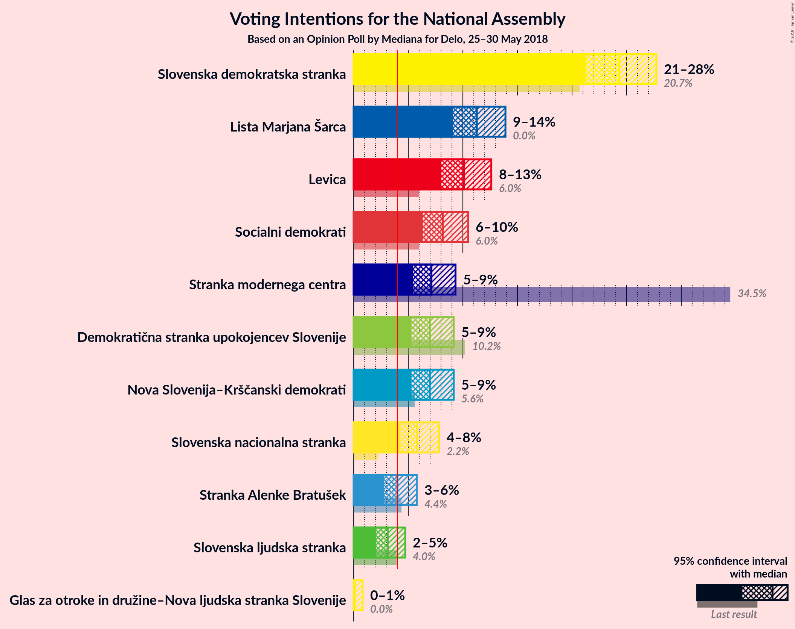

### Confidence Intervals

| Party | Last Result | Poll Result | 80% Confidence Interval | 90% Confidence Interval | 95% Confidence Interval | 99% Confidence Interval |
|:-----:|:-----------:|:-----------:|:-----------------------:|:-----------------------:|:-----------------------:|:-----------------------:|
| Slovenska demokratska stranka | 20.7% | 24.3% | 22.3–26.6% |21.7–27.2% |21.2–27.7% |20.3–28.8% |
| Lista Marjana Šarca | 0.0% | 11.3% | 9.8–13.0% |9.4–13.5% |9.1–13.9% |8.5–14.8% |
| Levica | 6.0% | 10.1% | 8.7–11.7% |8.4–12.2% |8.0–12.6% |7.4–13.4% |
| Socialni demokrati | 6.0% | 8.2% | 7.0–9.7% |6.6–10.1% |6.3–10.5% |5.8–11.2% |
| Stranka modernega centra | 34.5% | 7.1% | 6.0–8.6% |5.7–9.0% |5.4–9.3% |4.9–10.1% |
| Nova Slovenija–Krščanski demokrati | 5.6% | 7.0% | 5.9–8.4% |5.5–8.8% |5.3–9.2% |4.8–9.9% |
| Demokratična stranka upokojencev Slovenije | 10.2% | 7.0% | 5.9–8.4% |5.5–8.8% |5.3–9.2% |4.8–9.9% |
| Slovenska nacionalna stranka | 2.2% | 5.8% | 4.8–7.1% |4.5–7.5% |4.3–7.8% |3.8–8.5% |
| Stranka Alenke Bratušek | 4.4% | 4.0% | 3.2–5.2% |3.0–5.5% |2.8–5.8% |2.4–6.4% |
| Slovenska ljudska stranka | 4.0% | 3.1% | 2.4–4.2% |2.2–4.5% |2.0–4.7% |1.8–5.3% |
| Glas za otroke in družine–Nova ljudska stranka Slovenije | 0.0% | 0.1% | 0.1–0.6% |0.0–0.7% |0.0–0.8% |0.0–1.1% |

*Note:* The poll result column reflects the actual value used in the calculations. Published results may vary slightly, and in addition be rounded to fewer digits.

## Seats

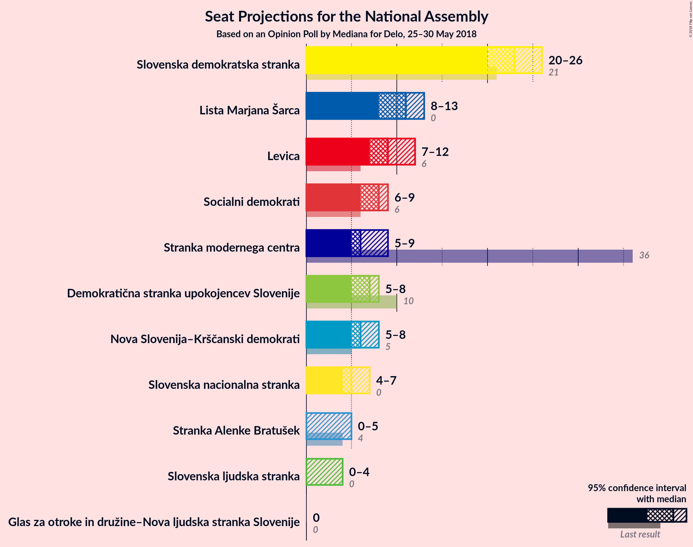

### Confidence Intervals

| Party | Last Result | Median | 80% Confidence Interval | 90% Confidence Interval | 95% Confidence Interval | 99% Confidence Interval |
|:-----:|:-----------:|:------:|:-----------------------:|:-----------------------:|:-----------------------:|:-----------------------:|
| <a href="#slovenska-demokratska-stranka">Slovenska demokratska stranka</a> | 21 | 23 | 21–26 |20–26 |20–26 |19–28 |
| <a href="#lista-marjana-šarca">Lista Marjana Šarca</a> | 0 | 11 | 9–12 |9–12 |8–13 |8–14 |
| <a href="#levica">Levica</a> | 6 | 9 | 8–11 |7–11 |7–12 |7–12 |
| <a href="#socialni-demokrati">Socialni demokrati</a> | 6 | 8 | 6–9 |6–9 |6–9 |5–10 |
| <a href="#stranka-modernega-centra">Stranka modernega centra</a> | 36 | 6 | 5–8 |5–8 |5–9 |4–9 |
| <a href="#nova-slovenija–krščanski-demokrati">Nova Slovenija–Krščanski demokrati</a> | 5 | 6 | 5–8 |5–8 |5–8 |4–9 |
| <a href="#demokratična-stranka-upokojencev-slovenije">Demokratična stranka upokojencev Slovenije</a> | 10 | 7 | 5–8 |5–8 |5–8 |4–9 |
| <a href="#slovenska-nacionalna-stranka">Slovenska nacionalna stranka</a> | 0 | 5 | 4–6 |4–6 |4–7 |0–8 |
| <a href="#stranka-alenke-bratušek">Stranka Alenke Bratušek</a> | 4 | 0 | 0–4 |0–4 |0–5 |0–6 |
| <a href="#slovenska-ljudska-stranka">Slovenska ljudska stranka</a> | 0 | 0 | 0–4 |0–4 |0–4 |0–5 |
| <a href="#glas-za-otroke-in-družine–nova-ljudska-stranka-slovenije">Glas za otroke in družine–Nova ljudska stranka Slovenije</a> | 0 | 0 | 0 |0 |0 |0 |

### Slovenska demokratska stranka

*For a full overview of the results for this party, see the [Slovenska demokratska stranka](party-slovenskademokratskastranka.html) page.*

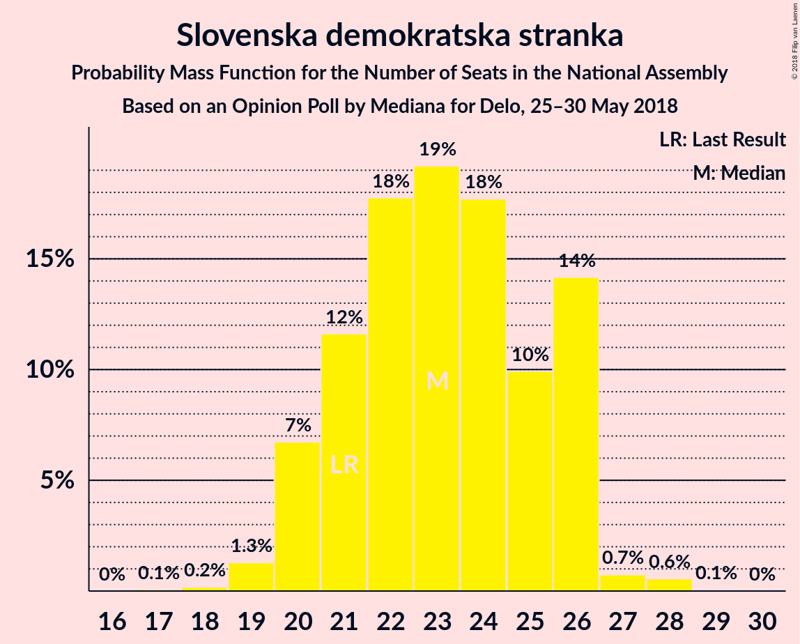

| Number of Seats | Probability | Accumulated | Special Marks |
|:---------------:|:-----------:|:-----------:|:-------------:|
| 17 | 0.1% | 100% |  |
| 18 | 0.2% | 99.9% |  |
| 19 | 1.3% | 99.8% |  |
| 20 | 7% | 98% |  |
| 21 | 12% | 92% | Last Result |
| 22 | 18% | 80% |  |
| 23 | 19% | 62% | Median |
| 24 | 18% | 43% |  |
| 25 | 10% | 25% |  |
| 26 | 14% | 16% |  |
| 27 | 0.7% | 1.4% |  |
| 28 | 0.6% | 0.6% |  |
| 29 | 0.1% | 0.1% |  |
| 30 | 0% | 0% |  |

### Lista Marjana Šarca

*For a full overview of the results for this party, see the [Lista Marjana Šarca](party-listamarjanašarca.html) page.*

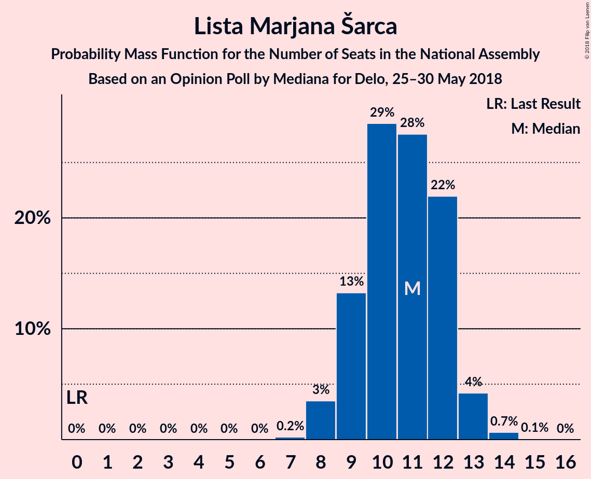

| Number of Seats | Probability | Accumulated | Special Marks |
|:---------------:|:-----------:|:-----------:|:-------------:|
| 0 | 0% | 100% | Last Result |
| 1 | 0% | 100% |  |
| 2 | 0% | 100% |  |
| 3 | 0% | 100% |  |
| 4 | 0% | 100% |  |
| 5 | 0% | 100% |  |
| 6 | 0% | 100% |  |
| 7 | 0.2% | 100% |  |
| 8 | 3% | 99.8% |  |
| 9 | 13% | 96% |  |
| 10 | 29% | 83% |  |
| 11 | 28% | 54% | Median |
| 12 | 22% | 27% |  |
| 13 | 4% | 5% |  |
| 14 | 0.7% | 0.8% |  |
| 15 | 0.1% | 0.1% |  |
| 16 | 0% | 0% |  |

### Levica

*For a full overview of the results for this party, see the [Levica](party-levica.html) page.*

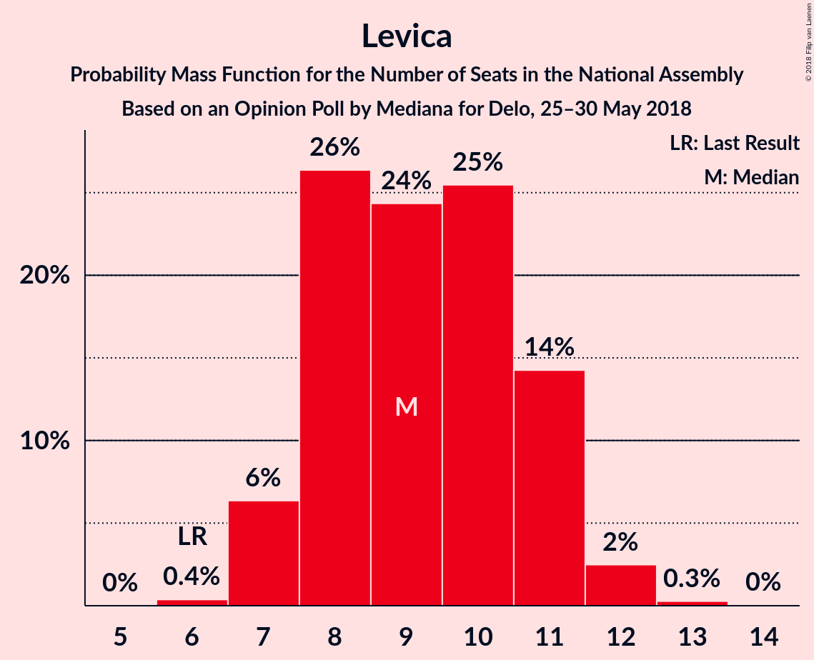

| Number of Seats | Probability | Accumulated | Special Marks |
|:---------------:|:-----------:|:-----------:|:-------------:|
| 6 | 0.4% | 100% | Last Result |
| 7 | 6% | 99.6% |  |
| 8 | 26% | 93% |  |
| 9 | 24% | 67% | Median |
| 10 | 25% | 43% |  |
| 11 | 14% | 17% |  |
| 12 | 2% | 3% |  |
| 13 | 0.3% | 0.3% |  |
| 14 | 0% | 0% |  |

### Socialni demokrati

*For a full overview of the results for this party, see the [Socialni demokrati](party-socialnidemokrati.html) page.*

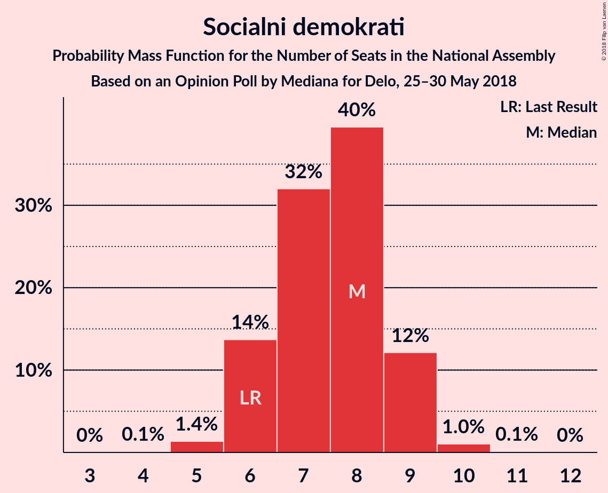

| Number of Seats | Probability | Accumulated | Special Marks |
|:---------------:|:-----------:|:-----------:|:-------------:|
| 4 | 0.1% | 100% |  |
| 5 | 1.4% | 99.9% |  |
| 6 | 14% | 98.5% | Last Result |
| 7 | 32% | 85% |  |
| 8 | 40% | 53% | Median |
| 9 | 12% | 13% |  |
| 10 | 1.0% | 1.2% |  |
| 11 | 0.1% | 0.1% |  |
| 12 | 0% | 0% |  |

### Stranka modernega centra

*For a full overview of the results for this party, see the [Stranka modernega centra](party-strankamodernegacentra.html) page.*

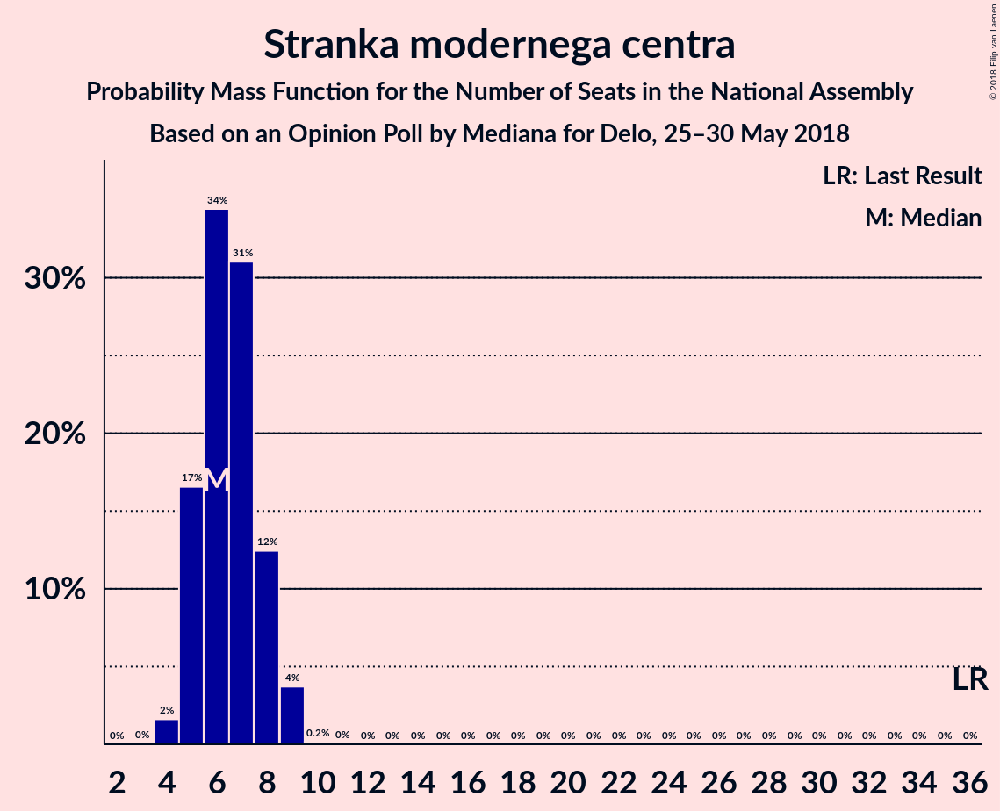

| Number of Seats | Probability | Accumulated | Special Marks |
|:---------------:|:-----------:|:-----------:|:-------------:|
| 4 | 2% | 100% |  |
| 5 | 17% | 98% |  |
| 6 | 34% | 82% | Median |
| 7 | 31% | 47% |  |
| 8 | 12% | 16% |  |
| 9 | 4% | 4% |  |
| 10 | 0.2% | 0.2% |  |
| 11 | 0% | 0% |  |
| 12 | 0% | 0% |  |
| 13 | 0% | 0% |  |
| 14 | 0% | 0% |  |
| 15 | 0% | 0% |  |
| 16 | 0% | 0% |  |
| 17 | 0% | 0% |  |
| 18 | 0% | 0% |  |
| 19 | 0% | 0% |  |
| 20 | 0% | 0% |  |
| 21 | 0% | 0% |  |
| 22 | 0% | 0% |  |
| 23 | 0% | 0% |  |
| 24 | 0% | 0% |  |
| 25 | 0% | 0% |  |
| 26 | 0% | 0% |  |
| 27 | 0% | 0% |  |
| 28 | 0% | 0% |  |
| 29 | 0% | 0% |  |
| 30 | 0% | 0% |  |
| 31 | 0% | 0% |  |
| 32 | 0% | 0% |  |
| 33 | 0% | 0% |  |
| 34 | 0% | 0% |  |
| 35 | 0% | 0% |  |
| 36 | 0% | 0% | Last Result |

### Nova Slovenija–Krščanski demokrati

*For a full overview of the results for this party, see the [Nova Slovenija–Krščanski demokrati](party-novaslovenija–krščanskidemokrati.html) page.*

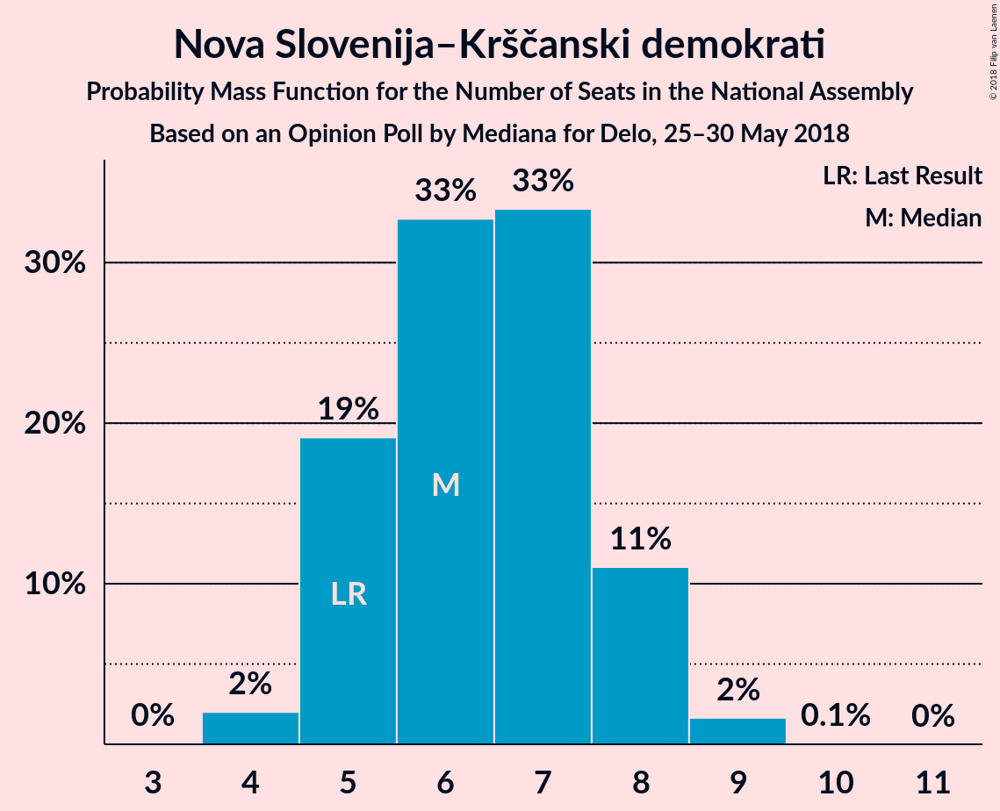

| Number of Seats | Probability | Accumulated | Special Marks |
|:---------------:|:-----------:|:-----------:|:-------------:|
| 3 | 0% | 100% |  |
| 4 | 2% | 99.9% |  |
| 5 | 19% | 98% | Last Result |
| 6 | 33% | 79% | Median |
| 7 | 33% | 46% |  |
| 8 | 11% | 13% |  |
| 9 | 2% | 2% |  |
| 10 | 0.1% | 0.1% |  |
| 11 | 0% | 0% |  |

### Demokratična stranka upokojencev Slovenije

*For a full overview of the results for this party, see the [Demokratična stranka upokojencev Slovenije](party-demokratičnastrankaupokojencevslovenije.html) page.*

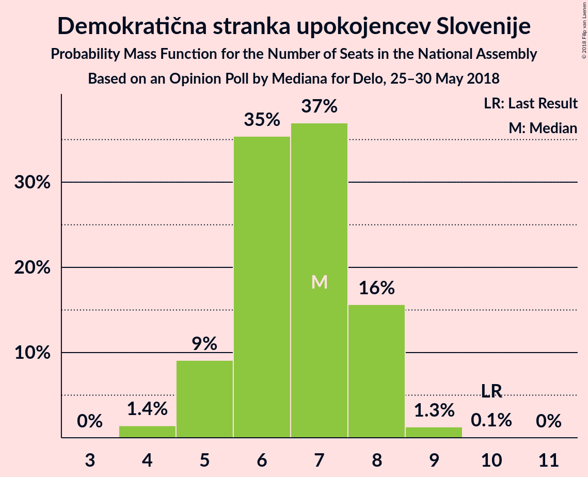

| Number of Seats | Probability | Accumulated | Special Marks |
|:---------------:|:-----------:|:-----------:|:-------------:|
| 4 | 1.4% | 100% |  |
| 5 | 9% | 98.5% |  |
| 6 | 35% | 89% |  |
| 7 | 37% | 54% | Median |
| 8 | 16% | 17% |  |
| 9 | 1.3% | 1.4% |  |
| 10 | 0.1% | 0.1% | Last Result |
| 11 | 0% | 0% |  |

### Slovenska nacionalna stranka

*For a full overview of the results for this party, see the [Slovenska nacionalna stranka](party-slovenskanacionalnastranka.html) page.*

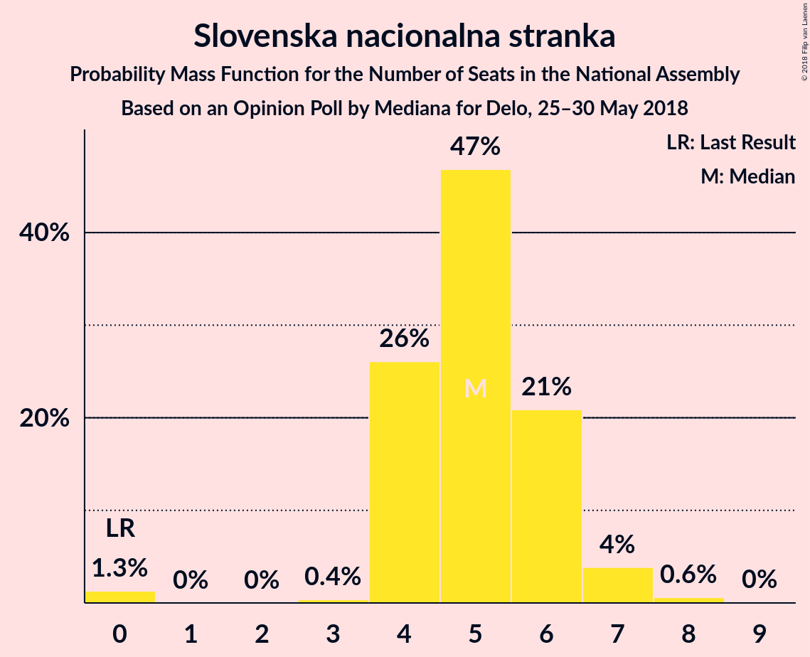

| Number of Seats | Probability | Accumulated | Special Marks |
|:---------------:|:-----------:|:-----------:|:-------------:|
| 0 | 1.3% | 100% | Last Result |
| 1 | 0% | 98.7% |  |
| 2 | 0% | 98.7% |  |
| 3 | 0.4% | 98.7% |  |
| 4 | 26% | 98% |  |
| 5 | 47% | 72% | Median |
| 6 | 21% | 25% |  |
| 7 | 4% | 5% |  |
| 8 | 0.6% | 0.6% |  |
| 9 | 0% | 0% |  |

### Stranka Alenke Bratušek

*For a full overview of the results for this party, see the [Stranka Alenke Bratušek](party-strankaalenkebratušek.html) page.*

| Number of Seats | Probability | Accumulated | Special Marks |
|:---------------:|:-----------:|:-----------:|:-------------:|
| 0 | 65% | 100% | Median |
| 1 | 0% | 35% |  |
| 2 | 0% | 35% |  |
| 3 | 4% | 35% |  |
| 4 | 26% | 31% | Last Result |
| 5 | 4% | 5% |  |
| 6 | 0.6% | 0.6% |  |
| 7 | 0% | 0% |  |

### Slovenska ljudska stranka

*For a full overview of the results for this party, see the [Slovenska ljudska stranka](party-slovenskaljudskastranka.html) page.*

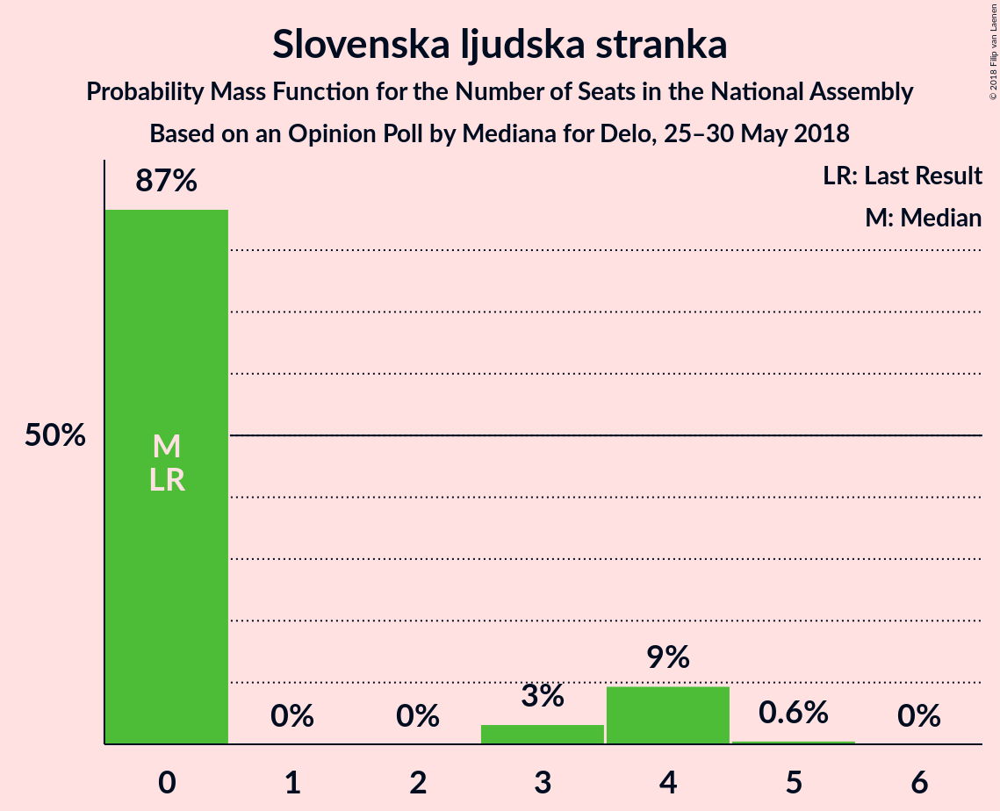

| Number of Seats | Probability | Accumulated | Special Marks |
|:---------------:|:-----------:|:-----------:|:-------------:|
| 0 | 87% | 100% | Last Result, Median |
| 1 | 0% | 13% |  |
| 2 | 0% | 13% |  |
| 3 | 3% | 13% |  |
| 4 | 9% | 10% |  |
| 5 | 0.6% | 0.6% |  |
| 6 | 0% | 0% |  |

### Glas za otroke in družine–Nova ljudska stranka Slovenije

*For a full overview of the results for this party, see the [Glas za otroke in družine–Nova ljudska stranka Slovenije](party-glaszaotrokeindružine–novaljudskastrankaslovenije.html) page.*

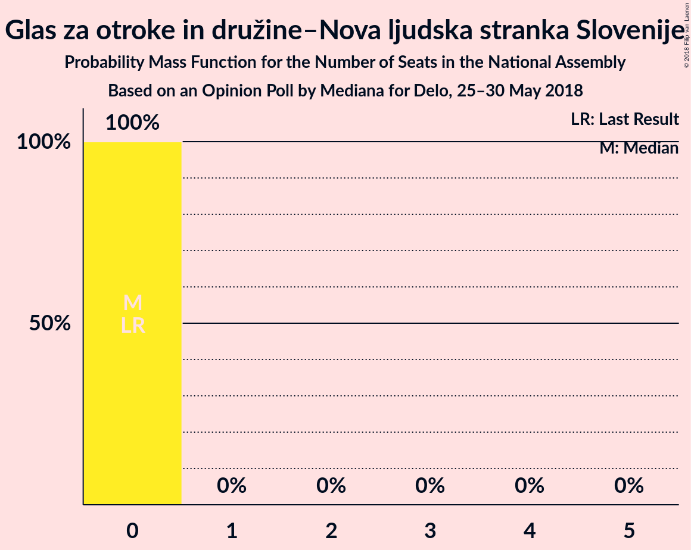

| Number of Seats | Probability | Accumulated | Special Marks |
|:---------------:|:-----------:|:-----------:|:-------------:|
| 0 | 100% | 100% | Last Result, Median |

## Coalitions

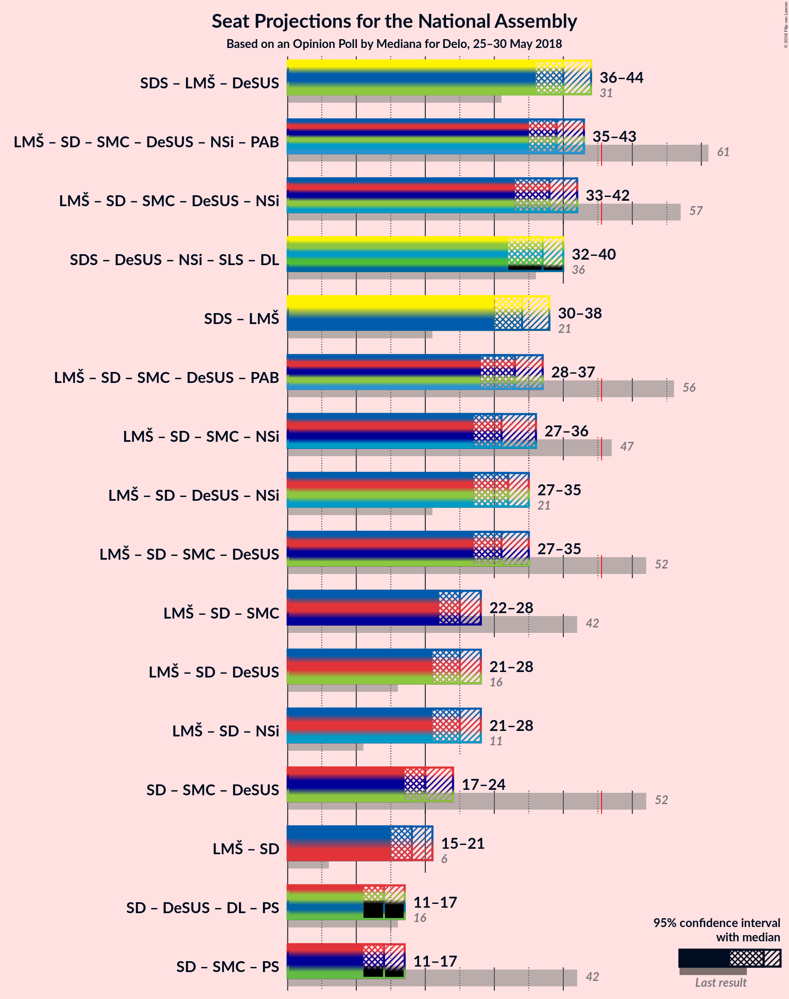

### Confidence Intervals

| Coalition | Last Result | Median | Majority? | 80% Confidence Interval | 90% Confidence Interval | 95% Confidence Interval | 99% Confidence Interval |
|:---------:|:-----------:|:------:|:---------:|:-----------------------:|:-----------------------:|:-----------------------:|:-----------------------:|
| Slovenska demokratska stranka – Lista Marjana Šarca – Demokratična stranka upokojencev Slovenije | 31 | 40 | 0.2% | 37–44 | 37–44 | 36–44 | 35–45 |
| Lista Marjana Šarca – Socialni demokrati – Stranka modernega centra – Demokratična stranka upokojencev Slovenije – Nova Slovenija–Krščanski demokrati – Stranka Alenke Bratušek | 61 | 39 | 0.3% | 36–42 | 36–43 | 35–43 | 34–45 |
| Lista Marjana Šarca – Socialni demokrati – Stranka modernega centra – Demokratična stranka upokojencev Slovenije – Nova Slovenija–Krščanski demokrati | 57 | 38 | 0% | 35–40 | 34–41 | 33–42 | 32–43 |
| Slovenska demokratska stranka – Lista Marjana Šarca | 21 | 34 | 0% | 31–37 | 30–38 | 30–38 | 29–38 |
| Lista Marjana Šarca – Socialni demokrati – Stranka modernega centra – Demokratična stranka upokojencev Slovenije – Stranka Alenke Bratušek | 56 | 33 | 0% | 30–36 | 29–36 | 28–37 | 27–38 |
| Lista Marjana Šarca – Socialni demokrati – Stranka modernega centra – Nova Slovenija–Krščanski demokrati | 47 | 31 | 0% | 29–33 | 28–34 | 27–36 | 26–36 |
| Lista Marjana Šarca – Socialni demokrati – Demokratična stranka upokojencev Slovenije – Nova Slovenija–Krščanski demokrati | 21 | 32 | 0% | 29–33 | 28–34 | 27–35 | 26–35 |
| Lista Marjana Šarca – Socialni demokrati – Stranka modernega centra – Demokratična stranka upokojencev Slovenije | 52 | 31 | 0% | 29–33 | 28–34 | 27–35 | 26–36 |
| Lista Marjana Šarca – Socialni demokrati – Stranka modernega centra | 42 | 25 | 0% | 22–27 | 22–28 | 22–28 | 20–30 |
| Lista Marjana Šarca – Socialni demokrati – Demokratična stranka upokojencev Slovenije | 16 | 25 | 0% | 23–27 | 22–27 | 21–28 | 20–29 |
| Lista Marjana Šarca – Socialni demokrati – Nova Slovenija–Krščanski demokrati | 11 | 25 | 0% | 22–26 | 22–27 | 21–28 | 20–29 |
| Socialni demokrati – Stranka modernega centra – Demokratična stranka upokojencev Slovenije | 52 | 20 | 0% | 18–23 | 18–23 | 17–24 | 16–24 |
| Lista Marjana Šarca – Socialni demokrati | 6 | 18 | 0% | 16–20 | 16–21 | 15–21 | 14–22 |

### Slovenska demokratska stranka – Lista Marjana Šarca – Demokratična stranka upokojencev Slovenije

| Number of Seats | Probability | Accumulated | Special Marks |
|:---------------:|:-----------:|:-----------:|:-------------:|
| 31 | 0% | 100% | Last Result |
| 32 | 0% | 100% |  |
| 33 | 0.1% | 100% |  |
| 34 | 0.3% | 99.8% |  |
| 35 | 1.4% | 99.5% |  |
| 36 | 2% | 98% |  |
| 37 | 6% | 96% |  |
| 38 | 7% | 90% |  |
| 39 | 16% | 82% |  |
| 40 | 17% | 67% |  |
| 41 | 17% | 49% | Median |
| 42 | 15% | 32% |  |
| 43 | 4% | 17% |  |
| 44 | 13% | 13% |  |
| 45 | 0.5% | 0.7% |  |
| 46 | 0.1% | 0.2% | Majority |
| 47 | 0% | 0.1% |  |
| 48 | 0% | 0% |  |

### Lista Marjana Šarca – Socialni demokrati – Stranka modernega centra – Demokratična stranka upokojencev Slovenije – Nova Slovenija–Krščanski demokrati – Stranka Alenke Bratušek

| Number of Seats | Probability | Accumulated | Special Marks |
|:---------------:|:-----------:|:-----------:|:-------------:|
| 32 | 0.1% | 100% |  |
| 33 | 0.3% | 99.8% |  |
| 34 | 1.5% | 99.5% |  |
| 35 | 3% | 98% |  |
| 36 | 5% | 95% |  |
| 37 | 13% | 90% |  |
| 38 | 17% | 77% | Median |
| 39 | 23% | 60% |  |
| 40 | 14% | 38% |  |
| 41 | 8% | 24% |  |
| 42 | 10% | 15% |  |
| 43 | 3% | 5% |  |
| 44 | 0.9% | 2% |  |
| 45 | 0.6% | 0.9% |  |
| 46 | 0.3% | 0.3% | Majority |
| 47 | 0% | 0% |  |
| 48 | 0% | 0% |  |
| 49 | 0% | 0% |  |
| 50 | 0% | 0% |  |
| 51 | 0% | 0% |  |
| 52 | 0% | 0% |  |
| 53 | 0% | 0% |  |
| 54 | 0% | 0% |  |
| 55 | 0% | 0% |  |
| 56 | 0% | 0% |  |
| 57 | 0% | 0% |  |
| 58 | 0% | 0% |  |
| 59 | 0% | 0% |  |
| 60 | 0% | 0% |  |
| 61 | 0% | 0% | Last Result |

### Lista Marjana Šarca – Socialni demokrati – Stranka modernega centra – Demokratična stranka upokojencev Slovenije – Nova Slovenija–Krščanski demokrati

| Number of Seats | Probability | Accumulated | Special Marks |
|:---------------:|:-----------:|:-----------:|:-------------:|
| 31 | 0.2% | 100% |  |
| 32 | 0.5% | 99.7% |  |
| 33 | 2% | 99.2% |  |
| 34 | 5% | 97% |  |
| 35 | 8% | 92% |  |
| 36 | 11% | 84% |  |
| 37 | 17% | 73% |  |
| 38 | 24% | 57% | Median |
| 39 | 18% | 33% |  |
| 40 | 8% | 15% |  |
| 41 | 3% | 7% |  |
| 42 | 2% | 4% |  |
| 43 | 1.4% | 2% |  |
| 44 | 0.1% | 0.1% |  |
| 45 | 0% | 0% |  |
| 46 | 0% | 0% | Majority |
| 47 | 0% | 0% |  |
| 48 | 0% | 0% |  |
| 49 | 0% | 0% |  |
| 50 | 0% | 0% |  |
| 51 | 0% | 0% |  |
| 52 | 0% | 0% |  |
| 53 | 0% | 0% |  |
| 54 | 0% | 0% |  |
| 55 | 0% | 0% |  |
| 56 | 0% | 0% |  |
| 57 | 0% | 0% | Last Result |

### Slovenska demokratska stranka – Lista Marjana Šarca

| Number of Seats | Probability | Accumulated | Special Marks |
|:---------------:|:-----------:|:-----------:|:-------------:|
| 21 | 0% | 100% | Last Result |
| 22 | 0% | 100% |  |
| 23 | 0% | 100% |  |
| 24 | 0% | 100% |  |
| 25 | 0% | 100% |  |
| 26 | 0% | 100% |  |
| 27 | 0.1% | 100% |  |
| 28 | 0.4% | 99.9% |  |
| 29 | 1.1% | 99.5% |  |
| 30 | 5% | 98% |  |
| 31 | 8% | 94% |  |
| 32 | 15% | 86% |  |
| 33 | 16% | 70% |  |
| 34 | 18% | 54% | Median |
| 35 | 11% | 36% |  |
| 36 | 9% | 25% |  |
| 37 | 9% | 16% |  |
| 38 | 6% | 6% |  |
| 39 | 0.2% | 0.3% |  |
| 40 | 0.1% | 0.1% |  |
| 41 | 0% | 0% |  |

### Lista Marjana Šarca – Socialni demokrati – Stranka modernega centra – Demokratična stranka upokojencev Slovenije – Stranka Alenke Bratušek

| Number of Seats | Probability | Accumulated | Special Marks |
|:---------------:|:-----------:|:-----------:|:-------------:|
| 26 | 0.1% | 100% |  |
| 27 | 0.4% | 99.9% |  |
| 28 | 2% | 99.5% |  |
| 29 | 3% | 97% |  |
| 30 | 5% | 94% |  |
| 31 | 21% | 88% |  |
| 32 | 15% | 68% | Median |
| 33 | 21% | 53% |  |
| 34 | 11% | 32% |  |
| 35 | 9% | 20% |  |
| 36 | 8% | 11% |  |
| 37 | 2% | 4% |  |
| 38 | 0.9% | 1.2% |  |
| 39 | 0.3% | 0.3% |  |
| 40 | 0% | 0.1% |  |
| 41 | 0% | 0% |  |
| 42 | 0% | 0% |  |
| 43 | 0% | 0% |  |
| 44 | 0% | 0% |  |
| 45 | 0% | 0% |  |
| 46 | 0% | 0% | Majority |
| 47 | 0% | 0% |  |
| 48 | 0% | 0% |  |
| 49 | 0% | 0% |  |
| 50 | 0% | 0% |  |
| 51 | 0% | 0% |  |
| 52 | 0% | 0% |  |
| 53 | 0% | 0% |  |
| 54 | 0% | 0% |  |
| 55 | 0% | 0% |  |
| 56 | 0% | 0% | Last Result |

### Lista Marjana Šarca – Socialni demokrati – Stranka modernega centra – Nova Slovenija–Krščanski demokrati

| Number of Seats | Probability | Accumulated | Special Marks |
|:---------------:|:-----------:|:-----------:|:-------------:|
| 25 | 0.3% | 100% |  |
| 26 | 0.8% | 99.6% |  |
| 27 | 2% | 98.8% |  |
| 28 | 6% | 97% |  |
| 29 | 12% | 91% |  |
| 30 | 19% | 79% |  |
| 31 | 19% | 60% | Median |
| 32 | 19% | 41% |  |
| 33 | 14% | 22% |  |
| 34 | 4% | 8% |  |
| 35 | 0.8% | 4% |  |
| 36 | 3% | 3% |  |
| 37 | 0.1% | 0.1% |  |
| 38 | 0% | 0% |  |
| 39 | 0% | 0% |  |
| 40 | 0% | 0% |  |
| 41 | 0% | 0% |  |
| 42 | 0% | 0% |  |
| 43 | 0% | 0% |  |
| 44 | 0% | 0% |  |
| 45 | 0% | 0% |  |
| 46 | 0% | 0% | Majority |
| 47 | 0% | 0% | Last Result |

### Lista Marjana Šarca – Socialni demokrati – Demokratična stranka upokojencev Slovenije – Nova Slovenija–Krščanski demokrati

| Number of Seats | Probability | Accumulated | Special Marks |
|:---------------:|:-----------:|:-----------:|:-------------:|
| 21 | 0% | 100% | Last Result |
| 22 | 0% | 100% |  |
| 23 | 0% | 100% |  |
| 24 | 0% | 100% |  |
| 25 | 0.1% | 100% |  |
| 26 | 1.0% | 99.8% |  |
| 27 | 3% | 98.8% |  |
| 28 | 5% | 96% |  |
| 29 | 12% | 91% |  |
| 30 | 12% | 78% |  |
| 31 | 12% | 66% |  |
| 32 | 34% | 54% | Median |
| 33 | 11% | 20% |  |
| 34 | 6% | 9% |  |
| 35 | 2% | 3% |  |
| 36 | 0.3% | 0.3% |  |
| 37 | 0% | 0% |  |

### Lista Marjana Šarca – Socialni demokrati – Stranka modernega centra – Demokratična stranka upokojencev Slovenije

| Number of Seats | Probability | Accumulated | Special Marks |
|:---------------:|:-----------:|:-----------:|:-------------:|
| 24 | 0% | 100% |  |
| 25 | 0.1% | 99.9% |  |
| 26 | 0.7% | 99.8% |  |
| 27 | 2% | 99.2% |  |
| 28 | 5% | 97% |  |
| 29 | 9% | 92% |  |
| 30 | 13% | 83% |  |
| 31 | 25% | 70% |  |
| 32 | 19% | 45% | Median |
| 33 | 17% | 26% |  |
| 34 | 4% | 9% |  |
| 35 | 4% | 5% |  |
| 36 | 1.0% | 1.2% |  |
| 37 | 0.1% | 0.1% |  |
| 38 | 0% | 0% |  |
| 39 | 0% | 0% |  |
| 40 | 0% | 0% |  |
| 41 | 0% | 0% |  |
| 42 | 0% | 0% |  |
| 43 | 0% | 0% |  |
| 44 | 0% | 0% |  |
| 45 | 0% | 0% |  |
| 46 | 0% | 0% | Majority |
| 47 | 0% | 0% |  |
| 48 | 0% | 0% |  |
| 49 | 0% | 0% |  |
| 50 | 0% | 0% |  |
| 51 | 0% | 0% |  |
| 52 | 0% | 0% | Last Result |

### Lista Marjana Šarca – Socialni demokrati – Stranka modernega centra

| Number of Seats | Probability | Accumulated | Special Marks |
|:---------------:|:-----------:|:-----------:|:-------------:|
| 19 | 0.1% | 100% |  |
| 20 | 0.9% | 99.9% |  |
| 21 | 1.3% | 99.0% |  |
| 22 | 10% | 98% |  |
| 23 | 13% | 88% |  |
| 24 | 24% | 75% |  |
| 25 | 21% | 51% | Median |
| 26 | 14% | 30% |  |
| 27 | 10% | 16% |  |
| 28 | 4% | 6% |  |
| 29 | 0.6% | 2% |  |
| 30 | 0.9% | 0.9% |  |
| 31 | 0.1% | 0.1% |  |
| 32 | 0% | 0% |  |
| 33 | 0% | 0% |  |
| 34 | 0% | 0% |  |
| 35 | 0% | 0% |  |
| 36 | 0% | 0% |  |
| 37 | 0% | 0% |  |
| 38 | 0% | 0% |  |
| 39 | 0% | 0% |  |
| 40 | 0% | 0% |  |
| 41 | 0% | 0% |  |
| 42 | 0% | 0% | Last Result |

### Lista Marjana Šarca – Socialni demokrati – Demokratična stranka upokojencev Slovenije

| Number of Seats | Probability | Accumulated | Special Marks |
|:---------------:|:-----------:|:-----------:|:-------------:|
| 16 | 0% | 100% | Last Result |
| 17 | 0% | 100% |  |
| 18 | 0% | 100% |  |
| 19 | 0.2% | 100% |  |
| 20 | 0.6% | 99.8% |  |
| 21 | 3% | 99.2% |  |
| 22 | 6% | 97% |  |
| 23 | 12% | 90% |  |
| 24 | 17% | 78% |  |
| 25 | 24% | 61% |  |
| 26 | 26% | 37% | Median |
| 27 | 7% | 11% |  |
| 28 | 4% | 4% |  |
| 29 | 0.6% | 0.7% |  |
| 30 | 0.1% | 0.1% |  |
| 31 | 0% | 0% |  |

### Lista Marjana Šarca – Socialni demokrati – Nova Slovenija–Krščanski demokrati

| Number of Seats | Probability | Accumulated | Special Marks |
|:---------------:|:-----------:|:-----------:|:-------------:|
| 11 | 0% | 100% | Last Result |
| 12 | 0% | 100% |  |
| 13 | 0% | 100% |  |
| 14 | 0% | 100% |  |
| 15 | 0% | 100% |  |
| 16 | 0% | 100% |  |
| 17 | 0% | 100% |  |
| 18 | 0% | 100% |  |
| 19 | 0.2% | 100% |  |
| 20 | 1.1% | 99.8% |  |
| 21 | 3% | 98.7% |  |
| 22 | 11% | 95% |  |
| 23 | 13% | 84% |  |
| 24 | 13% | 72% |  |
| 25 | 28% | 58% | Median |
| 26 | 21% | 30% |  |
| 27 | 5% | 10% |  |
| 28 | 4% | 4% |  |
| 29 | 0.7% | 0.8% |  |
| 30 | 0.1% | 0.2% |  |
| 31 | 0% | 0% |  |

### Socialni demokrati – Stranka modernega centra – Demokratična stranka upokojencev Slovenije

| Number of Seats | Probability | Accumulated | Special Marks |
|:---------------:|:-----------:|:-----------:|:-------------:|
| 15 | 0.1% | 100% |  |
| 16 | 0.7% | 99.9% |  |
| 17 | 2% | 99.1% |  |
| 18 | 7% | 97% |  |
| 19 | 15% | 89% |  |
| 20 | 26% | 75% |  |
| 21 | 18% | 49% | Median |
| 22 | 13% | 30% |  |
| 23 | 13% | 17% |  |
| 24 | 3% | 4% |  |
| 25 | 0.4% | 0.5% |  |
| 26 | 0.1% | 0.1% |  |
| 27 | 0% | 0% |  |
| 28 | 0% | 0% |  |
| 29 | 0% | 0% |  |
| 30 | 0% | 0% |  |
| 31 | 0% | 0% |  |
| 32 | 0% | 0% |  |
| 33 | 0% | 0% |  |
| 34 | 0% | 0% |  |
| 35 | 0% | 0% |  |
| 36 | 0% | 0% |  |
| 37 | 0% | 0% |  |
| 38 | 0% | 0% |  |
| 39 | 0% | 0% |  |
| 40 | 0% | 0% |  |
| 41 | 0% | 0% |  |
| 42 | 0% | 0% |  |
| 43 | 0% | 0% |  |
| 44 | 0% | 0% |  |
| 45 | 0% | 0% |  |
| 46 | 0% | 0% | Majority |
| 47 | 0% | 0% |  |
| 48 | 0% | 0% |  |
| 49 | 0% | 0% |  |
| 50 | 0% | 0% |  |
| 51 | 0% | 0% |  |
| 52 | 0% | 0% | Last Result |

### Lista Marjana Šarca – Socialni demokrati

| Number of Seats | Probability | Accumulated | Special Marks |
|:---------------:|:-----------:|:-----------:|:-------------:|
| 6 | 0% | 100% | Last Result |
| 7 | 0% | 100% |  |
| 8 | 0% | 100% |  |
| 9 | 0% | 100% |  |
| 10 | 0% | 100% |  |
| 11 | 0% | 100% |  |
| 12 | 0% | 100% |  |
| 13 | 0.1% | 100% |  |
| 14 | 0.6% | 99.9% |  |
| 15 | 2% | 99.3% |  |
| 16 | 12% | 97% |  |
| 17 | 19% | 85% |  |
| 18 | 25% | 66% |  |
| 19 | 19% | 41% | Median |
| 20 | 16% | 22% |  |
| 21 | 3% | 5% |  |
| 22 | 1.5% | 2% |  |
| 23 | 0.4% | 0.4% |  |
| 24 | 0% | 0% |  |

## Technical Information

### Opinion Poll

+ **Polling firm:** Mediana
+ **Commissioner(s):** Delo
+ **Fieldwork period:** 25–30 May 2018

### Calculations

+ **Sample size:** 674
+ **Simulations done:** 4,194,304
+ **Error estimate:** 1.71%

