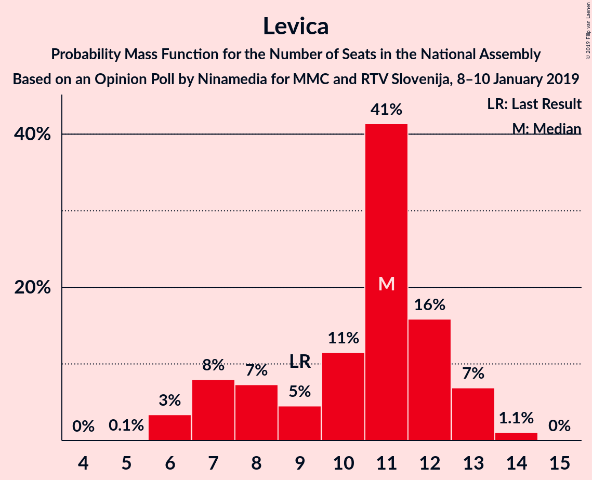

# Opinion Poll by Ninamedia for MMC and RTV Slovenija, 8–10 January 2019

<a href="#voting-intentions">Voting Intentions</a> | <a href="#seats">Seats</a> | <a href="#coalitions">Coalitions</a> | <a href="#technical-information">Technical Information</a>

## Voting Intentions

### Confidence Intervals

| Party | Last Result | Poll Result | 80% Confidence Interval | 90% Confidence Interval | 95% Confidence Interval | 99% Confidence Interval |
|:-----:|:-----------:|:-----------:|:-----------------------:|:-----------------------:|:-----------------------:|:-----------------------:|
| Lista Marjana Šarca | 12.6% | 25.3% | 22.9–27.9% |22.3–28.7% |21.7–29.3% |20.6–30.6% |
| Slovenska demokratska stranka | 24.9% | 23.7% | 21.4–26.3% |20.7–27.0% |20.2–27.6% |19.1–28.9% |
| Socialni demokrati | 9.9% | 16.5% | 14.5–18.8% |13.9–19.4% |13.5–20.0% |12.6–21.1% |
| Levica | 9.3% | 10.0% | 8.5–12.0% |8.1–12.5% |7.7–13.0% |7.0–14.0% |
| Nova Slovenija–Krščanski demokrati | 7.2% | 5.8% | 4.7–7.4% |4.4–7.8% |4.1–8.2% |3.6–9.1% |
| Stranka modernega centra | 9.7% | 4.4% | 3.4–5.8% |3.2–6.2% |2.9–6.6% |2.5–7.3% |
| Slovenska ljudska stranka | 2.6% | 4.4% | 3.4–5.8% |3.2–6.2% |2.9–6.6% |2.5–7.3% |
| Demokratična stranka upokojencev Slovenije | 4.9% | 4.0% | 3.1–5.4% |2.8–5.8% |2.6–6.1% |2.2–6.9% |
| Stranka Alenke Bratušek | 5.1% | 3.4% | 2.6–4.7% |2.3–5.1% |2.1–5.4% |1.8–6.1% |
| Slovenska nacionalna stranka | 4.2% | 2.4% | 1.7–3.6% |1.5–3.9% |1.4–4.2% |1.1–4.8% |

*Note:* The poll result column reflects the actual value used in the calculations. Published results may vary slightly, and in addition be rounded to fewer digits.

## Seats

### Confidence Intervals

| Party | Last Result | Median | 80% Confidence Interval | 90% Confidence Interval | 95% Confidence Interval | 99% Confidence Interval |
|:-----:|:-----------:|:------:|:-----------------------:|:-----------------------:|:-----------------------:|:-----------------------:|
| <a href="#lista-marjana-šarca">Lista Marjana Šarca</a> | 13 | 25 | 22–28 |21–28 |20–28 |19–30 |
| <a href="#slovenska-demokratska-stranka">Slovenska demokratska stranka</a> | 25 | 23 | 21–26 |20–26 |19–28 |18–29 |
| <a href="#socialni-demokrati">Socialni demokrati</a> | 10 | 15 | 13–18 |13–19 |13–20 |11–20 |
| <a href="#levica">Levica</a> | 9 | 11 | 7–12 |7–13 |6–13 |6–14 |
| <a href="#nova-slovenija–krščanski-demokrati">Nova Slovenija–Krščanski demokrati</a> | 7 | 5 | 4–7 |4–7 |4–8 |0–8 |
| <a href="#stranka-modernega-centra">Stranka modernega centra</a> | 10 | 4 | 0–5 |0–6 |0–6 |0–7 |
| <a href="#slovenska-ljudska-stranka">Slovenska ljudska stranka</a> | 0 | 3 | 0–5 |0–6 |0–6 |0–7 |
| <a href="#demokratična-stranka-upokojencev-slovenije">Demokratična stranka upokojencev Slovenije</a> | 5 | 4 | 0–5 |0–6 |0–6 |0–7 |
| <a href="#stranka-alenke-bratušek">Stranka Alenke Bratušek</a> | 5 | 0 | 0–5 |0–5 |0–5 |0–5 |
| <a href="#slovenska-nacionalna-stranka">Slovenska nacionalna stranka</a> | 4 | 0 | 0 |0 |0–4 |0–4 |

### Lista Marjana Šarca

*For a full overview of the results for this party, see the [Lista Marjana Šarca](party-listamarjanašarca.html) page.*

| Number of Seats | Probability | Accumulated | Special Marks |
|:---------------:|:-----------:|:-----------:|:-------------:|
| 13 | 0% | 100% | Last Result |
| 14 | 0% | 100% |  |
| 15 | 0% | 100% |  |
| 16 | 0% | 100% |  |
| 17 | 0% | 100% |  |
| 18 | 0.4% | 100% |  |
| 19 | 0.4% | 99.6% |  |
| 20 | 3% | 99.2% |  |
| 21 | 4% | 96% |  |
| 22 | 8% | 92% |  |
| 23 | 20% | 85% |  |
| 24 | 9% | 65% |  |
| 25 | 33% | 56% | Median |
| 26 | 9% | 23% |  |
| 27 | 4% | 14% |  |
| 28 | 8% | 11% |  |
| 29 | 1.3% | 2% |  |
| 30 | 1.0% | 1.2% |  |
| 31 | 0.1% | 0.2% |  |
| 32 | 0% | 0.1% |  |
| 33 | 0% | 0% |  |

### Slovenska demokratska stranka

*For a full overview of the results for this party, see the [Slovenska demokratska stranka](party-slovenskademokratskastranka.html) page.*

| Number of Seats | Probability | Accumulated | Special Marks |
|:---------------:|:-----------:|:-----------:|:-------------:|
| 17 | 0.2% | 100% |  |
| 18 | 1.0% | 99.8% |  |
| 19 | 2% | 98.7% |  |
| 20 | 6% | 97% |  |
| 21 | 17% | 91% |  |
| 22 | 21% | 75% |  |
| 23 | 14% | 54% | Median |
| 24 | 13% | 40% |  |
| 25 | 8% | 26% | Last Result |
| 26 | 14% | 18% |  |
| 27 | 0.8% | 4% |  |
| 28 | 2% | 3% |  |
| 29 | 0.5% | 0.6% |  |
| 30 | 0.1% | 0.1% |  |
| 31 | 0% | 0% |  |

### Socialni demokrati

*For a full overview of the results for this party, see the [Socialni demokrati](party-socialnidemokrati.html) page.*

| Number of Seats | Probability | Accumulated | Special Marks |
|:---------------:|:-----------:|:-----------:|:-------------:|
| 10 | 0% | 100% | Last Result |
| 11 | 0.6% | 100% |  |
| 12 | 1.4% | 99.4% |  |
| 13 | 10% | 98% |  |
| 14 | 9% | 88% |  |
| 15 | 30% | 79% | Median |
| 16 | 14% | 49% |  |
| 17 | 6% | 36% |  |
| 18 | 24% | 30% |  |
| 19 | 3% | 6% |  |
| 20 | 2% | 3% |  |
| 21 | 0.3% | 0.5% |  |
| 22 | 0.2% | 0.2% |  |
| 23 | 0% | 0% |  |

### Levica

*For a full overview of the results for this party, see the [Levica](party-levica.html) page.*

| Number of Seats | Probability | Accumulated | Special Marks |
|:---------------:|:-----------:|:-----------:|:-------------:|
| 5 | 0.1% | 100% |  |
| 6 | 3% | 99.9% |  |
| 7 | 8% | 96% |  |
| 8 | 7% | 89% |  |
| 9 | 5% | 81% | Last Result |
| 10 | 11% | 77% |  |
| 11 | 41% | 65% | Median |
| 12 | 16% | 24% |  |
| 13 | 7% | 8% |  |
| 14 | 1.1% | 1.1% |  |
| 15 | 0% | 0% |  |

### Nova Slovenija–Krščanski demokrati

*For a full overview of the results for this party, see the [Nova Slovenija–Krščanski demokrati](party-novaslovenija–krščanskidemokrati.html) page.*

| Number of Seats | Probability | Accumulated | Special Marks |
|:---------------:|:-----------:|:-----------:|:-------------:|
| 0 | 2% | 100% |  |
| 1 | 0% | 98% |  |
| 2 | 0% | 98% |  |
| 3 | 0.1% | 98% |  |
| 4 | 27% | 98% |  |
| 5 | 38% | 71% | Median |
| 6 | 20% | 33% |  |
| 7 | 11% | 13% | Last Result |
| 8 | 2% | 3% |  |
| 9 | 0.4% | 0.5% |  |
| 10 | 0.1% | 0.1% |  |
| 11 | 0% | 0% |  |

### Stranka modernega centra

*For a full overview of the results for this party, see the [Stranka modernega centra](party-strankamodernegacentra.html) page.*

| Number of Seats | Probability | Accumulated | Special Marks |
|:---------------:|:-----------:|:-----------:|:-------------:|
| 0 | 48% | 100% |  |
| 1 | 0% | 52% |  |
| 2 | 0% | 52% |  |
| 3 | 0.9% | 52% |  |
| 4 | 30% | 52% | Median |
| 5 | 16% | 22% |  |
| 6 | 5% | 6% |  |
| 7 | 0.8% | 1.0% |  |
| 8 | 0.1% | 0.2% |  |
| 9 | 0.1% | 0.1% |  |
| 10 | 0% | 0% | Last Result |

### Slovenska ljudska stranka

*For a full overview of the results for this party, see the [Slovenska ljudska stranka](party-slovenskaljudskastranka.html) page.*

| Number of Seats | Probability | Accumulated | Special Marks |
|:---------------:|:-----------:|:-----------:|:-------------:|
| 0 | 44% | 100% | Last Result |
| 1 | 0% | 56% |  |
| 2 | 0% | 56% |  |
| 3 | 11% | 56% | Median |
| 4 | 20% | 45% |  |
| 5 | 15% | 24% |  |
| 6 | 8% | 9% |  |
| 7 | 1.1% | 1.2% |  |
| 8 | 0.1% | 0.1% |  |
| 9 | 0% | 0% |  |

### Demokratična stranka upokojencev Slovenije

*For a full overview of the results for this party, see the [Demokratična stranka upokojencev Slovenije](party-demokratičnastrankaupokojencevslovenije.html) page.*

| Number of Seats | Probability | Accumulated | Special Marks |
|:---------------:|:-----------:|:-----------:|:-------------:|
| 0 | 47% | 100% |  |
| 1 | 0% | 53% |  |
| 2 | 0% | 53% |  |
| 3 | 0.5% | 53% |  |
| 4 | 35% | 53% | Median |
| 5 | 11% | 18% | Last Result |
| 6 | 5% | 7% |  |
| 7 | 2% | 2% |  |
| 8 | 0% | 0% |  |

### Stranka Alenke Bratušek

*For a full overview of the results for this party, see the [Stranka Alenke Bratušek](party-strankaalenkebratušek.html) page.*

| Number of Seats | Probability | Accumulated | Special Marks |
|:---------------:|:-----------:|:-----------:|:-------------:|
| 0 | 60% | 100% | Median |
| 1 | 0% | 40% |  |
| 2 | 0% | 40% |  |
| 3 | 0.9% | 40% |  |
| 4 | 28% | 39% |  |
| 5 | 10% | 11% | Last Result |
| 6 | 0.2% | 0.3% |  |
| 7 | 0.1% | 0.1% |  |
| 8 | 0% | 0% |  |

### Slovenska nacionalna stranka

*For a full overview of the results for this party, see the [Slovenska nacionalna stranka](party-slovenskanacionalnastranka.html) page.*

| Number of Seats | Probability | Accumulated | Special Marks |
|:---------------:|:-----------:|:-----------:|:-------------:|
| 0 | 97% | 100% | Median |
| 1 | 0% | 3% |  |
| 2 | 0% | 3% |  |
| 3 | 0.2% | 3% |  |
| 4 | 3% | 3% | Last Result |
| 5 | 0.2% | 0.2% |  |
| 6 | 0% | 0% |  |

## Coalitions

### Confidence Intervals

| Coalition | Last Result | Median | Majority? | 80% Confidence Interval | 90% Confidence Interval | 95% Confidence Interval | 99% Confidence Interval |
|:---------:|:-----------:|:------:|:---------:|:-----------------------:|:-----------------------:|:-----------------------:|:-----------------------:|
| Lista Marjana Šarca – Socialni demokrati – Nova Slovenija–Krščanski demokrati – Stranka modernega centra – Demokratična stranka upokojencev Slovenije – Stranka Alenke Bratušek | 50 | 52 | 99.4% | 48–55 | 48–56 | 46–57 | 45–60 |
| Lista Marjana Šarca – Slovenska demokratska stranka – Demokratična stranka upokojencev Slovenije | 43 | 50 | 93% | 46–55 | 45–56 | 44–57 | 42–59 |
| Lista Marjana Šarca – Socialni demokrati – Nova Slovenija–Krščanski demokrati – Stranka modernega centra – Demokratična stranka upokojencev Slovenije | 45 | 50 | 93% | 46–54 | 45–55 | 44–56 | 43–58 |
| Lista Marjana Šarca – Socialni demokrati – Nova Slovenija–Krščanski demokrati – Stranka modernega centra | 40 | 48 | 82% | 44–52 | 43–52 | 42–54 | 41–56 |
| Lista Marjana Šarca – Socialni demokrati – Nova Slovenija–Krščanski demokrati – Demokratična stranka upokojencev Slovenije | 35 | 48 | 81% | 44–51 | 42–53 | 40–54 | 40–56 |
| Lista Marjana Šarca – Slovenska demokratska stranka | 38 | 47 | 73% | 44–51 | 43–52 | 42–53 | 40–55 |
| Lista Marjana Šarca – Socialni demokrati – Stranka modernega centra – Demokratična stranka upokojencev Slovenije – Stranka Alenke Bratušek | 43 | 47 | 71% | 43–50 | 42–51 | 40–52 | 40–55 |
| Lista Marjana Šarca – Socialni demokrati – Stranka modernega centra – Demokratična stranka upokojencev Slovenije | 38 | 45 | 43% | 41–48 | 40–50 | 40–51 | 38–53 |
| Lista Marjana Šarca – Socialni demokrati – Nova Slovenija–Krščanski demokrati | 30 | 46 | 55% | 41–48 | 40–50 | 40–51 | 38–52 |
| Lista Marjana Šarca – Socialni demokrati – Stranka modernega centra | 33 | 43 | 14% | 40–46 | 38–47 | 38–49 | 36–50 |
| Lista Marjana Šarca – Socialni demokrati – Demokratična stranka upokojencev Slovenije | 28 | 43 | 12% | 38–46 | 37–47 | 36–49 | 36–51 |
| Lista Marjana Šarca – Socialni demokrati | 23 | 40 | 1.0% | 36–43 | 35–44 | 35–45 | 34–47 |
| Socialni demokrati – Stranka modernega centra – Demokratična stranka upokojencev Slovenije | 25 | 21 | 0% | 16–25 | 15–25 | 15–27 | 14–27 |

### Lista Marjana Šarca – Socialni demokrati – Nova Slovenija–Krščanski demokrati – Stranka modernega centra – Demokratična stranka upokojencev Slovenije – Stranka Alenke Bratušek

| Number of Seats | Probability | Accumulated | Special Marks |
|:---------------:|:-----------:|:-----------:|:-------------:|
| 43 | 0.1% | 100% |  |
| 44 | 0.1% | 99.8% |  |
| 45 | 0.3% | 99.7% |  |
| 46 | 3% | 99.4% | Majority |
| 47 | 1.3% | 96% |  |
| 48 | 9% | 95% |  |
| 49 | 5% | 87% |  |
| 50 | 7% | 81% | Last Result |
| 51 | 18% | 74% |  |
| 52 | 11% | 56% |  |
| 53 | 18% | 45% | Median |
| 54 | 9% | 27% |  |
| 55 | 12% | 19% |  |
| 56 | 3% | 7% |  |
| 57 | 2% | 4% |  |
| 58 | 0.8% | 2% |  |
| 59 | 0.7% | 1.2% |  |
| 60 | 0.4% | 0.5% |  |
| 61 | 0.1% | 0.2% |  |
| 62 | 0% | 0% |  |

### Lista Marjana Šarca – Slovenska demokratska stranka – Demokratična stranka upokojencev Slovenije

| Number of Seats | Probability | Accumulated | Special Marks |
|:---------------:|:-----------:|:-----------:|:-------------:|
| 40 | 0.1% | 100% |  |
| 41 | 0.3% | 99.9% |  |
| 42 | 0.4% | 99.7% |  |
| 43 | 0.9% | 99.3% | Last Result |
| 44 | 2% | 98% |  |
| 45 | 3% | 96% |  |
| 46 | 5% | 93% | Majority |
| 47 | 14% | 89% |  |
| 48 | 5% | 74% |  |
| 49 | 15% | 70% |  |
| 50 | 14% | 55% |  |
| 51 | 20% | 41% |  |
| 52 | 5% | 21% | Median |
| 53 | 4% | 16% |  |
| 54 | 2% | 12% |  |
| 55 | 2% | 10% |  |
| 56 | 4% | 8% |  |
| 57 | 3% | 4% |  |
| 58 | 0.5% | 2% |  |
| 59 | 0.8% | 1.0% |  |
| 60 | 0% | 0.3% |  |
| 61 | 0.2% | 0.3% |  |
| 62 | 0% | 0% |  |

### Lista Marjana Šarca – Socialni demokrati – Nova Slovenija–Krščanski demokrati – Stranka modernega centra – Demokratična stranka upokojencev Slovenije

| Number of Seats | Probability | Accumulated | Special Marks |
|:---------------:|:-----------:|:-----------:|:-------------:|
| 40 | 0.1% | 100% |  |
| 41 | 0% | 99.9% |  |
| 42 | 0.1% | 99.9% |  |
| 43 | 0.5% | 99.9% |  |
| 44 | 3% | 99.4% |  |
| 45 | 3% | 96% | Last Result |
| 46 | 5% | 93% | Majority |
| 47 | 12% | 88% |  |
| 48 | 9% | 76% |  |
| 49 | 6% | 66% |  |
| 50 | 13% | 60% |  |
| 51 | 8% | 47% |  |
| 52 | 8% | 39% |  |
| 53 | 17% | 31% | Median |
| 54 | 7% | 15% |  |
| 55 | 4% | 8% |  |
| 56 | 2% | 3% |  |
| 57 | 0.6% | 1.4% |  |
| 58 | 0.3% | 0.8% |  |
| 59 | 0.4% | 0.5% |  |
| 60 | 0% | 0.1% |  |
| 61 | 0% | 0% |  |

### Lista Marjana Šarca – Socialni demokrati – Nova Slovenija–Krščanski demokrati – Stranka modernega centra

| Number of Seats | Probability | Accumulated | Special Marks |
|:---------------:|:-----------:|:-----------:|:-------------:|
| 38 | 0.1% | 100% |  |
| 39 | 0.2% | 99.9% |  |
| 40 | 0.2% | 99.8% | Last Result |
| 41 | 0.2% | 99.6% |  |
| 42 | 3% | 99.4% |  |
| 43 | 3% | 97% |  |
| 44 | 5% | 94% |  |
| 45 | 7% | 89% |  |
| 46 | 14% | 82% | Majority |
| 47 | 16% | 68% |  |
| 48 | 12% | 53% |  |
| 49 | 15% | 41% | Median |
| 50 | 10% | 26% |  |
| 51 | 5% | 16% |  |
| 52 | 6% | 11% |  |
| 53 | 2% | 5% |  |
| 54 | 1.3% | 3% |  |
| 55 | 0.7% | 1.4% |  |
| 56 | 0.5% | 0.7% |  |
| 57 | 0.1% | 0.2% |  |
| 58 | 0.1% | 0.1% |  |
| 59 | 0% | 0% |  |

### Lista Marjana Šarca – Socialni demokrati – Nova Slovenija–Krščanski demokrati – Demokratična stranka upokojencev Slovenije

| Number of Seats | Probability | Accumulated | Special Marks |
|:---------------:|:-----------:|:-----------:|:-------------:|
| 35 | 0% | 100% | Last Result |
| 36 | 0% | 100% |  |
| 37 | 0% | 100% |  |
| 38 | 0% | 100% |  |
| 39 | 0.2% | 100% |  |
| 40 | 3% | 99.8% |  |
| 41 | 0.4% | 97% |  |
| 42 | 1.4% | 96% |  |
| 43 | 2% | 95% |  |
| 44 | 6% | 93% |  |
| 45 | 5% | 87% |  |
| 46 | 7% | 81% | Majority |
| 47 | 19% | 74% |  |
| 48 | 10% | 56% |  |
| 49 | 16% | 46% | Median |
| 50 | 17% | 30% |  |
| 51 | 6% | 13% |  |
| 52 | 1.5% | 7% |  |
| 53 | 3% | 6% |  |
| 54 | 2% | 3% |  |
| 55 | 0.4% | 2% |  |
| 56 | 1.1% | 1.2% |  |
| 57 | 0% | 0.1% |  |
| 58 | 0% | 0% |  |

### Lista Marjana Šarca – Slovenska demokratska stranka

| Number of Seats | Probability | Accumulated | Special Marks |
|:---------------:|:-----------:|:-----------:|:-------------:|
| 38 | 0% | 100% | Last Result |
| 39 | 0.1% | 100% |  |
| 40 | 0.6% | 99.8% |  |
| 41 | 1.1% | 99.2% |  |
| 42 | 1.4% | 98% |  |
| 43 | 5% | 97% |  |
| 44 | 6% | 92% |  |
| 45 | 13% | 86% |  |
| 46 | 16% | 73% | Majority |
| 47 | 16% | 57% |  |
| 48 | 4% | 41% | Median |
| 49 | 4% | 37% |  |
| 50 | 7% | 33% |  |
| 51 | 18% | 26% |  |
| 52 | 5% | 8% |  |
| 53 | 2% | 3% |  |
| 54 | 0.2% | 1.0% |  |
| 55 | 0.4% | 0.8% |  |
| 56 | 0.1% | 0.4% |  |
| 57 | 0.2% | 0.3% |  |
| 58 | 0% | 0.1% |  |
| 59 | 0% | 0% |  |

### Lista Marjana Šarca – Socialni demokrati – Stranka modernega centra – Demokratična stranka upokojencev Slovenije – Stranka Alenke Bratušek

| Number of Seats | Probability | Accumulated | Special Marks |
|:---------------:|:-----------:|:-----------:|:-------------:|
| 38 | 0.2% | 100% |  |
| 39 | 0.1% | 99.8% |  |
| 40 | 2% | 99.7% |  |
| 41 | 0.8% | 97% |  |
| 42 | 2% | 97% |  |
| 43 | 6% | 94% | Last Result |
| 44 | 8% | 88% |  |
| 45 | 9% | 80% |  |
| 46 | 12% | 71% | Majority |
| 47 | 18% | 60% |  |
| 48 | 21% | 42% | Median |
| 49 | 4% | 21% |  |
| 50 | 11% | 17% |  |
| 51 | 3% | 6% |  |
| 52 | 1.0% | 3% |  |
| 53 | 0.6% | 2% |  |
| 54 | 0.6% | 1.3% |  |
| 55 | 0.2% | 0.6% |  |
| 56 | 0.1% | 0.4% |  |
| 57 | 0.3% | 0.3% |  |
| 58 | 0% | 0% |  |

### Lista Marjana Šarca – Socialni demokrati – Stranka modernega centra – Demokratična stranka upokojencev Slovenije

| Number of Seats | Probability | Accumulated | Special Marks |
|:---------------:|:-----------:|:-----------:|:-------------:|
| 37 | 0.2% | 100% |  |
| 38 | 0.3% | 99.8% | Last Result |
| 39 | 1.0% | 99.4% |  |
| 40 | 6% | 98% |  |
| 41 | 5% | 92% |  |
| 42 | 5% | 87% |  |
| 43 | 17% | 83% |  |
| 44 | 8% | 66% |  |
| 45 | 14% | 58% |  |
| 46 | 9% | 43% | Majority |
| 47 | 8% | 35% |  |
| 48 | 17% | 27% | Median |
| 49 | 3% | 10% |  |
| 50 | 3% | 6% |  |
| 51 | 2% | 3% |  |
| 52 | 0.7% | 1.4% |  |
| 53 | 0.4% | 0.7% |  |
| 54 | 0.3% | 0.4% |  |
| 55 | 0.1% | 0.1% |  |
| 56 | 0% | 0% |  |

### Lista Marjana Šarca – Socialni demokrati – Nova Slovenija–Krščanski demokrati

| Number of Seats | Probability | Accumulated | Special Marks |
|:---------------:|:-----------:|:-----------:|:-------------:|
| 30 | 0% | 100% | Last Result |
| 31 | 0% | 100% |  |
| 32 | 0% | 100% |  |
| 33 | 0% | 100% |  |
| 34 | 0% | 100% |  |
| 35 | 0% | 100% |  |
| 36 | 0% | 100% |  |
| 37 | 0.1% | 100% |  |
| 38 | 1.1% | 99.9% |  |
| 39 | 1.0% | 98.8% |  |
| 40 | 5% | 98% |  |
| 41 | 3% | 93% |  |
| 42 | 3% | 89% |  |
| 43 | 6% | 86% |  |
| 44 | 7% | 80% |  |
| 45 | 18% | 74% | Median |
| 46 | 18% | 55% | Majority |
| 47 | 19% | 37% |  |
| 48 | 9% | 18% |  |
| 49 | 4% | 9% |  |
| 50 | 2% | 5% |  |
| 51 | 2% | 3% |  |
| 52 | 0.3% | 0.6% |  |
| 53 | 0.1% | 0.2% |  |
| 54 | 0.1% | 0.2% |  |
| 55 | 0.1% | 0.1% |  |
| 56 | 0% | 0% |  |

### Lista Marjana Šarca – Socialni demokrati – Stranka modernega centra

| Number of Seats | Probability | Accumulated | Special Marks |
|:---------------:|:-----------:|:-----------:|:-------------:|
| 33 | 0.1% | 100% | Last Result |
| 34 | 0.2% | 99.9% |  |
| 35 | 0.1% | 99.8% |  |
| 36 | 2% | 99.7% |  |
| 37 | 0.4% | 98% |  |
| 38 | 3% | 98% |  |
| 39 | 4% | 95% |  |
| 40 | 10% | 90% |  |
| 41 | 13% | 80% |  |
| 42 | 8% | 67% |  |
| 43 | 21% | 59% |  |
| 44 | 19% | 38% | Median |
| 45 | 5% | 19% |  |
| 46 | 7% | 14% | Majority |
| 47 | 2% | 7% |  |
| 48 | 2% | 4% |  |
| 49 | 2% | 3% |  |
| 50 | 0.6% | 0.9% |  |
| 51 | 0.2% | 0.3% |  |
| 52 | 0% | 0.1% |  |
| 53 | 0% | 0.1% |  |
| 54 | 0% | 0% |  |

### Lista Marjana Šarca – Socialni demokrati – Demokratična stranka upokojencev Slovenije

| Number of Seats | Probability | Accumulated | Special Marks |
|:---------------:|:-----------:|:-----------:|:-------------:|
| 28 | 0% | 100% | Last Result |
| 29 | 0% | 100% |  |
| 30 | 0% | 100% |  |
| 31 | 0% | 100% |  |
| 32 | 0% | 100% |  |
| 33 | 0% | 100% |  |
| 34 | 0.3% | 100% |  |
| 35 | 0.1% | 99.7% |  |
| 36 | 3% | 99.6% |  |
| 37 | 3% | 96% |  |
| 38 | 4% | 94% |  |
| 39 | 3% | 90% |  |
| 40 | 9% | 87% |  |
| 41 | 9% | 78% |  |
| 42 | 6% | 69% |  |
| 43 | 22% | 63% |  |
| 44 | 16% | 42% | Median |
| 45 | 13% | 25% |  |
| 46 | 4% | 12% | Majority |
| 47 | 4% | 8% |  |
| 48 | 0.9% | 4% |  |
| 49 | 1.2% | 3% |  |
| 50 | 0.4% | 2% |  |
| 51 | 1.1% | 1.2% |  |
| 52 | 0.2% | 0.2% |  |
| 53 | 0% | 0% |  |

### Lista Marjana Šarca – Socialni demokrati

| Number of Seats | Probability | Accumulated | Special Marks |
|:---------------:|:-----------:|:-----------:|:-------------:|
| 23 | 0% | 100% | Last Result |
| 24 | 0% | 100% |  |
| 25 | 0% | 100% |  |
| 26 | 0% | 100% |  |
| 27 | 0% | 100% |  |
| 28 | 0% | 100% |  |
| 29 | 0% | 100% |  |
| 30 | 0% | 100% |  |
| 31 | 0% | 100% |  |
| 32 | 0.1% | 100% |  |
| 33 | 0.2% | 99.9% |  |
| 34 | 2% | 99.7% |  |
| 35 | 3% | 98% |  |
| 36 | 6% | 95% |  |
| 37 | 5% | 89% |  |
| 38 | 7% | 83% |  |
| 39 | 7% | 77% |  |
| 40 | 20% | 70% | Median |
| 41 | 16% | 50% |  |
| 42 | 8% | 34% |  |
| 43 | 17% | 26% |  |
| 44 | 5% | 8% |  |
| 45 | 2% | 3% |  |
| 46 | 0.5% | 1.0% | Majority |
| 47 | 0.1% | 0.5% |  |
| 48 | 0.2% | 0.4% |  |
| 49 | 0.2% | 0.2% |  |
| 50 | 0.1% | 0.1% |  |
| 51 | 0% | 0% |  |

### Socialni demokrati – Stranka modernega centra – Demokratična stranka upokojencev Slovenije

| Number of Seats | Probability | Accumulated | Special Marks |
|:---------------:|:-----------:|:-----------:|:-------------:|
| 13 | 0.1% | 100% |  |
| 14 | 0.8% | 99.9% |  |
| 15 | 6% | 99.1% |  |
| 16 | 3% | 93% |  |
| 17 | 7% | 90% |  |
| 18 | 14% | 83% |  |
| 19 | 7% | 69% |  |
| 20 | 5% | 62% |  |
| 21 | 11% | 57% |  |
| 22 | 12% | 45% |  |
| 23 | 20% | 34% | Median |
| 24 | 4% | 14% |  |
| 25 | 6% | 10% | Last Result |
| 26 | 2% | 5% |  |
| 27 | 2% | 3% |  |
| 28 | 0.2% | 0.4% |  |
| 29 | 0.2% | 0.2% |  |
| 30 | 0.1% | 0.1% |  |
| 31 | 0% | 0% |  |

## Technical Information

### Opinion Poll

+ **Polling firm:** Ninamedia
+ **Commissioner(s):** MMC and RTV Slovenija
+ **Fieldwork period:** 8–10 January 2019

### Calculations

+ **Sample size:** 498
+ **Simulations done:** 1,048,576
+ **Error estimate:** 1.84%

