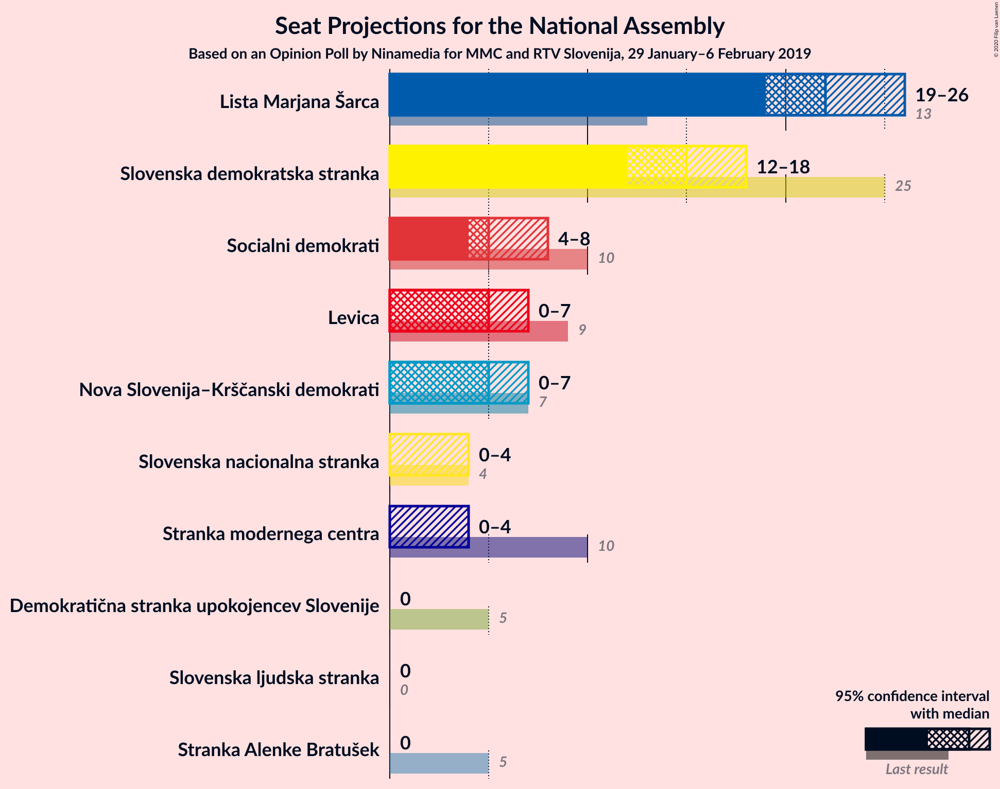
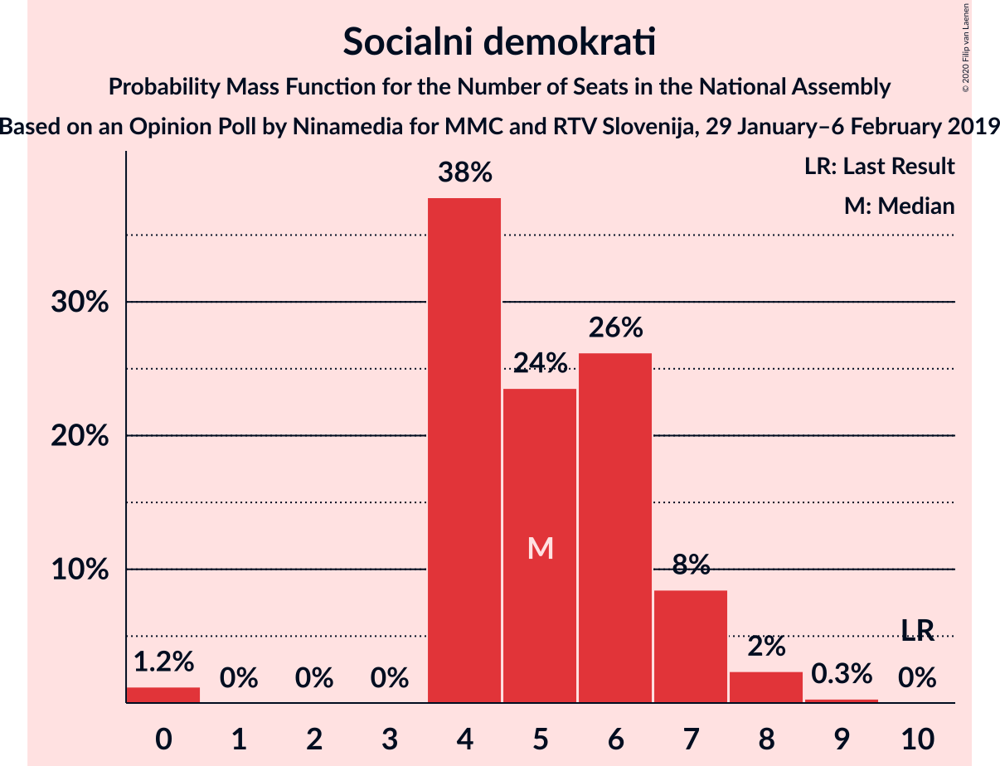
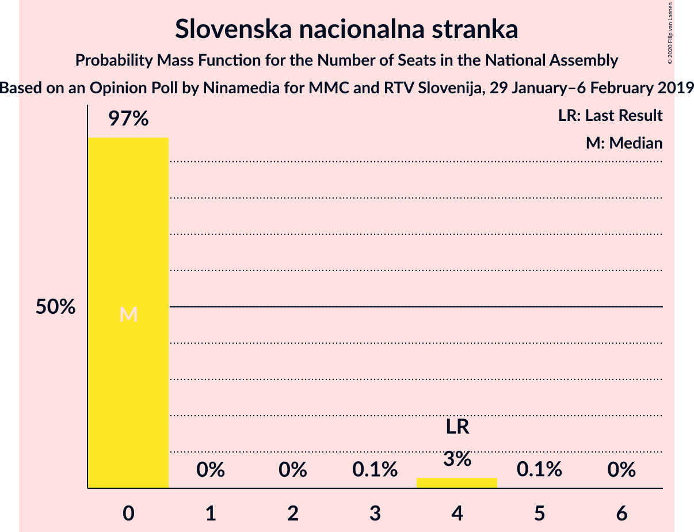
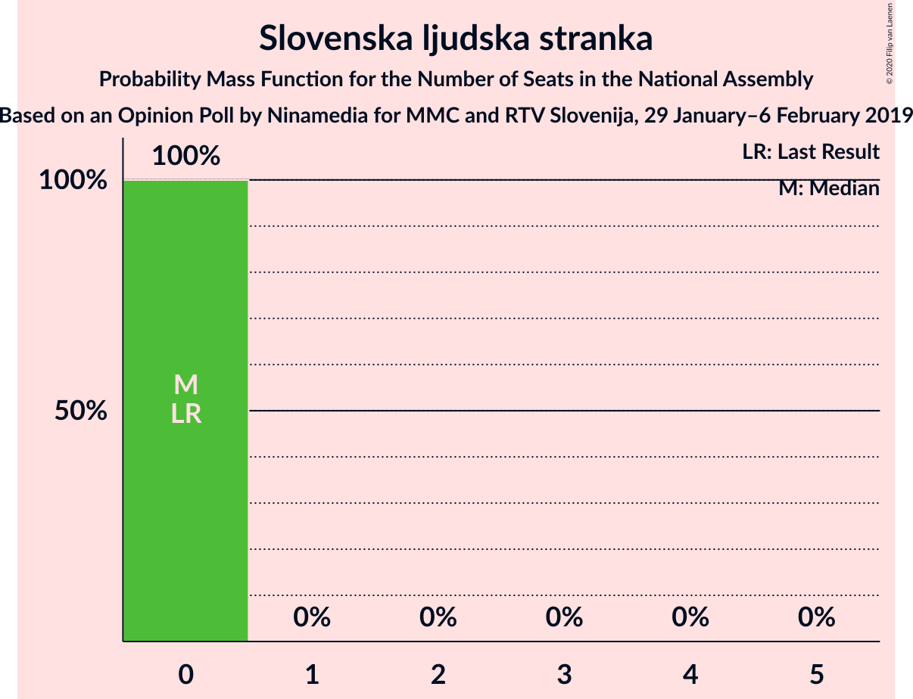
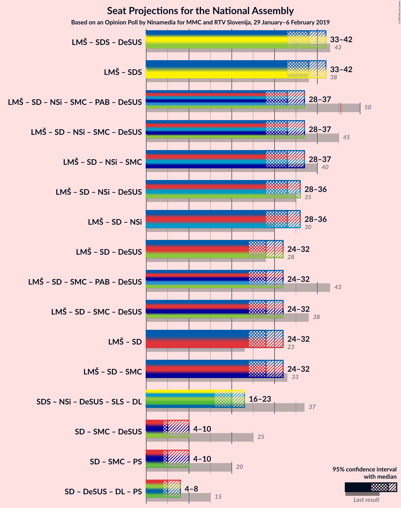
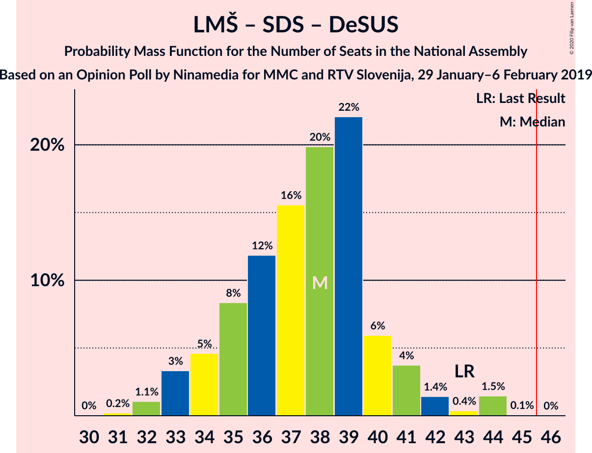
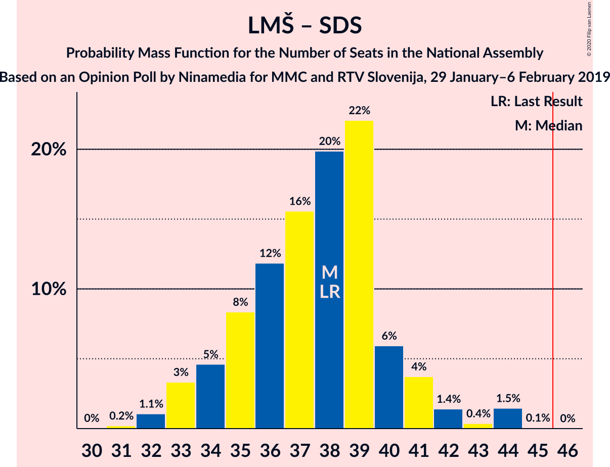
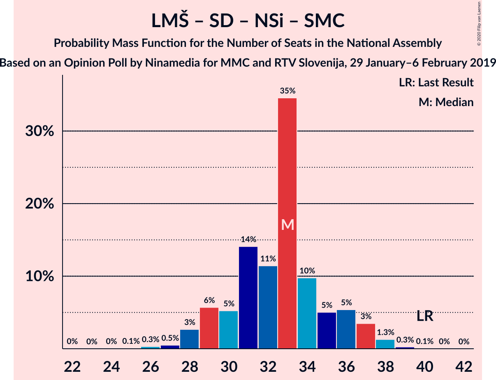
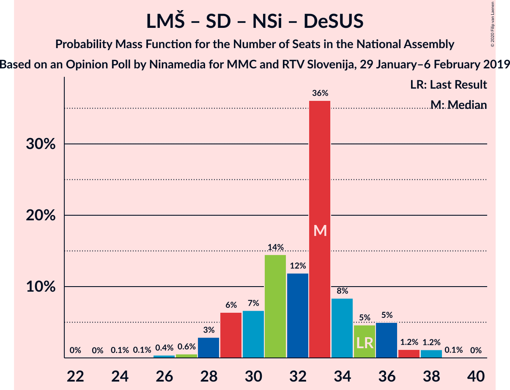
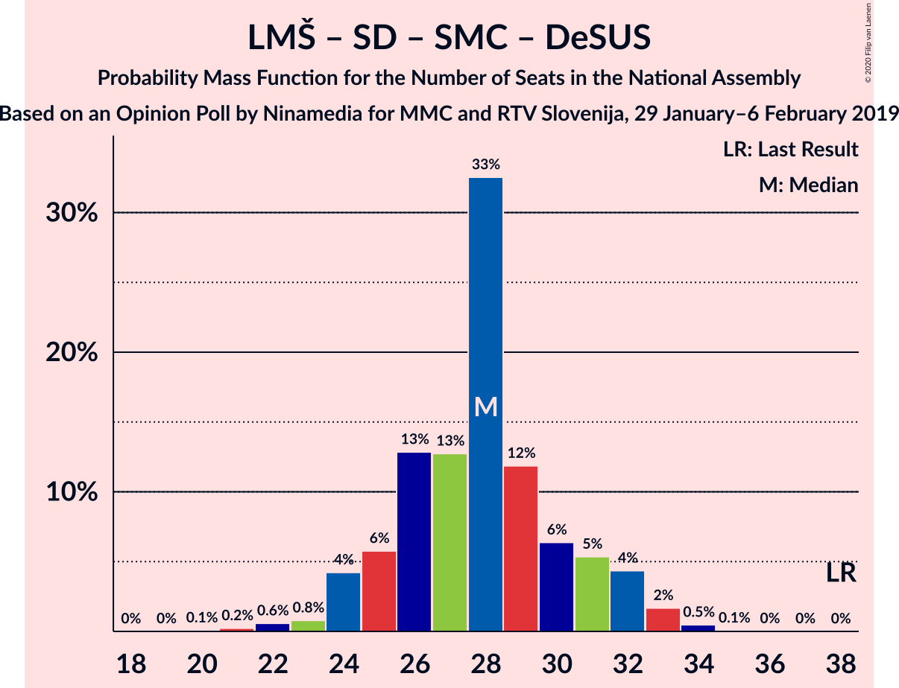

# Opinion Poll by Ninamedia for MMC and RTV Slovenija, 29 January–6 February 2019

<a href="#voting-intentions">Voting Intentions</a> | <a href="#seats">Seats</a> | <a href="#coalitions">Coalitions</a> | <a href="#technical-information">Technical Information</a>

## Voting Intentions

### Confidence Intervals

| Party | Last Result | Poll Result | 80% Confidence Interval | 90% Confidence Interval | 95% Confidence Interval | 99% Confidence Interval |
|:-----:|:-----------:|:-----------:|:-----------------------:|:-----------------------:|:-----------------------:|:-----------------------:|
| Lista Marjana Šarca | 12.6% | 22.4% | 20.4–24.7% |19.8–25.3% |19.3–25.8% |18.4–26.9% |
| Slovenska demokratska stranka | 24.9% | 15.1% | 13.4–17.1% |12.9–17.6% |12.5–18.1% |11.7–19.1% |
| Socialni demokrati | 9.9% | 5.7% | 4.7–7.1% |4.4–7.5% |4.2–7.8% |3.7–8.5% |
| Levica | 9.3% | 5.4% | 4.4–6.8% |4.1–7.1% |3.9–7.5% |3.5–8.2% |
| Nova Slovenija–Krščanski demokrati | 7.2% | 5.2% | 4.3–6.6% |4.0–7.0% |3.8–7.3% |3.3–8.0% |
| Stranka modernega centra | 9.7% | 2.7% | 2.0–3.7% |1.8–4.0% |1.7–4.3% |1.4–4.8% |
| Slovenska nacionalna stranka | 4.2% | 2.5% | 1.9–3.6% |1.7–3.8% |1.6–4.1% |1.3–4.6% |
| Stranka Alenke Bratušek | 5.1% | 2.4% | 1.8–3.4% |1.6–3.6% |1.4–3.9% |1.2–4.4% |
| Demokratična stranka upokojencev Slovenije | 4.9% | 1.7% | 1.2–2.6% |1.1–2.9% |1.0–3.1% |0.8–3.6% |
| Slovenska ljudska stranka | 2.6% | 1.4% | 1.0–2.3% |0.9–2.5% |0.8–2.7% |0.6–3.2% |

*Note:* The poll result column reflects the actual value used in the calculations. Published results may vary slightly, and in addition be rounded to fewer digits.

## Seats

### Confidence Intervals

| Party | Last Result | Median | 80% Confidence Interval | 90% Confidence Interval | 95% Confidence Interval | 99% Confidence Interval |
|:-----:|:-----------:|:------:|:-----------------------:|:-----------------------:|:-----------------------:|:-----------------------:|
| <a href="#lista-marjana-šarca">Lista Marjana Šarca</a> | 13 | 22 | 20–24 |19–24 |19–25 |18–27 |
| <a href="#slovenska-demokratska-stranka">Slovenska demokratska stranka</a> | 25 | 14 | 13–17 |12–18 |12–18 |12–19 |
| <a href="#socialni-demokrati">Socialni demokrati</a> | 10 | 4 | 4–6 |0–7 |0–8 |0–9 |
| <a href="#levica">Levica</a> | 9 | 5 | 4–6 |4–7 |0–7 |0–8 |
| <a href="#nova-slovenija–krščanski-demokrati">Nova Slovenija–Krščanski demokrati</a> | 7 | 6 | 4–7 |0–7 |0–8 |0–8 |
| <a href="#stranka-modernega-centra">Stranka modernega centra</a> | 10 | 0 | 0 |0–4 |0–4 |0–5 |
| <a href="#slovenska-nacionalna-stranka">Slovenska nacionalna stranka</a> | 4 | 0 | 0 |0 |0–4 |0–4 |
| <a href="#stranka-alenke-bratušek">Stranka Alenke Bratušek</a> | 5 | 0 | 0 |0 |0 |0–4 |
| <a href="#demokratična-stranka-upokojencev-slovenije">Demokratična stranka upokojencev Slovenije</a> | 5 | 0 | 0 |0 |0 |0 |
| <a href="#slovenska-ljudska-stranka">Slovenska ljudska stranka</a> | 0 | 0 | 0 |0 |0 |0 |

### Lista Marjana Šarca

*For a full overview of the results for this party, see the [Lista Marjana Šarca](party-listamarjanašarca.html) page.*

| Number of Seats | Probability | Accumulated | Special Marks |
|:---------------:|:-----------:|:-----------:|:-------------:|
| 13 | 0% | 100% | Last Result |
| 14 | 0% | 100% |  |
| 15 | 0% | 100% |  |
| 16 | 0% | 100% |  |
| 17 | 0.3% | 100% |  |
| 18 | 0.8% | 99.7% |  |
| 19 | 4% | 98.9% |  |
| 20 | 5% | 94% |  |
| 21 | 19% | 89% |  |
| 22 | 50% | 70% | Median |
| 23 | 10% | 20% |  |
| 24 | 6% | 11% |  |
| 25 | 4% | 5% |  |
| 26 | 0.2% | 0.8% |  |
| 27 | 0.4% | 0.6% |  |
| 28 | 0.1% | 0.2% |  |
| 29 | 0% | 0.1% |  |
| 30 | 0% | 0% |  |

### Slovenska demokratska stranka

*For a full overview of the results for this party, see the [Slovenska demokratska stranka](party-slovenskademokratskastranka.html) page.*

| Number of Seats | Probability | Accumulated | Special Marks |
|:---------------:|:-----------:|:-----------:|:-------------:|
| 11 | 0.4% | 100% |  |
| 12 | 6% | 99.6% |  |
| 13 | 9% | 94% |  |
| 14 | 63% | 85% | Median |
| 15 | 7% | 23% |  |
| 16 | 3% | 15% |  |
| 17 | 2% | 12% |  |
| 18 | 8% | 10% |  |
| 19 | 2% | 2% |  |
| 20 | 0.1% | 0.1% |  |
| 21 | 0% | 0% |  |
| 22 | 0% | 0% |  |
| 23 | 0% | 0% |  |
| 24 | 0% | 0% |  |
| 25 | 0% | 0% | Last Result |

### Socialni demokrati

*For a full overview of the results for this party, see the [Socialni demokrati](party-socialnidemokrati.html) page.*

| Number of Seats | Probability | Accumulated | Special Marks |
|:---------------:|:-----------:|:-----------:|:-------------:|
| 0 | 5% | 100% |  |
| 1 | 0% | 95% |  |
| 2 | 0% | 95% |  |
| 3 | 0% | 95% |  |
| 4 | 46% | 95% | Median |
| 5 | 22% | 49% |  |
| 6 | 18% | 26% |  |
| 7 | 6% | 8% |  |
| 8 | 2% | 3% |  |
| 9 | 1.1% | 1.1% |  |
| 10 | 0% | 0% | Last Result |

### Levica

*For a full overview of the results for this party, see the [Levica](party-levica.html) page.*

| Number of Seats | Probability | Accumulated | Special Marks |
|:---------------:|:-----------:|:-----------:|:-------------:|
| 0 | 3% | 100% |  |
| 1 | 0% | 97% |  |
| 2 | 0% | 97% |  |
| 3 | 0% | 97% |  |
| 4 | 15% | 97% |  |
| 5 | 50% | 81% | Median |
| 6 | 23% | 31% |  |
| 7 | 7% | 8% |  |
| 8 | 1.1% | 1.3% |  |
| 9 | 0.2% | 0.2% | Last Result |
| 10 | 0% | 0% |  |

### Nova Slovenija–Krščanski demokrati

*For a full overview of the results for this party, see the [Nova Slovenija–Krščanski demokrati](party-novaslovenija–krščanskidemokrati.html) page.*

| Number of Seats | Probability | Accumulated | Special Marks |
|:---------------:|:-----------:|:-----------:|:-------------:|
| 0 | 8% | 100% |  |
| 1 | 0% | 92% |  |
| 2 | 0% | 92% |  |
| 3 | 0.1% | 92% |  |
| 4 | 11% | 92% |  |
| 5 | 11% | 81% |  |
| 6 | 27% | 70% | Median |
| 7 | 41% | 44% | Last Result |
| 8 | 3% | 3% |  |
| 9 | 0.1% | 0.1% |  |
| 10 | 0% | 0% |  |

### Stranka modernega centra

*For a full overview of the results for this party, see the [Stranka modernega centra](party-strankamodernegacentra.html) page.*

| Number of Seats | Probability | Accumulated | Special Marks |
|:---------------:|:-----------:|:-----------:|:-------------:|
| 0 | 94% | 100% | Median |
| 1 | 0% | 6% |  |
| 2 | 0% | 6% |  |
| 3 | 0% | 6% |  |
| 4 | 6% | 6% |  |
| 5 | 0.6% | 0.6% |  |
| 6 | 0% | 0% |  |
| 7 | 0% | 0% |  |
| 8 | 0% | 0% |  |
| 9 | 0% | 0% |  |
| 10 | 0% | 0% | Last Result |

### Slovenska nacionalna stranka

*For a full overview of the results for this party, see the [Slovenska nacionalna stranka](party-slovenskanacionalnastranka.html) page.*

| Number of Seats | Probability | Accumulated | Special Marks |
|:---------------:|:-----------:|:-----------:|:-------------:|
| 0 | 97% | 100% | Median |
| 1 | 0% | 3% |  |
| 2 | 0% | 3% |  |
| 3 | 0.3% | 3% |  |
| 4 | 3% | 3% | Last Result |
| 5 | 0.2% | 0.2% |  |
| 6 | 0% | 0% |  |

### Stranka Alenke Bratušek

*For a full overview of the results for this party, see the [Stranka Alenke Bratušek](party-strankaalenkebratušek.html) page.*

| Number of Seats | Probability | Accumulated | Special Marks |
|:---------------:|:-----------:|:-----------:|:-------------:|
| 0 | 98.6% | 100% | Median |
| 1 | 0% | 1.4% |  |
| 2 | 0% | 1.4% |  |
| 3 | 0.2% | 1.4% |  |
| 4 | 0.8% | 1.2% |  |
| 5 | 0.4% | 0.4% | Last Result |
| 6 | 0% | 0% |  |

### Demokratična stranka upokojencev Slovenije

*For a full overview of the results for this party, see the [Demokratična stranka upokojencev Slovenije](party-demokratičnastrankaupokojencevslovenije.html) page.*

| Number of Seats | Probability | Accumulated | Special Marks |
|:---------------:|:-----------:|:-----------:|:-------------:|
| 0 | 99.8% | 100% | Median |
| 1 | 0% | 0.2% |  |
| 2 | 0% | 0.2% |  |
| 3 | 0% | 0.2% |  |
| 4 | 0.2% | 0.2% |  |
| 5 | 0% | 0% | Last Result |

### Slovenska ljudska stranka

*For a full overview of the results for this party, see the [Slovenska ljudska stranka](party-slovenskaljudskastranka.html) page.*

| Number of Seats | Probability | Accumulated | Special Marks |
|:---------------:|:-----------:|:-----------:|:-------------:|
| 0 | 100% | 100% | Last Result, Median |

## Coalitions

### Confidence Intervals

| Coalition | Last Result | Median | Majority? | 80% Confidence Interval | 90% Confidence Interval | 95% Confidence Interval | 99% Confidence Interval |
|:---------:|:-----------:|:------:|:---------:|:-----------------------:|:-----------------------:|:-----------------------:|:-----------------------:|
| Lista Marjana Šarca – Slovenska demokratska stranka – Demokratična stranka upokojencev Slovenije | 43 | 36 | 0% | 34–40 | 33–41 | 33–42 | 32–43 |
| Lista Marjana Šarca – Slovenska demokratska stranka | 38 | 36 | 0% | 34–40 | 33–41 | 33–42 | 32–43 |
| Lista Marjana Šarca – Socialni demokrati – Nova Slovenija–Krščanski demokrati – Stranka modernega centra – Stranka Alenke Bratušek – Demokratična stranka upokojencev Slovenije | 50 | 33 | 0% | 29–36 | 28–36 | 28–37 | 28–38 |
| Lista Marjana Šarca – Socialni demokrati – Nova Slovenija–Krščanski demokrati – Stranka modernega centra – Demokratična stranka upokojencev Slovenije | 45 | 33 | 0% | 29–35 | 28–36 | 28–37 | 27–38 |
| Lista Marjana Šarca – Socialni demokrati – Nova Slovenija–Krščanski demokrati – Stranka modernega centra | 40 | 33 | 0% | 29–35 | 28–36 | 28–37 | 27–38 |
| Lista Marjana Šarca – Socialni demokrati – Nova Slovenija–Krščanski demokrati – Demokratična stranka upokojencev Slovenije | 35 | 33 | 0% | 29–35 | 28–36 | 28–36 | 27–38 |
| Lista Marjana Šarca – Socialni demokrati – Nova Slovenija–Krščanski demokrati | 30 | 33 | 0% | 29–35 | 28–36 | 28–36 | 27–38 |
| Lista Marjana Šarca – Socialni demokrati – Stranka modernega centra – Stranka Alenke Bratušek – Demokratična stranka upokojencev Slovenije | 43 | 26 | 0% | 25–30 | 23–32 | 22–32 | 22–34 |
| Lista Marjana Šarca – Socialni demokrati – Stranka modernega centra – Demokratična stranka upokojencev Slovenije | 38 | 26 | 0% | 25–30 | 23–32 | 22–32 | 22–33 |
| Lista Marjana Šarca – Socialni demokrati – Stranka modernega centra | 33 | 26 | 0% | 25–30 | 23–32 | 22–32 | 22–33 |
| Lista Marjana Šarca – Socialni demokrati – Demokratična stranka upokojencev Slovenije | 28 | 26 | 0% | 25–30 | 23–30 | 22–31 | 22–32 |
| Lista Marjana Šarca – Socialni demokrati | 23 | 26 | 0% | 24–30 | 23–30 | 22–31 | 22–32 |
| Socialni demokrati – Stranka modernega centra – Demokratična stranka upokojencev Slovenije | 25 | 4 | 0% | 4–7 | 4–9 | 0–10 | 0–10 |

### Lista Marjana Šarca – Slovenska demokratska stranka – Demokratična stranka upokojencev Slovenije

| Number of Seats | Probability | Accumulated | Special Marks |
|:---------------:|:-----------:|:-----------:|:-------------:|
| 30 | 0.1% | 100% |  |
| 31 | 0.1% | 99.9% |  |
| 32 | 1.2% | 99.8% |  |
| 33 | 6% | 98.6% |  |
| 34 | 3% | 92% |  |
| 35 | 21% | 89% |  |
| 36 | 45% | 68% | Median |
| 37 | 5% | 24% |  |
| 38 | 3% | 18% |  |
| 39 | 2% | 16% |  |
| 40 | 7% | 14% |  |
| 41 | 3% | 7% |  |
| 42 | 2% | 4% |  |
| 43 | 2% | 2% | Last Result |
| 44 | 0.1% | 0.1% |  |
| 45 | 0% | 0% |  |

### Lista Marjana Šarca – Slovenska demokratska stranka

| Number of Seats | Probability | Accumulated | Special Marks |
|:---------------:|:-----------:|:-----------:|:-------------:|
| 30 | 0.1% | 100% |  |
| 31 | 0.1% | 99.9% |  |
| 32 | 1.3% | 99.8% |  |
| 33 | 6% | 98% |  |
| 34 | 3% | 92% |  |
| 35 | 21% | 89% |  |
| 36 | 44% | 68% | Median |
| 37 | 5% | 24% |  |
| 38 | 3% | 18% | Last Result |
| 39 | 2% | 16% |  |
| 40 | 7% | 14% |  |
| 41 | 3% | 7% |  |
| 42 | 2% | 4% |  |
| 43 | 2% | 2% |  |
| 44 | 0.1% | 0.1% |  |
| 45 | 0% | 0% |  |

### Lista Marjana Šarca – Socialni demokrati – Nova Slovenija–Krščanski demokrati – Stranka modernega centra – Stranka Alenke Bratušek – Demokratična stranka upokojencev Slovenije

| Number of Seats | Probability | Accumulated | Special Marks |
|:---------------:|:-----------:|:-----------:|:-------------:|
| 24 | 0.1% | 100% |  |
| 25 | 0.1% | 99.8% |  |
| 26 | 0.1% | 99.7% |  |
| 27 | 0.1% | 99.7% |  |
| 28 | 8% | 99.6% |  |
| 29 | 4% | 91% |  |
| 30 | 5% | 87% |  |
| 31 | 3% | 82% |  |
| 32 | 16% | 80% | Median |
| 33 | 43% | 64% |  |
| 34 | 6% | 21% |  |
| 35 | 6% | 16% |  |
| 36 | 5% | 10% |  |
| 37 | 4% | 5% |  |
| 38 | 0.8% | 1.2% |  |
| 39 | 0.2% | 0.3% |  |
| 40 | 0% | 0.2% |  |
| 41 | 0.1% | 0.1% |  |
| 42 | 0% | 0% |  |
| 43 | 0% | 0% |  |
| 44 | 0% | 0% |  |
| 45 | 0% | 0% |  |
| 46 | 0% | 0% | Majority |
| 47 | 0% | 0% |  |
| 48 | 0% | 0% |  |
| 49 | 0% | 0% |  |
| 50 | 0% | 0% | Last Result |

### Lista Marjana Šarca – Socialni demokrati – Nova Slovenija–Krščanski demokrati – Stranka modernega centra – Demokratična stranka upokojencev Slovenije

| Number of Seats | Probability | Accumulated | Special Marks |
|:---------------:|:-----------:|:-----------:|:-------------:|
| 24 | 0.1% | 100% |  |
| 25 | 0.1% | 99.8% |  |
| 26 | 0.1% | 99.7% |  |
| 27 | 0.1% | 99.6% |  |
| 28 | 9% | 99.5% |  |
| 29 | 4% | 91% |  |
| 30 | 5% | 87% |  |
| 31 | 3% | 82% |  |
| 32 | 16% | 79% | Median |
| 33 | 43% | 63% |  |
| 34 | 5% | 20% |  |
| 35 | 6% | 15% |  |
| 36 | 5% | 10% |  |
| 37 | 4% | 5% |  |
| 38 | 0.7% | 1.0% |  |
| 39 | 0.2% | 0.3% |  |
| 40 | 0% | 0.1% |  |
| 41 | 0.1% | 0.1% |  |
| 42 | 0% | 0% |  |
| 43 | 0% | 0% |  |
| 44 | 0% | 0% |  |
| 45 | 0% | 0% | Last Result |

### Lista Marjana Šarca – Socialni demokrati – Nova Slovenija–Krščanski demokrati – Stranka modernega centra

| Number of Seats | Probability | Accumulated | Special Marks |
|:---------------:|:-----------:|:-----------:|:-------------:|
| 24 | 0.1% | 100% |  |
| 25 | 0.1% | 99.8% |  |
| 26 | 0.1% | 99.7% |  |
| 27 | 0.1% | 99.6% |  |
| 28 | 9% | 99.5% |  |
| 29 | 4% | 91% |  |
| 30 | 5% | 87% |  |
| 31 | 3% | 82% |  |
| 32 | 16% | 79% | Median |
| 33 | 43% | 63% |  |
| 34 | 5% | 20% |  |
| 35 | 5% | 15% |  |
| 36 | 5% | 9% |  |
| 37 | 4% | 5% |  |
| 38 | 0.7% | 0.9% |  |
| 39 | 0.2% | 0.3% |  |
| 40 | 0% | 0.1% | Last Result |
| 41 | 0.1% | 0.1% |  |
| 42 | 0% | 0% |  |

### Lista Marjana Šarca – Socialni demokrati – Nova Slovenija–Krščanski demokrati – Demokratična stranka upokojencev Slovenije

| Number of Seats | Probability | Accumulated | Special Marks |
|:---------------:|:-----------:|:-----------:|:-------------:|
| 24 | 0.2% | 100% |  |
| 25 | 0.1% | 99.8% |  |
| 26 | 0.2% | 99.7% |  |
| 27 | 0.5% | 99.6% |  |
| 28 | 9% | 99.0% |  |
| 29 | 4% | 90% |  |
| 30 | 6% | 86% |  |
| 31 | 3% | 80% |  |
| 32 | 16% | 77% | Median |
| 33 | 46% | 61% |  |
| 34 | 4% | 15% |  |
| 35 | 5% | 11% | Last Result |
| 36 | 5% | 6% |  |
| 37 | 0.6% | 1.3% |  |
| 38 | 0.6% | 0.7% |  |
| 39 | 0% | 0.1% |  |
| 40 | 0% | 0% |  |

### Lista Marjana Šarca – Socialni demokrati – Nova Slovenija–Krščanski demokrati

| Number of Seats | Probability | Accumulated | Special Marks |
|:---------------:|:-----------:|:-----------:|:-------------:|
| 24 | 0.2% | 100% |  |
| 25 | 0.1% | 99.8% |  |
| 26 | 0.2% | 99.7% |  |
| 27 | 0.5% | 99.6% |  |
| 28 | 9% | 99.0% |  |
| 29 | 4% | 90% |  |
| 30 | 6% | 86% | Last Result |
| 31 | 3% | 80% |  |
| 32 | 16% | 76% | Median |
| 33 | 46% | 61% |  |
| 34 | 4% | 15% |  |
| 35 | 5% | 11% |  |
| 36 | 5% | 6% |  |
| 37 | 0.6% | 1.3% |  |
| 38 | 0.6% | 0.7% |  |
| 39 | 0% | 0.1% |  |
| 40 | 0% | 0% |  |

### Lista Marjana Šarca – Socialni demokrati – Stranka modernega centra – Stranka Alenke Bratušek – Demokratična stranka upokojencev Slovenije

| Number of Seats | Probability | Accumulated | Special Marks |
|:---------------:|:-----------:|:-----------:|:-------------:|
| 21 | 0% | 100% |  |
| 22 | 5% | 99.9% |  |
| 23 | 0.2% | 95% |  |
| 24 | 3% | 95% |  |
| 25 | 3% | 92% |  |
| 26 | 50% | 88% | Median |
| 27 | 8% | 39% |  |
| 28 | 11% | 31% |  |
| 29 | 4% | 19% |  |
| 30 | 8% | 15% |  |
| 31 | 2% | 8% |  |
| 32 | 5% | 6% |  |
| 33 | 0.5% | 1.1% |  |
| 34 | 0.4% | 0.5% |  |
| 35 | 0% | 0.1% |  |
| 36 | 0.1% | 0.1% |  |
| 37 | 0% | 0% |  |
| 38 | 0% | 0% |  |
| 39 | 0% | 0% |  |
| 40 | 0% | 0% |  |
| 41 | 0% | 0% |  |
| 42 | 0% | 0% |  |
| 43 | 0% | 0% | Last Result |

### Lista Marjana Šarca – Socialni demokrati – Stranka modernega centra – Demokratična stranka upokojencev Slovenije

| Number of Seats | Probability | Accumulated | Special Marks |
|:---------------:|:-----------:|:-----------:|:-------------:|
| 21 | 0.1% | 100% |  |
| 22 | 5% | 99.9% |  |
| 23 | 0.6% | 95% |  |
| 24 | 3% | 95% |  |
| 25 | 3% | 92% |  |
| 26 | 50% | 88% | Median |
| 27 | 8% | 38% |  |
| 28 | 11% | 30% |  |
| 29 | 4% | 18% |  |
| 30 | 8% | 15% |  |
| 31 | 1.4% | 7% |  |
| 32 | 5% | 6% |  |
| 33 | 0.5% | 0.8% |  |
| 34 | 0.2% | 0.3% |  |
| 35 | 0% | 0.1% |  |
| 36 | 0.1% | 0.1% |  |
| 37 | 0% | 0% |  |
| 38 | 0% | 0% | Last Result |

### Lista Marjana Šarca – Socialni demokrati – Stranka modernega centra

| Number of Seats | Probability | Accumulated | Special Marks |
|:---------------:|:-----------:|:-----------:|:-------------:|
| 21 | 0.1% | 100% |  |
| 22 | 5% | 99.9% |  |
| 23 | 0.7% | 95% |  |
| 24 | 3% | 94% |  |
| 25 | 4% | 91% |  |
| 26 | 50% | 88% | Median |
| 27 | 8% | 38% |  |
| 28 | 11% | 30% |  |
| 29 | 4% | 18% |  |
| 30 | 8% | 15% |  |
| 31 | 1.3% | 7% |  |
| 32 | 5% | 6% |  |
| 33 | 0.5% | 0.8% | Last Result |
| 34 | 0.2% | 0.3% |  |
| 35 | 0% | 0.1% |  |
| 36 | 0.1% | 0.1% |  |
| 37 | 0% | 0% |  |

### Lista Marjana Šarca – Socialni demokrati – Demokratična stranka upokojencev Slovenije

| Number of Seats | Probability | Accumulated | Special Marks |
|:---------------:|:-----------:|:-----------:|:-------------:|
| 21 | 0.1% | 100% |  |
| 22 | 5% | 99.9% |  |
| 23 | 0.7% | 95% |  |
| 24 | 4% | 94% |  |
| 25 | 4% | 90% |  |
| 26 | 51% | 87% | Median |
| 27 | 8% | 36% |  |
| 28 | 13% | 27% | Last Result |
| 29 | 4% | 14% |  |
| 30 | 7% | 10% |  |
| 31 | 1.4% | 3% |  |
| 32 | 2% | 2% |  |
| 33 | 0.2% | 0.3% |  |
| 34 | 0% | 0% |  |

### Lista Marjana Šarca – Socialni demokrati

| Number of Seats | Probability | Accumulated | Special Marks |
|:---------------:|:-----------:|:-----------:|:-------------:|
| 21 | 0.1% | 100% |  |
| 22 | 5% | 99.9% |  |
| 23 | 0.7% | 95% | Last Result |
| 24 | 4% | 94% |  |
| 25 | 4% | 90% |  |
| 26 | 51% | 86% | Median |
| 27 | 8% | 35% |  |
| 28 | 13% | 27% |  |
| 29 | 4% | 14% |  |
| 30 | 7% | 10% |  |
| 31 | 1.3% | 3% |  |
| 32 | 2% | 2% |  |
| 33 | 0.2% | 0.3% |  |
| 34 | 0% | 0% |  |

### Socialni demokrati – Stranka modernega centra – Demokratična stranka upokojencev Slovenije

| Number of Seats | Probability | Accumulated | Special Marks |
|:---------------:|:-----------:|:-----------:|:-------------:|
| 0 | 5% | 100% |  |
| 1 | 0% | 95% |  |
| 2 | 0% | 95% |  |
| 3 | 0% | 95% |  |
| 4 | 45% | 95% | Median |
| 5 | 20% | 50% |  |
| 6 | 14% | 29% |  |
| 7 | 5% | 15% |  |
| 8 | 2% | 9% |  |
| 9 | 3% | 7% |  |
| 10 | 4% | 4% |  |
| 11 | 0.3% | 0.4% |  |
| 12 | 0.1% | 0.1% |  |
| 13 | 0% | 0% |  |
| 14 | 0% | 0% |  |
| 15 | 0% | 0% |  |
| 16 | 0% | 0% |  |
| 17 | 0% | 0% |  |
| 18 | 0% | 0% |  |
| 19 | 0% | 0% |  |
| 20 | 0% | 0% |  |
| 21 | 0% | 0% |  |
| 22 | 0% | 0% |  |
| 23 | 0% | 0% |  |
| 24 | 0% | 0% |  |
| 25 | 0% | 0% | Last Result |

## Technical Information

### Opinion Poll

+ **Polling firm:** Ninamedia
+ **Commissioner(s):** MMC and RTV Slovenija
+ **Fieldwork period:** 29 January–6 February 2019

### Calculations

+ **Sample size:** 629
+ **Simulations done:** 131,072
+ **Error estimate:** 1.22%

