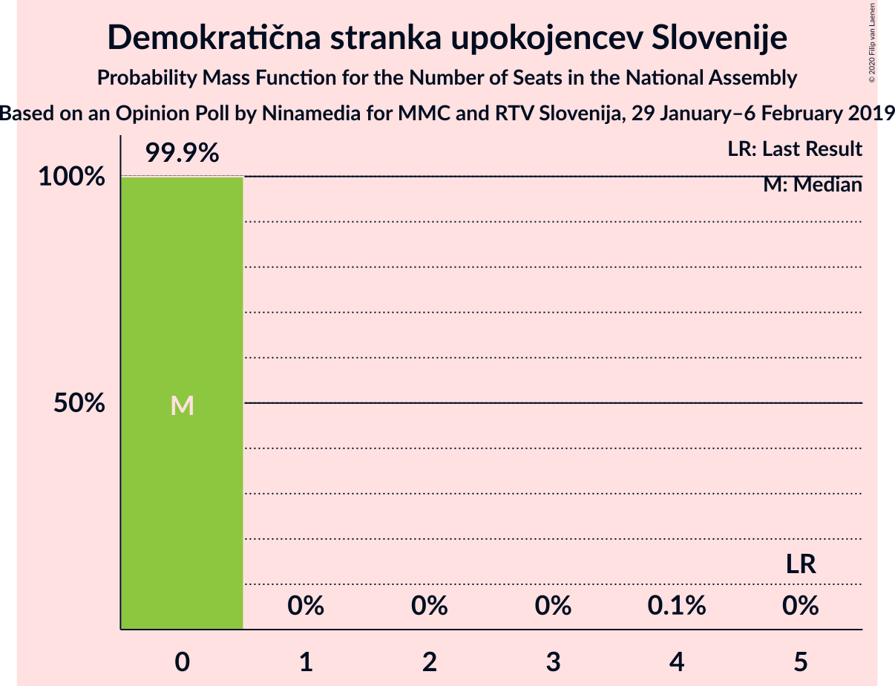
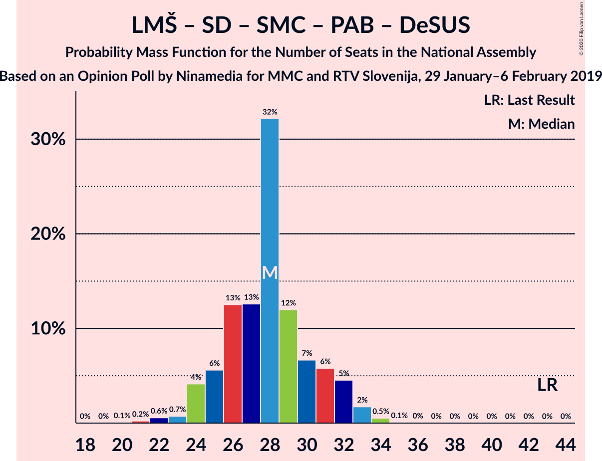
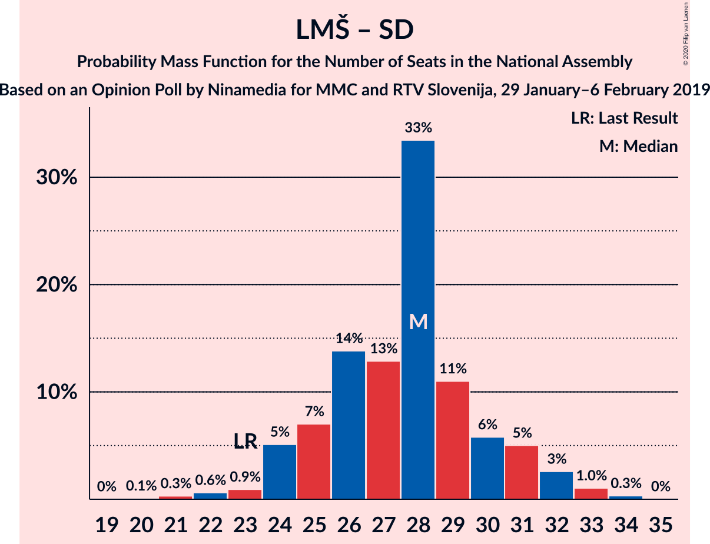

# Opinion Poll by Ninamedia for MMC and RTV Slovenija, 29 January–6 February 2019

<a href="#voting-intentions">Voting Intentions</a> | <a href="#seats">Seats</a> | <a href="#coalitions">Coalitions</a> | <a href="#technical-information">Technical Information</a>

## Voting Intentions

### Confidence Intervals

| Party | Last Result | Poll Result | 80% Confidence Interval | 90% Confidence Interval | 95% Confidence Interval | 99% Confidence Interval |
|:-----:|:-----------:|:-----------:|:-----------------------:|:-----------------------:|:-----------------------:|:-----------------------:|
| Lista Marjana Šarca | 12.6% | 22.4% | 20.4–24.7% |19.8–25.3% |19.3–25.8% |18.4–26.9% |
| Slovenska demokratska stranka | 24.9% | 15.1% | 13.4–17.1% |12.9–17.6% |12.5–18.1% |11.7–19.1% |
| Socialni demokrati | 9.9% | 5.7% | 4.7–7.1% |4.4–7.5% |4.2–7.8% |3.7–8.5% |
| Levica | 9.3% | 5.4% | 4.4–6.8% |4.1–7.1% |3.9–7.5% |3.5–8.2% |
| Nova Slovenija–Krščanski demokrati | 7.2% | 5.2% | 4.3–6.6% |4.0–7.0% |3.8–7.3% |3.3–8.0% |
| Stranka modernega centra | 9.7% | 2.7% | 2.0–3.7% |1.8–4.0% |1.7–4.3% |1.4–4.8% |
| Slovenska nacionalna stranka | 4.2% | 2.5% | 1.9–3.6% |1.7–3.8% |1.6–4.1% |1.3–4.6% |
| Stranka Alenke Bratušek | 5.1% | 2.4% | 1.8–3.4% |1.6–3.6% |1.4–3.9% |1.2–4.4% |
| Demokratična stranka upokojencev Slovenije | 4.9% | 1.7% | 1.2–2.6% |1.1–2.9% |1.0–3.1% |0.8–3.6% |
| Slovenska ljudska stranka | 2.6% | 1.4% | 1.0–2.3% |0.9–2.5% |0.8–2.7% |0.6–3.2% |

*Note:* The poll result column reflects the actual value used in the calculations. Published results may vary slightly, and in addition be rounded to fewer digits.

## Seats

### Confidence Intervals

| Party | Last Result | Median | 80% Confidence Interval | 90% Confidence Interval | 95% Confidence Interval | 99% Confidence Interval |
|:-----:|:-----------:|:------:|:-----------------------:|:-----------------------:|:-----------------------:|:-----------------------:|
| <a href="#lista-marjana-šarca">Lista Marjana Šarca</a> | 13 | 20 | 20–22 |19–22 |19–22 |19–22 |
| <a href="#slovenska-demokratska-stranka">Slovenska demokratska stranka</a> | 25 | 15 | 14–15 |14–15 |14–16 |13–20 |
| <a href="#socialni-demokrati">Socialni demokrati</a> | 10 | 6 | 6 |4–6 |4–6 |4–7 |
| <a href="#levica">Levica</a> | 9 | 6 | 5–6 |5–6 |4–6 |4–6 |
| <a href="#nova-slovenija–krščanski-demokrati">Nova Slovenija–Krščanski demokrati</a> | 7 | 5 | 4–5 |4–5 |4–5 |4–5 |
| <a href="#stranka-modernega-centra">Stranka modernega centra</a> | 10 | 0 | 0 |0–5 |0–5 |0–5 |
| <a href="#slovenska-nacionalna-stranka">Slovenska nacionalna stranka</a> | 4 | 0 | 0 |0 |0 |0–5 |
| <a href="#stranka-alenke-bratušek">Stranka Alenke Bratušek</a> | 5 | 0 | 0 |0 |0 |0 |
| <a href="#demokratična-stranka-upokojencev-slovenije">Demokratična stranka upokojencev Slovenije</a> | 5 | 0 | 0 |0 |0 |0 |
| <a href="#slovenska-ljudska-stranka">Slovenska ljudska stranka</a> | 0 | 0 | 0 |0 |0 |0 |

### Lista Marjana Šarca

*For a full overview of the results for this party, see the [Lista Marjana Šarca](party-listamarjanašarca.html) page.*

| Number of Seats | Probability | Accumulated | Special Marks |
|:---------------:|:-----------:|:-----------:|:-------------:|
| 13 | 0% | 100% | Last Result |
| 14 | 0% | 100% |  |
| 15 | 0% | 100% |  |
| 16 | 0% | 100% |  |
| 17 | 0% | 100% |  |
| 18 | 0.1% | 100% |  |
| 19 | 6% | 99.9% |  |
| 20 | 47% | 94% | Median |
| 21 | 0% | 47% |  |
| 22 | 46% | 47% |  |
| 23 | 0.4% | 0.4% |  |
| 24 | 0% | 0% |  |

### Slovenska demokratska stranka

*For a full overview of the results for this party, see the [Slovenska demokratska stranka](party-slovenskademokratskastranka.html) page.*

| Number of Seats | Probability | Accumulated | Special Marks |
|:---------------:|:-----------:|:-----------:|:-------------:|
| 12 | 0.1% | 100% |  |
| 13 | 1.0% | 99.9% |  |
| 14 | 45% | 98.9% |  |
| 15 | 51% | 54% | Median |
| 16 | 0.4% | 3% |  |
| 17 | 0% | 2% |  |
| 18 | 0% | 2% |  |
| 19 | 0.1% | 2% |  |
| 20 | 2% | 2% |  |
| 21 | 0.3% | 0.3% |  |
| 22 | 0% | 0% |  |
| 23 | 0% | 0% |  |
| 24 | 0% | 0% |  |
| 25 | 0% | 0% | Last Result |

### Socialni demokrati

*For a full overview of the results for this party, see the [Socialni demokrati](party-socialnidemokrati.html) page.*

| Number of Seats | Probability | Accumulated | Special Marks |
|:---------------:|:-----------:|:-----------:|:-------------:|
| 4 | 8% | 100% |  |
| 5 | 0.8% | 92% |  |
| 6 | 90% | 91% | Median |
| 7 | 0.7% | 0.7% |  |
| 8 | 0% | 0% |  |
| 9 | 0% | 0% |  |
| 10 | 0% | 0% | Last Result |

### Levica

*For a full overview of the results for this party, see the [Levica](party-levica.html) page.*

| Number of Seats | Probability | Accumulated | Special Marks |
|:---------------:|:-----------:|:-----------:|:-------------:|
| 4 | 4% | 100% |  |
| 5 | 45% | 96% |  |
| 6 | 52% | 52% | Median |
| 7 | 0% | 0% |  |
| 8 | 0% | 0% |  |
| 9 | 0% | 0% | Last Result |

### Nova Slovenija–Krščanski demokrati

*For a full overview of the results for this party, see the [Nova Slovenija–Krščanski demokrati](party-novaslovenija–krščanskidemokrati.html) page.*

| Number of Seats | Probability | Accumulated | Special Marks |
|:---------------:|:-----------:|:-----------:|:-------------:|
| 4 | 11% | 100% |  |
| 5 | 89% | 89% | Median |
| 6 | 0.4% | 0.4% |  |
| 7 | 0% | 0% | Last Result |

### Stranka modernega centra

*For a full overview of the results for this party, see the [Stranka modernega centra](party-strankamodernegacentra.html) page.*

| Number of Seats | Probability | Accumulated | Special Marks |
|:---------------:|:-----------:|:-----------:|:-------------:|
| 0 | 91% | 100% | Median |
| 1 | 0% | 9% |  |
| 2 | 0% | 9% |  |
| 3 | 0.1% | 9% |  |
| 4 | 4% | 9% |  |
| 5 | 5% | 5% |  |
| 6 | 0% | 0% |  |
| 7 | 0% | 0% |  |
| 8 | 0% | 0% |  |
| 9 | 0% | 0% |  |
| 10 | 0% | 0% | Last Result |

### Slovenska nacionalna stranka

*For a full overview of the results for this party, see the [Slovenska nacionalna stranka](party-slovenskanacionalnastranka.html) page.*

| Number of Seats | Probability | Accumulated | Special Marks |
|:---------------:|:-----------:|:-----------:|:-------------:|
| 0 | 98.5% | 100% | Median |
| 1 | 0% | 1.5% |  |
| 2 | 0% | 1.5% |  |
| 3 | 0% | 1.5% |  |
| 4 | 0.3% | 1.5% | Last Result |
| 5 | 1.1% | 1.1% |  |
| 6 | 0% | 0% |  |

### Stranka Alenke Bratušek

*For a full overview of the results for this party, see the [Stranka Alenke Bratušek](party-strankaalenkebratušek.html) page.*

| Number of Seats | Probability | Accumulated | Special Marks |
|:---------------:|:-----------:|:-----------:|:-------------:|
| 0 | 100% | 100% | Median |
| 1 | 0% | 0% |  |
| 2 | 0% | 0% |  |
| 3 | 0% | 0% |  |
| 4 | 0% | 0% |  |
| 5 | 0% | 0% | Last Result |

### Demokratična stranka upokojencev Slovenije

*For a full overview of the results for this party, see the [Demokratična stranka upokojencev Slovenije](party-demokratičnastrankaupokojencevslovenije.html) page.*

| Number of Seats | Probability | Accumulated | Special Marks |
|:---------------:|:-----------:|:-----------:|:-------------:|
| 0 | 100% | 100% | Median |
| 1 | 0% | 0% |  |
| 2 | 0% | 0% |  |
| 3 | 0% | 0% |  |
| 4 | 0% | 0% |  |
| 5 | 0% | 0% | Last Result |

### Slovenska ljudska stranka

*For a full overview of the results for this party, see the [Slovenska ljudska stranka](party-slovenskaljudskastranka.html) page.*

| Number of Seats | Probability | Accumulated | Special Marks |
|:---------------:|:-----------:|:-----------:|:-------------:|
| 0 | 100% | 100% | Last Result, Median |

## Coalitions

### Confidence Intervals

| Coalition | Last Result | Median | Majority? | 80% Confidence Interval | 90% Confidence Interval | 95% Confidence Interval | 99% Confidence Interval |
|:---------:|:-----------:|:------:|:---------:|:-----------------------:|:-----------------------:|:-----------------------:|:-----------------------:|
| Lista Marjana Šarca – Slovenska demokratska stranka – Demokratična stranka upokojencev Slovenije | 43 | 35 | 0% | 34–37 | 34–37 | 33–39 | 32–39 |
| Lista Marjana Šarca – Slovenska demokratska stranka | 38 | 35 | 0% | 34–37 | 34–37 | 33–39 | 32–39 |
| Lista Marjana Šarca – Socialni demokrati – Nova Slovenija–Krščanski demokrati – Stranka modernega centra – Stranka Alenke Bratušek – Demokratična stranka upokojencev Slovenije | 50 | 33 | 0% | 31–33 | 31–33 | 29–33 | 29–35 |
| Lista Marjana Šarca – Socialni demokrati – Nova Slovenija–Krščanski demokrati – Stranka modernega centra – Demokratična stranka upokojencev Slovenije | 45 | 33 | 0% | 31–33 | 31–33 | 29–33 | 29–35 |
| Lista Marjana Šarca – Socialni demokrati – Nova Slovenija–Krščanski demokrati – Stranka modernega centra | 40 | 33 | 0% | 31–33 | 31–33 | 29–33 | 29–35 |
| Lista Marjana Šarca – Socialni demokrati – Nova Slovenija–Krščanski demokrati – Demokratična stranka upokojencev Slovenije | 35 | 31 | 0% | 29–33 | 28–33 | 27–33 | 27–33 |
| Lista Marjana Šarca – Socialni demokrati – Nova Slovenija–Krščanski demokrati | 30 | 31 | 0% | 29–33 | 28–33 | 27–33 | 27–33 |
| Lista Marjana Šarca – Socialni demokrati – Stranka modernega centra – Stranka Alenke Bratušek – Demokratična stranka upokojencev Slovenije | 43 | 28 | 0% | 26–28 | 26–29 | 25–29 | 25–30 |
| Lista Marjana Šarca – Socialni demokrati – Stranka modernega centra – Demokratična stranka upokojencev Slovenije | 38 | 28 | 0% | 26–28 | 26–29 | 25–29 | 25–30 |
| Lista Marjana Šarca – Socialni demokrati – Stranka modernega centra | 33 | 28 | 0% | 26–28 | 26–29 | 25–29 | 25–30 |
| Lista Marjana Šarca – Socialni demokrati – Demokratična stranka upokojencev Slovenije | 28 | 26 | 0% | 25–28 | 24–28 | 23–28 | 23–28 |
| Lista Marjana Šarca – Socialni demokrati | 23 | 26 | 0% | 25–28 | 24–28 | 23–28 | 23–28 |
| Socialni demokrati – Stranka modernega centra – Demokratična stranka upokojencev Slovenije | 25 | 6 | 0% | 6 | 6–9 | 6–9 | 5–10 |

### Lista Marjana Šarca – Slovenska demokratska stranka – Demokratična stranka upokojencev Slovenije

| Number of Seats | Probability | Accumulated | Special Marks |
|:---------------:|:-----------:|:-----------:|:-------------:|
| 30 | 0.1% | 100% |  |
| 31 | 0% | 99.9% |  |
| 32 | 0.7% | 99.9% |  |
| 33 | 4% | 99.3% |  |
| 34 | 42% | 96% |  |
| 35 | 5% | 54% | Median |
| 36 | 0% | 49% |  |
| 37 | 46% | 49% |  |
| 38 | 0% | 3% |  |
| 39 | 2% | 3% |  |
| 40 | 0% | 0.3% |  |
| 41 | 0.3% | 0.3% |  |
| 42 | 0% | 0% |  |
| 43 | 0% | 0% | Last Result |

### Lista Marjana Šarca – Slovenska demokratska stranka

| Number of Seats | Probability | Accumulated | Special Marks |
|:---------------:|:-----------:|:-----------:|:-------------:|
| 30 | 0.1% | 100% |  |
| 31 | 0% | 99.9% |  |
| 32 | 0.7% | 99.9% |  |
| 33 | 4% | 99.3% |  |
| 34 | 42% | 96% |  |
| 35 | 5% | 54% | Median |
| 36 | 0% | 49% |  |
| 37 | 46% | 49% |  |
| 38 | 0% | 3% | Last Result |
| 39 | 2% | 3% |  |
| 40 | 0% | 0.3% |  |
| 41 | 0.3% | 0.3% |  |
| 42 | 0% | 0% |  |

### Lista Marjana Šarca – Socialni demokrati – Nova Slovenija–Krščanski demokrati – Stranka modernega centra – Stranka Alenke Bratušek – Demokratična stranka upokojencev Slovenije

| Number of Seats | Probability | Accumulated | Special Marks |
|:---------------:|:-----------:|:-----------:|:-------------:|
| 27 | 0.1% | 100% |  |
| 28 | 0.4% | 99.9% |  |
| 29 | 2% | 99.5% |  |
| 30 | 0% | 97% |  |
| 31 | 45% | 97% | Median |
| 32 | 0.1% | 52% |  |
| 33 | 51% | 52% |  |
| 34 | 0.1% | 0.8% |  |
| 35 | 0.3% | 0.7% |  |
| 36 | 0.4% | 0.4% |  |
| 37 | 0% | 0% |  |
| 38 | 0% | 0% |  |
| 39 | 0% | 0% |  |
| 40 | 0% | 0% |  |
| 41 | 0% | 0% |  |
| 42 | 0% | 0% |  |
| 43 | 0% | 0% |  |
| 44 | 0% | 0% |  |
| 45 | 0% | 0% |  |
| 46 | 0% | 0% | Majority |
| 47 | 0% | 0% |  |
| 48 | 0% | 0% |  |
| 49 | 0% | 0% |  |
| 50 | 0% | 0% | Last Result |

### Lista Marjana Šarca – Socialni demokrati – Nova Slovenija–Krščanski demokrati – Stranka modernega centra – Demokratična stranka upokojencev Slovenije

| Number of Seats | Probability | Accumulated | Special Marks |
|:---------------:|:-----------:|:-----------:|:-------------:|
| 27 | 0.1% | 100% |  |
| 28 | 0.4% | 99.9% |  |
| 29 | 2% | 99.5% |  |
| 30 | 0% | 97% |  |
| 31 | 45% | 97% | Median |
| 32 | 0.1% | 52% |  |
| 33 | 51% | 52% |  |
| 34 | 0.1% | 0.8% |  |
| 35 | 0.3% | 0.7% |  |
| 36 | 0.4% | 0.4% |  |
| 37 | 0% | 0% |  |
| 38 | 0% | 0% |  |
| 39 | 0% | 0% |  |
| 40 | 0% | 0% |  |
| 41 | 0% | 0% |  |
| 42 | 0% | 0% |  |
| 43 | 0% | 0% |  |
| 44 | 0% | 0% |  |
| 45 | 0% | 0% | Last Result |

### Lista Marjana Šarca – Socialni demokrati – Nova Slovenija–Krščanski demokrati – Stranka modernega centra

| Number of Seats | Probability | Accumulated | Special Marks |
|:---------------:|:-----------:|:-----------:|:-------------:|
| 27 | 0.1% | 100% |  |
| 28 | 0.4% | 99.9% |  |
| 29 | 2% | 99.5% |  |
| 30 | 0% | 97% |  |
| 31 | 45% | 97% | Median |
| 32 | 0.1% | 52% |  |
| 33 | 51% | 52% |  |
| 34 | 0.1% | 0.8% |  |
| 35 | 0.3% | 0.7% |  |
| 36 | 0.4% | 0.4% |  |
| 37 | 0% | 0% |  |
| 38 | 0% | 0% |  |
| 39 | 0% | 0% |  |
| 40 | 0% | 0% | Last Result |

### Lista Marjana Šarca – Socialni demokrati – Nova Slovenija–Krščanski demokrati – Demokratična stranka upokojencev Slovenije

| Number of Seats | Probability | Accumulated | Special Marks |
|:---------------:|:-----------:|:-----------:|:-------------:|
| 27 | 3% | 100% |  |
| 28 | 5% | 97% |  |
| 29 | 2% | 91% |  |
| 30 | 0% | 89% |  |
| 31 | 42% | 89% | Median |
| 32 | 0% | 47% |  |
| 33 | 46% | 47% |  |
| 34 | 0% | 0.4% |  |
| 35 | 0% | 0.4% | Last Result |
| 36 | 0.4% | 0.4% |  |
| 37 | 0% | 0% |  |

### Lista Marjana Šarca – Socialni demokrati – Nova Slovenija–Krščanski demokrati

| Number of Seats | Probability | Accumulated | Special Marks |
|:---------------:|:-----------:|:-----------:|:-------------:|
| 27 | 3% | 100% |  |
| 28 | 5% | 97% |  |
| 29 | 2% | 91% |  |
| 30 | 0% | 89% | Last Result |
| 31 | 42% | 89% | Median |
| 32 | 0% | 47% |  |
| 33 | 46% | 47% |  |
| 34 | 0% | 0.4% |  |
| 35 | 0% | 0.4% |  |
| 36 | 0.4% | 0.4% |  |
| 37 | 0% | 0% |  |

### Lista Marjana Šarca – Socialni demokrati – Stranka modernega centra – Stranka Alenke Bratušek – Demokratična stranka upokojencev Slovenije

| Number of Seats | Probability | Accumulated | Special Marks |
|:---------------:|:-----------:|:-----------:|:-------------:|
| 23 | 0.1% | 100% |  |
| 24 | 0.4% | 99.9% |  |
| 25 | 2% | 99.5% |  |
| 26 | 42% | 97% | Median |
| 27 | 3% | 55% |  |
| 28 | 46% | 52% |  |
| 29 | 5% | 6% |  |
| 30 | 0.7% | 0.8% |  |
| 31 | 0% | 0% |  |
| 32 | 0% | 0% |  |
| 33 | 0% | 0% |  |
| 34 | 0% | 0% |  |
| 35 | 0% | 0% |  |
| 36 | 0% | 0% |  |
| 37 | 0% | 0% |  |
| 38 | 0% | 0% |  |
| 39 | 0% | 0% |  |
| 40 | 0% | 0% |  |
| 41 | 0% | 0% |  |
| 42 | 0% | 0% |  |
| 43 | 0% | 0% | Last Result |

### Lista Marjana Šarca – Socialni demokrati – Stranka modernega centra – Demokratična stranka upokojencev Slovenije

| Number of Seats | Probability | Accumulated | Special Marks |
|:---------------:|:-----------:|:-----------:|:-------------:|
| 23 | 0.1% | 100% |  |
| 24 | 0.4% | 99.9% |  |
| 25 | 2% | 99.5% |  |
| 26 | 42% | 97% | Median |
| 27 | 3% | 55% |  |
| 28 | 46% | 52% |  |
| 29 | 5% | 6% |  |
| 30 | 0.8% | 0.8% |  |
| 31 | 0% | 0% |  |
| 32 | 0% | 0% |  |
| 33 | 0% | 0% |  |
| 34 | 0% | 0% |  |
| 35 | 0% | 0% |  |
| 36 | 0% | 0% |  |
| 37 | 0% | 0% |  |
| 38 | 0% | 0% | Last Result |

### Lista Marjana Šarca – Socialni demokrati – Stranka modernega centra

| Number of Seats | Probability | Accumulated | Special Marks |
|:---------------:|:-----------:|:-----------:|:-------------:|
| 23 | 0.1% | 100% |  |
| 24 | 0.4% | 99.9% |  |
| 25 | 2% | 99.5% |  |
| 26 | 42% | 97% | Median |
| 27 | 3% | 55% |  |
| 28 | 46% | 52% |  |
| 29 | 5% | 6% |  |
| 30 | 0.8% | 0.8% |  |
| 31 | 0% | 0% |  |
| 32 | 0% | 0% |  |
| 33 | 0% | 0% | Last Result |

### Lista Marjana Šarca – Socialni demokrati – Demokratična stranka upokojencev Slovenije

| Number of Seats | Probability | Accumulated | Special Marks |
|:---------------:|:-----------:|:-----------:|:-------------:|
| 23 | 3% | 100% |  |
| 24 | 5% | 97% |  |
| 25 | 2% | 91% |  |
| 26 | 42% | 89% | Median |
| 27 | 0% | 47% |  |
| 28 | 46% | 47% | Last Result |
| 29 | 0% | 0.4% |  |
| 30 | 0.4% | 0.4% |  |
| 31 | 0% | 0% |  |

### Lista Marjana Šarca – Socialni demokrati

| Number of Seats | Probability | Accumulated | Special Marks |
|:---------------:|:-----------:|:-----------:|:-------------:|
| 23 | 3% | 100% | Last Result |
| 24 | 5% | 97% |  |
| 25 | 2% | 91% |  |
| 26 | 42% | 89% | Median |
| 27 | 0% | 47% |  |
| 28 | 46% | 47% |  |
| 29 | 0% | 0.4% |  |
| 30 | 0.4% | 0.4% |  |
| 31 | 0% | 0% |  |

### Socialni demokrati – Stranka modernega centra – Demokratična stranka upokojencev Slovenije

| Number of Seats | Probability | Accumulated | Special Marks |
|:---------------:|:-----------:|:-----------:|:-------------:|
| 5 | 0.8% | 100% |  |
| 6 | 90% | 99.2% | Median |
| 7 | 0.4% | 9% |  |
| 8 | 3% | 9% |  |
| 9 | 5% | 5% |  |
| 10 | 0.1% | 0.5% |  |
| 11 | 0.4% | 0.4% |  |
| 12 | 0% | 0% |  |
| 13 | 0% | 0% |  |
| 14 | 0% | 0% |  |
| 15 | 0% | 0% |  |
| 16 | 0% | 0% |  |
| 17 | 0% | 0% |  |
| 18 | 0% | 0% |  |
| 19 | 0% | 0% |  |
| 20 | 0% | 0% |  |
| 21 | 0% | 0% |  |
| 22 | 0% | 0% |  |
| 23 | 0% | 0% |  |
| 24 | 0% | 0% |  |
| 25 | 0% | 0% | Last Result |

## Technical Information

### Opinion Poll

+ **Polling firm:** Ninamedia
+ **Commissioner(s):** MMC and RTV Slovenija
+ **Fieldwork period:** 29 January–6 February 2019

### Calculations

+ **Sample size:** 629
+ **Simulations done:** 1,024
+ **Error estimate:** 2.24%

