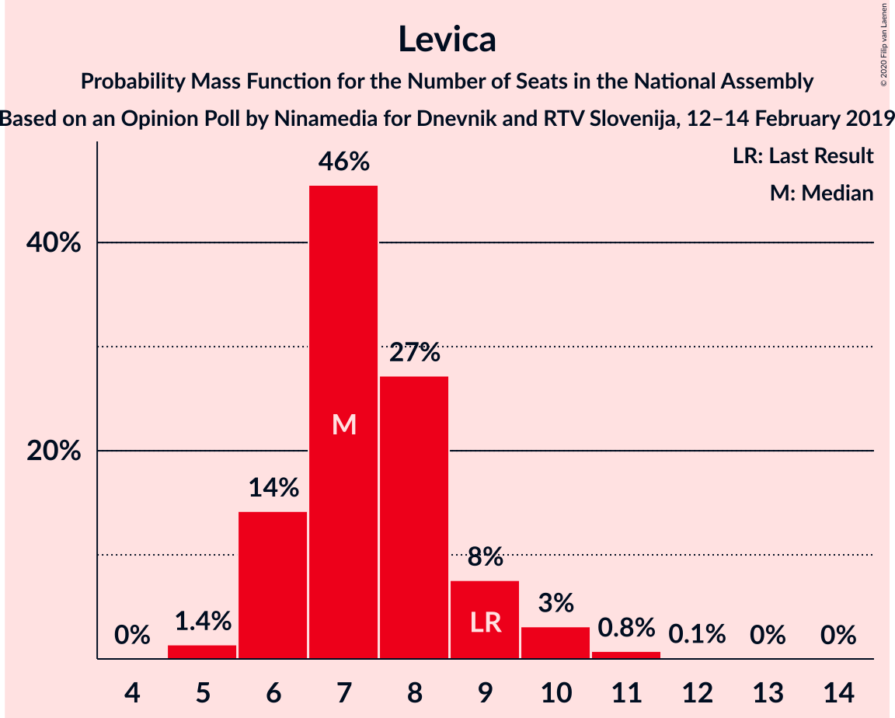
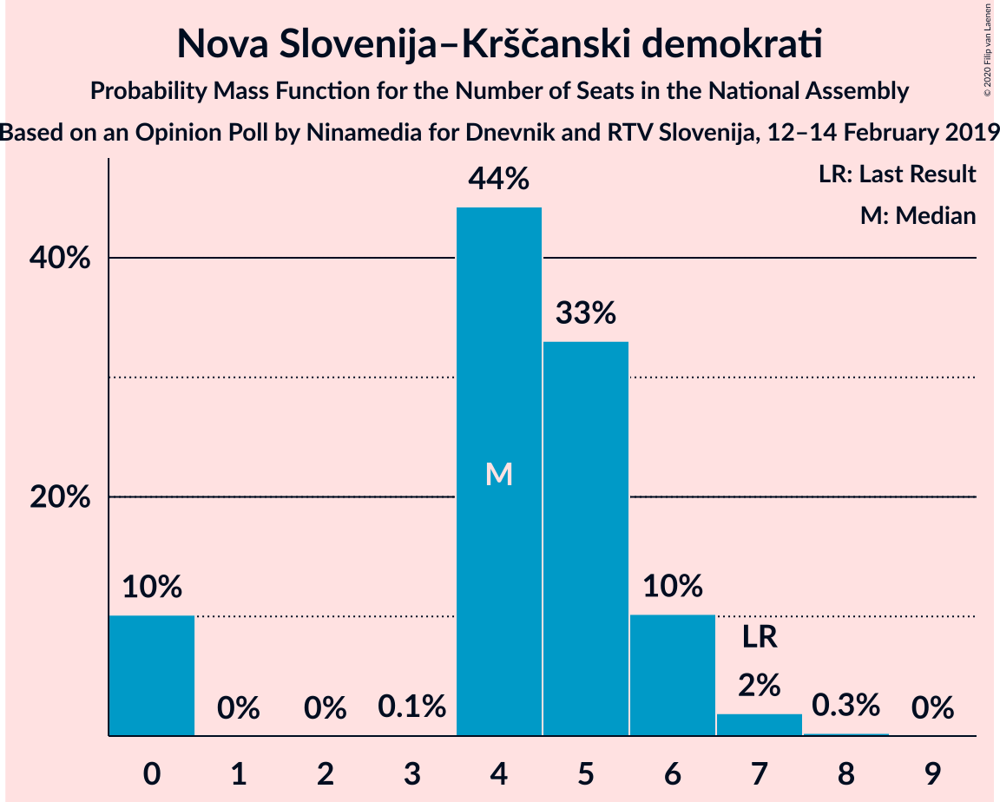
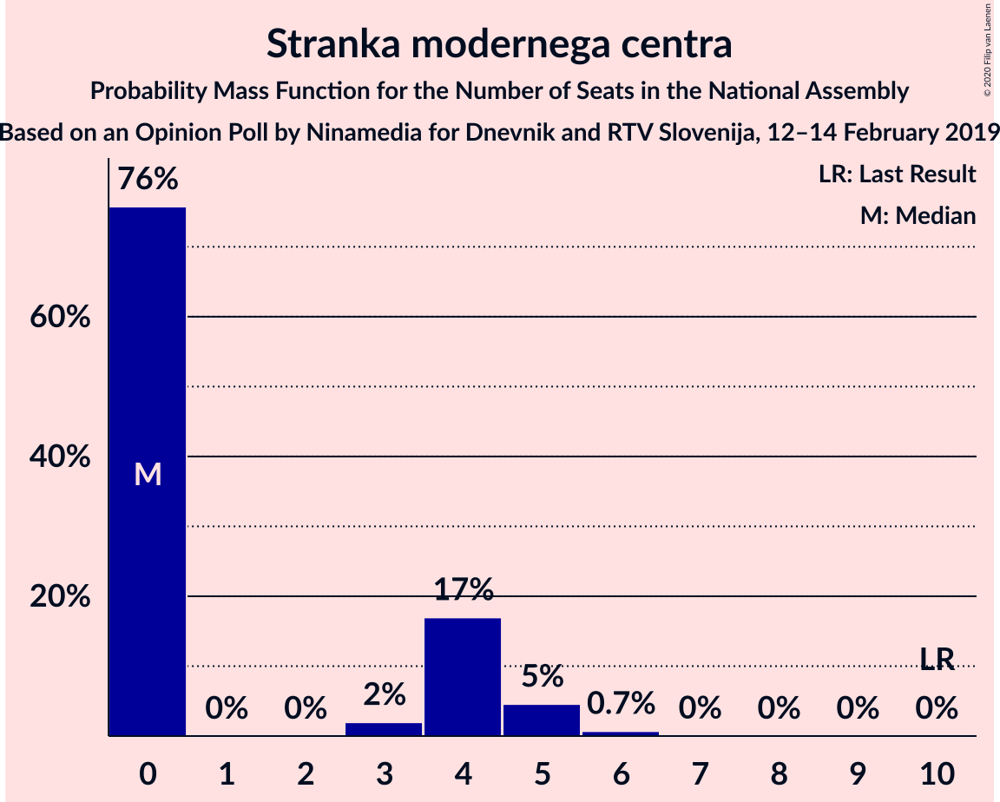
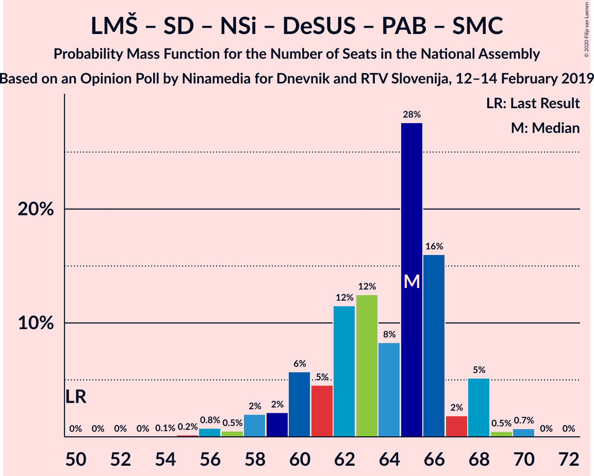
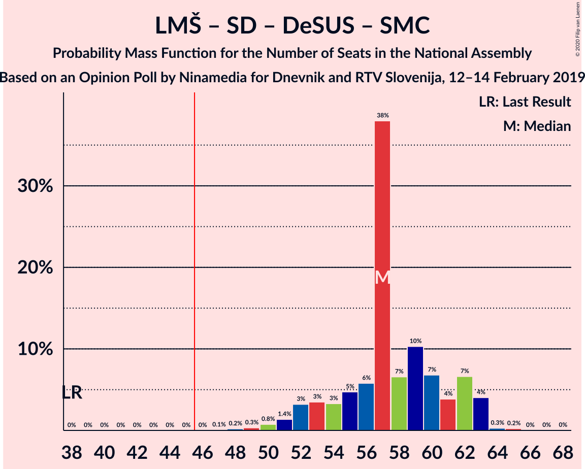

# Opinion Poll by Ninamedia for Dnevnik and RTV Slovenija, 12–14 February 2019

<a href="#voting-intentions">Voting Intentions</a> | <a href="#seats">Seats</a> | <a href="#coalitions">Coalitions</a> | <a href="#technical-information">Technical Information</a>

## Voting Intentions

### Confidence Intervals

| Party | Last Result | Poll Result | 80% Confidence Interval | 90% Confidence Interval | 95% Confidence Interval | 99% Confidence Interval |
|:-----:|:-----------:|:-----------:|:-----------------------:|:-----------------------:|:-----------------------:|:-----------------------:|
| Lista Marjana Šarca | 12.6% | 41.2% | 38.5–44.0% |37.7–44.8% |37.1–45.5% |35.8–46.8% |
| Slovenska demokratska stranka | 24.9% | 15.3% | 13.5–17.5% |12.9–18.1% |12.5–18.6% |11.6–19.7% |
| Socialni demokrati | 9.9% | 11.7% | 10.1–13.7% |9.6–14.3% |9.3–14.8% |8.5–15.7% |
| Levica | 9.3% | 8.1% | 6.8–9.9% |6.4–10.3% |6.1–10.8% |5.5–11.7% |
| Nova Slovenija–Krščanski demokrati | 7.2% | 5.1% | 4.1–6.6% |3.8–7.0% |3.5–7.3% |3.1–8.1% |
| Stranka Alenke Bratušek | 5.1% | 3.8% | 2.9–5.1% |2.7–5.4% |2.5–5.8% |2.1–6.5% |
| Demokratična stranka upokojencev Slovenije | 4.9% | 3.8% | 2.9–5.1% |2.7–5.4% |2.5–5.8% |2.1–6.5% |
| Stranka modernega centra | 9.7% | 3.6% | 2.7–4.9% |2.5–5.2% |2.3–5.5% |2.0–6.2% |
| Slovenska nacionalna stranka | 4.2% | 3.2% | 2.4–4.4% |2.2–4.8% |2.0–5.1% |1.7–5.7% |
| Slovenska ljudska stranka | 2.6% | 3.2% | 2.4–4.4% |2.2–4.8% |2.0–5.1% |1.7–5.7% |

*Note:* The poll result column reflects the actual value used in the calculations. Published results may vary slightly, and in addition be rounded to fewer digits.

## Seats

### Confidence Intervals

| Party | Last Result | Median | 80% Confidence Interval | 90% Confidence Interval | 95% Confidence Interval | 99% Confidence Interval |
|:-----:|:-----------:|:------:|:-----------------------:|:-----------------------:|:-----------------------:|:-----------------------:|
| <a href="#lista-marjana-šarca">Lista Marjana Šarca</a> | 13 | 44 | 39–47 |37–47 |37–49 |35–50 |
| <a href="#slovenska-demokratska-stranka">Slovenska demokratska stranka</a> | 25 | 16 | 13–17 |13–17 |12–18 |11–19 |
| <a href="#socialni-demokrati">Socialni demokrati</a> | 10 | 12 | 10–13 |9–14 |9–14 |8–15 |
| <a href="#levica">Levica</a> | 9 | 7 | 6–9 |6–9 |6–10 |5–11 |
| <a href="#nova-slovenija–krščanski-demokrati">Nova Slovenija–Krščanski demokrati</a> | 7 | 4 | 0–6 |0–6 |0–6 |0–7 |
| <a href="#stranka-alenke-bratušek">Stranka Alenke Bratušek</a> | 5 | 4 | 0–4 |0–5 |0–5 |0–6 |
| <a href="#demokratična-stranka-upokojencev-slovenije">Demokratična stranka upokojencev Slovenije</a> | 5 | 0 | 0–5 |0–5 |0–5 |0–6 |
| <a href="#stranka-modernega-centra">Stranka modernega centra</a> | 10 | 0 | 0–4 |0–5 |0–5 |0–6 |
| <a href="#slovenska-nacionalna-stranka">Slovenska nacionalna stranka</a> | 4 | 0 | 0–4 |0–4 |0–4 |0–4 |
| <a href="#slovenska-ljudska-stranka">Slovenska ljudska stranka</a> | 0 | 0 | 0–4 |0–4 |0–5 |0–5 |

### Lista Marjana Šarca

*For a full overview of the results for this party, see the [Lista Marjana Šarca](party-listamarjanašarca.html) page.*

| Number of Seats | Probability | Accumulated | Special Marks |
|:---------------:|:-----------:|:-----------:|:-------------:|
| 13 | 0% | 100% | Last Result |
| 14 | 0% | 100% |  |
| 15 | 0% | 100% |  |
| 16 | 0% | 100% |  |
| 17 | 0% | 100% |  |
| 18 | 0% | 100% |  |
| 19 | 0% | 100% |  |
| 20 | 0% | 100% |  |
| 21 | 0% | 100% |  |
| 22 | 0% | 100% |  |
| 23 | 0% | 100% |  |
| 24 | 0% | 100% |  |
| 25 | 0% | 100% |  |
| 26 | 0% | 100% |  |
| 27 | 0% | 100% |  |
| 28 | 0% | 100% |  |
| 29 | 0% | 100% |  |
| 30 | 0% | 100% |  |
| 31 | 0% | 100% |  |
| 32 | 0% | 100% |  |
| 33 | 0% | 100% |  |
| 34 | 0.1% | 99.9% |  |
| 35 | 0.7% | 99.8% |  |
| 36 | 1.2% | 99.1% |  |
| 37 | 4% | 98% |  |
| 38 | 3% | 94% |  |
| 39 | 5% | 91% |  |
| 40 | 7% | 86% |  |
| 41 | 12% | 79% |  |
| 42 | 10% | 66% |  |
| 43 | 4% | 56% |  |
| 44 | 3% | 53% | Median |
| 45 | 30% | 49% |  |
| 46 | 8% | 19% | Majority |
| 47 | 8% | 11% |  |
| 48 | 0.2% | 3% |  |
| 49 | 0.4% | 3% |  |
| 50 | 2% | 2% |  |
| 51 | 0% | 0% |  |

### Slovenska demokratska stranka

*For a full overview of the results for this party, see the [Slovenska demokratska stranka](party-slovenskademokratskastranka.html) page.*

| Number of Seats | Probability | Accumulated | Special Marks |
|:---------------:|:-----------:|:-----------:|:-------------:|
| 10 | 0.1% | 100% |  |
| 11 | 1.4% | 99.9% |  |
| 12 | 3% | 98% |  |
| 13 | 9% | 95% |  |
| 14 | 18% | 86% |  |
| 15 | 17% | 68% |  |
| 16 | 36% | 51% | Median |
| 17 | 10% | 15% |  |
| 18 | 3% | 5% |  |
| 19 | 1.5% | 2% |  |
| 20 | 0.2% | 0.4% |  |
| 21 | 0.2% | 0.2% |  |
| 22 | 0% | 0% |  |
| 23 | 0% | 0% |  |
| 24 | 0% | 0% |  |
| 25 | 0% | 0% | Last Result |

### Socialni demokrati

*For a full overview of the results for this party, see the [Socialni demokrati](party-socialnidemokrati.html) page.*

| Number of Seats | Probability | Accumulated | Special Marks |
|:---------------:|:-----------:|:-----------:|:-------------:|
| 7 | 0.1% | 100% |  |
| 8 | 2% | 99.9% |  |
| 9 | 4% | 98% |  |
| 10 | 12% | 94% | Last Result |
| 11 | 25% | 82% |  |
| 12 | 36% | 56% | Median |
| 13 | 12% | 20% |  |
| 14 | 7% | 9% |  |
| 15 | 1.4% | 2% |  |
| 16 | 0.4% | 0.5% |  |
| 17 | 0.1% | 0.1% |  |
| 18 | 0% | 0% |  |

### Levica

*For a full overview of the results for this party, see the [Levica](party-levica.html) page.*

| Number of Seats | Probability | Accumulated | Special Marks |
|:---------------:|:-----------:|:-----------:|:-------------:|
| 5 | 1.4% | 100% |  |
| 6 | 14% | 98.6% |  |
| 7 | 46% | 84% | Median |
| 8 | 27% | 39% |  |
| 9 | 8% | 12% | Last Result |
| 10 | 3% | 4% |  |
| 11 | 0.8% | 1.0% |  |
| 12 | 0.1% | 0.2% |  |
| 13 | 0% | 0.1% |  |
| 14 | 0% | 0% |  |

### Nova Slovenija–Krščanski demokrati

*For a full overview of the results for this party, see the [Nova Slovenija–Krščanski demokrati](party-novaslovenija–krščanskidemokrati.html) page.*

| Number of Seats | Probability | Accumulated | Special Marks |
|:---------------:|:-----------:|:-----------:|:-------------:|
| 0 | 10% | 100% |  |
| 1 | 0% | 90% |  |
| 2 | 0% | 90% |  |
| 3 | 0.1% | 90% |  |
| 4 | 44% | 90% | Median |
| 5 | 33% | 45% |  |
| 6 | 10% | 12% |  |
| 7 | 2% | 2% | Last Result |
| 8 | 0.3% | 0.3% |  |
| 9 | 0% | 0% |  |

### Stranka Alenke Bratušek

*For a full overview of the results for this party, see the [Stranka Alenke Bratušek](party-strankaalenkebratušek.html) page.*

| Number of Seats | Probability | Accumulated | Special Marks |
|:---------------:|:-----------:|:-----------:|:-------------:|
| 0 | 48% | 100% |  |
| 1 | 0% | 52% |  |
| 2 | 0% | 52% |  |
| 3 | 1.2% | 52% |  |
| 4 | 43% | 51% | Median |
| 5 | 7% | 8% | Last Result |
| 6 | 0.6% | 0.7% |  |
| 7 | 0.1% | 0.1% |  |
| 8 | 0% | 0% |  |

### Demokratična stranka upokojencev Slovenije

*For a full overview of the results for this party, see the [Demokratična stranka upokojencev Slovenije](party-demokratičnastrankaupokojencevslovenije.html) page.*

| Number of Seats | Probability | Accumulated | Special Marks |
|:---------------:|:-----------:|:-----------:|:-------------:|
| 0 | 60% | 100% | Median |
| 1 | 0% | 40% |  |
| 2 | 0% | 40% |  |
| 3 | 0.6% | 40% |  |
| 4 | 22% | 40% |  |
| 5 | 15% | 17% | Last Result |
| 6 | 2% | 2% |  |
| 7 | 0.1% | 0.1% |  |
| 8 | 0% | 0% |  |

### Stranka modernega centra

*For a full overview of the results for this party, see the [Stranka modernega centra](party-strankamodernegacentra.html) page.*

| Number of Seats | Probability | Accumulated | Special Marks |
|:---------------:|:-----------:|:-----------:|:-------------:|
| 0 | 76% | 100% | Median |
| 1 | 0% | 24% |  |
| 2 | 0% | 24% |  |
| 3 | 2% | 24% |  |
| 4 | 17% | 22% |  |
| 5 | 5% | 5% |  |
| 6 | 0.7% | 0.7% |  |
| 7 | 0% | 0% |  |
| 8 | 0% | 0% |  |
| 9 | 0% | 0% |  |
| 10 | 0% | 0% | Last Result |

### Slovenska nacionalna stranka

*For a full overview of the results for this party, see the [Slovenska nacionalna stranka](party-slovenskanacionalnastranka.html) page.*

| Number of Seats | Probability | Accumulated | Special Marks |
|:---------------:|:-----------:|:-----------:|:-------------:|
| 0 | 82% | 100% | Median |
| 1 | 0% | 18% |  |
| 2 | 0% | 18% |  |
| 3 | 0.3% | 18% |  |
| 4 | 17% | 18% | Last Result |
| 5 | 0.1% | 0.4% |  |
| 6 | 0.2% | 0.3% |  |
| 7 | 0% | 0% |  |

### Slovenska ljudska stranka

*For a full overview of the results for this party, see the [Slovenska ljudska stranka](party-slovenskaljudskastranka.html) page.*

| Number of Seats | Probability | Accumulated | Special Marks |
|:---------------:|:-----------:|:-----------:|:-------------:|
| 0 | 80% | 100% | Last Result, Median |
| 1 | 0% | 20% |  |
| 2 | 0% | 20% |  |
| 3 | 0.7% | 20% |  |
| 4 | 16% | 19% |  |
| 5 | 3% | 3% |  |
| 6 | 0.3% | 0.3% |  |
| 7 | 0% | 0% |  |

## Coalitions

### Confidence Intervals

| Coalition | Last Result | Median | Majority? | 80% Confidence Interval | 90% Confidence Interval | 95% Confidence Interval | 99% Confidence Interval |
|:---------:|:-----------:|:------:|:---------:|:-----------------------:|:-----------------------:|:-----------------------:|:-----------------------:|
| Lista Marjana Šarca – Socialni demokrati – Nova Slovenija–Krščanski demokrati – Demokratična stranka upokojencev Slovenije – Stranka Alenke Bratušek – Stranka modernega centra | 50 | 65 | 100% | 60–66 | 59–68 | 58–68 | 56–70 |
| Lista Marjana Šarca – Slovenska demokratska stranka – Demokratična stranka upokojencev Slovenije | 43 | 61 | 100% | 55–65 | 54–66 | 52–67 | 51–67 |
| Lista Marjana Šarca – Socialni demokrati – Nova Slovenija–Krščanski demokrati – Demokratična stranka upokojencev Slovenije – Stranka modernega centra | 45 | 62 | 100% | 58–66 | 57–66 | 56–66 | 54–68 |
| Lista Marjana Šarca – Socialni demokrati – Nova Slovenija–Krščanski demokrati – Demokratična stranka upokojencev Slovenije | 35 | 61 | 100% | 56–65 | 55–66 | 54–66 | 51–66 |
| Lista Marjana Šarca – Socialni demokrati – Nova Slovenija–Krščanski demokrati – Stranka modernega centra | 40 | 61 | 100% | 56–64 | 55–65 | 53–66 | 51–66 |
| Lista Marjana Šarca – Socialni demokrati – Nova Slovenija–Krščanski demokrati | 30 | 59 | 100% | 54–62 | 53–65 | 51–66 | 48–66 |
| Lista Marjana Šarca – Slovenska demokratska stranka | 38 | 59 | 100% | 53–62 | 52–63 | 51–65 | 49–65 |
| Lista Marjana Šarca – Socialni demokrati – Demokratična stranka upokojencev Slovenije – Stranka Alenke Bratušek – Stranka modernega centra | 43 | 61 | 100% | 56–63 | 54–63 | 53–64 | 51–65 |
| Lista Marjana Šarca – Socialni demokrati – Demokratična stranka upokojencev Slovenije – Stranka modernega centra | 38 | 57 | 100% | 54–62 | 52–62 | 51–63 | 49–64 |
| Lista Marjana Šarca – Socialni demokrati – Demokratična stranka upokojencev Slovenije | 28 | 57 | 99.9% | 52–61 | 50–62 | 49–63 | 47–63 |
| Lista Marjana Šarca – Socialni demokrati – Stranka modernega centra | 33 | 57 | 99.9% | 52–59 | 51–60 | 49–61 | 48–61 |
| Lista Marjana Šarca – Socialni demokrati | 23 | 55 | 99.5% | 50–59 | 49–60 | 48–60 | 45–61 |
| Socialni demokrati – Demokratična stranka upokojencev Slovenije – Stranka modernega centra | 25 | 14 | 0% | 12–18 | 11–19 | 10–21 | 9–23 |

### Lista Marjana Šarca – Socialni demokrati – Nova Slovenija–Krščanski demokrati – Demokratična stranka upokojencev Slovenije – Stranka Alenke Bratušek – Stranka modernega centra

| Number of Seats | Probability | Accumulated | Special Marks |
|:---------------:|:-----------:|:-----------:|:-------------:|
| 50 | 0% | 100% | Last Result |
| 51 | 0% | 100% |  |
| 52 | 0% | 100% |  |
| 53 | 0% | 100% |  |
| 54 | 0.1% | 100% |  |
| 55 | 0.2% | 99.9% |  |
| 56 | 0.8% | 99.8% |  |
| 57 | 0.5% | 99.0% |  |
| 58 | 2% | 98% |  |
| 59 | 2% | 97% |  |
| 60 | 6% | 94% |  |
| 61 | 5% | 89% |  |
| 62 | 12% | 84% |  |
| 63 | 12% | 73% |  |
| 64 | 8% | 60% | Median |
| 65 | 28% | 52% |  |
| 66 | 16% | 24% |  |
| 67 | 2% | 8% |  |
| 68 | 5% | 6% |  |
| 69 | 0.5% | 1.2% |  |
| 70 | 0.7% | 0.7% |  |
| 71 | 0% | 0% |  |

### Lista Marjana Šarca – Slovenska demokratska stranka – Demokratična stranka upokojencev Slovenije

| Number of Seats | Probability | Accumulated | Special Marks |
|:---------------:|:-----------:|:-----------:|:-------------:|
| 43 | 0% | 100% | Last Result |
| 44 | 0% | 100% |  |
| 45 | 0% | 100% |  |
| 46 | 0% | 100% | Majority |
| 47 | 0% | 100% |  |
| 48 | 0% | 100% |  |
| 49 | 0.2% | 100% |  |
| 50 | 0.2% | 99.8% |  |
| 51 | 0.5% | 99.5% |  |
| 52 | 2% | 99.0% |  |
| 53 | 2% | 97% |  |
| 54 | 3% | 95% |  |
| 55 | 3% | 93% |  |
| 56 | 6% | 89% |  |
| 57 | 4% | 83% |  |
| 58 | 8% | 80% |  |
| 59 | 3% | 72% |  |
| 60 | 8% | 69% | Median |
| 61 | 41% | 60% |  |
| 62 | 3% | 19% |  |
| 63 | 1.5% | 17% |  |
| 64 | 2% | 15% |  |
| 65 | 7% | 13% |  |
| 66 | 2% | 5% |  |
| 67 | 4% | 4% |  |
| 68 | 0.1% | 0.1% |  |
| 69 | 0% | 0% |  |

### Lista Marjana Šarca – Socialni demokrati – Nova Slovenija–Krščanski demokrati – Demokratična stranka upokojencev Slovenije – Stranka modernega centra

| Number of Seats | Probability | Accumulated | Special Marks |
|:---------------:|:-----------:|:-----------:|:-------------:|
| 45 | 0% | 100% | Last Result |
| 46 | 0% | 100% | Majority |
| 47 | 0% | 100% |  |
| 48 | 0% | 100% |  |
| 49 | 0% | 100% |  |
| 50 | 0% | 100% |  |
| 51 | 0% | 100% |  |
| 52 | 0.1% | 99.9% |  |
| 53 | 0.2% | 99.8% |  |
| 54 | 0.5% | 99.6% |  |
| 55 | 0.8% | 99.2% |  |
| 56 | 3% | 98% |  |
| 57 | 4% | 95% |  |
| 58 | 3% | 92% |  |
| 59 | 3% | 88% |  |
| 60 | 7% | 85% | Median |
| 61 | 28% | 78% |  |
| 62 | 16% | 51% |  |
| 63 | 13% | 34% |  |
| 64 | 7% | 21% |  |
| 65 | 4% | 15% |  |
| 66 | 9% | 11% |  |
| 67 | 2% | 2% |  |
| 68 | 0.4% | 0.6% |  |
| 69 | 0.1% | 0.2% |  |
| 70 | 0.1% | 0.1% |  |
| 71 | 0% | 0% |  |

### Lista Marjana Šarca – Socialni demokrati – Nova Slovenija–Krščanski demokrati – Demokratična stranka upokojencev Slovenije

| Number of Seats | Probability | Accumulated | Special Marks |
|:---------------:|:-----------:|:-----------:|:-------------:|
| 35 | 0% | 100% | Last Result |
| 36 | 0% | 100% |  |
| 37 | 0% | 100% |  |
| 38 | 0% | 100% |  |
| 39 | 0% | 100% |  |
| 40 | 0% | 100% |  |
| 41 | 0% | 100% |  |
| 42 | 0% | 100% |  |
| 43 | 0% | 100% |  |
| 44 | 0% | 100% |  |
| 45 | 0% | 100% |  |
| 46 | 0% | 100% | Majority |
| 47 | 0% | 100% |  |
| 48 | 0% | 100% |  |
| 49 | 0.1% | 100% |  |
| 50 | 0.1% | 99.9% |  |
| 51 | 0.5% | 99.7% |  |
| 52 | 0.7% | 99.3% |  |
| 53 | 1.0% | 98.6% |  |
| 54 | 1.3% | 98% |  |
| 55 | 1.3% | 96% |  |
| 56 | 7% | 95% |  |
| 57 | 6% | 88% |  |
| 58 | 4% | 83% |  |
| 59 | 7% | 78% |  |
| 60 | 7% | 71% | Median |
| 61 | 24% | 64% |  |
| 62 | 15% | 39% |  |
| 63 | 9% | 24% |  |
| 64 | 4% | 15% |  |
| 65 | 3% | 11% |  |
| 66 | 8% | 8% |  |
| 67 | 0.2% | 0.4% |  |
| 68 | 0.2% | 0.2% |  |
| 69 | 0% | 0% |  |

### Lista Marjana Šarca – Socialni demokrati – Nova Slovenija–Krščanski demokrati – Stranka modernega centra

| Number of Seats | Probability | Accumulated | Special Marks |
|:---------------:|:-----------:|:-----------:|:-------------:|
| 40 | 0% | 100% | Last Result |
| 41 | 0% | 100% |  |
| 42 | 0% | 100% |  |
| 43 | 0% | 100% |  |
| 44 | 0% | 100% |  |
| 45 | 0% | 100% |  |
| 46 | 0% | 100% | Majority |
| 47 | 0% | 100% |  |
| 48 | 0% | 100% |  |
| 49 | 0.1% | 100% |  |
| 50 | 0.1% | 99.9% |  |
| 51 | 0.7% | 99.8% |  |
| 52 | 0.6% | 99.1% |  |
| 53 | 2% | 98.5% |  |
| 54 | 1.1% | 97% |  |
| 55 | 2% | 96% |  |
| 56 | 6% | 94% |  |
| 57 | 12% | 88% |  |
| 58 | 8% | 76% |  |
| 59 | 8% | 68% |  |
| 60 | 8% | 60% | Median |
| 61 | 25% | 53% |  |
| 62 | 13% | 28% |  |
| 63 | 4% | 14% |  |
| 64 | 4% | 10% |  |
| 65 | 2% | 6% |  |
| 66 | 3% | 3% |  |
| 67 | 0.2% | 0.5% |  |
| 68 | 0.3% | 0.3% |  |
| 69 | 0% | 0% |  |

### Lista Marjana Šarca – Socialni demokrati – Nova Slovenija–Krščanski demokrati

| Number of Seats | Probability | Accumulated | Special Marks |
|:---------------:|:-----------:|:-----------:|:-------------:|
| 30 | 0% | 100% | Last Result |
| 31 | 0% | 100% |  |
| 32 | 0% | 100% |  |
| 33 | 0% | 100% |  |
| 34 | 0% | 100% |  |
| 35 | 0% | 100% |  |
| 36 | 0% | 100% |  |
| 37 | 0% | 100% |  |
| 38 | 0% | 100% |  |
| 39 | 0% | 100% |  |
| 40 | 0% | 100% |  |
| 41 | 0% | 100% |  |
| 42 | 0% | 100% |  |
| 43 | 0% | 100% |  |
| 44 | 0% | 100% |  |
| 45 | 0% | 100% |  |
| 46 | 0% | 100% | Majority |
| 47 | 0% | 100% |  |
| 48 | 0.5% | 99.9% |  |
| 49 | 0.3% | 99.5% |  |
| 50 | 0.3% | 99.1% |  |
| 51 | 2% | 98.8% |  |
| 52 | 1.0% | 97% |  |
| 53 | 3% | 96% |  |
| 54 | 3% | 93% |  |
| 55 | 3% | 89% |  |
| 56 | 11% | 87% |  |
| 57 | 11% | 76% |  |
| 58 | 8% | 65% |  |
| 59 | 9% | 56% |  |
| 60 | 5% | 47% | Median |
| 61 | 22% | 42% |  |
| 62 | 12% | 20% |  |
| 63 | 0.7% | 8% |  |
| 64 | 2% | 7% |  |
| 65 | 2% | 5% |  |
| 66 | 3% | 3% |  |
| 67 | 0.1% | 0.2% |  |
| 68 | 0.2% | 0.2% |  |
| 69 | 0% | 0% |  |

### Lista Marjana Šarca – Slovenska demokratska stranka

| Number of Seats | Probability | Accumulated | Special Marks |
|:---------------:|:-----------:|:-----------:|:-------------:|
| 38 | 0% | 100% | Last Result |
| 39 | 0% | 100% |  |
| 40 | 0% | 100% |  |
| 41 | 0% | 100% |  |
| 42 | 0% | 100% |  |
| 43 | 0% | 100% |  |
| 44 | 0% | 100% |  |
| 45 | 0% | 100% |  |
| 46 | 0% | 100% | Majority |
| 47 | 0% | 100% |  |
| 48 | 0.3% | 99.9% |  |
| 49 | 0.7% | 99.6% |  |
| 50 | 0.6% | 98.9% |  |
| 51 | 2% | 98% |  |
| 52 | 3% | 96% |  |
| 53 | 4% | 93% |  |
| 54 | 7% | 89% |  |
| 55 | 4% | 83% |  |
| 56 | 16% | 79% |  |
| 57 | 4% | 62% |  |
| 58 | 6% | 59% |  |
| 59 | 2% | 52% |  |
| 60 | 6% | 50% | Median |
| 61 | 33% | 44% |  |
| 62 | 2% | 11% |  |
| 63 | 5% | 9% |  |
| 64 | 1.3% | 4% |  |
| 65 | 2% | 3% |  |
| 66 | 0.1% | 0.1% |  |
| 67 | 0% | 0.1% |  |
| 68 | 0% | 0.1% |  |
| 69 | 0% | 0% |  |

### Lista Marjana Šarca – Socialni demokrati – Demokratična stranka upokojencev Slovenije – Stranka Alenke Bratušek – Stranka modernega centra

| Number of Seats | Probability | Accumulated | Special Marks |
|:---------------:|:-----------:|:-----------:|:-------------:|
| 43 | 0% | 100% | Last Result |
| 44 | 0% | 100% |  |
| 45 | 0% | 100% |  |
| 46 | 0% | 100% | Majority |
| 47 | 0% | 100% |  |
| 48 | 0% | 100% |  |
| 49 | 0% | 100% |  |
| 50 | 0.1% | 100% |  |
| 51 | 0.5% | 99.9% |  |
| 52 | 0.4% | 99.4% |  |
| 53 | 2% | 99.0% |  |
| 54 | 2% | 97% |  |
| 55 | 2% | 95% |  |
| 56 | 4% | 92% |  |
| 57 | 11% | 88% |  |
| 58 | 4% | 77% |  |
| 59 | 12% | 73% |  |
| 60 | 9% | 61% | Median |
| 61 | 32% | 51% |  |
| 62 | 9% | 19% |  |
| 63 | 8% | 11% |  |
| 64 | 2% | 3% |  |
| 65 | 1.2% | 1.4% |  |
| 66 | 0.1% | 0.2% |  |
| 67 | 0% | 0.1% |  |
| 68 | 0.1% | 0.1% |  |
| 69 | 0% | 0% |  |

### Lista Marjana Šarca – Socialni demokrati – Demokratična stranka upokojencev Slovenije – Stranka modernega centra

| Number of Seats | Probability | Accumulated | Special Marks |
|:---------------:|:-----------:|:-----------:|:-------------:|
| 38 | 0% | 100% | Last Result |
| 39 | 0% | 100% |  |
| 40 | 0% | 100% |  |
| 41 | 0% | 100% |  |
| 42 | 0% | 100% |  |
| 43 | 0% | 100% |  |
| 44 | 0% | 100% |  |
| 45 | 0% | 100% |  |
| 46 | 0% | 100% | Majority |
| 47 | 0.1% | 100% |  |
| 48 | 0.2% | 99.9% |  |
| 49 | 0.3% | 99.7% |  |
| 50 | 0.8% | 99.4% |  |
| 51 | 1.4% | 98.6% |  |
| 52 | 3% | 97% |  |
| 53 | 3% | 94% |  |
| 54 | 3% | 91% |  |
| 55 | 5% | 87% |  |
| 56 | 6% | 83% | Median |
| 57 | 38% | 77% |  |
| 58 | 7% | 39% |  |
| 59 | 10% | 32% |  |
| 60 | 7% | 22% |  |
| 61 | 4% | 15% |  |
| 62 | 7% | 11% |  |
| 63 | 4% | 5% |  |
| 64 | 0.3% | 0.6% |  |
| 65 | 0.2% | 0.3% |  |
| 66 | 0% | 0.1% |  |
| 67 | 0% | 0% |  |

### Lista Marjana Šarca – Socialni demokrati – Demokratična stranka upokojencev Slovenije

| Number of Seats | Probability | Accumulated | Special Marks |
|:---------------:|:-----------:|:-----------:|:-------------:|
| 28 | 0% | 100% | Last Result |
| 29 | 0% | 100% |  |
| 30 | 0% | 100% |  |
| 31 | 0% | 100% |  |
| 32 | 0% | 100% |  |
| 33 | 0% | 100% |  |
| 34 | 0% | 100% |  |
| 35 | 0% | 100% |  |
| 36 | 0% | 100% |  |
| 37 | 0% | 100% |  |
| 38 | 0% | 100% |  |
| 39 | 0% | 100% |  |
| 40 | 0% | 100% |  |
| 41 | 0% | 100% |  |
| 42 | 0% | 100% |  |
| 43 | 0% | 100% |  |
| 44 | 0% | 100% |  |
| 45 | 0% | 100% |  |
| 46 | 0.2% | 99.9% | Majority |
| 47 | 0.5% | 99.8% |  |
| 48 | 0.7% | 99.3% |  |
| 49 | 1.3% | 98.5% |  |
| 50 | 3% | 97% |  |
| 51 | 4% | 95% |  |
| 52 | 5% | 91% |  |
| 53 | 6% | 86% |  |
| 54 | 3% | 80% |  |
| 55 | 8% | 77% |  |
| 56 | 4% | 68% | Median |
| 57 | 36% | 64% |  |
| 58 | 4% | 28% |  |
| 59 | 6% | 24% |  |
| 60 | 5% | 18% |  |
| 61 | 3% | 12% |  |
| 62 | 5% | 9% |  |
| 63 | 4% | 4% |  |
| 64 | 0.1% | 0.1% |  |
| 65 | 0% | 0% |  |

### Lista Marjana Šarca – Socialni demokrati – Stranka modernega centra

| Number of Seats | Probability | Accumulated | Special Marks |
|:---------------:|:-----------:|:-----------:|:-------------:|
| 33 | 0% | 100% | Last Result |
| 34 | 0% | 100% |  |
| 35 | 0% | 100% |  |
| 36 | 0% | 100% |  |
| 37 | 0% | 100% |  |
| 38 | 0% | 100% |  |
| 39 | 0% | 100% |  |
| 40 | 0% | 100% |  |
| 41 | 0% | 100% |  |
| 42 | 0% | 100% |  |
| 43 | 0% | 100% |  |
| 44 | 0% | 100% |  |
| 45 | 0% | 100% |  |
| 46 | 0.1% | 99.9% | Majority |
| 47 | 0.3% | 99.9% |  |
| 48 | 1.1% | 99.6% |  |
| 49 | 1.2% | 98% |  |
| 50 | 2% | 97% |  |
| 51 | 3% | 96% |  |
| 52 | 12% | 92% |  |
| 53 | 5% | 81% |  |
| 54 | 8% | 75% |  |
| 55 | 7% | 67% |  |
| 56 | 6% | 61% | Median |
| 57 | 30% | 54% |  |
| 58 | 9% | 24% |  |
| 59 | 8% | 16% |  |
| 60 | 4% | 7% |  |
| 61 | 3% | 3% |  |
| 62 | 0.2% | 0.3% |  |
| 63 | 0.1% | 0.1% |  |
| 64 | 0% | 0% |  |

### Lista Marjana Šarca – Socialni demokrati

| Number of Seats | Probability | Accumulated | Special Marks |
|:---------------:|:-----------:|:-----------:|:-------------:|
| 23 | 0% | 100% | Last Result |
| 24 | 0% | 100% |  |
| 25 | 0% | 100% |  |
| 26 | 0% | 100% |  |
| 27 | 0% | 100% |  |
| 28 | 0% | 100% |  |
| 29 | 0% | 100% |  |
| 30 | 0% | 100% |  |
| 31 | 0% | 100% |  |
| 32 | 0% | 100% |  |
| 33 | 0% | 100% |  |
| 34 | 0% | 100% |  |
| 35 | 0% | 100% |  |
| 36 | 0% | 100% |  |
| 37 | 0% | 100% |  |
| 38 | 0% | 100% |  |
| 39 | 0% | 100% |  |
| 40 | 0% | 100% |  |
| 41 | 0% | 100% |  |
| 42 | 0% | 100% |  |
| 43 | 0% | 100% |  |
| 44 | 0.3% | 100% |  |
| 45 | 0.2% | 99.7% |  |
| 46 | 0.4% | 99.5% | Majority |
| 47 | 1.0% | 99.0% |  |
| 48 | 3% | 98% |  |
| 49 | 4% | 95% |  |
| 50 | 4% | 92% |  |
| 51 | 8% | 88% |  |
| 52 | 13% | 80% |  |
| 53 | 5% | 68% |  |
| 54 | 7% | 63% |  |
| 55 | 8% | 56% |  |
| 56 | 3% | 49% | Median |
| 57 | 29% | 46% |  |
| 58 | 7% | 17% |  |
| 59 | 4% | 10% |  |
| 60 | 4% | 6% |  |
| 61 | 2% | 2% |  |
| 62 | 0% | 0.1% |  |
| 63 | 0% | 0% |  |

### Socialni demokrati – Demokratična stranka upokojencev Slovenije – Stranka modernega centra

| Number of Seats | Probability | Accumulated | Special Marks |
|:---------------:|:-----------:|:-----------:|:-------------:|
| 8 | 0.3% | 100% |  |
| 9 | 0.6% | 99.6% |  |
| 10 | 2% | 99.1% |  |
| 11 | 7% | 97% |  |
| 12 | 30% | 90% | Median |
| 13 | 4% | 60% |  |
| 14 | 9% | 57% |  |
| 15 | 13% | 48% |  |
| 16 | 8% | 35% |  |
| 17 | 14% | 27% |  |
| 18 | 6% | 13% |  |
| 19 | 3% | 7% |  |
| 20 | 1.3% | 4% |  |
| 21 | 2% | 3% |  |
| 22 | 0.4% | 1.0% |  |
| 23 | 0.5% | 0.6% |  |
| 24 | 0.1% | 0.1% |  |
| 25 | 0% | 0% | Last Result |

## Technical Information

### Opinion Poll

+ **Polling firm:** Ninamedia
+ **Commissioner(s):** Dnevnik and RTV Slovenija
+ **Fieldwork period:** 12–14 February 2019

### Calculations

+ **Sample size:** 529
+ **Simulations done:** 1,048,576
+ **Error estimate:** 1.69%

