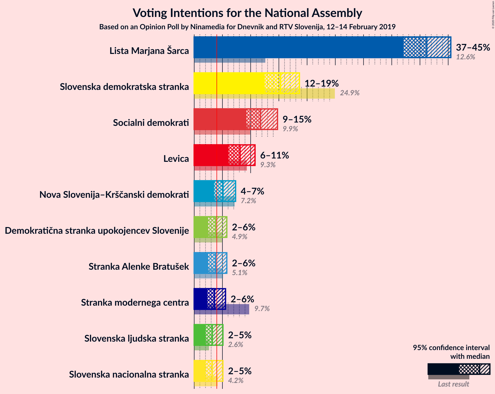
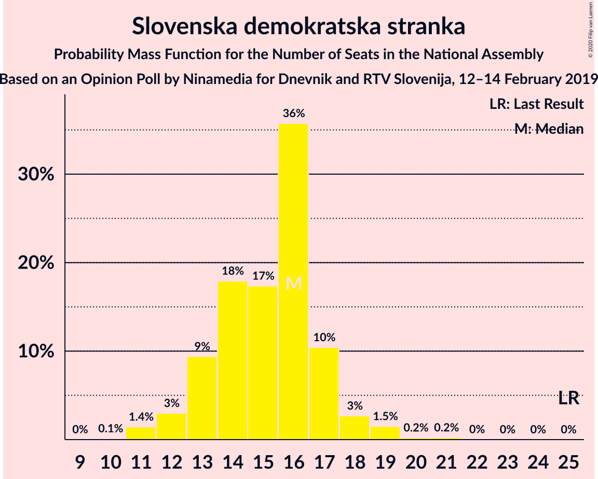
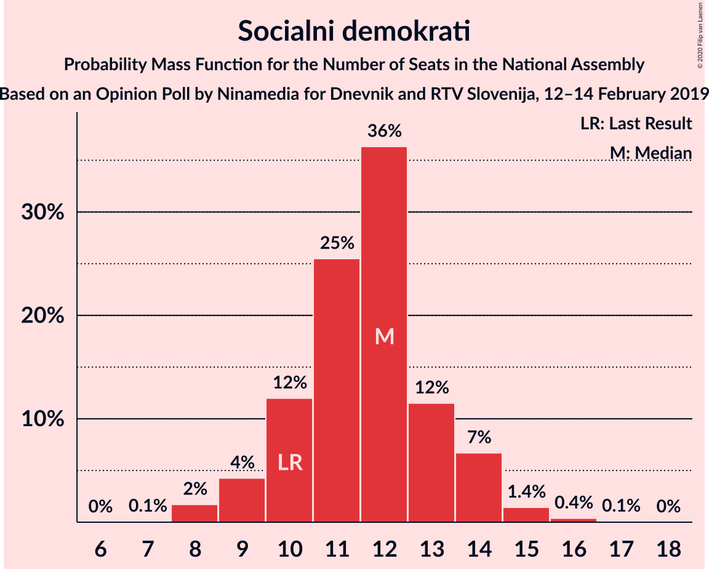
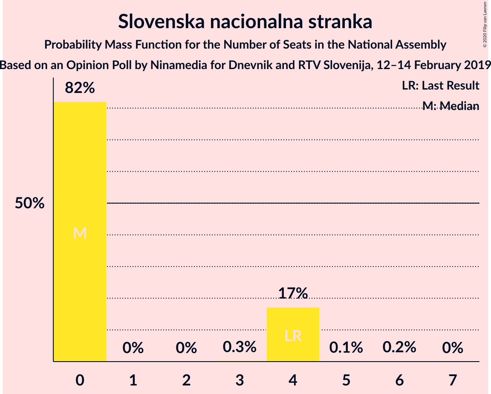
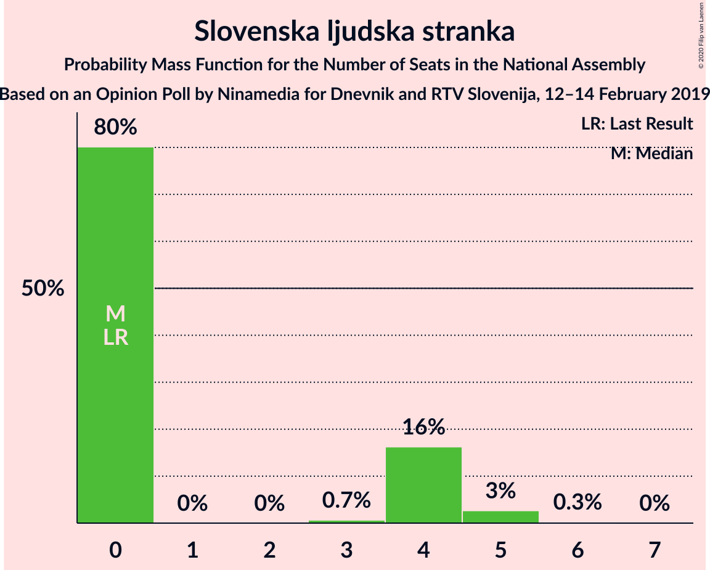
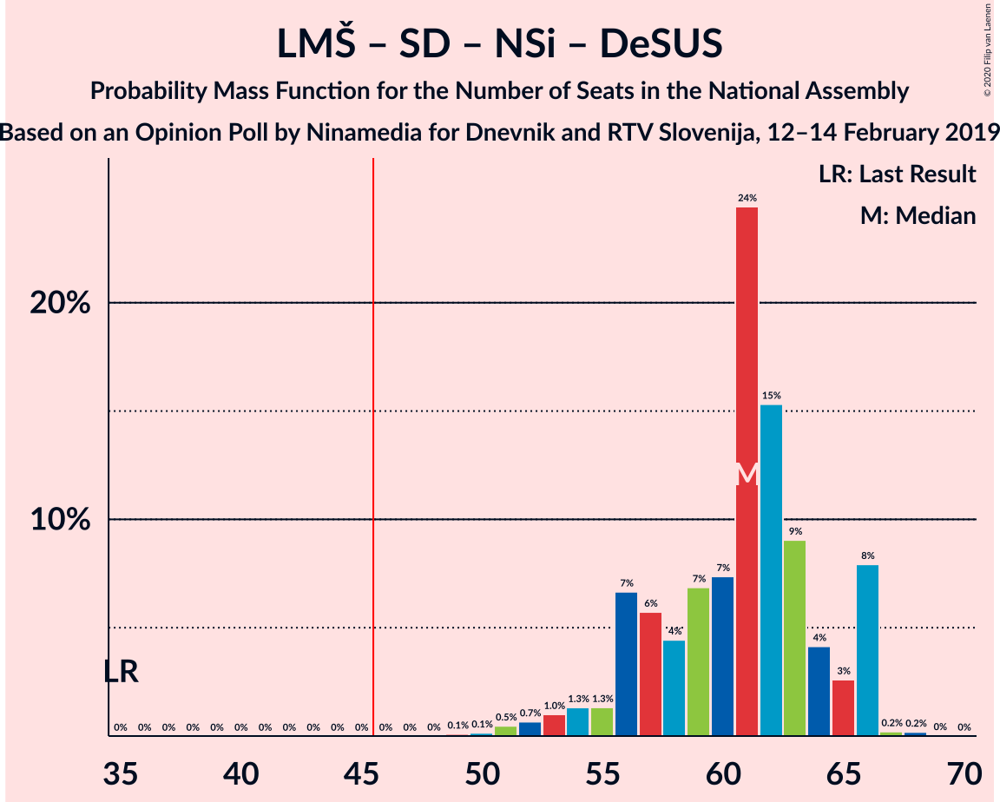
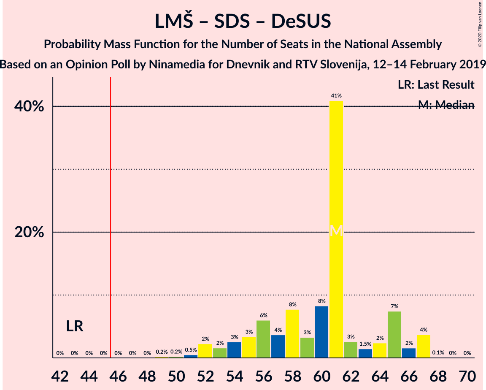
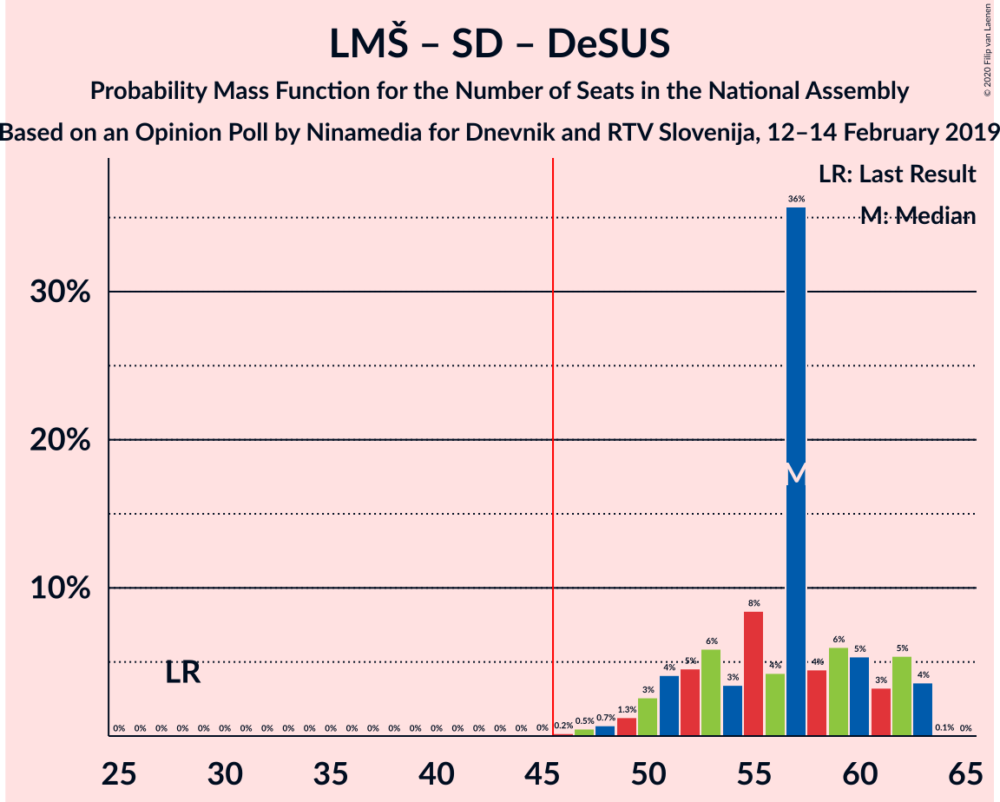

# Opinion Poll by Ninamedia for MMC and RTV Slovenija, 12–14 February 2019

<a href="#voting-intentions">Voting Intentions</a> | <a href="#seats">Seats</a> | <a href="#coalitions">Coalitions</a> | <a href="#technical-information">Technical Information</a>

## Voting Intentions

### Confidence Intervals

| Party | Last Result | Poll Result | 80% Confidence Interval | 90% Confidence Interval | 95% Confidence Interval | 99% Confidence Interval |
|:-----:|:-----------:|:-----------:|:-----------------------:|:-----------------------:|:-----------------------:|:-----------------------:|
| Lista Marjana Šarca | 12.6% | 41.2% | 38.5–44.0% |37.7–44.8% |37.1–45.5% |35.8–46.8% |
| Slovenska demokratska stranka | 24.9% | 15.3% | 13.5–17.5% |12.9–18.1% |12.5–18.6% |11.6–19.7% |
| Socialni demokrati | 9.9% | 11.7% | 10.1–13.7% |9.6–14.3% |9.3–14.8% |8.5–15.7% |
| Levica | 9.3% | 8.1% | 6.8–9.9% |6.4–10.3% |6.1–10.8% |5.5–11.7% |
| Nova Slovenija–Krščanski demokrati | 7.2% | 5.1% | 4.1–6.6% |3.8–7.0% |3.5–7.3% |3.1–8.1% |
| Stranka Alenke Bratušek | 5.1% | 3.8% | 2.9–5.1% |2.7–5.4% |2.5–5.8% |2.1–6.5% |
| Demokratična stranka upokojencev Slovenije | 4.9% | 3.8% | 2.9–5.1% |2.7–5.4% |2.5–5.8% |2.1–6.5% |
| Stranka modernega centra | 9.7% | 3.6% | 2.7–4.9% |2.5–5.2% |2.3–5.5% |2.0–6.2% |
| Slovenska nacionalna stranka | 4.2% | 3.2% | 2.4–4.4% |2.2–4.8% |2.0–5.1% |1.7–5.7% |
| Slovenska ljudska stranka | 2.6% | 3.2% | 2.4–4.4% |2.2–4.8% |2.0–5.1% |1.7–5.7% |

*Note:* The poll result column reflects the actual value used in the calculations. Published results may vary slightly, and in addition be rounded to fewer digits.

## Seats

### Confidence Intervals

| Party | Last Result | Median | 80% Confidence Interval | 90% Confidence Interval | 95% Confidence Interval | 99% Confidence Interval |
|:-----:|:-----------:|:------:|:-----------------------:|:-----------------------:|:-----------------------:|:-----------------------:|
| <a href="#lista-marjana-šarca">Lista Marjana Šarca</a> | 13 | 40 | 37–44 |36–45 |35–46 |34–47 |
| <a href="#slovenska-demokratska-stranka">Slovenska demokratska stranka</a> | 25 | 15 | 13–18 |12–19 |12–21 |11–21 |
| <a href="#socialni-demokrati">Socialni demokrati</a> | 10 | 14 | 11–14 |10–15 |9–16 |8–17 |
| <a href="#levica">Levica</a> | 9 | 8 | 7–10 |6–11 |6–11 |5–12 |
| <a href="#nova-slovenija–krščanski-demokrati">Nova Slovenija–Krščanski demokrati</a> | 7 | 5 | 4–6 |0–7 |0–7 |0–8 |
| <a href="#stranka-alenke-bratušek">Stranka Alenke Bratušek</a> | 5 | 4 | 0–5 |0–5 |0–5 |0–6 |
| <a href="#demokratična-stranka-upokojencev-slovenije">Demokratična stranka upokojencev Slovenije</a> | 5 | 0 | 0–4 |0–4 |0–5 |0–6 |
| <a href="#stranka-modernega-centra">Stranka modernega centra</a> | 10 | 0 | 0–4 |0–5 |0–5 |0–6 |
| <a href="#slovenska-nacionalna-stranka">Slovenska nacionalna stranka</a> | 4 | 0 | 0–4 |0–4 |0–4 |0–5 |
| <a href="#slovenska-ljudska-stranka">Slovenska ljudska stranka</a> | 0 | 0 | 0–4 |0–4 |0–5 |0–5 |

### Lista Marjana Šarca

*For a full overview of the results for this party, see the [Lista Marjana Šarca](party-listamarjanašarca.html) page.*

| Number of Seats | Probability | Accumulated | Special Marks |
|:---------------:|:-----------:|:-----------:|:-------------:|
| 13 | 0% | 100% | Last Result |
| 14 | 0% | 100% |  |
| 15 | 0% | 100% |  |
| 16 | 0% | 100% |  |
| 17 | 0% | 100% |  |
| 18 | 0% | 100% |  |
| 19 | 0% | 100% |  |
| 20 | 0% | 100% |  |
| 21 | 0% | 100% |  |
| 22 | 0% | 100% |  |
| 23 | 0% | 100% |  |
| 24 | 0% | 100% |  |
| 25 | 0% | 100% |  |
| 26 | 0% | 100% |  |
| 27 | 0% | 100% |  |
| 28 | 0% | 100% |  |
| 29 | 0% | 100% |  |
| 30 | 0% | 100% |  |
| 31 | 0% | 100% |  |
| 32 | 0.2% | 100% |  |
| 33 | 0.1% | 99.8% |  |
| 34 | 0.2% | 99.7% |  |
| 35 | 3% | 99.4% |  |
| 36 | 3% | 97% |  |
| 37 | 30% | 94% |  |
| 38 | 5% | 64% |  |
| 39 | 6% | 58% |  |
| 40 | 11% | 52% | Median |
| 41 | 24% | 42% |  |
| 42 | 6% | 18% |  |
| 43 | 2% | 12% |  |
| 44 | 4% | 10% |  |
| 45 | 4% | 6% |  |
| 46 | 2% | 3% | Majority |
| 47 | 0.5% | 1.0% |  |
| 48 | 0.3% | 0.5% |  |
| 49 | 0% | 0.1% |  |
| 50 | 0% | 0.1% |  |
| 51 | 0% | 0.1% |  |
| 52 | 0.1% | 0.1% |  |
| 53 | 0% | 0% |  |

### Slovenska demokratska stranka

*For a full overview of the results for this party, see the [Slovenska demokratska stranka](party-slovenskademokratskastranka.html) page.*

| Number of Seats | Probability | Accumulated | Special Marks |
|:---------------:|:-----------:|:-----------:|:-------------:|
| 10 | 0.1% | 100% |  |
| 11 | 1.4% | 99.9% |  |
| 12 | 6% | 98.5% |  |
| 13 | 3% | 92% |  |
| 14 | 16% | 89% |  |
| 15 | 24% | 73% | Median |
| 16 | 9% | 49% |  |
| 17 | 28% | 40% |  |
| 18 | 7% | 12% |  |
| 19 | 2% | 5% |  |
| 20 | 0.3% | 3% |  |
| 21 | 3% | 3% |  |
| 22 | 0% | 0% |  |
| 23 | 0% | 0% |  |
| 24 | 0% | 0% |  |
| 25 | 0% | 0% | Last Result |

### Socialni demokrati

*For a full overview of the results for this party, see the [Socialni demokrati](party-socialnidemokrati.html) page.*

| Number of Seats | Probability | Accumulated | Special Marks |
|:---------------:|:-----------:|:-----------:|:-------------:|
| 7 | 0.2% | 100% |  |
| 8 | 2% | 99.8% |  |
| 9 | 3% | 98% |  |
| 10 | 5% | 95% | Last Result |
| 11 | 9% | 90% |  |
| 12 | 10% | 82% |  |
| 13 | 16% | 71% |  |
| 14 | 49% | 56% | Median |
| 15 | 4% | 7% |  |
| 16 | 2% | 3% |  |
| 17 | 0.7% | 0.7% |  |
| 18 | 0% | 0% |  |

### Levica

*For a full overview of the results for this party, see the [Levica](party-levica.html) page.*

| Number of Seats | Probability | Accumulated | Special Marks |
|:---------------:|:-----------:|:-----------:|:-------------:|
| 4 | 0.1% | 100% |  |
| 5 | 2% | 99.9% |  |
| 6 | 5% | 98% |  |
| 7 | 33% | 93% |  |
| 8 | 14% | 60% | Median |
| 9 | 26% | 46% | Last Result |
| 10 | 15% | 20% |  |
| 11 | 5% | 5% |  |
| 12 | 0.2% | 0.6% |  |
| 13 | 0.3% | 0.4% |  |
| 14 | 0% | 0% |  |

### Nova Slovenija–Krščanski demokrati

*For a full overview of the results for this party, see the [Nova Slovenija–Krščanski demokrati](party-novaslovenija–krščanskidemokrati.html) page.*

| Number of Seats | Probability | Accumulated | Special Marks |
|:---------------:|:-----------:|:-----------:|:-------------:|
| 0 | 6% | 100% |  |
| 1 | 0% | 94% |  |
| 2 | 0% | 94% |  |
| 3 | 0.1% | 94% |  |
| 4 | 17% | 94% |  |
| 5 | 66% | 77% | Median |
| 6 | 5% | 11% |  |
| 7 | 5% | 6% | Last Result |
| 8 | 1.3% | 1.3% |  |
| 9 | 0% | 0% |  |

### Stranka Alenke Bratušek

*For a full overview of the results for this party, see the [Stranka Alenke Bratušek](party-strankaalenkebratušek.html) page.*

| Number of Seats | Probability | Accumulated | Special Marks |
|:---------------:|:-----------:|:-----------:|:-------------:|
| 0 | 48% | 100% |  |
| 1 | 0% | 52% |  |
| 2 | 0% | 52% |  |
| 3 | 0.2% | 52% |  |
| 4 | 40% | 52% | Median |
| 5 | 10% | 11% | Last Result |
| 6 | 1.3% | 1.4% |  |
| 7 | 0.1% | 0.1% |  |
| 8 | 0% | 0% |  |

### Demokratična stranka upokojencev Slovenije

*For a full overview of the results for this party, see the [Demokratična stranka upokojencev Slovenije](party-demokratičnastrankaupokojencevslovenije.html) page.*

| Number of Seats | Probability | Accumulated | Special Marks |
|:---------------:|:-----------:|:-----------:|:-------------:|
| 0 | 84% | 100% | Median |
| 1 | 0% | 16% |  |
| 2 | 0% | 16% |  |
| 3 | 0.5% | 16% |  |
| 4 | 11% | 16% |  |
| 5 | 3% | 4% | Last Result |
| 6 | 1.5% | 2% |  |
| 7 | 0.2% | 0.2% |  |
| 8 | 0% | 0% |  |

### Stranka modernega centra

*For a full overview of the results for this party, see the [Stranka modernega centra](party-strankamodernegacentra.html) page.*

| Number of Seats | Probability | Accumulated | Special Marks |
|:---------------:|:-----------:|:-----------:|:-------------:|
| 0 | 50% | 100% | Median |
| 1 | 0% | 50% |  |
| 2 | 0% | 50% |  |
| 3 | 0.4% | 50% |  |
| 4 | 40% | 49% |  |
| 5 | 9% | 10% |  |
| 6 | 0.5% | 0.6% |  |
| 7 | 0.1% | 0.1% |  |
| 8 | 0% | 0% |  |
| 9 | 0% | 0% |  |
| 10 | 0% | 0% | Last Result |

### Slovenska nacionalna stranka

*For a full overview of the results for this party, see the [Slovenska nacionalna stranka](party-slovenskanacionalnastranka.html) page.*

| Number of Seats | Probability | Accumulated | Special Marks |
|:---------------:|:-----------:|:-----------:|:-------------:|
| 0 | 66% | 100% | Median |
| 1 | 0% | 34% |  |
| 2 | 0% | 34% |  |
| 3 | 0.1% | 34% |  |
| 4 | 33% | 34% | Last Result |
| 5 | 0.3% | 0.7% |  |
| 6 | 0.4% | 0.4% |  |
| 7 | 0% | 0% |  |

### Slovenska ljudska stranka

*For a full overview of the results for this party, see the [Slovenska ljudska stranka](party-slovenskaljudskastranka.html) page.*

| Number of Seats | Probability | Accumulated | Special Marks |
|:---------------:|:-----------:|:-----------:|:-------------:|
| 0 | 89% | 100% | Last Result, Median |
| 1 | 0% | 11% |  |
| 2 | 0% | 11% |  |
| 3 | 0% | 11% |  |
| 4 | 8% | 11% |  |
| 5 | 3% | 3% |  |
| 6 | 0.2% | 0.3% |  |
| 7 | 0% | 0% |  |

## Coalitions

### Confidence Intervals

| Coalition | Last Result | Median | Majority? | 80% Confidence Interval | 90% Confidence Interval | 95% Confidence Interval | 99% Confidence Interval |
|:---------:|:-----------:|:------:|:---------:|:-----------------------:|:-----------------------:|:-----------------------:|:-----------------------:|
| Lista Marjana Šarca – Socialni demokrati – Nova Slovenija–Krščanski demokrati – Demokratična stranka upokojencev Slovenije – Stranka Alenke Bratušek – Stranka modernega centra | 50 | 63 | 100% | 59–65 | 57–67 | 56–67 | 54–69 |
| Lista Marjana Šarca – Socialni demokrati – Nova Slovenija–Krščanski demokrati – Demokratična stranka upokojencev Slovenije – Stranka modernega centra | 45 | 60 | 100% | 57–64 | 55–67 | 55–67 | 53–69 |
| Lista Marjana Šarca – Socialni demokrati – Nova Slovenija–Krščanski demokrati – Stranka modernega centra | 40 | 60 | 100% | 55–62 | 55–63 | 54–65 | 51–67 |
| Lista Marjana Šarca – Socialni demokrati – Nova Slovenija–Krščanski demokrati – Demokratična stranka upokojencev Slovenije | 35 | 58 | 100% | 55–62 | 54–62 | 51–65 | 49–67 |
| Lista Marjana Šarca – Slovenska demokratska stranka – Demokratična stranka upokojencev Slovenije | 43 | 56 | 100% | 53–60 | 52–63 | 52–64 | 50–68 |
| Lista Marjana Šarca – Socialni demokrati – Demokratična stranka upokojencev Slovenije – Stranka Alenke Bratušek – Stranka modernega centra | 43 | 59 | 100% | 54–61 | 53–62 | 51–63 | 51–65 |
| Lista Marjana Šarca – Slovenska demokratska stranka | 38 | 54 | 100% | 52–59 | 51–62 | 51–63 | 49–64 |
| Lista Marjana Šarca – Socialni demokrati – Demokratična stranka upokojencev Slovenije – Stranka modernega centra | 38 | 55 | 100% | 52–60 | 51–62 | 50–62 | 49–65 |
| Lista Marjana Šarca – Socialni demokrati – Nova Slovenija–Krščanski demokrati | 30 | 57 | 100% | 54–60 | 53–62 | 50–62 | 49–67 |
| Lista Marjana Šarca – Socialni demokrati – Stranka modernega centra | 33 | 55 | 99.9% | 51–58 | 50–60 | 49–61 | 48–61 |
| Lista Marjana Šarca – Socialni demokrati – Demokratična stranka upokojencev Slovenije | 28 | 53 | 99.9% | 51–57 | 49–60 | 48–60 | 46–62 |
| Lista Marjana Šarca – Socialni demokrati | 23 | 52 | 99.5% | 49–56 | 48–58 | 46–60 | 46–60 |
| Socialni demokrati – Demokratična stranka upokojencev Slovenije – Stranka modernega centra | 25 | 15 | 0% | 12–19 | 12–21 | 11–22 | 9–22 |

### Lista Marjana Šarca – Socialni demokrati – Nova Slovenija–Krščanski demokrati – Demokratična stranka upokojencev Slovenije – Stranka Alenke Bratušek – Stranka modernega centra

| Number of Seats | Probability | Accumulated | Special Marks |
|:---------------:|:-----------:|:-----------:|:-------------:|
| 50 | 0% | 100% | Last Result |
| 51 | 0% | 100% |  |
| 52 | 0.1% | 100% |  |
| 53 | 0% | 99.9% |  |
| 54 | 0.3% | 99.8% |  |
| 55 | 0% | 99.5% |  |
| 56 | 3% | 99.4% |  |
| 57 | 2% | 96% |  |
| 58 | 2% | 95% |  |
| 59 | 9% | 93% |  |
| 60 | 19% | 84% |  |
| 61 | 2% | 65% |  |
| 62 | 8% | 63% |  |
| 63 | 7% | 54% | Median |
| 64 | 29% | 47% |  |
| 65 | 10% | 18% |  |
| 66 | 2% | 8% |  |
| 67 | 4% | 6% |  |
| 68 | 0.8% | 2% |  |
| 69 | 1.4% | 1.4% |  |
| 70 | 0% | 0% |  |

### Lista Marjana Šarca – Socialni demokrati – Nova Slovenija–Krščanski demokrati – Demokratična stranka upokojencev Slovenije – Stranka modernega centra

| Number of Seats | Probability | Accumulated | Special Marks |
|:---------------:|:-----------:|:-----------:|:-------------:|
| 45 | 0% | 100% | Last Result |
| 46 | 0% | 100% | Majority |
| 47 | 0% | 100% |  |
| 48 | 0% | 100% |  |
| 49 | 0.3% | 100% |  |
| 50 | 0% | 99.7% |  |
| 51 | 0% | 99.7% |  |
| 52 | 0.1% | 99.7% |  |
| 53 | 0.4% | 99.5% |  |
| 54 | 0.4% | 99.1% |  |
| 55 | 4% | 98.7% |  |
| 56 | 4% | 95% |  |
| 57 | 4% | 91% |  |
| 58 | 5% | 88% |  |
| 59 | 11% | 83% | Median |
| 60 | 46% | 71% |  |
| 61 | 6% | 25% |  |
| 62 | 8% | 19% |  |
| 63 | 0.9% | 11% |  |
| 64 | 1.4% | 10% |  |
| 65 | 3% | 9% |  |
| 66 | 0.8% | 6% |  |
| 67 | 4% | 5% |  |
| 68 | 0.2% | 1.5% |  |
| 69 | 1.3% | 1.3% |  |
| 70 | 0% | 0% |  |

### Lista Marjana Šarca – Socialni demokrati – Nova Slovenija–Krščanski demokrati – Stranka modernega centra

| Number of Seats | Probability | Accumulated | Special Marks |
|:---------------:|:-----------:|:-----------:|:-------------:|
| 40 | 0% | 100% | Last Result |
| 41 | 0% | 100% |  |
| 42 | 0% | 100% |  |
| 43 | 0% | 100% |  |
| 44 | 0% | 100% |  |
| 45 | 0% | 100% |  |
| 46 | 0% | 100% | Majority |
| 47 | 0% | 100% |  |
| 48 | 0% | 100% |  |
| 49 | 0.3% | 100% |  |
| 50 | 0.1% | 99.7% |  |
| 51 | 0.1% | 99.6% |  |
| 52 | 0.4% | 99.5% |  |
| 53 | 0.9% | 99.1% |  |
| 54 | 3% | 98% |  |
| 55 | 6% | 96% |  |
| 56 | 4% | 90% |  |
| 57 | 7% | 86% |  |
| 58 | 4% | 79% |  |
| 59 | 8% | 75% | Median |
| 60 | 46% | 66% |  |
| 61 | 4% | 20% |  |
| 62 | 7% | 16% |  |
| 63 | 5% | 9% |  |
| 64 | 1.1% | 4% |  |
| 65 | 2% | 3% |  |
| 66 | 0.2% | 0.7% |  |
| 67 | 0.5% | 0.5% |  |
| 68 | 0% | 0% |  |

### Lista Marjana Šarca – Socialni demokrati – Nova Slovenija–Krščanski demokrati – Demokratična stranka upokojencev Slovenije

| Number of Seats | Probability | Accumulated | Special Marks |
|:---------------:|:-----------:|:-----------:|:-------------:|
| 35 | 0% | 100% | Last Result |
| 36 | 0% | 100% |  |
| 37 | 0% | 100% |  |
| 38 | 0% | 100% |  |
| 39 | 0% | 100% |  |
| 40 | 0% | 100% |  |
| 41 | 0% | 100% |  |
| 42 | 0% | 100% |  |
| 43 | 0% | 100% |  |
| 44 | 0% | 100% |  |
| 45 | 0% | 100% |  |
| 46 | 0% | 100% | Majority |
| 47 | 0% | 100% |  |
| 48 | 0% | 100% |  |
| 49 | 0.5% | 100% |  |
| 50 | 2% | 99.5% |  |
| 51 | 0.3% | 98% |  |
| 52 | 0.7% | 97% |  |
| 53 | 0.5% | 97% |  |
| 54 | 1.3% | 96% |  |
| 55 | 5% | 95% |  |
| 56 | 30% | 90% |  |
| 57 | 8% | 60% |  |
| 58 | 7% | 52% |  |
| 59 | 9% | 45% | Median |
| 60 | 23% | 36% |  |
| 61 | 1.2% | 13% |  |
| 62 | 8% | 12% |  |
| 63 | 0.5% | 4% |  |
| 64 | 0.8% | 3% |  |
| 65 | 2% | 3% |  |
| 66 | 0.1% | 0.9% |  |
| 67 | 0.5% | 0.9% |  |
| 68 | 0.2% | 0.4% |  |
| 69 | 0.2% | 0.2% |  |
| 70 | 0% | 0% |  |

### Lista Marjana Šarca – Slovenska demokratska stranka – Demokratična stranka upokojencev Slovenije

| Number of Seats | Probability | Accumulated | Special Marks |
|:---------------:|:-----------:|:-----------:|:-------------:|
| 43 | 0% | 100% | Last Result |
| 44 | 0% | 100% |  |
| 45 | 0% | 100% |  |
| 46 | 0% | 100% | Majority |
| 47 | 0% | 100% |  |
| 48 | 0.1% | 100% |  |
| 49 | 0.2% | 99.9% |  |
| 50 | 0.2% | 99.7% |  |
| 51 | 0.8% | 99.5% |  |
| 52 | 8% | 98.7% |  |
| 53 | 1.3% | 91% |  |
| 54 | 31% | 89% |  |
| 55 | 8% | 58% | Median |
| 56 | 27% | 51% |  |
| 57 | 3% | 24% |  |
| 58 | 2% | 21% |  |
| 59 | 7% | 19% |  |
| 60 | 3% | 12% |  |
| 61 | 1.1% | 9% |  |
| 62 | 3% | 8% |  |
| 63 | 2% | 5% |  |
| 64 | 2% | 3% |  |
| 65 | 0.3% | 1.3% |  |
| 66 | 0.4% | 1.0% |  |
| 67 | 0.1% | 0.7% |  |
| 68 | 0.4% | 0.5% |  |
| 69 | 0% | 0.1% |  |
| 70 | 0% | 0.1% |  |
| 71 | 0.1% | 0.1% |  |
| 72 | 0% | 0% |  |

### Lista Marjana Šarca – Socialni demokrati – Demokratična stranka upokojencev Slovenije – Stranka Alenke Bratušek – Stranka modernega centra

| Number of Seats | Probability | Accumulated | Special Marks |
|:---------------:|:-----------:|:-----------:|:-------------:|
| 43 | 0% | 100% | Last Result |
| 44 | 0% | 100% |  |
| 45 | 0% | 100% |  |
| 46 | 0% | 100% | Majority |
| 47 | 0% | 100% |  |
| 48 | 0% | 100% |  |
| 49 | 0% | 99.9% |  |
| 50 | 0.1% | 99.9% |  |
| 51 | 3% | 99.8% |  |
| 52 | 0.4% | 97% |  |
| 53 | 5% | 96% |  |
| 54 | 6% | 92% |  |
| 55 | 22% | 85% |  |
| 56 | 2% | 63% |  |
| 57 | 5% | 62% |  |
| 58 | 2% | 56% | Median |
| 59 | 31% | 55% |  |
| 60 | 7% | 23% |  |
| 61 | 8% | 16% |  |
| 62 | 5% | 8% |  |
| 63 | 2% | 3% |  |
| 64 | 0.2% | 2% |  |
| 65 | 1.3% | 1.3% |  |
| 66 | 0% | 0.1% |  |
| 67 | 0% | 0.1% |  |
| 68 | 0% | 0% |  |

### Lista Marjana Šarca – Slovenska demokratska stranka

| Number of Seats | Probability | Accumulated | Special Marks |
|:---------------:|:-----------:|:-----------:|:-------------:|
| 38 | 0% | 100% | Last Result |
| 39 | 0% | 100% |  |
| 40 | 0% | 100% |  |
| 41 | 0% | 100% |  |
| 42 | 0% | 100% |  |
| 43 | 0% | 100% |  |
| 44 | 0% | 100% |  |
| 45 | 0% | 100% |  |
| 46 | 0.1% | 100% | Majority |
| 47 | 0.1% | 99.9% |  |
| 48 | 0.2% | 99.8% |  |
| 49 | 0.8% | 99.5% |  |
| 50 | 0.5% | 98.7% |  |
| 51 | 4% | 98% |  |
| 52 | 12% | 94% |  |
| 53 | 1.5% | 82% |  |
| 54 | 31% | 81% |  |
| 55 | 6% | 49% | Median |
| 56 | 25% | 44% |  |
| 57 | 2% | 19% |  |
| 58 | 3% | 17% |  |
| 59 | 7% | 15% |  |
| 60 | 1.4% | 8% |  |
| 61 | 0.3% | 6% |  |
| 62 | 3% | 6% |  |
| 63 | 2% | 3% |  |
| 64 | 0.5% | 0.6% |  |
| 65 | 0% | 0.1% |  |
| 66 | 0% | 0.1% |  |
| 67 | 0.1% | 0.1% |  |
| 68 | 0% | 0% |  |

### Lista Marjana Šarca – Socialni demokrati – Demokratična stranka upokojencev Slovenije – Stranka modernega centra

| Number of Seats | Probability | Accumulated | Special Marks |
|:---------------:|:-----------:|:-----------:|:-------------:|
| 38 | 0% | 100% | Last Result |
| 39 | 0% | 100% |  |
| 40 | 0% | 100% |  |
| 41 | 0% | 100% |  |
| 42 | 0% | 100% |  |
| 43 | 0% | 100% |  |
| 44 | 0% | 100% |  |
| 45 | 0% | 100% |  |
| 46 | 0% | 100% | Majority |
| 47 | 0% | 100% |  |
| 48 | 0.3% | 99.9% |  |
| 49 | 1.2% | 99.6% |  |
| 50 | 2% | 98% |  |
| 51 | 6% | 97% |  |
| 52 | 2% | 91% |  |
| 53 | 6% | 89% |  |
| 54 | 8% | 83% | Median |
| 55 | 48% | 75% |  |
| 56 | 6% | 27% |  |
| 57 | 6% | 21% |  |
| 58 | 1.5% | 15% |  |
| 59 | 2% | 13% |  |
| 60 | 3% | 12% |  |
| 61 | 3% | 9% |  |
| 62 | 4% | 6% |  |
| 63 | 0.2% | 1.4% |  |
| 64 | 0.1% | 1.2% |  |
| 65 | 1.1% | 1.1% |  |
| 66 | 0% | 0% |  |

### Lista Marjana Šarca – Socialni demokrati – Nova Slovenija–Krščanski demokrati

| Number of Seats | Probability | Accumulated | Special Marks |
|:---------------:|:-----------:|:-----------:|:-------------:|
| 30 | 0% | 100% | Last Result |
| 31 | 0% | 100% |  |
| 32 | 0% | 100% |  |
| 33 | 0% | 100% |  |
| 34 | 0% | 100% |  |
| 35 | 0% | 100% |  |
| 36 | 0% | 100% |  |
| 37 | 0% | 100% |  |
| 38 | 0% | 100% |  |
| 39 | 0% | 100% |  |
| 40 | 0% | 100% |  |
| 41 | 0% | 100% |  |
| 42 | 0% | 100% |  |
| 43 | 0% | 100% |  |
| 44 | 0% | 100% |  |
| 45 | 0% | 100% |  |
| 46 | 0% | 100% | Majority |
| 47 | 0% | 100% |  |
| 48 | 0.2% | 100% |  |
| 49 | 0.6% | 99.8% |  |
| 50 | 2% | 99.2% |  |
| 51 | 0.5% | 97% |  |
| 52 | 0.8% | 97% |  |
| 53 | 3% | 96% |  |
| 54 | 4% | 93% |  |
| 55 | 7% | 89% |  |
| 56 | 30% | 82% |  |
| 57 | 7% | 52% |  |
| 58 | 9% | 45% |  |
| 59 | 6% | 35% | Median |
| 60 | 22% | 29% |  |
| 61 | 1.0% | 7% |  |
| 62 | 4% | 6% |  |
| 63 | 0.2% | 2% |  |
| 64 | 0.6% | 1.5% |  |
| 65 | 0.3% | 0.8% |  |
| 66 | 0% | 0.5% |  |
| 67 | 0.5% | 0.5% |  |
| 68 | 0% | 0% |  |

### Lista Marjana Šarca – Socialni demokrati – Stranka modernega centra

| Number of Seats | Probability | Accumulated | Special Marks |
|:---------------:|:-----------:|:-----------:|:-------------:|
| 33 | 0% | 100% | Last Result |
| 34 | 0% | 100% |  |
| 35 | 0% | 100% |  |
| 36 | 0% | 100% |  |
| 37 | 0% | 100% |  |
| 38 | 0% | 100% |  |
| 39 | 0% | 100% |  |
| 40 | 0% | 100% |  |
| 41 | 0% | 100% |  |
| 42 | 0% | 100% |  |
| 43 | 0% | 100% |  |
| 44 | 0% | 100% |  |
| 45 | 0.1% | 100% |  |
| 46 | 0.1% | 99.9% | Majority |
| 47 | 0.1% | 99.8% |  |
| 48 | 0.7% | 99.7% |  |
| 49 | 2% | 99.0% |  |
| 50 | 4% | 97% |  |
| 51 | 7% | 93% |  |
| 52 | 5% | 86% |  |
| 53 | 5% | 81% |  |
| 54 | 7% | 75% | Median |
| 55 | 46% | 68% |  |
| 56 | 4% | 23% |  |
| 57 | 7% | 19% |  |
| 58 | 4% | 12% |  |
| 59 | 2% | 8% |  |
| 60 | 3% | 5% |  |
| 61 | 2% | 3% |  |
| 62 | 0.2% | 0.3% |  |
| 63 | 0% | 0% |  |

### Lista Marjana Šarca – Socialni demokrati – Demokratična stranka upokojencev Slovenije

| Number of Seats | Probability | Accumulated | Special Marks |
|:---------------:|:-----------:|:-----------:|:-------------:|
| 28 | 0% | 100% | Last Result |
| 29 | 0% | 100% |  |
| 30 | 0% | 100% |  |
| 31 | 0% | 100% |  |
| 32 | 0% | 100% |  |
| 33 | 0% | 100% |  |
| 34 | 0% | 100% |  |
| 35 | 0% | 100% |  |
| 36 | 0% | 100% |  |
| 37 | 0% | 100% |  |
| 38 | 0% | 100% |  |
| 39 | 0% | 100% |  |
| 40 | 0% | 100% |  |
| 41 | 0% | 100% |  |
| 42 | 0% | 100% |  |
| 43 | 0% | 100% |  |
| 44 | 0% | 100% |  |
| 45 | 0.1% | 100% |  |
| 46 | 2% | 99.9% | Majority |
| 47 | 0.2% | 98% |  |
| 48 | 0.4% | 98% |  |
| 49 | 4% | 97% |  |
| 50 | 2% | 93% |  |
| 51 | 31% | 91% |  |
| 52 | 5% | 60% |  |
| 53 | 8% | 54% |  |
| 54 | 8% | 47% | Median |
| 55 | 22% | 39% |  |
| 56 | 5% | 17% |  |
| 57 | 4% | 13% |  |
| 58 | 1.4% | 8% |  |
| 59 | 2% | 7% |  |
| 60 | 3% | 5% |  |
| 61 | 2% | 2% |  |
| 62 | 0.5% | 0.8% |  |
| 63 | 0.2% | 0.3% |  |
| 64 | 0.1% | 0.1% |  |
| 65 | 0% | 0% |  |

### Lista Marjana Šarca – Socialni demokrati

| Number of Seats | Probability | Accumulated | Special Marks |
|:---------------:|:-----------:|:-----------:|:-------------:|
| 23 | 0% | 100% | Last Result |
| 24 | 0% | 100% |  |
| 25 | 0% | 100% |  |
| 26 | 0% | 100% |  |
| 27 | 0% | 100% |  |
| 28 | 0% | 100% |  |
| 29 | 0% | 100% |  |
| 30 | 0% | 100% |  |
| 31 | 0% | 100% |  |
| 32 | 0% | 100% |  |
| 33 | 0% | 100% |  |
| 34 | 0% | 100% |  |
| 35 | 0% | 100% |  |
| 36 | 0% | 100% |  |
| 37 | 0% | 100% |  |
| 38 | 0% | 100% |  |
| 39 | 0% | 100% |  |
| 40 | 0% | 100% |  |
| 41 | 0% | 100% |  |
| 42 | 0% | 100% |  |
| 43 | 0.1% | 100% |  |
| 44 | 0.1% | 99.9% |  |
| 45 | 0.3% | 99.8% |  |
| 46 | 2% | 99.5% | Majority |
| 47 | 0.3% | 97% |  |
| 48 | 3% | 97% |  |
| 49 | 6% | 94% |  |
| 50 | 5% | 88% |  |
| 51 | 32% | 83% |  |
| 52 | 4% | 51% |  |
| 53 | 10% | 48% |  |
| 54 | 6% | 38% | Median |
| 55 | 20% | 32% |  |
| 56 | 4% | 11% |  |
| 57 | 2% | 7% |  |
| 58 | 1.0% | 5% |  |
| 59 | 2% | 4% |  |
| 60 | 3% | 3% |  |
| 61 | 0.1% | 0.1% |  |
| 62 | 0% | 0% |  |

### Socialni demokrati – Demokratična stranka upokojencev Slovenije – Stranka modernega centra

| Number of Seats | Probability | Accumulated | Special Marks |
|:---------------:|:-----------:|:-----------:|:-------------:|
| 8 | 0.2% | 100% |  |
| 9 | 0.9% | 99.8% |  |
| 10 | 0.9% | 98.9% |  |
| 11 | 3% | 98% |  |
| 12 | 7% | 95% |  |
| 13 | 7% | 89% |  |
| 14 | 25% | 82% | Median |
| 15 | 10% | 57% |  |
| 16 | 4% | 47% |  |
| 17 | 5% | 44% |  |
| 18 | 27% | 39% |  |
| 19 | 2% | 12% |  |
| 20 | 0.4% | 10% |  |
| 21 | 5% | 9% |  |
| 22 | 4% | 4% |  |
| 23 | 0% | 0% |  |
| 24 | 0% | 0% |  |
| 25 | 0% | 0% | Last Result |

## Technical Information

### Opinion Poll

+ **Polling firm:** Ninamedia
+ **Commissioner(s):** MMC and RTV Slovenija
+ **Fieldwork period:** 12–14 February 2019

### Calculations

+ **Sample size:** 529
+ **Simulations done:** 131,072
+ **Error estimate:** 1.95%

