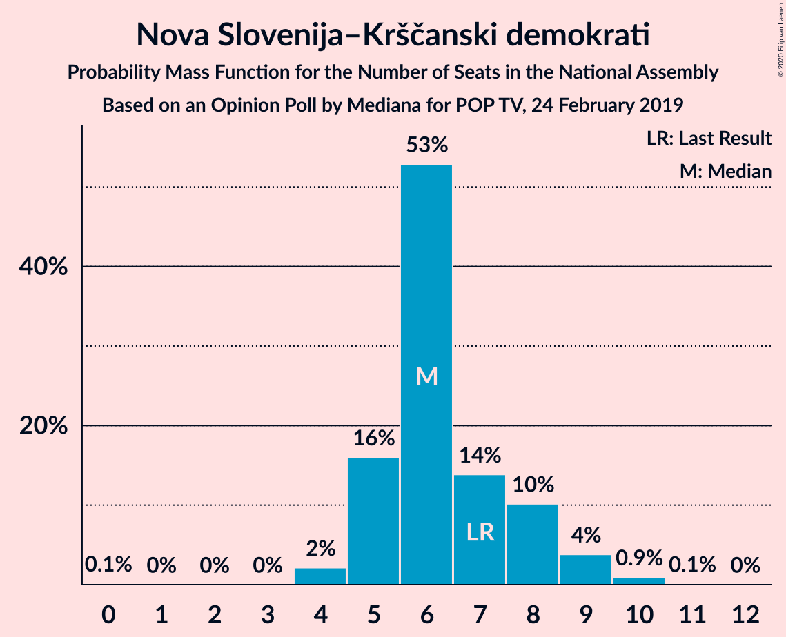
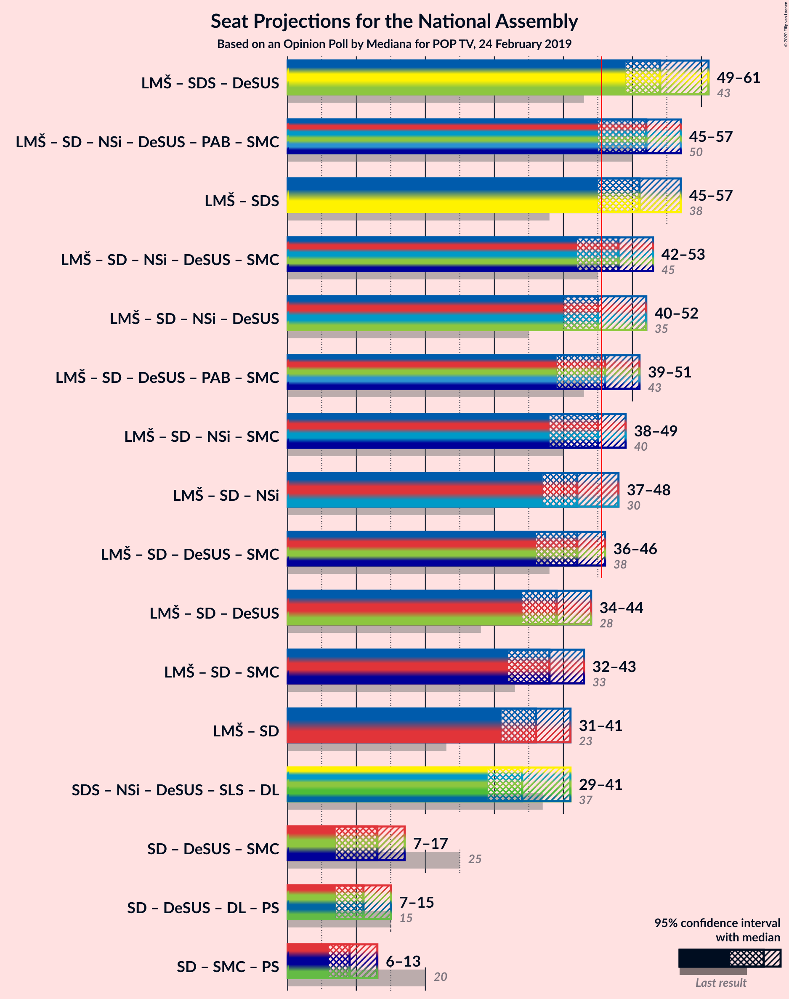
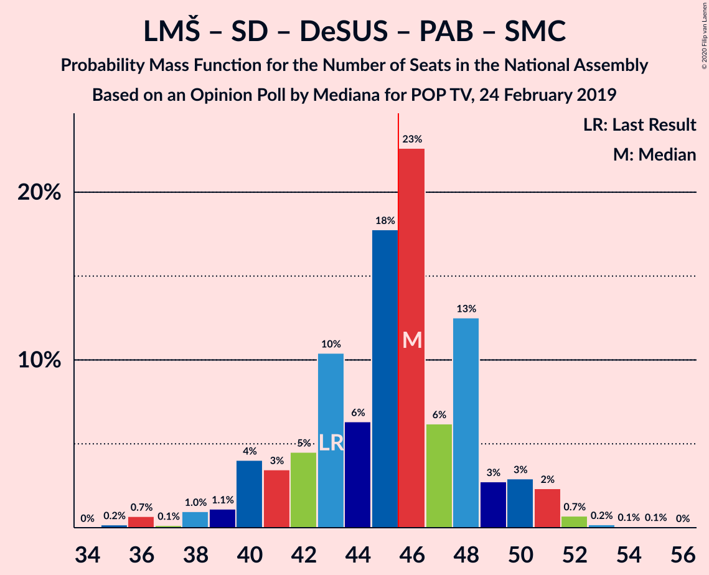
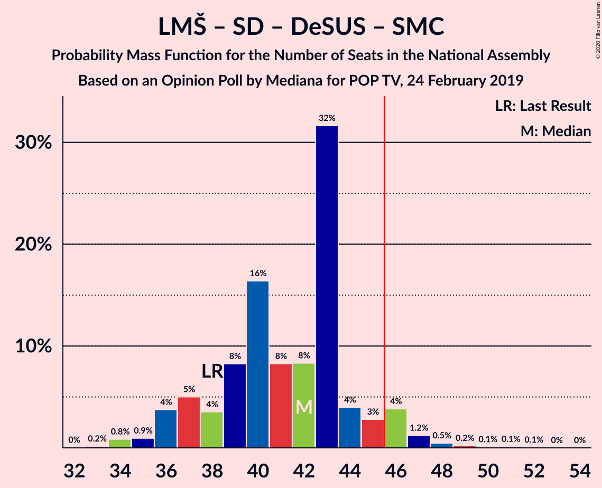
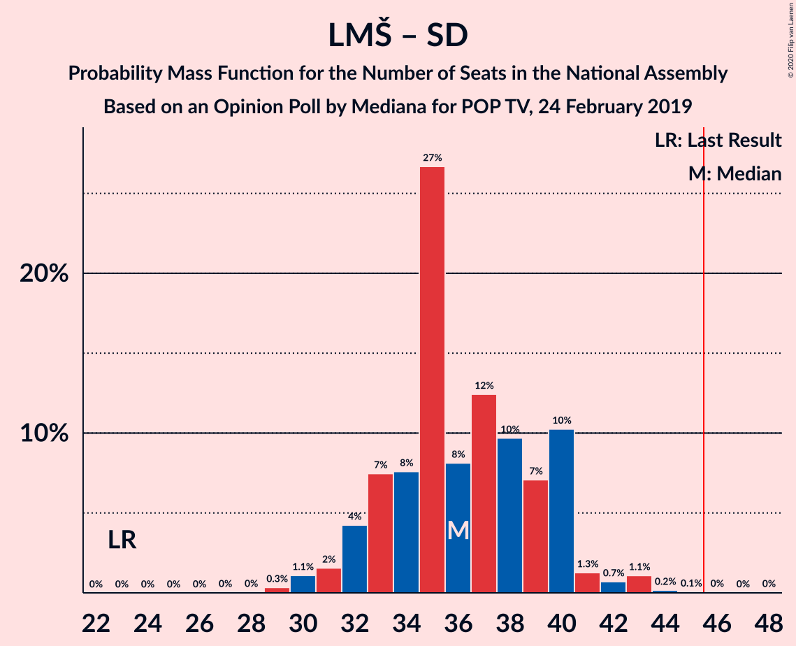

# Opinion Poll by Mediana for POP TV, 24 February 2019

<a href="#voting-intentions">Voting Intentions</a> | <a href="#seats">Seats</a> | <a href="#coalitions">Coalitions</a> | <a href="#technical-information">Technical Information</a>

## Voting Intentions

### Confidence Intervals

| Party | Last Result | Poll Result | 80% Confidence Interval | 90% Confidence Interval | 95% Confidence Interval | 99% Confidence Interval |
|:-----:|:-----------:|:-----------:|:-----------------------:|:-----------------------:|:-----------------------:|:-----------------------:|
| Lista Marjana Šarca | 12.6% | 29.3% | 26.8–31.9% |26.1–32.7% |25.5–33.3% |24.3–34.6% |
| Slovenska demokratska stranka | 24.9% | 22.9% | 20.6–25.4% |20.0–26.1% |19.4–26.7% |18.4–27.9% |
| Levica | 9.3% | 9.5% | 8.0–11.4% |7.6–11.9% |7.3–12.3% |6.6–13.3% |
| Socialni demokrati | 9.9% | 7.8% | 6.4–9.5% |6.1–10.0% |5.7–10.4% |5.2–11.3% |
| Nova Slovenija–Krščanski demokrati | 7.2% | 6.8% | 5.5–8.4% |5.2–8.9% |4.9–9.3% |4.4–10.1% |
| Stranka Alenke Bratušek | 5.1% | 4.7% | 3.7–6.1% |3.4–6.5% |3.1–6.8% |2.7–7.6% |
| Demokratična stranka upokojencev Slovenije | 4.9% | 4.7% | 3.7–6.1% |3.4–6.5% |3.1–6.8% |2.7–7.6% |
| Slovenska ljudska stranka | 2.6% | 4.1% | 3.2–5.4% |2.9–5.8% |2.7–6.1% |2.3–6.9% |
| Stranka modernega centra | 9.7% | 3.5% | 2.7–4.8% |2.4–5.1% |2.2–5.5% |1.9–6.1% |
| Slovenska nacionalna stranka | 4.2% | 3.5% | 2.7–4.8% |2.4–5.1% |2.2–5.5% |1.9–6.1% |

*Note:* The poll result column reflects the actual value used in the calculations. Published results may vary slightly, and in addition be rounded to fewer digits.

## Seats

### Confidence Intervals

| Party | Last Result | Median | 80% Confidence Interval | 90% Confidence Interval | 95% Confidence Interval | 99% Confidence Interval |
|:-----:|:-----------:|:------:|:-----------------------:|:-----------------------:|:-----------------------:|:-----------------------:|
| <a href="#lista-marjana-šarca">Lista Marjana Šarca</a> | 13 | 28 | 26–31 |25–32 |24–33 |23–35 |
| <a href="#slovenska-demokratska-stranka">Slovenska demokratska stranka</a> | 25 | 21 | 20–25 |19–26 |19–27 |18–29 |
| <a href="#levica">Levica</a> | 9 | 9 | 7–11 |7–11 |7–12 |6–13 |
| <a href="#socialni-demokrati">Socialni demokrati</a> | 10 | 7 | 6–9 |6–9 |5–10 |5–11 |
| <a href="#nova-slovenija–krščanski-demokrati">Nova Slovenija–Krščanski demokrati</a> | 7 | 6 | 5–8 |5–8 |5–9 |4–10 |
| <a href="#stranka-alenke-bratušek">Stranka Alenke Bratušek</a> | 5 | 4 | 0–6 |0–6 |0–6 |0–7 |
| <a href="#demokratična-stranka-upokojencev-slovenije">Demokratična stranka upokojencev Slovenije</a> | 5 | 4 | 0–5 |0–6 |0–6 |0–7 |
| <a href="#slovenska-ljudska-stranka">Slovenska ljudska stranka</a> | 0 | 4 | 0–5 |0–5 |0–6 |0–6 |
| <a href="#stranka-modernega-centra">Stranka modernega centra</a> | 10 | 0 | 0–4 |0–4 |0–5 |0–5 |
| <a href="#slovenska-nacionalna-stranka">Slovenska nacionalna stranka</a> | 4 | 0 | 0–4 |0–4 |0–5 |0–6 |

### Lista Marjana Šarca

*For a full overview of the results for this party, see the [Lista Marjana Šarca](party-listamarjanašarca.html) page.*

| Number of Seats | Probability | Accumulated | Special Marks |
|:---------------:|:-----------:|:-----------:|:-------------:|
| 13 | 0% | 100% | Last Result |
| 14 | 0% | 100% |  |
| 15 | 0% | 100% |  |
| 16 | 0% | 100% |  |
| 17 | 0% | 100% |  |
| 18 | 0% | 100% |  |
| 19 | 0% | 100% |  |
| 20 | 0% | 100% |  |
| 21 | 0% | 100% |  |
| 22 | 0.3% | 100% |  |
| 23 | 0.7% | 99.7% |  |
| 24 | 2% | 99.0% |  |
| 25 | 4% | 97% |  |
| 26 | 9% | 93% |  |
| 27 | 7% | 84% |  |
| 28 | 29% | 77% | Median |
| 29 | 10% | 48% |  |
| 30 | 12% | 38% |  |
| 31 | 17% | 27% |  |
| 32 | 6% | 9% |  |
| 33 | 2% | 4% |  |
| 34 | 0.8% | 2% |  |
| 35 | 0.6% | 0.9% |  |
| 36 | 0.2% | 0.3% |  |
| 37 | 0% | 0.1% |  |
| 38 | 0% | 0.1% |  |
| 39 | 0% | 0% |  |

### Slovenska demokratska stranka

*For a full overview of the results for this party, see the [Slovenska demokratska stranka](party-slovenskademokratskastranka.html) page.*

| Number of Seats | Probability | Accumulated | Special Marks |
|:---------------:|:-----------:|:-----------:|:-------------:|
| 16 | 0.1% | 100% |  |
| 17 | 0.3% | 99.9% |  |
| 18 | 2% | 99.7% |  |
| 19 | 3% | 98% |  |
| 20 | 10% | 95% |  |
| 21 | 35% | 85% | Median |
| 22 | 7% | 50% |  |
| 23 | 8% | 43% |  |
| 24 | 17% | 35% |  |
| 25 | 12% | 18% | Last Result |
| 26 | 4% | 7% |  |
| 27 | 1.0% | 3% |  |
| 28 | 1.1% | 2% |  |
| 29 | 0.3% | 0.6% |  |
| 30 | 0.2% | 0.3% |  |
| 31 | 0.1% | 0.1% |  |
| 32 | 0% | 0% |  |

### Levica

*For a full overview of the results for this party, see the [Levica](party-levica.html) page.*

| Number of Seats | Probability | Accumulated | Special Marks |
|:---------------:|:-----------:|:-----------:|:-------------:|
| 5 | 0.1% | 100% |  |
| 6 | 1.0% | 99.9% |  |
| 7 | 9% | 98.8% |  |
| 8 | 30% | 89% |  |
| 9 | 30% | 60% | Last Result, Median |
| 10 | 17% | 30% |  |
| 11 | 10% | 13% |  |
| 12 | 3% | 4% |  |
| 13 | 0.6% | 0.7% |  |
| 14 | 0.1% | 0.1% |  |
| 15 | 0% | 0% |  |

### Socialni demokrati

*For a full overview of the results for this party, see the [Socialni demokrati](party-socialnidemokrati.html) page.*

| Number of Seats | Probability | Accumulated | Special Marks |
|:---------------:|:-----------:|:-----------:|:-------------:|
| 4 | 0.3% | 100% |  |
| 5 | 4% | 99.7% |  |
| 6 | 14% | 95% |  |
| 7 | 44% | 81% | Median |
| 8 | 18% | 37% |  |
| 9 | 16% | 19% |  |
| 10 | 2% | 3% | Last Result |
| 11 | 1.0% | 1.1% |  |
| 12 | 0.1% | 0.1% |  |
| 13 | 0% | 0% |  |

### Nova Slovenija–Krščanski demokrati

*For a full overview of the results for this party, see the [Nova Slovenija–Krščanski demokrati](party-novaslovenija–krščanskidemokrati.html) page.*

| Number of Seats | Probability | Accumulated | Special Marks |
|:---------------:|:-----------:|:-----------:|:-------------:|
| 0 | 0.1% | 100% |  |
| 1 | 0% | 99.9% |  |
| 2 | 0% | 99.9% |  |
| 3 | 0% | 99.9% |  |
| 4 | 2% | 99.8% |  |
| 5 | 16% | 98% |  |
| 6 | 53% | 82% | Median |
| 7 | 14% | 29% | Last Result |
| 8 | 10% | 15% |  |
| 9 | 4% | 5% |  |
| 10 | 0.9% | 1.0% |  |
| 11 | 0.1% | 0.1% |  |
| 12 | 0% | 0% |  |

### Stranka Alenke Bratušek

*For a full overview of the results for this party, see the [Stranka Alenke Bratušek](party-strankaalenkebratušek.html) page.*

| Number of Seats | Probability | Accumulated | Special Marks |
|:---------------:|:-----------:|:-----------:|:-------------:|
| 0 | 12% | 100% |  |
| 1 | 0% | 88% |  |
| 2 | 0% | 88% |  |
| 3 | 18% | 88% |  |
| 4 | 27% | 70% | Median |
| 5 | 32% | 43% | Last Result |
| 6 | 9% | 11% |  |
| 7 | 1.4% | 2% |  |
| 8 | 0.3% | 0.3% |  |
| 9 | 0% | 0% |  |

### Demokratična stranka upokojencev Slovenije

*For a full overview of the results for this party, see the [Demokratična stranka upokojencev Slovenije](party-demokratičnastrankaupokojencevslovenije.html) page.*

| Number of Seats | Probability | Accumulated | Special Marks |
|:---------------:|:-----------:|:-----------:|:-------------:|
| 0 | 25% | 100% |  |
| 1 | 0% | 75% |  |
| 2 | 0% | 75% |  |
| 3 | 1.0% | 75% |  |
| 4 | 41% | 74% | Median |
| 5 | 27% | 34% | Last Result |
| 6 | 5% | 6% |  |
| 7 | 1.4% | 2% |  |
| 8 | 0.4% | 0.4% |  |
| 9 | 0% | 0% |  |

### Slovenska ljudska stranka

*For a full overview of the results for this party, see the [Slovenska ljudska stranka](party-slovenskaljudskastranka.html) page.*

| Number of Seats | Probability | Accumulated | Special Marks |
|:---------------:|:-----------:|:-----------:|:-------------:|
| 0 | 31% | 100% | Last Result |
| 1 | 0% | 69% |  |
| 2 | 0% | 69% |  |
| 3 | 19% | 69% |  |
| 4 | 37% | 50% | Median |
| 5 | 9% | 13% |  |
| 6 | 4% | 4% |  |
| 7 | 0.2% | 0.3% |  |
| 8 | 0% | 0% |  |

### Stranka modernega centra

*For a full overview of the results for this party, see the [Stranka modernega centra](party-strankamodernegacentra.html) page.*

| Number of Seats | Probability | Accumulated | Special Marks |
|:---------------:|:-----------:|:-----------:|:-------------:|
| 0 | 56% | 100% | Median |
| 1 | 0% | 44% |  |
| 2 | 0% | 44% |  |
| 3 | 7% | 44% |  |
| 4 | 34% | 38% |  |
| 5 | 4% | 4% |  |
| 6 | 0.3% | 0.4% |  |
| 7 | 0% | 0% |  |
| 8 | 0% | 0% |  |
| 9 | 0% | 0% |  |
| 10 | 0% | 0% | Last Result |

### Slovenska nacionalna stranka

*For a full overview of the results for this party, see the [Slovenska nacionalna stranka](party-slovenskanacionalnastranka.html) page.*

| Number of Seats | Probability | Accumulated | Special Marks |
|:---------------:|:-----------:|:-----------:|:-------------:|
| 0 | 80% | 100% | Median |
| 1 | 0% | 20% |  |
| 2 | 0% | 20% |  |
| 3 | 3% | 20% |  |
| 4 | 12% | 16% | Last Result |
| 5 | 4% | 5% |  |
| 6 | 0.5% | 0.6% |  |
| 7 | 0.1% | 0.1% |  |
| 8 | 0% | 0% |  |

## Coalitions

### Confidence Intervals

| Coalition | Last Result | Median | Majority? | 80% Confidence Interval | 90% Confidence Interval | 95% Confidence Interval | 99% Confidence Interval |
|:---------:|:-----------:|:------:|:---------:|:-----------------------:|:-----------------------:|:-----------------------:|:-----------------------:|
| Lista Marjana Šarca – Slovenska demokratska stranka – Demokratična stranka upokojencev Slovenije | 43 | 54 | 99.9% | 51–59 | 50–60 | 49–61 | 47–63 |
| Lista Marjana Šarca – Socialni demokrati – Nova Slovenija–Krščanski demokrati – Demokratična stranka upokojencev Slovenije – Stranka Alenke Bratušek – Stranka modernega centra | 50 | 52 | 97% | 48–55 | 47–56 | 45–57 | 44–59 |
| Lista Marjana Šarca – Slovenska demokratska stranka | 38 | 51 | 97% | 47–55 | 46–56 | 45–57 | 44–59 |
| Lista Marjana Šarca – Socialni demokrati – Nova Slovenija–Krščanski demokrati – Demokratična stranka upokojencev Slovenije – Stranka modernega centra | 45 | 48 | 80% | 44–51 | 43–52 | 42–53 | 40–55 |
| Lista Marjana Šarca – Socialni demokrati – Nova Slovenija–Krščanski demokrati – Demokratična stranka upokojencev Slovenije | 35 | 45 | 48% | 43–49 | 42–50 | 40–52 | 38–54 |
| Lista Marjana Šarca – Socialni demokrati – Demokratična stranka upokojencev Slovenije – Stranka Alenke Bratušek – Stranka modernega centra | 43 | 46 | 50% | 41–48 | 40–50 | 39–51 | 36–52 |
| Lista Marjana Šarca – Socialni demokrati – Nova Slovenija–Krščanski demokrati – Stranka modernega centra | 40 | 45 | 27% | 41–47 | 39–48 | 38–49 | 37–52 |
| Lista Marjana Šarca – Socialni demokrati – Nova Slovenija–Krščanski demokrati | 30 | 42 | 16% | 39–46 | 38–47 | 37–48 | 36–51 |
| Lista Marjana Šarca – Socialni demokrati – Demokratična stranka upokojencev Slovenije – Stranka modernega centra | 38 | 42 | 6% | 37–44 | 36–46 | 36–46 | 34–49 |
| Lista Marjana Šarca – Socialni demokrati – Demokratična stranka upokojencev Slovenije | 28 | 39 | 1.4% | 36–43 | 35–44 | 34–44 | 32–47 |
| Lista Marjana Šarca – Socialni demokrati – Stranka modernega centra | 33 | 38 | 0.3% | 35–41 | 33–42 | 32–43 | 30–45 |
| Lista Marjana Šarca – Socialni demokrati | 23 | 36 | 0.1% | 33–40 | 32–40 | 31–41 | 30–43 |
| Socialni demokrati – Demokratična stranka upokojencev Slovenije – Stranka modernega centra | 25 | 13 | 0% | 9–15 | 8–17 | 7–17 | 6–19 |

### Lista Marjana Šarca – Slovenska demokratska stranka – Demokratična stranka upokojencev Slovenije

| Number of Seats | Probability | Accumulated | Special Marks |
|:---------------:|:-----------:|:-----------:|:-------------:|
| 43 | 0% | 100% | Last Result |
| 44 | 0% | 100% |  |
| 45 | 0.1% | 100% |  |
| 46 | 0.3% | 99.9% | Majority |
| 47 | 0.6% | 99.5% |  |
| 48 | 0.7% | 99.0% |  |
| 49 | 2% | 98% |  |
| 50 | 3% | 96% |  |
| 51 | 5% | 93% |  |
| 52 | 7% | 88% |  |
| 53 | 24% | 80% | Median |
| 54 | 10% | 56% |  |
| 55 | 13% | 46% |  |
| 56 | 11% | 33% |  |
| 57 | 4% | 22% |  |
| 58 | 6% | 18% |  |
| 59 | 3% | 12% |  |
| 60 | 6% | 9% |  |
| 61 | 2% | 3% |  |
| 62 | 0.5% | 1.1% |  |
| 63 | 0.2% | 0.6% |  |
| 64 | 0.2% | 0.3% |  |
| 65 | 0% | 0.1% |  |
| 66 | 0% | 0.1% |  |
| 67 | 0% | 0% |  |

### Lista Marjana Šarca – Socialni demokrati – Nova Slovenija–Krščanski demokrati – Demokratična stranka upokojencev Slovenije – Stranka Alenke Bratušek – Stranka modernega centra

| Number of Seats | Probability | Accumulated | Special Marks |
|:---------------:|:-----------:|:-----------:|:-------------:|
| 41 | 0.2% | 100% |  |
| 42 | 0.1% | 99.8% |  |
| 43 | 0.1% | 99.7% |  |
| 44 | 0.9% | 99.6% |  |
| 45 | 1.3% | 98.7% |  |
| 46 | 2% | 97% | Majority |
| 47 | 2% | 95% |  |
| 48 | 6% | 93% |  |
| 49 | 9% | 87% | Median |
| 50 | 6% | 77% | Last Result |
| 51 | 15% | 71% |  |
| 52 | 26% | 56% |  |
| 53 | 8% | 30% |  |
| 54 | 12% | 22% |  |
| 55 | 3% | 10% |  |
| 56 | 3% | 8% |  |
| 57 | 3% | 4% |  |
| 58 | 1.0% | 2% |  |
| 59 | 0.5% | 0.7% |  |
| 60 | 0.2% | 0.2% |  |
| 61 | 0% | 0% |  |

### Lista Marjana Šarca – Slovenska demokratska stranka

| Number of Seats | Probability | Accumulated | Special Marks |
|:---------------:|:-----------:|:-----------:|:-------------:|
| 38 | 0% | 100% | Last Result |
| 39 | 0% | 100% |  |
| 40 | 0% | 100% |  |
| 41 | 0.1% | 100% |  |
| 42 | 0.1% | 99.9% |  |
| 43 | 0.1% | 99.8% |  |
| 44 | 0.4% | 99.7% |  |
| 45 | 2% | 99.3% |  |
| 46 | 4% | 97% | Majority |
| 47 | 6% | 94% |  |
| 48 | 4% | 88% |  |
| 49 | 25% | 84% | Median |
| 50 | 8% | 59% |  |
| 51 | 12% | 52% |  |
| 52 | 5% | 40% |  |
| 53 | 6% | 35% |  |
| 54 | 8% | 30% |  |
| 55 | 13% | 22% |  |
| 56 | 6% | 9% |  |
| 57 | 1.1% | 3% |  |
| 58 | 1.0% | 2% |  |
| 59 | 0.8% | 1.1% |  |
| 60 | 0.1% | 0.3% |  |
| 61 | 0.1% | 0.2% |  |
| 62 | 0.1% | 0.2% |  |
| 63 | 0% | 0.1% |  |
| 64 | 0% | 0% |  |

### Lista Marjana Šarca – Socialni demokrati – Nova Slovenija–Krščanski demokrati – Demokratična stranka upokojencev Slovenije – Stranka modernega centra

| Number of Seats | Probability | Accumulated | Special Marks |
|:---------------:|:-----------:|:-----------:|:-------------:|
| 38 | 0.1% | 100% |  |
| 39 | 0.1% | 99.9% |  |
| 40 | 0.3% | 99.8% |  |
| 41 | 0.8% | 99.4% |  |
| 42 | 2% | 98.6% |  |
| 43 | 4% | 96% |  |
| 44 | 6% | 92% |  |
| 45 | 6% | 86% | Last Result, Median |
| 46 | 15% | 80% | Majority |
| 47 | 7% | 65% |  |
| 48 | 15% | 58% |  |
| 49 | 25% | 43% |  |
| 50 | 7% | 18% |  |
| 51 | 4% | 11% |  |
| 52 | 4% | 7% |  |
| 53 | 2% | 4% |  |
| 54 | 0.7% | 2% |  |
| 55 | 0.5% | 0.9% |  |
| 56 | 0.2% | 0.3% |  |
| 57 | 0.1% | 0.1% |  |
| 58 | 0% | 0.1% |  |
| 59 | 0% | 0% |  |

### Lista Marjana Šarca – Socialni demokrati – Nova Slovenija–Krščanski demokrati – Demokratična stranka upokojencev Slovenije

| Number of Seats | Probability | Accumulated | Special Marks |
|:---------------:|:-----------:|:-----------:|:-------------:|
| 35 | 0% | 100% | Last Result |
| 36 | 0% | 100% |  |
| 37 | 0.2% | 100% |  |
| 38 | 0.3% | 99.8% |  |
| 39 | 0.8% | 99.5% |  |
| 40 | 1.4% | 98.7% |  |
| 41 | 2% | 97% |  |
| 42 | 4% | 95% |  |
| 43 | 5% | 91% |  |
| 44 | 10% | 86% |  |
| 45 | 28% | 76% | Median |
| 46 | 16% | 48% | Majority |
| 47 | 6% | 32% |  |
| 48 | 10% | 27% |  |
| 49 | 8% | 17% |  |
| 50 | 5% | 9% |  |
| 51 | 2% | 4% |  |
| 52 | 1.4% | 3% |  |
| 53 | 0.3% | 1.1% |  |
| 54 | 0.3% | 0.7% |  |
| 55 | 0.4% | 0.4% |  |
| 56 | 0.1% | 0.1% |  |
| 57 | 0% | 0% |  |

### Lista Marjana Šarca – Socialni demokrati – Demokratična stranka upokojencev Slovenije – Stranka Alenke Bratušek – Stranka modernega centra

| Number of Seats | Probability | Accumulated | Special Marks |
|:---------------:|:-----------:|:-----------:|:-------------:|
| 35 | 0.2% | 100% |  |
| 36 | 0.7% | 99.8% |  |
| 37 | 0.1% | 99.1% |  |
| 38 | 1.0% | 99.0% |  |
| 39 | 1.1% | 98% |  |
| 40 | 4% | 97% |  |
| 41 | 3% | 93% |  |
| 42 | 5% | 89% |  |
| 43 | 10% | 85% | Last Result, Median |
| 44 | 6% | 74% |  |
| 45 | 18% | 68% |  |
| 46 | 23% | 50% | Majority |
| 47 | 6% | 28% |  |
| 48 | 13% | 22% |  |
| 49 | 3% | 9% |  |
| 50 | 3% | 6% |  |
| 51 | 2% | 3% |  |
| 52 | 0.7% | 1.0% |  |
| 53 | 0.2% | 0.3% |  |
| 54 | 0.1% | 0.1% |  |
| 55 | 0.1% | 0.1% |  |
| 56 | 0% | 0% |  |

### Lista Marjana Šarca – Socialni demokrati – Nova Slovenija–Krščanski demokrati – Stranka modernega centra

| Number of Seats | Probability | Accumulated | Special Marks |
|:---------------:|:-----------:|:-----------:|:-------------:|
| 35 | 0% | 100% |  |
| 36 | 0.2% | 99.9% |  |
| 37 | 1.1% | 99.8% |  |
| 38 | 2% | 98.6% |  |
| 39 | 3% | 97% |  |
| 40 | 3% | 94% | Last Result |
| 41 | 5% | 91% | Median |
| 42 | 7% | 86% |  |
| 43 | 12% | 79% |  |
| 44 | 14% | 67% |  |
| 45 | 26% | 53% |  |
| 46 | 14% | 27% | Majority |
| 47 | 5% | 13% |  |
| 48 | 3% | 7% |  |
| 49 | 2% | 4% |  |
| 50 | 1.1% | 2% |  |
| 51 | 0.7% | 1.2% |  |
| 52 | 0.3% | 0.6% |  |
| 53 | 0.1% | 0.2% |  |
| 54 | 0.1% | 0.2% |  |
| 55 | 0.1% | 0.1% |  |
| 56 | 0% | 0% |  |

### Lista Marjana Šarca – Socialni demokrati – Nova Slovenija–Krščanski demokrati

| Number of Seats | Probability | Accumulated | Special Marks |
|:---------------:|:-----------:|:-----------:|:-------------:|
| 30 | 0% | 100% | Last Result |
| 31 | 0% | 100% |  |
| 32 | 0% | 100% |  |
| 33 | 0% | 100% |  |
| 34 | 0.1% | 100% |  |
| 35 | 0.2% | 99.8% |  |
| 36 | 0.9% | 99.6% |  |
| 37 | 2% | 98.8% |  |
| 38 | 4% | 96% |  |
| 39 | 6% | 93% |  |
| 40 | 8% | 87% |  |
| 41 | 24% | 78% | Median |
| 42 | 7% | 55% |  |
| 43 | 10% | 48% |  |
| 44 | 13% | 38% |  |
| 45 | 8% | 24% |  |
| 46 | 11% | 16% | Majority |
| 47 | 2% | 5% |  |
| 48 | 1.4% | 3% |  |
| 49 | 0.5% | 2% |  |
| 50 | 0.7% | 1.2% |  |
| 51 | 0.3% | 0.6% |  |
| 52 | 0.1% | 0.2% |  |
| 53 | 0.1% | 0.1% |  |
| 54 | 0% | 0.1% |  |
| 55 | 0% | 0% |  |

### Lista Marjana Šarca – Socialni demokrati – Demokratična stranka upokojencev Slovenije – Stranka modernega centra

| Number of Seats | Probability | Accumulated | Special Marks |
|:---------------:|:-----------:|:-----------:|:-------------:|
| 32 | 0% | 100% |  |
| 33 | 0.2% | 99.9% |  |
| 34 | 0.8% | 99.8% |  |
| 35 | 0.9% | 98.9% |  |
| 36 | 4% | 98% |  |
| 37 | 5% | 94% |  |
| 38 | 4% | 89% | Last Result |
| 39 | 8% | 86% | Median |
| 40 | 16% | 77% |  |
| 41 | 8% | 61% |  |
| 42 | 8% | 53% |  |
| 43 | 32% | 44% |  |
| 44 | 4% | 13% |  |
| 45 | 3% | 9% |  |
| 46 | 4% | 6% | Majority |
| 47 | 1.2% | 2% |  |
| 48 | 0.5% | 1.0% |  |
| 49 | 0.2% | 0.5% |  |
| 50 | 0.1% | 0.3% |  |
| 51 | 0.1% | 0.2% |  |
| 52 | 0.1% | 0.1% |  |
| 53 | 0% | 0% |  |

### Lista Marjana Šarca – Socialni demokrati – Demokratična stranka upokojencev Slovenije

| Number of Seats | Probability | Accumulated | Special Marks |
|:---------------:|:-----------:|:-----------:|:-------------:|
| 28 | 0% | 100% | Last Result |
| 29 | 0% | 100% |  |
| 30 | 0% | 100% |  |
| 31 | 0.3% | 100% |  |
| 32 | 0.3% | 99.6% |  |
| 33 | 0.7% | 99.3% |  |
| 34 | 2% | 98.6% |  |
| 35 | 2% | 97% |  |
| 36 | 5% | 95% |  |
| 37 | 7% | 90% |  |
| 38 | 8% | 83% |  |
| 39 | 30% | 75% | Median |
| 40 | 18% | 45% |  |
| 41 | 4% | 27% |  |
| 42 | 8% | 23% |  |
| 43 | 11% | 16% |  |
| 44 | 3% | 5% |  |
| 45 | 1.1% | 2% |  |
| 46 | 0.5% | 1.4% | Majority |
| 47 | 0.6% | 0.9% |  |
| 48 | 0.1% | 0.3% |  |
| 49 | 0.1% | 0.1% |  |
| 50 | 0% | 0% |  |

### Lista Marjana Šarca – Socialni demokrati – Stranka modernega centra

| Number of Seats | Probability | Accumulated | Special Marks |
|:---------------:|:-----------:|:-----------:|:-------------:|
| 29 | 0% | 100% |  |
| 30 | 0.6% | 99.9% |  |
| 31 | 0.5% | 99.4% |  |
| 32 | 3% | 98.8% |  |
| 33 | 2% | 96% | Last Result |
| 34 | 4% | 95% |  |
| 35 | 7% | 90% | Median |
| 36 | 11% | 84% |  |
| 37 | 11% | 72% |  |
| 38 | 11% | 61% |  |
| 39 | 27% | 50% |  |
| 40 | 11% | 23% |  |
| 41 | 6% | 12% |  |
| 42 | 2% | 5% |  |
| 43 | 2% | 3% |  |
| 44 | 0.5% | 1.1% |  |
| 45 | 0.3% | 0.6% |  |
| 46 | 0.2% | 0.3% | Majority |
| 47 | 0.1% | 0.2% |  |
| 48 | 0% | 0.1% |  |
| 49 | 0% | 0% |  |

### Lista Marjana Šarca – Socialni demokrati

| Number of Seats | Probability | Accumulated | Special Marks |
|:---------------:|:-----------:|:-----------:|:-------------:|
| 23 | 0% | 100% | Last Result |
| 24 | 0% | 100% |  |
| 25 | 0% | 100% |  |
| 26 | 0% | 100% |  |
| 27 | 0% | 100% |  |
| 28 | 0% | 100% |  |
| 29 | 0.3% | 99.9% |  |
| 30 | 1.1% | 99.6% |  |
| 31 | 2% | 98% |  |
| 32 | 4% | 97% |  |
| 33 | 7% | 93% |  |
| 34 | 8% | 85% |  |
| 35 | 27% | 78% | Median |
| 36 | 8% | 51% |  |
| 37 | 12% | 43% |  |
| 38 | 10% | 30% |  |
| 39 | 7% | 21% |  |
| 40 | 10% | 14% |  |
| 41 | 1.3% | 3% |  |
| 42 | 0.7% | 2% |  |
| 43 | 1.1% | 1.4% |  |
| 44 | 0.2% | 0.3% |  |
| 45 | 0.1% | 0.1% |  |
| 46 | 0% | 0.1% | Majority |
| 47 | 0% | 0% |  |

### Socialni demokrati – Demokratična stranka upokojencev Slovenije – Stranka modernega centra

| Number of Seats | Probability | Accumulated | Special Marks |
|:---------------:|:-----------:|:-----------:|:-------------:|
| 5 | 0.1% | 100% |  |
| 6 | 0.8% | 99.8% |  |
| 7 | 4% | 99.0% |  |
| 8 | 5% | 95% |  |
| 9 | 11% | 90% |  |
| 10 | 6% | 79% |  |
| 11 | 8% | 73% | Median |
| 12 | 12% | 65% |  |
| 13 | 9% | 53% |  |
| 14 | 6% | 44% |  |
| 15 | 29% | 38% |  |
| 16 | 4% | 9% |  |
| 17 | 3% | 5% |  |
| 18 | 1.0% | 2% |  |
| 19 | 0.7% | 1.0% |  |
| 20 | 0.2% | 0.3% |  |
| 21 | 0.1% | 0.1% |  |
| 22 | 0% | 0% |  |
| 23 | 0% | 0% |  |
| 24 | 0% | 0% |  |
| 25 | 0% | 0% | Last Result |

## Technical Information

### Opinion Poll

+ **Polling firm:** Mediana
+ **Commissioner(s):** POP TV
+ **Fieldwork period:** 24 February 2019

### Calculations

+ **Sample size:** 516
+ **Simulations done:** 1,048,576
+ **Error estimate:** 2.00%

