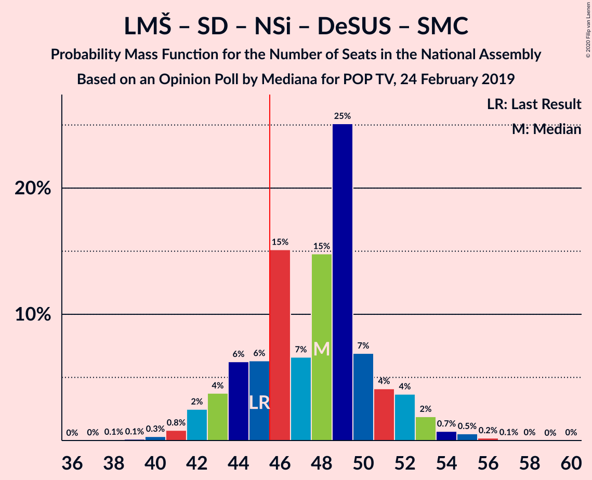
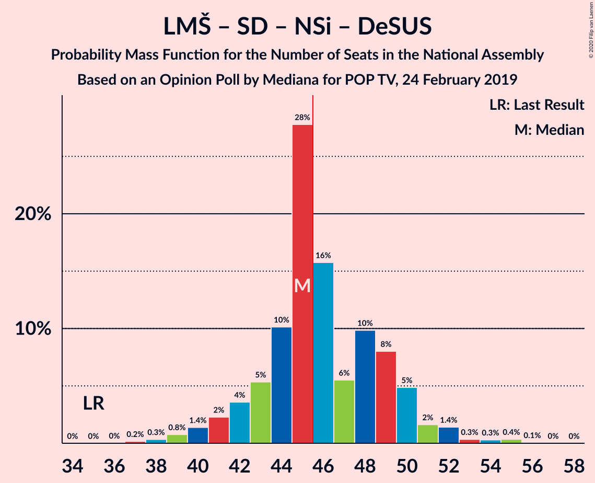
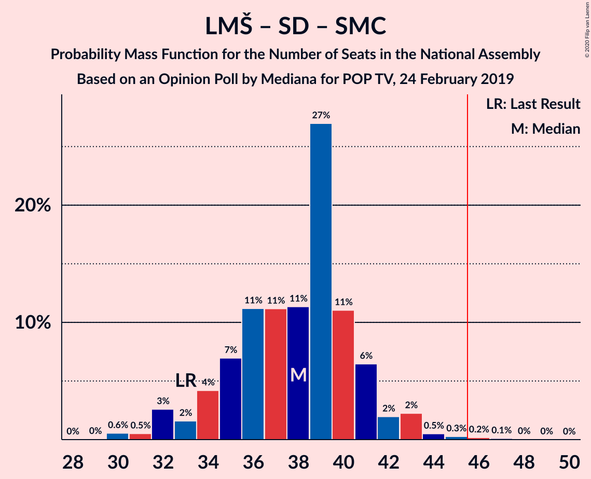
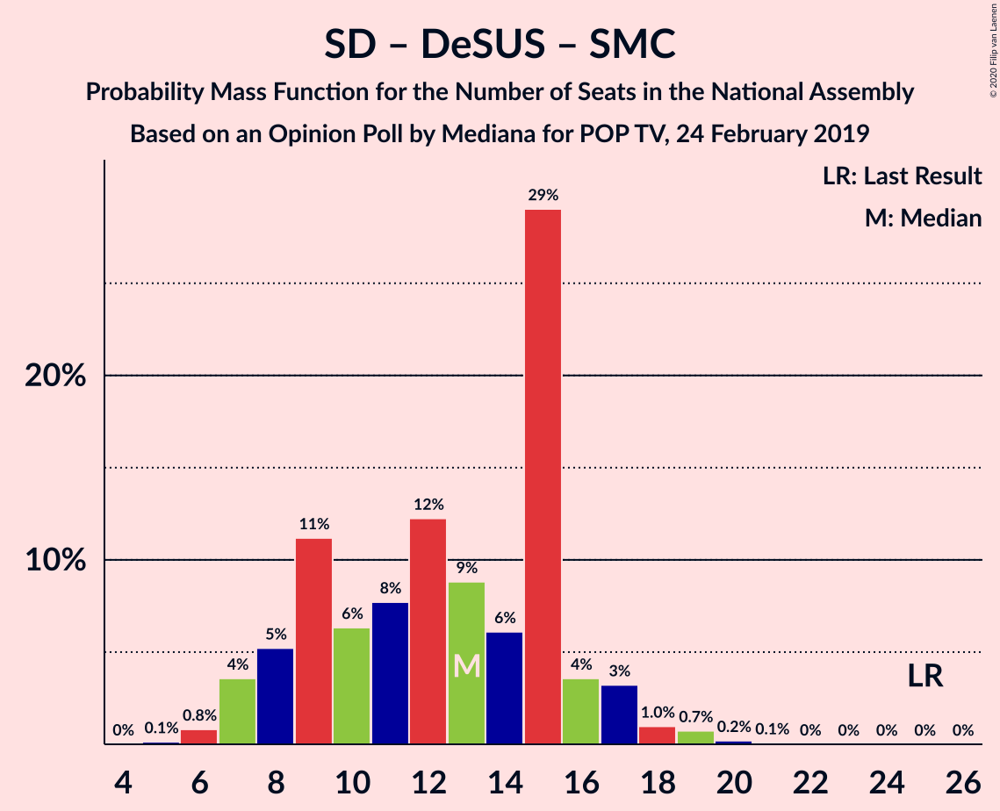

# Opinion Poll by Mediana for POP TV, 24 February 2019

<a href="#voting-intentions">Voting Intentions</a> | <a href="#seats">Seats</a> | <a href="#coalitions">Coalitions</a> | <a href="#technical-information">Technical Information</a>

## Voting Intentions

### Confidence Intervals

| Party | Last Result | Poll Result | 80% Confidence Interval | 90% Confidence Interval | 95% Confidence Interval | 99% Confidence Interval |
|:-----:|:-----------:|:-----------:|:-----------------------:|:-----------------------:|:-----------------------:|:-----------------------:|
| Lista Marjana Šarca | 12.6% | 29.3% | 26.8–31.9% |26.1–32.7% |25.5–33.3% |24.3–34.6% |
| Slovenska demokratska stranka | 24.9% | 22.9% | 20.6–25.4% |20.0–26.1% |19.4–26.7% |18.4–27.9% |
| Levica | 9.3% | 9.5% | 8.0–11.4% |7.6–11.9% |7.3–12.3% |6.6–13.3% |
| Socialni demokrati | 9.9% | 7.8% | 6.4–9.5% |6.1–10.0% |5.7–10.4% |5.2–11.3% |
| Nova Slovenija–Krščanski demokrati | 7.2% | 6.8% | 5.5–8.4% |5.2–8.9% |4.9–9.3% |4.4–10.1% |
| Stranka Alenke Bratušek | 5.1% | 4.7% | 3.7–6.1% |3.4–6.5% |3.1–6.8% |2.7–7.6% |
| Demokratična stranka upokojencev Slovenije | 4.9% | 4.7% | 3.7–6.1% |3.4–6.5% |3.1–6.8% |2.7–7.6% |
| Slovenska ljudska stranka | 2.6% | 4.1% | 3.2–5.4% |2.9–5.8% |2.7–6.1% |2.3–6.9% |
| Stranka modernega centra | 9.7% | 3.5% | 2.7–4.8% |2.4–5.1% |2.2–5.5% |1.9–6.1% |
| Slovenska nacionalna stranka | 4.2% | 3.5% | 2.7–4.8% |2.4–5.1% |2.2–5.5% |1.9–6.1% |

*Note:* The poll result column reflects the actual value used in the calculations. Published results may vary slightly, and in addition be rounded to fewer digits.

## Seats

### Confidence Intervals

| Party | Last Result | Median | 80% Confidence Interval | 90% Confidence Interval | 95% Confidence Interval | 99% Confidence Interval |
|:-----:|:-----------:|:------:|:-----------------------:|:-----------------------:|:-----------------------:|:-----------------------:|
| <a href="#lista-marjana-šarca">Lista Marjana Šarca</a> | 13 | 32 | 28–32 |27–32 |27–33 |26–33 |
| <a href="#slovenska-demokratska-stranka">Slovenska demokratska stranka</a> | 25 | 24 | 19–24 |19–24 |19–24 |19–24 |
| <a href="#levica">Levica</a> | 9 | 11 | 8–11 |8–11 |7–11 |7–12 |
| <a href="#socialni-demokrati">Socialni demokrati</a> | 10 | 7 | 7–8 |6–8 |6–10 |5–10 |
| <a href="#nova-slovenija–krščanski-demokrati">Nova Slovenija–Krščanski demokrati</a> | 7 | 6 | 6–7 |6–9 |6–9 |6–9 |
| <a href="#stranka-alenke-bratušek">Stranka Alenke Bratušek</a> | 5 | 4 | 4 |3–4 |0–5 |0–6 |
| <a href="#demokratična-stranka-upokojencev-slovenije">Demokratična stranka upokojencev Slovenije</a> | 5 | 0 | 0–5 |0–5 |0–7 |0–7 |
| <a href="#slovenska-ljudska-stranka">Slovenska ljudska stranka</a> | 0 | 0 | 0–5 |0–5 |0–5 |0–5 |
| <a href="#stranka-modernega-centra">Stranka modernega centra</a> | 10 | 0 | 0–3 |0–3 |0–3 |0–4 |
| <a href="#slovenska-nacionalna-stranka">Slovenska nacionalna stranka</a> | 4 | 0 | 0 |0 |0–4 |0–4 |

### Lista Marjana Šarca

*For a full overview of the results for this party, see the [Lista Marjana Šarca](party-listamarjanašarca.html) page.*

| Number of Seats | Probability | Accumulated | Special Marks |
|:---------------:|:-----------:|:-----------:|:-------------:|
| 13 | 0% | 100% | Last Result |
| 14 | 0% | 100% |  |
| 15 | 0% | 100% |  |
| 16 | 0% | 100% |  |
| 17 | 0% | 100% |  |
| 18 | 0% | 100% |  |
| 19 | 0% | 100% |  |
| 20 | 0% | 100% |  |
| 21 | 0% | 100% |  |
| 22 | 0% | 100% |  |
| 23 | 0.2% | 100% |  |
| 24 | 0.1% | 99.8% |  |
| 25 | 0.1% | 99.7% |  |
| 26 | 2% | 99.6% |  |
| 27 | 8% | 98% |  |
| 28 | 2% | 90% |  |
| 29 | 5% | 88% |  |
| 30 | 2% | 83% |  |
| 31 | 22% | 82% |  |
| 32 | 56% | 59% | Median |
| 33 | 3% | 3% |  |
| 34 | 0.1% | 0.2% |  |
| 35 | 0% | 0.1% |  |
| 36 | 0% | 0.1% |  |
| 37 | 0% | 0% |  |

### Slovenska demokratska stranka

*For a full overview of the results for this party, see the [Slovenska demokratska stranka](party-slovenskademokratskastranka.html) page.*

| Number of Seats | Probability | Accumulated | Special Marks |
|:---------------:|:-----------:|:-----------:|:-------------:|
| 18 | 0.2% | 100% |  |
| 19 | 11% | 99.7% |  |
| 20 | 23% | 89% |  |
| 21 | 1.2% | 66% |  |
| 22 | 0.7% | 65% |  |
| 23 | 1.1% | 64% |  |
| 24 | 63% | 63% | Median |
| 25 | 0.1% | 0.4% | Last Result |
| 26 | 0.1% | 0.4% |  |
| 27 | 0.2% | 0.3% |  |
| 28 | 0% | 0% |  |

### Levica

*For a full overview of the results for this party, see the [Levica](party-levica.html) page.*

| Number of Seats | Probability | Accumulated | Special Marks |
|:---------------:|:-----------:|:-----------:|:-------------:|
| 6 | 0.3% | 100% |  |
| 7 | 3% | 99.7% |  |
| 8 | 20% | 96% |  |
| 9 | 14% | 76% | Last Result |
| 10 | 8% | 62% |  |
| 11 | 53% | 54% | Median |
| 12 | 0.5% | 0.5% |  |
| 13 | 0.1% | 0.1% |  |
| 14 | 0% | 0% |  |

### Socialni demokrati

*For a full overview of the results for this party, see the [Socialni demokrati](party-socialnidemokrati.html) page.*

| Number of Seats | Probability | Accumulated | Special Marks |
|:---------------:|:-----------:|:-----------:|:-------------:|
| 5 | 0.8% | 100% |  |
| 6 | 8% | 99.2% |  |
| 7 | 74% | 91% | Median |
| 8 | 12% | 17% |  |
| 9 | 1.1% | 5% |  |
| 10 | 3% | 4% | Last Result |
| 11 | 0.4% | 0.5% |  |
| 12 | 0.1% | 0.1% |  |
| 13 | 0% | 0% |  |

### Nova Slovenija–Krščanski demokrati

*For a full overview of the results for this party, see the [Nova Slovenija–Krščanski demokrati](party-novaslovenija–krščanskidemokrati.html) page.*

| Number of Seats | Probability | Accumulated | Special Marks |
|:---------------:|:-----------:|:-----------:|:-------------:|
| 4 | 0.1% | 100% |  |
| 5 | 0.3% | 99.9% |  |
| 6 | 83% | 99.6% | Median |
| 7 | 7% | 17% | Last Result |
| 8 | 0.1% | 9% |  |
| 9 | 9% | 9% |  |
| 10 | 0.4% | 0.4% |  |
| 11 | 0% | 0% |  |

### Stranka Alenke Bratušek

*For a full overview of the results for this party, see the [Stranka Alenke Bratušek](party-strankaalenkebratušek.html) page.*

| Number of Seats | Probability | Accumulated | Special Marks |
|:---------------:|:-----------:|:-----------:|:-------------:|
| 0 | 5% | 100% |  |
| 1 | 0% | 95% |  |
| 2 | 0% | 95% |  |
| 3 | 1.0% | 95% |  |
| 4 | 89% | 94% | Median |
| 5 | 4% | 5% | Last Result |
| 6 | 1.1% | 1.2% |  |
| 7 | 0.1% | 0.1% |  |
| 8 | 0% | 0% |  |

### Demokratična stranka upokojencev Slovenije

*For a full overview of the results for this party, see the [Demokratična stranka upokojencev Slovenije](party-demokratičnastrankaupokojencevslovenije.html) page.*

| Number of Seats | Probability | Accumulated | Special Marks |
|:---------------:|:-----------:|:-----------:|:-------------:|
| 0 | 62% | 100% | Median |
| 1 | 0% | 38% |  |
| 2 | 0% | 38% |  |
| 3 | 0.1% | 38% |  |
| 4 | 4% | 38% |  |
| 5 | 31% | 35% | Last Result |
| 6 | 0.3% | 4% |  |
| 7 | 3% | 3% |  |
| 8 | 0% | 0% |  |

### Slovenska ljudska stranka

*For a full overview of the results for this party, see the [Slovenska ljudska stranka](party-slovenskaljudskastranka.html) page.*

| Number of Seats | Probability | Accumulated | Special Marks |
|:---------------:|:-----------:|:-----------:|:-------------:|
| 0 | 61% | 100% | Last Result, Median |
| 1 | 0% | 39% |  |
| 2 | 0% | 39% |  |
| 3 | 0% | 39% |  |
| 4 | 26% | 39% |  |
| 5 | 12% | 13% |  |
| 6 | 0.4% | 0.4% |  |
| 7 | 0.1% | 0.1% |  |
| 8 | 0% | 0% |  |

### Stranka modernega centra

*For a full overview of the results for this party, see the [Stranka modernega centra](party-strankamodernegacentra.html) page.*

| Number of Seats | Probability | Accumulated | Special Marks |
|:---------------:|:-----------:|:-----------:|:-------------:|
| 0 | 79% | 100% | Median |
| 1 | 0% | 21% |  |
| 2 | 0% | 21% |  |
| 3 | 20% | 21% |  |
| 4 | 1.0% | 1.2% |  |
| 5 | 0.2% | 0.2% |  |
| 6 | 0% | 0% |  |
| 7 | 0% | 0% |  |
| 8 | 0% | 0% |  |
| 9 | 0% | 0% |  |
| 10 | 0% | 0% | Last Result |

### Slovenska nacionalna stranka

*For a full overview of the results for this party, see the [Slovenska nacionalna stranka](party-slovenskanacionalnastranka.html) page.*

| Number of Seats | Probability | Accumulated | Special Marks |
|:---------------:|:-----------:|:-----------:|:-------------:|
| 0 | 96% | 100% | Median |
| 1 | 0% | 4% |  |
| 2 | 0% | 4% |  |
| 3 | 0% | 4% |  |
| 4 | 4% | 4% | Last Result |
| 5 | 0.4% | 0.4% |  |
| 6 | 0% | 0% |  |

## Coalitions

### Confidence Intervals

| Coalition | Last Result | Median | Majority? | 80% Confidence Interval | 90% Confidence Interval | 95% Confidence Interval | 99% Confidence Interval |
|:---------:|:-----------:|:------:|:---------:|:-----------------------:|:-----------------------:|:-----------------------:|:-----------------------:|
| Lista Marjana Šarca – Slovenska demokratska stranka – Demokratična stranka upokojencev Slovenije | 43 | 56 | 100% | 52–56 | 51–57 | 51–57 | 51–60 |
| Lista Marjana Šarca – Slovenska demokratska stranka | 38 | 56 | 99.8% | 48–56 | 46–56 | 46–57 | 46–57 |
| Lista Marjana Šarca – Socialni demokrati – Nova Slovenija–Krščanski demokrati – Demokratična stranka upokojencev Slovenije – Stranka Alenke Bratušek – Stranka modernega centra | 50 | 49 | 99.7% | 49–56 | 49–56 | 49–56 | 46–56 |
| Lista Marjana Šarca – Socialni demokrati – Nova Slovenija–Krščanski demokrati – Demokratična stranka upokojencev Slovenije – Stranka modernega centra | 45 | 45 | 47% | 45–52 | 45–52 | 45–52 | 45–52 |
| Lista Marjana Šarca – Socialni demokrati – Nova Slovenija–Krščanski demokrati – Demokratična stranka upokojencev Slovenije | 35 | 45 | 47% | 45–49 | 45–50 | 45–50 | 42–51 |
| Lista Marjana Šarca – Socialni demokrati – Demokratična stranka upokojencev Slovenije – Stranka Alenke Bratušek – Stranka modernega centra | 43 | 43 | 27% | 43–50 | 42–50 | 41–50 | 39–50 |
| Lista Marjana Šarca – Socialni demokrati – Nova Slovenija–Krščanski demokrati | 30 | 45 | 11% | 42–46 | 41–47 | 41–50 | 39–50 |
| Lista Marjana Šarca – Socialni demokrati – Nova Slovenija–Krščanski demokrati – Stranka modernega centra | 40 | 45 | 31% | 43–47 | 41–47 | 41–50 | 40–51 |
| Lista Marjana Šarca – Socialni demokrati – Demokratična stranka upokojencev Slovenije – Stranka modernega centra | 38 | 39 | 19% | 39–46 | 38–46 | 37–46 | 37–46 |
| Lista Marjana Šarca – Socialni demokrati – Demokratična stranka upokojencev Slovenije | 28 | 39 | 0% | 39–43 | 38–43 | 37–44 | 35–44 |
| Lista Marjana Šarca – Socialni demokrati | 23 | 39 | 0% | 35–39 | 35–39 | 35–43 | 32–43 |
| Lista Marjana Šarca – Socialni demokrati – Stranka modernega centra | 33 | 39 | 0% | 35–41 | 35–41 | 35–43 | 34–43 |
| Socialni demokrati – Demokratična stranka upokojencev Slovenije – Stranka modernega centra | 25 | 7 | 0% | 7–15 | 7–15 | 6–15 | 6–15 |

### Lista Marjana Šarca – Slovenska demokratska stranka – Demokratična stranka upokojencev Slovenije

| Number of Seats | Probability | Accumulated | Special Marks |
|:---------------:|:-----------:|:-----------:|:-------------:|
| 43 | 0% | 100% | Last Result |
| 44 | 0% | 100% |  |
| 45 | 0% | 100% |  |
| 46 | 0% | 100% | Majority |
| 47 | 0% | 100% |  |
| 48 | 0% | 100% |  |
| 49 | 0% | 99.9% |  |
| 50 | 0% | 99.9% |  |
| 51 | 8% | 99.9% |  |
| 52 | 2% | 92% |  |
| 53 | 3% | 90% |  |
| 54 | 2% | 87% |  |
| 55 | 2% | 84% |  |
| 56 | 74% | 82% | Median |
| 57 | 7% | 8% |  |
| 58 | 0% | 1.3% |  |
| 59 | 0.2% | 1.3% |  |
| 60 | 1.0% | 1.1% |  |
| 61 | 0% | 0% |  |

### Lista Marjana Šarca – Slovenska demokratska stranka

| Number of Seats | Probability | Accumulated | Special Marks |
|:---------------:|:-----------:|:-----------:|:-------------:|
| 38 | 0% | 100% | Last Result |
| 39 | 0% | 100% |  |
| 40 | 0% | 100% |  |
| 41 | 0% | 100% |  |
| 42 | 0% | 100% |  |
| 43 | 0% | 100% |  |
| 44 | 0.1% | 100% |  |
| 45 | 0% | 99.9% |  |
| 46 | 8% | 99.8% | Majority |
| 47 | 0.3% | 92% |  |
| 48 | 3% | 92% |  |
| 49 | 0.8% | 89% |  |
| 50 | 6% | 89% |  |
| 51 | 19% | 82% |  |
| 52 | 0.1% | 63% |  |
| 53 | 3% | 63% |  |
| 54 | 0.6% | 60% |  |
| 55 | 1.0% | 59% |  |
| 56 | 55% | 58% | Median |
| 57 | 3% | 3% |  |
| 58 | 0% | 0% |  |

### Lista Marjana Šarca – Socialni demokrati – Nova Slovenija–Krščanski demokrati – Demokratična stranka upokojencev Slovenije – Stranka Alenke Bratušek – Stranka modernega centra

| Number of Seats | Probability | Accumulated | Special Marks |
|:---------------:|:-----------:|:-----------:|:-------------:|
| 43 | 0.2% | 100% |  |
| 44 | 0.1% | 99.8% |  |
| 45 | 0% | 99.7% |  |
| 46 | 0.4% | 99.7% | Majority |
| 47 | 0.1% | 99.3% |  |
| 48 | 0.3% | 99.2% |  |
| 49 | 52% | 98.9% | Median |
| 50 | 14% | 47% | Last Result |
| 51 | 4% | 33% |  |
| 52 | 3% | 30% |  |
| 53 | 2% | 26% |  |
| 54 | 0.1% | 24% |  |
| 55 | 5% | 24% |  |
| 56 | 19% | 20% |  |
| 57 | 0.1% | 0.3% |  |
| 58 | 0% | 0.2% |  |
| 59 | 0% | 0.2% |  |
| 60 | 0.2% | 0.2% |  |
| 61 | 0% | 0% |  |

### Lista Marjana Šarca – Socialni demokrati – Nova Slovenija–Krščanski demokrati – Demokratična stranka upokojencev Slovenije – Stranka modernega centra

| Number of Seats | Probability | Accumulated | Special Marks |
|:---------------:|:-----------:|:-----------:|:-------------:|
| 42 | 0% | 100% |  |
| 43 | 0.2% | 99.9% |  |
| 44 | 0.2% | 99.7% |  |
| 45 | 52% | 99.5% | Last Result, Median |
| 46 | 11% | 47% | Majority |
| 47 | 4% | 37% |  |
| 48 | 3% | 33% |  |
| 49 | 2% | 30% |  |
| 50 | 6% | 28% |  |
| 51 | 2% | 21% |  |
| 52 | 19% | 20% |  |
| 53 | 0.1% | 0.4% |  |
| 54 | 0.1% | 0.3% |  |
| 55 | 0% | 0.2% |  |
| 56 | 0.2% | 0.2% |  |
| 57 | 0% | 0% |  |

### Lista Marjana Šarca – Socialni demokrati – Nova Slovenija–Krščanski demokrati – Demokratična stranka upokojencev Slovenije

| Number of Seats | Probability | Accumulated | Special Marks |
|:---------------:|:-----------:|:-----------:|:-------------:|
| 35 | 0% | 100% | Last Result |
| 36 | 0% | 100% |  |
| 37 | 0% | 100% |  |
| 38 | 0% | 100% |  |
| 39 | 0% | 100% |  |
| 40 | 0% | 100% |  |
| 41 | 0.2% | 100% |  |
| 42 | 0.3% | 99.8% |  |
| 43 | 0.3% | 99.5% |  |
| 44 | 0.5% | 99.2% |  |
| 45 | 52% | 98.7% | Median |
| 46 | 11% | 47% | Majority |
| 47 | 4% | 35% |  |
| 48 | 3% | 31% |  |
| 49 | 20% | 29% |  |
| 50 | 7% | 9% |  |
| 51 | 2% | 2% |  |
| 52 | 0.2% | 0.2% |  |
| 53 | 0% | 0% |  |

### Lista Marjana Šarca – Socialni demokrati – Demokratična stranka upokojencev Slovenije – Stranka Alenke Bratušek – Stranka modernega centra

| Number of Seats | Probability | Accumulated | Special Marks |
|:---------------:|:-----------:|:-----------:|:-------------:|
| 36 | 0.2% | 100% |  |
| 37 | 0% | 99.8% |  |
| 38 | 0% | 99.7% |  |
| 39 | 0.5% | 99.7% |  |
| 40 | 0.1% | 99.3% |  |
| 41 | 3% | 99.2% |  |
| 42 | 3% | 96% |  |
| 43 | 58% | 93% | Last Result, Median |
| 44 | 8% | 35% |  |
| 45 | 0.5% | 28% |  |
| 46 | 3% | 27% | Majority |
| 47 | 0.2% | 24% |  |
| 48 | 1.0% | 24% |  |
| 49 | 3% | 23% |  |
| 50 | 19% | 19% |  |
| 51 | 0.2% | 0.2% |  |
| 52 | 0% | 0% |  |

### Lista Marjana Šarca – Socialni demokrati – Nova Slovenija–Krščanski demokrati

| Number of Seats | Probability | Accumulated | Special Marks |
|:---------------:|:-----------:|:-----------:|:-------------:|
| 30 | 0% | 100% | Last Result |
| 31 | 0% | 100% |  |
| 32 | 0% | 100% |  |
| 33 | 0% | 100% |  |
| 34 | 0% | 100% |  |
| 35 | 0% | 100% |  |
| 36 | 0.2% | 100% |  |
| 37 | 0% | 99.8% |  |
| 38 | 0.1% | 99.8% |  |
| 39 | 0.6% | 99.7% |  |
| 40 | 0.1% | 99.1% |  |
| 41 | 8% | 98.9% |  |
| 42 | 2% | 91% |  |
| 43 | 3% | 89% |  |
| 44 | 22% | 85% |  |
| 45 | 52% | 63% | Median |
| 46 | 4% | 11% | Majority |
| 47 | 3% | 7% |  |
| 48 | 0% | 4% |  |
| 49 | 0.1% | 4% |  |
| 50 | 3% | 4% |  |
| 51 | 0.4% | 0.4% |  |
| 52 | 0% | 0% |  |

### Lista Marjana Šarca – Socialni demokrati – Nova Slovenija–Krščanski demokrati – Stranka modernega centra

| Number of Seats | Probability | Accumulated | Special Marks |
|:---------------:|:-----------:|:-----------:|:-------------:|
| 38 | 0.1% | 100% |  |
| 39 | 0.3% | 99.9% |  |
| 40 | 0.1% | 99.6% | Last Result |
| 41 | 8% | 99.5% |  |
| 42 | 1.2% | 91% |  |
| 43 | 4% | 90% |  |
| 44 | 3% | 87% |  |
| 45 | 53% | 84% | Median |
| 46 | 5% | 31% | Majority |
| 47 | 22% | 26% |  |
| 48 | 0% | 4% |  |
| 49 | 0.1% | 4% |  |
| 50 | 3% | 4% |  |
| 51 | 0.6% | 0.6% |  |
| 52 | 0% | 0.1% |  |
| 53 | 0% | 0.1% |  |
| 54 | 0.1% | 0.1% |  |
| 55 | 0% | 0% |  |

### Lista Marjana Šarca – Socialni demokrati – Demokratična stranka upokojencev Slovenije – Stranka modernega centra

| Number of Seats | Probability | Accumulated | Special Marks |
|:---------------:|:-----------:|:-----------:|:-------------:|
| 36 | 0.2% | 100% |  |
| 37 | 3% | 99.7% |  |
| 38 | 3% | 97% | Last Result |
| 39 | 55% | 94% | Median |
| 40 | 9% | 39% |  |
| 41 | 0.8% | 30% |  |
| 42 | 1.4% | 29% |  |
| 43 | 4% | 28% |  |
| 44 | 4% | 24% |  |
| 45 | 0.2% | 20% |  |
| 46 | 19% | 19% | Majority |
| 47 | 0.2% | 0.2% |  |
| 48 | 0% | 0% |  |

### Lista Marjana Šarca – Socialni demokrati – Demokratična stranka upokojencev Slovenije

| Number of Seats | Probability | Accumulated | Special Marks |
|:---------------:|:-----------:|:-----------:|:-------------:|
| 28 | 0% | 100% | Last Result |
| 29 | 0% | 100% |  |
| 30 | 0% | 100% |  |
| 31 | 0% | 100% |  |
| 32 | 0% | 100% |  |
| 33 | 0% | 100% |  |
| 34 | 0.2% | 100% |  |
| 35 | 0.3% | 99.8% |  |
| 36 | 0.2% | 99.5% |  |
| 37 | 3% | 99.3% |  |
| 38 | 3% | 96% |  |
| 39 | 55% | 93% | Median |
| 40 | 10% | 39% |  |
| 41 | 0.6% | 29% |  |
| 42 | 1.4% | 28% |  |
| 43 | 23% | 27% |  |
| 44 | 4% | 4% |  |
| 45 | 0.2% | 0.2% |  |
| 46 | 0% | 0% | Majority |

### Lista Marjana Šarca – Socialni demokrati

| Number of Seats | Probability | Accumulated | Special Marks |
|:---------------:|:-----------:|:-----------:|:-------------:|
| 23 | 0% | 100% | Last Result |
| 24 | 0% | 100% |  |
| 25 | 0% | 100% |  |
| 26 | 0% | 100% |  |
| 27 | 0% | 100% |  |
| 28 | 0% | 100% |  |
| 29 | 0.2% | 100% |  |
| 30 | 0% | 99.8% |  |
| 31 | 0% | 99.7% |  |
| 32 | 0.6% | 99.7% |  |
| 33 | 0.3% | 99.1% |  |
| 34 | 0.4% | 98.9% |  |
| 35 | 11% | 98% |  |
| 36 | 1.0% | 87% |  |
| 37 | 7% | 86% |  |
| 38 | 22% | 79% |  |
| 39 | 53% | 57% | Median |
| 40 | 0% | 4% |  |
| 41 | 0.6% | 4% |  |
| 42 | 0.2% | 3% |  |
| 43 | 3% | 3% |  |
| 44 | 0% | 0% |  |

### Lista Marjana Šarca – Socialni demokrati – Stranka modernega centra

| Number of Seats | Probability | Accumulated | Special Marks |
|:---------------:|:-----------:|:-----------:|:-------------:|
| 32 | 0.3% | 100% |  |
| 33 | 0.1% | 99.7% | Last Result |
| 34 | 0.6% | 99.5% |  |
| 35 | 11% | 98.9% |  |
| 36 | 0.3% | 88% |  |
| 37 | 7% | 87% |  |
| 38 | 3% | 80% |  |
| 39 | 54% | 77% | Median |
| 40 | 0.1% | 23% |  |
| 41 | 20% | 23% |  |
| 42 | 0.3% | 4% |  |
| 43 | 3% | 3% |  |
| 44 | 0% | 0.1% |  |
| 45 | 0.1% | 0.1% |  |
| 46 | 0% | 0% | Majority |

### Socialni demokrati – Demokratična stranka upokojencev Slovenije – Stranka modernega centra

| Number of Seats | Probability | Accumulated | Special Marks |
|:---------------:|:-----------:|:-----------:|:-------------:|
| 6 | 3% | 100% |  |
| 7 | 52% | 97% | Median |
| 8 | 3% | 45% |  |
| 9 | 0.3% | 42% |  |
| 10 | 4% | 42% |  |
| 11 | 3% | 38% |  |
| 12 | 1.2% | 35% |  |
| 13 | 13% | 34% |  |
| 14 | 1.2% | 21% |  |
| 15 | 20% | 20% |  |
| 16 | 0.2% | 0.4% |  |
| 17 | 0.1% | 0.1% |  |
| 18 | 0% | 0% |  |
| 19 | 0% | 0% |  |
| 20 | 0% | 0% |  |
| 21 | 0% | 0% |  |
| 22 | 0% | 0% |  |
| 23 | 0% | 0% |  |
| 24 | 0% | 0% |  |
| 25 | 0% | 0% | Last Result |

## Technical Information

### Opinion Poll

+ **Polling firm:** Mediana
+ **Commissioner(s):** POP TV
+ **Fieldwork period:** 24 February 2019

### Calculations

+ **Sample size:** 516
+ **Simulations done:** 16,384
+ **Error estimate:** 3.25%

