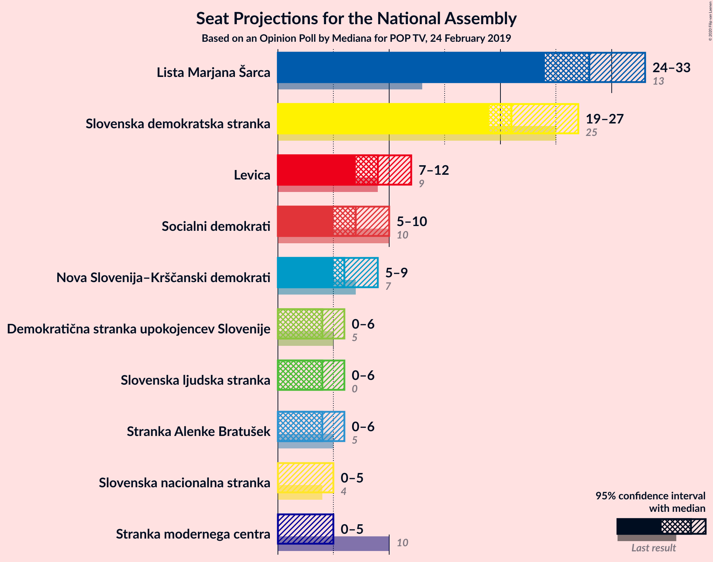
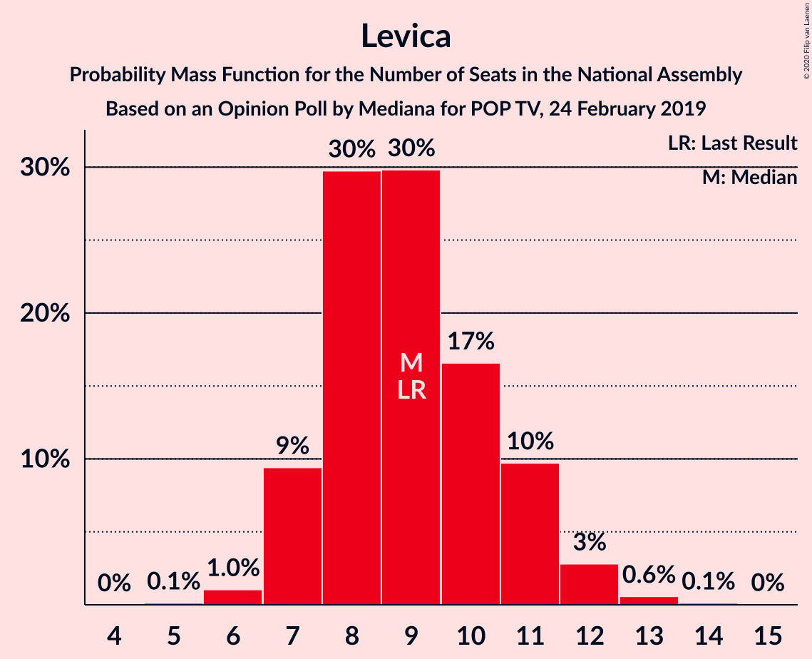
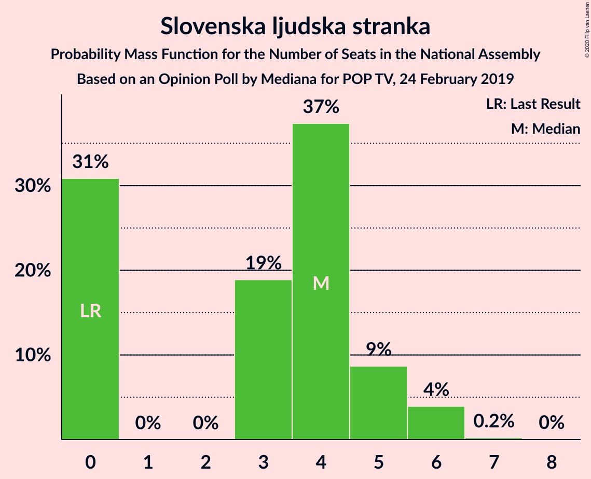
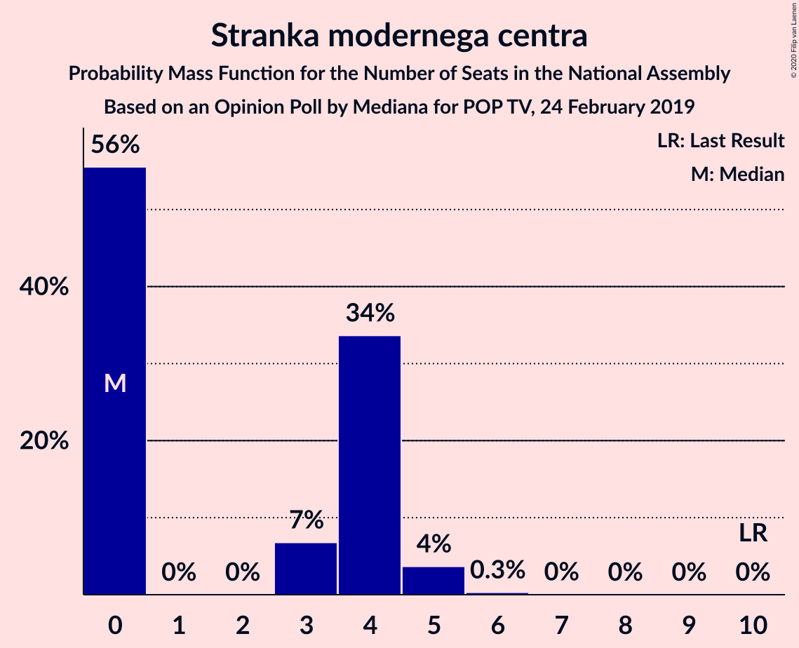
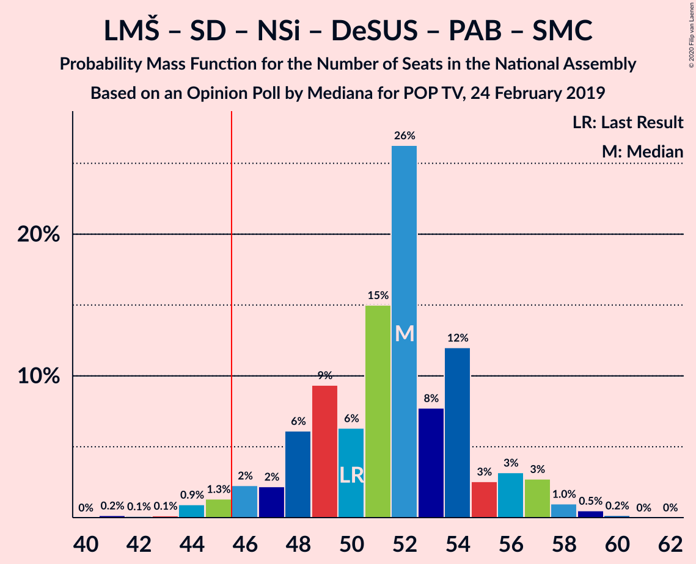
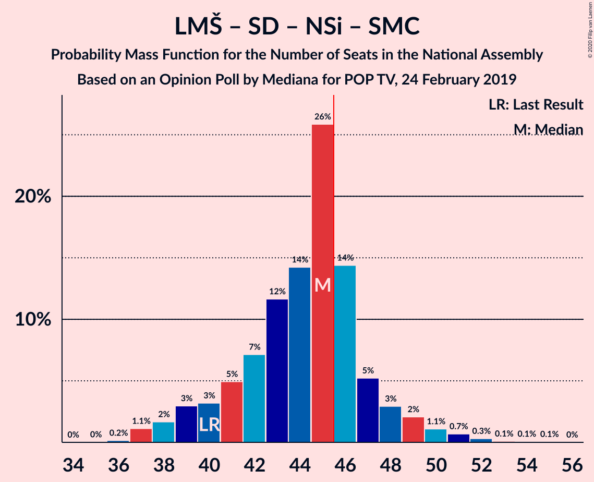

# Opinion Poll by Mediana for POP TV, 24 February 2019

<a href="#voting-intentions">Voting Intentions</a> | <a href="#seats">Seats</a> | <a href="#coalitions">Coalitions</a> | <a href="#technical-information">Technical Information</a>

## Voting Intentions

### Confidence Intervals

| Party | Last Result | Poll Result | 80% Confidence Interval | 90% Confidence Interval | 95% Confidence Interval | 99% Confidence Interval |
|:-----:|:-----------:|:-----------:|:-----------------------:|:-----------------------:|:-----------------------:|:-----------------------:|
| Lista Marjana Šarca | 12.6% | 29.3% | 26.8–31.9% |26.1–32.7% |25.5–33.3% |24.3–34.6% |
| Slovenska demokratska stranka | 24.9% | 22.9% | 20.6–25.4% |20.0–26.1% |19.4–26.7% |18.4–27.9% |
| Levica | 9.3% | 9.5% | 8.0–11.4% |7.6–11.9% |7.3–12.3% |6.6–13.3% |
| Socialni demokrati | 9.9% | 7.8% | 6.4–9.5% |6.1–10.0% |5.7–10.4% |5.2–11.3% |
| Nova Slovenija–Krščanski demokrati | 7.2% | 6.8% | 5.5–8.4% |5.2–8.9% |4.9–9.3% |4.4–10.1% |
| Stranka Alenke Bratušek | 5.1% | 4.7% | 3.7–6.1% |3.4–6.5% |3.1–6.8% |2.7–7.6% |
| Demokratična stranka upokojencev Slovenije | 4.9% | 4.7% | 3.7–6.1% |3.4–6.5% |3.1–6.8% |2.7–7.6% |
| Slovenska ljudska stranka | 2.6% | 4.1% | 3.2–5.4% |2.9–5.8% |2.7–6.1% |2.3–6.9% |
| Stranka modernega centra | 9.7% | 3.5% | 2.7–4.8% |2.4–5.1% |2.2–5.5% |1.9–6.1% |
| Slovenska nacionalna stranka | 4.2% | 3.5% | 2.7–4.8% |2.4–5.1% |2.2–5.5% |1.9–6.1% |

*Note:* The poll result column reflects the actual value used in the calculations. Published results may vary slightly, and in addition be rounded to fewer digits.

## Seats

### Confidence Intervals

| Party | Last Result | Median | 80% Confidence Interval | 90% Confidence Interval | 95% Confidence Interval | 99% Confidence Interval |
|:-----:|:-----------:|:------:|:-----------------------:|:-----------------------:|:-----------------------:|:-----------------------:|
| <a href="#lista-marjana-šarca">Lista Marjana Šarca</a> | 13 | 26 | 26 |26–27 |26–29 |25–31 |
| <a href="#slovenska-demokratska-stranka">Slovenska demokratska stranka</a> | 25 | 22 | 22 |22 |19–22 |19–26 |
| <a href="#levica">Levica</a> | 9 | 9 | 9 |9–10 |9–11 |6–12 |
| <a href="#socialni-demokrati">Socialni demokrati</a> | 10 | 6 | 6 |6 |6–9 |6–9 |
| <a href="#nova-slovenija–krščanski-demokrati">Nova Slovenija–Krščanski demokrati</a> | 7 | 7 | 7 |7 |5–8 |5–10 |
| <a href="#stranka-alenke-bratušek">Stranka Alenke Bratušek</a> | 5 | 0 | 0 |0–4 |0–4 |0–5 |
| <a href="#demokratična-stranka-upokojencev-slovenije">Demokratična stranka upokojencev Slovenije</a> | 5 | 5 | 5 |5 |0–5 |0–7 |
| <a href="#slovenska-ljudska-stranka">Slovenska ljudska stranka</a> | 0 | 5 | 5 |4–5 |0–5 |0–6 |
| <a href="#stranka-modernega-centra">Stranka modernega centra</a> | 10 | 4 | 4 |4 |0–4 |0–4 |
| <a href="#slovenska-nacionalna-stranka">Slovenska nacionalna stranka</a> | 4 | 0 | 0 |0 |0–5 |0–6 |

### Lista Marjana Šarca

*For a full overview of the results for this party, see the [Lista Marjana Šarca](party-listamarjanašarca.html) page.*

| Number of Seats | Probability | Accumulated | Special Marks |
|:---------------:|:-----------:|:-----------:|:-------------:|
| 13 | 0% | 100% | Last Result |
| 14 | 0% | 100% |  |
| 15 | 0% | 100% |  |
| 16 | 0% | 100% |  |
| 17 | 0% | 100% |  |
| 18 | 0% | 100% |  |
| 19 | 0% | 100% |  |
| 20 | 0% | 100% |  |
| 21 | 0.1% | 100% |  |
| 22 | 0% | 99.9% |  |
| 23 | 0.3% | 99.9% |  |
| 24 | 0.1% | 99.6% |  |
| 25 | 0.4% | 99.5% |  |
| 26 | 92% | 99.1% | Median |
| 27 | 2% | 7% |  |
| 28 | 1.2% | 5% |  |
| 29 | 1.2% | 4% |  |
| 30 | 0.1% | 2% |  |
| 31 | 2% | 2% |  |
| 32 | 0% | 0.1% |  |
| 33 | 0.1% | 0.1% |  |
| 34 | 0% | 0% |  |

### Slovenska demokratska stranka

*For a full overview of the results for this party, see the [Slovenska demokratska stranka](party-slovenskademokratskastranka.html) page.*

| Number of Seats | Probability | Accumulated | Special Marks |
|:---------------:|:-----------:|:-----------:|:-------------:|
| 18 | 0% | 100% |  |
| 19 | 3% | 99.9% |  |
| 20 | 0.5% | 97% |  |
| 21 | 1.3% | 97% |  |
| 22 | 93% | 96% | Median |
| 23 | 0.1% | 2% |  |
| 24 | 0% | 2% |  |
| 25 | 0% | 2% | Last Result |
| 26 | 2% | 2% |  |
| 27 | 0% | 0.1% |  |
| 28 | 0% | 0% |  |

### Levica

*For a full overview of the results for this party, see the [Levica](party-levica.html) page.*

| Number of Seats | Probability | Accumulated | Special Marks |
|:---------------:|:-----------:|:-----------:|:-------------:|
| 5 | 0.2% | 100% |  |
| 6 | 1.2% | 99.8% |  |
| 7 | 0% | 98.6% |  |
| 8 | 0% | 98.6% |  |
| 9 | 92% | 98.6% | Last Result, Median |
| 10 | 2% | 6% |  |
| 11 | 2% | 4% |  |
| 12 | 2% | 2% |  |
| 13 | 0.1% | 0.1% |  |
| 14 | 0% | 0% |  |

### Socialni demokrati

*For a full overview of the results for this party, see the [Socialni demokrati](party-socialnidemokrati.html) page.*

| Number of Seats | Probability | Accumulated | Special Marks |
|:---------------:|:-----------:|:-----------:|:-------------:|
| 5 | 0.2% | 100% |  |
| 6 | 96% | 99.7% | Median |
| 7 | 0.4% | 4% |  |
| 8 | 0.6% | 4% |  |
| 9 | 3% | 3% |  |
| 10 | 0% | 0% | Last Result |

### Nova Slovenija–Krščanski demokrati

*For a full overview of the results for this party, see the [Nova Slovenija–Krščanski demokrati](party-novaslovenija–krščanskidemokrati.html) page.*

| Number of Seats | Probability | Accumulated | Special Marks |
|:---------------:|:-----------:|:-----------:|:-------------:|
| 4 | 0.2% | 100% |  |
| 5 | 3% | 99.8% |  |
| 6 | 0.3% | 97% |  |
| 7 | 93% | 96% | Last Result, Median |
| 8 | 2% | 4% |  |
| 9 | 0% | 2% |  |
| 10 | 2% | 2% |  |
| 11 | 0% | 0% |  |

### Stranka Alenke Bratušek

*For a full overview of the results for this party, see the [Stranka Alenke Bratušek](party-strankaalenkebratušek.html) page.*

| Number of Seats | Probability | Accumulated | Special Marks |
|:---------------:|:-----------:|:-----------:|:-------------:|
| 0 | 95% | 100% | Median |
| 1 | 0% | 5% |  |
| 2 | 0% | 5% |  |
| 3 | 0% | 5% |  |
| 4 | 4% | 5% |  |
| 5 | 1.4% | 2% | Last Result |
| 6 | 0% | 0.3% |  |
| 7 | 0.2% | 0.3% |  |
| 8 | 0.1% | 0.1% |  |
| 9 | 0% | 0% |  |

### Demokratična stranka upokojencev Slovenije

*For a full overview of the results for this party, see the [Demokratična stranka upokojencev Slovenije](party-demokratičnastrankaupokojencevslovenije.html) page.*

| Number of Seats | Probability | Accumulated | Special Marks |
|:---------------:|:-----------:|:-----------:|:-------------:|
| 0 | 4% | 100% |  |
| 1 | 0% | 96% |  |
| 2 | 0% | 96% |  |
| 3 | 0.1% | 96% |  |
| 4 | 0.5% | 96% |  |
| 5 | 94% | 95% | Last Result, Median |
| 6 | 0% | 2% |  |
| 7 | 1.5% | 2% |  |
| 8 | 0% | 0.1% |  |
| 9 | 0% | 0% |  |

### Slovenska ljudska stranka

*For a full overview of the results for this party, see the [Slovenska ljudska stranka](party-slovenskaljudskastranka.html) page.*

| Number of Seats | Probability | Accumulated | Special Marks |
|:---------------:|:-----------:|:-----------:|:-------------:|
| 0 | 5% | 100% | Last Result |
| 1 | 0% | 95% |  |
| 2 | 0% | 95% |  |
| 3 | 0% | 95% |  |
| 4 | 2% | 95% |  |
| 5 | 92% | 93% | Median |
| 6 | 0.7% | 0.7% |  |
| 7 | 0% | 0% |  |

### Stranka modernega centra

*For a full overview of the results for this party, see the [Stranka modernega centra](party-strankamodernegacentra.html) page.*

| Number of Seats | Probability | Accumulated | Special Marks |
|:---------------:|:-----------:|:-----------:|:-------------:|
| 0 | 4% | 100% |  |
| 1 | 0% | 96% |  |
| 2 | 0% | 96% |  |
| 3 | 0% | 96% |  |
| 4 | 96% | 96% | Median |
| 5 | 0% | 0.2% |  |
| 6 | 0% | 0.2% |  |
| 7 | 0.2% | 0.2% |  |
| 8 | 0% | 0% |  |
| 9 | 0% | 0% |  |
| 10 | 0% | 0% | Last Result |

### Slovenska nacionalna stranka

*For a full overview of the results for this party, see the [Slovenska nacionalna stranka](party-slovenskanacionalnastranka.html) page.*

| Number of Seats | Probability | Accumulated | Special Marks |
|:---------------:|:-----------:|:-----------:|:-------------:|
| 0 | 96% | 100% | Median |
| 1 | 0% | 4% |  |
| 2 | 0% | 4% |  |
| 3 | 0% | 4% |  |
| 4 | 0.3% | 4% | Last Result |
| 5 | 2% | 3% |  |
| 6 | 1.0% | 1.2% |  |
| 7 | 0.1% | 0.2% |  |
| 8 | 0% | 0% |  |

## Coalitions

### Confidence Intervals

| Coalition | Last Result | Median | Majority? | 80% Confidence Interval | 90% Confidence Interval | 95% Confidence Interval | 99% Confidence Interval |
|:---------:|:-----------:|:------:|:---------:|:-----------------------:|:-----------------------:|:-----------------------:|:-----------------------:|
| Lista Marjana Šarca – Slovenska demokratska stranka – Demokratična stranka upokojencev Slovenije | 43 | 53 | 100% | 53 | 53 | 50–53 | 48–56 |
| Lista Marjana Šarca – Socialni demokrati – Nova Slovenija–Krščanski demokrati – Demokratična stranka upokojencev Slovenije – Stranka Alenke Bratušek – Stranka modernega centra | 50 | 48 | 98% | 48 | 48–51 | 48–53 | 43–55 |
| Lista Marjana Šarca – Slovenska demokratska stranka | 38 | 48 | 99.1% | 48 | 48–50 | 48–51 | 45–53 |
| Lista Marjana Šarca – Socialni demokrati – Nova Slovenija–Krščanski demokrati – Demokratična stranka upokojencev Slovenije – Stranka modernega centra | 45 | 48 | 98% | 48 | 48 | 46–49 | 43–51 |
| Lista Marjana Šarca – Socialni demokrati – Demokratična stranka upokojencev Slovenije – Stranka Alenke Bratušek – Stranka modernega centra | 43 | 41 | 4% | 41 | 41–44 | 41–48 | 33–50 |
| Lista Marjana Šarca – Socialni demokrati – Nova Slovenija–Krščanski demokrati – Demokratična stranka upokojencev Slovenije | 35 | 44 | 3% | 44 | 44–45 | 44–46 | 43–51 |
| Lista Marjana Šarca – Socialni demokrati – Nova Slovenija–Krščanski demokrati – Stranka modernega centra | 40 | 43 | 3% | 43 | 43 | 43–46 | 39–49 |
| Lista Marjana Šarca – Socialni demokrati – Nova Slovenija–Krščanski demokrati | 30 | 39 | 1.1% | 39 | 39–43 | 39–45 | 39–46 |
| Lista Marjana Šarca – Socialni demokrati – Demokratična stranka upokojencev Slovenije – Stranka modernega centra | 38 | 41 | 0.1% | 41 | 41 | 38–44 | 33–45 |
| Lista Marjana Šarca – Socialni demokrati – Demokratična stranka upokojencev Slovenije | 28 | 37 | 0% | 37 | 37–38 | 37–40 | 33–43 |
| Lista Marjana Šarca – Socialni demokrati – Stranka modernega centra | 33 | 36 | 0% | 36 | 36 | 33–38 | 32–44 |
| Lista Marjana Šarca – Socialni demokrati | 23 | 32 | 0% | 32 | 32–33 | 32–38 | 31–40 |
| Socialni demokrati – Demokratična stranka upokojencev Slovenije – Stranka modernega centra | 25 | 15 | 0% | 15 | 13–15 | 13–15 | 6–17 |

### Lista Marjana Šarca – Slovenska demokratska stranka – Demokratična stranka upokojencev Slovenije

| Number of Seats | Probability | Accumulated | Special Marks |
|:---------------:|:-----------:|:-----------:|:-------------:|
| 43 | 0% | 100% | Last Result |
| 44 | 0% | 100% |  |
| 45 | 0% | 100% |  |
| 46 | 0.3% | 100% | Majority |
| 47 | 0% | 99.7% |  |
| 48 | 0.2% | 99.7% |  |
| 49 | 0% | 99.5% |  |
| 50 | 2% | 99.5% |  |
| 51 | 0% | 97% |  |
| 52 | 0.4% | 97% |  |
| 53 | 94% | 97% | Median |
| 54 | 0% | 2% |  |
| 55 | 0.1% | 2% |  |
| 56 | 2% | 2% |  |
| 57 | 0% | 0.2% |  |
| 58 | 0% | 0.2% |  |
| 59 | 0.1% | 0.1% |  |
| 60 | 0% | 0% |  |

### Lista Marjana Šarca – Socialni demokrati – Nova Slovenija–Krščanski demokrati – Demokratična stranka upokojencev Slovenije – Stranka Alenke Bratušek – Stranka modernega centra

| Number of Seats | Probability | Accumulated | Special Marks |
|:---------------:|:-----------:|:-----------:|:-------------:|
| 43 | 2% | 100% |  |
| 44 | 0% | 98% |  |
| 45 | 0% | 98% |  |
| 46 | 0.4% | 98% | Majority |
| 47 | 0.1% | 98% |  |
| 48 | 92% | 98% | Median |
| 49 | 0.1% | 5% |  |
| 50 | 0.2% | 5% | Last Result |
| 51 | 0.7% | 5% |  |
| 52 | 0.1% | 4% |  |
| 53 | 2% | 4% |  |
| 54 | 0% | 2% |  |
| 55 | 2% | 2% |  |
| 56 | 0% | 0.1% |  |
| 57 | 0% | 0.1% |  |
| 58 | 0.1% | 0.1% |  |
| 59 | 0% | 0% |  |

### Lista Marjana Šarca – Slovenska demokratska stranka

| Number of Seats | Probability | Accumulated | Special Marks |
|:---------------:|:-----------:|:-----------:|:-------------:|
| 38 | 0% | 100% | Last Result |
| 39 | 0% | 100% |  |
| 40 | 0% | 100% |  |
| 41 | 0% | 100% |  |
| 42 | 0.3% | 100% |  |
| 43 | 0% | 99.6% |  |
| 44 | 0.1% | 99.6% |  |
| 45 | 0.4% | 99.5% |  |
| 46 | 0% | 99.1% | Majority |
| 47 | 0% | 99.1% |  |
| 48 | 93% | 99.1% | Median |
| 49 | 1.0% | 7% |  |
| 50 | 2% | 6% |  |
| 51 | 1.3% | 3% |  |
| 52 | 0% | 2% |  |
| 53 | 2% | 2% |  |
| 54 | 0% | 0.2% |  |
| 55 | 0.1% | 0.1% |  |
| 56 | 0% | 0% |  |

### Lista Marjana Šarca – Socialni demokrati – Nova Slovenija–Krščanski demokrati – Demokratična stranka upokojencev Slovenije – Stranka modernega centra

| Number of Seats | Probability | Accumulated | Special Marks |
|:---------------:|:-----------:|:-----------:|:-------------:|
| 43 | 2% | 100% |  |
| 44 | 0.2% | 98% |  |
| 45 | 0% | 98% | Last Result |
| 46 | 0.7% | 98% | Majority |
| 47 | 0.3% | 97% |  |
| 48 | 92% | 97% | Median |
| 49 | 2% | 5% |  |
| 50 | 1.1% | 2% |  |
| 51 | 1.2% | 1.2% |  |
| 52 | 0% | 0.1% |  |
| 53 | 0% | 0% |  |

### Lista Marjana Šarca – Socialni demokrati – Demokratična stranka upokojencev Slovenije – Stranka Alenke Bratušek – Stranka modernega centra

| Number of Seats | Probability | Accumulated | Special Marks |
|:---------------:|:-----------:|:-----------:|:-------------:|
| 33 | 2% | 100% |  |
| 34 | 0% | 98% |  |
| 35 | 0% | 98% |  |
| 36 | 0% | 98% |  |
| 37 | 0% | 98% |  |
| 38 | 0.4% | 98% |  |
| 39 | 0% | 98% |  |
| 40 | 0% | 98% |  |
| 41 | 92% | 98% | Median |
| 42 | 0.1% | 5% |  |
| 43 | 0.3% | 5% | Last Result |
| 44 | 0.4% | 5% |  |
| 45 | 0.3% | 5% |  |
| 46 | 0.1% | 4% | Majority |
| 47 | 1.1% | 4% |  |
| 48 | 2% | 3% |  |
| 49 | 0% | 1.1% |  |
| 50 | 1.0% | 1.1% |  |
| 51 | 0% | 0.1% |  |
| 52 | 0% | 0.1% |  |
| 53 | 0.1% | 0.1% |  |
| 54 | 0% | 0% |  |

### Lista Marjana Šarca – Socialni demokrati – Nova Slovenija–Krščanski demokrati – Demokratična stranka upokojencev Slovenije

| Number of Seats | Probability | Accumulated | Special Marks |
|:---------------:|:-----------:|:-----------:|:-------------:|
| 35 | 0% | 100% | Last Result |
| 36 | 0% | 100% |  |
| 37 | 0% | 100% |  |
| 38 | 0% | 100% |  |
| 39 | 0% | 100% |  |
| 40 | 0% | 100% |  |
| 41 | 0% | 99.9% |  |
| 42 | 0.4% | 99.9% |  |
| 43 | 2% | 99.6% |  |
| 44 | 92% | 98% | Median |
| 45 | 2% | 5% |  |
| 46 | 1.4% | 3% | Majority |
| 47 | 0.3% | 2% |  |
| 48 | 0% | 1.3% |  |
| 49 | 0.1% | 1.2% |  |
| 50 | 0% | 1.1% |  |
| 51 | 1.1% | 1.1% |  |
| 52 | 0% | 0% |  |

### Lista Marjana Šarca – Socialni demokrati – Nova Slovenija–Krščanski demokrati – Stranka modernega centra

| Number of Seats | Probability | Accumulated | Special Marks |
|:---------------:|:-----------:|:-----------:|:-------------:|
| 38 | 0.1% | 100% |  |
| 39 | 0.5% | 99.9% |  |
| 40 | 0.1% | 99.4% | Last Result |
| 41 | 0% | 99.3% |  |
| 42 | 0.6% | 99.3% |  |
| 43 | 95% | 98.7% | Median |
| 44 | 0% | 4% |  |
| 45 | 0.2% | 4% |  |
| 46 | 1.1% | 3% | Majority |
| 47 | 0% | 2% |  |
| 48 | 0.1% | 2% |  |
| 49 | 2% | 2% |  |
| 50 | 0.1% | 0.1% |  |
| 51 | 0% | 0% |  |

### Lista Marjana Šarca – Socialni demokrati – Nova Slovenija–Krščanski demokrati

| Number of Seats | Probability | Accumulated | Special Marks |
|:---------------:|:-----------:|:-----------:|:-------------:|
| 30 | 0% | 100% | Last Result |
| 31 | 0% | 100% |  |
| 32 | 0% | 100% |  |
| 33 | 0% | 100% |  |
| 34 | 0% | 100% |  |
| 35 | 0% | 100% |  |
| 36 | 0% | 99.9% |  |
| 37 | 0% | 99.9% |  |
| 38 | 0.3% | 99.9% |  |
| 39 | 94% | 99.6% | Median |
| 40 | 0.1% | 6% |  |
| 41 | 0.1% | 6% |  |
| 42 | 0.3% | 6% |  |
| 43 | 2% | 5% |  |
| 44 | 0% | 3% |  |
| 45 | 2% | 3% |  |
| 46 | 1.1% | 1.1% | Majority |
| 47 | 0% | 0% |  |

### Lista Marjana Šarca – Socialni demokrati – Demokratična stranka upokojencev Slovenije – Stranka modernega centra

| Number of Seats | Probability | Accumulated | Special Marks |
|:---------------:|:-----------:|:-----------:|:-------------:|
| 33 | 2% | 100% |  |
| 34 | 0% | 98% |  |
| 35 | 0% | 98% |  |
| 36 | 0.1% | 98% |  |
| 37 | 0.1% | 98% |  |
| 38 | 0.8% | 98% | Last Result |
| 39 | 0% | 97% |  |
| 40 | 0.3% | 97% |  |
| 41 | 92% | 97% | Median |
| 42 | 0% | 5% |  |
| 43 | 1.1% | 5% |  |
| 44 | 2% | 3% |  |
| 45 | 1.1% | 1.2% |  |
| 46 | 0.1% | 0.1% | Majority |
| 47 | 0% | 0% |  |

### Lista Marjana Šarca – Socialni demokrati – Demokratična stranka upokojencev Slovenije

| Number of Seats | Probability | Accumulated | Special Marks |
|:---------------:|:-----------:|:-----------:|:-------------:|
| 28 | 0% | 100% | Last Result |
| 29 | 0% | 100% |  |
| 30 | 0% | 100% |  |
| 31 | 0% | 100% |  |
| 32 | 0% | 100% |  |
| 33 | 2% | 100% |  |
| 34 | 0.3% | 98% |  |
| 35 | 0% | 98% |  |
| 36 | 0.1% | 98% |  |
| 37 | 92% | 98% | Median |
| 38 | 0.5% | 5% |  |
| 39 | 0.1% | 5% |  |
| 40 | 2% | 5% |  |
| 41 | 1.0% | 2% |  |
| 42 | 0% | 1.3% |  |
| 43 | 1.1% | 1.3% |  |
| 44 | 0% | 0.1% |  |
| 45 | 0.1% | 0.1% |  |
| 46 | 0% | 0% | Majority |

### Lista Marjana Šarca – Socialni demokrati – Stranka modernega centra

| Number of Seats | Probability | Accumulated | Special Marks |
|:---------------:|:-----------:|:-----------:|:-------------:|
| 30 | 0.1% | 100% |  |
| 31 | 0.4% | 99.9% |  |
| 32 | 0% | 99.5% |  |
| 33 | 2% | 99.5% | Last Result |
| 34 | 0.3% | 97% |  |
| 35 | 0.3% | 97% |  |
| 36 | 92% | 97% | Median |
| 37 | 0% | 5% |  |
| 38 | 2% | 5% |  |
| 39 | 0.1% | 2% |  |
| 40 | 0% | 2% |  |
| 41 | 0.1% | 2% |  |
| 42 | 0% | 2% |  |
| 43 | 0.1% | 2% |  |
| 44 | 2% | 2% |  |
| 45 | 0% | 0% |  |

### Lista Marjana Šarca – Socialni demokrati

| Number of Seats | Probability | Accumulated | Special Marks |
|:---------------:|:-----------:|:-----------:|:-------------:|
| 23 | 0% | 100% | Last Result |
| 24 | 0% | 100% |  |
| 25 | 0% | 100% |  |
| 26 | 0.1% | 100% |  |
| 27 | 0% | 99.9% |  |
| 28 | 0% | 99.9% |  |
| 29 | 0% | 99.9% |  |
| 30 | 0.3% | 99.9% |  |
| 31 | 0.4% | 99.6% |  |
| 32 | 92% | 99.2% | Median |
| 33 | 2% | 7% |  |
| 34 | 1.0% | 5% |  |
| 35 | 0.3% | 4% |  |
| 36 | 0.1% | 4% |  |
| 37 | 0.1% | 3% |  |
| 38 | 1.1% | 3% |  |
| 39 | 0% | 2% |  |
| 40 | 2% | 2% |  |
| 41 | 0.1% | 0.1% |  |
| 42 | 0% | 0% |  |

### Socialni demokrati – Demokratična stranka upokojencev Slovenije – Stranka modernega centra

| Number of Seats | Probability | Accumulated | Special Marks |
|:---------------:|:-----------:|:-----------:|:-------------:|
| 6 | 2% | 100% |  |
| 7 | 0% | 98% |  |
| 8 | 0% | 98% |  |
| 9 | 0% | 98% |  |
| 10 | 0.1% | 98% |  |
| 11 | 0% | 98% |  |
| 12 | 0.2% | 98% |  |
| 13 | 3% | 98% |  |
| 14 | 1.2% | 95% |  |
| 15 | 93% | 94% | Median |
| 16 | 0.1% | 1.2% |  |
| 17 | 1.1% | 1.1% |  |
| 18 | 0% | 0.1% |  |
| 19 | 0% | 0% |  |
| 20 | 0% | 0% |  |
| 21 | 0% | 0% |  |
| 22 | 0% | 0% |  |
| 23 | 0% | 0% |  |
| 24 | 0% | 0% |  |
| 25 | 0% | 0% | Last Result |

## Technical Information

### Opinion Poll

+ **Polling firm:** Mediana
+ **Commissioner(s):** POP TV
+ **Fieldwork period:** 24 February 2019

### Calculations

+ **Sample size:** 516
+ **Simulations done:** 1,024
+ **Error estimate:** 2.71%

