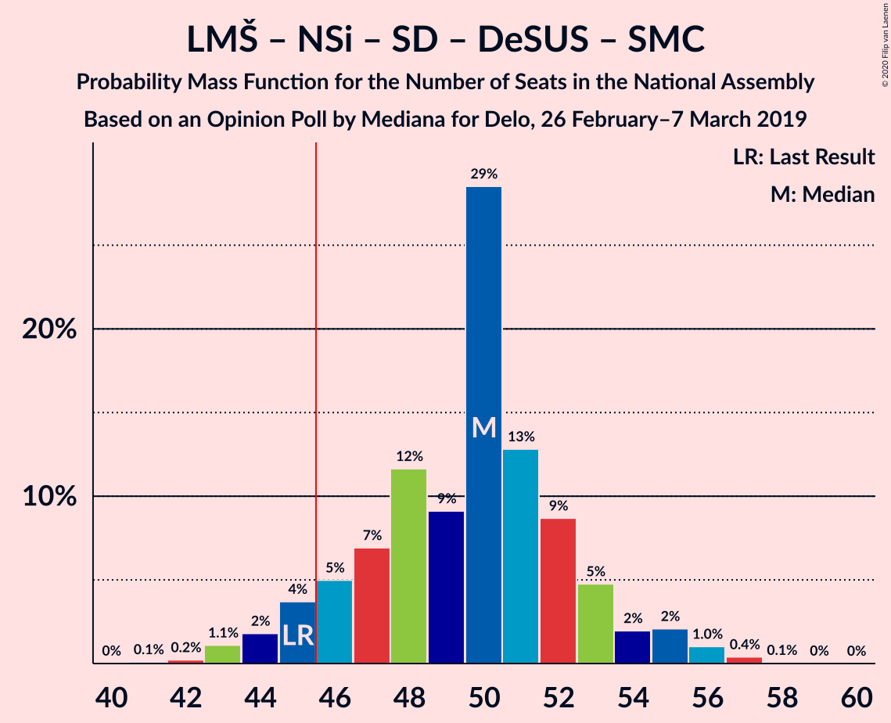
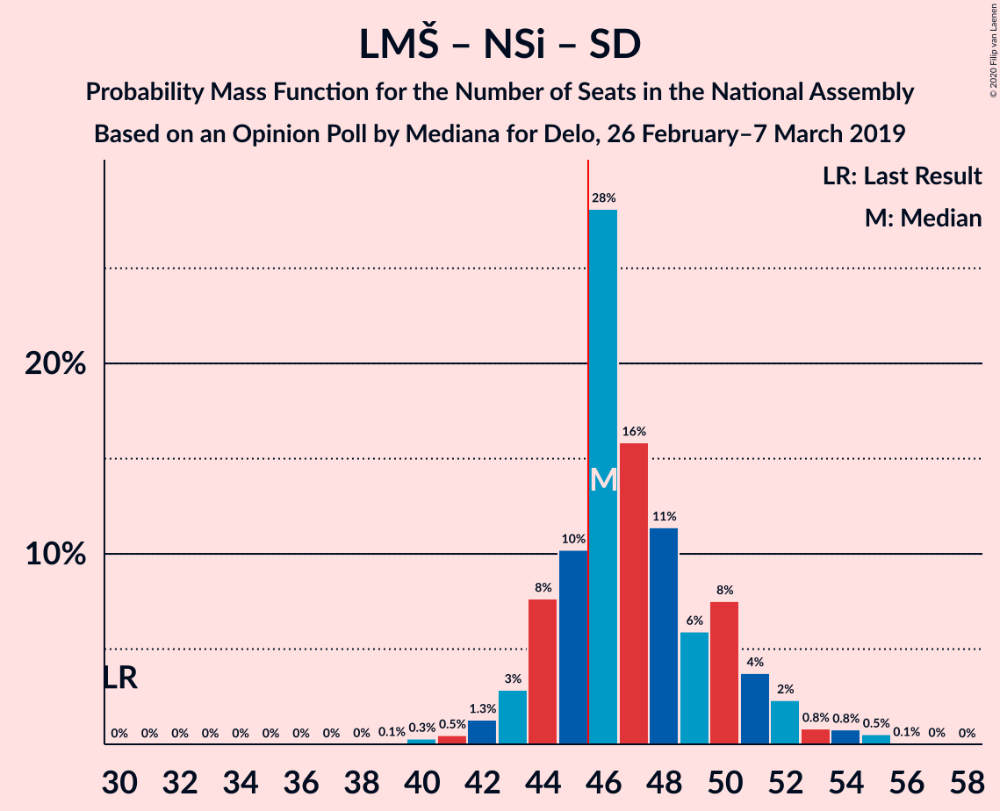

# Opinion Poll by Mediana for Delo, 26 February–7 March 2019

<a href="#voting-intentions">Voting Intentions</a> | <a href="#seats">Seats</a> | <a href="#coalitions">Coalitions</a> | <a href="#technical-information">Technical Information</a>

## Voting Intentions

### Confidence Intervals

| Party | Last Result | Poll Result | 80% Confidence Interval | 90% Confidence Interval | 95% Confidence Interval | 99% Confidence Interval |
|:-----:|:-----------:|:-----------:|:-----------------------:|:-----------------------:|:-----------------------:|:-----------------------:|
| Lista Marjana Šarca | 12.6% | 28.2% | 25.8–30.9% |25.1–31.6% |24.5–32.3% |23.4–33.6% |
| Slovenska demokratska stranka | 24.9% | 23.2% | 21.0–25.7% |20.3–26.4% |19.8–27.1% |18.7–28.3% |
| Levica | 9.3% | 11.8% | 10.2–13.8% |9.7–14.4% |9.3–14.9% |8.6–15.9% |
| Nova Slovenija–Krščanski demokrati | 7.2% | 9.9% | 8.4–11.8% |7.9–12.3% |7.6–12.7% |6.9–13.7% |
| Socialni demokrati | 9.9% | 9.7% | 8.2–11.5% |7.8–12.1% |7.4–12.5% |6.8–13.5% |
| Demokratična stranka upokojencev Slovenije | 4.9% | 4.1% | 3.1–5.4% |2.9–5.8% |2.7–6.1% |2.3–6.8% |
| Slovenska nacionalna stranka | 4.2% | 3.1% | 2.3–4.3% |2.1–4.7% |1.9–5.0% |1.6–5.6% |
| Slovenska ljudska stranka | 2.6% | 2.7% | 2.0–3.9% |1.8–4.2% |1.6–4.5% |1.3–5.1% |
| Stranka Alenke Bratušek | 5.1% | 2.1% | 1.5–3.2% |1.3–3.5% |1.2–3.8% |0.9–4.4% |
| Stranka modernega centra | 9.7% | 1.2% | 0.7–2.0% |0.6–2.3% |0.5–2.5% |0.4–3.0% |

*Note:* The poll result column reflects the actual value used in the calculations. Published results may vary slightly, and in addition be rounded to fewer digits.

## Seats

### Confidence Intervals

| Party | Last Result | Median | 80% Confidence Interval | 90% Confidence Interval | 95% Confidence Interval | 99% Confidence Interval |
|:-----:|:-----------:|:------:|:-----------------------:|:-----------------------:|:-----------------------:|:-----------------------:|
| <a href="#lista-marjana-šarca">Lista Marjana Šarca</a> | 13 | 25 | 25 |25 |25–27 |23–28 |
| <a href="#slovenska-demokratska-stranka">Slovenska demokratska stranka</a> | 25 | 22 | 22 |22 |22–23 |20–25 |
| <a href="#levica">Levica</a> | 9 | 13 | 13 |13 |11–13 |10–14 |
| <a href="#nova-slovenija–krščanski-demokrati">Nova Slovenija–Krščanski demokrati</a> | 7 | 7 | 7 |7–8 |7–9 |7–12 |
| <a href="#socialni-demokrati">Socialni demokrati</a> | 10 | 8 | 8 |8 |8–10 |5–12 |
| <a href="#demokratična-stranka-upokojencev-slovenije">Demokratična stranka upokojencev Slovenije</a> | 5 | 4 | 4 |4 |0–4 |0–5 |
| <a href="#slovenska-nacionalna-stranka">Slovenska nacionalna stranka</a> | 4 | 5 | 5 |5 |0–5 |0–5 |
| <a href="#slovenska-ljudska-stranka">Slovenska ljudska stranka</a> | 0 | 0 | 0 |0 |0–4 |0–4 |
| <a href="#stranka-alenke-bratušek">Stranka Alenke Bratušek</a> | 5 | 0 | 0 |0 |0 |0–4 |
| <a href="#stranka-modernega-centra">Stranka modernega centra</a> | 10 | 0 | 0 |0 |0 |0 |

### Lista Marjana Šarca

*For a full overview of the results for this party, see the [Lista Marjana Šarca](party-listamarjanašarca.html) page.*

| Number of Seats | Probability | Accumulated | Special Marks |
|:---------------:|:-----------:|:-----------:|:-------------:|
| 13 | 0% | 100% | Last Result |
| 14 | 0% | 100% |  |
| 15 | 0% | 100% |  |
| 16 | 0% | 100% |  |
| 17 | 0% | 100% |  |
| 18 | 0% | 100% |  |
| 19 | 0% | 100% |  |
| 20 | 0% | 100% |  |
| 21 | 0% | 100% |  |
| 22 | 0% | 100% |  |
| 23 | 0.9% | 100% |  |
| 24 | 0.5% | 99.0% |  |
| 25 | 94% | 98.5% | Median |
| 26 | 2% | 4% |  |
| 27 | 2% | 3% |  |
| 28 | 0.3% | 0.6% |  |
| 29 | 0% | 0.2% |  |
| 30 | 0% | 0.2% |  |
| 31 | 0.1% | 0.2% |  |
| 32 | 0% | 0.1% |  |
| 33 | 0% | 0.1% |  |
| 34 | 0% | 0.1% |  |
| 35 | 0% | 0.1% |  |
| 36 | 0.1% | 0.1% |  |
| 37 | 0% | 0% |  |

### Slovenska demokratska stranka

*For a full overview of the results for this party, see the [Slovenska demokratska stranka](party-slovenskademokratskastranka.html) page.*

| Number of Seats | Probability | Accumulated | Special Marks |
|:---------------:|:-----------:|:-----------:|:-------------:|
| 20 | 2% | 100% |  |
| 21 | 0.2% | 98% |  |
| 22 | 95% | 98% | Median |
| 23 | 0.3% | 3% |  |
| 24 | 0% | 2% |  |
| 25 | 2% | 2% | Last Result |
| 26 | 0% | 0.1% |  |
| 27 | 0% | 0.1% |  |
| 28 | 0.1% | 0.1% |  |
| 29 | 0% | 0% |  |

### Levica

*For a full overview of the results for this party, see the [Levica](party-levica.html) page.*

| Number of Seats | Probability | Accumulated | Special Marks |
|:---------------:|:-----------:|:-----------:|:-------------:|
| 9 | 0.2% | 100% | Last Result |
| 10 | 2% | 99.8% |  |
| 11 | 0.6% | 98% |  |
| 12 | 1.4% | 97% |  |
| 13 | 94% | 96% | Median |
| 14 | 1.5% | 2% |  |
| 15 | 0% | 0% |  |

### Nova Slovenija–Krščanski demokrati

*For a full overview of the results for this party, see the [Nova Slovenija–Krščanski demokrati](party-novaslovenija–krščanskidemokrati.html) page.*

| Number of Seats | Probability | Accumulated | Special Marks |
|:---------------:|:-----------:|:-----------:|:-------------:|
| 7 | 94% | 100% | Last Result, Median |
| 8 | 1.2% | 6% |  |
| 9 | 3% | 4% |  |
| 10 | 0% | 2% |  |
| 11 | 0.1% | 2% |  |
| 12 | 1.4% | 1.4% |  |
| 13 | 0% | 0% |  |

### Socialni demokrati

*For a full overview of the results for this party, see the [Socialni demokrati](party-socialnidemokrati.html) page.*

| Number of Seats | Probability | Accumulated | Special Marks |
|:---------------:|:-----------:|:-----------:|:-------------:|
| 5 | 0.9% | 100% |  |
| 6 | 0% | 99.1% |  |
| 7 | 1.4% | 99.0% |  |
| 8 | 94% | 98% | Median |
| 9 | 0.6% | 3% |  |
| 10 | 1.1% | 3% | Last Result |
| 11 | 0.3% | 2% |  |
| 12 | 1.2% | 1.2% |  |
| 13 | 0% | 0% |  |

### Demokratična stranka upokojencev Slovenije

*For a full overview of the results for this party, see the [Demokratična stranka upokojencev Slovenije](party-demokratičnastrankaupokojencevslovenije.html) page.*

| Number of Seats | Probability | Accumulated | Special Marks |
|:---------------:|:-----------:|:-----------:|:-------------:|
| 0 | 3% | 100% |  |
| 1 | 0% | 97% |  |
| 2 | 0% | 97% |  |
| 3 | 0% | 97% |  |
| 4 | 96% | 97% | Median |
| 5 | 0.5% | 0.8% | Last Result |
| 6 | 0.1% | 0.2% |  |
| 7 | 0.1% | 0.1% |  |
| 8 | 0% | 0% |  |

### Slovenska nacionalna stranka

*For a full overview of the results for this party, see the [Slovenska nacionalna stranka](party-slovenskanacionalnastranka.html) page.*

| Number of Seats | Probability | Accumulated | Special Marks |
|:---------------:|:-----------:|:-----------:|:-------------:|
| 0 | 3% | 100% |  |
| 1 | 0% | 97% |  |
| 2 | 0% | 97% |  |
| 3 | 0% | 97% |  |
| 4 | 1.5% | 97% | Last Result |
| 5 | 96% | 96% | Median |
| 6 | 0% | 0% |  |

### Slovenska ljudska stranka

*For a full overview of the results for this party, see the [Slovenska ljudska stranka](party-slovenskaljudskastranka.html) page.*

| Number of Seats | Probability | Accumulated | Special Marks |
|:---------------:|:-----------:|:-----------:|:-------------:|
| 0 | 97% | 100% | Last Result, Median |
| 1 | 0% | 3% |  |
| 2 | 0% | 3% |  |
| 3 | 0% | 3% |  |
| 4 | 2% | 3% |  |
| 5 | 0.1% | 0.1% |  |
| 6 | 0% | 0% |  |

### Stranka Alenke Bratušek

*For a full overview of the results for this party, see the [Stranka Alenke Bratušek](party-strankaalenkebratušek.html) page.*

| Number of Seats | Probability | Accumulated | Special Marks |
|:---------------:|:-----------:|:-----------:|:-------------:|
| 0 | 99.0% | 100% | Median |
| 1 | 0% | 1.0% |  |
| 2 | 0% | 1.0% |  |
| 3 | 0% | 1.0% |  |
| 4 | 1.0% | 1.0% |  |
| 5 | 0% | 0% | Last Result |

### Stranka modernega centra

*For a full overview of the results for this party, see the [Stranka modernega centra](party-strankamodernegacentra.html) page.*

| Number of Seats | Probability | Accumulated | Special Marks |
|:---------------:|:-----------:|:-----------:|:-------------:|
| 0 | 100% | 100% | Median |
| 1 | 0% | 0% |  |
| 2 | 0% | 0% |  |
| 3 | 0% | 0% |  |
| 4 | 0% | 0% |  |
| 5 | 0% | 0% |  |
| 6 | 0% | 0% |  |
| 7 | 0% | 0% |  |
| 8 | 0% | 0% |  |
| 9 | 0% | 0% |  |
| 10 | 0% | 0% | Last Result |

## Coalitions

### Confidence Intervals

| Coalition | Last Result | Median | Majority? | 80% Confidence Interval | 90% Confidence Interval | 95% Confidence Interval | 99% Confidence Interval |
|:---------:|:-----------:|:------:|:---------:|:-----------------------:|:-----------------------:|:-----------------------:|:-----------------------:|
| Lista Marjana Šarca – Slovenska demokratska stranka – Demokratična stranka upokojencev Slovenije | 43 | 51 | 100% | 51 | 51 | 51 | 49–52 |
| Lista Marjana Šarca – Slovenska demokratska stranka | 38 | 47 | 99.5% | 47 | 47 | 47–49 | 44–51 |
| Lista Marjana Šarca – Nova Slovenija–Krščanski demokrati – Socialni demokrati – Demokratična stranka upokojencev Slovenije | 35 | 44 | 2% | 44 | 44 | 44–45 | 41–52 |
| Lista Marjana Šarca – Nova Slovenija–Krščanski demokrati – Socialni demokrati – Demokratična stranka upokojencev Slovenije – Stranka Alenke Bratušek – Stranka modernega centra | 50 | 44 | 2% | 44 | 44–45 | 44–45 | 44–52 |
| Lista Marjana Šarca – Nova Slovenija–Krščanski demokrati – Socialni demokrati – Demokratična stranka upokojencev Slovenije – Stranka modernega centra | 45 | 44 | 2% | 44 | 44 | 44–45 | 41–52 |
| Lista Marjana Šarca – Nova Slovenija–Krščanski demokrati – Socialni demokrati | 30 | 40 | 2% | 40 | 40 | 40–45 | 37–48 |
| Lista Marjana Šarca – Nova Slovenija–Krščanski demokrati – Socialni demokrati – Stranka modernega centra | 40 | 40 | 2% | 40 | 40 | 40–45 | 37–48 |
| Lista Marjana Šarca – Socialni demokrati – Demokratična stranka upokojencev Slovenije | 28 | 37 | 0% | 37 | 37 | 37 | 32–43 |
| Lista Marjana Šarca – Socialni demokrati – Demokratična stranka upokojencev Slovenije – Stranka Alenke Bratušek – Stranka modernega centra | 43 | 37 | 0% | 37 | 37 | 37 | 33–43 |
| Lista Marjana Šarca – Socialni demokrati – Demokratična stranka upokojencev Slovenije – Stranka modernega centra | 38 | 37 | 0% | 37 | 37 | 37 | 32–43 |
| Lista Marjana Šarca – Socialni demokrati | 23 | 33 | 0% | 33 | 33 | 33–37 | 28–39 |
| Lista Marjana Šarca – Socialni demokrati – Stranka modernega centra | 33 | 33 | 0% | 33 | 33 | 33–37 | 28–39 |
| Socialni demokrati – Demokratična stranka upokojencev Slovenije – Stranka modernega centra | 25 | 12 | 0% | 12 | 12 | 10–12 | 7–16 |

### Lista Marjana Šarca – Slovenska demokratska stranka – Demokratična stranka upokojencev Slovenije

| Number of Seats | Probability | Accumulated | Special Marks |
|:---------------:|:-----------:|:-----------:|:-------------:|
| 43 | 0% | 100% | Last Result |
| 44 | 0% | 100% |  |
| 45 | 0% | 100% |  |
| 46 | 0% | 100% | Majority |
| 47 | 0% | 100% |  |
| 48 | 0% | 100% |  |
| 49 | 2% | 100% |  |
| 50 | 0.1% | 98% |  |
| 51 | 97% | 98% | Median |
| 52 | 0.9% | 1.4% |  |
| 53 | 0.1% | 0.5% |  |
| 54 | 0.1% | 0.3% |  |
| 55 | 0% | 0.3% |  |
| 56 | 0% | 0.3% |  |
| 57 | 0.1% | 0.2% |  |
| 58 | 0.1% | 0.2% |  |
| 59 | 0.1% | 0.1% |  |
| 60 | 0% | 0% |  |

### Lista Marjana Šarca – Slovenska demokratska stranka

| Number of Seats | Probability | Accumulated | Special Marks |
|:---------------:|:-----------:|:-----------:|:-------------:|
| 38 | 0% | 100% | Last Result |
| 39 | 0% | 100% |  |
| 40 | 0% | 100% |  |
| 41 | 0% | 100% |  |
| 42 | 0% | 100% |  |
| 43 | 0% | 100% |  |
| 44 | 0.5% | 100% |  |
| 45 | 0% | 99.5% |  |
| 46 | 0% | 99.5% | Majority |
| 47 | 95% | 99.4% | Median |
| 48 | 0.9% | 4% |  |
| 49 | 1.1% | 3% |  |
| 50 | 0.1% | 2% |  |
| 51 | 2% | 2% |  |
| 52 | 0% | 0.2% |  |
| 53 | 0% | 0.2% |  |
| 54 | 0% | 0.2% |  |
| 55 | 0% | 0.2% |  |
| 56 | 0% | 0.2% |  |
| 57 | 0% | 0.2% |  |
| 58 | 0.1% | 0.2% |  |
| 59 | 0.1% | 0.1% |  |
| 60 | 0% | 0% |  |

### Lista Marjana Šarca – Nova Slovenija–Krščanski demokrati – Socialni demokrati – Demokratična stranka upokojencev Slovenije

| Number of Seats | Probability | Accumulated | Special Marks |
|:---------------:|:-----------:|:-----------:|:-------------:|
| 35 | 0% | 100% | Last Result |
| 36 | 0% | 100% |  |
| 37 | 0% | 100% |  |
| 38 | 0% | 100% |  |
| 39 | 0% | 100% |  |
| 40 | 0% | 100% |  |
| 41 | 0.9% | 100% |  |
| 42 | 0% | 99.0% |  |
| 43 | 0% | 99.0% |  |
| 44 | 94% | 99.0% | Median |
| 45 | 2% | 5% |  |
| 46 | 0% | 2% | Majority |
| 47 | 0.5% | 2% |  |
| 48 | 0.4% | 2% |  |
| 49 | 0% | 1.4% |  |
| 50 | 0% | 1.4% |  |
| 51 | 0.1% | 1.4% |  |
| 52 | 1.1% | 1.3% |  |
| 53 | 0% | 0.1% |  |
| 54 | 0% | 0.1% |  |
| 55 | 0.1% | 0.1% |  |
| 56 | 0% | 0% |  |

### Lista Marjana Šarca – Nova Slovenija–Krščanski demokrati – Socialni demokrati – Demokratična stranka upokojencev Slovenije – Stranka Alenke Bratušek – Stranka modernega centra

| Number of Seats | Probability | Accumulated | Special Marks |
|:---------------:|:-----------:|:-----------:|:-------------:|
| 44 | 94% | 100% | Median |
| 45 | 3% | 6% |  |
| 46 | 0% | 2% | Majority |
| 47 | 0.5% | 2% |  |
| 48 | 0.4% | 2% |  |
| 49 | 0% | 1.5% |  |
| 50 | 0% | 1.4% | Last Result |
| 51 | 0.1% | 1.4% |  |
| 52 | 1.1% | 1.3% |  |
| 53 | 0% | 0.2% |  |
| 54 | 0% | 0.2% |  |
| 55 | 0.1% | 0.2% |  |
| 56 | 0% | 0.1% |  |
| 57 | 0% | 0% |  |

### Lista Marjana Šarca – Nova Slovenija–Krščanski demokrati – Socialni demokrati – Demokratična stranka upokojencev Slovenije – Stranka modernega centra

| Number of Seats | Probability | Accumulated | Special Marks |
|:---------------:|:-----------:|:-----------:|:-------------:|
| 41 | 0.9% | 100% |  |
| 42 | 0% | 99.0% |  |
| 43 | 0% | 99.0% |  |
| 44 | 94% | 99.0% | Median |
| 45 | 2% | 5% | Last Result |
| 46 | 0% | 2% | Majority |
| 47 | 0.5% | 2% |  |
| 48 | 0.4% | 2% |  |
| 49 | 0% | 1.4% |  |
| 50 | 0% | 1.4% |  |
| 51 | 0.1% | 1.4% |  |
| 52 | 1.1% | 1.3% |  |
| 53 | 0% | 0.2% |  |
| 54 | 0% | 0.2% |  |
| 55 | 0.1% | 0.2% |  |
| 56 | 0% | 0% |  |

### Lista Marjana Šarca – Nova Slovenija–Krščanski demokrati – Socialni demokrati

| Number of Seats | Probability | Accumulated | Special Marks |
|:---------------:|:-----------:|:-----------:|:-------------:|
| 30 | 0% | 100% | Last Result |
| 31 | 0% | 100% |  |
| 32 | 0% | 100% |  |
| 33 | 0% | 100% |  |
| 34 | 0% | 100% |  |
| 35 | 0% | 100% |  |
| 36 | 0% | 100% |  |
| 37 | 0.9% | 100% |  |
| 38 | 0% | 99.0% |  |
| 39 | 0% | 99.0% |  |
| 40 | 94% | 99.0% | Median |
| 41 | 0% | 5% |  |
| 42 | 0.6% | 5% |  |
| 43 | 0% | 4% |  |
| 44 | 0.1% | 4% |  |
| 45 | 2% | 4% |  |
| 46 | 0% | 2% | Majority |
| 47 | 0% | 2% |  |
| 48 | 1.4% | 2% |  |
| 49 | 0% | 0.3% |  |
| 50 | 0% | 0.2% |  |
| 51 | 0.1% | 0.2% |  |
| 52 | 0% | 0.1% |  |
| 53 | 0% | 0.1% |  |
| 54 | 0% | 0.1% |  |
| 55 | 0.1% | 0.1% |  |
| 56 | 0% | 0% |  |

### Lista Marjana Šarca – Nova Slovenija–Krščanski demokrati – Socialni demokrati – Stranka modernega centra

| Number of Seats | Probability | Accumulated | Special Marks |
|:---------------:|:-----------:|:-----------:|:-------------:|
| 37 | 0.9% | 100% |  |
| 38 | 0% | 99.0% |  |
| 39 | 0% | 99.0% |  |
| 40 | 94% | 99.0% | Last Result, Median |
| 41 | 0% | 5% |  |
| 42 | 0.6% | 5% |  |
| 43 | 0% | 4% |  |
| 44 | 0.1% | 4% |  |
| 45 | 2% | 4% |  |
| 46 | 0% | 2% | Majority |
| 47 | 0% | 2% |  |
| 48 | 1.4% | 2% |  |
| 49 | 0% | 0.3% |  |
| 50 | 0% | 0.2% |  |
| 51 | 0.1% | 0.2% |  |
| 52 | 0% | 0.1% |  |
| 53 | 0% | 0.1% |  |
| 54 | 0% | 0.1% |  |
| 55 | 0.1% | 0.1% |  |
| 56 | 0% | 0% |  |

### Lista Marjana Šarca – Socialni demokrati – Demokratična stranka upokojencev Slovenije

| Number of Seats | Probability | Accumulated | Special Marks |
|:---------------:|:-----------:|:-----------:|:-------------:|
| 28 | 0% | 100% | Last Result |
| 29 | 0% | 100% |  |
| 30 | 0% | 100% |  |
| 31 | 0% | 100% |  |
| 32 | 0.9% | 100% |  |
| 33 | 1.4% | 99.0% |  |
| 34 | 0% | 98% |  |
| 35 | 0% | 98% |  |
| 36 | 0% | 98% |  |
| 37 | 95% | 98% | Median |
| 38 | 0.5% | 2% |  |
| 39 | 0.3% | 2% |  |
| 40 | 0.1% | 2% |  |
| 41 | 0.1% | 2% |  |
| 42 | 0% | 1.4% |  |
| 43 | 1.2% | 1.4% |  |
| 44 | 0.2% | 0.2% |  |
| 45 | 0% | 0% |  |

### Lista Marjana Šarca – Socialni demokrati – Demokratična stranka upokojencev Slovenije – Stranka Alenke Bratušek – Stranka modernega centra

| Number of Seats | Probability | Accumulated | Special Marks |
|:---------------:|:-----------:|:-----------:|:-------------:|
| 33 | 1.4% | 100% |  |
| 34 | 0% | 98.6% |  |
| 35 | 0% | 98.6% |  |
| 36 | 0.9% | 98.6% |  |
| 37 | 95% | 98% | Median |
| 38 | 0.5% | 2% |  |
| 39 | 0.3% | 2% |  |
| 40 | 0.1% | 2% |  |
| 41 | 0.1% | 2% |  |
| 42 | 0% | 1.4% |  |
| 43 | 1.2% | 1.4% | Last Result |
| 44 | 0.2% | 0.2% |  |
| 45 | 0% | 0.1% |  |
| 46 | 0% | 0% | Majority |

### Lista Marjana Šarca – Socialni demokrati – Demokratična stranka upokojencev Slovenije – Stranka modernega centra

| Number of Seats | Probability | Accumulated | Special Marks |
|:---------------:|:-----------:|:-----------:|:-------------:|
| 32 | 0.9% | 100% |  |
| 33 | 1.4% | 99.0% |  |
| 34 | 0% | 98% |  |
| 35 | 0% | 98% |  |
| 36 | 0% | 98% |  |
| 37 | 95% | 98% | Median |
| 38 | 0.5% | 2% | Last Result |
| 39 | 0.3% | 2% |  |
| 40 | 0.1% | 2% |  |
| 41 | 0.1% | 2% |  |
| 42 | 0% | 1.4% |  |
| 43 | 1.2% | 1.4% |  |
| 44 | 0.2% | 0.2% |  |
| 45 | 0% | 0% |  |

### Lista Marjana Šarca – Socialni demokrati

| Number of Seats | Probability | Accumulated | Special Marks |
|:---------------:|:-----------:|:-----------:|:-------------:|
| 23 | 0% | 100% | Last Result |
| 24 | 0% | 100% |  |
| 25 | 0% | 100% |  |
| 26 | 0% | 100% |  |
| 27 | 0% | 100% |  |
| 28 | 0.9% | 100% |  |
| 29 | 0% | 99.0% |  |
| 30 | 0% | 99.0% |  |
| 31 | 0% | 99.0% |  |
| 32 | 0% | 99.0% |  |
| 33 | 96% | 99.0% | Median |
| 34 | 0% | 3% |  |
| 35 | 0.1% | 3% |  |
| 36 | 0% | 3% |  |
| 37 | 1.2% | 3% |  |
| 38 | 0% | 2% |  |
| 39 | 1.4% | 2% |  |
| 40 | 0.1% | 0.3% |  |
| 41 | 0% | 0.2% |  |
| 42 | 0% | 0.2% |  |
| 43 | 0.1% | 0.2% |  |
| 44 | 0.1% | 0.1% |  |
| 45 | 0% | 0% |  |

### Lista Marjana Šarca – Socialni demokrati – Stranka modernega centra

| Number of Seats | Probability | Accumulated | Special Marks |
|:---------------:|:-----------:|:-----------:|:-------------:|
| 28 | 0.9% | 100% |  |
| 29 | 0% | 99.0% |  |
| 30 | 0% | 99.0% |  |
| 31 | 0% | 99.0% |  |
| 32 | 0% | 99.0% |  |
| 33 | 96% | 99.0% | Last Result, Median |
| 34 | 0% | 3% |  |
| 35 | 0.1% | 3% |  |
| 36 | 0% | 3% |  |
| 37 | 1.2% | 3% |  |
| 38 | 0% | 2% |  |
| 39 | 1.4% | 2% |  |
| 40 | 0.1% | 0.3% |  |
| 41 | 0% | 0.2% |  |
| 42 | 0% | 0.2% |  |
| 43 | 0.1% | 0.2% |  |
| 44 | 0.1% | 0.1% |  |
| 45 | 0% | 0% |  |

### Socialni demokrati – Demokratična stranka upokojencev Slovenije – Stranka modernega centra

| Number of Seats | Probability | Accumulated | Special Marks |
|:---------------:|:-----------:|:-----------:|:-------------:|
| 7 | 1.4% | 100% |  |
| 8 | 0.1% | 98.6% |  |
| 9 | 0.9% | 98.5% |  |
| 10 | 1.1% | 98% |  |
| 11 | 0.3% | 96% |  |
| 12 | 94% | 96% | Median |
| 13 | 0% | 2% |  |
| 14 | 0.5% | 2% |  |
| 15 | 0.1% | 1.4% |  |
| 16 | 1.1% | 1.2% |  |
| 17 | 0.1% | 0.1% |  |
| 18 | 0% | 0% |  |
| 19 | 0% | 0% |  |
| 20 | 0% | 0% |  |
| 21 | 0% | 0% |  |
| 22 | 0% | 0% |  |
| 23 | 0% | 0% |  |
| 24 | 0% | 0% |  |
| 25 | 0% | 0% | Last Result |

## Technical Information

### Opinion Poll

+ **Polling firm:** Mediana
+ **Commissioner(s):** Delo
+ **Fieldwork period:** 26 February–7 March 2019

### Calculations

+ **Sample size:** 517
+ **Simulations done:** 1,024
+ **Error estimate:** 4.79%

