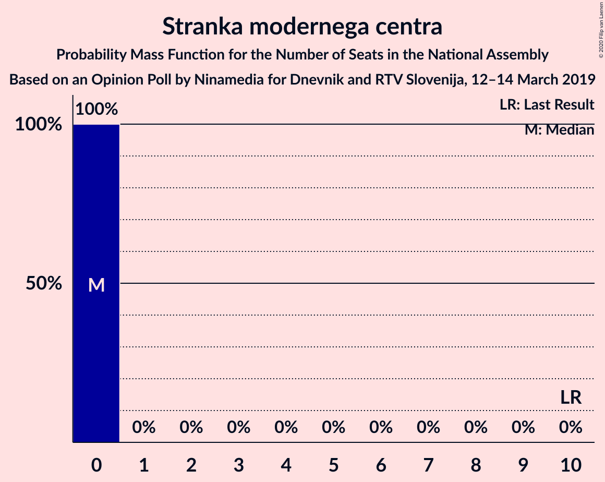
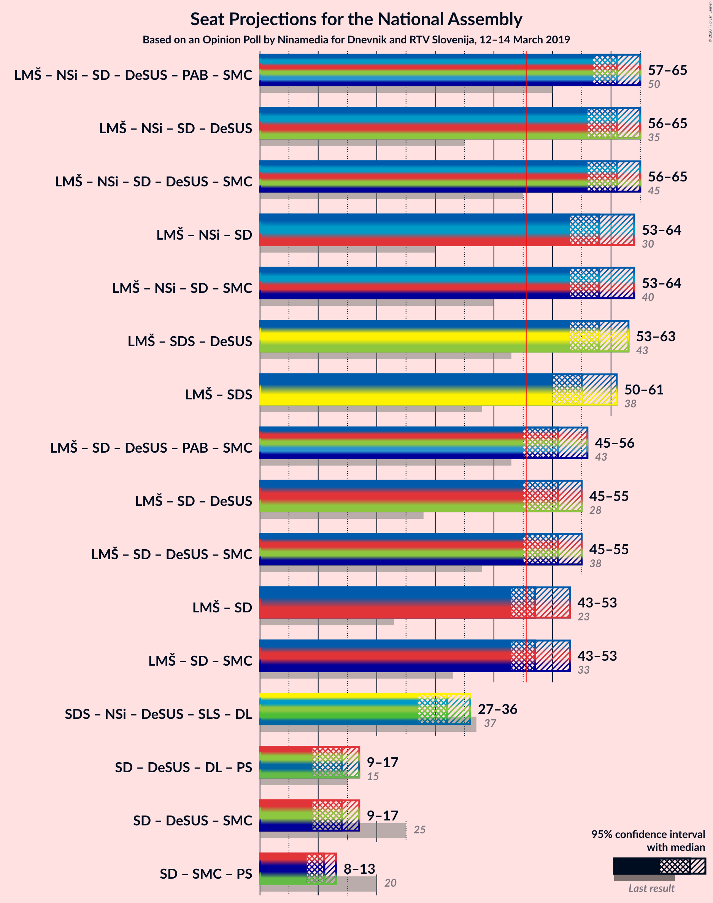
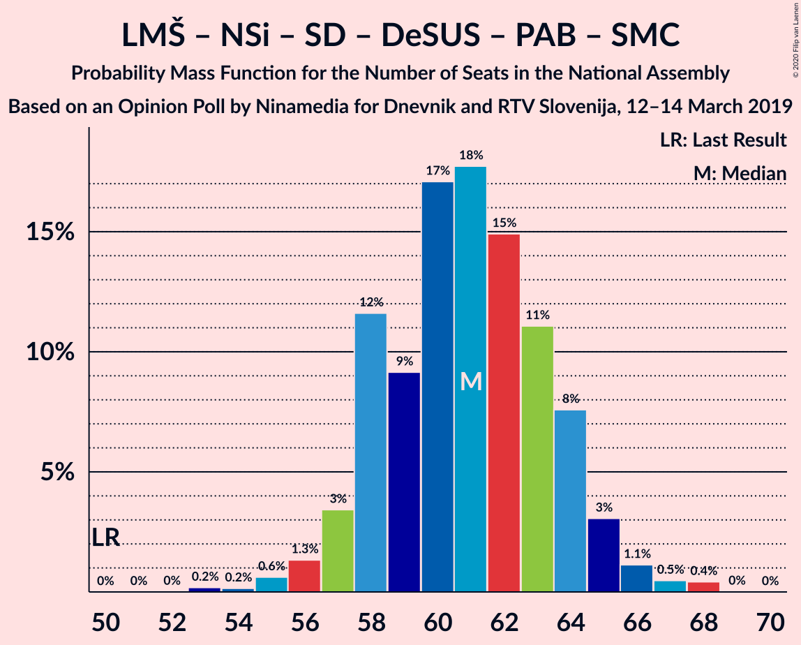
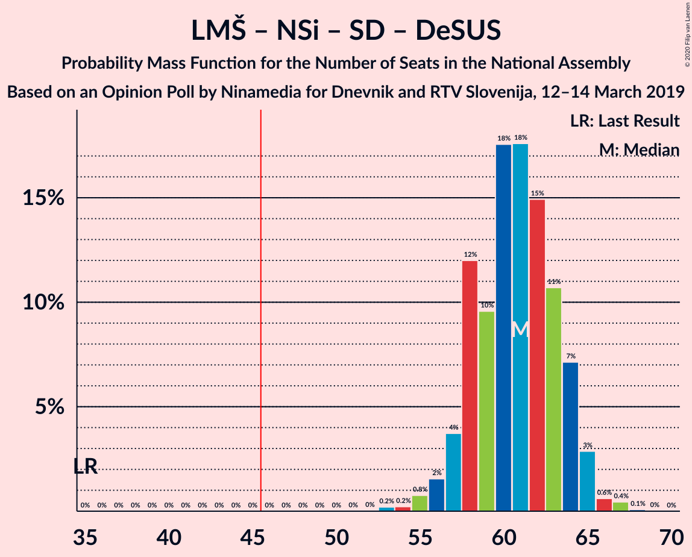
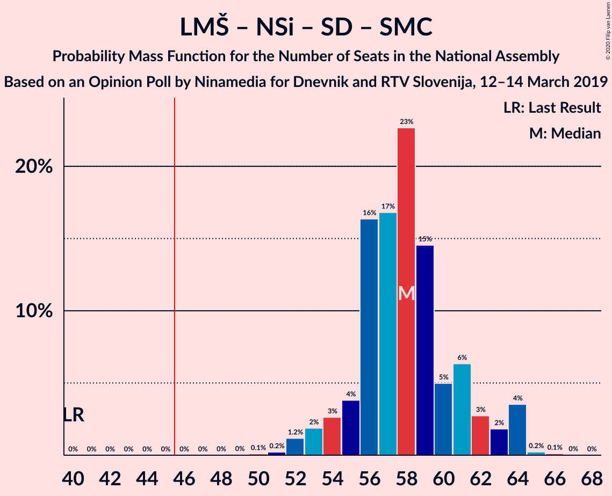
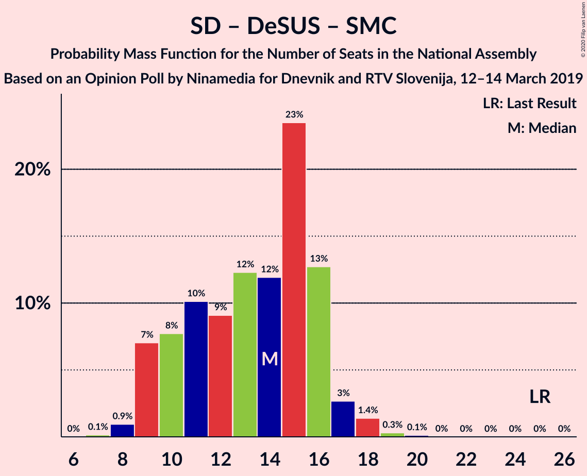

# Opinion Poll by Ninamedia for Dnevnik and RTV Slovenija, 12–14 March 2019

<a href="#voting-intentions">Voting Intentions</a> | <a href="#seats">Seats</a> | <a href="#coalitions">Coalitions</a> | <a href="#technical-information">Technical Information</a>

## Voting Intentions

### Confidence Intervals

| Party | Last Result | Poll Result | 80% Confidence Interval | 90% Confidence Interval | 95% Confidence Interval | 99% Confidence Interval |
|:-----:|:-----------:|:-----------:|:-----------------------:|:-----------------------:|:-----------------------:|:-----------------------:|
| Lista Marjana Šarca | 12.6% | 37.5% | 34.9–40.3% |34.1–41.1% |33.5–41.8% |32.2–43.1% |
| Slovenska demokratska stranka | 24.9% | 18.4% | 16.4–20.7% |15.8–21.4% |15.3–21.9% |14.4–23.1% |
| Socialni demokrati | 9.9% | 10.9% | 9.3–12.9% |8.9–13.4% |8.5–13.9% |7.8–14.9% |
| Nova Slovenija–Krščanski demokrati | 7.2% | 10.9% | 9.3–12.9% |8.9–13.4% |8.5–13.9% |7.8–14.9% |
| Levica | 9.3% | 8.2% | 6.9–10.0% |6.5–10.5% |6.2–10.9% |5.6–11.8% |
| Demokratična stranka upokojencev Slovenije | 4.9% | 4.2% | 3.3–5.6% |3.0–6.0% |2.8–6.3% |2.4–7.0% |
| Slovenska nacionalna stranka | 4.2% | 3.3% | 2.5–4.5% |2.2–4.8% |2.0–5.2% |1.7–5.8% |
| Stranka Alenke Bratušek | 5.1% | 2.5% | 1.8–3.6% |1.6–3.9% |1.5–4.2% |1.2–4.8% |
| Slovenska ljudska stranka | 2.6% | 2.3% | 1.6–3.4% |1.5–3.7% |1.3–4.0% |1.1–4.6% |
| Stranka modernega centra | 9.7% | 0.6% | 0.3–1.3% |0.3–1.5% |0.2–1.7% |0.1–2.1% |

*Note:* The poll result column reflects the actual value used in the calculations. Published results may vary slightly, and in addition be rounded to fewer digits.

## Seats

### Confidence Intervals

| Party | Last Result | Median | 80% Confidence Interval | 90% Confidence Interval | 95% Confidence Interval | 99% Confidence Interval |
|:-----:|:-----------:|:------:|:-----------------------:|:-----------------------:|:-----------------------:|:-----------------------:|
| <a href="#lista-marjana-šarca">Lista Marjana Šarca</a> | 13 | 38 | 35–40 |34–43 |32–43 |32–43 |
| <a href="#slovenska-demokratska-stranka">Slovenska demokratska stranka</a> | 25 | 18 | 15–22 |14–22 |14–22 |14–22 |
| <a href="#socialni-demokrati">Socialni demokrati</a> | 10 | 9 | 9–13 |8–13 |8–14 |7–14 |
| <a href="#nova-slovenija–krščanski-demokrati">Nova Slovenija–Krščanski demokrati</a> | 7 | 11 | 9–11 |8–12 |8–13 |7–14 |
| <a href="#levica">Levica</a> | 9 | 8 | 6–9 |6–10 |6–10 |5–11 |
| <a href="#demokratična-stranka-upokojencev-slovenije">Demokratična stranka upokojencev Slovenije</a> | 5 | 0 | 0–5 |0–5 |0–5 |0–6 |
| <a href="#slovenska-nacionalna-stranka">Slovenska nacionalna stranka</a> | 4 | 0 | 0–4 |0–4 |0–4 |0–5 |
| <a href="#stranka-alenke-bratušek">Stranka Alenke Bratušek</a> | 5 | 0 | 0 |0–3 |0–4 |0–4 |
| <a href="#slovenska-ljudska-stranka">Slovenska ljudska stranka</a> | 0 | 0 | 0 |0 |0 |0–4 |
| <a href="#stranka-modernega-centra">Stranka modernega centra</a> | 10 | 0 | 0 |0 |0 |0 |

### Lista Marjana Šarca

*For a full overview of the results for this party, see the [Lista Marjana Šarca](party-listamarjanašarca.html) page.*

| Number of Seats | Probability | Accumulated | Special Marks |
|:---------------:|:-----------:|:-----------:|:-------------:|
| 13 | 0% | 100% | Last Result |
| 14 | 0% | 100% |  |
| 15 | 0% | 100% |  |
| 16 | 0% | 100% |  |
| 17 | 0% | 100% |  |
| 18 | 0% | 100% |  |
| 19 | 0% | 100% |  |
| 20 | 0% | 100% |  |
| 21 | 0% | 100% |  |
| 22 | 0% | 100% |  |
| 23 | 0% | 100% |  |
| 24 | 0% | 100% |  |
| 25 | 0% | 100% |  |
| 26 | 0% | 100% |  |
| 27 | 0% | 100% |  |
| 28 | 0% | 100% |  |
| 29 | 0% | 100% |  |
| 30 | 0.3% | 100% |  |
| 31 | 0.1% | 99.7% |  |
| 32 | 2% | 99.5% |  |
| 33 | 2% | 97% |  |
| 34 | 3% | 95% |  |
| 35 | 7% | 92% |  |
| 36 | 4% | 85% |  |
| 37 | 20% | 81% |  |
| 38 | 32% | 61% | Median |
| 39 | 15% | 29% |  |
| 40 | 6% | 14% |  |
| 41 | 2% | 8% |  |
| 42 | 0.1% | 6% |  |
| 43 | 5% | 5% |  |
| 44 | 0.3% | 0.4% |  |
| 45 | 0% | 0% |  |

### Slovenska demokratska stranka

*For a full overview of the results for this party, see the [Slovenska demokratska stranka](party-slovenskademokratskastranka.html) page.*

| Number of Seats | Probability | Accumulated | Special Marks |
|:---------------:|:-----------:|:-----------:|:-------------:|
| 12 | 0.1% | 100% |  |
| 13 | 0.1% | 99.9% |  |
| 14 | 5% | 99.8% |  |
| 15 | 6% | 95% |  |
| 16 | 3% | 89% |  |
| 17 | 12% | 86% |  |
| 18 | 29% | 74% | Median |
| 19 | 2% | 45% |  |
| 20 | 7% | 43% |  |
| 21 | 6% | 35% |  |
| 22 | 30% | 30% |  |
| 23 | 0.1% | 0.3% |  |
| 24 | 0.1% | 0.2% |  |
| 25 | 0.1% | 0.1% | Last Result |
| 26 | 0% | 0% |  |

### Socialni demokrati

*For a full overview of the results for this party, see the [Socialni demokrati](party-socialnidemokrati.html) page.*

| Number of Seats | Probability | Accumulated | Special Marks |
|:---------------:|:-----------:|:-----------:|:-------------:|
| 7 | 0.9% | 100% |  |
| 8 | 9% | 99.1% |  |
| 9 | 43% | 90% | Median |
| 10 | 9% | 47% | Last Result |
| 11 | 22% | 38% |  |
| 12 | 6% | 16% |  |
| 13 | 6% | 10% |  |
| 14 | 4% | 4% |  |
| 15 | 0.1% | 0.1% |  |
| 16 | 0% | 0% |  |

### Nova Slovenija–Krščanski demokrati

*For a full overview of the results for this party, see the [Nova Slovenija–Krščanski demokrati](party-novaslovenija–krščanskidemokrati.html) page.*

| Number of Seats | Probability | Accumulated | Special Marks |
|:---------------:|:-----------:|:-----------:|:-------------:|
| 6 | 0.1% | 100% |  |
| 7 | 0.7% | 99.9% | Last Result |
| 8 | 6% | 99.2% |  |
| 9 | 17% | 93% |  |
| 10 | 24% | 75% |  |
| 11 | 42% | 52% | Median |
| 12 | 6% | 10% |  |
| 13 | 1.4% | 3% |  |
| 14 | 2% | 2% |  |
| 15 | 0.1% | 0.2% |  |
| 16 | 0% | 0% |  |

### Levica

*For a full overview of the results for this party, see the [Levica](party-levica.html) page.*

| Number of Seats | Probability | Accumulated | Special Marks |
|:---------------:|:-----------:|:-----------:|:-------------:|
| 5 | 0.7% | 100% |  |
| 6 | 17% | 99.3% |  |
| 7 | 17% | 82% |  |
| 8 | 39% | 66% | Median |
| 9 | 19% | 27% | Last Result |
| 10 | 7% | 8% |  |
| 11 | 0.3% | 0.5% |  |
| 12 | 0.3% | 0.3% |  |
| 13 | 0% | 0% |  |

### Demokratična stranka upokojencev Slovenije

*For a full overview of the results for this party, see the [Demokratična stranka upokojencev Slovenije](party-demokratičnastrankaupokojencevslovenije.html) page.*

| Number of Seats | Probability | Accumulated | Special Marks |
|:---------------:|:-----------:|:-----------:|:-------------:|
| 0 | 62% | 100% | Median |
| 1 | 0% | 38% |  |
| 2 | 0% | 38% |  |
| 3 | 0.1% | 38% |  |
| 4 | 20% | 38% |  |
| 5 | 18% | 19% | Last Result |
| 6 | 0.9% | 1.3% |  |
| 7 | 0.3% | 0.3% |  |
| 8 | 0% | 0% |  |

### Slovenska nacionalna stranka

*For a full overview of the results for this party, see the [Slovenska nacionalna stranka](party-slovenskanacionalnastranka.html) page.*

| Number of Seats | Probability | Accumulated | Special Marks |
|:---------------:|:-----------:|:-----------:|:-------------:|
| 0 | 72% | 100% | Median |
| 1 | 0% | 28% |  |
| 2 | 0% | 28% |  |
| 3 | 4% | 28% |  |
| 4 | 22% | 23% | Last Result |
| 5 | 0.9% | 1.0% |  |
| 6 | 0.1% | 0.1% |  |
| 7 | 0% | 0% |  |

### Stranka Alenke Bratušek

*For a full overview of the results for this party, see the [Stranka Alenke Bratušek](party-strankaalenkebratušek.html) page.*

| Number of Seats | Probability | Accumulated | Special Marks |
|:---------------:|:-----------:|:-----------:|:-------------:|
| 0 | 95% | 100% | Median |
| 1 | 0% | 5% |  |
| 2 | 0% | 5% |  |
| 3 | 0.1% | 5% |  |
| 4 | 5% | 5% |  |
| 5 | 0.4% | 0.4% | Last Result |
| 6 | 0% | 0% |  |

### Slovenska ljudska stranka

*For a full overview of the results for this party, see the [Slovenska ljudska stranka](party-slovenskaljudskastranka.html) page.*

| Number of Seats | Probability | Accumulated | Special Marks |
|:---------------:|:-----------:|:-----------:|:-------------:|
| 0 | 98.5% | 100% | Last Result, Median |
| 1 | 0% | 1.5% |  |
| 2 | 0% | 1.5% |  |
| 3 | 0% | 1.5% |  |
| 4 | 1.4% | 1.4% |  |
| 5 | 0.1% | 0.1% |  |
| 6 | 0% | 0% |  |

### Stranka modernega centra

*For a full overview of the results for this party, see the [Stranka modernega centra](party-strankamodernegacentra.html) page.*

| Number of Seats | Probability | Accumulated | Special Marks |
|:---------------:|:-----------:|:-----------:|:-------------:|
| 0 | 100% | 100% | Median |
| 1 | 0% | 0% |  |
| 2 | 0% | 0% |  |
| 3 | 0% | 0% |  |
| 4 | 0% | 0% |  |
| 5 | 0% | 0% |  |
| 6 | 0% | 0% |  |
| 7 | 0% | 0% |  |
| 8 | 0% | 0% |  |
| 9 | 0% | 0% |  |
| 10 | 0% | 0% | Last Result |

## Coalitions

### Confidence Intervals

| Coalition | Last Result | Median | Majority? | 80% Confidence Interval | 90% Confidence Interval | 95% Confidence Interval | 99% Confidence Interval |
|:---------:|:-----------:|:------:|:---------:|:-----------------------:|:-----------------------:|:-----------------------:|:-----------------------:|
| Lista Marjana Šarca – Nova Slovenija–Krščanski demokrati – Socialni demokrati – Demokratična stranka upokojencev Slovenije – Stranka Alenke Bratušek – Stranka modernega centra | 50 | 60 | 100% | 57–64 | 57–65 | 57–66 | 54–66 |
| Lista Marjana Šarca – Nova Slovenija–Krščanski demokrati – Socialni demokrati – Demokratična stranka upokojencev Slovenije | 35 | 60 | 100% | 57–63 | 57–64 | 56–64 | 54–66 |
| Lista Marjana Šarca – Nova Slovenija–Krščanski demokrati – Socialni demokrati – Demokratična stranka upokojencev Slovenije – Stranka modernega centra | 45 | 60 | 100% | 57–63 | 57–64 | 56–64 | 54–66 |
| Lista Marjana Šarca – Slovenska demokratska stranka – Demokratična stranka upokojencev Slovenije | 43 | 60 | 100% | 55–62 | 54–62 | 53–64 | 51–64 |
| Lista Marjana Šarca – Nova Slovenija–Krščanski demokrati – Socialni demokrati | 30 | 58 | 100% | 56–61 | 54–63 | 53–64 | 51–64 |
| Lista Marjana Šarca – Nova Slovenija–Krščanski demokrati – Socialni demokrati – Stranka modernega centra | 40 | 58 | 100% | 56–61 | 54–63 | 53–64 | 51–64 |
| Lista Marjana Šarca – Slovenska demokratska stranka | 38 | 57 | 100% | 52–60 | 51–61 | 50–61 | 48–62 |
| Lista Marjana Šarca – Socialni demokrati – Demokratična stranka upokojencev Slovenije – Stranka Alenke Bratušek – Stranka modernega centra | 43 | 49 | 98% | 47–54 | 47–54 | 46–56 | 44–56 |
| Lista Marjana Šarca – Socialni demokrati – Demokratična stranka upokojencev Slovenije | 28 | 49 | 98% | 47–53 | 47–54 | 46–54 | 44–55 |
| Lista Marjana Šarca – Socialni demokrati – Demokratična stranka upokojencev Slovenije – Stranka modernega centra | 38 | 49 | 98% | 47–53 | 47–54 | 46–54 | 44–55 |
| Lista Marjana Šarca – Socialni demokrati | 23 | 48 | 92% | 46–51 | 44–54 | 43–54 | 41–54 |
| Lista Marjana Šarca – Socialni demokrati – Stranka modernega centra | 33 | 48 | 92% | 46–51 | 44–54 | 43–54 | 41–54 |
| Socialni demokrati – Demokratična stranka upokojencev Slovenije – Stranka modernega centra | 25 | 11 | 0% | 9–15 | 9–16 | 9–17 | 7–18 |

### Lista Marjana Šarca – Nova Slovenija–Krščanski demokrati – Socialni demokrati – Demokratična stranka upokojencev Slovenije – Stranka Alenke Bratušek – Stranka modernega centra

| Number of Seats | Probability | Accumulated | Special Marks |
|:---------------:|:-----------:|:-----------:|:-------------:|
| 50 | 0% | 100% | Last Result |
| 51 | 0% | 100% |  |
| 52 | 0.1% | 100% |  |
| 53 | 0% | 99.9% |  |
| 54 | 0.5% | 99.9% |  |
| 55 | 1.0% | 99.4% |  |
| 56 | 0.7% | 98% |  |
| 57 | 14% | 98% |  |
| 58 | 29% | 84% | Median |
| 59 | 3% | 55% |  |
| 60 | 6% | 52% |  |
| 61 | 14% | 46% |  |
| 62 | 11% | 31% |  |
| 63 | 8% | 21% |  |
| 64 | 7% | 13% |  |
| 65 | 1.2% | 5% |  |
| 66 | 4% | 4% |  |
| 67 | 0.4% | 0.5% |  |
| 68 | 0.1% | 0.1% |  |
| 69 | 0% | 0% |  |

### Lista Marjana Šarca – Nova Slovenija–Krščanski demokrati – Socialni demokrati – Demokratična stranka upokojencev Slovenije

| Number of Seats | Probability | Accumulated | Special Marks |
|:---------------:|:-----------:|:-----------:|:-------------:|
| 35 | 0% | 100% | Last Result |
| 36 | 0% | 100% |  |
| 37 | 0% | 100% |  |
| 38 | 0% | 100% |  |
| 39 | 0% | 100% |  |
| 40 | 0% | 100% |  |
| 41 | 0% | 100% |  |
| 42 | 0% | 100% |  |
| 43 | 0% | 100% |  |
| 44 | 0% | 100% |  |
| 45 | 0% | 100% |  |
| 46 | 0% | 100% | Majority |
| 47 | 0% | 100% |  |
| 48 | 0% | 100% |  |
| 49 | 0% | 100% |  |
| 50 | 0% | 100% |  |
| 51 | 0% | 100% |  |
| 52 | 0.1% | 100% |  |
| 53 | 0.1% | 99.9% |  |
| 54 | 0.5% | 99.9% |  |
| 55 | 1.0% | 99.3% |  |
| 56 | 1.0% | 98% |  |
| 57 | 14% | 97% |  |
| 58 | 29% | 83% | Median |
| 59 | 3% | 54% |  |
| 60 | 6% | 51% |  |
| 61 | 14% | 45% |  |
| 62 | 14% | 31% |  |
| 63 | 8% | 17% |  |
| 64 | 7% | 9% |  |
| 65 | 1.2% | 2% |  |
| 66 | 0.4% | 0.7% |  |
| 67 | 0.2% | 0.3% |  |
| 68 | 0.1% | 0.1% |  |
| 69 | 0% | 0% |  |

### Lista Marjana Šarca – Nova Slovenija–Krščanski demokrati – Socialni demokrati – Demokratična stranka upokojencev Slovenije – Stranka modernega centra

| Number of Seats | Probability | Accumulated | Special Marks |
|:---------------:|:-----------:|:-----------:|:-------------:|
| 45 | 0% | 100% | Last Result |
| 46 | 0% | 100% | Majority |
| 47 | 0% | 100% |  |
| 48 | 0% | 100% |  |
| 49 | 0% | 100% |  |
| 50 | 0% | 100% |  |
| 51 | 0% | 100% |  |
| 52 | 0.1% | 100% |  |
| 53 | 0.1% | 99.9% |  |
| 54 | 0.5% | 99.9% |  |
| 55 | 1.0% | 99.3% |  |
| 56 | 1.0% | 98% |  |
| 57 | 14% | 97% |  |
| 58 | 29% | 83% | Median |
| 59 | 3% | 54% |  |
| 60 | 6% | 51% |  |
| 61 | 14% | 45% |  |
| 62 | 14% | 31% |  |
| 63 | 8% | 17% |  |
| 64 | 7% | 9% |  |
| 65 | 1.2% | 2% |  |
| 66 | 0.4% | 0.7% |  |
| 67 | 0.2% | 0.3% |  |
| 68 | 0.1% | 0.1% |  |
| 69 | 0% | 0% |  |

### Lista Marjana Šarca – Slovenska demokratska stranka – Demokratična stranka upokojencev Slovenije

| Number of Seats | Probability | Accumulated | Special Marks |
|:---------------:|:-----------:|:-----------:|:-------------:|
| 43 | 0% | 100% | Last Result |
| 44 | 0% | 100% |  |
| 45 | 0% | 100% |  |
| 46 | 0% | 100% | Majority |
| 47 | 0% | 100% |  |
| 48 | 0% | 100% |  |
| 49 | 0.1% | 100% |  |
| 50 | 0.1% | 99.9% |  |
| 51 | 0.5% | 99.8% |  |
| 52 | 1.1% | 99.3% |  |
| 53 | 3% | 98% |  |
| 54 | 5% | 95% |  |
| 55 | 17% | 90% |  |
| 56 | 4% | 74% | Median |
| 57 | 7% | 70% |  |
| 58 | 5% | 63% |  |
| 59 | 5% | 58% |  |
| 60 | 30% | 53% |  |
| 61 | 13% | 24% |  |
| 62 | 6% | 11% |  |
| 63 | 0.6% | 5% |  |
| 64 | 4% | 4% |  |
| 65 | 0% | 0% |  |

### Lista Marjana Šarca – Nova Slovenija–Krščanski demokrati – Socialni demokrati

| Number of Seats | Probability | Accumulated | Special Marks |
|:---------------:|:-----------:|:-----------:|:-------------:|
| 30 | 0% | 100% | Last Result |
| 31 | 0% | 100% |  |
| 32 | 0% | 100% |  |
| 33 | 0% | 100% |  |
| 34 | 0% | 100% |  |
| 35 | 0% | 100% |  |
| 36 | 0% | 100% |  |
| 37 | 0% | 100% |  |
| 38 | 0% | 100% |  |
| 39 | 0% | 100% |  |
| 40 | 0% | 100% |  |
| 41 | 0% | 100% |  |
| 42 | 0% | 100% |  |
| 43 | 0% | 100% |  |
| 44 | 0% | 100% |  |
| 45 | 0% | 100% |  |
| 46 | 0% | 100% | Majority |
| 47 | 0% | 100% |  |
| 48 | 0% | 100% |  |
| 49 | 0% | 100% |  |
| 50 | 0.2% | 100% |  |
| 51 | 0.4% | 99.7% |  |
| 52 | 0.8% | 99.3% |  |
| 53 | 3% | 98.5% |  |
| 54 | 1.4% | 96% |  |
| 55 | 2% | 94% |  |
| 56 | 9% | 93% |  |
| 57 | 16% | 83% |  |
| 58 | 39% | 67% | Median |
| 59 | 7% | 28% |  |
| 60 | 8% | 22% |  |
| 61 | 5% | 13% |  |
| 62 | 2% | 8% |  |
| 63 | 0.9% | 5% |  |
| 64 | 4% | 5% |  |
| 65 | 0% | 0.1% |  |
| 66 | 0.1% | 0.1% |  |
| 67 | 0% | 0% |  |

### Lista Marjana Šarca – Nova Slovenija–Krščanski demokrati – Socialni demokrati – Stranka modernega centra

| Number of Seats | Probability | Accumulated | Special Marks |
|:---------------:|:-----------:|:-----------:|:-------------:|
| 40 | 0% | 100% | Last Result |
| 41 | 0% | 100% |  |
| 42 | 0% | 100% |  |
| 43 | 0% | 100% |  |
| 44 | 0% | 100% |  |
| 45 | 0% | 100% |  |
| 46 | 0% | 100% | Majority |
| 47 | 0% | 100% |  |
| 48 | 0% | 100% |  |
| 49 | 0% | 100% |  |
| 50 | 0.2% | 100% |  |
| 51 | 0.4% | 99.7% |  |
| 52 | 0.8% | 99.3% |  |
| 53 | 3% | 98.5% |  |
| 54 | 1.4% | 96% |  |
| 55 | 2% | 94% |  |
| 56 | 9% | 93% |  |
| 57 | 16% | 83% |  |
| 58 | 39% | 67% | Median |
| 59 | 7% | 28% |  |
| 60 | 8% | 22% |  |
| 61 | 5% | 13% |  |
| 62 | 2% | 8% |  |
| 63 | 0.9% | 5% |  |
| 64 | 4% | 5% |  |
| 65 | 0% | 0.1% |  |
| 66 | 0.1% | 0.1% |  |
| 67 | 0% | 0% |  |

### Lista Marjana Šarca – Slovenska demokratska stranka

| Number of Seats | Probability | Accumulated | Special Marks |
|:---------------:|:-----------:|:-----------:|:-------------:|
| 38 | 0% | 100% | Last Result |
| 39 | 0% | 100% |  |
| 40 | 0% | 100% |  |
| 41 | 0% | 100% |  |
| 42 | 0% | 100% |  |
| 43 | 0% | 100% |  |
| 44 | 0% | 100% |  |
| 45 | 0% | 100% |  |
| 46 | 0% | 100% | Majority |
| 47 | 0.2% | 100% |  |
| 48 | 0.3% | 99.8% |  |
| 49 | 1.4% | 99.4% |  |
| 50 | 2% | 98% |  |
| 51 | 5% | 97% |  |
| 52 | 6% | 91% |  |
| 53 | 8% | 85% |  |
| 54 | 6% | 77% |  |
| 55 | 14% | 72% |  |
| 56 | 3% | 58% | Median |
| 57 | 10% | 55% |  |
| 58 | 2% | 45% |  |
| 59 | 4% | 43% |  |
| 60 | 28% | 38% |  |
| 61 | 8% | 10% |  |
| 62 | 1.4% | 2% |  |
| 63 | 0.3% | 0.3% |  |
| 64 | 0% | 0% |  |

### Lista Marjana Šarca – Socialni demokrati – Demokratična stranka upokojencev Slovenije – Stranka Alenke Bratušek – Stranka modernega centra

| Number of Seats | Probability | Accumulated | Special Marks |
|:---------------:|:-----------:|:-----------:|:-------------:|
| 42 | 0.1% | 100% |  |
| 43 | 0% | 99.9% | Last Result |
| 44 | 0.4% | 99.9% |  |
| 45 | 1.1% | 99.4% |  |
| 46 | 1.2% | 98% | Majority |
| 47 | 31% | 97% | Median |
| 48 | 15% | 66% |  |
| 49 | 2% | 51% |  |
| 50 | 8% | 49% |  |
| 51 | 11% | 42% |  |
| 52 | 12% | 31% |  |
| 53 | 8% | 19% |  |
| 54 | 7% | 11% |  |
| 55 | 0.3% | 4% |  |
| 56 | 4% | 4% |  |
| 57 | 0.1% | 0.3% |  |
| 58 | 0.1% | 0.2% |  |
| 59 | 0% | 0% |  |

### Lista Marjana Šarca – Socialni demokrati – Demokratična stranka upokojencev Slovenije

| Number of Seats | Probability | Accumulated | Special Marks |
|:---------------:|:-----------:|:-----------:|:-------------:|
| 28 | 0% | 100% | Last Result |
| 29 | 0% | 100% |  |
| 30 | 0% | 100% |  |
| 31 | 0% | 100% |  |
| 32 | 0% | 100% |  |
| 33 | 0% | 100% |  |
| 34 | 0% | 100% |  |
| 35 | 0% | 100% |  |
| 36 | 0% | 100% |  |
| 37 | 0% | 100% |  |
| 38 | 0% | 100% |  |
| 39 | 0% | 100% |  |
| 40 | 0% | 100% |  |
| 41 | 0% | 100% |  |
| 42 | 0.1% | 100% |  |
| 43 | 0% | 99.9% |  |
| 44 | 0.4% | 99.8% |  |
| 45 | 1.1% | 99.4% |  |
| 46 | 2% | 98% | Majority |
| 47 | 31% | 97% | Median |
| 48 | 15% | 66% |  |
| 49 | 2% | 50% |  |
| 50 | 7% | 48% |  |
| 51 | 11% | 41% |  |
| 52 | 15% | 30% |  |
| 53 | 8% | 15% |  |
| 54 | 6% | 7% |  |
| 55 | 0.3% | 0.7% |  |
| 56 | 0.2% | 0.4% |  |
| 57 | 0.1% | 0.2% |  |
| 58 | 0.1% | 0.1% |  |
| 59 | 0% | 0% |  |

### Lista Marjana Šarca – Socialni demokrati – Demokratična stranka upokojencev Slovenije – Stranka modernega centra

| Number of Seats | Probability | Accumulated | Special Marks |
|:---------------:|:-----------:|:-----------:|:-------------:|
| 38 | 0% | 100% | Last Result |
| 39 | 0% | 100% |  |
| 40 | 0% | 100% |  |
| 41 | 0% | 100% |  |
| 42 | 0.1% | 100% |  |
| 43 | 0% | 99.9% |  |
| 44 | 0.4% | 99.8% |  |
| 45 | 1.1% | 99.4% |  |
| 46 | 2% | 98% | Majority |
| 47 | 31% | 97% | Median |
| 48 | 15% | 66% |  |
| 49 | 2% | 50% |  |
| 50 | 7% | 48% |  |
| 51 | 11% | 41% |  |
| 52 | 15% | 30% |  |
| 53 | 8% | 15% |  |
| 54 | 6% | 7% |  |
| 55 | 0.3% | 0.7% |  |
| 56 | 0.2% | 0.4% |  |
| 57 | 0.1% | 0.2% |  |
| 58 | 0.1% | 0.1% |  |
| 59 | 0% | 0% |  |

### Lista Marjana Šarca – Socialni demokrati

| Number of Seats | Probability | Accumulated | Special Marks |
|:---------------:|:-----------:|:-----------:|:-------------:|
| 23 | 0% | 100% | Last Result |
| 24 | 0% | 100% |  |
| 25 | 0% | 100% |  |
| 26 | 0% | 100% |  |
| 27 | 0% | 100% |  |
| 28 | 0% | 100% |  |
| 29 | 0% | 100% |  |
| 30 | 0% | 100% |  |
| 31 | 0% | 100% |  |
| 32 | 0% | 100% |  |
| 33 | 0% | 100% |  |
| 34 | 0% | 100% |  |
| 35 | 0% | 100% |  |
| 36 | 0% | 100% |  |
| 37 | 0% | 100% |  |
| 38 | 0% | 100% |  |
| 39 | 0% | 100% |  |
| 40 | 0.1% | 100% |  |
| 41 | 0.7% | 99.9% |  |
| 42 | 1.5% | 99.2% |  |
| 43 | 3% | 98% |  |
| 44 | 1.2% | 95% |  |
| 45 | 2% | 94% |  |
| 46 | 8% | 92% | Majority |
| 47 | 33% | 84% | Median |
| 48 | 30% | 51% |  |
| 49 | 5% | 21% |  |
| 50 | 5% | 16% |  |
| 51 | 5% | 11% |  |
| 52 | 0.2% | 6% |  |
| 53 | 0.5% | 6% |  |
| 54 | 5% | 5% |  |
| 55 | 0.1% | 0.1% |  |
| 56 | 0% | 0% |  |

### Lista Marjana Šarca – Socialni demokrati – Stranka modernega centra

| Number of Seats | Probability | Accumulated | Special Marks |
|:---------------:|:-----------:|:-----------:|:-------------:|
| 33 | 0% | 100% | Last Result |
| 34 | 0% | 100% |  |
| 35 | 0% | 100% |  |
| 36 | 0% | 100% |  |
| 37 | 0% | 100% |  |
| 38 | 0% | 100% |  |
| 39 | 0% | 100% |  |
| 40 | 0.1% | 100% |  |
| 41 | 0.7% | 99.9% |  |
| 42 | 1.5% | 99.2% |  |
| 43 | 3% | 98% |  |
| 44 | 1.2% | 95% |  |
| 45 | 2% | 94% |  |
| 46 | 8% | 92% | Majority |
| 47 | 33% | 84% | Median |
| 48 | 30% | 51% |  |
| 49 | 5% | 21% |  |
| 50 | 5% | 16% |  |
| 51 | 5% | 11% |  |
| 52 | 0.2% | 6% |  |
| 53 | 0.5% | 6% |  |
| 54 | 5% | 5% |  |
| 55 | 0.1% | 0.1% |  |
| 56 | 0% | 0% |  |

### Socialni demokrati – Demokratična stranka upokojencev Slovenije – Stranka modernega centra

| Number of Seats | Probability | Accumulated | Special Marks |
|:---------------:|:-----------:|:-----------:|:-------------:|
| 7 | 0.5% | 100% |  |
| 8 | 0.7% | 99.5% |  |
| 9 | 29% | 98.8% | Median |
| 10 | 7% | 69% |  |
| 11 | 15% | 62% |  |
| 12 | 5% | 47% |  |
| 13 | 15% | 43% |  |
| 14 | 12% | 28% |  |
| 15 | 6% | 16% |  |
| 16 | 6% | 10% |  |
| 17 | 3% | 4% |  |
| 18 | 1.4% | 2% |  |
| 19 | 0.2% | 0.3% |  |
| 20 | 0.1% | 0.1% |  |
| 21 | 0% | 0% |  |
| 22 | 0% | 0% |  |
| 23 | 0% | 0% |  |
| 24 | 0% | 0% |  |
| 25 | 0% | 0% | Last Result |

## Technical Information

### Opinion Poll

+ **Polling firm:** Ninamedia
+ **Commissioner(s):** Dnevnik and RTV Slovenija
+ **Fieldwork period:** 12–14 March 2019

### Calculations

+ **Sample size:** 522
+ **Simulations done:** 131,072
+ **Error estimate:** 2.97%

