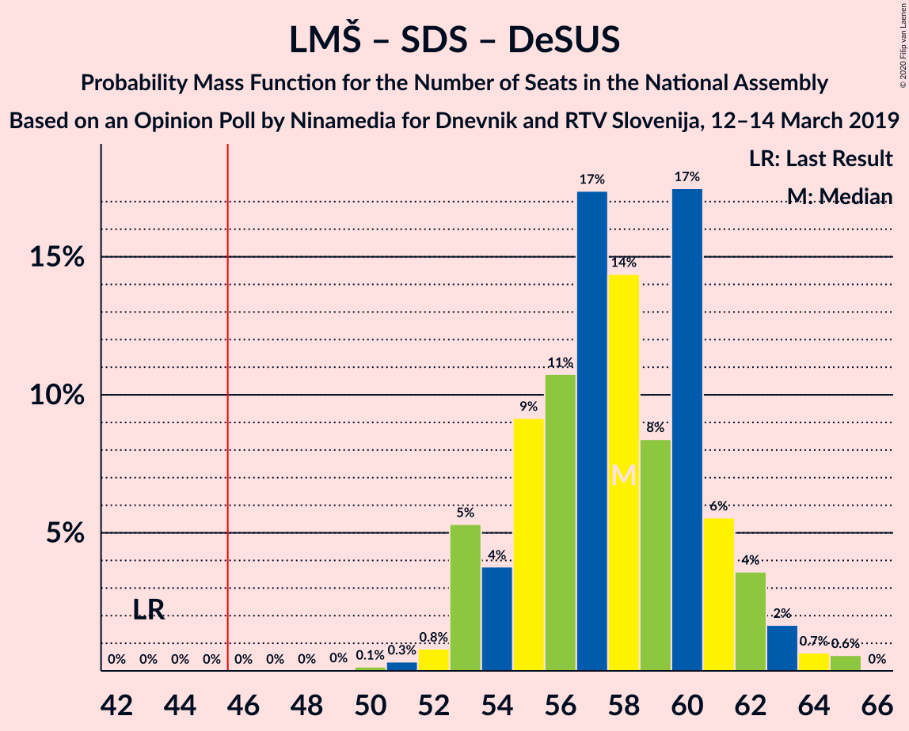
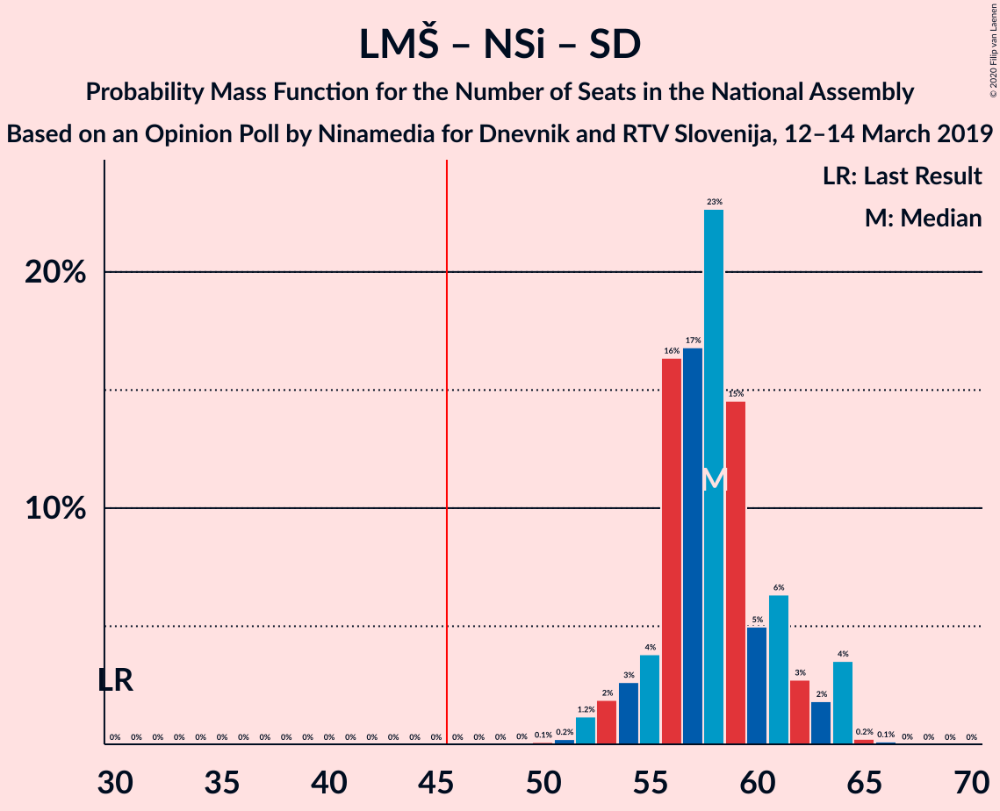
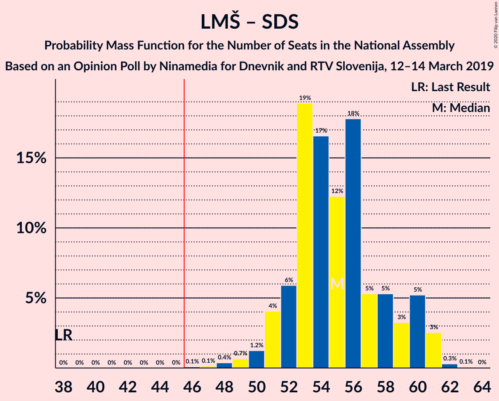
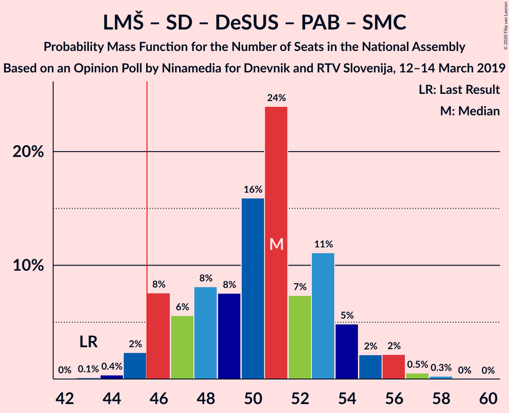

# Opinion Poll by Ninamedia for Dnevnik and RTV Slovenija, 12–14 March 2019

<a href="#voting-intentions">Voting Intentions</a> | <a href="#seats">Seats</a> | <a href="#coalitions">Coalitions</a> | <a href="#technical-information">Technical Information</a>

## Voting Intentions

### Confidence Intervals

| Party | Last Result | Poll Result | 80% Confidence Interval | 90% Confidence Interval | 95% Confidence Interval | 99% Confidence Interval |
|:-----:|:-----------:|:-----------:|:-----------------------:|:-----------------------:|:-----------------------:|:-----------------------:|
| Lista Marjana Šarca | 12.6% | 37.5% | 34.9–40.3% |34.1–41.1% |33.5–41.8% |32.2–43.1% |
| Slovenska demokratska stranka | 24.9% | 18.4% | 16.4–20.7% |15.8–21.4% |15.3–21.9% |14.4–23.1% |
| Socialni demokrati | 9.9% | 10.9% | 9.3–12.9% |8.9–13.4% |8.5–13.9% |7.8–14.9% |
| Nova Slovenija–Krščanski demokrati | 7.2% | 10.9% | 9.3–12.9% |8.9–13.4% |8.5–13.9% |7.8–14.9% |
| Levica | 9.3% | 8.2% | 6.9–10.0% |6.5–10.5% |6.2–10.9% |5.6–11.8% |
| Demokratična stranka upokojencev Slovenije | 4.9% | 4.2% | 3.3–5.6% |3.0–6.0% |2.8–6.3% |2.4–7.0% |
| Slovenska nacionalna stranka | 4.2% | 3.3% | 2.5–4.5% |2.2–4.8% |2.0–5.2% |1.7–5.8% |
| Stranka Alenke Bratušek | 5.1% | 2.5% | 1.8–3.6% |1.6–3.9% |1.5–4.2% |1.2–4.8% |
| Slovenska ljudska stranka | 2.6% | 2.3% | 1.6–3.4% |1.5–3.7% |1.3–4.0% |1.1–4.6% |
| Stranka modernega centra | 9.7% | 0.6% | 0.3–1.3% |0.3–1.5% |0.2–1.7% |0.1–2.1% |

*Note:* The poll result column reflects the actual value used in the calculations. Published results may vary slightly, and in addition be rounded to fewer digits.

## Seats

### Confidence Intervals

| Party | Last Result | Median | 80% Confidence Interval | 90% Confidence Interval | 95% Confidence Interval | 99% Confidence Interval |
|:-----:|:-----------:|:------:|:-----------------------:|:-----------------------:|:-----------------------:|:-----------------------:|
| <a href="#lista-marjana-šarca">Lista Marjana Šarca</a> | 13 | 35 | 35 |33–35 |33–35 |33–35 |
| <a href="#slovenska-demokratska-stranka">Slovenska demokratska stranka</a> | 25 | 18 | 18 |17–18 |17–18 |17–19 |
| <a href="#socialni-demokrati">Socialni demokrati</a> | 10 | 11 | 11 |11 |11 |11–13 |
| <a href="#nova-slovenija–krščanski-demokrati">Nova Slovenija–Krščanski demokrati</a> | 7 | 11 | 11 |11–12 |11–12 |10–12 |
| <a href="#levica">Levica</a> | 9 | 8 | 8 |8–9 |8–9 |5–9 |
| <a href="#demokratična-stranka-upokojencev-slovenije">Demokratična stranka upokojencev Slovenije</a> | 5 | 5 | 5 |5–6 |5–6 |5–6 |
| <a href="#slovenska-nacionalna-stranka">Slovenska nacionalna stranka</a> | 4 | 0 | 0 |0 |0 |0 |
| <a href="#stranka-alenke-bratušek">Stranka Alenke Bratušek</a> | 5 | 0 | 0 |0 |0 |0 |
| <a href="#slovenska-ljudska-stranka">Slovenska ljudska stranka</a> | 0 | 0 | 0 |0 |0 |0 |
| <a href="#stranka-modernega-centra">Stranka modernega centra</a> | 10 | 0 | 0 |0 |0 |0 |

### Lista Marjana Šarca

*For a full overview of the results for this party, see the [Lista Marjana Šarca](party-listamarjanašarca.html) page.*

| Number of Seats | Probability | Accumulated | Special Marks |
|:---------------:|:-----------:|:-----------:|:-------------:|
| 13 | 0% | 100% | Last Result |
| 14 | 0% | 100% |  |
| 15 | 0% | 100% |  |
| 16 | 0% | 100% |  |
| 17 | 0% | 100% |  |
| 18 | 0% | 100% |  |
| 19 | 0% | 100% |  |
| 20 | 0% | 100% |  |
| 21 | 0% | 100% |  |
| 22 | 0% | 100% |  |
| 23 | 0% | 100% |  |
| 24 | 0% | 100% |  |
| 25 | 0% | 100% |  |
| 26 | 0% | 100% |  |
| 27 | 0% | 100% |  |
| 28 | 0% | 100% |  |
| 29 | 0% | 100% |  |
| 30 | 0% | 100% |  |
| 31 | 0% | 100% |  |
| 32 | 0.1% | 100% |  |
| 33 | 8% | 99.9% |  |
| 34 | 0% | 92% |  |
| 35 | 92% | 92% | Median |
| 36 | 0% | 0.3% |  |
| 37 | 0% | 0.3% |  |
| 38 | 0% | 0.3% |  |
| 39 | 0.3% | 0.3% |  |
| 40 | 0% | 0% |  |

### Slovenska demokratska stranka

*For a full overview of the results for this party, see the [Slovenska demokratska stranka](party-slovenskademokratskastranka.html) page.*

| Number of Seats | Probability | Accumulated | Special Marks |
|:---------------:|:-----------:|:-----------:|:-------------:|
| 17 | 8% | 100% |  |
| 18 | 90% | 92% | Median |
| 19 | 2% | 2% |  |
| 20 | 0% | 0% |  |
| 21 | 0% | 0% |  |
| 22 | 0% | 0% |  |
| 23 | 0% | 0% |  |
| 24 | 0% | 0% |  |
| 25 | 0% | 0% | Last Result |

### Socialni demokrati

*For a full overview of the results for this party, see the [Socialni demokrati](party-socialnidemokrati.html) page.*

| Number of Seats | Probability | Accumulated | Special Marks |
|:---------------:|:-----------:|:-----------:|:-------------:|
| 10 | 0% | 100% | Last Result |
| 11 | 98% | 100% | Median |
| 12 | 0.3% | 2% |  |
| 13 | 2% | 2% |  |
| 14 | 0% | 0% |  |

### Nova Slovenija–Krščanski demokrati

*For a full overview of the results for this party, see the [Nova Slovenija–Krščanski demokrati](party-novaslovenija–krščanskidemokrati.html) page.*

| Number of Seats | Probability | Accumulated | Special Marks |
|:---------------:|:-----------:|:-----------:|:-------------:|
| 7 | 0% | 100% | Last Result |
| 8 | 0.1% | 100% |  |
| 9 | 0% | 99.9% |  |
| 10 | 2% | 99.9% |  |
| 11 | 90% | 98% | Median |
| 12 | 8% | 8% |  |
| 13 | 0% | 0% |  |

### Levica

*For a full overview of the results for this party, see the [Levica](party-levica.html) page.*

| Number of Seats | Probability | Accumulated | Special Marks |
|:---------------:|:-----------:|:-----------:|:-------------:|
| 5 | 2% | 100% |  |
| 6 | 0.3% | 98% |  |
| 7 | 0% | 98% |  |
| 8 | 90% | 98% | Median |
| 9 | 8% | 8% | Last Result |
| 10 | 0% | 0% |  |

### Demokratična stranka upokojencev Slovenije

*For a full overview of the results for this party, see the [Demokratična stranka upokojencev Slovenije](party-demokratičnastrankaupokojencevslovenije.html) page.*

| Number of Seats | Probability | Accumulated | Special Marks |
|:---------------:|:-----------:|:-----------:|:-------------:|
| 0 | 0.2% | 100% |  |
| 1 | 0% | 99.8% |  |
| 2 | 0% | 99.8% |  |
| 3 | 0% | 99.8% |  |
| 4 | 0% | 99.8% |  |
| 5 | 90% | 99.8% | Last Result, Median |
| 6 | 10% | 10% |  |
| 7 | 0.1% | 0.1% |  |
| 8 | 0% | 0% |  |

### Slovenska nacionalna stranka

*For a full overview of the results for this party, see the [Slovenska nacionalna stranka](party-slovenskanacionalnastranka.html) page.*

| Number of Seats | Probability | Accumulated | Special Marks |
|:---------------:|:-----------:|:-----------:|:-------------:|
| 0 | 100% | 100% | Median |
| 1 | 0% | 0% |  |
| 2 | 0% | 0% |  |
| 3 | 0% | 0% |  |
| 4 | 0% | 0% | Last Result |

### Stranka Alenke Bratušek

*For a full overview of the results for this party, see the [Stranka Alenke Bratušek](party-strankaalenkebratušek.html) page.*

| Number of Seats | Probability | Accumulated | Special Marks |
|:---------------:|:-----------:|:-----------:|:-------------:|
| 0 | 100% | 100% | Median |
| 1 | 0% | 0% |  |
| 2 | 0% | 0% |  |
| 3 | 0% | 0% |  |
| 4 | 0% | 0% |  |
| 5 | 0% | 0% | Last Result |

### Slovenska ljudska stranka

*For a full overview of the results for this party, see the [Slovenska ljudska stranka](party-slovenskaljudskastranka.html) page.*

| Number of Seats | Probability | Accumulated | Special Marks |
|:---------------:|:-----------:|:-----------:|:-------------:|
| 0 | 100% | 100% | Last Result, Median |

### Stranka modernega centra

*For a full overview of the results for this party, see the [Stranka modernega centra](party-strankamodernegacentra.html) page.*

| Number of Seats | Probability | Accumulated | Special Marks |
|:---------------:|:-----------:|:-----------:|:-------------:|
| 0 | 100% | 100% | Median |
| 1 | 0% | 0% |  |
| 2 | 0% | 0% |  |
| 3 | 0% | 0% |  |
| 4 | 0% | 0% |  |
| 5 | 0% | 0% |  |
| 6 | 0% | 0% |  |
| 7 | 0% | 0% |  |
| 8 | 0% | 0% |  |
| 9 | 0% | 0% |  |
| 10 | 0% | 0% | Last Result |

## Coalitions

### Confidence Intervals

| Coalition | Last Result | Median | Majority? | 80% Confidence Interval | 90% Confidence Interval | 95% Confidence Interval | 99% Confidence Interval |
|:---------:|:-----------:|:------:|:---------:|:-----------------------:|:-----------------------:|:-----------------------:|:-----------------------:|
| Lista Marjana Šarca – Nova Slovenija–Krščanski demokrati – Socialni demokrati – Demokratična stranka upokojencev Slovenije | 35 | 62 | 100% | 62 | 62 | 62 | 62–64 |
| Lista Marjana Šarca – Nova Slovenija–Krščanski demokrati – Socialni demokrati – Demokratična stranka upokojencev Slovenije – Stranka Alenke Bratušek – Stranka modernega centra | 50 | 62 | 100% | 62 | 62 | 62 | 62–64 |
| Lista Marjana Šarca – Nova Slovenija–Krščanski demokrati – Socialni demokrati – Demokratična stranka upokojencev Slovenije – Stranka modernega centra | 45 | 62 | 100% | 62 | 62 | 62 | 62–64 |
| Lista Marjana Šarca – Slovenska demokratska stranka – Demokratična stranka upokojencev Slovenije | 43 | 58 | 100% | 58 | 56–58 | 56–58 | 56–60 |
| Lista Marjana Šarca – Nova Slovenija–Krščanski demokrati – Socialni demokrati | 30 | 57 | 100% | 57 | 56–57 | 56–57 | 56–58 |
| Lista Marjana Šarca – Nova Slovenija–Krščanski demokrati – Socialni demokrati – Stranka modernega centra | 40 | 57 | 100% | 57 | 56–57 | 56–57 | 56–58 |
| Lista Marjana Šarca – Slovenska demokratska stranka | 38 | 53 | 100% | 53 | 50–53 | 50–53 | 50–54 |
| Lista Marjana Šarca – Socialni demokrati – Demokratična stranka upokojencev Slovenije | 28 | 51 | 100% | 51 | 50–51 | 50–51 | 50–54 |
| Lista Marjana Šarca – Socialni demokrati – Demokratična stranka upokojencev Slovenije – Stranka Alenke Bratušek – Stranka modernega centra | 43 | 51 | 100% | 51 | 50–51 | 50–51 | 50–54 |
| Lista Marjana Šarca – Socialni demokrati – Demokratična stranka upokojencev Slovenije – Stranka modernega centra | 38 | 51 | 100% | 51 | 50–51 | 50–51 | 50–54 |
| Lista Marjana Šarca – Socialni demokrati | 23 | 46 | 92% | 46 | 44–46 | 44–46 | 44–48 |
| Lista Marjana Šarca – Socialni demokrati – Stranka modernega centra | 33 | 46 | 92% | 46 | 44–46 | 44–46 | 44–48 |
| Socialni demokrati – Demokratična stranka upokojencev Slovenije – Stranka modernega centra | 25 | 16 | 0% | 16 | 16–17 | 16–17 | 16–19 |

### Lista Marjana Šarca – Nova Slovenija–Krščanski demokrati – Socialni demokrati – Demokratična stranka upokojencev Slovenije

| Number of Seats | Probability | Accumulated | Special Marks |
|:---------------:|:-----------:|:-----------:|:-------------:|
| 35 | 0% | 100% | Last Result |
| 36 | 0% | 100% |  |
| 37 | 0% | 100% |  |
| 38 | 0% | 100% |  |
| 39 | 0% | 100% |  |
| 40 | 0% | 100% |  |
| 41 | 0% | 100% |  |
| 42 | 0% | 100% |  |
| 43 | 0% | 100% |  |
| 44 | 0% | 100% |  |
| 45 | 0% | 100% |  |
| 46 | 0% | 100% | Majority |
| 47 | 0% | 100% |  |
| 48 | 0% | 100% |  |
| 49 | 0% | 100% |  |
| 50 | 0% | 100% |  |
| 51 | 0% | 100% |  |
| 52 | 0% | 100% |  |
| 53 | 0% | 100% |  |
| 54 | 0% | 100% |  |
| 55 | 0% | 100% |  |
| 56 | 0% | 100% |  |
| 57 | 0% | 100% |  |
| 58 | 0% | 100% |  |
| 59 | 0% | 100% |  |
| 60 | 0% | 99.9% |  |
| 61 | 0% | 99.9% |  |
| 62 | 98% | 99.9% | Median |
| 63 | 0.2% | 2% |  |
| 64 | 2% | 2% |  |
| 65 | 0% | 0% |  |

### Lista Marjana Šarca – Nova Slovenija–Krščanski demokrati – Socialni demokrati – Demokratična stranka upokojencev Slovenije – Stranka Alenke Bratušek – Stranka modernega centra

| Number of Seats | Probability | Accumulated | Special Marks |
|:---------------:|:-----------:|:-----------:|:-------------:|
| 50 | 0% | 100% | Last Result |
| 51 | 0% | 100% |  |
| 52 | 0% | 100% |  |
| 53 | 0% | 100% |  |
| 54 | 0% | 100% |  |
| 55 | 0% | 100% |  |
| 56 | 0% | 100% |  |
| 57 | 0% | 100% |  |
| 58 | 0% | 100% |  |
| 59 | 0% | 100% |  |
| 60 | 0% | 100% |  |
| 61 | 0% | 100% |  |
| 62 | 98% | 100% | Median |
| 63 | 0.3% | 2% |  |
| 64 | 2% | 2% |  |
| 65 | 0% | 0% |  |

### Lista Marjana Šarca – Nova Slovenija–Krščanski demokrati – Socialni demokrati – Demokratična stranka upokojencev Slovenije – Stranka modernega centra

| Number of Seats | Probability | Accumulated | Special Marks |
|:---------------:|:-----------:|:-----------:|:-------------:|
| 45 | 0% | 100% | Last Result |
| 46 | 0% | 100% | Majority |
| 47 | 0% | 100% |  |
| 48 | 0% | 100% |  |
| 49 | 0% | 100% |  |
| 50 | 0% | 100% |  |
| 51 | 0% | 100% |  |
| 52 | 0% | 100% |  |
| 53 | 0% | 100% |  |
| 54 | 0% | 100% |  |
| 55 | 0% | 100% |  |
| 56 | 0% | 100% |  |
| 57 | 0% | 100% |  |
| 58 | 0% | 100% |  |
| 59 | 0% | 100% |  |
| 60 | 0% | 99.9% |  |
| 61 | 0% | 99.9% |  |
| 62 | 98% | 99.9% | Median |
| 63 | 0.2% | 2% |  |
| 64 | 2% | 2% |  |
| 65 | 0% | 0% |  |

### Lista Marjana Šarca – Slovenska demokratska stranka – Demokratična stranka upokojencev Slovenije

| Number of Seats | Probability | Accumulated | Special Marks |
|:---------------:|:-----------:|:-----------:|:-------------:|
| 43 | 0% | 100% | Last Result |
| 44 | 0% | 100% |  |
| 45 | 0% | 100% |  |
| 46 | 0% | 100% | Majority |
| 47 | 0% | 100% |  |
| 48 | 0% | 100% |  |
| 49 | 0% | 100% |  |
| 50 | 0% | 100% |  |
| 51 | 0% | 100% |  |
| 52 | 0% | 100% |  |
| 53 | 0% | 100% |  |
| 54 | 0% | 100% |  |
| 55 | 0% | 100% |  |
| 56 | 8% | 100% |  |
| 57 | 0% | 92% |  |
| 58 | 90% | 92% | Median |
| 59 | 0% | 2% |  |
| 60 | 2% | 2% |  |
| 61 | 0% | 0.1% |  |
| 62 | 0.1% | 0.1% |  |
| 63 | 0% | 0% |  |

### Lista Marjana Šarca – Nova Slovenija–Krščanski demokrati – Socialni demokrati

| Number of Seats | Probability | Accumulated | Special Marks |
|:---------------:|:-----------:|:-----------:|:-------------:|
| 30 | 0% | 100% | Last Result |
| 31 | 0% | 100% |  |
| 32 | 0% | 100% |  |
| 33 | 0% | 100% |  |
| 34 | 0% | 100% |  |
| 35 | 0% | 100% |  |
| 36 | 0% | 100% |  |
| 37 | 0% | 100% |  |
| 38 | 0% | 100% |  |
| 39 | 0% | 100% |  |
| 40 | 0% | 100% |  |
| 41 | 0% | 100% |  |
| 42 | 0% | 100% |  |
| 43 | 0% | 100% |  |
| 44 | 0% | 100% |  |
| 45 | 0% | 100% |  |
| 46 | 0% | 100% | Majority |
| 47 | 0% | 100% |  |
| 48 | 0% | 100% |  |
| 49 | 0% | 100% |  |
| 50 | 0% | 100% |  |
| 51 | 0% | 100% |  |
| 52 | 0% | 100% |  |
| 53 | 0% | 100% |  |
| 54 | 0% | 100% |  |
| 55 | 0% | 100% |  |
| 56 | 8% | 100% |  |
| 57 | 90% | 92% | Median |
| 58 | 2% | 2% |  |
| 59 | 0.1% | 0.3% |  |
| 60 | 0% | 0.2% |  |
| 61 | 0% | 0.2% |  |
| 62 | 0% | 0.2% |  |
| 63 | 0.2% | 0.2% |  |
| 64 | 0% | 0% |  |

### Lista Marjana Šarca – Nova Slovenija–Krščanski demokrati – Socialni demokrati – Stranka modernega centra

| Number of Seats | Probability | Accumulated | Special Marks |
|:---------------:|:-----------:|:-----------:|:-------------:|
| 40 | 0% | 100% | Last Result |
| 41 | 0% | 100% |  |
| 42 | 0% | 100% |  |
| 43 | 0% | 100% |  |
| 44 | 0% | 100% |  |
| 45 | 0% | 100% |  |
| 46 | 0% | 100% | Majority |
| 47 | 0% | 100% |  |
| 48 | 0% | 100% |  |
| 49 | 0% | 100% |  |
| 50 | 0% | 100% |  |
| 51 | 0% | 100% |  |
| 52 | 0% | 100% |  |
| 53 | 0% | 100% |  |
| 54 | 0% | 100% |  |
| 55 | 0% | 100% |  |
| 56 | 8% | 100% |  |
| 57 | 90% | 92% | Median |
| 58 | 2% | 2% |  |
| 59 | 0.1% | 0.3% |  |
| 60 | 0% | 0.2% |  |
| 61 | 0% | 0.2% |  |
| 62 | 0% | 0.2% |  |
| 63 | 0.2% | 0.2% |  |
| 64 | 0% | 0% |  |

### Lista Marjana Šarca – Slovenska demokratska stranka

| Number of Seats | Probability | Accumulated | Special Marks |
|:---------------:|:-----------:|:-----------:|:-------------:|
| 38 | 0% | 100% | Last Result |
| 39 | 0% | 100% |  |
| 40 | 0% | 100% |  |
| 41 | 0% | 100% |  |
| 42 | 0% | 100% |  |
| 43 | 0% | 100% |  |
| 44 | 0% | 100% |  |
| 45 | 0% | 100% |  |
| 46 | 0% | 100% | Majority |
| 47 | 0% | 100% |  |
| 48 | 0% | 100% |  |
| 49 | 0% | 100% |  |
| 50 | 8% | 100% |  |
| 51 | 0.1% | 92% |  |
| 52 | 0% | 92% |  |
| 53 | 90% | 92% | Median |
| 54 | 2% | 2% |  |
| 55 | 0% | 0.3% |  |
| 56 | 0% | 0.3% |  |
| 57 | 0.1% | 0.3% |  |
| 58 | 0.2% | 0.2% |  |
| 59 | 0% | 0% |  |

### Lista Marjana Šarca – Socialni demokrati – Demokratična stranka upokojencev Slovenije

| Number of Seats | Probability | Accumulated | Special Marks |
|:---------------:|:-----------:|:-----------:|:-------------:|
| 28 | 0% | 100% | Last Result |
| 29 | 0% | 100% |  |
| 30 | 0% | 100% |  |
| 31 | 0% | 100% |  |
| 32 | 0% | 100% |  |
| 33 | 0% | 100% |  |
| 34 | 0% | 100% |  |
| 35 | 0% | 100% |  |
| 36 | 0% | 100% |  |
| 37 | 0% | 100% |  |
| 38 | 0% | 100% |  |
| 39 | 0% | 100% |  |
| 40 | 0% | 100% |  |
| 41 | 0% | 100% |  |
| 42 | 0% | 100% |  |
| 43 | 0% | 100% |  |
| 44 | 0% | 100% |  |
| 45 | 0% | 100% |  |
| 46 | 0% | 100% | Majority |
| 47 | 0% | 100% |  |
| 48 | 0% | 100% |  |
| 49 | 0% | 100% |  |
| 50 | 8% | 100% |  |
| 51 | 90% | 92% | Median |
| 52 | 0.1% | 2% |  |
| 53 | 0% | 2% |  |
| 54 | 2% | 2% |  |
| 55 | 0% | 0.1% |  |
| 56 | 0.1% | 0.1% |  |
| 57 | 0% | 0% |  |

### Lista Marjana Šarca – Socialni demokrati – Demokratična stranka upokojencev Slovenije – Stranka Alenke Bratušek – Stranka modernega centra

| Number of Seats | Probability | Accumulated | Special Marks |
|:---------------:|:-----------:|:-----------:|:-------------:|
| 43 | 0% | 100% | Last Result |
| 44 | 0% | 100% |  |
| 45 | 0% | 100% |  |
| 46 | 0% | 100% | Majority |
| 47 | 0% | 100% |  |
| 48 | 0% | 100% |  |
| 49 | 0% | 100% |  |
| 50 | 8% | 100% |  |
| 51 | 90% | 92% | Median |
| 52 | 0.1% | 2% |  |
| 53 | 0% | 2% |  |
| 54 | 2% | 2% |  |
| 55 | 0% | 0.1% |  |
| 56 | 0.1% | 0.1% |  |
| 57 | 0% | 0% |  |

### Lista Marjana Šarca – Socialni demokrati – Demokratična stranka upokojencev Slovenije – Stranka modernega centra

| Number of Seats | Probability | Accumulated | Special Marks |
|:---------------:|:-----------:|:-----------:|:-------------:|
| 38 | 0% | 100% | Last Result |
| 39 | 0% | 100% |  |
| 40 | 0% | 100% |  |
| 41 | 0% | 100% |  |
| 42 | 0% | 100% |  |
| 43 | 0% | 100% |  |
| 44 | 0% | 100% |  |
| 45 | 0% | 100% |  |
| 46 | 0% | 100% | Majority |
| 47 | 0% | 100% |  |
| 48 | 0% | 100% |  |
| 49 | 0% | 100% |  |
| 50 | 8% | 100% |  |
| 51 | 90% | 92% | Median |
| 52 | 0.1% | 2% |  |
| 53 | 0% | 2% |  |
| 54 | 2% | 2% |  |
| 55 | 0% | 0.1% |  |
| 56 | 0.1% | 0.1% |  |
| 57 | 0% | 0% |  |

### Lista Marjana Šarca – Socialni demokrati

| Number of Seats | Probability | Accumulated | Special Marks |
|:---------------:|:-----------:|:-----------:|:-------------:|
| 23 | 0% | 100% | Last Result |
| 24 | 0% | 100% |  |
| 25 | 0% | 100% |  |
| 26 | 0% | 100% |  |
| 27 | 0% | 100% |  |
| 28 | 0% | 100% |  |
| 29 | 0% | 100% |  |
| 30 | 0% | 100% |  |
| 31 | 0% | 100% |  |
| 32 | 0% | 100% |  |
| 33 | 0% | 100% |  |
| 34 | 0% | 100% |  |
| 35 | 0% | 100% |  |
| 36 | 0% | 100% |  |
| 37 | 0% | 100% |  |
| 38 | 0% | 100% |  |
| 39 | 0% | 100% |  |
| 40 | 0% | 100% |  |
| 41 | 0% | 100% |  |
| 42 | 0% | 100% |  |
| 43 | 0% | 100% |  |
| 44 | 8% | 100% |  |
| 45 | 0.1% | 92% |  |
| 46 | 90% | 92% | Median, Majority |
| 47 | 0% | 2% |  |
| 48 | 2% | 2% |  |
| 49 | 0% | 0.3% |  |
| 50 | 0% | 0.3% |  |
| 51 | 0.3% | 0.3% |  |
| 52 | 0% | 0% |  |

### Lista Marjana Šarca – Socialni demokrati – Stranka modernega centra

| Number of Seats | Probability | Accumulated | Special Marks |
|:---------------:|:-----------:|:-----------:|:-------------:|
| 33 | 0% | 100% | Last Result |
| 34 | 0% | 100% |  |
| 35 | 0% | 100% |  |
| 36 | 0% | 100% |  |
| 37 | 0% | 100% |  |
| 38 | 0% | 100% |  |
| 39 | 0% | 100% |  |
| 40 | 0% | 100% |  |
| 41 | 0% | 100% |  |
| 42 | 0% | 100% |  |
| 43 | 0% | 100% |  |
| 44 | 8% | 100% |  |
| 45 | 0.1% | 92% |  |
| 46 | 90% | 92% | Median, Majority |
| 47 | 0% | 2% |  |
| 48 | 2% | 2% |  |
| 49 | 0% | 0.3% |  |
| 50 | 0% | 0.3% |  |
| 51 | 0.3% | 0.3% |  |
| 52 | 0% | 0% |  |

### Socialni demokrati – Demokratična stranka upokojencev Slovenije – Stranka modernega centra

| Number of Seats | Probability | Accumulated | Special Marks |
|:---------------:|:-----------:|:-----------:|:-------------:|
| 12 | 0.2% | 100% |  |
| 13 | 0% | 99.8% |  |
| 14 | 0% | 99.8% |  |
| 15 | 0% | 99.8% |  |
| 16 | 90% | 99.8% | Median |
| 17 | 8% | 10% |  |
| 18 | 0% | 2% |  |
| 19 | 2% | 2% |  |
| 20 | 0.1% | 0.1% |  |
| 21 | 0% | 0% |  |
| 22 | 0% | 0% |  |
| 23 | 0% | 0% |  |
| 24 | 0% | 0% |  |
| 25 | 0% | 0% | Last Result |

## Technical Information

### Opinion Poll

+ **Polling firm:** Ninamedia
+ **Commissioner(s):** Dnevnik and RTV Slovenija
+ **Fieldwork period:** 12–14 March 2019

### Calculations

+ **Sample size:** 522
+ **Simulations done:** 1,024
+ **Error estimate:** 3.08%

