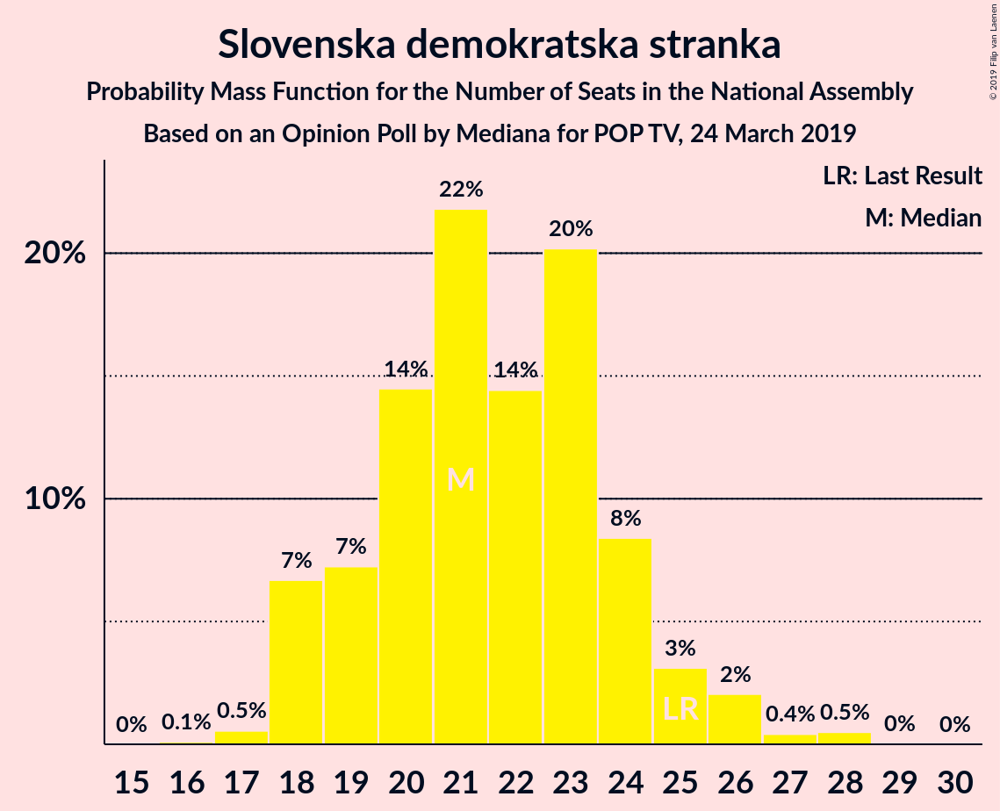
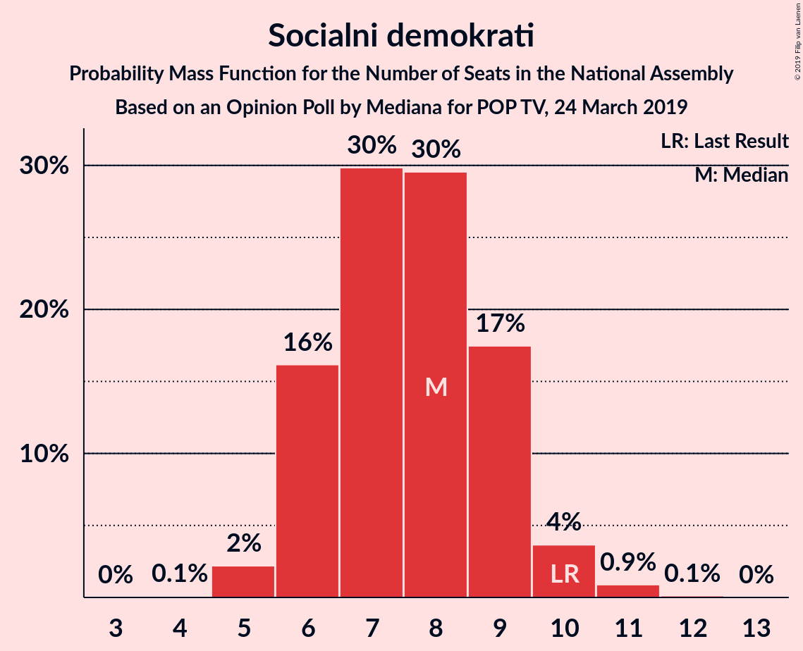
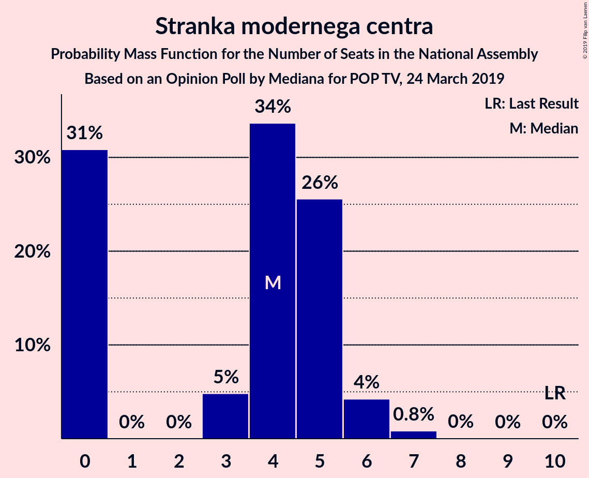
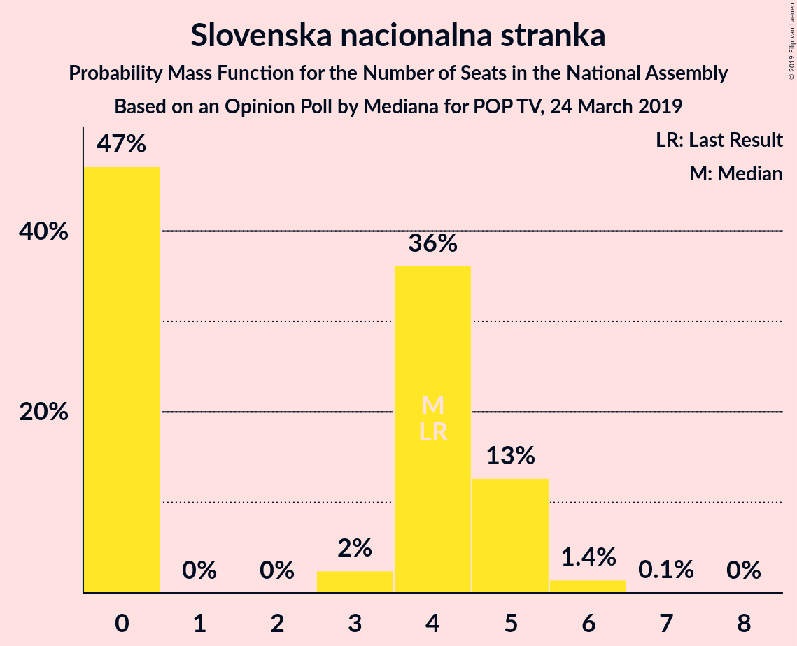
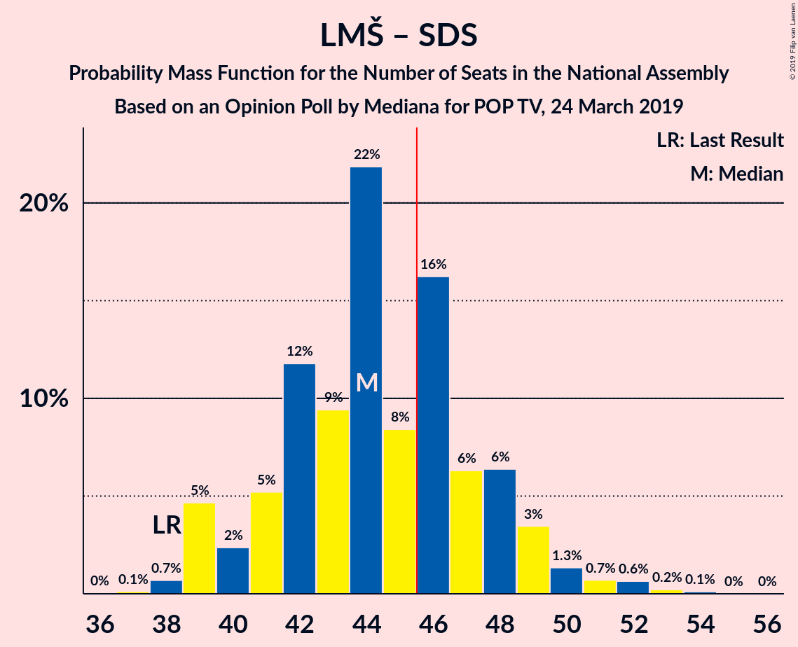
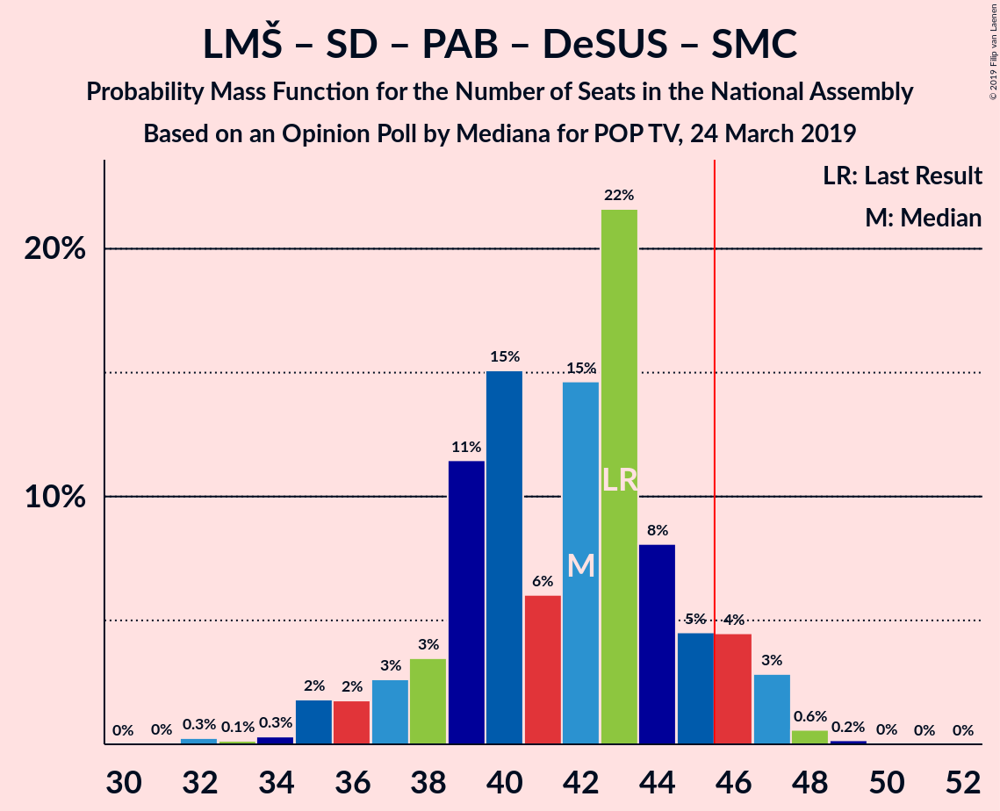
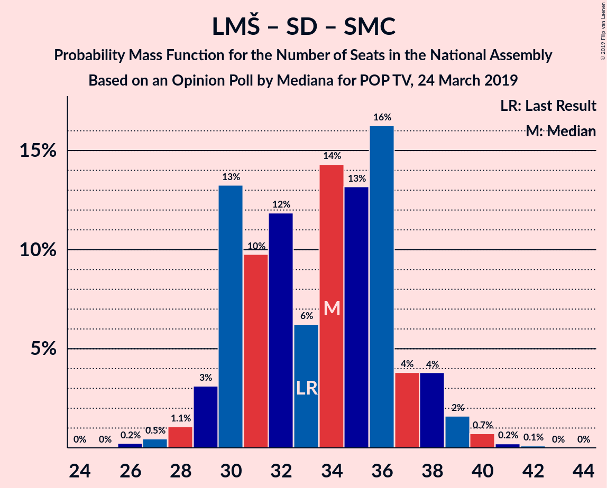
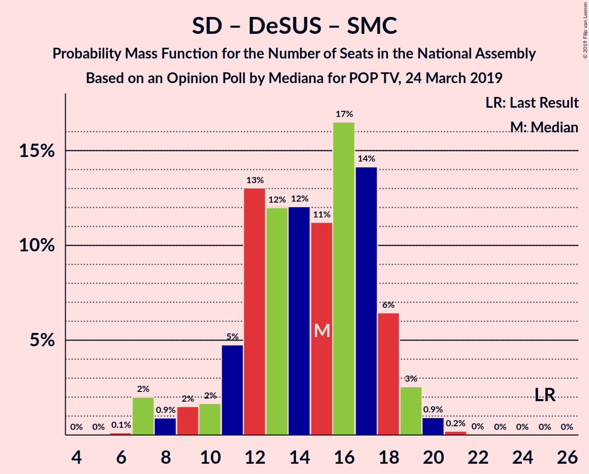

# Opinion Poll by Mediana for POP TV, 24 March 2019

<a href="#voting-intentions">Voting Intentions</a> | <a href="#seats">Seats</a> | <a href="#coalitions">Coalitions</a> | <a href="#technical-information">Technical Information</a>

## Voting Intentions

### Confidence Intervals

| Party | Last Result | Poll Result | 80% Confidence Interval | 90% Confidence Interval | 95% Confidence Interval | 99% Confidence Interval |
|:-----:|:-----------:|:-----------:|:-----------------------:|:-----------------------:|:-----------------------:|:-----------------------:|
| Lista Marjana Šarca | 12.6% | 23.9% | 21.7–26.3% |21.1–27.0% |20.6–27.6% |19.6–28.7% |
| Slovenska demokratska stranka | 24.9% | 22.9% | 20.7–25.2% |20.1–25.9% |19.6–26.5% |18.6–27.6% |
| Levica | 9.3% | 9.4% | 8.0–11.2% |7.6–11.7% |7.3–12.1% |6.7–13.0% |
| Nova Slovenija–Krščanski demokrati | 7.2% | 9.4% | 8.0–11.2% |7.6–11.7% |7.3–12.1% |6.7–13.0% |
| Socialni demokrati | 9.9% | 8.2% | 6.9–9.9% |6.5–10.3% |6.2–10.7% |5.7–11.6% |
| Stranka Alenke Bratušek | 5.1% | 5.1% | 4.1–6.4% |3.8–6.8% |3.6–7.2% |3.1–7.9% |
| Demokratična stranka upokojencev Slovenije | 4.9% | 4.7% | 3.7–6.1% |3.5–6.4% |3.3–6.8% |2.9–7.5% |
| Stranka modernega centra | 9.7% | 4.5% | 3.6–5.9% |3.3–6.2% |3.1–6.6% |2.7–7.3% |
| Slovenska nacionalna stranka | 4.2% | 4.0% | 3.1–5.3% |2.9–5.6% |2.7–6.0% |2.3–6.6% |
| Slovenska ljudska stranka | 2.6% | 2.3% | 1.6–3.3% |1.5–3.6% |1.3–3.9% |1.1–4.4% |

*Note:* The poll result column reflects the actual value used in the calculations. Published results may vary slightly, and in addition be rounded to fewer digits.

## Seats

### Confidence Intervals

| Party | Last Result | Median | 80% Confidence Interval | 90% Confidence Interval | 95% Confidence Interval | 99% Confidence Interval |
|:-----:|:-----------:|:------:|:-----------------------:|:-----------------------:|:-----------------------:|:-----------------------:|
| <a href="#lista-marjana-šarca">Lista Marjana Šarca</a> | 13 | 23 | 20–25 |20–26 |19–27 |18–29 |
| <a href="#slovenska-demokratska-stranka">Slovenska demokratska stranka</a> | 25 | 21 | 19–24 |18–25 |18–26 |17–28 |
| <a href="#levica">Levica</a> | 9 | 9 | 7–10 |7–11 |7–11 |6–12 |
| <a href="#nova-slovenija–krščanski-demokrati">Nova Slovenija–Krščanski demokrati</a> | 7 | 9 | 7–10 |7–11 |6–11 |6–12 |
| <a href="#socialni-demokrati">Socialni demokrati</a> | 10 | 8 | 6–9 |6–9 |6–10 |5–11 |
| <a href="#stranka-alenke-bratušek">Stranka Alenke Bratušek</a> | 5 | 4 | 4–6 |0–6 |0–6 |0–7 |
| <a href="#demokratična-stranka-upokojencev-slovenije">Demokratična stranka upokojencev Slovenije</a> | 5 | 4 | 0–5 |0–6 |0–6 |0–7 |
| <a href="#stranka-modernega-centra">Stranka modernega centra</a> | 10 | 4 | 0–5 |0–6 |0–6 |0–7 |
| <a href="#slovenska-nacionalna-stranka">Slovenska nacionalna stranka</a> | 4 | 4 | 0–5 |0–5 |0–5 |0–6 |
| <a href="#slovenska-ljudska-stranka">Slovenska ljudska stranka</a> | 0 | 0 | 0 |0 |0 |0–4 |

### Lista Marjana Šarca

*For a full overview of the results for this party, see the [Lista Marjana Šarca](party-listamarjanašarca.html) page.*

| Number of Seats | Probability | Accumulated | Special Marks |
|:---------------:|:-----------:|:-----------:|:-------------:|
| 13 | 0% | 100% | Last Result |
| 14 | 0% | 100% |  |
| 15 | 0% | 100% |  |
| 16 | 0% | 100% |  |
| 17 | 0.1% | 100% |  |
| 18 | 1.0% | 99.8% |  |
| 19 | 3% | 98.9% |  |
| 20 | 9% | 96% |  |
| 21 | 11% | 87% |  |
| 22 | 16% | 76% |  |
| 23 | 29% | 60% | Median |
| 24 | 12% | 31% |  |
| 25 | 12% | 19% |  |
| 26 | 3% | 7% |  |
| 27 | 3% | 4% |  |
| 28 | 0.5% | 1.2% |  |
| 29 | 0.5% | 0.6% |  |
| 30 | 0% | 0.1% |  |
| 31 | 0.1% | 0.1% |  |
| 32 | 0% | 0% |  |

### Slovenska demokratska stranka

*For a full overview of the results for this party, see the [Slovenska demokratska stranka](party-slovenskademokratskastranka.html) page.*

| Number of Seats | Probability | Accumulated | Special Marks |
|:---------------:|:-----------:|:-----------:|:-------------:|
| 16 | 0.1% | 100% |  |
| 17 | 0.5% | 99.9% |  |
| 18 | 7% | 99.3% |  |
| 19 | 7% | 93% |  |
| 20 | 14% | 85% |  |
| 21 | 22% | 71% | Median |
| 22 | 14% | 49% |  |
| 23 | 20% | 35% |  |
| 24 | 8% | 15% |  |
| 25 | 3% | 6% | Last Result |
| 26 | 2% | 3% |  |
| 27 | 0.4% | 1.0% |  |
| 28 | 0.5% | 0.5% |  |
| 29 | 0% | 0.1% |  |
| 30 | 0% | 0% |  |

### Levica

*For a full overview of the results for this party, see the [Levica](party-levica.html) page.*

| Number of Seats | Probability | Accumulated | Special Marks |
|:---------------:|:-----------:|:-----------:|:-------------:|
| 5 | 0.1% | 100% |  |
| 6 | 1.5% | 99.9% |  |
| 7 | 21% | 98% |  |
| 8 | 19% | 78% |  |
| 9 | 31% | 59% | Last Result, Median |
| 10 | 21% | 29% |  |
| 11 | 6% | 8% |  |
| 12 | 1.5% | 2% |  |
| 13 | 0.3% | 0.4% |  |
| 14 | 0.1% | 0.1% |  |
| 15 | 0% | 0% |  |

### Nova Slovenija–Krščanski demokrati

*For a full overview of the results for this party, see the [Nova Slovenija–Krščanski demokrati](party-novaslovenija–krščanskidemokrati.html) page.*

| Number of Seats | Probability | Accumulated | Special Marks |
|:---------------:|:-----------:|:-----------:|:-------------:|
| 5 | 0.2% | 100% |  |
| 6 | 4% | 99.8% |  |
| 7 | 13% | 96% | Last Result |
| 8 | 27% | 82% |  |
| 9 | 24% | 56% | Median |
| 10 | 25% | 31% |  |
| 11 | 5% | 7% |  |
| 12 | 1.5% | 2% |  |
| 13 | 0.3% | 0.4% |  |
| 14 | 0% | 0% |  |

### Socialni demokrati

*For a full overview of the results for this party, see the [Socialni demokrati](party-socialnidemokrati.html) page.*

| Number of Seats | Probability | Accumulated | Special Marks |
|:---------------:|:-----------:|:-----------:|:-------------:|
| 4 | 0.1% | 100% |  |
| 5 | 2% | 99.9% |  |
| 6 | 16% | 98% |  |
| 7 | 30% | 82% |  |
| 8 | 30% | 52% | Median |
| 9 | 17% | 22% |  |
| 10 | 4% | 5% | Last Result |
| 11 | 0.9% | 1.0% |  |
| 12 | 0.1% | 0.1% |  |
| 13 | 0% | 0% |  |

### Stranka Alenke Bratušek

*For a full overview of the results for this party, see the [Stranka Alenke Bratušek](party-strankaalenkebratušek.html) page.*

| Number of Seats | Probability | Accumulated | Special Marks |
|:---------------:|:-----------:|:-----------:|:-------------:|
| 0 | 7% | 100% |  |
| 1 | 0% | 93% |  |
| 2 | 0% | 93% |  |
| 3 | 1.4% | 93% |  |
| 4 | 45% | 92% | Median |
| 5 | 32% | 47% | Last Result |
| 6 | 13% | 16% |  |
| 7 | 2% | 2% |  |
| 8 | 0.1% | 0.1% |  |
| 9 | 0% | 0% |  |

### Demokratična stranka upokojencev Slovenije

*For a full overview of the results for this party, see the [Demokratična stranka upokojencev Slovenije](party-demokratičnastrankaupokojencevslovenije.html) page.*

| Number of Seats | Probability | Accumulated | Special Marks |
|:---------------:|:-----------:|:-----------:|:-------------:|
| 0 | 14% | 100% |  |
| 1 | 0% | 86% |  |
| 2 | 0% | 86% |  |
| 3 | 11% | 86% |  |
| 4 | 37% | 75% | Median |
| 5 | 30% | 38% | Last Result |
| 6 | 7% | 8% |  |
| 7 | 0.6% | 0.6% |  |
| 8 | 0.1% | 0.1% |  |
| 9 | 0% | 0% |  |

### Stranka modernega centra

*For a full overview of the results for this party, see the [Stranka modernega centra](party-strankamodernegacentra.html) page.*

| Number of Seats | Probability | Accumulated | Special Marks |
|:---------------:|:-----------:|:-----------:|:-------------:|
| 0 | 31% | 100% |  |
| 1 | 0% | 69% |  |
| 2 | 0% | 69% |  |
| 3 | 5% | 69% |  |
| 4 | 34% | 64% | Median |
| 5 | 26% | 31% |  |
| 6 | 4% | 5% |  |
| 7 | 0.8% | 0.9% |  |
| 8 | 0% | 0% |  |
| 9 | 0% | 0% |  |
| 10 | 0% | 0% | Last Result |

### Slovenska nacionalna stranka

*For a full overview of the results for this party, see the [Slovenska nacionalna stranka](party-slovenskanacionalnastranka.html) page.*

| Number of Seats | Probability | Accumulated | Special Marks |
|:---------------:|:-----------:|:-----------:|:-------------:|
| 0 | 47% | 100% |  |
| 1 | 0% | 53% |  |
| 2 | 0% | 53% |  |
| 3 | 2% | 53% |  |
| 4 | 36% | 50% | Last Result, Median |
| 5 | 13% | 14% |  |
| 6 | 1.4% | 2% |  |
| 7 | 0.1% | 0.1% |  |
| 8 | 0% | 0% |  |

### Slovenska ljudska stranka

*For a full overview of the results for this party, see the [Slovenska ljudska stranka](party-slovenskaljudskastranka.html) page.*

| Number of Seats | Probability | Accumulated | Special Marks |
|:---------------:|:-----------:|:-----------:|:-------------:|
| 0 | 98.9% | 100% | Last Result, Median |
| 1 | 0% | 1.1% |  |
| 2 | 0% | 1.1% |  |
| 3 | 0.3% | 1.1% |  |
| 4 | 0.8% | 0.8% |  |
| 5 | 0% | 0% |  |

## Coalitions

### Confidence Intervals

| Coalition | Last Result | Median | Majority? | 80% Confidence Interval | 90% Confidence Interval | 95% Confidence Interval | 99% Confidence Interval |
|:---------:|:-----------:|:------:|:---------:|:-----------------------:|:-----------------------:|:-----------------------:|:-----------------------:|
| Lista Marjana Šarca – Nova Slovenija–Krščanski demokrati – Socialni demokrati – Stranka Alenke Bratušek – Demokratična stranka upokojencev Slovenije – Stranka modernega centra | 50 | 51 | 95% | 47–53 | 46–55 | 45–56 | 43–56 |
| Lista Marjana Šarca – Slovenska demokratska stranka – Demokratična stranka upokojencev Slovenije | 43 | 48 | 83% | 44–52 | 43–53 | 43–55 | 42–55 |
| Lista Marjana Šarca – Nova Slovenija–Krščanski demokrati – Socialni demokrati – Demokratična stranka upokojencev Slovenije – Stranka modernega centra | 45 | 46 | 56% | 43–49 | 41–51 | 40–51 | 39–53 |
| Lista Marjana Šarca – Slovenska demokratska stranka | 38 | 44 | 35% | 41–48 | 39–49 | 39–50 | 38–52 |
| Lista Marjana Šarca – Nova Slovenija–Krščanski demokrati – Socialni demokrati – Demokratična stranka upokojencev Slovenije | 35 | 43 | 15% | 39–46 | 39–47 | 38–48 | 36–51 |
| Lista Marjana Šarca – Nova Slovenija–Krščanski demokrati – Socialni demokrati – Stranka modernega centra | 40 | 43 | 11% | 39–46 | 38–47 | 37–48 | 36–49 |
| Lista Marjana Šarca – Socialni demokrati – Stranka Alenke Bratušek – Demokratična stranka upokojencev Slovenije – Stranka modernega centra | 43 | 42 | 8% | 38–45 | 37–46 | 35–47 | 34–48 |
| Lista Marjana Šarca – Nova Slovenija–Krščanski demokrati – Socialni demokrati | 30 | 39 | 0.9% | 36–42 | 34–44 | 34–44 | 33–46 |
| Lista Marjana Šarca – Socialni demokrati – Demokratična stranka upokojencev Slovenije – Stranka modernega centra | 38 | 38 | 0% | 34–41 | 33–42 | 31–42 | 30–44 |
| Lista Marjana Šarca – Socialni demokrati – Demokratična stranka upokojencev Slovenije | 28 | 34 | 0% | 31–37 | 30–39 | 29–39 | 28–41 |
| Lista Marjana Šarca – Socialni demokrati – Stranka modernega centra | 33 | 34 | 0% | 30–37 | 30–38 | 29–39 | 27–40 |
| Lista Marjana Šarca – Socialni demokrati | 23 | 31 | 0% | 27–33 | 26–34 | 26–35 | 25–37 |
| Socialni demokrati – Demokratična stranka upokojencev Slovenije – Stranka modernega centra | 25 | 15 | 0% | 11–18 | 10–18 | 8–19 | 7–20 |

### Lista Marjana Šarca – Nova Slovenija–Krščanski demokrati – Socialni demokrati – Stranka Alenke Bratušek – Demokratična stranka upokojencev Slovenije – Stranka modernega centra

| Number of Seats | Probability | Accumulated | Special Marks |
|:---------------:|:-----------:|:-----------:|:-------------:|
| 41 | 0.3% | 100% |  |
| 42 | 0.1% | 99.7% |  |
| 43 | 2% | 99.7% |  |
| 44 | 0.4% | 98% |  |
| 45 | 3% | 98% |  |
| 46 | 4% | 95% | Majority |
| 47 | 4% | 91% |  |
| 48 | 9% | 87% |  |
| 49 | 11% | 79% |  |
| 50 | 17% | 68% | Last Result |
| 51 | 20% | 51% |  |
| 52 | 11% | 31% | Median |
| 53 | 12% | 20% |  |
| 54 | 2% | 9% |  |
| 55 | 3% | 6% |  |
| 56 | 3% | 3% |  |
| 57 | 0.3% | 0.5% |  |
| 58 | 0.1% | 0.2% |  |
| 59 | 0.1% | 0.1% |  |
| 60 | 0% | 0% |  |

### Lista Marjana Šarca – Slovenska demokratska stranka – Demokratična stranka upokojencev Slovenije

| Number of Seats | Probability | Accumulated | Special Marks |
|:---------------:|:-----------:|:-----------:|:-------------:|
| 40 | 0.1% | 100% |  |
| 41 | 0.4% | 99.9% |  |
| 42 | 1.0% | 99.5% |  |
| 43 | 5% | 98.5% | Last Result |
| 44 | 4% | 93% |  |
| 45 | 5% | 89% |  |
| 46 | 7% | 83% | Majority |
| 47 | 21% | 76% |  |
| 48 | 15% | 55% | Median |
| 49 | 9% | 40% |  |
| 50 | 7% | 31% |  |
| 51 | 12% | 24% |  |
| 52 | 5% | 11% |  |
| 53 | 2% | 7% |  |
| 54 | 2% | 5% |  |
| 55 | 3% | 3% |  |
| 56 | 0.3% | 0.4% |  |
| 57 | 0.1% | 0.1% |  |
| 58 | 0% | 0.1% |  |
| 59 | 0% | 0% |  |

### Lista Marjana Šarca – Nova Slovenija–Krščanski demokrati – Socialni demokrati – Demokratična stranka upokojencev Slovenije – Stranka modernega centra

| Number of Seats | Probability | Accumulated | Special Marks |
|:---------------:|:-----------:|:-----------:|:-------------:|
| 36 | 0.1% | 100% |  |
| 37 | 0.2% | 99.9% |  |
| 38 | 0.1% | 99.7% |  |
| 39 | 2% | 99.7% |  |
| 40 | 1.1% | 98% |  |
| 41 | 2% | 97% |  |
| 42 | 4% | 94% |  |
| 43 | 5% | 90% |  |
| 44 | 14% | 86% |  |
| 45 | 15% | 72% | Last Result |
| 46 | 8% | 56% | Majority |
| 47 | 23% | 48% |  |
| 48 | 9% | 25% | Median |
| 49 | 7% | 16% |  |
| 50 | 3% | 9% |  |
| 51 | 4% | 6% |  |
| 52 | 1.2% | 2% |  |
| 53 | 0.3% | 0.5% |  |
| 54 | 0.2% | 0.3% |  |
| 55 | 0.1% | 0.1% |  |
| 56 | 0% | 0% |  |

### Lista Marjana Šarca – Slovenska demokratska stranka

| Number of Seats | Probability | Accumulated | Special Marks |
|:---------------:|:-----------:|:-----------:|:-------------:|
| 37 | 0.1% | 100% |  |
| 38 | 0.7% | 99.9% | Last Result |
| 39 | 5% | 99.2% |  |
| 40 | 2% | 94% |  |
| 41 | 5% | 92% |  |
| 42 | 12% | 87% |  |
| 43 | 9% | 75% |  |
| 44 | 22% | 66% | Median |
| 45 | 8% | 44% |  |
| 46 | 16% | 35% | Majority |
| 47 | 6% | 19% |  |
| 48 | 6% | 13% |  |
| 49 | 3% | 7% |  |
| 50 | 1.3% | 3% |  |
| 51 | 0.7% | 2% |  |
| 52 | 0.6% | 1.0% |  |
| 53 | 0.2% | 0.4% |  |
| 54 | 0.1% | 0.1% |  |
| 55 | 0% | 0% |  |

### Lista Marjana Šarca – Nova Slovenija–Krščanski demokrati – Socialni demokrati – Demokratična stranka upokojencev Slovenije

| Number of Seats | Probability | Accumulated | Special Marks |
|:---------------:|:-----------:|:-----------:|:-------------:|
| 34 | 0.1% | 100% |  |
| 35 | 0.1% | 99.9% | Last Result |
| 36 | 0.4% | 99.8% |  |
| 37 | 1.2% | 99.3% |  |
| 38 | 3% | 98% |  |
| 39 | 6% | 95% |  |
| 40 | 8% | 89% |  |
| 41 | 11% | 81% |  |
| 42 | 15% | 71% |  |
| 43 | 16% | 55% |  |
| 44 | 9% | 39% | Median |
| 45 | 15% | 30% |  |
| 46 | 6% | 15% | Majority |
| 47 | 5% | 9% |  |
| 48 | 2% | 4% |  |
| 49 | 2% | 2% |  |
| 50 | 0.4% | 0.9% |  |
| 51 | 0.5% | 0.5% |  |
| 52 | 0.1% | 0.1% |  |
| 53 | 0% | 0% |  |

### Lista Marjana Šarca – Nova Slovenija–Krščanski demokrati – Socialni demokrati – Stranka modernega centra

| Number of Seats | Probability | Accumulated | Special Marks |
|:---------------:|:-----------:|:-----------:|:-------------:|
| 34 | 0% | 100% |  |
| 35 | 0.1% | 99.9% |  |
| 36 | 1.2% | 99.8% |  |
| 37 | 2% | 98.6% |  |
| 38 | 5% | 97% |  |
| 39 | 8% | 92% |  |
| 40 | 15% | 84% | Last Result |
| 41 | 11% | 69% |  |
| 42 | 7% | 58% |  |
| 43 | 13% | 50% |  |
| 44 | 21% | 37% | Median |
| 45 | 5% | 16% |  |
| 46 | 5% | 11% | Majority |
| 47 | 3% | 6% |  |
| 48 | 1.5% | 3% |  |
| 49 | 0.9% | 1.3% |  |
| 50 | 0.3% | 0.4% |  |
| 51 | 0.1% | 0.2% |  |
| 52 | 0.1% | 0.1% |  |
| 53 | 0% | 0% |  |

### Lista Marjana Šarca – Socialni demokrati – Stranka Alenke Bratušek – Demokratična stranka upokojencev Slovenije – Stranka modernega centra

| Number of Seats | Probability | Accumulated | Special Marks |
|:---------------:|:-----------:|:-----------:|:-------------:|
| 32 | 0.3% | 100% |  |
| 33 | 0.1% | 99.7% |  |
| 34 | 0.3% | 99.6% |  |
| 35 | 2% | 99.3% |  |
| 36 | 2% | 97% |  |
| 37 | 3% | 96% |  |
| 38 | 3% | 93% |  |
| 39 | 11% | 90% |  |
| 40 | 15% | 78% |  |
| 41 | 6% | 63% |  |
| 42 | 15% | 57% |  |
| 43 | 22% | 42% | Last Result, Median |
| 44 | 8% | 21% |  |
| 45 | 5% | 13% |  |
| 46 | 4% | 8% | Majority |
| 47 | 3% | 4% |  |
| 48 | 0.6% | 0.8% |  |
| 49 | 0.2% | 0.2% |  |
| 50 | 0% | 0.1% |  |
| 51 | 0% | 0% |  |

### Lista Marjana Šarca – Nova Slovenija–Krščanski demokrati – Socialni demokrati

| Number of Seats | Probability | Accumulated | Special Marks |
|:---------------:|:-----------:|:-----------:|:-------------:|
| 30 | 0% | 100% | Last Result |
| 31 | 0% | 100% |  |
| 32 | 0.2% | 99.9% |  |
| 33 | 1.0% | 99.8% |  |
| 34 | 4% | 98.8% |  |
| 35 | 4% | 95% |  |
| 36 | 5% | 91% |  |
| 37 | 8% | 86% |  |
| 38 | 9% | 77% |  |
| 39 | 24% | 68% |  |
| 40 | 18% | 44% | Median |
| 41 | 14% | 26% |  |
| 42 | 4% | 12% |  |
| 43 | 2% | 8% |  |
| 44 | 3% | 5% |  |
| 45 | 1.0% | 2% |  |
| 46 | 0.7% | 0.9% | Majority |
| 47 | 0.1% | 0.2% |  |
| 48 | 0.1% | 0.2% |  |
| 49 | 0.1% | 0.1% |  |
| 50 | 0% | 0% |  |

### Lista Marjana Šarca – Socialni demokrati – Demokratična stranka upokojencev Slovenije – Stranka modernega centra

| Number of Seats | Probability | Accumulated | Special Marks |
|:---------------:|:-----------:|:-----------:|:-------------:|
| 27 | 0.1% | 100% |  |
| 28 | 0.1% | 99.9% |  |
| 29 | 0.1% | 99.7% |  |
| 30 | 0.4% | 99.7% |  |
| 31 | 2% | 99.3% |  |
| 32 | 2% | 97% |  |
| 33 | 3% | 95% |  |
| 34 | 5% | 92% |  |
| 35 | 17% | 87% |  |
| 36 | 10% | 70% |  |
| 37 | 9% | 59% |  |
| 38 | 13% | 50% | Last Result |
| 39 | 18% | 37% | Median |
| 40 | 6% | 18% |  |
| 41 | 6% | 12% |  |
| 42 | 4% | 6% |  |
| 43 | 1.4% | 2% |  |
| 44 | 0.3% | 0.5% |  |
| 45 | 0.2% | 0.2% |  |
| 46 | 0% | 0% | Majority |

### Lista Marjana Šarca – Socialni demokrati – Demokratična stranka upokojencev Slovenije

| Number of Seats | Probability | Accumulated | Special Marks |
|:---------------:|:-----------:|:-----------:|:-------------:|
| 26 | 0.1% | 100% |  |
| 27 | 0.3% | 99.9% |  |
| 28 | 1.1% | 99.6% | Last Result |
| 29 | 1.1% | 98.5% |  |
| 30 | 5% | 97% |  |
| 31 | 11% | 93% |  |
| 32 | 6% | 82% |  |
| 33 | 10% | 76% |  |
| 34 | 22% | 66% |  |
| 35 | 17% | 44% | Median |
| 36 | 11% | 27% |  |
| 37 | 7% | 16% |  |
| 38 | 4% | 9% |  |
| 39 | 4% | 5% |  |
| 40 | 0.6% | 1.3% |  |
| 41 | 0.2% | 0.7% |  |
| 42 | 0.5% | 0.5% |  |
| 43 | 0% | 0% |  |

### Lista Marjana Šarca – Socialni demokrati – Stranka modernega centra

| Number of Seats | Probability | Accumulated | Special Marks |
|:---------------:|:-----------:|:-----------:|:-------------:|
| 26 | 0.2% | 100% |  |
| 27 | 0.5% | 99.8% |  |
| 28 | 1.1% | 99.3% |  |
| 29 | 3% | 98% |  |
| 30 | 13% | 95% |  |
| 31 | 10% | 82% |  |
| 32 | 12% | 72% |  |
| 33 | 6% | 60% | Last Result |
| 34 | 14% | 54% |  |
| 35 | 13% | 40% | Median |
| 36 | 16% | 27% |  |
| 37 | 4% | 10% |  |
| 38 | 4% | 6% |  |
| 39 | 2% | 3% |  |
| 40 | 0.7% | 1.1% |  |
| 41 | 0.2% | 0.3% |  |
| 42 | 0.1% | 0.1% |  |
| 43 | 0% | 0% |  |

### Lista Marjana Šarca – Socialni demokrati

| Number of Seats | Probability | Accumulated | Special Marks |
|:---------------:|:-----------:|:-----------:|:-------------:|
| 23 | 0% | 100% | Last Result |
| 24 | 0.2% | 100% |  |
| 25 | 1.3% | 99.7% |  |
| 26 | 4% | 98% |  |
| 27 | 6% | 94% |  |
| 28 | 7% | 88% |  |
| 29 | 8% | 81% |  |
| 30 | 21% | 73% |  |
| 31 | 26% | 52% | Median |
| 32 | 13% | 26% |  |
| 33 | 5% | 13% |  |
| 34 | 4% | 8% |  |
| 35 | 3% | 4% |  |
| 36 | 1.0% | 2% |  |
| 37 | 0.5% | 0.6% |  |
| 38 | 0.1% | 0.1% |  |
| 39 | 0% | 0% |  |

### Socialni demokrati – Demokratična stranka upokojencev Slovenije – Stranka modernega centra

| Number of Seats | Probability | Accumulated | Special Marks |
|:---------------:|:-----------:|:-----------:|:-------------:|
| 6 | 0.1% | 100% |  |
| 7 | 2% | 99.9% |  |
| 8 | 0.9% | 98% |  |
| 9 | 2% | 97% |  |
| 10 | 2% | 95% |  |
| 11 | 5% | 94% |  |
| 12 | 13% | 89% |  |
| 13 | 12% | 76% |  |
| 14 | 12% | 64% |  |
| 15 | 11% | 52% |  |
| 16 | 17% | 41% | Median |
| 17 | 14% | 24% |  |
| 18 | 6% | 10% |  |
| 19 | 3% | 4% |  |
| 20 | 0.9% | 1.1% |  |
| 21 | 0.2% | 0.2% |  |
| 22 | 0% | 0% |  |
| 23 | 0% | 0% |  |
| 24 | 0% | 0% |  |
| 25 | 0% | 0% | Last Result |

## Technical Information

### Opinion Poll

+ **Polling firm:** Mediana
+ **Commissioner(s):** POP TV
+ **Fieldwork period:** 24 March 2019

### Calculations

+ **Sample size:** 573
+ **Simulations done:** 1,048,576
+ **Error estimate:** 1.94%

