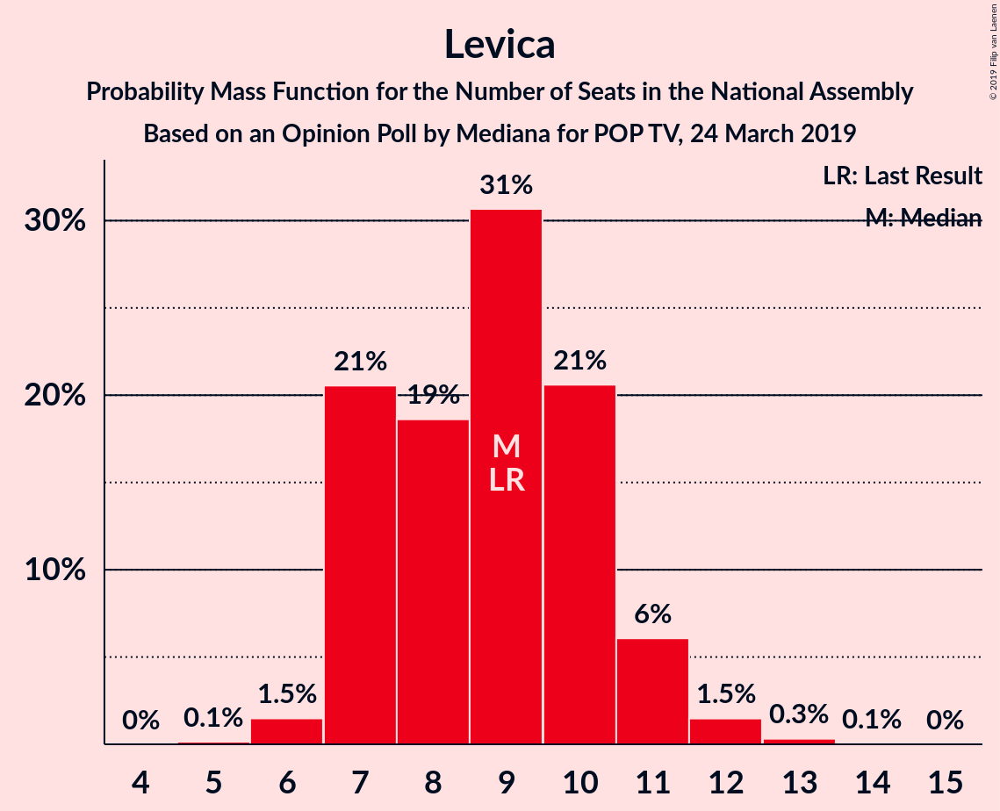
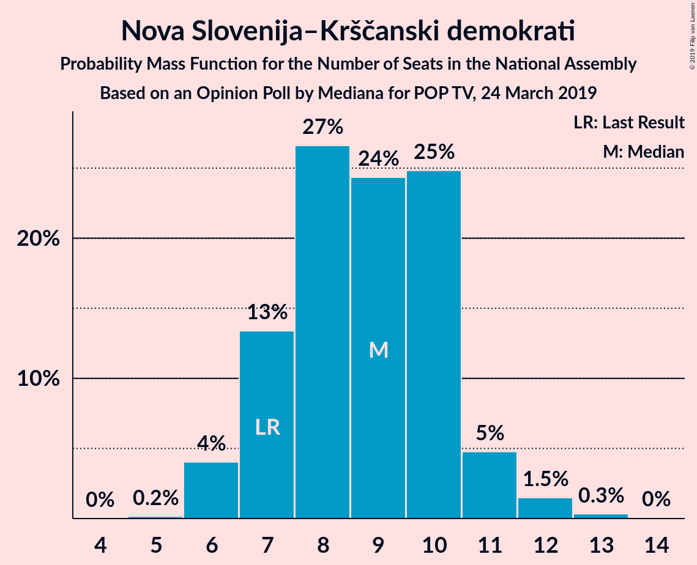
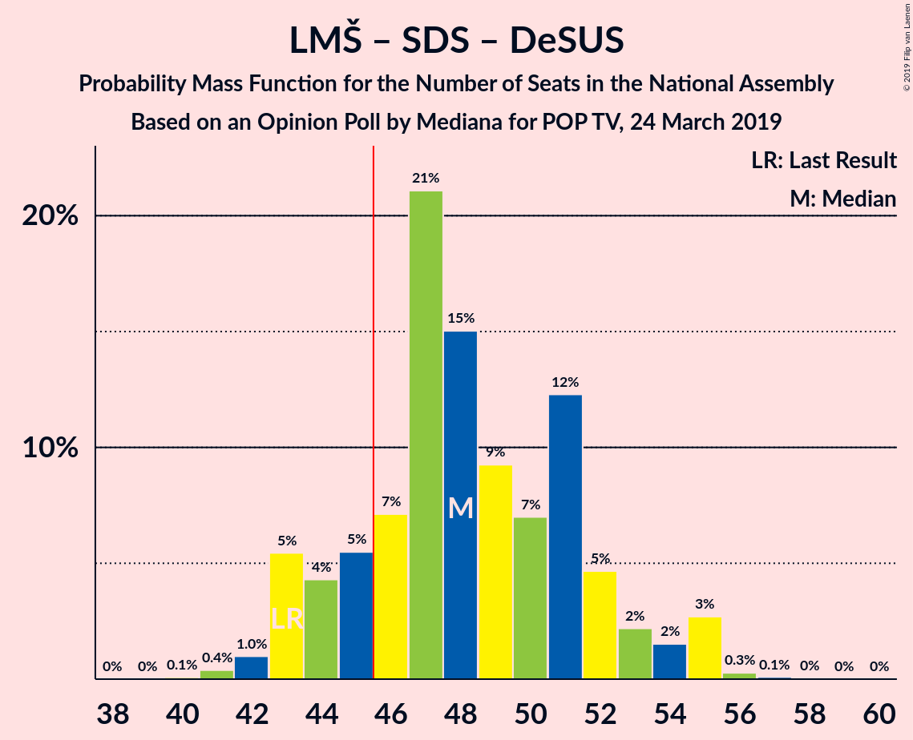
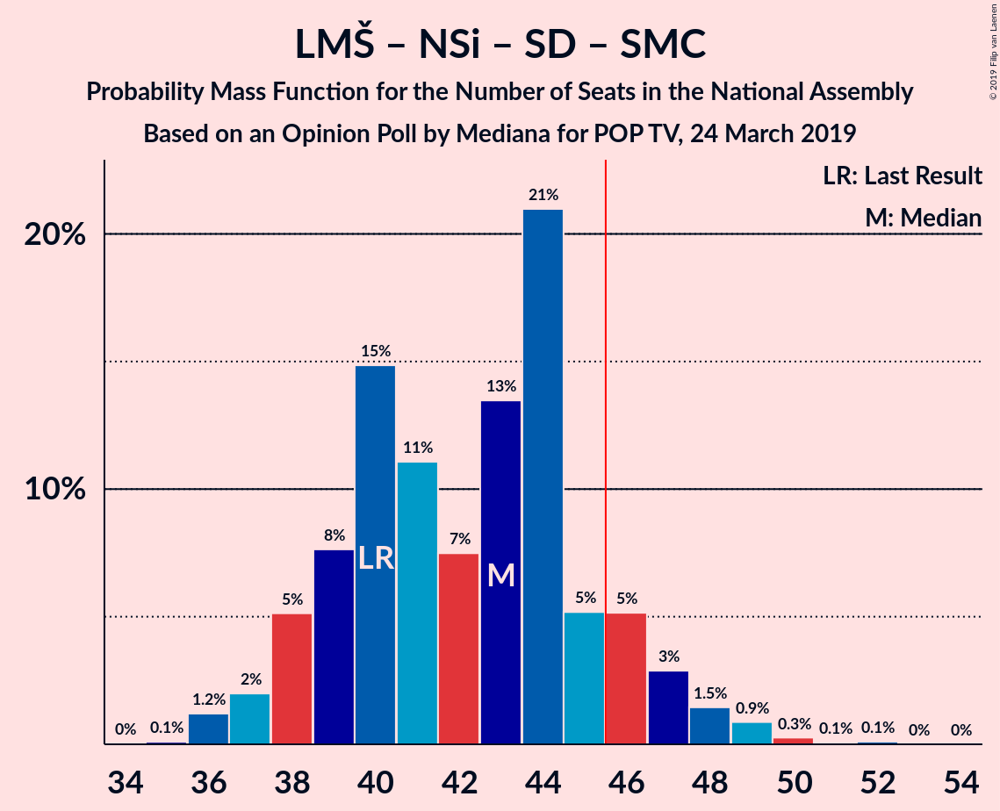
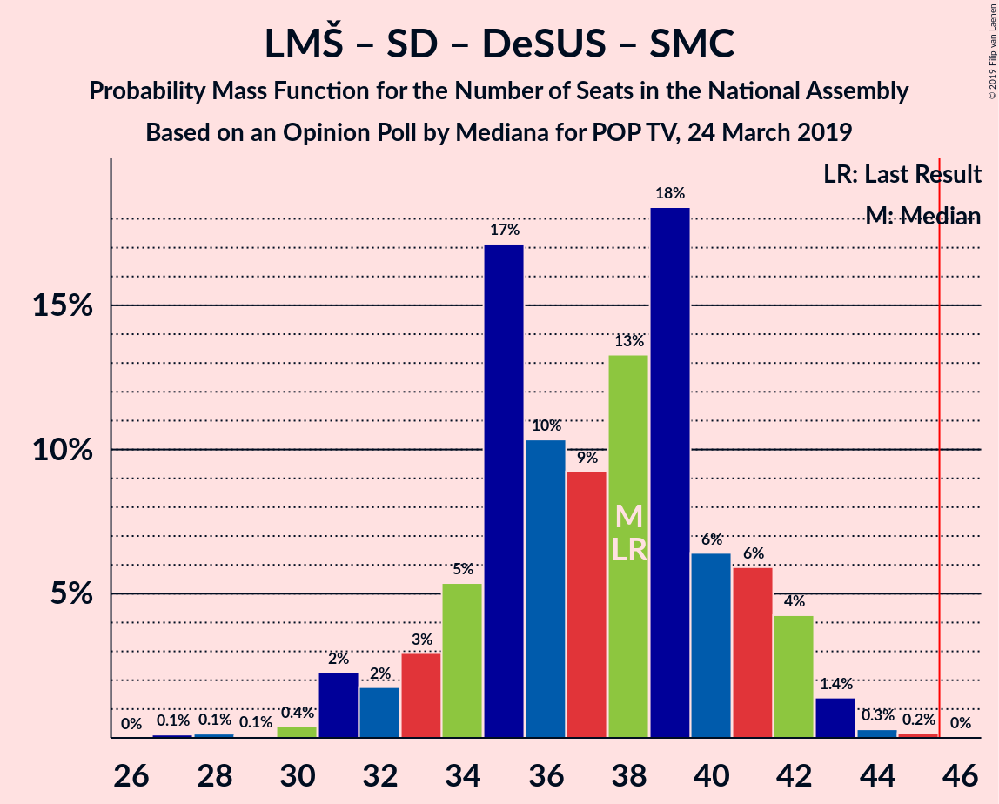

# Opinion Poll by Mediana for POP TV, 24 March 2019

<a href="#voting-intentions">Voting Intentions</a> | <a href="#seats">Seats</a> | <a href="#coalitions">Coalitions</a> | <a href="#technical-information">Technical Information</a>

## Voting Intentions

### Confidence Intervals

| Party | Last Result | Poll Result | 80% Confidence Interval | 90% Confidence Interval | 95% Confidence Interval | 99% Confidence Interval |
|:-----:|:-----------:|:-----------:|:-----------------------:|:-----------------------:|:-----------------------:|:-----------------------:|
| Lista Marjana Šarca | 12.6% | 23.9% | 21.7–26.3% |21.1–27.0% |20.6–27.6% |19.6–28.7% |
| Slovenska demokratska stranka | 24.9% | 22.9% | 20.7–25.2% |20.1–25.9% |19.6–26.5% |18.6–27.6% |
| Levica | 9.3% | 9.4% | 8.0–11.2% |7.6–11.7% |7.3–12.1% |6.7–13.0% |
| Nova Slovenija–Krščanski demokrati | 7.2% | 9.4% | 8.0–11.2% |7.6–11.7% |7.3–12.1% |6.7–13.0% |
| Socialni demokrati | 9.9% | 8.2% | 6.9–9.9% |6.5–10.3% |6.2–10.7% |5.7–11.6% |
| Stranka Alenke Bratušek | 5.1% | 5.1% | 4.1–6.4% |3.8–6.8% |3.6–7.2% |3.1–7.9% |
| Demokratična stranka upokojencev Slovenije | 4.9% | 4.7% | 3.7–6.1% |3.5–6.4% |3.3–6.8% |2.9–7.5% |
| Stranka modernega centra | 9.7% | 4.5% | 3.6–5.9% |3.3–6.2% |3.1–6.6% |2.7–7.3% |
| Slovenska nacionalna stranka | 4.2% | 4.0% | 3.1–5.3% |2.9–5.6% |2.7–6.0% |2.3–6.6% |
| Slovenska ljudska stranka | 2.6% | 2.3% | 1.6–3.3% |1.5–3.6% |1.3–3.9% |1.1–4.4% |

*Note:* The poll result column reflects the actual value used in the calculations. Published results may vary slightly, and in addition be rounded to fewer digits.

## Seats

### Confidence Intervals

| Party | Last Result | Median | 80% Confidence Interval | 90% Confidence Interval | 95% Confidence Interval | 99% Confidence Interval |
|:-----:|:-----------:|:------:|:-----------------------:|:-----------------------:|:-----------------------:|:-----------------------:|
| <a href="#lista-marjana-šarca">Lista Marjana Šarca</a> | 13 | 24 | 20–26 |19–27 |19–29 |18–30 |
| <a href="#slovenska-demokratska-stranka">Slovenska demokratska stranka</a> | 25 | 21 | 19–23 |19–24 |18–27 |18–28 |
| <a href="#levica">Levica</a> | 9 | 8 | 7–11 |7–11 |7–12 |6–12 |
| <a href="#nova-slovenija–krščanski-demokrati">Nova Slovenija–Krščanski demokrati</a> | 7 | 9 | 7–10 |6–11 |6–12 |6–12 |
| <a href="#socialni-demokrati">Socialni demokrati</a> | 10 | 8 | 6–9 |6–10 |6–10 |5–11 |
| <a href="#stranka-alenke-bratušek">Stranka Alenke Bratušek</a> | 5 | 4 | 4–6 |0–6 |0–6 |0–7 |
| <a href="#demokratična-stranka-upokojencev-slovenije">Demokratična stranka upokojencev Slovenije</a> | 5 | 4 | 0–5 |0–5 |0–6 |0–7 |
| <a href="#stranka-modernega-centra">Stranka modernega centra</a> | 10 | 4 | 0–5 |0–5 |0–6 |0–7 |
| <a href="#slovenska-nacionalna-stranka">Slovenska nacionalna stranka</a> | 4 | 4 | 0–5 |0–5 |0–5 |0–6 |
| <a href="#slovenska-ljudska-stranka">Slovenska ljudska stranka</a> | 0 | 0 | 0 |0 |0 |0–4 |

### Lista Marjana Šarca

*For a full overview of the results for this party, see the [Lista Marjana Šarca](party-listamarjanašarca.html) page.*

| Number of Seats | Probability | Accumulated | Special Marks |
|:---------------:|:-----------:|:-----------:|:-------------:|
| 13 | 0% | 100% | Last Result |
| 14 | 0% | 100% |  |
| 15 | 0% | 100% |  |
| 16 | 0% | 100% |  |
| 17 | 0.1% | 100% |  |
| 18 | 0.8% | 99.9% |  |
| 19 | 4% | 99.1% |  |
| 20 | 8% | 95% |  |
| 21 | 5% | 87% |  |
| 22 | 22% | 82% |  |
| 23 | 5% | 60% |  |
| 24 | 30% | 55% | Median |
| 25 | 14% | 26% |  |
| 26 | 6% | 12% |  |
| 27 | 1.1% | 6% |  |
| 28 | 0.3% | 5% |  |
| 29 | 4% | 5% |  |
| 30 | 0.1% | 0.6% |  |
| 31 | 0.5% | 0.5% |  |
| 32 | 0% | 0% |  |

### Slovenska demokratska stranka

*For a full overview of the results for this party, see the [Slovenska demokratska stranka](party-slovenskademokratskastranka.html) page.*

| Number of Seats | Probability | Accumulated | Special Marks |
|:---------------:|:-----------:|:-----------:|:-------------:|
| 17 | 0.2% | 100% |  |
| 18 | 4% | 99.8% |  |
| 19 | 9% | 96% |  |
| 20 | 25% | 86% |  |
| 21 | 30% | 61% | Median |
| 22 | 17% | 31% |  |
| 23 | 7% | 14% |  |
| 24 | 3% | 8% |  |
| 25 | 0.6% | 4% | Last Result |
| 26 | 0.3% | 4% |  |
| 27 | 0.8% | 3% |  |
| 28 | 2% | 2% |  |
| 29 | 0% | 0% |  |

### Levica

*For a full overview of the results for this party, see the [Levica](party-levica.html) page.*

| Number of Seats | Probability | Accumulated | Special Marks |
|:---------------:|:-----------:|:-----------:|:-------------:|
| 5 | 0.2% | 100% |  |
| 6 | 1.3% | 99.8% |  |
| 7 | 12% | 98.5% |  |
| 8 | 49% | 86% | Median |
| 9 | 13% | 37% | Last Result |
| 10 | 12% | 25% |  |
| 11 | 10% | 13% |  |
| 12 | 2% | 3% |  |
| 13 | 0.3% | 0.3% |  |
| 14 | 0.1% | 0.1% |  |
| 15 | 0% | 0% |  |

### Nova Slovenija–Krščanski demokrati

*For a full overview of the results for this party, see the [Nova Slovenija–Krščanski demokrati](party-novaslovenija–krščanskidemokrati.html) page.*

| Number of Seats | Probability | Accumulated | Special Marks |
|:---------------:|:-----------:|:-----------:|:-------------:|
| 5 | 0.1% | 100% |  |
| 6 | 7% | 99.9% |  |
| 7 | 6% | 92% | Last Result |
| 8 | 19% | 86% |  |
| 9 | 24% | 68% | Median |
| 10 | 39% | 44% |  |
| 11 | 2% | 5% |  |
| 12 | 2% | 3% |  |
| 13 | 0.3% | 0.3% |  |
| 14 | 0.1% | 0.1% |  |
| 15 | 0% | 0% |  |

### Socialni demokrati

*For a full overview of the results for this party, see the [Socialni demokrati](party-socialnidemokrati.html) page.*

| Number of Seats | Probability | Accumulated | Special Marks |
|:---------------:|:-----------:|:-----------:|:-------------:|
| 4 | 0.1% | 100% |  |
| 5 | 2% | 99.9% |  |
| 6 | 22% | 98% |  |
| 7 | 23% | 76% |  |
| 8 | 28% | 53% | Median |
| 9 | 17% | 25% |  |
| 10 | 6% | 8% | Last Result |
| 11 | 2% | 2% |  |
| 12 | 0.1% | 0.1% |  |
| 13 | 0% | 0% |  |

### Stranka Alenke Bratušek

*For a full overview of the results for this party, see the [Stranka Alenke Bratušek](party-strankaalenkebratušek.html) page.*

| Number of Seats | Probability | Accumulated | Special Marks |
|:---------------:|:-----------:|:-----------:|:-------------:|
| 0 | 9% | 100% |  |
| 1 | 0% | 91% |  |
| 2 | 0% | 91% |  |
| 3 | 0.3% | 91% |  |
| 4 | 46% | 90% | Median |
| 5 | 28% | 44% | Last Result |
| 6 | 14% | 16% |  |
| 7 | 1.4% | 2% |  |
| 8 | 0.2% | 0.2% |  |
| 9 | 0% | 0% |  |

### Demokratična stranka upokojencev Slovenije

*For a full overview of the results for this party, see the [Demokratična stranka upokojencev Slovenije](party-demokratičnastrankaupokojencevslovenije.html) page.*

| Number of Seats | Probability | Accumulated | Special Marks |
|:---------------:|:-----------:|:-----------:|:-------------:|
| 0 | 18% | 100% |  |
| 1 | 0% | 82% |  |
| 2 | 0% | 82% |  |
| 3 | 1.0% | 82% |  |
| 4 | 44% | 81% | Median |
| 5 | 33% | 37% | Last Result |
| 6 | 3% | 4% |  |
| 7 | 0.6% | 0.6% |  |
| 8 | 0% | 0% |  |

### Stranka modernega centra

*For a full overview of the results for this party, see the [Stranka modernega centra](party-strankamodernegacentra.html) page.*

| Number of Seats | Probability | Accumulated | Special Marks |
|:---------------:|:-----------:|:-----------:|:-------------:|
| 0 | 39% | 100% |  |
| 1 | 0% | 61% |  |
| 2 | 0% | 61% |  |
| 3 | 10% | 61% |  |
| 4 | 28% | 50% | Median |
| 5 | 17% | 22% |  |
| 6 | 4% | 5% |  |
| 7 | 0.5% | 0.7% |  |
| 8 | 0.3% | 0.3% |  |
| 9 | 0% | 0% |  |
| 10 | 0% | 0% | Last Result |

### Slovenska nacionalna stranka

*For a full overview of the results for this party, see the [Slovenska nacionalna stranka](party-slovenskanacionalnastranka.html) page.*

| Number of Seats | Probability | Accumulated | Special Marks |
|:---------------:|:-----------:|:-----------:|:-------------:|
| 0 | 32% | 100% |  |
| 1 | 0% | 68% |  |
| 2 | 0% | 68% |  |
| 3 | 11% | 68% |  |
| 4 | 36% | 57% | Last Result, Median |
| 5 | 20% | 21% |  |
| 6 | 0.7% | 0.8% |  |
| 7 | 0.1% | 0.1% |  |
| 8 | 0% | 0% |  |

### Slovenska ljudska stranka

*For a full overview of the results for this party, see the [Slovenska ljudska stranka](party-slovenskaljudskastranka.html) page.*

| Number of Seats | Probability | Accumulated | Special Marks |
|:---------------:|:-----------:|:-----------:|:-------------:|
| 0 | 98% | 100% | Last Result, Median |
| 1 | 0% | 2% |  |
| 2 | 0% | 2% |  |
| 3 | 0.8% | 2% |  |
| 4 | 0.9% | 0.9% |  |
| 5 | 0% | 0% |  |

## Coalitions

### Confidence Intervals

| Coalition | Last Result | Median | Majority? | 80% Confidence Interval | 90% Confidence Interval | 95% Confidence Interval | 99% Confidence Interval |
|:---------:|:-----------:|:------:|:---------:|:-----------------------:|:-----------------------:|:-----------------------:|:-----------------------:|
| Lista Marjana Šarca – Nova Slovenija–Krščanski demokrati – Socialni demokrati – Stranka Alenke Bratušek – Demokratična stranka upokojencev Slovenije – Stranka modernega centra | 50 | 49 | 98.7% | 48–54 | 47–55 | 46–56 | 44–56 |
| Lista Marjana Šarca – Slovenska demokratska stranka – Demokratična stranka upokojencev Slovenije | 43 | 48 | 82% | 44–52 | 43–54 | 43–54 | 42–57 |
| Lista Marjana Šarca – Nova Slovenija–Krščanski demokrati – Socialni demokrati – Demokratična stranka upokojencev Slovenije – Stranka modernega centra | 45 | 45 | 49% | 43–50 | 43–51 | 41–52 | 40–52 |
| Lista Marjana Šarca – Nova Slovenija–Krščanski demokrati – Socialni demokrati – Demokratična stranka upokojencev Slovenije | 35 | 43 | 25% | 40–47 | 40–49 | 39–51 | 36–51 |
| Lista Marjana Šarca – Slovenska demokratska stranka | 38 | 44 | 28% | 40–48 | 39–49 | 39–50 | 39–53 |
| Lista Marjana Šarca – Nova Slovenija–Krščanski demokrati – Socialni demokrati – Stranka modernega centra | 40 | 42 | 17% | 40–46 | 39–47 | 39–47 | 37–51 |
| Lista Marjana Šarca – Socialni demokrati – Stranka Alenke Bratušek – Demokratična stranka upokojencev Slovenije – Stranka modernega centra | 43 | 41 | 11% | 39–46 | 38–47 | 37–47 | 35–47 |
| Lista Marjana Šarca – Nova Slovenija–Krščanski demokrati – Socialni demokrati | 30 | 41 | 5% | 37–42 | 35–45 | 35–46 | 34–48 |
| Lista Marjana Šarca – Socialni demokrati – Demokratična stranka upokojencev Slovenije – Stranka modernega centra | 38 | 37 | 0% | 34–42 | 34–42 | 33–43 | 31–43 |
| Lista Marjana Šarca – Socialni demokrati – Demokratična stranka upokojencev Slovenije | 28 | 35 | 0% | 31–38 | 31–39 | 30–42 | 28–42 |
| Lista Marjana Šarca – Socialni demokrati – Stranka modernega centra | 33 | 34 | 0% | 31–37 | 30–38 | 30–38 | 27–42 |
| Lista Marjana Šarca – Socialni demokrati | 23 | 31 | 0% | 28–34 | 27–35 | 27–37 | 26–38 |
| Socialni demokrati – Demokratična stranka upokojencev Slovenije – Stranka modernega centra | 25 | 14 | 0% | 10–18 | 9–19 | 9–19 | 7–20 |

### Lista Marjana Šarca – Nova Slovenija–Krščanski demokrati – Socialni demokrati – Stranka Alenke Bratušek – Demokratična stranka upokojencev Slovenije – Stranka modernega centra

| Number of Seats | Probability | Accumulated | Special Marks |
|:---------------:|:-----------:|:-----------:|:-------------:|
| 42 | 0% | 100% |  |
| 43 | 0.1% | 99.9% |  |
| 44 | 0.3% | 99.8% |  |
| 45 | 0.8% | 99.5% |  |
| 46 | 2% | 98.7% | Majority |
| 47 | 2% | 97% |  |
| 48 | 10% | 95% |  |
| 49 | 37% | 84% |  |
| 50 | 7% | 48% | Last Result |
| 51 | 11% | 40% |  |
| 52 | 5% | 30% |  |
| 53 | 10% | 25% | Median |
| 54 | 5% | 15% |  |
| 55 | 5% | 9% |  |
| 56 | 4% | 5% |  |
| 57 | 0.1% | 0.3% |  |
| 58 | 0.2% | 0.3% |  |
| 59 | 0% | 0.1% |  |
| 60 | 0% | 0% |  |

### Lista Marjana Šarca – Slovenska demokratska stranka – Demokratična stranka upokojencev Slovenije

| Number of Seats | Probability | Accumulated | Special Marks |
|:---------------:|:-----------:|:-----------:|:-------------:|
| 40 | 0.1% | 100% |  |
| 41 | 0.4% | 99.9% |  |
| 42 | 0.2% | 99.6% |  |
| 43 | 5% | 99.4% | Last Result |
| 44 | 8% | 94% |  |
| 45 | 4% | 86% |  |
| 46 | 3% | 82% | Majority |
| 47 | 20% | 79% |  |
| 48 | 14% | 59% |  |
| 49 | 25% | 45% | Median |
| 50 | 5% | 20% |  |
| 51 | 5% | 15% |  |
| 52 | 2% | 10% |  |
| 53 | 1.1% | 9% |  |
| 54 | 6% | 7% |  |
| 55 | 0.3% | 1.1% |  |
| 56 | 0.1% | 0.8% |  |
| 57 | 0.7% | 0.7% |  |
| 58 | 0% | 0% |  |

### Lista Marjana Šarca – Nova Slovenija–Krščanski demokrati – Socialni demokrati – Demokratična stranka upokojencev Slovenije – Stranka modernega centra

| Number of Seats | Probability | Accumulated | Special Marks |
|:---------------:|:-----------:|:-----------:|:-------------:|
| 38 | 0.1% | 100% |  |
| 39 | 0.2% | 99.9% |  |
| 40 | 0.7% | 99.7% |  |
| 41 | 2% | 99.0% |  |
| 42 | 0.9% | 97% |  |
| 43 | 8% | 96% |  |
| 44 | 15% | 88% |  |
| 45 | 24% | 73% | Last Result |
| 46 | 7% | 49% | Majority |
| 47 | 16% | 42% |  |
| 48 | 4% | 26% |  |
| 49 | 6% | 21% | Median |
| 50 | 5% | 15% |  |
| 51 | 5% | 9% |  |
| 52 | 4% | 4% |  |
| 53 | 0.1% | 0.4% |  |
| 54 | 0% | 0.3% |  |
| 55 | 0.2% | 0.2% |  |
| 56 | 0% | 0% |  |

### Lista Marjana Šarca – Nova Slovenija–Krščanski demokrati – Socialni demokrati – Demokratična stranka upokojencev Slovenije

| Number of Seats | Probability | Accumulated | Special Marks |
|:---------------:|:-----------:|:-----------:|:-------------:|
| 35 | 0.4% | 100% | Last Result |
| 36 | 0.1% | 99.6% |  |
| 37 | 0.2% | 99.5% |  |
| 38 | 0.9% | 99.3% |  |
| 39 | 2% | 98% |  |
| 40 | 9% | 96% |  |
| 41 | 22% | 87% |  |
| 42 | 4% | 65% |  |
| 43 | 16% | 62% |  |
| 44 | 3% | 46% |  |
| 45 | 18% | 43% | Median |
| 46 | 4% | 25% | Majority |
| 47 | 14% | 20% |  |
| 48 | 0.9% | 6% |  |
| 49 | 1.1% | 5% |  |
| 50 | 0.2% | 4% |  |
| 51 | 4% | 4% |  |
| 52 | 0% | 0% |  |

### Lista Marjana Šarca – Slovenska demokratska stranka

| Number of Seats | Probability | Accumulated | Special Marks |
|:---------------:|:-----------:|:-----------:|:-------------:|
| 37 | 0% | 100% |  |
| 38 | 0.3% | 99.9% | Last Result |
| 39 | 7% | 99.7% |  |
| 40 | 4% | 92% |  |
| 41 | 2% | 89% |  |
| 42 | 3% | 87% |  |
| 43 | 17% | 83% |  |
| 44 | 20% | 66% |  |
| 45 | 19% | 47% | Median |
| 46 | 5% | 28% | Majority |
| 47 | 12% | 23% |  |
| 48 | 2% | 10% |  |
| 49 | 4% | 8% |  |
| 50 | 3% | 4% |  |
| 51 | 0.1% | 2% |  |
| 52 | 0.2% | 1.4% |  |
| 53 | 1.2% | 1.2% |  |
| 54 | 0% | 0% |  |

### Lista Marjana Šarca – Nova Slovenija–Krščanski demokrati – Socialni demokrati – Stranka modernega centra

| Number of Seats | Probability | Accumulated | Special Marks |
|:---------------:|:-----------:|:-----------:|:-------------:|
| 34 | 0.2% | 100% |  |
| 35 | 0.1% | 99.8% |  |
| 36 | 0.2% | 99.7% |  |
| 37 | 0.8% | 99.5% |  |
| 38 | 0.6% | 98.7% |  |
| 39 | 8% | 98% |  |
| 40 | 10% | 90% | Last Result |
| 41 | 24% | 81% |  |
| 42 | 16% | 57% |  |
| 43 | 4% | 41% |  |
| 44 | 13% | 37% |  |
| 45 | 6% | 23% | Median |
| 46 | 10% | 17% | Majority |
| 47 | 5% | 7% |  |
| 48 | 0.8% | 2% |  |
| 49 | 0.5% | 1.2% |  |
| 50 | 0.1% | 0.7% |  |
| 51 | 0.2% | 0.7% |  |
| 52 | 0.5% | 0.5% |  |
| 53 | 0% | 0% |  |

### Lista Marjana Šarca – Socialni demokrati – Stranka Alenke Bratušek – Demokratična stranka upokojencev Slovenije – Stranka modernega centra

| Number of Seats | Probability | Accumulated | Special Marks |
|:---------------:|:-----------:|:-----------:|:-------------:|
| 32 | 0% | 100% |  |
| 33 | 0% | 99.9% |  |
| 34 | 0.1% | 99.9% |  |
| 35 | 0.5% | 99.8% |  |
| 36 | 0.7% | 99.3% |  |
| 37 | 1.5% | 98.5% |  |
| 38 | 2% | 97% |  |
| 39 | 29% | 95% |  |
| 40 | 3% | 66% |  |
| 41 | 18% | 63% |  |
| 42 | 8% | 45% |  |
| 43 | 18% | 37% | Last Result |
| 44 | 8% | 19% | Median |
| 45 | 0.6% | 11% |  |
| 46 | 5% | 11% | Majority |
| 47 | 5% | 5% |  |
| 48 | 0.2% | 0.5% |  |
| 49 | 0.2% | 0.3% |  |
| 50 | 0% | 0.1% |  |
| 51 | 0% | 0% |  |

### Lista Marjana Šarca – Nova Slovenija–Krščanski demokrati – Socialni demokrati

| Number of Seats | Probability | Accumulated | Special Marks |
|:---------------:|:-----------:|:-----------:|:-------------:|
| 30 | 0% | 100% | Last Result |
| 31 | 0% | 100% |  |
| 32 | 0.1% | 100% |  |
| 33 | 0.2% | 99.9% |  |
| 34 | 0.9% | 99.7% |  |
| 35 | 4% | 98.8% |  |
| 36 | 5% | 95% |  |
| 37 | 13% | 90% |  |
| 38 | 6% | 77% |  |
| 39 | 13% | 72% |  |
| 40 | 5% | 58% |  |
| 41 | 30% | 53% | Median |
| 42 | 14% | 23% |  |
| 43 | 2% | 8% |  |
| 44 | 0.9% | 7% |  |
| 45 | 1.1% | 6% |  |
| 46 | 4% | 5% | Majority |
| 47 | 0% | 0.6% |  |
| 48 | 0.5% | 0.6% |  |
| 49 | 0.1% | 0.1% |  |
| 50 | 0% | 0% |  |

### Lista Marjana Šarca – Socialni demokrati – Demokratična stranka upokojencev Slovenije – Stranka modernega centra

| Number of Seats | Probability | Accumulated | Special Marks |
|:---------------:|:-----------:|:-----------:|:-------------:|
| 29 | 0.1% | 100% |  |
| 30 | 0.2% | 99.9% |  |
| 31 | 0.5% | 99.7% |  |
| 32 | 0.8% | 99.2% |  |
| 33 | 2% | 98% |  |
| 34 | 16% | 97% |  |
| 35 | 13% | 81% |  |
| 36 | 12% | 68% |  |
| 37 | 17% | 57% |  |
| 38 | 5% | 39% | Last Result |
| 39 | 14% | 34% |  |
| 40 | 5% | 20% | Median |
| 41 | 3% | 14% |  |
| 42 | 6% | 11% |  |
| 43 | 5% | 5% |  |
| 44 | 0.2% | 0.3% |  |
| 45 | 0.1% | 0.1% |  |
| 46 | 0% | 0% | Majority |

### Lista Marjana Šarca – Socialni demokrati – Demokratična stranka upokojencev Slovenije

| Number of Seats | Probability | Accumulated | Special Marks |
|:---------------:|:-----------:|:-----------:|:-------------:|
| 26 | 0.1% | 100% |  |
| 27 | 0.1% | 99.9% |  |
| 28 | 0.7% | 99.8% | Last Result |
| 29 | 0.3% | 99.1% |  |
| 30 | 1.5% | 98.8% |  |
| 31 | 12% | 97% |  |
| 32 | 11% | 85% |  |
| 33 | 9% | 74% |  |
| 34 | 13% | 65% |  |
| 35 | 22% | 52% |  |
| 36 | 2% | 29% | Median |
| 37 | 11% | 27% |  |
| 38 | 7% | 16% |  |
| 39 | 4% | 8% |  |
| 40 | 0.1% | 4% |  |
| 41 | 0.2% | 4% |  |
| 42 | 4% | 4% |  |
| 43 | 0% | 0% |  |

### Lista Marjana Šarca – Socialni demokrati – Stranka modernega centra

| Number of Seats | Probability | Accumulated | Special Marks |
|:---------------:|:-----------:|:-----------:|:-------------:|
| 26 | 0.2% | 100% |  |
| 27 | 0.3% | 99.7% |  |
| 28 | 0.3% | 99.5% |  |
| 29 | 1.2% | 99.2% |  |
| 30 | 8% | 98% |  |
| 31 | 13% | 90% |  |
| 32 | 21% | 77% |  |
| 33 | 6% | 56% | Last Result |
| 34 | 15% | 51% |  |
| 35 | 12% | 35% |  |
| 36 | 11% | 24% | Median |
| 37 | 5% | 13% |  |
| 38 | 5% | 8% |  |
| 39 | 1.4% | 2% |  |
| 40 | 0.4% | 1.0% |  |
| 41 | 0.1% | 0.6% |  |
| 42 | 0.5% | 0.5% |  |
| 43 | 0% | 0% |  |

### Lista Marjana Šarca – Socialni demokrati

| Number of Seats | Probability | Accumulated | Special Marks |
|:---------------:|:-----------:|:-----------:|:-------------:|
| 23 | 0% | 100% | Last Result |
| 24 | 0.2% | 100% |  |
| 25 | 0.1% | 99.7% |  |
| 26 | 0.9% | 99.6% |  |
| 27 | 5% | 98.8% |  |
| 28 | 11% | 94% |  |
| 29 | 7% | 83% |  |
| 30 | 12% | 76% |  |
| 31 | 32% | 65% |  |
| 32 | 13% | 32% | Median |
| 33 | 7% | 19% |  |
| 34 | 7% | 13% |  |
| 35 | 0.7% | 6% |  |
| 36 | 0.3% | 5% |  |
| 37 | 4% | 5% |  |
| 38 | 0.5% | 0.5% |  |
| 39 | 0% | 0% |  |

### Socialni demokrati – Demokratična stranka upokojencev Slovenije – Stranka modernega centra

| Number of Seats | Probability | Accumulated | Special Marks |
|:---------------:|:-----------:|:-----------:|:-------------:|
| 6 | 0.1% | 100% |  |
| 7 | 0.6% | 99.9% |  |
| 8 | 1.2% | 99.3% |  |
| 9 | 8% | 98% |  |
| 10 | 5% | 90% |  |
| 11 | 12% | 86% |  |
| 12 | 6% | 74% |  |
| 13 | 15% | 67% |  |
| 14 | 4% | 52% |  |
| 15 | 13% | 49% |  |
| 16 | 12% | 35% | Median |
| 17 | 13% | 23% |  |
| 18 | 5% | 10% |  |
| 19 | 3% | 6% |  |
| 20 | 2% | 2% |  |
| 21 | 0.3% | 0.3% |  |
| 22 | 0% | 0% |  |
| 23 | 0% | 0% |  |
| 24 | 0% | 0% |  |
| 25 | 0% | 0% | Last Result |

## Technical Information

### Opinion Poll

+ **Polling firm:** Mediana
+ **Commissioner(s):** POP TV
+ **Fieldwork period:** 24 March 2019

### Calculations

+ **Sample size:** 573
+ **Simulations done:** 131,072
+ **Error estimate:** 1.74%

