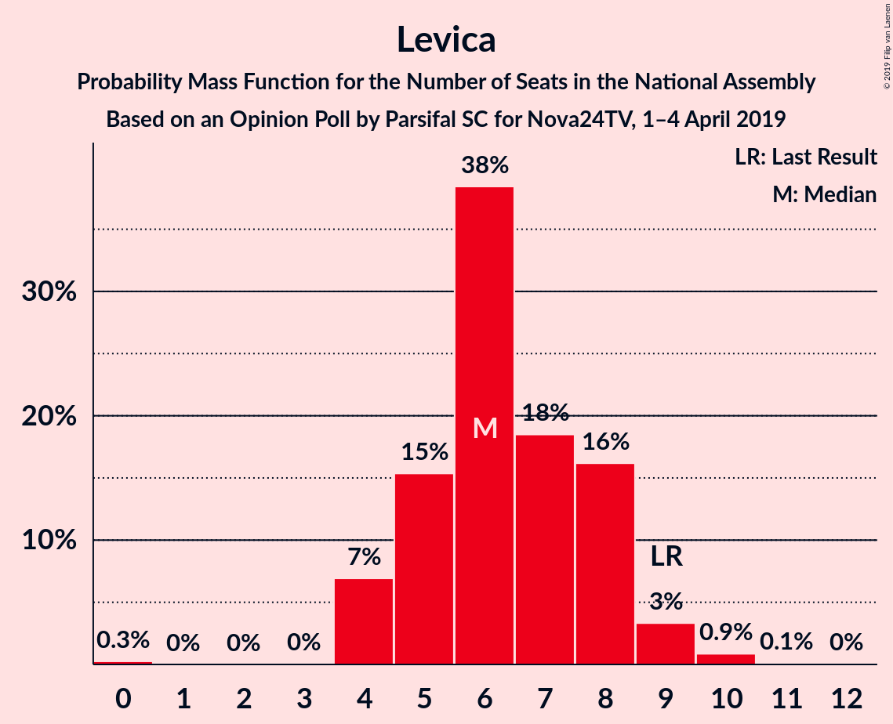
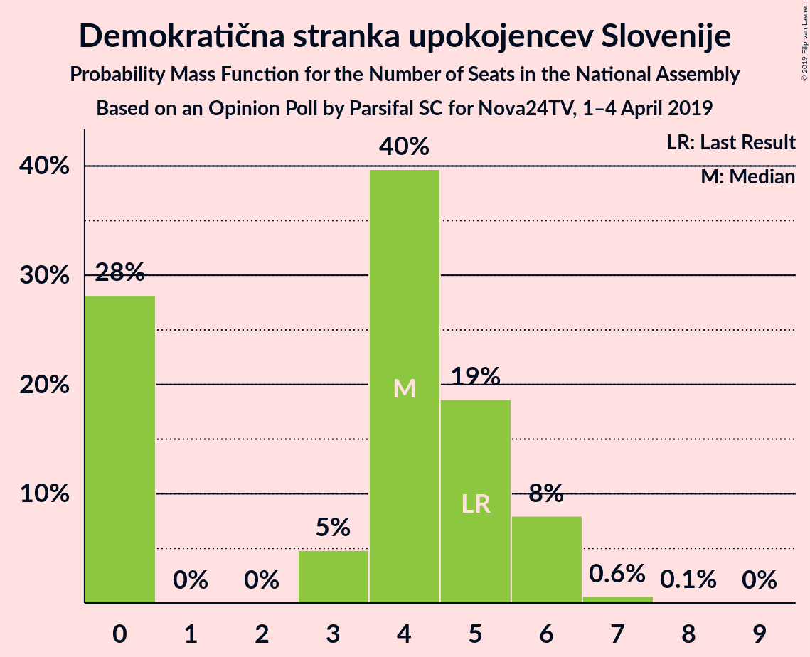
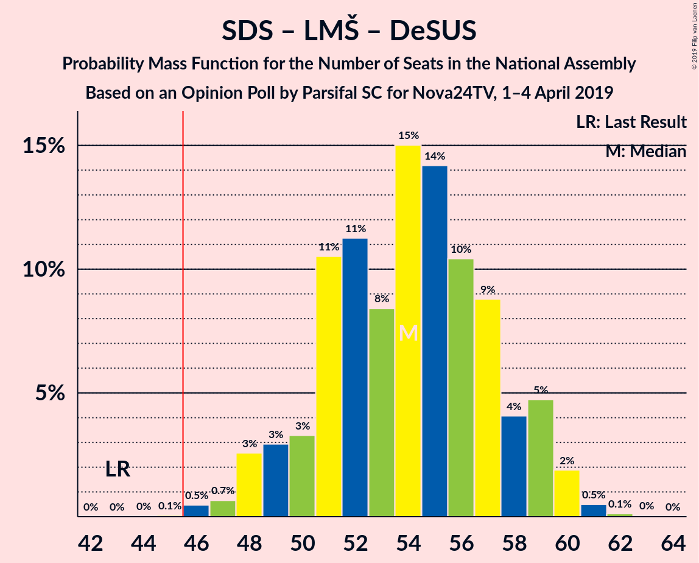
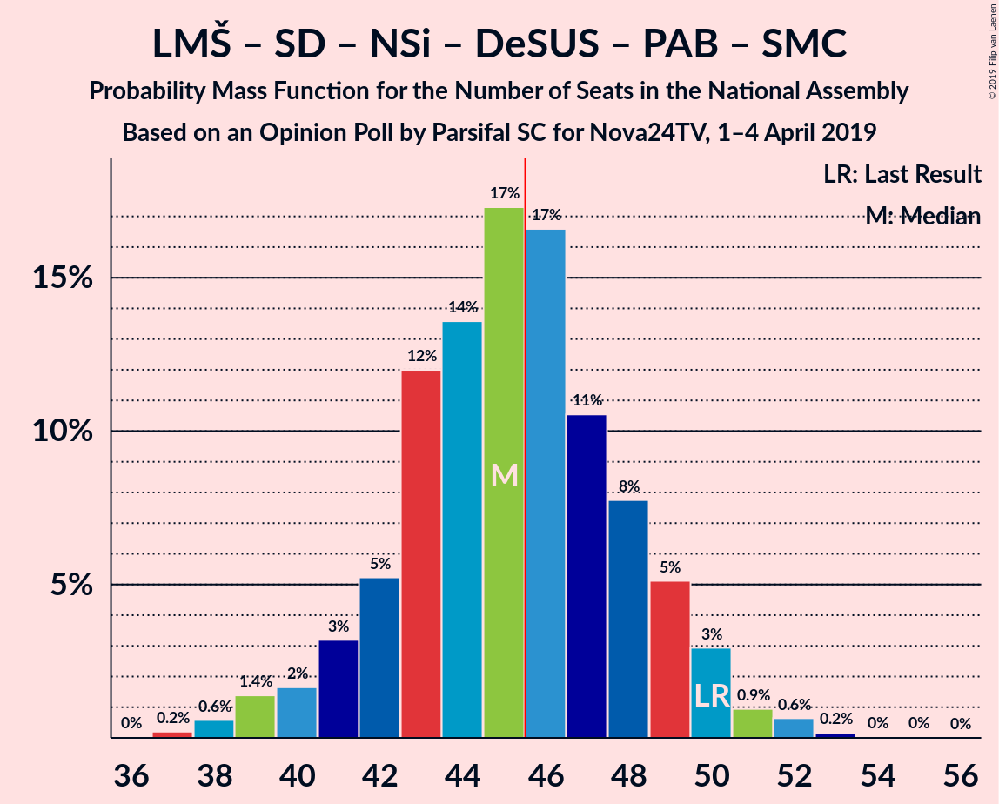
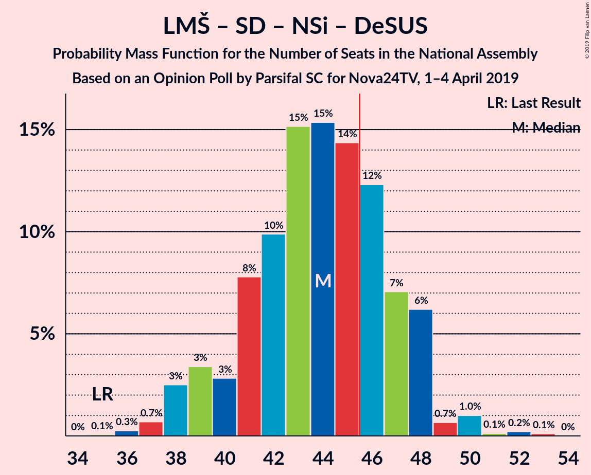
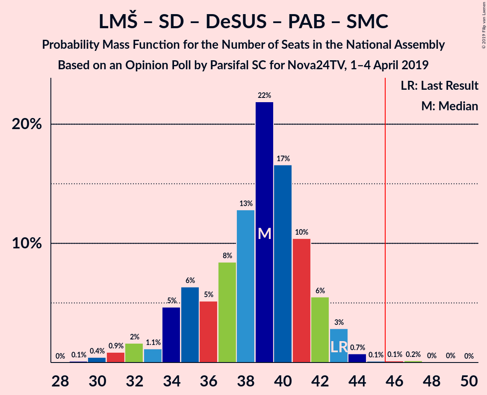
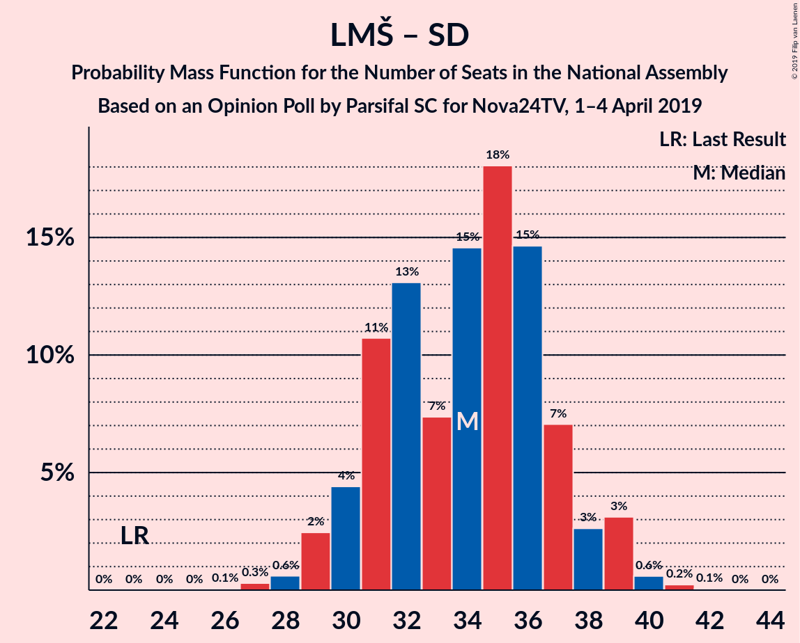

# Opinion Poll by Parsifal SC for Nova24TV, 1–4 April 2019

<a href="#voting-intentions">Voting Intentions</a> | <a href="#seats">Seats</a> | <a href="#coalitions">Coalitions</a> | <a href="#technical-information">Technical Information</a>

## Voting Intentions

### Confidence Intervals

| Party | Last Result | Poll Result | 80% Confidence Interval | 90% Confidence Interval | 95% Confidence Interval | 99% Confidence Interval |
|:-----:|:-----------:|:-----------:|:-----------------------:|:-----------------------:|:-----------------------:|:-----------------------:|
| Slovenska demokratska stranka | 24.9% | 27.7% | 25.2–30.4% |24.5–31.2% |23.9–31.9% |22.7–33.2% |
| Lista Marjana Šarca | 12.6% | 24.6% | 22.2–27.2% |21.5–28.0% |20.9–28.6% |19.8–29.9% |
| Socialni demokrati | 9.9% | 10.4% | 8.8–12.4% |8.4–13.0% |8.0–13.5% |7.3–14.5% |
| Nova Slovenija–Krščanski demokrati | 7.2% | 7.3% | 6.0–9.0% |5.6–9.5% |5.3–10.0% |4.7–10.9% |
| Levica | 9.3% | 6.9% | 5.6–8.6% |5.2–9.1% |4.9–9.5% |4.4–10.4% |
| Slovenska nacionalna stranka | 4.2% | 6.2% | 5.0–7.9% |4.7–8.4% |4.4–8.8% |3.9–9.6% |
| Slovenska ljudska stranka | 2.6% | 4.8% | 3.7–6.3% |3.5–6.7% |3.2–7.1% |2.8–7.9% |
| Demokratična stranka upokojencev Slovenije | 4.9% | 4.4% | 3.4–5.8% |3.1–6.2% |2.9–6.6% |2.5–7.4% |
| Stranka Alenke Bratušek | 5.1% | 3.1% | 2.3–4.4% |2.1–4.8% |1.9–5.1% |1.6–5.8% |
| Stranka modernega centra | 9.7% | 2.7% | 2.0–3.9% |1.8–4.3% |1.6–4.6% |1.3–5.2% |

*Note:* The poll result column reflects the actual value used in the calculations. Published results may vary slightly, and in addition be rounded to fewer digits.

## Seats

### Confidence Intervals

| Party | Last Result | Median | 80% Confidence Interval | 90% Confidence Interval | 95% Confidence Interval | 99% Confidence Interval |
|:-----:|:-----------:|:------:|:-----------------------:|:-----------------------:|:-----------------------:|:-----------------------:|
| <a href="#slovenska-demokratska-stranka">Slovenska demokratska stranka</a> | 25 | 27 | 24–29 |23–30 |23–31 |21–33 |
| <a href="#lista-marjana-šarca">Lista Marjana Šarca</a> | 13 | 25 | 22–27 |21–28 |21–28 |19–29 |
| <a href="#socialni-demokrati">Socialni demokrati</a> | 10 | 9 | 8–12 |8–12 |7–12 |7–14 |
| <a href="#nova-slovenija–krščanski-demokrati">Nova Slovenija–Krščanski demokrati</a> | 7 | 6 | 6–9 |5–9 |5–10 |4–10 |
| <a href="#levica">Levica</a> | 9 | 6 | 4–8 |4–8 |4–9 |4–10 |
| <a href="#slovenska-nacionalna-stranka">Slovenska nacionalna stranka</a> | 4 | 5 | 5–7 |4–8 |4–8 |3–9 |
| <a href="#slovenska-ljudska-stranka">Slovenska ljudska stranka</a> | 0 | 5 | 0–5 |0–6 |0–6 |0–7 |
| <a href="#demokratična-stranka-upokojencev-slovenije">Demokratična stranka upokojencev Slovenije</a> | 5 | 4 | 0–6 |0–6 |0–6 |0–7 |
| <a href="#stranka-alenke-bratušek">Stranka Alenke Bratušek</a> | 5 | 0 | 0–4 |0–4 |0–5 |0–5 |
| <a href="#stranka-modernega-centra">Stranka modernega centra</a> | 10 | 0 | 0 |0–4 |0–4 |0–5 |

### Slovenska demokratska stranka

*For a full overview of the results for this party, see the [Slovenska demokratska stranka](party-slovenskademokratskastranka.html) page.*

| Number of Seats | Probability | Accumulated | Special Marks |
|:---------------:|:-----------:|:-----------:|:-------------:|
| 20 | 0.2% | 100% |  |
| 21 | 0.6% | 99.8% |  |
| 22 | 0.7% | 99.2% |  |
| 23 | 7% | 98% |  |
| 24 | 7% | 91% |  |
| 25 | 17% | 84% | Last Result |
| 26 | 6% | 67% |  |
| 27 | 11% | 60% | Median |
| 28 | 21% | 49% |  |
| 29 | 22% | 28% |  |
| 30 | 1.5% | 6% |  |
| 31 | 3% | 4% |  |
| 32 | 1.0% | 2% |  |
| 33 | 0.6% | 0.7% |  |
| 34 | 0.1% | 0.1% |  |
| 35 | 0% | 0% |  |

### Lista Marjana Šarca

*For a full overview of the results for this party, see the [Lista Marjana Šarca](party-listamarjanašarca.html) page.*

| Number of Seats | Probability | Accumulated | Special Marks |
|:---------------:|:-----------:|:-----------:|:-------------:|
| 13 | 0% | 100% | Last Result |
| 14 | 0% | 100% |  |
| 15 | 0% | 100% |  |
| 16 | 0% | 100% |  |
| 17 | 0% | 100% |  |
| 18 | 0.1% | 100% |  |
| 19 | 0.6% | 99.9% |  |
| 20 | 1.3% | 99.3% |  |
| 21 | 8% | 98% |  |
| 22 | 9% | 90% |  |
| 23 | 22% | 81% |  |
| 24 | 6% | 59% |  |
| 25 | 9% | 53% | Median |
| 26 | 27% | 43% |  |
| 27 | 9% | 16% |  |
| 28 | 5% | 7% |  |
| 29 | 2% | 2% |  |
| 30 | 0.1% | 0.2% |  |
| 31 | 0.1% | 0.1% |  |
| 32 | 0% | 0% |  |

### Socialni demokrati

*For a full overview of the results for this party, see the [Socialni demokrati](party-socialnidemokrati.html) page.*

| Number of Seats | Probability | Accumulated | Special Marks |
|:---------------:|:-----------:|:-----------:|:-------------:|
| 6 | 0.2% | 100% |  |
| 7 | 2% | 99.8% |  |
| 8 | 9% | 97% |  |
| 9 | 39% | 89% | Median |
| 10 | 29% | 50% | Last Result |
| 11 | 10% | 20% |  |
| 12 | 8% | 11% |  |
| 13 | 2% | 2% |  |
| 14 | 0.4% | 0.7% |  |
| 15 | 0.3% | 0.3% |  |
| 16 | 0% | 0% |  |

### Nova Slovenija–Krščanski demokrati

*For a full overview of the results for this party, see the [Nova Slovenija–Krščanski demokrati](party-novaslovenija–krščanskidemokrati.html) page.*

| Number of Seats | Probability | Accumulated | Special Marks |
|:---------------:|:-----------:|:-----------:|:-------------:|
| 4 | 0.9% | 100% |  |
| 5 | 7% | 99.1% |  |
| 6 | 48% | 92% | Median |
| 7 | 20% | 44% | Last Result |
| 8 | 12% | 24% |  |
| 9 | 9% | 12% |  |
| 10 | 3% | 3% |  |
| 11 | 0.4% | 0.4% |  |
| 12 | 0% | 0% |  |

### Levica

*For a full overview of the results for this party, see the [Levica](party-levica.html) page.*

| Number of Seats | Probability | Accumulated | Special Marks |
|:---------------:|:-----------:|:-----------:|:-------------:|
| 0 | 0.4% | 100% |  |
| 1 | 0% | 99.6% |  |
| 2 | 0% | 99.6% |  |
| 3 | 0% | 99.6% |  |
| 4 | 15% | 99.6% |  |
| 5 | 21% | 84% |  |
| 6 | 34% | 63% | Median |
| 7 | 12% | 29% |  |
| 8 | 14% | 17% |  |
| 9 | 1.5% | 3% | Last Result |
| 10 | 1.3% | 1.4% |  |
| 11 | 0.1% | 0.1% |  |
| 12 | 0% | 0% |  |

### Slovenska nacionalna stranka

*For a full overview of the results for this party, see the [Slovenska nacionalna stranka](party-slovenskanacionalnastranka.html) page.*

| Number of Seats | Probability | Accumulated | Special Marks |
|:---------------:|:-----------:|:-----------:|:-------------:|
| 0 | 0.4% | 100% |  |
| 1 | 0% | 99.6% |  |
| 2 | 0% | 99.6% |  |
| 3 | 0.1% | 99.6% |  |
| 4 | 6% | 99.5% | Last Result |
| 5 | 44% | 93% | Median |
| 6 | 24% | 49% |  |
| 7 | 17% | 25% |  |
| 8 | 6% | 8% |  |
| 9 | 2% | 2% |  |
| 10 | 0.1% | 0.1% |  |
| 11 | 0% | 0% |  |

### Slovenska ljudska stranka

*For a full overview of the results for this party, see the [Slovenska ljudska stranka](party-slovenskaljudskastranka.html) page.*

| Number of Seats | Probability | Accumulated | Special Marks |
|:---------------:|:-----------:|:-----------:|:-------------:|
| 0 | 14% | 100% | Last Result |
| 1 | 0% | 86% |  |
| 2 | 0% | 86% |  |
| 3 | 0.8% | 86% |  |
| 4 | 34% | 86% |  |
| 5 | 42% | 52% | Median |
| 6 | 8% | 10% |  |
| 7 | 2% | 2% |  |
| 8 | 0.1% | 0.2% |  |
| 9 | 0% | 0% |  |

### Demokratična stranka upokojencev Slovenije

*For a full overview of the results for this party, see the [Demokratična stranka upokojencev Slovenije](party-demokratičnastrankaupokojencevslovenije.html) page.*

| Number of Seats | Probability | Accumulated | Special Marks |
|:---------------:|:-----------:|:-----------:|:-------------:|
| 0 | 27% | 100% |  |
| 1 | 0% | 73% |  |
| 2 | 0% | 73% |  |
| 3 | 0.7% | 73% |  |
| 4 | 34% | 73% | Median |
| 5 | 24% | 38% | Last Result |
| 6 | 13% | 14% |  |
| 7 | 0.6% | 0.7% |  |
| 8 | 0% | 0% |  |

### Stranka Alenke Bratušek

*For a full overview of the results for this party, see the [Stranka Alenke Bratušek](party-strankaalenkebratušek.html) page.*

| Number of Seats | Probability | Accumulated | Special Marks |
|:---------------:|:-----------:|:-----------:|:-------------:|
| 0 | 84% | 100% | Median |
| 1 | 0% | 16% |  |
| 2 | 0% | 16% |  |
| 3 | 0.9% | 16% |  |
| 4 | 11% | 15% |  |
| 5 | 4% | 4% | Last Result |
| 6 | 0.1% | 0.2% |  |
| 7 | 0% | 0% |  |

### Stranka modernega centra

*For a full overview of the results for this party, see the [Stranka modernega centra](party-strankamodernegacentra.html) page.*

| Number of Seats | Probability | Accumulated | Special Marks |
|:---------------:|:-----------:|:-----------:|:-------------:|
| 0 | 95% | 100% | Median |
| 1 | 0% | 5% |  |
| 2 | 0% | 5% |  |
| 3 | 0.3% | 5% |  |
| 4 | 4% | 5% |  |
| 5 | 1.1% | 1.2% |  |
| 6 | 0% | 0% |  |
| 7 | 0% | 0% |  |
| 8 | 0% | 0% |  |
| 9 | 0% | 0% |  |
| 10 | 0% | 0% | Last Result |

## Coalitions

### Confidence Intervals

| Coalition | Last Result | Median | Majority? | 80% Confidence Interval | 90% Confidence Interval | 95% Confidence Interval | 99% Confidence Interval |
|:---------:|:-----------:|:------:|:---------:|:-----------------------:|:-----------------------:|:-----------------------:|:-----------------------:|
| Slovenska demokratska stranka – Lista Marjana Šarca – Demokratična stranka upokojencev Slovenije | 43 | 55 | 99.9% | 50–59 | 50–59 | 49–59 | 47–60 |
| Slovenska demokratska stranka – Lista Marjana Šarca | 38 | 51 | 98% | 48–55 | 46–55 | 46–56 | 44–58 |
| Lista Marjana Šarca – Socialni demokrati – Nova Slovenija–Krščanski demokrati – Demokratična stranka upokojencev Slovenije – Stranka Alenke Bratušek – Stranka modernega centra | 50 | 45 | 41% | 43–48 | 42–49 | 40–50 | 38–52 |
| Lista Marjana Šarca – Socialni demokrati – Nova Slovenija–Krščanski demokrati – Demokratična stranka upokojencev Slovenije – Stranka modernega centra | 45 | 45 | 32% | 41–48 | 40–48 | 39–50 | 37–52 |
| Lista Marjana Šarca – Socialni demokrati – Nova Slovenija–Krščanski demokrati – Demokratična stranka upokojencev Slovenije | 35 | 44 | 30% | 41–48 | 39–48 | 39–49 | 36–51 |
| Lista Marjana Šarca – Socialni demokrati – Nova Slovenija–Krščanski demokrati | 30 | 41 | 7% | 38–44 | 36–47 | 36–47 | 35–48 |
| Lista Marjana Šarca – Socialni demokrati – Nova Slovenija–Krščanski demokrati – Stranka modernega centra | 40 | 41 | 8% | 38–44 | 36–47 | 36–47 | 35–48 |
| Lista Marjana Šarca – Socialni demokrati – Demokratična stranka upokojencev Slovenije – Stranka Alenke Bratušek – Stranka modernega centra | 43 | 39 | 0.3% | 36–41 | 34–41 | 33–42 | 31–44 |
| Lista Marjana Šarca – Socialni demokrati – Demokratična stranka upokojencev Slovenije | 28 | 38 | 0.1% | 34–41 | 33–41 | 32–41 | 30–43 |
| Lista Marjana Šarca – Socialni demokrati – Demokratična stranka upokojencev Slovenije – Stranka modernega centra | 38 | 38 | 0.1% | 34–41 | 34–41 | 32–41 | 30–44 |
| Lista Marjana Šarca – Socialni demokrati | 23 | 35 | 0% | 31–37 | 30–39 | 30–39 | 28–40 |
| Lista Marjana Šarca – Socialni demokrati – Stranka modernega centra | 33 | 35 | 0% | 31–37 | 30–39 | 30–39 | 28–41 |
| Socialni demokrati – Demokratična stranka upokojencev Slovenije – Stranka modernega centra | 25 | 13 | 0% | 10–16 | 10–17 | 9–17 | 7–19 |

### Slovenska demokratska stranka – Lista Marjana Šarca – Demokratična stranka upokojencev Slovenije

| Number of Seats | Probability | Accumulated | Special Marks |
|:---------------:|:-----------:|:-----------:|:-------------:|
| 43 | 0% | 100% | Last Result |
| 44 | 0% | 100% |  |
| 45 | 0% | 100% |  |
| 46 | 0.3% | 99.9% | Majority |
| 47 | 0.3% | 99.6% |  |
| 48 | 1.3% | 99.3% |  |
| 49 | 2% | 98% |  |
| 50 | 6% | 96% |  |
| 51 | 4% | 90% |  |
| 52 | 7% | 86% |  |
| 53 | 8% | 80% |  |
| 54 | 18% | 72% |  |
| 55 | 14% | 54% |  |
| 56 | 9% | 40% | Median |
| 57 | 12% | 31% |  |
| 58 | 3% | 19% |  |
| 59 | 14% | 16% |  |
| 60 | 2% | 2% |  |
| 61 | 0.1% | 0.3% |  |
| 62 | 0.2% | 0.2% |  |
| 63 | 0% | 0% |  |

### Slovenska demokratska stranka – Lista Marjana Šarca

| Number of Seats | Probability | Accumulated | Special Marks |
|:---------------:|:-----------:|:-----------:|:-------------:|
| 38 | 0% | 100% | Last Result |
| 39 | 0% | 100% |  |
| 40 | 0% | 100% |  |
| 41 | 0% | 100% |  |
| 42 | 0.1% | 100% |  |
| 43 | 0.3% | 99.9% |  |
| 44 | 0.8% | 99.7% |  |
| 45 | 0.5% | 98.8% |  |
| 46 | 5% | 98% | Majority |
| 47 | 3% | 93% |  |
| 48 | 5% | 91% |  |
| 49 | 15% | 86% |  |
| 50 | 12% | 71% |  |
| 51 | 18% | 58% |  |
| 52 | 3% | 40% | Median |
| 53 | 5% | 38% |  |
| 54 | 5% | 32% |  |
| 55 | 23% | 27% |  |
| 56 | 3% | 4% |  |
| 57 | 0.3% | 0.8% |  |
| 58 | 0.5% | 0.6% |  |
| 59 | 0% | 0.1% |  |
| 60 | 0% | 0.1% |  |
| 61 | 0% | 0.1% |  |
| 62 | 0% | 0% |  |

### Lista Marjana Šarca – Socialni demokrati – Nova Slovenija–Krščanski demokrati – Demokratična stranka upokojencev Slovenije – Stranka Alenke Bratušek – Stranka modernega centra

| Number of Seats | Probability | Accumulated | Special Marks |
|:---------------:|:-----------:|:-----------:|:-------------:|
| 35 | 0.1% | 100% |  |
| 36 | 0% | 99.9% |  |
| 37 | 0.1% | 99.9% |  |
| 38 | 0.8% | 99.8% |  |
| 39 | 1.0% | 99.0% |  |
| 40 | 1.4% | 98% |  |
| 41 | 1.0% | 97% |  |
| 42 | 4% | 96% |  |
| 43 | 6% | 91% |  |
| 44 | 22% | 85% | Median |
| 45 | 22% | 63% |  |
| 46 | 9% | 41% | Majority |
| 47 | 19% | 32% |  |
| 48 | 9% | 14% |  |
| 49 | 2% | 5% |  |
| 50 | 2% | 4% | Last Result |
| 51 | 0.8% | 2% |  |
| 52 | 0.4% | 0.9% |  |
| 53 | 0.3% | 0.4% |  |
| 54 | 0% | 0.1% |  |
| 55 | 0.1% | 0.1% |  |
| 56 | 0% | 0% |  |

### Lista Marjana Šarca – Socialni demokrati – Nova Slovenija–Krščanski demokrati – Demokratična stranka upokojencev Slovenije – Stranka modernega centra

| Number of Seats | Probability | Accumulated | Special Marks |
|:---------------:|:-----------:|:-----------:|:-------------:|
| 35 | 0.1% | 100% |  |
| 36 | 0.3% | 99.9% |  |
| 37 | 0.2% | 99.6% |  |
| 38 | 1.2% | 99.4% |  |
| 39 | 2% | 98% |  |
| 40 | 2% | 96% |  |
| 41 | 6% | 95% |  |
| 42 | 6% | 89% |  |
| 43 | 8% | 83% |  |
| 44 | 23% | 74% | Median |
| 45 | 19% | 51% | Last Result |
| 46 | 8% | 32% | Majority |
| 47 | 13% | 24% |  |
| 48 | 7% | 11% |  |
| 49 | 0.8% | 3% |  |
| 50 | 2% | 3% |  |
| 51 | 0.3% | 0.8% |  |
| 52 | 0.3% | 0.6% |  |
| 53 | 0.3% | 0.3% |  |
| 54 | 0% | 0% |  |

### Lista Marjana Šarca – Socialni demokrati – Nova Slovenija–Krščanski demokrati – Demokratična stranka upokojencev Slovenije

| Number of Seats | Probability | Accumulated | Special Marks |
|:---------------:|:-----------:|:-----------:|:-------------:|
| 35 | 0.1% | 100% | Last Result |
| 36 | 0.5% | 99.9% |  |
| 37 | 0.3% | 99.4% |  |
| 38 | 1.3% | 99.1% |  |
| 39 | 3% | 98% |  |
| 40 | 2% | 95% |  |
| 41 | 6% | 93% |  |
| 42 | 7% | 87% |  |
| 43 | 9% | 80% |  |
| 44 | 23% | 71% | Median |
| 45 | 18% | 48% |  |
| 46 | 8% | 30% | Majority |
| 47 | 12% | 22% |  |
| 48 | 7% | 10% |  |
| 49 | 0.7% | 3% |  |
| 50 | 2% | 2% |  |
| 51 | 0.1% | 0.5% |  |
| 52 | 0.1% | 0.4% |  |
| 53 | 0.3% | 0.3% |  |
| 54 | 0% | 0% |  |

### Lista Marjana Šarca – Socialni demokrati – Nova Slovenija–Krščanski demokrati

| Number of Seats | Probability | Accumulated | Special Marks |
|:---------------:|:-----------:|:-----------:|:-------------:|
| 30 | 0% | 100% | Last Result |
| 31 | 0% | 100% |  |
| 32 | 0% | 100% |  |
| 33 | 0% | 100% |  |
| 34 | 0.2% | 99.9% |  |
| 35 | 1.1% | 99.7% |  |
| 36 | 4% | 98.6% |  |
| 37 | 2% | 94% |  |
| 38 | 17% | 92% |  |
| 39 | 7% | 75% |  |
| 40 | 8% | 68% | Median |
| 41 | 23% | 60% |  |
| 42 | 11% | 37% |  |
| 43 | 9% | 26% |  |
| 44 | 9% | 18% |  |
| 45 | 0.7% | 8% |  |
| 46 | 2% | 7% | Majority |
| 47 | 5% | 6% |  |
| 48 | 0.5% | 0.8% |  |
| 49 | 0.2% | 0.3% |  |
| 50 | 0% | 0% |  |

### Lista Marjana Šarca – Socialni demokrati – Nova Slovenija–Krščanski demokrati – Stranka modernega centra

| Number of Seats | Probability | Accumulated | Special Marks |
|:---------------:|:-----------:|:-----------:|:-------------:|
| 34 | 0.2% | 100% |  |
| 35 | 0.8% | 99.8% |  |
| 36 | 4% | 98.9% |  |
| 37 | 2% | 95% |  |
| 38 | 16% | 93% |  |
| 39 | 5% | 77% |  |
| 40 | 8% | 72% | Last Result, Median |
| 41 | 23% | 64% |  |
| 42 | 11% | 40% |  |
| 43 | 11% | 30% |  |
| 44 | 9% | 19% |  |
| 45 | 1.1% | 9% |  |
| 46 | 2% | 8% | Majority |
| 47 | 5% | 6% |  |
| 48 | 0.9% | 1.2% |  |
| 49 | 0.3% | 0.3% |  |
| 50 | 0% | 0.1% |  |
| 51 | 0% | 0% |  |

### Lista Marjana Šarca – Socialni demokrati – Demokratična stranka upokojencev Slovenije – Stranka Alenke Bratušek – Stranka modernega centra

| Number of Seats | Probability | Accumulated | Special Marks |
|:---------------:|:-----------:|:-----------:|:-------------:|
| 29 | 0.1% | 100% |  |
| 30 | 0.3% | 99.9% |  |
| 31 | 0.7% | 99.7% |  |
| 32 | 1.3% | 98.9% |  |
| 33 | 0.5% | 98% |  |
| 34 | 5% | 97% |  |
| 35 | 2% | 92% |  |
| 36 | 7% | 90% |  |
| 37 | 10% | 83% |  |
| 38 | 13% | 74% | Median |
| 39 | 29% | 60% |  |
| 40 | 9% | 32% |  |
| 41 | 20% | 23% |  |
| 42 | 1.3% | 3% |  |
| 43 | 1.3% | 2% | Last Result |
| 44 | 0.5% | 0.8% |  |
| 45 | 0.1% | 0.3% |  |
| 46 | 0.1% | 0.3% | Majority |
| 47 | 0.1% | 0.1% |  |
| 48 | 0% | 0% |  |

### Lista Marjana Šarca – Socialni demokrati – Demokratična stranka upokojencev Slovenije

| Number of Seats | Probability | Accumulated | Special Marks |
|:---------------:|:-----------:|:-----------:|:-------------:|
| 28 | 0.3% | 100% | Last Result |
| 29 | 0.1% | 99.7% |  |
| 30 | 0.4% | 99.6% |  |
| 31 | 1.0% | 99.2% |  |
| 32 | 2% | 98% |  |
| 33 | 2% | 96% |  |
| 34 | 7% | 94% |  |
| 35 | 7% | 87% |  |
| 36 | 11% | 80% |  |
| 37 | 12% | 70% |  |
| 38 | 14% | 58% | Median |
| 39 | 23% | 44% |  |
| 40 | 6% | 21% |  |
| 41 | 13% | 15% |  |
| 42 | 0.5% | 1.2% |  |
| 43 | 0.3% | 0.7% |  |
| 44 | 0.4% | 0.4% |  |
| 45 | 0% | 0.1% |  |
| 46 | 0% | 0.1% | Majority |
| 47 | 0% | 0% |  |

### Lista Marjana Šarca – Socialni demokrati – Demokratična stranka upokojencev Slovenije – Stranka modernega centra

| Number of Seats | Probability | Accumulated | Special Marks |
|:---------------:|:-----------:|:-----------:|:-------------:|
| 28 | 0.3% | 100% |  |
| 29 | 0.1% | 99.7% |  |
| 30 | 0.3% | 99.6% |  |
| 31 | 0.8% | 99.3% |  |
| 32 | 1.2% | 98.5% |  |
| 33 | 2% | 97% |  |
| 34 | 6% | 95% |  |
| 35 | 6% | 89% |  |
| 36 | 10% | 83% |  |
| 37 | 12% | 73% |  |
| 38 | 14% | 61% | Last Result, Median |
| 39 | 25% | 47% |  |
| 40 | 7% | 23% |  |
| 41 | 14% | 16% |  |
| 42 | 0.6% | 2% |  |
| 43 | 0.6% | 1.1% |  |
| 44 | 0.4% | 0.5% |  |
| 45 | 0% | 0.1% |  |
| 46 | 0.1% | 0.1% | Majority |
| 47 | 0% | 0% |  |

### Lista Marjana Šarca – Socialni demokrati

| Number of Seats | Probability | Accumulated | Special Marks |
|:---------------:|:-----------:|:-----------:|:-------------:|
| 23 | 0% | 100% | Last Result |
| 24 | 0% | 100% |  |
| 25 | 0% | 100% |  |
| 26 | 0% | 100% |  |
| 27 | 0.1% | 99.9% |  |
| 28 | 0.6% | 99.9% |  |
| 29 | 1.0% | 99.2% |  |
| 30 | 7% | 98% |  |
| 31 | 5% | 91% |  |
| 32 | 20% | 86% |  |
| 33 | 5% | 66% |  |
| 34 | 8% | 61% | Median |
| 35 | 20% | 53% |  |
| 36 | 16% | 33% |  |
| 37 | 11% | 18% |  |
| 38 | 0.7% | 7% |  |
| 39 | 5% | 6% |  |
| 40 | 0.3% | 0.6% |  |
| 41 | 0.3% | 0.3% |  |
| 42 | 0% | 0% |  |

### Lista Marjana Šarca – Socialni demokrati – Stranka modernega centra

| Number of Seats | Probability | Accumulated | Special Marks |
|:---------------:|:-----------:|:-----------:|:-------------:|
| 27 | 0.1% | 100% |  |
| 28 | 0.6% | 99.9% |  |
| 29 | 0.9% | 99.3% |  |
| 30 | 7% | 98% |  |
| 31 | 4% | 91% |  |
| 32 | 18% | 88% |  |
| 33 | 4% | 70% | Last Result |
| 34 | 8% | 65% | Median |
| 35 | 21% | 57% |  |
| 36 | 16% | 36% |  |
| 37 | 12% | 20% |  |
| 38 | 1.1% | 8% |  |
| 39 | 6% | 7% |  |
| 40 | 0.6% | 1.2% |  |
| 41 | 0.5% | 0.6% |  |
| 42 | 0% | 0.1% |  |
| 43 | 0.1% | 0.1% |  |
| 44 | 0% | 0% |  |

### Socialni demokrati – Demokratična stranka upokojencev Slovenije – Stranka modernega centra

| Number of Seats | Probability | Accumulated | Special Marks |
|:---------------:|:-----------:|:-----------:|:-------------:|
| 6 | 0.1% | 100% |  |
| 7 | 0.7% | 99.9% |  |
| 8 | 1.2% | 99.2% |  |
| 9 | 3% | 98% |  |
| 10 | 10% | 95% |  |
| 11 | 7% | 85% |  |
| 12 | 5% | 78% |  |
| 13 | 25% | 73% | Median |
| 14 | 9% | 48% |  |
| 15 | 27% | 39% |  |
| 16 | 5% | 12% |  |
| 17 | 5% | 7% |  |
| 18 | 1.5% | 2% |  |
| 19 | 0.4% | 0.6% |  |
| 20 | 0.2% | 0.3% |  |
| 21 | 0.1% | 0.1% |  |
| 22 | 0% | 0% |  |
| 23 | 0% | 0% |  |
| 24 | 0% | 0% |  |
| 25 | 0% | 0% | Last Result |

## Technical Information

### Opinion Poll

+ **Polling firm:** Parsifal SC
+ **Commissioner(s):** Nova24TV
+ **Fieldwork period:** 1–4 April 2019

### Calculations

+ **Sample size:** 480
+ **Simulations done:** 262,144
+ **Error estimate:** 2.99%

