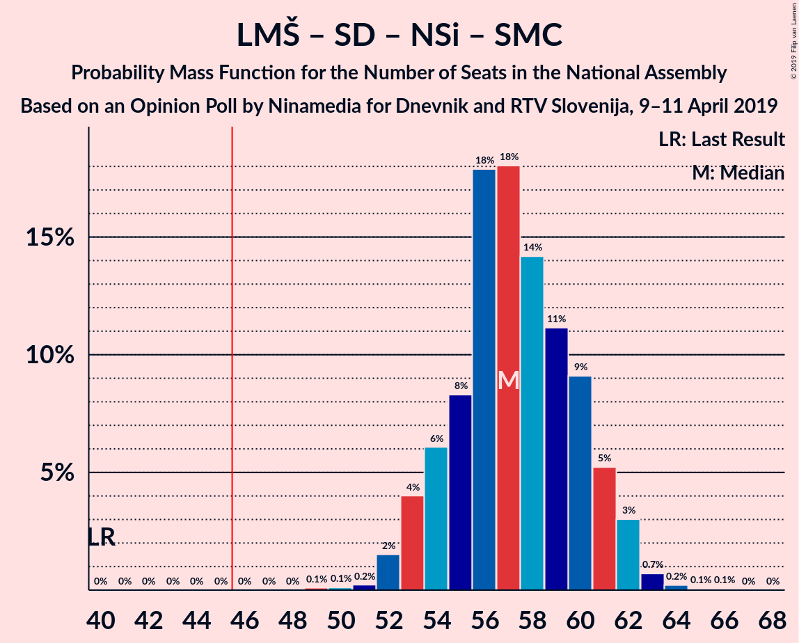

# Opinion Poll by Ninamedia for Dnevnik and RTV Slovenija, 9–11 April 2019

<a href="#voting-intentions">Voting Intentions</a> | <a href="#seats">Seats</a> | <a href="#coalitions">Coalitions</a> | <a href="#technical-information">Technical Information</a>

## Voting Intentions

### Confidence Intervals

| Party | Last Result | Poll Result | 80% Confidence Interval | 90% Confidence Interval | 95% Confidence Interval | 99% Confidence Interval |
|:-----:|:-----------:|:-----------:|:-----------------------:|:-----------------------:|:-----------------------:|:-----------------------:|
| Lista Marjana Šarca | 12.6% | 36.5% | 33.8–39.4% |33.1–40.1% |32.4–40.8% |31.2–42.2% |
| Slovenska demokratska stranka | 24.9% | 19.8% | 17.6–22.2% |17.0–22.9% |16.5–23.5% |15.5–24.7% |
| Socialni demokrati | 9.9% | 13.4% | 11.6–15.5% |11.1–16.1% |10.7–16.6% |9.9–17.7% |
| Nova Slovenija–Krščanski demokrati | 7.2% | 10.0% | 8.4–11.9% |8.0–12.4% |7.7–12.9% |7.0–13.9% |
| Levica | 9.3% | 9.0% | 7.5–10.8% |7.1–11.4% |6.8–11.8% |6.1–12.8% |
| Demokratična stranka upokojencev Slovenije | 4.9% | 4.4% | 3.4–5.8% |3.1–6.2% |2.9–6.6% |2.5–7.3% |
| Stranka Alenke Bratušek | 5.1% | 2.6% | 1.9–3.8% |1.7–4.1% |1.5–4.4% |1.2–5.0% |
| Slovenska nacionalna stranka | 4.2% | 2.0% | 1.4–3.1% |1.2–3.4% |1.1–3.6% |0.9–4.2% |
| Slovenska ljudska stranka | 2.6% | 0.8% | 0.5–1.6% |0.4–1.8% |0.3–2.0% |0.2–2.5% |
| Stranka modernega centra | 9.7% | 0.6% | 0.3–1.3% |0.3–1.5% |0.2–1.7% |0.1–2.2% |

*Note:* The poll result column reflects the actual value used in the calculations. Published results may vary slightly, and in addition be rounded to fewer digits.

## Seats

### Confidence Intervals

| Party | Last Result | Median | 80% Confidence Interval | 90% Confidence Interval | 95% Confidence Interval | 99% Confidence Interval |
|:-----:|:-----------:|:------:|:-----------------------:|:-----------------------:|:-----------------------:|:-----------------------:|
| <a href="#lista-marjana-šarca">Lista Marjana Šarca</a> | 13 | 33 | 33 |33–35 |33–37 |29–37 |
| <a href="#slovenska-demokratska-stranka">Slovenska demokratska stranka</a> | 25 | 19 | 19 |19–20 |15–21 |15–22 |
| <a href="#socialni-demokrati">Socialni demokrati</a> | 10 | 14 | 14 |13–14 |11–17 |11–17 |
| <a href="#nova-slovenija–krščanski-demokrati">Nova Slovenija–Krščanski demokrati</a> | 7 | 10 | 10 |10 |9–11 |9–11 |
| <a href="#levica">Levica</a> | 9 | 8 | 8 |8 |8 |8–10 |
| <a href="#demokratična-stranka-upokojencev-slovenije">Demokratična stranka upokojencev Slovenije</a> | 5 | 4 | 4 |4 |0–4 |0–4 |
| <a href="#stranka-alenke-bratušek">Stranka Alenke Bratušek</a> | 5 | 0 | 0 |0 |0 |0 |
| <a href="#slovenska-nacionalna-stranka">Slovenska nacionalna stranka</a> | 4 | 0 | 0 |0 |0 |0 |
| <a href="#slovenska-ljudska-stranka">Slovenska ljudska stranka</a> | 0 | 0 | 0 |0 |0 |0 |
| <a href="#stranka-modernega-centra">Stranka modernega centra</a> | 10 | 0 | 0 |0 |0 |0 |

### Lista Marjana Šarca

*For a full overview of the results for this party, see the [Lista Marjana Šarca](party-listamarjanašarca.html) page.*

| Number of Seats | Probability | Accumulated | Special Marks |
|:---------------:|:-----------:|:-----------:|:-------------:|
| 13 | 0% | 100% | Last Result |
| 14 | 0% | 100% |  |
| 15 | 0% | 100% |  |
| 16 | 0% | 100% |  |
| 17 | 0% | 100% |  |
| 18 | 0% | 100% |  |
| 19 | 0% | 100% |  |
| 20 | 0% | 100% |  |
| 21 | 0% | 100% |  |
| 22 | 0% | 100% |  |
| 23 | 0% | 100% |  |
| 24 | 0% | 100% |  |
| 25 | 0% | 100% |  |
| 26 | 0% | 100% |  |
| 27 | 0% | 100% |  |
| 28 | 0% | 100% |  |
| 29 | 1.0% | 100% |  |
| 30 | 0% | 99.0% |  |
| 31 | 0% | 98.9% |  |
| 32 | 0% | 98.9% |  |
| 33 | 93% | 98.9% | Median |
| 34 | 0.1% | 6% |  |
| 35 | 3% | 6% |  |
| 36 | 0% | 4% |  |
| 37 | 3% | 4% |  |
| 38 | 0.1% | 0.2% |  |
| 39 | 0% | 0.1% |  |
| 40 | 0.1% | 0.1% |  |
| 41 | 0% | 0% |  |

### Slovenska demokratska stranka

*For a full overview of the results for this party, see the [Slovenska demokratska stranka](party-slovenskademokratskastranka.html) page.*

| Number of Seats | Probability | Accumulated | Special Marks |
|:---------------:|:-----------:|:-----------:|:-------------:|
| 15 | 3% | 100% |  |
| 16 | 0.1% | 97% |  |
| 17 | 0% | 97% |  |
| 18 | 0.1% | 97% |  |
| 19 | 92% | 97% | Median |
| 20 | 0.5% | 5% |  |
| 21 | 3% | 5% |  |
| 22 | 1.0% | 1.1% |  |
| 23 | 0% | 0% |  |
| 24 | 0% | 0% |  |
| 25 | 0% | 0% | Last Result |

### Socialni demokrati

*For a full overview of the results for this party, see the [Socialni demokrati](party-socialnidemokrati.html) page.*

| Number of Seats | Probability | Accumulated | Special Marks |
|:---------------:|:-----------:|:-----------:|:-------------:|
| 10 | 0.4% | 100% | Last Result |
| 11 | 4% | 99.6% |  |
| 12 | 0% | 96% |  |
| 13 | 1.1% | 96% |  |
| 14 | 92% | 95% | Median |
| 15 | 0.1% | 3% |  |
| 16 | 0.1% | 3% |  |
| 17 | 3% | 3% |  |
| 18 | 0% | 0% |  |

### Nova Slovenija–Krščanski demokrati

*For a full overview of the results for this party, see the [Nova Slovenija–Krščanski demokrati](party-novaslovenija–krščanskidemokrati.html) page.*

| Number of Seats | Probability | Accumulated | Special Marks |
|:---------------:|:-----------:|:-----------:|:-------------:|
| 7 | 0.5% | 100% | Last Result |
| 8 | 0% | 99.5% |  |
| 9 | 3% | 99.5% |  |
| 10 | 93% | 97% | Median |
| 11 | 4% | 4% |  |
| 12 | 0.1% | 0.1% |  |
| 13 | 0% | 0% |  |

### Levica

*For a full overview of the results for this party, see the [Levica](party-levica.html) page.*

| Number of Seats | Probability | Accumulated | Special Marks |
|:---------------:|:-----------:|:-----------:|:-------------:|
| 5 | 0.1% | 100% |  |
| 6 | 0% | 99.9% |  |
| 7 | 0.1% | 99.9% |  |
| 8 | 98% | 99.8% | Median |
| 9 | 0.1% | 1.4% | Last Result |
| 10 | 1.0% | 1.3% |  |
| 11 | 0% | 0.3% |  |
| 12 | 0% | 0.3% |  |
| 13 | 0% | 0.3% |  |
| 14 | 0.3% | 0.3% |  |
| 15 | 0% | 0% |  |

### Demokratična stranka upokojencev Slovenije

*For a full overview of the results for this party, see the [Demokratična stranka upokojencev Slovenije](party-demokratičnastrankaupokojencevslovenije.html) page.*

| Number of Seats | Probability | Accumulated | Special Marks |
|:---------------:|:-----------:|:-----------:|:-------------:|
| 0 | 4% | 100% |  |
| 1 | 0% | 96% |  |
| 2 | 0% | 96% |  |
| 3 | 0% | 96% |  |
| 4 | 96% | 96% | Median |
| 5 | 0.1% | 0.1% | Last Result |
| 6 | 0% | 0% |  |

### Stranka Alenke Bratušek

*For a full overview of the results for this party, see the [Stranka Alenke Bratušek](party-strankaalenkebratušek.html) page.*

| Number of Seats | Probability | Accumulated | Special Marks |
|:---------------:|:-----------:|:-----------:|:-------------:|
| 0 | 99.9% | 100% | Median |
| 1 | 0% | 0.1% |  |
| 2 | 0% | 0.1% |  |
| 3 | 0% | 0.1% |  |
| 4 | 0% | 0.1% |  |
| 5 | 0% | 0.1% | Last Result |
| 6 | 0% | 0% |  |

### Slovenska nacionalna stranka

*For a full overview of the results for this party, see the [Slovenska nacionalna stranka](party-slovenskanacionalnastranka.html) page.*

| Number of Seats | Probability | Accumulated | Special Marks |
|:---------------:|:-----------:|:-----------:|:-------------:|
| 0 | 99.9% | 100% | Median |
| 1 | 0% | 0.1% |  |
| 2 | 0% | 0.1% |  |
| 3 | 0% | 0.1% |  |
| 4 | 0% | 0.1% | Last Result |
| 5 | 0.1% | 0.1% |  |
| 6 | 0% | 0% |  |

### Slovenska ljudska stranka

*For a full overview of the results for this party, see the [Slovenska ljudska stranka](party-slovenskaljudskastranka.html) page.*

| Number of Seats | Probability | Accumulated | Special Marks |
|:---------------:|:-----------:|:-----------:|:-------------:|
| 0 | 100% | 100% | Last Result, Median |

### Stranka modernega centra

*For a full overview of the results for this party, see the [Stranka modernega centra](party-strankamodernegacentra.html) page.*

| Number of Seats | Probability | Accumulated | Special Marks |
|:---------------:|:-----------:|:-----------:|:-------------:|
| 0 | 100% | 100% | Median |
| 1 | 0% | 0% |  |
| 2 | 0% | 0% |  |
| 3 | 0% | 0% |  |
| 4 | 0% | 0% |  |
| 5 | 0% | 0% |  |
| 6 | 0% | 0% |  |
| 7 | 0% | 0% |  |
| 8 | 0% | 0% |  |
| 9 | 0% | 0% |  |
| 10 | 0% | 0% | Last Result |

## Coalitions

### Confidence Intervals

| Coalition | Last Result | Median | Majority? | 80% Confidence Interval | 90% Confidence Interval | 95% Confidence Interval | 99% Confidence Interval |
|:---------:|:-----------:|:------:|:---------:|:-----------------------:|:-----------------------:|:-----------------------:|:-----------------------:|
| Lista Marjana Šarca – Socialni demokrati – Nova Slovenija–Krščanski demokrati – Demokratična stranka upokojencev Slovenije | 35 | 61 | 100% | 61 | 60–61 | 59–65 | 56–65 |
| Lista Marjana Šarca – Socialni demokrati – Nova Slovenija–Krščanski demokrati – Demokratična stranka upokojencev Slovenije – Stranka Alenke Bratušek – Stranka modernega centra | 50 | 61 | 100% | 61 | 60–61 | 59–65 | 56–65 |
| Lista Marjana Šarca – Socialni demokrati – Nova Slovenija–Krščanski demokrati – Demokratična stranka upokojencev Slovenije – Stranka modernega centra | 45 | 61 | 100% | 61 | 60–61 | 59–65 | 56–65 |
| Lista Marjana Šarca – Socialni demokrati – Nova Slovenija–Krščanski demokrati | 30 | 57 | 100% | 57 | 57–59 | 57–61 | 52–61 |
| Lista Marjana Šarca – Socialni demokrati – Nova Slovenija–Krščanski demokrati – Stranka modernega centra | 40 | 57 | 100% | 57 | 57–59 | 57–61 | 52–61 |
| Lista Marjana Šarca – Slovenska demokratska stranka – Demokratična stranka upokojencev Slovenije | 43 | 56 | 100% | 56 | 56 | 54–58 | 54–58 |
| Lista Marjana Šarca – Slovenska demokratska stranka | 38 | 52 | 100% | 52 | 52 | 50–58 | 50–58 |
| Lista Marjana Šarca – Socialni demokrati – Demokratična stranka upokojencev Slovenije | 28 | 51 | 99.9% | 51 | 50–51 | 48–56 | 46–56 |
| Lista Marjana Šarca – Socialni demokrati – Demokratična stranka upokojencev Slovenije – Stranka Alenke Bratušek – Stranka modernega centra | 43 | 51 | 100% | 51 | 50–51 | 48–56 | 46–56 |
| Lista Marjana Šarca – Socialni demokrati – Demokratična stranka upokojencev Slovenije – Stranka modernega centra | 38 | 51 | 99.9% | 51 | 50–51 | 48–56 | 46–56 |
| Lista Marjana Šarca – Socialni demokrati | 23 | 47 | 98.6% | 47 | 47–48 | 47–52 | 42–52 |
| Lista Marjana Šarca – Socialni demokrati – Stranka modernega centra | 33 | 47 | 98.6% | 47 | 47–48 | 47–52 | 42–52 |
| Socialni demokrati – Demokratična stranka upokojencev Slovenije – Stranka modernega centra | 25 | 18 | 0% | 18 | 17–18 | 11–21 | 11–21 |

### Lista Marjana Šarca – Socialni demokrati – Nova Slovenija–Krščanski demokrati – Demokratična stranka upokojencev Slovenije

| Number of Seats | Probability | Accumulated | Special Marks |
|:---------------:|:-----------:|:-----------:|:-------------:|
| 35 | 0% | 100% | Last Result |
| 36 | 0% | 100% |  |
| 37 | 0% | 100% |  |
| 38 | 0% | 100% |  |
| 39 | 0% | 100% |  |
| 40 | 0% | 100% |  |
| 41 | 0% | 100% |  |
| 42 | 0% | 100% |  |
| 43 | 0% | 100% |  |
| 44 | 0% | 100% |  |
| 45 | 0% | 100% |  |
| 46 | 0% | 100% | Majority |
| 47 | 0% | 100% |  |
| 48 | 0% | 100% |  |
| 49 | 0% | 100% |  |
| 50 | 0% | 100% |  |
| 51 | 0% | 100% |  |
| 52 | 0% | 100% |  |
| 53 | 0% | 100% |  |
| 54 | 0.4% | 100% |  |
| 55 | 0% | 99.6% |  |
| 56 | 1.0% | 99.6% |  |
| 57 | 0% | 98.6% |  |
| 58 | 0% | 98.6% |  |
| 59 | 4% | 98.6% |  |
| 60 | 0.2% | 95% |  |
| 61 | 92% | 95% | Median |
| 62 | 0% | 3% |  |
| 63 | 0% | 3% |  |
| 64 | 0% | 3% |  |
| 65 | 3% | 3% |  |
| 66 | 0% | 0% |  |

### Lista Marjana Šarca – Socialni demokrati – Nova Slovenija–Krščanski demokrati – Demokratična stranka upokojencev Slovenije – Stranka Alenke Bratušek – Stranka modernega centra

| Number of Seats | Probability | Accumulated | Special Marks |
|:---------------:|:-----------:|:-----------:|:-------------:|
| 50 | 0% | 100% | Last Result |
| 51 | 0% | 100% |  |
| 52 | 0% | 100% |  |
| 53 | 0% | 100% |  |
| 54 | 0.3% | 100% |  |
| 55 | 0% | 99.7% |  |
| 56 | 1.0% | 99.7% |  |
| 57 | 0% | 98.7% |  |
| 58 | 0% | 98.7% |  |
| 59 | 4% | 98.7% |  |
| 60 | 0.2% | 95% |  |
| 61 | 92% | 95% | Median |
| 62 | 0% | 3% |  |
| 63 | 0% | 3% |  |
| 64 | 0% | 3% |  |
| 65 | 3% | 3% |  |
| 66 | 0% | 0% |  |

### Lista Marjana Šarca – Socialni demokrati – Nova Slovenija–Krščanski demokrati – Demokratična stranka upokojencev Slovenije – Stranka modernega centra

| Number of Seats | Probability | Accumulated | Special Marks |
|:---------------:|:-----------:|:-----------:|:-------------:|
| 45 | 0% | 100% | Last Result |
| 46 | 0% | 100% | Majority |
| 47 | 0% | 100% |  |
| 48 | 0% | 100% |  |
| 49 | 0% | 100% |  |
| 50 | 0% | 100% |  |
| 51 | 0% | 100% |  |
| 52 | 0% | 100% |  |
| 53 | 0% | 100% |  |
| 54 | 0.4% | 100% |  |
| 55 | 0% | 99.6% |  |
| 56 | 1.0% | 99.6% |  |
| 57 | 0% | 98.6% |  |
| 58 | 0% | 98.6% |  |
| 59 | 4% | 98.6% |  |
| 60 | 0.2% | 95% |  |
| 61 | 92% | 95% | Median |
| 62 | 0% | 3% |  |
| 63 | 0% | 3% |  |
| 64 | 0% | 3% |  |
| 65 | 3% | 3% |  |
| 66 | 0% | 0% |  |

### Lista Marjana Šarca – Socialni demokrati – Nova Slovenija–Krščanski demokrati

| Number of Seats | Probability | Accumulated | Special Marks |
|:---------------:|:-----------:|:-----------:|:-------------:|
| 30 | 0% | 100% | Last Result |
| 31 | 0% | 100% |  |
| 32 | 0% | 100% |  |
| 33 | 0% | 100% |  |
| 34 | 0% | 100% |  |
| 35 | 0% | 100% |  |
| 36 | 0% | 100% |  |
| 37 | 0% | 100% |  |
| 38 | 0% | 100% |  |
| 39 | 0% | 100% |  |
| 40 | 0% | 100% |  |
| 41 | 0% | 100% |  |
| 42 | 0% | 100% |  |
| 43 | 0% | 100% |  |
| 44 | 0% | 100% |  |
| 45 | 0% | 100% |  |
| 46 | 0% | 100% | Majority |
| 47 | 0% | 100% |  |
| 48 | 0% | 100% |  |
| 49 | 0% | 100% |  |
| 50 | 0.3% | 100% |  |
| 51 | 0% | 99.6% |  |
| 52 | 1.0% | 99.6% |  |
| 53 | 0% | 98.6% |  |
| 54 | 0% | 98.6% |  |
| 55 | 0.1% | 98.6% |  |
| 56 | 0% | 98.5% |  |
| 57 | 92% | 98.5% | Median |
| 58 | 0% | 6% |  |
| 59 | 3% | 6% |  |
| 60 | 0.2% | 3% |  |
| 61 | 3% | 3% |  |
| 62 | 0% | 0% |  |

### Lista Marjana Šarca – Socialni demokrati – Nova Slovenija–Krščanski demokrati – Stranka modernega centra

| Number of Seats | Probability | Accumulated | Special Marks |
|:---------------:|:-----------:|:-----------:|:-------------:|
| 40 | 0% | 100% | Last Result |
| 41 | 0% | 100% |  |
| 42 | 0% | 100% |  |
| 43 | 0% | 100% |  |
| 44 | 0% | 100% |  |
| 45 | 0% | 100% |  |
| 46 | 0% | 100% | Majority |
| 47 | 0% | 100% |  |
| 48 | 0% | 100% |  |
| 49 | 0% | 100% |  |
| 50 | 0.3% | 100% |  |
| 51 | 0% | 99.6% |  |
| 52 | 1.0% | 99.6% |  |
| 53 | 0% | 98.6% |  |
| 54 | 0% | 98.6% |  |
| 55 | 0.1% | 98.6% |  |
| 56 | 0% | 98.5% |  |
| 57 | 92% | 98.5% | Median |
| 58 | 0% | 6% |  |
| 59 | 3% | 6% |  |
| 60 | 0.2% | 3% |  |
| 61 | 3% | 3% |  |
| 62 | 0% | 0% |  |

### Lista Marjana Šarca – Slovenska demokratska stranka – Demokratična stranka upokojencev Slovenije

| Number of Seats | Probability | Accumulated | Special Marks |
|:---------------:|:-----------:|:-----------:|:-------------:|
| 43 | 0% | 100% | Last Result |
| 44 | 0% | 100% |  |
| 45 | 0% | 100% |  |
| 46 | 0% | 100% | Majority |
| 47 | 0% | 100% |  |
| 48 | 0% | 100% |  |
| 49 | 0% | 100% |  |
| 50 | 0% | 100% |  |
| 51 | 0% | 100% |  |
| 52 | 0% | 100% |  |
| 53 | 0% | 100% |  |
| 54 | 3% | 99.9% |  |
| 55 | 1.1% | 97% |  |
| 56 | 92% | 96% | Median |
| 57 | 0.3% | 4% |  |
| 58 | 4% | 4% |  |
| 59 | 0% | 0% |  |

### Lista Marjana Šarca – Slovenska demokratska stranka

| Number of Seats | Probability | Accumulated | Special Marks |
|:---------------:|:-----------:|:-----------:|:-------------:|
| 38 | 0% | 100% | Last Result |
| 39 | 0% | 100% |  |
| 40 | 0% | 100% |  |
| 41 | 0% | 100% |  |
| 42 | 0% | 100% |  |
| 43 | 0% | 100% |  |
| 44 | 0% | 100% |  |
| 45 | 0% | 100% |  |
| 46 | 0% | 100% | Majority |
| 47 | 0% | 100% |  |
| 48 | 0% | 100% |  |
| 49 | 0% | 100% |  |
| 50 | 3% | 99.9% |  |
| 51 | 1.1% | 97% |  |
| 52 | 92% | 96% | Median |
| 53 | 0.4% | 4% |  |
| 54 | 0% | 4% |  |
| 55 | 0.1% | 4% |  |
| 56 | 0.1% | 4% |  |
| 57 | 0% | 4% |  |
| 58 | 4% | 4% |  |
| 59 | 0% | 0% |  |

### Lista Marjana Šarca – Socialni demokrati – Demokratična stranka upokojencev Slovenije

| Number of Seats | Probability | Accumulated | Special Marks |
|:---------------:|:-----------:|:-----------:|:-------------:|
| 28 | 0% | 100% | Last Result |
| 29 | 0% | 100% |  |
| 30 | 0% | 100% |  |
| 31 | 0% | 100% |  |
| 32 | 0% | 100% |  |
| 33 | 0% | 100% |  |
| 34 | 0% | 100% |  |
| 35 | 0% | 100% |  |
| 36 | 0% | 100% |  |
| 37 | 0% | 100% |  |
| 38 | 0% | 100% |  |
| 39 | 0% | 100% |  |
| 40 | 0% | 100% |  |
| 41 | 0% | 100% |  |
| 42 | 0% | 100% |  |
| 43 | 0% | 100% |  |
| 44 | 0% | 100% |  |
| 45 | 0% | 100% |  |
| 46 | 1.0% | 99.9% | Majority |
| 47 | 0.3% | 99.0% |  |
| 48 | 4% | 98.6% |  |
| 49 | 0% | 95% |  |
| 50 | 0.2% | 95% |  |
| 51 | 92% | 95% | Median |
| 52 | 0% | 3% |  |
| 53 | 0.1% | 3% |  |
| 54 | 0% | 3% |  |
| 55 | 0% | 3% |  |
| 56 | 3% | 3% |  |
| 57 | 0% | 0% |  |

### Lista Marjana Šarca – Socialni demokrati – Demokratična stranka upokojencev Slovenije – Stranka Alenke Bratušek – Stranka modernega centra

| Number of Seats | Probability | Accumulated | Special Marks |
|:---------------:|:-----------:|:-----------:|:-------------:|
| 43 | 0% | 100% | Last Result |
| 44 | 0% | 100% |  |
| 45 | 0% | 100% |  |
| 46 | 1.0% | 100% | Majority |
| 47 | 0.3% | 99.0% |  |
| 48 | 3% | 98.7% |  |
| 49 | 0% | 95% |  |
| 50 | 0.2% | 95% |  |
| 51 | 92% | 95% | Median |
| 52 | 0% | 3% |  |
| 53 | 0.1% | 3% |  |
| 54 | 0% | 3% |  |
| 55 | 0% | 3% |  |
| 56 | 3% | 3% |  |
| 57 | 0% | 0% |  |

### Lista Marjana Šarca – Socialni demokrati – Demokratična stranka upokojencev Slovenije – Stranka modernega centra

| Number of Seats | Probability | Accumulated | Special Marks |
|:---------------:|:-----------:|:-----------:|:-------------:|
| 38 | 0% | 100% | Last Result |
| 39 | 0% | 100% |  |
| 40 | 0% | 100% |  |
| 41 | 0% | 100% |  |
| 42 | 0% | 100% |  |
| 43 | 0% | 100% |  |
| 44 | 0% | 100% |  |
| 45 | 0% | 100% |  |
| 46 | 1.0% | 99.9% | Majority |
| 47 | 0.3% | 99.0% |  |
| 48 | 4% | 98.6% |  |
| 49 | 0% | 95% |  |
| 50 | 0.2% | 95% |  |
| 51 | 92% | 95% | Median |
| 52 | 0% | 3% |  |
| 53 | 0.1% | 3% |  |
| 54 | 0% | 3% |  |
| 55 | 0% | 3% |  |
| 56 | 3% | 3% |  |
| 57 | 0% | 0% |  |

### Lista Marjana Šarca – Socialni demokrati

| Number of Seats | Probability | Accumulated | Special Marks |
|:---------------:|:-----------:|:-----------:|:-------------:|
| 23 | 0% | 100% | Last Result |
| 24 | 0% | 100% |  |
| 25 | 0% | 100% |  |
| 26 | 0% | 100% |  |
| 27 | 0% | 100% |  |
| 28 | 0% | 100% |  |
| 29 | 0% | 100% |  |
| 30 | 0% | 100% |  |
| 31 | 0% | 100% |  |
| 32 | 0% | 100% |  |
| 33 | 0% | 100% |  |
| 34 | 0% | 100% |  |
| 35 | 0% | 100% |  |
| 36 | 0% | 100% |  |
| 37 | 0% | 100% |  |
| 38 | 0% | 100% |  |
| 39 | 0% | 100% |  |
| 40 | 0% | 100% |  |
| 41 | 0% | 100% |  |
| 42 | 1.0% | 100% |  |
| 43 | 0.4% | 99.0% |  |
| 44 | 0% | 98.6% |  |
| 45 | 0% | 98.6% |  |
| 46 | 0.1% | 98.6% | Majority |
| 47 | 92% | 98.5% | Median |
| 48 | 3% | 6% |  |
| 49 | 0% | 3% |  |
| 50 | 0.1% | 3% |  |
| 51 | 0% | 3% |  |
| 52 | 3% | 3% |  |
| 53 | 0.1% | 0.1% |  |
| 54 | 0% | 0% |  |

### Lista Marjana Šarca – Socialni demokrati – Stranka modernega centra

| Number of Seats | Probability | Accumulated | Special Marks |
|:---------------:|:-----------:|:-----------:|:-------------:|
| 33 | 0% | 100% | Last Result |
| 34 | 0% | 100% |  |
| 35 | 0% | 100% |  |
| 36 | 0% | 100% |  |
| 37 | 0% | 100% |  |
| 38 | 0% | 100% |  |
| 39 | 0% | 100% |  |
| 40 | 0% | 100% |  |
| 41 | 0% | 100% |  |
| 42 | 1.0% | 100% |  |
| 43 | 0.4% | 99.0% |  |
| 44 | 0% | 98.6% |  |
| 45 | 0% | 98.6% |  |
| 46 | 0.1% | 98.6% | Majority |
| 47 | 92% | 98.5% | Median |
| 48 | 3% | 6% |  |
| 49 | 0% | 3% |  |
| 50 | 0.1% | 3% |  |
| 51 | 0% | 3% |  |
| 52 | 3% | 3% |  |
| 53 | 0.1% | 0.1% |  |
| 54 | 0% | 0% |  |

### Socialni demokrati – Demokratična stranka upokojencev Slovenije – Stranka modernega centra

| Number of Seats | Probability | Accumulated | Special Marks |
|:---------------:|:-----------:|:-----------:|:-------------:|
| 10 | 0.1% | 100% |  |
| 11 | 3% | 99.9% |  |
| 12 | 0% | 96% |  |
| 13 | 0% | 96% |  |
| 14 | 0.3% | 96% |  |
| 15 | 0.2% | 96% |  |
| 16 | 0.1% | 96% |  |
| 17 | 1.1% | 96% |  |
| 18 | 92% | 95% | Median |
| 19 | 0% | 3% |  |
| 20 | 0% | 3% |  |
| 21 | 3% | 3% |  |
| 22 | 0% | 0% |  |
| 23 | 0% | 0% |  |
| 24 | 0% | 0% |  |
| 25 | 0% | 0% | Last Result |

## Technical Information

### Opinion Poll

+ **Polling firm:** Ninamedia
+ **Commissioner(s):** Dnevnik and RTV Slovenija
+ **Fieldwork period:** 9–11 April 2019

### Calculations

+ **Sample size:** 501
+ **Simulations done:** 1,024
+ **Error estimate:** 3.22%

