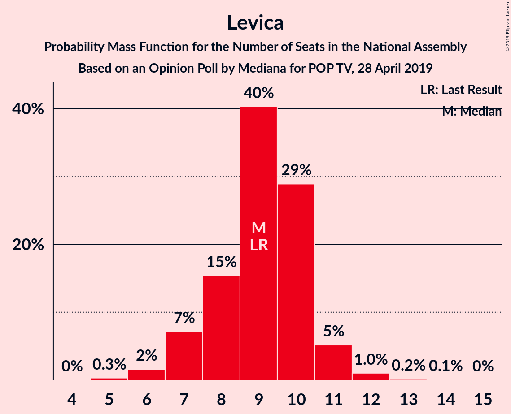
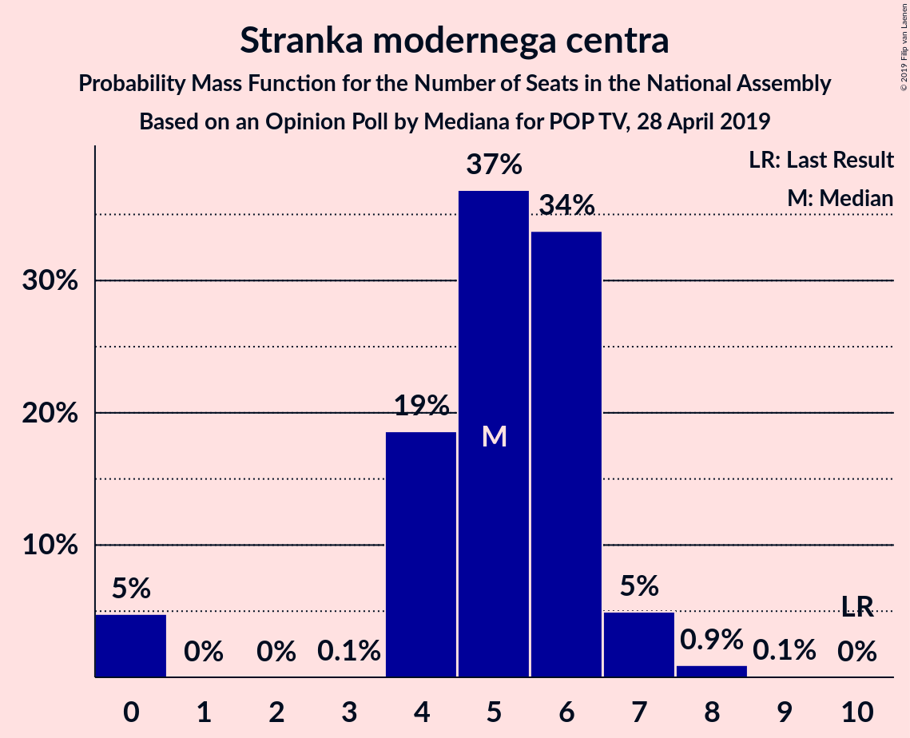
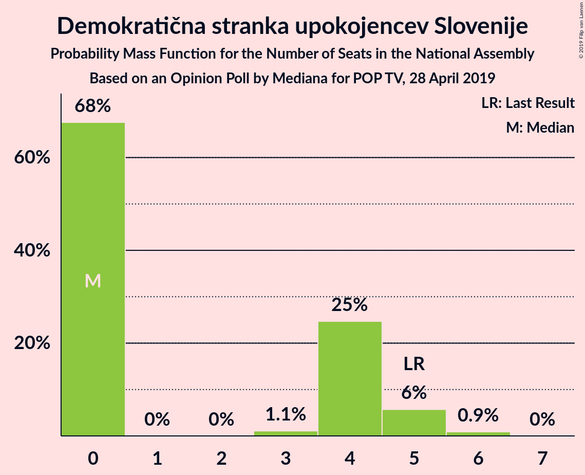
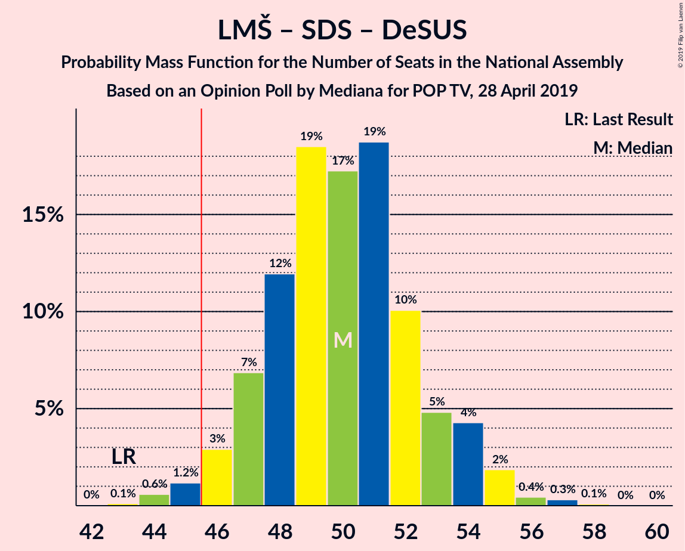
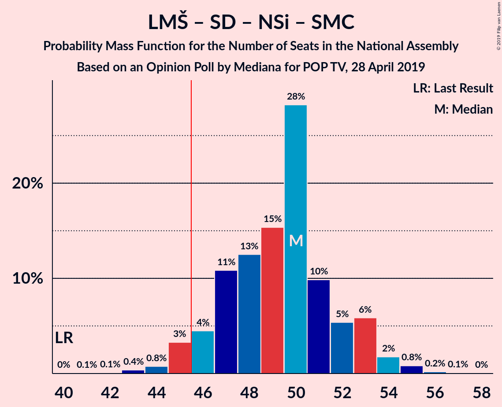
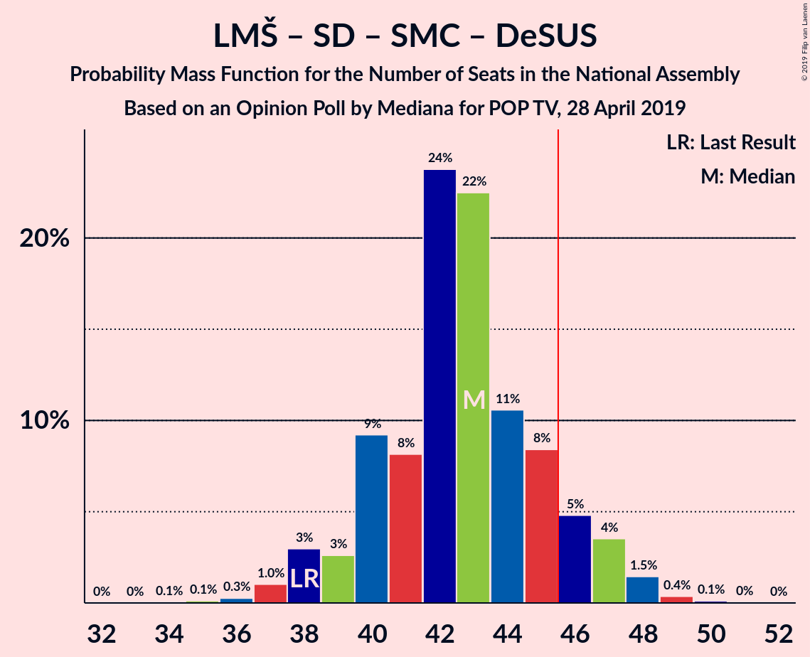
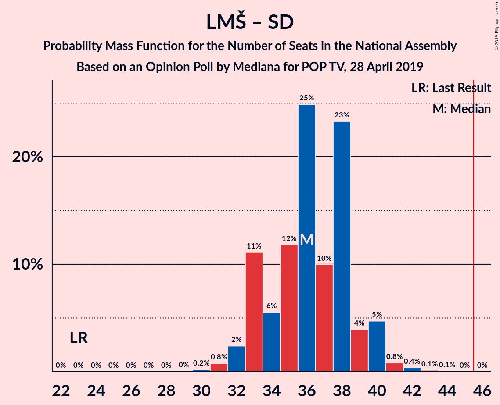

# Opinion Poll by Mediana for POP TV, 28 April 2019

<a href="#voting-intentions">Voting Intentions</a> | <a href="#seats">Seats</a> | <a href="#coalitions">Coalitions</a> | <a href="#technical-information">Technical Information</a>

## Voting Intentions

### Confidence Intervals

| Party | Last Result | Poll Result | 80% Confidence Interval | 90% Confidence Interval | 95% Confidence Interval | 99% Confidence Interval |
|:-----:|:-----------:|:-----------:|:-----------------------:|:-----------------------:|:-----------------------:|:-----------------------:|
| Lista Marjana Šarca | 12.6% | 27.1% | 24.8–29.6% |24.2–30.3% |23.6–30.9% |22.6–32.1% |
| Slovenska demokratska stranka | 24.9% | 22.5% | 20.4–24.8% |19.8–25.5% |19.3–26.0% |18.3–27.2% |
| Socialni demokrati | 9.9% | 10.1% | 8.7–11.9% |8.3–12.4% |7.9–12.8% |7.3–13.7% |
| Levica | 9.3% | 9.3% | 7.9–11.0% |7.5–11.5% |7.2–11.9% |6.6–12.8% |
| Nova Slovenija–Krščanski demokrati | 7.2% | 8.6% | 7.3–10.2% |6.9–10.7% |6.6–11.1% |6.0–12.0% |
| Slovenska nacionalna stranka | 4.2% | 6.2% | 5.1–7.7% |4.8–8.1% |4.5–8.4% |4.0–9.2% |
| Stranka modernega centra | 9.7% | 5.5% | 4.5–6.9% |4.2–7.3% |3.9–7.7% |3.5–8.4% |
| Demokratična stranka upokojencev Slovenije | 4.9% | 3.8% | 2.9–5.0% |2.7–5.3% |2.5–5.7% |2.1–6.3% |
| Slovenska ljudska stranka | 2.6% | 2.4% | 1.8–3.4% |1.6–3.7% |1.4–4.0% |1.2–4.6% |
| Stranka Alenke Bratušek | 5.1% | 2.1% | 1.5–3.0% |1.3–3.3% |1.2–3.6% |1.0–4.1% |

*Note:* The poll result column reflects the actual value used in the calculations. Published results may vary slightly, and in addition be rounded to fewer digits.

## Seats

### Confidence Intervals

| Party | Last Result | Median | 80% Confidence Interval | 90% Confidence Interval | 95% Confidence Interval | 99% Confidence Interval |
|:-----:|:-----------:|:------:|:-----------------------:|:-----------------------:|:-----------------------:|:-----------------------:|
| <a href="#lista-marjana-šarca">Lista Marjana Šarca</a> | 13 | 25 | 25–27 |25–27 |25–28 |25–28 |
| <a href="#slovenska-demokratska-stranka">Slovenska demokratska stranka</a> | 25 | 21 | 21–23 |20–23 |18–23 |17–23 |
| <a href="#socialni-demokrati">Socialni demokrati</a> | 10 | 11 | 11 |9–12 |8–13 |8–13 |
| <a href="#levica">Levica</a> | 9 | 9 | 7–9 |6–9 |6–10 |6–10 |
| <a href="#nova-slovenija–krščanski-demokrati">Nova Slovenija–Krščanski demokrati</a> | 7 | 8 | 7–9 |6–9 |4–9 |4–10 |
| <a href="#slovenska-nacionalna-stranka">Slovenska nacionalna stranka</a> | 4 | 6 | 6 |6–7 |5–11 |5–11 |
| <a href="#stranka-modernega-centra">Stranka modernega centra</a> | 10 | 5 | 0–5 |0–5 |0–5 |0–6 |
| <a href="#demokratična-stranka-upokojencev-slovenije">Demokratična stranka upokojencev Slovenije</a> | 5 | 3 | 3–5 |0–5 |0–6 |0–6 |
| <a href="#slovenska-ljudska-stranka">Slovenska ljudska stranka</a> | 0 | 0 | 0 |0 |0 |0 |
| <a href="#stranka-alenke-bratušek">Stranka Alenke Bratušek</a> | 5 | 0 | 0 |0 |0 |0–4 |

### Lista Marjana Šarca

*For a full overview of the results for this party, see the [Lista Marjana Šarca](party-listamarjanašarca.html) page.*

| Number of Seats | Probability | Accumulated | Special Marks |
|:---------------:|:-----------:|:-----------:|:-------------:|
| 13 | 0% | 100% | Last Result |
| 14 | 0% | 100% |  |
| 15 | 0% | 100% |  |
| 16 | 0% | 100% |  |
| 17 | 0% | 100% |  |
| 18 | 0% | 100% |  |
| 19 | 0% | 100% |  |
| 20 | 0% | 100% |  |
| 21 | 0% | 100% |  |
| 22 | 0% | 100% |  |
| 23 | 0.2% | 100% |  |
| 24 | 0.2% | 99.8% |  |
| 25 | 63% | 99.7% | Median |
| 26 | 8% | 36% |  |
| 27 | 25% | 28% |  |
| 28 | 3% | 3% |  |
| 29 | 0% | 0.2% |  |
| 30 | 0.1% | 0.1% |  |
| 31 | 0% | 0% |  |

### Slovenska demokratska stranka

*For a full overview of the results for this party, see the [Slovenska demokratska stranka](party-slovenskademokratskastranka.html) page.*

| Number of Seats | Probability | Accumulated | Special Marks |
|:---------------:|:-----------:|:-----------:|:-------------:|
| 17 | 1.4% | 100% |  |
| 18 | 2% | 98.6% |  |
| 19 | 0.3% | 97% |  |
| 20 | 3% | 96% |  |
| 21 | 57% | 93% | Median |
| 22 | 4% | 36% |  |
| 23 | 31% | 32% |  |
| 24 | 0% | 0.2% |  |
| 25 | 0.1% | 0.1% | Last Result |
| 26 | 0% | 0% |  |

### Socialni demokrati

*For a full overview of the results for this party, see the [Socialni demokrati](party-socialnidemokrati.html) page.*

| Number of Seats | Probability | Accumulated | Special Marks |
|:---------------:|:-----------:|:-----------:|:-------------:|
| 6 | 0.1% | 100% |  |
| 7 | 0.2% | 99.9% |  |
| 8 | 3% | 99.7% |  |
| 9 | 2% | 96% |  |
| 10 | 1.3% | 95% | Last Result |
| 11 | 87% | 93% | Median |
| 12 | 3% | 6% |  |
| 13 | 3% | 3% |  |
| 14 | 0% | 0% |  |

### Levica

*For a full overview of the results for this party, see the [Levica](party-levica.html) page.*

| Number of Seats | Probability | Accumulated | Special Marks |
|:---------------:|:-----------:|:-----------:|:-------------:|
| 5 | 0.1% | 100% |  |
| 6 | 7% | 99.9% |  |
| 7 | 25% | 93% |  |
| 8 | 8% | 68% |  |
| 9 | 57% | 61% | Last Result, Median |
| 10 | 3% | 3% |  |
| 11 | 0% | 0% |  |

### Nova Slovenija–Krščanski demokrati

*For a full overview of the results for this party, see the [Nova Slovenija–Krščanski demokrati](party-novaslovenija–krščanskidemokrati.html) page.*

| Number of Seats | Probability | Accumulated | Special Marks |
|:---------------:|:-----------:|:-----------:|:-------------:|
| 4 | 3% | 100% |  |
| 5 | 0.1% | 97% |  |
| 6 | 3% | 97% |  |
| 7 | 8% | 93% | Last Result |
| 8 | 59% | 85% | Median |
| 9 | 24% | 26% |  |
| 10 | 1.4% | 2% |  |
| 11 | 0% | 0.2% |  |
| 12 | 0.1% | 0.2% |  |
| 13 | 0% | 0% |  |

### Slovenska nacionalna stranka

*For a full overview of the results for this party, see the [Slovenska nacionalna stranka](party-slovenskanacionalnastranka.html) page.*

| Number of Seats | Probability | Accumulated | Special Marks |
|:---------------:|:-----------:|:-----------:|:-------------:|
| 4 | 0% | 100% | Last Result |
| 5 | 4% | 100% |  |
| 6 | 88% | 96% | Median |
| 7 | 3% | 7% |  |
| 8 | 0.4% | 4% |  |
| 9 | 0% | 3% |  |
| 10 | 0% | 3% |  |
| 11 | 3% | 3% |  |
| 12 | 0% | 0% |  |

### Stranka modernega centra

*For a full overview of the results for this party, see the [Stranka modernega centra](party-strankamodernegacentra.html) page.*

| Number of Seats | Probability | Accumulated | Special Marks |
|:---------------:|:-----------:|:-----------:|:-------------:|
| 0 | 27% | 100% |  |
| 1 | 0% | 73% |  |
| 2 | 0% | 73% |  |
| 3 | 0% | 73% |  |
| 4 | 3% | 73% |  |
| 5 | 67% | 69% | Median |
| 6 | 2% | 2% |  |
| 7 | 0.3% | 0.4% |  |
| 8 | 0% | 0% |  |
| 9 | 0% | 0% |  |
| 10 | 0% | 0% | Last Result |

### Demokratična stranka upokojencev Slovenije

*For a full overview of the results for this party, see the [Demokratična stranka upokojencev Slovenije](party-demokratičnastrankaupokojencevslovenije.html) page.*

| Number of Seats | Probability | Accumulated | Special Marks |
|:---------------:|:-----------:|:-----------:|:-------------:|
| 0 | 7% | 100% |  |
| 1 | 0% | 93% |  |
| 2 | 0% | 93% |  |
| 3 | 57% | 93% | Median |
| 4 | 7% | 35% |  |
| 5 | 24% | 29% | Last Result |
| 6 | 5% | 5% |  |
| 7 | 0% | 0% |  |

### Slovenska ljudska stranka

*For a full overview of the results for this party, see the [Slovenska ljudska stranka](party-slovenskaljudskastranka.html) page.*

| Number of Seats | Probability | Accumulated | Special Marks |
|:---------------:|:-----------:|:-----------:|:-------------:|
| 0 | 99.5% | 100% | Last Result, Median |
| 1 | 0% | 0.5% |  |
| 2 | 0% | 0.5% |  |
| 3 | 0% | 0.5% |  |
| 4 | 0.3% | 0.4% |  |
| 5 | 0.1% | 0.1% |  |
| 6 | 0% | 0% |  |

### Stranka Alenke Bratušek

*For a full overview of the results for this party, see the [Stranka Alenke Bratušek](party-strankaalenkebratušek.html) page.*

| Number of Seats | Probability | Accumulated | Special Marks |
|:---------------:|:-----------:|:-----------:|:-------------:|
| 0 | 99.5% | 100% | Median |
| 1 | 0% | 0.5% |  |
| 2 | 0% | 0.5% |  |
| 3 | 0% | 0.5% |  |
| 4 | 0.5% | 0.5% |  |
| 5 | 0% | 0% | Last Result |

## Coalitions

### Confidence Intervals

| Coalition | Last Result | Median | Majority? | 80% Confidence Interval | 90% Confidence Interval | 95% Confidence Interval | 99% Confidence Interval |
|:---------:|:-----------:|:------:|:---------:|:-----------------------:|:-----------------------:|:-----------------------:|:-----------------------:|
| Lista Marjana Šarca – Slovenska demokratska stranka – Demokratična stranka upokojencev Slovenije | 43 | 49 | 98.6% | 49–55 | 49–55 | 49–55 | 44–55 |
| Lista Marjana Šarca – Socialni demokrati – Nova Slovenija–Krščanski demokrati – Stranka modernega centra – Demokratična stranka upokojencev Slovenije – Stranka Alenke Bratušek | 50 | 52 | 100% | 50–52 | 49–53 | 47–53 | 47–56 |
| Lista Marjana Šarca – Socialni demokrati – Nova Slovenija–Krščanski demokrati – Stranka modernega centra – Demokratična stranka upokojencev Slovenije | 45 | 52 | 99.8% | 50–52 | 49–52 | 47–53 | 47–56 |
| Lista Marjana Šarca – Socialni demokrati – Nova Slovenija–Krščanski demokrati – Demokratična stranka upokojencev Slovenije | 35 | 47 | 94% | 46–52 | 44–52 | 44–52 | 44–52 |
| Lista Marjana Šarca – Slovenska demokratska stranka | 38 | 46 | 97% | 46–50 | 46–50 | 44–50 | 44–50 |
| Lista Marjana Šarca – Socialni demokrati – Nova Slovenija–Krščanski demokrati – Stranka modernega centra | 40 | 49 | 95% | 47–49 | 47–49 | 43–50 | 43–52 |
| Lista Marjana Šarca – Socialni demokrati – Nova Slovenija–Krščanski demokrati | 30 | 44 | 24% | 43–47 | 43–47 | 42–47 | 42–47 |
| Lista Marjana Šarca – Socialni demokrati – Stranka modernega centra – Demokratična stranka upokojencev Slovenije – Stranka Alenke Bratušek | 43 | 44 | 9% | 42–44 | 41–47 | 40–47 | 40–48 |
| Lista Marjana Šarca – Socialni demokrati – Stranka modernega centra – Demokratična stranka upokojencev Slovenije | 38 | 44 | 8% | 42–44 | 41–47 | 40–47 | 40–48 |
| Lista Marjana Šarca – Socialni demokrati – Demokratična stranka upokojencev Slovenije | 28 | 39 | 0% | 39–43 | 37–43 | 37–43 | 36–43 |
| Lista Marjana Šarca – Socialni demokrati – Stranka modernega centra | 33 | 41 | 0% | 38–42 | 38–42 | 36–43 | 36–43 |
| Lista Marjana Šarca – Socialni demokrati | 23 | 36 | 0% | 36–38 | 36–38 | 36–38 | 36–38 |
| Socialni demokrati – Stranka modernega centra – Demokratična stranka upokojencev Slovenije | 25 | 19 | 0% | 16–19 | 15–22 | 12–22 | 12–22 |

### Lista Marjana Šarca – Slovenska demokratska stranka – Demokratična stranka upokojencev Slovenije

| Number of Seats | Probability | Accumulated | Special Marks |
|:---------------:|:-----------:|:-----------:|:-------------:|
| 43 | 0% | 100% | Last Result |
| 44 | 1.4% | 100% |  |
| 45 | 0% | 98.6% |  |
| 46 | 0.4% | 98.6% | Majority |
| 47 | 0% | 98% |  |
| 48 | 0% | 98% |  |
| 49 | 63% | 98% | Median |
| 50 | 2% | 36% |  |
| 51 | 0% | 34% |  |
| 52 | 7% | 34% |  |
| 53 | 4% | 27% |  |
| 54 | 0.1% | 23% |  |
| 55 | 23% | 23% |  |
| 56 | 0% | 0% |  |

### Lista Marjana Šarca – Socialni demokrati – Nova Slovenija–Krščanski demokrati – Stranka modernega centra – Demokratična stranka upokojencev Slovenije – Stranka Alenke Bratušek

| Number of Seats | Probability | Accumulated | Special Marks |
|:---------------:|:-----------:|:-----------:|:-------------:|
| 47 | 3% | 100% |  |
| 48 | 0.2% | 97% |  |
| 49 | 5% | 97% |  |
| 50 | 1.3% | 91% | Last Result |
| 51 | 3% | 90% |  |
| 52 | 81% | 87% | Median |
| 53 | 3% | 5% |  |
| 54 | 0% | 2% |  |
| 55 | 0.4% | 2% |  |
| 56 | 2% | 2% |  |
| 57 | 0% | 0% |  |

### Lista Marjana Šarca – Socialni demokrati – Nova Slovenija–Krščanski demokrati – Stranka modernega centra – Demokratična stranka upokojencev Slovenije

| Number of Seats | Probability | Accumulated | Special Marks |
|:---------------:|:-----------:|:-----------:|:-------------:|
| 45 | 0.2% | 100% | Last Result |
| 46 | 0% | 99.8% | Majority |
| 47 | 3% | 99.8% |  |
| 48 | 0.2% | 97% |  |
| 49 | 5% | 96% |  |
| 50 | 1.3% | 91% |  |
| 51 | 4% | 90% |  |
| 52 | 81% | 86% | Median |
| 53 | 3% | 5% |  |
| 54 | 0% | 2% |  |
| 55 | 0% | 2% |  |
| 56 | 2% | 2% |  |
| 57 | 0% | 0% |  |

### Lista Marjana Šarca – Socialni demokrati – Nova Slovenija–Krščanski demokrati – Demokratična stranka upokojencev Slovenije

| Number of Seats | Probability | Accumulated | Special Marks |
|:---------------:|:-----------:|:-----------:|:-------------:|
| 35 | 0% | 100% | Last Result |
| 36 | 0% | 100% |  |
| 37 | 0% | 100% |  |
| 38 | 0% | 100% |  |
| 39 | 0% | 100% |  |
| 40 | 0% | 100% |  |
| 41 | 0.2% | 100% |  |
| 42 | 0.1% | 99.8% |  |
| 43 | 0% | 99.7% |  |
| 44 | 6% | 99.6% |  |
| 45 | 0% | 94% |  |
| 46 | 5% | 94% | Majority |
| 47 | 60% | 89% | Median |
| 48 | 0.3% | 29% |  |
| 49 | 3% | 29% |  |
| 50 | 1.2% | 26% |  |
| 51 | 2% | 25% |  |
| 52 | 23% | 23% |  |
| 53 | 0% | 0% |  |

### Lista Marjana Šarca – Slovenska demokratska stranka

| Number of Seats | Probability | Accumulated | Special Marks |
|:---------------:|:-----------:|:-----------:|:-------------:|
| 38 | 0% | 100% | Last Result |
| 39 | 0% | 100% |  |
| 40 | 0% | 100% |  |
| 41 | 0% | 100% |  |
| 42 | 0% | 100% |  |
| 43 | 0% | 100% |  |
| 44 | 3% | 100% |  |
| 45 | 0% | 97% |  |
| 46 | 58% | 97% | Median, Majority |
| 47 | 3% | 39% |  |
| 48 | 8% | 36% |  |
| 49 | 6% | 28% |  |
| 50 | 23% | 23% |  |
| 51 | 0% | 0.1% |  |
| 52 | 0% | 0.1% |  |
| 53 | 0% | 0% |  |

### Lista Marjana Šarca – Socialni demokrati – Nova Slovenija–Krščanski demokrati – Stranka modernega centra

| Number of Seats | Probability | Accumulated | Special Marks |
|:---------------:|:-----------:|:-----------:|:-------------:|
| 40 | 0% | 100% | Last Result |
| 41 | 0% | 100% |  |
| 42 | 0.2% | 100% |  |
| 43 | 3% | 99.8% |  |
| 44 | 0% | 97% |  |
| 45 | 1.4% | 97% |  |
| 46 | 0% | 95% | Majority |
| 47 | 29% | 95% |  |
| 48 | 0.3% | 66% |  |
| 49 | 62% | 66% | Median |
| 50 | 2% | 4% |  |
| 51 | 0.4% | 2% |  |
| 52 | 2% | 2% |  |
| 53 | 0% | 0% |  |

### Lista Marjana Šarca – Socialni demokrati – Nova Slovenija–Krščanski demokrati

| Number of Seats | Probability | Accumulated | Special Marks |
|:---------------:|:-----------:|:-----------:|:-------------:|
| 30 | 0% | 100% | Last Result |
| 31 | 0% | 100% |  |
| 32 | 0% | 100% |  |
| 33 | 0% | 100% |  |
| 34 | 0% | 100% |  |
| 35 | 0% | 100% |  |
| 36 | 0% | 100% |  |
| 37 | 0% | 100% |  |
| 38 | 0.2% | 100% |  |
| 39 | 0.1% | 99.8% |  |
| 40 | 0% | 99.7% |  |
| 41 | 0% | 99.7% |  |
| 42 | 3% | 99.7% |  |
| 43 | 6% | 96% |  |
| 44 | 62% | 90% | Median |
| 45 | 3% | 27% |  |
| 46 | 1.4% | 24% | Majority |
| 47 | 23% | 23% |  |
| 48 | 0.2% | 0.2% |  |
| 49 | 0% | 0% |  |

### Lista Marjana Šarca – Socialni demokrati – Stranka modernega centra – Demokratična stranka upokojencev Slovenije – Stranka Alenke Bratušek

| Number of Seats | Probability | Accumulated | Special Marks |
|:---------------:|:-----------:|:-----------:|:-------------:|
| 40 | 3% | 100% |  |
| 41 | 2% | 97% |  |
| 42 | 7% | 95% |  |
| 43 | 23% | 88% | Last Result |
| 44 | 57% | 66% | Median |
| 45 | 0% | 9% |  |
| 46 | 0% | 9% | Majority |
| 47 | 6% | 9% |  |
| 48 | 2% | 2% |  |
| 49 | 0.3% | 0.3% |  |
| 50 | 0% | 0% |  |

### Lista Marjana Šarca – Socialni demokrati – Stranka modernega centra – Demokratična stranka upokojencev Slovenije

| Number of Seats | Probability | Accumulated | Special Marks |
|:---------------:|:-----------:|:-----------:|:-------------:|
| 37 | 0.2% | 100% |  |
| 38 | 0% | 99.8% | Last Result |
| 39 | 0% | 99.8% |  |
| 40 | 3% | 99.8% |  |
| 41 | 2% | 96% |  |
| 42 | 7% | 95% |  |
| 43 | 23% | 88% |  |
| 44 | 57% | 66% | Median |
| 45 | 0.3% | 9% |  |
| 46 | 0% | 8% | Majority |
| 47 | 6% | 8% |  |
| 48 | 2% | 2% |  |
| 49 | 0% | 0% |  |

### Lista Marjana Šarca – Socialni demokrati – Demokratična stranka upokojencev Slovenije

| Number of Seats | Probability | Accumulated | Special Marks |
|:---------------:|:-----------:|:-----------:|:-------------:|
| 28 | 0% | 100% | Last Result |
| 29 | 0% | 100% |  |
| 30 | 0% | 100% |  |
| 31 | 0% | 100% |  |
| 32 | 0% | 100% |  |
| 33 | 0.2% | 100% |  |
| 34 | 0% | 99.8% |  |
| 35 | 0.2% | 99.8% |  |
| 36 | 2% | 99.5% |  |
| 37 | 5% | 98% |  |
| 38 | 0.3% | 93% |  |
| 39 | 57% | 93% | Median |
| 40 | 3% | 35% |  |
| 41 | 1.3% | 32% |  |
| 42 | 3% | 31% |  |
| 43 | 28% | 28% |  |
| 44 | 0% | 0% |  |

### Lista Marjana Šarca – Socialni demokrati – Stranka modernega centra

| Number of Seats | Probability | Accumulated | Special Marks |
|:---------------:|:-----------:|:-----------:|:-------------:|
| 33 | 0% | 100% | Last Result |
| 34 | 0.2% | 100% |  |
| 35 | 0% | 99.8% |  |
| 36 | 5% | 99.8% |  |
| 37 | 0% | 95% |  |
| 38 | 23% | 95% |  |
| 39 | 0% | 73% |  |
| 40 | 0.2% | 72% |  |
| 41 | 60% | 72% | Median |
| 42 | 8% | 12% |  |
| 43 | 3% | 4% |  |
| 44 | 0% | 0.4% |  |
| 45 | 0.3% | 0.4% |  |
| 46 | 0% | 0% | Majority |

### Lista Marjana Šarca – Socialni demokrati

| Number of Seats | Probability | Accumulated | Special Marks |
|:---------------:|:-----------:|:-----------:|:-------------:|
| 23 | 0% | 100% | Last Result |
| 24 | 0% | 100% |  |
| 25 | 0% | 100% |  |
| 26 | 0% | 100% |  |
| 27 | 0% | 100% |  |
| 28 | 0% | 100% |  |
| 29 | 0% | 100% |  |
| 30 | 0.3% | 100% |  |
| 31 | 0% | 99.7% |  |
| 32 | 0% | 99.7% |  |
| 33 | 0% | 99.7% |  |
| 34 | 0% | 99.7% |  |
| 35 | 0.2% | 99.7% |  |
| 36 | 63% | 99.5% | Median |
| 37 | 10% | 36% |  |
| 38 | 26% | 27% |  |
| 39 | 0% | 0.1% |  |
| 40 | 0.1% | 0.1% |  |
| 41 | 0% | 0% |  |

### Socialni demokrati – Stranka modernega centra – Demokratična stranka upokojencev Slovenije

| Number of Seats | Probability | Accumulated | Special Marks |
|:---------------:|:-----------:|:-----------:|:-------------:|
| 12 | 3% | 100% |  |
| 13 | 0.2% | 97% |  |
| 14 | 0.2% | 97% |  |
| 15 | 3% | 96% |  |
| 16 | 28% | 94% |  |
| 17 | 0.2% | 66% |  |
| 18 | 0.4% | 66% |  |
| 19 | 57% | 65% | Median |
| 20 | 0% | 8% |  |
| 21 | 0% | 8% |  |
| 22 | 8% | 8% |  |
| 23 | 0% | 0% |  |
| 24 | 0% | 0% |  |
| 25 | 0% | 0% | Last Result |

## Technical Information

### Opinion Poll

+ **Polling firm:** Mediana
+ **Commissioner(s):** POP TV
+ **Fieldwork period:** 28 April 2019

### Calculations

+ **Sample size:** 583
+ **Simulations done:** 1,024
+ **Error estimate:** 2.58%

