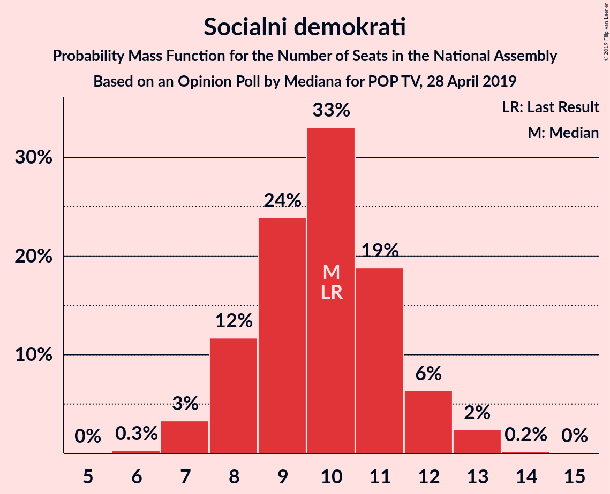
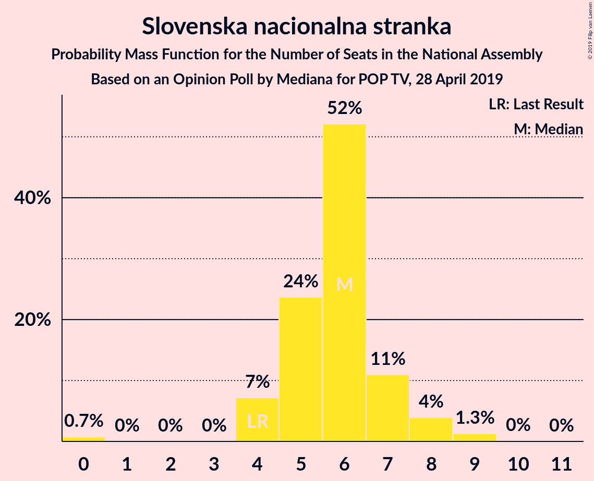
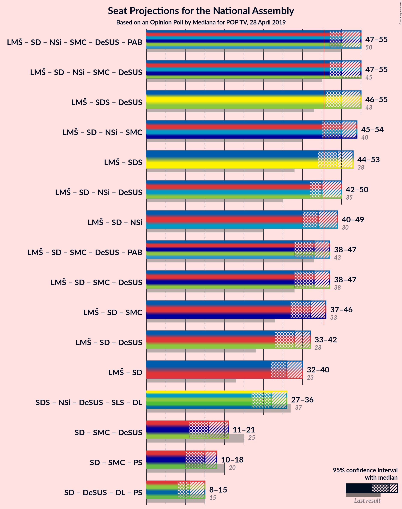
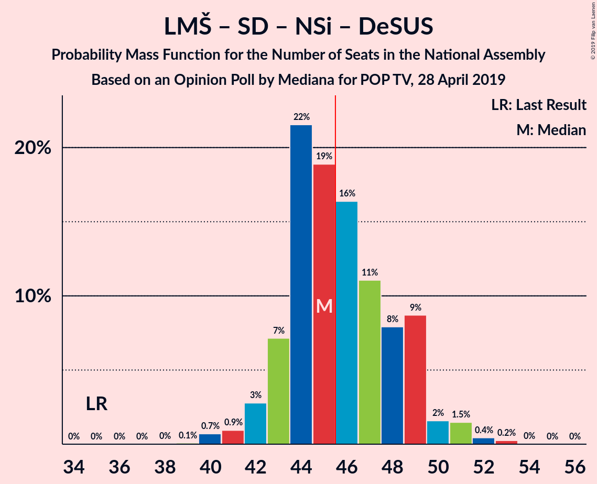

# Opinion Poll by Mediana for POP TV, 28 April 2019

<a href="#voting-intentions">Voting Intentions</a> | <a href="#seats">Seats</a> | <a href="#coalitions">Coalitions</a> | <a href="#technical-information">Technical Information</a>

## Voting Intentions

### Confidence Intervals

| Party | Last Result | Poll Result | 80% Confidence Interval | 90% Confidence Interval | 95% Confidence Interval | 99% Confidence Interval |
|:-----:|:-----------:|:-----------:|:-----------------------:|:-----------------------:|:-----------------------:|:-----------------------:|
| Lista Marjana Šarca | 12.6% | 27.1% | 24.8–29.6% |24.2–30.3% |23.6–30.9% |22.6–32.1% |
| Slovenska demokratska stranka | 24.9% | 22.5% | 20.4–24.8% |19.8–25.5% |19.3–26.0% |18.3–27.2% |
| Socialni demokrati | 9.9% | 10.1% | 8.7–11.9% |8.3–12.4% |7.9–12.8% |7.3–13.7% |
| Levica | 9.3% | 9.3% | 7.9–11.0% |7.5–11.5% |7.2–11.9% |6.6–12.8% |
| Nova Slovenija–Krščanski demokrati | 7.2% | 8.6% | 7.3–10.2% |6.9–10.7% |6.6–11.1% |6.0–12.0% |
| Slovenska nacionalna stranka | 4.2% | 6.2% | 5.1–7.7% |4.8–8.1% |4.5–8.4% |4.0–9.2% |
| Stranka modernega centra | 9.7% | 5.5% | 4.5–6.9% |4.2–7.3% |3.9–7.7% |3.5–8.4% |
| Demokratična stranka upokojencev Slovenije | 4.9% | 3.8% | 2.9–5.0% |2.7–5.3% |2.5–5.7% |2.1–6.3% |
| Slovenska ljudska stranka | 2.6% | 2.4% | 1.8–3.4% |1.6–3.7% |1.4–4.0% |1.2–4.6% |
| Stranka Alenke Bratušek | 5.1% | 2.1% | 1.5–3.0% |1.3–3.3% |1.2–3.6% |1.0–4.1% |

*Note:* The poll result column reflects the actual value used in the calculations. Published results may vary slightly, and in addition be rounded to fewer digits.

## Seats

### Confidence Intervals

| Party | Last Result | Median | 80% Confidence Interval | 90% Confidence Interval | 95% Confidence Interval | 99% Confidence Interval |
|:-----:|:-----------:|:------:|:-----------------------:|:-----------------------:|:-----------------------:|:-----------------------:|
| <a href="#lista-marjana-šarca">Lista Marjana Šarca</a> | 13 | 27 | 24–28 |23–29 |23–30 |22–31 |
| <a href="#slovenska-demokratska-stranka">Slovenska demokratska stranka</a> | 25 | 22 | 20–24 |19–25 |19–25 |18–27 |
| <a href="#socialni-demokrati">Socialni demokrati</a> | 10 | 10 | 8–11 |8–12 |7–13 |7–13 |
| <a href="#levica">Levica</a> | 9 | 9 | 8–10 |7–11 |7–11 |6–12 |
| <a href="#nova-slovenija–krščanski-demokrati">Nova Slovenija–Krščanski demokrati</a> | 7 | 8 | 7–10 |6–10 |6–11 |6–11 |
| <a href="#slovenska-nacionalna-stranka">Slovenska nacionalna stranka</a> | 4 | 6 | 5–7 |4–8 |4–8 |0–9 |
| <a href="#stranka-modernega-centra">Stranka modernega centra</a> | 10 | 5 | 4–6 |4–7 |0–7 |0–8 |
| <a href="#demokratična-stranka-upokojencev-slovenije">Demokratična stranka upokojencev Slovenije</a> | 5 | 0 | 0–4 |0–5 |0–5 |0–6 |
| <a href="#slovenska-ljudska-stranka">Slovenska ljudska stranka</a> | 0 | 0 | 0 |0 |0 |0–4 |
| <a href="#stranka-alenke-bratušek">Stranka Alenke Bratušek</a> | 5 | 0 | 0 |0 |0 |0–3 |

### Lista Marjana Šarca

*For a full overview of the results for this party, see the [Lista Marjana Šarca](party-listamarjanašarca.html) page.*

| Number of Seats | Probability | Accumulated | Special Marks |
|:---------------:|:-----------:|:-----------:|:-------------:|
| 13 | 0% | 100% | Last Result |
| 14 | 0% | 100% |  |
| 15 | 0% | 100% |  |
| 16 | 0% | 100% |  |
| 17 | 0% | 100% |  |
| 18 | 0% | 100% |  |
| 19 | 0% | 100% |  |
| 20 | 0% | 100% |  |
| 21 | 0.2% | 100% |  |
| 22 | 1.5% | 99.7% |  |
| 23 | 7% | 98% |  |
| 24 | 8% | 91% |  |
| 25 | 17% | 84% |  |
| 26 | 13% | 67% |  |
| 27 | 22% | 54% | Median |
| 28 | 23% | 32% |  |
| 29 | 5% | 10% |  |
| 30 | 3% | 5% |  |
| 31 | 0.8% | 1.2% |  |
| 32 | 0.3% | 0.4% |  |
| 33 | 0.1% | 0.1% |  |
| 34 | 0% | 0% |  |

### Slovenska demokratska stranka

*For a full overview of the results for this party, see the [Slovenska demokratska stranka](party-slovenskademokratskastranka.html) page.*

| Number of Seats | Probability | Accumulated | Special Marks |
|:---------------:|:-----------:|:-----------:|:-------------:|
| 17 | 0.3% | 100% |  |
| 18 | 1.4% | 99.7% |  |
| 19 | 6% | 98% |  |
| 20 | 9% | 93% |  |
| 21 | 15% | 84% |  |
| 22 | 29% | 69% | Median |
| 23 | 11% | 40% |  |
| 24 | 24% | 29% |  |
| 25 | 3% | 6% | Last Result |
| 26 | 2% | 2% |  |
| 27 | 0.4% | 0.6% |  |
| 28 | 0.1% | 0.2% |  |
| 29 | 0.1% | 0.1% |  |
| 30 | 0% | 0% |  |

### Socialni demokrati

*For a full overview of the results for this party, see the [Socialni demokrati](party-socialnidemokrati.html) page.*

| Number of Seats | Probability | Accumulated | Special Marks |
|:---------------:|:-----------:|:-----------:|:-------------:|
| 6 | 0.3% | 100% |  |
| 7 | 3% | 99.7% |  |
| 8 | 12% | 96% |  |
| 9 | 24% | 85% |  |
| 10 | 33% | 61% | Last Result, Median |
| 11 | 19% | 28% |  |
| 12 | 6% | 9% |  |
| 13 | 2% | 3% |  |
| 14 | 0.2% | 0.2% |  |
| 15 | 0% | 0% |  |

### Levica

*For a full overview of the results for this party, see the [Levica](party-levica.html) page.*

| Number of Seats | Probability | Accumulated | Special Marks |
|:---------------:|:-----------:|:-----------:|:-------------:|
| 5 | 0.3% | 100% |  |
| 6 | 2% | 99.7% |  |
| 7 | 7% | 98% |  |
| 8 | 15% | 91% |  |
| 9 | 40% | 76% | Last Result, Median |
| 10 | 29% | 35% |  |
| 11 | 5% | 6% |  |
| 12 | 1.0% | 1.2% |  |
| 13 | 0.2% | 0.2% |  |
| 14 | 0.1% | 0.1% |  |
| 15 | 0% | 0% |  |

### Nova Slovenija–Krščanski demokrati

*For a full overview of the results for this party, see the [Nova Slovenija–Krščanski demokrati](party-novaslovenija–krščanskidemokrati.html) page.*

| Number of Seats | Probability | Accumulated | Special Marks |
|:---------------:|:-----------:|:-----------:|:-------------:|
| 5 | 0.4% | 100% |  |
| 6 | 9% | 99.5% |  |
| 7 | 25% | 91% | Last Result |
| 8 | 32% | 66% | Median |
| 9 | 22% | 34% |  |
| 10 | 10% | 13% |  |
| 11 | 3% | 3% |  |
| 12 | 0.4% | 0.5% |  |
| 13 | 0% | 0% |  |

### Slovenska nacionalna stranka

*For a full overview of the results for this party, see the [Slovenska nacionalna stranka](party-slovenskanacionalnastranka.html) page.*

| Number of Seats | Probability | Accumulated | Special Marks |
|:---------------:|:-----------:|:-----------:|:-------------:|
| 0 | 0.7% | 100% |  |
| 1 | 0% | 99.3% |  |
| 2 | 0% | 99.3% |  |
| 3 | 0% | 99.3% |  |
| 4 | 7% | 99.2% | Last Result |
| 5 | 24% | 92% |  |
| 6 | 52% | 68% | Median |
| 7 | 11% | 16% |  |
| 8 | 4% | 5% |  |
| 9 | 1.3% | 1.3% |  |
| 10 | 0% | 0.1% |  |
| 11 | 0% | 0% |  |

### Stranka modernega centra

*For a full overview of the results for this party, see the [Stranka modernega centra](party-strankamodernegacentra.html) page.*

| Number of Seats | Probability | Accumulated | Special Marks |
|:---------------:|:-----------:|:-----------:|:-------------:|
| 0 | 5% | 100% |  |
| 1 | 0% | 95% |  |
| 2 | 0% | 95% |  |
| 3 | 0.1% | 95% |  |
| 4 | 19% | 95% |  |
| 5 | 37% | 77% | Median |
| 6 | 34% | 40% |  |
| 7 | 5% | 6% |  |
| 8 | 0.9% | 1.0% |  |
| 9 | 0.1% | 0.1% |  |
| 10 | 0% | 0% | Last Result |

### Demokratična stranka upokojencev Slovenije

*For a full overview of the results for this party, see the [Demokratična stranka upokojencev Slovenije](party-demokratičnastrankaupokojencevslovenije.html) page.*

| Number of Seats | Probability | Accumulated | Special Marks |
|:---------------:|:-----------:|:-----------:|:-------------:|
| 0 | 68% | 100% | Median |
| 1 | 0% | 32% |  |
| 2 | 0% | 32% |  |
| 3 | 1.1% | 32% |  |
| 4 | 25% | 31% |  |
| 5 | 6% | 7% | Last Result |
| 6 | 0.9% | 0.9% |  |
| 7 | 0% | 0% |  |

### Slovenska ljudska stranka

*For a full overview of the results for this party, see the [Slovenska ljudska stranka](party-slovenskaljudskastranka.html) page.*

| Number of Seats | Probability | Accumulated | Special Marks |
|:---------------:|:-----------:|:-----------:|:-------------:|
| 0 | 98% | 100% | Last Result, Median |
| 1 | 0% | 2% |  |
| 2 | 0% | 2% |  |
| 3 | 0.1% | 2% |  |
| 4 | 1.3% | 1.4% |  |
| 5 | 0.1% | 0.1% |  |
| 6 | 0% | 0% |  |

### Stranka Alenke Bratušek

*For a full overview of the results for this party, see the [Stranka Alenke Bratušek](party-strankaalenkebratušek.html) page.*

| Number of Seats | Probability | Accumulated | Special Marks |
|:---------------:|:-----------:|:-----------:|:-------------:|
| 0 | 99.4% | 100% | Median |
| 1 | 0% | 0.6% |  |
| 2 | 0% | 0.6% |  |
| 3 | 0.2% | 0.6% |  |
| 4 | 0.5% | 0.5% |  |
| 5 | 0% | 0% | Last Result |

## Coalitions

### Confidence Intervals

| Coalition | Last Result | Median | Majority? | 80% Confidence Interval | 90% Confidence Interval | 95% Confidence Interval | 99% Confidence Interval |
|:---------:|:-----------:|:------:|:---------:|:-----------------------:|:-----------------------:|:-----------------------:|:-----------------------:|
| Lista Marjana Šarca – Socialni demokrati – Nova Slovenija–Krščanski demokrati – Stranka modernega centra – Demokratična stranka upokojencev Slovenije – Stranka Alenke Bratušek | 50 | 50 | 99.4% | 48–53 | 47–54 | 47–55 | 45–57 |
| Lista Marjana Šarca – Socialni demokrati – Nova Slovenija–Krščanski demokrati – Stranka modernega centra – Demokratična stranka upokojencev Slovenije | 45 | 50 | 99.3% | 48–53 | 47–54 | 47–55 | 45–57 |
| Lista Marjana Šarca – Slovenska demokratska stranka – Demokratična stranka upokojencev Slovenije | 43 | 50 | 98% | 47–53 | 47–54 | 46–55 | 44–56 |
| Lista Marjana Šarca – Socialni demokrati – Nova Slovenija–Krščanski demokrati – Stranka modernega centra | 40 | 50 | 95% | 47–52 | 46–53 | 45–54 | 43–55 |
| Lista Marjana Šarca – Slovenska demokratska stranka | 38 | 49 | 88% | 45–51 | 44–52 | 44–53 | 43–54 |
| Lista Marjana Šarca – Socialni demokrati – Nova Slovenija–Krščanski demokrati – Demokratična stranka upokojencev Slovenije | 35 | 45 | 48% | 43–49 | 43–49 | 42–50 | 40–52 |
| Lista Marjana Šarca – Socialni demokrati – Nova Slovenija–Krščanski demokrati | 30 | 44 | 24% | 42–47 | 41–48 | 40–49 | 39–50 |
| Lista Marjana Šarca – Socialni demokrati – Stranka modernega centra – Demokratična stranka upokojencev Slovenije – Stranka Alenke Bratušek | 43 | 43 | 11% | 40–46 | 39–47 | 38–47 | 37–49 |
| Lista Marjana Šarca – Socialni demokrati – Stranka modernega centra – Demokratična stranka upokojencev Slovenije | 38 | 43 | 10% | 40–46 | 39–47 | 38–47 | 37–49 |
| Lista Marjana Šarca – Socialni demokrati – Stranka modernega centra | 33 | 42 | 3% | 38–44 | 37–45 | 37–46 | 35–47 |
| Lista Marjana Šarca – Socialni demokrati – Demokratična stranka upokojencev Slovenije | 28 | 38 | 0.1% | 35–41 | 34–42 | 33–42 | 32–44 |
| Lista Marjana Šarca – Socialni demokrati | 23 | 36 | 0% | 33–38 | 33–40 | 32–40 | 31–42 |
| Socialni demokrati – Stranka modernega centra – Demokratična stranka upokojencev Slovenije | 25 | 16 | 0% | 14–19 | 13–20 | 11–21 | 9–23 |

### Lista Marjana Šarca – Socialni demokrati – Nova Slovenija–Krščanski demokrati – Stranka modernega centra – Demokratična stranka upokojencev Slovenije – Stranka Alenke Bratušek

| Number of Seats | Probability | Accumulated | Special Marks |
|:---------------:|:-----------:|:-----------:|:-------------:|
| 43 | 0.1% | 100% |  |
| 44 | 0.2% | 99.9% |  |
| 45 | 0.4% | 99.7% |  |
| 46 | 1.3% | 99.4% | Majority |
| 47 | 3% | 98% |  |
| 48 | 8% | 95% |  |
| 49 | 11% | 87% |  |
| 50 | 29% | 77% | Last Result, Median |
| 51 | 17% | 48% |  |
| 52 | 9% | 31% |  |
| 53 | 13% | 23% |  |
| 54 | 4% | 9% |  |
| 55 | 3% | 5% |  |
| 56 | 1.1% | 2% |  |
| 57 | 0.4% | 0.7% |  |
| 58 | 0.1% | 0.2% |  |
| 59 | 0.1% | 0.1% |  |
| 60 | 0% | 0% |  |

### Lista Marjana Šarca – Socialni demokrati – Nova Slovenija–Krščanski demokrati – Stranka modernega centra – Demokratična stranka upokojencev Slovenije

| Number of Seats | Probability | Accumulated | Special Marks |
|:---------------:|:-----------:|:-----------:|:-------------:|
| 43 | 0.1% | 100% |  |
| 44 | 0.2% | 99.9% |  |
| 45 | 0.4% | 99.7% | Last Result |
| 46 | 1.4% | 99.3% | Majority |
| 47 | 3% | 98% |  |
| 48 | 8% | 95% |  |
| 49 | 11% | 87% |  |
| 50 | 29% | 76% | Median |
| 51 | 17% | 48% |  |
| 52 | 9% | 31% |  |
| 53 | 13% | 22% |  |
| 54 | 4% | 9% |  |
| 55 | 3% | 5% |  |
| 56 | 1.0% | 2% |  |
| 57 | 0.4% | 0.6% |  |
| 58 | 0.1% | 0.2% |  |
| 59 | 0.1% | 0.1% |  |
| 60 | 0% | 0% |  |

### Lista Marjana Šarca – Slovenska demokratska stranka – Demokratična stranka upokojencev Slovenije

| Number of Seats | Probability | Accumulated | Special Marks |
|:---------------:|:-----------:|:-----------:|:-------------:|
| 43 | 0.1% | 100% | Last Result |
| 44 | 0.6% | 99.9% |  |
| 45 | 1.2% | 99.3% |  |
| 46 | 3% | 98% | Majority |
| 47 | 7% | 95% |  |
| 48 | 12% | 88% |  |
| 49 | 19% | 76% | Median |
| 50 | 17% | 58% |  |
| 51 | 19% | 41% |  |
| 52 | 10% | 22% |  |
| 53 | 5% | 12% |  |
| 54 | 4% | 7% |  |
| 55 | 2% | 3% |  |
| 56 | 0.4% | 0.9% |  |
| 57 | 0.3% | 0.4% |  |
| 58 | 0.1% | 0.1% |  |
| 59 | 0% | 0% |  |

### Lista Marjana Šarca – Socialni demokrati – Nova Slovenija–Krščanski demokrati – Stranka modernega centra

| Number of Seats | Probability | Accumulated | Special Marks |
|:---------------:|:-----------:|:-----------:|:-------------:|
| 40 | 0% | 100% | Last Result |
| 41 | 0.1% | 100% |  |
| 42 | 0.1% | 99.9% |  |
| 43 | 0.4% | 99.8% |  |
| 44 | 0.8% | 99.4% |  |
| 45 | 3% | 98.7% |  |
| 46 | 4% | 95% | Majority |
| 47 | 11% | 91% |  |
| 48 | 13% | 80% |  |
| 49 | 15% | 68% |  |
| 50 | 28% | 52% | Median |
| 51 | 10% | 24% |  |
| 52 | 5% | 14% |  |
| 53 | 6% | 9% |  |
| 54 | 2% | 3% |  |
| 55 | 0.8% | 1.1% |  |
| 56 | 0.2% | 0.3% |  |
| 57 | 0.1% | 0.1% |  |
| 58 | 0% | 0% |  |

### Lista Marjana Šarca – Slovenska demokratska stranka

| Number of Seats | Probability | Accumulated | Special Marks |
|:---------------:|:-----------:|:-----------:|:-------------:|
| 38 | 0% | 100% | Last Result |
| 39 | 0% | 100% |  |
| 40 | 0% | 100% |  |
| 41 | 0.1% | 100% |  |
| 42 | 0.3% | 99.9% |  |
| 43 | 2% | 99.6% |  |
| 44 | 3% | 98% |  |
| 45 | 7% | 95% |  |
| 46 | 6% | 88% | Majority |
| 47 | 11% | 81% |  |
| 48 | 14% | 70% |  |
| 49 | 17% | 56% | Median |
| 50 | 17% | 40% |  |
| 51 | 14% | 23% |  |
| 52 | 6% | 9% |  |
| 53 | 2% | 3% |  |
| 54 | 1.0% | 1.4% |  |
| 55 | 0.3% | 0.4% |  |
| 56 | 0% | 0.1% |  |
| 57 | 0.1% | 0.1% |  |
| 58 | 0% | 0% |  |

### Lista Marjana Šarca – Socialni demokrati – Nova Slovenija–Krščanski demokrati – Demokratična stranka upokojencev Slovenije

| Number of Seats | Probability | Accumulated | Special Marks |
|:---------------:|:-----------:|:-----------:|:-------------:|
| 35 | 0% | 100% | Last Result |
| 36 | 0% | 100% |  |
| 37 | 0% | 100% |  |
| 38 | 0% | 100% |  |
| 39 | 0.1% | 100% |  |
| 40 | 0.7% | 99.9% |  |
| 41 | 0.9% | 99.2% |  |
| 42 | 3% | 98% |  |
| 43 | 7% | 95% |  |
| 44 | 22% | 88% |  |
| 45 | 19% | 67% | Median |
| 46 | 16% | 48% | Majority |
| 47 | 11% | 31% |  |
| 48 | 8% | 20% |  |
| 49 | 9% | 13% |  |
| 50 | 2% | 4% |  |
| 51 | 1.5% | 2% |  |
| 52 | 0.4% | 0.7% |  |
| 53 | 0.2% | 0.3% |  |
| 54 | 0% | 0.1% |  |
| 55 | 0% | 0% |  |

### Lista Marjana Šarca – Socialni demokrati – Nova Slovenija–Krščanski demokrati

| Number of Seats | Probability | Accumulated | Special Marks |
|:---------------:|:-----------:|:-----------:|:-------------:|
| 30 | 0% | 100% | Last Result |
| 31 | 0% | 100% |  |
| 32 | 0% | 100% |  |
| 33 | 0% | 100% |  |
| 34 | 0% | 100% |  |
| 35 | 0% | 100% |  |
| 36 | 0% | 100% |  |
| 37 | 0.1% | 100% |  |
| 38 | 0.2% | 99.9% |  |
| 39 | 0.5% | 99.6% |  |
| 40 | 2% | 99.2% |  |
| 41 | 5% | 97% |  |
| 42 | 12% | 92% |  |
| 43 | 10% | 80% |  |
| 44 | 26% | 69% |  |
| 45 | 20% | 44% | Median |
| 46 | 8% | 24% | Majority |
| 47 | 9% | 16% |  |
| 48 | 4% | 7% |  |
| 49 | 2% | 3% |  |
| 50 | 0.6% | 1.0% |  |
| 51 | 0.3% | 0.4% |  |
| 52 | 0.1% | 0.1% |  |
| 53 | 0.1% | 0.1% |  |
| 54 | 0% | 0% |  |

### Lista Marjana Šarca – Socialni demokrati – Stranka modernega centra – Demokratična stranka upokojencev Slovenije – Stranka Alenke Bratušek

| Number of Seats | Probability | Accumulated | Special Marks |
|:---------------:|:-----------:|:-----------:|:-------------:|
| 34 | 0.1% | 100% |  |
| 35 | 0.1% | 99.9% |  |
| 36 | 0.3% | 99.8% |  |
| 37 | 1.0% | 99.6% |  |
| 38 | 3% | 98.6% |  |
| 39 | 3% | 96% |  |
| 40 | 9% | 93% |  |
| 41 | 8% | 84% |  |
| 42 | 24% | 76% | Median |
| 43 | 22% | 52% | Last Result |
| 44 | 11% | 30% |  |
| 45 | 8% | 19% |  |
| 46 | 5% | 11% | Majority |
| 47 | 4% | 6% |  |
| 48 | 1.5% | 2% |  |
| 49 | 0.4% | 0.6% |  |
| 50 | 0.1% | 0.2% |  |
| 51 | 0% | 0% |  |

### Lista Marjana Šarca – Socialni demokrati – Stranka modernega centra – Demokratična stranka upokojencev Slovenije

| Number of Seats | Probability | Accumulated | Special Marks |
|:---------------:|:-----------:|:-----------:|:-------------:|
| 34 | 0.1% | 100% |  |
| 35 | 0.1% | 99.9% |  |
| 36 | 0.3% | 99.8% |  |
| 37 | 1.0% | 99.6% |  |
| 38 | 3% | 98.5% | Last Result |
| 39 | 3% | 96% |  |
| 40 | 9% | 93% |  |
| 41 | 8% | 84% |  |
| 42 | 24% | 76% | Median |
| 43 | 22% | 52% |  |
| 44 | 11% | 29% |  |
| 45 | 8% | 19% |  |
| 46 | 5% | 10% | Majority |
| 47 | 4% | 5% |  |
| 48 | 1.5% | 2% |  |
| 49 | 0.4% | 0.5% |  |
| 50 | 0.1% | 0.2% |  |
| 51 | 0% | 0% |  |

### Lista Marjana Šarca – Socialni demokrati – Stranka modernega centra

| Number of Seats | Probability | Accumulated | Special Marks |
|:---------------:|:-----------:|:-----------:|:-------------:|
| 33 | 0% | 100% | Last Result |
| 34 | 0.2% | 99.9% |  |
| 35 | 0.5% | 99.7% |  |
| 36 | 0.8% | 99.2% |  |
| 37 | 4% | 98% |  |
| 38 | 10% | 95% |  |
| 39 | 8% | 85% |  |
| 40 | 12% | 77% |  |
| 41 | 13% | 65% |  |
| 42 | 19% | 53% | Median |
| 43 | 20% | 33% |  |
| 44 | 8% | 14% |  |
| 45 | 2% | 5% |  |
| 46 | 2% | 3% | Majority |
| 47 | 0.5% | 0.6% |  |
| 48 | 0.1% | 0.2% |  |
| 49 | 0.1% | 0.1% |  |
| 50 | 0% | 0% |  |

### Lista Marjana Šarca – Socialni demokrati – Demokratična stranka upokojencev Slovenije

| Number of Seats | Probability | Accumulated | Special Marks |
|:---------------:|:-----------:|:-----------:|:-------------:|
| 28 | 0% | 100% | Last Result |
| 29 | 0% | 100% |  |
| 30 | 0% | 100% |  |
| 31 | 0.2% | 100% |  |
| 32 | 0.7% | 99.8% |  |
| 33 | 3% | 99.1% |  |
| 34 | 3% | 96% |  |
| 35 | 5% | 93% |  |
| 36 | 23% | 88% |  |
| 37 | 12% | 65% | Median |
| 38 | 25% | 53% |  |
| 39 | 10% | 28% |  |
| 40 | 9% | 19% |  |
| 41 | 5% | 10% |  |
| 42 | 4% | 5% |  |
| 43 | 1.2% | 2% |  |
| 44 | 0.4% | 0.6% |  |
| 45 | 0.1% | 0.2% |  |
| 46 | 0% | 0.1% | Majority |
| 47 | 0% | 0% |  |

### Lista Marjana Šarca – Socialni demokrati

| Number of Seats | Probability | Accumulated | Special Marks |
|:---------------:|:-----------:|:-----------:|:-------------:|
| 23 | 0% | 100% | Last Result |
| 24 | 0% | 100% |  |
| 25 | 0% | 100% |  |
| 26 | 0% | 100% |  |
| 27 | 0% | 100% |  |
| 28 | 0% | 100% |  |
| 29 | 0% | 100% |  |
| 30 | 0.2% | 99.9% |  |
| 31 | 0.8% | 99.7% |  |
| 32 | 2% | 99.0% |  |
| 33 | 11% | 97% |  |
| 34 | 6% | 85% |  |
| 35 | 12% | 80% |  |
| 36 | 25% | 68% |  |
| 37 | 10% | 43% | Median |
| 38 | 23% | 33% |  |
| 39 | 4% | 10% |  |
| 40 | 5% | 6% |  |
| 41 | 0.8% | 1.4% |  |
| 42 | 0.4% | 0.6% |  |
| 43 | 0.1% | 0.2% |  |
| 44 | 0.1% | 0.1% |  |
| 45 | 0% | 0% |  |

### Socialni demokrati – Stranka modernega centra – Demokratična stranka upokojencev Slovenije

| Number of Seats | Probability | Accumulated | Special Marks |
|:---------------:|:-----------:|:-----------:|:-------------:|
| 8 | 0.1% | 100% |  |
| 9 | 0.4% | 99.9% |  |
| 10 | 0.5% | 99.5% |  |
| 11 | 2% | 99.0% |  |
| 12 | 0.9% | 97% |  |
| 13 | 4% | 96% |  |
| 14 | 8% | 92% |  |
| 15 | 31% | 84% | Median |
| 16 | 14% | 53% |  |
| 17 | 9% | 38% |  |
| 18 | 9% | 29% |  |
| 19 | 13% | 21% |  |
| 20 | 4% | 8% |  |
| 21 | 2% | 3% |  |
| 22 | 1.1% | 2% |  |
| 23 | 0.5% | 0.6% |  |
| 24 | 0% | 0% |  |
| 25 | 0% | 0% | Last Result |

## Technical Information

### Opinion Poll

+ **Polling firm:** Mediana
+ **Commissioner(s):** POP TV
+ **Fieldwork period:** 28 April 2019

### Calculations

+ **Sample size:** 583
+ **Simulations done:** 1,048,576
+ **Error estimate:** 2.91%

