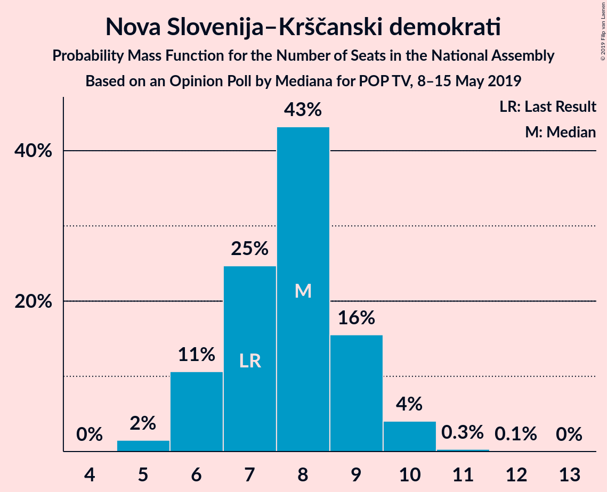
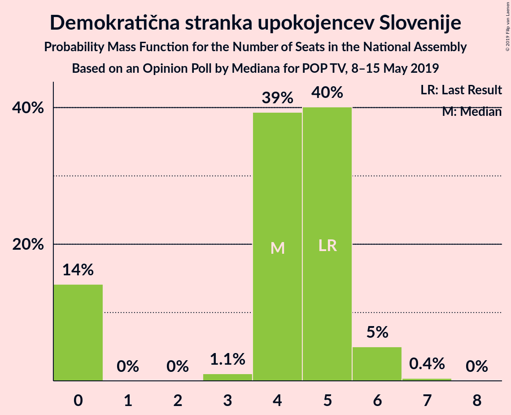
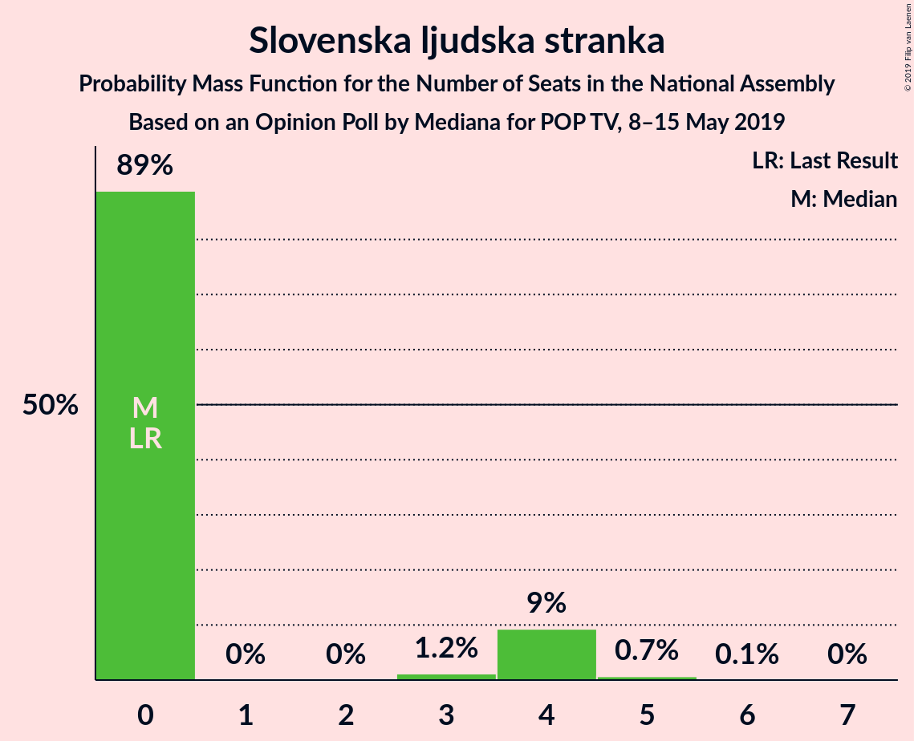
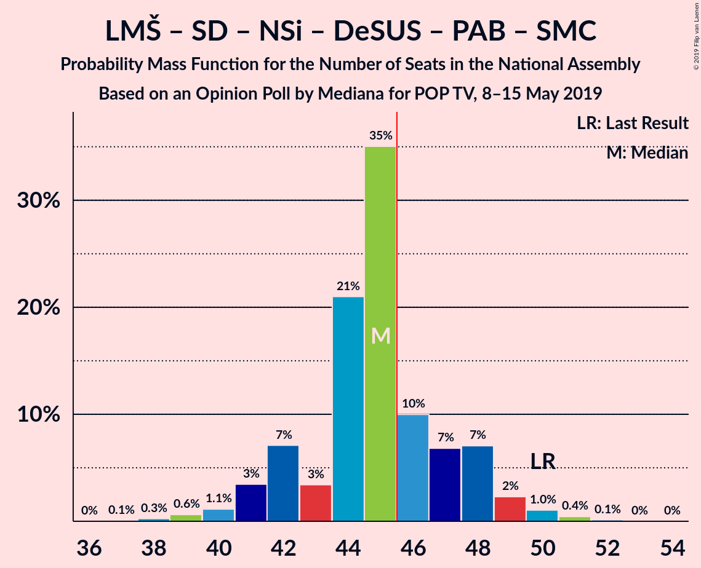
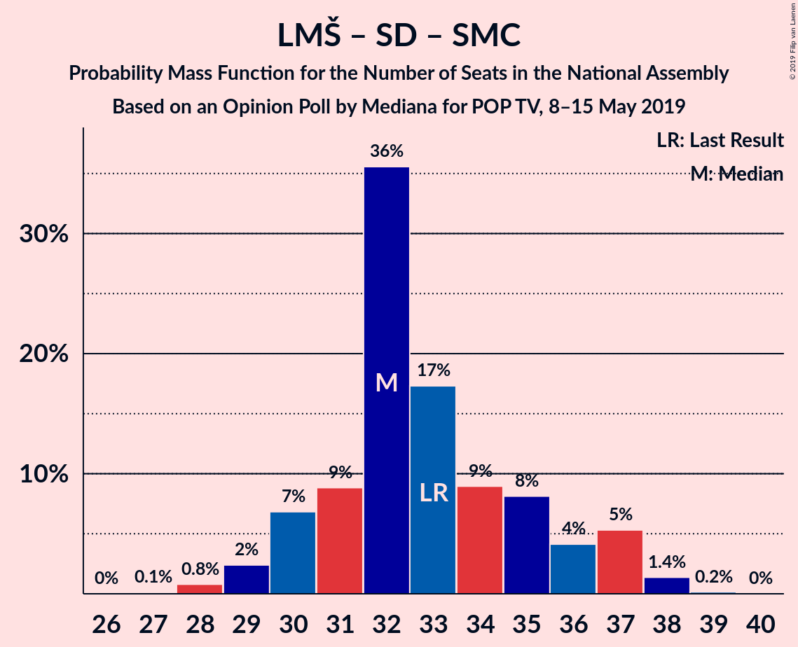

# Opinion Poll by Mediana for POP TV, 8–15 May 2019

<a href="#voting-intentions">Voting Intentions</a> | <a href="#seats">Seats</a> | <a href="#coalitions">Coalitions</a> | <a href="#technical-information">Technical Information</a>

## Voting Intentions

### Confidence Intervals

| Party | Last Result | Poll Result | 80% Confidence Interval | 90% Confidence Interval | 95% Confidence Interval | 99% Confidence Interval |
|:-----:|:-----------:|:-----------:|:-----------------------:|:-----------------------:|:-----------------------:|:-----------------------:|
| Lista Marjana Šarca | 12.6% | 24.0% | 22.1–26.2% |21.6–26.7% |21.1–27.3% |20.2–28.3% |
| Slovenska demokratska stranka | 24.9% | 22.0% | 20.1–24.1% |19.6–24.6% |19.1–25.1% |18.3–26.2% |
| Levica | 9.3% | 12.2% | 10.7–13.8% |10.3–14.3% |10.0–14.7% |9.3–15.6% |
| Socialni demokrati | 9.9% | 10.1% | 8.8–11.7% |8.4–12.1% |8.1–12.5% |7.5–13.3% |
| Nova Slovenija–Krščanski demokrati | 7.2% | 8.1% | 6.9–9.5% |6.6–9.9% |6.3–10.3% |5.8–11.0% |
| Slovenska nacionalna stranka | 4.2% | 5.2% | 4.3–6.4% |4.0–6.8% |3.8–7.1% |3.4–7.7% |
| Demokratična stranka upokojencev Slovenije | 4.9% | 4.6% | 3.8–5.8% |3.5–6.1% |3.3–6.4% |3.0–7.0% |
| Slovenska ljudska stranka | 2.6% | 3.3% | 2.6–4.3% |2.4–4.6% |2.2–4.8% |1.9–5.4% |
| Stranka Alenke Bratušek | 5.1% | 3.1% | 2.5–4.1% |2.3–4.4% |2.1–4.7% |1.8–5.2% |
| Stranka modernega centra | 9.7% | 1.6% | 1.2–2.4% |1.1–2.7% |0.9–2.9% |0.8–3.3% |

*Note:* The poll result column reflects the actual value used in the calculations. Published results may vary slightly, and in addition be rounded to fewer digits.

## Seats

### Confidence Intervals

| Party | Last Result | Median | 80% Confidence Interval | 90% Confidence Interval | 95% Confidence Interval | 99% Confidence Interval |
|:-----:|:-----------:|:------:|:-----------------------:|:-----------------------:|:-----------------------:|:-----------------------:|
| <a href="#lista-marjana-šarca">Lista Marjana Šarca</a> | 13 | 23 | 21–26 |21–26 |20–27 |19–28 |
| <a href="#slovenska-demokratska-stranka">Slovenska demokratska stranka</a> | 25 | 22 | 19–23 |19–24 |18–24 |17–26 |
| <a href="#levica">Levica</a> | 9 | 12 | 10–13 |10–13 |9–14 |9–15 |
| <a href="#socialni-demokrati">Socialni demokrati</a> | 10 | 10 | 8–11 |8–11 |7–12 |7–13 |
| <a href="#nova-slovenija–krščanski-demokrati">Nova Slovenija–Krščanski demokrati</a> | 7 | 8 | 6–9 |6–9 |6–10 |5–10 |
| <a href="#slovenska-nacionalna-stranka">Slovenska nacionalna stranka</a> | 4 | 4 | 4–6 |3–6 |0–7 |0–7 |
| <a href="#demokratična-stranka-upokojencev-slovenije">Demokratična stranka upokojencev Slovenije</a> | 5 | 4 | 0–5 |0–6 |0–6 |0–6 |
| <a href="#slovenska-ljudska-stranka">Slovenska ljudska stranka</a> | 0 | 0 | 0–4 |0–4 |0–4 |0–5 |
| <a href="#stranka-alenke-bratušek">Stranka Alenke Bratušek</a> | 5 | 0 | 0–3 |0–4 |0–4 |0–5 |
| <a href="#stranka-modernega-centra">Stranka modernega centra</a> | 10 | 0 | 0 |0 |0 |0 |

### Lista Marjana Šarca

*For a full overview of the results for this party, see the [Lista Marjana Šarca](party-listamarjanašarca.html) page.*

| Number of Seats | Probability | Accumulated | Special Marks |
|:---------------:|:-----------:|:-----------:|:-------------:|
| 13 | 0% | 100% | Last Result |
| 14 | 0% | 100% |  |
| 15 | 0% | 100% |  |
| 16 | 0% | 100% |  |
| 17 | 0% | 100% |  |
| 18 | 0.2% | 100% |  |
| 19 | 0.5% | 99.8% |  |
| 20 | 2% | 99.3% |  |
| 21 | 8% | 97% |  |
| 22 | 26% | 89% |  |
| 23 | 20% | 63% | Median |
| 24 | 19% | 43% |  |
| 25 | 12% | 24% |  |
| 26 | 7% | 11% |  |
| 27 | 4% | 5% |  |
| 28 | 0.9% | 1.1% |  |
| 29 | 0.1% | 0.2% |  |
| 30 | 0.1% | 0.1% |  |
| 31 | 0% | 0% |  |

### Slovenska demokratska stranka

*For a full overview of the results for this party, see the [Slovenska demokratska stranka](party-slovenskademokratskastranka.html) page.*

| Number of Seats | Probability | Accumulated | Special Marks |
|:---------------:|:-----------:|:-----------:|:-------------:|
| 16 | 0.1% | 100% |  |
| 17 | 0.6% | 99.9% |  |
| 18 | 3% | 99.3% |  |
| 19 | 6% | 96% |  |
| 20 | 18% | 90% |  |
| 21 | 17% | 72% |  |
| 22 | 36% | 54% | Median |
| 23 | 11% | 19% |  |
| 24 | 6% | 8% |  |
| 25 | 1.0% | 2% | Last Result |
| 26 | 0.4% | 0.5% |  |
| 27 | 0.1% | 0.2% |  |
| 28 | 0% | 0% |  |

### Levica

*For a full overview of the results for this party, see the [Levica](party-levica.html) page.*

| Number of Seats | Probability | Accumulated | Special Marks |
|:---------------:|:-----------:|:-----------:|:-------------:|
| 8 | 0.4% | 100% |  |
| 9 | 3% | 99.6% | Last Result |
| 10 | 18% | 97% |  |
| 11 | 13% | 79% |  |
| 12 | 34% | 66% | Median |
| 13 | 28% | 32% |  |
| 14 | 3% | 4% |  |
| 15 | 0.7% | 1.0% |  |
| 16 | 0.2% | 0.3% |  |
| 17 | 0.1% | 0.1% |  |
| 18 | 0% | 0% |  |

### Socialni demokrati

*For a full overview of the results for this party, see the [Socialni demokrati](party-socialnidemokrati.html) page.*

| Number of Seats | Probability | Accumulated | Special Marks |
|:---------------:|:-----------:|:-----------:|:-------------:|
| 6 | 0.1% | 100% |  |
| 7 | 3% | 99.9% |  |
| 8 | 21% | 97% |  |
| 9 | 25% | 77% |  |
| 10 | 35% | 52% | Last Result, Median |
| 11 | 12% | 16% |  |
| 12 | 4% | 5% |  |
| 13 | 0.5% | 0.6% |  |
| 14 | 0.1% | 0.1% |  |
| 15 | 0% | 0% |  |

### Nova Slovenija–Krščanski demokrati

*For a full overview of the results for this party, see the [Nova Slovenija–Krščanski demokrati](party-novaslovenija–krščanskidemokrati.html) page.*

| Number of Seats | Probability | Accumulated | Special Marks |
|:---------------:|:-----------:|:-----------:|:-------------:|
| 5 | 2% | 100% |  |
| 6 | 11% | 98% |  |
| 7 | 25% | 88% | Last Result |
| 8 | 43% | 63% | Median |
| 9 | 16% | 20% |  |
| 10 | 4% | 4% |  |
| 11 | 0.3% | 0.4% |  |
| 12 | 0.1% | 0.1% |  |
| 13 | 0% | 0% |  |

### Slovenska nacionalna stranka

*For a full overview of the results for this party, see the [Slovenska nacionalna stranka](party-slovenskanacionalnastranka.html) page.*

| Number of Seats | Probability | Accumulated | Special Marks |
|:---------------:|:-----------:|:-----------:|:-------------:|
| 0 | 5% | 100% |  |
| 1 | 0% | 95% |  |
| 2 | 0% | 95% |  |
| 3 | 4% | 95% |  |
| 4 | 48% | 91% | Last Result, Median |
| 5 | 24% | 43% |  |
| 6 | 16% | 19% |  |
| 7 | 3% | 3% |  |
| 8 | 0.2% | 0.2% |  |
| 9 | 0% | 0% |  |

### Demokratična stranka upokojencev Slovenije

*For a full overview of the results for this party, see the [Demokratična stranka upokojencev Slovenije](party-demokratičnastrankaupokojencevslovenije.html) page.*

| Number of Seats | Probability | Accumulated | Special Marks |
|:---------------:|:-----------:|:-----------:|:-------------:|
| 0 | 14% | 100% |  |
| 1 | 0% | 86% |  |
| 2 | 0% | 86% |  |
| 3 | 1.1% | 86% |  |
| 4 | 39% | 85% | Median |
| 5 | 40% | 45% | Last Result |
| 6 | 5% | 5% |  |
| 7 | 0.4% | 0.4% |  |
| 8 | 0% | 0% |  |

### Slovenska ljudska stranka

*For a full overview of the results for this party, see the [Slovenska ljudska stranka](party-slovenskaljudskastranka.html) page.*

| Number of Seats | Probability | Accumulated | Special Marks |
|:---------------:|:-----------:|:-----------:|:-------------:|
| 0 | 89% | 100% | Last Result, Median |
| 1 | 0% | 11% |  |
| 2 | 0% | 11% |  |
| 3 | 1.2% | 11% |  |
| 4 | 9% | 10% |  |
| 5 | 0.7% | 0.7% |  |
| 6 | 0.1% | 0.1% |  |
| 7 | 0% | 0% |  |

### Stranka Alenke Bratušek

*For a full overview of the results for this party, see the [Stranka Alenke Bratušek](party-strankaalenkebratušek.html) page.*

| Number of Seats | Probability | Accumulated | Special Marks |
|:---------------:|:-----------:|:-----------:|:-------------:|
| 0 | 89% | 100% | Median |
| 1 | 0% | 11% |  |
| 2 | 0% | 11% |  |
| 3 | 2% | 11% |  |
| 4 | 8% | 9% |  |
| 5 | 0.8% | 0.8% | Last Result |
| 6 | 0% | 0% |  |

### Stranka modernega centra

*For a full overview of the results for this party, see the [Stranka modernega centra](party-strankamodernegacentra.html) page.*

| Number of Seats | Probability | Accumulated | Special Marks |
|:---------------:|:-----------:|:-----------:|:-------------:|
| 0 | 100% | 100% | Median |
| 1 | 0% | 0% |  |
| 2 | 0% | 0% |  |
| 3 | 0% | 0% |  |
| 4 | 0% | 0% |  |
| 5 | 0% | 0% |  |
| 6 | 0% | 0% |  |
| 7 | 0% | 0% |  |
| 8 | 0% | 0% |  |
| 9 | 0% | 0% |  |
| 10 | 0% | 0% | Last Result |

## Coalitions

### Confidence Intervals

| Coalition | Last Result | Median | Majority? | 80% Confidence Interval | 90% Confidence Interval | 95% Confidence Interval | 99% Confidence Interval |
|:---------:|:-----------:|:------:|:---------:|:-----------------------:|:-----------------------:|:-----------------------:|:-----------------------:|
| Lista Marjana Šarca – Slovenska demokratska stranka – Demokratična stranka upokojencev Slovenije | 43 | 49 | 92% | 46–51 | 45–52 | 44–53 | 42–54 |
| Lista Marjana Šarca – Socialni demokrati – Nova Slovenija–Krščanski demokrati – Demokratična stranka upokojencev Slovenije – Stranka Alenke Bratušek – Stranka modernega centra | 50 | 45 | 28% | 42–48 | 41–48 | 41–49 | 39–51 |
| Lista Marjana Šarca – Slovenska demokratska stranka | 38 | 45 | 36% | 42–48 | 41–49 | 41–49 | 39–51 |
| Lista Marjana Šarca – Socialni demokrati – Nova Slovenija–Krščanski demokrati – Demokratična stranka upokojencev Slovenije | 35 | 45 | 22% | 42–47 | 41–48 | 40–49 | 38–50 |
| Lista Marjana Šarca – Socialni demokrati – Nova Slovenija–Krščanski demokrati – Demokratična stranka upokojencev Slovenije – Stranka modernega centra | 45 | 45 | 22% | 42–47 | 41–48 | 40–49 | 38–50 |
| Lista Marjana Šarca – Socialni demokrati – Nova Slovenija–Krščanski demokrati | 30 | 40 | 2% | 38–44 | 37–45 | 37–45 | 35–47 |
| Lista Marjana Šarca – Socialni demokrati – Nova Slovenija–Krščanski demokrati – Stranka modernega centra | 40 | 40 | 2% | 38–44 | 37–45 | 37–45 | 35–47 |
| Lista Marjana Šarca – Socialni demokrati – Demokratična stranka upokojencev Slovenije – Stranka Alenke Bratušek – Stranka modernega centra | 43 | 37 | 0% | 35–40 | 34–41 | 33–41 | 31–43 |
| Lista Marjana Šarca – Socialni demokrati – Demokratična stranka upokojencev Slovenije | 28 | 37 | 0% | 34–39 | 33–40 | 32–41 | 31–42 |
| Lista Marjana Šarca – Socialni demokrati – Demokratična stranka upokojencev Slovenije – Stranka modernega centra | 38 | 37 | 0% | 34–39 | 33–40 | 32–41 | 31–42 |
| Lista Marjana Šarca – Socialni demokrati | 23 | 32 | 0% | 30–36 | 30–37 | 29–37 | 28–38 |
| Lista Marjana Šarca – Socialni demokrati – Stranka modernega centra | 33 | 32 | 0% | 30–36 | 30–37 | 29–37 | 28–38 |
| Socialni demokrati – Demokratična stranka upokojencev Slovenije – Stranka modernega centra | 25 | 14 | 0% | 10–15 | 9–16 | 9–16 | 8–17 |

### Lista Marjana Šarca – Slovenska demokratska stranka – Demokratična stranka upokojencev Slovenije

| Number of Seats | Probability | Accumulated | Special Marks |
|:---------------:|:-----------:|:-----------:|:-------------:|
| 40 | 0.1% | 100% |  |
| 41 | 0.4% | 99.9% |  |
| 42 | 0.6% | 99.5% |  |
| 43 | 1.1% | 98.9% | Last Result |
| 44 | 2% | 98% |  |
| 45 | 4% | 96% |  |
| 46 | 6% | 92% | Majority |
| 47 | 12% | 86% |  |
| 48 | 14% | 74% |  |
| 49 | 28% | 60% | Median |
| 50 | 14% | 32% |  |
| 51 | 13% | 18% |  |
| 52 | 3% | 6% |  |
| 53 | 2% | 3% |  |
| 54 | 0.4% | 0.7% |  |
| 55 | 0.2% | 0.3% |  |
| 56 | 0.1% | 0.1% |  |
| 57 | 0% | 0% |  |

### Lista Marjana Šarca – Socialni demokrati – Nova Slovenija–Krščanski demokrati – Demokratična stranka upokojencev Slovenije – Stranka Alenke Bratušek – Stranka modernega centra

| Number of Seats | Probability | Accumulated | Special Marks |
|:---------------:|:-----------:|:-----------:|:-------------:|
| 37 | 0.1% | 100% |  |
| 38 | 0.3% | 99.9% |  |
| 39 | 0.6% | 99.6% |  |
| 40 | 1.1% | 99.0% |  |
| 41 | 3% | 98% |  |
| 42 | 7% | 94% |  |
| 43 | 3% | 87% |  |
| 44 | 21% | 84% |  |
| 45 | 35% | 63% | Median |
| 46 | 10% | 28% | Majority |
| 47 | 7% | 18% |  |
| 48 | 7% | 11% |  |
| 49 | 2% | 4% |  |
| 50 | 1.0% | 2% | Last Result |
| 51 | 0.4% | 0.6% |  |
| 52 | 0.1% | 0.2% |  |
| 53 | 0% | 0% |  |

### Lista Marjana Šarca – Slovenska demokratska stranka

| Number of Seats | Probability | Accumulated | Special Marks |
|:---------------:|:-----------:|:-----------:|:-------------:|
| 38 | 0.2% | 100% | Last Result |
| 39 | 0.6% | 99.8% |  |
| 40 | 0.9% | 99.2% |  |
| 41 | 5% | 98% |  |
| 42 | 6% | 93% |  |
| 43 | 11% | 87% |  |
| 44 | 25% | 76% |  |
| 45 | 15% | 51% | Median |
| 46 | 21% | 36% | Majority |
| 47 | 4% | 15% |  |
| 48 | 5% | 10% |  |
| 49 | 4% | 5% |  |
| 50 | 0.3% | 1.0% |  |
| 51 | 0.5% | 0.6% |  |
| 52 | 0.1% | 0.2% |  |
| 53 | 0% | 0% |  |

### Lista Marjana Šarca – Socialni demokrati – Nova Slovenija–Krščanski demokrati – Demokratična stranka upokojencev Slovenije

| Number of Seats | Probability | Accumulated | Special Marks |
|:---------------:|:-----------:|:-----------:|:-------------:|
| 35 | 0% | 100% | Last Result |
| 36 | 0% | 100% |  |
| 37 | 0.1% | 99.9% |  |
| 38 | 0.4% | 99.8% |  |
| 39 | 1.1% | 99.4% |  |
| 40 | 3% | 98% |  |
| 41 | 4% | 95% |  |
| 42 | 9% | 91% |  |
| 43 | 5% | 82% |  |
| 44 | 20% | 77% |  |
| 45 | 34% | 56% | Median |
| 46 | 8% | 22% | Majority |
| 47 | 5% | 14% |  |
| 48 | 6% | 9% |  |
| 49 | 2% | 3% |  |
| 50 | 0.5% | 0.8% |  |
| 51 | 0.2% | 0.3% |  |
| 52 | 0.1% | 0.1% |  |
| 53 | 0% | 0% |  |

### Lista Marjana Šarca – Socialni demokrati – Nova Slovenija–Krščanski demokrati – Demokratična stranka upokojencev Slovenije – Stranka modernega centra

| Number of Seats | Probability | Accumulated | Special Marks |
|:---------------:|:-----------:|:-----------:|:-------------:|
| 36 | 0% | 100% |  |
| 37 | 0.1% | 99.9% |  |
| 38 | 0.4% | 99.8% |  |
| 39 | 1.1% | 99.4% |  |
| 40 | 3% | 98% |  |
| 41 | 4% | 95% |  |
| 42 | 9% | 91% |  |
| 43 | 5% | 82% |  |
| 44 | 20% | 77% |  |
| 45 | 34% | 56% | Last Result, Median |
| 46 | 8% | 22% | Majority |
| 47 | 5% | 14% |  |
| 48 | 6% | 9% |  |
| 49 | 2% | 3% |  |
| 50 | 0.5% | 0.8% |  |
| 51 | 0.2% | 0.4% |  |
| 52 | 0.1% | 0.1% |  |
| 53 | 0% | 0% |  |

### Lista Marjana Šarca – Socialni demokrati – Nova Slovenija–Krščanski demokrati

| Number of Seats | Probability | Accumulated | Special Marks |
|:---------------:|:-----------:|:-----------:|:-------------:|
| 30 | 0% | 100% | Last Result |
| 31 | 0% | 100% |  |
| 32 | 0% | 100% |  |
| 33 | 0% | 100% |  |
| 34 | 0.1% | 100% |  |
| 35 | 0.6% | 99.9% |  |
| 36 | 1.3% | 99.3% |  |
| 37 | 5% | 98% |  |
| 38 | 7% | 93% |  |
| 39 | 9% | 86% |  |
| 40 | 41% | 77% |  |
| 41 | 10% | 35% | Median |
| 42 | 8% | 26% |  |
| 43 | 4% | 18% |  |
| 44 | 8% | 13% |  |
| 45 | 4% | 6% |  |
| 46 | 0.5% | 2% | Majority |
| 47 | 0.9% | 1.0% |  |
| 48 | 0.1% | 0.1% |  |
| 49 | 0% | 0% |  |

### Lista Marjana Šarca – Socialni demokrati – Nova Slovenija–Krščanski demokrati – Stranka modernega centra

| Number of Seats | Probability | Accumulated | Special Marks |
|:---------------:|:-----------:|:-----------:|:-------------:|
| 34 | 0.1% | 100% |  |
| 35 | 0.6% | 99.9% |  |
| 36 | 1.3% | 99.3% |  |
| 37 | 5% | 98% |  |
| 38 | 7% | 93% |  |
| 39 | 9% | 86% |  |
| 40 | 41% | 77% | Last Result |
| 41 | 10% | 35% | Median |
| 42 | 8% | 26% |  |
| 43 | 4% | 18% |  |
| 44 | 8% | 13% |  |
| 45 | 4% | 6% |  |
| 46 | 0.5% | 2% | Majority |
| 47 | 0.9% | 1.0% |  |
| 48 | 0.1% | 0.1% |  |
| 49 | 0% | 0% |  |

### Lista Marjana Šarca – Socialni demokrati – Demokratična stranka upokojencev Slovenije – Stranka Alenke Bratušek – Stranka modernega centra

| Number of Seats | Probability | Accumulated | Special Marks |
|:---------------:|:-----------:|:-----------:|:-------------:|
| 29 | 0.1% | 100% |  |
| 30 | 0.2% | 99.9% |  |
| 31 | 0.3% | 99.7% |  |
| 32 | 0.9% | 99.4% |  |
| 33 | 3% | 98.5% |  |
| 34 | 4% | 96% |  |
| 35 | 7% | 91% |  |
| 36 | 14% | 84% |  |
| 37 | 38% | 70% | Median |
| 38 | 10% | 32% |  |
| 39 | 11% | 22% |  |
| 40 | 5% | 11% |  |
| 41 | 4% | 6% |  |
| 42 | 1.3% | 2% |  |
| 43 | 0.8% | 1.0% | Last Result |
| 44 | 0.1% | 0.2% |  |
| 45 | 0.1% | 0.1% |  |
| 46 | 0% | 0% | Majority |

### Lista Marjana Šarca – Socialni demokrati – Demokratična stranka upokojencev Slovenije

| Number of Seats | Probability | Accumulated | Special Marks |
|:---------------:|:-----------:|:-----------:|:-------------:|
| 28 | 0% | 100% | Last Result |
| 29 | 0.1% | 100% |  |
| 30 | 0.3% | 99.9% |  |
| 31 | 1.3% | 99.6% |  |
| 32 | 2% | 98% |  |
| 33 | 4% | 97% |  |
| 34 | 6% | 93% |  |
| 35 | 7% | 87% |  |
| 36 | 16% | 80% |  |
| 37 | 38% | 64% | Median |
| 38 | 9% | 26% |  |
| 39 | 10% | 17% |  |
| 40 | 3% | 7% |  |
| 41 | 3% | 4% |  |
| 42 | 0.7% | 1.1% |  |
| 43 | 0.3% | 0.4% |  |
| 44 | 0.1% | 0.1% |  |
| 45 | 0% | 0% |  |

### Lista Marjana Šarca – Socialni demokrati – Demokratična stranka upokojencev Slovenije – Stranka modernega centra

| Number of Seats | Probability | Accumulated | Special Marks |
|:---------------:|:-----------:|:-----------:|:-------------:|
| 29 | 0.1% | 100% |  |
| 30 | 0.3% | 99.9% |  |
| 31 | 1.3% | 99.6% |  |
| 32 | 2% | 98% |  |
| 33 | 4% | 97% |  |
| 34 | 6% | 93% |  |
| 35 | 7% | 87% |  |
| 36 | 16% | 80% |  |
| 37 | 38% | 64% | Median |
| 38 | 9% | 26% | Last Result |
| 39 | 10% | 17% |  |
| 40 | 3% | 7% |  |
| 41 | 3% | 4% |  |
| 42 | 0.7% | 1.1% |  |
| 43 | 0.3% | 0.4% |  |
| 44 | 0.1% | 0.1% |  |
| 45 | 0% | 0% |  |

### Lista Marjana Šarca – Socialni demokrati

| Number of Seats | Probability | Accumulated | Special Marks |
|:---------------:|:-----------:|:-----------:|:-------------:|
| 23 | 0% | 100% | Last Result |
| 24 | 0% | 100% |  |
| 25 | 0% | 100% |  |
| 26 | 0% | 100% |  |
| 27 | 0.1% | 100% |  |
| 28 | 0.8% | 99.9% |  |
| 29 | 2% | 99.1% |  |
| 30 | 7% | 97% |  |
| 31 | 9% | 90% |  |
| 32 | 36% | 81% |  |
| 33 | 17% | 45% | Median |
| 34 | 9% | 28% |  |
| 35 | 8% | 19% |  |
| 36 | 4% | 11% |  |
| 37 | 5% | 7% |  |
| 38 | 1.4% | 2% |  |
| 39 | 0.2% | 0.2% |  |
| 40 | 0% | 0% |  |

### Lista Marjana Šarca – Socialni demokrati – Stranka modernega centra

| Number of Seats | Probability | Accumulated | Special Marks |
|:---------------:|:-----------:|:-----------:|:-------------:|
| 27 | 0.1% | 100% |  |
| 28 | 0.8% | 99.9% |  |
| 29 | 2% | 99.1% |  |
| 30 | 7% | 97% |  |
| 31 | 9% | 90% |  |
| 32 | 36% | 81% |  |
| 33 | 17% | 45% | Last Result, Median |
| 34 | 9% | 28% |  |
| 35 | 8% | 19% |  |
| 36 | 4% | 11% |  |
| 37 | 5% | 7% |  |
| 38 | 1.4% | 2% |  |
| 39 | 0.2% | 0.2% |  |
| 40 | 0% | 0% |  |

### Socialni demokrati – Demokratična stranka upokojencev Slovenije – Stranka modernega centra

| Number of Seats | Probability | Accumulated | Special Marks |
|:---------------:|:-----------:|:-----------:|:-------------:|
| 7 | 0.3% | 100% |  |
| 8 | 1.2% | 99.7% |  |
| 9 | 4% | 98.6% |  |
| 10 | 5% | 95% |  |
| 11 | 3% | 89% |  |
| 12 | 9% | 86% |  |
| 13 | 27% | 78% |  |
| 14 | 17% | 51% | Median |
| 15 | 27% | 34% |  |
| 16 | 5% | 7% |  |
| 17 | 2% | 2% |  |
| 18 | 0.3% | 0.3% |  |
| 19 | 0% | 0.1% |  |
| 20 | 0% | 0% |  |
| 21 | 0% | 0% |  |
| 22 | 0% | 0% |  |
| 23 | 0% | 0% |  |
| 24 | 0% | 0% |  |
| 25 | 0% | 0% | Last Result |

## Technical Information

### Opinion Poll

+ **Polling firm:** Mediana
+ **Commissioner(s):** POP TV
+ **Fieldwork period:** 8–15 May 2019

### Calculations

+ **Sample size:** 732
+ **Simulations done:** 1,048,576
+ **Error estimate:** 1.89%

