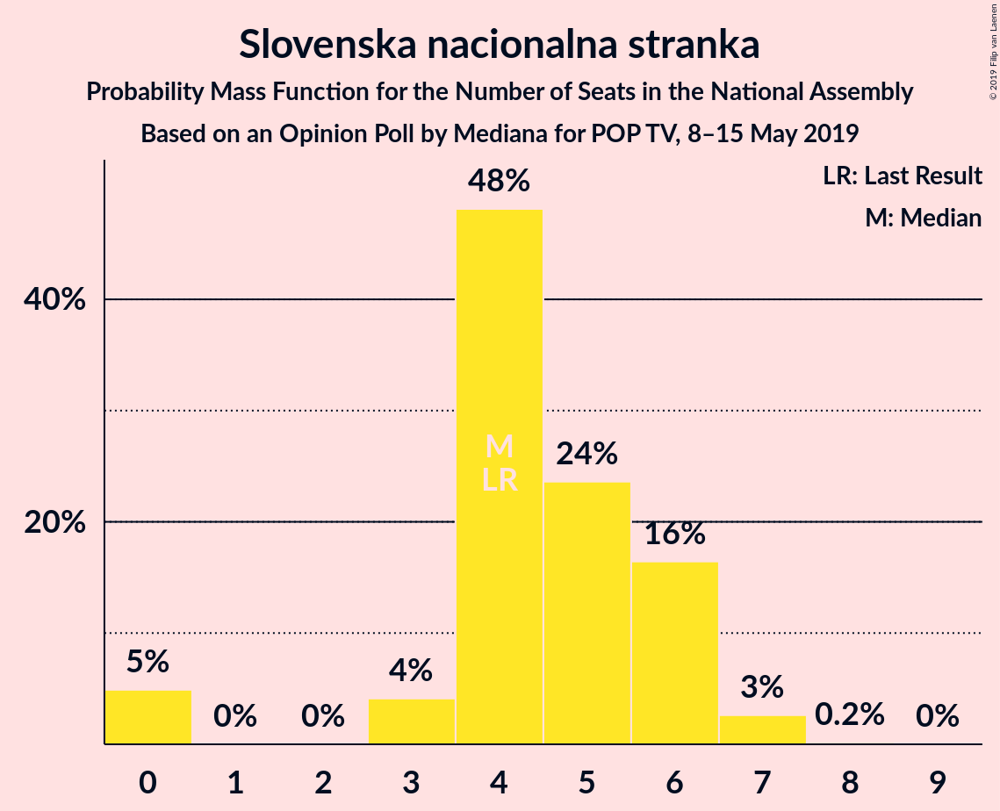
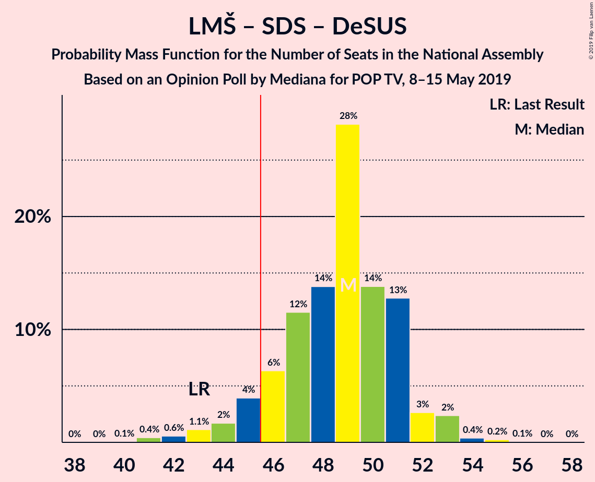
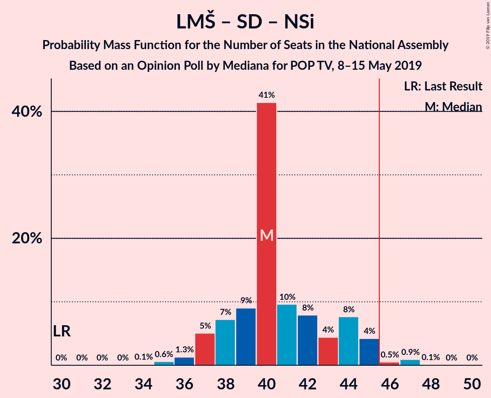
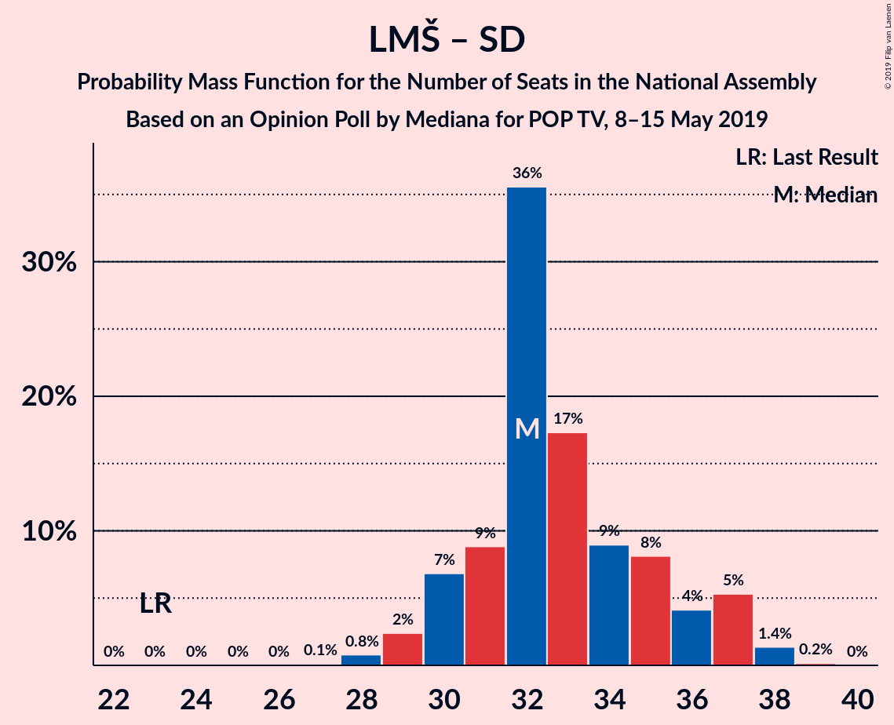
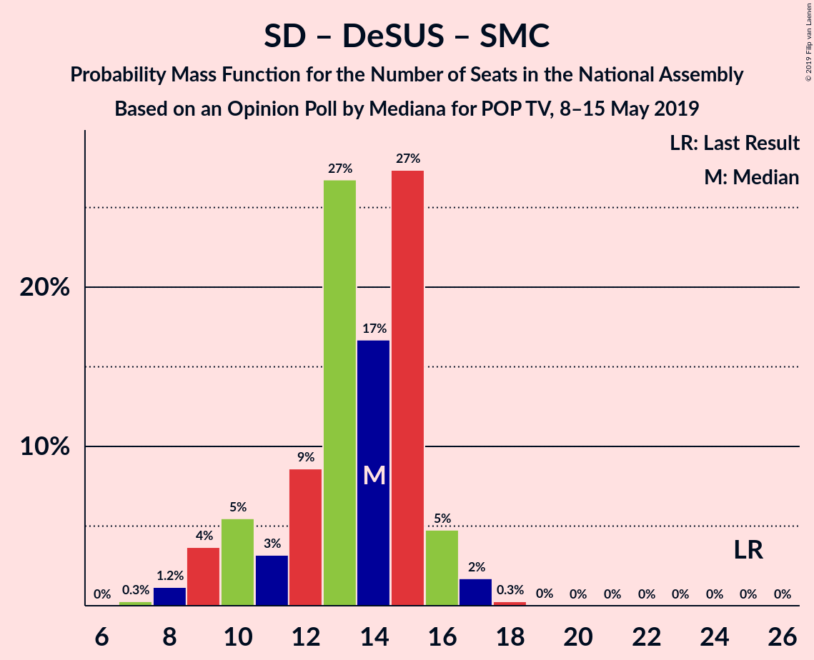

# Opinion Poll by Mediana for POP TV, 8–15 May 2019

<a href="#voting-intentions">Voting Intentions</a> | <a href="#seats">Seats</a> | <a href="#coalitions">Coalitions</a> | <a href="#technical-information">Technical Information</a>

## Voting Intentions

### Confidence Intervals

| Party | Last Result | Poll Result | 80% Confidence Interval | 90% Confidence Interval | 95% Confidence Interval | 99% Confidence Interval |
|:-----:|:-----------:|:-----------:|:-----------------------:|:-----------------------:|:-----------------------:|:-----------------------:|
| Lista Marjana Šarca | 12.6% | 24.0% | 22.1–26.2% |21.6–26.7% |21.1–27.3% |20.2–28.3% |
| Slovenska demokratska stranka | 24.9% | 22.0% | 20.1–24.1% |19.6–24.6% |19.1–25.1% |18.3–26.2% |
| Levica | 9.3% | 12.2% | 10.7–13.8% |10.3–14.3% |10.0–14.7% |9.3–15.6% |
| Socialni demokrati | 9.9% | 10.1% | 8.8–11.7% |8.4–12.1% |8.1–12.5% |7.5–13.3% |
| Nova Slovenija–Krščanski demokrati | 7.2% | 8.1% | 6.9–9.5% |6.6–9.9% |6.3–10.3% |5.8–11.0% |
| Slovenska nacionalna stranka | 4.2% | 5.2% | 4.3–6.4% |4.0–6.8% |3.8–7.1% |3.4–7.7% |
| Demokratična stranka upokojencev Slovenije | 4.9% | 4.6% | 3.8–5.8% |3.5–6.1% |3.3–6.4% |3.0–7.0% |
| Slovenska ljudska stranka | 2.6% | 3.3% | 2.6–4.3% |2.4–4.6% |2.2–4.8% |1.9–5.4% |
| Stranka Alenke Bratušek | 5.1% | 3.1% | 2.5–4.1% |2.3–4.4% |2.1–4.7% |1.8–5.2% |
| Stranka modernega centra | 9.7% | 1.6% | 1.2–2.4% |1.1–2.7% |0.9–2.9% |0.8–3.3% |

*Note:* The poll result column reflects the actual value used in the calculations. Published results may vary slightly, and in addition be rounded to fewer digits.

## Seats

### Confidence Intervals

| Party | Last Result | Median | 80% Confidence Interval | 90% Confidence Interval | 95% Confidence Interval | 99% Confidence Interval |
|:-----:|:-----------:|:------:|:-----------------------:|:-----------------------:|:-----------------------:|:-----------------------:|
| <a href="#lista-marjana-šarca">Lista Marjana Šarca</a> | 13 | 24 | 21–26 |21–26 |21–27 |19–28 |
| <a href="#slovenska-demokratska-stranka">Slovenska demokratska stranka</a> | 25 | 21 | 19–23 |18–24 |18–24 |17–25 |
| <a href="#levica">Levica</a> | 9 | 12 | 10–13 |10–13 |9–14 |9–15 |
| <a href="#socialni-demokrati">Socialni demokrati</a> | 10 | 9 | 8–11 |8–11 |7–12 |7–13 |
| <a href="#nova-slovenija–krščanski-demokrati">Nova Slovenija–Krščanski demokrati</a> | 7 | 7 | 6–9 |5–9 |5–10 |5–10 |
| <a href="#slovenska-nacionalna-stranka">Slovenska nacionalna stranka</a> | 4 | 5 | 3–7 |3–7 |0–7 |0–8 |
| <a href="#demokratična-stranka-upokojencev-slovenije">Demokratična stranka upokojencev Slovenije</a> | 5 | 4 | 0–5 |0–5 |0–6 |0–6 |
| <a href="#slovenska-ljudska-stranka">Slovenska ljudska stranka</a> | 0 | 0 | 0–4 |0–4 |0–4 |0–5 |
| <a href="#stranka-alenke-bratušek">Stranka Alenke Bratušek</a> | 5 | 0 | 0–4 |0–4 |0–4 |0–5 |
| <a href="#stranka-modernega-centra">Stranka modernega centra</a> | 10 | 0 | 0 |0 |0 |0 |

### Lista Marjana Šarca

*For a full overview of the results for this party, see the [Lista Marjana Šarca](party-listamarjanašarca.html) page.*

| Number of Seats | Probability | Accumulated | Special Marks |
|:---------------:|:-----------:|:-----------:|:-------------:|
| 13 | 0% | 100% | Last Result |
| 14 | 0% | 100% |  |
| 15 | 0% | 100% |  |
| 16 | 0% | 100% |  |
| 17 | 0% | 100% |  |
| 18 | 0.1% | 100% |  |
| 19 | 0.4% | 99.9% |  |
| 20 | 1.3% | 99.5% |  |
| 21 | 19% | 98% |  |
| 22 | 9% | 80% |  |
| 23 | 11% | 71% |  |
| 24 | 16% | 59% | Median |
| 25 | 16% | 43% |  |
| 26 | 23% | 27% |  |
| 27 | 4% | 4% |  |
| 28 | 0.2% | 0.6% |  |
| 29 | 0.4% | 0.4% |  |
| 30 | 0% | 0% |  |

### Slovenska demokratska stranka

*For a full overview of the results for this party, see the [Slovenska demokratska stranka](party-slovenskademokratskastranka.html) page.*

| Number of Seats | Probability | Accumulated | Special Marks |
|:---------------:|:-----------:|:-----------:|:-------------:|
| 16 | 0.1% | 100% |  |
| 17 | 0.9% | 99.9% |  |
| 18 | 5% | 99.0% |  |
| 19 | 13% | 94% |  |
| 20 | 20% | 82% |  |
| 21 | 36% | 61% | Median |
| 22 | 6% | 25% |  |
| 23 | 13% | 18% |  |
| 24 | 3% | 5% |  |
| 25 | 2% | 2% | Last Result |
| 26 | 0.1% | 0.1% |  |
| 27 | 0% | 0% |  |

### Levica

*For a full overview of the results for this party, see the [Levica](party-levica.html) page.*

| Number of Seats | Probability | Accumulated | Special Marks |
|:---------------:|:-----------:|:-----------:|:-------------:|
| 8 | 0.3% | 100% |  |
| 9 | 3% | 99.7% | Last Result |
| 10 | 16% | 96% |  |
| 11 | 19% | 80% |  |
| 12 | 38% | 62% | Median |
| 13 | 20% | 23% |  |
| 14 | 2% | 3% |  |
| 15 | 0.5% | 0.8% |  |
| 16 | 0.3% | 0.3% |  |
| 17 | 0% | 0% |  |

### Socialni demokrati

*For a full overview of the results for this party, see the [Socialni demokrati](party-socialnidemokrati.html) page.*

| Number of Seats | Probability | Accumulated | Special Marks |
|:---------------:|:-----------:|:-----------:|:-------------:|
| 6 | 0.2% | 100% |  |
| 7 | 3% | 99.8% |  |
| 8 | 19% | 97% |  |
| 9 | 36% | 77% | Median |
| 10 | 25% | 41% | Last Result |
| 11 | 12% | 16% |  |
| 12 | 3% | 4% |  |
| 13 | 0.4% | 0.6% |  |
| 14 | 0.2% | 0.2% |  |
| 15 | 0% | 0% |  |

### Nova Slovenija–Krščanski demokrati

*For a full overview of the results for this party, see the [Nova Slovenija–Krščanski demokrati](party-novaslovenija–krščanskidemokrati.html) page.*

| Number of Seats | Probability | Accumulated | Special Marks |
|:---------------:|:-----------:|:-----------:|:-------------:|
| 5 | 6% | 100% |  |
| 6 | 6% | 94% |  |
| 7 | 59% | 88% | Last Result, Median |
| 8 | 18% | 29% |  |
| 9 | 8% | 11% |  |
| 10 | 3% | 3% |  |
| 11 | 0.3% | 0.3% |  |
| 12 | 0% | 0% |  |

### Slovenska nacionalna stranka

*For a full overview of the results for this party, see the [Slovenska nacionalna stranka](party-slovenskanacionalnastranka.html) page.*

| Number of Seats | Probability | Accumulated | Special Marks |
|:---------------:|:-----------:|:-----------:|:-------------:|
| 0 | 3% | 100% |  |
| 1 | 0% | 97% |  |
| 2 | 0% | 97% |  |
| 3 | 10% | 97% |  |
| 4 | 35% | 87% | Last Result |
| 5 | 21% | 52% | Median |
| 6 | 20% | 31% |  |
| 7 | 10% | 11% |  |
| 8 | 0.9% | 0.9% |  |
| 9 | 0% | 0% |  |

### Demokratična stranka upokojencev Slovenije

*For a full overview of the results for this party, see the [Demokratična stranka upokojencev Slovenije](party-demokratičnastrankaupokojencevslovenije.html) page.*

| Number of Seats | Probability | Accumulated | Special Marks |
|:---------------:|:-----------:|:-----------:|:-------------:|
| 0 | 24% | 100% |  |
| 1 | 0% | 76% |  |
| 2 | 0% | 76% |  |
| 3 | 0.4% | 76% |  |
| 4 | 41% | 76% | Median |
| 5 | 31% | 35% | Last Result |
| 6 | 3% | 4% |  |
| 7 | 0.4% | 0.4% |  |
| 8 | 0% | 0% |  |

### Slovenska ljudska stranka

*For a full overview of the results for this party, see the [Slovenska ljudska stranka](party-slovenskaljudskastranka.html) page.*

| Number of Seats | Probability | Accumulated | Special Marks |
|:---------------:|:-----------:|:-----------:|:-------------:|
| 0 | 74% | 100% | Last Result, Median |
| 1 | 0% | 26% |  |
| 2 | 0% | 26% |  |
| 3 | 0.1% | 26% |  |
| 4 | 24% | 25% |  |
| 5 | 1.4% | 1.4% |  |
| 6 | 0% | 0% |  |

### Stranka Alenke Bratušek

*For a full overview of the results for this party, see the [Stranka Alenke Bratušek](party-strankaalenkebratušek.html) page.*

| Number of Seats | Probability | Accumulated | Special Marks |
|:---------------:|:-----------:|:-----------:|:-------------:|
| 0 | 79% | 100% | Median |
| 1 | 0% | 21% |  |
| 2 | 0% | 21% |  |
| 3 | 10% | 21% |  |
| 4 | 11% | 11% |  |
| 5 | 0.6% | 0.6% | Last Result |
| 6 | 0% | 0% |  |

### Stranka modernega centra

*For a full overview of the results for this party, see the [Stranka modernega centra](party-strankamodernegacentra.html) page.*

| Number of Seats | Probability | Accumulated | Special Marks |
|:---------------:|:-----------:|:-----------:|:-------------:|
| 0 | 100% | 100% | Median |
| 1 | 0% | 0% |  |
| 2 | 0% | 0% |  |
| 3 | 0% | 0% |  |
| 4 | 0% | 0% |  |
| 5 | 0% | 0% |  |
| 6 | 0% | 0% |  |
| 7 | 0% | 0% |  |
| 8 | 0% | 0% |  |
| 9 | 0% | 0% |  |
| 10 | 0% | 0% | Last Result |

## Coalitions

### Confidence Intervals

| Coalition | Last Result | Median | Majority? | 80% Confidence Interval | 90% Confidence Interval | 95% Confidence Interval | 99% Confidence Interval |
|:---------:|:-----------:|:------:|:---------:|:-----------------------:|:-----------------------:|:-----------------------:|:-----------------------:|
| Lista Marjana Šarca – Slovenska demokratska stranka – Demokratična stranka upokojencev Slovenije | 43 | 49 | 90% | 46–50 | 44–51 | 43–52 | 43–54 |
| Lista Marjana Šarca – Socialni demokrati – Nova Slovenija–Krščanski demokrati – Demokratična stranka upokojencev Slovenije – Stranka Alenke Bratušek – Stranka modernega centra | 50 | 45 | 45% | 42–47 | 42–48 | 40–49 | 39–51 |
| Lista Marjana Šarca – Slovenska demokratska stranka | 38 | 45 | 39% | 42–47 | 41–48 | 41–48 | 39–50 |
| Lista Marjana Šarca – Socialni demokrati – Nova Slovenija–Krščanski demokrati – Demokratična stranka upokojencev Slovenije | 35 | 43 | 24% | 42–47 | 41–48 | 39–48 | 39–51 |
| Lista Marjana Šarca – Socialni demokrati – Nova Slovenija–Krščanski demokrati – Demokratična stranka upokojencev Slovenije – Stranka modernega centra | 45 | 43 | 24% | 42–47 | 41–48 | 39–48 | 39–51 |
| Lista Marjana Šarca – Socialni demokrati – Nova Slovenija–Krščanski demokrati | 30 | 41 | 0.7% | 37–43 | 37–44 | 37–44 | 36–46 |
| Lista Marjana Šarca – Socialni demokrati – Nova Slovenija–Krščanski demokrati – Stranka modernega centra | 40 | 41 | 0.7% | 37–43 | 37–44 | 37–44 | 36–46 |
| Lista Marjana Šarca – Socialni demokrati – Demokratična stranka upokojencev Slovenije | 28 | 36 | 0% | 34–40 | 33–41 | 32–42 | 31–43 |
| Lista Marjana Šarca – Socialni demokrati – Demokratična stranka upokojencev Slovenije – Stranka Alenke Bratušek – Stranka modernega centra | 43 | 37 | 0% | 34–41 | 33–42 | 32–42 | 32–43 |
| Lista Marjana Šarca – Socialni demokrati – Demokratična stranka upokojencev Slovenije – Stranka modernega centra | 38 | 36 | 0% | 34–40 | 33–41 | 32–42 | 31–43 |
| Lista Marjana Šarca – Socialni demokrati | 23 | 33 | 0% | 30–36 | 30–36 | 29–38 | 29–38 |
| Lista Marjana Šarca – Socialni demokrati – Stranka modernega centra | 33 | 33 | 0% | 30–36 | 30–36 | 29–38 | 29–38 |
| Socialni demokrati – Demokratična stranka upokojencev Slovenije – Stranka modernega centra | 25 | 14 | 0% | 9–15 | 9–16 | 9–17 | 8–18 |

### Lista Marjana Šarca – Slovenska demokratska stranka – Demokratična stranka upokojencev Slovenije

| Number of Seats | Probability | Accumulated | Special Marks |
|:---------------:|:-----------:|:-----------:|:-------------:|
| 40 | 0.2% | 100% |  |
| 41 | 0.1% | 99.8% |  |
| 42 | 0.2% | 99.8% |  |
| 43 | 2% | 99.5% | Last Result |
| 44 | 4% | 97% |  |
| 45 | 3% | 93% |  |
| 46 | 12% | 90% | Majority |
| 47 | 16% | 78% |  |
| 48 | 9% | 61% |  |
| 49 | 26% | 52% | Median |
| 50 | 18% | 26% |  |
| 51 | 4% | 8% |  |
| 52 | 2% | 4% |  |
| 53 | 0.2% | 1.2% |  |
| 54 | 0.6% | 1.0% |  |
| 55 | 0.3% | 0.3% |  |
| 56 | 0% | 0% |  |

### Lista Marjana Šarca – Socialni demokrati – Nova Slovenija–Krščanski demokrati – Demokratična stranka upokojencev Slovenije – Stranka Alenke Bratušek – Stranka modernega centra

| Number of Seats | Probability | Accumulated | Special Marks |
|:---------------:|:-----------:|:-----------:|:-------------:|
| 37 | 0.1% | 100% |  |
| 38 | 0.1% | 99.9% |  |
| 39 | 2% | 99.8% |  |
| 40 | 0.5% | 98% |  |
| 41 | 2% | 97% |  |
| 42 | 28% | 96% |  |
| 43 | 7% | 67% |  |
| 44 | 7% | 60% | Median |
| 45 | 8% | 53% |  |
| 46 | 12% | 45% | Majority |
| 47 | 24% | 33% |  |
| 48 | 6% | 9% |  |
| 49 | 3% | 4% |  |
| 50 | 0.2% | 1.0% | Last Result |
| 51 | 0.6% | 0.9% |  |
| 52 | 0.2% | 0.3% |  |
| 53 | 0.1% | 0.1% |  |
| 54 | 0% | 0% |  |

### Lista Marjana Šarca – Slovenska demokratska stranka

| Number of Seats | Probability | Accumulated | Special Marks |
|:---------------:|:-----------:|:-----------:|:-------------:|
| 37 | 0% | 100% |  |
| 38 | 0.1% | 99.9% | Last Result |
| 39 | 0.8% | 99.8% |  |
| 40 | 0.9% | 99.0% |  |
| 41 | 4% | 98% |  |
| 42 | 12% | 94% |  |
| 43 | 8% | 83% |  |
| 44 | 18% | 74% |  |
| 45 | 17% | 56% | Median |
| 46 | 20% | 39% | Majority |
| 47 | 14% | 19% |  |
| 48 | 4% | 5% |  |
| 49 | 0.6% | 1.2% |  |
| 50 | 0.5% | 0.6% |  |
| 51 | 0.1% | 0.1% |  |
| 52 | 0% | 0% |  |

### Lista Marjana Šarca – Socialni demokrati – Nova Slovenija–Krščanski demokrati – Demokratična stranka upokojencev Slovenije

| Number of Seats | Probability | Accumulated | Special Marks |
|:---------------:|:-----------:|:-----------:|:-------------:|
| 35 | 0% | 100% | Last Result |
| 36 | 0% | 100% |  |
| 37 | 0.2% | 100% |  |
| 38 | 0.2% | 99.8% |  |
| 39 | 2% | 99.6% |  |
| 40 | 0.8% | 97% |  |
| 41 | 2% | 96% |  |
| 42 | 30% | 95% |  |
| 43 | 23% | 65% |  |
| 44 | 8% | 42% | Median |
| 45 | 9% | 34% |  |
| 46 | 1.5% | 24% | Majority |
| 47 | 16% | 23% |  |
| 48 | 5% | 7% |  |
| 49 | 1.0% | 2% |  |
| 50 | 0.1% | 1.0% |  |
| 51 | 0.6% | 0.8% |  |
| 52 | 0.2% | 0.3% |  |
| 53 | 0% | 0% |  |

### Lista Marjana Šarca – Socialni demokrati – Nova Slovenija–Krščanski demokrati – Demokratična stranka upokojencev Slovenije – Stranka modernega centra

| Number of Seats | Probability | Accumulated | Special Marks |
|:---------------:|:-----------:|:-----------:|:-------------:|
| 37 | 0.2% | 100% |  |
| 38 | 0.2% | 99.8% |  |
| 39 | 2% | 99.6% |  |
| 40 | 0.8% | 97% |  |
| 41 | 2% | 96% |  |
| 42 | 30% | 95% |  |
| 43 | 23% | 65% |  |
| 44 | 8% | 42% | Median |
| 45 | 9% | 34% | Last Result |
| 46 | 1.5% | 24% | Majority |
| 47 | 16% | 23% |  |
| 48 | 5% | 7% |  |
| 49 | 1.0% | 2% |  |
| 50 | 0.1% | 1.0% |  |
| 51 | 0.6% | 0.8% |  |
| 52 | 0.2% | 0.3% |  |
| 53 | 0% | 0% |  |

### Lista Marjana Šarca – Socialni demokrati – Nova Slovenija–Krščanski demokrati

| Number of Seats | Probability | Accumulated | Special Marks |
|:---------------:|:-----------:|:-----------:|:-------------:|
| 30 | 0% | 100% | Last Result |
| 31 | 0% | 100% |  |
| 32 | 0% | 100% |  |
| 33 | 0% | 100% |  |
| 34 | 0.2% | 100% |  |
| 35 | 0.2% | 99.8% |  |
| 36 | 0.5% | 99.6% |  |
| 37 | 12% | 99.1% |  |
| 38 | 14% | 87% |  |
| 39 | 18% | 72% |  |
| 40 | 3% | 55% | Median |
| 41 | 10% | 52% |  |
| 42 | 14% | 42% |  |
| 43 | 22% | 29% |  |
| 44 | 4% | 6% |  |
| 45 | 2% | 2% |  |
| 46 | 0.4% | 0.7% | Majority |
| 47 | 0.3% | 0.4% |  |
| 48 | 0% | 0% |  |

### Lista Marjana Šarca – Socialni demokrati – Nova Slovenija–Krščanski demokrati – Stranka modernega centra

| Number of Seats | Probability | Accumulated | Special Marks |
|:---------------:|:-----------:|:-----------:|:-------------:|
| 34 | 0.2% | 100% |  |
| 35 | 0.2% | 99.8% |  |
| 36 | 0.5% | 99.6% |  |
| 37 | 12% | 99.1% |  |
| 38 | 14% | 87% |  |
| 39 | 18% | 72% |  |
| 40 | 3% | 55% | Last Result, Median |
| 41 | 10% | 52% |  |
| 42 | 14% | 42% |  |
| 43 | 22% | 29% |  |
| 44 | 4% | 6% |  |
| 45 | 2% | 2% |  |
| 46 | 0.4% | 0.7% | Majority |
| 47 | 0.3% | 0.4% |  |
| 48 | 0% | 0% |  |

### Lista Marjana Šarca – Socialni demokrati – Demokratična stranka upokojencev Slovenije

| Number of Seats | Probability | Accumulated | Special Marks |
|:---------------:|:-----------:|:-----------:|:-------------:|
| 28 | 0% | 100% | Last Result |
| 29 | 0% | 100% |  |
| 30 | 0.2% | 100% |  |
| 31 | 0.6% | 99.7% |  |
| 32 | 3% | 99.1% |  |
| 33 | 4% | 96% |  |
| 34 | 7% | 92% |  |
| 35 | 24% | 85% |  |
| 36 | 22% | 61% |  |
| 37 | 10% | 39% | Median |
| 38 | 4% | 29% |  |
| 39 | 4% | 25% |  |
| 40 | 13% | 22% |  |
| 41 | 5% | 9% |  |
| 42 | 4% | 4% |  |
| 43 | 0.5% | 0.6% |  |
| 44 | 0.1% | 0.1% |  |
| 45 | 0% | 0% |  |

### Lista Marjana Šarca – Socialni demokrati – Demokratična stranka upokojencev Slovenije – Stranka Alenke Bratušek – Stranka modernega centra

| Number of Seats | Probability | Accumulated | Special Marks |
|:---------------:|:-----------:|:-----------:|:-------------:|
| 30 | 0.2% | 100% |  |
| 31 | 0.3% | 99.8% |  |
| 32 | 3% | 99.5% |  |
| 33 | 3% | 96% |  |
| 34 | 7% | 93% |  |
| 35 | 23% | 86% |  |
| 36 | 6% | 63% |  |
| 37 | 9% | 57% | Median |
| 38 | 3% | 48% |  |
| 39 | 14% | 45% |  |
| 40 | 20% | 31% |  |
| 41 | 6% | 11% |  |
| 42 | 5% | 5% |  |
| 43 | 0.7% | 0.9% | Last Result |
| 44 | 0.1% | 0.1% |  |
| 45 | 0% | 0% |  |

### Lista Marjana Šarca – Socialni demokrati – Demokratična stranka upokojencev Slovenije – Stranka modernega centra

| Number of Seats | Probability | Accumulated | Special Marks |
|:---------------:|:-----------:|:-----------:|:-------------:|
| 30 | 0.2% | 100% |  |
| 31 | 0.6% | 99.7% |  |
| 32 | 3% | 99.1% |  |
| 33 | 4% | 96% |  |
| 34 | 7% | 92% |  |
| 35 | 24% | 85% |  |
| 36 | 22% | 61% |  |
| 37 | 10% | 39% | Median |
| 38 | 4% | 29% | Last Result |
| 39 | 4% | 25% |  |
| 40 | 13% | 22% |  |
| 41 | 5% | 9% |  |
| 42 | 4% | 4% |  |
| 43 | 0.5% | 0.6% |  |
| 44 | 0.1% | 0.1% |  |
| 45 | 0% | 0% |  |

### Lista Marjana Šarca – Socialni demokrati

| Number of Seats | Probability | Accumulated | Special Marks |
|:---------------:|:-----------:|:-----------:|:-------------:|
| 23 | 0% | 100% | Last Result |
| 24 | 0% | 100% |  |
| 25 | 0% | 100% |  |
| 26 | 0% | 100% |  |
| 27 | 0.1% | 100% |  |
| 28 | 0.3% | 99.8% |  |
| 29 | 3% | 99.6% |  |
| 30 | 15% | 97% |  |
| 31 | 10% | 82% |  |
| 32 | 16% | 72% |  |
| 33 | 11% | 56% | Median |
| 34 | 10% | 45% |  |
| 35 | 12% | 35% |  |
| 36 | 19% | 23% |  |
| 37 | 0.7% | 4% |  |
| 38 | 4% | 4% |  |
| 39 | 0.1% | 0.1% |  |
| 40 | 0.1% | 0.1% |  |
| 41 | 0% | 0% |  |

### Lista Marjana Šarca – Socialni demokrati – Stranka modernega centra

| Number of Seats | Probability | Accumulated | Special Marks |
|:---------------:|:-----------:|:-----------:|:-------------:|
| 27 | 0.1% | 100% |  |
| 28 | 0.3% | 99.8% |  |
| 29 | 3% | 99.6% |  |
| 30 | 15% | 97% |  |
| 31 | 10% | 82% |  |
| 32 | 16% | 72% |  |
| 33 | 11% | 56% | Last Result, Median |
| 34 | 10% | 45% |  |
| 35 | 12% | 35% |  |
| 36 | 19% | 23% |  |
| 37 | 0.7% | 4% |  |
| 38 | 4% | 4% |  |
| 39 | 0.1% | 0.1% |  |
| 40 | 0.1% | 0.1% |  |
| 41 | 0% | 0% |  |

### Socialni demokrati – Demokratična stranka upokojencev Slovenije – Stranka modernega centra

| Number of Seats | Probability | Accumulated | Special Marks |
|:---------------:|:-----------:|:-----------:|:-------------:|
| 7 | 0.3% | 100% |  |
| 8 | 1.0% | 99.7% |  |
| 9 | 17% | 98.7% |  |
| 10 | 1.0% | 82% |  |
| 11 | 7% | 81% |  |
| 12 | 15% | 74% |  |
| 13 | 4% | 58% | Median |
| 14 | 35% | 54% |  |
| 15 | 11% | 19% |  |
| 16 | 5% | 8% |  |
| 17 | 2% | 3% |  |
| 18 | 0.3% | 0.6% |  |
| 19 | 0.2% | 0.3% |  |
| 20 | 0.1% | 0.1% |  |
| 21 | 0% | 0% |  |
| 22 | 0% | 0% |  |
| 23 | 0% | 0% |  |
| 24 | 0% | 0% |  |
| 25 | 0% | 0% | Last Result |

## Technical Information

### Opinion Poll

+ **Polling firm:** Mediana
+ **Commissioner(s):** POP TV
+ **Fieldwork period:** 8–15 May 2019

### Calculations

+ **Sample size:** 732
+ **Simulations done:** 131,072
+ **Error estimate:** 1.49%

