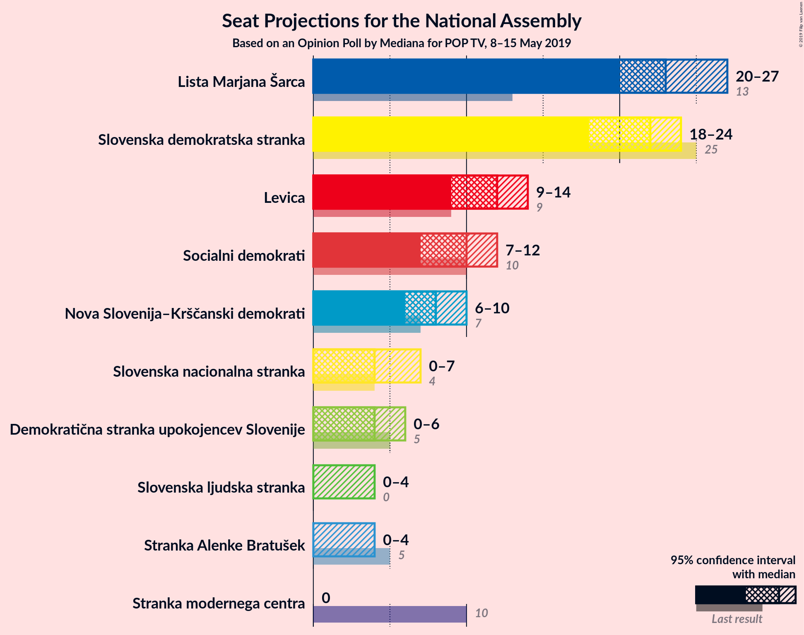
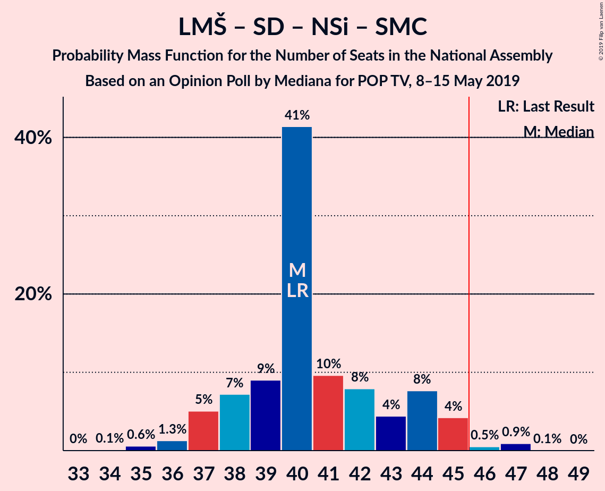
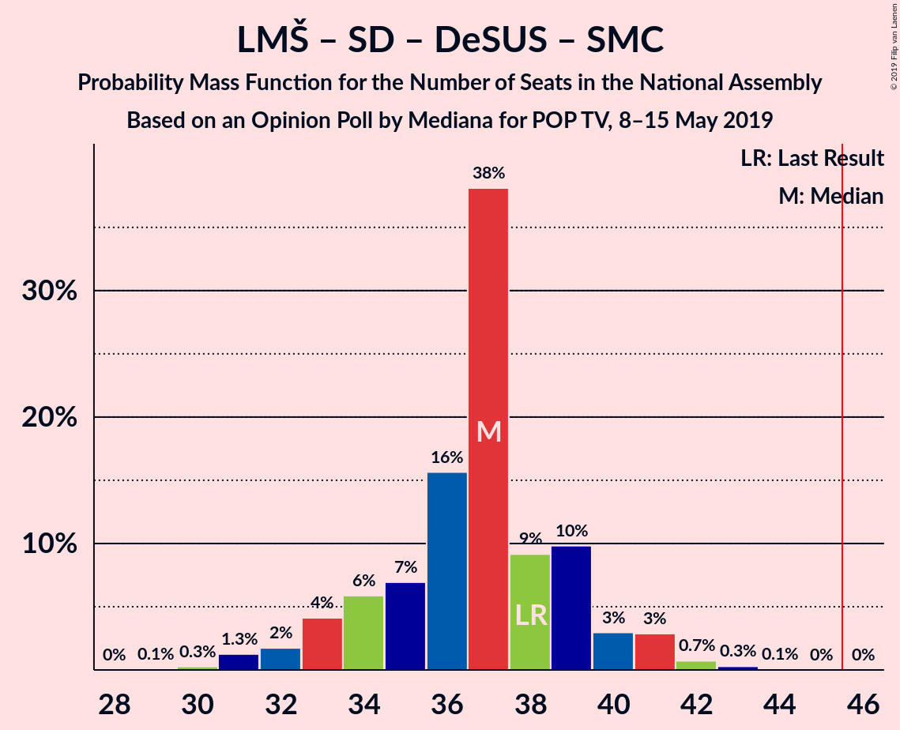

# Opinion Poll by Mediana for POP TV, 8–15 May 2019

<a href="#voting-intentions">Voting Intentions</a> | <a href="#seats">Seats</a> | <a href="#coalitions">Coalitions</a> | <a href="#technical-information">Technical Information</a>

## Voting Intentions

### Confidence Intervals

| Party | Last Result | Poll Result | 80% Confidence Interval | 90% Confidence Interval | 95% Confidence Interval | 99% Confidence Interval |
|:-----:|:-----------:|:-----------:|:-----------------------:|:-----------------------:|:-----------------------:|:-----------------------:|
| Lista Marjana Šarca | 12.6% | 24.0% | 22.1–26.2% |21.6–26.7% |21.1–27.3% |20.2–28.3% |
| Slovenska demokratska stranka | 24.9% | 22.0% | 20.1–24.1% |19.6–24.6% |19.1–25.1% |18.3–26.2% |
| Levica | 9.3% | 12.2% | 10.7–13.8% |10.3–14.3% |10.0–14.7% |9.3–15.6% |
| Socialni demokrati | 9.9% | 10.1% | 8.8–11.7% |8.4–12.1% |8.1–12.5% |7.5–13.3% |
| Nova Slovenija–Krščanski demokrati | 7.2% | 8.1% | 6.9–9.5% |6.6–9.9% |6.3–10.3% |5.8–11.0% |
| Slovenska nacionalna stranka | 4.2% | 5.2% | 4.3–6.4% |4.0–6.8% |3.8–7.1% |3.4–7.7% |
| Demokratična stranka upokojencev Slovenije | 4.9% | 4.6% | 3.8–5.8% |3.5–6.1% |3.3–6.4% |3.0–7.0% |
| Slovenska ljudska stranka | 2.6% | 3.3% | 2.6–4.3% |2.4–4.6% |2.2–4.8% |1.9–5.4% |
| Stranka Alenke Bratušek | 5.1% | 3.1% | 2.5–4.1% |2.3–4.4% |2.1–4.7% |1.8–5.2% |
| Stranka modernega centra | 9.7% | 1.6% | 1.2–2.4% |1.1–2.7% |0.9–2.9% |0.8–3.3% |

*Note:* The poll result column reflects the actual value used in the calculations. Published results may vary slightly, and in addition be rounded to fewer digits.

## Seats

### Confidence Intervals

| Party | Last Result | Median | 80% Confidence Interval | 90% Confidence Interval | 95% Confidence Interval | 99% Confidence Interval |
|:-----:|:-----------:|:------:|:-----------------------:|:-----------------------:|:-----------------------:|:-----------------------:|
| <a href="#lista-marjana-šarca">Lista Marjana Šarca</a> | 13 | 28 | 22–28 |22–28 |22–28 |18–28 |
| <a href="#slovenska-demokratska-stranka">Slovenska demokratska stranka</a> | 25 | 23 | 20–24 |20–26 |20–26 |19–27 |
| <a href="#levica">Levica</a> | 9 | 13 | 10–13 |10–13 |10–13 |8–13 |
| <a href="#socialni-demokrati">Socialni demokrati</a> | 10 | 10 | 7–10 |7–10 |6–10 |6–10 |
| <a href="#nova-slovenija–krščanski-demokrati">Nova Slovenija–Krščanski demokrati</a> | 7 | 5 | 5–7 |5–8 |5–8 |5–9 |
| <a href="#slovenska-nacionalna-stranka">Slovenska nacionalna stranka</a> | 4 | 5 | 5 |0–5 |0–6 |0–6 |
| <a href="#demokratična-stranka-upokojencev-slovenije">Demokratična stranka upokojencev Slovenije</a> | 5 | 0 | 0–5 |0–5 |0–6 |0–6 |
| <a href="#slovenska-ljudska-stranka">Slovenska ljudska stranka</a> | 0 | 0 | 0 |0 |0 |0 |
| <a href="#stranka-alenke-bratušek">Stranka Alenke Bratušek</a> | 5 | 0 | 0–4 |0–4 |0–4 |0–4 |
| <a href="#stranka-modernega-centra">Stranka modernega centra</a> | 10 | 0 | 0 |0 |0 |0 |

### Lista Marjana Šarca

*For a full overview of the results for this party, see the [Lista Marjana Šarca](party-listamarjanašarca.html) page.*

| Number of Seats | Probability | Accumulated | Special Marks |
|:---------------:|:-----------:|:-----------:|:-------------:|
| 13 | 0% | 100% | Last Result |
| 14 | 0% | 100% |  |
| 15 | 0% | 100% |  |
| 16 | 0% | 100% |  |
| 17 | 0% | 100% |  |
| 18 | 2% | 100% |  |
| 19 | 0% | 98% |  |
| 20 | 0.1% | 98% |  |
| 21 | 0.1% | 98% |  |
| 22 | 19% | 98% |  |
| 23 | 0% | 79% |  |
| 24 | 0.1% | 79% |  |
| 25 | 0% | 79% |  |
| 26 | 28% | 79% |  |
| 27 | 0.1% | 51% |  |
| 28 | 51% | 51% | Median |
| 29 | 0% | 0% |  |

### Slovenska demokratska stranka

*For a full overview of the results for this party, see the [Slovenska demokratska stranka](party-slovenskademokratskastranka.html) page.*

| Number of Seats | Probability | Accumulated | Special Marks |
|:---------------:|:-----------:|:-----------:|:-------------:|
| 15 | 0.1% | 100% |  |
| 16 | 0% | 99.9% |  |
| 17 | 0% | 99.9% |  |
| 18 | 0.3% | 99.8% |  |
| 19 | 0.4% | 99.5% |  |
| 20 | 35% | 99.1% |  |
| 21 | 0% | 64% |  |
| 22 | 0.1% | 64% |  |
| 23 | 53% | 64% | Median |
| 24 | 3% | 11% |  |
| 25 | 0% | 8% | Last Result |
| 26 | 7% | 8% |  |
| 27 | 1.5% | 1.5% |  |
| 28 | 0% | 0% |  |

### Levica

*For a full overview of the results for this party, see the [Levica](party-levica.html) page.*

| Number of Seats | Probability | Accumulated | Special Marks |
|:---------------:|:-----------:|:-----------:|:-------------:|
| 8 | 1.5% | 100% |  |
| 9 | 0% | 98.5% | Last Result |
| 10 | 28% | 98% |  |
| 11 | 9% | 70% |  |
| 12 | 8% | 61% |  |
| 13 | 53% | 53% | Median |
| 14 | 0% | 0.1% |  |
| 15 | 0% | 0.1% |  |
| 16 | 0% | 0.1% |  |
| 17 | 0% | 0% |  |

### Socialni demokrati

*For a full overview of the results for this party, see the [Socialni demokrati](party-socialnidemokrati.html) page.*

| Number of Seats | Probability | Accumulated | Special Marks |
|:---------------:|:-----------:|:-----------:|:-------------:|
| 6 | 3% | 100% |  |
| 7 | 28% | 97% |  |
| 8 | 7% | 70% |  |
| 9 | 3% | 63% |  |
| 10 | 60% | 60% | Last Result, Median |
| 11 | 0.2% | 0.2% |  |
| 12 | 0% | 0% |  |

### Nova Slovenija–Krščanski demokrati

*For a full overview of the results for this party, see the [Nova Slovenija–Krščanski demokrati](party-novaslovenija–krščanskidemokrati.html) page.*

| Number of Seats | Probability | Accumulated | Special Marks |
|:---------------:|:-----------:|:-----------:|:-------------:|
| 5 | 51% | 100% | Median |
| 6 | 31% | 49% |  |
| 7 | 10% | 19% | Last Result |
| 8 | 7% | 9% |  |
| 9 | 2% | 2% |  |
| 10 | 0.5% | 0.5% |  |
| 11 | 0% | 0% |  |

### Slovenska nacionalna stranka

*For a full overview of the results for this party, see the [Slovenska nacionalna stranka](party-slovenskanacionalnastranka.html) page.*

| Number of Seats | Probability | Accumulated | Special Marks |
|:---------------:|:-----------:|:-----------:|:-------------:|
| 0 | 7% | 100% |  |
| 1 | 0% | 93% |  |
| 2 | 0% | 93% |  |
| 3 | 0.1% | 93% |  |
| 4 | 0.7% | 93% | Last Result |
| 5 | 89% | 92% | Median |
| 6 | 4% | 4% |  |
| 7 | 0.1% | 0.1% |  |
| 8 | 0% | 0% |  |

### Demokratična stranka upokojencev Slovenije

*For a full overview of the results for this party, see the [Demokratična stranka upokojencev Slovenije](party-demokratičnastrankaupokojencevslovenije.html) page.*

| Number of Seats | Probability | Accumulated | Special Marks |
|:---------------:|:-----------:|:-----------:|:-------------:|
| 0 | 53% | 100% | Median |
| 1 | 0% | 47% |  |
| 2 | 0% | 47% |  |
| 3 | 0% | 47% |  |
| 4 | 35% | 47% |  |
| 5 | 10% | 12% | Last Result |
| 6 | 2% | 3% |  |
| 7 | 0.4% | 0.4% |  |
| 8 | 0% | 0% |  |

### Slovenska ljudska stranka

*For a full overview of the results for this party, see the [Slovenska ljudska stranka](party-slovenskaljudskastranka.html) page.*

| Number of Seats | Probability | Accumulated | Special Marks |
|:---------------:|:-----------:|:-----------:|:-------------:|
| 0 | 99.7% | 100% | Last Result, Median |
| 1 | 0% | 0.3% |  |
| 2 | 0% | 0.3% |  |
| 3 | 0% | 0.3% |  |
| 4 | 0.2% | 0.3% |  |
| 5 | 0% | 0.1% |  |
| 6 | 0.1% | 0.1% |  |
| 7 | 0% | 0% |  |

### Stranka Alenke Bratušek

*For a full overview of the results for this party, see the [Stranka Alenke Bratušek](party-strankaalenkebratušek.html) page.*

| Number of Seats | Probability | Accumulated | Special Marks |
|:---------------:|:-----------:|:-----------:|:-------------:|
| 0 | 69% | 100% | Median |
| 1 | 0% | 31% |  |
| 2 | 0% | 31% |  |
| 3 | 0% | 31% |  |
| 4 | 31% | 31% |  |
| 5 | 0.2% | 0.2% | Last Result |
| 6 | 0.1% | 0.1% |  |
| 7 | 0% | 0% |  |

### Stranka modernega centra

*For a full overview of the results for this party, see the [Stranka modernega centra](party-strankamodernegacentra.html) page.*

| Number of Seats | Probability | Accumulated | Special Marks |
|:---------------:|:-----------:|:-----------:|:-------------:|
| 0 | 100% | 100% | Median |
| 1 | 0% | 0% |  |
| 2 | 0% | 0% |  |
| 3 | 0% | 0% |  |
| 4 | 0% | 0% |  |
| 5 | 0% | 0% |  |
| 6 | 0% | 0% |  |
| 7 | 0% | 0% |  |
| 8 | 0% | 0% |  |
| 9 | 0% | 0% |  |
| 10 | 0% | 0% | Last Result |

## Coalitions

### Confidence Intervals

| Coalition | Last Result | Median | Majority? | 80% Confidence Interval | 90% Confidence Interval | 95% Confidence Interval | 99% Confidence Interval |
|:---------:|:-----------:|:------:|:---------:|:-----------------------:|:-----------------------:|:-----------------------:|:-----------------------:|
| Lista Marjana Šarca – Slovenska demokratska stranka – Demokratična stranka upokojencev Slovenije | 43 | 51 | 99.3% | 47–51 | 46–53 | 46–53 | 45–53 |
| Lista Marjana Šarca – Slovenska demokratska stranka | 38 | 51 | 89% | 42–51 | 42–51 | 41–51 | 40–51 |
| Lista Marjana Šarca – Socialni demokrati – Nova Slovenija–Krščanski demokrati – Demokratična stranka upokojencev Slovenije – Stranka Alenke Bratušek – Stranka modernega centra | 50 | 43 | 28% | 43–47 | 43–47 | 41–47 | 40–47 |
| Lista Marjana Šarca – Socialni demokrati – Nova Slovenija–Krščanski demokrati – Demokratična stranka upokojencev Slovenije | 35 | 43 | 0.6% | 43 | 40–43 | 39–43 | 39–47 |
| Lista Marjana Šarca – Socialni demokrati – Nova Slovenija–Krščanski demokrati – Demokratična stranka upokojencev Slovenije – Stranka modernega centra | 45 | 43 | 0.6% | 43 | 40–43 | 39–43 | 39–47 |
| Lista Marjana Šarca – Socialni demokrati – Nova Slovenija–Krščanski demokrati | 30 | 43 | 0.1% | 38–43 | 38–43 | 34–43 | 34–43 |
| Lista Marjana Šarca – Socialni demokrati – Nova Slovenija–Krščanski demokrati – Stranka modernega centra | 40 | 43 | 0.1% | 38–43 | 38–43 | 34–43 | 34–43 |
| Lista Marjana Šarca – Socialni demokrati – Demokratična stranka upokojencev Slovenije – Stranka Alenke Bratušek – Stranka modernega centra | 43 | 38 | 0% | 35–41 | 35–41 | 33–41 | 32–41 |
| Lista Marjana Šarca – Socialni demokrati – Demokratična stranka upokojencev Slovenije | 28 | 38 | 0% | 35–38 | 33–38 | 33–38 | 32–38 |
| Lista Marjana Šarca – Socialni demokrati – Demokratična stranka upokojencev Slovenije – Stranka modernega centra | 38 | 38 | 0% | 35–38 | 33–38 | 33–38 | 32–38 |
| Lista Marjana Šarca – Socialni demokrati | 23 | 38 | 0% | 30–38 | 30–38 | 28–38 | 27–38 |
| Lista Marjana Šarca – Socialni demokrati – Stranka modernega centra | 33 | 38 | 0% | 30–38 | 30–38 | 28–38 | 27–38 |
| Socialni demokrati – Demokratična stranka upokojencev Slovenije – Stranka modernega centra | 25 | 10 | 0% | 10–14 | 10–14 | 10–15 | 10–15 |

### Lista Marjana Šarca – Slovenska demokratska stranka – Demokratična stranka upokojencev Slovenije

| Number of Seats | Probability | Accumulated | Special Marks |
|:---------------:|:-----------:|:-----------:|:-------------:|
| 42 | 0.2% | 100% |  |
| 43 | 0% | 99.8% | Last Result |
| 44 | 0% | 99.8% |  |
| 45 | 0.4% | 99.7% |  |
| 46 | 8% | 99.3% | Majority |
| 47 | 2% | 92% |  |
| 48 | 0.4% | 90% |  |
| 49 | 2% | 89% |  |
| 50 | 28% | 88% |  |
| 51 | 54% | 60% | Median |
| 52 | 0% | 7% |  |
| 53 | 7% | 7% |  |
| 54 | 0% | 0% |  |

### Lista Marjana Šarca – Slovenska demokratska stranka

| Number of Seats | Probability | Accumulated | Special Marks |
|:---------------:|:-----------:|:-----------:|:-------------:|
| 38 | 0% | 100% | Last Result |
| 39 | 0.1% | 99.9% |  |
| 40 | 0.4% | 99.9% |  |
| 41 | 2% | 99.5% |  |
| 42 | 8% | 97% |  |
| 43 | 0% | 89% |  |
| 44 | 0% | 89% |  |
| 45 | 0.1% | 89% |  |
| 46 | 30% | 89% | Majority |
| 47 | 0% | 59% |  |
| 48 | 7% | 59% |  |
| 49 | 1.5% | 52% |  |
| 50 | 0% | 51% |  |
| 51 | 51% | 51% | Median |
| 52 | 0% | 0% |  |

### Lista Marjana Šarca – Socialni demokrati – Nova Slovenija–Krščanski demokrati – Demokratična stranka upokojencev Slovenije – Stranka Alenke Bratušek – Stranka modernega centra

| Number of Seats | Probability | Accumulated | Special Marks |
|:---------------:|:-----------:|:-----------:|:-------------:|
| 40 | 2% | 100% |  |
| 41 | 1.5% | 98% |  |
| 42 | 0% | 96% |  |
| 43 | 68% | 96% | Median |
| 44 | 0.2% | 29% |  |
| 45 | 0.1% | 29% |  |
| 46 | 0.1% | 28% | Majority |
| 47 | 28% | 28% |  |
| 48 | 0.3% | 0.4% |  |
| 49 | 0.1% | 0.1% |  |
| 50 | 0% | 0.1% | Last Result |
| 51 | 0% | 0% |  |

### Lista Marjana Šarca – Socialni demokrati – Nova Slovenija–Krščanski demokrati – Demokratična stranka upokojencev Slovenije

| Number of Seats | Probability | Accumulated | Special Marks |
|:---------------:|:-----------:|:-----------:|:-------------:|
| 35 | 0% | 100% | Last Result |
| 36 | 0% | 100% |  |
| 37 | 0% | 100% |  |
| 38 | 0% | 100% |  |
| 39 | 3% | 100% |  |
| 40 | 2% | 97% |  |
| 41 | 1.5% | 95% |  |
| 42 | 0.1% | 93% |  |
| 43 | 92% | 93% | Median |
| 44 | 0.3% | 1.0% |  |
| 45 | 0.1% | 0.6% |  |
| 46 | 0% | 0.6% | Majority |
| 47 | 0.4% | 0.5% |  |
| 48 | 0% | 0.1% |  |
| 49 | 0% | 0.1% |  |
| 50 | 0% | 0% |  |

### Lista Marjana Šarca – Socialni demokrati – Nova Slovenija–Krščanski demokrati – Demokratična stranka upokojencev Slovenije – Stranka modernega centra

| Number of Seats | Probability | Accumulated | Special Marks |
|:---------------:|:-----------:|:-----------:|:-------------:|
| 39 | 3% | 100% |  |
| 40 | 2% | 97% |  |
| 41 | 1.5% | 95% |  |
| 42 | 0.1% | 93% |  |
| 43 | 92% | 93% | Median |
| 44 | 0.3% | 1.0% |  |
| 45 | 0.1% | 0.6% | Last Result |
| 46 | 0% | 0.6% | Majority |
| 47 | 0.4% | 0.5% |  |
| 48 | 0% | 0.1% |  |
| 49 | 0% | 0.1% |  |
| 50 | 0% | 0% |  |

### Lista Marjana Šarca – Socialni demokrati – Nova Slovenija–Krščanski demokrati

| Number of Seats | Probability | Accumulated | Special Marks |
|:---------------:|:-----------:|:-----------:|:-------------:|
| 30 | 0% | 100% | Last Result |
| 31 | 0% | 100% |  |
| 32 | 0% | 100% |  |
| 33 | 0% | 100% |  |
| 34 | 5% | 100% |  |
| 35 | 0% | 95% |  |
| 36 | 0.1% | 95% |  |
| 37 | 0% | 95% |  |
| 38 | 7% | 95% |  |
| 39 | 36% | 89% |  |
| 40 | 0.4% | 53% |  |
| 41 | 2% | 53% |  |
| 42 | 0% | 51% |  |
| 43 | 51% | 51% | Median |
| 44 | 0% | 0.1% |  |
| 45 | 0% | 0.1% |  |
| 46 | 0% | 0.1% | Majority |
| 47 | 0% | 0% |  |

### Lista Marjana Šarca – Socialni demokrati – Nova Slovenija–Krščanski demokrati – Stranka modernega centra

| Number of Seats | Probability | Accumulated | Special Marks |
|:---------------:|:-----------:|:-----------:|:-------------:|
| 34 | 5% | 100% |  |
| 35 | 0% | 95% |  |
| 36 | 0.1% | 95% |  |
| 37 | 0% | 95% |  |
| 38 | 7% | 95% |  |
| 39 | 36% | 89% |  |
| 40 | 0.4% | 53% | Last Result |
| 41 | 2% | 53% |  |
| 42 | 0% | 51% |  |
| 43 | 51% | 51% | Median |
| 44 | 0% | 0.1% |  |
| 45 | 0% | 0.1% |  |
| 46 | 0% | 0.1% | Majority |
| 47 | 0% | 0% |  |

### Lista Marjana Šarca – Socialni demokrati – Demokratična stranka upokojencev Slovenije – Stranka Alenke Bratušek – Stranka modernega centra

| Number of Seats | Probability | Accumulated | Special Marks |
|:---------------:|:-----------:|:-----------:|:-------------:|
| 32 | 1.5% | 100% |  |
| 33 | 2% | 98% |  |
| 34 | 0% | 96% |  |
| 35 | 7% | 96% |  |
| 36 | 8% | 90% |  |
| 37 | 3% | 82% |  |
| 38 | 51% | 79% | Median |
| 39 | 0% | 28% |  |
| 40 | 0.3% | 28% |  |
| 41 | 28% | 28% |  |
| 42 | 0.1% | 0.1% |  |
| 43 | 0% | 0% | Last Result |

### Lista Marjana Šarca – Socialni demokrati – Demokratična stranka upokojencev Slovenije

| Number of Seats | Probability | Accumulated | Special Marks |
|:---------------:|:-----------:|:-----------:|:-------------:|
| 28 | 0% | 100% | Last Result |
| 29 | 0% | 100% |  |
| 30 | 0% | 100% |  |
| 31 | 0% | 100% |  |
| 32 | 1.5% | 100% |  |
| 33 | 5% | 98% |  |
| 34 | 0.1% | 94% |  |
| 35 | 7% | 93% |  |
| 36 | 8% | 87% |  |
| 37 | 28% | 79% |  |
| 38 | 51% | 51% | Median |
| 39 | 0% | 0.1% |  |
| 40 | 0% | 0.1% |  |
| 41 | 0% | 0.1% |  |
| 42 | 0% | 0% |  |

### Lista Marjana Šarca – Socialni demokrati – Demokratična stranka upokojencev Slovenije – Stranka modernega centra

| Number of Seats | Probability | Accumulated | Special Marks |
|:---------------:|:-----------:|:-----------:|:-------------:|
| 32 | 1.5% | 100% |  |
| 33 | 5% | 98% |  |
| 34 | 0.1% | 94% |  |
| 35 | 7% | 93% |  |
| 36 | 8% | 87% |  |
| 37 | 28% | 79% |  |
| 38 | 51% | 51% | Last Result, Median |
| 39 | 0% | 0.1% |  |
| 40 | 0% | 0.1% |  |
| 41 | 0% | 0.1% |  |
| 42 | 0% | 0% |  |

### Lista Marjana Šarca – Socialni demokrati

| Number of Seats | Probability | Accumulated | Special Marks |
|:---------------:|:-----------:|:-----------:|:-------------:|
| 23 | 0% | 100% | Last Result |
| 24 | 0% | 100% |  |
| 25 | 0% | 100% |  |
| 26 | 0% | 100% |  |
| 27 | 2% | 100% |  |
| 28 | 3% | 98% |  |
| 29 | 0% | 95% |  |
| 30 | 7% | 95% |  |
| 31 | 0.3% | 88% |  |
| 32 | 9% | 88% |  |
| 33 | 28% | 79% |  |
| 34 | 0% | 51% |  |
| 35 | 0% | 51% |  |
| 36 | 0% | 51% |  |
| 37 | 0% | 51% |  |
| 38 | 51% | 51% | Median |
| 39 | 0% | 0% |  |

### Lista Marjana Šarca – Socialni demokrati – Stranka modernega centra

| Number of Seats | Probability | Accumulated | Special Marks |
|:---------------:|:-----------:|:-----------:|:-------------:|
| 27 | 2% | 100% |  |
| 28 | 3% | 98% |  |
| 29 | 0% | 95% |  |
| 30 | 7% | 95% |  |
| 31 | 0.3% | 88% |  |
| 32 | 9% | 88% |  |
| 33 | 28% | 79% | Last Result |
| 34 | 0% | 51% |  |
| 35 | 0% | 51% |  |
| 36 | 0% | 51% |  |
| 37 | 0% | 51% |  |
| 38 | 51% | 51% | Median |
| 39 | 0% | 0% |  |

### Socialni demokrati – Demokratična stranka upokojencev Slovenije – Stranka modernega centra

| Number of Seats | Probability | Accumulated | Special Marks |
|:---------------:|:-----------:|:-----------:|:-------------:|
| 9 | 0.1% | 100% |  |
| 10 | 52% | 99.9% | Median |
| 11 | 30% | 48% |  |
| 12 | 0% | 17% |  |
| 13 | 7% | 17% |  |
| 14 | 8% | 11% |  |
| 15 | 3% | 3% |  |
| 16 | 0% | 0.1% |  |
| 17 | 0% | 0% |  |
| 18 | 0% | 0% |  |
| 19 | 0% | 0% |  |
| 20 | 0% | 0% |  |
| 21 | 0% | 0% |  |
| 22 | 0% | 0% |  |
| 23 | 0% | 0% |  |
| 24 | 0% | 0% |  |
| 25 | 0% | 0% | Last Result |

## Technical Information

### Opinion Poll

+ **Polling firm:** Mediana
+ **Commissioner(s):** POP TV
+ **Fieldwork period:** 8–15 May 2019

### Calculations

+ **Sample size:** 732
+ **Simulations done:** 1,024
+ **Error estimate:** 6.19%

