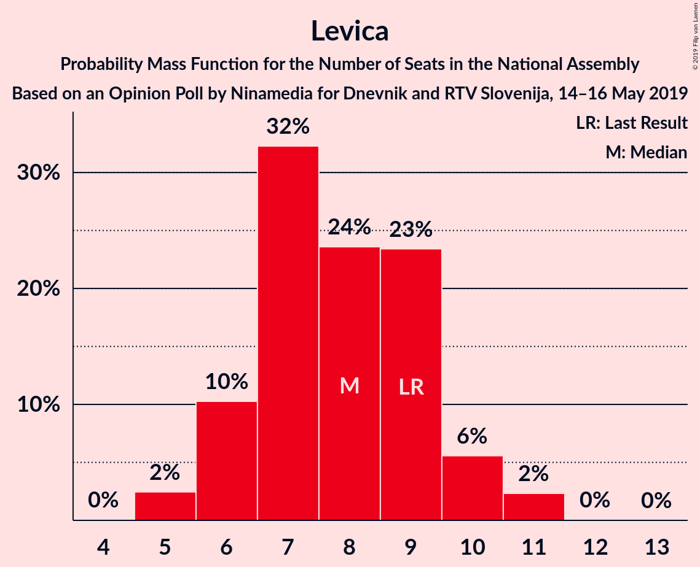
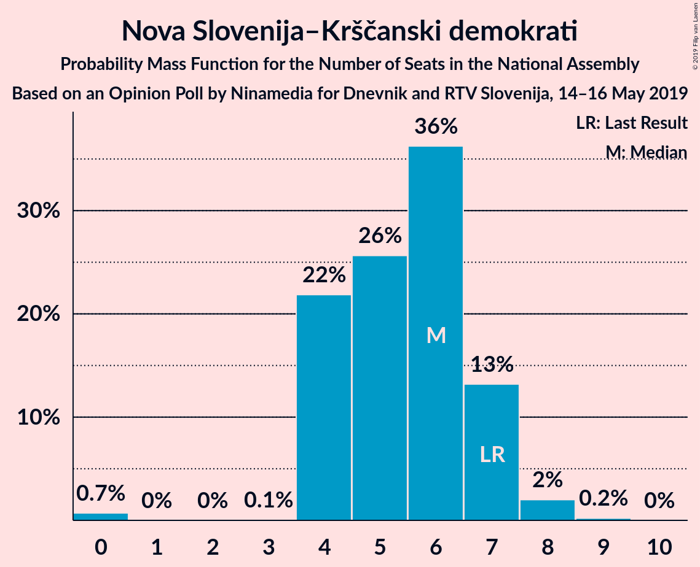
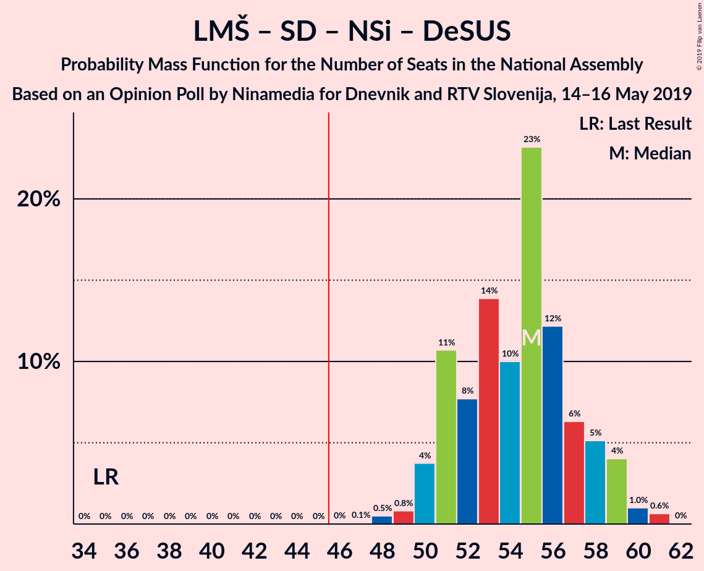
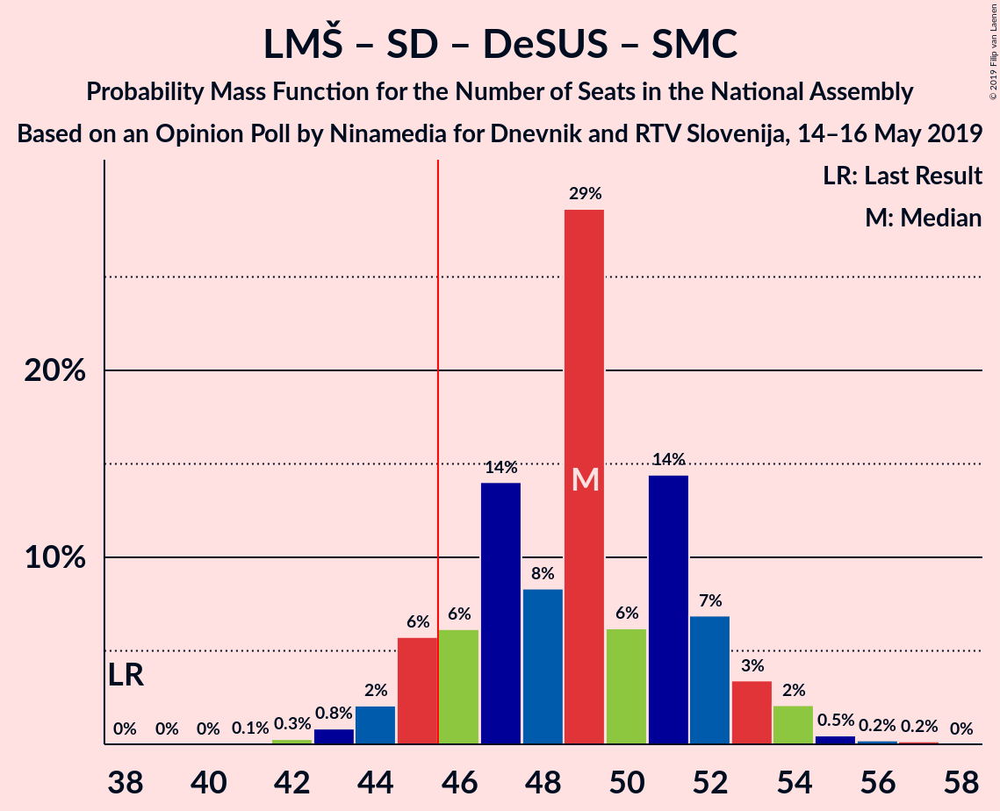
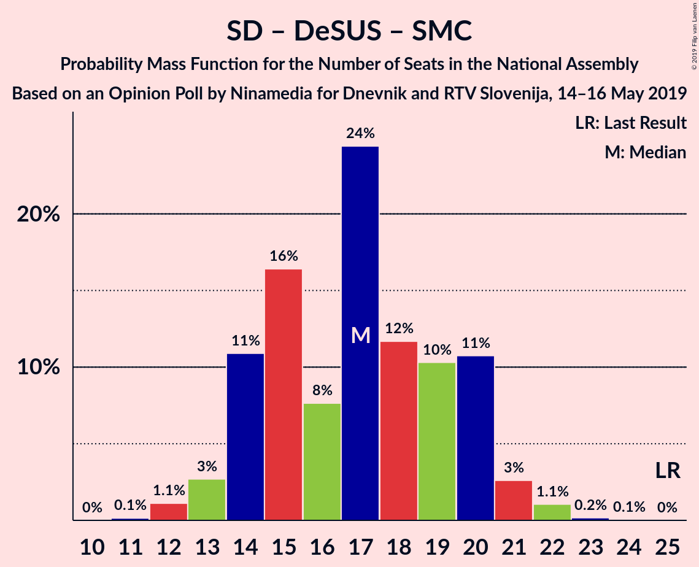

# Opinion Poll by Ninamedia for Dnevnik and RTV Slovenija, 14–16 May 2019

<a href="#voting-intentions">Voting Intentions</a> | <a href="#seats">Seats</a> | <a href="#coalitions">Coalitions</a> | <a href="#technical-information">Technical Information</a>

## Voting Intentions

### Confidence Intervals

| Party | Last Result | Poll Result | 80% Confidence Interval | 90% Confidence Interval | 95% Confidence Interval | 99% Confidence Interval |
|:-----:|:-----------:|:-----------:|:-----------------------:|:-----------------------:|:-----------------------:|:-----------------------:|
| Lista Marjana Šarca | 12.6% | 32.0% | 29.8–34.3% |29.2–35.0% |28.6–35.6% |27.6–36.7% |
| Slovenska demokratska stranka | 24.9% | 24.0% | 22.0–26.2% |21.5–26.8% |21.0–27.3% |20.1–28.4% |
| Socialni demokrati | 9.9% | 15.0% | 13.4–16.9% |12.9–17.4% |12.5–17.8% |11.8–18.8% |
| Levica | 9.3% | 8.0% | 6.8–9.5% |6.5–9.9% |6.2–10.3% |5.7–11.0% |
| Nova Slovenija–Krščanski demokrati | 7.2% | 6.0% | 5.0–7.3% |4.7–7.7% |4.5–8.0% |4.0–8.7% |
| Demokratična stranka upokojencev Slovenije | 4.9% | 4.0% | 3.2–5.1% |3.0–5.4% |2.8–5.7% |2.4–6.3% |
| Slovenska ljudska stranka | 2.6% | 3.0% | 2.3–4.0% |2.1–4.3% |2.0–4.6% |1.7–5.1% |
| Stranka Alenke Bratušek | 5.1% | 2.0% | 1.5–2.9% |1.3–3.1% |1.2–3.3% |1.0–3.8% |
| Slovenska nacionalna stranka | 4.2% | 2.0% | 1.5–2.9% |1.3–3.1% |1.2–3.3% |1.0–3.8% |
| Stranka modernega centra | 9.7% | 0.3% | 0.2–0.8% |0.1–0.9% |0.1–1.0% |0.0–1.3% |

*Note:* The poll result column reflects the actual value used in the calculations. Published results may vary slightly, and in addition be rounded to fewer digits.

## Seats

### Confidence Intervals

| Party | Last Result | Median | 80% Confidence Interval | 90% Confidence Interval | 95% Confidence Interval | 99% Confidence Interval |
|:-----:|:-----------:|:------:|:-----------------------:|:-----------------------:|:-----------------------:|:-----------------------:|
| <a href="#lista-marjana-šarca">Lista Marjana Šarca</a> | 13 | 34 | 27–35 |27–35 |26–36 |26–37 |
| <a href="#slovenska-demokratska-stranka">Slovenska demokratska stranka</a> | 25 | 25 | 22–26 |21–27 |21–28 |20–29 |
| <a href="#socialni-demokrati">Socialni demokrati</a> | 10 | 14 | 13–16 |13–18 |13–19 |12–20 |
| <a href="#levica">Levica</a> | 9 | 7 | 7–9 |6–9 |6–10 |5–11 |
| <a href="#nova-slovenija–krščanski-demokrati">Nova Slovenija–Krščanski demokrati</a> | 7 | 6 | 5–7 |4–7 |4–7 |4–8 |
| <a href="#demokratična-stranka-upokojencev-slovenije">Demokratična stranka upokojencev Slovenije</a> | 5 | 4 | 0–4 |0–5 |0–5 |0–6 |
| <a href="#slovenska-ljudska-stranka">Slovenska ljudska stranka</a> | 0 | 0 | 0 |0 |0 |0–4 |
| <a href="#stranka-alenke-bratušek">Stranka Alenke Bratušek</a> | 5 | 0 | 0 |0 |0 |0 |
| <a href="#slovenska-nacionalna-stranka">Slovenska nacionalna stranka</a> | 4 | 0 | 0 |0 |0 |0 |
| <a href="#stranka-modernega-centra">Stranka modernega centra</a> | 10 | 0 | 0 |0 |0 |0 |

### Lista Marjana Šarca

*For a full overview of the results for this party, see the [Lista Marjana Šarca](party-listamarjanašarca.html) page.*

| Number of Seats | Probability | Accumulated | Special Marks |
|:---------------:|:-----------:|:-----------:|:-------------:|
| 13 | 0% | 100% | Last Result |
| 14 | 0% | 100% |  |
| 15 | 0% | 100% |  |
| 16 | 0% | 100% |  |
| 17 | 0% | 100% |  |
| 18 | 0% | 100% |  |
| 19 | 0% | 100% |  |
| 20 | 0% | 100% |  |
| 21 | 0% | 100% |  |
| 22 | 0% | 100% |  |
| 23 | 0% | 100% |  |
| 24 | 0% | 100% |  |
| 25 | 0% | 100% |  |
| 26 | 3% | 100% |  |
| 27 | 17% | 97% |  |
| 28 | 5% | 81% |  |
| 29 | 3% | 76% |  |
| 30 | 7% | 73% |  |
| 31 | 5% | 67% |  |
| 32 | 6% | 62% |  |
| 33 | 0.8% | 56% |  |
| 34 | 32% | 55% | Median |
| 35 | 20% | 23% |  |
| 36 | 1.4% | 3% |  |
| 37 | 2% | 2% |  |
| 38 | 0.1% | 0.1% |  |
| 39 | 0% | 0% |  |

### Slovenska demokratska stranka

*For a full overview of the results for this party, see the [Slovenska demokratska stranka](party-slovenskademokratskastranka.html) page.*

| Number of Seats | Probability | Accumulated | Special Marks |
|:---------------:|:-----------:|:-----------:|:-------------:|
| 18 | 0.1% | 100% |  |
| 19 | 0.2% | 99.9% |  |
| 20 | 0.8% | 99.7% |  |
| 21 | 7% | 98.8% |  |
| 22 | 8% | 92% |  |
| 23 | 26% | 84% |  |
| 24 | 4% | 58% |  |
| 25 | 43% | 54% | Last Result, Median |
| 26 | 3% | 11% |  |
| 27 | 4% | 8% |  |
| 28 | 3% | 3% |  |
| 29 | 0.9% | 0.9% |  |
| 30 | 0% | 0% |  |

### Socialni demokrati

*For a full overview of the results for this party, see the [Socialni demokrati](party-socialnidemokrati.html) page.*

| Number of Seats | Probability | Accumulated | Special Marks |
|:---------------:|:-----------:|:-----------:|:-------------:|
| 10 | 0.1% | 100% | Last Result |
| 11 | 0.2% | 99.9% |  |
| 12 | 1.2% | 99.7% |  |
| 13 | 33% | 98.5% |  |
| 14 | 35% | 65% | Median |
| 15 | 7% | 31% |  |
| 16 | 14% | 23% |  |
| 17 | 4% | 9% |  |
| 18 | 3% | 5% |  |
| 19 | 1.4% | 3% |  |
| 20 | 1.3% | 1.3% |  |
| 21 | 0% | 0% |  |

### Levica

*For a full overview of the results for this party, see the [Levica](party-levica.html) page.*

| Number of Seats | Probability | Accumulated | Special Marks |
|:---------------:|:-----------:|:-----------:|:-------------:|
| 5 | 2% | 100% |  |
| 6 | 7% | 98% |  |
| 7 | 50% | 91% | Median |
| 8 | 27% | 41% |  |
| 9 | 11% | 14% | Last Result |
| 10 | 2% | 3% |  |
| 11 | 0.5% | 0.5% |  |
| 12 | 0% | 0% |  |

### Nova Slovenija–Krščanski demokrati

*For a full overview of the results for this party, see the [Nova Slovenija–Krščanski demokrati](party-novaslovenija–krščanskidemokrati.html) page.*

| Number of Seats | Probability | Accumulated | Special Marks |
|:---------------:|:-----------:|:-----------:|:-------------:|
| 0 | 0.1% | 100% |  |
| 1 | 0% | 99.9% |  |
| 2 | 0% | 99.9% |  |
| 3 | 0% | 99.9% |  |
| 4 | 5% | 99.9% |  |
| 5 | 37% | 95% |  |
| 6 | 38% | 58% | Median |
| 7 | 19% | 20% | Last Result |
| 8 | 1.3% | 1.5% |  |
| 9 | 0.1% | 0.2% |  |
| 10 | 0% | 0% |  |

### Demokratična stranka upokojencev Slovenije

*For a full overview of the results for this party, see the [Demokratična stranka upokojencev Slovenije](party-demokratičnastrankaupokojencevslovenije.html) page.*

| Number of Seats | Probability | Accumulated | Special Marks |
|:---------------:|:-----------:|:-----------:|:-------------:|
| 0 | 32% | 100% |  |
| 1 | 0% | 68% |  |
| 2 | 0% | 68% |  |
| 3 | 0.1% | 68% |  |
| 4 | 59% | 67% | Median |
| 5 | 7% | 8% | Last Result |
| 6 | 1.0% | 1.0% |  |
| 7 | 0% | 0% |  |

### Slovenska ljudska stranka

*For a full overview of the results for this party, see the [Slovenska ljudska stranka](party-slovenskaljudskastranka.html) page.*

| Number of Seats | Probability | Accumulated | Special Marks |
|:---------------:|:-----------:|:-----------:|:-------------:|
| 0 | 98% | 100% | Last Result, Median |
| 1 | 0% | 2% |  |
| 2 | 0% | 2% |  |
| 3 | 0.3% | 2% |  |
| 4 | 2% | 2% |  |
| 5 | 0.2% | 0.3% |  |
| 6 | 0% | 0% |  |

### Stranka Alenke Bratušek

*For a full overview of the results for this party, see the [Stranka Alenke Bratušek](party-strankaalenkebratušek.html) page.*

| Number of Seats | Probability | Accumulated | Special Marks |
|:---------------:|:-----------:|:-----------:|:-------------:|
| 0 | 99.8% | 100% | Median |
| 1 | 0% | 0.2% |  |
| 2 | 0% | 0.2% |  |
| 3 | 0% | 0.2% |  |
| 4 | 0.2% | 0.2% |  |
| 5 | 0% | 0% | Last Result |

### Slovenska nacionalna stranka

*For a full overview of the results for this party, see the [Slovenska nacionalna stranka](party-slovenskanacionalnastranka.html) page.*

| Number of Seats | Probability | Accumulated | Special Marks |
|:---------------:|:-----------:|:-----------:|:-------------:|
| 0 | 99.9% | 100% | Median |
| 1 | 0% | 0.1% |  |
| 2 | 0% | 0.1% |  |
| 3 | 0% | 0.1% |  |
| 4 | 0.1% | 0.1% | Last Result |
| 5 | 0% | 0% |  |

### Stranka modernega centra

*For a full overview of the results for this party, see the [Stranka modernega centra](party-strankamodernegacentra.html) page.*

| Number of Seats | Probability | Accumulated | Special Marks |
|:---------------:|:-----------:|:-----------:|:-------------:|
| 0 | 100% | 100% | Median |
| 1 | 0% | 0% |  |
| 2 | 0% | 0% |  |
| 3 | 0% | 0% |  |
| 4 | 0% | 0% |  |
| 5 | 0% | 0% |  |
| 6 | 0% | 0% |  |
| 7 | 0% | 0% |  |
| 8 | 0% | 0% |  |
| 9 | 0% | 0% |  |
| 10 | 0% | 0% | Last Result |

## Coalitions

### Confidence Intervals

| Coalition | Last Result | Median | Majority? | 80% Confidence Interval | 90% Confidence Interval | 95% Confidence Interval | 99% Confidence Interval |
|:---------:|:-----------:|:------:|:---------:|:-----------------------:|:-----------------------:|:-----------------------:|:-----------------------:|
| Lista Marjana Šarca – Slovenska demokratska stranka – Demokratična stranka upokojencev Slovenije | 43 | 58 | 100% | 56–63 | 55–63 | 54–63 | 53–64 |
| Lista Marjana Šarca – Slovenska demokratska stranka | 38 | 56 | 100% | 52–59 | 52–59 | 51–61 | 50–64 |
| Lista Marjana Šarca – Socialni demokrati – Nova Slovenija–Krščanski demokrati – Demokratična stranka upokojencev Slovenije | 35 | 56 | 100% | 51–58 | 50–58 | 50–60 | 49–61 |
| Lista Marjana Šarca – Socialni demokrati – Nova Slovenija–Krščanski demokrati – Demokratična stranka upokojencev Slovenije – Stranka Alenke Bratušek – Stranka modernega centra | 50 | 56 | 100% | 51–58 | 50–58 | 50–60 | 49–61 |
| Lista Marjana Šarca – Socialni demokrati – Nova Slovenija–Krščanski demokrati – Demokratična stranka upokojencev Slovenije – Stranka modernega centra | 45 | 56 | 100% | 51–58 | 50–58 | 50–60 | 49–61 |
| Lista Marjana Šarca – Socialni demokrati – Nova Slovenija–Krščanski demokrati | 30 | 52 | 99.8% | 47–57 | 47–58 | 46–58 | 46–61 |
| Lista Marjana Šarca – Socialni demokrati – Nova Slovenija–Krščanski demokrati – Stranka modernega centra | 40 | 52 | 99.8% | 47–57 | 47–58 | 46–58 | 46–61 |
| Lista Marjana Šarca – Socialni demokrati – Demokratična stranka upokojencev Slovenije | 28 | 51 | 77% | 45–52 | 44–53 | 44–54 | 44–54 |
| Lista Marjana Šarca – Socialni demokrati – Demokratična stranka upokojencev Slovenije – Stranka Alenke Bratušek – Stranka modernega centra | 43 | 51 | 77% | 45–52 | 45–53 | 44–54 | 44–54 |
| Lista Marjana Šarca – Socialni demokrati – Demokratična stranka upokojencev Slovenije – Stranka modernega centra | 38 | 51 | 77% | 45–52 | 44–53 | 44–54 | 44–54 |
| Lista Marjana Šarca – Socialni demokrati | 23 | 47 | 67% | 41–51 | 41–51 | 40–52 | 40–54 |
| Lista Marjana Šarca – Socialni demokrati – Stranka modernega centra | 33 | 47 | 67% | 41–51 | 41–51 | 40–52 | 40–54 |
| Socialni demokrati – Demokratična stranka upokojencev Slovenije – Stranka modernega centra | 25 | 17 | 0% | 14–19 | 14–20 | 13–20 | 13–22 |

### Lista Marjana Šarca – Slovenska demokratska stranka – Demokratična stranka upokojencev Slovenije

| Number of Seats | Probability | Accumulated | Special Marks |
|:---------------:|:-----------:|:-----------:|:-------------:|
| 43 | 0% | 100% | Last Result |
| 44 | 0% | 100% |  |
| 45 | 0% | 100% |  |
| 46 | 0% | 100% | Majority |
| 47 | 0% | 100% |  |
| 48 | 0% | 100% |  |
| 49 | 0% | 100% |  |
| 50 | 0.1% | 100% |  |
| 51 | 0.1% | 99.9% |  |
| 52 | 0.2% | 99.8% |  |
| 53 | 2% | 99.6% |  |
| 54 | 2% | 98% |  |
| 55 | 5% | 95% |  |
| 56 | 26% | 90% |  |
| 57 | 6% | 64% |  |
| 58 | 14% | 58% |  |
| 59 | 4% | 44% |  |
| 60 | 4% | 40% |  |
| 61 | 3% | 36% |  |
| 62 | 8% | 33% |  |
| 63 | 24% | 25% | Median |
| 64 | 1.0% | 1.1% |  |
| 65 | 0.1% | 0.1% |  |
| 66 | 0% | 0% |  |

### Lista Marjana Šarca – Slovenska demokratska stranka

| Number of Seats | Probability | Accumulated | Special Marks |
|:---------------:|:-----------:|:-----------:|:-------------:|
| 38 | 0% | 100% | Last Result |
| 39 | 0% | 100% |  |
| 40 | 0% | 100% |  |
| 41 | 0% | 100% |  |
| 42 | 0% | 100% |  |
| 43 | 0% | 100% |  |
| 44 | 0% | 100% |  |
| 45 | 0% | 100% |  |
| 46 | 0% | 100% | Majority |
| 47 | 0% | 100% |  |
| 48 | 0% | 100% |  |
| 49 | 0.3% | 100% |  |
| 50 | 1.0% | 99.6% |  |
| 51 | 2% | 98.6% |  |
| 52 | 17% | 97% |  |
| 53 | 9% | 80% |  |
| 54 | 3% | 71% |  |
| 55 | 7% | 68% |  |
| 56 | 13% | 61% |  |
| 57 | 4% | 48% |  |
| 58 | 17% | 44% |  |
| 59 | 24% | 27% | Median |
| 60 | 0.2% | 3% |  |
| 61 | 2% | 3% |  |
| 62 | 0.3% | 1.3% |  |
| 63 | 0% | 1.0% |  |
| 64 | 1.0% | 1.0% |  |
| 65 | 0% | 0% |  |

### Lista Marjana Šarca – Socialni demokrati – Nova Slovenija–Krščanski demokrati – Demokratična stranka upokojencev Slovenije

| Number of Seats | Probability | Accumulated | Special Marks |
|:---------------:|:-----------:|:-----------:|:-------------:|
| 35 | 0% | 100% | Last Result |
| 36 | 0% | 100% |  |
| 37 | 0% | 100% |  |
| 38 | 0% | 100% |  |
| 39 | 0% | 100% |  |
| 40 | 0% | 100% |  |
| 41 | 0% | 100% |  |
| 42 | 0% | 100% |  |
| 43 | 0% | 100% |  |
| 44 | 0% | 100% |  |
| 45 | 0% | 100% |  |
| 46 | 0% | 100% | Majority |
| 47 | 0% | 100% |  |
| 48 | 0.4% | 100% |  |
| 49 | 2% | 99.6% |  |
| 50 | 4% | 98% |  |
| 51 | 17% | 94% |  |
| 52 | 5% | 77% |  |
| 53 | 4% | 72% |  |
| 54 | 2% | 68% |  |
| 55 | 8% | 66% |  |
| 56 | 33% | 57% |  |
| 57 | 4% | 25% |  |
| 58 | 17% | 21% | Median |
| 59 | 1.2% | 4% |  |
| 60 | 1.2% | 3% |  |
| 61 | 1.5% | 2% |  |
| 62 | 0.1% | 0.1% |  |
| 63 | 0% | 0% |  |

### Lista Marjana Šarca – Socialni demokrati – Nova Slovenija–Krščanski demokrati – Demokratična stranka upokojencev Slovenije – Stranka Alenke Bratušek – Stranka modernega centra

| Number of Seats | Probability | Accumulated | Special Marks |
|:---------------:|:-----------:|:-----------:|:-------------:|
| 48 | 0.3% | 100% |  |
| 49 | 1.5% | 99.6% |  |
| 50 | 4% | 98% | Last Result |
| 51 | 17% | 94% |  |
| 52 | 6% | 77% |  |
| 53 | 4% | 72% |  |
| 54 | 2% | 68% |  |
| 55 | 8% | 66% |  |
| 56 | 33% | 57% |  |
| 57 | 4% | 25% |  |
| 58 | 17% | 21% | Median |
| 59 | 1.2% | 4% |  |
| 60 | 1.2% | 3% |  |
| 61 | 1.5% | 2% |  |
| 62 | 0.1% | 0.1% |  |
| 63 | 0% | 0% |  |

### Lista Marjana Šarca – Socialni demokrati – Nova Slovenija–Krščanski demokrati – Demokratična stranka upokojencev Slovenije – Stranka modernega centra

| Number of Seats | Probability | Accumulated | Special Marks |
|:---------------:|:-----------:|:-----------:|:-------------:|
| 45 | 0% | 100% | Last Result |
| 46 | 0% | 100% | Majority |
| 47 | 0% | 100% |  |
| 48 | 0.4% | 100% |  |
| 49 | 2% | 99.6% |  |
| 50 | 4% | 98% |  |
| 51 | 17% | 94% |  |
| 52 | 5% | 77% |  |
| 53 | 4% | 72% |  |
| 54 | 2% | 68% |  |
| 55 | 8% | 66% |  |
| 56 | 33% | 57% |  |
| 57 | 4% | 25% |  |
| 58 | 17% | 21% | Median |
| 59 | 1.2% | 4% |  |
| 60 | 1.2% | 3% |  |
| 61 | 1.5% | 2% |  |
| 62 | 0.1% | 0.1% |  |
| 63 | 0% | 0% |  |

### Lista Marjana Šarca – Socialni demokrati – Nova Slovenija–Krščanski demokrati

| Number of Seats | Probability | Accumulated | Special Marks |
|:---------------:|:-----------:|:-----------:|:-------------:|
| 30 | 0% | 100% | Last Result |
| 31 | 0% | 100% |  |
| 32 | 0% | 100% |  |
| 33 | 0% | 100% |  |
| 34 | 0% | 100% |  |
| 35 | 0% | 100% |  |
| 36 | 0% | 100% |  |
| 37 | 0% | 100% |  |
| 38 | 0% | 100% |  |
| 39 | 0% | 100% |  |
| 40 | 0% | 100% |  |
| 41 | 0% | 100% |  |
| 42 | 0% | 100% |  |
| 43 | 0% | 100% |  |
| 44 | 0% | 100% |  |
| 45 | 0.1% | 100% |  |
| 46 | 3% | 99.8% | Majority |
| 47 | 16% | 97% |  |
| 48 | 1.2% | 81% |  |
| 49 | 3% | 80% |  |
| 50 | 3% | 76% |  |
| 51 | 7% | 74% |  |
| 52 | 31% | 66% |  |
| 53 | 2% | 35% |  |
| 54 | 10% | 33% | Median |
| 55 | 8% | 23% |  |
| 56 | 4% | 15% |  |
| 57 | 2% | 12% |  |
| 58 | 8% | 9% |  |
| 59 | 0% | 1.4% |  |
| 60 | 0% | 1.4% |  |
| 61 | 1.4% | 1.4% |  |
| 62 | 0% | 0% |  |

### Lista Marjana Šarca – Socialni demokrati – Nova Slovenija–Krščanski demokrati – Stranka modernega centra

| Number of Seats | Probability | Accumulated | Special Marks |
|:---------------:|:-----------:|:-----------:|:-------------:|
| 40 | 0% | 100% | Last Result |
| 41 | 0% | 100% |  |
| 42 | 0% | 100% |  |
| 43 | 0% | 100% |  |
| 44 | 0% | 100% |  |
| 45 | 0.1% | 100% |  |
| 46 | 3% | 99.8% | Majority |
| 47 | 16% | 97% |  |
| 48 | 1.2% | 81% |  |
| 49 | 3% | 80% |  |
| 50 | 3% | 76% |  |
| 51 | 7% | 74% |  |
| 52 | 31% | 66% |  |
| 53 | 2% | 35% |  |
| 54 | 10% | 33% | Median |
| 55 | 8% | 23% |  |
| 56 | 4% | 15% |  |
| 57 | 2% | 12% |  |
| 58 | 8% | 9% |  |
| 59 | 0% | 1.4% |  |
| 60 | 0% | 1.4% |  |
| 61 | 1.4% | 1.4% |  |
| 62 | 0% | 0% |  |

### Lista Marjana Šarca – Socialni demokrati – Demokratična stranka upokojencev Slovenije

| Number of Seats | Probability | Accumulated | Special Marks |
|:---------------:|:-----------:|:-----------:|:-------------:|
| 28 | 0% | 100% | Last Result |
| 29 | 0% | 100% |  |
| 30 | 0% | 100% |  |
| 31 | 0% | 100% |  |
| 32 | 0% | 100% |  |
| 33 | 0% | 100% |  |
| 34 | 0% | 100% |  |
| 35 | 0% | 100% |  |
| 36 | 0% | 100% |  |
| 37 | 0% | 100% |  |
| 38 | 0% | 100% |  |
| 39 | 0% | 100% |  |
| 40 | 0% | 100% |  |
| 41 | 0% | 100% |  |
| 42 | 0.3% | 100% |  |
| 43 | 0.1% | 99.7% |  |
| 44 | 5% | 99.6% |  |
| 45 | 18% | 95% |  |
| 46 | 5% | 77% | Majority |
| 47 | 3% | 72% |  |
| 48 | 8% | 70% |  |
| 49 | 4% | 61% |  |
| 50 | 7% | 57% |  |
| 51 | 34% | 50% |  |
| 52 | 6% | 16% | Median |
| 53 | 7% | 10% |  |
| 54 | 2% | 3% |  |
| 55 | 0.2% | 0.3% |  |
| 56 | 0.1% | 0.1% |  |
| 57 | 0% | 0% |  |

### Lista Marjana Šarca – Socialni demokrati – Demokratična stranka upokojencev Slovenije – Stranka Alenke Bratušek – Stranka modernega centra

| Number of Seats | Probability | Accumulated | Special Marks |
|:---------------:|:-----------:|:-----------:|:-------------:|
| 42 | 0.3% | 100% |  |
| 43 | 0.1% | 99.7% | Last Result |
| 44 | 5% | 99.6% |  |
| 45 | 18% | 95% |  |
| 46 | 5% | 77% | Majority |
| 47 | 3% | 72% |  |
| 48 | 8% | 70% |  |
| 49 | 4% | 61% |  |
| 50 | 7% | 57% |  |
| 51 | 34% | 50% |  |
| 52 | 6% | 16% | Median |
| 53 | 7% | 10% |  |
| 54 | 2% | 3% |  |
| 55 | 0.2% | 0.3% |  |
| 56 | 0.1% | 0.1% |  |
| 57 | 0% | 0% |  |

### Lista Marjana Šarca – Socialni demokrati – Demokratična stranka upokojencev Slovenije – Stranka modernega centra

| Number of Seats | Probability | Accumulated | Special Marks |
|:---------------:|:-----------:|:-----------:|:-------------:|
| 38 | 0% | 100% | Last Result |
| 39 | 0% | 100% |  |
| 40 | 0% | 100% |  |
| 41 | 0% | 100% |  |
| 42 | 0.3% | 100% |  |
| 43 | 0.1% | 99.7% |  |
| 44 | 5% | 99.6% |  |
| 45 | 18% | 95% |  |
| 46 | 5% | 77% | Majority |
| 47 | 3% | 72% |  |
| 48 | 8% | 70% |  |
| 49 | 4% | 61% |  |
| 50 | 7% | 57% |  |
| 51 | 34% | 50% |  |
| 52 | 6% | 16% | Median |
| 53 | 7% | 10% |  |
| 54 | 2% | 3% |  |
| 55 | 0.2% | 0.3% |  |
| 56 | 0.1% | 0.1% |  |
| 57 | 0% | 0% |  |

### Lista Marjana Šarca – Socialni demokrati

| Number of Seats | Probability | Accumulated | Special Marks |
|:---------------:|:-----------:|:-----------:|:-------------:|
| 23 | 0% | 100% | Last Result |
| 24 | 0% | 100% |  |
| 25 | 0% | 100% |  |
| 26 | 0% | 100% |  |
| 27 | 0% | 100% |  |
| 28 | 0% | 100% |  |
| 29 | 0% | 100% |  |
| 30 | 0% | 100% |  |
| 31 | 0% | 100% |  |
| 32 | 0% | 100% |  |
| 33 | 0% | 100% |  |
| 34 | 0% | 100% |  |
| 35 | 0% | 100% |  |
| 36 | 0% | 100% |  |
| 37 | 0% | 100% |  |
| 38 | 0% | 100% |  |
| 39 | 0% | 100% |  |
| 40 | 3% | 100% |  |
| 41 | 16% | 97% |  |
| 42 | 0.9% | 81% |  |
| 43 | 1.4% | 80% |  |
| 44 | 3% | 79% |  |
| 45 | 9% | 76% |  |
| 46 | 7% | 67% | Majority |
| 47 | 26% | 60% |  |
| 48 | 10% | 34% | Median |
| 49 | 9% | 24% |  |
| 50 | 1.4% | 14% |  |
| 51 | 9% | 13% |  |
| 52 | 2% | 4% |  |
| 53 | 0% | 1.4% |  |
| 54 | 1.4% | 1.4% |  |
| 55 | 0% | 0% |  |

### Lista Marjana Šarca – Socialni demokrati – Stranka modernega centra

| Number of Seats | Probability | Accumulated | Special Marks |
|:---------------:|:-----------:|:-----------:|:-------------:|
| 33 | 0% | 100% | Last Result |
| 34 | 0% | 100% |  |
| 35 | 0% | 100% |  |
| 36 | 0% | 100% |  |
| 37 | 0% | 100% |  |
| 38 | 0% | 100% |  |
| 39 | 0% | 100% |  |
| 40 | 3% | 100% |  |
| 41 | 16% | 97% |  |
| 42 | 0.9% | 81% |  |
| 43 | 1.4% | 80% |  |
| 44 | 3% | 79% |  |
| 45 | 9% | 76% |  |
| 46 | 7% | 67% | Majority |
| 47 | 26% | 60% |  |
| 48 | 10% | 34% | Median |
| 49 | 9% | 24% |  |
| 50 | 1.4% | 14% |  |
| 51 | 9% | 13% |  |
| 52 | 2% | 4% |  |
| 53 | 0% | 1.4% |  |
| 54 | 1.4% | 1.4% |  |
| 55 | 0% | 0% |  |

### Socialni demokrati – Demokratična stranka upokojencev Slovenije – Stranka modernega centra

| Number of Seats | Probability | Accumulated | Special Marks |
|:---------------:|:-----------:|:-----------:|:-------------:|
| 12 | 0.2% | 100% |  |
| 13 | 3% | 99.7% |  |
| 14 | 8% | 96% |  |
| 15 | 1.0% | 88% |  |
| 16 | 11% | 87% |  |
| 17 | 33% | 76% |  |
| 18 | 30% | 43% | Median |
| 19 | 3% | 13% |  |
| 20 | 8% | 10% |  |
| 21 | 1.2% | 2% |  |
| 22 | 0.3% | 0.6% |  |
| 23 | 0.3% | 0.3% |  |
| 24 | 0% | 0% |  |
| 25 | 0% | 0% | Last Result |

## Technical Information

### Opinion Poll

+ **Polling firm:** Ninamedia
+ **Commissioner(s):** Dnevnik and RTV Slovenija
+ **Fieldwork period:** 14–16 May 2019

### Calculations

+ **Sample size:** 700
+ **Simulations done:** 131,072
+ **Error estimate:** 2.83%

