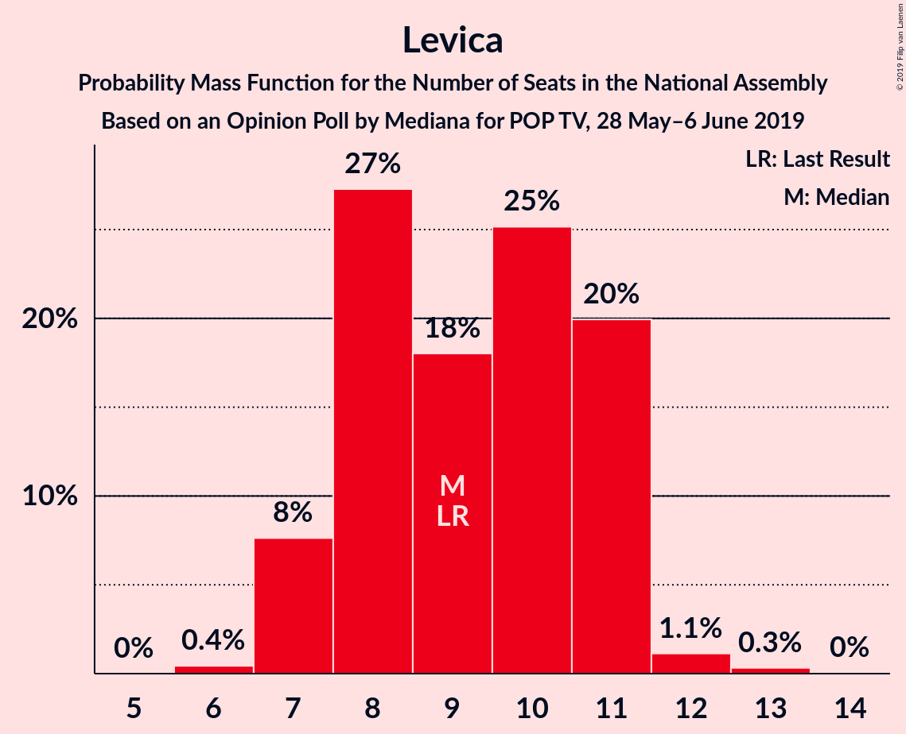
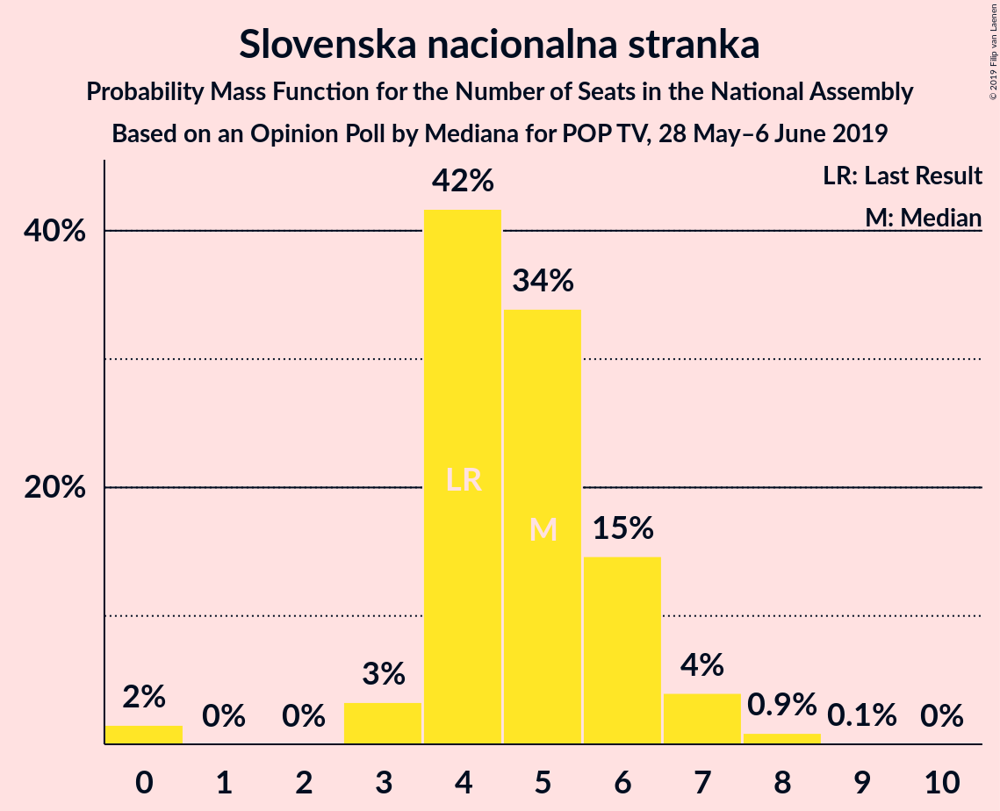
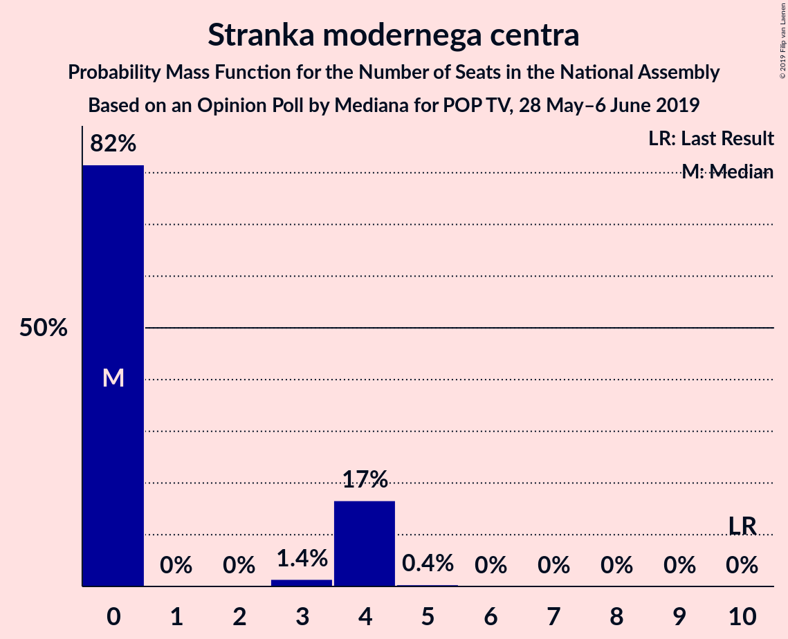
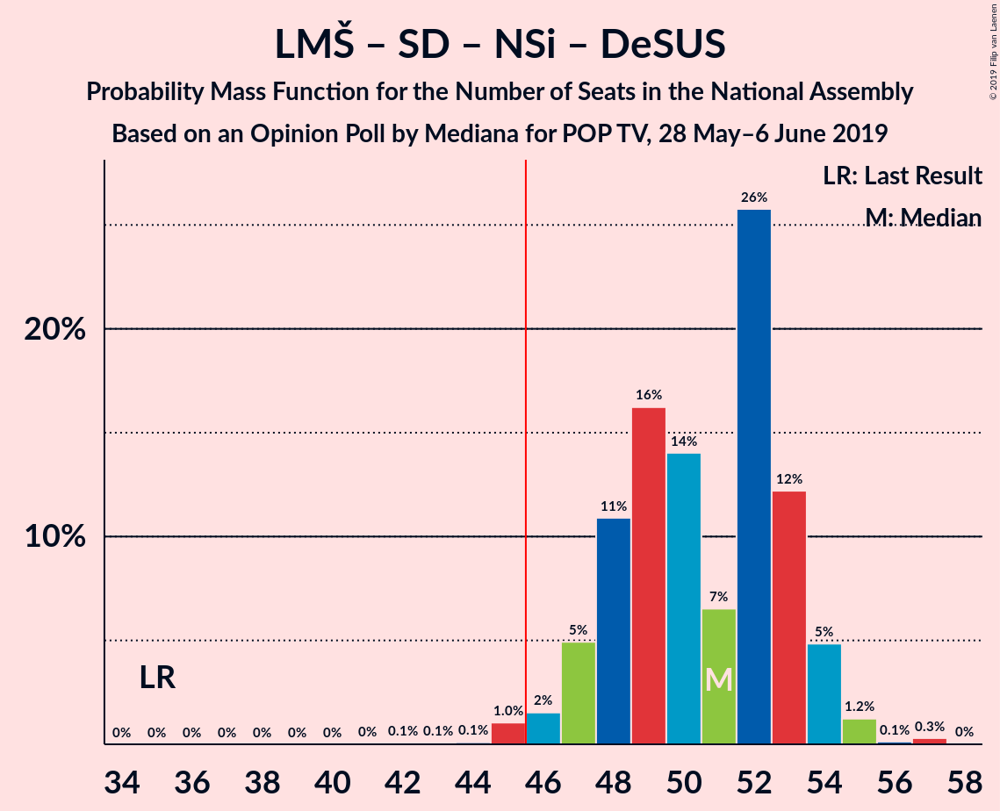
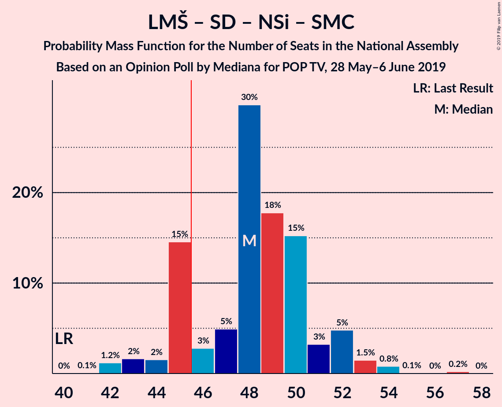
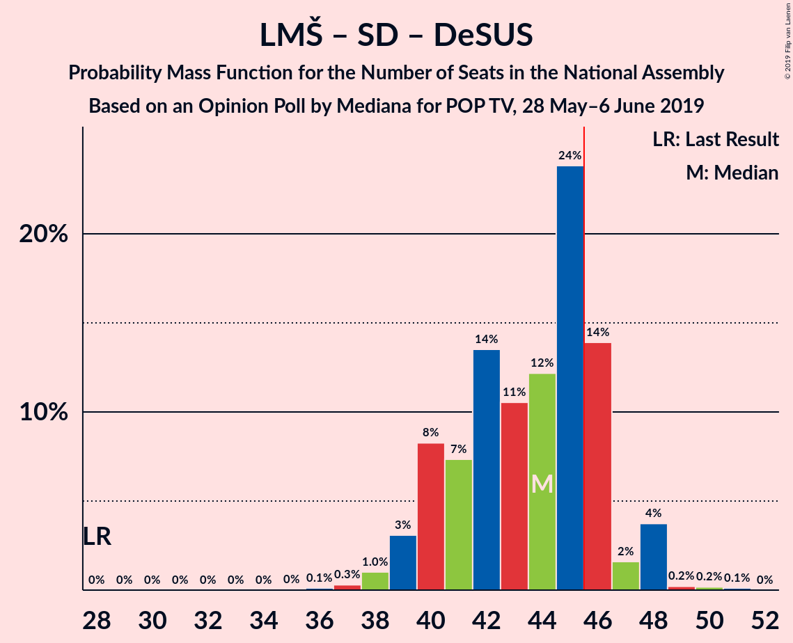
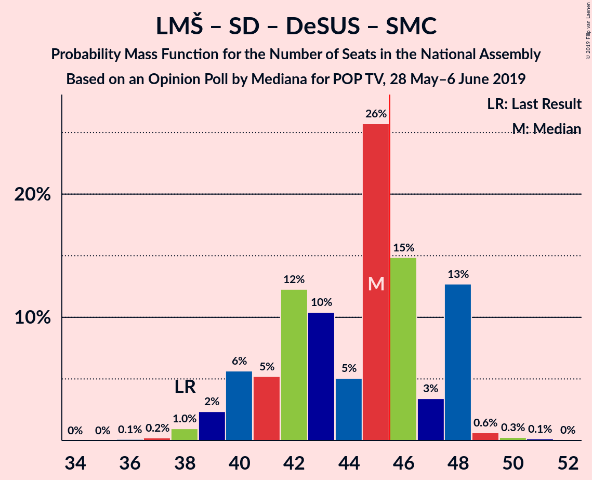
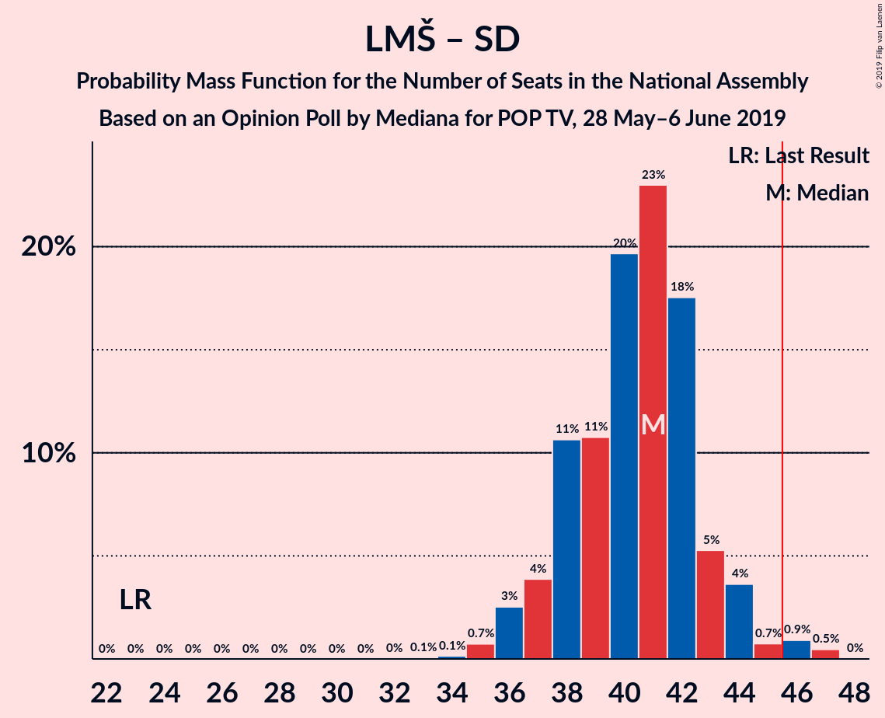

# Opinion Poll by Mediana for POP TV, 28 May–6 June 2019

<a href="#voting-intentions">Voting Intentions</a> | <a href="#seats">Seats</a> | <a href="#coalitions">Coalitions</a> | <a href="#technical-information">Technical Information</a>

## Voting Intentions

### Confidence Intervals

| Party | Last Result | Poll Result | 80% Confidence Interval | 90% Confidence Interval | 95% Confidence Interval | 99% Confidence Interval |
|:-----:|:-----------:|:-----------:|:-----------------------:|:-----------------------:|:-----------------------:|:-----------------------:|
| Lista Marjana Šarca | 12.6% | 28.6% | 26.5–30.8% |26.0–31.4% |25.5–31.9% |24.5–33.0% |
| Slovenska demokratska stranka | 24.9% | 23.1% | 21.2–25.2% |20.7–25.7% |20.2–26.3% |19.3–27.3% |
| Socialni demokrati | 9.9% | 12.6% | 11.2–14.3% |10.8–14.8% |10.4–15.2% |9.8–16.0% |
| Levica | 9.3% | 9.5% | 8.3–11.1% |7.9–11.5% |7.6–11.9% |7.1–12.6% |
| Nova Slovenija–Krščanski demokrati | 7.2% | 7.5% | 6.4–8.9% |6.1–9.3% |5.8–9.6% |5.3–10.3% |
| Slovenska nacionalna stranka | 4.2% | 5.5% | 4.6–6.7% |4.3–7.1% |4.1–7.4% |3.7–8.0% |
| Demokratična stranka upokojencev Slovenije | 4.9% | 4.4% | 3.6–5.6% |3.4–5.9% |3.2–6.2% |2.8–6.8% |
| Stranka modernega centra | 9.7% | 3.1% | 2.4–4.1% |2.2–4.3% |2.1–4.6% |1.8–5.1% |
| Stranka Alenke Bratušek | 5.1% | 3.1% | 2.4–4.1% |2.2–4.3% |2.1–4.6% |1.8–5.1% |
| Slovenska ljudska stranka | 2.6% | 2.6% | 2.0–3.5% |1.8–3.7% |1.6–4.0% |1.4–4.4% |

*Note:* The poll result column reflects the actual value used in the calculations. Published results may vary slightly, and in addition be rounded to fewer digits.

## Seats

### Confidence Intervals

| Party | Last Result | Median | 80% Confidence Interval | 90% Confidence Interval | 95% Confidence Interval | 99% Confidence Interval |
|:-----:|:-----------:|:------:|:-----------------------:|:-----------------------:|:-----------------------:|:-----------------------:|
| <a href="#lista-marjana-šarca">Lista Marjana Šarca</a> | 13 | 29 | 26–30 |25–31 |25–31 |23–32 |
| <a href="#slovenska-demokratska-stranka">Slovenska demokratska stranka</a> | 25 | 22 | 20–24 |20–25 |19–26 |18–27 |
| <a href="#socialni-demokrati">Socialni demokrati</a> | 10 | 12 | 10–13 |10–14 |10–15 |9–16 |
| <a href="#levica">Levica</a> | 9 | 9 | 8–11 |7–11 |7–11 |7–12 |
| <a href="#nova-slovenija–krščanski-demokrati">Nova Slovenija–Krščanski demokrati</a> | 7 | 7 | 6–8 |6–9 |6–9 |5–10 |
| <a href="#slovenska-nacionalna-stranka">Slovenska nacionalna stranka</a> | 4 | 5 | 4–6 |4–6 |3–7 |0–8 |
| <a href="#demokratična-stranka-upokojencev-slovenije">Demokratična stranka upokojencev Slovenije</a> | 5 | 4 | 0–5 |0–6 |0–6 |0–6 |
| <a href="#stranka-modernega-centra">Stranka modernega centra</a> | 10 | 0 | 0–4 |0–4 |0–4 |0–4 |
| <a href="#stranka-alenke-bratušek">Stranka Alenke Bratušek</a> | 5 | 0 | 0–4 |0–4 |0–4 |0–5 |
| <a href="#slovenska-ljudska-stranka">Slovenska ljudska stranka</a> | 0 | 0 | 0 |0 |0–3 |0–4 |

### Lista Marjana Šarca

*For a full overview of the results for this party, see the [Lista Marjana Šarca](party-listamarjanašarca.html) page.*

| Number of Seats | Probability | Accumulated | Special Marks |
|:---------------:|:-----------:|:-----------:|:-------------:|
| 13 | 0% | 100% | Last Result |
| 14 | 0% | 100% |  |
| 15 | 0% | 100% |  |
| 16 | 0% | 100% |  |
| 17 | 0% | 100% |  |
| 18 | 0% | 100% |  |
| 19 | 0% | 100% |  |
| 20 | 0% | 100% |  |
| 21 | 0% | 100% |  |
| 22 | 0% | 100% |  |
| 23 | 0.7% | 100% |  |
| 24 | 1.3% | 99.2% |  |
| 25 | 5% | 98% |  |
| 26 | 4% | 93% |  |
| 27 | 13% | 89% |  |
| 28 | 18% | 76% |  |
| 29 | 27% | 58% | Median |
| 30 | 23% | 31% |  |
| 31 | 6% | 8% |  |
| 32 | 2% | 2% |  |
| 33 | 0.2% | 0.3% |  |
| 34 | 0.1% | 0.1% |  |
| 35 | 0% | 0% |  |

### Slovenska demokratska stranka

*For a full overview of the results for this party, see the [Slovenska demokratska stranka](party-slovenskademokratskastranka.html) page.*

| Number of Seats | Probability | Accumulated | Special Marks |
|:---------------:|:-----------:|:-----------:|:-------------:|
| 17 | 0.1% | 100% |  |
| 18 | 0.5% | 99.9% |  |
| 19 | 2% | 99.4% |  |
| 20 | 13% | 97% |  |
| 21 | 24% | 85% |  |
| 22 | 25% | 61% | Median |
| 23 | 12% | 35% |  |
| 24 | 18% | 24% |  |
| 25 | 2% | 5% | Last Result |
| 26 | 2% | 3% |  |
| 27 | 1.2% | 1.2% |  |
| 28 | 0.1% | 0.1% |  |
| 29 | 0% | 0% |  |

### Socialni demokrati

*For a full overview of the results for this party, see the [Socialni demokrati](party-socialnidemokrati.html) page.*

| Number of Seats | Probability | Accumulated | Special Marks |
|:---------------:|:-----------:|:-----------:|:-------------:|
| 8 | 0.1% | 100% |  |
| 9 | 1.0% | 99.9% |  |
| 10 | 10% | 98.9% | Last Result |
| 11 | 35% | 89% |  |
| 12 | 21% | 54% | Median |
| 13 | 25% | 33% |  |
| 14 | 6% | 8% |  |
| 15 | 2% | 3% |  |
| 16 | 0.6% | 0.7% |  |
| 17 | 0.1% | 0.1% |  |
| 18 | 0% | 0% |  |

### Levica

*For a full overview of the results for this party, see the [Levica](party-levica.html) page.*

| Number of Seats | Probability | Accumulated | Special Marks |
|:---------------:|:-----------:|:-----------:|:-------------:|
| 6 | 0.4% | 100% |  |
| 7 | 8% | 99.5% |  |
| 8 | 27% | 92% |  |
| 9 | 18% | 65% | Last Result, Median |
| 10 | 25% | 47% |  |
| 11 | 20% | 21% |  |
| 12 | 1.1% | 2% |  |
| 13 | 0.3% | 0.4% |  |
| 14 | 0% | 0% |  |

### Nova Slovenija–Krščanski demokrati

*For a full overview of the results for this party, see the [Nova Slovenija–Krščanski demokrati](party-novaslovenija–krščanskidemokrati.html) page.*

| Number of Seats | Probability | Accumulated | Special Marks |
|:---------------:|:-----------:|:-----------:|:-------------:|
| 4 | 0.1% | 100% |  |
| 5 | 2% | 99.9% |  |
| 6 | 27% | 98% |  |
| 7 | 50% | 71% | Last Result, Median |
| 8 | 12% | 21% |  |
| 9 | 8% | 9% |  |
| 10 | 1.1% | 1.2% |  |
| 11 | 0.1% | 0.1% |  |
| 12 | 0% | 0% |  |

### Slovenska nacionalna stranka

*For a full overview of the results for this party, see the [Slovenska nacionalna stranka](party-slovenskanacionalnastranka.html) page.*

| Number of Seats | Probability | Accumulated | Special Marks |
|:---------------:|:-----------:|:-----------:|:-------------:|
| 0 | 2% | 100% |  |
| 1 | 0% | 98% |  |
| 2 | 0% | 98% |  |
| 3 | 3% | 98% |  |
| 4 | 42% | 95% | Last Result |
| 5 | 34% | 54% | Median |
| 6 | 15% | 20% |  |
| 7 | 4% | 5% |  |
| 8 | 0.9% | 0.9% |  |
| 9 | 0.1% | 0.1% |  |
| 10 | 0% | 0% |  |

### Demokratična stranka upokojencev Slovenije

*For a full overview of the results for this party, see the [Demokratična stranka upokojencev Slovenije](party-demokratičnastrankaupokojencevslovenije.html) page.*

| Number of Seats | Probability | Accumulated | Special Marks |
|:---------------:|:-----------:|:-----------:|:-------------:|
| 0 | 26% | 100% |  |
| 1 | 0% | 74% |  |
| 2 | 0% | 74% |  |
| 3 | 0.7% | 74% |  |
| 4 | 60% | 73% | Median |
| 5 | 8% | 13% | Last Result |
| 6 | 5% | 5% |  |
| 7 | 0.3% | 0.3% |  |
| 8 | 0% | 0% |  |

### Stranka modernega centra

*For a full overview of the results for this party, see the [Stranka modernega centra](party-strankamodernegacentra.html) page.*

| Number of Seats | Probability | Accumulated | Special Marks |
|:---------------:|:-----------:|:-----------:|:-------------:|
| 0 | 82% | 100% | Median |
| 1 | 0% | 18% |  |
| 2 | 0% | 18% |  |
| 3 | 1.4% | 18% |  |
| 4 | 17% | 17% |  |
| 5 | 0.4% | 0.4% |  |
| 6 | 0% | 0% |  |
| 7 | 0% | 0% |  |
| 8 | 0% | 0% |  |
| 9 | 0% | 0% |  |
| 10 | 0% | 0% | Last Result |

### Stranka Alenke Bratušek

*For a full overview of the results for this party, see the [Stranka Alenke Bratušek](party-strankaalenkebratušek.html) page.*

| Number of Seats | Probability | Accumulated | Special Marks |
|:---------------:|:-----------:|:-----------:|:-------------:|
| 0 | 87% | 100% | Median |
| 1 | 0% | 13% |  |
| 2 | 0% | 13% |  |
| 3 | 1.3% | 13% |  |
| 4 | 11% | 12% |  |
| 5 | 0.7% | 0.7% | Last Result |
| 6 | 0% | 0% |  |

### Slovenska ljudska stranka

*For a full overview of the results for this party, see the [Slovenska ljudska stranka](party-slovenskaljudskastranka.html) page.*

| Number of Seats | Probability | Accumulated | Special Marks |
|:---------------:|:-----------:|:-----------:|:-------------:|
| 0 | 97% | 100% | Last Result, Median |
| 1 | 0% | 3% |  |
| 2 | 0% | 3% |  |
| 3 | 0.2% | 3% |  |
| 4 | 2% | 2% |  |
| 5 | 0% | 0% |  |

## Coalitions

### Confidence Intervals

| Coalition | Last Result | Median | Majority? | 80% Confidence Interval | 90% Confidence Interval | 95% Confidence Interval | 99% Confidence Interval |
|:---------:|:-----------:|:------:|:---------:|:-----------------------:|:-----------------------:|:-----------------------:|:-----------------------:|
| Lista Marjana Šarca – Slovenska demokratska stranka – Demokratična stranka upokojencev Slovenije | 43 | 54 | 100% | 51–56 | 50–56 | 49–57 | 48–59 |
| Lista Marjana Šarca – Socialni demokrati – Nova Slovenija–Krščanski demokrati – Demokratična stranka upokojencev Slovenije – Stranka Alenke Bratušek – Stranka modernega centra | 50 | 52 | 99.6% | 48–54 | 48–54 | 48–55 | 47–57 |
| Lista Marjana Šarca – Slovenska demokratska stranka | 38 | 51 | 98.8% | 48–53 | 47–55 | 46–55 | 45–56 |
| Lista Marjana Šarca – Socialni demokrati – Nova Slovenija–Krščanski demokrati – Demokratična stranka upokojencev Slovenije – Stranka modernega centra | 45 | 52 | 99.0% | 48–54 | 48–54 | 47–54 | 45–57 |
| Lista Marjana Šarca – Socialni demokrati – Nova Slovenija–Krščanski demokrati – Demokratična stranka upokojencev Slovenije | 35 | 51 | 98.7% | 48–53 | 47–54 | 46–54 | 45–55 |
| Lista Marjana Šarca – Socialni demokrati – Nova Slovenija–Krščanski demokrati – Stranka modernega centra | 40 | 48 | 81% | 45–51 | 45–52 | 43–53 | 42–54 |
| Lista Marjana Šarca – Socialni demokrati – Nova Slovenija–Krščanski demokrati | 30 | 48 | 77% | 45–50 | 44–52 | 43–52 | 42–53 |
| Lista Marjana Šarca – Socialni demokrati – Demokratična stranka upokojencev Slovenije | 28 | 44 | 20% | 40–46 | 40–47 | 39–48 | 38–49 |
| Lista Marjana Šarca – Socialni demokrati – Demokratična stranka upokojencev Slovenije – Stranka Alenke Bratušek – Stranka modernega centra | 43 | 45 | 42% | 41–48 | 40–48 | 39–48 | 38–50 |
| Lista Marjana Šarca – Socialni demokrati – Demokratična stranka upokojencev Slovenije – Stranka modernega centra | 38 | 45 | 32% | 41–48 | 40–48 | 39–48 | 38–49 |
| Lista Marjana Šarca – Socialni demokrati – Stranka modernega centra | 33 | 41 | 2% | 38–44 | 38–44 | 37–45 | 36–47 |
| Lista Marjana Šarca – Socialni demokrati | 23 | 41 | 1.4% | 38–43 | 37–44 | 36–44 | 35–46 |
| Socialni demokrati – Demokratična stranka upokojencev Slovenije – Stranka modernega centra | 25 | 15 | 0% | 12–19 | 12–20 | 12–20 | 10–22 |

### Lista Marjana Šarca – Slovenska demokratska stranka – Demokratična stranka upokojencev Slovenije

| Number of Seats | Probability | Accumulated | Special Marks |
|:---------------:|:-----------:|:-----------:|:-------------:|
| 43 | 0% | 100% | Last Result |
| 44 | 0% | 100% |  |
| 45 | 0% | 100% |  |
| 46 | 0% | 100% | Majority |
| 47 | 0.2% | 100% |  |
| 48 | 0.6% | 99.8% |  |
| 49 | 2% | 99.2% |  |
| 50 | 4% | 97% |  |
| 51 | 7% | 93% |  |
| 52 | 11% | 86% |  |
| 53 | 24% | 76% |  |
| 54 | 11% | 52% |  |
| 55 | 11% | 41% | Median |
| 56 | 25% | 29% |  |
| 57 | 2% | 4% |  |
| 58 | 0.9% | 2% |  |
| 59 | 0.6% | 1.0% |  |
| 60 | 0.3% | 0.4% |  |
| 61 | 0% | 0.1% |  |
| 62 | 0% | 0% |  |

### Lista Marjana Šarca – Socialni demokrati – Nova Slovenija–Krščanski demokrati – Demokratična stranka upokojencev Slovenije – Stranka Alenke Bratušek – Stranka modernega centra

| Number of Seats | Probability | Accumulated | Special Marks |
|:---------------:|:-----------:|:-----------:|:-------------:|
| 45 | 0.3% | 100% |  |
| 46 | 0.1% | 99.6% | Majority |
| 47 | 2% | 99.5% |  |
| 48 | 10% | 98% |  |
| 49 | 5% | 88% |  |
| 50 | 6% | 83% | Last Result |
| 51 | 8% | 77% |  |
| 52 | 26% | 70% | Median |
| 53 | 24% | 43% |  |
| 54 | 16% | 19% |  |
| 55 | 2% | 3% |  |
| 56 | 0.4% | 1.2% |  |
| 57 | 0.7% | 0.8% |  |
| 58 | 0.1% | 0.1% |  |
| 59 | 0% | 0% |  |

### Lista Marjana Šarca – Slovenska demokratska stranka

| Number of Seats | Probability | Accumulated | Special Marks |
|:---------------:|:-----------:|:-----------:|:-------------:|
| 38 | 0% | 100% | Last Result |
| 39 | 0% | 100% |  |
| 40 | 0% | 100% |  |
| 41 | 0% | 100% |  |
| 42 | 0% | 100% |  |
| 43 | 0% | 100% |  |
| 44 | 0.3% | 100% |  |
| 45 | 0.9% | 99.7% |  |
| 46 | 2% | 98.8% | Majority |
| 47 | 3% | 97% |  |
| 48 | 5% | 94% |  |
| 49 | 20% | 89% |  |
| 50 | 17% | 69% |  |
| 51 | 10% | 52% | Median |
| 52 | 29% | 42% |  |
| 53 | 6% | 12% |  |
| 54 | 0.8% | 7% |  |
| 55 | 5% | 6% |  |
| 56 | 0.2% | 0.7% |  |
| 57 | 0.4% | 0.5% |  |
| 58 | 0% | 0.1% |  |
| 59 | 0% | 0% |  |

### Lista Marjana Šarca – Socialni demokrati – Nova Slovenija–Krščanski demokrati – Demokratična stranka upokojencev Slovenije – Stranka modernega centra

| Number of Seats | Probability | Accumulated | Special Marks |
|:---------------:|:-----------:|:-----------:|:-------------:|
| 43 | 0% | 100% |  |
| 44 | 0.1% | 99.9% |  |
| 45 | 0.8% | 99.8% | Last Result |
| 46 | 0.2% | 99.0% | Majority |
| 47 | 3% | 98.8% |  |
| 48 | 10% | 96% |  |
| 49 | 14% | 86% |  |
| 50 | 6% | 72% |  |
| 51 | 7% | 66% |  |
| 52 | 27% | 59% | Median |
| 53 | 14% | 32% |  |
| 54 | 16% | 18% |  |
| 55 | 1.4% | 2% |  |
| 56 | 0.2% | 0.9% |  |
| 57 | 0.6% | 0.6% |  |
| 58 | 0.1% | 0.1% |  |
| 59 | 0% | 0% |  |

### Lista Marjana Šarca – Socialni demokrati – Nova Slovenija–Krščanski demokrati – Demokratična stranka upokojencev Slovenije

| Number of Seats | Probability | Accumulated | Special Marks |
|:---------------:|:-----------:|:-----------:|:-------------:|
| 35 | 0% | 100% | Last Result |
| 36 | 0% | 100% |  |
| 37 | 0% | 100% |  |
| 38 | 0% | 100% |  |
| 39 | 0% | 100% |  |
| 40 | 0% | 100% |  |
| 41 | 0% | 100% |  |
| 42 | 0.1% | 100% |  |
| 43 | 0.1% | 99.9% |  |
| 44 | 0.1% | 99.8% |  |
| 45 | 1.0% | 99.7% |  |
| 46 | 2% | 98.7% | Majority |
| 47 | 5% | 97% |  |
| 48 | 11% | 92% |  |
| 49 | 16% | 81% |  |
| 50 | 14% | 65% |  |
| 51 | 7% | 51% |  |
| 52 | 26% | 45% | Median |
| 53 | 12% | 19% |  |
| 54 | 5% | 7% |  |
| 55 | 1.2% | 2% |  |
| 56 | 0.1% | 0.5% |  |
| 57 | 0.3% | 0.3% |  |
| 58 | 0% | 0% |  |

### Lista Marjana Šarca – Socialni demokrati – Nova Slovenija–Krščanski demokrati – Stranka modernega centra

| Number of Seats | Probability | Accumulated | Special Marks |
|:---------------:|:-----------:|:-----------:|:-------------:|
| 40 | 0% | 100% | Last Result |
| 41 | 0.1% | 100% |  |
| 42 | 1.2% | 99.9% |  |
| 43 | 2% | 98.7% |  |
| 44 | 2% | 97% |  |
| 45 | 15% | 96% |  |
| 46 | 3% | 81% | Majority |
| 47 | 5% | 78% |  |
| 48 | 30% | 73% | Median |
| 49 | 18% | 44% |  |
| 50 | 15% | 26% |  |
| 51 | 3% | 11% |  |
| 52 | 5% | 7% |  |
| 53 | 1.5% | 3% |  |
| 54 | 0.8% | 1.1% |  |
| 55 | 0.1% | 0.3% |  |
| 56 | 0% | 0.2% |  |
| 57 | 0.2% | 0.2% |  |
| 58 | 0% | 0% |  |

### Lista Marjana Šarca – Socialni demokrati – Nova Slovenija–Krščanski demokrati

| Number of Seats | Probability | Accumulated | Special Marks |
|:---------------:|:-----------:|:-----------:|:-------------:|
| 30 | 0% | 100% | Last Result |
| 31 | 0% | 100% |  |
| 32 | 0% | 100% |  |
| 33 | 0% | 100% |  |
| 34 | 0% | 100% |  |
| 35 | 0% | 100% |  |
| 36 | 0% | 100% |  |
| 37 | 0% | 100% |  |
| 38 | 0% | 100% |  |
| 39 | 0% | 100% |  |
| 40 | 0% | 100% |  |
| 41 | 0.3% | 99.9% |  |
| 42 | 2% | 99.6% |  |
| 43 | 2% | 98% |  |
| 44 | 2% | 96% |  |
| 45 | 16% | 94% |  |
| 46 | 13% | 77% | Majority |
| 47 | 6% | 64% |  |
| 48 | 29% | 58% | Median |
| 49 | 16% | 28% |  |
| 50 | 5% | 13% |  |
| 51 | 1.4% | 8% |  |
| 52 | 5% | 6% |  |
| 53 | 1.1% | 2% |  |
| 54 | 0.4% | 0.5% |  |
| 55 | 0% | 0% |  |

### Lista Marjana Šarca – Socialni demokrati – Demokratična stranka upokojencev Slovenije

| Number of Seats | Probability | Accumulated | Special Marks |
|:---------------:|:-----------:|:-----------:|:-------------:|
| 28 | 0% | 100% | Last Result |
| 29 | 0% | 100% |  |
| 30 | 0% | 100% |  |
| 31 | 0% | 100% |  |
| 32 | 0% | 100% |  |
| 33 | 0% | 100% |  |
| 34 | 0% | 100% |  |
| 35 | 0% | 100% |  |
| 36 | 0.1% | 99.9% |  |
| 37 | 0.3% | 99.8% |  |
| 38 | 1.0% | 99.5% |  |
| 39 | 3% | 98.5% |  |
| 40 | 8% | 95% |  |
| 41 | 7% | 87% |  |
| 42 | 14% | 80% |  |
| 43 | 11% | 66% |  |
| 44 | 12% | 56% |  |
| 45 | 24% | 44% | Median |
| 46 | 14% | 20% | Majority |
| 47 | 2% | 6% |  |
| 48 | 4% | 4% |  |
| 49 | 0.2% | 0.5% |  |
| 50 | 0.2% | 0.3% |  |
| 51 | 0.1% | 0.1% |  |
| 52 | 0% | 0% |  |

### Lista Marjana Šarca – Socialni demokrati – Demokratična stranka upokojencev Slovenije – Stranka Alenke Bratušek – Stranka modernega centra

| Number of Seats | Probability | Accumulated | Special Marks |
|:---------------:|:-----------:|:-----------:|:-------------:|
| 37 | 0% | 100% |  |
| 38 | 0.6% | 99.9% |  |
| 39 | 2% | 99.3% |  |
| 40 | 5% | 97% |  |
| 41 | 4% | 92% |  |
| 42 | 6% | 89% |  |
| 43 | 8% | 82% | Last Result |
| 44 | 5% | 74% |  |
| 45 | 27% | 69% | Median |
| 46 | 21% | 42% | Majority |
| 47 | 7% | 21% |  |
| 48 | 13% | 15% |  |
| 49 | 0.7% | 1.3% |  |
| 50 | 0.3% | 0.6% |  |
| 51 | 0.2% | 0.3% |  |
| 52 | 0.1% | 0.1% |  |
| 53 | 0% | 0% |  |

### Lista Marjana Šarca – Socialni demokrati – Demokratična stranka upokojencev Slovenije – Stranka modernega centra

| Number of Seats | Probability | Accumulated | Special Marks |
|:---------------:|:-----------:|:-----------:|:-------------:|
| 36 | 0.1% | 100% |  |
| 37 | 0.2% | 99.9% |  |
| 38 | 1.0% | 99.7% | Last Result |
| 39 | 2% | 98.7% |  |
| 40 | 6% | 96% |  |
| 41 | 5% | 91% |  |
| 42 | 12% | 86% |  |
| 43 | 10% | 73% |  |
| 44 | 5% | 63% |  |
| 45 | 26% | 58% | Median |
| 46 | 15% | 32% | Majority |
| 47 | 3% | 17% |  |
| 48 | 13% | 14% |  |
| 49 | 0.6% | 1.1% |  |
| 50 | 0.3% | 0.4% |  |
| 51 | 0.1% | 0.2% |  |
| 52 | 0% | 0% |  |

### Lista Marjana Šarca – Socialni demokrati – Stranka modernega centra

| Number of Seats | Probability | Accumulated | Special Marks |
|:---------------:|:-----------:|:-----------:|:-------------:|
| 33 | 0% | 100% | Last Result |
| 34 | 0% | 100% |  |
| 35 | 0.2% | 99.9% |  |
| 36 | 2% | 99.7% |  |
| 37 | 2% | 98% |  |
| 38 | 10% | 95% |  |
| 39 | 9% | 86% |  |
| 40 | 9% | 76% |  |
| 41 | 23% | 67% | Median |
| 42 | 19% | 44% |  |
| 43 | 6% | 25% |  |
| 44 | 14% | 18% |  |
| 45 | 2% | 4% |  |
| 46 | 1.0% | 2% | Majority |
| 47 | 0.5% | 0.8% |  |
| 48 | 0.3% | 0.3% |  |
| 49 | 0% | 0% |  |

### Lista Marjana Šarca – Socialni demokrati

| Number of Seats | Probability | Accumulated | Special Marks |
|:---------------:|:-----------:|:-----------:|:-------------:|
| 23 | 0% | 100% | Last Result |
| 24 | 0% | 100% |  |
| 25 | 0% | 100% |  |
| 26 | 0% | 100% |  |
| 27 | 0% | 100% |  |
| 28 | 0% | 100% |  |
| 29 | 0% | 100% |  |
| 30 | 0% | 100% |  |
| 31 | 0% | 100% |  |
| 32 | 0% | 100% |  |
| 33 | 0.1% | 100% |  |
| 34 | 0.1% | 99.9% |  |
| 35 | 0.7% | 99.8% |  |
| 36 | 3% | 99.0% |  |
| 37 | 4% | 97% |  |
| 38 | 11% | 93% |  |
| 39 | 11% | 82% |  |
| 40 | 20% | 71% |  |
| 41 | 23% | 52% | Median |
| 42 | 18% | 29% |  |
| 43 | 5% | 11% |  |
| 44 | 4% | 6% |  |
| 45 | 0.7% | 2% |  |
| 46 | 0.9% | 1.4% | Majority |
| 47 | 0.5% | 0.5% |  |
| 48 | 0% | 0% |  |

### Socialni demokrati – Demokratična stranka upokojencev Slovenije – Stranka modernega centra

| Number of Seats | Probability | Accumulated | Special Marks |
|:---------------:|:-----------:|:-----------:|:-------------:|
| 9 | 0.1% | 100% |  |
| 10 | 0.9% | 99.9% |  |
| 11 | 0.8% | 99.1% |  |
| 12 | 12% | 98% |  |
| 13 | 5% | 86% |  |
| 14 | 9% | 81% |  |
| 15 | 25% | 72% |  |
| 16 | 5% | 47% | Median |
| 17 | 18% | 42% |  |
| 18 | 9% | 24% |  |
| 19 | 10% | 15% |  |
| 20 | 3% | 5% |  |
| 21 | 2% | 2% |  |
| 22 | 0.8% | 0.9% |  |
| 23 | 0.1% | 0.1% |  |
| 24 | 0% | 0% |  |
| 25 | 0% | 0% | Last Result |

## Technical Information

### Opinion Poll

+ **Polling firm:** Mediana
+ **Commissioner(s):** POP TV
+ **Fieldwork period:** 28 May–6 June 2019

### Calculations

+ **Sample size:** 745
+ **Simulations done:** 1,048,576
+ **Error estimate:** 1.83%

