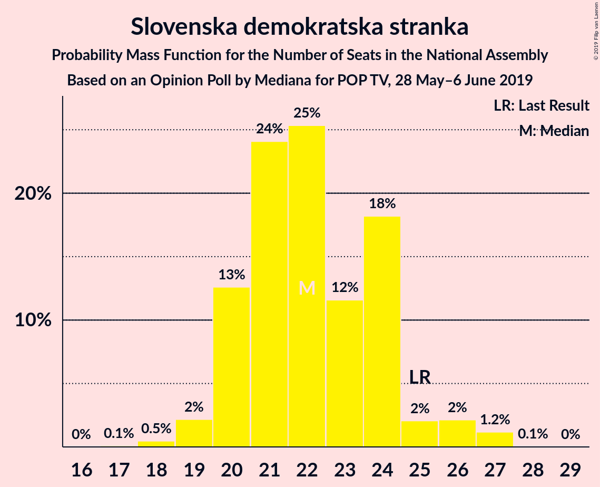
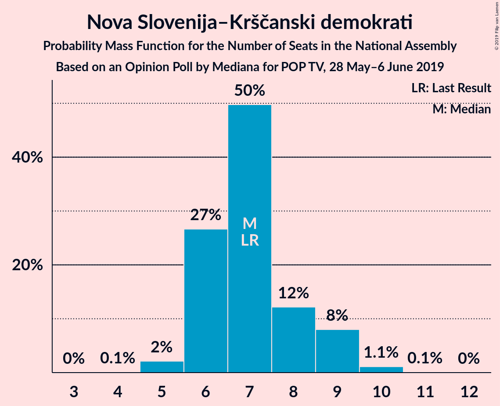
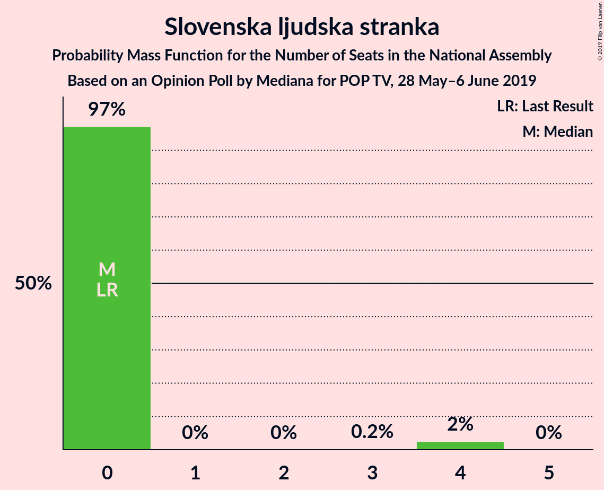
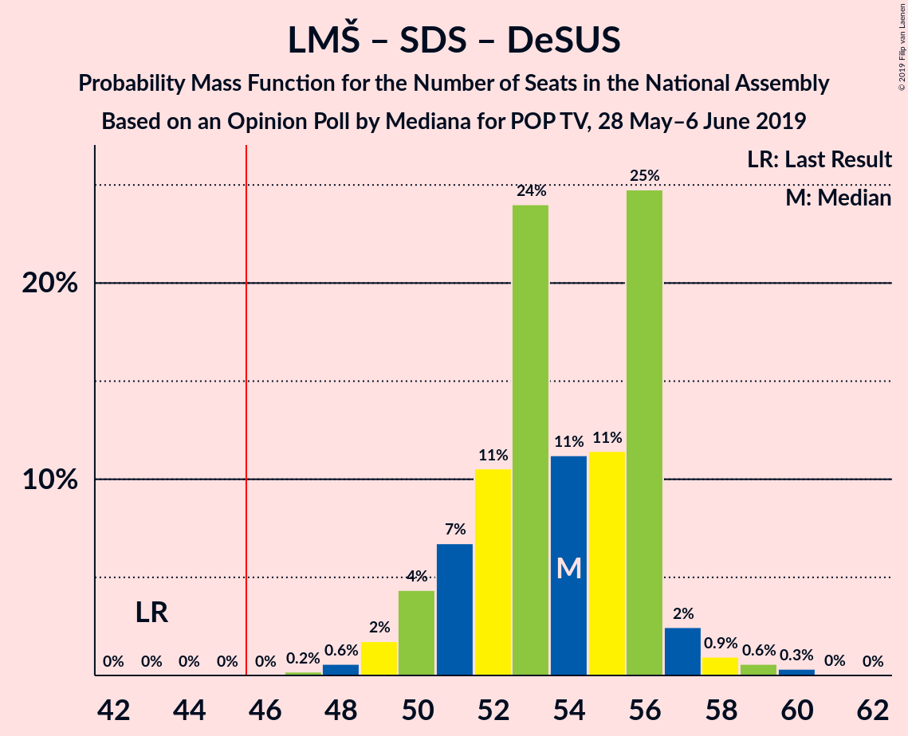
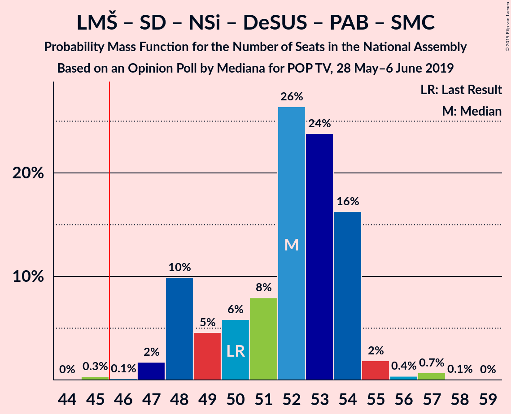
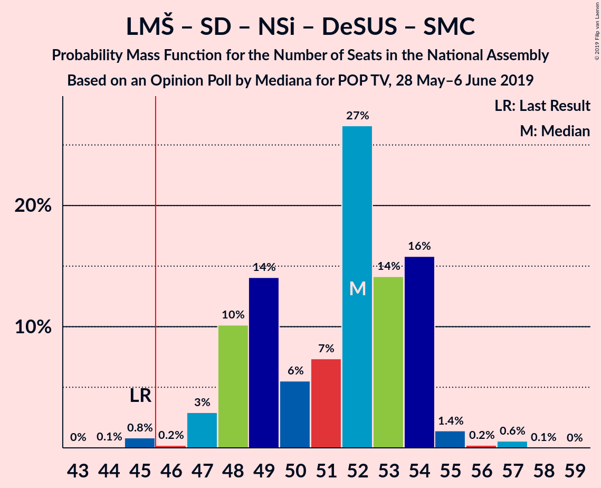
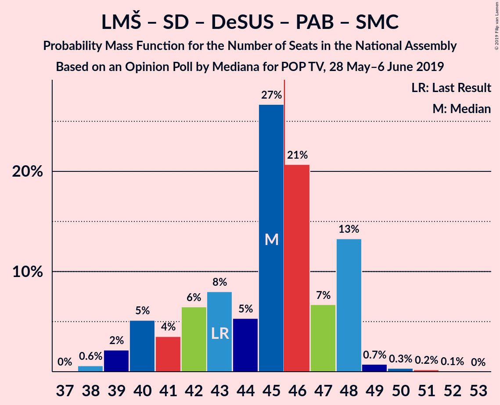
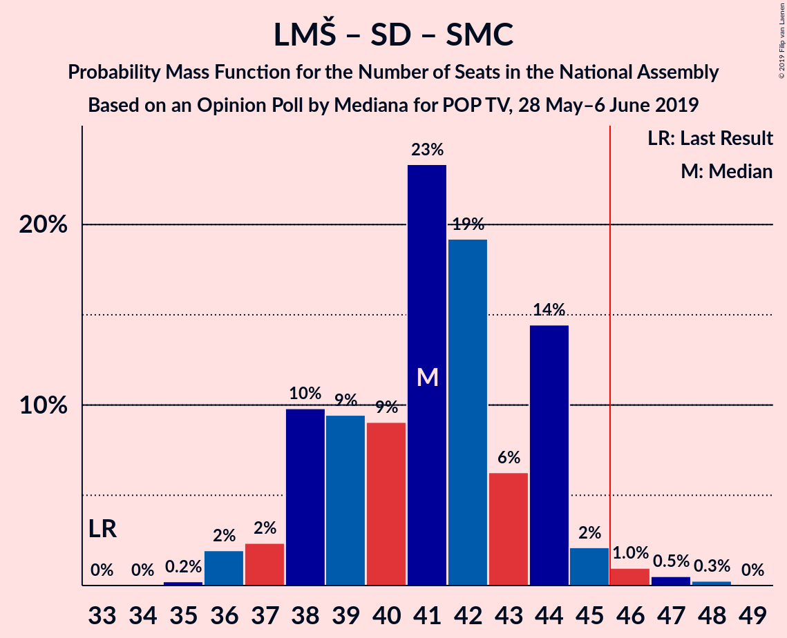

# Opinion Poll by Mediana for POP TV, 28 May–6 June 2019

<a href="#voting-intentions">Voting Intentions</a> | <a href="#seats">Seats</a> | <a href="#coalitions">Coalitions</a> | <a href="#technical-information">Technical Information</a>

## Voting Intentions

### Confidence Intervals

| Party | Last Result | Poll Result | 80% Confidence Interval | 90% Confidence Interval | 95% Confidence Interval | 99% Confidence Interval |
|:-----:|:-----------:|:-----------:|:-----------------------:|:-----------------------:|:-----------------------:|:-----------------------:|
| Lista Marjana Šarca | 12.6% | 28.6% | 26.5–30.8% |26.0–31.4% |25.5–31.9% |24.5–33.0% |
| Slovenska demokratska stranka | 24.9% | 23.1% | 21.2–25.2% |20.7–25.7% |20.2–26.3% |19.3–27.3% |
| Socialni demokrati | 9.9% | 12.6% | 11.2–14.3% |10.8–14.8% |10.4–15.2% |9.8–16.0% |
| Levica | 9.3% | 9.5% | 8.3–11.1% |7.9–11.5% |7.6–11.9% |7.1–12.6% |
| Nova Slovenija–Krščanski demokrati | 7.2% | 7.5% | 6.4–8.9% |6.1–9.3% |5.8–9.6% |5.3–10.3% |
| Slovenska nacionalna stranka | 4.2% | 5.5% | 4.6–6.7% |4.3–7.1% |4.1–7.4% |3.7–8.0% |
| Demokratična stranka upokojencev Slovenije | 4.9% | 4.4% | 3.6–5.6% |3.4–5.9% |3.2–6.2% |2.8–6.8% |
| Stranka modernega centra | 9.7% | 3.1% | 2.4–4.1% |2.2–4.3% |2.1–4.6% |1.8–5.1% |
| Stranka Alenke Bratušek | 5.1% | 3.1% | 2.4–4.1% |2.2–4.3% |2.1–4.6% |1.8–5.1% |
| Slovenska ljudska stranka | 2.6% | 2.6% | 2.0–3.5% |1.8–3.7% |1.6–4.0% |1.4–4.4% |

*Note:* The poll result column reflects the actual value used in the calculations. Published results may vary slightly, and in addition be rounded to fewer digits.

## Seats

### Confidence Intervals

| Party | Last Result | Median | 80% Confidence Interval | 90% Confidence Interval | 95% Confidence Interval | 99% Confidence Interval |
|:-----:|:-----------:|:------:|:-----------------------:|:-----------------------:|:-----------------------:|:-----------------------:|
| <a href="#lista-marjana-šarca">Lista Marjana Šarca</a> | 13 | 26 | 24–32 |23–33 |23–33 |23–34 |
| <a href="#slovenska-demokratska-stranka">Slovenska demokratska stranka</a> | 25 | 22 | 20–24 |19–25 |19–25 |19–26 |
| <a href="#socialni-demokrati">Socialni demokrati</a> | 10 | 12 | 10–14 |10–14 |10–14 |9–15 |
| <a href="#levica">Levica</a> | 9 | 9 | 7–11 |7–11 |7–12 |6–12 |
| <a href="#nova-slovenija–krščanski-demokrati">Nova Slovenija–Krščanski demokrati</a> | 7 | 7 | 6–9 |5–10 |5–10 |4–11 |
| <a href="#slovenska-nacionalna-stranka">Slovenska nacionalna stranka</a> | 4 | 5 | 4–6 |4–6 |4–7 |0–8 |
| <a href="#demokratična-stranka-upokojencev-slovenije">Demokratična stranka upokojencev Slovenije</a> | 5 | 4 | 0–6 |0–6 |0–7 |0–7 |
| <a href="#stranka-modernega-centra">Stranka modernega centra</a> | 10 | 0 | 0–3 |0–4 |0–4 |0–5 |
| <a href="#stranka-alenke-bratušek">Stranka Alenke Bratušek</a> | 5 | 0 | 0–4 |0–4 |0–5 |0–5 |
| <a href="#slovenska-ljudska-stranka">Slovenska ljudska stranka</a> | 0 | 0 | 0–4 |0–4 |0–4 |0–4 |

### Lista Marjana Šarca

*For a full overview of the results for this party, see the [Lista Marjana Šarca](party-listamarjanašarca.html) page.*

| Number of Seats | Probability | Accumulated | Special Marks |
|:---------------:|:-----------:|:-----------:|:-------------:|
| 13 | 0% | 100% | Last Result |
| 14 | 0% | 100% |  |
| 15 | 0% | 100% |  |
| 16 | 0% | 100% |  |
| 17 | 0% | 100% |  |
| 18 | 0% | 100% |  |
| 19 | 0% | 100% |  |
| 20 | 0% | 100% |  |
| 21 | 0.1% | 100% |  |
| 22 | 0.1% | 99.9% |  |
| 23 | 7% | 99.8% |  |
| 24 | 16% | 93% |  |
| 25 | 6% | 77% |  |
| 26 | 26% | 72% | Median |
| 27 | 16% | 46% |  |
| 28 | 3% | 30% |  |
| 29 | 7% | 27% |  |
| 30 | 1.2% | 21% |  |
| 31 | 3% | 19% |  |
| 32 | 7% | 16% |  |
| 33 | 8% | 9% |  |
| 34 | 0.1% | 0.5% |  |
| 35 | 0.4% | 0.4% |  |
| 36 | 0% | 0% |  |

### Slovenska demokratska stranka

*For a full overview of the results for this party, see the [Slovenska demokratska stranka](party-slovenskademokratskastranka.html) page.*

| Number of Seats | Probability | Accumulated | Special Marks |
|:---------------:|:-----------:|:-----------:|:-------------:|
| 17 | 0% | 100% |  |
| 18 | 0.2% | 99.9% |  |
| 19 | 5% | 99.7% |  |
| 20 | 19% | 94% |  |
| 21 | 22% | 76% |  |
| 22 | 14% | 54% | Median |
| 23 | 19% | 40% |  |
| 24 | 13% | 21% |  |
| 25 | 7% | 8% | Last Result |
| 26 | 0.6% | 0.8% |  |
| 27 | 0.1% | 0.3% |  |
| 28 | 0.2% | 0.2% |  |
| 29 | 0% | 0% |  |

### Socialni demokrati

*For a full overview of the results for this party, see the [Socialni demokrati](party-socialnidemokrati.html) page.*

| Number of Seats | Probability | Accumulated | Special Marks |
|:---------------:|:-----------:|:-----------:|:-------------:|
| 8 | 0.1% | 100% |  |
| 9 | 2% | 99.9% |  |
| 10 | 16% | 98% | Last Result |
| 11 | 29% | 82% |  |
| 12 | 19% | 53% | Median |
| 13 | 15% | 34% |  |
| 14 | 16% | 18% |  |
| 15 | 2% | 2% |  |
| 16 | 0.2% | 0.2% |  |
| 17 | 0.1% | 0.1% |  |
| 18 | 0% | 0% |  |

### Levica

*For a full overview of the results for this party, see the [Levica](party-levica.html) page.*

| Number of Seats | Probability | Accumulated | Special Marks |
|:---------------:|:-----------:|:-----------:|:-------------:|
| 5 | 0.1% | 100% |  |
| 6 | 1.3% | 99.9% |  |
| 7 | 13% | 98.6% |  |
| 8 | 22% | 86% |  |
| 9 | 24% | 64% | Last Result, Median |
| 10 | 23% | 40% |  |
| 11 | 14% | 17% |  |
| 12 | 2% | 3% |  |
| 13 | 0.3% | 0.4% |  |
| 14 | 0.2% | 0.2% |  |
| 15 | 0% | 0% |  |

### Nova Slovenija–Krščanski demokrati

*For a full overview of the results for this party, see the [Nova Slovenija–Krščanski demokrati](party-novaslovenija–krščanskidemokrati.html) page.*

| Number of Seats | Probability | Accumulated | Special Marks |
|:---------------:|:-----------:|:-----------:|:-------------:|
| 4 | 1.0% | 100% |  |
| 5 | 6% | 99.0% |  |
| 6 | 28% | 93% |  |
| 7 | 24% | 65% | Last Result, Median |
| 8 | 17% | 41% |  |
| 9 | 16% | 24% |  |
| 10 | 7% | 8% |  |
| 11 | 0.5% | 0.7% |  |
| 12 | 0.2% | 0.2% |  |
| 13 | 0% | 0% |  |

### Slovenska nacionalna stranka

*For a full overview of the results for this party, see the [Slovenska nacionalna stranka](party-slovenskanacionalnastranka.html) page.*

| Number of Seats | Probability | Accumulated | Special Marks |
|:---------------:|:-----------:|:-----------:|:-------------:|
| 0 | 2% | 100% |  |
| 1 | 0% | 98% |  |
| 2 | 0% | 98% |  |
| 3 | 0% | 98% |  |
| 4 | 42% | 98% | Last Result |
| 5 | 21% | 56% | Median |
| 6 | 30% | 35% |  |
| 7 | 3% | 5% |  |
| 8 | 2% | 2% |  |
| 9 | 0% | 0% |  |

### Demokratična stranka upokojencev Slovenije

*For a full overview of the results for this party, see the [Demokratična stranka upokojencev Slovenije](party-demokratičnastrankaupokojencevslovenije.html) page.*

| Number of Seats | Probability | Accumulated | Special Marks |
|:---------------:|:-----------:|:-----------:|:-------------:|
| 0 | 38% | 100% |  |
| 1 | 0% | 62% |  |
| 2 | 0% | 62% |  |
| 3 | 6% | 62% |  |
| 4 | 23% | 55% | Median |
| 5 | 18% | 32% | Last Result |
| 6 | 11% | 14% |  |
| 7 | 3% | 3% |  |
| 8 | 0% | 0% |  |

### Stranka modernega centra

*For a full overview of the results for this party, see the [Stranka modernega centra](party-strankamodernegacentra.html) page.*

| Number of Seats | Probability | Accumulated | Special Marks |
|:---------------:|:-----------:|:-----------:|:-------------:|
| 0 | 90% | 100% | Median |
| 1 | 0% | 10% |  |
| 2 | 0% | 10% |  |
| 3 | 0.1% | 10% |  |
| 4 | 9% | 10% |  |
| 5 | 0.7% | 0.7% |  |
| 6 | 0% | 0% |  |
| 7 | 0% | 0% |  |
| 8 | 0% | 0% |  |
| 9 | 0% | 0% |  |
| 10 | 0% | 0% | Last Result |

### Stranka Alenke Bratušek

*For a full overview of the results for this party, see the [Stranka Alenke Bratušek](party-strankaalenkebratušek.html) page.*

| Number of Seats | Probability | Accumulated | Special Marks |
|:---------------:|:-----------:|:-----------:|:-------------:|
| 0 | 64% | 100% | Median |
| 1 | 0% | 36% |  |
| 2 | 0% | 36% |  |
| 3 | 0.1% | 36% |  |
| 4 | 32% | 36% |  |
| 5 | 4% | 4% | Last Result |
| 6 | 0% | 0% |  |

### Slovenska ljudska stranka

*For a full overview of the results for this party, see the [Slovenska ljudska stranka](party-slovenskaljudskastranka.html) page.*

| Number of Seats | Probability | Accumulated | Special Marks |
|:---------------:|:-----------:|:-----------:|:-------------:|
| 0 | 73% | 100% | Last Result, Median |
| 1 | 0% | 27% |  |
| 2 | 0% | 27% |  |
| 3 | 5% | 27% |  |
| 4 | 22% | 22% |  |
| 5 | 0.2% | 0.2% |  |
| 6 | 0% | 0% |  |

## Coalitions

### Confidence Intervals

| Coalition | Last Result | Median | Majority? | 80% Confidence Interval | 90% Confidence Interval | 95% Confidence Interval | 99% Confidence Interval |
|:---------:|:-----------:|:------:|:---------:|:-----------------------:|:-----------------------:|:-----------------------:|:-----------------------:|
| Lista Marjana Šarca – Slovenska demokratska stranka – Demokratična stranka upokojencev Slovenije | 43 | 51 | 100% | 48–56 | 48–56 | 47–57 | 47–59 |
| Lista Marjana Šarca – Socialni demokrati – Nova Slovenija–Krščanski demokrati – Demokratična stranka upokojencev Slovenije – Stranka Alenke Bratušek – Stranka modernega centra | 50 | 51 | 97% | 48–55 | 47–56 | 45–57 | 45–57 |
| Lista Marjana Šarca – Socialni demokrati – Nova Slovenija–Krščanski demokrati – Demokratična stranka upokojencev Slovenije – Stranka modernega centra | 45 | 49 | 97% | 47–53 | 47–55 | 45–56 | 45–57 |
| Lista Marjana Šarca – Slovenska demokratska stranka | 38 | 49 | 79% | 44–55 | 44–56 | 44–56 | 43–57 |
| Lista Marjana Šarca – Socialni demokrati – Nova Slovenija–Krščanski demokrati – Demokratična stranka upokojencev Slovenije | 35 | 49 | 92% | 47–53 | 45–53 | 45–53 | 44–57 |
| Lista Marjana Šarca – Socialni demokrati – Nova Slovenija–Krščanski demokrati – Stranka modernega centra | 40 | 47 | 68% | 43–51 | 43–51 | 43–52 | 43–55 |
| Lista Marjana Šarca – Socialni demokrati – Nova Slovenija–Krščanski demokrati | 30 | 47 | 64% | 43–50 | 43–51 | 42–52 | 41–52 |
| Lista Marjana Šarca – Socialni demokrati – Demokratična stranka upokojencev Slovenije – Stranka Alenke Bratušek – Stranka modernega centra | 43 | 44 | 19% | 41–47 | 39–48 | 36–49 | 36–49 |
| Lista Marjana Šarca – Socialni demokrati – Demokratična stranka upokojencev Slovenije – Stranka modernega centra | 38 | 43 | 5% | 39–45 | 39–46 | 36–48 | 36–49 |
| Lista Marjana Šarca – Socialni demokrati – Demokratična stranka upokojencev Slovenije | 28 | 43 | 3% | 39–45 | 37–45 | 36–46 | 36–49 |
| Lista Marjana Šarca – Socialni demokrati – Stranka modernega centra | 33 | 39 | 2% | 35–44 | 35–45 | 35–45 | 35–48 |
| Lista Marjana Šarca – Socialni demokrati | 23 | 38 | 0.6% | 35–44 | 35–45 | 34–45 | 34–47 |
| Socialni demokrati – Demokratična stranka upokojencev Slovenije – Stranka modernega centra | 25 | 15 | 0% | 11–19 | 10–19 | 10–20 | 10–21 |

### Lista Marjana Šarca – Slovenska demokratska stranka – Demokratična stranka upokojencev Slovenije

| Number of Seats | Probability | Accumulated | Special Marks |
|:---------------:|:-----------:|:-----------:|:-------------:|
| 43 | 0% | 100% | Last Result |
| 44 | 0% | 100% |  |
| 45 | 0% | 100% |  |
| 46 | 0.3% | 100% | Majority |
| 47 | 3% | 99.6% |  |
| 48 | 9% | 97% |  |
| 49 | 15% | 87% |  |
| 50 | 14% | 73% |  |
| 51 | 9% | 59% |  |
| 52 | 7% | 49% | Median |
| 53 | 3% | 42% |  |
| 54 | 11% | 39% |  |
| 55 | 15% | 28% |  |
| 56 | 8% | 13% |  |
| 57 | 4% | 5% |  |
| 58 | 0.1% | 0.6% |  |
| 59 | 0.5% | 0.5% |  |
| 60 | 0% | 0.1% |  |
| 61 | 0% | 0% |  |

### Lista Marjana Šarca – Socialni demokrati – Nova Slovenija–Krščanski demokrati – Demokratična stranka upokojencev Slovenije – Stranka Alenke Bratušek – Stranka modernega centra

| Number of Seats | Probability | Accumulated | Special Marks |
|:---------------:|:-----------:|:-----------:|:-------------:|
| 44 | 0.1% | 100% |  |
| 45 | 3% | 99.9% |  |
| 46 | 0.5% | 97% | Majority |
| 47 | 2% | 96% |  |
| 48 | 9% | 94% |  |
| 49 | 11% | 85% | Median |
| 50 | 9% | 74% | Last Result |
| 51 | 33% | 65% |  |
| 52 | 7% | 33% |  |
| 53 | 10% | 26% |  |
| 54 | 6% | 16% |  |
| 55 | 4% | 10% |  |
| 56 | 2% | 6% |  |
| 57 | 4% | 4% |  |
| 58 | 0.1% | 0.2% |  |
| 59 | 0% | 0.1% |  |
| 60 | 0.1% | 0.1% |  |
| 61 | 0% | 0% |  |

### Lista Marjana Šarca – Socialni demokrati – Nova Slovenija–Krščanski demokrati – Demokratična stranka upokojencev Slovenije – Stranka modernega centra

| Number of Seats | Probability | Accumulated | Special Marks |
|:---------------:|:-----------:|:-----------:|:-------------:|
| 43 | 0% | 100% |  |
| 44 | 0.1% | 99.9% |  |
| 45 | 3% | 99.9% | Last Result |
| 46 | 0.6% | 97% | Majority |
| 47 | 25% | 96% |  |
| 48 | 12% | 71% |  |
| 49 | 16% | 59% | Median |
| 50 | 10% | 43% |  |
| 51 | 11% | 33% |  |
| 52 | 4% | 22% |  |
| 53 | 12% | 19% |  |
| 54 | 0.3% | 7% |  |
| 55 | 4% | 6% |  |
| 56 | 2% | 3% |  |
| 57 | 0.5% | 0.7% |  |
| 58 | 0.1% | 0.1% |  |
| 59 | 0% | 0.1% |  |
| 60 | 0.1% | 0.1% |  |
| 61 | 0% | 0% |  |

### Lista Marjana Šarca – Slovenska demokratska stranka

| Number of Seats | Probability | Accumulated | Special Marks |
|:---------------:|:-----------:|:-----------:|:-------------:|
| 38 | 0% | 100% | Last Result |
| 39 | 0% | 100% |  |
| 40 | 0% | 100% |  |
| 41 | 0% | 100% |  |
| 42 | 0.3% | 100% |  |
| 43 | 1.3% | 99.7% |  |
| 44 | 13% | 98% |  |
| 45 | 7% | 86% |  |
| 46 | 3% | 79% | Majority |
| 47 | 10% | 75% |  |
| 48 | 15% | 65% | Median |
| 49 | 12% | 50% |  |
| 50 | 7% | 38% |  |
| 51 | 6% | 32% |  |
| 52 | 7% | 26% |  |
| 53 | 4% | 19% |  |
| 54 | 0.7% | 14% |  |
| 55 | 8% | 14% |  |
| 56 | 4% | 6% |  |
| 57 | 0.7% | 1.2% |  |
| 58 | 0% | 0.5% |  |
| 59 | 0.4% | 0.4% |  |
| 60 | 0% | 0% |  |

### Lista Marjana Šarca – Socialni demokrati – Nova Slovenija–Krščanski demokrati – Demokratična stranka upokojencev Slovenije

| Number of Seats | Probability | Accumulated | Special Marks |
|:---------------:|:-----------:|:-----------:|:-------------:|
| 35 | 0% | 100% | Last Result |
| 36 | 0% | 100% |  |
| 37 | 0% | 100% |  |
| 38 | 0% | 100% |  |
| 39 | 0% | 100% |  |
| 40 | 0% | 100% |  |
| 41 | 0% | 100% |  |
| 42 | 0.1% | 100% |  |
| 43 | 0.1% | 99.9% |  |
| 44 | 0.4% | 99.8% |  |
| 45 | 7% | 99.4% |  |
| 46 | 1.3% | 92% | Majority |
| 47 | 25% | 91% |  |
| 48 | 12% | 66% |  |
| 49 | 12% | 54% | Median |
| 50 | 10% | 42% |  |
| 51 | 15% | 32% |  |
| 52 | 4% | 18% |  |
| 53 | 12% | 14% |  |
| 54 | 0.2% | 2% |  |
| 55 | 0% | 2% |  |
| 56 | 1.4% | 2% |  |
| 57 | 0.4% | 0.6% |  |
| 58 | 0.1% | 0.1% |  |
| 59 | 0% | 0.1% |  |
| 60 | 0.1% | 0.1% |  |
| 61 | 0% | 0% |  |

### Lista Marjana Šarca – Socialni demokrati – Nova Slovenija–Krščanski demokrati – Stranka modernega centra

| Number of Seats | Probability | Accumulated | Special Marks |
|:---------------:|:-----------:|:-----------:|:-------------:|
| 40 | 0% | 100% | Last Result |
| 41 | 0.1% | 100% |  |
| 42 | 0.2% | 99.8% |  |
| 43 | 18% | 99.6% |  |
| 44 | 5% | 82% |  |
| 45 | 9% | 77% | Median |
| 46 | 10% | 68% | Majority |
| 47 | 27% | 58% |  |
| 48 | 12% | 31% |  |
| 49 | 5% | 19% |  |
| 50 | 2% | 15% |  |
| 51 | 8% | 13% |  |
| 52 | 3% | 5% |  |
| 53 | 0.4% | 1.4% |  |
| 54 | 0.2% | 1.0% |  |
| 55 | 0.6% | 0.7% |  |
| 56 | 0.1% | 0.1% |  |
| 57 | 0% | 0% |  |

### Lista Marjana Šarca – Socialni demokrati – Nova Slovenija–Krščanski demokrati

| Number of Seats | Probability | Accumulated | Special Marks |
|:---------------:|:-----------:|:-----------:|:-------------:|
| 30 | 0% | 100% | Last Result |
| 31 | 0% | 100% |  |
| 32 | 0% | 100% |  |
| 33 | 0% | 100% |  |
| 34 | 0% | 100% |  |
| 35 | 0% | 100% |  |
| 36 | 0% | 100% |  |
| 37 | 0% | 100% |  |
| 38 | 0.1% | 100% |  |
| 39 | 0% | 99.9% |  |
| 40 | 0.1% | 99.9% |  |
| 41 | 1.3% | 99.8% |  |
| 42 | 3% | 98.5% |  |
| 43 | 18% | 95% |  |
| 44 | 5% | 77% |  |
| 45 | 8% | 72% | Median |
| 46 | 7% | 64% | Majority |
| 47 | 30% | 57% |  |
| 48 | 12% | 26% |  |
| 49 | 5% | 15% |  |
| 50 | 2% | 10% |  |
| 51 | 6% | 8% |  |
| 52 | 3% | 3% |  |
| 53 | 0.1% | 0.4% |  |
| 54 | 0.2% | 0.2% |  |
| 55 | 0% | 0% |  |

### Lista Marjana Šarca – Socialni demokrati – Demokratična stranka upokojencev Slovenije – Stranka Alenke Bratušek – Stranka modernega centra

| Number of Seats | Probability | Accumulated | Special Marks |
|:---------------:|:-----------:|:-----------:|:-------------:|
| 36 | 3% | 100% |  |
| 37 | 0.8% | 97% |  |
| 38 | 0.4% | 96% |  |
| 39 | 1.3% | 96% |  |
| 40 | 2% | 95% |  |
| 41 | 6% | 93% |  |
| 42 | 7% | 87% | Median |
| 43 | 23% | 79% | Last Result |
| 44 | 24% | 56% |  |
| 45 | 13% | 32% |  |
| 46 | 3% | 19% | Majority |
| 47 | 7% | 15% |  |
| 48 | 6% | 9% |  |
| 49 | 2% | 3% |  |
| 50 | 0.2% | 0.4% |  |
| 51 | 0.1% | 0.2% |  |
| 52 | 0% | 0.1% |  |
| 53 | 0% | 0% |  |

### Lista Marjana Šarca – Socialni demokrati – Demokratična stranka upokojencev Slovenije – Stranka modernega centra

| Number of Seats | Probability | Accumulated | Special Marks |
|:---------------:|:-----------:|:-----------:|:-------------:|
| 36 | 3% | 100% |  |
| 37 | 0.8% | 97% |  |
| 38 | 0.5% | 96% | Last Result |
| 39 | 11% | 96% |  |
| 40 | 13% | 84% |  |
| 41 | 8% | 72% |  |
| 42 | 9% | 63% | Median |
| 43 | 23% | 54% |  |
| 44 | 15% | 32% |  |
| 45 | 12% | 17% |  |
| 46 | 1.2% | 5% | Majority |
| 47 | 1.1% | 4% |  |
| 48 | 0.6% | 3% |  |
| 49 | 2% | 2% |  |
| 50 | 0.2% | 0.3% |  |
| 51 | 0.1% | 0.1% |  |
| 52 | 0% | 0% |  |

### Lista Marjana Šarca – Socialni demokrati – Demokratična stranka upokojencev Slovenije

| Number of Seats | Probability | Accumulated | Special Marks |
|:---------------:|:-----------:|:-----------:|:-------------:|
| 28 | 0% | 100% | Last Result |
| 29 | 0% | 100% |  |
| 30 | 0% | 100% |  |
| 31 | 0% | 100% |  |
| 32 | 0% | 100% |  |
| 33 | 0% | 100% |  |
| 34 | 0% | 100% |  |
| 35 | 0% | 100% |  |
| 36 | 3% | 100% |  |
| 37 | 4% | 97% |  |
| 38 | 2% | 93% |  |
| 39 | 12% | 91% |  |
| 40 | 12% | 80% |  |
| 41 | 9% | 67% |  |
| 42 | 8% | 58% | Median |
| 43 | 22% | 50% |  |
| 44 | 16% | 28% |  |
| 45 | 9% | 12% |  |
| 46 | 1.0% | 3% | Majority |
| 47 | 0.9% | 2% |  |
| 48 | 0.1% | 1.5% |  |
| 49 | 1.3% | 1.4% |  |
| 50 | 0.1% | 0.1% |  |
| 51 | 0.1% | 0.1% |  |
| 52 | 0% | 0% |  |

### Lista Marjana Šarca – Socialni demokrati – Stranka modernega centra

| Number of Seats | Probability | Accumulated | Special Marks |
|:---------------:|:-----------:|:-----------:|:-------------:|
| 33 | 0.1% | 100% | Last Result |
| 34 | 0.3% | 99.9% |  |
| 35 | 10% | 99.6% |  |
| 36 | 9% | 90% |  |
| 37 | 7% | 81% |  |
| 38 | 21% | 73% | Median |
| 39 | 6% | 52% |  |
| 40 | 16% | 46% |  |
| 41 | 7% | 30% |  |
| 42 | 5% | 23% |  |
| 43 | 7% | 19% |  |
| 44 | 3% | 11% |  |
| 45 | 7% | 9% |  |
| 46 | 0.2% | 2% | Majority |
| 47 | 0.5% | 1.5% |  |
| 48 | 0.6% | 1.0% |  |
| 49 | 0.4% | 0.4% |  |
| 50 | 0% | 0% |  |

### Lista Marjana Šarca – Socialni demokrati

| Number of Seats | Probability | Accumulated | Special Marks |
|:---------------:|:-----------:|:-----------:|:-------------:|
| 23 | 0% | 100% | Last Result |
| 24 | 0% | 100% |  |
| 25 | 0% | 100% |  |
| 26 | 0% | 100% |  |
| 27 | 0% | 100% |  |
| 28 | 0% | 100% |  |
| 29 | 0% | 100% |  |
| 30 | 0% | 100% |  |
| 31 | 0.1% | 100% |  |
| 32 | 0% | 99.9% |  |
| 33 | 0.1% | 99.9% |  |
| 34 | 4% | 99.8% |  |
| 35 | 10% | 95% |  |
| 36 | 9% | 85% |  |
| 37 | 11% | 76% |  |
| 38 | 18% | 66% | Median |
| 39 | 6% | 48% |  |
| 40 | 16% | 42% |  |
| 41 | 4% | 26% |  |
| 42 | 5% | 22% |  |
| 43 | 7% | 17% |  |
| 44 | 3% | 10% |  |
| 45 | 7% | 7% |  |
| 46 | 0.1% | 0.6% | Majority |
| 47 | 0.5% | 0.5% |  |
| 48 | 0% | 0% |  |

### Socialni demokrati – Demokratična stranka upokojencev Slovenije – Stranka modernega centra

| Number of Seats | Probability | Accumulated | Special Marks |
|:---------------:|:-----------:|:-----------:|:-------------:|
| 9 | 0.3% | 100% |  |
| 10 | 10% | 99.7% |  |
| 11 | 4% | 90% |  |
| 12 | 7% | 87% |  |
| 13 | 5% | 79% |  |
| 14 | 12% | 75% |  |
| 15 | 14% | 62% |  |
| 16 | 11% | 48% | Median |
| 17 | 18% | 37% |  |
| 18 | 6% | 20% |  |
| 19 | 10% | 14% |  |
| 20 | 2% | 3% |  |
| 21 | 0.9% | 1.1% |  |
| 22 | 0.1% | 0.2% |  |
| 23 | 0.1% | 0.1% |  |
| 24 | 0% | 0% |  |
| 25 | 0% | 0% | Last Result |

## Technical Information

### Opinion Poll

+ **Polling firm:** Mediana
+ **Commissioner(s):** POP TV
+ **Fieldwork period:** 28 May–6 June 2019

### Calculations

+ **Sample size:** 745
+ **Simulations done:** 131,072
+ **Error estimate:** 2.82%

