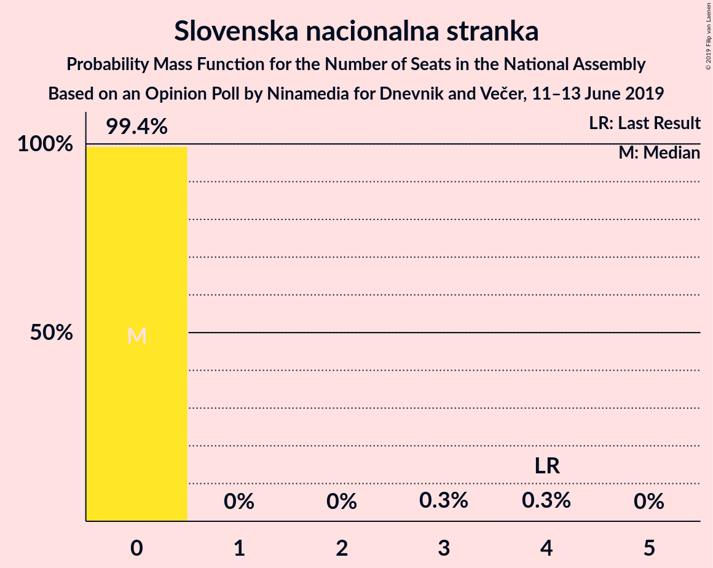
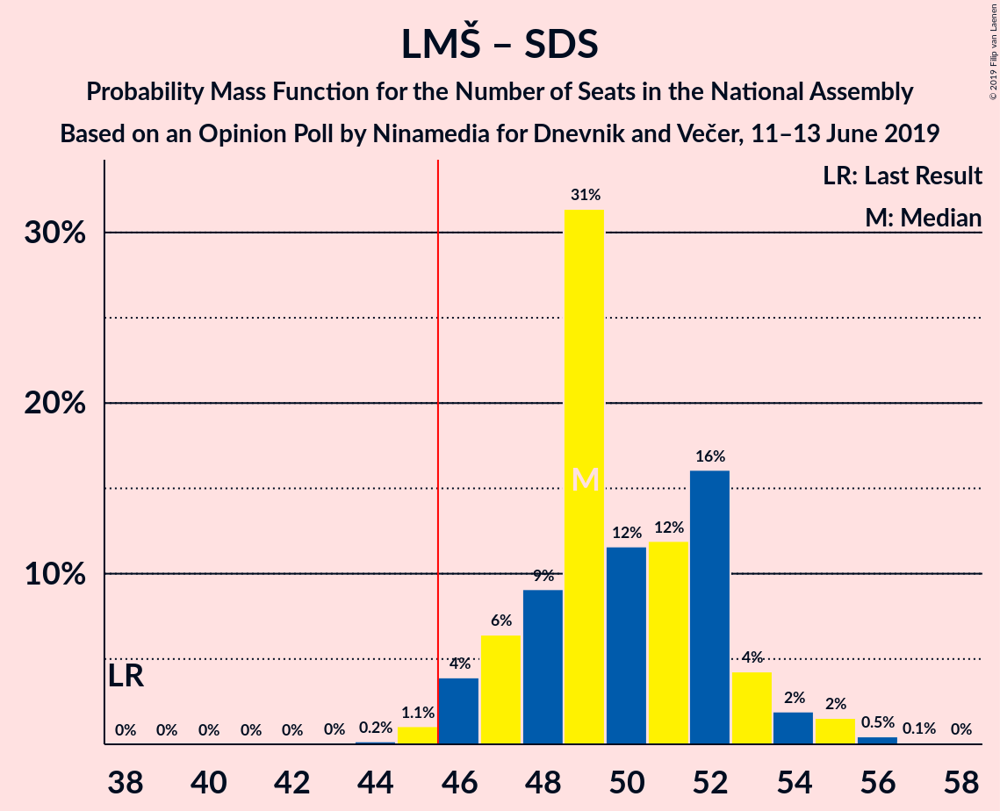
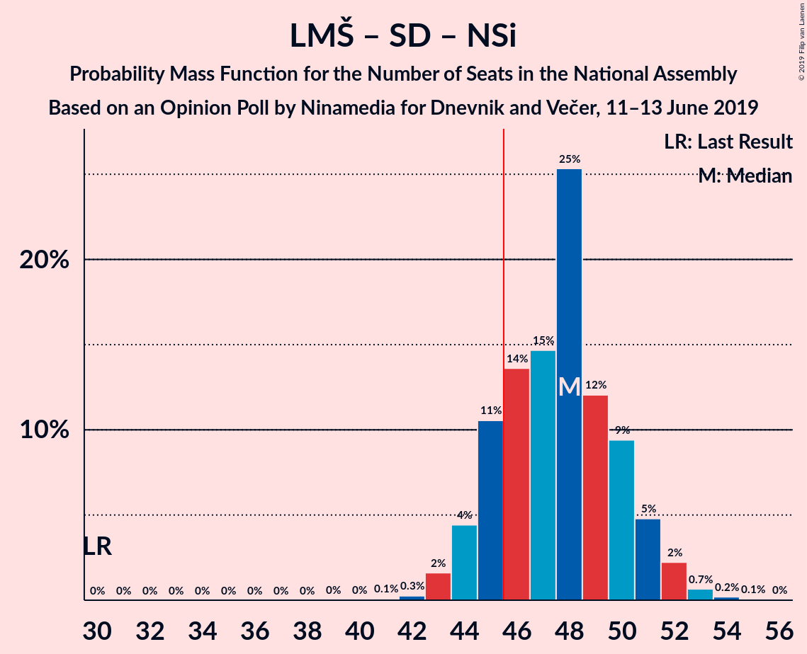
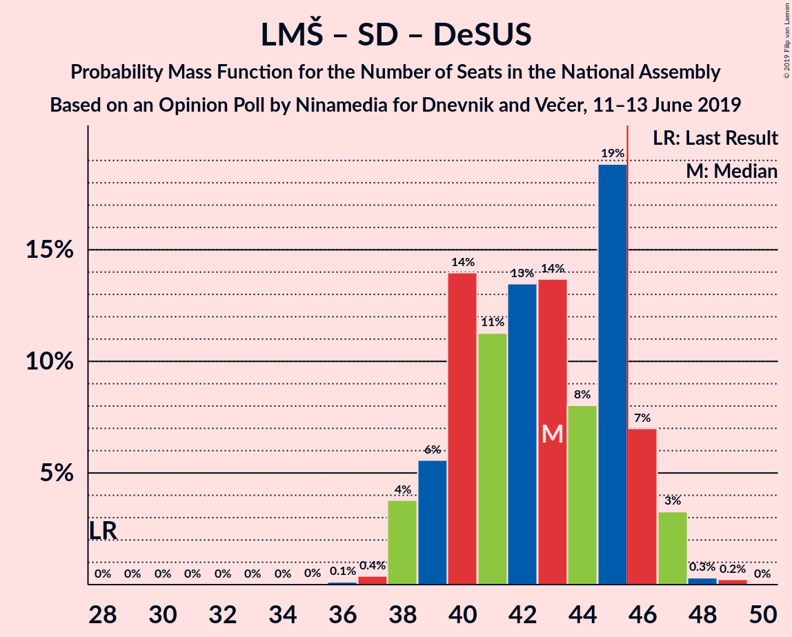

# Opinion Poll by Ninamedia for Dnevnik and Večer, 11–13 June 2019

<a href="#voting-intentions">Voting Intentions</a> | <a href="#seats">Seats</a> | <a href="#coalitions">Coalitions</a> | <a href="#technical-information">Technical Information</a>

## Voting Intentions

### Confidence Intervals

| Party | Last Result | Poll Result | 80% Confidence Interval | 90% Confidence Interval | 95% Confidence Interval | 99% Confidence Interval |
|:-----:|:-----------:|:-----------:|:-----------------------:|:-----------------------:|:-----------------------:|:-----------------------:|
| Lista Marjana Šarca | 12.6% | 29.6% | 27.4–31.9% |26.8–32.5% |26.3–33.1% |25.3–34.2% |
| Slovenska demokratska stranka | 24.9% | 22.3% | 20.4–24.4% |19.8–25.0% |19.4–25.5% |18.5–26.6% |
| Socialni demokrati | 9.9% | 12.1% | 10.7–13.9% |10.3–14.4% |9.9–14.8% |9.3–15.6% |
| Nova Slovenija–Krščanski demokrati | 7.2% | 8.0% | 6.8–9.5% |6.5–9.9% |6.2–10.3% |5.7–11.0% |
| Levica | 9.3% | 7.6% | 6.4–9.0% |6.1–9.4% |5.8–9.8% |5.3–10.5% |
| Demokratična stranka upokojencev Slovenije | 4.9% | 4.1% | 3.3–5.3% |3.1–5.6% |2.9–5.9% |2.5–6.5% |
| Slovenska nacionalna stranka | 4.2% | 2.1% | 1.6–3.0% |1.4–3.3% |1.3–3.5% |1.1–4.0% |
| Slovenska ljudska stranka | 2.6% | 2.0% | 1.5–2.9% |1.3–3.1% |1.2–3.3% |1.0–3.8% |
| Stranka Alenke Bratušek | 5.1% | 1.6% | 1.1–2.4% |1.0–2.6% |0.9–2.8% |0.7–3.2% |
| Stranka modernega centra | 9.7% | 0.7% | 0.4–1.3% |0.4–1.5% |0.3–1.7% |0.2–2.0% |

*Note:* The poll result column reflects the actual value used in the calculations. Published results may vary slightly, and in addition be rounded to fewer digits.

## Seats

### Confidence Intervals

| Party | Last Result | Median | 80% Confidence Interval | 90% Confidence Interval | 95% Confidence Interval | 99% Confidence Interval |
|:-----:|:-----------:|:------:|:-----------------------:|:-----------------------:|:-----------------------:|:-----------------------:|
| <a href="#lista-marjana-šarca">Lista Marjana Šarca</a> | 13 | 28 | 26–31 |25–32 |25–32 |24–33 |
| <a href="#slovenska-demokratska-stranka">Slovenska demokratska stranka</a> | 25 | 21 | 19–24 |19–24 |18–25 |17–26 |
| <a href="#socialni-demokrati">Socialni demokrati</a> | 10 | 12 | 10–13 |9–14 |9–14 |9–15 |
| <a href="#nova-slovenija–krščanski-demokrati">Nova Slovenija–Krščanski demokrati</a> | 7 | 8 | 6–9 |6–9 |5–10 |5–11 |
| <a href="#levica">Levica</a> | 9 | 7 | 6–8 |5–9 |5–9 |5–10 |
| <a href="#demokratična-stranka-upokojencev-slovenije">Demokratična stranka upokojencev Slovenije</a> | 5 | 4 | 0–5 |0–5 |0–5 |0–6 |
| <a href="#slovenska-nacionalna-stranka">Slovenska nacionalna stranka</a> | 4 | 0 | 0 |0 |0 |0–3 |
| <a href="#slovenska-ljudska-stranka">Slovenska ljudska stranka</a> | 0 | 0 | 0 |0 |0 |0 |
| <a href="#stranka-alenke-bratušek">Stranka Alenke Bratušek</a> | 5 | 0 | 0 |0 |0 |0 |
| <a href="#stranka-modernega-centra">Stranka modernega centra</a> | 10 | 0 | 0 |0 |0 |0 |

### Lista Marjana Šarca

*For a full overview of the results for this party, see the [Lista Marjana Šarca](party-listamarjanašarca.html) page.*

| Number of Seats | Probability | Accumulated | Special Marks |
|:---------------:|:-----------:|:-----------:|:-------------:|
| 13 | 0% | 100% | Last Result |
| 14 | 0% | 100% |  |
| 15 | 0% | 100% |  |
| 16 | 0% | 100% |  |
| 17 | 0% | 100% |  |
| 18 | 0% | 100% |  |
| 19 | 0% | 100% |  |
| 20 | 0% | 100% |  |
| 21 | 0% | 100% |  |
| 22 | 0% | 100% |  |
| 23 | 0.1% | 100% |  |
| 24 | 0.6% | 99.9% |  |
| 25 | 5% | 99.3% |  |
| 26 | 6% | 95% |  |
| 27 | 22% | 89% |  |
| 28 | 19% | 67% | Median |
| 29 | 20% | 48% |  |
| 30 | 14% | 28% |  |
| 31 | 7% | 14% |  |
| 32 | 6% | 6% |  |
| 33 | 0.6% | 0.9% |  |
| 34 | 0.2% | 0.4% |  |
| 35 | 0.1% | 0.2% |  |
| 36 | 0% | 0% |  |

### Slovenska demokratska stranka

*For a full overview of the results for this party, see the [Slovenska demokratska stranka](party-slovenskademokratskastranka.html) page.*

| Number of Seats | Probability | Accumulated | Special Marks |
|:---------------:|:-----------:|:-----------:|:-------------:|
| 17 | 0.6% | 100% |  |
| 18 | 4% | 99.3% |  |
| 19 | 12% | 96% |  |
| 20 | 20% | 84% |  |
| 21 | 14% | 64% | Median |
| 22 | 23% | 50% |  |
| 23 | 13% | 27% |  |
| 24 | 9% | 14% |  |
| 25 | 4% | 5% | Last Result |
| 26 | 0.4% | 0.7% |  |
| 27 | 0.2% | 0.3% |  |
| 28 | 0% | 0% |  |

### Socialni demokrati

*For a full overview of the results for this party, see the [Socialni demokrati](party-socialnidemokrati.html) page.*

| Number of Seats | Probability | Accumulated | Special Marks |
|:---------------:|:-----------:|:-----------:|:-------------:|
| 8 | 0.3% | 100% |  |
| 9 | 5% | 99.7% |  |
| 10 | 18% | 94% | Last Result |
| 11 | 26% | 76% |  |
| 12 | 22% | 50% | Median |
| 13 | 22% | 28% |  |
| 14 | 5% | 6% |  |
| 15 | 0.7% | 0.9% |  |
| 16 | 0.2% | 0.2% |  |
| 17 | 0% | 0% |  |

### Nova Slovenija–Krščanski demokrati

*For a full overview of the results for this party, see the [Nova Slovenija–Krščanski demokrati](party-novaslovenija–krščanskidemokrati.html) page.*

| Number of Seats | Probability | Accumulated | Special Marks |
|:---------------:|:-----------:|:-----------:|:-------------:|
| 4 | 0.1% | 100% |  |
| 5 | 4% | 99.9% |  |
| 6 | 7% | 96% |  |
| 7 | 35% | 89% | Last Result |
| 8 | 41% | 54% | Median |
| 9 | 10% | 13% |  |
| 10 | 2% | 3% |  |
| 11 | 1.0% | 1.0% |  |
| 12 | 0% | 0% |  |

### Levica

*For a full overview of the results for this party, see the [Levica](party-levica.html) page.*

| Number of Seats | Probability | Accumulated | Special Marks |
|:---------------:|:-----------:|:-----------:|:-------------:|
| 4 | 0.3% | 100% |  |
| 5 | 6% | 99.7% |  |
| 6 | 19% | 94% |  |
| 7 | 39% | 75% | Median |
| 8 | 31% | 37% |  |
| 9 | 5% | 6% | Last Result |
| 10 | 0.6% | 0.7% |  |
| 11 | 0.1% | 0.1% |  |
| 12 | 0% | 0% |  |

### Demokratična stranka upokojencev Slovenije

*For a full overview of the results for this party, see the [Demokratična stranka upokojencev Slovenije](party-demokratičnastrankaupokojencevslovenije.html) page.*

| Number of Seats | Probability | Accumulated | Special Marks |
|:---------------:|:-----------:|:-----------:|:-------------:|
| 0 | 40% | 100% |  |
| 1 | 0% | 60% |  |
| 2 | 0% | 60% |  |
| 3 | 5% | 60% |  |
| 4 | 34% | 55% | Median |
| 5 | 20% | 21% | Last Result |
| 6 | 1.1% | 1.2% |  |
| 7 | 0% | 0% |  |

### Slovenska nacionalna stranka

*For a full overview of the results for this party, see the [Slovenska nacionalna stranka](party-slovenskanacionalnastranka.html) page.*

| Number of Seats | Probability | Accumulated | Special Marks |
|:---------------:|:-----------:|:-----------:|:-------------:|
| 0 | 99.4% | 100% | Median |
| 1 | 0% | 0.6% |  |
| 2 | 0% | 0.6% |  |
| 3 | 0.3% | 0.6% |  |
| 4 | 0.3% | 0.3% | Last Result |
| 5 | 0% | 0% |  |

### Slovenska ljudska stranka

*For a full overview of the results for this party, see the [Slovenska ljudska stranka](party-slovenskaljudskastranka.html) page.*

| Number of Seats | Probability | Accumulated | Special Marks |
|:---------------:|:-----------:|:-----------:|:-------------:|
| 0 | 99.9% | 100% | Last Result, Median |
| 1 | 0% | 0.1% |  |
| 2 | 0% | 0.1% |  |
| 3 | 0% | 0.1% |  |
| 4 | 0.1% | 0.1% |  |
| 5 | 0% | 0% |  |

### Stranka Alenke Bratušek

*For a full overview of the results for this party, see the [Stranka Alenke Bratušek](party-strankaalenkebratušek.html) page.*

| Number of Seats | Probability | Accumulated | Special Marks |
|:---------------:|:-----------:|:-----------:|:-------------:|
| 0 | 100% | 100% | Median |
| 1 | 0% | 0% |  |
| 2 | 0% | 0% |  |
| 3 | 0% | 0% |  |
| 4 | 0% | 0% |  |
| 5 | 0% | 0% | Last Result |

### Stranka modernega centra

*For a full overview of the results for this party, see the [Stranka modernega centra](party-strankamodernegacentra.html) page.*

| Number of Seats | Probability | Accumulated | Special Marks |
|:---------------:|:-----------:|:-----------:|:-------------:|
| 0 | 100% | 100% | Median |
| 1 | 0% | 0% |  |
| 2 | 0% | 0% |  |
| 3 | 0% | 0% |  |
| 4 | 0% | 0% |  |
| 5 | 0% | 0% |  |
| 6 | 0% | 0% |  |
| 7 | 0% | 0% |  |
| 8 | 0% | 0% |  |
| 9 | 0% | 0% |  |
| 10 | 0% | 0% | Last Result |

## Coalitions

### Confidence Intervals

| Coalition | Last Result | Median | Majority? | 80% Confidence Interval | 90% Confidence Interval | 95% Confidence Interval | 99% Confidence Interval |
|:---------:|:-----------:|:------:|:---------:|:-----------------------:|:-----------------------:|:-----------------------:|:-----------------------:|
| Lista Marjana Šarca – Slovenska demokratska stranka – Demokratična stranka upokojencev Slovenije | 43 | 53 | 100% | 49–55 | 49–56 | 49–56 | 47–58 |
| Lista Marjana Šarca – Socialni demokrati – Nova Slovenija–Krščanski demokrati – Demokratična stranka upokojencev Slovenije | 35 | 50 | 99.2% | 47–53 | 46–54 | 46–55 | 45–55 |
| Lista Marjana Šarca – Socialni demokrati – Nova Slovenija–Krščanski demokrati – Demokratična stranka upokojencev Slovenije – Stranka Alenke Bratušek – Stranka modernega centra | 50 | 50 | 99.2% | 47–53 | 46–54 | 46–55 | 45–55 |
| Lista Marjana Šarca – Socialni demokrati – Nova Slovenija–Krščanski demokrati – Demokratična stranka upokojencev Slovenije – Stranka modernega centra | 45 | 50 | 99.2% | 47–53 | 46–54 | 46–55 | 45–55 |
| Lista Marjana Šarca – Slovenska demokratska stranka | 38 | 49 | 98.7% | 47–52 | 46–53 | 46–54 | 45–56 |
| Lista Marjana Šarca – Socialni demokrati – Nova Slovenija–Krščanski demokrati | 30 | 48 | 83% | 45–50 | 44–51 | 44–52 | 43–53 |
| Lista Marjana Šarca – Socialni demokrati – Nova Slovenija–Krščanski demokrati – Stranka modernega centra | 40 | 48 | 83% | 45–50 | 44–51 | 44–52 | 43–53 |
| Lista Marjana Šarca – Socialni demokrati – Demokratična stranka upokojencev Slovenije | 28 | 43 | 11% | 40–46 | 39–46 | 38–47 | 37–48 |
| Lista Marjana Šarca – Socialni demokrati – Demokratična stranka upokojencev Slovenije – Stranka Alenke Bratušek – Stranka modernega centra | 43 | 43 | 11% | 40–46 | 39–46 | 38–47 | 37–48 |
| Lista Marjana Šarca – Socialni demokrati – Demokratična stranka upokojencev Slovenije – Stranka modernega centra | 38 | 43 | 11% | 40–46 | 39–46 | 38–47 | 37–48 |
| Lista Marjana Šarca – Socialni demokrati | 23 | 40 | 0.7% | 38–42 | 37–43 | 36–44 | 35–46 |
| Lista Marjana Šarca – Socialni demokrati – Stranka modernega centra | 33 | 40 | 0.7% | 38–42 | 37–43 | 36–44 | 35–46 |
| Socialni demokrati – Demokratična stranka upokojencev Slovenije – Stranka modernega centra | 25 | 15 | 0% | 11–17 | 10–17 | 10–18 | 9–19 |

### Lista Marjana Šarca – Slovenska demokratska stranka – Demokratična stranka upokojencev Slovenije

| Number of Seats | Probability | Accumulated | Special Marks |
|:---------------:|:-----------:|:-----------:|:-------------:|
| 43 | 0% | 100% | Last Result |
| 44 | 0% | 100% |  |
| 45 | 0% | 100% |  |
| 46 | 0.3% | 100% | Majority |
| 47 | 0.4% | 99.7% |  |
| 48 | 0.4% | 99.2% |  |
| 49 | 12% | 98.8% |  |
| 50 | 7% | 87% |  |
| 51 | 9% | 80% |  |
| 52 | 21% | 71% |  |
| 53 | 21% | 50% | Median |
| 54 | 14% | 29% |  |
| 55 | 7% | 16% |  |
| 56 | 6% | 9% |  |
| 57 | 1.5% | 2% |  |
| 58 | 0.9% | 1.0% |  |
| 59 | 0.1% | 0.1% |  |
| 60 | 0% | 0% |  |

### Lista Marjana Šarca – Socialni demokrati – Nova Slovenija–Krščanski demokrati – Demokratična stranka upokojencev Slovenije

| Number of Seats | Probability | Accumulated | Special Marks |
|:---------------:|:-----------:|:-----------:|:-------------:|
| 35 | 0% | 100% | Last Result |
| 36 | 0% | 100% |  |
| 37 | 0% | 100% |  |
| 38 | 0% | 100% |  |
| 39 | 0% | 100% |  |
| 40 | 0% | 100% |  |
| 41 | 0% | 100% |  |
| 42 | 0% | 100% |  |
| 43 | 0.1% | 100% |  |
| 44 | 0.3% | 99.9% |  |
| 45 | 0.5% | 99.7% |  |
| 46 | 7% | 99.2% | Majority |
| 47 | 3% | 92% |  |
| 48 | 16% | 89% |  |
| 49 | 11% | 73% |  |
| 50 | 19% | 62% |  |
| 51 | 9% | 43% |  |
| 52 | 19% | 34% | Median |
| 53 | 9% | 15% |  |
| 54 | 4% | 7% |  |
| 55 | 2% | 3% |  |
| 56 | 0.2% | 0.2% |  |
| 57 | 0% | 0% |  |

### Lista Marjana Šarca – Socialni demokrati – Nova Slovenija–Krščanski demokrati – Demokratična stranka upokojencev Slovenije – Stranka Alenke Bratušek – Stranka modernega centra

| Number of Seats | Probability | Accumulated | Special Marks |
|:---------------:|:-----------:|:-----------:|:-------------:|
| 43 | 0.1% | 100% |  |
| 44 | 0.3% | 99.9% |  |
| 45 | 0.5% | 99.7% |  |
| 46 | 7% | 99.2% | Majority |
| 47 | 3% | 92% |  |
| 48 | 16% | 89% |  |
| 49 | 11% | 73% |  |
| 50 | 19% | 62% | Last Result |
| 51 | 9% | 43% |  |
| 52 | 19% | 34% | Median |
| 53 | 9% | 15% |  |
| 54 | 4% | 7% |  |
| 55 | 2% | 3% |  |
| 56 | 0.2% | 0.2% |  |
| 57 | 0% | 0% |  |

### Lista Marjana Šarca – Socialni demokrati – Nova Slovenija–Krščanski demokrati – Demokratična stranka upokojencev Slovenije – Stranka modernega centra

| Number of Seats | Probability | Accumulated | Special Marks |
|:---------------:|:-----------:|:-----------:|:-------------:|
| 43 | 0.1% | 100% |  |
| 44 | 0.3% | 99.9% |  |
| 45 | 0.5% | 99.7% | Last Result |
| 46 | 7% | 99.2% | Majority |
| 47 | 3% | 92% |  |
| 48 | 16% | 89% |  |
| 49 | 11% | 73% |  |
| 50 | 19% | 62% |  |
| 51 | 9% | 43% |  |
| 52 | 19% | 34% | Median |
| 53 | 9% | 15% |  |
| 54 | 4% | 7% |  |
| 55 | 2% | 3% |  |
| 56 | 0.2% | 0.2% |  |
| 57 | 0% | 0% |  |

### Lista Marjana Šarca – Slovenska demokratska stranka

| Number of Seats | Probability | Accumulated | Special Marks |
|:---------------:|:-----------:|:-----------:|:-------------:|
| 38 | 0% | 100% | Last Result |
| 39 | 0% | 100% |  |
| 40 | 0% | 100% |  |
| 41 | 0% | 100% |  |
| 42 | 0% | 100% |  |
| 43 | 0% | 100% |  |
| 44 | 0.2% | 100% |  |
| 45 | 1.1% | 99.8% |  |
| 46 | 4% | 98.7% | Majority |
| 47 | 6% | 95% |  |
| 48 | 9% | 88% |  |
| 49 | 31% | 79% | Median |
| 50 | 12% | 48% |  |
| 51 | 12% | 36% |  |
| 52 | 16% | 24% |  |
| 53 | 4% | 8% |  |
| 54 | 2% | 4% |  |
| 55 | 2% | 2% |  |
| 56 | 0.5% | 0.6% |  |
| 57 | 0.1% | 0.1% |  |
| 58 | 0% | 0% |  |

### Lista Marjana Šarca – Socialni demokrati – Nova Slovenija–Krščanski demokrati

| Number of Seats | Probability | Accumulated | Special Marks |
|:---------------:|:-----------:|:-----------:|:-------------:|
| 30 | 0% | 100% | Last Result |
| 31 | 0% | 100% |  |
| 32 | 0% | 100% |  |
| 33 | 0% | 100% |  |
| 34 | 0% | 100% |  |
| 35 | 0% | 100% |  |
| 36 | 0% | 100% |  |
| 37 | 0% | 100% |  |
| 38 | 0% | 100% |  |
| 39 | 0% | 100% |  |
| 40 | 0% | 100% |  |
| 41 | 0.1% | 100% |  |
| 42 | 0.3% | 99.9% |  |
| 43 | 2% | 99.6% |  |
| 44 | 4% | 98% |  |
| 45 | 11% | 94% |  |
| 46 | 14% | 83% | Majority |
| 47 | 15% | 69% |  |
| 48 | 25% | 55% | Median |
| 49 | 12% | 29% |  |
| 50 | 9% | 17% |  |
| 51 | 5% | 8% |  |
| 52 | 2% | 3% |  |
| 53 | 0.7% | 0.9% |  |
| 54 | 0.2% | 0.3% |  |
| 55 | 0.1% | 0.1% |  |
| 56 | 0% | 0% |  |

### Lista Marjana Šarca – Socialni demokrati – Nova Slovenija–Krščanski demokrati – Stranka modernega centra

| Number of Seats | Probability | Accumulated | Special Marks |
|:---------------:|:-----------:|:-----------:|:-------------:|
| 40 | 0% | 100% | Last Result |
| 41 | 0.1% | 100% |  |
| 42 | 0.3% | 99.9% |  |
| 43 | 2% | 99.6% |  |
| 44 | 4% | 98% |  |
| 45 | 11% | 94% |  |
| 46 | 14% | 83% | Majority |
| 47 | 15% | 69% |  |
| 48 | 25% | 55% | Median |
| 49 | 12% | 29% |  |
| 50 | 9% | 17% |  |
| 51 | 5% | 8% |  |
| 52 | 2% | 3% |  |
| 53 | 0.7% | 0.9% |  |
| 54 | 0.2% | 0.3% |  |
| 55 | 0.1% | 0.1% |  |
| 56 | 0% | 0% |  |

### Lista Marjana Šarca – Socialni demokrati – Demokratična stranka upokojencev Slovenije

| Number of Seats | Probability | Accumulated | Special Marks |
|:---------------:|:-----------:|:-----------:|:-------------:|
| 28 | 0% | 100% | Last Result |
| 29 | 0% | 100% |  |
| 30 | 0% | 100% |  |
| 31 | 0% | 100% |  |
| 32 | 0% | 100% |  |
| 33 | 0% | 100% |  |
| 34 | 0% | 100% |  |
| 35 | 0% | 100% |  |
| 36 | 0.1% | 100% |  |
| 37 | 0.4% | 99.8% |  |
| 38 | 4% | 99.5% |  |
| 39 | 6% | 96% |  |
| 40 | 14% | 90% |  |
| 41 | 11% | 76% |  |
| 42 | 13% | 65% |  |
| 43 | 14% | 51% |  |
| 44 | 8% | 38% | Median |
| 45 | 19% | 30% |  |
| 46 | 7% | 11% | Majority |
| 47 | 3% | 4% |  |
| 48 | 0.3% | 0.6% |  |
| 49 | 0.2% | 0.3% |  |
| 50 | 0% | 0% |  |

### Lista Marjana Šarca – Socialni demokrati – Demokratična stranka upokojencev Slovenije – Stranka Alenke Bratušek – Stranka modernega centra

| Number of Seats | Probability | Accumulated | Special Marks |
|:---------------:|:-----------:|:-----------:|:-------------:|
| 36 | 0.1% | 100% |  |
| 37 | 0.4% | 99.8% |  |
| 38 | 4% | 99.5% |  |
| 39 | 6% | 96% |  |
| 40 | 14% | 90% |  |
| 41 | 11% | 76% |  |
| 42 | 13% | 65% |  |
| 43 | 14% | 51% | Last Result |
| 44 | 8% | 38% | Median |
| 45 | 19% | 30% |  |
| 46 | 7% | 11% | Majority |
| 47 | 3% | 4% |  |
| 48 | 0.3% | 0.6% |  |
| 49 | 0.2% | 0.3% |  |
| 50 | 0% | 0% |  |

### Lista Marjana Šarca – Socialni demokrati – Demokratična stranka upokojencev Slovenije – Stranka modernega centra

| Number of Seats | Probability | Accumulated | Special Marks |
|:---------------:|:-----------:|:-----------:|:-------------:|
| 36 | 0.1% | 100% |  |
| 37 | 0.4% | 99.8% |  |
| 38 | 4% | 99.5% | Last Result |
| 39 | 6% | 96% |  |
| 40 | 14% | 90% |  |
| 41 | 11% | 76% |  |
| 42 | 13% | 65% |  |
| 43 | 14% | 51% |  |
| 44 | 8% | 38% | Median |
| 45 | 19% | 30% |  |
| 46 | 7% | 11% | Majority |
| 47 | 3% | 4% |  |
| 48 | 0.3% | 0.6% |  |
| 49 | 0.2% | 0.3% |  |
| 50 | 0% | 0% |  |

### Lista Marjana Šarca – Socialni demokrati

| Number of Seats | Probability | Accumulated | Special Marks |
|:---------------:|:-----------:|:-----------:|:-------------:|
| 23 | 0% | 100% | Last Result |
| 24 | 0% | 100% |  |
| 25 | 0% | 100% |  |
| 26 | 0% | 100% |  |
| 27 | 0% | 100% |  |
| 28 | 0% | 100% |  |
| 29 | 0% | 100% |  |
| 30 | 0% | 100% |  |
| 31 | 0% | 100% |  |
| 32 | 0% | 100% |  |
| 33 | 0% | 100% |  |
| 34 | 0.3% | 100% |  |
| 35 | 0.6% | 99.7% |  |
| 36 | 3% | 99.1% |  |
| 37 | 4% | 96% |  |
| 38 | 14% | 92% |  |
| 39 | 14% | 78% |  |
| 40 | 24% | 64% | Median |
| 41 | 21% | 40% |  |
| 42 | 11% | 19% |  |
| 43 | 5% | 8% |  |
| 44 | 1.1% | 3% |  |
| 45 | 1.2% | 2% |  |
| 46 | 0.5% | 0.7% | Majority |
| 47 | 0.1% | 0.1% |  |
| 48 | 0.1% | 0.1% |  |
| 49 | 0% | 0% |  |

### Lista Marjana Šarca – Socialni demokrati – Stranka modernega centra

| Number of Seats | Probability | Accumulated | Special Marks |
|:---------------:|:-----------:|:-----------:|:-------------:|
| 33 | 0% | 100% | Last Result |
| 34 | 0.3% | 100% |  |
| 35 | 0.6% | 99.7% |  |
| 36 | 3% | 99.1% |  |
| 37 | 4% | 96% |  |
| 38 | 14% | 92% |  |
| 39 | 14% | 78% |  |
| 40 | 24% | 64% | Median |
| 41 | 21% | 40% |  |
| 42 | 11% | 19% |  |
| 43 | 5% | 8% |  |
| 44 | 1.1% | 3% |  |
| 45 | 1.2% | 2% |  |
| 46 | 0.5% | 0.7% | Majority |
| 47 | 0.1% | 0.1% |  |
| 48 | 0.1% | 0.1% |  |
| 49 | 0% | 0% |  |

### Socialni demokrati – Demokratična stranka upokojencev Slovenije – Stranka modernega centra

| Number of Seats | Probability | Accumulated | Special Marks |
|:---------------:|:-----------:|:-----------:|:-------------:|
| 9 | 1.0% | 100% |  |
| 10 | 4% | 99.0% |  |
| 11 | 12% | 95% |  |
| 12 | 5% | 83% |  |
| 13 | 18% | 78% |  |
| 14 | 8% | 60% |  |
| 15 | 21% | 52% |  |
| 16 | 18% | 31% | Median |
| 17 | 10% | 13% |  |
| 18 | 3% | 4% |  |
| 19 | 0.6% | 0.7% |  |
| 20 | 0.1% | 0.1% |  |
| 21 | 0% | 0% |  |
| 22 | 0% | 0% |  |
| 23 | 0% | 0% |  |
| 24 | 0% | 0% |  |
| 25 | 0% | 0% | Last Result |

## Technical Information

### Opinion Poll

+ **Polling firm:** Ninamedia
+ **Commissioner(s):** Dnevnik and Večer
+ **Fieldwork period:** 11–13 June 2019

### Calculations

+ **Sample size:** 700
+ **Simulations done:** 1,048,576
+ **Error estimate:** 3.52%

