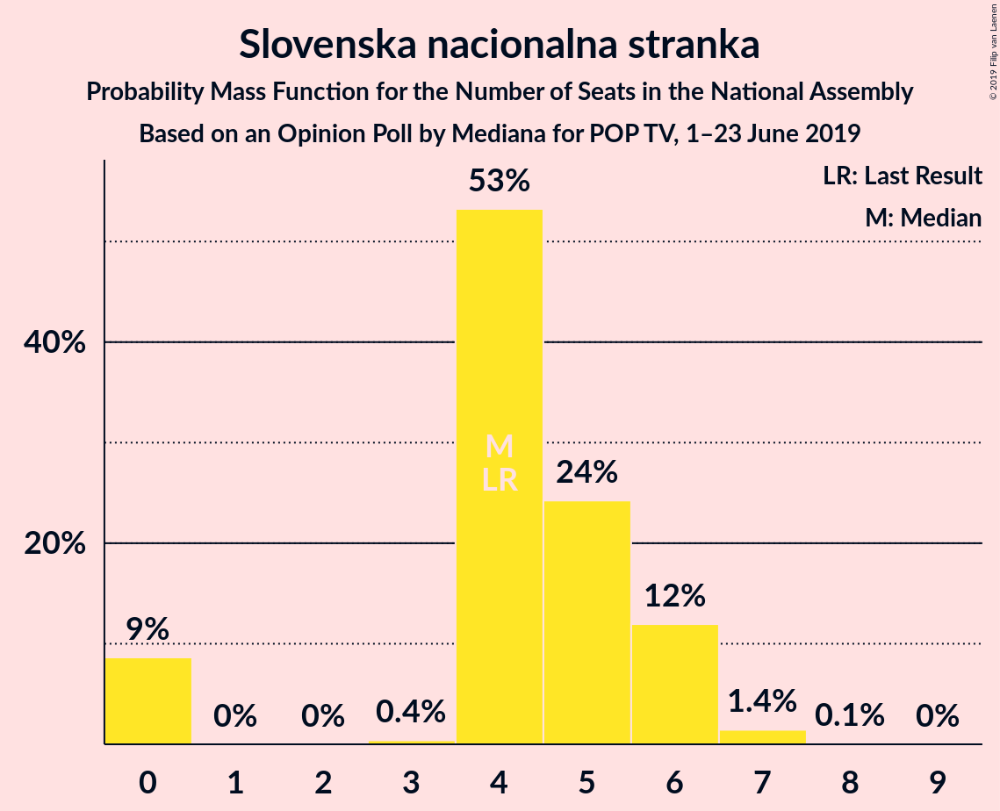
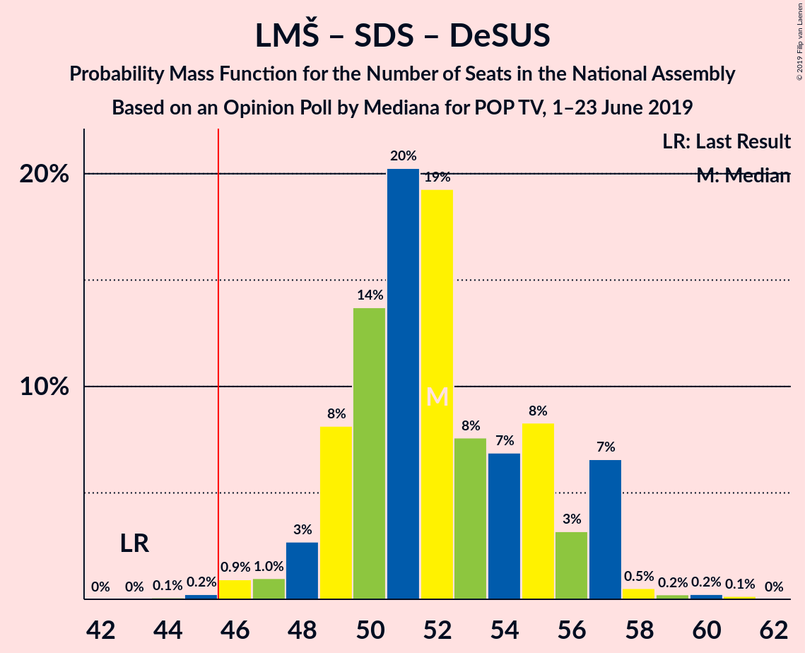
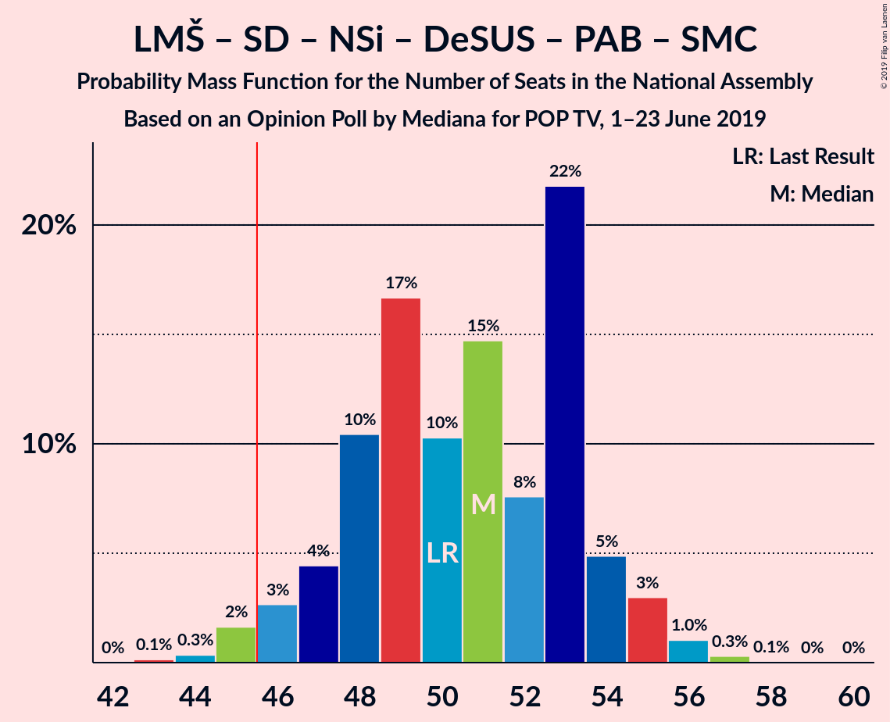
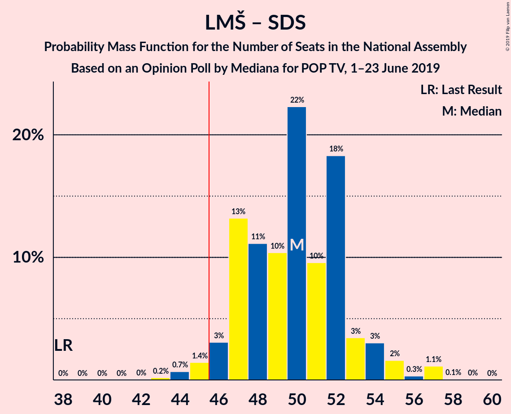
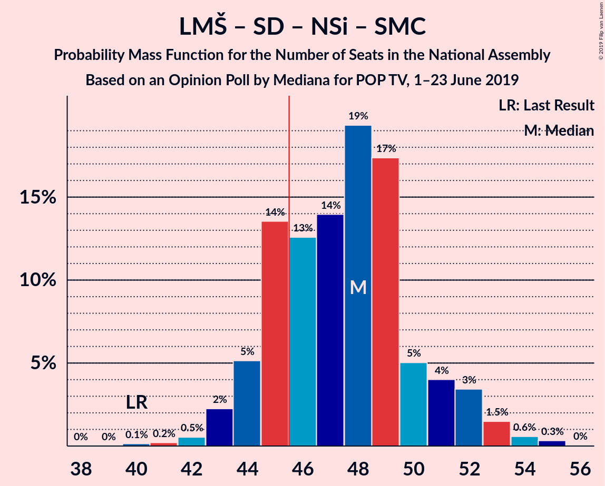
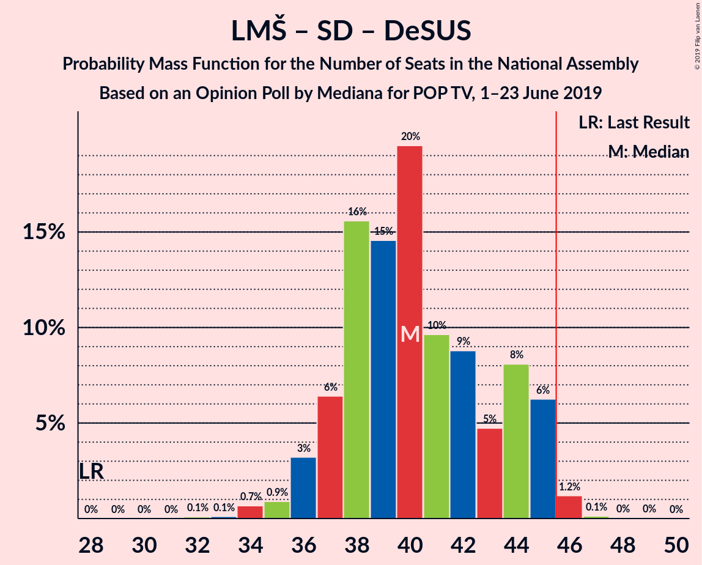
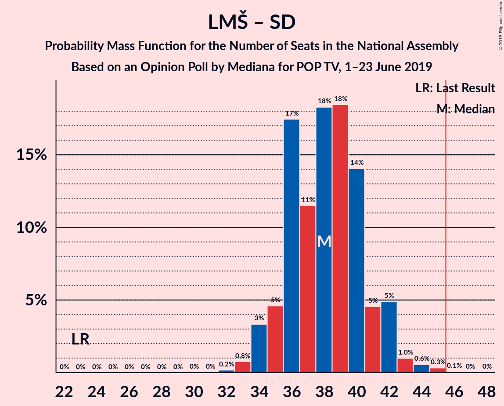

# Opinion Poll by Mediana for POP TV, 1–23 June 2019

<a href="#voting-intentions">Voting Intentions</a> | <a href="#seats">Seats</a> | <a href="#coalitions">Coalitions</a> | <a href="#technical-information">Technical Information</a>

## Voting Intentions

### Confidence Intervals

| Party | Last Result | Poll Result | 80% Confidence Interval | 90% Confidence Interval | 95% Confidence Interval | 99% Confidence Interval |
|:-----:|:-----------:|:-----------:|:-----------------------:|:-----------------------:|:-----------------------:|:-----------------------:|
| Lista Marjana Šarca | 12.6% | 26.9% | 24.8–29.1% |24.2–29.7% |23.8–30.3% |22.8–31.3% |
| Slovenska demokratska stranka | 24.9% | 24.2% | 22.3–26.4% |21.7–27.0% |21.2–27.5% |20.3–28.5% |
| Socialni demokrati | 9.9% | 12.3% | 10.8–14.0% |10.4–14.4% |10.1–14.9% |9.4–15.7% |
| Levica | 9.3% | 9.5% | 8.2–11.0% |7.8–11.5% |7.5–11.8% |7.0–12.6% |
| Nova Slovenija–Krščanski demokrati | 7.2% | 9.5% | 8.2–11.0% |7.8–11.5% |7.5–11.8% |7.0–12.6% |
| Slovenska nacionalna stranka | 4.2% | 4.7% | 3.9–5.9% |3.6–6.2% |3.4–6.6% |3.0–7.2% |
| Demokratična stranka upokojencev Slovenije | 4.9% | 3.9% | 3.1–5.0% |2.9–5.3% |2.7–5.6% |2.4–6.2% |
| Stranka Alenke Bratušek | 5.1% | 3.2% | 2.5–4.2% |2.3–4.5% |2.1–4.8% |1.8–5.3% |
| Slovenska ljudska stranka | 2.6% | 3.2% | 2.5–4.2% |2.3–4.5% |2.1–4.8% |1.8–5.3% |
| Stranka modernega centra | 9.7% | 1.9% | 1.4–2.8% |1.3–3.0% |1.2–3.2% |1.0–3.7% |

*Note:* The poll result column reflects the actual value used in the calculations. Published results may vary slightly, and in addition be rounded to fewer digits.

## Seats

### Confidence Intervals

| Party | Last Result | Median | 80% Confidence Interval | 90% Confidence Interval | 95% Confidence Interval | 99% Confidence Interval |
|:-----:|:-----------:|:------:|:-----------------------:|:-----------------------:|:-----------------------:|:-----------------------:|
| <a href="#lista-marjana-šarca">Lista Marjana Šarca</a> | 13 | 27 | 24–28 |23–29 |23–30 |22–32 |
| <a href="#slovenska-demokratska-stranka">Slovenska demokratska stranka</a> | 25 | 23 | 22–26 |20–27 |20–28 |20–29 |
| <a href="#socialni-demokrati">Socialni demokrati</a> | 10 | 11 | 10–13 |10–14 |9–15 |9–15 |
| <a href="#levica">Levica</a> | 9 | 9 | 8–11 |7–11 |7–12 |6–13 |
| <a href="#nova-slovenija–krščanski-demokrati">Nova Slovenija–Krščanski demokrati</a> | 7 | 9 | 8–11 |8–11 |7–12 |6–12 |
| <a href="#slovenska-nacionalna-stranka">Slovenska nacionalna stranka</a> | 4 | 4 | 4–6 |0–6 |0–6 |0–7 |
| <a href="#demokratična-stranka-upokojencev-slovenije">Demokratična stranka upokojencev Slovenije</a> | 5 | 0 | 0–5 |0–5 |0–5 |0–5 |
| <a href="#stranka-alenke-bratušek">Stranka Alenke Bratušek</a> | 5 | 0 | 0–4 |0–4 |0–4 |0–5 |
| <a href="#slovenska-ljudska-stranka">Slovenska ljudska stranka</a> | 0 | 0 | 0 |0–4 |0–4 |0–5 |
| <a href="#stranka-modernega-centra">Stranka modernega centra</a> | 10 | 0 | 0 |0 |0 |0 |

### Lista Marjana Šarca

*For a full overview of the results for this party, see the [Lista Marjana Šarca](party-listamarjanašarca.html) page.*

| Number of Seats | Probability | Accumulated | Special Marks |
|:---------------:|:-----------:|:-----------:|:-------------:|
| 13 | 0% | 100% | Last Result |
| 14 | 0% | 100% |  |
| 15 | 0% | 100% |  |
| 16 | 0% | 100% |  |
| 17 | 0% | 100% |  |
| 18 | 0% | 100% |  |
| 19 | 0% | 100% |  |
| 20 | 0% | 100% |  |
| 21 | 0.3% | 100% |  |
| 22 | 1.2% | 99.7% |  |
| 23 | 4% | 98.6% |  |
| 24 | 7% | 94% |  |
| 25 | 19% | 87% |  |
| 26 | 15% | 67% |  |
| 27 | 20% | 52% | Median |
| 28 | 26% | 33% |  |
| 29 | 4% | 7% |  |
| 30 | 2% | 3% |  |
| 31 | 0.6% | 1.1% |  |
| 32 | 0.3% | 0.6% |  |
| 33 | 0.3% | 0.3% |  |
| 34 | 0% | 0% |  |

### Slovenska demokratska stranka

*For a full overview of the results for this party, see the [Slovenska demokratska stranka](party-slovenskademokratskastranka.html) page.*

| Number of Seats | Probability | Accumulated | Special Marks |
|:---------------:|:-----------:|:-----------:|:-------------:|
| 18 | 0.1% | 100% |  |
| 19 | 0.4% | 99.9% |  |
| 20 | 5% | 99.5% |  |
| 21 | 3% | 95% |  |
| 22 | 25% | 91% |  |
| 23 | 16% | 66% | Median |
| 24 | 26% | 50% |  |
| 25 | 12% | 24% | Last Result |
| 26 | 6% | 12% |  |
| 27 | 3% | 6% |  |
| 28 | 2% | 3% |  |
| 29 | 0.8% | 0.9% |  |
| 30 | 0.1% | 0.1% |  |
| 31 | 0.1% | 0.1% |  |
| 32 | 0% | 0% |  |

### Socialni demokrati

*For a full overview of the results for this party, see the [Socialni demokrati](party-socialnidemokrati.html) page.*

| Number of Seats | Probability | Accumulated | Special Marks |
|:---------------:|:-----------:|:-----------:|:-------------:|
| 8 | 0.3% | 100% |  |
| 9 | 2% | 99.7% |  |
| 10 | 9% | 97% | Last Result |
| 11 | 40% | 88% | Median |
| 12 | 26% | 48% |  |
| 13 | 13% | 22% |  |
| 14 | 5% | 9% |  |
| 15 | 4% | 4% |  |
| 16 | 0.2% | 0.2% |  |
| 17 | 0% | 0% |  |

### Levica

*For a full overview of the results for this party, see the [Levica](party-levica.html) page.*

| Number of Seats | Probability | Accumulated | Special Marks |
|:---------------:|:-----------:|:-----------:|:-------------:|
| 5 | 0.1% | 100% |  |
| 6 | 0.9% | 99.9% |  |
| 7 | 8% | 99.1% |  |
| 8 | 17% | 91% |  |
| 9 | 30% | 74% | Last Result, Median |
| 10 | 25% | 45% |  |
| 11 | 15% | 19% |  |
| 12 | 4% | 4% |  |
| 13 | 0.4% | 0.5% |  |
| 14 | 0.2% | 0.2% |  |
| 15 | 0% | 0% |  |

### Nova Slovenija–Krščanski demokrati

*For a full overview of the results for this party, see the [Nova Slovenija–Krščanski demokrati](party-novaslovenija–krščanskidemokrati.html) page.*

| Number of Seats | Probability | Accumulated | Special Marks |
|:---------------:|:-----------:|:-----------:|:-------------:|
| 6 | 0.5% | 100% |  |
| 7 | 4% | 99.5% | Last Result |
| 8 | 15% | 95% |  |
| 9 | 38% | 80% | Median |
| 10 | 29% | 42% |  |
| 11 | 9% | 14% |  |
| 12 | 4% | 5% |  |
| 13 | 0.3% | 0.4% |  |
| 14 | 0% | 0.1% |  |
| 15 | 0% | 0% |  |

### Slovenska nacionalna stranka

*For a full overview of the results for this party, see the [Slovenska nacionalna stranka](party-slovenskanacionalnastranka.html) page.*

| Number of Seats | Probability | Accumulated | Special Marks |
|:---------------:|:-----------:|:-----------:|:-------------:|
| 0 | 9% | 100% |  |
| 1 | 0% | 91% |  |
| 2 | 0% | 91% |  |
| 3 | 0.4% | 91% |  |
| 4 | 53% | 91% | Last Result, Median |
| 5 | 24% | 38% |  |
| 6 | 12% | 13% |  |
| 7 | 1.4% | 2% |  |
| 8 | 0.1% | 0.1% |  |
| 9 | 0% | 0% |  |

### Demokratična stranka upokojencev Slovenije

*For a full overview of the results for this party, see the [Demokratična stranka upokojencev Slovenije](party-demokratičnastrankaupokojencevslovenije.html) page.*

| Number of Seats | Probability | Accumulated | Special Marks |
|:---------------:|:-----------:|:-----------:|:-------------:|
| 0 | 51% | 100% | Median |
| 1 | 0% | 49% |  |
| 2 | 0% | 49% |  |
| 3 | 1.0% | 49% |  |
| 4 | 32% | 48% |  |
| 5 | 16% | 17% | Last Result |
| 6 | 0.4% | 0.5% |  |
| 7 | 0% | 0% |  |

### Stranka Alenke Bratušek

*For a full overview of the results for this party, see the [Stranka Alenke Bratušek](party-strankaalenkebratušek.html) page.*

| Number of Seats | Probability | Accumulated | Special Marks |
|:---------------:|:-----------:|:-----------:|:-------------:|
| 0 | 75% | 100% | Median |
| 1 | 0% | 25% |  |
| 2 | 0% | 25% |  |
| 3 | 1.0% | 25% |  |
| 4 | 23% | 25% |  |
| 5 | 2% | 2% | Last Result |
| 6 | 0% | 0% |  |

### Slovenska ljudska stranka

*For a full overview of the results for this party, see the [Slovenska ljudska stranka](party-slovenskaljudskastranka.html) page.*

| Number of Seats | Probability | Accumulated | Special Marks |
|:---------------:|:-----------:|:-----------:|:-------------:|
| 0 | 91% | 100% | Last Result, Median |
| 1 | 0% | 9% |  |
| 2 | 0% | 9% |  |
| 3 | 0.4% | 9% |  |
| 4 | 8% | 9% |  |
| 5 | 0.9% | 1.0% |  |
| 6 | 0.1% | 0.1% |  |
| 7 | 0% | 0% |  |

### Stranka modernega centra

*For a full overview of the results for this party, see the [Stranka modernega centra](party-strankamodernegacentra.html) page.*

| Number of Seats | Probability | Accumulated | Special Marks |
|:---------------:|:-----------:|:-----------:|:-------------:|
| 0 | 99.9% | 100% | Median |
| 1 | 0% | 0.1% |  |
| 2 | 0% | 0.1% |  |
| 3 | 0% | 0.1% |  |
| 4 | 0.1% | 0.1% |  |
| 5 | 0% | 0% |  |
| 6 | 0% | 0% |  |
| 7 | 0% | 0% |  |
| 8 | 0% | 0% |  |
| 9 | 0% | 0% |  |
| 10 | 0% | 0% | Last Result |

## Coalitions

### Confidence Intervals

| Coalition | Last Result | Median | Majority? | 80% Confidence Interval | 90% Confidence Interval | 95% Confidence Interval | 99% Confidence Interval |
|:---------:|:-----------:|:------:|:---------:|:-----------------------:|:-----------------------:|:-----------------------:|:-----------------------:|
| Lista Marjana Šarca – Slovenska demokratska stranka – Demokratična stranka upokojencev Slovenije | 43 | 52 | 99.7% | 49–56 | 49–57 | 48–57 | 46–59 |
| Lista Marjana Šarca – Socialni demokrati – Nova Slovenija–Krščanski demokrati – Demokratična stranka upokojencev Slovenije – Stranka Alenke Bratušek – Stranka modernega centra | 50 | 51 | 98% | 48–53 | 47–54 | 46–55 | 44–56 |
| Lista Marjana Šarca – Slovenska demokratska stranka | 38 | 50 | 98% | 47–52 | 46–54 | 46–55 | 44–57 |
| Lista Marjana Šarca – Socialni demokrati – Nova Slovenija–Krščanski demokrati – Demokratična stranka upokojencev Slovenije | 35 | 49 | 96% | 47–53 | 46–54 | 45–54 | 43–55 |
| Lista Marjana Šarca – Socialni demokrati – Nova Slovenija–Krščanski demokrati – Demokratična stranka upokojencev Slovenije – Stranka modernega centra | 45 | 49 | 96% | 47–53 | 46–54 | 45–54 | 43–55 |
| Lista Marjana Šarca – Socialni demokrati – Nova Slovenija–Krščanski demokrati | 30 | 48 | 78% | 45–50 | 44–52 | 43–52 | 42–54 |
| Lista Marjana Šarca – Socialni demokrati – Nova Slovenija–Krščanski demokrati – Stranka modernega centra | 40 | 48 | 78% | 45–50 | 44–52 | 43–52 | 42–54 |
| Lista Marjana Šarca – Socialni demokrati – Demokratična stranka upokojencev Slovenije – Stranka Alenke Bratušek – Stranka modernega centra | 43 | 42 | 3% | 38–45 | 37–45 | 36–46 | 35–48 |
| Lista Marjana Šarca – Socialni demokrati – Demokratična stranka upokojencev Slovenije | 28 | 40 | 1.4% | 37–44 | 37–45 | 36–45 | 34–46 |
| Lista Marjana Šarca – Socialni demokrati – Demokratična stranka upokojencev Slovenije – Stranka modernega centra | 38 | 40 | 1.4% | 37–44 | 37–45 | 36–45 | 34–46 |
| Lista Marjana Šarca – Socialni demokrati | 23 | 38 | 0.1% | 36–41 | 35–42 | 34–42 | 33–44 |
| Lista Marjana Šarca – Socialni demokrati – Stranka modernega centra | 33 | 38 | 0.1% | 36–41 | 35–42 | 34–42 | 33–44 |
| Socialni demokrati – Demokratična stranka upokojencev Slovenije – Stranka modernega centra | 25 | 14 | 0% | 11–17 | 10–17 | 10–18 | 9–19 |

### Lista Marjana Šarca – Slovenska demokratska stranka – Demokratična stranka upokojencev Slovenije

| Number of Seats | Probability | Accumulated | Special Marks |
|:---------------:|:-----------:|:-----------:|:-------------:|
| 43 | 0% | 100% | Last Result |
| 44 | 0.1% | 100% |  |
| 45 | 0.2% | 99.9% |  |
| 46 | 0.9% | 99.7% | Majority |
| 47 | 1.0% | 98.7% |  |
| 48 | 3% | 98% |  |
| 49 | 8% | 95% |  |
| 50 | 14% | 87% | Median |
| 51 | 20% | 73% |  |
| 52 | 19% | 53% |  |
| 53 | 8% | 34% |  |
| 54 | 7% | 26% |  |
| 55 | 8% | 19% |  |
| 56 | 3% | 11% |  |
| 57 | 7% | 8% |  |
| 58 | 0.5% | 1.1% |  |
| 59 | 0.2% | 0.6% |  |
| 60 | 0.2% | 0.4% |  |
| 61 | 0.1% | 0.2% |  |
| 62 | 0% | 0% |  |

### Lista Marjana Šarca – Socialni demokrati – Nova Slovenija–Krščanski demokrati – Demokratična stranka upokojencev Slovenije – Stranka Alenke Bratušek – Stranka modernega centra

| Number of Seats | Probability | Accumulated | Special Marks |
|:---------------:|:-----------:|:-----------:|:-------------:|
| 43 | 0.1% | 100% |  |
| 44 | 0.3% | 99.8% |  |
| 45 | 2% | 99.5% |  |
| 46 | 3% | 98% | Majority |
| 47 | 4% | 95% | Median |
| 48 | 10% | 91% |  |
| 49 | 17% | 80% |  |
| 50 | 10% | 64% | Last Result |
| 51 | 15% | 53% |  |
| 52 | 8% | 39% |  |
| 53 | 22% | 31% |  |
| 54 | 5% | 9% |  |
| 55 | 3% | 4% |  |
| 56 | 1.0% | 1.4% |  |
| 57 | 0.3% | 0.4% |  |
| 58 | 0.1% | 0.1% |  |
| 59 | 0% | 0% |  |

### Lista Marjana Šarca – Slovenska demokratska stranka

| Number of Seats | Probability | Accumulated | Special Marks |
|:---------------:|:-----------:|:-----------:|:-------------:|
| 38 | 0% | 100% | Last Result |
| 39 | 0% | 100% |  |
| 40 | 0% | 100% |  |
| 41 | 0% | 100% |  |
| 42 | 0% | 100% |  |
| 43 | 0.2% | 100% |  |
| 44 | 0.7% | 99.8% |  |
| 45 | 1.4% | 99.1% |  |
| 46 | 3% | 98% | Majority |
| 47 | 13% | 95% |  |
| 48 | 11% | 81% |  |
| 49 | 10% | 70% |  |
| 50 | 22% | 60% | Median |
| 51 | 10% | 38% |  |
| 52 | 18% | 28% |  |
| 53 | 3% | 10% |  |
| 54 | 3% | 6% |  |
| 55 | 2% | 3% |  |
| 56 | 0.3% | 2% |  |
| 57 | 1.1% | 1.3% |  |
| 58 | 0.1% | 0.2% |  |
| 59 | 0% | 0.1% |  |
| 60 | 0% | 0% |  |

### Lista Marjana Šarca – Socialni demokrati – Nova Slovenija–Krščanski demokrati – Demokratična stranka upokojencev Slovenije

| Number of Seats | Probability | Accumulated | Special Marks |
|:---------------:|:-----------:|:-----------:|:-------------:|
| 35 | 0% | 100% | Last Result |
| 36 | 0% | 100% |  |
| 37 | 0% | 100% |  |
| 38 | 0% | 100% |  |
| 39 | 0% | 100% |  |
| 40 | 0% | 100% |  |
| 41 | 0% | 100% |  |
| 42 | 0.2% | 100% |  |
| 43 | 0.3% | 99.8% |  |
| 44 | 1.4% | 99.4% |  |
| 45 | 2% | 98% |  |
| 46 | 3% | 96% | Majority |
| 47 | 11% | 93% | Median |
| 48 | 13% | 82% |  |
| 49 | 25% | 69% |  |
| 50 | 12% | 44% |  |
| 51 | 9% | 32% |  |
| 52 | 5% | 23% |  |
| 53 | 13% | 18% |  |
| 54 | 3% | 6% |  |
| 55 | 2% | 2% |  |
| 56 | 0.2% | 0.3% |  |
| 57 | 0.1% | 0.1% |  |
| 58 | 0% | 0% |  |

### Lista Marjana Šarca – Socialni demokrati – Nova Slovenija–Krščanski demokrati – Demokratična stranka upokojencev Slovenije – Stranka modernega centra

| Number of Seats | Probability | Accumulated | Special Marks |
|:---------------:|:-----------:|:-----------:|:-------------:|
| 42 | 0.2% | 100% |  |
| 43 | 0.3% | 99.8% |  |
| 44 | 1.4% | 99.4% |  |
| 45 | 2% | 98% | Last Result |
| 46 | 3% | 96% | Majority |
| 47 | 11% | 93% | Median |
| 48 | 13% | 82% |  |
| 49 | 25% | 69% |  |
| 50 | 12% | 44% |  |
| 51 | 9% | 32% |  |
| 52 | 5% | 23% |  |
| 53 | 13% | 18% |  |
| 54 | 3% | 6% |  |
| 55 | 2% | 2% |  |
| 56 | 0.2% | 0.3% |  |
| 57 | 0.1% | 0.1% |  |
| 58 | 0% | 0% |  |

### Lista Marjana Šarca – Socialni demokrati – Nova Slovenija–Krščanski demokrati

| Number of Seats | Probability | Accumulated | Special Marks |
|:---------------:|:-----------:|:-----------:|:-------------:|
| 30 | 0% | 100% | Last Result |
| 31 | 0% | 100% |  |
| 32 | 0% | 100% |  |
| 33 | 0% | 100% |  |
| 34 | 0% | 100% |  |
| 35 | 0% | 100% |  |
| 36 | 0% | 100% |  |
| 37 | 0% | 100% |  |
| 38 | 0% | 100% |  |
| 39 | 0% | 100% |  |
| 40 | 0.1% | 100% |  |
| 41 | 0.2% | 99.8% |  |
| 42 | 0.5% | 99.6% |  |
| 43 | 2% | 99.1% |  |
| 44 | 5% | 97% |  |
| 45 | 14% | 92% |  |
| 46 | 13% | 78% | Majority |
| 47 | 14% | 65% | Median |
| 48 | 19% | 52% |  |
| 49 | 17% | 32% |  |
| 50 | 5% | 15% |  |
| 51 | 4% | 10% |  |
| 52 | 3% | 6% |  |
| 53 | 1.5% | 2% |  |
| 54 | 0.6% | 0.9% |  |
| 55 | 0.3% | 0.4% |  |
| 56 | 0% | 0% |  |

### Lista Marjana Šarca – Socialni demokrati – Nova Slovenija–Krščanski demokrati – Stranka modernega centra

| Number of Seats | Probability | Accumulated | Special Marks |
|:---------------:|:-----------:|:-----------:|:-------------:|
| 40 | 0.1% | 100% | Last Result |
| 41 | 0.2% | 99.8% |  |
| 42 | 0.5% | 99.6% |  |
| 43 | 2% | 99.1% |  |
| 44 | 5% | 97% |  |
| 45 | 14% | 92% |  |
| 46 | 13% | 78% | Majority |
| 47 | 14% | 66% | Median |
| 48 | 19% | 52% |  |
| 49 | 17% | 32% |  |
| 50 | 5% | 15% |  |
| 51 | 4% | 10% |  |
| 52 | 3% | 6% |  |
| 53 | 1.5% | 2% |  |
| 54 | 0.6% | 0.9% |  |
| 55 | 0.3% | 0.4% |  |
| 56 | 0% | 0% |  |

### Lista Marjana Šarca – Socialni demokrati – Demokratična stranka upokojencev Slovenije – Stranka Alenke Bratušek – Stranka modernega centra

| Number of Seats | Probability | Accumulated | Special Marks |
|:---------------:|:-----------:|:-----------:|:-------------:|
| 33 | 0.1% | 100% |  |
| 34 | 0.1% | 99.9% |  |
| 35 | 0.6% | 99.8% |  |
| 36 | 2% | 99.2% |  |
| 37 | 5% | 97% |  |
| 38 | 10% | 92% | Median |
| 39 | 13% | 82% |  |
| 40 | 10% | 69% |  |
| 41 | 9% | 59% |  |
| 42 | 14% | 50% |  |
| 43 | 7% | 36% | Last Result |
| 44 | 18% | 29% |  |
| 45 | 8% | 11% |  |
| 46 | 2% | 3% | Majority |
| 47 | 0.2% | 0.8% |  |
| 48 | 0.5% | 0.6% |  |
| 49 | 0.1% | 0.1% |  |
| 50 | 0% | 0% |  |

### Lista Marjana Šarca – Socialni demokrati – Demokratična stranka upokojencev Slovenije

| Number of Seats | Probability | Accumulated | Special Marks |
|:---------------:|:-----------:|:-----------:|:-------------:|
| 28 | 0% | 100% | Last Result |
| 29 | 0% | 100% |  |
| 30 | 0% | 100% |  |
| 31 | 0% | 100% |  |
| 32 | 0.1% | 100% |  |
| 33 | 0.1% | 99.9% |  |
| 34 | 0.7% | 99.8% |  |
| 35 | 0.9% | 99.1% |  |
| 36 | 3% | 98% |  |
| 37 | 6% | 95% |  |
| 38 | 16% | 89% | Median |
| 39 | 15% | 73% |  |
| 40 | 20% | 58% |  |
| 41 | 10% | 39% |  |
| 42 | 9% | 29% |  |
| 43 | 5% | 20% |  |
| 44 | 8% | 16% |  |
| 45 | 6% | 8% |  |
| 46 | 1.2% | 1.4% | Majority |
| 47 | 0.1% | 0.2% |  |
| 48 | 0% | 0.1% |  |
| 49 | 0% | 0% |  |

### Lista Marjana Šarca – Socialni demokrati – Demokratična stranka upokojencev Slovenije – Stranka modernega centra

| Number of Seats | Probability | Accumulated | Special Marks |
|:---------------:|:-----------:|:-----------:|:-------------:|
| 32 | 0.1% | 100% |  |
| 33 | 0.1% | 99.9% |  |
| 34 | 0.7% | 99.8% |  |
| 35 | 0.9% | 99.1% |  |
| 36 | 3% | 98% |  |
| 37 | 6% | 95% |  |
| 38 | 16% | 89% | Last Result, Median |
| 39 | 15% | 73% |  |
| 40 | 20% | 59% |  |
| 41 | 10% | 39% |  |
| 42 | 9% | 29% |  |
| 43 | 5% | 21% |  |
| 44 | 8% | 16% |  |
| 45 | 6% | 8% |  |
| 46 | 1.2% | 1.4% | Majority |
| 47 | 0.1% | 0.2% |  |
| 48 | 0% | 0.1% |  |
| 49 | 0% | 0% |  |

### Lista Marjana Šarca – Socialni demokrati

| Number of Seats | Probability | Accumulated | Special Marks |
|:---------------:|:-----------:|:-----------:|:-------------:|
| 23 | 0% | 100% | Last Result |
| 24 | 0% | 100% |  |
| 25 | 0% | 100% |  |
| 26 | 0% | 100% |  |
| 27 | 0% | 100% |  |
| 28 | 0% | 100% |  |
| 29 | 0% | 100% |  |
| 30 | 0% | 100% |  |
| 31 | 0% | 100% |  |
| 32 | 0.2% | 100% |  |
| 33 | 0.8% | 99.8% |  |
| 34 | 3% | 99.0% |  |
| 35 | 5% | 96% |  |
| 36 | 17% | 91% |  |
| 37 | 11% | 74% |  |
| 38 | 18% | 62% | Median |
| 39 | 18% | 44% |  |
| 40 | 14% | 25% |  |
| 41 | 5% | 11% |  |
| 42 | 5% | 7% |  |
| 43 | 1.0% | 2% |  |
| 44 | 0.6% | 1.0% |  |
| 45 | 0.3% | 0.4% |  |
| 46 | 0.1% | 0.1% | Majority |
| 47 | 0% | 0% |  |

### Lista Marjana Šarca – Socialni demokrati – Stranka modernega centra

| Number of Seats | Probability | Accumulated | Special Marks |
|:---------------:|:-----------:|:-----------:|:-------------:|
| 32 | 0.2% | 100% |  |
| 33 | 0.8% | 99.8% | Last Result |
| 34 | 3% | 99.0% |  |
| 35 | 5% | 96% |  |
| 36 | 17% | 91% |  |
| 37 | 11% | 74% |  |
| 38 | 18% | 62% | Median |
| 39 | 18% | 44% |  |
| 40 | 14% | 26% |  |
| 41 | 5% | 11% |  |
| 42 | 5% | 7% |  |
| 43 | 1.0% | 2% |  |
| 44 | 0.6% | 1.0% |  |
| 45 | 0.3% | 0.4% |  |
| 46 | 0.1% | 0.1% | Majority |
| 47 | 0% | 0% |  |

### Socialni demokrati – Demokratična stranka upokojencev Slovenije – Stranka modernega centra

| Number of Seats | Probability | Accumulated | Special Marks |
|:---------------:|:-----------:|:-----------:|:-------------:|
| 8 | 0.1% | 100% |  |
| 9 | 0.5% | 99.9% |  |
| 10 | 5% | 99.4% |  |
| 11 | 20% | 94% | Median |
| 12 | 13% | 75% |  |
| 13 | 8% | 62% |  |
| 14 | 7% | 54% |  |
| 15 | 19% | 47% |  |
| 16 | 12% | 28% |  |
| 17 | 12% | 16% |  |
| 18 | 4% | 5% |  |
| 19 | 0.8% | 1.0% |  |
| 20 | 0.1% | 0.1% |  |
| 21 | 0% | 0% |  |
| 22 | 0% | 0% |  |
| 23 | 0% | 0% |  |
| 24 | 0% | 0% |  |
| 25 | 0% | 0% | Last Result |

## Technical Information

### Opinion Poll

+ **Polling firm:** Mediana
+ **Commissioner(s):** POP TV
+ **Fieldwork period:** 1–23 June 2019

### Calculations

+ **Sample size:** 718
+ **Simulations done:** 1,048,576
+ **Error estimate:** 2.83%

