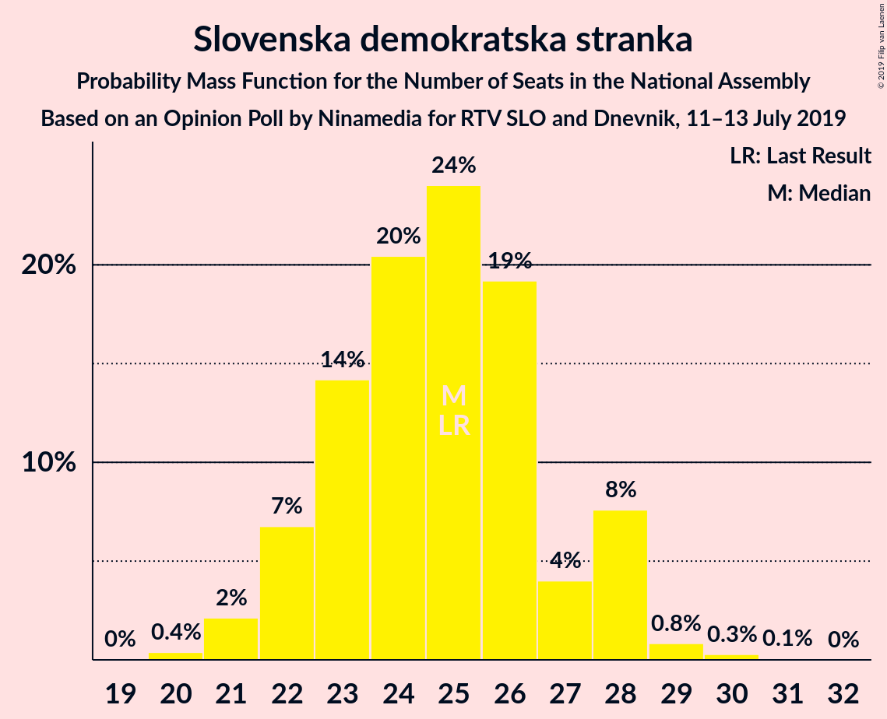
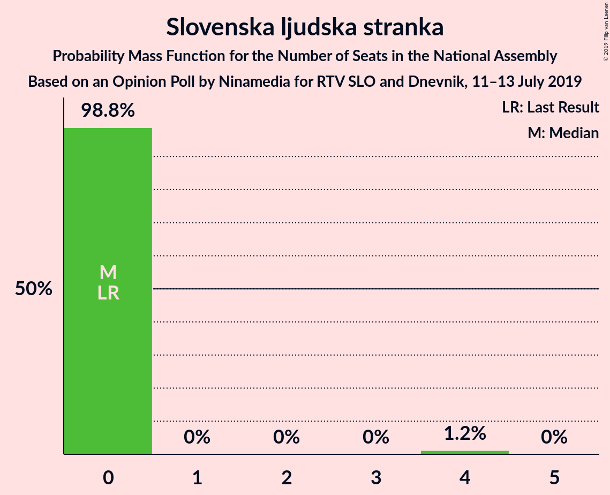
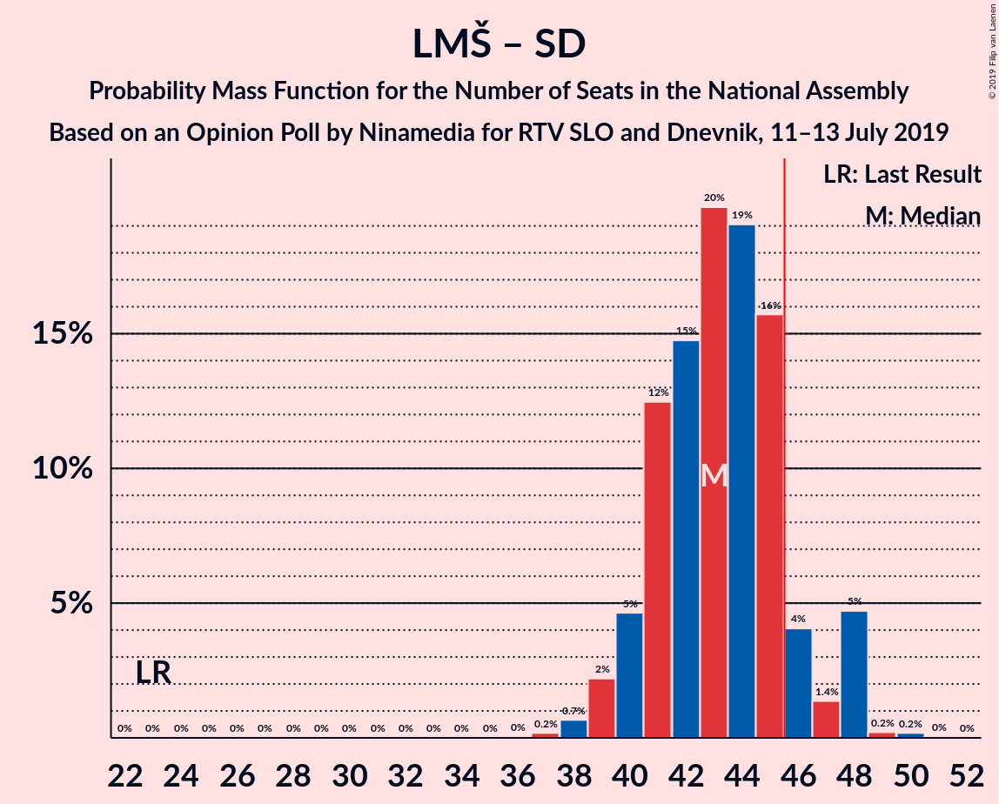
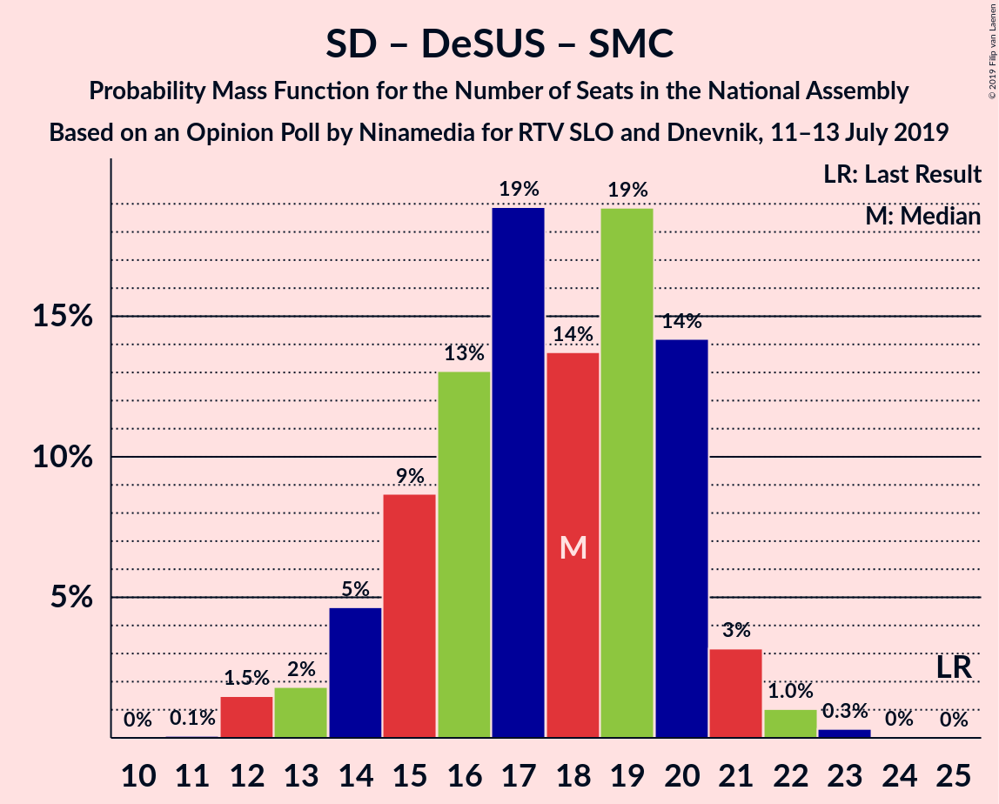

# Opinion Poll by Ninamedia for RTV SLO and Dnevnik, 11–13 July 2019

<a href="#voting-intentions">Voting Intentions</a> | <a href="#seats">Seats</a> | <a href="#coalitions">Coalitions</a> | <a href="#technical-information">Technical Information</a>

## Voting Intentions

### Confidence Intervals

| Party | Last Result | Poll Result | 80% Confidence Interval | 90% Confidence Interval | 95% Confidence Interval | 99% Confidence Interval |
|:-----:|:-----------:|:-----------:|:-----------------------:|:-----------------------:|:-----------------------:|:-----------------------:|
| Lista Marjana Šarca | 12.6% | 29.9% | 27.7–32.1% |27.1–32.8% |26.6–33.4% |25.6–34.5% |
| Slovenska demokratska stranka | 24.9% | 25.1% | 23.1–27.3% |22.6–28.0% |22.1–28.5% |21.1–29.6% |
| Socialni demokrati | 9.9% | 14.1% | 12.6–16.0% |12.1–16.5% |11.8–16.9% |11.0–17.8% |
| Levica | 9.3% | 8.7% | 7.5–10.2% |7.1–10.7% |6.8–11.1% |6.3–11.8% |
| Nova Slovenija–Krščanski demokrati | 7.2% | 7.7% | 6.6–9.2% |6.2–9.6% |6.0–9.9% |5.4–10.7% |
| Demokratična stranka upokojencev Slovenije | 4.9% | 4.9% | 4.0–6.1% |3.7–6.4% |3.5–6.7% |3.1–7.3% |
| Slovenska nacionalna stranka | 4.2% | 2.7% | 2.1–3.7% |1.9–4.0% |1.7–4.2% |1.5–4.7% |
| Slovenska ljudska stranka | 2.6% | 2.3% | 1.7–3.2% |1.5–3.5% |1.4–3.7% |1.2–4.2% |
| Stranka Alenke Bratušek | 5.1% | 1.6% | 1.1–2.4% |1.0–2.6% |0.9–2.8% |0.7–3.2% |
| Stranka modernega centra | 9.7% | 1.4% | 1.0–2.2% |0.9–2.4% |0.8–2.6% |0.6–3.0% |

*Note:* The poll result column reflects the actual value used in the calculations. Published results may vary slightly, and in addition be rounded to fewer digits.

## Seats

### Confidence Intervals

| Party | Last Result | Median | 80% Confidence Interval | 90% Confidence Interval | 95% Confidence Interval | 99% Confidence Interval |
|:-----:|:-----------:|:------:|:-----------------------:|:-----------------------:|:-----------------------:|:-----------------------:|
| <a href="#lista-marjana-šarca">Lista Marjana Šarca</a> | 13 | 30 | 27–32 |27–33 |26–33 |25–33 |
| <a href="#slovenska-demokratska-stranka">Slovenska demokratska stranka</a> | 25 | 23 | 22–28 |21–28 |21–28 |21–30 |
| <a href="#socialni-demokrati">Socialni demokrati</a> | 10 | 13 | 12–15 |12–16 |11–16 |10–18 |
| <a href="#levica">Levica</a> | 9 | 8 | 7–10 |7–11 |6–11 |6–11 |
| <a href="#nova-slovenija–krščanski-demokrati">Nova Slovenija–Krščanski demokrati</a> | 7 | 7 | 7–9 |6–10 |6–10 |5–10 |
| <a href="#demokratična-stranka-upokojencev-slovenije">Demokratična stranka upokojencev Slovenije</a> | 5 | 5 | 4–5 |0–6 |0–6 |0–6 |
| <a href="#slovenska-nacionalna-stranka">Slovenska nacionalna stranka</a> | 4 | 0 | 0 |0 |0–4 |0–4 |
| <a href="#slovenska-ljudska-stranka">Slovenska ljudska stranka</a> | 0 | 0 | 0 |0 |0 |0–4 |
| <a href="#stranka-alenke-bratušek">Stranka Alenke Bratušek</a> | 5 | 0 | 0 |0 |0 |0 |
| <a href="#stranka-modernega-centra">Stranka modernega centra</a> | 10 | 0 | 0 |0 |0 |0 |

### Lista Marjana Šarca

*For a full overview of the results for this party, see the [Lista Marjana Šarca](party-listamarjanašarca.html) page.*

| Number of Seats | Probability | Accumulated | Special Marks |
|:---------------:|:-----------:|:-----------:|:-------------:|
| 13 | 0% | 100% | Last Result |
| 14 | 0% | 100% |  |
| 15 | 0% | 100% |  |
| 16 | 0% | 100% |  |
| 17 | 0% | 100% |  |
| 18 | 0% | 100% |  |
| 19 | 0% | 100% |  |
| 20 | 0% | 100% |  |
| 21 | 0% | 100% |  |
| 22 | 0% | 100% |  |
| 23 | 0% | 100% |  |
| 24 | 0.3% | 100% |  |
| 25 | 0.3% | 99.7% |  |
| 26 | 3% | 99.4% |  |
| 27 | 7% | 96% |  |
| 28 | 5% | 89% |  |
| 29 | 18% | 84% |  |
| 30 | 37% | 66% | Median |
| 31 | 16% | 28% |  |
| 32 | 6% | 12% |  |
| 33 | 6% | 6% |  |
| 34 | 0.1% | 0.4% |  |
| 35 | 0.1% | 0.3% |  |
| 36 | 0% | 0.1% |  |
| 37 | 0.1% | 0.1% |  |
| 38 | 0% | 0% |  |

### Slovenska demokratska stranka

*For a full overview of the results for this party, see the [Slovenska demokratska stranka](party-slovenskademokratskastranka.html) page.*

| Number of Seats | Probability | Accumulated | Special Marks |
|:---------------:|:-----------:|:-----------:|:-------------:|
| 20 | 0.2% | 100% |  |
| 21 | 5% | 99.8% |  |
| 22 | 7% | 95% |  |
| 23 | 46% | 87% | Median |
| 24 | 5% | 41% |  |
| 25 | 8% | 37% | Last Result |
| 26 | 11% | 28% |  |
| 27 | 3% | 17% |  |
| 28 | 12% | 14% |  |
| 29 | 0.7% | 1.3% |  |
| 30 | 0.4% | 0.5% |  |
| 31 | 0.1% | 0.1% |  |
| 32 | 0% | 0% |  |

### Socialni demokrati

*For a full overview of the results for this party, see the [Socialni demokrati](party-socialnidemokrati.html) page.*

| Number of Seats | Probability | Accumulated | Special Marks |
|:---------------:|:-----------:|:-----------:|:-------------:|
| 10 | 2% | 100% | Last Result |
| 11 | 1.4% | 98% |  |
| 12 | 36% | 97% |  |
| 13 | 33% | 61% | Median |
| 14 | 13% | 28% |  |
| 15 | 10% | 15% |  |
| 16 | 4% | 5% |  |
| 17 | 1.0% | 2% |  |
| 18 | 0.5% | 0.6% |  |
| 19 | 0% | 0% |  |

### Levica

*For a full overview of the results for this party, see the [Levica](party-levica.html) page.*

| Number of Seats | Probability | Accumulated | Special Marks |
|:---------------:|:-----------:|:-----------:|:-------------:|
| 5 | 0.1% | 100% |  |
| 6 | 3% | 99.9% |  |
| 7 | 8% | 97% |  |
| 8 | 39% | 89% | Median |
| 9 | 10% | 49% | Last Result |
| 10 | 33% | 39% |  |
| 11 | 5% | 5% |  |
| 12 | 0.2% | 0.2% |  |
| 13 | 0% | 0% |  |

### Nova Slovenija–Krščanski demokrati

*For a full overview of the results for this party, see the [Nova Slovenija–Krščanski demokrati](party-novaslovenija–krščanskidemokrati.html) page.*

| Number of Seats | Probability | Accumulated | Special Marks |
|:---------------:|:-----------:|:-----------:|:-------------:|
| 4 | 0.1% | 100% |  |
| 5 | 1.0% | 99.9% |  |
| 6 | 9% | 98.9% |  |
| 7 | 51% | 90% | Last Result, Median |
| 8 | 16% | 40% |  |
| 9 | 15% | 24% |  |
| 10 | 9% | 9% |  |
| 11 | 0.1% | 0.1% |  |
| 12 | 0% | 0% |  |

### Demokratična stranka upokojencev Slovenije

*For a full overview of the results for this party, see the [Demokratična stranka upokojencev Slovenije](party-demokratičnastrankaupokojencevslovenije.html) page.*

| Number of Seats | Probability | Accumulated | Special Marks |
|:---------------:|:-----------:|:-----------:|:-------------:|
| 0 | 7% | 100% |  |
| 1 | 0% | 93% |  |
| 2 | 0% | 93% |  |
| 3 | 1.2% | 93% |  |
| 4 | 33% | 92% |  |
| 5 | 50% | 59% | Last Result, Median |
| 6 | 8% | 9% |  |
| 7 | 0.3% | 0.4% |  |
| 8 | 0.1% | 0.1% |  |
| 9 | 0% | 0% |  |

### Slovenska nacionalna stranka

*For a full overview of the results for this party, see the [Slovenska nacionalna stranka](party-slovenskanacionalnastranka.html) page.*

| Number of Seats | Probability | Accumulated | Special Marks |
|:---------------:|:-----------:|:-----------:|:-------------:|
| 0 | 97% | 100% | Median |
| 1 | 0% | 3% |  |
| 2 | 0% | 3% |  |
| 3 | 0% | 3% |  |
| 4 | 3% | 3% | Last Result |
| 5 | 0.1% | 0.1% |  |
| 6 | 0% | 0% |  |

### Slovenska ljudska stranka

*For a full overview of the results for this party, see the [Slovenska ljudska stranka](party-slovenskaljudskastranka.html) page.*

| Number of Seats | Probability | Accumulated | Special Marks |
|:---------------:|:-----------:|:-----------:|:-------------:|
| 0 | 99.3% | 100% | Last Result, Median |
| 1 | 0% | 0.7% |  |
| 2 | 0% | 0.7% |  |
| 3 | 0.1% | 0.7% |  |
| 4 | 0.6% | 0.6% |  |
| 5 | 0% | 0% |  |

### Stranka Alenke Bratušek

*For a full overview of the results for this party, see the [Stranka Alenke Bratušek](party-strankaalenkebratušek.html) page.*

| Number of Seats | Probability | Accumulated | Special Marks |
|:---------------:|:-----------:|:-----------:|:-------------:|
| 0 | 100% | 100% | Median |
| 1 | 0% | 0% |  |
| 2 | 0% | 0% |  |
| 3 | 0% | 0% |  |
| 4 | 0% | 0% |  |
| 5 | 0% | 0% | Last Result |

### Stranka modernega centra

*For a full overview of the results for this party, see the [Stranka modernega centra](party-strankamodernegacentra.html) page.*

| Number of Seats | Probability | Accumulated | Special Marks |
|:---------------:|:-----------:|:-----------:|:-------------:|
| 0 | 100% | 100% | Median |
| 1 | 0% | 0% |  |
| 2 | 0% | 0% |  |
| 3 | 0% | 0% |  |
| 4 | 0% | 0% |  |
| 5 | 0% | 0% |  |
| 6 | 0% | 0% |  |
| 7 | 0% | 0% |  |
| 8 | 0% | 0% |  |
| 9 | 0% | 0% |  |
| 10 | 0% | 0% | Last Result |

## Coalitions

### Confidence Intervals

| Coalition | Last Result | Median | Majority? | 80% Confidence Interval | 90% Confidence Interval | 95% Confidence Interval | 99% Confidence Interval |
|:---------:|:-----------:|:------:|:---------:|:-----------------------:|:-----------------------:|:-----------------------:|:-----------------------:|
| Lista Marjana Šarca – Slovenska demokratska stranka – Demokratična stranka upokojencev Slovenije | 43 | 58 | 100% | 56–61 | 56–62 | 55–62 | 54–64 |
| Lista Marjana Šarca – Socialni demokrati – Nova Slovenija–Krščanski demokrati – Demokratična stranka upokojencev Slovenije | 35 | 55 | 100% | 52–57 | 52–58 | 51–58 | 49–59 |
| Lista Marjana Šarca – Socialni demokrati – Nova Slovenija–Krščanski demokrati – Demokratična stranka upokojencev Slovenije – Stranka Alenke Bratušek – Stranka modernega centra | 50 | 55 | 100% | 52–57 | 52–58 | 51–58 | 49–59 |
| Lista Marjana Šarca – Socialni demokrati – Nova Slovenija–Krščanski demokrati – Demokratična stranka upokojencev Slovenije – Stranka modernega centra | 45 | 55 | 100% | 52–57 | 52–58 | 51–58 | 49–59 |
| Lista Marjana Šarca – Slovenska demokratska stranka | 38 | 53 | 100% | 52–57 | 51–58 | 50–58 | 49–60 |
| Lista Marjana Šarca – Socialni demokrati – Nova Slovenija–Krščanski demokrati | 30 | 50 | 99.6% | 48–52 | 48–53 | 47–54 | 46–57 |
| Lista Marjana Šarca – Socialni demokrati – Nova Slovenija–Krščanski demokrati – Stranka modernega centra | 40 | 50 | 99.6% | 48–52 | 48–53 | 47–54 | 46–57 |
| Lista Marjana Šarca – Socialni demokrati – Demokratična stranka upokojencev Slovenije | 28 | 48 | 78% | 45–50 | 45–50 | 43–50 | 43–52 |
| Lista Marjana Šarca – Socialni demokrati – Demokratična stranka upokojencev Slovenije – Stranka Alenke Bratušek – Stranka modernega centra | 43 | 48 | 78% | 45–50 | 45–50 | 43–50 | 43–52 |
| Lista Marjana Šarca – Socialni demokrati – Demokratična stranka upokojencev Slovenije – Stranka modernega centra | 38 | 48 | 78% | 45–50 | 45–50 | 43–50 | 43–52 |
| Lista Marjana Šarca – Socialni demokrati | 23 | 43 | 8% | 41–45 | 41–46 | 40–47 | 39–48 |
| Lista Marjana Šarca – Socialni demokrati – Stranka modernega centra | 33 | 43 | 8% | 41–45 | 41–46 | 40–47 | 39–48 |
| Socialni demokrati – Demokratična stranka upokojencev Slovenije – Stranka modernega centra | 25 | 17 | 0% | 16–20 | 14–20 | 14–21 | 12–22 |

### Lista Marjana Šarca – Slovenska demokratska stranka – Demokratična stranka upokojencev Slovenije

| Number of Seats | Probability | Accumulated | Special Marks |
|:---------------:|:-----------:|:-----------:|:-------------:|
| 43 | 0% | 100% | Last Result |
| 44 | 0% | 100% |  |
| 45 | 0% | 100% |  |
| 46 | 0% | 100% | Majority |
| 47 | 0% | 100% |  |
| 48 | 0% | 100% |  |
| 49 | 0% | 100% |  |
| 50 | 0% | 100% |  |
| 51 | 0% | 100% |  |
| 52 | 0.1% | 100% |  |
| 53 | 0.1% | 99.8% |  |
| 54 | 1.4% | 99.7% |  |
| 55 | 2% | 98% |  |
| 56 | 10% | 97% |  |
| 57 | 12% | 86% |  |
| 58 | 38% | 75% | Median |
| 59 | 15% | 36% |  |
| 60 | 4% | 22% |  |
| 61 | 12% | 18% |  |
| 62 | 4% | 6% |  |
| 63 | 0.2% | 2% |  |
| 64 | 1.3% | 1.3% |  |
| 65 | 0% | 0% |  |

### Lista Marjana Šarca – Socialni demokrati – Nova Slovenija–Krščanski demokrati – Demokratična stranka upokojencev Slovenije

| Number of Seats | Probability | Accumulated | Special Marks |
|:---------------:|:-----------:|:-----------:|:-------------:|
| 35 | 0% | 100% | Last Result |
| 36 | 0% | 100% |  |
| 37 | 0% | 100% |  |
| 38 | 0% | 100% |  |
| 39 | 0% | 100% |  |
| 40 | 0% | 100% |  |
| 41 | 0% | 100% |  |
| 42 | 0% | 100% |  |
| 43 | 0% | 100% |  |
| 44 | 0% | 100% |  |
| 45 | 0% | 100% |  |
| 46 | 0% | 100% | Majority |
| 47 | 0% | 100% |  |
| 48 | 0.3% | 100% |  |
| 49 | 0.3% | 99.7% |  |
| 50 | 2% | 99.4% |  |
| 51 | 0.8% | 98% |  |
| 52 | 18% | 97% |  |
| 53 | 2% | 79% |  |
| 54 | 9% | 77% |  |
| 55 | 31% | 68% | Median |
| 56 | 11% | 37% |  |
| 57 | 21% | 26% |  |
| 58 | 4% | 5% |  |
| 59 | 2% | 2% |  |
| 60 | 0.1% | 0.1% |  |
| 61 | 0% | 0% |  |

### Lista Marjana Šarca – Socialni demokrati – Nova Slovenija–Krščanski demokrati – Demokratična stranka upokojencev Slovenije – Stranka Alenke Bratušek – Stranka modernega centra

| Number of Seats | Probability | Accumulated | Special Marks |
|:---------------:|:-----------:|:-----------:|:-------------:|
| 48 | 0.3% | 100% |  |
| 49 | 0.3% | 99.7% |  |
| 50 | 2% | 99.4% | Last Result |
| 51 | 0.8% | 98% |  |
| 52 | 18% | 97% |  |
| 53 | 2% | 79% |  |
| 54 | 9% | 77% |  |
| 55 | 31% | 68% | Median |
| 56 | 11% | 37% |  |
| 57 | 21% | 26% |  |
| 58 | 4% | 5% |  |
| 59 | 2% | 2% |  |
| 60 | 0.1% | 0.1% |  |
| 61 | 0% | 0% |  |

### Lista Marjana Šarca – Socialni demokrati – Nova Slovenija–Krščanski demokrati – Demokratična stranka upokojencev Slovenije – Stranka modernega centra

| Number of Seats | Probability | Accumulated | Special Marks |
|:---------------:|:-----------:|:-----------:|:-------------:|
| 45 | 0% | 100% | Last Result |
| 46 | 0% | 100% | Majority |
| 47 | 0% | 100% |  |
| 48 | 0.3% | 100% |  |
| 49 | 0.3% | 99.7% |  |
| 50 | 2% | 99.4% |  |
| 51 | 0.8% | 98% |  |
| 52 | 18% | 97% |  |
| 53 | 2% | 79% |  |
| 54 | 9% | 77% |  |
| 55 | 31% | 68% | Median |
| 56 | 11% | 37% |  |
| 57 | 21% | 26% |  |
| 58 | 4% | 5% |  |
| 59 | 2% | 2% |  |
| 60 | 0.1% | 0.1% |  |
| 61 | 0% | 0% |  |

### Lista Marjana Šarca – Slovenska demokratska stranka

| Number of Seats | Probability | Accumulated | Special Marks |
|:---------------:|:-----------:|:-----------:|:-------------:|
| 38 | 0% | 100% | Last Result |
| 39 | 0% | 100% |  |
| 40 | 0% | 100% |  |
| 41 | 0% | 100% |  |
| 42 | 0% | 100% |  |
| 43 | 0% | 100% |  |
| 44 | 0% | 100% |  |
| 45 | 0% | 100% |  |
| 46 | 0% | 100% | Majority |
| 47 | 0% | 100% |  |
| 48 | 0.1% | 100% |  |
| 49 | 0.6% | 99.9% |  |
| 50 | 2% | 99.3% |  |
| 51 | 2% | 97% |  |
| 52 | 12% | 95% |  |
| 53 | 36% | 82% | Median |
| 54 | 20% | 47% |  |
| 55 | 3% | 27% |  |
| 56 | 4% | 24% |  |
| 57 | 15% | 20% |  |
| 58 | 3% | 5% |  |
| 59 | 0.8% | 2% |  |
| 60 | 1.3% | 2% |  |
| 61 | 0.2% | 0.2% |  |
| 62 | 0% | 0% |  |

### Lista Marjana Šarca – Socialni demokrati – Nova Slovenija–Krščanski demokrati

| Number of Seats | Probability | Accumulated | Special Marks |
|:---------------:|:-----------:|:-----------:|:-------------:|
| 30 | 0% | 100% | Last Result |
| 31 | 0% | 100% |  |
| 32 | 0% | 100% |  |
| 33 | 0% | 100% |  |
| 34 | 0% | 100% |  |
| 35 | 0% | 100% |  |
| 36 | 0% | 100% |  |
| 37 | 0% | 100% |  |
| 38 | 0% | 100% |  |
| 39 | 0% | 100% |  |
| 40 | 0% | 100% |  |
| 41 | 0% | 100% |  |
| 42 | 0% | 100% |  |
| 43 | 0% | 100% |  |
| 44 | 0.1% | 100% |  |
| 45 | 0.3% | 99.9% |  |
| 46 | 0.6% | 99.6% | Majority |
| 47 | 2% | 99.0% |  |
| 48 | 16% | 97% |  |
| 49 | 7% | 81% |  |
| 50 | 31% | 74% | Median |
| 51 | 7% | 43% |  |
| 52 | 26% | 36% |  |
| 53 | 5% | 10% |  |
| 54 | 2% | 4% |  |
| 55 | 2% | 2% |  |
| 56 | 0.3% | 0.9% |  |
| 57 | 0.6% | 0.6% |  |
| 58 | 0% | 0% |  |

### Lista Marjana Šarca – Socialni demokrati – Nova Slovenija–Krščanski demokrati – Stranka modernega centra

| Number of Seats | Probability | Accumulated | Special Marks |
|:---------------:|:-----------:|:-----------:|:-------------:|
| 40 | 0% | 100% | Last Result |
| 41 | 0% | 100% |  |
| 42 | 0% | 100% |  |
| 43 | 0% | 100% |  |
| 44 | 0.1% | 100% |  |
| 45 | 0.3% | 99.9% |  |
| 46 | 0.6% | 99.6% | Majority |
| 47 | 2% | 99.0% |  |
| 48 | 16% | 97% |  |
| 49 | 7% | 81% |  |
| 50 | 31% | 74% | Median |
| 51 | 7% | 43% |  |
| 52 | 26% | 36% |  |
| 53 | 5% | 10% |  |
| 54 | 2% | 4% |  |
| 55 | 2% | 2% |  |
| 56 | 0.3% | 0.9% |  |
| 57 | 0.6% | 0.6% |  |
| 58 | 0% | 0% |  |

### Lista Marjana Šarca – Socialni demokrati – Demokratična stranka upokojencev Slovenije

| Number of Seats | Probability | Accumulated | Special Marks |
|:---------------:|:-----------:|:-----------:|:-------------:|
| 28 | 0% | 100% | Last Result |
| 29 | 0% | 100% |  |
| 30 | 0% | 100% |  |
| 31 | 0% | 100% |  |
| 32 | 0% | 100% |  |
| 33 | 0% | 100% |  |
| 34 | 0% | 100% |  |
| 35 | 0% | 100% |  |
| 36 | 0% | 100% |  |
| 37 | 0% | 100% |  |
| 38 | 0% | 100% |  |
| 39 | 0% | 100% |  |
| 40 | 0.1% | 100% |  |
| 41 | 0.1% | 99.9% |  |
| 42 | 0.2% | 99.8% |  |
| 43 | 2% | 99.6% |  |
| 44 | 2% | 97% |  |
| 45 | 18% | 96% |  |
| 46 | 14% | 78% | Majority |
| 47 | 7% | 64% |  |
| 48 | 38% | 57% | Median |
| 49 | 6% | 19% |  |
| 50 | 10% | 13% |  |
| 51 | 1.2% | 2% |  |
| 52 | 0.8% | 1.0% |  |
| 53 | 0.1% | 0.2% |  |
| 54 | 0.1% | 0.1% |  |
| 55 | 0% | 0% |  |

### Lista Marjana Šarca – Socialni demokrati – Demokratična stranka upokojencev Slovenije – Stranka Alenke Bratušek – Stranka modernega centra

| Number of Seats | Probability | Accumulated | Special Marks |
|:---------------:|:-----------:|:-----------:|:-------------:|
| 40 | 0.1% | 100% |  |
| 41 | 0.1% | 99.9% |  |
| 42 | 0.2% | 99.8% |  |
| 43 | 2% | 99.6% | Last Result |
| 44 | 2% | 97% |  |
| 45 | 18% | 96% |  |
| 46 | 14% | 78% | Majority |
| 47 | 7% | 64% |  |
| 48 | 38% | 57% | Median |
| 49 | 6% | 19% |  |
| 50 | 10% | 13% |  |
| 51 | 1.2% | 2% |  |
| 52 | 0.8% | 1.0% |  |
| 53 | 0.1% | 0.2% |  |
| 54 | 0.1% | 0.1% |  |
| 55 | 0% | 0% |  |

### Lista Marjana Šarca – Socialni demokrati – Demokratična stranka upokojencev Slovenije – Stranka modernega centra

| Number of Seats | Probability | Accumulated | Special Marks |
|:---------------:|:-----------:|:-----------:|:-------------:|
| 38 | 0% | 100% | Last Result |
| 39 | 0% | 100% |  |
| 40 | 0.1% | 100% |  |
| 41 | 0.1% | 99.9% |  |
| 42 | 0.2% | 99.8% |  |
| 43 | 2% | 99.6% |  |
| 44 | 2% | 97% |  |
| 45 | 18% | 96% |  |
| 46 | 14% | 78% | Majority |
| 47 | 7% | 64% |  |
| 48 | 38% | 57% | Median |
| 49 | 6% | 19% |  |
| 50 | 10% | 13% |  |
| 51 | 1.2% | 2% |  |
| 52 | 0.8% | 1.0% |  |
| 53 | 0.1% | 0.2% |  |
| 54 | 0.1% | 0.1% |  |
| 55 | 0% | 0% |  |

### Lista Marjana Šarca – Socialni demokrati

| Number of Seats | Probability | Accumulated | Special Marks |
|:---------------:|:-----------:|:-----------:|:-------------:|
| 23 | 0% | 100% | Last Result |
| 24 | 0% | 100% |  |
| 25 | 0% | 100% |  |
| 26 | 0% | 100% |  |
| 27 | 0% | 100% |  |
| 28 | 0% | 100% |  |
| 29 | 0% | 100% |  |
| 30 | 0% | 100% |  |
| 31 | 0% | 100% |  |
| 32 | 0% | 100% |  |
| 33 | 0% | 100% |  |
| 34 | 0% | 100% |  |
| 35 | 0% | 100% |  |
| 36 | 0% | 100% |  |
| 37 | 0.1% | 100% |  |
| 38 | 0.3% | 99.9% |  |
| 39 | 1.0% | 99.6% |  |
| 40 | 2% | 98.6% |  |
| 41 | 20% | 96% |  |
| 42 | 13% | 76% |  |
| 43 | 40% | 64% | Median |
| 44 | 7% | 23% |  |
| 45 | 8% | 16% |  |
| 46 | 4% | 8% | Majority |
| 47 | 3% | 4% |  |
| 48 | 0.8% | 1.2% |  |
| 49 | 0.4% | 0.4% |  |
| 50 | 0% | 0% |  |

### Lista Marjana Šarca – Socialni demokrati – Stranka modernega centra

| Number of Seats | Probability | Accumulated | Special Marks |
|:---------------:|:-----------:|:-----------:|:-------------:|
| 33 | 0% | 100% | Last Result |
| 34 | 0% | 100% |  |
| 35 | 0% | 100% |  |
| 36 | 0% | 100% |  |
| 37 | 0.1% | 100% |  |
| 38 | 0.3% | 99.9% |  |
| 39 | 1.0% | 99.6% |  |
| 40 | 2% | 98.6% |  |
| 41 | 20% | 96% |  |
| 42 | 13% | 76% |  |
| 43 | 40% | 64% | Median |
| 44 | 7% | 23% |  |
| 45 | 8% | 16% |  |
| 46 | 4% | 8% | Majority |
| 47 | 3% | 4% |  |
| 48 | 0.8% | 1.2% |  |
| 49 | 0.4% | 0.4% |  |
| 50 | 0% | 0% |  |

### Socialni demokrati – Demokratična stranka upokojencev Slovenije – Stranka modernega centra

| Number of Seats | Probability | Accumulated | Special Marks |
|:---------------:|:-----------:|:-----------:|:-------------:|
| 10 | 0.1% | 100% |  |
| 11 | 0% | 99.9% |  |
| 12 | 0.5% | 99.9% |  |
| 13 | 0.4% | 99.4% |  |
| 14 | 4% | 99.0% |  |
| 15 | 4% | 95% |  |
| 16 | 20% | 91% |  |
| 17 | 22% | 71% |  |
| 18 | 27% | 50% | Median |
| 19 | 9% | 22% |  |
| 20 | 10% | 13% |  |
| 21 | 2% | 3% |  |
| 22 | 1.3% | 2% |  |
| 23 | 0.3% | 0.4% |  |
| 24 | 0% | 0% |  |
| 25 | 0% | 0% | Last Result |

## Technical Information

### Opinion Poll

+ **Polling firm:** Ninamedia
+ **Commissioner(s):** RTV SLO and Dnevnik
+ **Fieldwork period:** 11–13 July 2019

### Calculations

+ **Sample size:** 700
+ **Simulations done:** 131,072
+ **Error estimate:** 4.79%

