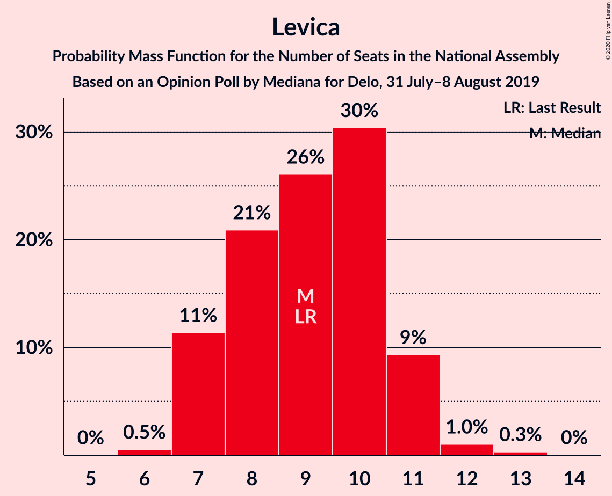
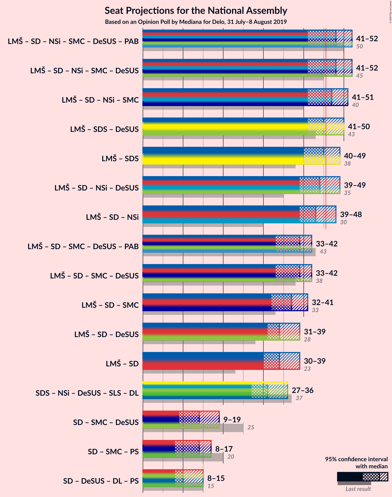
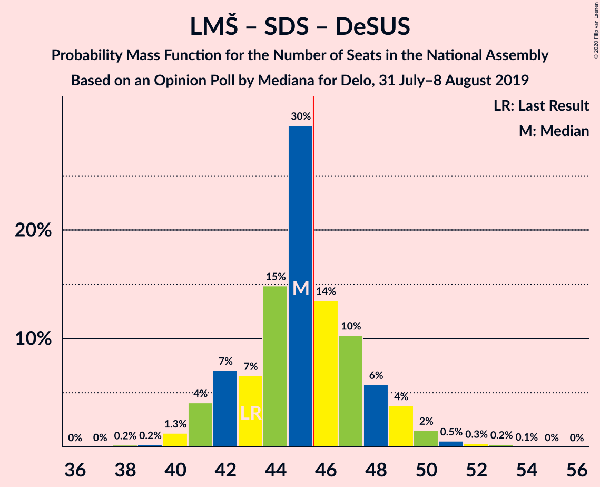
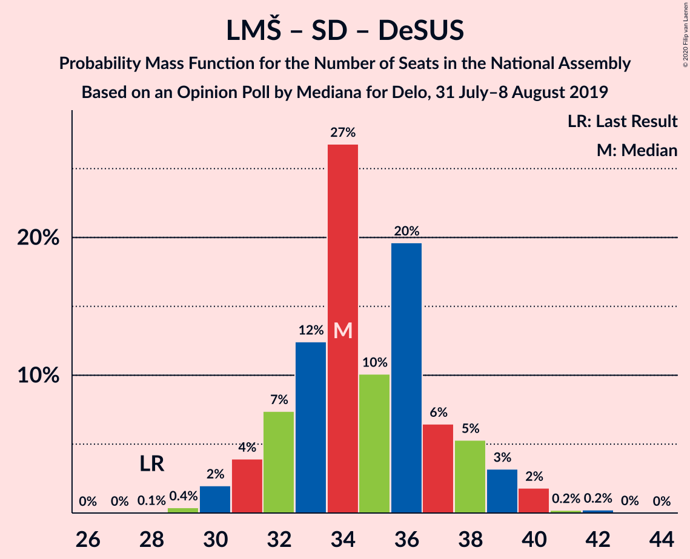
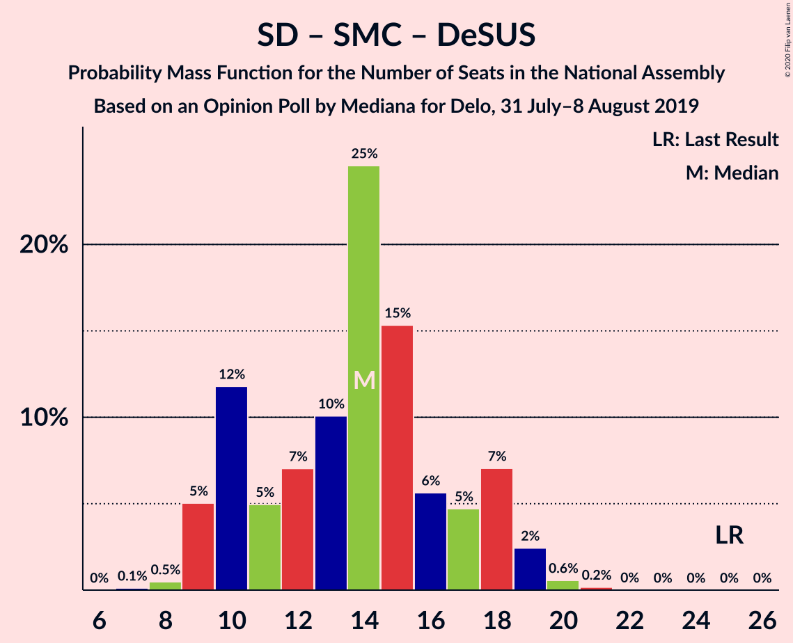

# Opinion Poll by Mediana for Delo, 31 July–8 August 2019

<a href="#voting-intentions">Voting Intentions</a> | <a href="#seats">Seats</a> | <a href="#coalitions">Coalitions</a> | <a href="#technical-information">Technical Information</a>

## Voting Intentions

### Confidence Intervals

| Party | Last Result | Poll Result | 80% Confidence Interval | 90% Confidence Interval | 95% Confidence Interval | 99% Confidence Interval |
|:-----:|:-----------:|:-----------:|:-----------------------:|:-----------------------:|:-----------------------:|:-----------------------:|
| Lista Marjana Šarca | 12.6% | 24.5% | 22.5–26.6% |22.0–27.2% |21.5–27.7% |20.6–28.7% |
| Slovenska demokratska stranka | 24.9% | 20.7% | 18.8–22.7% |18.3–23.2% |17.9–23.7% |17.0–24.7% |
| Socialni demokrati | 9.9% | 10.5% | 9.1–12.0% |8.8–12.5% |8.4–12.9% |7.8–13.7% |
| Nova Slovenija–Krščanski demokrati | 7.2% | 9.6% | 8.4–11.2% |8.0–11.6% |7.7–12.0% |7.1–12.8% |
| Levica | 9.3% | 9.4% | 8.1–10.9% |7.8–11.3% |7.5–11.7% |6.9–12.5% |
| Slovenska nacionalna stranka | 4.2% | 4.8% | 3.9–5.9% |3.6–6.2% |3.4–6.6% |3.1–7.1% |
| Stranka modernega centra | 9.7% | 4.2% | 3.4–5.3% |3.2–5.6% |3.0–5.9% |2.6–6.5% |
| Demokratična stranka upokojencev Slovenije | 4.9% | 3.3% | 2.6–4.3% |2.4–4.6% |2.2–4.8% |1.9–5.3% |
| Slovenska ljudska stranka | 2.6% | 3.3% | 2.6–4.3% |2.4–4.6% |2.2–4.8% |1.9–5.3% |
| Stranka Alenke Bratušek | 5.1% | 2.6% | 2.0–3.5% |1.8–3.8% |1.7–4.0% |1.4–4.5% |

*Note:* The poll result column reflects the actual value used in the calculations. Published results may vary slightly, and in addition be rounded to fewer digits.

## Seats

### Confidence Intervals

| Party | Last Result | Median | 80% Confidence Interval | 90% Confidence Interval | 95% Confidence Interval | 99% Confidence Interval |
|:-----:|:-----------:|:------:|:-----------------------:|:-----------------------:|:-----------------------:|:-----------------------:|
| <a href="#lista-marjana-šarca">Lista Marjana Šarca</a> | 13 | 23 | 21–27 |20–28 |20–28 |20–28 |
| <a href="#slovenska-demokratska-stranka">Slovenska demokratska stranka</a> | 25 | 20 | 19–23 |18–24 |17–24 |17–26 |
| <a href="#socialni-demokrati">Socialni demokrati</a> | 10 | 9 | 9–12 |9–12 |9–12 |7–13 |
| <a href="#nova-slovenija–krščanski-demokrati">Nova Slovenija–Krščanski demokrati</a> | 7 | 9 | 8–11 |7–11 |7–11 |6–12 |
| <a href="#levica">Levica</a> | 9 | 10 | 8–11 |7–11 |7–11 |7–11 |
| <a href="#slovenska-nacionalna-stranka">Slovenska nacionalna stranka</a> | 4 | 5 | 4–6 |0–7 |0–7 |0–7 |
| <a href="#stranka-modernega-centra">Stranka modernega centra</a> | 10 | 4 | 0–4 |0–5 |0–5 |0–5 |
| <a href="#demokratična-stranka-upokojencev-slovenije">Demokratična stranka upokojencev Slovenije</a> | 5 | 0 | 0 |0 |0 |0–5 |
| <a href="#slovenska-ljudska-stranka">Slovenska ljudska stranka</a> | 0 | 0 | 0–4 |0–4 |0–4 |0–5 |
| <a href="#stranka-alenke-bratušek">Stranka Alenke Bratušek</a> | 5 | 0 | 0 |0 |0 |0–4 |

### Lista Marjana Šarca

*For a full overview of the results for this party, see the [Lista Marjana Šarca](party-listamarjanašarca.html) page.*

| Number of Seats | Probability | Accumulated | Special Marks |
|:---------------:|:-----------:|:-----------:|:-------------:|
| 13 | 0% | 100% | Last Result |
| 14 | 0% | 100% |  |
| 15 | 0% | 100% |  |
| 16 | 0% | 100% |  |
| 17 | 0% | 100% |  |
| 18 | 0% | 100% |  |
| 19 | 0.1% | 100% |  |
| 20 | 6% | 99.9% |  |
| 21 | 10% | 94% |  |
| 22 | 24% | 83% |  |
| 23 | 10% | 59% | Median |
| 24 | 7% | 49% |  |
| 25 | 18% | 42% |  |
| 26 | 13% | 24% |  |
| 27 | 6% | 11% |  |
| 28 | 5% | 5% |  |
| 29 | 0.1% | 0.2% |  |
| 30 | 0% | 0.1% |  |
| 31 | 0% | 0% |  |

### Slovenska demokratska stranka

*For a full overview of the results for this party, see the [Slovenska demokratska stranka](party-slovenskademokratskastranka.html) page.*

| Number of Seats | Probability | Accumulated | Special Marks |
|:---------------:|:-----------:|:-----------:|:-------------:|
| 15 | 0.1% | 100% |  |
| 16 | 0.4% | 99.9% |  |
| 17 | 4% | 99.6% |  |
| 18 | 3% | 95% |  |
| 19 | 21% | 92% |  |
| 20 | 30% | 71% | Median |
| 21 | 14% | 41% |  |
| 22 | 13% | 27% |  |
| 23 | 4% | 13% |  |
| 24 | 8% | 9% |  |
| 25 | 0.7% | 1.4% | Last Result |
| 26 | 0.7% | 0.7% |  |
| 27 | 0% | 0% |  |

### Socialni demokrati

*For a full overview of the results for this party, see the [Socialni demokrati](party-socialnidemokrati.html) page.*

| Number of Seats | Probability | Accumulated | Special Marks |
|:---------------:|:-----------:|:-----------:|:-------------:|
| 7 | 0.8% | 100% |  |
| 8 | 2% | 99.2% |  |
| 9 | 52% | 98% | Median |
| 10 | 12% | 46% | Last Result |
| 11 | 23% | 34% |  |
| 12 | 9% | 11% |  |
| 13 | 2% | 2% |  |
| 14 | 0.4% | 0.4% |  |
| 15 | 0% | 0% |  |

### Nova Slovenija–Krščanski demokrati

*For a full overview of the results for this party, see the [Nova Slovenija–Krščanski demokrati](party-novaslovenija–krščanskidemokrati.html) page.*

| Number of Seats | Probability | Accumulated | Special Marks |
|:---------------:|:-----------:|:-----------:|:-------------:|
| 6 | 1.3% | 100% |  |
| 7 | 6% | 98.7% | Last Result |
| 8 | 16% | 93% |  |
| 9 | 30% | 77% | Median |
| 10 | 25% | 47% |  |
| 11 | 20% | 22% |  |
| 12 | 2% | 2% |  |
| 13 | 0.4% | 0.5% |  |
| 14 | 0% | 0% |  |

### Levica

*For a full overview of the results for this party, see the [Levica](party-levica.html) page.*

| Number of Seats | Probability | Accumulated | Special Marks |
|:---------------:|:-----------:|:-----------:|:-------------:|
| 6 | 0.2% | 100% |  |
| 7 | 6% | 99.8% |  |
| 8 | 25% | 94% |  |
| 9 | 13% | 69% | Last Result |
| 10 | 32% | 56% | Median |
| 11 | 24% | 24% |  |
| 12 | 0.3% | 0.5% |  |
| 13 | 0.1% | 0.2% |  |
| 14 | 0% | 0% |  |

### Slovenska nacionalna stranka

*For a full overview of the results for this party, see the [Slovenska nacionalna stranka](party-slovenskanacionalnastranka.html) page.*

| Number of Seats | Probability | Accumulated | Special Marks |
|:---------------:|:-----------:|:-----------:|:-------------:|
| 0 | 9% | 100% |  |
| 1 | 0% | 91% |  |
| 2 | 0% | 91% |  |
| 3 | 0.1% | 91% |  |
| 4 | 39% | 91% | Last Result |
| 5 | 28% | 52% | Median |
| 6 | 16% | 25% |  |
| 7 | 9% | 9% |  |
| 8 | 0.1% | 0.1% |  |
| 9 | 0% | 0% |  |

### Stranka modernega centra

*For a full overview of the results for this party, see the [Stranka modernega centra](party-strankamodernegacentra.html) page.*

| Number of Seats | Probability | Accumulated | Special Marks |
|:---------------:|:-----------:|:-----------:|:-------------:|
| 0 | 46% | 100% |  |
| 1 | 0% | 54% |  |
| 2 | 0% | 54% |  |
| 3 | 2% | 54% |  |
| 4 | 46% | 52% | Median |
| 5 | 5% | 6% |  |
| 6 | 0.4% | 0.5% |  |
| 7 | 0% | 0% |  |
| 8 | 0% | 0% |  |
| 9 | 0% | 0% |  |
| 10 | 0% | 0% | Last Result |

### Demokratična stranka upokojencev Slovenije

*For a full overview of the results for this party, see the [Demokratična stranka upokojencev Slovenije](party-demokratičnastrankaupokojencevslovenije.html) page.*

| Number of Seats | Probability | Accumulated | Special Marks |
|:---------------:|:-----------:|:-----------:|:-------------:|
| 0 | 98% | 100% | Median |
| 1 | 0% | 2% |  |
| 2 | 0% | 2% |  |
| 3 | 0% | 2% |  |
| 4 | 1.5% | 2% |  |
| 5 | 0.7% | 0.8% | Last Result |
| 6 | 0.1% | 0.1% |  |
| 7 | 0% | 0% |  |

### Slovenska ljudska stranka

*For a full overview of the results for this party, see the [Slovenska ljudska stranka](party-slovenskaljudskastranka.html) page.*

| Number of Seats | Probability | Accumulated | Special Marks |
|:---------------:|:-----------:|:-----------:|:-------------:|
| 0 | 71% | 100% | Last Result, Median |
| 1 | 0% | 29% |  |
| 2 | 0% | 29% |  |
| 3 | 6% | 29% |  |
| 4 | 22% | 23% |  |
| 5 | 1.1% | 1.1% |  |
| 6 | 0% | 0% |  |

### Stranka Alenke Bratušek

*For a full overview of the results for this party, see the [Stranka Alenke Bratušek](party-strankaalenkebratušek.html) page.*

| Number of Seats | Probability | Accumulated | Special Marks |
|:---------------:|:-----------:|:-----------:|:-------------:|
| 0 | 98% | 100% | Median |
| 1 | 0% | 2% |  |
| 2 | 0% | 2% |  |
| 3 | 0.5% | 2% |  |
| 4 | 1.2% | 1.3% |  |
| 5 | 0.1% | 0.1% | Last Result |
| 6 | 0% | 0% |  |

## Coalitions

### Confidence Intervals

| Coalition | Last Result | Median | Majority? | 80% Confidence Interval | 90% Confidence Interval | 95% Confidence Interval | 99% Confidence Interval |
|:---------:|:-----------:|:------:|:---------:|:-----------------------:|:-----------------------:|:-----------------------:|:-----------------------:|
| Lista Marjana Šarca – Socialni demokrati – Nova Slovenija–Krščanski demokrati – Stranka modernega centra – Demokratična stranka upokojencev Slovenije – Stranka Alenke Bratušek | 50 | 45 | 48% | 43–48 | 42–49 | 41–51 | 41–53 |
| Lista Marjana Šarca – Socialni demokrati – Nova Slovenija–Krščanski demokrati – Stranka modernega centra – Demokratična stranka upokojencev Slovenije | 45 | 44 | 47% | 43–48 | 42–49 | 41–51 | 41–53 |
| Lista Marjana Šarca – Socialni demokrati – Nova Slovenija–Krščanski demokrati – Stranka modernega centra | 40 | 44 | 47% | 43–48 | 42–48 | 41–49 | 41–52 |
| Lista Marjana Šarca – Slovenska demokratska stranka – Demokratična stranka upokojencev Slovenije | 43 | 45 | 32% | 41–47 | 41–49 | 40–49 | 40–52 |
| Lista Marjana Šarca – Slovenska demokratska stranka | 38 | 45 | 31% | 41–46 | 41–49 | 40–49 | 39–51 |
| Lista Marjana Šarca – Socialni demokrati – Nova Slovenija–Krščanski demokrati – Demokratična stranka upokojencev Slovenije | 35 | 44 | 25% | 39–47 | 39–47 | 39–48 | 38–50 |
| Lista Marjana Šarca – Socialni demokrati – Nova Slovenija–Krščanski demokrati | 30 | 44 | 24% | 39–46 | 39–47 | 39–48 | 38–49 |
| Lista Marjana Šarca – Socialni demokrati – Stranka modernega centra – Demokratična stranka upokojencev Slovenije – Stranka Alenke Bratušek | 43 | 36 | 0% | 33–39 | 33–40 | 31–42 | 31–44 |
| Lista Marjana Šarca – Socialni demokrati – Stranka modernega centra – Demokratična stranka upokojencev Slovenije | 38 | 36 | 0% | 33–39 | 33–40 | 31–41 | 31–44 |
| Lista Marjana Šarca – Socialni demokrati – Stranka modernega centra | 33 | 36 | 0% | 33–39 | 33–39 | 31–40 | 31–44 |
| Lista Marjana Šarca – Socialni demokrati – Demokratična stranka upokojencev Slovenije | 28 | 33 | 0% | 30–37 | 30–39 | 30–39 | 29–39 |
| Lista Marjana Šarca – Socialni demokrati | 23 | 33 | 0% | 30–37 | 30–39 | 30–39 | 29–39 |
| Socialni demokrati – Stranka modernega centra – Demokratična stranka upokojencev Slovenije | 25 | 13 | 0% | 9–15 | 9–15 | 9–17 | 9–20 |

### Lista Marjana Šarca – Socialni demokrati – Nova Slovenija–Krščanski demokrati – Stranka modernega centra – Demokratična stranka upokojencev Slovenije – Stranka Alenke Bratušek

| Number of Seats | Probability | Accumulated | Special Marks |
|:---------------:|:-----------:|:-----------:|:-------------:|
| 41 | 4% | 100% |  |
| 42 | 1.3% | 96% |  |
| 43 | 18% | 95% |  |
| 44 | 26% | 77% |  |
| 45 | 2% | 50% | Median |
| 46 | 17% | 48% | Majority |
| 47 | 13% | 31% |  |
| 48 | 12% | 18% |  |
| 49 | 2% | 7% |  |
| 50 | 2% | 4% | Last Result |
| 51 | 1.1% | 3% |  |
| 52 | 0.7% | 2% |  |
| 53 | 0.4% | 0.8% |  |
| 54 | 0.3% | 0.4% |  |
| 55 | 0% | 0% |  |

### Lista Marjana Šarca – Socialni demokrati – Nova Slovenija–Krščanski demokrati – Stranka modernega centra – Demokratična stranka upokojencev Slovenije

| Number of Seats | Probability | Accumulated | Special Marks |
|:---------------:|:-----------:|:-----------:|:-------------:|
| 40 | 0.1% | 100% |  |
| 41 | 4% | 99.9% |  |
| 42 | 1.3% | 96% |  |
| 43 | 18% | 95% |  |
| 44 | 27% | 77% |  |
| 45 | 2% | 50% | Last Result, Median |
| 46 | 18% | 47% | Majority |
| 47 | 12% | 29% |  |
| 48 | 11% | 17% |  |
| 49 | 2% | 6% |  |
| 50 | 0.9% | 3% |  |
| 51 | 1.0% | 3% |  |
| 52 | 0.7% | 2% |  |
| 53 | 0.4% | 0.8% |  |
| 54 | 0.3% | 0.4% |  |
| 55 | 0% | 0% |  |

### Lista Marjana Šarca – Socialni demokrati – Nova Slovenija–Krščanski demokrati – Stranka modernega centra

| Number of Seats | Probability | Accumulated | Special Marks |
|:---------------:|:-----------:|:-----------:|:-------------:|
| 39 | 0% | 100% |  |
| 40 | 0.1% | 99.9% | Last Result |
| 41 | 4% | 99.9% |  |
| 42 | 1.3% | 96% |  |
| 43 | 18% | 95% |  |
| 44 | 27% | 76% |  |
| 45 | 2% | 49% | Median |
| 46 | 19% | 47% | Majority |
| 47 | 12% | 28% |  |
| 48 | 11% | 16% |  |
| 49 | 3% | 5% |  |
| 50 | 0.4% | 2% |  |
| 51 | 0.9% | 1.4% |  |
| 52 | 0.5% | 0.6% |  |
| 53 | 0% | 0% |  |

### Lista Marjana Šarca – Slovenska demokratska stranka – Demokratična stranka upokojencev Slovenije

| Number of Seats | Probability | Accumulated | Special Marks |
|:---------------:|:-----------:|:-----------:|:-------------:|
| 38 | 0.1% | 100% |  |
| 39 | 0.2% | 99.9% |  |
| 40 | 3% | 99.6% |  |
| 41 | 16% | 97% |  |
| 42 | 7% | 81% |  |
| 43 | 14% | 74% | Last Result, Median |
| 44 | 7% | 60% |  |
| 45 | 21% | 53% |  |
| 46 | 22% | 32% | Majority |
| 47 | 2% | 10% |  |
| 48 | 0.8% | 8% |  |
| 49 | 5% | 7% |  |
| 50 | 0.5% | 2% |  |
| 51 | 0.8% | 1.4% |  |
| 52 | 0.1% | 0.5% |  |
| 53 | 0.1% | 0.4% |  |
| 54 | 0.3% | 0.4% |  |
| 55 | 0% | 0% |  |

### Lista Marjana Šarca – Slovenska demokratska stranka

| Number of Seats | Probability | Accumulated | Special Marks |
|:---------------:|:-----------:|:-----------:|:-------------:|
| 38 | 0.2% | 100% | Last Result |
| 39 | 0.3% | 99.7% |  |
| 40 | 3% | 99.4% |  |
| 41 | 17% | 96% |  |
| 42 | 7% | 80% |  |
| 43 | 14% | 73% | Median |
| 44 | 7% | 59% |  |
| 45 | 20% | 51% |  |
| 46 | 22% | 31% | Majority |
| 47 | 2% | 9% |  |
| 48 | 0.4% | 7% |  |
| 49 | 5% | 6% |  |
| 50 | 0.4% | 2% |  |
| 51 | 0.8% | 1.2% |  |
| 52 | 0% | 0.4% |  |
| 53 | 0% | 0.4% |  |
| 54 | 0.3% | 0.3% |  |
| 55 | 0% | 0% |  |

### Lista Marjana Šarca – Socialni demokrati – Nova Slovenija–Krščanski demokrati – Demokratična stranka upokojencev Slovenije

| Number of Seats | Probability | Accumulated | Special Marks |
|:---------------:|:-----------:|:-----------:|:-------------:|
| 35 | 0% | 100% | Last Result |
| 36 | 0% | 100% |  |
| 37 | 0.3% | 100% |  |
| 38 | 0.4% | 99.7% |  |
| 39 | 17% | 99.3% |  |
| 40 | 9% | 82% |  |
| 41 | 6% | 73% | Median |
| 42 | 6% | 67% |  |
| 43 | 8% | 61% |  |
| 44 | 25% | 53% |  |
| 45 | 3% | 28% |  |
| 46 | 14% | 25% | Majority |
| 47 | 7% | 11% |  |
| 48 | 3% | 4% |  |
| 49 | 0.3% | 1.4% |  |
| 50 | 0.8% | 1.0% |  |
| 51 | 0.2% | 0.2% |  |
| 52 | 0% | 0% |  |

### Lista Marjana Šarca – Socialni demokrati – Nova Slovenija–Krščanski demokrati

| Number of Seats | Probability | Accumulated | Special Marks |
|:---------------:|:-----------:|:-----------:|:-------------:|
| 30 | 0% | 100% | Last Result |
| 31 | 0% | 100% |  |
| 32 | 0% | 100% |  |
| 33 | 0% | 100% |  |
| 34 | 0% | 100% |  |
| 35 | 0% | 100% |  |
| 36 | 0% | 100% |  |
| 37 | 0.3% | 100% |  |
| 38 | 0.4% | 99.7% |  |
| 39 | 17% | 99.3% |  |
| 40 | 9% | 82% |  |
| 41 | 6% | 73% | Median |
| 42 | 6% | 67% |  |
| 43 | 8% | 60% |  |
| 44 | 26% | 53% |  |
| 45 | 3% | 27% |  |
| 46 | 15% | 24% | Majority |
| 47 | 7% | 9% |  |
| 48 | 2% | 3% |  |
| 49 | 0.2% | 0.5% |  |
| 50 | 0.2% | 0.3% |  |
| 51 | 0.1% | 0.1% |  |
| 52 | 0% | 0% |  |

### Lista Marjana Šarca – Socialni demokrati – Stranka modernega centra – Demokratična stranka upokojencev Slovenije – Stranka Alenke Bratušek

| Number of Seats | Probability | Accumulated | Special Marks |
|:---------------:|:-----------:|:-----------:|:-------------:|
| 31 | 4% | 100% |  |
| 32 | 0.9% | 96% |  |
| 33 | 8% | 95% |  |
| 34 | 16% | 87% |  |
| 35 | 20% | 71% |  |
| 36 | 12% | 51% | Median |
| 37 | 16% | 39% |  |
| 38 | 8% | 22% |  |
| 39 | 8% | 15% |  |
| 40 | 3% | 7% |  |
| 41 | 0.7% | 3% |  |
| 42 | 0.5% | 3% |  |
| 43 | 1.5% | 2% | Last Result |
| 44 | 0.6% | 0.6% |  |
| 45 | 0% | 0.1% |  |
| 46 | 0% | 0% | Majority |

### Lista Marjana Šarca – Socialni demokrati – Stranka modernega centra – Demokratična stranka upokojencev Slovenije

| Number of Seats | Probability | Accumulated | Special Marks |
|:---------------:|:-----------:|:-----------:|:-------------:|
| 30 | 0.1% | 100% |  |
| 31 | 4% | 99.9% |  |
| 32 | 0.9% | 96% |  |
| 33 | 8% | 95% |  |
| 34 | 16% | 87% |  |
| 35 | 20% | 71% |  |
| 36 | 13% | 51% | Median |
| 37 | 16% | 38% |  |
| 38 | 8% | 21% | Last Result |
| 39 | 8% | 14% |  |
| 40 | 3% | 6% |  |
| 41 | 0.6% | 3% |  |
| 42 | 0.5% | 2% |  |
| 43 | 0.8% | 1.4% |  |
| 44 | 0.6% | 0.6% |  |
| 45 | 0% | 0% |  |

### Lista Marjana Šarca – Socialni demokrati – Stranka modernega centra

| Number of Seats | Probability | Accumulated | Special Marks |
|:---------------:|:-----------:|:-----------:|:-------------:|
| 30 | 0.1% | 100% |  |
| 31 | 4% | 99.8% |  |
| 32 | 0.9% | 96% |  |
| 33 | 8% | 95% | Last Result |
| 34 | 16% | 87% |  |
| 35 | 21% | 71% |  |
| 36 | 13% | 50% | Median |
| 37 | 17% | 37% |  |
| 38 | 8% | 20% |  |
| 39 | 8% | 12% |  |
| 40 | 3% | 4% |  |
| 41 | 0.2% | 1.1% |  |
| 42 | 0.4% | 0.9% |  |
| 43 | 0% | 0.5% |  |
| 44 | 0.5% | 0.5% |  |
| 45 | 0% | 0% |  |

### Lista Marjana Šarca – Socialni demokrati – Demokratična stranka upokojencev Slovenije

| Number of Seats | Probability | Accumulated | Special Marks |
|:---------------:|:-----------:|:-----------:|:-------------:|
| 28 | 0.2% | 100% | Last Result |
| 29 | 0.5% | 99.7% |  |
| 30 | 13% | 99.3% |  |
| 31 | 14% | 86% |  |
| 32 | 9% | 72% | Median |
| 33 | 16% | 63% |  |
| 34 | 9% | 47% |  |
| 35 | 11% | 38% |  |
| 36 | 10% | 28% |  |
| 37 | 10% | 18% |  |
| 38 | 1.0% | 8% |  |
| 39 | 7% | 7% |  |
| 40 | 0.2% | 0.4% |  |
| 41 | 0.1% | 0.2% |  |
| 42 | 0.1% | 0.1% |  |
| 43 | 0% | 0% |  |

### Lista Marjana Šarca – Socialni demokrati

| Number of Seats | Probability | Accumulated | Special Marks |
|:---------------:|:-----------:|:-----------:|:-------------:|
| 23 | 0% | 100% | Last Result |
| 24 | 0% | 100% |  |
| 25 | 0% | 100% |  |
| 26 | 0% | 100% |  |
| 27 | 0% | 100% |  |
| 28 | 0.3% | 100% |  |
| 29 | 0.5% | 99.7% |  |
| 30 | 13% | 99.2% |  |
| 31 | 14% | 86% |  |
| 32 | 9% | 72% | Median |
| 33 | 17% | 63% |  |
| 34 | 10% | 46% |  |
| 35 | 11% | 37% |  |
| 36 | 10% | 26% |  |
| 37 | 10% | 16% |  |
| 38 | 0.5% | 6% |  |
| 39 | 6% | 6% |  |
| 40 | 0.1% | 0.1% |  |
| 41 | 0% | 0.1% |  |
| 42 | 0% | 0% |  |

### Socialni demokrati – Stranka modernega centra – Demokratična stranka upokojencev Slovenije

| Number of Seats | Probability | Accumulated | Special Marks |
|:---------------:|:-----------:|:-----------:|:-------------:|
| 7 | 0.2% | 100% |  |
| 8 | 0.3% | 99.8% |  |
| 9 | 17% | 99.6% |  |
| 10 | 3% | 83% |  |
| 11 | 16% | 79% |  |
| 12 | 9% | 64% |  |
| 13 | 35% | 54% | Median |
| 14 | 9% | 19% |  |
| 15 | 5% | 10% |  |
| 16 | 2% | 5% |  |
| 17 | 0.6% | 3% |  |
| 18 | 1.1% | 2% |  |
| 19 | 0.3% | 0.9% |  |
| 20 | 0.5% | 0.6% |  |
| 21 | 0.1% | 0.1% |  |
| 22 | 0% | 0% |  |
| 23 | 0% | 0% |  |
| 24 | 0% | 0% |  |
| 25 | 0% | 0% | Last Result |

## Technical Information

### Opinion Poll

+ **Polling firm:** Mediana
+ **Commissioner(s):** Delo
+ **Fieldwork period:** 31 July–8 August 2019

### Calculations

+ **Sample size:** 736
+ **Simulations done:** 131,072
+ **Error estimate:** 2.01%

