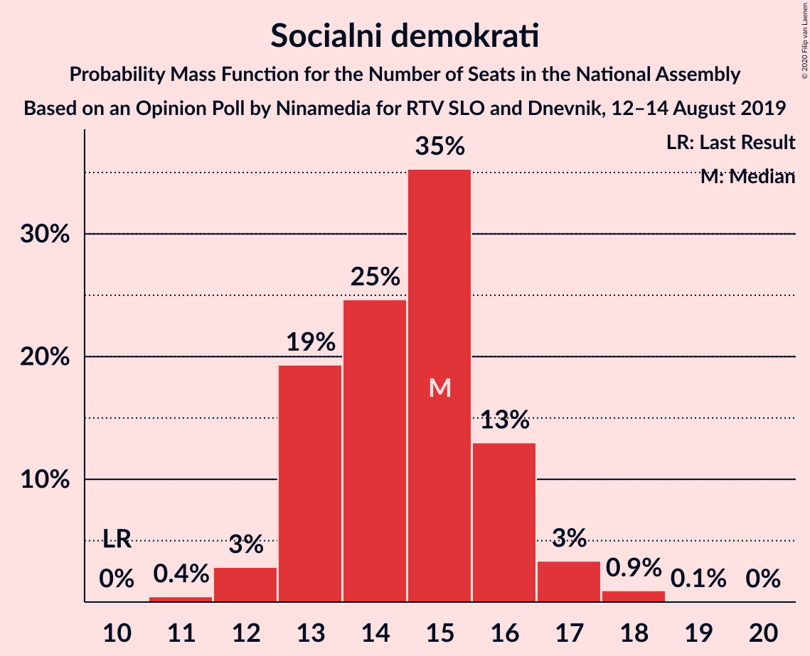
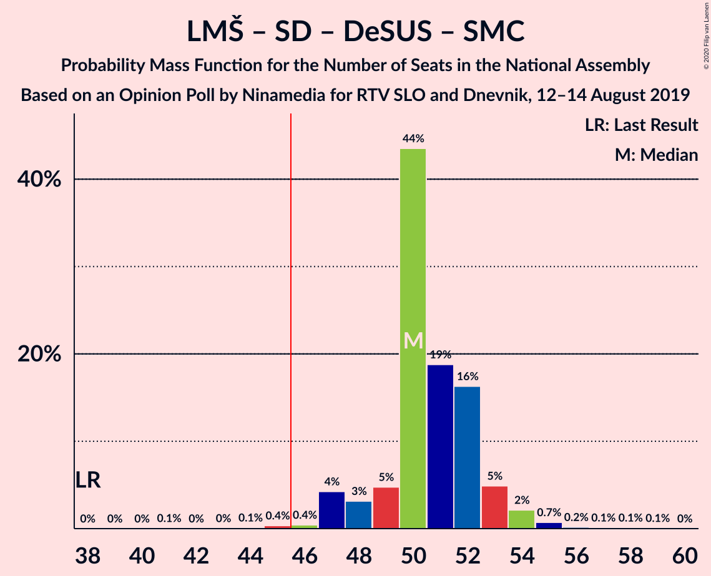
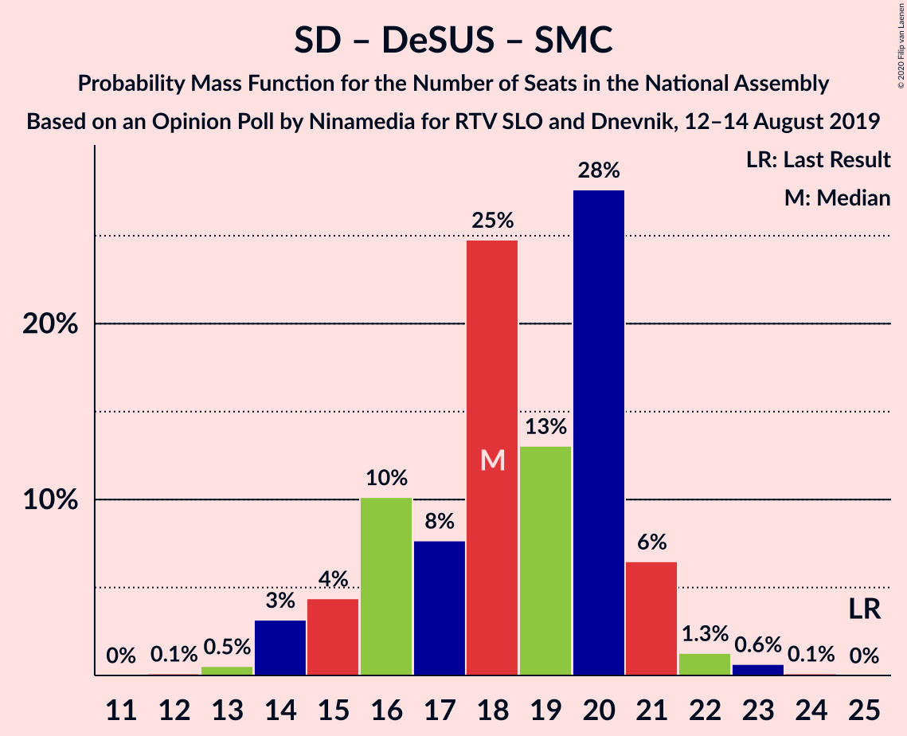

# Opinion Poll by Ninamedia for RTV SLO and Dnevnik, 12–14 August 2019

<a href="#voting-intentions">Voting Intentions</a> | <a href="#seats">Seats</a> | <a href="#coalitions">Coalitions</a> | <a href="#technical-information">Technical Information</a>

## Voting Intentions

### Confidence Intervals

| Party | Last Result | Poll Result | 80% Confidence Interval | 90% Confidence Interval | 95% Confidence Interval | 99% Confidence Interval |
|:-----:|:-----------:|:-----------:|:-----------------------:|:-----------------------:|:-----------------------:|:-----------------------:|
| Lista Marjana Šarca | 12.6% | 32.9% | 30.6–35.2% |30.0–35.8% |29.5–36.4% |28.4–37.6% |
| Slovenska demokratska stranka | 24.9% | 23.0% | 21.0–25.1% |20.5–25.7% |20.0–26.3% |19.1–27.3% |
| Socialni demokrati | 9.9% | 14.9% | 13.2–16.7% |12.8–17.2% |12.4–17.7% |11.7–18.6% |
| Levica | 9.3% | 9.1% | 7.9–10.7% |7.5–11.1% |7.2–11.5% |6.7–12.3% |
| Nova Slovenija–Krščanski demokrati | 7.2% | 5.3% | 4.3–6.5% |4.1–6.9% |3.9–7.2% |3.4–7.8% |
| Demokratična stranka upokojencev Slovenije | 4.9% | 4.9% | 4.0–6.1% |3.7–6.4% |3.5–6.7% |3.1–7.3% |
| Stranka Alenke Bratušek | 5.1% | 3.6% | 2.8–4.6% |2.6–5.0% |2.4–5.2% |2.1–5.8% |
| Slovenska nacionalna stranka | 4.2% | 2.7% | 2.1–3.7% |1.9–4.0% |1.7–4.2% |1.5–4.7% |
| Slovenska ljudska stranka | 2.6% | 2.3% | 1.7–3.2% |1.5–3.5% |1.4–3.7% |1.2–4.2% |
| Stranka modernega centra | 9.7% | 0.7% | 0.4–1.3% |0.4–1.5% |0.3–1.7% |0.2–2.0% |

*Note:* The poll result column reflects the actual value used in the calculations. Published results may vary slightly, and in addition be rounded to fewer digits.

## Seats

### Confidence Intervals

| Party | Last Result | Median | 80% Confidence Interval | 90% Confidence Interval | 95% Confidence Interval | 99% Confidence Interval |
|:-----:|:-----------:|:------:|:-----------------------:|:-----------------------:|:-----------------------:|:-----------------------:|
| <a href="#lista-marjana-šarca">Lista Marjana Šarca</a> | 13 | 32 | 31–35 |31–35 |30–35 |28–36 |
| <a href="#slovenska-demokratska-stranka">Slovenska demokratska stranka</a> | 25 | 21 | 21–22 |20–23 |20–24 |19–26 |
| <a href="#socialni-demokrati">Socialni demokrati</a> | 10 | 13 | 13–15 |13–15 |12–16 |12–18 |
| <a href="#levica">Levica</a> | 9 | 9 | 8–10 |8–10 |7–11 |7–12 |
| <a href="#nova-slovenija–krščanski-demokrati">Nova Slovenija–Krščanski demokrati</a> | 7 | 4 | 4–5 |4–6 |4–7 |0–7 |
| <a href="#demokratična-stranka-upokojencev-slovenije">Demokratična stranka upokojencev Slovenije</a> | 5 | 5 | 4–5 |3–5 |0–6 |0–6 |
| <a href="#stranka-alenke-bratušek">Stranka Alenke Bratušek</a> | 5 | 4 | 0–4 |0–4 |0–4 |0–5 |
| <a href="#slovenska-nacionalna-stranka">Slovenska nacionalna stranka</a> | 4 | 0 | 0 |0 |0 |0 |
| <a href="#slovenska-ljudska-stranka">Slovenska ljudska stranka</a> | 0 | 0 | 0 |0 |0 |0 |
| <a href="#stranka-modernega-centra">Stranka modernega centra</a> | 10 | 0 | 0 |0 |0 |0 |

### Lista Marjana Šarca

*For a full overview of the results for this party, see the [Lista Marjana Šarca](party-listamarjanašarca.html) page.*

| Number of Seats | Probability | Accumulated | Special Marks |
|:---------------:|:-----------:|:-----------:|:-------------:|
| 13 | 0% | 100% | Last Result |
| 14 | 0% | 100% |  |
| 15 | 0% | 100% |  |
| 16 | 0% | 100% |  |
| 17 | 0% | 100% |  |
| 18 | 0% | 100% |  |
| 19 | 0% | 100% |  |
| 20 | 0% | 100% |  |
| 21 | 0% | 100% |  |
| 22 | 0% | 100% |  |
| 23 | 0% | 100% |  |
| 24 | 0% | 100% |  |
| 25 | 0% | 100% |  |
| 26 | 0% | 100% |  |
| 27 | 0.1% | 100% |  |
| 28 | 0.9% | 99.8% |  |
| 29 | 1.1% | 98.9% |  |
| 30 | 2% | 98% |  |
| 31 | 14% | 96% |  |
| 32 | 56% | 81% | Median |
| 33 | 5% | 25% |  |
| 34 | 10% | 21% |  |
| 35 | 10% | 11% |  |
| 36 | 0.7% | 0.9% |  |
| 37 | 0.1% | 0.2% |  |
| 38 | 0.1% | 0.1% |  |
| 39 | 0% | 0% |  |

### Slovenska demokratska stranka

*For a full overview of the results for this party, see the [Slovenska demokratska stranka](party-slovenskademokratskastranka.html) page.*

| Number of Seats | Probability | Accumulated | Special Marks |
|:---------------:|:-----------:|:-----------:|:-------------:|
| 18 | 0.4% | 100% |  |
| 19 | 1.3% | 99.6% |  |
| 20 | 6% | 98% |  |
| 21 | 55% | 92% | Median |
| 22 | 27% | 37% |  |
| 23 | 4% | 9% |  |
| 24 | 4% | 5% |  |
| 25 | 0.7% | 1.3% | Last Result |
| 26 | 0.5% | 0.6% |  |
| 27 | 0.1% | 0.2% |  |
| 28 | 0.1% | 0.1% |  |
| 29 | 0% | 0% |  |

### Socialni demokrati

*For a full overview of the results for this party, see the [Socialni demokrati](party-socialnidemokrati.html) page.*

| Number of Seats | Probability | Accumulated | Special Marks |
|:---------------:|:-----------:|:-----------:|:-------------:|
| 10 | 0% | 100% | Last Result |
| 11 | 0.4% | 100% |  |
| 12 | 3% | 99.6% |  |
| 13 | 59% | 96% | Median |
| 14 | 24% | 37% |  |
| 15 | 9% | 14% |  |
| 16 | 3% | 5% |  |
| 17 | 0.3% | 1.5% |  |
| 18 | 1.1% | 1.2% |  |
| 19 | 0% | 0.1% |  |
| 20 | 0% | 0% |  |

### Levica

*For a full overview of the results for this party, see the [Levica](party-levica.html) page.*

| Number of Seats | Probability | Accumulated | Special Marks |
|:---------------:|:-----------:|:-----------:|:-------------:|
| 5 | 0.1% | 100% |  |
| 6 | 0.2% | 99.9% |  |
| 7 | 2% | 99.7% |  |
| 8 | 22% | 97% |  |
| 9 | 59% | 76% | Last Result, Median |
| 10 | 13% | 17% |  |
| 11 | 3% | 3% |  |
| 12 | 0.7% | 0.7% |  |
| 13 | 0% | 0% |  |

### Nova Slovenija–Krščanski demokrati

*For a full overview of the results for this party, see the [Nova Slovenija–Krščanski demokrati](party-novaslovenija–krščanskidemokrati.html) page.*

| Number of Seats | Probability | Accumulated | Special Marks |
|:---------------:|:-----------:|:-----------:|:-------------:|
| 0 | 2% | 100% |  |
| 1 | 0% | 98% |  |
| 2 | 0% | 98% |  |
| 3 | 0.1% | 98% |  |
| 4 | 72% | 98% | Median |
| 5 | 19% | 27% |  |
| 6 | 5% | 7% |  |
| 7 | 3% | 3% | Last Result |
| 8 | 0.1% | 0.1% |  |
| 9 | 0% | 0% |  |

### Demokratična stranka upokojencev Slovenije

*For a full overview of the results for this party, see the [Demokratična stranka upokojencev Slovenije](party-demokratičnastrankaupokojencevslovenije.html) page.*

| Number of Seats | Probability | Accumulated | Special Marks |
|:---------------:|:-----------:|:-----------:|:-------------:|
| 0 | 4% | 100% |  |
| 1 | 0% | 96% |  |
| 2 | 0% | 96% |  |
| 3 | 3% | 96% |  |
| 4 | 24% | 93% |  |
| 5 | 65% | 68% | Last Result, Median |
| 6 | 3% | 3% |  |
| 7 | 0.2% | 0.3% |  |
| 8 | 0.1% | 0.1% |  |
| 9 | 0% | 0% |  |

### Stranka Alenke Bratušek

*For a full overview of the results for this party, see the [Stranka Alenke Bratušek](party-strankaalenkebratušek.html) page.*

| Number of Seats | Probability | Accumulated | Special Marks |
|:---------------:|:-----------:|:-----------:|:-------------:|
| 0 | 26% | 100% |  |
| 1 | 0% | 74% |  |
| 2 | 0% | 74% |  |
| 3 | 3% | 74% |  |
| 4 | 71% | 71% | Median |
| 5 | 0.6% | 0.6% | Last Result |
| 6 | 0% | 0% |  |

### Slovenska nacionalna stranka

*For a full overview of the results for this party, see the [Slovenska nacionalna stranka](party-slovenskanacionalnastranka.html) page.*

| Number of Seats | Probability | Accumulated | Special Marks |
|:---------------:|:-----------:|:-----------:|:-------------:|
| 0 | 99.8% | 100% | Median |
| 1 | 0% | 0.2% |  |
| 2 | 0% | 0.2% |  |
| 3 | 0% | 0.2% |  |
| 4 | 0.1% | 0.1% | Last Result |
| 5 | 0.1% | 0.1% |  |
| 6 | 0% | 0% |  |

### Slovenska ljudska stranka

*For a full overview of the results for this party, see the [Slovenska ljudska stranka](party-slovenskaljudskastranka.html) page.*

| Number of Seats | Probability | Accumulated | Special Marks |
|:---------------:|:-----------:|:-----------:|:-------------:|
| 0 | 99.5% | 100% | Last Result, Median |
| 1 | 0% | 0.5% |  |
| 2 | 0% | 0.5% |  |
| 3 | 0% | 0.5% |  |
| 4 | 0.5% | 0.5% |  |
| 5 | 0% | 0% |  |

### Stranka modernega centra

*For a full overview of the results for this party, see the [Stranka modernega centra](party-strankamodernegacentra.html) page.*

| Number of Seats | Probability | Accumulated | Special Marks |
|:---------------:|:-----------:|:-----------:|:-------------:|
| 0 | 100% | 100% | Median |
| 1 | 0% | 0% |  |
| 2 | 0% | 0% |  |
| 3 | 0% | 0% |  |
| 4 | 0% | 0% |  |
| 5 | 0% | 0% |  |
| 6 | 0% | 0% |  |
| 7 | 0% | 0% |  |
| 8 | 0% | 0% |  |
| 9 | 0% | 0% |  |
| 10 | 0% | 0% | Last Result |

## Coalitions

### Confidence Intervals

| Coalition | Last Result | Median | Majority? | 80% Confidence Interval | 90% Confidence Interval | 95% Confidence Interval | 99% Confidence Interval |
|:---------:|:-----------:|:------:|:---------:|:-----------------------:|:-----------------------:|:-----------------------:|:-----------------------:|
| Lista Marjana Šarca – Slovenska demokratska stranka – Demokratična stranka upokojencev Slovenije | 43 | 58 | 100% | 56–61 | 55–61 | 54–61 | 53–64 |
| Lista Marjana Šarca – Socialni demokrati – Nova Slovenija–Krščanski demokrati – Demokratična stranka upokojencev Slovenije – Stranka Alenke Bratušek – Stranka modernega centra | 50 | 58 | 100% | 56–58 | 55–59 | 54–60 | 52–60 |
| Lista Marjana Šarca – Socialni demokrati – Nova Slovenija–Krščanski demokrati – Demokratična stranka upokojencev Slovenije | 35 | 54 | 100% | 54–58 | 53–58 | 52–60 | 50–60 |
| Lista Marjana Šarca – Socialni demokrati – Nova Slovenija–Krščanski demokrati – Demokratična stranka upokojencev Slovenije – Stranka modernega centra | 45 | 54 | 100% | 54–58 | 53–58 | 52–60 | 50–60 |
| Lista Marjana Šarca – Slovenska demokratska stranka | 38 | 53 | 100% | 53–57 | 51–57 | 51–57 | 49–59 |
| Lista Marjana Šarca – Socialni demokrati – Demokratična stranka upokojencev Slovenije – Stranka Alenke Bratušek – Stranka modernega centra | 43 | 54 | 100% | 51–54 | 49–54 | 48–55 | 48–56 |
| Lista Marjana Šarca – Socialni demokrati – Nova Slovenija–Krščanski demokrati | 30 | 49 | 99.7% | 49–54 | 49–55 | 48–55 | 46–55 |
| Lista Marjana Šarca – Socialni demokrati – Nova Slovenija–Krščanski demokrati – Stranka modernega centra | 40 | 49 | 99.7% | 49–54 | 49–55 | 48–55 | 46–55 |
| Lista Marjana Šarca – Socialni demokrati – Demokratična stranka upokojencev Slovenije | 28 | 50 | 99.8% | 49–53 | 48–53 | 48–53 | 46–55 |
| Lista Marjana Šarca – Socialni demokrati – Demokratična stranka upokojencev Slovenije – Stranka modernega centra | 38 | 50 | 99.8% | 49–53 | 48–53 | 48–53 | 46–55 |
| Lista Marjana Šarca – Socialni demokrati | 23 | 45 | 33% | 45–49 | 44–49 | 43–50 | 42–51 |
| Lista Marjana Šarca – Socialni demokrati – Stranka modernega centra | 33 | 45 | 33% | 45–49 | 44–49 | 43–50 | 42–51 |
| Socialni demokrati – Demokratična stranka upokojencev Slovenije – Stranka modernega centra | 25 | 18 | 0% | 17–19 | 16–19 | 16–20 | 15–22 |

### Lista Marjana Šarca – Slovenska demokratska stranka – Demokratična stranka upokojencev Slovenije

| Number of Seats | Probability | Accumulated | Special Marks |
|:---------------:|:-----------:|:-----------:|:-------------:|
| 43 | 0% | 100% | Last Result |
| 44 | 0% | 100% |  |
| 45 | 0% | 100% |  |
| 46 | 0% | 100% | Majority |
| 47 | 0% | 100% |  |
| 48 | 0% | 100% |  |
| 49 | 0% | 100% |  |
| 50 | 0% | 100% |  |
| 51 | 0% | 100% |  |
| 52 | 0% | 100% |  |
| 53 | 0.7% | 99.9% |  |
| 54 | 3% | 99.2% |  |
| 55 | 5% | 97% |  |
| 56 | 3% | 92% |  |
| 57 | 0.6% | 89% |  |
| 58 | 65% | 89% | Median |
| 59 | 3% | 24% |  |
| 60 | 9% | 20% |  |
| 61 | 10% | 12% |  |
| 62 | 0.3% | 2% |  |
| 63 | 0.6% | 2% |  |
| 64 | 0.9% | 0.9% |  |
| 65 | 0% | 0% |  |

### Lista Marjana Šarca – Socialni demokrati – Nova Slovenija–Krščanski demokrati – Demokratična stranka upokojencev Slovenije – Stranka Alenke Bratušek – Stranka modernega centra

| Number of Seats | Probability | Accumulated | Special Marks |
|:---------------:|:-----------:|:-----------:|:-------------:|
| 50 | 0% | 100% | Last Result |
| 51 | 0.1% | 100% |  |
| 52 | 1.0% | 99.9% |  |
| 53 | 0.6% | 98.9% |  |
| 54 | 3% | 98% |  |
| 55 | 2% | 95% |  |
| 56 | 10% | 93% |  |
| 57 | 1.2% | 83% |  |
| 58 | 75% | 82% | Median |
| 59 | 3% | 7% |  |
| 60 | 3% | 4% |  |
| 61 | 0.2% | 0.3% |  |
| 62 | 0.1% | 0.1% |  |
| 63 | 0% | 0% |  |

### Lista Marjana Šarca – Socialni demokrati – Nova Slovenija–Krščanski demokrati – Demokratična stranka upokojencev Slovenije

| Number of Seats | Probability | Accumulated | Special Marks |
|:---------------:|:-----------:|:-----------:|:-------------:|
| 35 | 0% | 100% | Last Result |
| 36 | 0% | 100% |  |
| 37 | 0% | 100% |  |
| 38 | 0% | 100% |  |
| 39 | 0% | 100% |  |
| 40 | 0% | 100% |  |
| 41 | 0% | 100% |  |
| 42 | 0% | 100% |  |
| 43 | 0% | 100% |  |
| 44 | 0% | 100% |  |
| 45 | 0% | 100% |  |
| 46 | 0% | 100% | Majority |
| 47 | 0% | 100% |  |
| 48 | 0% | 100% |  |
| 49 | 0.2% | 99.9% |  |
| 50 | 0.9% | 99.8% |  |
| 51 | 0.5% | 98.9% |  |
| 52 | 2% | 98% |  |
| 53 | 4% | 97% |  |
| 54 | 68% | 93% | Median |
| 55 | 4% | 25% |  |
| 56 | 7% | 21% |  |
| 57 | 0.9% | 14% |  |
| 58 | 9% | 13% |  |
| 59 | 0.8% | 3% |  |
| 60 | 3% | 3% |  |
| 61 | 0.1% | 0.2% |  |
| 62 | 0% | 0% |  |

### Lista Marjana Šarca – Socialni demokrati – Nova Slovenija–Krščanski demokrati – Demokratična stranka upokojencev Slovenije – Stranka modernega centra

| Number of Seats | Probability | Accumulated | Special Marks |
|:---------------:|:-----------:|:-----------:|:-------------:|
| 45 | 0% | 100% | Last Result |
| 46 | 0% | 100% | Majority |
| 47 | 0% | 100% |  |
| 48 | 0% | 100% |  |
| 49 | 0.2% | 99.9% |  |
| 50 | 0.9% | 99.8% |  |
| 51 | 0.5% | 98.9% |  |
| 52 | 2% | 98% |  |
| 53 | 4% | 97% |  |
| 54 | 68% | 93% | Median |
| 55 | 4% | 25% |  |
| 56 | 7% | 21% |  |
| 57 | 0.9% | 14% |  |
| 58 | 9% | 13% |  |
| 59 | 0.8% | 3% |  |
| 60 | 3% | 3% |  |
| 61 | 0.1% | 0.2% |  |
| 62 | 0% | 0% |  |

### Lista Marjana Šarca – Slovenska demokratska stranka

| Number of Seats | Probability | Accumulated | Special Marks |
|:---------------:|:-----------:|:-----------:|:-------------:|
| 38 | 0% | 100% | Last Result |
| 39 | 0% | 100% |  |
| 40 | 0% | 100% |  |
| 41 | 0% | 100% |  |
| 42 | 0% | 100% |  |
| 43 | 0% | 100% |  |
| 44 | 0% | 100% |  |
| 45 | 0% | 100% |  |
| 46 | 0% | 100% | Majority |
| 47 | 0% | 100% |  |
| 48 | 0.3% | 100% |  |
| 49 | 1.1% | 99.7% |  |
| 50 | 0.4% | 98.6% |  |
| 51 | 4% | 98% |  |
| 52 | 2% | 94% |  |
| 53 | 62% | 92% | Median |
| 54 | 5% | 30% |  |
| 55 | 4% | 25% |  |
| 56 | 10% | 21% |  |
| 57 | 10% | 12% |  |
| 58 | 0.6% | 2% |  |
| 59 | 0.5% | 1.0% |  |
| 60 | 0.3% | 0.5% |  |
| 61 | 0% | 0.2% |  |
| 62 | 0.1% | 0.1% |  |
| 63 | 0% | 0% |  |

### Lista Marjana Šarca – Socialni demokrati – Demokratična stranka upokojencev Slovenije – Stranka Alenke Bratušek – Stranka modernega centra

| Number of Seats | Probability | Accumulated | Special Marks |
|:---------------:|:-----------:|:-----------:|:-------------:|
| 43 | 0% | 100% | Last Result |
| 44 | 0% | 100% |  |
| 45 | 0% | 100% |  |
| 46 | 0.1% | 100% | Majority |
| 47 | 0.4% | 99.9% |  |
| 48 | 3% | 99.6% |  |
| 49 | 2% | 97% |  |
| 50 | 0.7% | 95% |  |
| 51 | 7% | 94% |  |
| 52 | 4% | 87% |  |
| 53 | 11% | 83% |  |
| 54 | 67% | 71% | Median |
| 55 | 3% | 4% |  |
| 56 | 0.8% | 1.1% |  |
| 57 | 0.2% | 0.3% |  |
| 58 | 0% | 0.1% |  |
| 59 | 0.1% | 0.1% |  |
| 60 | 0% | 0% |  |

### Lista Marjana Šarca – Socialni demokrati – Nova Slovenija–Krščanski demokrati

| Number of Seats | Probability | Accumulated | Special Marks |
|:---------------:|:-----------:|:-----------:|:-------------:|
| 30 | 0% | 100% | Last Result |
| 31 | 0% | 100% |  |
| 32 | 0% | 100% |  |
| 33 | 0% | 100% |  |
| 34 | 0% | 100% |  |
| 35 | 0% | 100% |  |
| 36 | 0% | 100% |  |
| 37 | 0% | 100% |  |
| 38 | 0% | 100% |  |
| 39 | 0% | 100% |  |
| 40 | 0% | 100% |  |
| 41 | 0% | 100% |  |
| 42 | 0% | 100% |  |
| 43 | 0% | 100% |  |
| 44 | 0.2% | 100% |  |
| 45 | 0.2% | 99.8% |  |
| 46 | 1.1% | 99.7% | Majority |
| 47 | 0.8% | 98.5% |  |
| 48 | 1.5% | 98% |  |
| 49 | 62% | 96% | Median |
| 50 | 10% | 35% |  |
| 51 | 0.6% | 25% |  |
| 52 | 7% | 24% |  |
| 53 | 2% | 17% |  |
| 54 | 9% | 16% |  |
| 55 | 6% | 6% |  |
| 56 | 0.1% | 0.2% |  |
| 57 | 0.1% | 0.1% |  |
| 58 | 0% | 0.1% |  |
| 59 | 0% | 0% |  |

### Lista Marjana Šarca – Socialni demokrati – Nova Slovenija–Krščanski demokrati – Stranka modernega centra

| Number of Seats | Probability | Accumulated | Special Marks |
|:---------------:|:-----------:|:-----------:|:-------------:|
| 40 | 0% | 100% | Last Result |
| 41 | 0% | 100% |  |
| 42 | 0% | 100% |  |
| 43 | 0% | 100% |  |
| 44 | 0.2% | 100% |  |
| 45 | 0.2% | 99.8% |  |
| 46 | 1.1% | 99.7% | Majority |
| 47 | 0.8% | 98.5% |  |
| 48 | 1.5% | 98% |  |
| 49 | 62% | 96% | Median |
| 50 | 10% | 35% |  |
| 51 | 0.6% | 25% |  |
| 52 | 7% | 24% |  |
| 53 | 2% | 17% |  |
| 54 | 9% | 16% |  |
| 55 | 6% | 6% |  |
| 56 | 0.1% | 0.2% |  |
| 57 | 0.1% | 0.1% |  |
| 58 | 0% | 0.1% |  |
| 59 | 0% | 0% |  |

### Lista Marjana Šarca – Socialni demokrati – Demokratična stranka upokojencev Slovenije

| Number of Seats | Probability | Accumulated | Special Marks |
|:---------------:|:-----------:|:-----------:|:-------------:|
| 28 | 0% | 100% | Last Result |
| 29 | 0% | 100% |  |
| 30 | 0% | 100% |  |
| 31 | 0% | 100% |  |
| 32 | 0% | 100% |  |
| 33 | 0% | 100% |  |
| 34 | 0% | 100% |  |
| 35 | 0% | 100% |  |
| 36 | 0% | 100% |  |
| 37 | 0% | 100% |  |
| 38 | 0% | 100% |  |
| 39 | 0% | 100% |  |
| 40 | 0% | 100% |  |
| 41 | 0% | 100% |  |
| 42 | 0% | 100% |  |
| 43 | 0% | 100% |  |
| 44 | 0.1% | 100% |  |
| 45 | 0.2% | 99.9% |  |
| 46 | 0.4% | 99.8% | Majority |
| 47 | 1.4% | 99.4% |  |
| 48 | 3% | 98% |  |
| 49 | 5% | 95% |  |
| 50 | 67% | 90% | Median |
| 51 | 8% | 23% |  |
| 52 | 1.4% | 15% |  |
| 53 | 11% | 14% |  |
| 54 | 0.9% | 2% |  |
| 55 | 1.0% | 1.3% |  |
| 56 | 0.2% | 0.3% |  |
| 57 | 0% | 0% |  |

### Lista Marjana Šarca – Socialni demokrati – Demokratična stranka upokojencev Slovenije – Stranka modernega centra

| Number of Seats | Probability | Accumulated | Special Marks |
|:---------------:|:-----------:|:-----------:|:-------------:|
| 38 | 0% | 100% | Last Result |
| 39 | 0% | 100% |  |
| 40 | 0% | 100% |  |
| 41 | 0% | 100% |  |
| 42 | 0% | 100% |  |
| 43 | 0% | 100% |  |
| 44 | 0.1% | 100% |  |
| 45 | 0.2% | 99.9% |  |
| 46 | 0.4% | 99.8% | Majority |
| 47 | 1.4% | 99.4% |  |
| 48 | 3% | 98% |  |
| 49 | 5% | 95% |  |
| 50 | 67% | 90% | Median |
| 51 | 8% | 23% |  |
| 52 | 1.4% | 15% |  |
| 53 | 11% | 14% |  |
| 54 | 0.9% | 2% |  |
| 55 | 1.0% | 1.3% |  |
| 56 | 0.2% | 0.3% |  |
| 57 | 0% | 0% |  |

### Lista Marjana Šarca – Socialni demokrati

| Number of Seats | Probability | Accumulated | Special Marks |
|:---------------:|:-----------:|:-----------:|:-------------:|
| 23 | 0% | 100% | Last Result |
| 24 | 0% | 100% |  |
| 25 | 0% | 100% |  |
| 26 | 0% | 100% |  |
| 27 | 0% | 100% |  |
| 28 | 0% | 100% |  |
| 29 | 0% | 100% |  |
| 30 | 0% | 100% |  |
| 31 | 0% | 100% |  |
| 32 | 0% | 100% |  |
| 33 | 0% | 100% |  |
| 34 | 0% | 100% |  |
| 35 | 0% | 100% |  |
| 36 | 0% | 100% |  |
| 37 | 0% | 100% |  |
| 38 | 0% | 100% |  |
| 39 | 0% | 100% |  |
| 40 | 0.1% | 100% |  |
| 41 | 0.1% | 99.9% |  |
| 42 | 2% | 99.8% |  |
| 43 | 0.9% | 98% |  |
| 44 | 2% | 97% |  |
| 45 | 62% | 95% | Median |
| 46 | 8% | 33% | Majority |
| 47 | 6% | 25% |  |
| 48 | 3% | 18% |  |
| 49 | 12% | 15% |  |
| 50 | 1.4% | 3% |  |
| 51 | 1.4% | 1.4% |  |
| 52 | 0% | 0.1% |  |
| 53 | 0% | 0% |  |

### Lista Marjana Šarca – Socialni demokrati – Stranka modernega centra

| Number of Seats | Probability | Accumulated | Special Marks |
|:---------------:|:-----------:|:-----------:|:-------------:|
| 33 | 0% | 100% | Last Result |
| 34 | 0% | 100% |  |
| 35 | 0% | 100% |  |
| 36 | 0% | 100% |  |
| 37 | 0% | 100% |  |
| 38 | 0% | 100% |  |
| 39 | 0% | 100% |  |
| 40 | 0.1% | 100% |  |
| 41 | 0.1% | 99.9% |  |
| 42 | 2% | 99.8% |  |
| 43 | 0.9% | 98% |  |
| 44 | 2% | 97% |  |
| 45 | 62% | 95% | Median |
| 46 | 8% | 33% | Majority |
| 47 | 6% | 25% |  |
| 48 | 3% | 18% |  |
| 49 | 12% | 15% |  |
| 50 | 1.4% | 3% |  |
| 51 | 1.4% | 1.4% |  |
| 52 | 0% | 0.1% |  |
| 53 | 0% | 0% |  |

### Socialni demokrati – Demokratična stranka upokojencev Slovenije – Stranka modernega centra

| Number of Seats | Probability | Accumulated | Special Marks |
|:---------------:|:-----------:|:-----------:|:-------------:|
| 12 | 0.2% | 100% |  |
| 13 | 0.2% | 99.8% |  |
| 14 | 0.1% | 99.6% |  |
| 15 | 1.5% | 99.5% |  |
| 16 | 4% | 98% |  |
| 17 | 11% | 95% |  |
| 18 | 63% | 84% | Median |
| 19 | 16% | 21% |  |
| 20 | 3% | 5% |  |
| 21 | 0.7% | 2% |  |
| 22 | 1.2% | 1.3% |  |
| 23 | 0.1% | 0.1% |  |
| 24 | 0% | 0% |  |
| 25 | 0% | 0% | Last Result |

## Technical Information

### Opinion Poll

+ **Polling firm:** Ninamedia
+ **Commissioner(s):** RTV SLO and Dnevnik
+ **Fieldwork period:** 12–14 August 2019

### Calculations

+ **Sample size:** 700
+ **Simulations done:** 131,072
+ **Error estimate:** 3.76%

