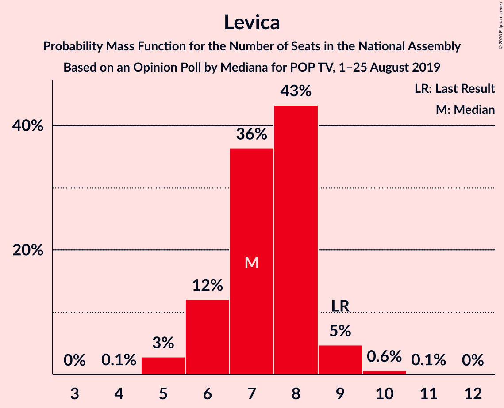
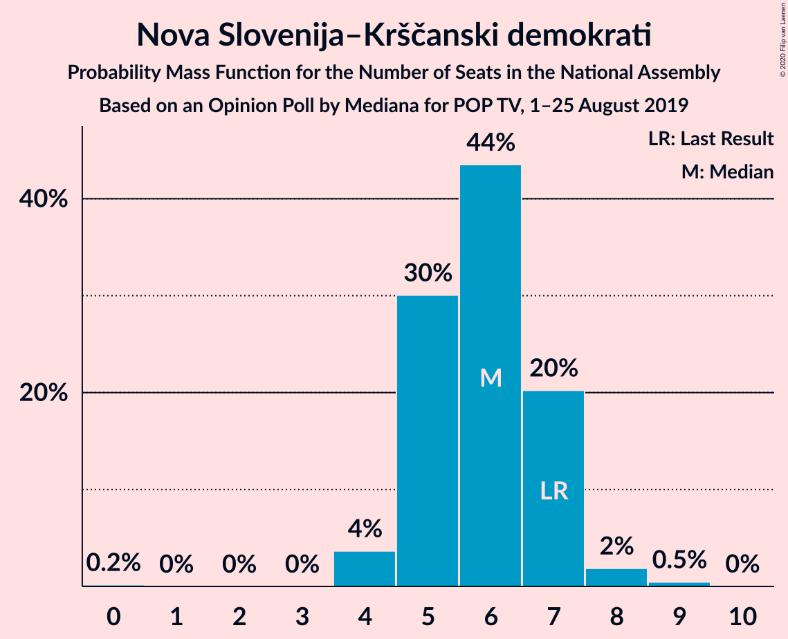
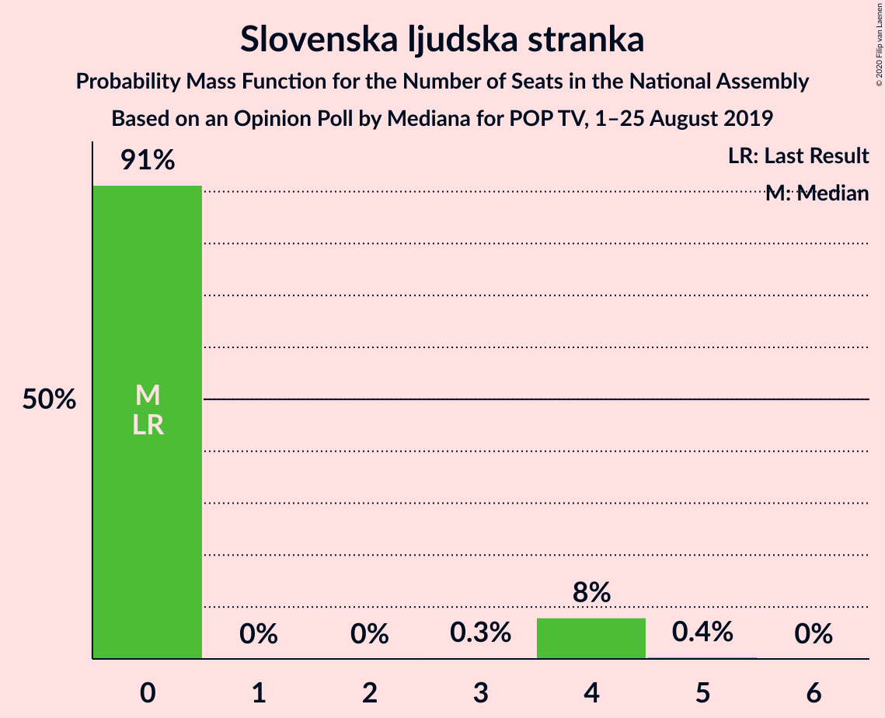
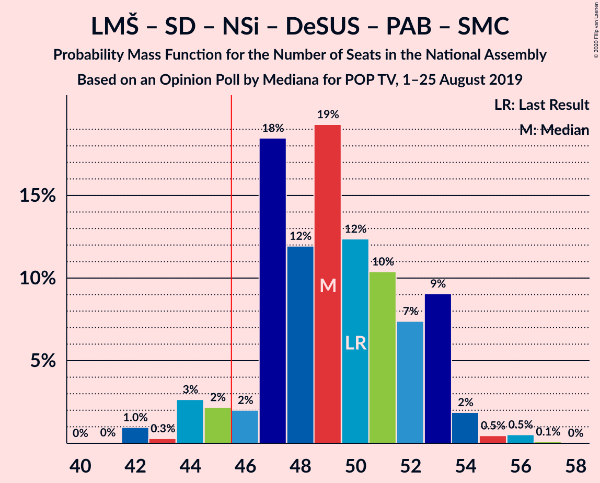
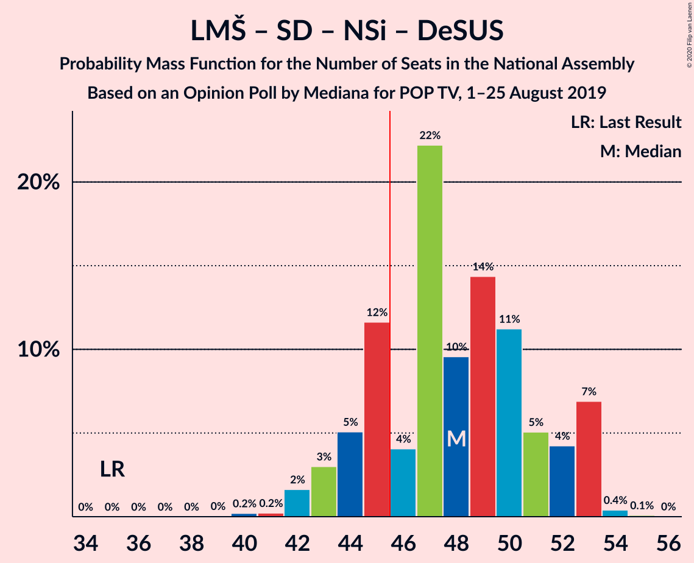
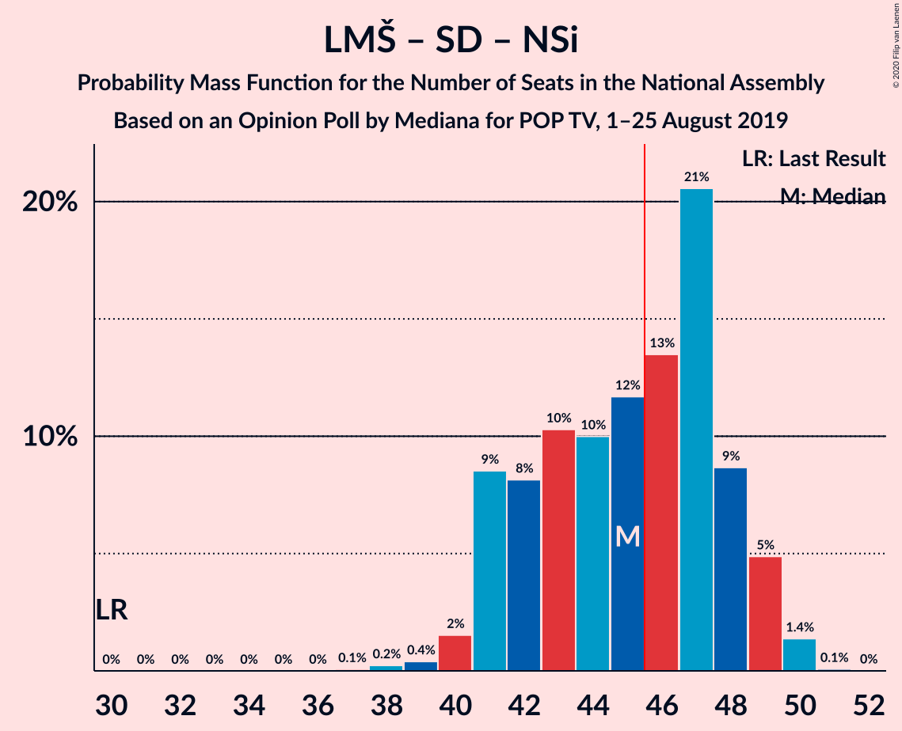
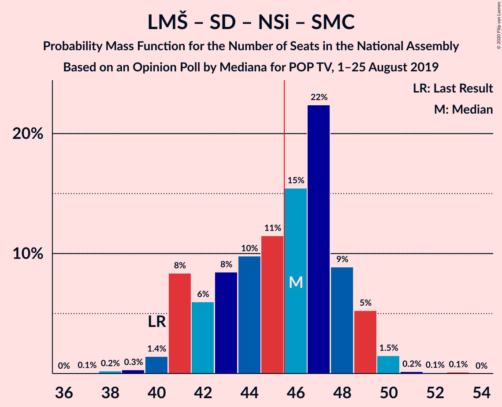
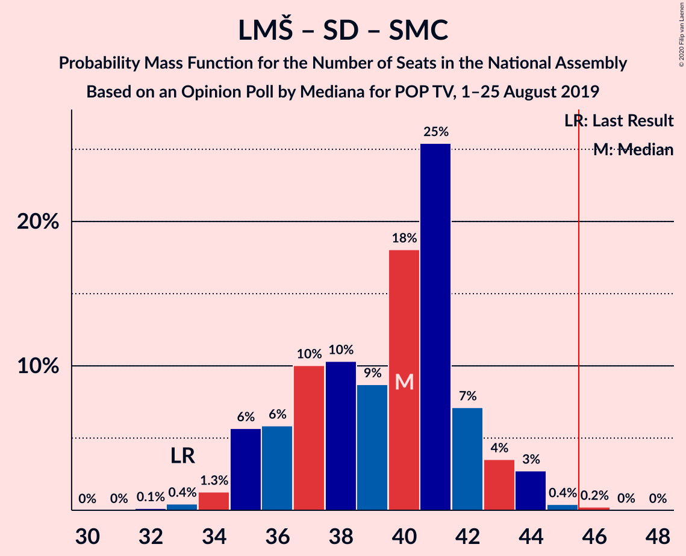
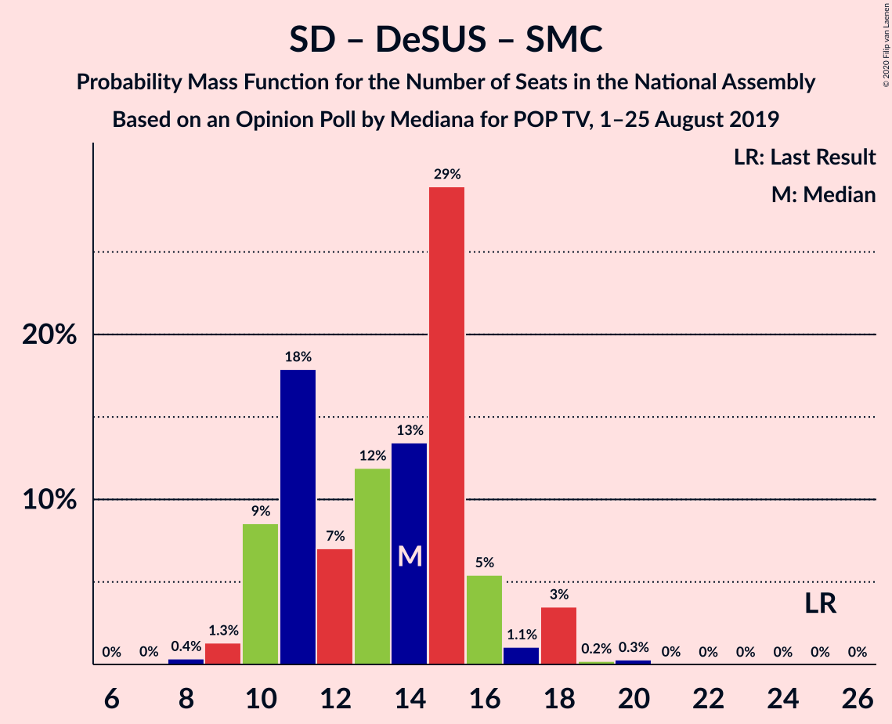

# Opinion Poll by Mediana for POP TV, 1–25 August 2019

<a href="#voting-intentions">Voting Intentions</a> | <a href="#seats">Seats</a> | <a href="#coalitions">Coalitions</a> | <a href="#technical-information">Technical Information</a>

## Voting Intentions

### Confidence Intervals

| Party | Last Result | Poll Result | 80% Confidence Interval | 90% Confidence Interval | 95% Confidence Interval | 99% Confidence Interval |
|:-----:|:-----------:|:-----------:|:-----------------------:|:-----------------------:|:-----------------------:|:-----------------------:|
| Lista Marjana Šarca | 12.6% | 28.5% | 26.4–30.8% |25.9–31.4% |25.3–31.9% |24.4–33.0% |
| Slovenska demokratska stranka | 24.9% | 23.7% | 21.7–25.8% |21.2–26.4% |20.7–26.9% |19.8–28.0% |
| Socialni demokrati | 9.9% | 10.5% | 9.2–12.1% |8.8–12.6% |8.5–13.0% |7.9–13.8% |
| Levica | 9.3% | 7.3% | 6.2–8.7% |5.9–9.1% |5.7–9.5% |5.2–10.2% |
| Nova Slovenija–Krščanski demokrati | 7.2% | 6.1% | 5.1–7.4% |4.8–7.8% |4.6–8.1% |4.1–8.7% |
| Demokratična stranka upokojencev Slovenije | 4.9% | 4.4% | 3.6–5.6% |3.4–5.9% |3.2–6.2% |2.8–6.8% |
| Stranka Alenke Bratušek | 5.1% | 3.6% | 2.9–4.7% |2.6–5.0% |2.5–5.2% |2.1–5.8% |
| Slovenska nacionalna stranka | 4.2% | 3.5% | 2.7–4.5% |2.5–4.8% |2.4–5.1% |2.0–5.6% |
| Slovenska ljudska stranka | 2.6% | 3.0% | 2.4–4.0% |2.2–4.3% |2.0–4.6% |1.7–5.1% |
| Stranka modernega centra | 9.7% | 2.8% | 2.1–3.7% |2.0–4.0% |1.8–4.3% |1.5–4.8% |

*Note:* The poll result column reflects the actual value used in the calculations. Published results may vary slightly, and in addition be rounded to fewer digits.

## Seats

### Confidence Intervals

| Party | Last Result | Median | 80% Confidence Interval | 90% Confidence Interval | 95% Confidence Interval | 99% Confidence Interval |
|:-----:|:-----------:|:------:|:-----------------------:|:-----------------------:|:-----------------------:|:-----------------------:|
| <a href="#lista-marjana-šarca">Lista Marjana Šarca</a> | 13 | 27 | 25–31 |25–32 |25–32 |24–33 |
| <a href="#slovenska-demokratska-stranka">Slovenska demokratska stranka</a> | 25 | 23 | 21–26 |21–26 |21–26 |20–28 |
| <a href="#socialni-demokrati">Socialni demokrati</a> | 10 | 10 | 9–12 |9–12 |8–12 |7–13 |
| <a href="#levica">Levica</a> | 9 | 7 | 6–8 |6–9 |5–9 |5–9 |
| <a href="#nova-slovenija–krščanski-demokrati">Nova Slovenija–Krščanski demokrati</a> | 7 | 6 | 5–7 |4–7 |4–7 |4–8 |
| <a href="#demokratična-stranka-upokojencev-slovenije">Demokratična stranka upokojencev Slovenije</a> | 5 | 3 | 0–4 |0–5 |0–5 |0–6 |
| <a href="#stranka-alenke-bratušek">Stranka Alenke Bratušek</a> | 5 | 0 | 0–4 |0–4 |0–4 |0–5 |
| <a href="#slovenska-nacionalna-stranka">Slovenska nacionalna stranka</a> | 4 | 0 | 0–4 |0–4 |0–4 |0–5 |
| <a href="#slovenska-ljudska-stranka">Slovenska ljudska stranka</a> | 0 | 0 | 0–4 |0–4 |0–4 |0–4 |
| <a href="#stranka-modernega-centra">Stranka modernega centra</a> | 10 | 0 | 0 |0 |0–4 |0–4 |

### Lista Marjana Šarca

*For a full overview of the results for this party, see the [Lista Marjana Šarca](party-listamarjanašarca.html) page.*

| Number of Seats | Probability | Accumulated | Special Marks |
|:---------------:|:-----------:|:-----------:|:-------------:|
| 13 | 0% | 100% | Last Result |
| 14 | 0% | 100% |  |
| 15 | 0% | 100% |  |
| 16 | 0% | 100% |  |
| 17 | 0% | 100% |  |
| 18 | 0% | 100% |  |
| 19 | 0% | 100% |  |
| 20 | 0% | 100% |  |
| 21 | 0% | 100% |  |
| 22 | 0% | 100% |  |
| 23 | 0.1% | 100% |  |
| 24 | 0.7% | 99.9% |  |
| 25 | 14% | 99.3% |  |
| 26 | 7% | 86% |  |
| 27 | 33% | 79% | Median |
| 28 | 4% | 46% |  |
| 29 | 5% | 42% |  |
| 30 | 3% | 37% |  |
| 31 | 27% | 34% |  |
| 32 | 7% | 7% |  |
| 33 | 0.4% | 0.6% |  |
| 34 | 0.2% | 0.2% |  |
| 35 | 0% | 0% |  |

### Slovenska demokratska stranka

*For a full overview of the results for this party, see the [Slovenska demokratska stranka](party-slovenskademokratskastranka.html) page.*

| Number of Seats | Probability | Accumulated | Special Marks |
|:---------------:|:-----------:|:-----------:|:-------------:|
| 18 | 0.1% | 100% |  |
| 19 | 0.2% | 99.9% |  |
| 20 | 2% | 99.7% |  |
| 21 | 19% | 98% |  |
| 22 | 16% | 79% |  |
| 23 | 14% | 63% | Median |
| 24 | 11% | 49% |  |
| 25 | 7% | 37% | Last Result |
| 26 | 29% | 31% |  |
| 27 | 0.6% | 2% |  |
| 28 | 1.0% | 1.1% |  |
| 29 | 0.1% | 0.1% |  |
| 30 | 0% | 0% |  |

### Socialni demokrati

*For a full overview of the results for this party, see the [Socialni demokrati](party-socialnidemokrati.html) page.*

| Number of Seats | Probability | Accumulated | Special Marks |
|:---------------:|:-----------:|:-----------:|:-------------:|
| 7 | 0.6% | 100% |  |
| 8 | 3% | 99.4% |  |
| 9 | 12% | 96% |  |
| 10 | 60% | 84% | Last Result, Median |
| 11 | 4% | 25% |  |
| 12 | 20% | 21% |  |
| 13 | 0.7% | 0.8% |  |
| 14 | 0.2% | 0.2% |  |
| 15 | 0% | 0% |  |

### Levica

*For a full overview of the results for this party, see the [Levica](party-levica.html) page.*

| Number of Seats | Probability | Accumulated | Special Marks |
|:---------------:|:-----------:|:-----------:|:-------------:|
| 5 | 4% | 100% |  |
| 6 | 31% | 96% |  |
| 7 | 53% | 65% | Median |
| 8 | 6% | 12% |  |
| 9 | 5% | 5% | Last Result |
| 10 | 0.4% | 0.4% |  |
| 11 | 0% | 0% |  |

### Nova Slovenija–Krščanski demokrati

*For a full overview of the results for this party, see the [Nova Slovenija–Krščanski demokrati](party-novaslovenija–krščanskidemokrati.html) page.*

| Number of Seats | Probability | Accumulated | Special Marks |
|:---------------:|:-----------:|:-----------:|:-------------:|
| 0 | 0.2% | 100% |  |
| 1 | 0% | 99.8% |  |
| 2 | 0% | 99.8% |  |
| 3 | 0% | 99.8% |  |
| 4 | 5% | 99.8% |  |
| 5 | 40% | 95% |  |
| 6 | 40% | 55% | Median |
| 7 | 13% | 15% | Last Result |
| 8 | 2% | 2% |  |
| 9 | 0% | 0% |  |

### Demokratična stranka upokojencev Slovenije

*For a full overview of the results for this party, see the [Demokratična stranka upokojencev Slovenije](party-demokratičnastrankaupokojencevslovenije.html) page.*

| Number of Seats | Probability | Accumulated | Special Marks |
|:---------------:|:-----------:|:-----------:|:-------------:|
| 0 | 37% | 100% |  |
| 1 | 0% | 63% |  |
| 2 | 0% | 63% |  |
| 3 | 17% | 63% | Median |
| 4 | 37% | 46% |  |
| 5 | 8% | 9% | Last Result |
| 6 | 0.7% | 0.8% |  |
| 7 | 0.1% | 0.1% |  |
| 8 | 0% | 0% |  |

### Stranka Alenke Bratušek

*For a full overview of the results for this party, see the [Stranka Alenke Bratušek](party-strankaalenkebratušek.html) page.*

| Number of Seats | Probability | Accumulated | Special Marks |
|:---------------:|:-----------:|:-----------:|:-------------:|
| 0 | 56% | 100% | Median |
| 1 | 0% | 44% |  |
| 2 | 0% | 44% |  |
| 3 | 17% | 44% |  |
| 4 | 26% | 27% |  |
| 5 | 0.8% | 1.0% | Last Result |
| 6 | 0.1% | 0.2% |  |
| 7 | 0% | 0% |  |

### Slovenska nacionalna stranka

*For a full overview of the results for this party, see the [Slovenska nacionalna stranka](party-slovenskanacionalnastranka.html) page.*

| Number of Seats | Probability | Accumulated | Special Marks |
|:---------------:|:-----------:|:-----------:|:-------------:|
| 0 | 58% | 100% | Median |
| 1 | 0% | 42% |  |
| 2 | 0% | 42% |  |
| 3 | 0.6% | 42% |  |
| 4 | 41% | 42% | Last Result |
| 5 | 0.8% | 0.9% |  |
| 6 | 0.1% | 0.1% |  |
| 7 | 0% | 0% |  |

### Slovenska ljudska stranka

*For a full overview of the results for this party, see the [Slovenska ljudska stranka](party-slovenskaljudskastranka.html) page.*

| Number of Seats | Probability | Accumulated | Special Marks |
|:---------------:|:-----------:|:-----------:|:-------------:|
| 0 | 72% | 100% | Last Result, Median |
| 1 | 0% | 28% |  |
| 2 | 0% | 28% |  |
| 3 | 0.8% | 28% |  |
| 4 | 27% | 28% |  |
| 5 | 0.3% | 0.3% |  |
| 6 | 0% | 0% |  |

### Stranka modernega centra

*For a full overview of the results for this party, see the [Stranka modernega centra](party-strankamodernegacentra.html) page.*

| Number of Seats | Probability | Accumulated | Special Marks |
|:---------------:|:-----------:|:-----------:|:-------------:|
| 0 | 97% | 100% | Median |
| 1 | 0% | 3% |  |
| 2 | 0% | 3% |  |
| 3 | 0.1% | 3% |  |
| 4 | 3% | 3% |  |
| 5 | 0.1% | 0.1% |  |
| 6 | 0% | 0% |  |
| 7 | 0% | 0% |  |
| 8 | 0% | 0% |  |
| 9 | 0% | 0% |  |
| 10 | 0% | 0% | Last Result |

## Coalitions

### Confidence Intervals

| Coalition | Last Result | Median | Majority? | 80% Confidence Interval | 90% Confidence Interval | 95% Confidence Interval | 99% Confidence Interval |
|:---------:|:-----------:|:------:|:---------:|:-----------------------:|:-----------------------:|:-----------------------:|:-----------------------:|
| Lista Marjana Šarca – Slovenska demokratska stranka – Demokratična stranka upokojencev Slovenije | 43 | 54 | 100% | 51–58 | 50–58 | 50–59 | 49–61 |
| Lista Marjana Šarca – Slovenska demokratska stranka | 38 | 52 | 99.8% | 47–57 | 47–58 | 47–58 | 46–58 |
| Lista Marjana Šarca – Socialni demokrati – Nova Slovenija–Krščanski demokrati – Demokratična stranka upokojencev Slovenije – Stranka Alenke Bratušek – Stranka modernega centra | 50 | 49 | 89% | 45–51 | 42–51 | 42–53 | 42–54 |
| Lista Marjana Šarca – Socialni demokrati – Nova Slovenija–Krščanski demokrati – Demokratična stranka upokojencev Slovenije | 35 | 46 | 51% | 44–50 | 42–51 | 42–51 | 41–54 |
| Lista Marjana Šarca – Socialni demokrati – Nova Slovenija–Krščanski demokrati – Demokratična stranka upokojencev Slovenije – Stranka modernega centra | 45 | 46 | 51% | 44–50 | 42–51 | 42–51 | 42–54 |
| Lista Marjana Šarca – Socialni demokrati – Nova Slovenija–Krščanski demokrati | 30 | 43 | 40% | 41–49 | 41–49 | 40–49 | 38–49 |
| Lista Marjana Šarca – Socialni demokrati – Nova Slovenija–Krščanski demokrati – Stranka modernega centra | 40 | 44 | 43% | 41–49 | 41–49 | 40–49 | 39–49 |
| Lista Marjana Šarca – Socialni demokrati – Demokratična stranka upokojencev Slovenije – Stranka Alenke Bratušek – Stranka modernega centra | 43 | 43 | 7% | 40–45 | 36–46 | 36–48 | 36–49 |
| Lista Marjana Šarca – Socialni demokrati – Demokratična stranka upokojencev Slovenije – Stranka modernega centra | 38 | 41 | 3% | 37–45 | 36–45 | 36–46 | 36–49 |
| Lista Marjana Šarca – Socialni demokrati – Demokratična stranka upokojencev Slovenije | 28 | 41 | 2% | 37–45 | 36–45 | 36–45 | 36–48 |
| Lista Marjana Šarca – Socialni demokrati | 23 | 37 | 0% | 35–43 | 35–43 | 34–43 | 33–44 |
| Lista Marjana Šarca – Socialni demokrati – Stranka modernega centra | 33 | 37 | 0% | 35–43 | 35–43 | 34–43 | 33–45 |
| Socialni demokrati – Demokratična stranka upokojencev Slovenije – Stranka modernega centra | 25 | 13 | 0% | 10–15 | 10–16 | 10–18 | 10–19 |

### Lista Marjana Šarca – Slovenska demokratska stranka – Demokratična stranka upokojencev Slovenije

| Number of Seats | Probability | Accumulated | Special Marks |
|:---------------:|:-----------:|:-----------:|:-------------:|
| 43 | 0% | 100% | Last Result |
| 44 | 0% | 100% |  |
| 45 | 0% | 100% |  |
| 46 | 0% | 100% | Majority |
| 47 | 0.1% | 100% |  |
| 48 | 0.1% | 99.9% |  |
| 49 | 0.6% | 99.8% |  |
| 50 | 6% | 99.2% |  |
| 51 | 29% | 93% |  |
| 52 | 3% | 64% |  |
| 53 | 8% | 62% | Median |
| 54 | 4% | 53% |  |
| 55 | 2% | 49% |  |
| 56 | 5% | 47% |  |
| 57 | 23% | 42% |  |
| 58 | 16% | 19% |  |
| 59 | 2% | 3% |  |
| 60 | 0.1% | 2% |  |
| 61 | 1.4% | 2% |  |
| 62 | 0.2% | 0.2% |  |
| 63 | 0% | 0% |  |

### Lista Marjana Šarca – Slovenska demokratska stranka

| Number of Seats | Probability | Accumulated | Special Marks |
|:---------------:|:-----------:|:-----------:|:-------------:|
| 38 | 0% | 100% | Last Result |
| 39 | 0% | 100% |  |
| 40 | 0% | 100% |  |
| 41 | 0% | 100% |  |
| 42 | 0% | 100% |  |
| 43 | 0% | 100% |  |
| 44 | 0% | 100% |  |
| 45 | 0.2% | 99.9% |  |
| 46 | 0.3% | 99.8% | Majority |
| 47 | 14% | 99.5% |  |
| 48 | 18% | 86% |  |
| 49 | 4% | 68% |  |
| 50 | 9% | 64% | Median |
| 51 | 3% | 56% |  |
| 52 | 5% | 53% |  |
| 53 | 11% | 47% |  |
| 54 | 11% | 36% |  |
| 55 | 1.1% | 26% |  |
| 56 | 0.3% | 24% |  |
| 57 | 18% | 24% |  |
| 58 | 5% | 6% |  |
| 59 | 0.1% | 0.2% |  |
| 60 | 0.1% | 0.1% |  |
| 61 | 0% | 0% |  |

### Lista Marjana Šarca – Socialni demokrati – Nova Slovenija–Krščanski demokrati – Demokratična stranka upokojencev Slovenije – Stranka Alenke Bratušek – Stranka modernega centra

| Number of Seats | Probability | Accumulated | Special Marks |
|:---------------:|:-----------:|:-----------:|:-------------:|
| 42 | 6% | 100% |  |
| 43 | 0.2% | 94% |  |
| 44 | 0.4% | 94% |  |
| 45 | 5% | 94% |  |
| 46 | 1.3% | 89% | Median, Majority |
| 47 | 7% | 88% |  |
| 48 | 26% | 81% |  |
| 49 | 29% | 55% |  |
| 50 | 16% | 26% | Last Result |
| 51 | 6% | 10% |  |
| 52 | 1.0% | 4% |  |
| 53 | 0.9% | 3% |  |
| 54 | 2% | 2% |  |
| 55 | 0.2% | 0.5% |  |
| 56 | 0.1% | 0.2% |  |
| 57 | 0.1% | 0.1% |  |
| 58 | 0% | 0% |  |

### Lista Marjana Šarca – Socialni demokrati – Nova Slovenija–Krščanski demokrati – Demokratična stranka upokojencev Slovenije

| Number of Seats | Probability | Accumulated | Special Marks |
|:---------------:|:-----------:|:-----------:|:-------------:|
| 35 | 0% | 100% | Last Result |
| 36 | 0% | 100% |  |
| 37 | 0% | 100% |  |
| 38 | 0% | 100% |  |
| 39 | 0.2% | 100% |  |
| 40 | 0.2% | 99.8% |  |
| 41 | 0.2% | 99.7% |  |
| 42 | 6% | 99.4% |  |
| 43 | 0.6% | 94% |  |
| 44 | 8% | 93% |  |
| 45 | 34% | 85% |  |
| 46 | 6% | 51% | Median, Majority |
| 47 | 7% | 45% |  |
| 48 | 2% | 38% |  |
| 49 | 17% | 36% |  |
| 50 | 12% | 19% |  |
| 51 | 6% | 7% |  |
| 52 | 0.3% | 1.4% |  |
| 53 | 0.4% | 1.1% |  |
| 54 | 0.5% | 0.6% |  |
| 55 | 0.1% | 0.1% |  |
| 56 | 0.1% | 0.1% |  |
| 57 | 0% | 0% |  |

### Lista Marjana Šarca – Socialni demokrati – Nova Slovenija–Krščanski demokrati – Demokratična stranka upokojencev Slovenije – Stranka modernega centra

| Number of Seats | Probability | Accumulated | Special Marks |
|:---------------:|:-----------:|:-----------:|:-------------:|
| 39 | 0.2% | 100% |  |
| 40 | 0.1% | 99.8% |  |
| 41 | 0.2% | 99.7% |  |
| 42 | 6% | 99.5% |  |
| 43 | 0.6% | 94% |  |
| 44 | 8% | 93% |  |
| 45 | 34% | 85% | Last Result |
| 46 | 4% | 51% | Median, Majority |
| 47 | 7% | 47% |  |
| 48 | 2% | 40% |  |
| 49 | 17% | 39% |  |
| 50 | 14% | 22% |  |
| 51 | 6% | 8% |  |
| 52 | 0.5% | 2% |  |
| 53 | 0.8% | 1.4% |  |
| 54 | 0.5% | 0.7% |  |
| 55 | 0.1% | 0.2% |  |
| 56 | 0.1% | 0.1% |  |
| 57 | 0% | 0% |  |

### Lista Marjana Šarca – Socialni demokrati – Nova Slovenija–Krščanski demokrati

| Number of Seats | Probability | Accumulated | Special Marks |
|:---------------:|:-----------:|:-----------:|:-------------:|
| 30 | 0% | 100% | Last Result |
| 31 | 0% | 100% |  |
| 32 | 0% | 100% |  |
| 33 | 0% | 100% |  |
| 34 | 0% | 100% |  |
| 35 | 0% | 100% |  |
| 36 | 0% | 100% |  |
| 37 | 0.1% | 100% |  |
| 38 | 0.4% | 99.9% |  |
| 39 | 0.8% | 99.5% |  |
| 40 | 3% | 98.7% |  |
| 41 | 15% | 96% |  |
| 42 | 29% | 80% |  |
| 43 | 1.3% | 51% | Median |
| 44 | 7% | 50% |  |
| 45 | 3% | 43% |  |
| 46 | 13% | 40% | Majority |
| 47 | 9% | 28% |  |
| 48 | 0.7% | 18% |  |
| 49 | 17% | 17% |  |
| 50 | 0.2% | 0.3% |  |
| 51 | 0% | 0.1% |  |
| 52 | 0% | 0% |  |

### Lista Marjana Šarca – Socialni demokrati – Nova Slovenija–Krščanski demokrati – Stranka modernega centra

| Number of Seats | Probability | Accumulated | Special Marks |
|:---------------:|:-----------:|:-----------:|:-------------:|
| 37 | 0.1% | 100% |  |
| 38 | 0.4% | 99.9% |  |
| 39 | 0.8% | 99.5% |  |
| 40 | 3% | 98.8% | Last Result |
| 41 | 15% | 96% |  |
| 42 | 27% | 80% |  |
| 43 | 1.2% | 54% | Median |
| 44 | 7% | 52% |  |
| 45 | 3% | 46% |  |
| 46 | 14% | 43% | Majority |
| 47 | 10% | 28% |  |
| 48 | 0.8% | 19% |  |
| 49 | 18% | 18% |  |
| 50 | 0.4% | 0.5% |  |
| 51 | 0% | 0.1% |  |
| 52 | 0% | 0% |  |

### Lista Marjana Šarca – Socialni demokrati – Demokratična stranka upokojencev Slovenije – Stranka Alenke Bratušek – Stranka modernega centra

| Number of Seats | Probability | Accumulated | Special Marks |
|:---------------:|:-----------:|:-----------:|:-------------:|
| 36 | 6% | 100% |  |
| 37 | 0.5% | 94% |  |
| 38 | 0.2% | 94% |  |
| 39 | 1.4% | 94% |  |
| 40 | 4% | 92% | Median |
| 41 | 9% | 89% |  |
| 42 | 8% | 80% |  |
| 43 | 47% | 72% | Last Result |
| 44 | 3% | 25% |  |
| 45 | 15% | 22% |  |
| 46 | 4% | 7% | Majority |
| 47 | 0.5% | 3% |  |
| 48 | 2% | 3% |  |
| 49 | 0.8% | 1.0% |  |
| 50 | 0.1% | 0.2% |  |
| 51 | 0.1% | 0.2% |  |
| 52 | 0% | 0.1% |  |
| 53 | 0% | 0% |  |

### Lista Marjana Šarca – Socialni demokrati – Demokratična stranka upokojencev Slovenije – Stranka modernega centra

| Number of Seats | Probability | Accumulated | Special Marks |
|:---------------:|:-----------:|:-----------:|:-------------:|
| 33 | 0.1% | 100% |  |
| 34 | 0% | 99.9% |  |
| 35 | 0% | 99.9% |  |
| 36 | 6% | 99.9% |  |
| 37 | 8% | 94% |  |
| 38 | 0.5% | 86% | Last Result |
| 39 | 14% | 85% |  |
| 40 | 21% | 72% | Median |
| 41 | 2% | 51% |  |
| 42 | 10% | 49% |  |
| 43 | 18% | 38% |  |
| 44 | 4% | 20% |  |
| 45 | 14% | 16% |  |
| 46 | 1.4% | 3% | Majority |
| 47 | 0.3% | 1.3% |  |
| 48 | 0.4% | 1.0% |  |
| 49 | 0.5% | 0.6% |  |
| 50 | 0% | 0% |  |

### Lista Marjana Šarca – Socialni demokrati – Demokratična stranka upokojencev Slovenije

| Number of Seats | Probability | Accumulated | Special Marks |
|:---------------:|:-----------:|:-----------:|:-------------:|
| 28 | 0% | 100% | Last Result |
| 29 | 0% | 100% |  |
| 30 | 0% | 100% |  |
| 31 | 0% | 100% |  |
| 32 | 0% | 100% |  |
| 33 | 0.1% | 100% |  |
| 34 | 0% | 99.9% |  |
| 35 | 0.1% | 99.9% |  |
| 36 | 6% | 99.8% |  |
| 37 | 8% | 94% |  |
| 38 | 0.7% | 86% |  |
| 39 | 14% | 85% |  |
| 40 | 21% | 71% | Median |
| 41 | 4% | 50% |  |
| 42 | 10% | 46% |  |
| 43 | 18% | 36% |  |
| 44 | 4% | 18% |  |
| 45 | 12% | 14% |  |
| 46 | 1.3% | 2% | Majority |
| 47 | 0.1% | 0.7% |  |
| 48 | 0.4% | 0.6% |  |
| 49 | 0.2% | 0.3% |  |
| 50 | 0% | 0% |  |

### Lista Marjana Šarca – Socialni demokrati

| Number of Seats | Probability | Accumulated | Special Marks |
|:---------------:|:-----------:|:-----------:|:-------------:|
| 23 | 0% | 100% | Last Result |
| 24 | 0% | 100% |  |
| 25 | 0% | 100% |  |
| 26 | 0% | 100% |  |
| 27 | 0% | 100% |  |
| 28 | 0% | 100% |  |
| 29 | 0% | 100% |  |
| 30 | 0% | 100% |  |
| 31 | 0% | 100% |  |
| 32 | 0.4% | 100% |  |
| 33 | 2% | 99.6% |  |
| 34 | 0.7% | 98% |  |
| 35 | 13% | 97% |  |
| 36 | 10% | 84% |  |
| 37 | 27% | 74% | Median |
| 38 | 5% | 47% |  |
| 39 | 2% | 42% |  |
| 40 | 5% | 39% |  |
| 41 | 12% | 35% |  |
| 42 | 6% | 23% |  |
| 43 | 17% | 17% |  |
| 44 | 0.4% | 0.6% |  |
| 45 | 0.2% | 0.2% |  |
| 46 | 0% | 0% | Majority |

### Lista Marjana Šarca – Socialni demokrati – Stranka modernega centra

| Number of Seats | Probability | Accumulated | Special Marks |
|:---------------:|:-----------:|:-----------:|:-------------:|
| 32 | 0.4% | 100% |  |
| 33 | 2% | 99.6% | Last Result |
| 34 | 0.7% | 98% |  |
| 35 | 13% | 97% |  |
| 36 | 10% | 84% |  |
| 37 | 25% | 74% | Median |
| 38 | 5% | 49% |  |
| 39 | 2% | 44% |  |
| 40 | 4% | 42% |  |
| 41 | 14% | 38% |  |
| 42 | 6% | 24% |  |
| 43 | 17% | 18% |  |
| 44 | 0.6% | 1.1% |  |
| 45 | 0.5% | 0.5% |  |
| 46 | 0% | 0% | Majority |

### Socialni demokrati – Demokratična stranka upokojencev Slovenije – Stranka modernega centra

| Number of Seats | Probability | Accumulated | Special Marks |
|:---------------:|:-----------:|:-----------:|:-------------:|
| 9 | 0.2% | 100% |  |
| 10 | 18% | 99.7% |  |
| 11 | 1.3% | 82% |  |
| 12 | 20% | 81% |  |
| 13 | 26% | 61% | Median |
| 14 | 24% | 35% |  |
| 15 | 3% | 11% |  |
| 16 | 4% | 8% |  |
| 17 | 0.4% | 4% |  |
| 18 | 3% | 3% |  |
| 19 | 0.4% | 0.6% |  |
| 20 | 0.2% | 0.2% |  |
| 21 | 0% | 0% |  |
| 22 | 0% | 0% |  |
| 23 | 0% | 0% |  |
| 24 | 0% | 0% |  |
| 25 | 0% | 0% | Last Result |

## Technical Information

### Opinion Poll

+ **Polling firm:** Mediana
+ **Commissioner(s):** POP TV
+ **Fieldwork period:** 1–25 August 2019

### Calculations

+ **Sample size:** 722
+ **Simulations done:** 131,072
+ **Error estimate:** 1.16%

