# Opinion Poll by Mediana for Delo, 28 August–5 September 2019

<a href="#voting-intentions">Voting Intentions</a> | <a href="#seats">Seats</a> | <a href="#coalitions">Coalitions</a> | <a href="#technical-information">Technical Information</a>

## Voting Intentions

### Confidence Intervals

| Party | Last Result | Poll Result | 80% Confidence Interval | 90% Confidence Interval | 95% Confidence Interval | 99% Confidence Interval |
|:-----:|:-----------:|:-----------:|:-----------------------:|:-----------------------:|:-----------------------:|:-----------------------:|
| Lista Marjana Šarca | 12.6% | 30.4% | 28.2–32.6% |27.6–33.2% |27.1–33.8% |26.1–34.9% |
| Slovenska demokratska stranka | 24.9% | 23.5% | 21.6–25.6% |21.0–26.2% |20.5–26.7% |19.6–27.7% |
| Socialni demokrati | 9.9% | 10.3% | 9.0–11.9% |8.6–12.3% |8.3–12.7% |7.7–13.5% |
| Levica | 9.3% | 10.3% | 9.0–11.9% |8.6–12.3% |8.3–12.7% |7.7–13.5% |
| Nova Slovenija–Krščanski demokrati | 7.2% | 8.2% | 7.1–9.7% |6.7–10.1% |6.4–10.5% |5.9–11.2% |
| Slovenska nacionalna stranka | 4.2% | 4.7% | 3.8–5.8% |3.6–6.2% |3.4–6.5% |3.0–7.1% |
| Demokratična stranka upokojencev Slovenije | 4.9% | 3.7% | 2.9–4.8% |2.7–5.1% |2.6–5.3% |2.2–5.9% |
| Stranka Alenke Bratušek | 5.1% | 3.4% | 2.7–4.5% |2.5–4.8% |2.3–5.0% |2.0–5.6% |
| Slovenska ljudska stranka | 2.6% | 3.2% | 2.5–4.2% |2.3–4.5% |2.1–4.7% |1.8–5.2% |
| Stranka modernega centra | 9.7% | 2.3% | 1.8–3.2% |1.6–3.5% |1.5–3.7% |1.2–4.2% |

*Note:* The poll result column reflects the actual value used in the calculations. Published results may vary slightly, and in addition be rounded to fewer digits.

## Seats

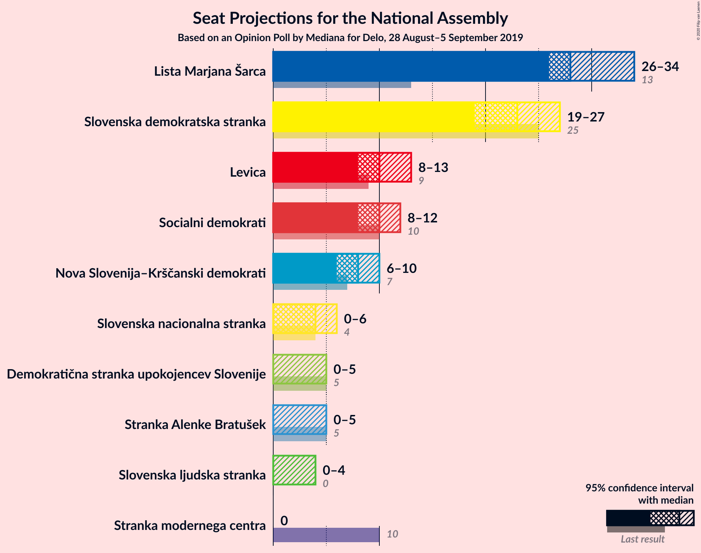

### Confidence Intervals

| Party | Last Result | Median | 80% Confidence Interval | 90% Confidence Interval | 95% Confidence Interval | 99% Confidence Interval |
|:-----:|:-----------:|:------:|:-----------------------:|:-----------------------:|:-----------------------:|:-----------------------:|
| <a href="#lista-marjana-šarca">Lista Marjana Šarca</a> | 13 | 28 | 27–33 |27–34 |26–34 |25–36 |
| <a href="#slovenska-demokratska-stranka">Slovenska demokratska stranka</a> | 25 | 23 | 21–26 |19–27 |19–27 |19–28 |
| <a href="#socialni-demokrati">Socialni demokrati</a> | 10 | 10 | 8–12 |8–12 |8–12 |7–14 |
| <a href="#levica">Levica</a> | 9 | 10 | 9–11 |9–13 |8–13 |7–13 |
| <a href="#nova-slovenija–krščanski-demokrati">Nova Slovenija–Krščanski demokrati</a> | 7 | 8 | 7–9 |6–9 |6–10 |6–11 |
| <a href="#slovenska-nacionalna-stranka">Slovenska nacionalna stranka</a> | 4 | 4 | 0–6 |0–6 |0–6 |0–6 |
| <a href="#demokratična-stranka-upokojencev-slovenije">Demokratična stranka upokojencev Slovenije</a> | 5 | 0 | 0–4 |0–4 |0–5 |0–5 |
| <a href="#stranka-alenke-bratušek">Stranka Alenke Bratušek</a> | 5 | 0 | 0–3 |0–4 |0–5 |0–5 |
| <a href="#slovenska-ljudska-stranka">Slovenska ljudska stranka</a> | 0 | 0 | 0–4 |0–4 |0–4 |0–5 |
| <a href="#stranka-modernega-centra">Stranka modernega centra</a> | 10 | 0 | 0 |0 |0 |0–4 |

### Lista Marjana Šarca

*For a full overview of the results for this party, see the [Lista Marjana Šarca](party-listamarjanašarca.html) page.*

| Number of Seats | Probability | Accumulated | Special Marks |
|:---------------:|:-----------:|:-----------:|:-------------:|
| 13 | 0% | 100% | Last Result |
| 14 | 0% | 100% |  |
| 15 | 0% | 100% |  |
| 16 | 0% | 100% |  |
| 17 | 0% | 100% |  |
| 18 | 0% | 100% |  |
| 19 | 0% | 100% |  |
| 20 | 0% | 100% |  |
| 21 | 0% | 100% |  |
| 22 | 0% | 100% |  |
| 23 | 0% | 100% |  |
| 24 | 0.2% | 100% |  |
| 25 | 0.3% | 99.8% |  |
| 26 | 2% | 99.5% |  |
| 27 | 9% | 97% |  |
| 28 | 43% | 88% | Median |
| 29 | 6% | 45% |  |
| 30 | 16% | 39% |  |
| 31 | 9% | 24% |  |
| 32 | 4% | 15% |  |
| 33 | 5% | 11% |  |
| 34 | 5% | 6% |  |
| 35 | 0.2% | 0.9% |  |
| 36 | 0.7% | 0.7% |  |
| 37 | 0% | 0.1% |  |
| 38 | 0% | 0% |  |

### Slovenska demokratska stranka

*For a full overview of the results for this party, see the [Slovenska demokratska stranka](party-slovenskademokratskastranka.html) page.*

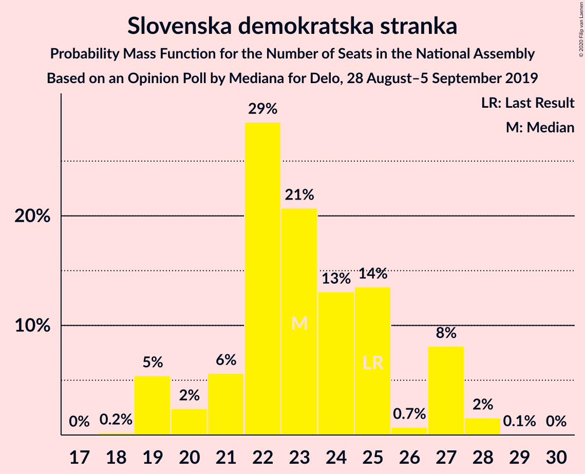

| Number of Seats | Probability | Accumulated | Special Marks |
|:---------------:|:-----------:|:-----------:|:-------------:|
| 18 | 0.2% | 100% |  |
| 19 | 5% | 99.8% |  |
| 20 | 2% | 94% |  |
| 21 | 6% | 92% |  |
| 22 | 29% | 86% |  |
| 23 | 21% | 58% | Median |
| 24 | 13% | 37% |  |
| 25 | 14% | 24% | Last Result |
| 26 | 0.7% | 10% |  |
| 27 | 8% | 10% |  |
| 28 | 2% | 2% |  |
| 29 | 0.1% | 0.1% |  |
| 30 | 0% | 0% |  |

### Socialni demokrati

*For a full overview of the results for this party, see the [Socialni demokrati](party-socialnidemokrati.html) page.*

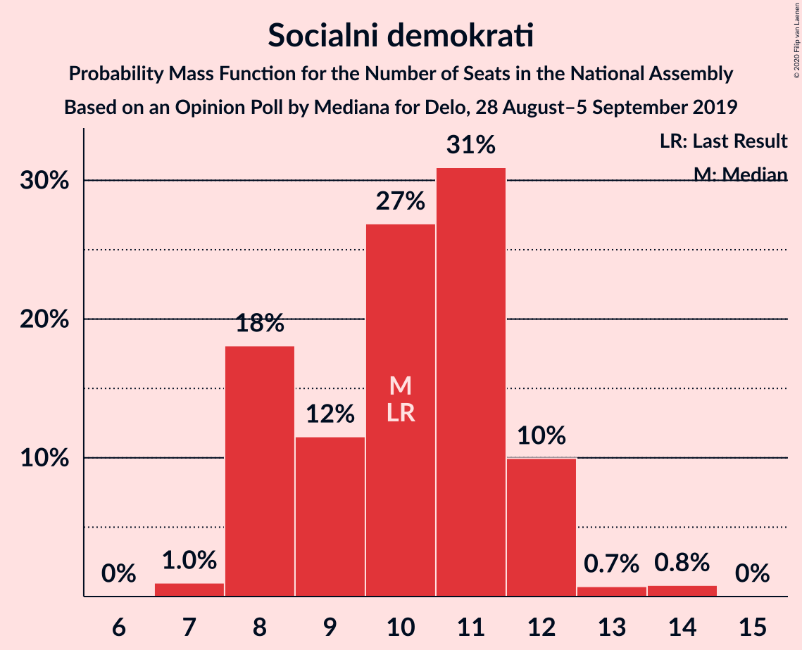

| Number of Seats | Probability | Accumulated | Special Marks |
|:---------------:|:-----------:|:-----------:|:-------------:|
| 7 | 1.0% | 100% |  |
| 8 | 18% | 99.0% |  |
| 9 | 12% | 81% |  |
| 10 | 27% | 69% | Last Result, Median |
| 11 | 31% | 42% |  |
| 12 | 10% | 12% |  |
| 13 | 0.7% | 2% |  |
| 14 | 0.8% | 0.9% |  |
| 15 | 0% | 0% |  |

### Levica

*For a full overview of the results for this party, see the [Levica](party-levica.html) page.*

| Number of Seats | Probability | Accumulated | Special Marks |
|:---------------:|:-----------:|:-----------:|:-------------:|
| 7 | 0.5% | 100% |  |
| 8 | 4% | 99.5% |  |
| 9 | 21% | 95% | Last Result |
| 10 | 56% | 75% | Median |
| 11 | 10% | 19% |  |
| 12 | 4% | 10% |  |
| 13 | 5% | 5% |  |
| 14 | 0.2% | 0.2% |  |
| 15 | 0% | 0% |  |

### Nova Slovenija–Krščanski demokrati

*For a full overview of the results for this party, see the [Nova Slovenija–Krščanski demokrati](party-novaslovenija–krščanskidemokrati.html) page.*

| Number of Seats | Probability | Accumulated | Special Marks |
|:---------------:|:-----------:|:-----------:|:-------------:|
| 5 | 0.4% | 100% |  |
| 6 | 8% | 99.6% |  |
| 7 | 19% | 91% | Last Result |
| 8 | 26% | 72% | Median |
| 9 | 41% | 46% |  |
| 10 | 3% | 4% |  |
| 11 | 0.7% | 0.9% |  |
| 12 | 0.2% | 0.2% |  |
| 13 | 0% | 0% |  |

### Slovenska nacionalna stranka

*For a full overview of the results for this party, see the [Slovenska nacionalna stranka](party-slovenskanacionalnastranka.html) page.*

| Number of Seats | Probability | Accumulated | Special Marks |
|:---------------:|:-----------:|:-----------:|:-------------:|
| 0 | 12% | 100% |  |
| 1 | 0% | 88% |  |
| 2 | 0% | 88% |  |
| 3 | 4% | 88% |  |
| 4 | 54% | 85% | Last Result, Median |
| 5 | 20% | 31% |  |
| 6 | 10% | 10% |  |
| 7 | 0.3% | 0.3% |  |
| 8 | 0% | 0% |  |

### Demokratična stranka upokojencev Slovenije

*For a full overview of the results for this party, see the [Demokratična stranka upokojencev Slovenije](party-demokratičnastrankaupokojencevslovenije.html) page.*

| Number of Seats | Probability | Accumulated | Special Marks |
|:---------------:|:-----------:|:-----------:|:-------------:|
| 0 | 59% | 100% | Median |
| 1 | 0% | 41% |  |
| 2 | 0% | 41% |  |
| 3 | 0.7% | 41% |  |
| 4 | 38% | 41% |  |
| 5 | 2% | 3% | Last Result |
| 6 | 0.2% | 0.2% |  |
| 7 | 0% | 0% |  |

### Stranka Alenke Bratušek

*For a full overview of the results for this party, see the [Stranka Alenke Bratušek](party-strankaalenkebratušek.html) page.*

| Number of Seats | Probability | Accumulated | Special Marks |
|:---------------:|:-----------:|:-----------:|:-------------:|
| 0 | 83% | 100% | Median |
| 1 | 0% | 17% |  |
| 2 | 0% | 17% |  |
| 3 | 7% | 17% |  |
| 4 | 6% | 9% |  |
| 5 | 3% | 4% | Last Result |
| 6 | 0.1% | 0.1% |  |
| 7 | 0% | 0% |  |

### Slovenska ljudska stranka

*For a full overview of the results for this party, see the [Slovenska ljudska stranka](party-slovenskaljudskastranka.html) page.*

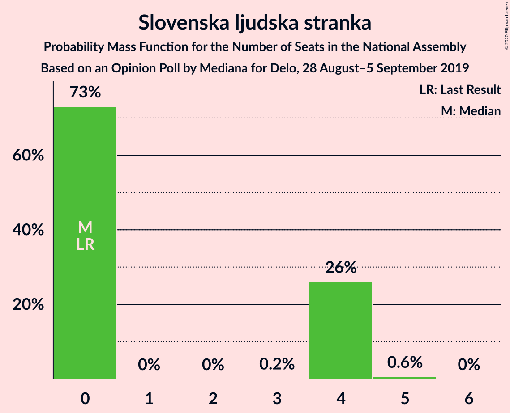

| Number of Seats | Probability | Accumulated | Special Marks |
|:---------------:|:-----------:|:-----------:|:-------------:|
| 0 | 73% | 100% | Last Result, Median |
| 1 | 0% | 27% |  |
| 2 | 0% | 27% |  |
| 3 | 0.2% | 27% |  |
| 4 | 26% | 27% |  |
| 5 | 0.6% | 0.7% |  |
| 6 | 0% | 0% |  |

### Stranka modernega centra

*For a full overview of the results for this party, see the [Stranka modernega centra](party-strankamodernegacentra.html) page.*

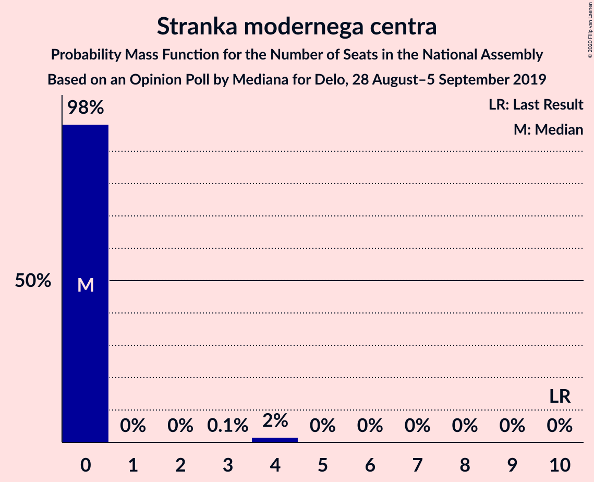

| Number of Seats | Probability | Accumulated | Special Marks |
|:---------------:|:-----------:|:-----------:|:-------------:|
| 0 | 98% | 100% | Median |
| 1 | 0% | 2% |  |
| 2 | 0% | 2% |  |
| 3 | 0.1% | 2% |  |
| 4 | 2% | 2% |  |
| 5 | 0% | 0% |  |
| 6 | 0% | 0% |  |
| 7 | 0% | 0% |  |
| 8 | 0% | 0% |  |
| 9 | 0% | 0% |  |
| 10 | 0% | 0% | Last Result |

## Coalitions

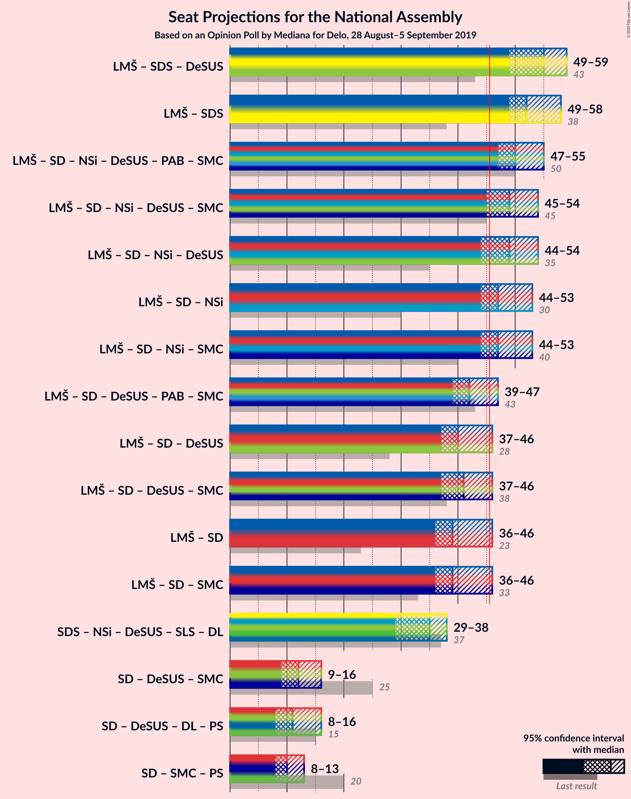

### Confidence Intervals

| Coalition | Last Result | Median | Majority? | 80% Confidence Interval | 90% Confidence Interval | 95% Confidence Interval | 99% Confidence Interval |
|:---------:|:-----------:|:------:|:---------:|:-----------------------:|:-----------------------:|:-----------------------:|:-----------------------:|
| Lista Marjana Šarca – Slovenska demokratska stranka – Demokratična stranka upokojencev Slovenije | 43 | 55 | 100% | 50–58 | 50–58 | 49–59 | 49–60 |
| Lista Marjana Šarca – Slovenska demokratska stranka | 38 | 52 | 99.9% | 49–57 | 49–58 | 49–58 | 47–59 |
| Lista Marjana Šarca – Socialni demokrati – Nova Slovenija–Krščanski demokrati – Demokratična stranka upokojencev Slovenije – Stranka Alenke Bratušek – Stranka modernega centra | 50 | 50 | 98.7% | 48–53 | 47–54 | 47–55 | 44–57 |
| Lista Marjana Šarca – Socialni demokrati – Nova Slovenija–Krščanski demokrati – Demokratična stranka upokojencev Slovenije – Stranka modernega centra | 45 | 49 | 96% | 47–53 | 46–53 | 45–54 | 44–55 |
| Lista Marjana Šarca – Socialni demokrati – Nova Slovenija–Krščanski demokrati – Demokratična stranka upokojencev Slovenije | 35 | 49 | 95% | 47–53 | 45–53 | 44–54 | 44–55 |
| Lista Marjana Šarca – Socialni demokrati – Nova Slovenija–Krščanski demokrati | 30 | 47 | 82% | 45–51 | 45–53 | 44–53 | 42–54 |
| Lista Marjana Šarca – Socialni demokrati – Nova Slovenija–Krščanski demokrati – Stranka modernega centra | 40 | 47 | 83% | 45–51 | 45–53 | 44–53 | 43–54 |
| Lista Marjana Šarca – Socialni demokrati – Demokratična stranka upokojencev Slovenije – Stranka Alenke Bratušek – Stranka modernega centra | 43 | 42 | 9% | 39–45 | 39–46 | 39–47 | 36–48 |
| Lista Marjana Šarca – Socialni demokrati – Demokratična stranka upokojencev Slovenije | 28 | 40 | 6% | 39–45 | 38–46 | 37–46 | 36–47 |
| Lista Marjana Šarca – Socialni demokrati – Demokratična stranka upokojencev Slovenije – Stranka modernega centra | 38 | 41 | 6% | 39–45 | 38–46 | 37–46 | 36–47 |
| Lista Marjana Šarca – Socialni demokrati | 23 | 39 | 5% | 36–42 | 36–45 | 36–46 | 35–46 |
| Lista Marjana Šarca – Socialni demokrati – Stranka modernega centra | 33 | 39 | 5% | 36–42 | 36–45 | 36–46 | 35–46 |
| Socialni demokrati – Demokratična stranka upokojencev Slovenije – Stranka modernega centra | 25 | 12 | 0% | 9–15 | 9–15 | 9–16 | 8–16 |

### Lista Marjana Šarca – Slovenska demokratska stranka – Demokratična stranka upokojencev Slovenije

| Number of Seats | Probability | Accumulated | Special Marks |
|:---------------:|:-----------:|:-----------:|:-------------:|
| 43 | 0% | 100% | Last Result |
| 44 | 0% | 100% |  |
| 45 | 0% | 100% |  |
| 46 | 0% | 100% | Majority |
| 47 | 0.1% | 100% |  |
| 48 | 0.3% | 99.9% |  |
| 49 | 4% | 99.6% |  |
| 50 | 18% | 95% |  |
| 51 | 7% | 77% | Median |
| 52 | 4% | 70% |  |
| 53 | 9% | 66% |  |
| 54 | 7% | 58% |  |
| 55 | 11% | 50% |  |
| 56 | 6% | 39% |  |
| 57 | 19% | 33% |  |
| 58 | 9% | 14% |  |
| 59 | 4% | 5% |  |
| 60 | 0.7% | 1.0% |  |
| 61 | 0% | 0.3% |  |
| 62 | 0% | 0.2% |  |
| 63 | 0.2% | 0.2% |  |
| 64 | 0% | 0% |  |

### Lista Marjana Šarca – Slovenska demokratska stranka

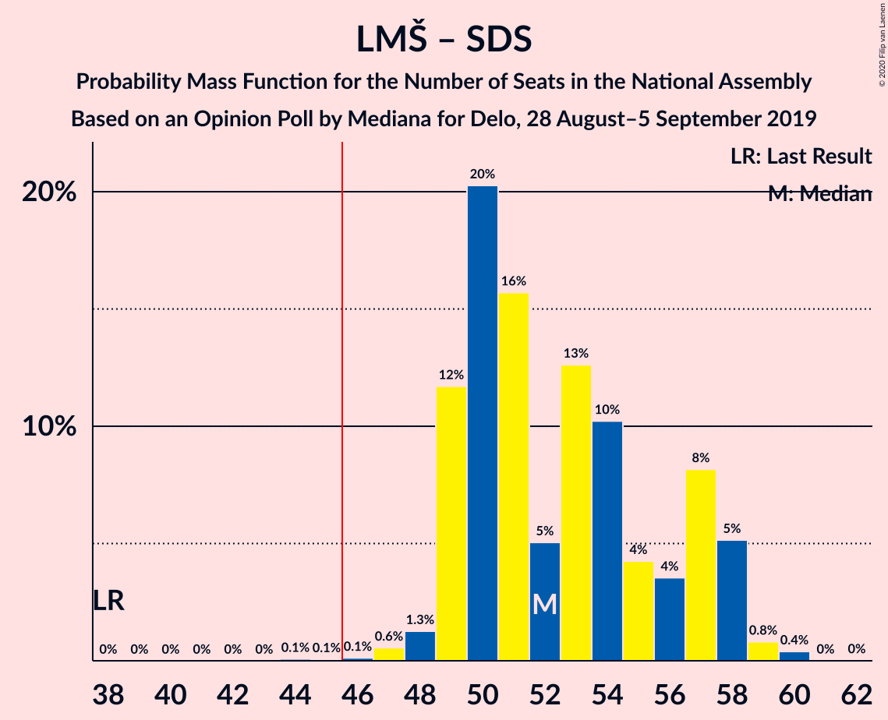

| Number of Seats | Probability | Accumulated | Special Marks |
|:---------------:|:-----------:|:-----------:|:-------------:|
| 38 | 0% | 100% | Last Result |
| 39 | 0% | 100% |  |
| 40 | 0% | 100% |  |
| 41 | 0% | 100% |  |
| 42 | 0% | 100% |  |
| 43 | 0% | 100% |  |
| 44 | 0.1% | 100% |  |
| 45 | 0.1% | 99.9% |  |
| 46 | 0.1% | 99.9% | Majority |
| 47 | 0.6% | 99.7% |  |
| 48 | 1.3% | 99.2% |  |
| 49 | 12% | 98% |  |
| 50 | 20% | 86% |  |
| 51 | 16% | 66% | Median |
| 52 | 5% | 50% |  |
| 53 | 13% | 45% |  |
| 54 | 10% | 33% |  |
| 55 | 4% | 22% |  |
| 56 | 4% | 18% |  |
| 57 | 8% | 15% |  |
| 58 | 5% | 6% |  |
| 59 | 0.8% | 1.2% |  |
| 60 | 0.4% | 0.4% |  |
| 61 | 0% | 0% |  |

### Lista Marjana Šarca – Socialni demokrati – Nova Slovenija–Krščanski demokrati – Demokratična stranka upokojencev Slovenije – Stranka Alenke Bratušek – Stranka modernega centra

| Number of Seats | Probability | Accumulated | Special Marks |
|:---------------:|:-----------:|:-----------:|:-------------:|
| 43 | 0.1% | 100% |  |
| 44 | 0.9% | 99.9% |  |
| 45 | 0.4% | 99.1% |  |
| 46 | 0.5% | 98.7% | Median, Majority |
| 47 | 8% | 98% |  |
| 48 | 21% | 90% |  |
| 49 | 18% | 69% |  |
| 50 | 20% | 51% | Last Result |
| 51 | 11% | 31% |  |
| 52 | 5% | 21% |  |
| 53 | 10% | 15% |  |
| 54 | 3% | 5% |  |
| 55 | 2% | 3% |  |
| 56 | 0.2% | 0.9% |  |
| 57 | 0.6% | 0.7% |  |
| 58 | 0% | 0.1% |  |
| 59 | 0% | 0% |  |

### Lista Marjana Šarca – Socialni demokrati – Nova Slovenija–Krščanski demokrati – Demokratična stranka upokojencev Slovenije – Stranka modernega centra

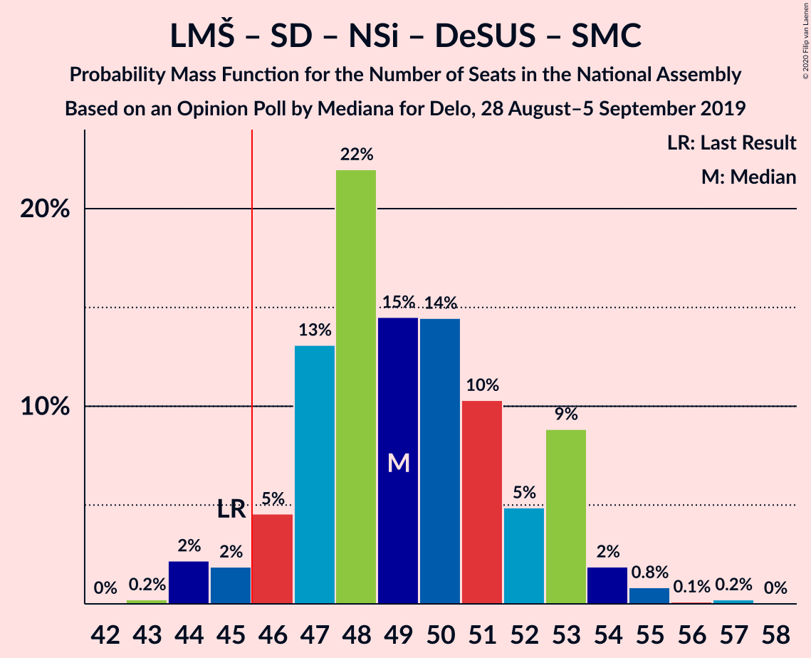

| Number of Seats | Probability | Accumulated | Special Marks |
|:---------------:|:-----------:|:-----------:|:-------------:|
| 43 | 0.2% | 100% |  |
| 44 | 2% | 99.7% |  |
| 45 | 2% | 98% | Last Result |
| 46 | 5% | 96% | Median, Majority |
| 47 | 13% | 91% |  |
| 48 | 22% | 78% |  |
| 49 | 15% | 56% |  |
| 50 | 14% | 42% |  |
| 51 | 10% | 27% |  |
| 52 | 5% | 17% |  |
| 53 | 9% | 12% |  |
| 54 | 2% | 3% |  |
| 55 | 0.8% | 1.2% |  |
| 56 | 0.1% | 0.4% |  |
| 57 | 0.2% | 0.3% |  |
| 58 | 0% | 0% |  |

### Lista Marjana Šarca – Socialni demokrati – Nova Slovenija–Krščanski demokrati – Demokratična stranka upokojencev Slovenije

| Number of Seats | Probability | Accumulated | Special Marks |
|:---------------:|:-----------:|:-----------:|:-------------:|
| 35 | 0% | 100% | Last Result |
| 36 | 0% | 100% |  |
| 37 | 0% | 100% |  |
| 38 | 0% | 100% |  |
| 39 | 0% | 100% |  |
| 40 | 0% | 100% |  |
| 41 | 0% | 100% |  |
| 42 | 0.1% | 100% |  |
| 43 | 0.2% | 99.9% |  |
| 44 | 3% | 99.6% |  |
| 45 | 2% | 97% |  |
| 46 | 5% | 95% | Median, Majority |
| 47 | 13% | 90% |  |
| 48 | 21% | 77% |  |
| 49 | 15% | 56% |  |
| 50 | 14% | 41% |  |
| 51 | 10% | 27% |  |
| 52 | 5% | 16% |  |
| 53 | 9% | 12% |  |
| 54 | 2% | 3% |  |
| 55 | 0.8% | 1.1% |  |
| 56 | 0.1% | 0.3% |  |
| 57 | 0.2% | 0.3% |  |
| 58 | 0% | 0% |  |

### Lista Marjana Šarca – Socialni demokrati – Nova Slovenija–Krščanski demokrati

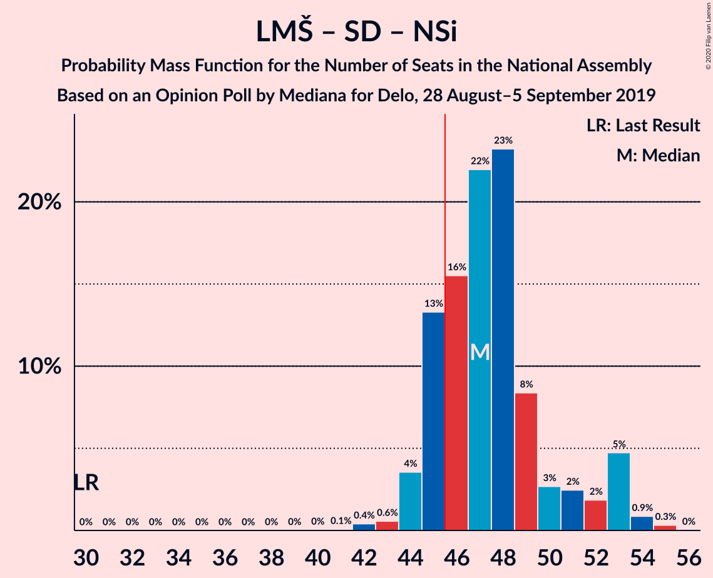

| Number of Seats | Probability | Accumulated | Special Marks |
|:---------------:|:-----------:|:-----------:|:-------------:|
| 30 | 0% | 100% | Last Result |
| 31 | 0% | 100% |  |
| 32 | 0% | 100% |  |
| 33 | 0% | 100% |  |
| 34 | 0% | 100% |  |
| 35 | 0% | 100% |  |
| 36 | 0% | 100% |  |
| 37 | 0% | 100% |  |
| 38 | 0% | 100% |  |
| 39 | 0% | 100% |  |
| 40 | 0% | 100% |  |
| 41 | 0.1% | 99.9% |  |
| 42 | 0.4% | 99.9% |  |
| 43 | 0.6% | 99.5% |  |
| 44 | 4% | 98.9% |  |
| 45 | 13% | 95% |  |
| 46 | 16% | 82% | Median, Majority |
| 47 | 22% | 67% |  |
| 48 | 23% | 45% |  |
| 49 | 8% | 21% |  |
| 50 | 3% | 13% |  |
| 51 | 2% | 10% |  |
| 52 | 2% | 8% |  |
| 53 | 5% | 6% |  |
| 54 | 0.9% | 1.2% |  |
| 55 | 0.3% | 0.4% |  |
| 56 | 0% | 0% |  |

### Lista Marjana Šarca – Socialni demokrati – Nova Slovenija–Krščanski demokrati – Stranka modernega centra

| Number of Seats | Probability | Accumulated | Special Marks |
|:---------------:|:-----------:|:-----------:|:-------------:|
| 40 | 0% | 100% | Last Result |
| 41 | 0.1% | 100% |  |
| 42 | 0.3% | 99.9% |  |
| 43 | 0.5% | 99.6% |  |
| 44 | 3% | 99.0% |  |
| 45 | 13% | 96% |  |
| 46 | 15% | 83% | Median, Majority |
| 47 | 22% | 68% |  |
| 48 | 24% | 46% |  |
| 49 | 8% | 22% |  |
| 50 | 3% | 14% |  |
| 51 | 3% | 11% |  |
| 52 | 2% | 8% |  |
| 53 | 5% | 6% |  |
| 54 | 0.9% | 1.3% |  |
| 55 | 0.3% | 0.4% |  |
| 56 | 0% | 0.1% |  |
| 57 | 0% | 0% |  |

### Lista Marjana Šarca – Socialni demokrati – Demokratična stranka upokojencev Slovenije – Stranka Alenke Bratušek – Stranka modernega centra

| Number of Seats | Probability | Accumulated | Special Marks |
|:---------------:|:-----------:|:-----------:|:-------------:|
| 36 | 0.5% | 100% |  |
| 37 | 0.2% | 99.5% |  |
| 38 | 1.0% | 99.3% | Median |
| 39 | 17% | 98% |  |
| 40 | 19% | 81% |  |
| 41 | 9% | 62% |  |
| 42 | 29% | 53% |  |
| 43 | 3% | 25% | Last Result |
| 44 | 7% | 21% |  |
| 45 | 5% | 15% |  |
| 46 | 6% | 9% | Majority |
| 47 | 2% | 4% |  |
| 48 | 1.0% | 1.4% |  |
| 49 | 0.1% | 0.4% |  |
| 50 | 0.3% | 0.3% |  |
| 51 | 0% | 0% |  |

### Lista Marjana Šarca – Socialni demokrati – Demokratična stranka upokojencev Slovenije

| Number of Seats | Probability | Accumulated | Special Marks |
|:---------------:|:-----------:|:-----------:|:-------------:|
| 28 | 0% | 100% | Last Result |
| 29 | 0% | 100% |  |
| 30 | 0% | 100% |  |
| 31 | 0% | 100% |  |
| 32 | 0% | 100% |  |
| 33 | 0% | 100% |  |
| 34 | 0% | 100% |  |
| 35 | 0.2% | 100% |  |
| 36 | 2% | 99.7% |  |
| 37 | 3% | 98% |  |
| 38 | 5% | 95% | Median |
| 39 | 22% | 90% |  |
| 40 | 19% | 68% |  |
| 41 | 4% | 49% |  |
| 42 | 24% | 44% |  |
| 43 | 3% | 20% |  |
| 44 | 6% | 17% |  |
| 45 | 4% | 11% |  |
| 46 | 5% | 6% | Majority |
| 47 | 1.1% | 1.4% |  |
| 48 | 0% | 0.2% |  |
| 49 | 0% | 0.2% |  |
| 50 | 0.2% | 0.2% |  |
| 51 | 0% | 0% |  |

### Lista Marjana Šarca – Socialni demokrati – Demokratična stranka upokojencev Slovenije – Stranka modernega centra

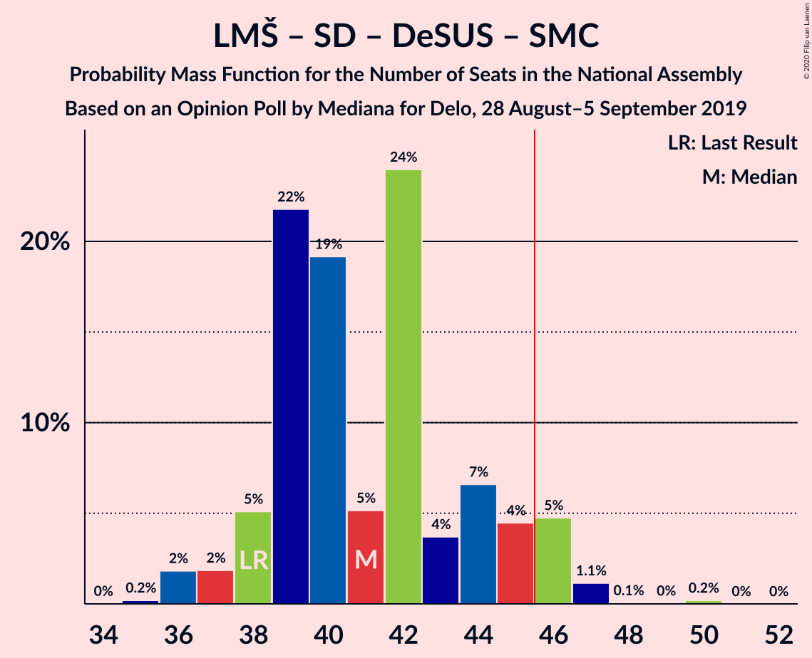

| Number of Seats | Probability | Accumulated | Special Marks |
|:---------------:|:-----------:|:-----------:|:-------------:|
| 35 | 0.2% | 100% |  |
| 36 | 2% | 99.8% |  |
| 37 | 2% | 98% |  |
| 38 | 5% | 96% | Last Result, Median |
| 39 | 22% | 91% |  |
| 40 | 19% | 69% |  |
| 41 | 5% | 50% |  |
| 42 | 24% | 45% |  |
| 43 | 4% | 21% |  |
| 44 | 7% | 17% |  |
| 45 | 4% | 11% |  |
| 46 | 5% | 6% | Majority |
| 47 | 1.1% | 1.4% |  |
| 48 | 0.1% | 0.3% |  |
| 49 | 0% | 0.2% |  |
| 50 | 0.2% | 0.2% |  |
| 51 | 0% | 0% |  |

### Lista Marjana Šarca – Socialni demokrati

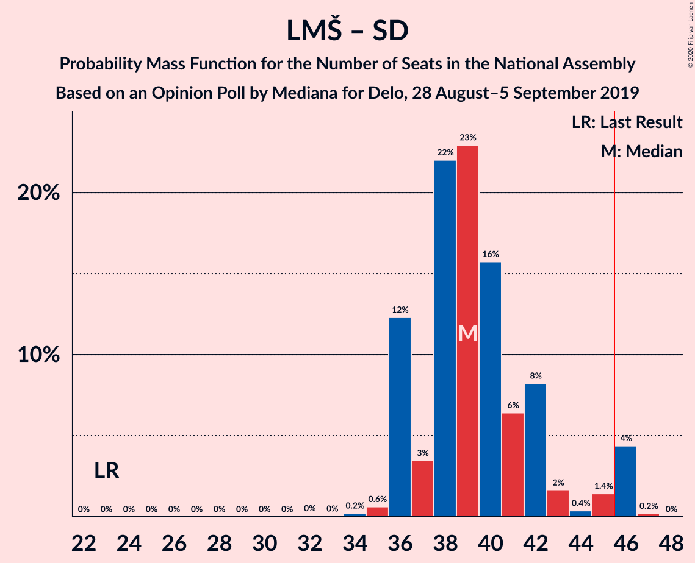

| Number of Seats | Probability | Accumulated | Special Marks |
|:---------------:|:-----------:|:-----------:|:-------------:|
| 23 | 0% | 100% | Last Result |
| 24 | 0% | 100% |  |
| 25 | 0% | 100% |  |
| 26 | 0% | 100% |  |
| 27 | 0% | 100% |  |
| 28 | 0% | 100% |  |
| 29 | 0% | 100% |  |
| 30 | 0% | 100% |  |
| 31 | 0% | 100% |  |
| 32 | 0% | 100% |  |
| 33 | 0% | 100% |  |
| 34 | 0.2% | 99.9% |  |
| 35 | 0.6% | 99.7% |  |
| 36 | 12% | 99.1% |  |
| 37 | 3% | 87% |  |
| 38 | 22% | 83% | Median |
| 39 | 23% | 61% |  |
| 40 | 16% | 38% |  |
| 41 | 6% | 23% |  |
| 42 | 8% | 16% |  |
| 43 | 2% | 8% |  |
| 44 | 0.4% | 6% |  |
| 45 | 1.4% | 6% |  |
| 46 | 4% | 5% | Majority |
| 47 | 0.2% | 0.2% |  |
| 48 | 0% | 0% |  |

### Lista Marjana Šarca – Socialni demokrati – Stranka modernega centra

| Number of Seats | Probability | Accumulated | Special Marks |
|:---------------:|:-----------:|:-----------:|:-------------:|
| 33 | 0% | 100% | Last Result |
| 34 | 0.2% | 99.9% |  |
| 35 | 0.6% | 99.7% |  |
| 36 | 12% | 99.2% |  |
| 37 | 3% | 87% |  |
| 38 | 22% | 84% | Median |
| 39 | 23% | 62% |  |
| 40 | 16% | 40% |  |
| 41 | 7% | 24% |  |
| 42 | 8% | 17% |  |
| 43 | 2% | 9% |  |
| 44 | 0.7% | 7% |  |
| 45 | 1.4% | 6% |  |
| 46 | 4% | 5% | Majority |
| 47 | 0.2% | 0.2% |  |
| 48 | 0% | 0% |  |

### Socialni demokrati – Demokratična stranka upokojencev Slovenije – Stranka modernega centra

| Number of Seats | Probability | Accumulated | Special Marks |
|:---------------:|:-----------:|:-----------:|:-------------:|
| 7 | 0.3% | 100% |  |
| 8 | 2% | 99.7% |  |
| 9 | 8% | 98% |  |
| 10 | 16% | 89% | Median |
| 11 | 23% | 73% |  |
| 12 | 23% | 50% |  |
| 13 | 2% | 28% |  |
| 14 | 13% | 25% |  |
| 15 | 9% | 13% |  |
| 16 | 3% | 4% |  |
| 17 | 0.1% | 0.2% |  |
| 18 | 0.1% | 0.1% |  |
| 19 | 0% | 0% |  |
| 20 | 0% | 0% |  |
| 21 | 0% | 0% |  |
| 22 | 0% | 0% |  |
| 23 | 0% | 0% |  |
| 24 | 0% | 0% |  |
| 25 | 0% | 0% | Last Result |

## Technical Information

### Opinion Poll

+ **Polling firm:** Mediana
+ **Commissioner(s):** Delo
+ **Fieldwork period:** 28 August–5 September 2019

### Calculations

+ **Sample size:** 728
+ **Simulations done:** 1,048,576
+ **Error estimate:** 1.31%

