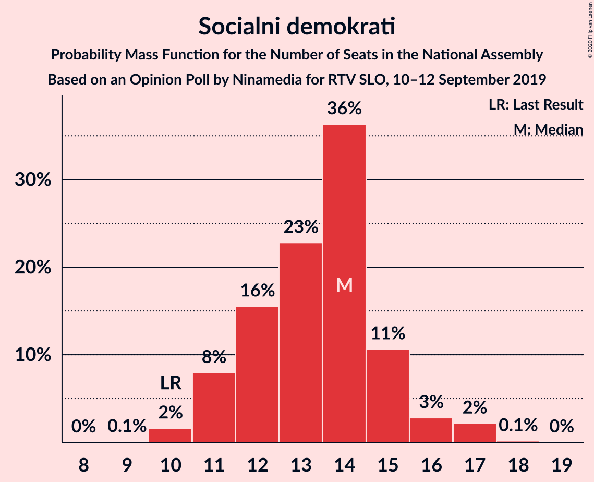
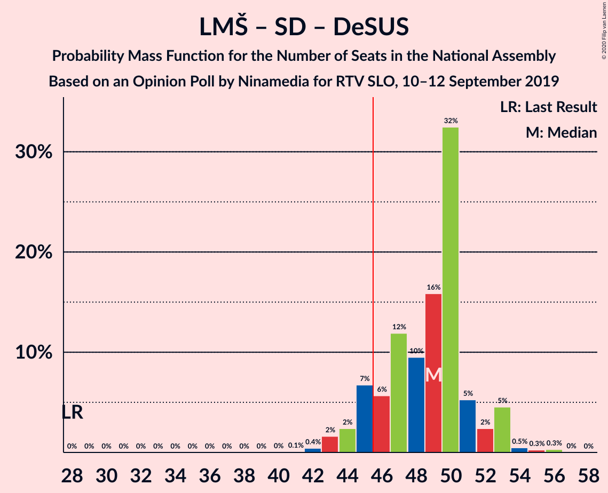
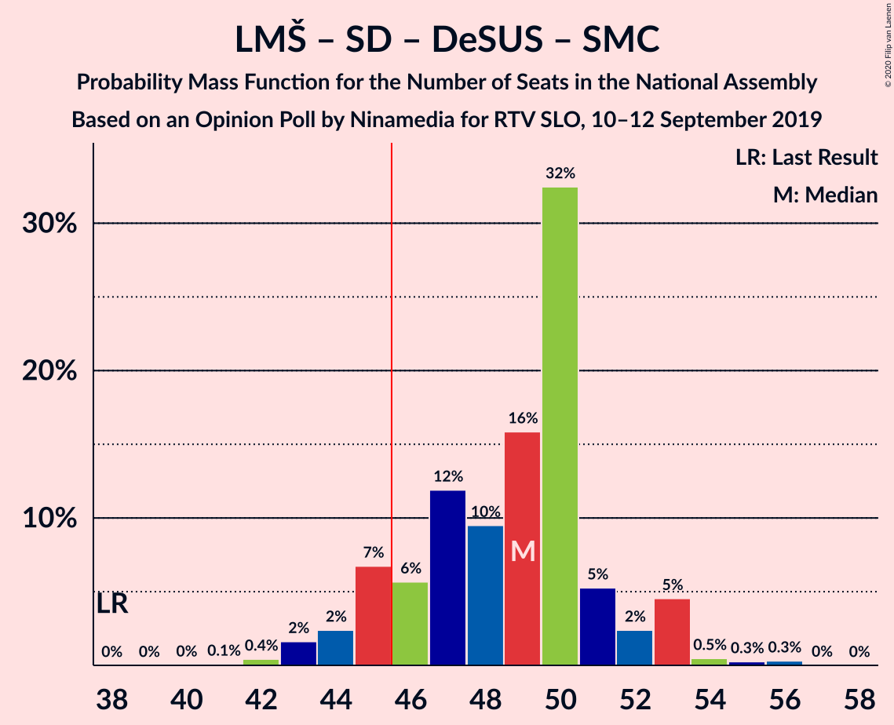

# Opinion Poll by Ninamedia for RTV SLO, 10–12 September 2019

<a href="#voting-intentions">Voting Intentions</a> | <a href="#seats">Seats</a> | <a href="#coalitions">Coalitions</a> | <a href="#technical-information">Technical Information</a>

## Voting Intentions

### Confidence Intervals

| Party | Last Result | Poll Result | 80% Confidence Interval | 90% Confidence Interval | 95% Confidence Interval | 99% Confidence Interval |
|:-----:|:-----------:|:-----------:|:-----------------------:|:-----------------------:|:-----------------------:|:-----------------------:|
| Lista Marjana Šarca | 12.6% | 32.3% | 30.1–34.6% |29.5–35.3% |28.9–35.8% |27.9–37.0% |
| Slovenska demokratska stranka | 24.9% | 21.4% | 19.5–23.5% |19.0–24.1% |18.5–24.6% |17.7–25.7% |
| Socialni demokrati | 9.9% | 13.6% | 12.0–15.4% |11.6–15.9% |11.2–16.3% |10.5–17.2% |
| Levica | 9.3% | 9.6% | 8.3–11.1% |7.9–11.6% |7.6–12.0% |7.0–12.8% |
| Nova Slovenija–Krščanski demokrati | 7.2% | 6.4% | 5.4–7.8% |5.1–8.2% |4.8–8.5% |4.4–9.2% |
| Demokratična stranka upokojencev Slovenije | 4.9% | 4.3% | 3.4–5.4% |3.2–5.8% |3.0–6.1% |2.7–6.7% |
| Slovenska ljudska stranka | 2.6% | 4.1% | 3.3–5.3% |3.1–5.6% |2.9–5.9% |2.5–6.5% |
| Slovenska nacionalna stranka | 4.2% | 2.9% | 2.2–3.8% |2.0–4.1% |1.9–4.4% |1.6–4.9% |
| Stranka Alenke Bratušek | 5.1% | 2.6% | 2.0–3.5% |1.8–3.8% |1.6–4.0% |1.4–4.5% |
| Stranka modernega centra | 9.7% | 1.1% | 0.8–1.9% |0.7–2.1% |0.6–2.2% |0.4–2.6% |

*Note:* The poll result column reflects the actual value used in the calculations. Published results may vary slightly, and in addition be rounded to fewer digits.

## Seats

### Confidence Intervals

| Party | Last Result | Median | 80% Confidence Interval | 90% Confidence Interval | 95% Confidence Interval | 99% Confidence Interval |
|:-----:|:-----------:|:------:|:-----------------------:|:-----------------------:|:-----------------------:|:-----------------------:|
| <a href="#lista-marjana-šarca">Lista Marjana Šarca</a> | 13 | 32 | 30–32 |30–33 |29–34 |28–36 |
| <a href="#slovenska-demokratska-stranka">Slovenska demokratska stranka</a> | 25 | 22 | 21–22 |20–24 |19–25 |18–25 |
| <a href="#socialni-demokrati">Socialni demokrati</a> | 10 | 14 | 12–14 |11–15 |11–15 |10–16 |
| <a href="#levica">Levica</a> | 9 | 8 | 8–10 |7–10 |7–11 |6–12 |
| <a href="#nova-slovenija–krščanski-demokrati">Nova Slovenija–Krščanski demokrati</a> | 7 | 5 | 5–6 |5–7 |5–7 |4–9 |
| <a href="#demokratična-stranka-upokojencev-slovenije">Demokratična stranka upokojencev Slovenije</a> | 5 | 4 | 4–5 |4–5 |0–5 |0–7 |
| <a href="#slovenska-ljudska-stranka">Slovenska ljudska stranka</a> | 0 | 3 | 0–5 |0–5 |0–5 |0–5 |
| <a href="#slovenska-nacionalna-stranka">Slovenska nacionalna stranka</a> | 4 | 0 | 0 |0 |0 |0–4 |
| <a href="#stranka-alenke-bratušek">Stranka Alenke Bratušek</a> | 5 | 0 | 0 |0 |0 |0–4 |
| <a href="#stranka-modernega-centra">Stranka modernega centra</a> | 10 | 0 | 0 |0 |0 |0 |

### Lista Marjana Šarca

*For a full overview of the results for this party, see the [Lista Marjana Šarca](party-listamarjanašarca.html) page.*

| Number of Seats | Probability | Accumulated | Special Marks |
|:---------------:|:-----------:|:-----------:|:-------------:|
| 13 | 0% | 100% | Last Result |
| 14 | 0% | 100% |  |
| 15 | 0% | 100% |  |
| 16 | 0% | 100% |  |
| 17 | 0% | 100% |  |
| 18 | 0% | 100% |  |
| 19 | 0% | 100% |  |
| 20 | 0% | 100% |  |
| 21 | 0% | 100% |  |
| 22 | 0% | 100% |  |
| 23 | 0% | 100% |  |
| 24 | 0% | 100% |  |
| 25 | 0% | 100% |  |
| 26 | 0.1% | 100% |  |
| 27 | 0.2% | 99.9% |  |
| 28 | 0.3% | 99.7% |  |
| 29 | 2% | 99.5% |  |
| 30 | 12% | 97% |  |
| 31 | 8% | 86% |  |
| 32 | 70% | 78% | Median |
| 33 | 4% | 8% |  |
| 34 | 1.5% | 4% |  |
| 35 | 2% | 2% |  |
| 36 | 0.3% | 0.5% |  |
| 37 | 0.2% | 0.2% |  |
| 38 | 0% | 0% |  |

### Slovenska demokratska stranka

*For a full overview of the results for this party, see the [Slovenska demokratska stranka](party-slovenskademokratskastranka.html) page.*

| Number of Seats | Probability | Accumulated | Special Marks |
|:---------------:|:-----------:|:-----------:|:-------------:|
| 16 | 0% | 100% |  |
| 17 | 0.4% | 99.9% |  |
| 18 | 0.6% | 99.6% |  |
| 19 | 2% | 99.0% |  |
| 20 | 6% | 97% |  |
| 21 | 9% | 91% |  |
| 22 | 76% | 82% | Median |
| 23 | 0.4% | 6% |  |
| 24 | 2% | 6% |  |
| 25 | 4% | 4% | Last Result |
| 26 | 0.2% | 0.2% |  |
| 27 | 0.1% | 0.1% |  |
| 28 | 0% | 0% |  |

### Socialni demokrati

*For a full overview of the results for this party, see the [Socialni demokrati](party-socialnidemokrati.html) page.*

| Number of Seats | Probability | Accumulated | Special Marks |
|:---------------:|:-----------:|:-----------:|:-------------:|
| 10 | 1.1% | 100% | Last Result |
| 11 | 7% | 98.9% |  |
| 12 | 2% | 92% |  |
| 13 | 9% | 90% |  |
| 14 | 74% | 80% | Median |
| 15 | 5% | 6% |  |
| 16 | 0.6% | 0.9% |  |
| 17 | 0.2% | 0.3% |  |
| 18 | 0.1% | 0.1% |  |
| 19 | 0% | 0% |  |

### Levica

*For a full overview of the results for this party, see the [Levica](party-levica.html) page.*

| Number of Seats | Probability | Accumulated | Special Marks |
|:---------------:|:-----------:|:-----------:|:-------------:|
| 6 | 2% | 100% |  |
| 7 | 3% | 98% |  |
| 8 | 70% | 95% | Median |
| 9 | 12% | 25% | Last Result |
| 10 | 10% | 13% |  |
| 11 | 2% | 3% |  |
| 12 | 0.5% | 0.7% |  |
| 13 | 0.1% | 0.2% |  |
| 14 | 0.1% | 0.1% |  |
| 15 | 0% | 0% |  |

### Nova Slovenija–Krščanski demokrati

*For a full overview of the results for this party, see the [Nova Slovenija–Krščanski demokrati](party-novaslovenija–krščanskidemokrati.html) page.*

| Number of Seats | Probability | Accumulated | Special Marks |
|:---------------:|:-----------:|:-----------:|:-------------:|
| 4 | 2% | 100% |  |
| 5 | 71% | 98% | Median |
| 6 | 19% | 27% |  |
| 7 | 6% | 8% | Last Result |
| 8 | 1.0% | 2% |  |
| 9 | 0.8% | 0.8% |  |
| 10 | 0% | 0% |  |

### Demokratična stranka upokojencev Slovenije

*For a full overview of the results for this party, see the [Demokratična stranka upokojencev Slovenije](party-demokratičnastrankaupokojencevslovenije.html) page.*

| Number of Seats | Probability | Accumulated | Special Marks |
|:---------------:|:-----------:|:-----------:|:-------------:|
| 0 | 4% | 100% |  |
| 1 | 0% | 96% |  |
| 2 | 0% | 96% |  |
| 3 | 0% | 96% |  |
| 4 | 85% | 96% | Median |
| 5 | 9% | 11% | Last Result |
| 6 | 1.4% | 2% |  |
| 7 | 0.5% | 0.5% |  |
| 8 | 0% | 0% |  |

### Slovenska ljudska stranka

*For a full overview of the results for this party, see the [Slovenska ljudska stranka](party-slovenskaljudskastranka.html) page.*

| Number of Seats | Probability | Accumulated | Special Marks |
|:---------------:|:-----------:|:-----------:|:-------------:|
| 0 | 11% | 100% | Last Result |
| 1 | 0% | 89% |  |
| 2 | 0% | 89% |  |
| 3 | 68% | 89% | Median |
| 4 | 10% | 21% |  |
| 5 | 11% | 11% |  |
| 6 | 0.3% | 0.4% |  |
| 7 | 0% | 0% |  |

### Slovenska nacionalna stranka

*For a full overview of the results for this party, see the [Slovenska nacionalna stranka](party-slovenskanacionalnastranka.html) page.*

| Number of Seats | Probability | Accumulated | Special Marks |
|:---------------:|:-----------:|:-----------:|:-------------:|
| 0 | 99.3% | 100% | Median |
| 1 | 0% | 0.7% |  |
| 2 | 0% | 0.7% |  |
| 3 | 0.1% | 0.7% |  |
| 4 | 0.5% | 0.6% | Last Result |
| 5 | 0.1% | 0.1% |  |
| 6 | 0% | 0% |  |

### Stranka Alenke Bratušek

*For a full overview of the results for this party, see the [Stranka Alenke Bratušek](party-strankaalenkebratušek.html) page.*

| Number of Seats | Probability | Accumulated | Special Marks |
|:---------------:|:-----------:|:-----------:|:-------------:|
| 0 | 98.9% | 100% | Median |
| 1 | 0% | 1.1% |  |
| 2 | 0% | 1.1% |  |
| 3 | 0.2% | 1.1% |  |
| 4 | 0.8% | 0.8% |  |
| 5 | 0% | 0% | Last Result |

### Stranka modernega centra

*For a full overview of the results for this party, see the [Stranka modernega centra](party-strankamodernegacentra.html) page.*

| Number of Seats | Probability | Accumulated | Special Marks |
|:---------------:|:-----------:|:-----------:|:-------------:|
| 0 | 100% | 100% | Median |
| 1 | 0% | 0% |  |
| 2 | 0% | 0% |  |
| 3 | 0% | 0% |  |
| 4 | 0% | 0% |  |
| 5 | 0% | 0% |  |
| 6 | 0% | 0% |  |
| 7 | 0% | 0% |  |
| 8 | 0% | 0% |  |
| 9 | 0% | 0% |  |
| 10 | 0% | 0% | Last Result |

## Coalitions

### Confidence Intervals

| Coalition | Last Result | Median | Majority? | 80% Confidence Interval | 90% Confidence Interval | 95% Confidence Interval | 99% Confidence Interval |
|:---------:|:-----------:|:------:|:---------:|:-----------------------:|:-----------------------:|:-----------------------:|:-----------------------:|
| Lista Marjana Šarca – Slovenska demokratska stranka – Demokratična stranka upokojencev Slovenije | 43 | 58 | 100% | 56–58 | 55–59 | 54–59 | 52–61 |
| Lista Marjana Šarca – Socialni demokrati – Nova Slovenija–Krščanski demokrati – Demokratična stranka upokojencev Slovenije | 35 | 55 | 100% | 53–56 | 52–57 | 52–57 | 49–59 |
| Lista Marjana Šarca – Socialni demokrati – Nova Slovenija–Krščanski demokrati – Demokratična stranka upokojencev Slovenije – Stranka Alenke Bratušek – Stranka modernega centra | 50 | 55 | 100% | 53–56 | 52–57 | 52–57 | 49–59 |
| Lista Marjana Šarca – Socialni demokrati – Nova Slovenija–Krščanski demokrati – Demokratična stranka upokojencev Slovenije – Stranka modernega centra | 45 | 55 | 100% | 53–56 | 52–57 | 52–57 | 49–59 |
| Lista Marjana Šarca – Slovenska demokratska stranka | 38 | 54 | 100% | 52–54 | 50–55 | 50–55 | 48–58 |
| Lista Marjana Šarca – Socialni demokrati – Nova Slovenija–Krščanski demokrati | 30 | 51 | 98.7% | 49–52 | 48–53 | 48–54 | 45–57 |
| Lista Marjana Šarca – Socialni demokrati – Nova Slovenija–Krščanski demokrati – Stranka modernega centra | 40 | 51 | 98.7% | 49–52 | 48–53 | 48–54 | 45–57 |
| Lista Marjana Šarca – Socialni demokrati – Demokratična stranka upokojencev Slovenije – Stranka Alenke Bratušek – Stranka modernega centra | 43 | 50 | 98% | 47–50 | 46–50 | 46–51 | 43–53 |
| Lista Marjana Šarca – Socialni demokrati – Demokratična stranka upokojencev Slovenije | 28 | 50 | 97% | 47–50 | 46–50 | 45–51 | 43–53 |
| Lista Marjana Šarca – Socialni demokrati – Demokratična stranka upokojencev Slovenije – Stranka modernega centra | 38 | 50 | 97% | 47–50 | 46–50 | 45–51 | 43–53 |
| Lista Marjana Šarca – Socialni demokrati | 23 | 46 | 76% | 43–46 | 42–47 | 42–48 | 39–49 |
| Lista Marjana Šarca – Socialni demokrati – Stranka modernega centra | 33 | 46 | 76% | 43–46 | 42–47 | 42–48 | 39–49 |
| Socialni demokrati – Demokratična stranka upokojencev Slovenije – Stranka modernega centra | 25 | 18 | 0% | 15–18 | 15–19 | 13–20 | 11–20 |

### Lista Marjana Šarca – Slovenska demokratska stranka – Demokratična stranka upokojencev Slovenije

| Number of Seats | Probability | Accumulated | Special Marks |
|:---------------:|:-----------:|:-----------:|:-------------:|
| 43 | 0% | 100% | Last Result |
| 44 | 0% | 100% |  |
| 45 | 0% | 100% |  |
| 46 | 0% | 100% | Majority |
| 47 | 0% | 100% |  |
| 48 | 0% | 100% |  |
| 49 | 0% | 100% |  |
| 50 | 0.1% | 100% |  |
| 51 | 0.3% | 99.8% |  |
| 52 | 0.8% | 99.6% |  |
| 53 | 0.7% | 98.7% |  |
| 54 | 2% | 98% |  |
| 55 | 4% | 96% |  |
| 56 | 5% | 92% |  |
| 57 | 10% | 87% |  |
| 58 | 71% | 77% | Median |
| 59 | 5% | 6% |  |
| 60 | 0.4% | 0.9% |  |
| 61 | 0.4% | 0.5% |  |
| 62 | 0.1% | 0.1% |  |
| 63 | 0% | 0.1% |  |
| 64 | 0% | 0% |  |

### Lista Marjana Šarca – Socialni demokrati – Nova Slovenija–Krščanski demokrati – Demokratična stranka upokojencev Slovenije

| Number of Seats | Probability | Accumulated | Special Marks |
|:---------------:|:-----------:|:-----------:|:-------------:|
| 35 | 0% | 100% | Last Result |
| 36 | 0% | 100% |  |
| 37 | 0% | 100% |  |
| 38 | 0% | 100% |  |
| 39 | 0% | 100% |  |
| 40 | 0% | 100% |  |
| 41 | 0% | 100% |  |
| 42 | 0% | 100% |  |
| 43 | 0% | 100% |  |
| 44 | 0% | 100% |  |
| 45 | 0% | 100% |  |
| 46 | 0% | 100% | Majority |
| 47 | 0% | 100% |  |
| 48 | 0% | 100% |  |
| 49 | 1.2% | 99.9% |  |
| 50 | 0.6% | 98.7% |  |
| 51 | 0.6% | 98% |  |
| 52 | 7% | 98% |  |
| 53 | 5% | 91% |  |
| 54 | 2% | 86% |  |
| 55 | 73% | 83% | Median |
| 56 | 3% | 11% |  |
| 57 | 7% | 8% |  |
| 58 | 0.3% | 1.2% |  |
| 59 | 0.7% | 0.9% |  |
| 60 | 0.1% | 0.2% |  |
| 61 | 0% | 0.1% |  |
| 62 | 0% | 0% |  |

### Lista Marjana Šarca – Socialni demokrati – Nova Slovenija–Krščanski demokrati – Demokratična stranka upokojencev Slovenije – Stranka Alenke Bratušek – Stranka modernega centra

| Number of Seats | Probability | Accumulated | Special Marks |
|:---------------:|:-----------:|:-----------:|:-------------:|
| 48 | 0% | 100% |  |
| 49 | 1.0% | 99.9% |  |
| 50 | 0.5% | 99.0% | Last Result |
| 51 | 0.3% | 98% |  |
| 52 | 7% | 98% |  |
| 53 | 5% | 91% |  |
| 54 | 2% | 86% |  |
| 55 | 73% | 84% | Median |
| 56 | 3% | 11% |  |
| 57 | 7% | 8% |  |
| 58 | 0.3% | 1.3% |  |
| 59 | 0.7% | 1.0% |  |
| 60 | 0.2% | 0.3% |  |
| 61 | 0% | 0.1% |  |
| 62 | 0% | 0.1% |  |
| 63 | 0% | 0% |  |

### Lista Marjana Šarca – Socialni demokrati – Nova Slovenija–Krščanski demokrati – Demokratična stranka upokojencev Slovenije – Stranka modernega centra

| Number of Seats | Probability | Accumulated | Special Marks |
|:---------------:|:-----------:|:-----------:|:-------------:|
| 45 | 0% | 100% | Last Result |
| 46 | 0% | 100% | Majority |
| 47 | 0% | 100% |  |
| 48 | 0% | 100% |  |
| 49 | 1.2% | 99.9% |  |
| 50 | 0.6% | 98.7% |  |
| 51 | 0.6% | 98% |  |
| 52 | 7% | 98% |  |
| 53 | 5% | 91% |  |
| 54 | 2% | 86% |  |
| 55 | 73% | 83% | Median |
| 56 | 3% | 11% |  |
| 57 | 7% | 8% |  |
| 58 | 0.3% | 1.2% |  |
| 59 | 0.7% | 0.9% |  |
| 60 | 0.1% | 0.2% |  |
| 61 | 0% | 0.1% |  |
| 62 | 0% | 0% |  |

### Lista Marjana Šarca – Slovenska demokratska stranka

| Number of Seats | Probability | Accumulated | Special Marks |
|:---------------:|:-----------:|:-----------:|:-------------:|
| 38 | 0% | 100% | Last Result |
| 39 | 0% | 100% |  |
| 40 | 0% | 100% |  |
| 41 | 0% | 100% |  |
| 42 | 0% | 100% |  |
| 43 | 0% | 100% |  |
| 44 | 0% | 100% |  |
| 45 | 0% | 100% |  |
| 46 | 0.1% | 100% | Majority |
| 47 | 0.1% | 99.9% |  |
| 48 | 0.4% | 99.8% |  |
| 49 | 0.9% | 99.4% |  |
| 50 | 4% | 98.5% |  |
| 51 | 4% | 95% |  |
| 52 | 3% | 91% |  |
| 53 | 10% | 87% |  |
| 54 | 70% | 77% | Median |
| 55 | 5% | 8% |  |
| 56 | 1.0% | 2% |  |
| 57 | 0.8% | 1.4% |  |
| 58 | 0.3% | 0.6% |  |
| 59 | 0.1% | 0.3% |  |
| 60 | 0.2% | 0.2% |  |
| 61 | 0.1% | 0.1% |  |
| 62 | 0% | 0% |  |

### Lista Marjana Šarca – Socialni demokrati – Nova Slovenija–Krščanski demokrati

| Number of Seats | Probability | Accumulated | Special Marks |
|:---------------:|:-----------:|:-----------:|:-------------:|
| 30 | 0% | 100% | Last Result |
| 31 | 0% | 100% |  |
| 32 | 0% | 100% |  |
| 33 | 0% | 100% |  |
| 34 | 0% | 100% |  |
| 35 | 0% | 100% |  |
| 36 | 0% | 100% |  |
| 37 | 0% | 100% |  |
| 38 | 0% | 100% |  |
| 39 | 0% | 100% |  |
| 40 | 0% | 100% |  |
| 41 | 0% | 100% |  |
| 42 | 0% | 100% |  |
| 43 | 0% | 100% |  |
| 44 | 0.1% | 100% |  |
| 45 | 1.2% | 99.9% |  |
| 46 | 0.2% | 98.7% | Majority |
| 47 | 0.5% | 98.5% |  |
| 48 | 6% | 98% |  |
| 49 | 6% | 92% |  |
| 50 | 5% | 86% |  |
| 51 | 69% | 81% | Median |
| 52 | 6% | 12% |  |
| 53 | 3% | 6% |  |
| 54 | 1.0% | 3% |  |
| 55 | 1.0% | 2% |  |
| 56 | 0.3% | 0.9% |  |
| 57 | 0.5% | 0.6% |  |
| 58 | 0.1% | 0.1% |  |
| 59 | 0% | 0% |  |

### Lista Marjana Šarca – Socialni demokrati – Nova Slovenija–Krščanski demokrati – Stranka modernega centra

| Number of Seats | Probability | Accumulated | Special Marks |
|:---------------:|:-----------:|:-----------:|:-------------:|
| 40 | 0% | 100% | Last Result |
| 41 | 0% | 100% |  |
| 42 | 0% | 100% |  |
| 43 | 0% | 100% |  |
| 44 | 0.1% | 100% |  |
| 45 | 1.2% | 99.9% |  |
| 46 | 0.2% | 98.7% | Majority |
| 47 | 0.5% | 98.5% |  |
| 48 | 6% | 98% |  |
| 49 | 6% | 92% |  |
| 50 | 5% | 86% |  |
| 51 | 69% | 81% | Median |
| 52 | 6% | 12% |  |
| 53 | 3% | 6% |  |
| 54 | 1.0% | 3% |  |
| 55 | 1.0% | 2% |  |
| 56 | 0.3% | 0.9% |  |
| 57 | 0.5% | 0.6% |  |
| 58 | 0.1% | 0.1% |  |
| 59 | 0% | 0% |  |

### Lista Marjana Šarca – Socialni demokrati – Demokratična stranka upokojencev Slovenije – Stranka Alenke Bratušek – Stranka modernega centra

| Number of Seats | Probability | Accumulated | Special Marks |
|:---------------:|:-----------:|:-----------:|:-------------:|
| 42 | 0.1% | 100% |  |
| 43 | 1.2% | 99.8% | Last Result |
| 44 | 0.1% | 98.7% |  |
| 45 | 0.6% | 98.6% |  |
| 46 | 6% | 98% | Majority |
| 47 | 6% | 92% |  |
| 48 | 2% | 86% |  |
| 49 | 5% | 84% |  |
| 50 | 75% | 79% | Median |
| 51 | 3% | 4% |  |
| 52 | 0.3% | 1.0% |  |
| 53 | 0.5% | 0.7% |  |
| 54 | 0.1% | 0.2% |  |
| 55 | 0.1% | 0.1% |  |
| 56 | 0.1% | 0.1% |  |
| 57 | 0% | 0% |  |

### Lista Marjana Šarca – Socialni demokrati – Demokratična stranka upokojencev Slovenije

| Number of Seats | Probability | Accumulated | Special Marks |
|:---------------:|:-----------:|:-----------:|:-------------:|
| 28 | 0% | 100% | Last Result |
| 29 | 0% | 100% |  |
| 30 | 0% | 100% |  |
| 31 | 0% | 100% |  |
| 32 | 0% | 100% |  |
| 33 | 0% | 100% |  |
| 34 | 0% | 100% |  |
| 35 | 0% | 100% |  |
| 36 | 0% | 100% |  |
| 37 | 0% | 100% |  |
| 38 | 0% | 100% |  |
| 39 | 0% | 100% |  |
| 40 | 0% | 100% |  |
| 41 | 0% | 100% |  |
| 42 | 0.1% | 100% |  |
| 43 | 1.2% | 99.8% |  |
| 44 | 0.2% | 98.6% |  |
| 45 | 1.0% | 98% |  |
| 46 | 6% | 97% | Majority |
| 47 | 6% | 91% |  |
| 48 | 2% | 85% |  |
| 49 | 5% | 84% |  |
| 50 | 74% | 79% | Median |
| 51 | 3% | 4% |  |
| 52 | 0.3% | 0.9% |  |
| 53 | 0.5% | 0.6% |  |
| 54 | 0% | 0.1% |  |
| 55 | 0% | 0.1% |  |
| 56 | 0% | 0% |  |

### Lista Marjana Šarca – Socialni demokrati – Demokratična stranka upokojencev Slovenije – Stranka modernega centra

| Number of Seats | Probability | Accumulated | Special Marks |
|:---------------:|:-----------:|:-----------:|:-------------:|
| 38 | 0% | 100% | Last Result |
| 39 | 0% | 100% |  |
| 40 | 0% | 100% |  |
| 41 | 0% | 100% |  |
| 42 | 0.1% | 100% |  |
| 43 | 1.2% | 99.8% |  |
| 44 | 0.2% | 98.6% |  |
| 45 | 1.0% | 98% |  |
| 46 | 6% | 97% | Majority |
| 47 | 6% | 91% |  |
| 48 | 2% | 85% |  |
| 49 | 5% | 84% |  |
| 50 | 74% | 79% | Median |
| 51 | 3% | 4% |  |
| 52 | 0.3% | 0.9% |  |
| 53 | 0.5% | 0.6% |  |
| 54 | 0% | 0.1% |  |
| 55 | 0% | 0.1% |  |
| 56 | 0% | 0% |  |

### Lista Marjana Šarca – Socialni demokrati

| Number of Seats | Probability | Accumulated | Special Marks |
|:---------------:|:-----------:|:-----------:|:-------------:|
| 23 | 0% | 100% | Last Result |
| 24 | 0% | 100% |  |
| 25 | 0% | 100% |  |
| 26 | 0% | 100% |  |
| 27 | 0% | 100% |  |
| 28 | 0% | 100% |  |
| 29 | 0% | 100% |  |
| 30 | 0% | 100% |  |
| 31 | 0% | 100% |  |
| 32 | 0% | 100% |  |
| 33 | 0% | 100% |  |
| 34 | 0% | 100% |  |
| 35 | 0% | 100% |  |
| 36 | 0% | 100% |  |
| 37 | 0% | 100% |  |
| 38 | 0% | 100% |  |
| 39 | 1.0% | 100% |  |
| 40 | 0.2% | 99.0% |  |
| 41 | 0.4% | 98.8% |  |
| 42 | 6% | 98% |  |
| 43 | 6% | 92% |  |
| 44 | 5% | 87% |  |
| 45 | 5% | 81% |  |
| 46 | 70% | 76% | Median, Majority |
| 47 | 4% | 6% |  |
| 48 | 2% | 3% |  |
| 49 | 0.7% | 0.9% |  |
| 50 | 0.1% | 0.2% |  |
| 51 | 0.1% | 0.1% |  |
| 52 | 0% | 0% |  |

### Lista Marjana Šarca – Socialni demokrati – Stranka modernega centra

| Number of Seats | Probability | Accumulated | Special Marks |
|:---------------:|:-----------:|:-----------:|:-------------:|
| 33 | 0% | 100% | Last Result |
| 34 | 0% | 100% |  |
| 35 | 0% | 100% |  |
| 36 | 0% | 100% |  |
| 37 | 0% | 100% |  |
| 38 | 0% | 100% |  |
| 39 | 1.0% | 100% |  |
| 40 | 0.2% | 99.0% |  |
| 41 | 0.4% | 98.8% |  |
| 42 | 6% | 98% |  |
| 43 | 6% | 92% |  |
| 44 | 5% | 87% |  |
| 45 | 5% | 81% |  |
| 46 | 70% | 76% | Median, Majority |
| 47 | 4% | 6% |  |
| 48 | 2% | 3% |  |
| 49 | 0.7% | 0.9% |  |
| 50 | 0.1% | 0.2% |  |
| 51 | 0.1% | 0.1% |  |
| 52 | 0% | 0% |  |

### Socialni demokrati – Demokratična stranka upokojencev Slovenije – Stranka modernega centra

| Number of Seats | Probability | Accumulated | Special Marks |
|:---------------:|:-----------:|:-----------:|:-------------:|
| 10 | 0.1% | 100% |  |
| 11 | 0.6% | 99.9% |  |
| 12 | 0.5% | 99.3% |  |
| 13 | 2% | 98.8% |  |
| 14 | 1.5% | 97% |  |
| 15 | 6% | 96% |  |
| 16 | 2% | 89% |  |
| 17 | 6% | 87% |  |
| 18 | 72% | 82% | Median |
| 19 | 5% | 10% |  |
| 20 | 4% | 4% |  |
| 21 | 0.2% | 0.3% |  |
| 22 | 0% | 0.1% |  |
| 23 | 0% | 0% |  |
| 24 | 0% | 0% |  |
| 25 | 0% | 0% | Last Result |

## Technical Information

### Opinion Poll

+ **Polling firm:** Ninamedia
+ **Commissioner(s):** RTV SLO
+ **Fieldwork period:** 10–12 September 2019

### Calculations

+ **Sample size:** 700
+ **Simulations done:** 131,072
+ **Error estimate:** 3.35%

