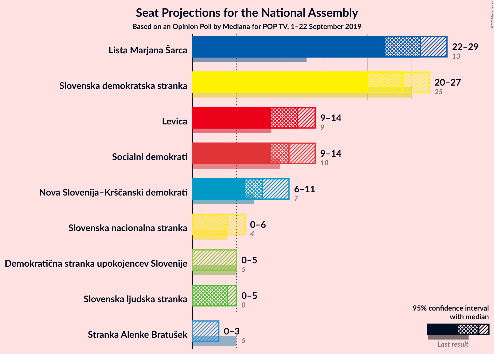
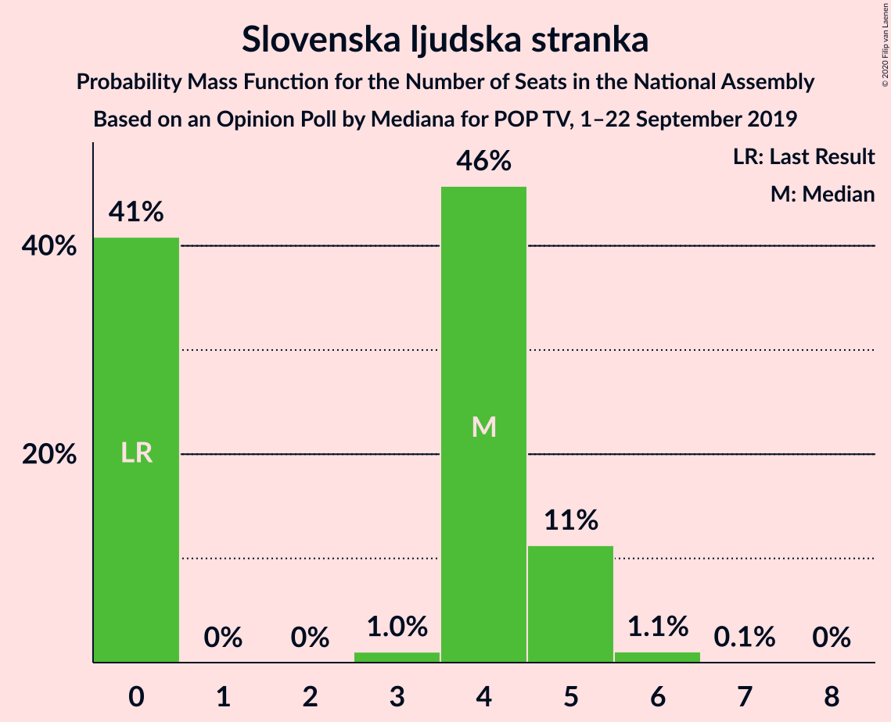
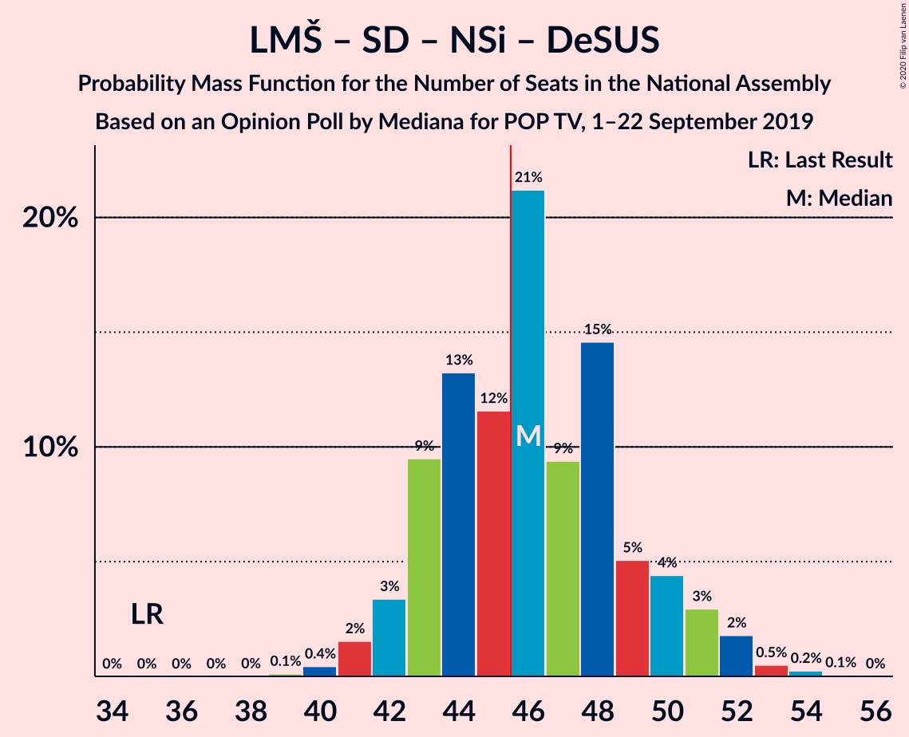

# Opinion Poll by Mediana for POP TV, 1–22 September 2019

<a href="#voting-intentions">Voting Intentions</a> | <a href="#seats">Seats</a> | <a href="#coalitions">Coalitions</a> | <a href="#technical-information">Technical Information</a>

## Voting Intentions

### Confidence Intervals

| Party | Last Result | Poll Result | 80% Confidence Interval | 90% Confidence Interval | 95% Confidence Interval | 99% Confidence Interval |
|:-----:|:-----------:|:-----------:|:-----------------------:|:-----------------------:|:-----------------------:|:-----------------------:|
| Lista Marjana Šarca | 12.6% | 26.4% | 24.4–28.6% |23.8–29.2% |23.3–29.8% |22.4–30.9% |
| Slovenska demokratska stranka | 24.9% | 24.3% | 22.4–26.5% |21.8–27.1% |21.3–27.6% |20.4–28.7% |
| Levica | 9.3% | 12.3% | 10.9–14.0% |10.4–14.5% |10.1–14.9% |9.4–15.8% |
| Socialni demokrati | 9.9% | 11.5% | 10.1–13.1% |9.7–13.6% |9.3–14.0% |8.7–14.9% |
| Nova Slovenija–Krščanski demokrati | 7.2% | 8.7% | 7.5–10.2% |7.1–10.6% |6.8–11.0% |6.3–11.7% |
| Slovenska nacionalna stranka | 4.2% | 4.8% | 3.9–5.9% |3.6–6.3% |3.4–6.6% |3.0–7.2% |
| Slovenska ljudska stranka | 2.6% | 4.1% | 3.2–5.2% |3.0–5.5% |2.8–5.8% |2.5–6.4% |
| Demokratična stranka upokojencev Slovenije | 4.9% | 3.6% | 2.9–4.7% |2.7–5.0% |2.5–5.3% |2.2–5.8% |
| Stranka Alenke Bratušek | 5.1% | 2.7% | 2.0–3.6% |1.8–3.9% |1.7–4.1% |1.4–4.6% |

*Note:* The poll result column reflects the actual value used in the calculations. Published results may vary slightly, and in addition be rounded to fewer digits.

## Seats

### Confidence Intervals

| Party | Last Result | Median | 80% Confidence Interval | 90% Confidence Interval | 95% Confidence Interval | 99% Confidence Interval |
|:-----:|:-----------:|:------:|:-----------------------:|:-----------------------:|:-----------------------:|:-----------------------:|
| <a href="#lista-marjana-šarca">Lista Marjana Šarca</a> | 13 | 26 | 23–28 |22–28 |22–29 |21–30 |
| <a href="#slovenska-demokratska-stranka">Slovenska demokratska stranka</a> | 25 | 23 | 21–26 |21–27 |21–27 |19–28 |
| <a href="#levica">Levica</a> | 9 | 12 | 10–14 |9–14 |9–15 |9–15 |
| <a href="#socialni-demokrati">Socialni demokrati</a> | 10 | 11 | 9–13 |9–13 |9–13 |8–14 |
| <a href="#nova-slovenija–krščanski-demokrati">Nova Slovenija–Krščanski demokrati</a> | 7 | 8 | 7–10 |6–11 |6–11 |6–11 |
| <a href="#slovenska-nacionalna-stranka">Slovenska nacionalna stranka</a> | 4 | 4 | 0–6 |0–6 |0–6 |0–7 |
| <a href="#slovenska-ljudska-stranka">Slovenska ljudska stranka</a> | 0 | 4 | 0–5 |0–5 |0–5 |0–6 |
| <a href="#demokratična-stranka-upokojencev-slovenije">Demokratična stranka upokojencev Slovenije</a> | 5 | 0 | 0–4 |0–4 |0–5 |0–5 |
| <a href="#stranka-alenke-bratušek">Stranka Alenke Bratušek</a> | 5 | 0 | 0 |0–4 |0–4 |0–4 |

### Lista Marjana Šarca

*For a full overview of the results for this party, see the [Lista Marjana Šarca](party-listamarjanašarca.html) page.*

| Number of Seats | Probability | Accumulated | Special Marks |
|:---------------:|:-----------:|:-----------:|:-------------:|
| 13 | 0% | 100% | Last Result |
| 14 | 0% | 100% |  |
| 15 | 0% | 100% |  |
| 16 | 0% | 100% |  |
| 17 | 0% | 100% |  |
| 18 | 0% | 100% |  |
| 19 | 0% | 100% |  |
| 20 | 0.2% | 100% |  |
| 21 | 2% | 99.8% |  |
| 22 | 6% | 98% |  |
| 23 | 6% | 92% |  |
| 24 | 9% | 86% |  |
| 25 | 18% | 77% |  |
| 26 | 16% | 59% | Median |
| 27 | 29% | 43% |  |
| 28 | 10% | 14% |  |
| 29 | 3% | 4% |  |
| 30 | 0.5% | 0.9% |  |
| 31 | 0.2% | 0.3% |  |
| 32 | 0.1% | 0.1% |  |
| 33 | 0% | 0% |  |

### Slovenska demokratska stranka

*For a full overview of the results for this party, see the [Slovenska demokratska stranka](party-slovenskademokratskastranka.html) page.*

| Number of Seats | Probability | Accumulated | Special Marks |
|:---------------:|:-----------:|:-----------:|:-------------:|
| 18 | 0.1% | 100% |  |
| 19 | 0.9% | 99.9% |  |
| 20 | 1.4% | 99.0% |  |
| 21 | 20% | 98% |  |
| 22 | 15% | 77% |  |
| 23 | 21% | 62% | Median |
| 24 | 15% | 41% |  |
| 25 | 14% | 26% | Last Result |
| 26 | 8% | 13% |  |
| 27 | 5% | 5% |  |
| 28 | 0.7% | 0.8% |  |
| 29 | 0.1% | 0.2% |  |
| 30 | 0.1% | 0.1% |  |
| 31 | 0% | 0% |  |

### Levica

*For a full overview of the results for this party, see the [Levica](party-levica.html) page.*

| Number of Seats | Probability | Accumulated | Special Marks |
|:---------------:|:-----------:|:-----------:|:-------------:|
| 8 | 0.3% | 100% |  |
| 9 | 8% | 99.7% | Last Result |
| 10 | 9% | 91% |  |
| 11 | 30% | 82% |  |
| 12 | 19% | 53% | Median |
| 13 | 19% | 33% |  |
| 14 | 10% | 14% |  |
| 15 | 4% | 4% |  |
| 16 | 0.2% | 0.2% |  |
| 17 | 0.1% | 0.1% |  |
| 18 | 0% | 0% |  |

### Socialni demokrati

*For a full overview of the results for this party, see the [Socialni demokrati](party-socialnidemokrati.html) page.*

| Number of Seats | Probability | Accumulated | Special Marks |
|:---------------:|:-----------:|:-----------:|:-------------:|
| 7 | 0.3% | 100% |  |
| 8 | 1.5% | 99.7% |  |
| 9 | 15% | 98% |  |
| 10 | 24% | 84% | Last Result |
| 11 | 24% | 59% | Median |
| 12 | 15% | 35% |  |
| 13 | 19% | 20% |  |
| 14 | 0.8% | 1.0% |  |
| 15 | 0.2% | 0.3% |  |
| 16 | 0% | 0.1% |  |
| 17 | 0% | 0% |  |

### Nova Slovenija–Krščanski demokrati

*For a full overview of the results for this party, see the [Nova Slovenija–Krščanski demokrati](party-novaslovenija–krščanskidemokrati.html) page.*

| Number of Seats | Probability | Accumulated | Special Marks |
|:---------------:|:-----------:|:-----------:|:-------------:|
| 5 | 0.2% | 100% |  |
| 6 | 6% | 99.8% |  |
| 7 | 25% | 94% | Last Result |
| 8 | 23% | 69% | Median |
| 9 | 24% | 46% |  |
| 10 | 17% | 22% |  |
| 11 | 5% | 5% |  |
| 12 | 0.3% | 0.3% |  |
| 13 | 0% | 0% |  |

### Slovenska nacionalna stranka

*For a full overview of the results for this party, see the [Slovenska nacionalna stranka](party-slovenskanacionalnastranka.html) page.*

| Number of Seats | Probability | Accumulated | Special Marks |
|:---------------:|:-----------:|:-----------:|:-------------:|
| 0 | 19% | 100% |  |
| 1 | 0% | 81% |  |
| 2 | 0% | 81% |  |
| 3 | 8% | 81% |  |
| 4 | 33% | 74% | Last Result, Median |
| 5 | 26% | 41% |  |
| 6 | 13% | 15% |  |
| 7 | 1.4% | 1.5% |  |
| 8 | 0.1% | 0.1% |  |
| 9 | 0% | 0% |  |

### Slovenska ljudska stranka

*For a full overview of the results for this party, see the [Slovenska ljudska stranka](party-slovenskaljudskastranka.html) page.*

| Number of Seats | Probability | Accumulated | Special Marks |
|:---------------:|:-----------:|:-----------:|:-------------:|
| 0 | 41% | 100% | Last Result |
| 1 | 0% | 59% |  |
| 2 | 0% | 59% |  |
| 3 | 1.2% | 59% |  |
| 4 | 43% | 58% | Median |
| 5 | 14% | 15% |  |
| 6 | 0.5% | 0.6% |  |
| 7 | 0.1% | 0.1% |  |
| 8 | 0% | 0% |  |

### Demokratična stranka upokojencev Slovenije

*For a full overview of the results for this party, see the [Demokratična stranka upokojencev Slovenije](party-demokratičnastrankaupokojencevslovenije.html) page.*

| Number of Seats | Probability | Accumulated | Special Marks |
|:---------------:|:-----------:|:-----------:|:-------------:|
| 0 | 67% | 100% | Median |
| 1 | 0% | 33% |  |
| 2 | 0% | 33% |  |
| 3 | 3% | 33% |  |
| 4 | 26% | 31% |  |
| 5 | 4% | 4% | Last Result |
| 6 | 0.2% | 0.2% |  |
| 7 | 0% | 0% |  |

### Stranka Alenke Bratušek

*For a full overview of the results for this party, see the [Stranka Alenke Bratušek](party-strankaalenkebratušek.html) page.*

| Number of Seats | Probability | Accumulated | Special Marks |
|:---------------:|:-----------:|:-----------:|:-------------:|
| 0 | 93% | 100% | Median |
| 1 | 0% | 7% |  |
| 2 | 0% | 7% |  |
| 3 | 0.5% | 7% |  |
| 4 | 6% | 6% |  |
| 5 | 0.4% | 0.4% | Last Result |
| 6 | 0% | 0% |  |

## Coalitions

### Confidence Intervals

| Coalition | Last Result | Median | Majority? | 80% Confidence Interval | 90% Confidence Interval | 95% Confidence Interval | 99% Confidence Interval |
|:---------:|:-----------:|:------:|:---------:|:-----------------------:|:-----------------------:|:-----------------------:|:-----------------------:|
| Lista Marjana Šarca – Slovenska demokratska stranka – Demokratična stranka upokojencev Slovenije | 43 | 50 | 99.2% | 47–53 | 47–56 | 46–56 | 45–57 |
| Lista Marjana Šarca – Slovenska demokratska stranka | 38 | 49 | 92% | 46–52 | 45–53 | 45–54 | 43–55 |
| Lista Marjana Šarca – Socialni demokrati – Nova Slovenija–Krščanski demokrati – Demokratična stranka upokojencev Slovenije | 35 | 46 | 60% | 43–51 | 42–52 | 41–52 | 40–53 |
| Lista Marjana Šarca – Socialni demokrati – Nova Slovenija–Krščanski demokrati | 30 | 45 | 44% | 41–48 | 41–49 | 40–51 | 39–51 |
| Lista Marjana Šarca – Socialni demokrati – Demokratična stranka upokojencev Slovenije | 28 | 38 | 0% | 35–42 | 34–42 | 34–42 | 32–45 |
| Lista Marjana Šarca – Socialni demokrati | 23 | 37 | 0% | 34–40 | 33–40 | 32–41 | 31–42 |

### Lista Marjana Šarca – Slovenska demokratska stranka – Demokratična stranka upokojencev Slovenije

| Number of Seats | Probability | Accumulated | Special Marks |
|:---------------:|:-----------:|:-----------:|:-------------:|
| 43 | 0% | 100% | Last Result |
| 44 | 0.2% | 100% |  |
| 45 | 0.6% | 99.8% |  |
| 46 | 3% | 99.2% | Majority |
| 47 | 8% | 96% |  |
| 48 | 10% | 88% |  |
| 49 | 17% | 78% | Median |
| 50 | 19% | 61% |  |
| 51 | 12% | 42% |  |
| 52 | 13% | 30% |  |
| 53 | 8% | 17% |  |
| 54 | 2% | 10% |  |
| 55 | 3% | 8% |  |
| 56 | 5% | 5% |  |
| 57 | 0.1% | 0.5% |  |
| 58 | 0.3% | 0.4% |  |
| 59 | 0.1% | 0.1% |  |
| 60 | 0% | 0.1% |  |
| 61 | 0% | 0% |  |

### Lista Marjana Šarca – Slovenska demokratska stranka

| Number of Seats | Probability | Accumulated | Special Marks |
|:---------------:|:-----------:|:-----------:|:-------------:|
| 38 | 0% | 100% | Last Result |
| 39 | 0% | 100% |  |
| 40 | 0% | 100% |  |
| 41 | 0.1% | 100% |  |
| 42 | 0.1% | 99.9% |  |
| 43 | 0.4% | 99.8% |  |
| 44 | 0.5% | 99.4% |  |
| 45 | 7% | 98.9% |  |
| 46 | 9% | 92% | Majority |
| 47 | 10% | 84% |  |
| 48 | 21% | 74% |  |
| 49 | 11% | 53% | Median |
| 50 | 16% | 42% |  |
| 51 | 11% | 26% |  |
| 52 | 8% | 15% |  |
| 53 | 4% | 8% |  |
| 54 | 2% | 4% |  |
| 55 | 2% | 2% |  |
| 56 | 0.3% | 0.4% |  |
| 57 | 0% | 0.1% |  |
| 58 | 0% | 0.1% |  |
| 59 | 0% | 0.1% |  |
| 60 | 0% | 0% |  |

### Lista Marjana Šarca – Socialni demokrati – Nova Slovenija–Krščanski demokrati – Demokratična stranka upokojencev Slovenije

| Number of Seats | Probability | Accumulated | Special Marks |
|:---------------:|:-----------:|:-----------:|:-------------:|
| 35 | 0% | 100% | Last Result |
| 36 | 0% | 100% |  |
| 37 | 0% | 100% |  |
| 38 | 0% | 100% |  |
| 39 | 0.3% | 100% |  |
| 40 | 0.8% | 99.7% |  |
| 41 | 3% | 98.9% |  |
| 42 | 5% | 96% |  |
| 43 | 6% | 91% |  |
| 44 | 11% | 85% |  |
| 45 | 14% | 74% | Median |
| 46 | 14% | 60% | Majority |
| 47 | 9% | 47% |  |
| 48 | 16% | 38% |  |
| 49 | 7% | 22% |  |
| 50 | 5% | 15% |  |
| 51 | 5% | 10% |  |
| 52 | 5% | 6% |  |
| 53 | 0.7% | 0.8% |  |
| 54 | 0% | 0.1% |  |
| 55 | 0.1% | 0.1% |  |
| 56 | 0% | 0% |  |

### Lista Marjana Šarca – Socialni demokrati – Nova Slovenija–Krščanski demokrati

| Number of Seats | Probability | Accumulated | Special Marks |
|:---------------:|:-----------:|:-----------:|:-------------:|
| 30 | 0% | 100% | Last Result |
| 31 | 0% | 100% |  |
| 32 | 0% | 100% |  |
| 33 | 0% | 100% |  |
| 34 | 0% | 100% |  |
| 35 | 0% | 100% |  |
| 36 | 0% | 100% |  |
| 37 | 0.1% | 100% |  |
| 38 | 0.3% | 99.9% |  |
| 39 | 0.9% | 99.6% |  |
| 40 | 3% | 98.7% |  |
| 41 | 7% | 96% |  |
| 42 | 7% | 89% |  |
| 43 | 6% | 82% |  |
| 44 | 20% | 76% |  |
| 45 | 13% | 57% | Median |
| 46 | 14% | 44% | Majority |
| 47 | 9% | 30% |  |
| 48 | 13% | 20% |  |
| 49 | 3% | 7% |  |
| 50 | 0.3% | 5% |  |
| 51 | 4% | 5% |  |
| 52 | 0.1% | 0.4% |  |
| 53 | 0.3% | 0.3% |  |
| 54 | 0% | 0% |  |

### Lista Marjana Šarca – Socialni demokrati – Demokratična stranka upokojencev Slovenije

| Number of Seats | Probability | Accumulated | Special Marks |
|:---------------:|:-----------:|:-----------:|:-------------:|
| 28 | 0% | 100% | Last Result |
| 29 | 0% | 100% |  |
| 30 | 0% | 100% |  |
| 31 | 0% | 100% |  |
| 32 | 1.0% | 99.9% |  |
| 33 | 1.4% | 98.9% |  |
| 34 | 6% | 98% |  |
| 35 | 11% | 91% |  |
| 36 | 13% | 80% |  |
| 37 | 11% | 67% | Median |
| 38 | 9% | 56% |  |
| 39 | 12% | 47% |  |
| 40 | 14% | 35% |  |
| 41 | 8% | 20% |  |
| 42 | 11% | 12% |  |
| 43 | 0.5% | 2% |  |
| 44 | 0.5% | 1.0% |  |
| 45 | 0.5% | 0.5% |  |
| 46 | 0% | 0% | Majority |

### Lista Marjana Šarca – Socialni demokrati

| Number of Seats | Probability | Accumulated | Special Marks |
|:---------------:|:-----------:|:-----------:|:-------------:|
| 23 | 0% | 100% | Last Result |
| 24 | 0% | 100% |  |
| 25 | 0% | 100% |  |
| 26 | 0% | 100% |  |
| 27 | 0% | 100% |  |
| 28 | 0% | 100% |  |
| 29 | 0.1% | 100% |  |
| 30 | 0.1% | 99.9% |  |
| 31 | 1.1% | 99.8% |  |
| 32 | 4% | 98.7% |  |
| 33 | 2% | 95% |  |
| 34 | 9% | 93% |  |
| 35 | 14% | 84% |  |
| 36 | 15% | 70% |  |
| 37 | 18% | 55% | Median |
| 38 | 15% | 37% |  |
| 39 | 8% | 22% |  |
| 40 | 10% | 14% |  |
| 41 | 3% | 4% |  |
| 42 | 0.4% | 0.6% |  |
| 43 | 0.1% | 0.3% |  |
| 44 | 0.2% | 0.2% |  |
| 45 | 0% | 0% |  |

## Technical Information

### Opinion Poll

+ **Polling firm:** Mediana
+ **Commissioner(s):** POP TV
+ **Fieldwork period:** 1–22 September 2019

### Calculations

+ **Sample size:** 715
+ **Simulations done:** 131,072
+ **Error estimate:** 2.59%

