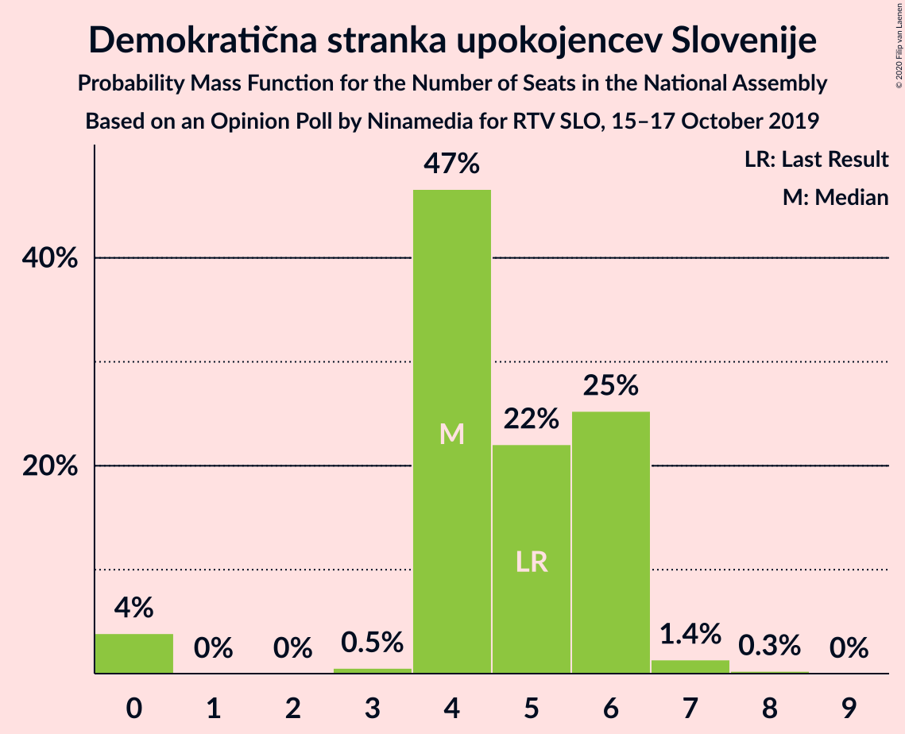
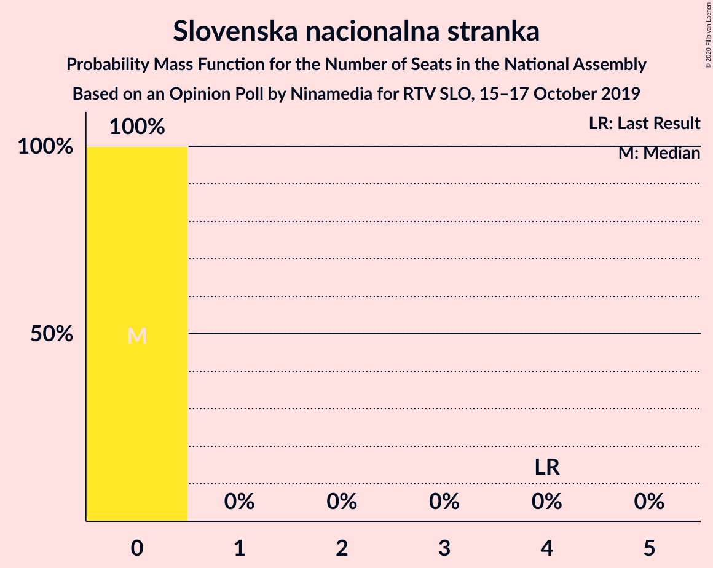
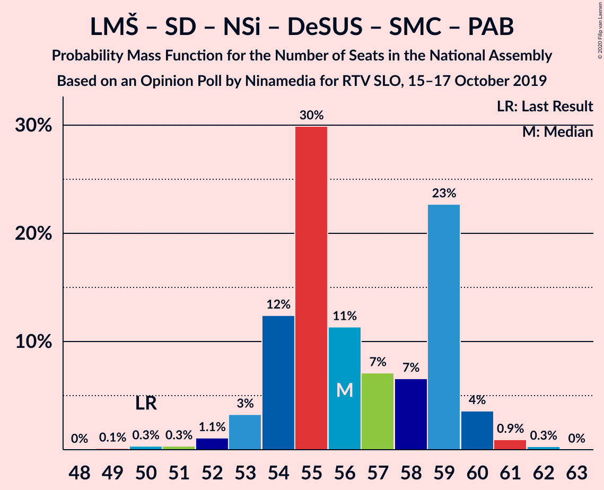
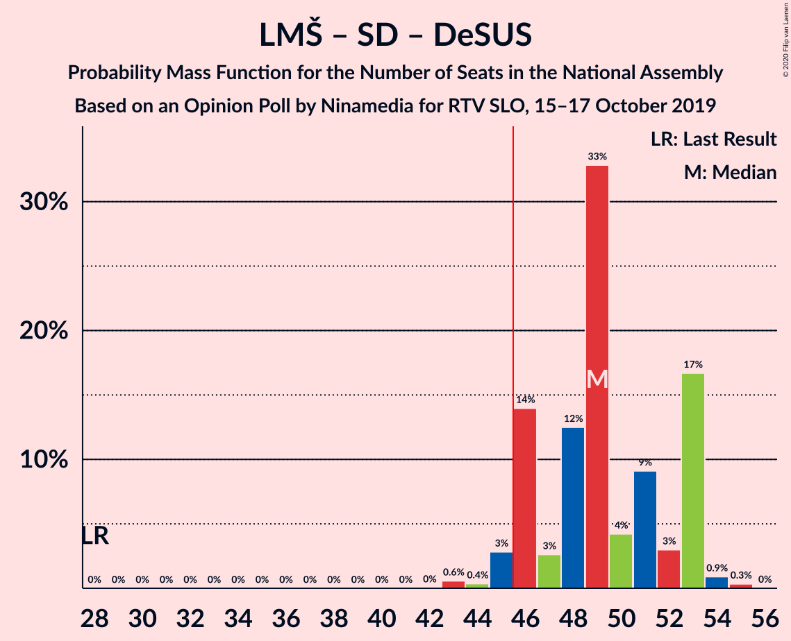
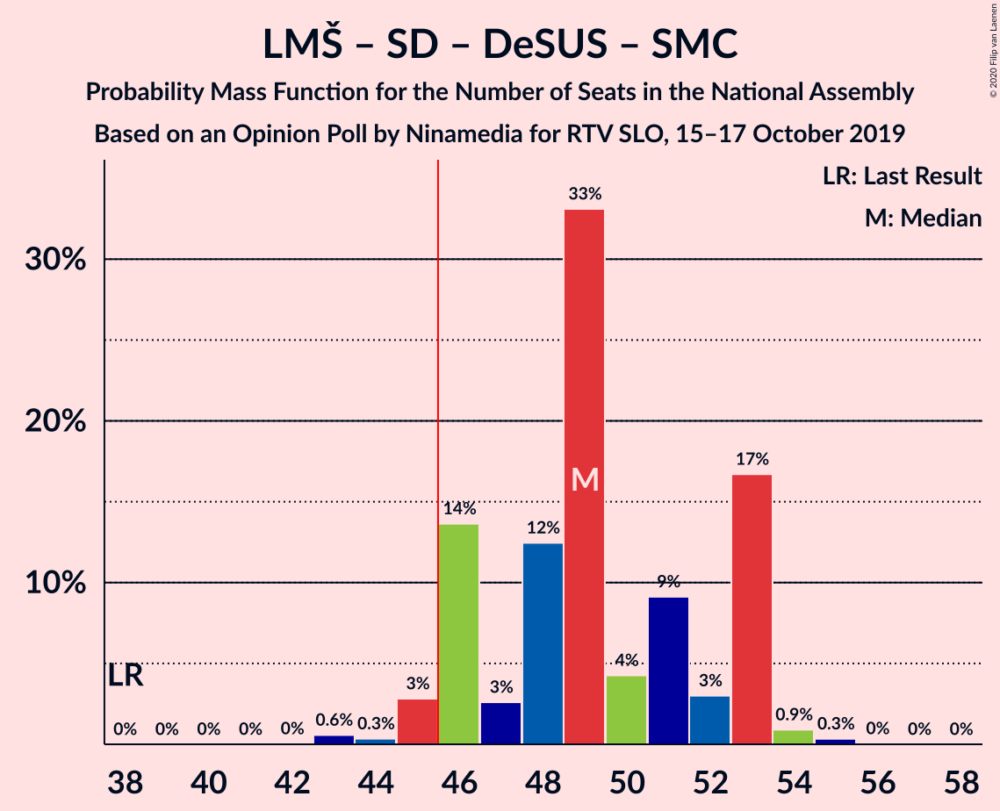

# Opinion Poll by Ninamedia for RTV SLO, 15–17 October 2019

<a href="#voting-intentions">Voting Intentions</a> | <a href="#seats">Seats</a> | <a href="#coalitions">Coalitions</a> | <a href="#technical-information">Technical Information</a>

## Voting Intentions

### Confidence Intervals

| Party | Last Result | Poll Result | 80% Confidence Interval | 90% Confidence Interval | 95% Confidence Interval | 99% Confidence Interval |
|:-----:|:-----------:|:-----------:|:-----------------------:|:-----------------------:|:-----------------------:|:-----------------------:|
| Lista Marjana Šarca | 12.6% | 30.9% | 28.7–33.2% |28.1–33.8% |27.5–34.4% |26.5–35.5% |
| Slovenska demokratska stranka | 24.9% | 22.6% | 20.6–24.7% |20.1–25.3% |19.6–25.8% |18.7–26.9% |
| Socialni demokrati | 9.9% | 16.0% | 14.3–17.9% |13.9–18.4% |13.5–18.9% |12.7–19.8% |
| Levica | 9.3% | 9.6% | 8.3–11.1% |7.9–11.6% |7.6–12.0% |7.0–12.8% |
| Nova Slovenija–Krščanski demokrati | 7.2% | 8.0% | 6.8–9.5% |6.5–9.9% |6.2–10.3% |5.7–11.0% |
| Demokratična stranka upokojencev Slovenije | 4.9% | 5.1% | 4.2–6.4% |3.9–6.7% |3.7–7.0% |3.3–7.7% |
| Slovenska ljudska stranka | 2.6% | 2.9% | 2.2–3.8% |2.0–4.1% |1.9–4.4% |1.6–4.9% |
| Stranka modernega centra | 9.7% | 2.0% | 1.5–2.9% |1.3–3.1% |1.2–3.3% |1.0–3.8% |
| Stranka Alenke Bratušek | 5.1% | 1.6% | 1.1–2.4% |1.0–2.6% |0.9–2.8% |0.7–3.2% |
| Slovenska nacionalna stranka | 4.2% | 1.4% | 1.0–2.2% |0.9–2.4% |0.8–2.6% |0.6–3.0% |

*Note:* The poll result column reflects the actual value used in the calculations. Published results may vary slightly, and in addition be rounded to fewer digits.

## Seats

### Confidence Intervals

| Party | Last Result | Median | 80% Confidence Interval | 90% Confidence Interval | 95% Confidence Interval | 99% Confidence Interval |
|:-----:|:-----------:|:------:|:-----------------------:|:-----------------------:|:-----------------------:|:-----------------------:|
| <a href="#lista-marjana-šarca">Lista Marjana Šarca</a> | 13 | 30 | 28–31 |27–32 |26–33 |25–34 |
| <a href="#slovenska-demokratska-stranka">Slovenska demokratska stranka</a> | 25 | 22 | 20–23 |20–23 |19–24 |18–27 |
| <a href="#socialni-demokrati">Socialni demokrati</a> | 10 | 15 | 13–17 |13–17 |13–18 |12–19 |
| <a href="#levica">Levica</a> | 9 | 9 | 8–11 |8–11 |7–11 |6–12 |
| <a href="#nova-slovenija–krščanski-demokrati">Nova Slovenija–Krščanski demokrati</a> | 7 | 7 | 6–9 |6–9 |6–10 |5–10 |
| <a href="#demokratična-stranka-upokojencev-slovenije">Demokratična stranka upokojencev Slovenije</a> | 5 | 4 | 4–6 |4–6 |0–6 |0–7 |
| <a href="#slovenska-ljudska-stranka">Slovenska ljudska stranka</a> | 0 | 0 | 0–3 |0–4 |0–4 |0–4 |
| <a href="#stranka-modernega-centra">Stranka modernega centra</a> | 10 | 0 | 0 |0 |0 |0 |
| <a href="#stranka-alenke-bratušek">Stranka Alenke Bratušek</a> | 5 | 0 | 0 |0 |0 |0 |
| <a href="#slovenska-nacionalna-stranka">Slovenska nacionalna stranka</a> | 4 | 0 | 0 |0 |0 |0 |

### Lista Marjana Šarca

*For a full overview of the results for this party, see the [Lista Marjana Šarca](party-listamarjanašarca.html) page.*

| Number of Seats | Probability | Accumulated | Special Marks |
|:---------------:|:-----------:|:-----------:|:-------------:|
| 13 | 0% | 100% | Last Result |
| 14 | 0% | 100% |  |
| 15 | 0% | 100% |  |
| 16 | 0% | 100% |  |
| 17 | 0% | 100% |  |
| 18 | 0% | 100% |  |
| 19 | 0% | 100% |  |
| 20 | 0% | 100% |  |
| 21 | 0% | 100% |  |
| 22 | 0% | 100% |  |
| 23 | 0% | 100% |  |
| 24 | 0.1% | 100% |  |
| 25 | 2% | 99.9% |  |
| 26 | 2% | 98% |  |
| 27 | 4% | 96% |  |
| 28 | 14% | 92% |  |
| 29 | 23% | 78% |  |
| 30 | 28% | 55% | Median |
| 31 | 20% | 28% |  |
| 32 | 4% | 8% |  |
| 33 | 3% | 4% |  |
| 34 | 0.9% | 1.2% |  |
| 35 | 0.2% | 0.2% |  |
| 36 | 0.1% | 0.1% |  |
| 37 | 0% | 0% |  |

### Slovenska demokratska stranka

*For a full overview of the results for this party, see the [Slovenska demokratska stranka](party-slovenskademokratskastranka.html) page.*

| Number of Seats | Probability | Accumulated | Special Marks |
|:---------------:|:-----------:|:-----------:|:-------------:|
| 17 | 0.4% | 100% |  |
| 18 | 2% | 99.6% |  |
| 19 | 2% | 98% |  |
| 20 | 37% | 96% |  |
| 21 | 7% | 59% |  |
| 22 | 38% | 52% | Median |
| 23 | 10% | 14% |  |
| 24 | 2% | 5% |  |
| 25 | 1.5% | 2% | Last Result |
| 26 | 0.3% | 0.9% |  |
| 27 | 0.6% | 0.6% |  |
| 28 | 0% | 0% |  |

### Socialni demokrati

*For a full overview of the results for this party, see the [Socialni demokrati](party-socialnidemokrati.html) page.*

| Number of Seats | Probability | Accumulated | Special Marks |
|:---------------:|:-----------:|:-----------:|:-------------:|
| 10 | 0% | 100% | Last Result |
| 11 | 0.2% | 100% |  |
| 12 | 1.4% | 99.8% |  |
| 13 | 14% | 98% |  |
| 14 | 15% | 84% |  |
| 15 | 32% | 70% | Median |
| 16 | 25% | 37% |  |
| 17 | 9% | 12% |  |
| 18 | 3% | 3% |  |
| 19 | 0.8% | 0.8% |  |
| 20 | 0.1% | 0.1% |  |
| 21 | 0% | 0% |  |

### Levica

*For a full overview of the results for this party, see the [Levica](party-levica.html) page.*

| Number of Seats | Probability | Accumulated | Special Marks |
|:---------------:|:-----------:|:-----------:|:-------------:|
| 6 | 0.9% | 100% |  |
| 7 | 2% | 99.1% |  |
| 8 | 11% | 97% |  |
| 9 | 39% | 87% | Last Result, Median |
| 10 | 9% | 47% |  |
| 11 | 37% | 38% |  |
| 12 | 1.2% | 1.5% |  |
| 13 | 0.1% | 0.2% |  |
| 14 | 0.1% | 0.1% |  |
| 15 | 0% | 0% |  |

### Nova Slovenija–Krščanski demokrati

*For a full overview of the results for this party, see the [Nova Slovenija–Krščanski demokrati](party-novaslovenija–krščanskidemokrati.html) page.*

| Number of Seats | Probability | Accumulated | Special Marks |
|:---------------:|:-----------:|:-----------:|:-------------:|
| 4 | 0.1% | 100% |  |
| 5 | 2% | 99.9% |  |
| 6 | 46% | 98% |  |
| 7 | 16% | 53% | Last Result, Median |
| 8 | 22% | 37% |  |
| 9 | 11% | 15% |  |
| 10 | 4% | 4% |  |
| 11 | 0.2% | 0.2% |  |
| 12 | 0% | 0% |  |

### Demokratična stranka upokojencev Slovenije

*For a full overview of the results for this party, see the [Demokratična stranka upokojencev Slovenije](party-demokratičnastrankaupokojencevslovenije.html) page.*

| Number of Seats | Probability | Accumulated | Special Marks |
|:---------------:|:-----------:|:-----------:|:-------------:|
| 0 | 4% | 100% |  |
| 1 | 0% | 96% |  |
| 2 | 0% | 96% |  |
| 3 | 0.5% | 96% |  |
| 4 | 47% | 96% | Median |
| 5 | 22% | 49% | Last Result |
| 6 | 25% | 27% |  |
| 7 | 1.4% | 2% |  |
| 8 | 0.3% | 0.3% |  |
| 9 | 0% | 0% |  |

### Slovenska ljudska stranka

*For a full overview of the results for this party, see the [Slovenska ljudska stranka](party-slovenskaljudskastranka.html) page.*

| Number of Seats | Probability | Accumulated | Special Marks |
|:---------------:|:-----------:|:-----------:|:-------------:|
| 0 | 81% | 100% | Last Result, Median |
| 1 | 0% | 19% |  |
| 2 | 0% | 19% |  |
| 3 | 9% | 19% |  |
| 4 | 10% | 10% |  |
| 5 | 0.2% | 0.2% |  |
| 6 | 0% | 0% |  |

### Stranka modernega centra

*For a full overview of the results for this party, see the [Stranka modernega centra](party-strankamodernegacentra.html) page.*

| Number of Seats | Probability | Accumulated | Special Marks |
|:---------------:|:-----------:|:-----------:|:-------------:|
| 0 | 99.5% | 100% | Median |
| 1 | 0% | 0.5% |  |
| 2 | 0% | 0.5% |  |
| 3 | 0.3% | 0.5% |  |
| 4 | 0.2% | 0.2% |  |
| 5 | 0% | 0% |  |
| 6 | 0% | 0% |  |
| 7 | 0% | 0% |  |
| 8 | 0% | 0% |  |
| 9 | 0% | 0% |  |
| 10 | 0% | 0% | Last Result |

### Stranka Alenke Bratušek

*For a full overview of the results for this party, see the [Stranka Alenke Bratušek](party-strankaalenkebratušek.html) page.*

| Number of Seats | Probability | Accumulated | Special Marks |
|:---------------:|:-----------:|:-----------:|:-------------:|
| 0 | 100% | 100% | Median |
| 1 | 0% | 0% |  |
| 2 | 0% | 0% |  |
| 3 | 0% | 0% |  |
| 4 | 0% | 0% |  |
| 5 | 0% | 0% | Last Result |

### Slovenska nacionalna stranka

*For a full overview of the results for this party, see the [Slovenska nacionalna stranka](party-slovenskanacionalnastranka.html) page.*

| Number of Seats | Probability | Accumulated | Special Marks |
|:---------------:|:-----------:|:-----------:|:-------------:|
| 0 | 100% | 100% | Median |
| 1 | 0% | 0% |  |
| 2 | 0% | 0% |  |
| 3 | 0% | 0% |  |
| 4 | 0% | 0% | Last Result |

## Coalitions

### Confidence Intervals

| Coalition | Last Result | Median | Majority? | 80% Confidence Interval | 90% Confidence Interval | 95% Confidence Interval | 99% Confidence Interval |
|:---------:|:-----------:|:------:|:---------:|:-----------------------:|:-----------------------:|:-----------------------:|:-----------------------:|
| Lista Marjana Šarca – Socialni demokrati – Nova Slovenija–Krščanski demokrati – Demokratična stranka upokojencev Slovenije | 35 | 56 | 100% | 54–59 | 53–59 | 53–60 | 51–61 |
| Lista Marjana Šarca – Socialni demokrati – Nova Slovenija–Krščanski demokrati – Demokratična stranka upokojencev Slovenije – Stranka modernega centra – Stranka Alenke Bratušek | 50 | 56 | 100% | 54–59 | 53–59 | 53–60 | 51–61 |
| Lista Marjana Šarca – Socialni demokrati – Nova Slovenija–Krščanski demokrati – Demokratična stranka upokojencev Slovenije – Stranka modernega centra | 45 | 56 | 100% | 54–59 | 53–59 | 53–60 | 51–61 |
| Lista Marjana Šarca – Slovenska demokratska stranka – Demokratična stranka upokojencev Slovenije | 43 | 56 | 100% | 53–57 | 53–58 | 52–59 | 51–60 |
| Lista Marjana Šarca – Socialni demokrati – Nova Slovenija–Krščanski demokrati – Stranka modernega centra | 40 | 51 | 100% | 49–54 | 49–55 | 49–56 | 47–59 |
| Lista Marjana Šarca – Socialni demokrati – Nova Slovenija–Krščanski demokrati | 30 | 51 | 100% | 49–54 | 49–55 | 48–56 | 47–59 |
| Lista Marjana Šarca – Slovenska demokratska stranka | 38 | 51 | 99.9% | 49–53 | 48–54 | 48–55 | 47–56 |
| Lista Marjana Šarca – Socialni demokrati – Demokratična stranka upokojencev Slovenije | 28 | 49 | 96% | 46–53 | 46–53 | 45–53 | 43–54 |
| Lista Marjana Šarca – Socialni demokrati – Demokratična stranka upokojencev Slovenije – Stranka modernega centra – Stranka Alenke Bratušek | 43 | 49 | 96% | 46–53 | 46–53 | 45–53 | 43–54 |
| Lista Marjana Šarca – Socialni demokrati – Demokratična stranka upokojencev Slovenije – Stranka modernega centra | 38 | 49 | 96% | 46–53 | 46–53 | 45–53 | 43–54 |
| Lista Marjana Šarca – Socialni demokrati | 23 | 45 | 33% | 42–47 | 42–47 | 41–48 | 39–51 |
| Lista Marjana Šarca – Socialni demokrati – Stranka modernega centra | 33 | 45 | 33% | 42–47 | 42–48 | 41–48 | 39–51 |
| Socialni demokrati – Demokratična stranka upokojencev Slovenije – Stranka modernega centra | 25 | 19 | 0% | 17–22 | 17–22 | 16–23 | 14–24 |

### Lista Marjana Šarca – Socialni demokrati – Nova Slovenija–Krščanski demokrati – Demokratična stranka upokojencev Slovenije

| Number of Seats | Probability | Accumulated | Special Marks |
|:---------------:|:-----------:|:-----------:|:-------------:|
| 35 | 0% | 100% | Last Result |
| 36 | 0% | 100% |  |
| 37 | 0% | 100% |  |
| 38 | 0% | 100% |  |
| 39 | 0% | 100% |  |
| 40 | 0% | 100% |  |
| 41 | 0% | 100% |  |
| 42 | 0% | 100% |  |
| 43 | 0% | 100% |  |
| 44 | 0% | 100% |  |
| 45 | 0% | 100% |  |
| 46 | 0% | 100% | Majority |
| 47 | 0% | 100% |  |
| 48 | 0% | 100% |  |
| 49 | 0.1% | 100% |  |
| 50 | 0.3% | 99.9% |  |
| 51 | 0.3% | 99.5% |  |
| 52 | 1.1% | 99.2% |  |
| 53 | 3% | 98% |  |
| 54 | 13% | 95% |  |
| 55 | 30% | 82% |  |
| 56 | 11% | 52% | Median |
| 57 | 7% | 41% |  |
| 58 | 7% | 34% |  |
| 59 | 23% | 27% |  |
| 60 | 4% | 5% |  |
| 61 | 0.9% | 1.2% |  |
| 62 | 0.3% | 0.3% |  |
| 63 | 0% | 0% |  |

### Lista Marjana Šarca – Socialni demokrati – Nova Slovenija–Krščanski demokrati – Demokratična stranka upokojencev Slovenije – Stranka modernega centra – Stranka Alenke Bratušek

| Number of Seats | Probability | Accumulated | Special Marks |
|:---------------:|:-----------:|:-----------:|:-------------:|
| 49 | 0.1% | 100% |  |
| 50 | 0.3% | 99.9% | Last Result |
| 51 | 0.3% | 99.5% |  |
| 52 | 1.1% | 99.2% |  |
| 53 | 3% | 98% |  |
| 54 | 12% | 95% |  |
| 55 | 30% | 82% |  |
| 56 | 11% | 53% | Median |
| 57 | 7% | 41% |  |
| 58 | 7% | 34% |  |
| 59 | 23% | 28% |  |
| 60 | 4% | 5% |  |
| 61 | 0.9% | 1.3% |  |
| 62 | 0.3% | 0.3% |  |
| 63 | 0% | 0% |  |

### Lista Marjana Šarca – Socialni demokrati – Nova Slovenija–Krščanski demokrati – Demokratična stranka upokojencev Slovenije – Stranka modernega centra

| Number of Seats | Probability | Accumulated | Special Marks |
|:---------------:|:-----------:|:-----------:|:-------------:|
| 45 | 0% | 100% | Last Result |
| 46 | 0% | 100% | Majority |
| 47 | 0% | 100% |  |
| 48 | 0% | 100% |  |
| 49 | 0.1% | 100% |  |
| 50 | 0.3% | 99.9% |  |
| 51 | 0.3% | 99.5% |  |
| 52 | 1.1% | 99.2% |  |
| 53 | 3% | 98% |  |
| 54 | 12% | 95% |  |
| 55 | 30% | 82% |  |
| 56 | 11% | 53% | Median |
| 57 | 7% | 41% |  |
| 58 | 7% | 34% |  |
| 59 | 23% | 28% |  |
| 60 | 4% | 5% |  |
| 61 | 0.9% | 1.2% |  |
| 62 | 0.3% | 0.3% |  |
| 63 | 0% | 0% |  |

### Lista Marjana Šarca – Slovenska demokratska stranka – Demokratična stranka upokojencev Slovenije

| Number of Seats | Probability | Accumulated | Special Marks |
|:---------------:|:-----------:|:-----------:|:-------------:|
| 43 | 0% | 100% | Last Result |
| 44 | 0% | 100% |  |
| 45 | 0% | 100% |  |
| 46 | 0% | 100% | Majority |
| 47 | 0% | 100% |  |
| 48 | 0% | 100% |  |
| 49 | 0% | 100% |  |
| 50 | 0.2% | 99.9% |  |
| 51 | 1.0% | 99.8% |  |
| 52 | 2% | 98.7% |  |
| 53 | 14% | 96% |  |
| 54 | 11% | 82% |  |
| 55 | 11% | 71% |  |
| 56 | 31% | 60% | Median |
| 57 | 22% | 29% |  |
| 58 | 3% | 7% |  |
| 59 | 2% | 4% |  |
| 60 | 2% | 2% |  |
| 61 | 0.2% | 0.3% |  |
| 62 | 0% | 0.1% |  |
| 63 | 0.1% | 0.1% |  |
| 64 | 0% | 0% |  |

### Lista Marjana Šarca – Socialni demokrati – Nova Slovenija–Krščanski demokrati – Stranka modernega centra

| Number of Seats | Probability | Accumulated | Special Marks |
|:---------------:|:-----------:|:-----------:|:-------------:|
| 40 | 0% | 100% | Last Result |
| 41 | 0% | 100% |  |
| 42 | 0% | 100% |  |
| 43 | 0% | 100% |  |
| 44 | 0% | 100% |  |
| 45 | 0% | 100% |  |
| 46 | 0.1% | 100% | Majority |
| 47 | 1.0% | 99.9% |  |
| 48 | 1.4% | 98.9% |  |
| 49 | 8% | 98% |  |
| 50 | 15% | 89% |  |
| 51 | 27% | 74% |  |
| 52 | 10% | 47% | Median |
| 53 | 21% | 37% |  |
| 54 | 8% | 16% |  |
| 55 | 4% | 8% |  |
| 56 | 3% | 4% |  |
| 57 | 0.7% | 2% |  |
| 58 | 0.3% | 0.9% |  |
| 59 | 0.5% | 0.6% |  |
| 60 | 0% | 0% |  |

### Lista Marjana Šarca – Socialni demokrati – Nova Slovenija–Krščanski demokrati

| Number of Seats | Probability | Accumulated | Special Marks |
|:---------------:|:-----------:|:-----------:|:-------------:|
| 30 | 0% | 100% | Last Result |
| 31 | 0% | 100% |  |
| 32 | 0% | 100% |  |
| 33 | 0% | 100% |  |
| 34 | 0% | 100% |  |
| 35 | 0% | 100% |  |
| 36 | 0% | 100% |  |
| 37 | 0% | 100% |  |
| 38 | 0% | 100% |  |
| 39 | 0% | 100% |  |
| 40 | 0% | 100% |  |
| 41 | 0% | 100% |  |
| 42 | 0% | 100% |  |
| 43 | 0% | 100% |  |
| 44 | 0% | 100% |  |
| 45 | 0% | 100% |  |
| 46 | 0.1% | 100% | Majority |
| 47 | 1.0% | 99.9% |  |
| 48 | 1.4% | 98.9% |  |
| 49 | 9% | 97% |  |
| 50 | 15% | 89% |  |
| 51 | 27% | 74% |  |
| 52 | 10% | 47% | Median |
| 53 | 21% | 36% |  |
| 54 | 7% | 15% |  |
| 55 | 4% | 8% |  |
| 56 | 3% | 4% |  |
| 57 | 0.6% | 2% |  |
| 58 | 0.3% | 0.9% |  |
| 59 | 0.5% | 0.6% |  |
| 60 | 0% | 0% |  |

### Lista Marjana Šarca – Slovenska demokratska stranka

| Number of Seats | Probability | Accumulated | Special Marks |
|:---------------:|:-----------:|:-----------:|:-------------:|
| 38 | 0% | 100% | Last Result |
| 39 | 0% | 100% |  |
| 40 | 0% | 100% |  |
| 41 | 0% | 100% |  |
| 42 | 0% | 100% |  |
| 43 | 0% | 100% |  |
| 44 | 0% | 100% |  |
| 45 | 0.1% | 100% |  |
| 46 | 0.4% | 99.9% | Majority |
| 47 | 2% | 99.5% |  |
| 48 | 7% | 98% |  |
| 49 | 17% | 91% |  |
| 50 | 10% | 75% |  |
| 51 | 27% | 64% |  |
| 52 | 26% | 37% | Median |
| 53 | 4% | 11% |  |
| 54 | 3% | 7% |  |
| 55 | 3% | 4% |  |
| 56 | 0.9% | 1.1% |  |
| 57 | 0.1% | 0.2% |  |
| 58 | 0% | 0.1% |  |
| 59 | 0% | 0% |  |

### Lista Marjana Šarca – Socialni demokrati – Demokratična stranka upokojencev Slovenije

| Number of Seats | Probability | Accumulated | Special Marks |
|:---------------:|:-----------:|:-----------:|:-------------:|
| 28 | 0% | 100% | Last Result |
| 29 | 0% | 100% |  |
| 30 | 0% | 100% |  |
| 31 | 0% | 100% |  |
| 32 | 0% | 100% |  |
| 33 | 0% | 100% |  |
| 34 | 0% | 100% |  |
| 35 | 0% | 100% |  |
| 36 | 0% | 100% |  |
| 37 | 0% | 100% |  |
| 38 | 0% | 100% |  |
| 39 | 0% | 100% |  |
| 40 | 0% | 100% |  |
| 41 | 0% | 100% |  |
| 42 | 0% | 100% |  |
| 43 | 0.6% | 99.9% |  |
| 44 | 0.4% | 99.4% |  |
| 45 | 3% | 99.0% |  |
| 46 | 14% | 96% | Majority |
| 47 | 3% | 82% |  |
| 48 | 12% | 80% |  |
| 49 | 33% | 67% | Median |
| 50 | 4% | 34% |  |
| 51 | 9% | 30% |  |
| 52 | 3% | 21% |  |
| 53 | 17% | 18% |  |
| 54 | 0.9% | 1.3% |  |
| 55 | 0.3% | 0.4% |  |
| 56 | 0% | 0% |  |

### Lista Marjana Šarca – Socialni demokrati – Demokratična stranka upokojencev Slovenije – Stranka modernega centra – Stranka Alenke Bratušek

| Number of Seats | Probability | Accumulated | Special Marks |
|:---------------:|:-----------:|:-----------:|:-------------:|
| 42 | 0% | 100% |  |
| 43 | 0.6% | 99.9% | Last Result |
| 44 | 0.3% | 99.4% |  |
| 45 | 3% | 99.0% |  |
| 46 | 14% | 96% | Majority |
| 47 | 3% | 83% |  |
| 48 | 12% | 80% |  |
| 49 | 33% | 68% | Median |
| 50 | 4% | 34% |  |
| 51 | 9% | 30% |  |
| 52 | 3% | 21% |  |
| 53 | 17% | 18% |  |
| 54 | 0.9% | 1.3% |  |
| 55 | 0.3% | 0.4% |  |
| 56 | 0% | 0.1% |  |
| 57 | 0% | 0% |  |

### Lista Marjana Šarca – Socialni demokrati – Demokratična stranka upokojencev Slovenije – Stranka modernega centra

| Number of Seats | Probability | Accumulated | Special Marks |
|:---------------:|:-----------:|:-----------:|:-------------:|
| 38 | 0% | 100% | Last Result |
| 39 | 0% | 100% |  |
| 40 | 0% | 100% |  |
| 41 | 0% | 100% |  |
| 42 | 0% | 100% |  |
| 43 | 0.6% | 99.9% |  |
| 44 | 0.3% | 99.4% |  |
| 45 | 3% | 99.0% |  |
| 46 | 14% | 96% | Majority |
| 47 | 3% | 83% |  |
| 48 | 12% | 80% |  |
| 49 | 33% | 68% | Median |
| 50 | 4% | 34% |  |
| 51 | 9% | 30% |  |
| 52 | 3% | 21% |  |
| 53 | 17% | 18% |  |
| 54 | 0.9% | 1.3% |  |
| 55 | 0.3% | 0.4% |  |
| 56 | 0% | 0.1% |  |
| 57 | 0% | 0% |  |

### Lista Marjana Šarca – Socialni demokrati

| Number of Seats | Probability | Accumulated | Special Marks |
|:---------------:|:-----------:|:-----------:|:-------------:|
| 23 | 0% | 100% | Last Result |
| 24 | 0% | 100% |  |
| 25 | 0% | 100% |  |
| 26 | 0% | 100% |  |
| 27 | 0% | 100% |  |
| 28 | 0% | 100% |  |
| 29 | 0% | 100% |  |
| 30 | 0% | 100% |  |
| 31 | 0% | 100% |  |
| 32 | 0% | 100% |  |
| 33 | 0% | 100% |  |
| 34 | 0% | 100% |  |
| 35 | 0% | 100% |  |
| 36 | 0% | 100% |  |
| 37 | 0% | 100% |  |
| 38 | 0% | 100% |  |
| 39 | 0.5% | 100% |  |
| 40 | 2% | 99.4% |  |
| 41 | 2% | 98% |  |
| 42 | 17% | 96% |  |
| 43 | 9% | 78% |  |
| 44 | 7% | 69% |  |
| 45 | 30% | 62% | Median |
| 46 | 10% | 33% | Majority |
| 47 | 17% | 22% |  |
| 48 | 3% | 5% |  |
| 49 | 0.7% | 2% |  |
| 50 | 0.8% | 1.4% |  |
| 51 | 0.6% | 0.6% |  |
| 52 | 0% | 0% |  |

### Lista Marjana Šarca – Socialni demokrati – Stranka modernega centra

| Number of Seats | Probability | Accumulated | Special Marks |
|:---------------:|:-----------:|:-----------:|:-------------:|
| 33 | 0% | 100% | Last Result |
| 34 | 0% | 100% |  |
| 35 | 0% | 100% |  |
| 36 | 0% | 100% |  |
| 37 | 0% | 100% |  |
| 38 | 0% | 100% |  |
| 39 | 0.5% | 100% |  |
| 40 | 2% | 99.4% |  |
| 41 | 1.5% | 98% |  |
| 42 | 17% | 96% |  |
| 43 | 9% | 79% |  |
| 44 | 7% | 70% |  |
| 45 | 30% | 62% | Median |
| 46 | 10% | 33% | Majority |
| 47 | 17% | 22% |  |
| 48 | 3% | 5% |  |
| 49 | 0.8% | 2% |  |
| 50 | 0.8% | 1.5% |  |
| 51 | 0.6% | 0.6% |  |
| 52 | 0% | 0% |  |

### Socialni demokrati – Demokratična stranka upokojencev Slovenije – Stranka modernega centra

| Number of Seats | Probability | Accumulated | Special Marks |
|:---------------:|:-----------:|:-----------:|:-------------:|
| 13 | 0% | 100% |  |
| 14 | 1.4% | 99.9% |  |
| 15 | 0.6% | 98.5% |  |
| 16 | 0.5% | 98% |  |
| 17 | 13% | 97% |  |
| 18 | 7% | 85% |  |
| 19 | 30% | 77% | Median |
| 20 | 12% | 47% |  |
| 21 | 10% | 35% |  |
| 22 | 21% | 25% |  |
| 23 | 3% | 4% |  |
| 24 | 0.8% | 1.1% |  |
| 25 | 0.2% | 0.3% | Last Result |
| 26 | 0% | 0% |  |

## Technical Information

### Opinion Poll

+ **Polling firm:** Ninamedia
+ **Commissioner(s):** RTV SLO
+ **Fieldwork period:** 15–17 October 2019

### Calculations

+ **Sample size:** 700
+ **Simulations done:** 1,048,576
+ **Error estimate:** 1.74%

