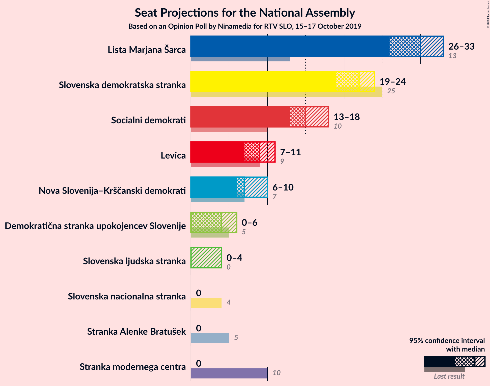
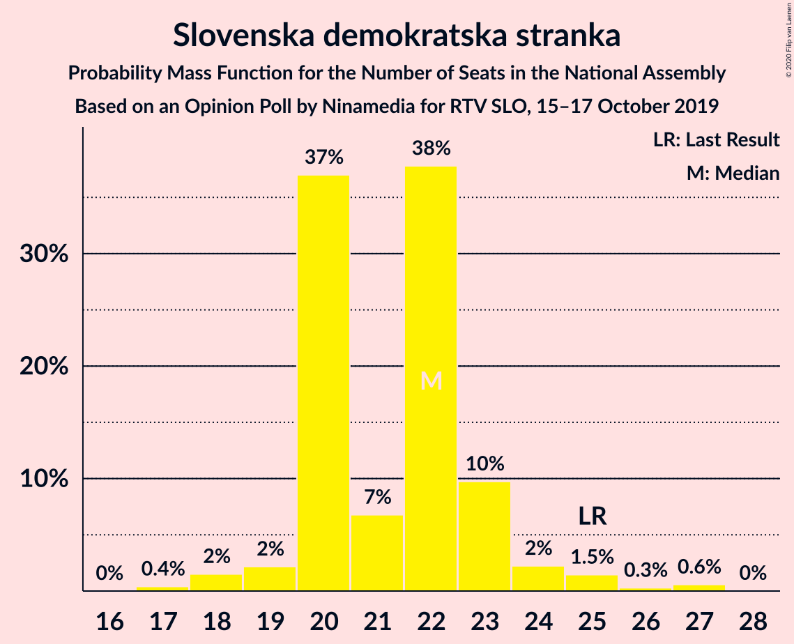
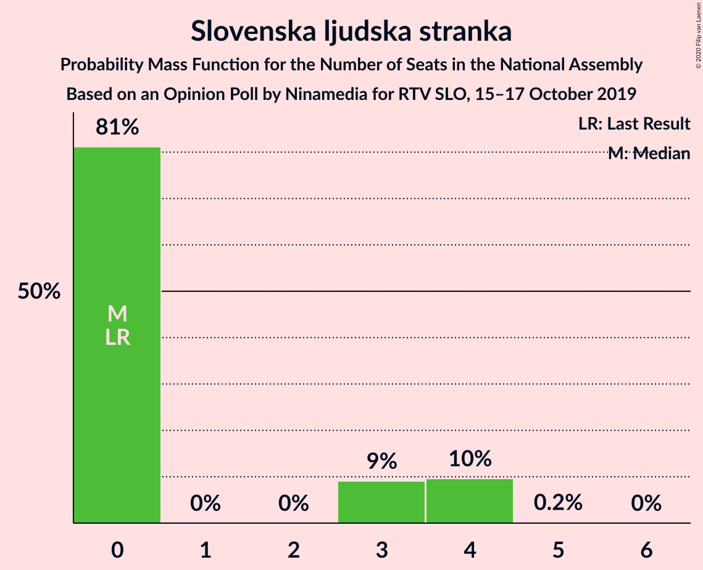
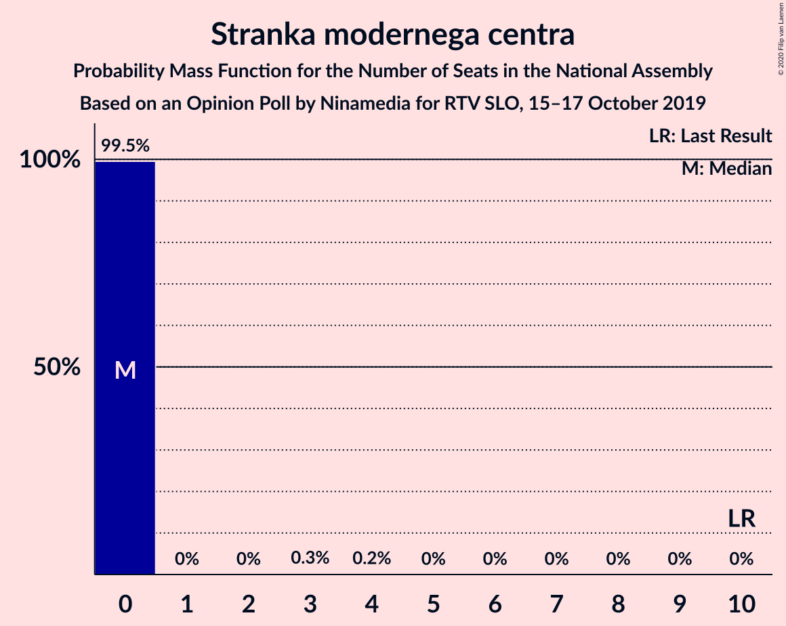
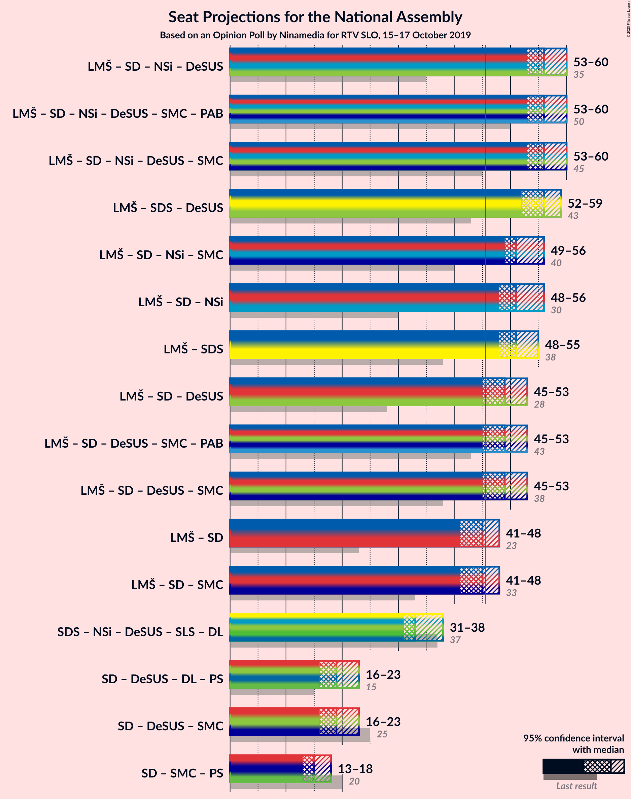
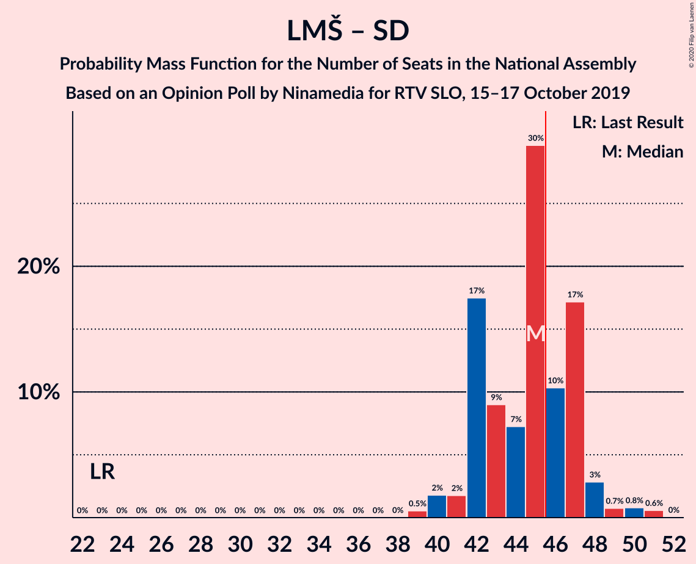
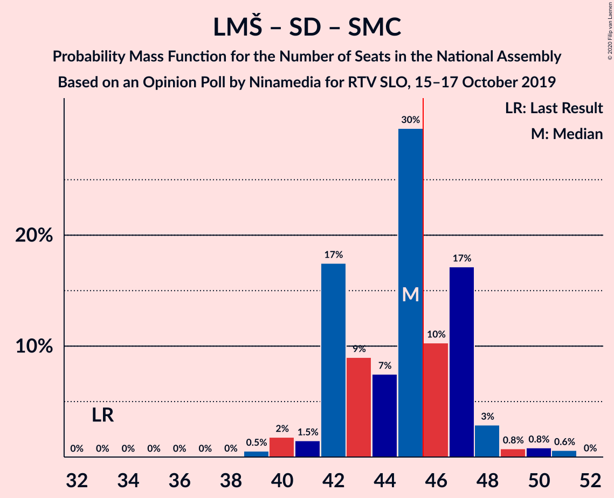

# Opinion Poll by Ninamedia for RTV SLO, 15–17 October 2019

<a href="#voting-intentions">Voting Intentions</a> | <a href="#seats">Seats</a> | <a href="#coalitions">Coalitions</a> | <a href="#technical-information">Technical Information</a>

## Voting Intentions

### Confidence Intervals

| Party | Last Result | Poll Result | 80% Confidence Interval | 90% Confidence Interval | 95% Confidence Interval | 99% Confidence Interval |
|:-----:|:-----------:|:-----------:|:-----------------------:|:-----------------------:|:-----------------------:|:-----------------------:|
| Lista Marjana Šarca | 12.6% | 30.9% | 28.7–33.2% |28.1–33.8% |27.5–34.4% |26.5–35.5% |
| Slovenska demokratska stranka | 24.9% | 22.6% | 20.6–24.7% |20.1–25.3% |19.6–25.8% |18.7–26.9% |
| Socialni demokrati | 9.9% | 16.0% | 14.3–17.9% |13.9–18.4% |13.5–18.9% |12.7–19.8% |
| Levica | 9.3% | 9.6% | 8.3–11.1% |7.9–11.6% |7.6–12.0% |7.0–12.8% |
| Nova Slovenija–Krščanski demokrati | 7.2% | 8.0% | 6.8–9.5% |6.5–9.9% |6.2–10.3% |5.7–11.0% |
| Demokratična stranka upokojencev Slovenije | 4.9% | 5.1% | 4.2–6.4% |3.9–6.7% |3.7–7.0% |3.3–7.7% |
| Slovenska ljudska stranka | 2.6% | 2.9% | 2.2–3.8% |2.0–4.1% |1.9–4.4% |1.6–4.9% |
| Stranka modernega centra | 9.7% | 2.0% | 1.5–2.9% |1.3–3.1% |1.2–3.3% |1.0–3.8% |
| Stranka Alenke Bratušek | 5.1% | 1.6% | 1.1–2.4% |1.0–2.6% |0.9–2.8% |0.7–3.2% |
| Slovenska nacionalna stranka | 4.2% | 1.4% | 1.0–2.2% |0.9–2.4% |0.8–2.6% |0.6–3.0% |

*Note:* The poll result column reflects the actual value used in the calculations. Published results may vary slightly, and in addition be rounded to fewer digits.

## Seats

### Confidence Intervals

| Party | Last Result | Median | 80% Confidence Interval | 90% Confidence Interval | 95% Confidence Interval | 99% Confidence Interval |
|:-----:|:-----------:|:------:|:-----------------------:|:-----------------------:|:-----------------------:|:-----------------------:|
| <a href="#lista-marjana-šarca">Lista Marjana Šarca</a> | 13 | 30 | 29–30 |29–31 |29–32 |27–34 |
| <a href="#slovenska-demokratska-stranka">Slovenska demokratska stranka</a> | 25 | 22 | 22 |20–22 |19–22 |18–25 |
| <a href="#socialni-demokrati">Socialni demokrati</a> | 10 | 15 | 14–15 |14–15 |13–15 |12–17 |
| <a href="#levica">Levica</a> | 9 | 11 | 9–11 |8–11 |8–11 |7–12 |
| <a href="#nova-slovenija–krščanski-demokrati">Nova Slovenija–Krščanski demokrati</a> | 7 | 6 | 6–9 |6–9 |6–10 |5–10 |
| <a href="#demokratična-stranka-upokojencev-slovenije">Demokratična stranka upokojencev Slovenije</a> | 5 | 4 | 4–5 |4–5 |4–6 |4–6 |
| <a href="#slovenska-ljudska-stranka">Slovenska ljudska stranka</a> | 0 | 0 | 0 |0 |0 |0–4 |
| <a href="#stranka-modernega-centra">Stranka modernega centra</a> | 10 | 0 | 0 |0 |0 |0 |
| <a href="#stranka-alenke-bratušek">Stranka Alenke Bratušek</a> | 5 | 0 | 0 |0 |0 |0 |
| <a href="#slovenska-nacionalna-stranka">Slovenska nacionalna stranka</a> | 4 | 0 | 0 |0 |0 |0 |

### Lista Marjana Šarca

*For a full overview of the results for this party, see the [Lista Marjana Šarca](party-listamarjanašarca.html) page.*

| Number of Seats | Probability | Accumulated | Special Marks |
|:---------------:|:-----------:|:-----------:|:-------------:|
| 13 | 0% | 100% | Last Result |
| 14 | 0% | 100% |  |
| 15 | 0% | 100% |  |
| 16 | 0% | 100% |  |
| 17 | 0% | 100% |  |
| 18 | 0% | 100% |  |
| 19 | 0% | 100% |  |
| 20 | 0% | 100% |  |
| 21 | 0% | 100% |  |
| 22 | 0% | 100% |  |
| 23 | 0% | 100% |  |
| 24 | 0% | 100% |  |
| 25 | 0% | 100% |  |
| 26 | 0.4% | 99.9% |  |
| 27 | 1.0% | 99.5% |  |
| 28 | 1.1% | 98.6% |  |
| 29 | 11% | 98% |  |
| 30 | 78% | 86% | Median |
| 31 | 5% | 8% |  |
| 32 | 2% | 3% |  |
| 33 | 0.4% | 1.1% |  |
| 34 | 0.6% | 0.7% |  |
| 35 | 0% | 0% |  |

### Slovenska demokratska stranka

*For a full overview of the results for this party, see the [Slovenska demokratska stranka](party-slovenskademokratskastranka.html) page.*

| Number of Seats | Probability | Accumulated | Special Marks |
|:---------------:|:-----------:|:-----------:|:-------------:|
| 18 | 0.6% | 100% |  |
| 19 | 2% | 99.4% |  |
| 20 | 3% | 97% |  |
| 21 | 1.0% | 95% |  |
| 22 | 92% | 94% | Median |
| 23 | 0.5% | 2% |  |
| 24 | 0.2% | 1.4% |  |
| 25 | 0.8% | 1.2% | Last Result |
| 26 | 0.3% | 0.3% |  |
| 27 | 0% | 0% |  |

### Socialni demokrati

*For a full overview of the results for this party, see the [Socialni demokrati](party-socialnidemokrati.html) page.*

| Number of Seats | Probability | Accumulated | Special Marks |
|:---------------:|:-----------:|:-----------:|:-------------:|
| 10 | 0% | 100% | Last Result |
| 11 | 0.1% | 100% |  |
| 12 | 2% | 99.9% |  |
| 13 | 1.4% | 98% |  |
| 14 | 17% | 97% |  |
| 15 | 78% | 80% | Median |
| 16 | 0.7% | 2% |  |
| 17 | 1.2% | 1.5% |  |
| 18 | 0.2% | 0.3% |  |
| 19 | 0.1% | 0.1% |  |
| 20 | 0% | 0% |  |

### Levica

*For a full overview of the results for this party, see the [Levica](party-levica.html) page.*

| Number of Seats | Probability | Accumulated | Special Marks |
|:---------------:|:-----------:|:-----------:|:-------------:|
| 6 | 0.1% | 100% |  |
| 7 | 1.1% | 99.9% |  |
| 8 | 4% | 98.8% |  |
| 9 | 10% | 95% | Last Result |
| 10 | 7% | 85% |  |
| 11 | 77% | 78% | Median |
| 12 | 0.6% | 0.7% |  |
| 13 | 0% | 0% |  |

### Nova Slovenija–Krščanski demokrati

*For a full overview of the results for this party, see the [Nova Slovenija–Krščanski demokrati](party-novaslovenija–krščanskidemokrati.html) page.*

| Number of Seats | Probability | Accumulated | Special Marks |
|:---------------:|:-----------:|:-----------:|:-------------:|
| 4 | 0.1% | 100% |  |
| 5 | 0.4% | 99.9% |  |
| 6 | 77% | 99.4% | Median |
| 7 | 7% | 22% | Last Result |
| 8 | 2% | 16% |  |
| 9 | 11% | 14% |  |
| 10 | 3% | 3% |  |
| 11 | 0% | 0% |  |

### Demokratična stranka upokojencev Slovenije

*For a full overview of the results for this party, see the [Demokratična stranka upokojencev Slovenije](party-demokratičnastrankaupokojencevslovenije.html) page.*

| Number of Seats | Probability | Accumulated | Special Marks |
|:---------------:|:-----------:|:-----------:|:-------------:|
| 0 | 0.4% | 100% |  |
| 1 | 0% | 99.6% |  |
| 2 | 0% | 99.6% |  |
| 3 | 0% | 99.6% |  |
| 4 | 84% | 99.6% | Median |
| 5 | 12% | 16% | Last Result |
| 6 | 3% | 3% |  |
| 7 | 0% | 0.1% |  |
| 8 | 0.1% | 0.1% |  |
| 9 | 0% | 0% |  |

### Slovenska ljudska stranka

*For a full overview of the results for this party, see the [Slovenska ljudska stranka](party-slovenskaljudskastranka.html) page.*

| Number of Seats | Probability | Accumulated | Special Marks |
|:---------------:|:-----------:|:-----------:|:-------------:|
| 0 | 98% | 100% | Last Result, Median |
| 1 | 0% | 2% |  |
| 2 | 0% | 2% |  |
| 3 | 0% | 2% |  |
| 4 | 2% | 2% |  |
| 5 | 0% | 0% |  |

### Stranka modernega centra

*For a full overview of the results for this party, see the [Stranka modernega centra](party-strankamodernegacentra.html) page.*

| Number of Seats | Probability | Accumulated | Special Marks |
|:---------------:|:-----------:|:-----------:|:-------------:|
| 0 | 99.9% | 100% | Median |
| 1 | 0% | 0.1% |  |
| 2 | 0% | 0.1% |  |
| 3 | 0% | 0.1% |  |
| 4 | 0.1% | 0.1% |  |
| 5 | 0% | 0% |  |
| 6 | 0% | 0% |  |
| 7 | 0% | 0% |  |
| 8 | 0% | 0% |  |
| 9 | 0% | 0% |  |
| 10 | 0% | 0% | Last Result |

### Stranka Alenke Bratušek

*For a full overview of the results for this party, see the [Stranka Alenke Bratušek](party-strankaalenkebratušek.html) page.*

| Number of Seats | Probability | Accumulated | Special Marks |
|:---------------:|:-----------:|:-----------:|:-------------:|
| 0 | 100% | 100% | Median |
| 1 | 0% | 0% |  |
| 2 | 0% | 0% |  |
| 3 | 0% | 0% |  |
| 4 | 0% | 0% |  |
| 5 | 0% | 0% | Last Result |

### Slovenska nacionalna stranka

*For a full overview of the results for this party, see the [Slovenska nacionalna stranka](party-slovenskanacionalnastranka.html) page.*

| Number of Seats | Probability | Accumulated | Special Marks |
|:---------------:|:-----------:|:-----------:|:-------------:|
| 0 | 100% | 100% | Median |
| 1 | 0% | 0% |  |
| 2 | 0% | 0% |  |
| 3 | 0% | 0% |  |
| 4 | 0% | 0% | Last Result |

## Coalitions

### Confidence Intervals

| Coalition | Last Result | Median | Majority? | 80% Confidence Interval | 90% Confidence Interval | 95% Confidence Interval | 99% Confidence Interval |
|:---------:|:-----------:|:------:|:---------:|:-----------------------:|:-----------------------:|:-----------------------:|:-----------------------:|
| Lista Marjana Šarca – Socialni demokrati – Nova Slovenija–Krščanski demokrati – Demokratična stranka upokojencev Slovenije | 35 | 55 | 100% | 55–57 | 55–58 | 55–58 | 53–61 |
| Lista Marjana Šarca – Socialni demokrati – Nova Slovenija–Krščanski demokrati – Demokratična stranka upokojencev Slovenije – Stranka modernega centra – Stranka Alenke Bratušek | 50 | 55 | 100% | 55–57 | 55–58 | 55–58 | 53–61 |
| Lista Marjana Šarca – Socialni demokrati – Nova Slovenija–Krščanski demokrati – Demokratična stranka upokojencev Slovenije – Stranka modernega centra | 45 | 55 | 100% | 55–57 | 55–58 | 55–58 | 53–61 |
| Lista Marjana Šarca – Slovenska demokratska stranka – Demokratična stranka upokojencev Slovenije | 43 | 56 | 100% | 56 | 56–57 | 55–57 | 52–59 |
| Lista Marjana Šarca – Socialni demokrati – Nova Slovenija–Krščanski demokrati | 30 | 51 | 100% | 51–52 | 51–53 | 51–53 | 47–57 |
| Lista Marjana Šarca – Socialni demokrati – Nova Slovenija–Krščanski demokrati – Stranka modernega centra | 40 | 51 | 100% | 51–52 | 51–53 | 51–53 | 47–57 |
| Lista Marjana Šarca – Slovenska demokratska stranka | 38 | 52 | 99.8% | 51–52 | 51–53 | 49–53 | 47–56 |
| Lista Marjana Šarca – Socialni demokrati – Demokratična stranka upokojencev Slovenije | 28 | 49 | 99.6% | 48–49 | 48–49 | 48–51 | 47–53 |
| Lista Marjana Šarca – Socialni demokrati – Demokratična stranka upokojencev Slovenije – Stranka modernega centra – Stranka Alenke Bratušek | 43 | 49 | 99.6% | 48–49 | 48–49 | 48–51 | 47–53 |
| Lista Marjana Šarca – Socialni demokrati – Demokratična stranka upokojencev Slovenije – Stranka modernega centra | 38 | 49 | 99.6% | 48–49 | 48–49 | 48–51 | 47–53 |
| Lista Marjana Šarca – Socialni demokrati | 23 | 45 | 3% | 43–45 | 43–45 | 42–46 | 41–49 |
| Lista Marjana Šarca – Socialni demokrati – Stranka modernega centra | 33 | 45 | 3% | 43–45 | 43–45 | 42–46 | 41–49 |
| Socialni demokrati – Demokratična stranka upokojencev Slovenije – Stranka modernega centra | 25 | 19 | 0% | 19 | 18–19 | 18–20 | 17–23 |

### Lista Marjana Šarca – Socialni demokrati – Nova Slovenija–Krščanski demokrati – Demokratična stranka upokojencev Slovenije

| Number of Seats | Probability | Accumulated | Special Marks |
|:---------------:|:-----------:|:-----------:|:-------------:|
| 35 | 0% | 100% | Last Result |
| 36 | 0% | 100% |  |
| 37 | 0% | 100% |  |
| 38 | 0% | 100% |  |
| 39 | 0% | 100% |  |
| 40 | 0% | 100% |  |
| 41 | 0% | 100% |  |
| 42 | 0% | 100% |  |
| 43 | 0% | 100% |  |
| 44 | 0% | 100% |  |
| 45 | 0% | 100% |  |
| 46 | 0% | 100% | Majority |
| 47 | 0% | 100% |  |
| 48 | 0% | 100% |  |
| 49 | 0% | 100% |  |
| 50 | 0% | 100% |  |
| 51 | 0% | 100% |  |
| 52 | 0.2% | 99.9% |  |
| 53 | 1.0% | 99.7% |  |
| 54 | 0.3% | 98.7% |  |
| 55 | 76% | 98% | Median |
| 56 | 5% | 22% |  |
| 57 | 12% | 17% |  |
| 58 | 4% | 5% |  |
| 59 | 0.3% | 1.5% |  |
| 60 | 0.3% | 1.2% |  |
| 61 | 0.8% | 0.9% |  |
| 62 | 0.1% | 0.1% |  |
| 63 | 0% | 0% |  |

### Lista Marjana Šarca – Socialni demokrati – Nova Slovenija–Krščanski demokrati – Demokratična stranka upokojencev Slovenije – Stranka modernega centra – Stranka Alenke Bratušek

| Number of Seats | Probability | Accumulated | Special Marks |
|:---------------:|:-----------:|:-----------:|:-------------:|
| 50 | 0% | 100% | Last Result |
| 51 | 0% | 100% |  |
| 52 | 0.2% | 99.9% |  |
| 53 | 1.0% | 99.7% |  |
| 54 | 0.3% | 98.7% |  |
| 55 | 76% | 98% | Median |
| 56 | 5% | 22% |  |
| 57 | 12% | 17% |  |
| 58 | 4% | 6% |  |
| 59 | 0.3% | 2% |  |
| 60 | 0.5% | 1.3% |  |
| 61 | 0.8% | 0.9% |  |
| 62 | 0.1% | 0.1% |  |
| 63 | 0% | 0% |  |

### Lista Marjana Šarca – Socialni demokrati – Nova Slovenija–Krščanski demokrati – Demokratična stranka upokojencev Slovenije – Stranka modernega centra

| Number of Seats | Probability | Accumulated | Special Marks |
|:---------------:|:-----------:|:-----------:|:-------------:|
| 45 | 0% | 100% | Last Result |
| 46 | 0% | 100% | Majority |
| 47 | 0% | 100% |  |
| 48 | 0% | 100% |  |
| 49 | 0% | 100% |  |
| 50 | 0% | 100% |  |
| 51 | 0% | 100% |  |
| 52 | 0.2% | 99.9% |  |
| 53 | 1.0% | 99.7% |  |
| 54 | 0.3% | 98.7% |  |
| 55 | 76% | 98% | Median |
| 56 | 5% | 22% |  |
| 57 | 12% | 17% |  |
| 58 | 4% | 6% |  |
| 59 | 0.3% | 2% |  |
| 60 | 0.5% | 1.3% |  |
| 61 | 0.8% | 0.9% |  |
| 62 | 0.1% | 0.1% |  |
| 63 | 0% | 0% |  |

### Lista Marjana Šarca – Slovenska demokratska stranka – Demokratična stranka upokojencev Slovenije

| Number of Seats | Probability | Accumulated | Special Marks |
|:---------------:|:-----------:|:-----------:|:-------------:|
| 43 | 0% | 100% | Last Result |
| 44 | 0% | 100% |  |
| 45 | 0% | 100% |  |
| 46 | 0% | 100% | Majority |
| 47 | 0% | 100% |  |
| 48 | 0% | 100% |  |
| 49 | 0% | 100% |  |
| 50 | 0.2% | 100% |  |
| 51 | 0.3% | 99.8% |  |
| 52 | 1.2% | 99.5% |  |
| 53 | 0.2% | 98% |  |
| 54 | 0.5% | 98% |  |
| 55 | 2% | 98% |  |
| 56 | 87% | 96% | Median |
| 57 | 6% | 8% |  |
| 58 | 1.1% | 2% |  |
| 59 | 0.7% | 1.1% |  |
| 60 | 0.2% | 0.4% |  |
| 61 | 0% | 0.2% |  |
| 62 | 0% | 0.1% |  |
| 63 | 0.1% | 0.1% |  |
| 64 | 0% | 0% |  |

### Lista Marjana Šarca – Socialni demokrati – Nova Slovenija–Krščanski demokrati

| Number of Seats | Probability | Accumulated | Special Marks |
|:---------------:|:-----------:|:-----------:|:-------------:|
| 30 | 0% | 100% | Last Result |
| 31 | 0% | 100% |  |
| 32 | 0% | 100% |  |
| 33 | 0% | 100% |  |
| 34 | 0% | 100% |  |
| 35 | 0% | 100% |  |
| 36 | 0% | 100% |  |
| 37 | 0% | 100% |  |
| 38 | 0% | 100% |  |
| 39 | 0% | 100% |  |
| 40 | 0% | 100% |  |
| 41 | 0% | 100% |  |
| 42 | 0% | 100% |  |
| 43 | 0% | 100% |  |
| 44 | 0% | 100% |  |
| 45 | 0% | 100% |  |
| 46 | 0% | 100% | Majority |
| 47 | 0.6% | 100% |  |
| 48 | 0.1% | 99.4% |  |
| 49 | 0.6% | 99.3% |  |
| 50 | 0.4% | 98.7% |  |
| 51 | 78% | 98% | Median |
| 52 | 14% | 20% |  |
| 53 | 4% | 6% |  |
| 54 | 0.9% | 2% |  |
| 55 | 0.3% | 1.3% |  |
| 56 | 0.2% | 1.0% |  |
| 57 | 0.7% | 0.9% |  |
| 58 | 0% | 0.2% |  |
| 59 | 0.1% | 0.1% |  |
| 60 | 0% | 0% |  |

### Lista Marjana Šarca – Socialni demokrati – Nova Slovenija–Krščanski demokrati – Stranka modernega centra

| Number of Seats | Probability | Accumulated | Special Marks |
|:---------------:|:-----------:|:-----------:|:-------------:|
| 40 | 0% | 100% | Last Result |
| 41 | 0% | 100% |  |
| 42 | 0% | 100% |  |
| 43 | 0% | 100% |  |
| 44 | 0% | 100% |  |
| 45 | 0% | 100% |  |
| 46 | 0% | 100% | Majority |
| 47 | 0.6% | 100% |  |
| 48 | 0.1% | 99.4% |  |
| 49 | 0.6% | 99.3% |  |
| 50 | 0.4% | 98.7% |  |
| 51 | 78% | 98% | Median |
| 52 | 14% | 20% |  |
| 53 | 4% | 6% |  |
| 54 | 0.9% | 2% |  |
| 55 | 0.3% | 1.4% |  |
| 56 | 0.3% | 1.2% |  |
| 57 | 0.7% | 0.9% |  |
| 58 | 0% | 0.2% |  |
| 59 | 0.1% | 0.1% |  |
| 60 | 0% | 0% |  |

### Lista Marjana Šarca – Slovenska demokratska stranka

| Number of Seats | Probability | Accumulated | Special Marks |
|:---------------:|:-----------:|:-----------:|:-------------:|
| 38 | 0% | 100% | Last Result |
| 39 | 0% | 100% |  |
| 40 | 0% | 100% |  |
| 41 | 0% | 100% |  |
| 42 | 0% | 100% |  |
| 43 | 0% | 100% |  |
| 44 | 0% | 100% |  |
| 45 | 0.2% | 100% |  |
| 46 | 0.3% | 99.8% | Majority |
| 47 | 0.1% | 99.5% |  |
| 48 | 1.3% | 99.5% |  |
| 49 | 2% | 98% |  |
| 50 | 0.2% | 96% |  |
| 51 | 11% | 96% |  |
| 52 | 79% | 85% | Median |
| 53 | 5% | 7% |  |
| 54 | 0.7% | 1.3% |  |
| 55 | 0.2% | 0.7% |  |
| 56 | 0.2% | 0.5% |  |
| 57 | 0.3% | 0.3% |  |
| 58 | 0% | 0% |  |

### Lista Marjana Šarca – Socialni demokrati – Demokratična stranka upokojencev Slovenije

| Number of Seats | Probability | Accumulated | Special Marks |
|:---------------:|:-----------:|:-----------:|:-------------:|
| 28 | 0% | 100% | Last Result |
| 29 | 0% | 100% |  |
| 30 | 0% | 100% |  |
| 31 | 0% | 100% |  |
| 32 | 0% | 100% |  |
| 33 | 0% | 100% |  |
| 34 | 0% | 100% |  |
| 35 | 0% | 100% |  |
| 36 | 0% | 100% |  |
| 37 | 0% | 100% |  |
| 38 | 0% | 100% |  |
| 39 | 0% | 100% |  |
| 40 | 0% | 100% |  |
| 41 | 0% | 100% |  |
| 42 | 0% | 100% |  |
| 43 | 0% | 100% |  |
| 44 | 0.2% | 100% |  |
| 45 | 0.2% | 99.8% |  |
| 46 | 0.1% | 99.6% | Majority |
| 47 | 0.8% | 99.5% |  |
| 48 | 14% | 98.7% |  |
| 49 | 81% | 85% | Median |
| 50 | 0.4% | 3% |  |
| 51 | 2% | 3% |  |
| 52 | 0.1% | 1.4% |  |
| 53 | 1.0% | 1.3% |  |
| 54 | 0.2% | 0.3% |  |
| 55 | 0.1% | 0.1% |  |
| 56 | 0% | 0% |  |

### Lista Marjana Šarca – Socialni demokrati – Demokratična stranka upokojencev Slovenije – Stranka modernega centra – Stranka Alenke Bratušek

| Number of Seats | Probability | Accumulated | Special Marks |
|:---------------:|:-----------:|:-----------:|:-------------:|
| 43 | 0% | 100% | Last Result |
| 44 | 0.2% | 100% |  |
| 45 | 0.2% | 99.8% |  |
| 46 | 0.1% | 99.6% | Majority |
| 47 | 0.8% | 99.5% |  |
| 48 | 14% | 98.7% |  |
| 49 | 81% | 85% | Median |
| 50 | 0.4% | 3% |  |
| 51 | 2% | 3% |  |
| 52 | 0.2% | 2% |  |
| 53 | 1.0% | 1.3% |  |
| 54 | 0.2% | 0.3% |  |
| 55 | 0.1% | 0.1% |  |
| 56 | 0% | 0% |  |

### Lista Marjana Šarca – Socialni demokrati – Demokratična stranka upokojencev Slovenije – Stranka modernega centra

| Number of Seats | Probability | Accumulated | Special Marks |
|:---------------:|:-----------:|:-----------:|:-------------:|
| 38 | 0% | 100% | Last Result |
| 39 | 0% | 100% |  |
| 40 | 0% | 100% |  |
| 41 | 0% | 100% |  |
| 42 | 0% | 100% |  |
| 43 | 0% | 100% |  |
| 44 | 0.2% | 100% |  |
| 45 | 0.2% | 99.8% |  |
| 46 | 0.1% | 99.6% | Majority |
| 47 | 0.8% | 99.5% |  |
| 48 | 14% | 98.7% |  |
| 49 | 81% | 85% | Median |
| 50 | 0.4% | 3% |  |
| 51 | 2% | 3% |  |
| 52 | 0.2% | 2% |  |
| 53 | 1.0% | 1.3% |  |
| 54 | 0.2% | 0.3% |  |
| 55 | 0.1% | 0.1% |  |
| 56 | 0% | 0% |  |

### Lista Marjana Šarca – Socialni demokrati

| Number of Seats | Probability | Accumulated | Special Marks |
|:---------------:|:-----------:|:-----------:|:-------------:|
| 23 | 0% | 100% | Last Result |
| 24 | 0% | 100% |  |
| 25 | 0% | 100% |  |
| 26 | 0% | 100% |  |
| 27 | 0% | 100% |  |
| 28 | 0% | 100% |  |
| 29 | 0% | 100% |  |
| 30 | 0% | 100% |  |
| 31 | 0% | 100% |  |
| 32 | 0% | 100% |  |
| 33 | 0% | 100% |  |
| 34 | 0% | 100% |  |
| 35 | 0% | 100% |  |
| 36 | 0% | 100% |  |
| 37 | 0% | 100% |  |
| 38 | 0% | 100% |  |
| 39 | 0% | 100% |  |
| 40 | 0.2% | 100% |  |
| 41 | 0.7% | 99.7% |  |
| 42 | 2% | 99.1% |  |
| 43 | 11% | 97% |  |
| 44 | 2% | 86% |  |
| 45 | 82% | 85% | Median |
| 46 | 1.3% | 3% | Majority |
| 47 | 0.3% | 2% |  |
| 48 | 0.3% | 1.4% |  |
| 49 | 0.8% | 1.0% |  |
| 50 | 0.1% | 0.2% |  |
| 51 | 0.1% | 0.1% |  |
| 52 | 0% | 0% |  |

### Lista Marjana Šarca – Socialni demokrati – Stranka modernega centra

| Number of Seats | Probability | Accumulated | Special Marks |
|:---------------:|:-----------:|:-----------:|:-------------:|
| 33 | 0% | 100% | Last Result |
| 34 | 0% | 100% |  |
| 35 | 0% | 100% |  |
| 36 | 0% | 100% |  |
| 37 | 0% | 100% |  |
| 38 | 0% | 100% |  |
| 39 | 0% | 100% |  |
| 40 | 0.2% | 100% |  |
| 41 | 0.7% | 99.7% |  |
| 42 | 2% | 99.1% |  |
| 43 | 11% | 97% |  |
| 44 | 2% | 86% |  |
| 45 | 82% | 85% | Median |
| 46 | 1.4% | 3% | Majority |
| 47 | 0.3% | 2% |  |
| 48 | 0.4% | 1.5% |  |
| 49 | 0.8% | 1.1% |  |
| 50 | 0.1% | 0.2% |  |
| 51 | 0.1% | 0.1% |  |
| 52 | 0% | 0% |  |

### Socialni demokrati – Demokratična stranka upokojencev Slovenije – Stranka modernega centra

| Number of Seats | Probability | Accumulated | Special Marks |
|:---------------:|:-----------:|:-----------:|:-------------:|
| 14 | 0.2% | 100% |  |
| 15 | 0.1% | 99.8% |  |
| 16 | 0.1% | 99.7% |  |
| 17 | 0.6% | 99.7% |  |
| 18 | 7% | 99.1% |  |
| 19 | 90% | 93% | Median |
| 20 | 0.6% | 3% |  |
| 21 | 1.3% | 2% |  |
| 22 | 0.5% | 1.0% |  |
| 23 | 0.5% | 0.5% |  |
| 24 | 0% | 0.1% |  |
| 25 | 0% | 0% | Last Result |

## Technical Information

### Opinion Poll

+ **Polling firm:** Ninamedia
+ **Commissioner(s):** RTV SLO
+ **Fieldwork period:** 15–17 October 2019

### Calculations

+ **Sample size:** 700
+ **Simulations done:** 131,072
+ **Error estimate:** 1.33%

