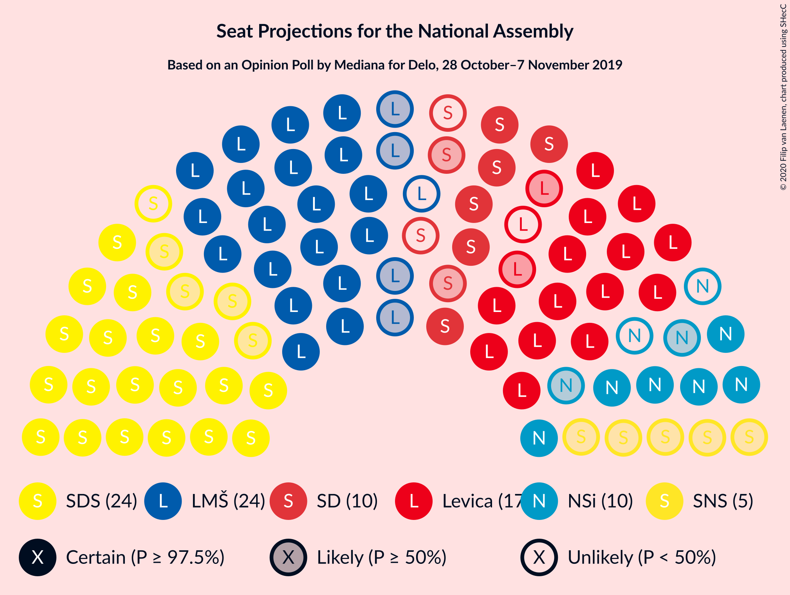
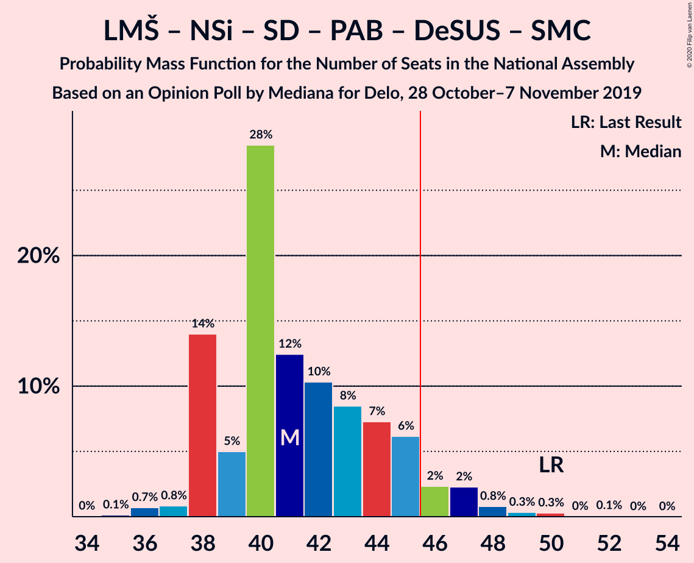
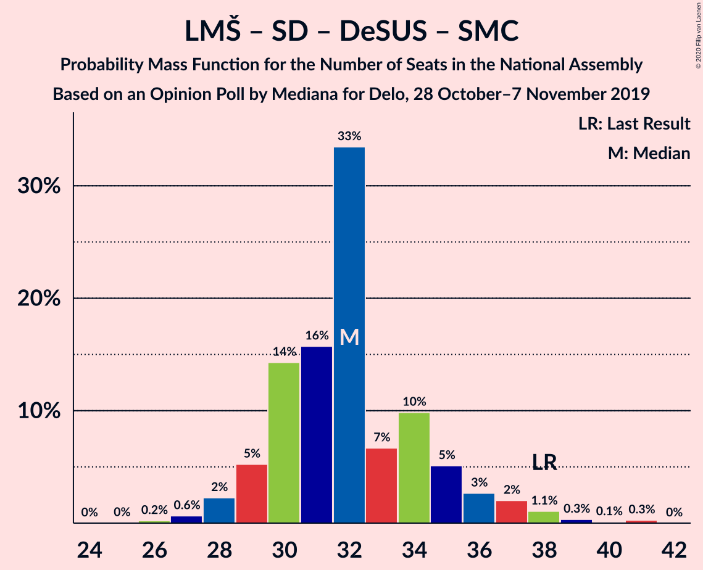

# Opinion Poll by Mediana for Delo, 28 October–7 November 2019

<a href="#voting-intentions">Voting Intentions</a> | <a href="#seats">Seats</a> | <a href="#coalitions">Coalitions</a> | <a href="#technical-information">Technical Information</a>

## Voting Intentions

### Confidence Intervals

| Party | Last Result | Poll Result | 80% Confidence Interval | 90% Confidence Interval | 95% Confidence Interval | 99% Confidence Interval |
|:-----:|:-----------:|:-----------:|:-----------------------:|:-----------------------:|:-----------------------:|:-----------------------:|
| Lista Marjana Šarca | 12.6% | 22.9% | 21.0–24.9% |20.4–25.5% |20.0–26.0% |19.1–27.1% |
| Slovenska demokratska stranka | 24.9% | 22.6% | 20.7–24.7% |20.2–25.2% |19.7–25.8% |18.8–26.8% |
| Levica | 9.3% | 16.6% | 14.9–18.5% |14.5–19.0% |14.1–19.5% |13.3–20.4% |
| Socialni demokrati | 9.9% | 8.8% | 7.6–10.3% |7.3–10.7% |7.0–11.1% |6.4–11.9% |
| Nova Slovenija–Krščanski demokrati | 7.2% | 8.8% | 7.6–10.3% |7.3–10.7% |7.0–11.1% |6.4–11.9% |
| Slovenska nacionalna stranka | 4.2% | 4.8% | 3.9–5.9% |3.6–6.3% |3.4–6.6% |3.1–7.2% |
| Stranka Alenke Bratušek | 5.1% | 3.4% | 2.7–4.4% |2.5–4.7% |2.3–5.0% |2.0–5.5% |
| Demokratična stranka upokojencev Slovenije | 4.9% | 3.3% | 2.6–4.3% |2.4–4.6% |2.2–4.8% |1.9–5.3% |
| Stranka modernega centra | 9.7% | 2.9% | 2.2–3.8% |2.0–4.1% |1.9–4.3% |1.6–4.8% |
| Slovenska ljudska stranka | 2.6% | 1.5% | 1.1–2.3% |0.9–2.5% |0.8–2.7% |0.7–3.1% |

*Note:* The poll result column reflects the actual value used in the calculations. Published results may vary slightly, and in addition be rounded to fewer digits.

## Seats

### Confidence Intervals

| Party | Last Result | Median | 80% Confidence Interval | 90% Confidence Interval | 95% Confidence Interval | 99% Confidence Interval |
|:-----:|:-----------:|:------:|:-----------------------:|:-----------------------:|:-----------------------:|:-----------------------:|
| <a href="#lista-marjana-šarca">Lista Marjana Šarca</a> | 13 | 23 | 21–25 |20–26 |19–26 |19–28 |
| <a href="#slovenska-demokratska-stranka">Slovenska demokratska stranka</a> | 25 | 23 | 20–24 |20–25 |19–26 |19–27 |
| <a href="#levica">Levica</a> | 9 | 16 | 15–18 |14–18 |14–19 |13–20 |
| <a href="#socialni-demokrati">Socialni demokrati</a> | 10 | 8 | 7–10 |7–10 |6–11 |6–11 |
| <a href="#nova-slovenija–krščanski-demokrati">Nova Slovenija–Krščanski demokrati</a> | 7 | 8 | 7–10 |7–10 |6–11 |6–12 |
| <a href="#slovenska-nacionalna-stranka">Slovenska nacionalna stranka</a> | 4 | 5 | 3–5 |0–6 |0–6 |0–7 |
| <a href="#stranka-alenke-bratušek">Stranka Alenke Bratušek</a> | 5 | 0 | 0–4 |0–4 |0–4 |0–5 |
| <a href="#demokratična-stranka-upokojencev-slovenije">Demokratična stranka upokojencev Slovenije</a> | 5 | 0 | 0–4 |0–4 |0–4 |0–5 |
| <a href="#stranka-modernega-centra">Stranka modernega centra</a> | 10 | 0 | 0 |0 |0–4 |0–4 |
| <a href="#slovenska-ljudska-stranka">Slovenska ljudska stranka</a> | 0 | 0 | 0 |0 |0 |0 |

### Lista Marjana Šarca

*For a full overview of the results for this party, see the [Lista Marjana Šarca](party-listamarjanašarca.html) page.*

| Number of Seats | Probability | Accumulated | Special Marks |
|:---------------:|:-----------:|:-----------:|:-------------:|
| 13 | 0% | 100% | Last Result |
| 14 | 0% | 100% |  |
| 15 | 0% | 100% |  |
| 16 | 0% | 100% |  |
| 17 | 0.1% | 100% |  |
| 18 | 0.3% | 99.9% |  |
| 19 | 3% | 99.5% |  |
| 20 | 6% | 97% |  |
| 21 | 9% | 90% |  |
| 22 | 27% | 81% |  |
| 23 | 10% | 54% | Median |
| 24 | 33% | 44% |  |
| 25 | 6% | 11% |  |
| 26 | 4% | 6% |  |
| 27 | 1.5% | 2% |  |
| 28 | 0.4% | 0.5% |  |
| 29 | 0.1% | 0.1% |  |
| 30 | 0% | 0% |  |

### Slovenska demokratska stranka

*For a full overview of the results for this party, see the [Slovenska demokratska stranka](party-slovenskademokratskastranka.html) page.*

| Number of Seats | Probability | Accumulated | Special Marks |
|:---------------:|:-----------:|:-----------:|:-------------:|
| 17 | 0.1% | 100% |  |
| 18 | 0.3% | 99.9% |  |
| 19 | 2% | 99.6% |  |
| 20 | 9% | 97% |  |
| 21 | 9% | 89% |  |
| 22 | 17% | 79% |  |
| 23 | 32% | 62% | Median |
| 24 | 21% | 30% |  |
| 25 | 5% | 9% | Last Result |
| 26 | 3% | 4% |  |
| 27 | 0.5% | 0.6% |  |
| 28 | 0% | 0.1% |  |
| 29 | 0.1% | 0.1% |  |
| 30 | 0% | 0% |  |

### Levica

*For a full overview of the results for this party, see the [Levica](party-levica.html) page.*

| Number of Seats | Probability | Accumulated | Special Marks |
|:---------------:|:-----------:|:-----------:|:-------------:|
| 9 | 0% | 100% | Last Result |
| 10 | 0% | 100% |  |
| 11 | 0% | 100% |  |
| 12 | 0.2% | 100% |  |
| 13 | 2% | 99.8% |  |
| 14 | 7% | 98% |  |
| 15 | 9% | 91% |  |
| 16 | 42% | 82% | Median |
| 17 | 27% | 41% |  |
| 18 | 10% | 14% |  |
| 19 | 3% | 4% |  |
| 20 | 0.9% | 1.4% |  |
| 21 | 0.3% | 0.4% |  |
| 22 | 0.1% | 0.1% |  |
| 23 | 0% | 0% |  |

### Socialni demokrati

*For a full overview of the results for this party, see the [Socialni demokrati](party-socialnidemokrati.html) page.*

| Number of Seats | Probability | Accumulated | Special Marks |
|:---------------:|:-----------:|:-----------:|:-------------:|
| 5 | 0.1% | 100% |  |
| 6 | 3% | 99.9% |  |
| 7 | 10% | 97% |  |
| 8 | 46% | 87% | Median |
| 9 | 22% | 41% |  |
| 10 | 16% | 20% | Last Result |
| 11 | 3% | 4% |  |
| 12 | 0.4% | 0.5% |  |
| 13 | 0.1% | 0.1% |  |
| 14 | 0% | 0% |  |

### Nova Slovenija–Krščanski demokrati

*For a full overview of the results for this party, see the [Nova Slovenija–Krščanski demokrati](party-novaslovenija–krščanskidemokrati.html) page.*

| Number of Seats | Probability | Accumulated | Special Marks |
|:---------------:|:-----------:|:-----------:|:-------------:|
| 5 | 0.1% | 100% |  |
| 6 | 3% | 99.9% |  |
| 7 | 10% | 97% | Last Result |
| 8 | 44% | 87% | Median |
| 9 | 24% | 43% |  |
| 10 | 15% | 19% |  |
| 11 | 3% | 4% |  |
| 12 | 1.0% | 1.1% |  |
| 13 | 0% | 0% |  |

### Slovenska nacionalna stranka

*For a full overview of the results for this party, see the [Slovenska nacionalna stranka](party-slovenskanacionalnastranka.html) page.*

| Number of Seats | Probability | Accumulated | Special Marks |
|:---------------:|:-----------:|:-----------:|:-------------:|
| 0 | 10% | 100% |  |
| 1 | 0% | 90% |  |
| 2 | 0% | 90% |  |
| 3 | 0.7% | 90% |  |
| 4 | 32% | 90% | Last Result |
| 5 | 50% | 58% | Median |
| 6 | 6% | 7% |  |
| 7 | 0.6% | 0.7% |  |
| 8 | 0.1% | 0.1% |  |
| 9 | 0% | 0% |  |

### Stranka Alenke Bratušek

*For a full overview of the results for this party, see the [Stranka Alenke Bratušek](party-strankaalenkebratušek.html) page.*

| Number of Seats | Probability | Accumulated | Special Marks |
|:---------------:|:-----------:|:-----------:|:-------------:|
| 0 | 83% | 100% | Median |
| 1 | 0% | 17% |  |
| 2 | 0% | 17% |  |
| 3 | 2% | 17% |  |
| 4 | 14% | 16% |  |
| 5 | 1.3% | 1.4% | Last Result |
| 6 | 0.1% | 0.1% |  |
| 7 | 0% | 0% |  |

### Demokratična stranka upokojencev Slovenije

*For a full overview of the results for this party, see the [Demokratična stranka upokojencev Slovenije](party-demokratičnastrankaupokojencevslovenije.html) page.*

| Number of Seats | Probability | Accumulated | Special Marks |
|:---------------:|:-----------:|:-----------:|:-------------:|
| 0 | 89% | 100% | Median |
| 1 | 0% | 11% |  |
| 2 | 0% | 11% |  |
| 3 | 0.5% | 11% |  |
| 4 | 9% | 11% |  |
| 5 | 1.5% | 2% | Last Result |
| 6 | 0% | 0% |  |

### Stranka modernega centra

*For a full overview of the results for this party, see the [Stranka modernega centra](party-strankamodernegacentra.html) page.*

| Number of Seats | Probability | Accumulated | Special Marks |
|:---------------:|:-----------:|:-----------:|:-------------:|
| 0 | 95% | 100% | Median |
| 1 | 0% | 5% |  |
| 2 | 0% | 5% |  |
| 3 | 0.6% | 5% |  |
| 4 | 4% | 4% |  |
| 5 | 0.3% | 0.3% |  |
| 6 | 0% | 0% |  |
| 7 | 0% | 0% |  |
| 8 | 0% | 0% |  |
| 9 | 0% | 0% |  |
| 10 | 0% | 0% | Last Result |

### Slovenska ljudska stranka

*For a full overview of the results for this party, see the [Slovenska ljudska stranka](party-slovenskaljudskastranka.html) page.*

| Number of Seats | Probability | Accumulated | Special Marks |
|:---------------:|:-----------:|:-----------:|:-------------:|
| 0 | 100% | 100% | Last Result, Median |

## Coalitions

### Confidence Intervals

| Coalition | Last Result | Median | Majority? | 80% Confidence Interval | 90% Confidence Interval | 95% Confidence Interval | 99% Confidence Interval |
|:---------:|:-----------:|:------:|:---------:|:-----------------------:|:-----------------------:|:-----------------------:|:-----------------------:|
| Lista Marjana Šarca – Slovenska demokratska stranka – Demokratična stranka upokojencev Slovenije | 43 | 46 | 64% | 43–49 | 42–50 | 41–50 | 40–52 |
| Lista Marjana Šarca – Slovenska demokratska stranka | 38 | 46 | 57% | 42–48 | 41–50 | 41–50 | 39–52 |
| Lista Marjana Šarca – Nova Slovenija–Krščanski demokrati – Socialni demokrati – Stranka Alenke Bratušek – Demokratična stranka upokojencev Slovenije – Stranka modernega centra | 50 | 41 | 6% | 38–45 | 38–46 | 38–47 | 36–49 |
| Lista Marjana Šarca – Nova Slovenija–Krščanski demokrati – Socialni demokrati – Demokratična stranka upokojencev Slovenije – Stranka modernega centra | 45 | 40 | 3% | 38–43 | 38–45 | 37–46 | 36–48 |
| Lista Marjana Šarca – Nova Slovenija–Krščanski demokrati – Socialni demokrati – Demokratična stranka upokojencev Slovenije | 35 | 40 | 3% | 38–43 | 38–45 | 36–46 | 35–48 |
| Lista Marjana Šarca – Nova Slovenija–Krščanski demokrati – Socialni demokrati | 30 | 40 | 2% | 38–43 | 36–43 | 36–45 | 34–48 |
| Lista Marjana Šarca – Nova Slovenija–Krščanski demokrati – Socialni demokrati – Stranka modernega centra | 40 | 40 | 2% | 38–43 | 37–44 | 36–45 | 35–48 |
| Lista Marjana Šarca – Socialni demokrati – Stranka Alenke Bratušek – Demokratična stranka upokojencev Slovenije – Stranka modernega centra | 43 | 32 | 0% | 30–36 | 29–38 | 29–39 | 28–41 |
| Lista Marjana Šarca – Socialni demokrati – Demokratična stranka upokojencev Slovenije | 28 | 32 | 0% | 30–34 | 29–36 | 28–37 | 27–38 |
| Lista Marjana Šarca – Socialni demokrati – Demokratična stranka upokojencev Slovenije – Stranka modernega centra | 38 | 32 | 0% | 30–35 | 29–36 | 28–37 | 27–39 |
| Lista Marjana Šarca – Socialni demokrati – Stranka modernega centra | 33 | 32 | 0% | 29–34 | 28–35 | 28–36 | 26–38 |
| Lista Marjana Šarca – Socialni demokrati | 23 | 32 | 0% | 29–34 | 28–34 | 28–35 | 26–38 |
| Socialni demokrati – Demokratična stranka upokojencev Slovenije – Stranka modernega centra | 25 | 8 | 0% | 8–12 | 7–13 | 7–14 | 6–16 |

### Lista Marjana Šarca – Slovenska demokratska stranka – Demokratična stranka upokojencev Slovenije

| Number of Seats | Probability | Accumulated | Special Marks |
|:---------------:|:-----------:|:-----------:|:-------------:|
| 38 | 0.1% | 100% |  |
| 39 | 0.2% | 99.9% |  |
| 40 | 0.6% | 99.7% |  |
| 41 | 2% | 99.1% |  |
| 42 | 4% | 97% |  |
| 43 | 4% | 93% | Last Result |
| 44 | 17% | 89% |  |
| 45 | 7% | 71% |  |
| 46 | 17% | 64% | Median, Majority |
| 47 | 26% | 47% |  |
| 48 | 9% | 21% |  |
| 49 | 5% | 12% |  |
| 50 | 5% | 7% |  |
| 51 | 0.7% | 2% |  |
| 52 | 0.9% | 1.2% |  |
| 53 | 0.2% | 0.3% |  |
| 54 | 0.1% | 0.1% |  |
| 55 | 0% | 0% |  |

### Lista Marjana Šarca – Slovenska demokratska stranka

| Number of Seats | Probability | Accumulated | Special Marks |
|:---------------:|:-----------:|:-----------:|:-------------:|
| 38 | 0.2% | 100% | Last Result |
| 39 | 0.4% | 99.8% |  |
| 40 | 2% | 99.4% |  |
| 41 | 4% | 98% |  |
| 42 | 6% | 94% |  |
| 43 | 5% | 88% |  |
| 44 | 18% | 83% |  |
| 45 | 8% | 65% |  |
| 46 | 16% | 57% | Median, Majority |
| 47 | 25% | 41% |  |
| 48 | 7% | 16% |  |
| 49 | 3% | 9% |  |
| 50 | 4% | 5% |  |
| 51 | 0.3% | 1.0% |  |
| 52 | 0.6% | 0.7% |  |
| 53 | 0% | 0.1% |  |
| 54 | 0% | 0% |  |

### Lista Marjana Šarca – Nova Slovenija–Krščanski demokrati – Socialni demokrati – Stranka Alenke Bratušek – Demokratična stranka upokojencev Slovenije – Stranka modernega centra

| Number of Seats | Probability | Accumulated | Special Marks |
|:---------------:|:-----------:|:-----------:|:-------------:|
| 35 | 0.1% | 100% |  |
| 36 | 0.7% | 99.8% |  |
| 37 | 0.8% | 99.1% |  |
| 38 | 14% | 98% |  |
| 39 | 5% | 84% | Median |
| 40 | 28% | 79% |  |
| 41 | 12% | 51% |  |
| 42 | 10% | 38% |  |
| 43 | 8% | 28% |  |
| 44 | 7% | 20% |  |
| 45 | 6% | 12% |  |
| 46 | 2% | 6% | Majority |
| 47 | 2% | 4% |  |
| 48 | 0.8% | 2% |  |
| 49 | 0.3% | 0.7% |  |
| 50 | 0.3% | 0.4% | Last Result |
| 51 | 0% | 0.1% |  |
| 52 | 0.1% | 0.1% |  |
| 53 | 0% | 0% |  |

### Lista Marjana Šarca – Nova Slovenija–Krščanski demokrati – Socialni demokrati – Demokratična stranka upokojencev Slovenije – Stranka modernega centra

| Number of Seats | Probability | Accumulated | Special Marks |
|:---------------:|:-----------:|:-----------:|:-------------:|
| 34 | 0.1% | 100% |  |
| 35 | 0.4% | 99.9% |  |
| 36 | 1.5% | 99.5% |  |
| 37 | 2% | 98% |  |
| 38 | 16% | 96% |  |
| 39 | 7% | 80% | Median |
| 40 | 33% | 73% |  |
| 41 | 14% | 41% |  |
| 42 | 9% | 26% |  |
| 43 | 8% | 17% |  |
| 44 | 3% | 9% |  |
| 45 | 3% | 6% | Last Result |
| 46 | 2% | 3% | Majority |
| 47 | 0.9% | 2% |  |
| 48 | 0.7% | 1.0% |  |
| 49 | 0.1% | 0.3% |  |
| 50 | 0.2% | 0.2% |  |
| 51 | 0% | 0% |  |

### Lista Marjana Šarca – Nova Slovenija–Krščanski demokrati – Socialni demokrati – Demokratična stranka upokojencev Slovenije

| Number of Seats | Probability | Accumulated | Special Marks |
|:---------------:|:-----------:|:-----------:|:-------------:|
| 34 | 0.3% | 100% |  |
| 35 | 0.5% | 99.6% | Last Result |
| 36 | 2% | 99.1% |  |
| 37 | 2% | 97% |  |
| 38 | 17% | 95% |  |
| 39 | 8% | 78% | Median |
| 40 | 33% | 70% |  |
| 41 | 14% | 38% |  |
| 42 | 9% | 24% |  |
| 43 | 7% | 15% |  |
| 44 | 3% | 8% |  |
| 45 | 3% | 6% |  |
| 46 | 2% | 3% | Majority |
| 47 | 0.8% | 1.4% |  |
| 48 | 0.6% | 0.6% |  |
| 49 | 0% | 0.1% |  |
| 50 | 0% | 0% |  |

### Lista Marjana Šarca – Nova Slovenija–Krščanski demokrati – Socialni demokrati

| Number of Seats | Probability | Accumulated | Special Marks |
|:---------------:|:-----------:|:-----------:|:-------------:|
| 30 | 0% | 100% | Last Result |
| 31 | 0% | 100% |  |
| 32 | 0% | 100% |  |
| 33 | 0.1% | 100% |  |
| 34 | 0.6% | 99.9% |  |
| 35 | 2% | 99.3% |  |
| 36 | 4% | 98% |  |
| 37 | 4% | 94% |  |
| 38 | 19% | 90% |  |
| 39 | 8% | 72% | Median |
| 40 | 32% | 64% |  |
| 41 | 13% | 31% |  |
| 42 | 7% | 18% |  |
| 43 | 6% | 11% |  |
| 44 | 1.4% | 5% |  |
| 45 | 2% | 3% |  |
| 46 | 0.8% | 2% | Majority |
| 47 | 0.3% | 0.8% |  |
| 48 | 0.5% | 0.5% |  |
| 49 | 0% | 0% |  |

### Lista Marjana Šarca – Nova Slovenija–Krščanski demokrati – Socialni demokrati – Stranka modernega centra

| Number of Seats | Probability | Accumulated | Special Marks |
|:---------------:|:-----------:|:-----------:|:-------------:|
| 33 | 0.1% | 100% |  |
| 34 | 0.2% | 99.9% |  |
| 35 | 1.4% | 99.7% |  |
| 36 | 3% | 98% |  |
| 37 | 3% | 95% |  |
| 38 | 18% | 92% |  |
| 39 | 7% | 74% | Median |
| 40 | 33% | 67% | Last Result |
| 41 | 14% | 34% |  |
| 42 | 7% | 20% |  |
| 43 | 7% | 13% |  |
| 44 | 1.4% | 6% |  |
| 45 | 2% | 4% |  |
| 46 | 1.2% | 2% | Majority |
| 47 | 0.3% | 1.0% |  |
| 48 | 0.6% | 0.7% |  |
| 49 | 0.1% | 0.1% |  |
| 50 | 0% | 0% |  |

### Lista Marjana Šarca – Socialni demokrati – Stranka Alenke Bratušek – Demokratična stranka upokojencev Slovenije – Stranka modernega centra

| Number of Seats | Probability | Accumulated | Special Marks |
|:---------------:|:-----------:|:-----------:|:-------------:|
| 26 | 0.2% | 100% |  |
| 27 | 0.1% | 99.8% |  |
| 28 | 1.3% | 99.7% |  |
| 29 | 4% | 98% |  |
| 30 | 13% | 95% |  |
| 31 | 14% | 81% | Median |
| 32 | 28% | 67% |  |
| 33 | 7% | 39% |  |
| 34 | 9% | 33% |  |
| 35 | 6% | 23% |  |
| 36 | 9% | 17% |  |
| 37 | 3% | 8% |  |
| 38 | 3% | 5% |  |
| 39 | 2% | 3% |  |
| 40 | 0.4% | 1.0% |  |
| 41 | 0.5% | 0.6% |  |
| 42 | 0% | 0.2% |  |
| 43 | 0.1% | 0.1% | Last Result |
| 44 | 0% | 0% |  |

### Lista Marjana Šarca – Socialni demokrati – Demokratična stranka upokojencev Slovenije

| Number of Seats | Probability | Accumulated | Special Marks |
|:---------------:|:-----------:|:-----------:|:-------------:|
| 25 | 0.1% | 100% |  |
| 26 | 0.2% | 99.9% |  |
| 27 | 0.8% | 99.6% |  |
| 28 | 3% | 98.8% | Last Result |
| 29 | 5% | 96% |  |
| 30 | 16% | 91% |  |
| 31 | 17% | 75% | Median |
| 32 | 33% | 58% |  |
| 33 | 6% | 25% |  |
| 34 | 9% | 19% |  |
| 35 | 4% | 10% |  |
| 36 | 2% | 6% |  |
| 37 | 2% | 3% |  |
| 38 | 0.9% | 1.2% |  |
| 39 | 0.2% | 0.3% |  |
| 40 | 0% | 0.1% |  |
| 41 | 0% | 0% |  |

### Lista Marjana Šarca – Socialni demokrati – Demokratična stranka upokojencev Slovenije – Stranka modernega centra

| Number of Seats | Probability | Accumulated | Special Marks |
|:---------------:|:-----------:|:-----------:|:-------------:|
| 26 | 0.2% | 100% |  |
| 27 | 0.6% | 99.7% |  |
| 28 | 2% | 99.1% |  |
| 29 | 5% | 97% |  |
| 30 | 14% | 92% |  |
| 31 | 16% | 77% | Median |
| 32 | 33% | 62% |  |
| 33 | 7% | 28% |  |
| 34 | 10% | 21% |  |
| 35 | 5% | 12% |  |
| 36 | 3% | 6% |  |
| 37 | 2% | 4% |  |
| 38 | 1.1% | 2% | Last Result |
| 39 | 0.3% | 0.7% |  |
| 40 | 0.1% | 0.4% |  |
| 41 | 0.3% | 0.3% |  |
| 42 | 0% | 0% |  |

### Lista Marjana Šarca – Socialni demokrati – Stranka modernega centra

| Number of Seats | Probability | Accumulated | Special Marks |
|:---------------:|:-----------:|:-----------:|:-------------:|
| 25 | 0.1% | 100% |  |
| 26 | 0.4% | 99.8% |  |
| 27 | 0.9% | 99.4% |  |
| 28 | 5% | 98% |  |
| 29 | 6% | 93% |  |
| 30 | 16% | 87% |  |
| 31 | 17% | 71% | Median |
| 32 | 32% | 54% |  |
| 33 | 7% | 22% | Last Result |
| 34 | 8% | 15% |  |
| 35 | 3% | 7% |  |
| 36 | 1.3% | 3% |  |
| 37 | 0.9% | 2% |  |
| 38 | 0.8% | 1.0% |  |
| 39 | 0.1% | 0.2% |  |
| 40 | 0% | 0.1% |  |
| 41 | 0% | 0% |  |

### Lista Marjana Šarca – Socialni demokrati

| Number of Seats | Probability | Accumulated | Special Marks |
|:---------------:|:-----------:|:-----------:|:-------------:|
| 23 | 0% | 100% | Last Result |
| 24 | 0% | 100% |  |
| 25 | 0.3% | 100% |  |
| 26 | 0.5% | 99.7% |  |
| 27 | 1.4% | 99.3% |  |
| 28 | 6% | 98% |  |
| 29 | 6% | 92% |  |
| 30 | 17% | 86% |  |
| 31 | 18% | 69% | Median |
| 32 | 32% | 51% |  |
| 33 | 7% | 19% |  |
| 34 | 8% | 12% |  |
| 35 | 3% | 5% |  |
| 36 | 1.0% | 2% |  |
| 37 | 0.5% | 1.2% |  |
| 38 | 0.7% | 0.8% |  |
| 39 | 0% | 0.1% |  |
| 40 | 0% | 0% |  |

### Socialni demokrati – Demokratična stranka upokojencev Slovenije – Stranka modernega centra

| Number of Seats | Probability | Accumulated | Special Marks |
|:---------------:|:-----------:|:-----------:|:-------------:|
| 6 | 2% | 100% |  |
| 7 | 7% | 98% |  |
| 8 | 42% | 92% | Median |
| 9 | 17% | 50% |  |
| 10 | 15% | 33% |  |
| 11 | 6% | 18% |  |
| 12 | 4% | 12% |  |
| 13 | 4% | 7% |  |
| 14 | 3% | 4% |  |
| 15 | 0.5% | 1.0% |  |
| 16 | 0.4% | 0.5% |  |
| 17 | 0.1% | 0.1% |  |
| 18 | 0.1% | 0.1% |  |
| 19 | 0% | 0% |  |
| 20 | 0% | 0% |  |
| 21 | 0% | 0% |  |
| 22 | 0% | 0% |  |
| 23 | 0% | 0% |  |
| 24 | 0% | 0% |  |
| 25 | 0% | 0% | Last Result |

## Technical Information

### Opinion Poll

+ **Polling firm:** Mediana
+ **Commissioner(s):** Delo
+ **Fieldwork period:** 28 October–7 November 2019

### Calculations

+ **Sample size:** 735
+ **Simulations done:** 1,048,576
+ **Error estimate:** 1.81%

